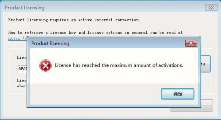
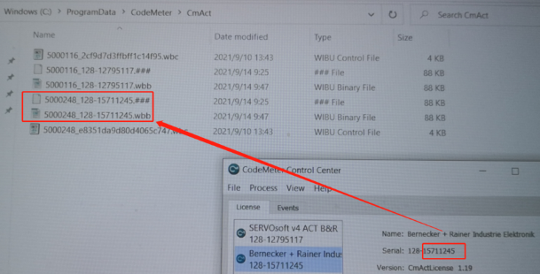
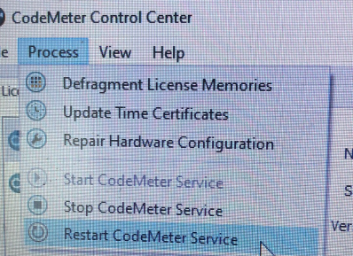

# 016AS软件试用期到期了就不能重新激活了吗？
## 现象
- AS软件使用试用期到期，提示 License has reached the maximum amount of activations.

## 解决方式
- 在这个目录下`C:ProgramData\CodeMeter\CmAct`,删除注册过的文件就可以了。
    - 
- 在codemeter control center里，看看你注册过的号，然后在文件里删除对应的注册文件
- 重启codemeter就可以重新注册了。
    - 