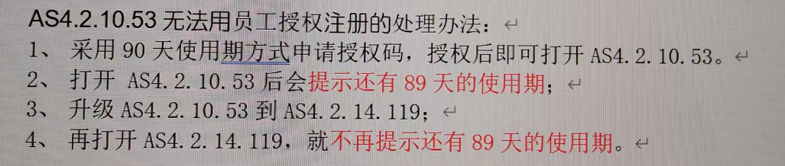

- [1 C02.044.AS4.2.10.53无法使用员工授权注册的处理办法](#_1-c02044as421053%E6%97%A0%E6%B3%95%E4%BD%BF%E7%94%A8%E5%91%98%E5%B7%A5%E6%8E%88%E6%9D%83%E6%B3%A8%E5%86%8C%E7%9A%84%E5%A4%84%E7%90%86%E5%8A%9E%E6%B3%95)
- [2 解决方案](#_2-%E8%A7%A3%E5%86%B3%E6%96%B9%E6%A1%88)

# 1 C02.044.AS4.2.10.53无法使用员工授权注册的处理办法

# 2 解决方案

- 
