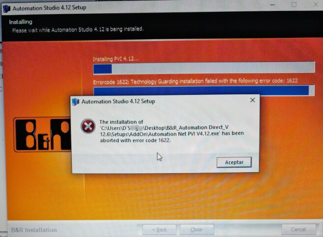

> Tags: #AS安装

# C02.032.安装AS4.12软件时提示报错1622

- 在Win 10 Pro操作系统上安装AS4.12报错，提示1622
- 

# 解决方式

- Windows操作系统的用户名中包含了一个特殊字符反引号 `
- 可以考虑将软件安装包与AS软件安装路径放置在C盘根目录下自行创建的文件夹中，而不是放在桌面Desktop等区域。

# 更新日志

| 日期                             | 修改人 | 修改内容 |
| :----------------------------- | :-- | :--- |
| 2024-08-07 | YZY | 初次创建 |
