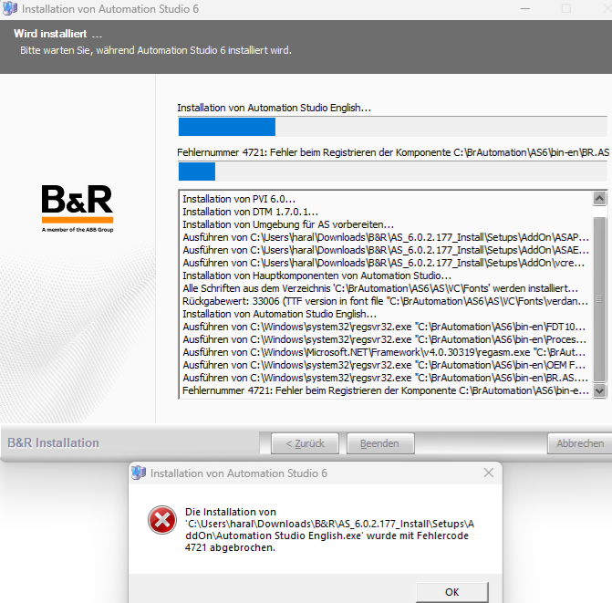

> Tags: #tag待补充

- [1 C02.034.安装AS6时报错4721](#_1-c02034%E5%AE%89%E8%A3%85as6%E6%97%B6%E6%8A%A5%E9%94%994721)
- [2 解决方式一](#_2-%E8%A7%A3%E5%86%B3%E6%96%B9%E5%BC%8F%E4%B8%80)
- [3 解决方式二](#_3-%E8%A7%A3%E5%86%B3%E6%96%B9%E5%BC%8F%E4%BA%8C)
- [4 更新日志](#_4-%E6%9B%B4%E6%96%B0%E6%97%A5%E5%BF%97)

# 1 C02.034.安装AS6时报错4721

- 安装 AS6.0 时报错4721。
- 
- 已尝试以管理员身份运行、停用防火墙和防病毒+运行设置，均无效。

# 2 解决方式一

- 尝试将文件解压到文件路径中没有 **&** 的不同文件夹。

# 3 解决方式二

- Windows系统异常，重装Windows 系统后解决。

# 4 更新日志

| 日期                             | 修改人 | 修改内容 |
| :----------------------------- | :-- | :--- |
| 2025-01-14 | YZY | 初次创建 |
