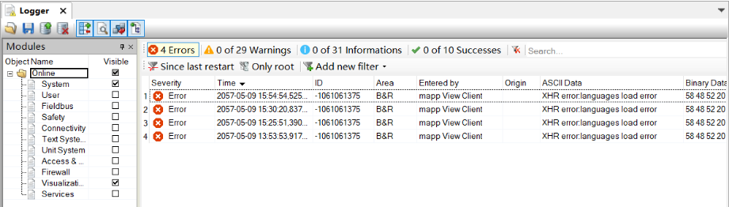

> Tags: #mappView

# -1061061375

# 现象一：XHR error languages load error

- 新设备，设备访问mappView失败，提示Client initialization failed
- Logger中可见报错内容提示 XHR error languages load error
- 

## 解决方式

- 修正PLC与访问设备（例如Windows）的系统时间

# 现象二：XHR error:undefined

- 
- 

## 解决方式

- PLC与Windows时间均调整正确即可。
