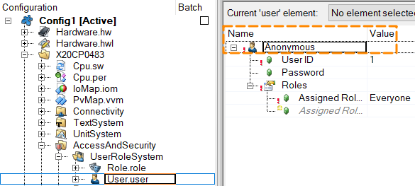

> Tags: #OPC_UA

# -1061091026

- AS Help提示信息
- 描述
    - 与配置的OPC UA服务器的连接失败。
- 原因和解决方案
    - 查看状态，例如：
        - BadResourceUnavailable（=无法获取特定操作所需的系统资源）
        - BadTooManySessions（=已达到 OPC UA 服务器的并发 OPC UA 会话限制）
            - 检查 OPC UA 服务器是否正在运行以及是否配置正确。
        - 检查指定的 OPC UA 服务器连接是否配置正确。
        - 尝试使用第三方软件“UaExpert”客户端建立连接。

# 案例

- 现象
    - 客户需要使用匿名用户，但当尝试以匿名身份登录时，他收到错误：错误：-1061091026 连接到配置的 OPC UA 服务器（服务器别名：“”）失败。状态：BadUserAccessDenied。
- 原因
    - 需要在 OPC UA 配置中启用匿名模式，同时需要有一个名为 Anonymous 的现有用户。
- 解决方式
    - 确认原本默认在的Anonymous 用户存在
    - 

# 更新日志

| 日期                             | 修改人 | 修改内容 |
| :----------------------------- | :-- | :--- |
| 2024-07-28 | YZY | 初次创建 |
