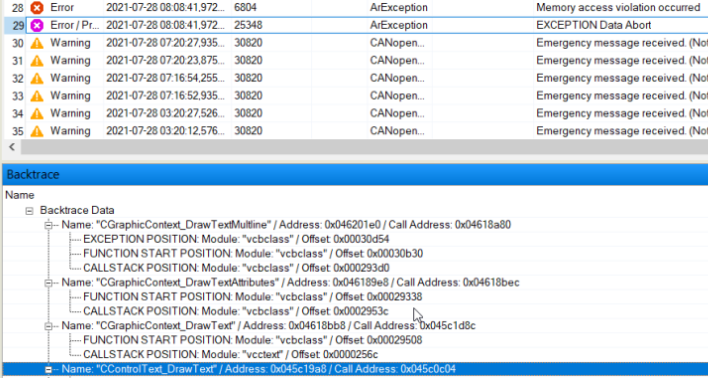

# 现象

# 解决方式
- 解决方案是转到 AS 中的设置：Project -> Change Runtime Version -> Build -> GCC Version：V6.3.0（您可能  
有旧版本 V4.1.2）  
  
- 这应该会有所帮助。这是新的ARM处理器架构的问题，较新的GCC编译器将有助于解决此问题。

## 经典原因
- 当数据从/到一个非法地址加载或存储时发生。
- 这个错误的主要原因是使用无效值的内存引用的访问（ANSI C：指针，IEC：动态变量（REFERENCE TO））。通常情况下，内存引用没有被初始化，但也可能是（无意的）覆盖引用的问题。
- 当浮点单元试图访问没有对齐到4字节的数据时，也会发生这个错误

## 经典解决方式
- 检查源代码，分析Backtrace