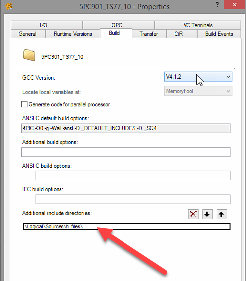

> Tags: #c
- [1 报错 2784 File not found - probably because of…](#_1-%E6%8A%A5%E9%94%99-2784-file-not-found---probably-because-of)
- [2 解决方式一设置全局头文件查询路径](#_2-%E8%A7%A3%E5%86%B3%E6%96%B9%E5%BC%8F%E4%B8%80%E8%AE%BE%E7%BD%AE%E5%85%A8%E5%B1%80%E5%A4%B4%E6%96%87%E4%BB%B6%E6%9F%A5%E8%AF%A2%E8%B7%AF%E5%BE%84)
- [3 解决方式二对单独任务添加头文件路径](#_3-%E8%A7%A3%E5%86%B3%E6%96%B9%E5%BC%8F%E4%BA%8C%E5%AF%B9%E5%8D%95%E7%8B%AC%E4%BB%BB%E5%8A%A1%E6%B7%BB%E5%8A%A0%E5%A4%B4%E6%96%87%E4%BB%B6%E8%B7%AF%E5%BE%84)
- [4 贝加莱头文件说明](#_4-%E8%B4%9D%E5%8A%A0%E8%8E%B1%E5%A4%B4%E6%96%87%E4%BB%B6%E8%AF%B4%E6%98%8E)

# 1 报错 2784 File not found - probably because of…

- 编译时，弹出错误2784，怎么办？
- 错误在于，它没有识别到C文件。所以路径必须被添加到Build参数中。
- 在这里，我可以看到我已经做了#include ......但即使如此，在编译时也没有看到它。
- 

# 2 解决方式一设置全局头文件查询路径

- 有必要添加文件的路径，如下所示:
- 

# 3 解决方式二对单独任务添加头文件路径

- 

# 4 贝加莱头文件说明

- 定义、声明和宏可以存储在头文件中。可以使用 `#include` 命令从任何C文件访问宏
    - 
- 其中，头文件 “plc. h” 包含函数 `_INIT`、`_CYCLIC` 和 `_EXIT` 的宏定义。为了将语言扩展用于自动化，必须使用预处理器语句 `#include` 将它们集成到C文件中
    - 头文件位于Automation Studio目录中：.\AS\GnuInst\V4.1.2\i386-elf\include\bur\plc.h
    - 
    - 
- 系统会按下图所示顺序在以下目录中搜索文件 "filename.h"
    - 以下内容适用于在 ANSI C 中使用 `#include "filename.h"` ：
        - 1___ 包含 `#include` 语句的文件所在的目录
        - 2___ INCLUDE程序对象属性中定义的目录（C编译选项卡列表）
            - 
        - 3___ 导入到项目中的库中的项目目录。例如，如果已向项目中添加了库“runtime”和“standard”，则将搜索以下目录：
            - 
        - 4___ INCLUDE在项目设置中定义的目录（C编译选项卡列表）
            - 
        - 5___ GNU编译器中的标准INCLUDE目录：.\AS\GnuInst\i386-elf\include
            - 
    - 以下内容适用于在 ANSI C 中使用 `#include <filename.h>` ：
        - 除了第 1 项不适用外，其顺序与上图所示相同
