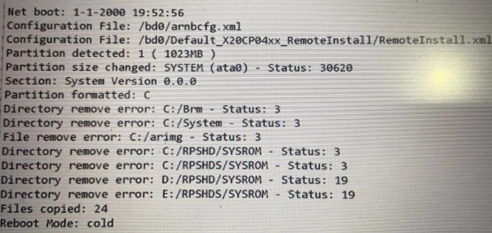

> Tags: #更新

# 30620

- 使用 [002贝加莱PLC通过U盘更新程序](../C04_现场维运/002贝加莱PLC通过U盘更新程序.md) 对 X20CP0483 进行U盘更新，发现更新不上去，查看U盘中的Log文件，可见如下信息
- 
- Partition size changed: SYSTEM (ata0) - Status: 30620

# 原因与解决方式

- X20CP0483的底座插错了，重新确认型号后重新拔插后解决。

# 更新日志

| 日期         | 修改人        | 修改内容 |
| :--------- | :--------- | :--- |
| 2024-08-21 | LXW YZY | 初次创建 |
