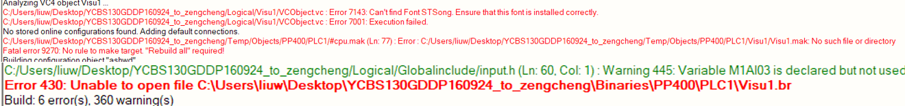
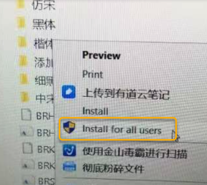

> 430,7143,7001

> #VC4 #字体

- [1 问题描述](#1%20%E9%97%AE%E9%A2%98%E6%8F%8F%E8%BF%B0)
- [2 问题原因](#2%20%E9%97%AE%E9%A2%98%E5%8E%9F%E5%9B%A0)
- [3 解决方法](#3%20%E8%A7%A3%E5%86%B3%E6%96%B9%E6%B3%95)
- [4 VC4下如何新增字体](#4%20VC4%E4%B8%8B%E5%A6%82%E4%BD%95%E6%96%B0%E5%A2%9E%E5%AD%97%E4%BD%93)

# 1 问题描述

- 编译时显示如下报警430，7143，7001
- 

# 2 问题原因

- 画面字体没有找到

# 3 解决方法

- 打开画面时，会自动提示缺少的字体，更换成已经安装的字体或者安装字体后再打开编译。
- 字体安装：找到下载后的字体安装文件，右键选“安装到全部用户”。然后需要重启电脑。注意：通过复制粘贴到字体文件夹这种方式不能使用
- 

# 4 VC4下如何新增字体

- [013VC4画面中文字体如何显示加粗效果](../B07_技术_人机操作/013VC4画面中文字体如何显示加粗效果.md)
