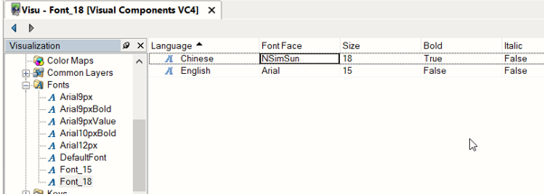
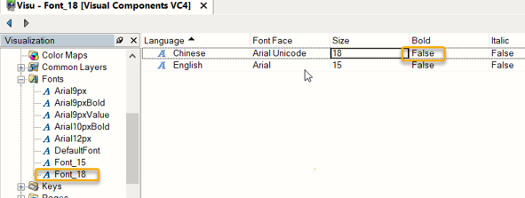
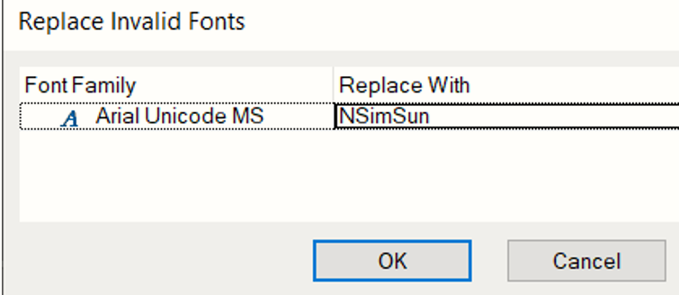

# 444
## 问题描述
- 之前旧电脑创建的AS4.5版本的程序，用新电脑AS4.7打开，编码没有报错，下载时提示报警代码444.
## 问题原因
- 字体Arial Unicode的粗体样式不可用。需要更改为常规字体样式。
## 解决办法
- 1,Arial Unicode字体替换成NSimSUN字体.
    - 
- 2,或者把Arial Unicode粗体去掉
    - 
- 总结：一般打开VC4画面后编译，可以避免
    - 
