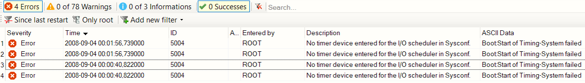
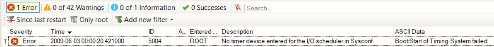

# 5004
## 问题描述：
- 系统蓝屏，进入service，logger里报错5004没找到时钟基准，时钟基准选的是PLK的时钟。

## 问题原因：
- 报警原因可能有两个：
    - 一是通讯卡配置不正确，程序里配置的是IF789.9-1,实际是IF789.9。
    - 二是通讯卡有故障，需要更换。
- 
- 

## 解决方案：
- 通讯卡实际安装与程序配置否一致，如果一致，需要更换通讯卡