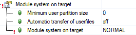
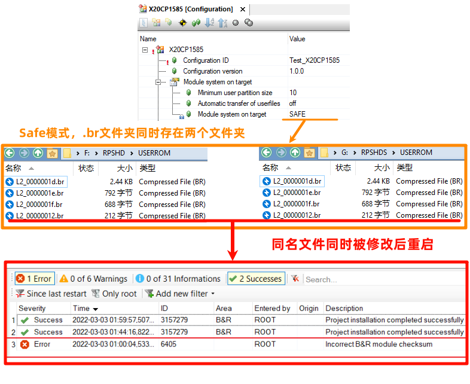

> 6405

- [1 报错说明](#1%20%E6%8A%A5%E9%94%99%E8%AF%B4%E6%98%8E)
	- [1.1 原因](#1.1%20%E5%8E%9F%E5%9B%A0)
- [2 解决方式](#2%20%E8%A7%A3%E5%86%B3%E6%96%B9%E5%BC%8F)
- [3 案例说明](#3%20%E6%A1%88%E4%BE%8B%E8%AF%B4%E6%98%8E)
	- [3.1 Module system on target 参数为 NORMAL](#3.1%20Module%20system%20on%20target%20%E5%8F%82%E6%95%B0%E4%B8%BA%20NORMAL)
		- [3.1.1 可能的原因](#3.1.1%20%E5%8F%AF%E8%83%BD%E7%9A%84%E5%8E%9F%E5%9B%A0)
	- [3.2 Module system on target 参数为 Safe](#3.2%20Module%20system%20on%20target%20%E5%8F%82%E6%95%B0%E4%B8%BA%20Safe)

# 1 报错说明

- Incorrect B&R module checksum

## 1.1 原因

- B&R 模块中存储了预先计算的模块内容校验和。在启动过程中，将重新计算模块内容的校验和，并与存储的校验和进行比较。如果这些值不匹配（如果未保持模块一致性），则输出错误信息。

# 2 解决方式

- 通过执行 initial installation 重新安装目标系统。

# 3 案例说明

## 3.1 Module system on target 参数为 NORMAL

- 

### 3.1.1 可能的原因

- 项目中有内存溢出操作，例如memcpy，strcat，strcpy操作，改写了代码段的代码。即会出现6405报警。

## 3.2 Module system on target 参数为 Safe

- 
