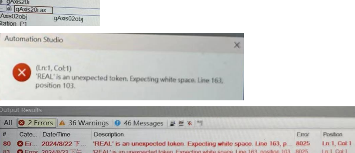
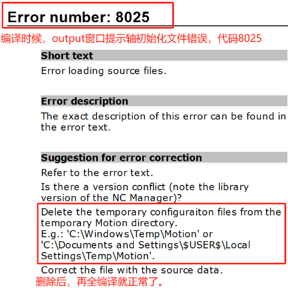

> Tags: #AS

# 8025

# 现象一

- 编译时候，output窗口提示轴初始化文件错误，代码8025

# 现象二

- 打开轴控的.ax文件，即会报错弹出 `'REAL' is an unexpected token, Expecting white space ` 报错框
- 

# 解决方式

- 

# 更新日志

| 日期         | 修改人        | 修改内容 |
| :--------- | :--------- | :--- |
| 2024-08-21 | LFW YZY | 初次创建 |
