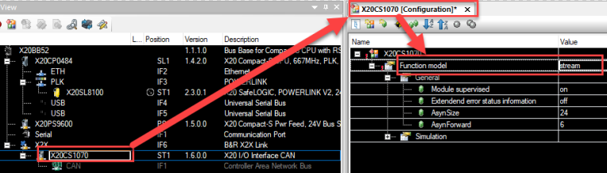

# 现象
- 来自CAN_Lib库的FUB CANopen返回状态8817 - "没有找到CAN控制器：FBK CANopen / CANMulOpen的设备字符串有错误，或者CAN控制器没有准备好（硬件可能不存在）"。
- 从错误的描述来看，似乎是设备字符串不正确。当然，情况可能是这样的，但也可能有其他原因。

# 原因
- FUB是与X20CS1070卡一起使用的。当使用CAN_Lib库时，必须选择功能模型 "Stream"。没有CAN库与函数模型 Flat一起工作（见Ticket 400095509）
- 

