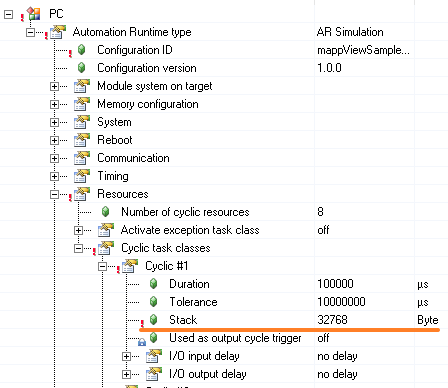
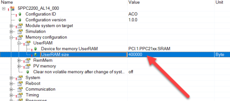
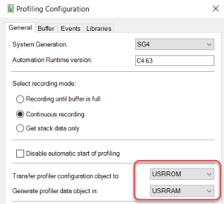
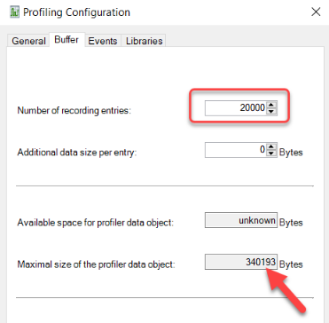

# 现象
每次看门狗watch dog发生时，永久变量都会丢失。

# 看门狗Watch Dog错误描述（9206） 
硬件看门狗触发PLC重启
硬件看门狗已经触发了PLC的重启。由硬件看门狗触发的重启是一种难以诊断的错误，通常是由应用程序中的编程错误引起的。

硬件看门狗是一个硬件组件，用于检查PLC和运行在其上的软件是否工作。软件周期性地触发硬件看门狗。如果硬件看门狗没有被及时触发，说明PLC没有正常工作，通过重启建立一个确定的状态。

不能保证在由硬件看门狗触发的重启过程中，所有的剩存或永久数据都能正确存储。因此，有可能在重启期间重新初始化留存和永久PV，并在记录仪Logger中输入相应的警告。

在硬件看门狗之后，PLC根据复位后的启动行为的配置启动。成功的启动由记录仪中的以下警告之一来确认。 
> -   设置"Warm restart": 9212 Warning: Warm restart after watchdog or manual RESET
> -   设置 "Cold restart": 9211 Warning: Cold restart after watchdog or manual RESET
> -   设置 "Service": 9210 Warning: Stop/Service after watchdog or manual RESET
> -   设置 "Diagnosis": 9214 Warning: Diagnosis after watchdog or manual RESET

## 以下是由硬件看门狗触发重启的最常见原因
- 应用程序中的编程错误导致系统数据被覆盖，从而不能再正常工作。如果应用程序是用C语言编写的，而对地址进行操作的函数（strcpy、memcpy等）被错误地调用，往往会发生这种错误。
- 为任务类配置的堆栈太小。如果应用程序中有许多嵌套的函数调用（如递归），或者在C语言程序中创建大量的数据作为自动变量（即在堆栈中），就会发生这种情况。
    - 
- CPU的硬件有问题，比如卡存在松动。
- 超出硬件允许的使用环境，例如环境温度上限或下限。
- 有严重问题的Automation Runtime版本
- 检查所有电缆、接地和屏蔽。在某些情况下，看门狗可能是由干扰引起的。
- AR中剩余内存过少。需要确保剩余内存在10MB以上。

# 建议解决方式
- 由硬件看门狗触发的错误最常见的原因是应用程序的错误。如果错误是可重复的，可以用Profiler来确定触发的程序，通过分析剖析器Profiler，看在硬件看门狗事件发生前最后运行的是哪个程序。
## Profiler设置
- 为了在硬件看门狗触发的重启事件中也能使用剖析器Profiler，剖析器Profiler必须被配置为将数据对象存储在USERRAM中（如果PLC上有的话）。
- 
- 设置为将配置保存到 USRRAM 并将数据保存到 USRRAM
- 
- 增加Profiler的记录条目数量
- 
## 应用程序检查
应用程序应检查其功能是否正确。为此，可以实施检查程序和测试，或者通过代码审查检查程序。应特别关注以下程序。
- 一般的C程序。与IEC程序相反，C程序中使用了大量的指针和地址。这使得由于错误的编程而导致硬件看门狗触发的重启变得更加容易。
- 用地址或指针操作的程序。特别是像strcpy或memcpy这样的函数，如果使用不当，会导致硬件看门狗的重启。
- 处理数组的程序。写入索引过大的数组可能导致硬件看门狗的重启。使用IECCheck库可以用来发现IEC程序中的这些类型的错误。
- 由于递归或大型自动变量而需要大量堆栈的程序。对于这些程序，可以增加堆栈来检查硬件看门狗触发的重启是否仍然发生。

## 更换硬件
如果由硬件看门狗触发的重启第一次发生在未改变的应用程序中，并且这些程序已经在现场进行了很好的测试，如果错误只发生在一个PLC上，而没有发生在相同设计的其他PLC上，那么就应该更换该PLC。

