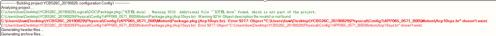
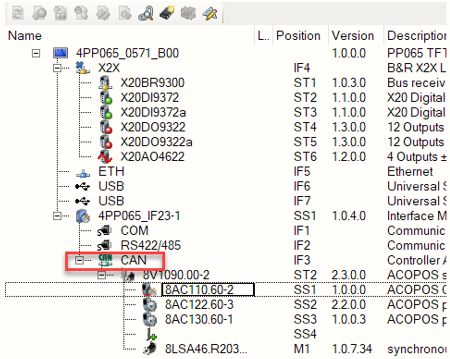
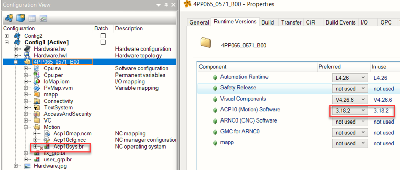
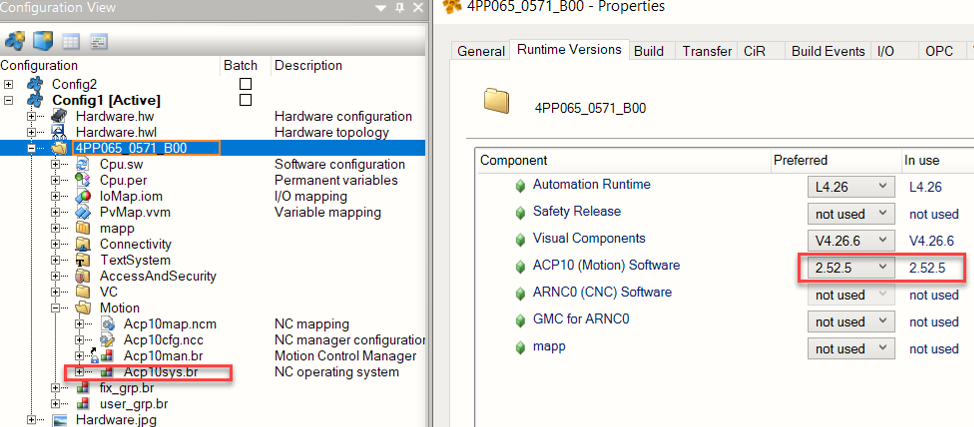

# 9217
## 问题描述
- AS4.2,通过CAN控制伺服，编译报警9217
- 
## 问题原因
- 1. ACP10软件从V3.10.0上只能用于与POWERLINK网络的SG4目标系统，ID#443215 : Important Information
- 2. 因为程序伺服采用的是CAN通讯，需要采用V3.10.0以下版本
- 
- 
## 解决方案
- 更改ACP10版本（降低版本，因为是CAN通讯，ACP10版本需要低于V3.10.0）
- 
