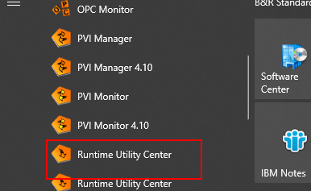
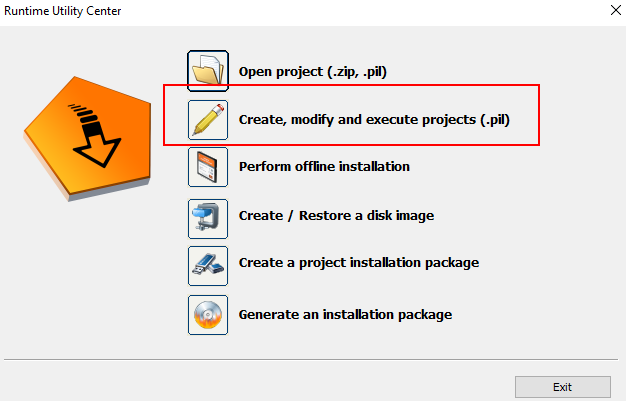
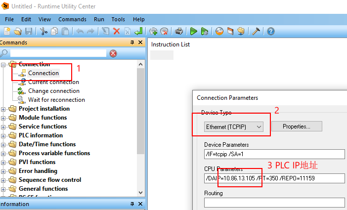
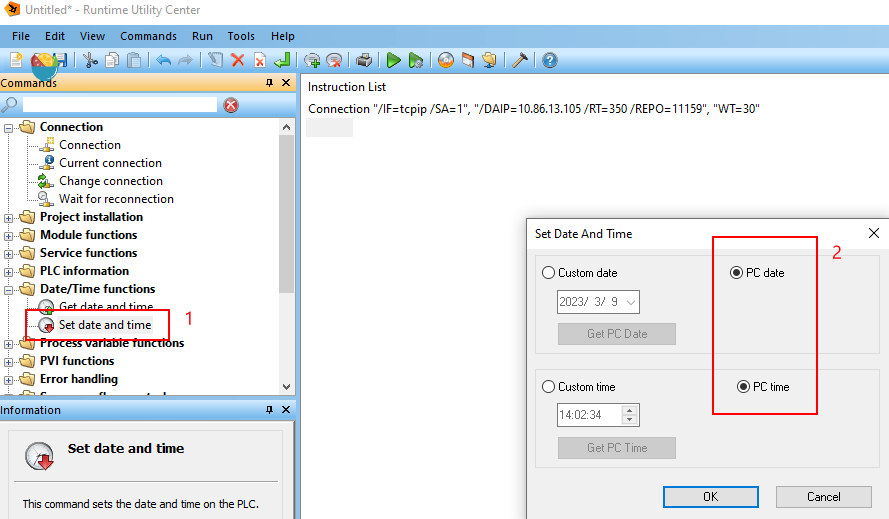
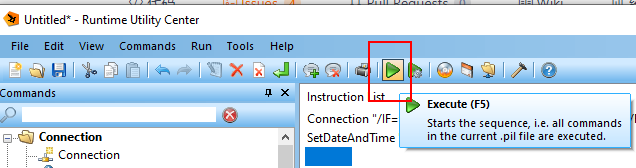

## 目的
- 在没有安装Automation Studio软件的情况下，如何给PLC对时

## 所需软件
- 需要在电脑上安装PVI软件
- 贝加莱官网下载链接：
    - [PVI Development Setup | B&R Industrial Automation (br-automation.com)](https://www.br-automation.com/en/downloads/software/automation-netpvi/pvi-development-setup/)
    - 路径：`Home - Downloads - SoftwareAutomation - NET/PVI`

## 操作步骤
- 1. 安装完成PVI软件后，找到Runtime Utility Center
- 
- 2. 选择Create, modify and execute projects （.pil）
- 
- 3. 选择连接PLC，选择TCPIP后，再编辑需要连接的PLC的IP地址，以及对应的端口号（默认11159，如果通不上换成11169）
- 
- 4. 选择Set date and time, 选择正确的日期与时间
- 
- 5. 点击执行按钮
- 

