> Tags: #U盘 #更新 #X20CP1381

> ⭐ 现场操作，仅需要看 **⭐ 6 USB更新方式**

- [1 C04.002-贝加莱PLC通过U盘更新程序](#_1-c04002-%E8%B4%9D%E5%8A%A0%E8%8E%B1plc%E9%80%9A%E8%BF%87u%E7%9B%98%E6%9B%B4%E6%96%B0%E7%A8%8B%E5%BA%8F)
- [2 贝加莱PLC通过U盘更新程序](#_2-%E8%B4%9D%E5%8A%A0%E8%8E%B1plc%E9%80%9A%E8%BF%87u%E7%9B%98%E6%9B%B4%E6%96%B0%E7%A8%8B%E5%BA%8F)
- [3 烧卡包制作_更新准备操作](#_3-%E7%83%A7%E5%8D%A1%E5%8C%85%E5%88%B6%E4%BD%9C_%E6%9B%B4%E6%96%B0%E5%87%86%E5%A4%87%E6%93%8D%E4%BD%9C)
- [4 烧卡包制作_AR4.2及以下更新包准备方式](#_4-%E7%83%A7%E5%8D%A1%E5%8C%85%E5%88%B6%E4%BD%9C_ar42%E5%8F%8A%E4%BB%A5%E4%B8%8B%E6%9B%B4%E6%96%B0%E5%8C%85%E5%87%86%E5%A4%87%E6%96%B9%E5%BC%8F)
	- [4.1 若Automation Studio版本为4.3及以上：](#_41-%E8%8B%A5automation-studio%E7%89%88%E6%9C%AC%E4%B8%BA43%E5%8F%8A%E4%BB%A5%E4%B8%8A%EF%BC%9A)
	- [4.2 若Automation Studio版本为4.2:](#_42-%E8%8B%A5automation-studio%E7%89%88%E6%9C%AC%E4%B8%BA42)
- [5 烧卡包制作_AR4.3及以上更新包准备方式](#_5-%E7%83%A7%E5%8D%A1%E5%8C%85%E5%88%B6%E4%BD%9C_ar43%E5%8F%8A%E4%BB%A5%E4%B8%8A%E6%9B%B4%E6%96%B0%E5%8C%85%E5%87%86%E5%A4%87%E6%96%B9%E5%BC%8F)
- [6 USB更新方式](#_6-usb%E6%9B%B4%E6%96%B0%E6%96%B9%E5%BC%8F)
	- [6.1 准备一个U盘](#_61-%E5%87%86%E5%A4%87%E4%B8%80%E4%B8%AAu%E7%9B%98)
	- [6.2 正常更新方式](#_62-%E6%AD%A3%E5%B8%B8%E6%9B%B4%E6%96%B0%E6%96%B9%E5%BC%8F)
	- [6.3 强制更新方式](#_63-%E5%BC%BA%E5%88%B6%E6%9B%B4%E6%96%B0%E6%96%B9%E5%BC%8F)
		- [6.3.1 X20CP138x 系列 | X20CP04xx 系列 | X20CPx68x 系列](#_631-x20cp138x-%E7%B3%BB%E5%88%97--x20cp04xx-%E7%B3%BB%E5%88%97--x20cpx68x-%E7%B3%BB%E5%88%97)
		- [6.3.2 X20CPx58x 系列](#_632-x20cpx58x-%E7%B3%BB%E5%88%97)
- [7 常见问题](#_7-%E5%B8%B8%E8%A7%81%E9%97%AE%E9%A2%98)
	- [7.1 PLC更新时不停重启，PLC的R灯不能停在常亮状态](#_71-plc%E6%9B%B4%E6%96%B0%E6%97%B6%E4%B8%8D%E5%81%9C%E9%87%8D%E5%90%AF%EF%BC%8Cplc%E7%9A%84r%E7%81%AF%E4%B8%8D%E8%83%BD%E5%81%9C%E5%9C%A8%E5%B8%B8%E4%BA%AE%E7%8A%B6%E6%80%81)
	- [7.2 USB 更新程序时，PLC 不停的重启](#_72-usb-%E6%9B%B4%E6%96%B0%E7%A8%8B%E5%BA%8F%E6%97%B6%EF%BC%8Cplc-%E4%B8%8D%E5%81%9C%E7%9A%84%E9%87%8D%E5%90%AF)
	- [7.3 Q:使用AS4.6，生成U盘烧卡包，选择如下选项，无论如何做也无法更新当前运行K4.26的PLC](#_73-q%E4%BD%BF%E7%94%A8as46%EF%BC%8C%E7%94%9F%E6%88%90u%E7%9B%98%E7%83%A7%E5%8D%A1%E5%8C%85%EF%BC%8C%E9%80%89%E6%8B%A9%E5%A6%82%E4%B8%8B%E9%80%89%E9%A1%B9%EF%BC%8C%E6%97%A0%E8%AE%BA%E5%A6%82%E4%BD%95%E5%81%9A%E4%B9%9F%E6%97%A0%E6%B3%95%E6%9B%B4%E6%96%B0%E5%BD%93%E5%89%8D%E8%BF%90%E8%A1%8Ck426%E7%9A%84plc)
	- [7.4 Q:如何判断U盘更新状态，如果失败，如何获取信息用于诊断？](#_74-q%E5%A6%82%E4%BD%95%E5%88%A4%E6%96%ADu%E7%9B%98%E6%9B%B4%E6%96%B0%E7%8A%B6%E6%80%81%EF%BC%8C%E5%A6%82%E6%9E%9C%E5%A4%B1%E8%B4%A5%EF%BC%8C%E5%A6%82%E4%BD%95%E8%8E%B7%E5%8F%96%E4%BF%A1%E6%81%AF%E7%94%A8%E4%BA%8E%E8%AF%8A%E6%96%AD%EF%BC%9F)
	- [7.5 Q:AS4.2下生成USB更新包更新成功的日志信息](#_75-qas42%E4%B8%8B%E7%94%9F%E6%88%90usb%E6%9B%B4%E6%96%B0%E5%8C%85%E6%9B%B4%E6%96%B0%E6%88%90%E5%8A%9F%E7%9A%84%E6%97%A5%E5%BF%97%E4%BF%A1%E6%81%AF)
	- [7.6 Q: 如果PLC被RESET重置，但没有插U盘，是什么表现](#_76-q-%E5%A6%82%E6%9E%9Cplc%E8%A2%ABreset%E9%87%8D%E7%BD%AE%EF%BC%8C%E4%BD%86%E6%B2%A1%E6%9C%89%E6%8F%92u%E7%9B%98%EF%BC%8C%E6%98%AF%E4%BB%80%E4%B9%88%E8%A1%A8%E7%8E%B0)
	- [7.7 Q: AR4.33以上操作系统生成USB更新包，四个选项的含义](#_77-q-ar433%E4%BB%A5%E4%B8%8A%E6%93%8D%E4%BD%9C%E7%B3%BB%E7%BB%9F%E7%94%9F%E6%88%90usb%E6%9B%B4%E6%96%B0%E5%8C%85%EF%BC%8C%E5%9B%9B%E4%B8%AA%E9%80%89%E9%A1%B9%E7%9A%84%E5%90%AB%E4%B9%89)
	- [7.8 Q: 更新失败，日志中提示30620](#_78-q-%E6%9B%B4%E6%96%B0%E5%A4%B1%E8%B4%A5%EF%BC%8C%E6%97%A5%E5%BF%97%E4%B8%AD%E6%8F%90%E7%A4%BA30620)
- [8 更新日志](#_8-%E6%9B%B4%E6%96%B0%E6%97%A5%E5%BF%97)

# 1 C04.002-贝加莱PLC通过U盘更新程序

# 2 贝加莱PLC通过U盘更新程序

- 对贝加莱PLC 进行程序更新，除通过AS软件在线下装外，贝加莱还提供了多种通过离线包更新程序的方式，其中就包括离线包烧卡更新、离线包网络更新、U盘更新等。
- 贝加莱紧凑型PLC无法使用CF卡，因此，为便于现场维护使用与程序备份，推荐使用USB更新方式实现程序更新，而由于AS软件版本的迭代与更新，在不同场景下，需要使用不同的方式制作与使用USB更新方式，需特别注意，操作系统Automation Runtime不同，开发软件Automation Studio软件版本，更新包准备方式不同，尤其需要注意AS4.2，AS4.3之间的区别。
- 下表中列举出当前贝加莱可被USB更新的PLC设备型号。

| **型号**|**照片** | **特点**                                       |
|---------------------------------|-------------------------------------------------|------------------------------------------------|
| X20CP1301, X20CP1381 X20CP1382| 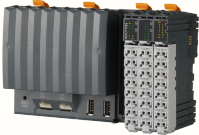 |无CF卡槽 内置存储闪存|
| X20CP168x X20CP158x             | 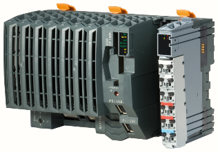 | 有CF卡槽 X20CP168x可拨码选择使用内置存储闪存   |
| X20CP358x  X20CP368x            | 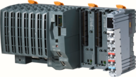 | 有CF卡槽 X20CP368x可拨码选择使用内置存储闪存   |
| X20CP041x X20CP048x| 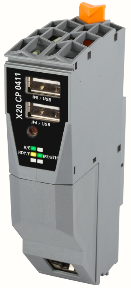 |无 CF 卡槽内置存储闪存|
|xPC2200|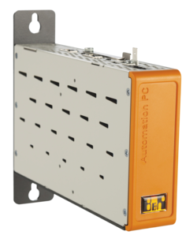|有CFast卡 |

# 3 烧卡包制作_更新准备操作

- 1___. 对U盘进行格式化操作：格式化时注意File system选择FAT32
    - 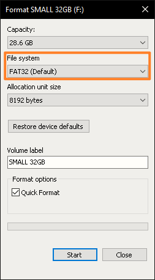
- 2___.需要制作更新包的项目，使用AS软件进行全编译。
    - 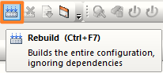
- 3___.在PLC配置里将U盘安装选项激活（若更新前对PLC进行重置Reset，此步骤可省略）
    - 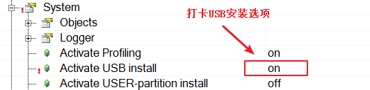
- 4___.由于紧凑型PLC出厂默认IP地址为0.0.0.0，为了便于AS或RUC软件连接，建议将IP地址在项目中手动设置。
    - 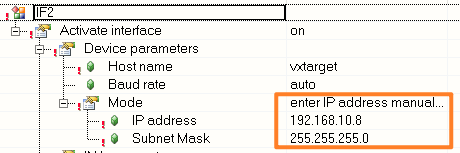

# 4 烧卡包制作_AR4.2及以下更新包准备方式

## 4.1 若Automation Studio版本为4.3及以上：

- 1___.打开Automation Studio软件，点击Project – Project Installation – Generate Project Installation Package按钮：
    - 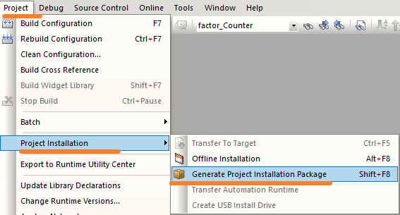
- 2___.进行如下设置：
    - 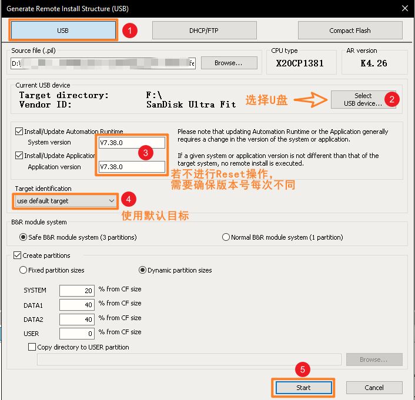
- 3___.等待对U盘的烧录完成，完成后弹出如下弹框。
    - 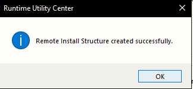
- 4___.U盘中文件如下所示，若需使其他U盘也具有程序更新能力，可将生成在U盘中的文件可复制到其他格式为FAT32的U盘中即可。
    - 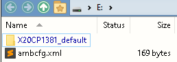

## 4.2 若Automation Studio版本为4.2:

- 1___.点击Tools – Runtime Utility Center
    - 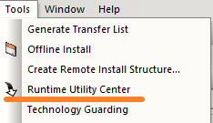
- 2___.在弹出框中选择Greate Project installation package
    - 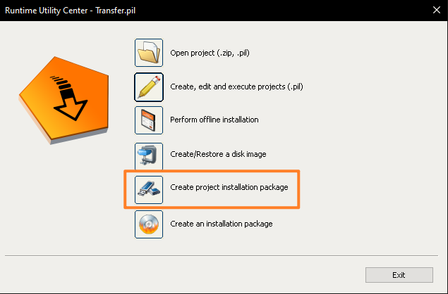
- 3___.进行如下设置：
    - 
- 4___.等待对U盘的烧录完成，完成后弹出如下弹框。
    - 
- 5___.U盘中文件如下所示，若需使其他U盘也具有程序更新能力，可将生成在U盘中的文件可复制到其他格式为FAT32的U盘中即可。
    - 

# 5 烧卡包制作_AR4.3及以上更新包准备方式

- 1___.打开AS软件，选择Project – Project Installation – Generate Project Installation Package
    - 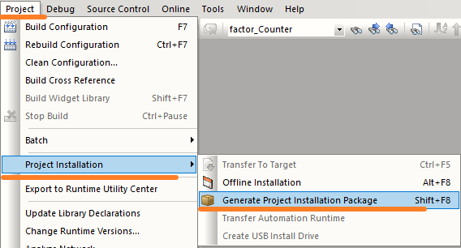
- 2___.选择Generate PIP incl. support of AR < 4.33 选项
    - 🔴 注意！生成的时候选择直接生成到U盘中，即最后一个选项，否则有可能此U盘更新包无法更新成功。
    - 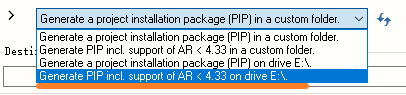
    - AS4.12.5开始只有两个选项，选择直接到U盘的选项
- 3___.确认设置中设置如下所示
    - 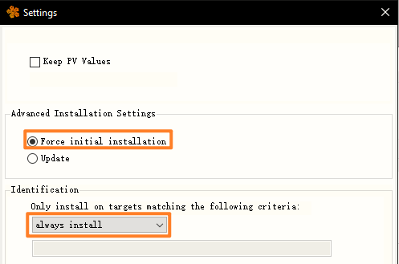
- 4___.有些AS版本显示如下内容：
    - 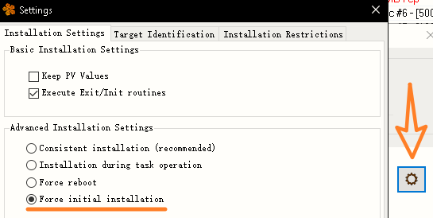
    - 
- 5___.生成U盘更新包
    - 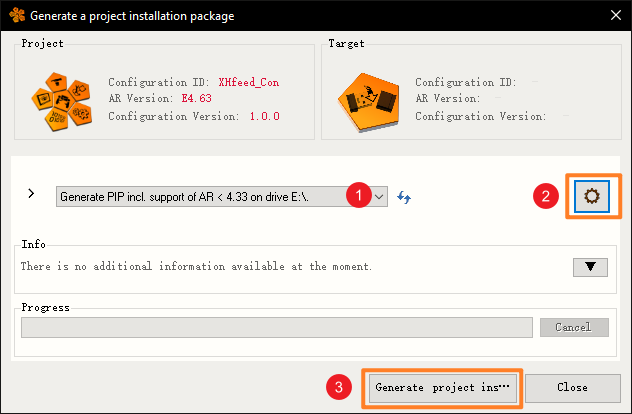
- 6___.生成在U盘中的内容如下，若需使其他U盘也具有程序更新能力，可将生成在U盘中的文件可复制到其他格式为FAT32的U盘中即可。
    - 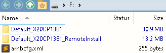

# 6 USB更新方式

## 6.1 准备一个U盘

- ⭐U盘建议选择：
    - 容量：小于等于16GB
    - 磁盘格式：FAT32
        - 
        - 
        - 若U盘过大，Windows系统无法支持格式化为FAT32格式，则可以考虑使用DiskGenius软件格式化，注意簇大小建议设置在4096 bytes/8192 bytes
            - 🔴此类操作不一定成功，仍建议找一个16GB及以下U盘进行更新操作。
            - [大容量U盘怎么格式化成FAT32格式？U盘格式化操作指南 (diskgenius.cn)](https://www.diskgenius.cn/resource/format-udisk-fat32.html)
- U盘中内容
    - 

## 6.2 正常更新方式

- 将 U 盘插在 PLC 的 USB 口上，重启，等待即可。
    - ⚡若更新速度慢，建议将PLC链接的ETH以太网口，PLK口上的链接先断开。
- 以上方式在以下情况下可能失效：
    - 版本号没有变更
    - 全新刚出厂的PLC
    - 高版本操作系统（E4.63）降低至低版本操作系统（K4.26）的更新
    - PLC 原项目没有激活 USB 安装（即 AS 项目配置中的 **Activate USB install** 选项，默认为 off）

## 6.3 强制更新方式

> 📋目的：将 PLC 设置为 BOOT 模式，强制从 U 盘更新程序，若正常更新方式失效则启用此方式，一般在Activate USB install 未开启状态下使用此方式。

### 6.3.1 X20CP138x 系列 | X20CP04xx 系列 | X20CPx68x 系列

- 将U盘插入在PLC的USB口上，PLC复位RESET至BOOT模式操作：
- 找到 PLC 上的 RESET 按钮

| **X20CP138x 系列** | **X20CP04xx 系列** |
| ---- | ---- |
| 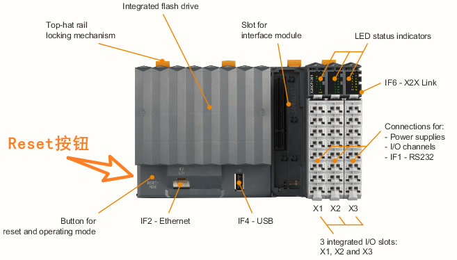 | 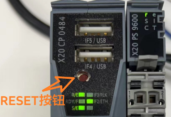 |
| **X20CPx68x 系列** |  |
| 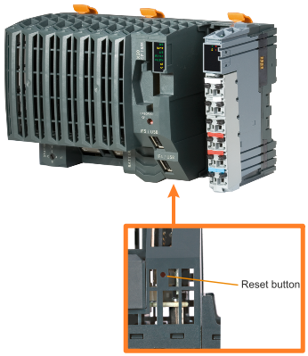 |  |

- 将**先短按**一下该Reset键，看到CP1381右上角的**R灯**亮**红灯**，**立刻松开**Reset键
- 在**2秒钟之内**再**长按**该reset键，直到右上角的**R灯熄灭**，松开Reset键即可
- 等待直到 CPU 启动完成；CPU 启动完成后 R 灯会常亮绿灯，整个过程大概需要5 ~ 10分钟。启动完成后将 USB 盘拔出即可

### 6.3.2 X20CPx58x 系列

- 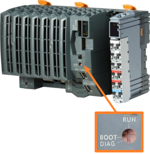
- 将 U 盘插在 PLC 的 USB 口上
- 将 PLC 上的 **Operating mode switch** 拨码的箭头方向拨到 *BOOT* 方向
- 断电上电
- 等待 PLC 的 R/E 灯变化， R/E 灯先全红常亮几秒，再绿色闪烁，再自动重启
    - 情况一：重启后 R/E 灯红灯常亮
        - 等待 R/E 灯常亮 10s 以上没有变化
    - 情况二：不停重启 → 重启时断电 → 拨码到 *RUN* 方向
        - 不停重启，循环R/E灯全红常亮几秒 → 绿色闪烁 → 自动重启
        - 则自动重启时断电（若仍失败，请检查AR与系统配置是否合理）
- PLC的24V断电
- 将 PLC 上的 **Operating mode switch** 拨码的箭头方向拨到 *RUN* 方向
- PLC的24V上电
- 等待 PLC 自动重启几次后，正常更新完成。

> 备注说明：此方案属于强制系统更新，无论原来的程序是否开了 Activate USB install，都可以实现强制程序更新。
> **注意：对于 xPC2200，则无法强制系统更新，若想实现 U 盘更新功能，请务必开启 Activate USB install**

# 7 常见问题

## 7.1 PLC更新时不停重启，PLC的R灯不能停在常亮状态

- 检查PLC的24V供电，是否供电正常，若供电偏低，则会出现此类情况。

## 7.2 USB 更新程序时，PLC 不停的重启

- 需要检查
    - 1.是否项目的配置合理
        - 例如 1GB 大小的 CF 卡，实际项目配置中，USRE 分区却分配了 2GB 的空间
    - 2.Automation Runtime 版本是否合理
        - 如果遇到此类问题，建议使用最新的 Automation Runtime 版本

## 7.3 Q:使用AS4.6，生成U盘烧卡包，选择如下选项，无论如何做也无法更新当前运行K4.26的PLC

- 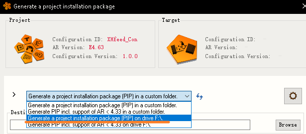
- A:需要选择支持AR\<4.33的选项，否则无法在K4.26这类低版本的操作系统更新。如果选择错误，PLC会重启数次后R灯常亮，程序保持原样。
    - 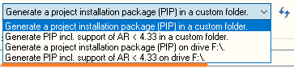
- 在Log中可以看到爆30601错误
    - 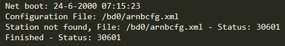
- 需注意，选择Generate Pip incl. Supprt of AR\<4.33 兼容高版本的操作，因此生成U盘包，建议选择此选项，生成的U盘内容如下：
    - 
- 正常更新的Log信息大致如下：
    - 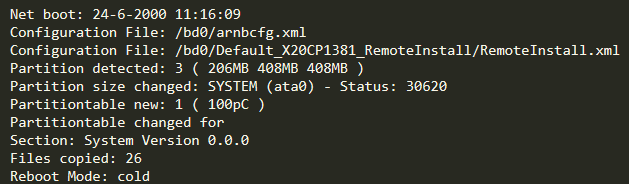

## 7.4 Q:如何判断U盘更新状态，如果失败，如何获取信息用于诊断？

- A:
    - U盘中自动生成log文件
    - 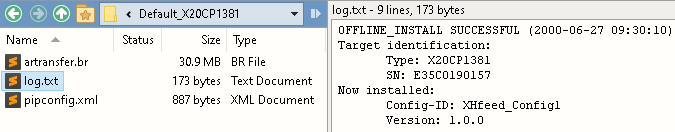
    - 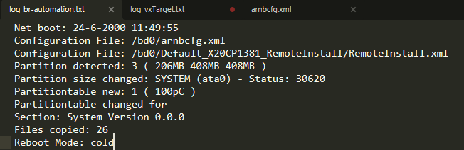

## 7.5 Q:AS4.2下生成USB更新包更新成功的日志信息

- A:
    - 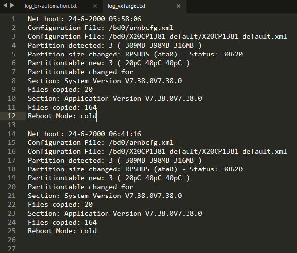

## 7.6 Q: 如果PLC被RESET重置，但没有插U盘，是什么表现

- 如果PLC没有插入U盘，则PLC会呈现如下状态，运行系统初始操作系统，断电上电后恢复正常。
    - 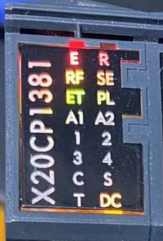
    - 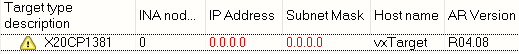

## 7.7 Q: AR4.33以上操作系统生成USB更新包，四个选项的含义

- 
- 选项1与选项2均生成烧卡包文件至一个指定文件夹
- 选项3与**选项4**生成烧卡包文件至U盘。
- 选项1与选项3生成的内容完全相同，选项2与选项4生成的内容完全相同。
- 选项1与选项3生成的烧卡包不能在AR < 4.33的PLC上运行更新流程。
- 选项2与**选项4**生成的烧卡包支持在 AR < 4.33的 PLC 上运行更新流程，并支持高版本 AR 的 PLC 上运行更新流程。

> 🔴建议选择 **选项4** 选项，其他选项不要使用。

## 7.8 Q: 更新失败，日志中提示30620

- [30620](../C03_故障码问题定位/30620.md)

# 8 更新日志

| 日期         | 修改人 | 修改内容                |
| :--------- | :-- | :------------------ |
| 2023-04-04 | YZY | 初版创建                |
| 2024-07-05 | YZY | 更新X20CP1585系列U盘更新方式 |
