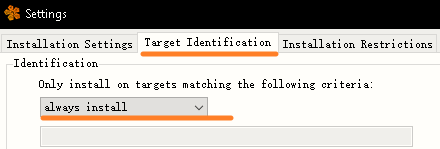

# 目录

[TOC]

# 一、背景说明

- 对贝加莱PLC 进行程序更新，除通过AS软件在线下装外，贝加莱还提供了多种通过离线包更新程序的方式，其中就包括离线包烧卡更新、离线包网络更新、U盘更新等。

- 贝加莱紧凑型PLC无法使用CF卡，因此，为便于现场维护使用与程序备份，推荐使用USB更新方式实现程序更新，而由于AS软件版本的迭代与更新，在不同场景下，需要使用不同的方式制作与使用USB更新方式，需特别注意，操作系统Automation Runtime不同，开发软件Automation Studio软件版本，更新包准备方式不同，尤其需要注意AS4.2，AS4.3之间的区别。

- 下表中列举出当前贝加莱可被USB更新的PLC设备型号。

| **型号**                        | **照片**                                        | **特点**                                       |
|---------------------------------|-------------------------------------------------|------------------------------------------------|
| X20CP1301, X20CP1381  X20CP1382 |  | 无CF卡槽 内置存储闪存                          |
| X20CP168x X20CP158x             |  | 有CF卡槽 X20CP168x可拨码选择使用内置存储闪存   |
| X20CP358x  X20CP368x            |  | 有CF卡槽 X20CP368x可拨码选择使用内置存储闪存   |
| X20CP041x X20CP048x             |  | 无CF卡槽 内置存储闪存                          |

# 二、更新准备操作

- 1. 对U盘进行格式化操作：格式化时注意File system选择FAT32。

- 2.需要制作更新包的项目，使用AS软件进行全编译。

- 3.在PLC配置里将U盘安装选项激活（若更新前对PLC进行重置Reset，此步骤可省略）

- 4.由于紧凑型PLC出厂默认IP地址为0.0.0.0，为了便于AS或RUC软件连接，建议将IP地址在项目中手动设置。

# 三、AR4.2及以下更新包准备方式

## a.若Automation Studio版本为4.3及以上：

- 1.打开Automation Studio软件，点击Project – Project Installation – Generate Project Installation Package按钮：

- 2.进行如下设置：

- 3.等待对U盘的烧录完成，完成后弹出如下弹框。

- 4.U盘中文件如下所示，若需使其他U盘也具有程序更新能力，可将生成在U盘中的文件可复制到其他格式为FAT32的U盘中即可。

  

## b.若Automation Studio版本为4.2:

- 1.点击Tools – Runtime Utility Center

- 2.在弹出框中选择Greate Project installation package.

- 3.进行如下设置：

- 4.等待对U盘的烧录完成，完成后弹出如下弹框。

- 5.U盘中文件如下所示，若需使其他U盘也具有程序更新能力，可将生成在U盘中的文件可复制到其他格式为FAT32的U盘中即可。

# 四、AR4.3及以上更新包准备方式

- 1.打开AS软件，选择Project – Project Installation – Generate Project Installation Package.

- 2.选择Generate PIP incl. support of AR \< 4.33 选项

- 3.确认设置中设置如下所示

- 4.有些AS版本显示如下内容：

- 5.生成U盘更新包

- 6.生成在U盘中的内容如下 ，若需使其他U盘也具有程序更新能力，可将生成在U盘中的文件可复制到其他格式为FAT32的U盘中即可。

  

# 五、USB更新方式

-   正常更新方式：将U盘插入在PLC的USB口上，重启，等待即可。
    -   以上方式在以下情况下可能失效：
        -   版本号没有变更
        -   全新刚出厂的PLC
        -   高版本操作系统（E4.63）降低至低版本操作系统（K4.26）的更新
        -   PLC原项目没有激活USB安装
-   建议按照以下操作：
    -   将U盘插入在PLC的USB口上
        -   PLC复位RESET至BOOT模式操作：
        -   找到PLC上的RESET按钮

|  |  |
|-------------------------------------------------|-------------------------------------------------|
| X20CP138x 系列                                  | X20CP04xx系列                                   |

-   将先短按一下该Reset键，看到CP1381右上角的R灯亮红灯，立刻松开Reset键
-   再2秒钟之内再长按该reset键，直到右上角的R灯熄灭，松开Reset键即可
-   等待直到CPU启动完成；CPU启动完成后R灯会常亮绿灯，整个过程大概需要5—10分钟。启动完成后将USB盘拔出即可

> 备注说明：此方案属于强制系统更新，无论原来的程序是否开了Activate USB install，都可以实现强制程序更新。

# 六、常见问题

## Q:使用AS4.6，生成U盘烧卡包，选择如下选项，无论如何做也无法更新当前运行K4.26的PLC

- A:需要选择支持AR\<4.33的选项，否则无法在K4.26这类低版本的操作系统更新。如果选择错误，PLC会重启数次后R灯常亮，程序保持原样。

- 在Log中可以看到爆30601错误

- 需注意，选择Generate Pip incl. Supprt of AR\<4.33 兼容高版本的操作，因此生成U盘包，建议选择此选项，生成的U盘内容如下：

- 正常更新的Log信息大致如下：

## Q:如何判断U盘更新状态，如果失败，如何获取信息用于诊断？

- A：U盘中自动生成log文件

## Q:AS4.2下生成USB更新包更新成功的日志信息

A:

## Q: 如果PLC被RESET重置，但没有插U盘，是什么表现

-   如果PLC没有插入U盘，则PLC会呈现如下状态，运行系统初始操作系统，断电上电后恢复正常。

    

## Q: AR4.33以上操作系统生成USB更新包，四个选项的含义

A:

-   选项1与选项2均生成烧卡包文件至一个指定文件夹
-   选项3与选项4生成烧卡包文件至U盘。
-   选项1与选项3生成的内容完全相同，选项2与选项4生成的内容完全相同。
-   选项1与选项3生成的烧卡包不能在AR \< 4.33的PLC上运行更新流程。
-   选项2与选项4生成的烧卡包支持在AR \< 4.33的PLC上运行更新流程，并支持高版本AR的PLC上运行更新流程。
