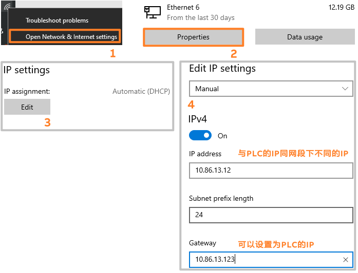

- [一、收集信息的方式](#%E4%B8%80%E6%94%B6%E9%9B%86%E4%BF%A1%E6%81%AF%E7%9A%84%E6%96%B9%E5%BC%8F)
- [二、SystemDump 访问](#%E4%BA%8Csystemdump-%E8%AE%BF%E9%97%AE)
	- [1.操作方式](#1%E6%93%8D%E4%BD%9C%E6%96%B9%E5%BC%8F)
	- [2.导出 SystemDump 操作方式](#2%E5%AF%BC%E5%87%BA-systemdump-%E6%93%8D%E4%BD%9C%E6%96%B9%E5%BC%8F)
- [三、直接从 CF/CFast 卡中获得日志信息](#%E4%B8%89%E7%9B%B4%E6%8E%A5%E4%BB%8E-cfcfast-%E5%8D%A1%E4%B8%AD%E8%8E%B7%E5%BE%97%E6%97%A5%E5%BF%97%E4%BF%A1%E6%81%AF)
- [四、SystemDump 文件查看工具](#%E5%9B%9Bsystemdump-%E6%96%87%E4%BB%B6%E6%9F%A5%E7%9C%8B%E5%B7%A5%E5%85%B7)

## 一、收集信息的方式
- 如果贝加莱控制设备在现场遇到问题，需要收集什么信息，需要反馈什么信息给工程师来定位问题？
    - 📺 现场HMI组态画面中提示的报警信息
    - 🚥 硬件模块的状态灯闪烁信息记录（照片/视频）
    - 〰️ 贝加莱模块的接线情况梳理与记录
    - ⭐ 导出贝加莱自带的系统诊断日志（System Dump）
    - 出现问题之前的调整与变化信息记录
    - 出现问题的初步规律
- 收集足够的信息并反馈，便能够快速定位问题点，有助于问题尽快解决。

## 二、SystemDump 访问
- 当现场设备反馈有异常，可以通过笔记本上的浏览器直接访问PLC内置的SDM服务器，了解贝加莱系统的基本信息，便于诊断，可直接导出离线的Sysdump文件以便支持工程师分析。
    -  提升现场问题Debug效率
    - 对设备运行情况进行远程查看与数据备份

### 1.操作方式
- 确定PLC的IP地址，例如 `10.86.13.123`
- 准备一台电脑，连接笔记本电脑的网口与PLC的网口
- 调整笔记本电脑的网络地址，调整为和PLC同网段，即能够通过笔记本的CMD窗口下正常ping通。
    - 
-  打开浏览器，输入 `10.86.13.123/sdm` 

- SystemDump文件中包含了大量PLC设备信息与日志信息。可以看到硬件拓扑结构、CPU负载、故障信息、硬件信息等等
- 
- 

### 2.导出 SystemDump 操作方式
- 0.导出SystemDump会导致CPU负载较高，在操作前，建议先让设备停机。
- 1.网页中输入`PLC的IP地址/sdm`  如 ( 192.168.100.2/sdm )
    - ⚠️若网页访问不了，请见：[029SDM网页无法正常访问](../B03_技术_诊断/029SDM网页无法正常访问.md)

- 2.点击System Dump

- 3.点击Parameters - Data - File,点击OK

- 4.点击Upload from target 

> 注意：存储SystemDump文件时，CPU负载很高，建议停机时使用

- 5.点击完成后，浏览器会自动下载一个.gz压缩包

- 6.需要收集信息全在压缩包中，将压缩包反馈给问题处理人员（压缩包中包含Logger，Profile，系统信息）

- 7. 将此文件发送给相关工程师

## 三、直接从 CF/CFast 卡中获得日志信息
- 若无法通过 SDM 获得数据，可直接从 CF/CFast 卡中获得相关数据
- Logger 文件存储在 RPSHD /SYSROM 文件夹中
- 

## 四、SystemDump 文件查看工具
- 可访问以下链接，了解SystemDump Viewer工具
    - [SDM数据本地诊断工具](https://gitee.com/yzydeer/BuR_Toolkit/blob/master/SDM%E6%95%B0%E6%8D%AE%E6%9C%AC%E5%9C%B0%E8%AF%8A%E6%96%AD%E5%B7%A5%E5%85%B7.md)
- 下载地址
    - ✨从Github上获取：
      - https://github.com/bee-eater/SystemDumpViewer/releases
    - ✨贝加莱PC知识库
      - https://brtechs.huashengyun.online/index.php?mod=bjl&do=file&gid=19#group&do=file&gid=19&fid=2851
