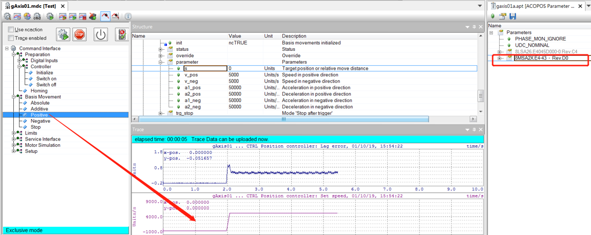
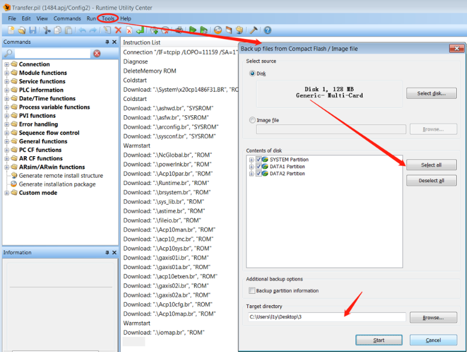
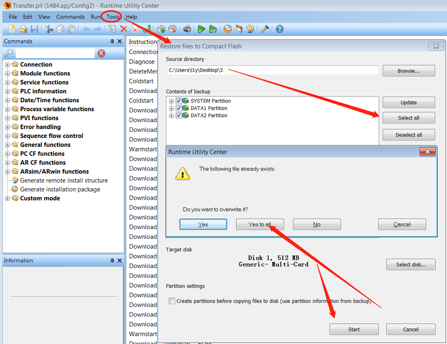
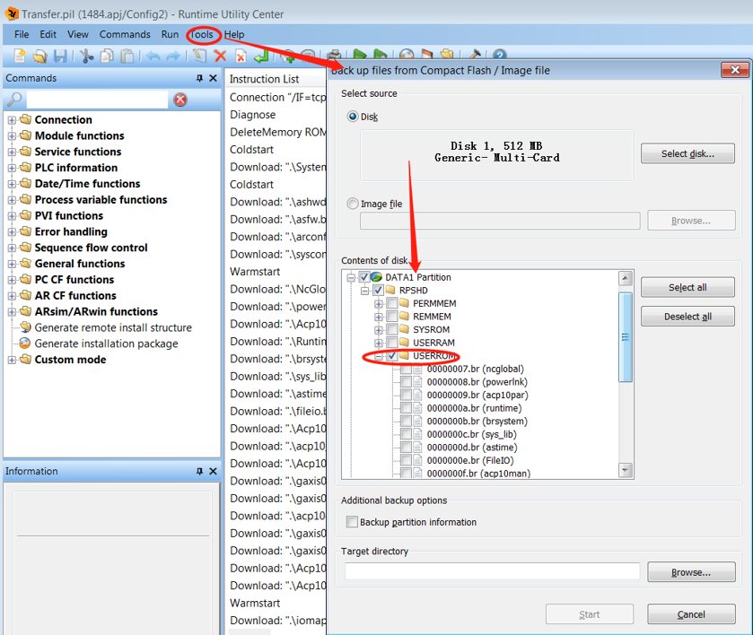
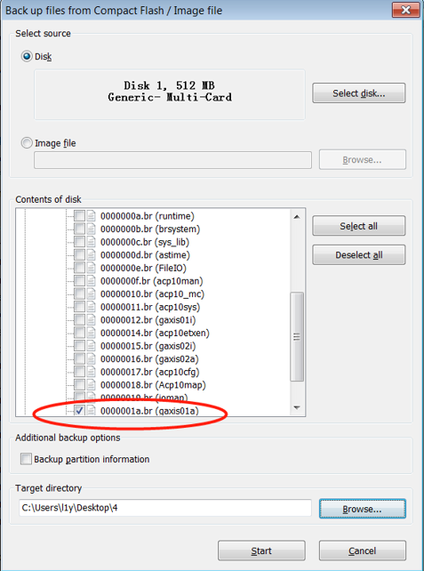
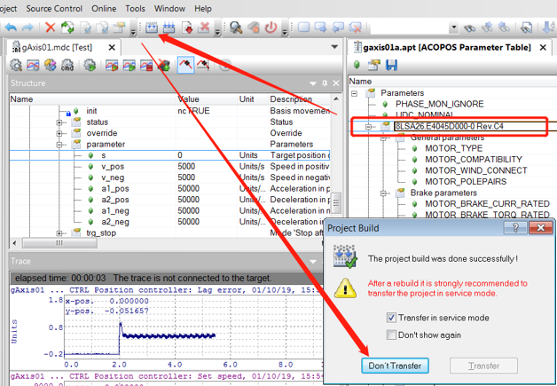
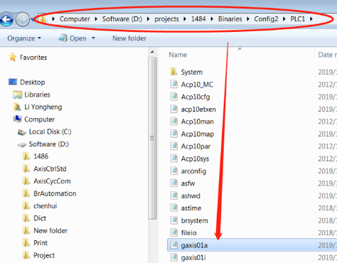
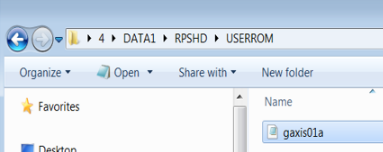
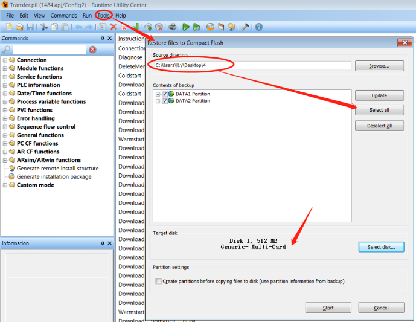
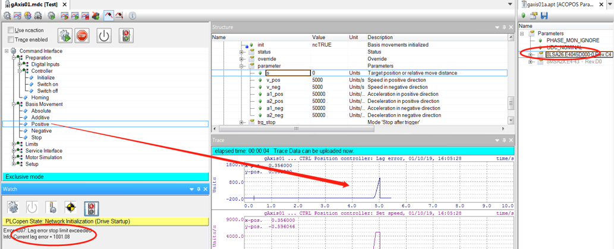

> Tags: #RUC

- [1 004通过RUC功能修改无源程序电机参数](#1%20004%E9%80%9A%E8%BF%87RUC%E5%8A%9F%E8%83%BD%E4%BF%AE%E6%94%B9%E6%97%A0%E6%BA%90%E7%A8%8B%E5%BA%8F%E7%94%B5%E6%9C%BA%E5%8F%82%E6%95%B0)
- [2 需求](#2%20%E9%9C%80%E6%B1%82)
- [3 思路](#3%20%E6%80%9D%E8%B7%AF)
- [4 操作流程](#4%20%E6%93%8D%E4%BD%9C%E6%B5%81%E7%A8%8B)
	- [4.1 备份CF卡中的程序](#4.1%20%E5%A4%87%E4%BB%BDCF%E5%8D%A1%E4%B8%AD%E7%9A%84%E7%A8%8B%E5%BA%8F)
	- [4.2 修改电机参数操作流程](#4.2%20%E4%BF%AE%E6%94%B9%E7%94%B5%E6%9C%BA%E5%8F%82%E6%95%B0%E6%93%8D%E4%BD%9C%E6%B5%81%E7%A8%8B)
- [5 总结](#5%20%E6%80%BB%E7%BB%93)
- [6 更新日志](#6%20%E6%9B%B4%E6%96%B0%E6%97%A5%E5%BF%97)

# 1 C04.004-通过RUC功能修改无源程序电机参数

# 2 需求

- 在客户的一些老项目中由于某些电机停产在更换新型号电机以后，需要修改电机参数，但是年头久远客户手里已经没有源程序只有CF卡中的程序，想通过AS软件自带的功能完成电机参数的修改，也能节省人力成本。

# 3 思路

- 贝加莱AS软件系统提供Runtime Unity Center选项，该选项中的功能可以实现对CF卡中的程序进行备份和恢复，我们可以通过该功能备份出参数表的.br文件，然后新建的项目中仅在参数表中添加电机参数就可以实现对备份出来的参数表进行修改同时不会改变整个程序的逻辑。

# 4 操作流程

## 4.1 备份CF卡中的程序

- 首先在AS软件中完成相关的电机组态，将程序下载到CF卡中（128M），通过TEST功能测试一下电机。如图所示电机运行正常，右侧红框是在参数表中配置的8MS和8LS电机参数只是为了通过参数表修改电机参数方便而已。
- 
- 运行正常以后开始备份CF卡中的程序，此操作的目的是当客户将CF卡寄来的时候需要将程序备份到一张新卡中，防止操作失误以后没有备份程序，操作如下图所示，选中所有的将程序备份到一个自建的文件夹中。
- 
- 将刚才备份出来的程序恢复到一张新的CF卡上（512M）如下图所示，对新卡进行相关的测试操作
- 

## 4.2 修改电机参数操作流程

- 首先拷贝出来需要修改的参数表，注意选择DATA1->USERROM->gaxis01a.br文件即可，需要修改哪根轴的电机参数就导出对应的参数表即可。
    - 
    - 
- 打开一个同年类似的程序，在参数表中添加一个电机8LS(为了表明电机参数被修改所以配置不同型号的电机)，然后编译但是不下载。
    - 
- 在该程序所在的文件夹目录下面找到编译以后的gaxis01a.br文件，然后复制。
    - 
- 找到我们前面备份出来的参数表的文件夹，用刚才复制的文件替换掉文件中的参数表文件，该过程就是用编译生成的伺服参数表替换掉从CF卡中备份出来的需要修改的参数表。在前一版的操作说明书中，尝试用记事本打开参数表文件复制电机参数的代码，但是操作以后发现控制器上电以后一直处于DIAG模式显示错误是CF卡中的.br文件损坏。所以现在改成整体参数表进行替换，这种替换就要求不同的程序伺服参数表中的逻辑要相同，否则替换以后逻辑就不对，同时软件的版本和ACP10的版本需要相同。
    - 
- 接下来将替换的参数表文件恢复回CF卡中，操作如下
    - 
- 使用TEST功能测试电机结果如下，说明电机的型号已经被修改了。
    - 

# 5 总结

- 以上简单介绍了如何实现在没有源程序的情况下通过RUC修改电机型号参数的，实际应用中需要注意的有以下几点：
    - 因为参数表是整体覆盖替换，所以需要找相近的程序的参数表来添加电机参数。
    - 该测试是在AS3.0.9软件环境下测试完成的
    - 尽量保持软件版本和ACP10的版本相同，因为不同版本的一些功能ID可能会有不同。

# 6 更新日志

| 日期         | 修改人 | 修改内容 |
| :--------- | :-- | :--- |
| 2024-01-18 | LYH | 初次创建 |
