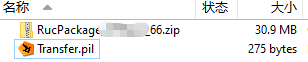
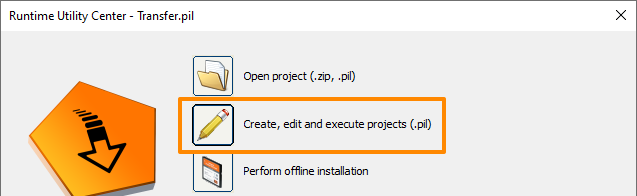
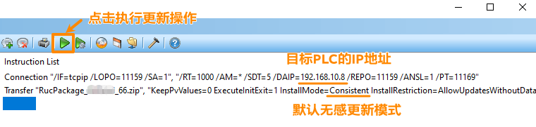
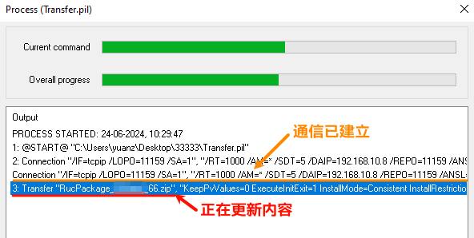
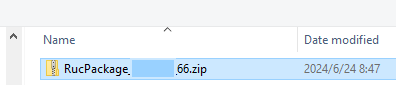
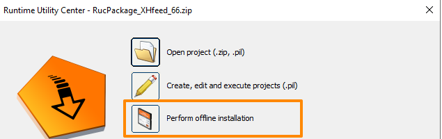
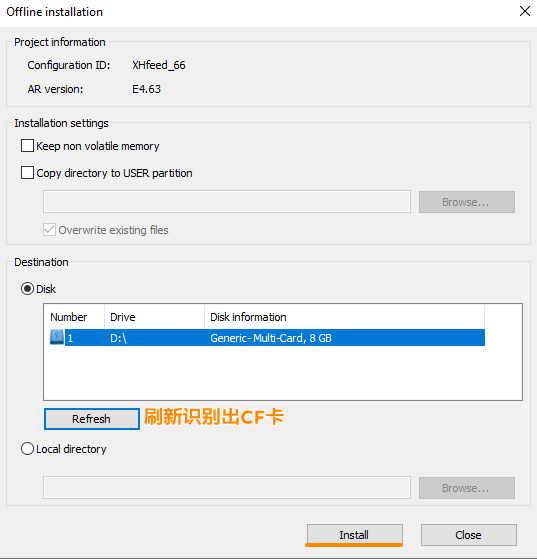
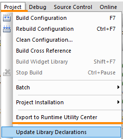
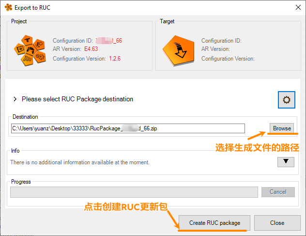

> Tags: #程序更新 #烧卡

- [1 C04-005使用RUC方式更新PLC程序_在线无感更新_烧卡](#_1-c04-005%E4%BD%BF%E7%94%A8ruc%E6%96%B9%E5%BC%8F%E6%9B%B4%E6%96%B0plc%E7%A8%8B%E5%BA%8F%E5%9C%A8%E7%BA%BF%E6%97%A0%E6%84%9F%E6%9B%B4%E6%96%B0%E7%83%A7%E5%8D%A1)
- [2 目的](#_2-%E7%9B%AE%E7%9A%84)
- [3 需求软件](#_3-%E9%9C%80%E6%B1%82%E8%BD%AF%E4%BB%B6)
- [4 在线更新方式](#_4-%E5%9C%A8%E7%BA%BF%E6%9B%B4%E6%96%B0%E6%96%B9%E5%BC%8F)
	- [4.1 无感更新满足条件（PLC不会重启）](#_41-%E6%97%A0%E6%84%9F%E6%9B%B4%E6%96%B0%E6%BB%A1%E8%B6%B3%E6%9D%A1%E4%BB%B6%EF%BC%88plc%E4%B8%8D%E4%BC%9A%E9%87%8D%E5%90%AF%EF%BC%89)
- [5 烧卡](#_5-%E7%83%A7%E5%8D%A1)
- [6 👷RUC软件制作方式](#_6-ruc%E8%BD%AF%E4%BB%B6%E5%88%B6%E4%BD%9C%E6%96%B9%E5%BC%8F)
- [7 更新日志](#_7-%E6%9B%B4%E6%96%B0%E6%97%A5%E5%BF%97)

# 1 C04-005使用RUC方式更新PLC程序_在线无感更新_烧卡

- 📋注意：此处更新方式为AS/AR 4.3及以上推荐使用

# 2 目的

- 现场PLC需要更新程序，期望能够下发二进制程序用于现场更新，一般有如下几种诉求
    - **A**. 能够直接烧卡完成更新
    - **B**. 能够通过电脑/笔记本通过网线在线更新（若可能，期望无感更新，即更新不重启）
    - C. 使用U盘更新 → [002贝加莱PLC通过U盘更新程序](002贝加莱PLC通过U盘更新程序.md)
- **A**, **B** 推荐使用RUC方式进行更新

# 3 需求软件

- 使用RUC软件需要提前安装贝加莱的PVI软件
- 📋建议根据PLC的AR选择对应的PVI版本，例如PLC的AR是AR4.91，则选择安装PVI 4.10版本
    - AR4.90 → PVI 4.9
    - AR4.91 → PVI 4.10
    - AR4.92 → PVI 4.11
    - AR4.93 → PVI 4.12
- 官方下载链接
    - [PVI Development Setup | B&R Industrial Automation (br-automation.com)](https://www.br-automation.com/zh/downloads/software/automation-netpvi/pvi-development-setup/)
- 贝加莱下载中心
    - [PVI_4.10.2.15_Install](https://br-community.com/downloadDis/100)

# 4 在线更新方式

- 📋 基本等效于使用Automation Studio 在线Tranfer传程序。
- 1___获得的RUC安装包如下图所示
    - 
- 2___双击Tranfer.pil文件，一般会自动跳出Runtime Utility Center软件，若不跳出RUC软件，可自行打开，并选择Open project
    - 
- 3___可确认文本信息，调整IP地址与模式，确认后即可点击按钮执行
    - 
- 4___在弹出框中可见当前状态，若有出错，可查看报错信息
    - 
- 5___等待片刻，程序即会更新完成，若满足以下条件，即会实现无感更新，即PLC不重启。

## 4.1 无感更新满足条件（PLC不会重启）

- ✔️以下程序操作，调整后更新程序不会导致PLC重启
    - 增减空程序段（无论是否申明新变量）
    - 导入新库不调用库函数
    - 删除库及调用库函数程序段
- ❌以下操作，更新程序后会导致PLC重启
    - 修改硬件配置信息
    - 导入新库并调用库函数
    - 修改CPU Configuration

# 5 烧卡

- 1___双击Tranfer.pil文件，一般会自动跳出Runtime Utility Center软件，若不跳出RUC软件，可自行打开，并选择Open project
- 2___选择Open project，找到需要安装的RUC压缩包
    - 
    - 
- 3___确认CF卡已被系统识别，点击 Perform offline installation 进行烧卡
    - 
- 4___弹出框进行参数选择，注意不要选择错了CF卡，确认后点击Install进行烧卡
    - 🔴注意，此操作会导致CF卡先被格式化、分区再更新文件
    - 

# 6 RUC软件制作方式

- 1___AS项目进行全编译
- 2___AS项目软件选择Project → Export to Runtime Utility Center
    - 
- 3___选择需要安装的位置
    - 
- 4___最后生成的文件如下
    - 

# 7 更新日志

| 日期                             | 修改人 | 修改内容 |
| :----------------------------- | :-- | :--- |
| 2024-06-24 | YZY | 初次创建 |
