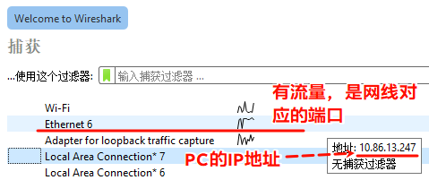
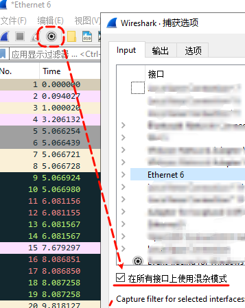
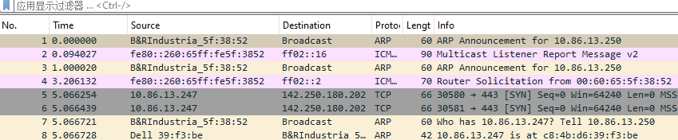
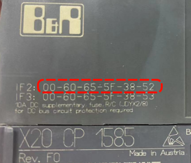
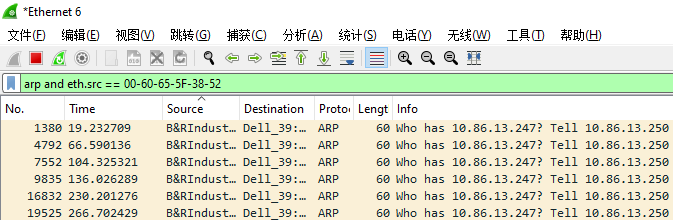

> Tags: #AS

- [1 006如何通过Wireshark获取到没有开启SNMP服务的PLC的IP地址](#_1-006%E5%A6%82%E4%BD%95%E9%80%9A%E8%BF%87wireshark%E8%8E%B7%E5%8F%96%E5%88%B0%E6%B2%A1%E6%9C%89%E5%BC%80%E5%90%AFsnmp%E6%9C%8D%E5%8A%A1%E7%9A%84plc%E7%9A%84ip%E5%9C%B0%E5%9D%80)
- [2 Wireshark安装链接](#_2-wireshark%E5%AE%89%E8%A3%85%E9%93%BE%E6%8E%A5)
- [3 操作步骤](#_3-%E6%93%8D%E4%BD%9C%E6%AD%A5%E9%AA%A4)
- [4 排查方式一：直接查看IP都有哪些](#_4-%E6%8E%92%E6%9F%A5%E6%96%B9%E5%BC%8F%E4%B8%80%EF%BC%9A%E7%9B%B4%E6%8E%A5%E6%9F%A5%E7%9C%8Bip%E9%83%BD%E6%9C%89%E5%93%AA%E4%BA%9B)
- [5 查看方式二：通过MAC地址锁定](#_5-%E6%9F%A5%E7%9C%8B%E6%96%B9%E5%BC%8F%E4%BA%8C%EF%BC%9A%E9%80%9A%E8%BF%87mac%E5%9C%B0%E5%9D%80%E9%94%81%E5%AE%9A)
- [6 更新日志](#_6-%E6%9B%B4%E6%96%B0%E6%97%A5%E5%BF%97)

# 1 006如何通过Wireshark获取到没有开启SNMP服务的PLC的IP地址

- 出于网络安全考虑，现在新的项目默认都关闭了PLC的SNMP服务，无法通过AS软件直接发现并扫描的网络里的PLC
    - [023AS软件无法扫描到实际的PLC](../B01_技术_AutomationStudio/023AS软件无法扫描到实际的PLC.md)
- 若不知道设备的IP，就很难直接连接上PLC。
- 我们可以通过Wireshark软件，通过ARP报文，了解到设备对应的IP地址。

# 2 Wireshark安装链接

- [Wireshark · Download](https://www.wireshark.org/download.html)

# 3 操作步骤

- 电脑和PLC用网线建立实际的连接（直连或过交换机HUB均可）；
    - 注意一下，如果网段中有DHCP服务器而且PLC是自动获取IP，那就需要电脑直连PLC 。
- 打开Wireshark，选择对应的网卡，鼠标悬浮在上方，能看到IP地址，双击选择。
    - 
- 如果获取不到数据，注意一下是否开启了混杂模式
    - 
- 若PLC不与外部通信，可能需要等待一段时间才会发一些报文，若等待时间过久仍没有报文，可以考虑拔插网线。

# 4 排查方式一：直接查看IP都有哪些

- 如果直连，且只有一台贝加莱设备，建议使用这种方式
- 
- 上图中，查看ARP类型的协议，且Source信息中包含 `B&RIndustria`，此条目的Info信息即为IP地址。
- 由上图可知PLC的IP地址为10.86.13.250

# 5 查看方式二：通过MAC地址锁定

- 如果网络里有多个设备，则可查看PLC侧边的MAC地址
    - 
- 在Wireshark过滤窗口中输入如下信息，末尾信息即为PLC上的MAC地址

```
arp and eth.src == 00-60-65-5F-38-52
```

- 过滤出来的内容即为这个PLC所对应的IP地址，可知PLC的IP地址为10.86.13.250
- 

# 6 更新日志

| 日期                             | 修改人 | 修改内容 |
| :----------------------------- | :-- | :--- |
| 2024-08-08 | YZY | 初次创建 |
