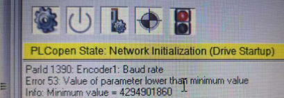
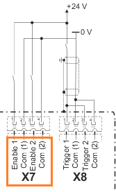
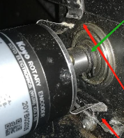
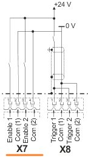

# ACOPOS 错误描述中文信息

ACOPOS 错误文本描述如下：

适用范围： ACP10/ARNC0

## 1：参数 ID 无效

描述:

写入或读取无效参数 ID 时出现响应错误。

反应:

无.

原因/补救措施:

查看错误号 [1002](#1002参数超出有效范围).

### 应用案例

*2022.01.11*

报警号1和32144

**问题**：参数表配置 FB DIO 时报警（用于 AC130卡）

**解决**：FB DIO不能仿真，实际运行中不会报警

## 2：用于上传的数据块不可用

描述

初始化数据块上传（数据块读取访问）期间出现响应错误。

用于数据块上载的选定数据在驱动器上不可用。

反应:

数据块读取访问未初始化。

原因/补救措施:

数据块上载的数据未有效传输到驱动器或未保存在驱动器上。

## 3：只读参数的写入访问权限

描述:

写入参数时出现响应错误，这不允许更改值。

反应:

不接受参数值。

原因/补救措施:

查看错误码 [1002](#1002参数超出有效范围).

## 4：对只写参数的读访问

描述：

读取参数时响应错误，不允许读取访问。

反应：

不传递参数值。

原因/补救措施：

查看错误编号 [1002](#1002参数超出有效范围).

## 8：数据块读访问已经初始化

描述：

如果前一个传输尚未完成，则在数据块读取访问（上传）初始化期间出现响应错误。

反应：

未针对参数 ID 初始化数据块读取访问。

原因/补救措施：

数据块下载期间出现序列错误。

另请参阅错误编号 [1002](#1002参数超出有效范围).

## 9：数据块写访问已经初始化

描述：

如果上次传输尚未完成，则在数据块写入访问（下载）初始化期间出现响应错误。

反应：

未针对参数 ID 初始化数据块写访问。

原因/补救措施：

数据块下载期间出现序列错误。

另请参阅错误编号 [1002](#1002参数超出有效范围).

## 10：数据块读取访问未初始化

描述:

如果未初始化数据块上载，则读取数据段（RD_BLOCK_SEGM，RD_BLOCK_LAST_SEGM）时出现响应错误。

反应:

不会传递任何数据。

原因/补救措施:

查看错误码 [8](#8数据块读访问已经初始化).

## 11：数据块写入访问未初始化

描述:

如果未初始化数据块下载，则写入数据段（WR_BLOCK_SEGM，WR_BLOCK_LAST_SEGM）时出现响应错误。

反应:

不保存任何数据。

原因/补救措施:

查看错误码 [9](#9数据块写访问已经初始化).

## 16：读取数据块时，数据段已经是最后一个

描述:

读取数据段（RD_BLOCK_SEGM）时出现响应错误（如果已传输上载数据的初始化长度）。最后一个数据段必须使用其自己的参数 ID （RD_BLOCK_LAST_SEGM） 进行传输。

反应:

数据块上传已中止。

原因/补救措施:

查看错误码 [8](#8数据块读访问已经初始化).

## 17：写入数据块时，数据段已经是最后一个

描述:

如果已传输下载数据的初始化长度，则写入数据段（RD_BLOCK_SEGM）时出现响应错误。最后一个数据段必须使用其自己的参数 ID （WR_BLOCK_LAST_SEGM） 进行传输。

反应:

数据块下载中止。不保存任何数据。

原因/补救措施:

查看错误码 [9](#9数据块写访问已经初始化).

## 18：读取数据块时，数据段还不是最后一个

描述:

读取最后一个数据段（RD_BLOCK_LAST_SEGM）时出现响应错误，如果尚未为初始化的长度传输足够的上载数据。

反应:

数据块上传已中止。

原因/补救措施:

查看错误码 [8](#8数据块读访问已经初始化).

## 19：写入数据块时，数据段还不是最后一个

描述:

如果尚未为初始化的长度传输足够的下载数据，则写入最后一个数据段（WR_BLOCK_LAST_SEGM）时出现响应错误。

反应:

数据块下载中止。不保存任何数据。

原因/补救措施:

查看错误码 [9](#9数据块写访问已经初始化).

## 21：数据块写入后的校验和无效

描述:

在 NC 系统模块（"acp10sys.br"或"acp10bsl.br"）的数据块下载期间，BsLoader 模式下的响应错误。NC 系统模块（BR 模块）的校验和无效。

反应：

查看错误码 [25](#25刻录系统模块只允许在下载后立即使用).

原因/补救措施:

查看错误码 [32018](#32018系统模块中的参数-id-无效).

查看错误码 [1012](#1012循环网络通信的崩溃).

## 23：数据块中的参数 ID 无效（数据块写入）

描述:

在 NC 系统模块（"acp10sys.br"或"acp10bsl.br"）的数据块下载期间，BsLoader 模式下的响应错误。数据块的参数 ID 与在传输的 NC 系统模块的 BR 模块标头中输入的参数 ID 不匹配。

反应：

查看错误码 [25](#25刻录系统模块只允许在下载后立即使用).

原因/补救措施:

传输的数据块是无效的 NC 系统模块。

在操作系统下载期间传输了BsLoader（"acp10bsl.br"）。

在BsLoader下载期间传输了操作系统（"acp10sys.br"）。

查看错误号 [32018](#32018系统模块中的参数-id-无效).

## 25：刻录系统模块只允许在下载后立即使用

描述:

在BsLoader模式下，在"烧毁NC系统模块"命令期间出现响应错误。驱动器上没有有效的 NC 系统模块（"acp10sys.br"或"acp10bsl.br"），或者在 NC 系统模块下载后未立即执行烧伤命令。

反应：

NC系统模块被识别为无效，无法保存（刻录到闪存）。

原因/补救措施:

未执行 NC 系统模块下载。

NC 系统模块出现故障、无效或不兼容。

NC 系统模块下载过程中出现序列错误。

另请参阅错误号 [32018](#32018系统模块中的参数-id-无效).

## 27：操作系统无法启动（操作系统不在FPROM上）

描述:

在更改启动状态"启动操作系统"的命令期间出现响应错误。驱动器上没有保存操作系统。

反应：

操作系统未启动。

原因/补救措施:

查看错误码 [32018](#32018系统模块中的参数-id-无效).

## 40：参数值高于最大值

描述：

写入参数时响应错误，如果该值大于此参数的上限。

反应：

不接受参数值。

原因/补救措施：

查看错误编号 [1002](#1002参数超出有效范围).

## 41：参数值高于最大值

描述：

查看错误编号 [40](#40参数值高于最大值).

反应：

查看错误编号 [40](#40参数值高于最大值).

原因/补救措施：

查看错误编号 [40](#40参数值高于最大值).

## 42：参数值高于最大值

描述：

查看错误编号 [40](#40参数值高于最大值).

反应：

查看错误编号 [40](#40参数值高于最大值).

原因/补救措施：

查看错误编号 [40](#40参数值高于最大值).

## 52：参数值低于最小值

描述：

写入参数时响应错误，如果该值小于该参数的下限。

反应：

不接受参数值。

原因/补救措施：

查看错误编号 [1002](#1002参数超出有效范围).

## 53：参数值低于最小值

描述：

查看错误编号 [52](#52参数值低于最小值).

反应：

查看错误编号 [52](#52参数值低于最小值).

原因/补救措施：

查看错误编号 [52](#52参数值低于最小值).

### 应用案例

***2019.11.27***

Error 1002 / Error 53 / Error 1034 ACOPOS Micro (80VD100PD.C033-01)控制 8WSB 系列伺服电机

**原因 1：** 配置编码器参数表时，‘Encoder Scaling’参数与‘SSI Number of data bits’不匹配。

**解决方案：** ‘Encoder Scaling’和‘SSI Number of data bits’两个参数取决于编码器分辨率，需要相互匹配。例如一个 17 位编码器， Scaling 为 131072，对应的 Data bits 应为 17。

**原因 2：** 编码器参数表中的波特率（Baud Rate）设置值过低。

**解决方案：** 计算出波特率范围。（建议设置为最大值 400kBaud) |

## 54：参数值低于最小值

描述：

查看错误编号 [52](#52参数值低于最小值).

反应：

查看错误编号 [52](#52参数值低于最小值).

原因/补救措施：

查看错误编号 [52](#52参数值低于最小值).

## 64：BR 模块中的硬件 ID 无效（数据块写入）

描述：

在下载 NC 系统模块（'acp10sys.br' 或 'acp10bsl.br'）期间，BsLoader 模式下的响应错误。 NC 系统模块的 BR 模块头中的硬件 ID 无效或与 ACOPOS 硬件不兼容。

反应：

查看错误编号 [25](#25刻录系统模块只允许在下载后立即使用).

原因/补救措施：

ACOPOS 硬件不支持 NC 系统模块。

查看错误编号 [32018](#32018系统模块中的参数-id-无效).

## 65：BR模块中的硬件版本无效（数据块写入）

描述：

在下载 NC 系统模块（'acp10sys.br' 或 'acp10bsl.br'）期间，BsLoader 模式下的响应错误。 NC 系统模块的 BR 模块头中的硬件版本与驱动器的硬件版本不兼容。

反应：

查看错误编号 [25](#25刻录系统模块只允许在下载后立即使用).

原因/补救措施：

不正确的操作系统版本或 BsLoader 版本：

ACOPOS伺服驱动器8Vxxxx.00-1不允许加载BsLoader V047或操作系统V110。

ACOPOS伺服驱动器8Vxxxx.xx-2不允许加载BsLoader V0381或操作系统V0390。

查看错误编号 [32018](#32018系统模块中的参数-id-无效).

## 66：驱动器上的操作系统与现有网络不兼容

描述：

“更改引导状态”命令期间 BsLoader 模式下的响应错误。 操作系统无法启动，因为保存的操作系统不支持现有网络。

操作系统的硬件ID：

80h...CAN 操作系统

81h...POWERLINK 操作系统

反应：

不执行命令。

原因/补救措施：

POWERLINK 操作系统保存在带有 CAN 网卡（AC110 插卡）的驱动器上。

CAN 操作系统保存在带有 POWERLINK 网卡（AC112 插卡）的驱动器上。

查看错误编号 [32018](#32018系统模块中的参数-id-无效).

## 67：必要的参数丢失或无效

描述：

写入参数时响应错误。 分配所需的参数未配置或配置不正确

反应：

不接受参数值。

原因/补救措施：

参数配置顺序错误。

相关参数丢失或之前配置无效。

示例：如果打开外部泄放器时，并非外部泄放器的所有参数都配置有效，则发送此错误.

## 68：数据块长度无效

描述：

如果数据块长度无效，则在刻录数据块时响应错误。

反应：

数据块刻录过程中止。

原因/补救措施：

数据模块的块长度无效

网络传输错误。 另请参阅错误编号 [1012](#1012循环网络通信的崩溃).

## 69：命令接口被占用

描述：

命令启动期间的响应错误。 该命令无法启动，因为前面的命令未完成。

反应：

不执行命令。

原因/补救措施：

等待活动命令完成.

## 70：必要参数的值太高

描述：

如果必要参数的值过高，则写入参数时响应错误。

反应：

不接受参数值。

原因/补救措施：

参数配置顺序错误。

相关参数丢失或之前配置无效。

查看错误编号 [1002](#1002参数超出有效范围).

## 71：必要参数的值太低

描述：

如果必要参数的值太低，则写入参数时响应错误。

反应：

不接受参数值。

原因/补救措施：

参数配置顺序错误。

相关参数丢失或之前配置无效。

查看错误编号 [1002](#1002参数超出有效范围).

### 应用案例

***2022.08.09***

ncFF 整定时报错71 S_max 值太小，最小也得旋转半圈

 |

## 72：固件版本低于最低必要固件版本

描述：

下载到目标的固件版本低于设备所需的固件版本。

反应：

下载的固件不会被烧录到设备内存中。

原因/补救措施：

设备所需的最低固件版本大于下载的固件版本。

项目的固件版本应大于设备的最低版本.

## 73：无效的 R4 浮点格式

描述：

如果值超出 32 位浮点数的有效范围，则写入 R4 参数时出现响应错误。

32 位浮点数（单精度浮点数）的有效范围：-3.40282347E+39 (0xFF7FFFFF) 到 -1.17549435E-38 (0x80800000), -0 (0x80000000), 0 (0x0005000400x0050040080408004 3.40282347E+39 (0x7F7FFFFF)

无效的32位浮点数：+ Infinity（0x7f800000），-infinity（＃ff800000），nan（＃ff800001 ..＃fffffffff），+下溢1.40129846e-45（0x00000001）至1.17549421e-38（0x007ffffff），underflow - 1.40129846E-45 (0x80000001) 到 -1.17549421E-38 (0x807FFFFF)

反应：

不接受参数值。

原因/补救措施：

查看错误编号 [33002](#33002浮点异常).

查看错误编号 [1002](#1002参数超出有效范围).

## 74：只能通过通道1（轴1）写入参数

描述：

写入参数时响应错误。 该参数只能通过 ACOPOS 模块上的通道 1（轴 1）写入。

反应：

不接受参数值。

原因/补救措施：

用于所需功能的参数 ID 不正确。

网络传输错误。 另请参阅错误编号 [1012](#1012循环网络通信的崩溃).

## 75：所选电机类型不允许参数

描述：

写入参数时出错，因为它与当前电机类型不兼容。

反应：

不会应用参数值。

原因/补救措施：

电机参数可能不一致和/或此电机类型不支持该功能。 检查电机参数和功能.

## 1001：错误 - FIFO 溢出

描述：

ACOPOS上错误消息的FIFO已满。在此错误 FIFO 中仅输入运行时错误。响应错误直接作为对参数写入或读取的响应发送。

反应：

进一步的错误消息将丢失。

原因/补救措施：

通过网络：

\- 没有错误被读取或

\- 错误读取速度太慢。

在 ACOPOS 上：

\- 输入的错误太多或

\- 错误输入得太快。

请参阅其他输入的错误号。

## 1002：参数超出有效范围

描述：

如果值超出有效限制，则写入参数时出现响应错误。

反应：

不接受参数值。

原因/补救措施：

用于所需函数的参数 ID 不正确。

该值不是有效的常量，或者不在允许的选择列表中。

该值超过或不符合实现限制。

该值超出物理上可能的范围（例如负时间）。

此参数 ID 的数据类型或数据长度不正确。

网络传输错误。另请参见错误号 [1012](#1012循环网络通信的崩溃).

详细信息也可以在网络命令跟踪中看到。

### 应用案例

***2019.11.27***

Error 1002 / Error 53 / Error 1034 ACOPOS Micro (80 VD 100 PD. C 033-01)控制 8 WSB 系列伺服电机

**原因 1：** 配置编码器参数表时，‘Encoder Scaling’参数与‘SSI Number of data bits’不匹配。解决方案：‘Encoder Scaling’和‘SSI Number of data bits’两个参数取决于编码器分辨率，需要相互匹配。例如一个 17 位编码器， Scaling 为 131072，对应的 Data bits 应为 17。

**原因 2：** 编码器参数表中的波特率（Baud Rate）设置值过低。 解决方案：计算出波特率范围。（建议设置为最大值 400kBaud) |

***2017.08.03***

8BAC0125.000-1 编码器卡使用配置编码器参数不合理，例如8BAC0125.000-1 卡，需要在合理配置完成参数后，再设置 ID1228与 ID 1225

***2023.07.14***

**现象** 新设备，一上电就报错

**原因** 驱动器上编码器卡没插好或者插错了位置 程序里有对驱动器上的编码器卡通过ParID进行写入操作，如果对应编码器卡没有在正确的槽位上，就会报错

## 1003：循环控制处于活动状态时无法写入参数

描述：

写入参数时出现响应错误，这不允许在控制器处于活动状态时更改值。

反应：

不接受参数值。

原因/补救措施：

该参数编写得太晚（在"打开控制器"命令之后）。

"关闭控制器"命令丢失或未在驱动器状态（移动活动）下执行。

缺少"控制器关闭"状态的请求（延迟步骤）。

\-\> 检查程序顺序和状态请求。

### 应用案例

*2020.07.15*

使用ACOPOS P3的外接编码器卡8EAC0130，写入ID 1301及ID 1572时轴必须处于Disable状态，否则会报错1003 Parameter cannot be written while loop control is active。

## 1004：网络生命标志监视器超时

描述：

活动网络生命标志监视期间的运行时错误，如果在指定的时间内没有循环电报到达（NETWORK_LIVE_CTRL）。

另请参阅错误号 [4005](#4005控制器无法开启驱动处于错误状态).

反应：

See error number [9000](#9000散热器温度传感器超出停止限制).

所有数字输出（AC130、AC131）均已停用（即输出电平设置为低电平，所有可切换 IO 均设置为输入）。

虚拟轴的移动将中止。

原因/补救措施：

网络生活标志监视器中的问题：

网络生命标志监视NETWORK_LIVE_CTRL定义为太短。

在发送循环电报之前，网络生命体征监控被激活得太早。

网络数据传输中的问题：

超过周期时间，计算时间负载极高或控制器CPU出现故障。

网络连接干扰或断开连接。请参阅接线指南错误号 [7030](#7030编码器增量信号幅度太大).

网络负载过高。

## 1005：当运动处于活动状态时，无法写入参数

描述：

写入参数时出现响应错误，这不允许在运动处于活动状态时更改值

反应：

不接受参数值。

原因/补救措施：

在运动开始命令之后，该参数编写得太晚。

缺少"移动完成"状态的请求（延迟步骤）。

\-\> 检查程序顺序和状态请求。

### 应用案例

*2023.07.07*

因为 MC_BR_MechPosDeviationComp.Active 未 TRUE 便触发了 AbsMove 命令，所以报错1005。增加补偿完成条件后问题解决。

## 1006：触发事件（数字输入 + 边沿）参数无效

描述：

如果值是无效的数字输入或无效的触发边沿，则写入事件参数时出现响应错误。

反应：

不接受参数值。

原因/补救措施：

查看错误码 [1002](#1002参数超出有效范围).

## 1008：网络耦合主站已停用 - 编码器错误

描述：

如果发送实际位置并且相应的编码器发送错误，则为网络耦合发送循环主数据时出现运行时错误。

附加信息 1/2/3 标识关联的主发送对象 MA1/2/3_CYCLIC_SEND。

反应：

为此耦合对象停用数据传输，以防止位置跳跃。

原因/补救措施：

请参阅其他输入的编码器错误号。

## 1009：内存分配期间出错

描述：

如果没有足够的内存用于请求的函数，则动态内存管理中的响应错误。

反应：

不执行最近请求的函数。

不会保存下载数据。

不接受参数值。

原因/补救措施：

单个内存区域太大或使用了太多内存：

凸轮数据下载，

参数序列下载，

EPROM数据下载，

创建功能块 （FUNCTION_BLOCK_CREATE），

使用内存分配（CAMCON_MAX_CAM、FIFO_MAX_LENGTH、AXLIM_T_JOLT AXLIM_T_JOLT_VAX1）写入参数时，

设置函数 （CMD_PIDENT=ncSTART）

## 1011：快速停止输入处于活动状态

描述：

如果配置的数字输入处于活动状态，则快速停止功能中的运行时错误。

另请参阅错误号 [4005](#4005控制器无法开启驱动处于错误状态).

反应：

"控制器就绪"状态为重置。

当"打开控制器"命令时：请参阅错误号 [4005](#4005控制器无法开启驱动处于错误状态).

默认设置 QUICKSTOP_DECEL_RAMP=ncA_LIMIT 且 QUICKSTOP_DECEL_RAMP=ncA_LIMIT+ncQUICKSTOP_T_JOLT：

当位置控制处于活动状态时（CONTROLLER_MODE=ncPOSITION 或 ncPOSITION+ncFF）：

随着轴限值的减速和控制器的关闭，运动停止。

对于 ncA_LIMIT+ncQUICKSTOP_T_JOLT，还会考虑参数QUICKSTOP_T_JOLT。

当速度控制处于活动状态时：

通过速度调节斜坡，轴限制和关闭控制器来停止运动。

当 U/f 控制处于活动状态时 （CONTROLLER_MODE=ncUF）：

通过速度控制的斜坡，轴限制和关闭控制器来停止运动。

当电流控制在换向（CONTROLLER_MODE=4）时处于活动状态时：

移动停止电流限制并关闭控制器。

设置QUICKSTOP_DECEL_RAMP=ncTRQ_LIMIT：

独立于控制器模式：运动在扭矩限制下中止。

设置QUICKSTOP_DECEL_RAMP=ncINDUCTION：

独立于控制器模式：运动中止，感应停止。另请参阅错误号 [9001](#9001散热器温度传感器超出关闭限制).

原因/补救措施：

查看错误号 [6021](#6021控制器使能输入低电平).

## 1012：循环网络通信的崩溃

描述：

运行时错误，如果网卡的固件检测到循环 POWERLINK 通信失败。

查看错误号 [4005](#4005控制器无法开启驱动处于错误状态).

反应：

查看错误号 [9000](#9000散热器温度传感器超出停止限制).

所有数字输出（AC130、AC131）均已停用（即输出电平设置为低电平，所有可切换 IO 均设置为输入）。

虚拟轴的移动将中止。

原因/补救措施：

网络布线中断。

电源链路站出现故障或已关闭。

连接在一起的工作站过多（最大 HUB 层数、最大网络电缆长度）。

对于配置的 POWERLINK 循环时间，工作站太多。

环境温度超出有效范围。

网络插件卡 （AC114） 有缺陷或硬件修订版错误。

发生网络干扰时：请参阅接线指南错误号 [7030](#7030编码器增量信号幅度太大)

另请参阅 PLC 的诊断数据点：FailedCycleCount、CycleTimeViolationCount 和 CycleIdleTime。

### 应用案例

*2022.07.22*

报警64006、32037、1012、32189：网线松动

*2022.12.09*

PLK 线插拔后复位解决

*2023.07.04*

**现象** 机器运行之后发生了某一驱动器报错，32037 32189 1012 ，其他驱动器没有报错

**原因** POWERLINK 网络通信质量问题

**解决方式** 重新拔插 POWERLINK 线缆后，问题解决。需要校核 POWERLINK 网络质量，优化参数

*2023.07.05*

**现象** 多个 ACOPOS Micro 上电后报警1012、32280等通讯故障，无法复位现场检查报警驱动，发现从拓扑无一致性，部分驱动位于 PLK 的通讯末端、部分位于 PLK 的网络中部。断电后修改 PLK 网线的连接顺序，无效果。 Test 模式下连接伺服，可强制复位报警，但其仍显示网络无法连接。

**解决方式** 考虑到该设备时间已久、可能存在硬件老化问题，修改PLK配置的Asynchronous timeout数值，由默认的25改为100。 多次断电重启，未再出现通讯报警。 |

## 1013：工作站不可用于网络通信

描述：

如果用于耦合的网络站不可用，则配置循环接收数据时出错 （CONFIG_MA1/2/3/4/5_CYCLIC_POS）。

反应：

循环数据（位置）在相应的参数 ID （MA1/2/3/4/5_CYCLIC_POS） 上不可用，并且不会更新。

原因/补救措施：

无效的站号。

配置编写得太早。

工作站尚未在网络上或出现故障。

另请参阅错误号 [1012](#1012循环网络通信的崩溃).

## 1014：网络命令接口被占用

描述：

如果最后一个命令的处理尚未完成，则配置循环接收数据时出错 (CONFIG_MA1/2/3/4/5_CYCLIC_POS).

反应：

不接受网络耦合的配置。

原因/补救措施：

此耦合对象的配置一个接一个地编写了好几次太快了。

## 1016：超出最大循环时间 - CPU 负载过高

描述：

如果 ACOPOS 上的计算时间负载过高（例如，在 400us 的位置控制器周期内不再完成设置值生成、网络处理和功能块），则在处理中等优先级操作系统功能时出现运行时错误。高优先级控制器功能通过严格的循环进一步处理。

ACOPOSmulti，ACOPOSmicro，ACOPOS P3：此错误仅在1轴（通道）上注册。

反应：

根据持续时间和超过周期时间的程度，可能会发生后续错误（例如速度跳跃和滞后错误）。

原因/补救措施：

有关诊断，请参见参数CPU_TICKS_CYCLE_PEAK （139）。

以下各项显示了一些增加处理器负载的常见示例：

提高开关频率F_SWITCH。

ICTRL_MODE Bit0 提高电流控制器动态（电流控制器周期时间减半）。

设置当前筛选器为活动ISQ_FILTER1_TYPE、ISQ_FILTER2_TYPE ISQ_FILTER3_TYPE。

许多功能会阻止活动FUNCTION_BLOCK_CREATE。在多个 EVWR FB 实例上同时发生事件或编写计算密集型命令会产生负载峰值。

循环通信，数据驱动CYCLIC_TODRV_PARID。同时写入多个参数 ID 或写入计算密集型命令会产生负载峰值。

凸轮自动，补偿齿轮AUT_COMP_MODE。

虚拟轴、基础运动或凸轮自动。

多个网络耦合功能处于活动状态，CONFIG_MA1/2/3/4/5_CYCLIC_POS。

虚拟编码器活动ENCOD0_MODE。

重复控制主动CMD_SCTRL_RC。

循环跟踪，记录多个测试数据点。

ACOPOS：插槽 3 或插槽 4 中的额外插件卡。编码器插件卡需要更多的计算时间。

ACOPOSmulti，ACOPOSmicro，ACOPOS P3：所有轴（通道）都处于活动状态。

## 1017：循环读取访问的参数 ID 无效

描述：

使用指针参数 ID 配置循环读取访问或数据连接的响应错误。

反应：

不接受参数 ID。

原因/补救措施：

参数 ID 无效，数据类型不受支持（复合数据类型或不是 4 字节值）。

不允许读取访问或参数具有计算密集型读取功能。

## 1018：循环写入访问的参数 ID 无效

描述：

使用指针参数 ID 配置循环写入访问或数据连接的响应错误。

反应：

不接受参数 ID。

原因/补救措施：

不允许写入访问权限。当控制器处于活动状态或移动处于活动状态时，不允许进行写访问。

另请参阅错误号 [1017](#1017循环读取访问的参数-id-无效).

## 1021：无法写入参数：功能块处于活动状态

描述：

写入参数时出现响应错误，当相应的功能块处于活动状态时，不允许更改值。

反应：

不接受参数值。

原因/补救措施：

功能块不支持此参数的"联机"更改。

功能块在特定工作状态下处于活动状态，这不允许"在线"更改此参数（例如，补偿运动中的MPGEN）。

激活功能块或操作状态后，该参数编写得太晚。

在写入参数之前未停用功能块，或者缺少状态请求。

## 1022：要驱动的循环数据的生命体征监控超时

描述：

在活动生命标志监视和主动控制器期间，如果指定的时间内没有要驱动器的循环数据到达（CYCLIC_TODRV_T_CTRL），则运行时错误。

反应：

默认设置 STOP_ERR_DECEL_RAMP=ncA_LIMIT：

当位置控制处于活动状态时（CONTROLLER_MODE=ncPOSITION 或 ncPOSITION+ncFF）：

移动停止，轴限制和关闭控制器。

有关不同的控制器模式，另请参见错误号 [9000](#9000散热器温度传感器超出停止限制).

有关STOP_ERR_DECEL_RAMP的不同设置，请参阅错误号 [4007](#4007超出滞后错误停止限制).

原因/补救措施：

生命体征监视器中的问题：

生命体征监测CYCLIC_TODRV_T_CTRL时间定义太短。

生命体征监控和控制器在发送循环电报之前过早激活。

数据生成和数据传输中的问题：

要驱动的循环用户数据中的计数器不会增加 （CYCLIC_TODRV_COUNT）。

超过周期时间，计算时间负载极高或控制器任务失败。

\-\> 检查循环任务类的参数：持续时间、容差和 I/O 输出延迟。

网络连接干扰或断开连接。请参阅接线指南错误号 [7030](#7030编码器增量信号幅度太大).

网络负载过高。

## 1023：不允许使用循环通信模式进行网络耦合

描述：

配置网络耦合或循环通信模式的响应错误 （CYCLIC_TOFRDRV_MODE=1）。

反应：

不接受配置。

原因/补救措施：

\-\> 停用网络耦合（MAx_CYCLIC_SEND、CONFIG_MAx_CYCLIC_POS）或循环通信模式 （CYCLIC_TOFRDRV_MODE=0）

## 1024：无法实现当前网络配置的循环通信模式

描述：

如果检测到无效的网络配置，则写入循环通信模式 （CYCLIC_TOFRDRV_MODE=1） 时出现响应错误。

反应：

不接受通信模式。

原因/补救措施：

缺少 POWERLINK 配置"PResMN 中的输出"

## 1025：不允许与保持制动器相关的参数值

描述：

写入参数时出现响应错误（如果该值不允许与保持制动器连接）。

反应：

不接受参数值。

原因/补救措施：

查看错误码 [1002](#1002参数超出有效范围).

## 1026：不允许使用与安全模块相关的参数值

描述：

写入参数时出现响应错误（如果不允许该值与 SAFETY 模块连接）。

反应：

不接受参数值。

原因/补救措施：

ACOPOS P3 SafeMOTION：命令 CMD_BRAKE = ncSWITCH_OFF只有在配置了保持制动器（MOTOR_BRAKE_CURR_RATED ！= 0）时才能发送。

查看错误号 [1002](#1002参数超出有效范围).

## 1027：此功能不适用于此硬件

描述：

如果当前 ACOPOS 硬件不支持请求的功能性，则写入参数时出现响应错误。

反应：

不接受参数值，并且不执行请求的函数。

原因/补救措施：

用于所需功能的ACOPOS硬件错误。

查看 ACP10 软件 NC Object ncAXIS: ACOPOS Hardware Information GUID:6037f269-ba5e-4234-8422-bdd629b63e73

查看错误码 [1002](#1002参数超出有效范围).

## 1028：超出最大网络耦合数

描述：

如果已注册了太多网络站或接收数据点，则配置循环接收数据的响应错误（CONFIG_MA1/2/3/4/5_CYCLIC_POS，CYCLIC_DP_DATA_OFFSET）。

反应：

不接受网络耦合的配置。

原因/补救措施：

每个设备有超过 5 个不同的网络站（ACOPOSmulti 或 ACOPOS P3）。

每个设备有超过6个不同的接收数据点（ACOPOSmulti或ACOPOS P3）。

另请参阅错误号 [1013](#1013工作站不可用于网络通信).

## 1029：无法写入参数：停止斜坡活动

描述：

写入参数时响应错误（如果移动停止处于活动状态）。

反应：

不接受参数值，并且不执行请求的函数。

原因/补救措施：

在停止命令后缺少状态请求（延迟步骤）。

移动停止是由驱动器错误触发的。

另请参阅错误号 [1002](#1002参数超出有效范围).

## 1030：ACOPOS 仿真仅在"Complete"模式下才提供功能

描述：

编写参数时的响应错误（如果模拟模式 'Standard'不支持所请求的功能性）

反应：

不接受参数值，并且不执行请求的函数。

原因/补救措施：

用于所需功能的错误模拟模式（"Standard"而不是"Complete"）。

## 1031：位置控制器周期时间已超出 - CPU 负载过高

描述：

如果级联的周期时间缩短，并且 ACOPOSmulti3 或 ACOPOS P3 上的计算时间负载过高，则处理中优先级位置控制器时的运行时错误会起作用。高优先级控制器功能通过严格的循环进一步处理。

此错误仅在 1 轴（通道）上注册。

反应：

根据持续时间和超过周期时间的程度，可能会发生后续错误（例如速度跳跃和滞后错误）。

原因/补救措施：

CTRL_CYCLE_TIME_MODE在所有轴（通道）上不等于 0。

提高开关频率F_SWITCH。

ICTRL_MODE Bit0 提高电流控制器动态（电流控制器周期时间减半）。

设置当前筛选器为活动ISQ_FILTER1_TYPE、ISQ_FILTER2_TYPE ISQ_FILTER3_TYPE。

重复控制主动CMD_SCTRL_RC。

循环跟踪，记录多个测试数据点。

## 1032：内部总线错误

描述：

内部组件之间数据传输期间（例如处理器和FPGA之间）的运行时错误。

8EAC013x：仅存在于此周期中的脉冲无法识别。

反应：

8EAC0xxx: 查看错误码 [7030](#7030编码器增量信号幅度太大).

Others: 无.

原因/补救措施：

电磁干扰。

ACOPOS有缺陷。

## 1034：不允许使用与电机编码器齿轮相关的参数值

描述：

写入参数时的响应误差，如果该值不允许与电机编码器齿轮连接。

反应：

不接受参数值。

原因/补救措施：

查看错误码 [1002](#1002参数超出有效范围).

### 应用案例

*2019.11.27*

Error 1002 / Error 53 / Error 1034 ACOPOS Micro (80VD100PD.C033-01)控制 8WSB 系列伺服电机

**原因 1：** 配置编码器参数表时，‘Encoder Scaling’参数与‘SSI Number of data bits’不匹配。

**解决方案**： ‘Encoder Scaling’和‘SSI Number of data bits’两个参数取决于编码器分辨率，需要相互匹配。例如一个 17 位编码器， Scaling 为 131072，对应的 Data bits 应为 17。

**原因 2：** 编码器参数表中的波特率（Baud Rate）设置值过低。

**解决方案：** 计算出波特率范围。（建议设置为最大值 400kBaud) |

## 1035：编码器处于活动状态时无法写入参数。

描述：

如果至少启用了一个编码器（在LLM_CYC_CH_CTRL_BITS中设置了位 6），则写入不允许更改值的参数时出现响应错误。

反应：

将不应用参数值。

原因/补救措施：

该参数编写得太晚（在第一次调用"MC_BR_AsmPowerOn_AcpTrak"之后）。

在第一次调用"MC_BR_AsmPowerOn_AcpTrak"之前写入参数，或删除分配给该段的所有穿梭机。

## 2001 ：不允许上载跟踪数据：记录处于活动状态

描述：

如果跟踪仍处于活动状态，则在初始化数据上载（数据块读取访问）期间出现响应错误。

反应：

数据块读取访问未初始化。无法执行上载。

原因/补救措施：

由于记录时间过长或触发事件尚未发生，以前的跟踪尚未结束。

缺少"结束跟踪"的状态请求。

缺少"停止跟踪"命令。

\-\> 检查触发条件的跟踪参数。

## 2003 ：不允许跟踪启动：录制处于活动状态

描述：

如果跟踪已处于活动状态，则使用"启动跟踪"命令响应错误。

反应：

这不会中断活动跟踪。

原因/补救措施：

查看错误码 [2001](#2001-不允许上载跟踪数据记录处于活动状态).

## 2006: 不允许初始化跟踪参数：记录活动

描述：

如果跟踪处于活动状态，则写入参数时出现响应错误。无法对跟踪参数进行"在线"更改。

反应：

不接受参数值。

这不会中断活动跟踪。

原因/补救措施：

该参数编写得太晚，在"启动跟踪"命令之后。

查看错误码 [2001](#2001-不允许上载跟踪数据记录处于活动状态).

## 4005：控制器无法开启：驱动处于错误状态

描述：

如果驱动器处于错误状态，则在打开控制器时响应错误。 绿色闪烁的就绪 LED 指示“控制器未就绪”状态（V2.130 之前：红色错误 LED 持续亮起）。 此外，还会输入运行时错误，提供有关错误原因的详细信息。 （例如错误号 [1011](#1011快速停止输入处于活动状态)). 也可以使用单独的命令 (CMD_ERR_STATE_INTO_FIFO) 触发此错误条目。

反应：

功率电平未启用且控制器未开启。

原因/补救措施：

查看另外输入的错误编号.

### 应用案例

*2022.01.10*

伺服无法启动：伺服处于错误状态无法启动，具体原因需要确认该驱动器当前报警后查看后续信息。

*2022.01.11*

报警6033,4005 问题描述：伺服不能使能，RUN 指示灯不亮，报警号4005,6033 解决方法：更新伺服驱动器固件到最新版本2.3.0.0，没有解决，继续更新编码器卡固件，问题得以解决。附注：最好把伺服固件及相关固件都更新。

*2022.01.11*

伺服报警5005. 4005复不了位，现场用的伺服是 ACOPOS 1045，换成 ACOPO 1090就可以复位了。早期换伺服驱动器选1045主要替换客户原来的设备，使用中没发现什么问题，但在后来终端客户的需求中速度提高，1045略显过载，后期设备全部改为了1090的驱动器此问题解决。

*2022.06.27*

**问题：** 使用扉叶电机 E09编码器，在 test 模式下使能，就会报4005，39003，6057，39042，39024，39006。解决方式：参数表719写1来确认编码器。

2023.06.28

**现象** 4005: Controller cannot be switched on: Drive in error state 5005: Start of movement not possible: Position controller inactive 6048: Motor holding brake movement monitor: Position error too large 9070: Motor temperature model: Stop limit exceeded 41031: Junction temperature model: Warning limit exceeded 41070: Motor temperature model: Warning limit exceeded 29203: Drive is not ready. 29209: The drive is in error state. 29217: Invalid input parameter

**原因** 零位参数不对引起过载，客户更换了模具，但是没有重新走回零的流程，导致参数错误，机械卡主了，当前顶住位置距离零位还有1mm 以上因此当伺服使能，由于不在零位位置，所以向零位运动，由于已机械顶住，所以动态偏差 LagError 一直有 1 mm 以上，就一直以最大扭矩输出，造成电机温度超过 70 度以上，驱动器的散热片温度高达 70 度，IGBT 温度高达 133 度。持续较长时间后就报警而 POWER OFF，进行复位后，又进入以上死循环。

**优化方式** 使能后，走到零位，如果持续1秒超过+5Nm 或小于-5Nm，则把 HomePosition 进行偏移，再进行 MC_HOME 操作

*2023.06.28*

**现象** ACOPOS P3上电，AS 通过 test 独占模式测试电机。在系统刚启动且轴没有 Switch On 的状态下报警9040，复位后无错误提示。 Switch On 电机，出现报错。依次复位后，共出现以下报警： 4005 9078，Info：Temperature = 60 9096，Info：Temperature = 90 9104，Info：Temperature = 100 9098，Info：Temperature = 110

**问题排查** Trace ParID 1543和1540，发现数据明显异常，ID1543与 ID1540在伺服未工作情况下应与环境温度近似。判断 ACOPOS P3损坏

**解决方式** 1. 更换ACOPOS P3 2. 如出现9040报警，则需降低生产速度

## 4007：超出滞后错误停止限制

描述：

如果滞后误差 PCTRL_LAG_ERROR 超过配置的滞后误差限值 AXLIM_DS_STOP，则位置控制器处于活动状态时的运行错误。

反应：

默认设置 STOP_ERR_DECEL_RAMP=ncA_LIMIT：

通过速度调节斜坡、轴限制和关闭控制器停止运动。

设置 STOP_ERR_DECEL_RAMP=ncINDUCTION：

独立于控制器模式：运动中止，感应停止。 另请参阅错误编号 [9001](#9001散热器温度传感器超出关闭限制).

设置 STOP_ERR_DECEL_RAMP=ncCTRL_OFF：

独立于控制器模式：通过立即关闭控制器和电源部分来中止运动。 驱动器没有电气扭矩。

原因/补救措施：

滞后误差限制太小 (AXLIM_DS_STOP)。

设置值生成的错误配置：

\- 加速、减速或速度参数太大（例如 AXLIM_A1_NEG、BASIS_MOVE_V_POS、..）。

控制器配置不正确：

\- 控制器设置太弱。

\- 前馈配置不正确（例如预测时间 = 0）。

\- 不稳定的控制回路。

限流：

\- 增加电流。 查看错误编号 [9030](#9030结温模型超出停止限制).

\- EMF：运行速度太高和/或网络电压太低。检查电机是否在电压限制 sqrt(ICTRL_USD_REF\^2+ ICTRL_USQ_REF\^2) \> UDC_ACT/sqrt(3) 内运行。

\- 电流限制：检查电流 ICTRL_ISQ_REF 是否受到限制 sqrt(2)\* MOTOR_CURR_MAX 或 sqrt(2)\* ACOPOS_CURR_MAX 的限制。

\- 转矩限制：检查电流控制器 ICTRL_ISQ_REF 的设定值是否被 4 二次转矩限制器（LIM_T1_POS、LIM_T1_NEG、LIM_T2_POS、LIM_T2_NEG、LIM_T1_POS_OVR、LIM_T1_NEG_OVR、LIM_VRO_OVRT_OVRP_OVRT_LIM_T1_OVRT_OVRP_OVRT_LIM_T1_OVRT_OVRP_OVRT_OVRT_OVRT_O_G_POS_LIM_T1_OVRT_G_POS_LIM_T1_OVRT_O_G_POS_LIM_T1_O_G_POS_LIM_T1_O_RMP_LIM_T1_NEG_LIM_T1_N_O

\- ISQ 滤波器限制：检查电流控制器 ICTRL_ISQ_REF 的设定值是否受 ISQ 滤波器之一的限制。

\- 欠压限制器：检查 UDC_ACT \< UDC_NOMINAL 和 ICTRL_ISQ_REF = ISQ_MAX_UDC 和 ICTRL_ISQ_REF = ISQ_MIN_UDC。

\- 恢复功率限制器：检查 UDC_ACT \> UDC_BLEEDER_ON 和 ICTRL_ISQ_REF = ISQ_MAX_UDC 和 ICTRL_ISQ_REF = ISQ_MIN_UDC。

\- 温度限制器：当由于结点温度过高而停止运动时，电流会受到限制。查看错误编号 [9030](#9030结温模型超出停止限制).

限速：

\- 速度控制器。 检查速度 SCTRL_SPEED_REF 是否受到限制 SCTRL_LIM_V_POS、SCTRL_LIM_V_NEG 或 MOTOR_SPEED_MAX 的限制。

\- 位置控制器。 检查速度 PCTRL_V_ACT 是否受到限制 POS_CTRL_P_MAX 的限制。

编码器位置或速度包含错误：请参阅错误编号 [4014](#4014两个编码器控制超出位置差的停止限制).

电机接线错误：见错误编号 [6044](#6044相位旋转方向或位置无效).

电机接线错误：见错误编号 [6045](#6045逆变器输出无电流).

电机缺陷：参见错误编号 [6045](#6045逆变器输出无电流).

ACOPOS 缺陷：请参阅错误编号 [6045](#6045逆变器输出无电流).

### 应用案例

*2022.01.10*

常见于引入引出，被收放料拖动。请降低加速度，或调整收放料，使其响应加快。

*2022.01.11*

动态跟随误差超过限值： 1、重新插拔电机侧动力电缆和编码器电缆 2、检查驱动器侧动力电缆顺序是否与端子标注一致 3、调整三环参数 4、检查机械是否有卡顿现象

*2022.01.17*

UVW 三相接错，特别是 U 和 V

*2019.11.27*

电机内部存在减速箱的情况下，默认为 1000 的 Load units 过小，需要根据外部机械结构和误差结果适当调节上图中两个参数的比例。

*2022.12.09*

实际位置偏差超过阈值

*2023.02.13*

1.请优先检查机械是否卡死，在断开电机使能转动负载以及断开联轴器，手动转动电机轴确认机械卡死位置。并同时检查是否可能有负载过大的可能。

2.程序中通常会设置比较大的 Lagerror 限制值，正常状态可以不用考虑程序参数配置的问题。

3.如果在伺服上电瞬间出现，检查是否为最近新安装电机，检查 U V W 接线是否牢固及接线顺序正常。

4.必要情况下，使用脱开负载，使用 AS 软件进行 Test 整定磁偏角以及接线相序问题。

 5.手动转动正常，排除机械问题后，请手动转动该负载，在电机页面，查看位置数据是否连续变化。如果发现数据变化和实际不符，请检查电机端编码器插头，编码器线，编码卡。必要时更换其中物料排除。

*2023.02.14*

**现象：** 运行了大概半小时报错4007（lagerror 过大）和7032（增量信号振幅太小）和6057（编码器报错）和6054（电流过冲）

**原因：** 经排查发现 muti 编码器连线摆放过于密集，产生干扰导致编码器位置数据跳动，致使 lagerror 过大，导致电流增大最终电流过冲。

 2023.03.23

**现象** ACOPOS 1180 在整机同步状态下由100RPM 加速到150RPMS 时出现报错报7211，4007，7200，9300 在实际测试过程中测量 DC BUS 电压，发现此驱动器的偏低

**原因** 可能为1180驱动器内部整流模块故障。

**解决方式** 更换驱动器

## 4008：到达正限位开关

描述：

如果在正运动方向上到达正限位开关，则运动激活时的运行错误。

反应：

默认设置 STOP_ERR_DECEL_RAMP=ncA_LIMIT：

运动在轴限制处停止。 控制器保持开启状态。

STOP_ERR_DECEL_RAMP 的不同设置见错误号 [4007](#4007超出滞后错误停止限制).

原因/补救措施：

没有目标位置或目标位置不正确的运动命令。

SW 限制已停用或定义过大。

凸轮自动机的从动范围太大。

当缓慢“退出”时，如果主位置没有稳定增加，则带有凸轮的闭合限位开关会自动运行。

另请参阅错误编号 [4010](#4010控制器无法开启两个限位开关都关闭).

| 应用案例                                                                                                                                                                                                                                                                                                                                                   |
|------------------------------------------------------------------------------------------------------------------------------------------------------------------------------------------------------------------------------------------------------------------------------------------------------------------------------------------------------------|
| 2023.02.14 1. 该故障一般为相对运动的轴可能出现，例如排线，工作台这类。这个报警为正极限到达，当出现该报警时，无法再往正方向动电机。 2. 核实是否超过极限。如果是，请切换到设置模式，复位，使用反向点动电机方式，将极限位置移除。 3. 核实是否超过极限。如果否，则重新标定电机的零点位置，可能是电机零点的位置设置不合理，或者是正负极限传感器安装位置不合理。 |

## 4009：到达负限位开关

描述：

如果在运动的负方向上到达负限位开关，则运动激活时的运行错误。

反应：

运动在轴限制处停止。 控制器保持开启状态。

原因/补救措施：

查看错误编号 [4008](#4008到达正限位开关).

| 应用案例                                                                                                                                                                                                                                                                                                                                                   |
|------------------------------------------------------------------------------------------------------------------------------------------------------------------------------------------------------------------------------------------------------------------------------------------------------------------------------------------------------------|
| 2023.02.14 1. 该故障一般为相对运动的轴可能出现，例如排线，工作台这类。这个报警为负极限到达，当出现该报警时，无法再往负方向动电机。 2. 核实是否超过极限。如果是，请切换到设置模式，复位，使用正向点动电机方式，将极限位置移除。 3. 核实是否超过极限。如果否，则重新标定电机的零点位置，可能是电机零点的位置设置不合理，或者是正负极限传感器安装位置不合理。 |

## 4010：控制器无法开启：两个限位开关都关闭

描述：

如果正负限位开关关闭，则使用“开启控制器”命令的响应错误。

反应：

不执行命令。

原因/补救措施：

限位开关的有效输入电平被反转。

由于“外力”（机械锁定，手动关闭），限位开关错误关闭。

由于硬件错误（断线、线路端接、接线错误、电源电压）而错误关闭。

对于无限制运动范围且无终点开关的“无限轴”或“循环轴”：

也可以禁用限位开关的监控 (LIMIT_SWITCH_IGNORE) 以替代使用数字输入.

## 4011：控制器无法关闭：运动激活

描述：

如果运动处于活动状态，则使用“关闭控制器”命令响应错误。

反应：

不执行命令。

这不会中断主动运动。

原因/补救措施：

运动停止后命令写入过快。

缺少“移动完成”状态的请求（延迟步骤）。

\-\> 检查程序顺序和状态请求.

## 4012：控制器无法开启：初始化参数丢失或无效

描述：

如果至少一个 Init 参数丢失或设置为无效值，则使用“打开控制器”命令响应错误。

反应：

不执行命令。

原因/补救措施：

在配置完成之前，在初始化阶段写入命令过早。

缺少“全局初始化”状态的参数初始化或请求（延迟步骤）。

\-\> 检查程序顺序和状态请求.

## 4014：两个编码器控制：超出位置差的停止限制

描述：

两个编码器位置控制处于活动状态时的运行时错误。 位置编码器位置与电机编码器位置的差值大于 AXLIM_DS_STOP2。

反应：

查看错误编号 [4007](#4007超出滞后错误停止限制).

原因/补救措施：

电机/位置编码器配置错误。

驱动机械中的公差（主轴斜率的波动、背隙、动力传输系统中的热膨胀、动力传输系统中的高加速度和低刚度）需要更大的 AXLIM_DS_STOP2。

有缺陷的驱动机制（打滑、联轴器断裂）

编码器位置或速度包含错误：

电机和编码器之间的机械连接有缺陷。

位置编码器监视器或电机编码器监视器未检测到的编码器。

检查编码器插卡上的 UP/DOWN LED 和编码器位置 PCTRL_S_ACT。

编码器不符合插卡规格（对照用户手册和编码器数据表）。

编码器连接中断或损坏。 请参阅接线指南错误编号 [7030](#7030编码器增量信号幅度太大).

编码器电源缺陷。

编码器故障。

插卡故障。

解析器信号干扰。 查看错误编号 [7045](#7045旋转变压器信号干扰合理性检查).

解析器信号干扰。 查看错误编号 [39002](#39002解析器超出-14-位分辨率的速度限制).

## 4015：命令触发的错误

描述：

命令触发的运行时错误。 此命令用于测试应用程序的错误处理。

反应：

取决于参数值：

1：无。

2：运动停止，轴限位。 控制器保持开启状态。

3：运动在轴限制和关闭控制器的情况下停止。

4: 运动通过速度调节斜坡、轴限制和关闭控制器停止。

对于不同的控制器模式，另见错误编号 [9000](#9000散热器温度传感器超出停止限制).

原因/补救措施：

命令 CMD_ERROR（带参数值 1 到 4）或 CMD_ERROR_VAX1（带参数值 1 到 2）。

另请参阅错误编号 [36005](#36005由命令触发的警告).

## 4016：任务类循环时间无效

描述：

如果所请求的功能不允许循环时间，则写入参数时出现响应错误。

反应：

不接受参数值并且不执行请求的函数。

原因/补救措施：

检查任务类循环时间的设置.

## 4017：网络循环时间无效

描述：

如果请求的功能性不允许网络循环时间，则写入参数时出现响应错误。

反应：

不接受参数值并且不执行请求的函数。

原因/补救措施：

检查网络循环时间的设置.

## 5001：目标位置超出正 SW 限制

描述：

如果请求的目标位置大于正 SW 限制，则运动开始时的响应错误。

如果当前位置已经超出正 SW 限制，则当正向运动处于活动状态时的响应错误。

反应：

不执行请求的移动开始。

这不会中断主动运动。

原因/补救措施：

软件限制配置不正确。

目标位置不正确。

错误的移动命令。

对于无限制运动范围的“无限轴”或“循环轴”，也可以禁用 (SGEN_SW_END_IGNORE) 的软件限制监视器。

## 5002：目标位置超过负 SW 限制

描述：

如果请求的目标位置小于负 SW 限制，则运动开始时的响应错误。

如果当前位置已经超出 SW 负限制，则当负方向运动处于活动状态时会出现响应错误。

反应：

查看错误编号 [5001](#5001目标位置超出正-sw-限制).

原因/补救措施：

查看错误编号 [5001](#5001目标位置超出正-sw-限制).

## 5003：达到正 SW 限制

描述：

如果已达到正 SW 限制的制动范围且设置速度为 0，则运动激活时的运行错误。

反应：

运动被停用。 控制器保持开启状态。

原因/补救措施：

没有绝对目标位置的错误运动指令（正向运动）。

正 SW 限制配置不正确。

凸轮自动机：对于轴限制 AXLIM_A2_POS 而言，设定值生成过于动态（速度或加速度太高），因此超出了正 SW 限制上的“制动抛物线”范围。

另请参阅错误编号 [5001](#5001目标位置超出正-sw-限制).

| 应用案例                                                                                                                                                                        |
|---------------------------------------------------------------------------------------------------------------------------------------------------------------------------------|
| 2023.07.07 **现象** 使用MpAxisBasic中的Move Velocity指令，其中Position为0，速度与加速度为0.001，运动后报错29216,5003 **原因** 速度、加速度太小，0.001相当于0 加大两个参数后解决 |

## 5004：达到负 SW 限制

描述：

如果已达到负 SW 限制的制动范围且设置速度为 0，则运动激活时的运行错误。

反应：

运动被停用。 控制器保持开启状态。

原因/补救措施：

查看错误编号 [5003](#5003达到正-sw-限制).

负 SW 限制配置不正确。

凸轮自动机：对于轴限制 AXLIM_A2_NEG 而言，设定值生成过于动态（速度或加速度太高），因此超出了负 SW 限制上的“制动抛物线”范围。

另请参阅错误编号 [5001](#5001目标位置超出正-sw-限制).

## 5005：无法开始运动：位置控制器未激活

描述：

如果位置控制器未激活，则开始运动时的响应错误。

反应：

不执行请求的移动开始。

原因/补救措施：

缺少“打开控制器”命令。

缺少“控制器开启”状态的请求（延迟步骤）。

由于驱动器错误，控制器已关闭。

控制器在没有位置控制的模式下被激活，例如 速度控制。 检查 CONTROLLER_MODE。

启用输入 PCTRL_ENABLE_PARID 停用位置控制.

| 应用案例                                                                                                                                                                                                                                                                                                                                                                                                                                                                                                                                                                                                                                                                                                                                                                                                                                                                                                                                                                                                       |
|----------------------------------------------------------------------------------------------------------------------------------------------------------------------------------------------------------------------------------------------------------------------------------------------------------------------------------------------------------------------------------------------------------------------------------------------------------------------------------------------------------------------------------------------------------------------------------------------------------------------------------------------------------------------------------------------------------------------------------------------------------------------------------------------------------------------------------------------------------------------------------------------------------------------------------------------------------------------------------------------------------------|
| 2022.01.11 伺服报警5005. 4005复不了位，现场用的伺服是ACOPOS 1045，换成ACOPO 1090就可以复位了。 早期换伺服驱动器选1045主要替换客户原来的设备，使用中没发现什么问题，但在后来终端客户的需求中速度提高，1045略显过载，后期设备全部改为了1090的驱动器此问题解决。                                                                                                                                                                                                                                                                                                                                                                                                                                                                                                                                                                                                                                                                                                                                                  |
| 2023.04.03 **现象** 现场运行很多天的ACOPOS P3设备，先报5005，后面重复断电上电一直报6030，且无法复位 **原因** 机械振动导致刹车线 B+ B-存在虚接的现象  **解决方式** 把电机接线的刹车线 B+ B-重新接线，端子上拆下来线重新接。                                                                                                                                                                                                                                                                                                                                                                                                                                                                                                                                                                                                                                                                                                                                      |
| 2023.06.28 **现象** 4005: Controller cannot be switched on: Drive in error state 5005: Start of movement not possible: Position controller inactive 6048: Motor holding brake movement monitor: Position error too large 9070: Motor temperature model: Stop limit exceeded 41031: Junction temperature model: Warning limit exceeded 41070: Motor temperature model: Warning limit exceeded 29203: Drive is not ready. 29209: The drive is in error state. 29217: Invalid input parameter **原因** 零位参数不对引起过载，客户更换了模具，但是没有重新走回零的流程，导致参数错误，机械卡主了，当前顶住位置距离零位还有1mm以上 因此当伺服使能，由于不在零位位置，所以向零位运动，由于已机械顶住，所以动态偏差LagError一直有1mm以上，就一直以最大扭矩输出，造成电机温度超过70度以上，驱动器的散热片温度高达70度，IGBT温度高达133度。持续较长时间后就报警而POWER OFF，进行复位后，又进入以上死循环。 **优化方式** 使能后，走到零位，如果持续1秒超过+5Nm或小于-5Nm，则把HomePosition 进行偏移，再进行MC_HOME操作。 |

## 5006：无法开始运动：轴未参考

描述：

如果起始位置无效，则开始运动时的响应错误。

反应：

不执行请求的移动开始。

原因/补救措施：

缺少“引用”命令。

缺少“参考已完成”的状态请求（延迟步骤）。

引用过程因错误而中止。

也可以为无限制运动范围的“无限轴”或“循环轴”停用 (SGEN_SW_END_IGNORE) 的“参考”监视器.

## 5010：移入位置.不可能的方向：Pos。 限位开关关闭

描述：

开始运动时的响应错误。 正向限位开关闭合，请求的运动正向正向移动。

反应：

不执行请求的移动开始。

原因/补救措施：

运动指令或目标位置不正确。

另请参阅错误编号 [4010](#4010控制器无法开启两个限位开关都关闭).

## 5011：移入负方向不可能：负限位开关关闭

描述：

开始运动时的响应错误。 负限位开关闭合，请求的运动正在向负方向移动。

反应：

另请参阅错误编号 [5010](#5010移入位置不可能的方向pos-限位开关关闭).

原因/补救措施：

另请参阅错误编号 [5010](#5010移入位置不可能的方向pos-限位开关关闭).

## 5012：无法开始运动：停止斜坡激活

描述：

如果运动停止处于活动状态，则开始运动时的响应错误。

反应：

不执行请求的移动开始。

原因/补救措施：

停止命令后缺少状态请求（延迟步骤）。

运动停止由驱动器错误触发。

在“停止基础运动”命令之后，也可以在减速斜坡中开始运动.

| 应用案例                                                                                                                                                                                                                                                                                                                                                        |
|-----------------------------------------------------------------------------------------------------------------------------------------------------------------------------------------------------------------------------------------------------------------------------------------------------------------------------------------------------------------|
| 2022.12.09 放卷伺服报错5012。虚轴控制有问题，通过在虚轴控制的地方添加延迟，确保虚轴停下来之后再启动新的运动                                                                                                                                                                                                                                                     |
| 2023.03.23 **现象** 放卷纠偏不正常，虚轴报错5012 **原因** 放卷纠偏的虚轴是通过service通道操作的，这个里面的延迟比较大，所以在纠偏的时候考虑延迟，加了许多时间延迟。 **解决方式** 5012是说虚轴在停下来的过程中，又给了新的运动指令。由于没有单独的虚轴控制程序，这里无法对虚轴的运动状态进行监控。只能加个延迟来确定虚轴已经停下来了。这个后面还得改成单独的轴控 |

## 5015：不可能开始运动：归位程序激活

描述：

如果归位程序处于活动状态，则使用移动启动命令响应错误。

反应：

不执行请求的移动开始。

这不会中断归位过程。

原因/补救措施：

缺少“参考已完成”的状态请求（延迟步骤）。

可以通过移动停止来结束归位程序.

## 5016：无法写入参数：归位程序已激活

描述：

如果归位程序处于活动状态，则写入参数时出现响应错误。 不能对归位参数进行“在线”更改。

反应：

不接受参数值。

这不会中断主动归位过程。

原因/补救措施：

在“开始归位程序”命令之后，参数写入太晚了。

\-\> 检查程序顺序和状态请求.

## 5017：归位程序模式不可能：位置控制器未激活

描述：

使用“开始归位程序”命令响应错误。 已定义归位模式，该模式需要运动，因此仅在控制处于活动状态时才可用（例如归位模式 ncSWITCH_GATE）。

反应：

未启动归位程序。

“归位有效”状态被重置。

原因/补救措施：

不正确的归位模式。

带有参考脉冲的归位模式 ncDIRECT。

缺少“打开控制器”命令。

缺少“控制器开启”状态的请求（延迟步骤）。

由于驱动器错误，控制器已关闭.

## 5018：无法进行归位程序：运动激活

描述：

如果运动处于活动状态，则使用“开始归位程序”命令响应错误。 主动运动期间不支持“即时”归位。

反应：

查看错误编号 [5017](#5017归位程序模式不可能位置控制器未激活).

当前活动的运动不会中断。

原因/补救措施：

移动停止完成丢失。

缺少“移动完成”状态的请求（延迟步骤）.

## 5019：归位参数超出有效范围

描述：

写入归位参数或使用“开始归位程序”命令时出现响应错误。 检测到无效配置。

反应：

不接受参数值。

当“开始归位程序”命令时：请参阅错误编号 [5017](#5017归位程序模式不可能位置控制器未激活).

原因/补救措施：

根据附加信息中的参数ID.

## 5020：无法进行归位程序：两个限位开关均已关闭

描述：

使用“开始归位程序”命令响应错误。 正负限位开关闭合。

反应：

查看错误编号 [5017](#5017归位程序模式不可能位置控制器未激活).

原因/补救措施：

查看错误编号 [4010](#4010控制器无法开启两个限位开关都关闭).

| 应用案例                                                                |
|-------------------------------------------------------------------------|
| 2022.10.10 急停按钮动作：急停按钮动作触发限位报警，急停消除后自动复位。 |

## 5021：限位开关关闭：此归位模式无方向改变

描述：

定义的归位模式不允许在硬件限制下改变方向。

如果在给出“开始归位程序”命令时启动方向上的限位开关已经关闭 (ncABS_SWITCH)，则会出现响应错误。

如果出现限位开关信号（ncABS_SWITCH、ncEND_SWITCH），则在归位过程中出现运行错误。

反应：

当“开始归位程序”命令时：请参阅错误编号 [5017](#5017归位程序模式不可能位置控制器未激活).

归位程序时：参见错误编号 [5035](#5035未检测到参考标记).

原因/补救措施：

在搜索绝对参考开关的边缘时达到了硬件限制。

\-\> 参考开关的硬件错误（断线、线路端接、接线错误、电源电压）。

参考开关安装得离限位开关太近。

另请参阅错误编号 [4010](#4010控制器无法开启两个限位开关都关闭).

## 5022：接收到第二个限位开关信号：未找到参考开关

描述：

如果限位开关信号已经出现两次，则在归位过程中出现运行错误。

反应：

查看错误编号 [5035](#5035未检测到参考标记).

原因/补救措施：

在搜索参考开关边沿或参考脉冲时，覆盖了正负端开关之间的整个范围。

\-\> 参考开关或编码器的硬件错误（断线、线路端接、接线错误、电源电压）。

由于“弹跳”而在限位开关处误触发。

另请参阅错误编号 [4010](#4010控制器无法开启两个限位开关都关闭).

## 5023: 当前运动方向接收到错误的限位开关信号

描述：

如果在正方向上达到负限位开关信号或在负方向上达到正限位开关信号，则在归位过程中会出现运行错误。

反应：

查看错误编号 [5035](#5035未检测到参考标记).

原因/补救措施：

参考开关安装得离限位开关太近。

另请参阅错误编号 [4010](#4010控制器无法开启两个限位开关都关闭).

## 5025：无法设置带计数范围校正的归位偏移

描述：

使用“开始归位程序”命令响应错误。 归位模式定义为计数范围校正 (+ncCORRECTION)。 无法执行归位偏移的自动校正，因为溢出的编码器计数范围在整个运动范围内不是唯一的。

反应：

查看错误编号 [5017](#5017归位程序模式不可能位置控制器未激活).

原因/补救措施：

最大编码器计数范围小于 SW 限制之间的移动范围。

\-\> SW 限制之间的差异太大。 负载缩放（电机每转的单位）太小。 没有绝对编码器（增量编码器），编码器计数范围太小（例如只有“单圈”）。

测试限制超出了 Integer32 计数范围的一半。

\-\> SW 限制或负载缩放的值定义太大.

| 应用案例                                                                                                                                                                                                                                                                                                                                                                                                                                                                                                                                                                      |
|-------------------------------------------------------------------------------------------------------------------------------------------------------------------------------------------------------------------------------------------------------------------------------------------------------------------------------------------------------------------------------------------------------------------------------------------------------------------------------------------------------------------------------------------------------------------------------|
| 2023.01.12 迈信EP5伺服测试 SDC轴寻零使用的功能块是MC_Home，并使用mcHOME_ABSOLUTE_CORR模式： 这种模式跟mcHOME_ABSOLUTE类似，应对编码器圈数溢出情况下的位置恢复。对于SDC轴，若想使用该种寻零方式，必须要在参数表中设置ID64225，其数值可以是DINT类型的数据的最大值。 如果不对ID64225进行设置，则寻零时会报错5025。  但是在实际测试中发现：在这种模式下完成寻零后，如果在运行过程中发生绝对值编码器圈数溢出的情况，例如从65535到0或者从0到65535则SDC轴报错7033。目前这个错误还无法通过参数设置避免，所以这种模式在SDC轴中并不实用  |

## 5026：基本运动参数（覆写）超过速度限制值

描述：

开始运动或写入速度倍率时出现响应错误。 基础运动参数的速度值乘以倍率大于对应的轴限制。

反应：

不执行请求的运动开始，并且不接受速度覆盖。

这不会中断主动运动。

原因/补救措施：

速度覆写参数大于 100%.

## 5027：基本运动参数（覆写）超过加速度限制值

描述：

开始运动或写入加速度倍率时出现响应错误。 基础运动参数的加速度乘以倍率大于相应的轴限制。

反应：

不执行请求的运动开始，并且不接受加速度覆盖。

这不会中断主动运动。

原因/补救措施：

加速度参数覆写大于 100%.

## 5028：当前运动不是基础运动

描述：

如果活动运动不是基础运动，则使用“停止基础运动”命令的响应错误。

反应：

请求的命令未执行。

原因/补救措施：

例如，凸轮自动装置或“外部循环设定值external, cyclic set values”操作模式处于激活状态。

\-\> 任何移动都允许使用“停止移动”命令.

## 5029：触发器被忽略 - 剩余距离超过 SW 限制

描述：

在“触发后停止”模式下激活基础运动时出现运行时错误。 触发事件发生并且目标位置（锁定位置加上剩余距离）在 SW 限制之外。

反应：

触发事件被忽略，运动保持活动状态。

原因/补救措施：

剩余距离过大或 SW 限制定义不正确。

由于先前的归位程序，设置了错误的位置（触发传感器的参考系统）。

触发传感器太靠近移动范围的末端。

实际触发边缘（印刷标记、产品边缘）失败并在后续不希望的触发边缘触发。

另请参阅错误编号 [5001](#5001目标位置超出正-sw-限制).

## 5032：加速度太低 - 制动距离超过正 SW 限制

描述：

开始运动或写入加速度倍率时出现响应错误。 运动处于活动状态，加速度降低到制动距离无法保持到正 SW 限制的程度。

反应：

不执行请求的运动开始，并且不接受加速度覆盖。

这不会中断主动运动。

原因/补救措施：

在正 SW 限制处以绝对目标位置移动，并在目标前不久开始降低加速度参数的新移动。

另请参阅错误编号 [5001](#5001目标位置超出正-sw-限制).

## 5033：加速度太低 - 制动距离超过负 SW 限制

描述：

开始运动或写入加速度倍率时出现响应错误。 运动处于活动状态，加速度降低到制动距离无法保持到负 SW 限制的程度。

反应：

查看错误编号 [5032](#5032加速度太低---制动距离超过正-sw-限制).

原因/补救措施：

在负 SW 限制处以绝对目标位置移动，并在目标前不久开始降低加速度参数的新移动。

另请参阅错误编号 [5001](#5001目标位置超出正-sw-限制).

## 5034：无法进行归位程序：编码器错误

描述：

使用“开始归位程序”命令响应错误。 对应的编码器处于错误状态。

反应：

查看错误编号 [5017](#5017归位程序模式不可能位置控制器未激活).

原因/补救措施：

查看错误编号 [6057](#6057位置环控制器负载编码器错误).

| 应用案例                                                                                                                                                                                                                                                                                                                                                                                                                                                                                             |
|------------------------------------------------------------------------------------------------------------------------------------------------------------------------------------------------------------------------------------------------------------------------------------------------------------------------------------------------------------------------------------------------------------------------------------------------------------------------------------------------------|
| 2022.09.13 **现象** 5034、7041循环提示报警。经过检查，为外接编码器的转接线缆缺pin问题，导致外接编码器不能正常使能工作。（项目中跟随第三方编码器主轴，因此需要Home外接编码器MC_BR_HomeAcpEncoder）    **原因** 驱动器ACOPOS使用外接编码器8AC123.60-1，使用转接线，转接线针脚缺失，导致编码器卡的PIN 14,15没有接线    **解决方式** 更换外接编码器转接线缆 |
| 2022.09.14 现象：错误号39005、39004、5034。经过检查，发现电机进水，导致了电机中编码器损坏。 解决方式：更换电机                                                                                                                                                                                                                                                                                                                                                                                       |
|                                                                                                                                                                                                                                                                                                                                                                                                                                                                                                      |

## 5035：未检测到参考标记

描述：

使用距离编码参考标记进行参考时出现运行时错误。 移动范围已经超过了一般距离，没有出现两个标记脉冲（归位模式 DCM）。

反应：

归位过程中止。

“归位有效”状态不会复位。

原因/补救措施：

查看错误编号 [7047](#7047无效的参考标记距离).

## 5036：超过加速停止限制

描述：

当 cam automat 处于活动状态或处于操作模式时的运行错误，“循环，外部设置值”。 设定位置的加速度超过定义的最大值 (LIM_A_SET_STOP)。

反应：

默认设置 STOP_ERR_DECEL_RAMP=ncA_LIMIT：

通过轴限制和关闭控制器停止运动。

STOP_ERR_DECEL_RAMP 的不同设置见错误号 [4007](#4007超出滞后错误停止限制).

原因/补救措施：

当活动凸轮自动运行时：

最大值 (LIM_A_SET_STOP) 太小。

设置值生成过于动态。 速度和加速度过高的原因是：

覆盖附加轴上的附加运动。

具有“粗”分辨率的外部编码器作为主轴。

形成曲线时不考虑主运动的动态。

具有“未知”运动动态的外部大师。

乘法因子的在线变化。

查看错误编号 [5101](#5101补偿齿轮超出限值) 用于补偿齿轮。

凸轮自动机终止于斜率不等于 0 (EVENT_ST_INDEX=255) 的曲线。

凸轮自动机从活动的基础运动中移动的主件直接启动。

由于以下原因设置位置跳跃：

参考主轴或附加轴。

在附加轴上引起跳跃的值变化。

凸轮之间和多项式内的小位置偏移。 查看错误编号 [37111](#37111凸轮数据多项式值-yxn-与从站周期之间的差异).

将主轴耦合到循环网络位置时出现网络错误。

主轴中的滞后错误停止（设定值跳转到实际值）。

在操作模式下，“循环，外部设定值”：

最大值 (LIM_A_SET_STOP) 太小。

设置值生成过于动态。 速度和加速度太高。

错误的设定值生成。

在控制器开启后或跟随驱动控制的运动（归位）后，实际/设定值设置错误。

附加偏移量 (CYC_ADD_SET_PARID) 的跳转导致值更改。

网络错误.

## 5037：无法使用归位程序模式：编码器类型错误

描述：

使用“开始归位程序”命令响应错误。 定义了归位模式 (ncRESTORE_POS)，它需要绝对编码器测量系统 - 至少在一转内。

反应：

未启动归位程序。

“归位有效”状态被重置。

原因/补救措施：

不正确的归位模式。

编码器类型不正确。

\-\> 使用绝对编码器或至少单圈编码器代替增量编码器.

## 5038：无法使用归位程序模式：恢复数据无效

描述：

使用“开始归位程序”命令响应错误。 配置的归位模式 (ncRESTORE_POS) 从永久存储区恢复单元位置。 该存储区为空或包含无效数据。

反应：

未启动归位程序。

“归位有效”状态被重置。

原因/补救措施：

永久存储区中没有数据：

\- 新的 ACOPOS-HW

\- 缺少激活 HOMING_RESTORE_MODE=1

永久存储区的数据与编码器/单元配置不匹配：

\- 编码器已更改

\- 配置不正确或已更改（ENCOD_COUNT_DIR、SCALE_LOAD_UNITS、SCALE_LOAD_MOTREV、SCALE_ENCOD_INCR）

永久存储区的数据被破坏（校验和）

\-\> 使用“正常”归位程序校准轴，这意味着除 ncRESTORE_POS 之外的归位模式

## 5039：功能不可用：编码器错误

描述：

激活需要编码器数据的功能时出现响应错误。 对应的编码器处于错误状态。

反应：

查看错误编号 [5017](#5017归位程序模式不可能位置控制器未激活).

原因/补救措施：

查看错误编号 [6057](#6057位置环控制器负载编码器错误).

## 5043：无法使用归位程序模式：补偿激活

描述：

如果补偿处于活动状态，则使用“开始归位程序”命令响应错误。

反应：

未启动归位程序。

“归位有效”状态被重置。

原因/补救措施：

补偿激活时不允许归位。

失去电机位置和补偿位置之间的唯一映射.

## 5044：无法使用归位程序模式：需要改变方向

描述：

使用“开始归位程序”命令响应错误。

定义了一种归位模式，它需要改变方向，并且设置了“不改变方向”的模式控制位。

反应：

未启动归位程序。

“归位有效”状态被重置。

原因/补救措施：

不正确的归位模式。

归位模式控制位“不改变方向”（固定方向）。

归位模式控制位“开始方向”和“触发方向”不同.

## 5101：补偿齿轮：超出限值

描述：

在计算补偿齿轮期间凸轮自动装置处于活动状态时出现运行错误。 当前参数、连接曲线和补偿路径的组合无法维持速度或加速度限制。 另一方面，“有效”主/从补偿路径取决于补偿模式、补偿路径参数、倍增因子和曲线周期。 仅在启动或重新启动后注册一次。

反应：

补偿是使用过量值计算的。

例如，最大从速度增加了进入或退出速度。

凸轮自动运动保持激活。 但是，可能会出现后续错误（例如错误编号 [4007](#4007超出滞后错误停止限制)).

原因/补救措施：

“有效”主轴补偿路径太短。 另请参阅错误编号 [37108](#37108计算出的主轴补偿距离限制为最小值).

与 AUT_COMP_SL_V_MIN 相关的“有效”主轴补偿路径太长。

“有效”从补偿路径太短或太长。 另请参阅错误编号 [37101](#37101从轴上计算的补偿距离限制为最大值) 和

错误编号 37102。

主轴AUT_MA_V_MAX 最大速度值太大。

与 AUT_COMP_SL_V_MIN 相关的主轴 AUT_MA_V_MAX 的最大速度值太小。

“旧”状态曲线的退出斜率太大。

“新”状态曲线的入口斜率太大（从轴的倍增系数）。

最大从速度值 AUT_COMP_SL_V_MAX 太小。

最小从站速度值 AUT_COMP_SL_V_MIN 太大。

第一部分补偿 AUT_COMP_SL_A1_MAX 中的最大从加速度值太小。

第二部分补偿的最大从加速度值 AUT_COMP_SL_A2_MAX 太小.

## 5102：每个周期的凸轮变化太多（主轴周期太短）

描述：

如果连续扫描周期（计算周期 400us）每次都需要更改凸轮，则凸轮自动机处于活动状态时会出现运行时错误。 一个扫描周期中最多执行一次凸轮变换。 如果这个最大的“变化频率”不再足够，那么凸轮就会失去形状，主从之间的位置关系就会丢失。

反应：

查看错误编号 [4008](#4008到达正限位开关).

原因/补救措施：

主轴或附加轴的速度太高。

主轴或附加轴中的位置跳跃。

凸轮或补偿齿轮的主周期太短。

主乘法因子太小。

具有 ncAT_ONCE 属性的状态变化事件发生得太频繁。

另请参阅错误编号 [5036](#5036超过加速停止限制).

| 应用案例                                                                                                                                                                                                                                                   |
|------------------------------------------------------------------------------------------------------------------------------------------------------------------------------------------------------------------------------------------------------------|
| 2022.08.10 问题描述：伺服上电报警5102 问题原因：MC_BR_AutControl内State[1].MasterFactor设置太小，之前设置100可以，是因为之前1u=0.1mm。现在改为1u=0.001mm，所以需要设置为10000。最小也得设置为1000。程序里的单位是工程单位mm。 解决方案：放大MasterFactor值 |
|                                                                                                                                                                                                                                                            |

## 5107：无法启动凸轮耦合：参数超出有效范围

描述：

如果检测到无效配置，则凸轮自动机 (CMD_CAM_START) 启动和重新启动时的响应错误。

反应：

不执行凸轮自动启动。

原因/补救措施：

附加信息的参数ID区分以下原因：

CAM_MA_S_START

当前主位置已超过 CAM_MA_S_START。

CAM_MA_V_MAX

从站速度超过轴限制值。这意味着主轴的最大速度或凸轮斜率太大（(CAM_MA_V_MAX \* CAM_SL_S_SYNC / CAM_MA_S_SYNC) \> AXLIM_V_POS）。

CAM_SL_S_COMP_MIN

从轴补偿路径小于最小值（CAM_SL_S_COMP \< CAM_SL_S_COMP_MIN）

CAM_SL_S_COMP_MAX

从轴补偿路径大于最大值（CAM_SL_S_COMP \> CAM_SL_S_COMP_MAX）

CAM_MA_TRIG_WINDOW

主轴触发窗口大于间隔(CAM_MA_TRIG_WINDOW \> (CAM_MA_S_SYNC + CAM_MA_S_COMP))

CAM_MA_COMP_TRIG_WINDOW

主轴补偿触发窗口大于间隔(CAM_MA_COMP_TRIG_WINDOW \> (CAM_MA_S_SYNC + CAM_MA_S_COMP))

CAM_SL_TRIG_WINDOW

从轴触发窗口大于间隔(CAM_SL_TRIG_WINDOW \> (CAM_SL_S_SYNC + CAM_SL_S_COMP))

CAM_MA_S_TRIG

主触发 FIFO 超过最大长度。这表示主轴的相对触发位置太大或间隔太小。

CAM_MA_S_COMP_TRIG

主补偿触发 FIFO 超过最大长度。这表示主轴的相对位置补偿触发过大或间隔过小。

CAM_SL_S_TRIG

从机触发 FIFO 超过最大长度。这说明从轴的相对触发位置太大或间隔太小.

## 5110：凸轮耦合中止：缺少循环设定位置

描述：

耦合到循环网络位置 (MA1/2/3_CYCLIC_POS) 时出现运行错误。 如果在主轴循环内未接收到新的设定位置，则会发生线性外推。 如果此故障连续发生多次，则会记录此错误。

反应：

查看错误编号 [4008](#4008到达正限位开关).

原因/补救措施：

在发送设定值之前过早激活耦合。

设定值发送未激活或主站故障。

主轴周期太短或网络负载太高。

网络连接中断或断开。 另请参阅错误编号 [1012](#1012循环网络通信的崩溃).

| 应用案例                                                                  |
|---------------------------------------------------------------------------|
| 2022.01.10 发送主轴位置的驱动器的节点号要在从轴的前面。调整节点号的设置。 |

## 5111：凸轮耦合中止：编码器错误

描述：

如果主轴由编码器位置组成并且编码器评估检测到错误，则凸轮自动机处于活动状态时会出现运行错误。

反应：

查看错误编号 [4008](#4008到达正限位开关).

原因/补救措施：

查看错误编号 [6057](#6057位置环控制器负载编码器错误).

| 应用案例                                                                                    |
|---------------------------------------------------------------------------------------------|
| 2023.01.12 ParID写错，收到的主轴位置应为542  |

## 5115：无法执行重新启动命令：凸轮自动机Automat未激活

描述：

如果自动机功能未激活，则在重新启动 (ncRESTART) 凸轮自动机时出现响应错误。

反应：

不执行凸轮自动重启。

原因/补救措施：

凸轮自动机Automat尚未使用 ncSTART“正常”启动。

凸轮自动机Automat之前已使用 ncSTOP 终止。

凸轮自动机Automat先前已使用结束状态 255 终止（仅适用于 CMD_AUT_START）.

## 5202：凸轮控制：开关位置不按升序排列

描述：

使用鼓音序器 (CMD_DRUMSEQ=ncSTART) 或使用凸轮控制器功能块 (CAMCON_MODE, CAMCON_CAM_S2) 的响应错误。 间隔内凸轮的起始位置大于结束位置或相邻凸轮的位置重叠。

反应：

鼓音序器 (CMD_DRUMSEQ) 未启动。

不接受参数值 (CAMCON_CAM_S2)。

原因/补救措施：

重新配置时未停用凸轮或未减少凸轮数量（保留“旧凸轮”）。

配置顺序被切换（首先是开始位置，然后是结束位置）.

## 5300：上传的数据块不可用

描述：

如果当前索引中不存在数据，则在初始化数据上传（数据块读取访问）时出现响应错误。

例如：凸轮数据或来自参数序列的数据。

反应：

数据块读访问未初始化。 无法执行上传。

原因/补救措施：

无效的数据索引。

尚未为数据索引执行下载。

数据索引的下载较早执行，但数据无效.

## 5301：无法启动凸轮Automat联动：参数超出有效范围

描述：

如果检测到无效配置，则凸轮自动机启动时的响应错误 (CMD_AUT_START)。

反应：

不执行凸轮自动启动。

原因/补救措施：

附加信息的参数ID区分以下原因：

AUT_COMP_MODE

启动状态下无效补偿档位模式.

## 5302：无法写入参数：凸轮Automat激活

描述：

写入参数时出现响应错误，当凸轮自动机处于活动状态 (CMD_AUT_START) 时，不允许在线更改。

反应：

不接受参数值。

原因/补救措施：

参数写入太晚（在凸轮自动启动之后）。

参数写入过早（在凸轮自动机运动中止之前）。

\-\> 检查程序顺序和状态请求.

## 5303：索引处的凸轮数据不可用

描述：

如果该索引处不存在凸轮数据，则写入数据索引时会出现响应错误。

反应：

不接受数据索引。

原因/补救措施：

查看错误编号 [5300](#5300上传的数据块不可用).

查看错误编号 [5304](#5304凸轮数据格式错误).

| 应用案例                                                      |
|---------------------------------------------------------------|
| 2022.07.28 PLC程序异常，需要 1.重新更新PLC程序  2.更换新的PLC |

## 5304：凸轮数据格式错误

描述：

凸轮下载 (AUT_POLY_DATA) 的最后一个数据段的响应错误。 在接受凸轮之前检查多项式数据的有效性。

反应：

不接受新凸轮。

保留具有此数据索引的先前有效凸轮。

原因/补救措施：

细节

1：多项式的个数不在1-128的范围内。

2：第一个多项式的 y 偏移系数 a1 不为 0。

3：系数的浮点值范围无效。

4：多项式主位置xi 为负或小于前一个主位置。

5：最后一个主位置xn 不对应主间隔（周期）。

6：主区间末尾的多项式函数值y(xn)与从区间不对应。 另请参阅错误编号 [37111](#37111凸轮数据多项式值-yxn-与从站周期之间的差异).

7：主周期（period）的长度太小或为负。

8：数据块中的字节数不在1-128多项式范围内。

9：'reserve' 的值不为 0。

| 应用案例                                                                                                             |
|----------------------------------------------------------------------------------------------------------------------|
| 2023.01.12 报错5304 detail 2，原因是描点生成的曲线不是从(0,0)开始的   |

## 5311：凸轮自动机Automat：事件导致未初始化状态

描述：

写入 CMD_AUT_ST_CHECK 时出现响应错误。 执行自动状态的参数检查。

反应：

没有任何。

原因/补救措施：

在此状态下组态了一个事件，这会导致没有有效凸轮数据的状态。

事件配置不正确 (AUT_EVENT_ST_INDEX)。

AUT_EVENT_ST_INDEX 的状态尚未完全配置.

## 5315：下载错误：凸轮自动机或功能块正在使用凸轮数据

描述：

凸轮下载的最后一个数据段（AUT_DATA_INDEX、AUT_POLY_DATA）的响应错误。 此数据索引的下载已执行多次（凸轮的在线更改）。 这些凸轮尚未启用，现在使用相同索引的凸轮太多。

反应：

不接受新凸轮。

保留具有此数据索引的先前有效凸轮。

原因/补救措施：

下载到错误的数据索引。

一致在线参数更改 (AUT_ONL_PAR_LOCK) 的锁不会重置。

太多实例正在使用相同的凸轮。 例如，凸轮自动实轴和虚轴、CURVE 功能块。

凸轮未启用（例如，凸轮主轴不移动，因此保持在曲线中）。

CURVE 功能块连续阻塞一条曲线。

\-\> 对于在线更改和静态应用程序，不应使用公共数据索引。 如果需要相同的凸轮，可以将其传输到第二个数据索引.

## 5316：事件类型无法进入补偿齿轮

描述：

写入 CMD_AUT_ST_CHECK 时出现响应错误。 执行自动状态的参数检查。

反应：

没有任何。

原因/补救措施：

在此状态 (AUT_EVENT_TYPE=ncST_END+ncNEGATIVE) 中组态了一个用于负运动方向的事件，这会导致带有补偿齿轮的状态。 仅对正方向执行补偿计算.

## 5319：状态 0 不允许凸轮数据

描述：

写入 AUT_ST_DATA_INDEX 时出现响应错误。 在基本状态 (AUT_ST_INDEX=0) 下，不能使用凸轮。

反应：

没有任何。

原因/补救措施：

状态索引无效。

如果凸轮自动机带有凸轮，则可以使用 AUT_START_ST_INDEX（直接启动）配置相应的状态.

## 5329：没有有效的凸轮数据

描述：

写入 CMD_AUT_ST_CHECK 时出现响应错误。 执行自动状态的参数检查。

反应：

没有任何。

原因/补救措施：

该状态下没有凸轮数据。

状态尚未完全配置.

## 6000：主站采样时间不是位置控制器采样时间的倍数

描述：

写入主循环时间时出现响应错误。 主循环时间不能除以位置控制器循环时间 (400us)。

反应：

不接受主循环时间。

原因/补救措施：

查看错误编号 [1002](#1002参数超出有效范围).

使用 POWERLINK 时，另请参阅错误编号 [1012](#1012循环网络通信的崩溃).

## 6002：同步控制器：超出系统时间差的容错范围

描述：

驱动同步期间的运行错误。 主系统时间与从系统时间SYNC_SYS_TIME_DIFF的偏差太大。

反应：

“驱动同步”状态被重置。

在网络耦合期间可能发生位置跳跃。

在“外部、循环设定值”操作模式下可能会发生设定值跳跃。

原因/补救措施：

构成系统时间的主从石英频率偏差太大。

在具有低级驱动器同步的 CAN 网络中，由于网络负载高，同步报文传输延迟。

使用 POWERLINK 时，请参阅错误编号 [1012](#1012循环网络通信的崩溃).

| 应用案例                                                                                                                                                                                                                                                                                                                                                                                                                                                                                                                                                                                                                                     |
|----------------------------------------------------------------------------------------------------------------------------------------------------------------------------------------------------------------------------------------------------------------------------------------------------------------------------------------------------------------------------------------------------------------------------------------------------------------------------------------------------------------------------------------------------------------------------------------------------------------------------------------------|
| 2022.09.07 原因：POWERLINK通信受到干扰，例如线缆过滑环。 现象：多轴运动时，10个轴有2个轴报出出此错误，停止运行。 查看PLK的IO Mapping通道信息，FailedCycleCount有累加，即意味着PLK通信有一定的丢包。   解决方式一： 1. 更换PLK线缆（若怀疑PLK线缆有问题） 2. 更换滑环，滑环接PLK线缆的时候接8个根线  解决方式二： 1. 调整PLK通信参数，允许更多的丢包数量。 2. 设置PLK的主站配置参数，POWERLINK parameters - Mode - Advanced - Cycle loss limit 修改为manually，Number of lost cycles从2改为20。 需注意，此方式调整可能会影响控制精度与响应速度  |

## 6008：控制器已经激活

描述：

使用“设置控制器模式”和“打开控制器”命令响应错误。 不允许在控制器处于活动状态时切换控制器模式。

反应：

不执行命令。

原因/补救措施：

在写入命令之前必须关闭控制器.

## 6014：驱动器初始化激活

描述：

使用“打开控制器”命令时出现运行时错误。 另请参阅错误编号 [4005](#4005控制器无法开启驱动处于错误状态).

初始化访问闪存。 访问期间不得打开控制器。

反应：

查看错误编号 [4005](#4005控制器无法开启驱动处于错误状态).

原因/补救措施：

使用 AC123 插件卡时，通过将编码器类型从 ncINC 更改为 ncSSI 来启动初始化。 在此阶段发出了“打开控制器”命令。

\-\> 在命令“打开控制器”之前请求状态“控制器准备好”.

## 6017：软件：看门狗激活

描述：

处理具有中等优先级的操作系统功能期间的运行时错误。 函数调用期间发生超时。 无法再保证网络通信。

另请参阅错误编号 [4005](#4005控制器无法开启驱动处于错误状态).

反应：

查看错误编号 [1004](#1004网络生命标志监视器超时).

原因/补救措施：

ACOPOS 硬件缺陷。

操作系统故障.

## 6018：硬件：内部电源故障

描述：

使用“打开控制器”命令或控制器处于活动状态时硬件监视器中的运行时错误。 另请参阅错误编号 [4005](#4005控制器无法开启驱动处于错误状态).

内部电源电压有问题。 根据硬件，该电源用于插入式卡、风扇、电流测量、直流总线继电器等。

反应：

查看错误编号 [6021](#6021控制器使能输入低电平).

原因/补救措施：

伺服驱动器的 24VDC 电源电压出现故障或电压骤降。

伺服驱动器的主电源出现故障或电压骤降。

ACOPOS硬件缺陷.

| 应用案例                                                                                                                     |
|------------------------------------------------------------------------------------------------------------------------------|
| 2022.01.10 制动电阻温度过高：电机长时间被拖拽，请配置外部制动电阻                                                            |
| 2022.01.10 硬件：内部供电失败。--这个是380和24都没有的情况下会报出来的错误。这个错误应当是在正常上电但是突然供电都lost的情况 |
| 2022.01.11 内部供电失败： 交流380V和直流24V供电丢失                                                                          |

## 6019：ACOPOS：过流

描述：

如果逆变器中的六个晶体管中的至少一个或制动电阻器的晶体管记录过流，则出现运行错误。

使用以下 ACOPOS 模块时，此错误也会因电流互感器（U 和 V）中的过电流而记录：

\|-----------------\|------------\|

\| 8V1180.xx-2 \| 95.4 A \|

\| 8V1320.xx-2 \| 160.4 A \|

\| 8V1640.xx-x \| 400.0 A \|

\| 8V128M.xx-x \| 585.0 A \|

\|-----------------\|------------\|

反应：

同步电机：运动停止，短路制动。

异步电机：通过关闭动力部分并打开抱闸来停止运动。

如果错误连续发生两次，则通过关闭电源部分并打开抱闸来停止运动。

设置 STOP_ERR_DECEL_RAMP=ncCTRL_OFF：

通过立即关闭控制器和电源部分来中止运动。驱动器没有电气扭矩。

原因/补救措施：

电机接线错误：

\- 相和接地导体切换。 -\> 检查变频器输出端电机电缆中的接地导体 PE 是否与电机 U、V 或 W 相连接。

\- 电机电缆短路。两相之间短路，接地 PE 和相或屏蔽和相。 -\> 检查 U-V、V-W、W-U、U-PE、V-PE、W-PE、U-shield、V-shield 和 W-shield 之间的电阻。

电机缺陷：

\- 电机相绕组短路。 -\> 检查电机插头和电机端子上的三个电机阻抗（相-相）中的两个是否降低。

\- 电机两相之间的绕组短路。 -\> 检查电机插头和电机端子上的三个电机阻抗（相-相）中的一个是否降低。

\- 电机相和外壳之间的外壳短路。 -\> 使用通断测试仪或兆欧表，检查电机相位和外壳之间的绝缘电阻。

ACOPOS模块缺陷：

查看错误编号 [6052](#6052功率级高端过流).

查看错误编号 [6054](#6054功率级过流).

\- 制动电阻的合金晶体管或控制有缺陷。 -\> 检查当直流母线电压 UDC_ACT 大于制动电阻 UDC_BLEEDER_ON 的接通电压时是否记录错误。

外部制动电阻缺陷：

\- 短路 -\> 检查未连接外部制动电阻时是否也记录错误。

设置当前值跳转：见错误号 [9300](#9300电流控制器过流). 这种原因更可能发生在带有电流互感器监控的设备上.

| 应用案例                                                        |
|-----------------------------------------------------------------|
| 2022.07.28 解决方式： 1.更换电机动力线 2.更换电机               |
| 2022.08.10 6019，6052，6054这几个报警一般都是逆变单元的IGBT坏了 |
|                                                                 |

## 6020：控制电源：欠压

描述：

控制电源电压已降至最低允许限值以下（参见 ACOPOS 用户手册）。

另请参阅错误编号 [4005](#4005控制器无法开启驱动处于错误状态).

反应：

查看错误编号 [6021](#6021控制器使能输入低电平).

原因/补救措施：

通过直流总线供电的供电电压：

VAC 电源：干扰（断线、控制、电源故障、电源骤降等）

通过外部电源供电：

控制电源：超出规范的操作（参见 ACOPOS 用户手册）

控制电源：干扰（断线、控制、电源过载、电源故障等）

ACOPOS硬件缺陷.

## 6021：控制器使能输入低电平

描述：

使用“打开控制器”命令或控制器处于活动状态时硬件监视器中的运行时错误。 没有为控制器使能输入提供足够的电压。

例如下图ACOPOS P3驱动器的X7端子的Enable引脚没有提供24V电压。

反应：

当“打开控制器”命令时：请参阅错误编号 [4005](#4005控制器无法开启驱动处于错误状态).

当控制器处于活动状态时：

通过关闭 IGBT 输出级并打开抱闸来停止运动。

“控制器就绪”状态被重置。

原因/补救措施：

由外部操作或外部因素（应用程序或手动操作）触发。

由于硬件缺陷或故障（连接断开、线路终止、接线错误、控制硬件有缺陷或故障、ACOPOS 24VDC 电源电压、故障）而导致错误触发。 另请参阅接线指南错误编号 [7030](#7030编码器增量信号幅度太大).

ACOPOS硬件缺陷.

## 6023：控制器启用输入处的电压骤降

描述：

使用“打开控制器”命令或控制器处于活动状态时硬件监视器中的运行时错误。 控制器使能输入上出现电压骤降。

反应：

当“打开控制器”命令时：请参阅错误编号 [4005](#4005控制器无法开启驱动处于错误状态).

当控制器处于活动状态时：

通过关闭 IGBT 输出级并打开抱闸来停止运动。

“控制器就绪”状态被重置。

原因/补救措施：

由外部操作或外部因素（应用程序或手动操作）触发。

由于硬件缺陷或故障（连接断开、线路终止、接线错误、控制硬件有缺陷或故障、ACOPOS 24VDC 电源电压、故障）而导致错误触发。 另请参阅接线指南错误编号 [7030](#7030编码器增量信号幅度太大).

ACOPOS 模块缺陷。

| 应用案例                               |
|----------------------------------------|
| 2022.01.10 请检查驱动器24V输入是否有电 |

## 6026：抱闸：释放期间超出定子电流限制

描述：

当抱闸监控器处于活动状态时，使用“打开控制器”命令时出现运行错误。 打开（释放）抱闸 MIN(ACOPOS_CURR_MAX, MOTOR_CURR_MAX) 时流过的电流最大。

反应：

查看错误编号 [6045](#6045逆变器输出无电流).

原因/补救措施：

电流控制器不稳定。

打开（释放）暂停时间太长，控制器设置太“软”.

**设置的太软意味着三环参数设置的偏小**

## 6027：抱闸：不允许手动操作

描述：

使用命令 CMD_BRAKE 操作抱闸时出现响应错误。 当控制器处于活动状态时，不允许手动操作抱闸。

反应：

不执行命令。

原因/补救措施：

控制器激活时手动操作抱闸未通过抱闸模式开启（BRAKE_MODE 中的位 1 未设置）.

## 6029：抱闸：控制信号开启，输出状态关闭

描述：

抱闸控制监控器激活期间的运行错误。 在滤波器时间 BRAKE_CTRL_MON_FILTER 期间，当抱闸门控信号打开时，抱闸没有提供足够的电流和/或电压。

反应：

如果控制器关闭：无。

查看错误编号 [9000](#9000散热器温度传感器超出停止限制).

原因/补救措施：

查看错误编号 [6055](#6055抱闸低电压).

查看错误编号 [6056](#6056抱闸低电流).

| 应用案例                                                                                                                                                                                                                                                                                                                      |
|-------------------------------------------------------------------------------------------------------------------------------------------------------------------------------------------------------------------------------------------------------------------------------------------------------------------------------|
| 2022.01.11 报警号6029+6055 **问题**：  P3驱动器带抱闸电机，接线正确的情况下，switch on的时候会报抱闸打不开，报错号6029+6055 **问题原因:** 开关电源功率不够 **解决：** 测量一下在驱动器的24供电的电压，压降太低了  电压低于23.6就不行，很敏感。具体参数看帮助 换了个单独的电源可以了。之前23.7V电压的时候报错，24.1V就可以了。 |

## 6030：抱闸：抱闸输出激活，但没有在电机数据中输入抱闸

描述：

当抱闸监控器处于活动状态时，使用“打开控制器”命令时出现运行错误。 即使在电机配置数据中未指定抱闸，电流仍会流向抱闸输出。

反应：

查看错误编号 [6045](#6045逆变器输出无电流).

原因/补救措施：

抱闸的电机配置数据不正确。

抱闸的输出正用于其他功能，并且制动监视器尚未停用（BRAKE_MODE 中的位 2 未设置）.

| 应用案例                                                                                                                                                                                                                                                                  |
|---------------------------------------------------------------------------------------------------------------------------------------------------------------------------------------------------------------------------------------------------------------------------|
| 2023.04.03 **现象** 现场运行很多天的ACOPOS P3设备，先报5005，后面重复断电上电一直报6030，且无法复位 **原因** 机械振动导致刹车线 B+ B-存在虚接的现象  **解决方式** 把电机接线的刹车线 B+ B-重新接线，端子上拆下来线重新接。 |

## 6031：系统模块已删除

描述：

删除 NC 系统模块时的响应错误。 要删除的操作系统“acp10sys.br”或BsLoader“acp10bsl.br”不在驱动器上。

反应：

不执行“删除 NC 系统模块”命令。

原因/补救措施：

没有要删除的数控系统模块.

## 6032：接口：FPGA 配置错误

描述：

插件卡初始化期间的运行时错误。 配置 FPGA 功能块时出错。

反应：

不支持插卡

原因/补救措施：

插卡故障。

来自插件卡的 PROM 数据包含错误。

ACOPOS硬件缺陷（总线板、插头、内部SSI总线）.

## 6033：ACOPOS 固件不支持伺服放大器类型

描述：

启动驱动程序时出现运行时错误。 来自驱动器的 PROM 数据与固件不兼容。

另请参阅错误编号 [4005](#4005控制器无法开启驱动处于错误状态).

反应：

查看错误编号 [4005](#4005控制器无法开启驱动处于错误状态).

原因/补救措施：

固件不支持驱动器

ACOPOS 硬件缺陷（驱动器上的 PROM 数据不正确，内部 SSI 总线缺陷）

| 应用案例                                                                                                                                                                                                                       |
|--------------------------------------------------------------------------------------------------------------------------------------------------------------------------------------------------------------------------------|
| 2022.01.11 报警6033,4005 **问题描述：** 伺服不能使能，RUN指示灯不亮，报警号4005,6033 **解决方法：** 更新伺服驱动器固件到最新版本2.3.0.0，没有解决，继续更新编码器卡固件，问题得以解决。 附注：最好把伺服固件及相关固件都更新。 |

## 6034：循环设定值模式中止：设定速度丢失

描述：

使用循环设定值激活速度控制时出现运行错误。 至少 3 个主轴周期没有从网络接收到速度设定值。

反应：

查看错误编号 [4007](#4007超出滞后错误停止限制).

原因/补救措施：

驱动器未提供足够的速度设定值 -\> 检查应用程序。

查看错误编号 [5110](#5110凸轮耦合中止缺少循环设定位置).

## 6036：电机参数缺失或无效

描述：

使用“打开控制器”或“燃烧电机数据”命令时出现响应错误。

电机配置数据未完全初始化。

信息中列出了第一个无效参数 ID。

反应：

不执行命令。

原因/补救措施：

至少有一个电机参数未写入或写入错误（参见信息）。

MOTOR_TYPE 参数未作为电机配置数据的第一个参数写入。

在带有 EnDat 编码器的电机上，无法从 EnDat 内存中读取电机配置数据（编码器错误、第 3 方电机、编码器内存中没有电机数据）.

- 信息错误 1224 或 652
- 如果信息 1224 (MOTOR_VENDOR_ID ParID) 或 652 (MOTOR_ENCOD_ATTR ParID) 出现错误，原因可能如下： 带有 EnDat 编码器的贝加莱电机的电机升级在 Automation Studio 4.0 或更高版本中带有不完整的电机配置数据。 来自带有 EnDat 编码器的贝加莱电机的电机配置数据不需要传输到驱动器，因为数据存储在编码器中。
- 补救：
- 从项目中禁用或删除电机配置数据。
- 将 Automation Studio 升级到 V4.1.6 或更高版本或 V4.2.3 或更高版本。 这将自动禁用电机配置数据。
- 添加缺少的参数 MOTOR_VENDOR_ID = 0 和 MOTOR_ENCOD_ATTR = 0（例如使用参数表）。 这将使用项目中的电机配置数据.

| 应用案例                                                                                                                                                                                                                                                                                                                                                                                                                                                                                                                                                                                                                                                                                                                                                                       |
|--------------------------------------------------------------------------------------------------------------------------------------------------------------------------------------------------------------------------------------------------------------------------------------------------------------------------------------------------------------------------------------------------------------------------------------------------------------------------------------------------------------------------------------------------------------------------------------------------------------------------------------------------------------------------------------------------------------------------------------------------------------------------------|
| 2023.02.13 **原因** 某些第三方驱动器会修改 Endat2.1 电机芯片中的参数，尤其是磁偏角 ID63 使用我们的 8V1180.001-2 驱动器带第三方驱动器驱动过的电机 8LSA54.EB045D700-3，正常组态配置，驱动器无法上电； 在 Physical View 里面默认-3 的电机加进来，电机参数默认都是 disable 的，但是驱动器上电时会报错，电机参数丢失，无法从电机芯片中读取；  如果配置了电机参数，又会报错 6036，TEST 中会说 ID1224 和 ID652 丢失或无效  **解决方式** 在参数表中增加电机参数；电机配置参数必须在 ID652 和 ID1224 前面；  ParID 1209 值必须修改为 0，关闭温度模型。否则会报错 9090：Motor encoder temperature sensor: Temperature value not valid  手动增加 ID652 值为 0，和 ID1224 值为 1   最重要的是，需要重新整定 ID63 号磁偏角，手动写到参数表中 |

## 6038：扭矩限制高于峰值电机扭矩

描述：

写入扭矩限制（扭矩限制或扭矩限制覆盖）参数时的响应错误。 通过写入参数，有效扭矩限制将大于峰值电机扭矩。

反应：

不接受扭矩限制。

原因/补救措施：

扭矩限制和/或扭矩限制覆盖大于电机配置数据中的峰值扭矩。

另请参阅错误编号 [1002](#1002参数超出有效范围).

## 6043：PHASING_MODE 无效

描述：

如果增量编码器用作电机编码器并且选择了错误的 PHASING_MODE 来确定换向偏移 MOTOR_COMMUT_OFFSET，则在打开控制器时出现运行错误。

反应：

启动程序被取消。

原因/补救措施：

PHASING_MODE 的允许值：

0：饱和模式

2：抖动模式

4：直接II

PHASING_MODE 不允许的值：

1：步进模式会导致无效动作。

3：不支持直接模式。

查看错误编号 [1002](#1002参数超出有效范围).

## 6044：相位：旋转方向或位置无效

描述：

在步进模式 (PHASING_MODE=1) 下对 CMD_PHASING 进行定相期间出现运行时错误。

反应：

分阶段被中止。

原因/补救措施：

计算出的极对数为负数（参见信息）：

\- 电机接线错误：电机相位置换。 -\> 交换两个电机相位或设置 MOTOR_CURR_ROT_DIR = ncINVERSE。

\- 编码器位置或速度包含错误：参见错误编号 [4014](#4014两个编码器控制超出位置差的停止限制).

计算出的极对数在 -0.5..0.5 范围内（请参阅信息）：

\- 编码器缩放 SCALE_ENCODx_INCR 不正确

\- 编码器位置或速度包含错误：参见错误编号 [4014](#4014两个编码器控制超出位置差的停止限制).

\- 电机接线错误：电机相位未连接到逆变器输出。 -\> 在定相期间检查电机运动。 电机应移动 10 个极对。

\- 负载扭矩激活。 -\> 在定相期间检查电机运动。 电机应移动 10 个极对。

\- 电机抱闸未打开。 -\> 在定相期间检查电机运动。 电机应移动 10 个极对。

计算出的极对数高于 255（参见信息）：

\- 计算的极对数高于最大值.

| 应用案例                                                                                                             |
|----------------------------------------------------------------------------------------------------------------------|
| 2022.02.13 贝加莱伺服+第三方直线电机调试过程中，ncSTEPPER, phasing. 如果出现6044报警, 试着ID872=255, 将UVW相序反一下 |
| 2023.05.31 将MOTOR_CURR_ROT_DIR=ncINVERSE后启动正常。 后续电工调线时发现动力线相序确实接错了                         |

## 6045：逆变器：输出：无电流

描述：

接通电流控制器时出现运行错误。当控制器打开时，检查电流是否可以通过电压设置注入电机或再生扼流圈（逆变器输出）的各相。在此阶段测得的电流太低。

反应：

通过关闭 IGBT 输出级并打开抱闸来停止运动。

原因/补救措施：

逆变器输出接线错误：检查所有相（U、V 和 W）是否正确连接到逆变器输出。

电机接线错误：从逆变器输出中移除相位（U、V 和 W）。检查电机线（ACOPOS-侧）上U-V、V-W和W-V之间的相间电阻。三个电阻必须相同且有限。如果至少有一个电阻为无穷大，则电机或电机线路有缺陷。

电机故障：检查电机上U-V、V-W、W-V之间的相间电阻。三个电阻必须相同且有限。如果至少有一个电阻为无穷大，则必须更换电机。

电机配置不正确：MOTOR_STATOR_INDUCTANCE 太低。

电机配置不正确：MOTOR_CURR_RATED 太低。

8BVP：电源缺相：检查接触器、熔断器、变压器和电源电压。

ACOPOS 功率级缺陷：更换 ACOPOS 模块。

可以使用 MOTOR_TEST_MODE 停用连接检查.

| 应用案例                                                                                                                                                                                                                                                                                                                                                                                               |
|--------------------------------------------------------------------------------------------------------------------------------------------------------------------------------------------------------------------------------------------------------------------------------------------------------------------------------------------------------------------------------------------------------|
| 2022.01.11 报警6045和7220 **问题描述**：进线电源电压测得360V，伺服启动不起来，参数ID300已经改成300了，也启动不起来，中午休息时，进线电源380V时，伺服就能起来，运行版本：K4.26;ACP10 3.18.2 **问题原因**：进线电压低于380V，测量值为360V左右 **解决方法**：更换ACP10版本为5.11.1 注：ACP10 3.18.2 版本下，电压在360V时上电会报6045故障，而相同外部条件下，更换ACP10 为 5.11.1 版本后，不会报6045的故障  |
| 2023.07.07 **现象** 生产过程中报错6045/29207/29203 **原因** 查看驱动器UVW接线，打开电柜发现驱动器UVW接线处有一相线烧了                                                                                                                                                                                                                                                                                 |

## 6046：相位：无转子运动

描述：

在抖动模式 (PHASING_MODE=2) 下定相 (CMD_PHASING=ncSTART) 期间出现运行时错误。 在“定相”期间速度 SCTRL_SPEED_ACT 太低。

反应：

分阶段被中止。

原因/补救措施：

转子堵塞：

\- 带有抱闸的电机，由于外部负载而阻塞，电机具有非常高的转动惯量。 -\> 在“定相”期间检查速度 SCTRL_SPEED_ACT。

电机配置不正确：

\- 当相位电流 PHASING_CURR 太低时，不会产生扭矩。 -\> 在“定相”期间检查速度 SCTRL_SPEED_ACT。

编码器位置或速度包含错误：请参阅错误编号 [4014](#4014两个编码器控制超出位置差的停止限制).

电机接线错误：电机至少两相断开，端子松动。 查看错误编号 [6045](#6045逆变器输出无电流).

## 6047：抱闸：控制信号关闭，输出状态开启

描述：

抱闸控制监控器激活期间的运行错误。 在滤波器时间 BRAKE_CTRL_MON_FILTER 期间为抱闸提供电流和电压，同时抱闸门控信号关闭。

反应：

查看错误编号 [6029](#6029抱闸控制信号开启输出状态关闭).

但如果位置控制处于活动状态（CONTROLLER_MODE=1 或 33）： 运动停止，轴限制并在错误消除后关闭控制器。

原因/补救措施：

ACOPOS 故障（抱闸控制、信号电平监控、内部继电器)

## 6048：电机抱闸运动监视器：位置误差过大

描述：

抱闸运动监控期间的运行错误。 抱闸关闭时，电机编码器的实际位置已超过位置误差限值 BRAKE_TEST_POS_LIM（BRAKE_STATUS Bit2 = 0）。 抱闸磨损更快。

反应：

如果抱闸力矩的功能测试处于激活状态：测试中止。

否则：无。

原因/补救措施：

抱闸配置错误（抱闸闭合延迟时间太小）。

电机编码器配置错误。

位置误差限制太小（必须考虑抱闸和电机编码器之间的间隙和弹性变形）。

负载转矩过大。

无位置控制运动停止。

抱闸故障。

“抱闸机械闭合”状态错误。 （抱闸的信号电平监控损坏。参见错误编号 [6029](#6029抱闸控制信号开启输出状态关闭).)

此外，在对抱闸扭矩进行功能测试时：

测试扭矩或抱闸额定扭矩过大。

负载转矩确定不正确（电流测量系统、电机配置、转子换向或电机编码器测量系统）。

控制器不稳定。

如果抱闸扭矩测试未激活，则可以通过设置 BRAKE_MODE Bit3 = 1 禁用停止监控.

| 应用案例                                                                                                                                                                                                                                                                                                                                                                                                                                                                                                                                                                                                                                                                                                                                                                                                                                                                                                                                                                                                       |
|----------------------------------------------------------------------------------------------------------------------------------------------------------------------------------------------------------------------------------------------------------------------------------------------------------------------------------------------------------------------------------------------------------------------------------------------------------------------------------------------------------------------------------------------------------------------------------------------------------------------------------------------------------------------------------------------------------------------------------------------------------------------------------------------------------------------------------------------------------------------------------------------------------------------------------------------------------------------------------------------------------------|
| 2023.06.28 **现象** 4005: Controller cannot be switched on: Drive in error state 5005: Start of movement not possible: Position controller inactive 6048: Motor holding brake movement monitor: Position error too large 9070: Motor temperature model: Stop limit exceeded 41031: Junction temperature model: Warning limit exceeded 41070: Motor temperature model: Warning limit exceeded 29203: Drive is not ready. 29209: The drive is in error state. 29217: Invalid input parameter **原因** 零位参数不对引起过载，客户更换了模具，但是没有重新走回零的流程，导致参数错误，机械卡主了，当前顶住位置距离零位还有1mm以上 因此当伺服使能，由于不在零位位置，所以向零位运动，由于已机械顶住，所以动态偏差LagError一直有1mm以上，就一直以最大扭矩输出，造成电机温度超过70度以上，驱动器的散热片温度高达70度，IGBT温度高达133度。持续较长时间后就报警而POWER OFF，进行复位后，又进入以上死循环。 **优化方式** 使能后，走到零位，如果持续1秒超过+5Nm或小于-5Nm，则把HomePosition 进行偏移，再进行MC_HOME操作。 |

## 6049：逆变器：输出：电流测量故障

描述：

查看错误编号 [6045](#6045逆变器输出无电流).

反应：

查看错误编号 [6045](#6045逆变器输出无电流).

原因/补救措施：

ACOPOS 电流测量或功率级故障：更换 ACOPOS 模块。

查看错误编号 [6045](#6045逆变器输出无电流).

| 应用案例                                                                                                                                                                                                                                                                            |
|-------------------------------------------------------------------------------------------------------------------------------------------------------------------------------------------------------------------------------------------------------------------------------------|
| 2023.06.29 **现象** 9300，6049，7215，7218 **原因** 编码器固定支架断裂  **解决方式** 更换编码器，并重新固定支架，使编码器没有明显晃动                                                                                                |
| 2023.07.14 **现象** 现场使用外接增量式编码器，且驱动器型号为ACOPOS 1320。 现场生产过程中设备卡机10次会出现7次停机需要设备复位，且7次中有1次会出现9300,6049,7218报警 **原因** 终端现场没有给驱动器接地线，导致信号干扰 **解决方式** 接了地线后，设备卡机也不会导致停机需要设备复位。 |

## 6050：不允许写入参数：设置当前滤波器或陷波滤波器处于活动状态

描述：

如果已使用过滤器传递函数，则写入参数时出现响应错误。

反应：

不接受参数值。

原因/补救措施：

在写入设置的当前滤波器参数之前打开陷波滤波器。

在写入陷波滤波器参数之前打开了设置的电流滤波器.

## 6051：相位：速度到高

描述：

接通电流控制器时出现运行错误。 开启控制器时，进行测试以确定电机速度是否高于 0.05\*MOTOR_SPEED_RATED。 此阶段测得的速度太高。

反应：

查看错误编号 [6045](#6045逆变器输出无电流).

原因/补救措施：

## 6052：功率级：高端：过流

描述：

如果功率级中的三个高侧晶体管（U、V、W 相）中的至少一个记录过流，则会出现运行时错误。

反应：

查看错误编号 [6019](#6019acopos过流).

原因/补救措施：

电机接线错误：

查看错误编号 [6019](#6019acopos过流).

电机缺陷：

查看错误编号 [6019](#6019acopos过流).

ACOPOS模块缺陷：

\- 半桥中的合金晶体管或控制有缺陷。 -\> 检查在拔下电机电缆时是否也记录了错误。

设置当前值跳转：

查看错误编号 [9300](#9300电流控制器过流).

| 应用案例                                                                                                                                                                                                                                   |
|--------------------------------------------------------------------------------------------------------------------------------------------------------------------------------------------------------------------------------------------|
| 2022.01.11 6052/6053:Power stage: High-side: Overcurrent（Power stage: Low-side: Overcurrent） 伺服驱动器IGBT故障，更换硬件                                                                                                                |
| 2023.02.14 参考 [6054：功率级：过流](#6054功率级过流)                                                                                                                                                                                      |
| 2023.02.14 88A再生电抗+44A主动电源的模式配置，在上电后电源会报错6052/6053，但当做被动电源使用，电源轴报错不使能可解决                                                                                                                      |
| 2023.06.09 6052/6053/6078 上电运行都无异常，运行一段时间之后出现频繁报警停机 **原因** 电机接线盒进行检查，发现电机侧UVW线接线不稳，很松动   **解决方式** 重新拧紧后上电，未再出现报警等问题 |

## 6053：功率级：低侧：过流

描述：

如果功率级中的三个低侧晶体管（U、V、W 相）中的至少一个记录过流，则会出现运行时错误。

反应：

查看错误编号 [6019](#6019acopos过流).

原因/补救措施：

查看错误编号 [6052](#6052功率级高端过流).

| 应用案例                                                                                                                                                                                                                                   |
|--------------------------------------------------------------------------------------------------------------------------------------------------------------------------------------------------------------------------------------------|
| 2022.01.11 6052/6053:Power stage: High-side: Overcurrent（Power stage: Low-side: Overcurrent） 伺服驱动器IGBT故障，更换硬件                                                                                                                |
| 2023.02.14 参考 [6054：功率级：过流](#6054功率级过流)                                                                                                                                                                                      |
| 2023.02.14 88A再生电抗+44A主动电源的模式配置，在上电后电源会报错6052/6053，但当做被动电源使用，电源轴报错不使能可解决                                                                                                                      |
| 2022.02.14 轴控程序无法复位报警，TEST可以。 原因为直线电机故障                                                                                                                                                                             |
| 2023.06.09 6052/6053/6078 上电运行都无异常，运行一段时间之后出现频繁报警停机 **原因** 电机接线盒进行检查，发现电机侧UVW线接线不稳，很松动   **解决方式** 重新拧紧后上电，未再出现报警等问题 |

## 6054：功率级：过流

描述：

如果功率级中的至少一个电流传感器（U 相、V 相、“W”相）记录过电流，则会出现运行时错误。

反应：

查看错误编号 [6019](#6019acopos过流).

原因/补救措施：

电机接线错误：

查看错误编号 [6019](#6019acopos过流).

电机缺陷：

查看错误编号 [6019](#6019acopos过流).

ACOPOS模块缺陷：

查看错误编号 [6052](#6052功率级高端过流).

\- 电流测量问题。 -\> 检查电源部分关闭时的相电流。

设置当前值跳转：

查看错误编号 [9300](#9300电流控制器过流).

| 应用案例                                                                                                                                                                                                                                                                                                                                                                    |
|-----------------------------------------------------------------------------------------------------------------------------------------------------------------------------------------------------------------------------------------------------------------------------------------------------------------------------------------------------------------------------|
| 2022.01.11 power stage: Overcurrent （1）检查电机uvw接线或者三相对地有没有虚接的 （2）检查电机uvw三相电阻是否一样 （3）读一下电机参数ID60和ID61，定子电阻（电感）是否正常 （4）如果是8BVP电源轴，有可能是谐波引起的（有可能报错7200等），那么考虑改一下ID869=1或者3，也可以设置ID223=2（适当的值，比默认的大一点）                                                          |
| 2022.01.11 UVW至少有一项过流 1、 重新插接动力电缆 2、 检查电机侧U-V,U-W,V-W,U-PE,V-PE,W-PE阻值是否均衡 3、 检查动力电缆相线与PE、相线与屏蔽层是否导通检查逆变动力输出端子U/V/W/PE是否导通                                                                                                                                                                                   |
| 2022.08.10 6019，6052，6054这几个报警一般都是逆变单元的IGBT坏了                                                                                                                                                                                                                                                                                                             |
| 2023.02.13 如果在同步电机参数辨识过程中出现错误6054（Power stage：Overcurrent），输入较小的电压值u_n会有帮助：  然后识别将无误地进行。                                                                                                                                                                                       |
| 2023.02.14 1. 断电后，从驱动器下拔下电机的插头，分别测量U V W之间的电阻是否一致，测量U V W与 地线之间是否无穷大。 2. 断电后，检查电机U V W 地线之间接线是否牢固。 3. 读取电机参数ID60 ID61，数据是否正常。 4. 更换新的驱动器，查看故障是否消失。 5. 更换新的电机，查看故障是否消失。                                                                                        |
| 2023.02.14 **现象：** 8BVI0440驱动器驱动电机反复报警6054。 使用触摸屏程序单独轴点动及调试，伺服能POWER ON，但是执行MOVE动作时，就会报错6054 UVW没有接错，UVW电阻都一样0.2欧姆，读左右两个电机ID61 60都一样。 互换左右两边的驱动器，原来左边驱动器0220是好的，右边报警。互换后左边报警，右边正常。 **原因：** 驱动板问题，接上外壳报过流，不接外壳没事，最后更换驱动板正常。 |
| 2023.02.14 **现象：** 运行了大概半小时报错4007（lagerror过大）和7032（增量信号振幅太小）和6057（编码器报错）和6054（电流过冲） **原因：** 经排查发现muti编码器连线摆放过于密集，产生干扰导致编码器位置数据跳动，致使lagerror过大，导致电流增大最终电流过冲。                                                                 |
| 2023.07.07 驱动器报6054（超电流）错误，整定驱动器三环参数后正常。                                                                                                                                                                                                                                                                                                           |

## 6055：抱闸：低电压

描述：

监控抱闸控制器时出现运行错误。 在过滤时间 BRAKE_CTRL_MON_FILTER 期间超出了允许的最小抱闸输出电压。 可在用户手册中找到与模块相关的限值。

反应：

查看错误编号 [6029](#6029抱闸控制信号开启输出状态关闭).

原因/补救措施：

接线：辅助电源模块的24V输出和逆变模块的抱闸输出之间的电压降过大。 -\> 使用多个扩展模块，电缆截面

8B0C：辅助电源模块的直流电源小于315VDC

8B0C：辅助电源模块的 24V 输出故障 -\> 更换模块

8B0C：重载模块 -\> 使用更大的模块或附加模块

8BVI：抱闸控制器或电压监控器故障 -\> 更换模块

8DI、80V：参数MOTOR_BRAKE_VOLT_REL设置的值太大.

| 应用案例                                                                                                                                                                                                                                                                                                                      |
|-------------------------------------------------------------------------------------------------------------------------------------------------------------------------------------------------------------------------------------------------------------------------------------------------------------------------------|
| 2022.01.11 报警号6029+6055 **问题：**  P3驱动器带抱闸电机，接线正确的情况下，switch on的时候会报抱闸打不开，报错号6029+6055 **问题原因:** 开关电源功率不够 **解决：** 测量一下在驱动器的24供电的电压，压降太低了  电压低于23.6就不行，很敏感。具体参数看帮助 换了个单独的电源可以了。之前23.7V电压的时候报错，24.1V就可以了。 |
| 2022.02.14 通过调节开关电源上的电位计，将开关电源输出至25V以上后，6055报警解除。                                                                                                                                                                                                                                              |

## 6056：抱闸：低电流

描述：

查看错误编号 [6029](#6029抱闸控制信号开启输出状态关闭).

反应：

查看错误编号 [6029](#6029抱闸控制信号开启输出状态关闭).

原因/补救措施：

- 接线错误：例如：所需的跳线 S1-S2 和 S3-S4 未插入，...

\-\> 按照用户手册中的规定检查抱闸的模块相关接线。

- 接线故障：连接断开
- 抱闸或外部继电器不符合驱动器规格（输入电阻太大，..）。

\-\> 通过设置 BRAKE_MODE 中的第 2 位禁用监控。

- 外部继电器损坏或控制不当。
- 抱闸故障。
- ACOPOS 故障（抱闸控制，内部继电器)

## 6057：位置环控制器：负载编码器错误

描述：

带有激活监视器的编码器中的运行错误（激活，参见错误编号 [7030](#7030编码器增量信号幅度太大)).

反应：

查看错误编号 [7030](#7030编码器增量信号幅度太大).

原因/补救措施：

如果在该轴上生成编码器状态，则在附加条目中提供有关编码器运行时间错误的详细信息

如果该轴上未生成编码器状态（另一轴上的编码器或 X20 模块），则相应模块必须提供详细信息.

| 应用案例                                                                                                                                                                                                                                                                                                      |
|---------------------------------------------------------------------------------------------------------------------------------------------------------------------------------------------------------------------------------------------------------------------------------------------------------------|
| 2022.01.10 驱动器switch on的时候报错 6057 , 7031 , 7038 ，都是编码器的问题。最后对编码器电缆进行了加固，问题解决。                                                                                                                                                                                            |
| 2022.01.11 41070：Motor temperature model: Warning limi exceeded 6057：Position loop controller: Load encoder error (1)如果使用环境有水的话，而且报警复位不掉，或者很频繁，很有可能是电机编码器接口进水了。 (2)增加负载润滑 (3)通过ID373=0关掉，但不能保护电机                                                |
| 2022.01.11 位置环编码器异常： 1、重新插拔电机侧编码器电缆 2、重新插拔驱动器侧编码器电缆 3、与距离最近的驱动器交换编码器卡，验证报警是否跟随编码器卡变动到另一电机 4、与距离最近的电机交换安装编码器线（电机侧和驱动器侧），验证报警是否跟随编码器线变动到另一电机 5、更换编码器电缆                           |
| 2022.01.11 问题原因：编码器报警6057，线断了.也有可能是编码器卡，编码器这条之路有硬件问题                                                                                                                                                                                                                      |
| 2022.06.27 **问题**：使用扉叶电机E09编码器，在test模式下使能，就会报4005，39003，6057，39042，39024，39006。 **解决方式**：参数表719写1来确认编码器。                                                                                                                                                         |
| 2023.02.14 **现象：** 运行了大概半小时报错4007（lagerror过大）和7032（增量信号振幅太小）和6057（编码器报错）和6054（电流过冲） **原因：** 经排查发现muti编码器连线摆放过于密集，产生干扰导致编码器位置数据跳动，致使lagerror过大，导致电流增大最终电流过冲。   |
| 2022.02.14 使用BISS编码器，在机器上通常很好。但是，有时会发生打开激光源时发生干涉并显示错误 6057 的情况。当激光打开时，很明显总线存在干扰。 可见下图中的数据变化                                                                                               |
| 2022.02.14 使用第三方伺服 **现象：** 为了保持位置和相位，使用HomeRestore功能。但实际在测试过程中，伺服运行5-10分钟会发生PLCopen层面的报警7033/6057。 **结论：** 初步怀疑为与homeRestore回零方式有关，估计第三方不能使用该种回零方式。测试中去除该回零方式后，伺服能长时间运行不报错。                         |
| 2022.02.14 **现象：** 电机PowerOn时Resolver编码器报警7081、7032、6057。 **解决方案：** 排查线缆、编码器卡问题，最后确认电机编码器故障。                                                                                                                                                                       |
| 2023.07.04 **现象** ACOPOSmicro运行超过2分钟后报6057/31224/31249/31250故障 **解决方式** 到现场检测发现PPC2100的POWERLINK的其中一个网口接到了以太网通讯的路由器上，拆掉这网线后，把BC0083的最后一个模块的BT9100到ACOPOSmicro的X2X通讯线改为贝加莱原装的通讯线。                                                |

## 6058：Enable 1端口：电压骤降

描述：

使用“打开控制器”命令或控制器处于活动状态时硬件监视器中的运行时错误。 控制器使能输入上出现电压骤降。

反应：

当“打开控制器”命令时：请参阅错误编号 [4005](#4005控制器无法开启驱动处于错误状态).

当控制器处于活动状态时：

查看错误编号 [6023](#6023控制器启用输入处的电压骤降).

原因/补救措施：

查看错误编号 [6023](#6023控制器启用输入处的电压骤降).

| 应用案例                                                                                                                                                                                                                 |
|--------------------------------------------------------------------------------------------------------------------------------------------------------------------------------------------------------------------------|
| 2023.02.14 **现象：** 伺服报警6058，Enbale1电压下降，且6059没有报出，经过检查后确定为ACOPOS P3 X7接口内部针脚接触不良   **解决方式：** 锡焊加固                           |
| 2023.03.23 **现象** ACOPOSmulti逆变模块PowerOn时，报错6058，Voltage Sag，Multi逆变模块Enable端无24V电压。 **原因** 接线错误 查看接线手册和Multi接线说明。发现x1，x2端子接线接错，原本应为端口1并联端口3的线接到了端口4。 |

## 6059：Enable2端口：电压骤降

描述：

使用“打开控制器”命令或控制器处于活动状态时硬件监视器中的运行时错误。 控制器使能输入上出现电压骤降。

反应：

当“打开控制器”命令时：请参阅错误编号 [4005](#4005控制器无法开启驱动处于错误状态).

当控制器处于活动状态时：

查看错误编号 [6023](#6023控制器启用输入处的电压骤降).

原因/补救措施：

查看错误编号 [6023](#6023控制器启用输入处的电压骤降).

| 应用案例                                                                                                                                       |
|------------------------------------------------------------------------------------------------------------------------------------------------|
| 2023.03.21 **现象** 出厂的批量设备反馈报出6059错误 **原因** 检查发现为使能输入误接入强电所致。  |

## 6060：功率级：超出极限速度

描述：

如果伺服驱动器的电气输出速度（= SCTRL_SPEED_ACT \* MOTOR_POLEPAIRS）超过 600Hz 限制值持续 0.5 秒而没有中断，则运行错误。

反应：

查看错误编号 [9000](#9000散热器温度传感器超出停止限制).

原因/补救措施：

防止高速。

使用具有更高速度限制的伺服驱动器类型.

## 6061：CTRL 速度控制器：超出速度停止限制

描述：

如果速度 SCTRL_SPEED_ACT 的绝对值超过限制值（参见信息），则运行错误。

极限值根据电机最大速度 MOTOR_SPEED_MAX 和齿轮箱最大速度 MOTOR_GEAR_SPEED_MAX 计算如下：

Grenzwert = 1.1 \* MIN(MOTOR_SPEED_MAX, MOTOR_GEAR_SPEED_MAX\*MOTOR_GEAR_MOTOR_REV/MOTOR_GEAR_LOAD_REV) / 60

使用弱磁 (PMSM) 时，可以降低限值。 看 Parameter initialization/calculation Guid:e189933a-70c3-476b-be8f-c204d5d7bee1

反应：

查看错误编号 [9000](#9000散热器温度传感器超出停止限制).

原因/补救措施：

参数设置不正确

避免高速

## 6062：CTRL 速度控制器：超出速度错误停止限制

描述：

控制器处于活动状态时的运行时错误。 速度误差 SCTRL_SPEED_ERROR 的绝对值超过了极限值 AXLIM_DV_STOP。

反应：

查看错误编号 [9001](#9001散热器温度传感器超出关闭限制).

原因/补救措施：

速度误差限制太小 (AXLIM_DV_STOP)。

设置值生成的配置不正确：请参阅错误编号 [4007](#4007超出滞后错误停止限制).

控制器配置不正确：请参阅错误编号 [4007](#4007超出滞后错误停止限制).

限流：见错误编号 [4007](#4007超出滞后错误停止限制).

编码器速度包含错误：请参阅错误编号 [4014](#4014两个编码器控制超出位置差的停止限制).

电机接线错误：见错误编号 [6044](#6044相位旋转方向或位置无效).

电机接线错误：见错误编号 [6045](#6045逆变器输出无电流).

电机缺陷：参见错误编号 [6045](#6045逆变器输出无电流).

ACOPOS 缺陷：请参阅错误编号 [6045](#6045逆变器输出无电流).

## 6063：抱闸：输出端的外部电压超过 24V

描述：

关闭抱闸期间的运行错误。 抱闸关闭时抱闸输出电压超过限值 24V（BRAKE_STATUS Bit2 = 0）。

反应：

没有任何。

原因/补救措施：

在关闭条件下施加超过 24V 的外部电压。

可以通过设置 BRAKE_MODE Bit6 = 1 禁用关闭抱闸时的电压监控.

## 6064：无法写入参数：重复控制激活

描述：

写入参数时出现响应错误，在周期性干扰抑制处于活动状态时不允许更改值。

反应：

不接受参数值。

原因/补救措施：

在写入此参数之前，必须关闭周期性干扰抑制 (CMD_SCTRL_RC = ncSWITCH_OFF).

## 6065：初始化激活

描述：

写入参数时响应错误。 只有在初始化完成后才能执行此操作。

反应：

动作停止。

原因/补救措施：

等待驱动器准备就绪（设置 STATUS_CYCLIC_BITS (PARID 179) 的第 19 位）。

写FBCTRL_MODE时：等到STATUS_BITS，bit8被复位.

## 6066：矩阵初始化时索引溢出

描述：

写入参数时响应错误。 超过了矩阵条目的最大数量。

反应：

动作停止。

原因/补救措施：

应重新加载矩阵，并应考虑最大条目数.

## 6067：动态系统初始化期间出错

描述：

初始化已停止。 有关详细信息，请参阅错误代码。

反应：

初始化停止。

原因/补救措施：

参数可能不一致。

请参阅 ACOPOS 功能块 DYNSYS - General dynamical system 错误代码的解释 Guid:cdf96d03-2a30-4a37-a5cf-d13794986cdc

## 6068：当制动测试处于活动状态时无法写入参数

描述：

如果制动测试处于活动状态，则不允许写入参数 BRAKE_MODE (90)

反应：

不接受参数值。

原因/补救措施：

确保在写入参数 BRAKE_MODE (90) 时制动测试未激活.

## 6069：抱闸：过电流

描述：

查看错误编号 [6029](#6029抱闸控制信号开启输出状态关闭).

反应：

查看错误编号 [6029](#6029抱闸控制信号开启输出状态关闭).

原因/补救措施：

抱闸不符合 ACOPOS 规范（阻抗太小，电流超出测量范围，...）。 参见 ACOPOS 手册。

抱闸电源电压过高。

抱闸连接故障（接线错误、短路、..）

抱闸故障（短路）。

ACOPOS 有缺陷

## 6070：无法写入参数：相位过程激活

描述：

写入参数时出现响应错误，在相位激活时不允许更改值。

反应：

不接受参数值。

原因/补救措施：

必须在写入该参数之前完成定相.

## 6071：相位：极对数 MOTOR_POLEPAIRS 无效

描述：

如果测量的极对数（请参阅信息）不等于配置的极对数 (MOTOR_POLEPAIRS)，则在定相时出现运行时错误。

反应：

“控制器就绪”状态被重置。 查看错误编号 [4005](#4005控制器无法开启驱动处于错误状态).

原因/补救措施：

极对数（MOTOR_POLEPAIRS）必须正确配置.

## 6072：抱闸：高压

描述：

查看错误编号 [6029](#6029抱闸控制信号开启输出状态关闭).

反应：

查看错误编号 [6029](#6029抱闸控制信号开启输出状态关闭).

原因/补救措施：

抱闸电源电压过高。

ACOPOS 有缺陷

参数 MOTOR_BRAKE_VOLT_MAX 设置的值太低。 仅与具有可配置过压监控功能的 ACOPOS 模块相关.

## 6073：错误状态下的附加控制功能

描述：

伺服回路控制器中错误的初始化和/或附加控制功能的执行。

反应：

附加控制功能停止。

原因/补救措施：

附加控制功能的可能参数错误 "Pitch error and backlash compensation". Guid:20e6c171-55a3-48ff-b4f6-08fa101db54d

通过分析提供的错误状态，可以获得更详细的错误描述。.

## 6074：控制电源：过压

描述：

控制电源电压已超过最大允许限值（参见 ACOPOS 用户手册）。

反应：

没有任何

原因/补救措施：

控制电源：超出规范的操作（参见 ACOPOS 用户手册）

控制电源：干扰（浪涌脉冲等）

ACOPOS硬件缺陷.

## 6075：负载模拟初始化失败

描述：

初始化负载模拟模型时出错。

反应：

初始化停止。

原因/补救措施：

通过再次写入模拟模式重新启动负载模拟的初始化。.

## 6076：逆变器：接线：相序不正确

描述：

如果逆变器连接上的相序检测超出有效范围，则接通控制器时出现运行错误。

反应：

逆变器功率级关闭。

原因/补救措施：

检查逆变器连接和整流器连接（L1-U、L2-V、L3-W）之间再生扼流圈的接线。 参见用户手册.

## 6077：扭矩限制高于电机齿轮箱的最大输入扭矩

描述：

写入扭矩限制（扭矩限制或扭矩限制覆盖）参数时的响应错误。 通过写入参数，有效扭矩限制将高于电机齿轮箱的最大输入扭矩。

反应：

不接受扭矩限制。

原因/补救措施：

扭矩限制和/或扭矩限制覆盖大于电机配置数据中电机齿轮箱的最大输入扭矩。

另请参阅错误编号 [1002](#1002参数超出有效范围).

## 6078：逆变器：总和电流：模拟监控：过电流

描述：

如果模拟总和电流的绝对值超过模块相关的比较器值，则出现运行时错误。

反应：

查看错误编号 [7224](#7224背板连接器24v-gnd-接触监控电压过低).

原因/补救措施：

查看错误编号 [7222](#7222逆变器总和电流过电流).

| 应用案例                                                                                                                                                                                                                                   |
|--------------------------------------------------------------------------------------------------------------------------------------------------------------------------------------------------------------------------------------------|
| 2023.06.09 6052/6053/6078 上电运行都无异常，运行一段时间之后出现频繁报警停机 **原因** 电机接线盒进行检查，发现电机侧UVW线接线不稳，很松动   **解决方式** 重新拧紧后上电，未再出现报警等问题 |
