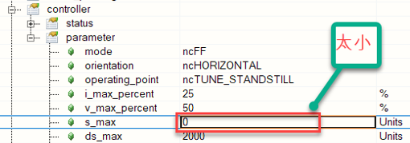
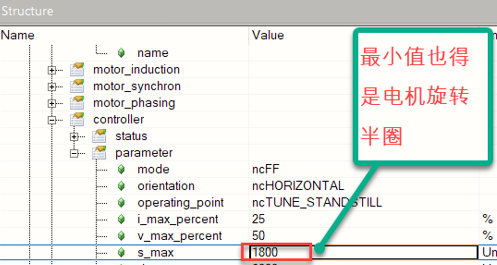

# 1：参数 ID 无效

描述:

写入或读取无效参数 ID 时出现响应错误。

反应:

无.

原因/补救措施:

查看错误号 [1002](#1002参数超出有效范围).

## 应用案例

### 2022.01.11

报警号1和32144

**问题**：参数表配置 FB DIO 时报警（用于 AC130卡）

**解决**：FB DIO不能仿真，实际运行中不会报警

# 2：用于上传的数据块不可用

描述

初始化数据块上传（数据块读取访问）期间出现响应错误。

用于数据块上载的选定数据在驱动器上不可用。

反应:

数据块读取访问未初始化。

原因/补救措施:

数据块上载的数据未有效传输到驱动器或未保存在驱动器上。

# 3：只读参数的写入访问权限

描述:

写入参数时出现响应错误，这不允许更改值。

反应:

不接受参数值。

原因/补救措施:

查看错误码 [1002](#1002参数超出有效范围).

# 4：对只写参数的读访问

描述：

读取参数时响应错误，不允许读取访问。

反应：

不传递参数值。

原因/补救措施：

查看错误编号 [1002](#1002参数超出有效范围).

# 8：数据块读访问已经初始化

描述：

如果前一个传输尚未完成，则在数据块读取访问（上传）初始化期间出现响应错误。

反应：

未针对参数 ID 初始化数据块读取访问。

原因/补救措施：

数据块下载期间出现序列错误。

另请参阅错误编号 [1002](#1002参数超出有效范围).

# 9：数据块写访问已经初始化

描述：

如果上次传输尚未完成，则在数据块写入访问（下载）初始化期间出现响应错误。

反应：

未针对参数 ID 初始化数据块写访问。

原因/补救措施：

数据块下载期间出现序列错误。

另请参阅错误编号 [1002](#1002参数超出有效范围).

# 10：数据块读取访问未初始化

描述:

如果未初始化数据块上载，则读取数据段（RD_BLOCK_SEGM，RD_BLOCK_LAST_SEGM）时出现响应错误。

反应:

不会传递任何数据。

原因/补救措施:

查看错误码 [8](#8数据块读访问已经初始化).

# 11：数据块写入访问未初始化

描述:

如果未初始化数据块下载，则写入数据段（WR_BLOCK_SEGM，WR_BLOCK_LAST_SEGM）时出现响应错误。

反应:

不保存任何数据。

原因/补救措施:

查看错误码 [9](#9数据块写访问已经初始化).

# 16：读取数据块时，数据段已经是最后一个

描述:

读取数据段（RD_BLOCK_SEGM）时出现响应错误（如果已传输上载数据的初始化长度）。最后一个数据段必须使用其自己的参数 ID （RD_BLOCK_LAST_SEGM） 进行传输。

反应:

数据块上传已中止。

原因/补救措施:

查看错误码 [8](#8数据块读访问已经初始化).

# 17：写入数据块时，数据段已经是最后一个

描述:

如果已传输下载数据的初始化长度，则写入数据段（RD_BLOCK_SEGM）时出现响应错误。最后一个数据段必须使用其自己的参数 ID （WR_BLOCK_LAST_SEGM） 进行传输。

反应:

数据块下载中止。不保存任何数据。

原因/补救措施:

查看错误码 [9](#9数据块写访问已经初始化).

# 18：读取数据块时，数据段还不是最后一个

描述:

读取最后一个数据段（RD_BLOCK_LAST_SEGM）时出现响应错误，如果尚未为初始化的长度传输足够的上载数据。

反应:

数据块上传已中止。

原因/补救措施:

查看错误码 [8](#8数据块读访问已经初始化).

# 19：写入数据块时，数据段还不是最后一个

描述:

如果尚未为初始化的长度传输足够的下载数据，则写入最后一个数据段（WR_BLOCK_LAST_SEGM）时出现响应错误。

反应:

数据块下载中止。不保存任何数据。

原因/补救措施:

查看错误码 [9](#9数据块写访问已经初始化).

# 21：数据块写入后的校验和无效

描述:

在 NC 系统模块（"acp10sys.br"或"acp10bsl.br"）的数据块下载期间，BsLoader 模式下的响应错误。NC 系统模块（BR 模块）的校验和无效。

反应：

查看错误码 [25](#25刻录系统模块只允许在下载后立即使用).

原因/补救措施:

查看错误码 [32018](#32018系统模块中的参数-id-无效).

查看错误码 [1012](#1012循环网络通信的崩溃).

# 23：数据块中的参数 ID 无效（数据块写入）

描述:

在 NC 系统模块（"acp10sys.br"或"acp10bsl.br"）的数据块下载期间，BsLoader 模式下的响应错误。数据块的参数 ID 与在传输的 NC 系统模块的 BR 模块标头中输入的参数 ID 不匹配。

反应：

查看错误码 [25](#25刻录系统模块只允许在下载后立即使用).

原因/补救措施:

传输的数据块是无效的 NC 系统模块。

在操作系统下载期间传输了BsLoader（"acp10bsl.br"）。

在BsLoader下载期间传输了操作系统（"acp10sys.br"）。

查看错误号 [32018](#32018系统模块中的参数-id-无效).

# 25：刻录系统模块只允许在下载后立即使用

描述:

在BsLoader模式下，在"烧毁NC系统模块"命令期间出现响应错误。驱动器上没有有效的 NC 系统模块（"acp10sys.br"或"acp10bsl.br"），或者在 NC 系统模块下载后未立即执行烧伤命令。

反应：

NC系统模块被识别为无效，无法保存（刻录到闪存）。

原因/补救措施:

未执行 NC 系统模块下载。

NC 系统模块出现故障、无效或不兼容。

NC 系统模块下载过程中出现序列错误。

另请参阅错误号 [32018](#32018系统模块中的参数-id-无效).

# 27：操作系统无法启动（操作系统不在FPROM上）

描述:

在更改启动状态"启动操作系统"的命令期间出现响应错误。驱动器上没有保存操作系统。

反应：

操作系统未启动。

原因/补救措施:

查看错误码 [32018](#32018系统模块中的参数-id-无效).

# 40：参数值高于最大值

描述：

写入参数时响应错误，如果该值大于此参数的上限。

反应：

不接受参数值。

原因/补救措施：

查看错误编号 [1002](#1002参数超出有效范围).

# 41：参数值高于最大值

描述：

查看错误编号 [40](#40参数值高于最大值).

反应：

查看错误编号 [40](#40参数值高于最大值).

原因/补救措施：

查看错误编号 [40](#40参数值高于最大值).

# 42：参数值高于最大值

描述：

查看错误编号 [40](#40参数值高于最大值).

反应：

查看错误编号 [40](#40参数值高于最大值).

原因/补救措施：

查看错误编号 [40](#40参数值高于最大值).

# 52：参数值低于最小值

描述：

写入参数时响应错误，如果该值小于该参数的下限。

反应：

不接受参数值。

原因/补救措施：

查看错误编号 [1002](#1002参数超出有效范围).

# 53：参数值低于最小值

描述：

查看错误编号 [52](#52参数值低于最小值).

反应：

查看错误编号 [52](#52参数值低于最小值).

原因/补救措施：

查看错误编号 [52](#52参数值低于最小值).

## 应用案例

### 2019.11.27

Error 1002 / Error 53 / Error 1034 ACOPOS Micro (80VD100PD.C033-01)控制 8WSB 系列伺服电机

**原因 1：** 配置编码器参数表时，‘Encoder Scaling’参数与‘SSI Number of data bits’不匹配。

**解决方案：** ‘Encoder Scaling’和‘SSI Number of data bits’两个参数取决于编码器分辨率，需要相互匹配。例如一个 17 位编码器， Scaling 为 131072，对应的 Data bits 应为 17。

**原因 2：** 编码器参数表中的波特率（Baud Rate）设置值过低。

**解决方案：** 计算出波特率范围。（建议设置为最大值 400kBaud) |

# 54：参数值低于最小值

描述：

查看错误编号 [52](#52参数值低于最小值).

反应：

查看错误编号 [52](#52参数值低于最小值).

原因/补救措施：

查看错误编号 [52](#52参数值低于最小值).

# 64：BR 模块中的硬件 ID 无效（数据块写入）

描述：

在下载 NC 系统模块（'acp10sys.br' 或 'acp10bsl.br'）期间，BsLoader 模式下的响应错误。 NC 系统模块的 BR 模块头中的硬件 ID 无效或与 ACOPOS 硬件不兼容。

反应：

查看错误编号 [25](#25刻录系统模块只允许在下载后立即使用).

原因/补救措施：

ACOPOS 硬件不支持 NC 系统模块。

查看错误编号 [32018](#32018系统模块中的参数-id-无效).

# 65：BR模块中的硬件版本无效（数据块写入）

描述：

在下载 NC 系统模块（'acp10sys.br' 或 'acp10bsl.br'）期间，BsLoader 模式下的响应错误。 NC 系统模块的 BR 模块头中的硬件版本与驱动器的硬件版本不兼容。

反应：

查看错误编号 [25](#25刻录系统模块只允许在下载后立即使用).

原因/补救措施：

不正确的操作系统版本或 BsLoader 版本：

ACOPOS伺服驱动器8Vxxxx.00-1不允许加载BsLoader V047或操作系统V110。

ACOPOS伺服驱动器8Vxxxx.xx-2不允许加载BsLoader V0381或操作系统V0390。

查看错误编号 [32018](#32018系统模块中的参数-id-无效).

# 66：驱动器上的操作系统与现有网络不兼容

描述：

“更改引导状态”命令期间 BsLoader 模式下的响应错误。 操作系统无法启动，因为保存的操作系统不支持现有网络。

操作系统的硬件ID：

80h...CAN 操作系统

81h...POWERLINK 操作系统

反应：

不执行命令。

原因/补救措施：

POWERLINK 操作系统保存在带有 CAN 网卡（AC110 插卡）的驱动器上。

CAN 操作系统保存在带有 POWERLINK 网卡（AC112 插卡）的驱动器上。

查看错误编号 [32018](#32018系统模块中的参数-id-无效).

# 67：必要的参数丢失或无效

描述：

写入参数时响应错误。 分配所需的参数未配置或配置不正确

反应：

不接受参数值。

原因/补救措施：

参数配置顺序错误。

相关参数丢失或之前配置无效。

示例：如果打开外部泄放器时，并非外部泄放器的所有参数都配置有效，则发送此错误.

# 68：数据块长度无效

描述：

如果数据块长度无效，则在刻录数据块时响应错误。

反应：

数据块刻录过程中止。

原因/补救措施：

数据模块的块长度无效

网络传输错误。 另请参阅错误编号 [1012](#1012循环网络通信的崩溃).

# 69：命令接口被占用

描述：

命令启动期间的响应错误。 该命令无法启动，因为前面的命令未完成。

反应：

不执行命令。

原因/补救措施：

等待活动命令完成.

# 70：必要参数的值太高

描述：

如果必要参数的值过高，则写入参数时响应错误。

反应：

不接受参数值。

原因/补救措施：

参数配置顺序错误。

相关参数丢失或之前配置无效。

查看错误编号 [1002](#1002参数超出有效范围).

# 71：必要参数的值太低

描述：

如果必要参数的值太低，则写入参数时响应错误。

反应：

不接受参数值。

原因/补救措施：

参数配置顺序错误。

相关参数丢失或之前配置无效。

查看错误编号 [1002](#1002参数超出有效范围).

## 应用案例

### 2022.08.09

ncFF 整定时报错71 S_max 值太小，最小也得旋转半圈

 |

# 72：固件版本低于最低必要固件版本

描述：

下载到目标的固件版本低于设备所需的固件版本。

反应：

下载的固件不会被烧录到设备内存中。

原因/补救措施：

设备所需的最低固件版本大于下载的固件版本。

项目的固件版本应大于设备的最低版本.

# 73：无效的 R4 浮点格式

描述：

如果值超出 32 位浮点数的有效范围，则写入 R4 参数时出现响应错误。

32 位浮点数（单精度浮点数）的有效范围：-3.40282347E+39 (0xFF7FFFFF) 到 -1.17549435E-38 (0x80800000), -0 (0x80000000), 0 (0x0005000400x0050040080408004 3.40282347E+39 (0x7F7FFFFF)

无效的32位浮点数：+ Infinity（0x7f800000），-infinity（＃ff800000），nan（＃ff800001 ..＃fffffffff），+下溢1.40129846e-45（0x00000001）至1.17549421e-38（0x007ffffff），underflow - 1.40129846E-45 (0x80000001) 到 -1.17549421E-38 (0x807FFFFF)

反应：

不接受参数值。

原因/补救措施：

查看错误编号 [33002](#33002浮点异常).

查看错误编号 [1002](#1002参数超出有效范围).

# 74：只能通过通道1（轴1）写入参数

描述：

写入参数时响应错误。 该参数只能通过 ACOPOS 模块上的通道 1（轴 1）写入。

反应：

不接受参数值。

原因/补救措施：

用于所需功能的参数 ID 不正确。

网络传输错误。 另请参阅错误编号 [1012](#1012循环网络通信的崩溃).

# 75：所选电机类型不允许参数

描述：

写入参数时出错，因为它与当前电机类型不兼容。

反应：

不会应用参数值。

原因/补救措施：

电机参数可能不一致和/或此电机类型不支持该功能。 检查电机参数和功能.

# 📋回到总览页

[000轴控ACOPOS报警号](000轴控ACOPOS报警号.md)
