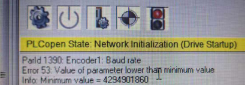

- [1001：错误 - FIFO 溢出](#_1001%E9%94%99%E8%AF%AF---fifo-%E6%BA%A2%E5%87%BA)
- [1002：参数超出有效范围](#_1002%E5%8F%82%E6%95%B0%E8%B6%85%E5%87%BA%E6%9C%89%E6%95%88%E8%8C%83%E5%9B%B4)
	- [应用案例](#_%E5%BA%94%E7%94%A8%E6%A1%88%E4%BE%8B)
		- [2019.11.27](#_20191127)
		- [2017.08.03](#_20170803)
		- [2023.07.14](#_20230714)
- [1003：循环控制处于活动状态时无法写入参数](#_1003%E5%BE%AA%E7%8E%AF%E6%8E%A7%E5%88%B6%E5%A4%84%E4%BA%8E%E6%B4%BB%E5%8A%A8%E7%8A%B6%E6%80%81%E6%97%B6%E6%97%A0%E6%B3%95%E5%86%99%E5%85%A5%E5%8F%82%E6%95%B0)
	- [应用案例](#_%E5%BA%94%E7%94%A8%E6%A1%88%E4%BE%8B)
		- [2020.07.15](#_20200715)
- [1004：网络生命标志监视器超时](#_1004%E7%BD%91%E7%BB%9C%E7%94%9F%E5%91%BD%E6%A0%87%E5%BF%97%E7%9B%91%E8%A7%86%E5%99%A8%E8%B6%85%E6%97%B6)
- [1005：当运动处于活动状态时，无法写入参数](#_1005%E5%BD%93%E8%BF%90%E5%8A%A8%E5%A4%84%E4%BA%8E%E6%B4%BB%E5%8A%A8%E7%8A%B6%E6%80%81%E6%97%B6%EF%BC%8C%E6%97%A0%E6%B3%95%E5%86%99%E5%85%A5%E5%8F%82%E6%95%B0)
	- [应用案例](#_%E5%BA%94%E7%94%A8%E6%A1%88%E4%BE%8B)
		- [2023.07.07](#_20230707)
- [1006：触发事件（数字输入 + 边沿）参数无效](#_1006%E8%A7%A6%E5%8F%91%E4%BA%8B%E4%BB%B6%EF%BC%88%E6%95%B0%E5%AD%97%E8%BE%93%E5%85%A5--%E8%BE%B9%E6%B2%BF%EF%BC%89%E5%8F%82%E6%95%B0%E6%97%A0%E6%95%88)
- [1008：网络耦合主站已停用 - 编码器错误](#_1008%E7%BD%91%E7%BB%9C%E8%80%A6%E5%90%88%E4%B8%BB%E7%AB%99%E5%B7%B2%E5%81%9C%E7%94%A8---%E7%BC%96%E7%A0%81%E5%99%A8%E9%94%99%E8%AF%AF)
- [1009：内存分配期间出错](#_1009%E5%86%85%E5%AD%98%E5%88%86%E9%85%8D%E6%9C%9F%E9%97%B4%E5%87%BA%E9%94%99)
- [1011：快速停止输入处于活动状态](#_1011%E5%BF%AB%E9%80%9F%E5%81%9C%E6%AD%A2%E8%BE%93%E5%85%A5%E5%A4%84%E4%BA%8E%E6%B4%BB%E5%8A%A8%E7%8A%B6%E6%80%81)
- [1012：循环网络通信的崩溃](#_1012%E5%BE%AA%E7%8E%AF%E7%BD%91%E7%BB%9C%E9%80%9A%E4%BF%A1%E7%9A%84%E5%B4%A9%E6%BA%83)
	- [应用案例](#_%E5%BA%94%E7%94%A8%E6%A1%88%E4%BE%8B)
		- [2022.07.22](#_20220722)
		- [2022.12.09](#_20221209)
		- [2023.07.04](#_20230704)
		- [2023.07.05](#_20230705)
- [1013：工作站不可用于网络通信](#_1013%E5%B7%A5%E4%BD%9C%E7%AB%99%E4%B8%8D%E5%8F%AF%E7%94%A8%E4%BA%8E%E7%BD%91%E7%BB%9C%E9%80%9A%E4%BF%A1)
- [1014：网络命令接口被占用](#_1014%E7%BD%91%E7%BB%9C%E5%91%BD%E4%BB%A4%E6%8E%A5%E5%8F%A3%E8%A2%AB%E5%8D%A0%E7%94%A8)
- [1016：超出最大循环时间 - CPU 负载过高](#_1016%E8%B6%85%E5%87%BA%E6%9C%80%E5%A4%A7%E5%BE%AA%E7%8E%AF%E6%97%B6%E9%97%B4---cpu-%E8%B4%9F%E8%BD%BD%E8%BF%87%E9%AB%98)
- [1017：循环读取访问的参数 ID 无效](#_1017%E5%BE%AA%E7%8E%AF%E8%AF%BB%E5%8F%96%E8%AE%BF%E9%97%AE%E7%9A%84%E5%8F%82%E6%95%B0-id-%E6%97%A0%E6%95%88)
- [1018：循环写入访问的参数 ID 无效](#_1018%E5%BE%AA%E7%8E%AF%E5%86%99%E5%85%A5%E8%AE%BF%E9%97%AE%E7%9A%84%E5%8F%82%E6%95%B0-id-%E6%97%A0%E6%95%88)
- [1021：无法写入参数：功能块处于活动状态](#_1021%E6%97%A0%E6%B3%95%E5%86%99%E5%85%A5%E5%8F%82%E6%95%B0%E5%8A%9F%E8%83%BD%E5%9D%97%E5%A4%84%E4%BA%8E%E6%B4%BB%E5%8A%A8%E7%8A%B6%E6%80%81)
- [1022：要驱动的循环数据的生命体征监控超时](#_1022%E8%A6%81%E9%A9%B1%E5%8A%A8%E7%9A%84%E5%BE%AA%E7%8E%AF%E6%95%B0%E6%8D%AE%E7%9A%84%E7%94%9F%E5%91%BD%E4%BD%93%E5%BE%81%E7%9B%91%E6%8E%A7%E8%B6%85%E6%97%B6)
- [1023：不允许使用循环通信模式进行网络耦合](#_1023%E4%B8%8D%E5%85%81%E8%AE%B8%E4%BD%BF%E7%94%A8%E5%BE%AA%E7%8E%AF%E9%80%9A%E4%BF%A1%E6%A8%A1%E5%BC%8F%E8%BF%9B%E8%A1%8C%E7%BD%91%E7%BB%9C%E8%80%A6%E5%90%88)
- [1024：无法实现当前网络配置的循环通信模式](#_1024%E6%97%A0%E6%B3%95%E5%AE%9E%E7%8E%B0%E5%BD%93%E5%89%8D%E7%BD%91%E7%BB%9C%E9%85%8D%E7%BD%AE%E7%9A%84%E5%BE%AA%E7%8E%AF%E9%80%9A%E4%BF%A1%E6%A8%A1%E5%BC%8F)
- [1025：不允许与保持制动器相关的参数值](#_1025%E4%B8%8D%E5%85%81%E8%AE%B8%E4%B8%8E%E4%BF%9D%E6%8C%81%E5%88%B6%E5%8A%A8%E5%99%A8%E7%9B%B8%E5%85%B3%E7%9A%84%E5%8F%82%E6%95%B0%E5%80%BC)
- [1026：不允许使用与安全模块相关的参数值](#_1026%E4%B8%8D%E5%85%81%E8%AE%B8%E4%BD%BF%E7%94%A8%E4%B8%8E%E5%AE%89%E5%85%A8%E6%A8%A1%E5%9D%97%E7%9B%B8%E5%85%B3%E7%9A%84%E5%8F%82%E6%95%B0%E5%80%BC)
- [1027：此功能不适用于此硬件](#_1027%E6%AD%A4%E5%8A%9F%E8%83%BD%E4%B8%8D%E9%80%82%E7%94%A8%E4%BA%8E%E6%AD%A4%E7%A1%AC%E4%BB%B6)
- [1028：超出最大网络耦合数](#_1028%E8%B6%85%E5%87%BA%E6%9C%80%E5%A4%A7%E7%BD%91%E7%BB%9C%E8%80%A6%E5%90%88%E6%95%B0)
- [1029：无法写入参数：停止斜坡活动](#_1029%E6%97%A0%E6%B3%95%E5%86%99%E5%85%A5%E5%8F%82%E6%95%B0%E5%81%9C%E6%AD%A2%E6%96%9C%E5%9D%A1%E6%B4%BB%E5%8A%A8)
- [1030：ACOPOS 仿真仅在"Complete"模式下才提供功能](#_1030acopos-%E4%BB%BF%E7%9C%9F%E4%BB%85%E5%9C%A8complete%E6%A8%A1%E5%BC%8F%E4%B8%8B%E6%89%8D%E6%8F%90%E4%BE%9B%E5%8A%9F%E8%83%BD)
- [1031：位置控制器周期时间已超出 - CPU 负载过高](#_1031%E4%BD%8D%E7%BD%AE%E6%8E%A7%E5%88%B6%E5%99%A8%E5%91%A8%E6%9C%9F%E6%97%B6%E9%97%B4%E5%B7%B2%E8%B6%85%E5%87%BA---cpu-%E8%B4%9F%E8%BD%BD%E8%BF%87%E9%AB%98)
- [1032：内部总线错误](#_1032%E5%86%85%E9%83%A8%E6%80%BB%E7%BA%BF%E9%94%99%E8%AF%AF)
- [1034：不允许使用与电机编码器齿轮相关的参数值](#_1034%E4%B8%8D%E5%85%81%E8%AE%B8%E4%BD%BF%E7%94%A8%E4%B8%8E%E7%94%B5%E6%9C%BA%E7%BC%96%E7%A0%81%E5%99%A8%E9%BD%BF%E8%BD%AE%E7%9B%B8%E5%85%B3%E7%9A%84%E5%8F%82%E6%95%B0%E5%80%BC)
	- [应用案例](#_%E5%BA%94%E7%94%A8%E6%A1%88%E4%BE%8B)
		- [2019.11.27](#_20191127)
- [1035：编码器处于活动状态时无法写入参数。](#_1035%E7%BC%96%E7%A0%81%E5%99%A8%E5%A4%84%E4%BA%8E%E6%B4%BB%E5%8A%A8%E7%8A%B6%E6%80%81%E6%97%B6%E6%97%A0%E6%B3%95%E5%86%99%E5%85%A5%E5%8F%82%E6%95%B0)
- [📋回到总览页](#_%E5%9B%9E%E5%88%B0%E6%80%BB%E8%A7%88%E9%A1%B5)

# 1001：错误 - FIFO 溢出

- **描述**：
    - ACOPOS 上错误消息的 FIFO 已满。在此错误 FIFO 中仅输入运行时错误。响应错误直接作为对参数写入或读取的响应发送。
- **反应**：
    - 进一步的错误消息将丢失。
- **原因/补救措施**：
    - 通过网络：
        - 没有错误被读取或
        - 错误读取速度太慢。
    - 在 ACOPOS 上：
        - 输入的错误太多或
        - 错误输入得太快。
    - 请参阅其他输入的错误号。

# 1002：参数超出有效范围

- **描述**：
    - 如果值超出有效限制，则写入参数时出现响应错误。
- **反应**：
    - 不接受参数值。
- **原因/补救措施**：
    - 用于所需函数的参数 ID 不正确。
    - 该值不是有效的常量，或者不在允许的选择列表中。
    - 该值超过或不符合实现限制。
    - 该值超出物理上可能的范围（例如负时间）。
    - 此参数 ID 的数据类型或数据长度不正确。
    - 网络传输错误。另请参见错误号 [1012](#1012循环网络通信的崩溃).
    - 详细信息也可以在网络命令跟踪中看到。

## 应用案例

### 2019.11.27

- Error 1002 / Error 53 / Error 1034 ACOPOS Micro (80 VD 100 PD. C 033-01)控制 8 WSB 系列伺服电机
- 
- **原因 1：** 配置编码器参数表时，‘Encoder Scaling’参数与‘SSI Number of data bits’不匹配。
    - **解决方案**：‘Encoder Scaling’和‘SSI Number of data bits’两个参数取决于编码器分辨率，需要相互匹配。例如一个 17 位编码器， Scaling 为 131072，对应的 Data bits 应为 17。
- **原因 2：** 编码器参数表中的波特率（Baud Rate）设置值过低。
    - **解决方案**：计算出波特率范围。（建议设置为最大值 400kBaud)

### 2017.08.03

- 8BAC0125.000-1 编码器卡使用配置编码器参数不合理，例如8BAC0125.000-1 卡，需要在合理配置完成参数后，再设置 ID1228与 ID 1225

### 2023.07.14

- **现象** 新设备，一上电就报错
- **原因** 驱动器上编码器卡没插好或者插错了位置 程序里有对驱动器上的编码器卡通过ParID进行写入操作，如果对应编码器卡没有在正确的槽位上，就会报错

# 1003：循环控制处于活动状态时无法写入参数

- **描述**：
    - 写入参数时出现响应错误，这不允许在控制器处于活动状态时更改值。
- **反应**：
    - 不接受参数值。
- **原因/补救措施**：
    - 该参数编写得太晚（在"打开控制器"命令之后）。
    - "关闭控制器"命令丢失或未在驱动器状态（移动活动）下执行。
    - 缺少"控制器关闭"状态的请求（延迟步骤）。
    - -> 检查程序顺序和状态请求。

## 应用案例

### 2020.07.15

- 使用ACOPOS P3的外接编码器卡8EAC0130，写入ID 1301及ID 1572时轴必须处于Disable状态，否则会报错1003 Parameter cannot be written while loop control is active。

# 1004：网络生命标志监视器超时

- **描述**：
    - 活动网络生命标志监视期间的运行时错误，如果在指定的时间内没有循环电报到达（NETWORK_LIVE_CTRL）。
    - 另请参阅错误号 [4005](#4005控制器无法开启驱动处于错误状态).
- **反应**：
    - See error number [9000](#9000散热器温度传感器超出停止限制).
    - 所有数字输出（AC130、AC131）均已停用（即输出电平设置为低电平，所有可切换 IO 均设置为输入）。
    - 虚拟轴的移动将中止。
- **原因/补救措施**：
    - 网络生活标志监视器中的问题：
        - 网络生命标志监视NETWORK_LIVE_CTRL定义为太短。
        - 在发送循环电报之前，网络生命体征监控被激活得太早。
    - 网络数据传输中的问题：
        - 超过周期时间，计算时间负载极高或控制器CPU出现故障。
        - 网络连接干扰或断开连接。请参阅接线指南错误号 [7030](#7030编码器增量信号幅度太大).
        - 网络负载过高。

# 1005：当运动处于活动状态时，无法写入参数

- **描述**：
    - 写入参数时出现响应错误，这不允许在运动处于活动状态时更改值
- **反应**：
    - 不接受参数值。
- **原因/补救措施**：
    - 在运动开始命令之后，该参数编写得太晚。
    - 缺少"移动完成"状态的请求（延迟步骤）。
    - -> 检查程序顺序和状态请求。

## 应用案例

### 2023.07.07

- 因为 MC_BR_MechPosDeviationComp.Active 未 TRUE 便触发了 AbsMove 命令，所以报错1005。
- 增加补偿完成条件后问题解决。

# 1006：触发事件（数字输入 + 边沿）参数无效

- **描述**：
    - 如果值是无效的数字输入或无效的触发边沿，则写入事件参数时出现响应错误。
- **反应**：
    - 不接受参数值。
- **原因/补救措施**：
    - 查看错误码 [1002](#1002参数超出有效范围)

# 1008：网络耦合主站已停用 - 编码器错误

- **描述**：
    - 如果发送实际位置并且相应的编码器发送错误，则为网络耦合发送循环主数据时出现运行时错误。
    - 附加信息 1/2/3 标识关联的主发送对象 MA1/2/3_CYCLIC_SEND。
- **反应**：
    - 为此耦合对象停用数据传输，以防止位置跳跃。
- **原因/补救措施**：
    - 请参阅其他输入的编码器错误号。

# 1009：内存分配期间出错

- **描述**：
    - 如果没有足够的内存用于请求的函数，则动态内存管理中的响应错误。
- **反应**：
    - 不执行最近请求的函数。
    - 不会保存下载数据。
    - 不接受参数值。
- **原因/补救措施**：
    - 单个内存区域太大或使用了太多内存：
    - 凸轮数据下载，
    - 参数序列下载，
    - EPROM数据下载，
    - 创建功能块 （FUNCTION_BLOCK_CREATE），
    - 使用内存分配（CAMCON_MAX_CAM、FIFO_MAX_LENGTH、AXLIM_T_JOLT AXLIM_T_JOLT_VAX1）写入参数时，
    - 设置函数 （CMD_PIDENT=ncSTART）

# 1011：快速停止输入处于活动状态

- **描述**：
    - 如果配置的数字输入处于活动状态，则快速停止功能中的运行时错误。
    - 另请参阅错误号 [4005](#4005控制器无法开启驱动处于错误状态).
- **反应**：
    - "控制器就绪"状态为重置。
    - 当"打开控制器"命令时：请参阅错误号 [4005](#4005控制器无法开启驱动处于错误状态).
    - 默认设置 QUICKSTOP_DECEL_RAMP=ncA_LIMIT 且 QUICKSTOP_DECEL_RAMP=ncA_LIMIT+ncQUICKSTOP_T_JOLT：
    - 当位置控制处于活动状态时（CONTROLLER_MODE=ncPOSITION 或 ncPOSITION+ncFF）：
    - 随着轴限值的减速和控制器的关闭，运动停止。
    - 对于 ncA_LIMIT+ncQUICKSTOP_T_JOLT，还会考虑参数QUICKSTOP_T_JOLT。
    - 当速度控制处于活动状态时：
        - 通过速度调节斜坡，轴限制和关闭控制器来停止运动。
    - 当 U/f 控制处于活动状态时 （CONTROLLER_MODE=ncUF）：
        - 通过速度控制的斜坡，轴限制和关闭控制器来停止运动。
    - 当电流控制在换向（CONTROLLER_MODE=4）时处于活动状态时：
        - 移动停止电流限制并关闭控制器。
    - 设置QUICKSTOP_DECEL_RAMP=ncTRQ_LIMIT：
        - 独立于控制器模式：运动在扭矩限制下中止。
    - 设置QUICKSTOP_DECEL_RAMP=ncINDUCTION：
        - 独立于控制器模式：运动中止，感应停止。另请参阅错误号 [9001](#9001散热器温度传感器超出关闭限制).
- **原因/补救措施**：
    - 查看错误号 [6021](#6021控制器使能输入低电平)

# 1012：循环网络通信的崩溃

- **描述**：
    - 运行时错误，如果网卡的固件检测到循环 POWERLINK 通信失败。
    - 查看错误号 [4005](#4005控制器无法开启驱动处于错误状态).
- **反应**：
    - 查看错误号 [9000](#9000散热器温度传感器超出停止限制).
    - 所有数字输出（AC130、AC131）均已停用（即输出电平设置为低电平，所有可切换 IO 均设置为输入）。
    - 虚拟轴的移动将中止。
- **原因/补救措施**：
    - 网络布线中断。
    - 电源链路站出现故障或已关闭。
    - 连接在一起的工作站过多（最大 HUB 层数、最大网络电缆长度）。
    - 对于配置的 POWERLINK 循环时间，工作站太多。
    - 环境温度超出有效范围。
    - 网络插件卡 （AC114） 有缺陷或硬件修订版错误。
    - 发生网络干扰时：请参阅接线指南错误号 [7030](#7030编码器增量信号幅度太大)
    - 另请参阅 PLC 的诊断数据点：FailedCycleCount、CycleTimeViolationCount 和 CycleIdleTime。

## 应用案例

### 2022.07.22

- 报警64006、32037、1012、32189：网线松动

### 2022.12.09

- PLK 线插拔后复位解决

### 2023.07.04

- **现象** 机器运行之后发生了某一驱动器报错，32037 32189 1012 ，其他驱动器没有报错
- **原因** POWERLINK 网络通信质量问题
- **解决方式** 重新拔插 POWERLINK 线缆后，问题解决。需要校核 POWERLINK 网络质量，优化参数

### 2023.07.05

- **现象** 多个 ACOPOS Micro 上电后报警1012、32280等通讯故障，无法复位现场检查报警驱动，发现从拓扑无一致性，部分驱动位于 PLK 的通讯末端、部分位于 PLK 的网络中部。断电后修改 PLK 网线的连接顺序，无效果。 Test 模式下连接伺服，可强制复位报警，但其仍显示网络无法连接。
- **解决方式** 考虑到该设备时间已久、可能存在硬件老化问题，修改PLK配置的Asynchronous timeout数值，由默认的25改为100。 多次断电重启，未再出现通讯报警。

# 1013：工作站不可用于网络通信

- **描述**：
    - 如果用于耦合的网络站不可用，则配置循环接收数据时出错 （CONFIG_MA 1/2/3/4/5_CYCLIC_POS）。
- **反应**：
    - 循环数据（位置）在相应的参数 ID （MA 1/2/3/4/5_CYCLIC_POS） 上不可用，并且不会更新。
- **原因/补救措施**：
    - 无效的站号。
    - 配置编写得太早。
    - 工作站尚未在网络上或出现故障。
    - 另请参阅错误号 [1012](#1012循环网络通信的崩溃)

# 1014：网络命令接口被占用

- **描述**：
    - 如果最后一个命令的处理尚未完成，则配置循环接收数据时出错 (CONFIG_MA1/2/3/4/5_CYCLIC_POS).
- **反应**：
    - 不接受网络耦合的配置。
- **原因/补救措施**：
    - 此耦合对象的配置一个接一个地编写了好几次太快了。

# 1016：超出最大循环时间 - CPU 负载过高

- **描述**：
    - 如果 ACOPOS 上的计算时间负载过高（例如，在 400us 的位置控制器周期内不再完成设置值生成、网络处理和功能块），则在处理中等优先级操作系统功能时出现运行时错误。高优先级控制器功能通过严格的循环进一步处理。
    - ACOPOSmulti，ACOPOSmicro，ACOPOS P3：此错误仅在1轴（通道）上注册。
- **反应**：
    - 根据持续时间和超过周期时间的程度，可能会发生后续错误（例如速度跳跃和滞后错误）。
- **原因/补救措施**：
    - 有关诊断，请参见参数CPU_TICKS_CYCLE_PEAK （139）。
    - 以下各项显示了一些增加处理器负载的常见示例：
    - 提高开关频率F_SWITCH。
    - ICTRL_MODE Bit0 提高电流控制器动态（电流控制器周期时间减半）。
    - 设置当前筛选器为活动ISQ_FILTER1_TYPE、ISQ_FILTER2_TYPE ISQ_FILTER3_TYPE。
    - 许多功能会阻止活动FUNCTION_BLOCK_CREATE。在多个 EVWR FB 实例上同时发生事件或编写计算密集型命令会产生负载峰值。
    - 循环通信，数据驱动CYCLIC_TODRV_PARID。同时写入多个参数 ID 或写入计算密集型命令会产生负载峰值。
    - 凸轮自动，补偿齿轮AUT_COMP_MODE。
    - 虚拟轴、基础运动或凸轮自动。
    - 多个网络耦合功能处于活动状态，CONFIG_MA1/2/3/4/5_CYCLIC_POS。
    - 虚拟编码器活动ENCOD0_MODE。
    - 重复控制主动CMD_SCTRL_RC。
    - 循环跟踪，记录多个测试数据点。
    - ACOPOS：插槽 3 或插槽 4 中的额外插件卡。编码器插件卡需要更多的计算时间。
    - ACOPOSmulti，ACOPOSmicro，ACOPOS P3：所有轴（通道）都处于活动状态。

# 1017：循环读取访问的参数 ID 无效

- **描述**：
    - 使用指针参数 ID 配置循环读取访问或数据连接的响应错误。
- **反应**：
    - 不接受参数 ID。
- **原因/补救措施**：
    - 参数 ID 无效，数据类型不受支持（复合数据类型或不是 4 字节值）。
    - 不允许读取访问或参数具有计算密集型读取功能。

# 1018：循环写入访问的参数 ID 无效

- **描述**：
    - 使用指针参数 ID 配置循环写入访问或数据连接的响应错误。
- **反应**：
    - 不接受参数 ID。
- **原因/补救措施**：
    - 不允许写入访问权限。当控制器处于活动状态或移动处于活动状态时，不允许进行写访问。
    - 另请参阅错误号 [1017](#1017循环读取访问的参数-id-无效)

# 1021：无法写入参数：功能块处于活动状态

- **描述**：
    - 写入参数时出现响应错误，当相应的功能块处于活动状态时，不允许更改值。
- **反应**：
    - 不接受参数值。
- **原因/补救措施**：
    - 功能块不支持此参数的"联机"更改。
    - 功能块在特定工作状态下处于活动状态，这不允许"在线"更改此参数（例如，补偿运动中的MPGEN）。
    - 激活功能块或操作状态后，该参数编写得太晚。
    - 在写入参数之前未停用功能块，或者缺少状态请求。

# 1022：要驱动的循环数据的生命体征监控超时

- **描述**：
    - 在活动生命标志监视和主动控制器期间，如果指定的时间内没有要驱动器的循环数据到达（CYCLIC_TODRV_T_CTRL），则运行时错误。
- **反应**：
    - 默认设置 STOP_ERR_DECEL_RAMP=ncA_LIMIT：
    - 当位置控制处于活动状态时（CONTROLLER_MODE=ncPOSITION 或 ncPOSITION+ncFF）：
    - 移动停止，轴限制和关闭控制器。
    - 有关不同的控制器模式，另请参见错误号 [9000](#9000散热器温度传感器超出停止限制).
    - 有关STOP_ERR_DECEL_RAMP的不同设置，请参阅错误号 [4007](#4007超出滞后错误停止限制).
- **原因/补救措施**：
    - 生命体征监视器中的问题：
        - 生命体征监测CYCLIC_TODRV_T_CTRL时间定义太短。
        - 生命体征监控和控制器在发送循环电报之前过早激活。
    - 数据生成和数据传输中的问题：
        - 要驱动的循环用户数据中的计数器不会增加 （CYCLIC_TODRV_COUNT）。
        - 超过周期时间，计算时间负载极高或控制器任务失败。
        - -> 检查循环任务类的参数：持续时间、容差和 I/O 输出延迟。
    - 网络连接干扰或断开连接。请参阅接线指南错误号 [7030](#7030编码器增量信号幅度太大).
    - 网络负载过高。

# 1023：不允许使用循环通信模式进行网络耦合

- **描述**：
    - 配置网络耦合或循环通信模式的响应错误 （CYCLIC_TOFRDRV_MODE=1）。
- **反应**：
    - 不接受配置。
- **原因/补救措施**：
    - -> 停用网络耦合（MAx_CYCLIC_SEND、CONFIG_MAx_CYCLIC_POS）或循环通信模式 （CYCLIC_TOFRDRV_MODE=0）

# 1024：无法实现当前网络配置的循环通信模式

- **描述**：
    - 如果检测到无效的网络配置，则写入循环通信模式 （CYCLIC_TOFRDRV_MODE=1） 时出现响应错误。
- **反应**：
    - 不接受通信模式。
- **原因/补救措施**：
    - 缺少 POWERLINK 配置"PResMN 中的输出"

# 1025：不允许与保持制动器相关的参数值

- **描述**：
    - 写入参数时出现响应错误（如果该值不允许与保持制动器连接）。
- **反应**：
    - 不接受参数值。
- **原因/补救措施**：
    - 查看错误码 [1002](#1002参数超出有效范围).

# 1026：不允许使用与安全模块相关的参数值

- **描述**：
    - 写入参数时出现响应错误（如果不允许该值与 SAFETY 模块连接）。
- **反应**：
    - 不接受参数值。
- **原因/补救措施**：
    - ACOPOS P3 SafeMOTION：命令 CMD_BRAKE = ncSWITCH_OFF只有在配置了保持制动器（MOTOR_BRAKE_CURR_RATED ！= 0）时才能发送。
    - 查看错误号 [1002](#1002参数超出有效范围).

# 1027：此功能不适用于此硬件

- **描述**：
    - 如果当前 ACOPOS 硬件不支持请求的功能性，则写入参数时出现响应错误。
- **反应**：
    - 不接受参数值，并且不执行请求的函数。
- **原因/补救措施**：
    - 用于所需功能的ACOPOS硬件错误。
    - 查看 ACP10 软件 NC Object ncAXIS: ACOPOS Hardware Information GUID:6037f269-ba5e-4234-8422-bdd629b63e73
    - 查看错误码 [1002](#1002参数超出有效范围).

# 1028：超出最大网络耦合数

- **描述**：
    - 如果已注册了太多网络站或接收数据点，则配置循环接收数据的响应错误（CONFIG_MA1/2/3/4/5_CYCLIC_POS，CYCLIC_DP_DATA_OFFSET）。
- **反应**：
    - 不接受网络耦合的配置。
- **原因/补救措施**：
    - 每个设备有超过 5 个不同的网络站（ACOPOSmulti 或 ACOPOS P3）。
    - 每个设备有超过6个不同的接收数据点（ACOPOSmulti或ACOPOS P3）。
    - 另请参阅错误号 [1013](#1013工作站不可用于网络通信)

# 1029：无法写入参数：停止斜坡活动

- **描述**：
    - 写入参数时响应错误（如果移动停止处于活动状态）。
- **反应**：
    - 不接受参数值，并且不执行请求的函数。
- **原因/补救措施**：
    - 在停止命令后缺少状态请求（延迟步骤）。
    - 移动停止是由驱动器错误触发的。
    - 另请参阅错误号 [1002](#1002参数超出有效范围)

# 1030：ACOPOS 仿真仅在"Complete"模式下才提供功能

- **描述**：
    - 编写参数时的响应错误（如果模拟模式 'Standard'不支持所请求的功能性）
- **反应**：
    - 不接受参数值，并且不执行请求的函数。
- **原因/补救措施**：
    - 用于所需功能的错误模拟模式（"Standard"而不是"Complete"）。

# 1031：位置控制器周期时间已超出 - CPU 负载过高

- **描述**：
    - 如果级联的周期时间缩短，并且 ACOPOSmulti 3 或 ACOPOS P 3 上的计算时间负载过高，则处理中优先级位置控制器时的运行时错误会起作用。高优先级控制器功能通过严格的循环进一步处理。
    - 此错误仅在 1 轴（通道）上注册。
- **反应**：
    - 根据持续时间和超过周期时间的程度，可能会发生后续错误（例如速度跳跃和滞后错误）。
- **原因/补救措施**：
    - CTRL_CYCLE_TIME_MODE在所有轴（通道）上不等于 0。
    - 提高开关频率F_SWITCH。
    - ICTRL_MODE Bit0 提高电流控制器动态（电流控制器周期时间减半）。
    - 设置当前筛选器为活动ISQ_FILTER1_TYPE、ISQ_FILTER2_TYPE ISQ_FILTER3_TYPE。
    - 重复控制主动CMD_SCTRL_RC。
    - 循环跟踪，记录多个测试数据点。

# 1032：内部总线错误

- **描述**：
    - 内部组件之间数据传输期间（例如处理器和FPGA之间）的运行时错误。
    - 8EAC013x：仅存在于此周期中的脉冲无法识别。
- **反应**：
    - 8 EAC 0 xxx: 查看错误码 [7030](#7030编码器增量信号幅度太大).
    - Others: 无.
- **原因/补救措施**：
    - 电磁干扰。
    - ACOPOS有缺陷。

# 1034：不允许使用与电机编码器齿轮相关的参数值

- **描述**：
    - 写入参数时的响应误差，如果该值不允许与电机编码器齿轮连接。
- **反应**：
    - 不接受参数值。
- **原因/补救措施**：
    - 查看错误码 [1002](#1002参数超出有效范围).

## 应用案例

### 2019.11.27

- Error 1002 / Error 53 / Error 1034 ACOPOS Micro (80VD100PD.C033-01)控制 8WSB 系列伺服电机
- 
- **原因 1：** 配置编码器参数表时，‘Encoder Scaling’参数与‘SSI Number of data bits’不匹配。
    - **解决方案**： ‘Encoder Scaling’和‘SSI Number of data bits’两个参数取决于编码器分辨率，需要相互匹配。例如一个 17 位编码器， Scaling 为 131072，对应的 Data bits 应为 17。
- **原因 2：** 编码器参数表中的波特率（Baud Rate）设置值过低。
    - **解决方案：** 计算出波特率范围。（建议设置为最大值 400kBaud)

# 1035：编码器处于活动状态时无法写入参数。

- **描述**：
    - 如果至少启用了一个编码器（在 LLM_CYC_CH_CTRL_BITS 中设置了位 6），则写入不允许更改值的参数时出现响应错误。
- **反应**：
    - 将不应用参数值。
- **原因/补救措施**：
    - 该参数编写得太晚（在第一次调用"MC_BR_AsmPowerOn_AcpTrak"之后）。
    - 在第一次调用"MC_BR_AsmPowerOn_AcpTrak"之前写入参数，或删除分配给该段的所有穿梭机。

# 📋回到总览页

[000轴控ACOPOS报警号](000轴控ACOPOS报警号.md)
