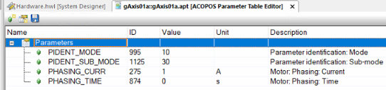

# 10000：缺少标识参数

- **描述**：
    - PIDENT_CMD 写入参数时出现响应错误。缺少至少一个标识所必需的参数。
- **反应**
    - 身份查验程序被取消。
- **原因/补救措施**：
    - 必要的参数
    - 查看 Drive identification:GUID: a9aadd11-ee47-4e88-9dfa-c355d86aa5bd

## 10001：参数标识：子模式无效

- **描述**：
    - PIDENT_CMD 写入参数时出现响应错误。
- **反应**：
    - 身份查验程序被取消。
- **原因/补救措施**：
    - 查看 Drive identification:GUID: a9aadd11-ee47-4e88-9dfa-c355d86aa5bd

## 10100：参数标识：未满足质量系数

- **描述**：
    - 当参数标识达到 0 时，PIDENT_FIT 出现运行时错误。
- **反应**：
    - 身份查验程序被取消。
- **原因/补救措施**：
    - **细节**：
        - 0：没有可用的详细信息。
        - 1：确定比例放大kv超出范围（0\<kv\< TUNE_KV_MAX）。
            - \- 扭矩限制器处于活动状态（选择TLIM_MODE = 0）
            - \- 错误的换向偏移MOTOR_COMMUT_OFFSET（重复相位）
            - \- 为TUNE_I_MAX_PERCENT选择更高的值
            - \- 用于识别频率响应函数的瞬态过程尚未消退（增加TUNE_DELAY_TIME）
            - \- 由于在识别过程中自动预配置速度和位置控制器，反馈太强（减少MOTOR_INERTIA）
            - \- 在开始识别之前，将位置控制器增益POS_CTRL_KV调整为一个小值
            - \- 直流母线标称电压UDC_NOMINAL无效或太小（例如：UDC_NOMINAL = 0）
        - 2：闭合速度回路具有不合格的行为（弱阻尼）。
            - \- 降低速度控制器增益 SCTRL_KV
        - 3：闭合位置回路具有不合格行为（弱阻尼）。
            - \- 降低位置控制器增益 POS_CTRL_KV
        - 4：频率响应测量无法完全以恒定速度进行。
            - \- 选择更高的值以获得最大移动距离 TUNE_S_MAX
        - 5：确定质量转动惯量FFCTRL_INERTIA超出范围（\>0）。
            - \- 选择加速度过大和/或速度过慢
            - \- 选择更高的值以获得最大移动距离 TUNE_S_MAX
        - 6：确定由于重力引起的恒载转矩高于电机MOTOR_TORQ_RATED的额定转矩。
            - \- 选择更大的电机
        - 7：确定加速度值过高。
            - \- 选择另一个最大移动距离 TUNE_S_MAX
        - 8：确定的震动时间AXLIM_T_JOLT不在允许的范围内（0...0.4）。
            - \- PIDENT_S不适合选择
            - \- AXLIM_AX_XXX选择太小
            - \- 控制回路不够动态
            - \- 前馈控制以这样一种方式进行参数化，即在滞后误差中无法识别振荡
        - 13：总质量惯性矩的估计值太小。
            - \- 适应PIDENT_SIGNAL_F_START和/或PIDENT_SIGNAL_F_STOP
            - \- 检查MOTOR_TORQ_CONST
        - 14：确定的谐振和反谐振频率的比率不合适。
            - \- 适应PIDENT_SIGNAL_F_START和/或PIDENT_SIGNAL_F_STOP
            - \- 检查机械装置是否能够振荡
        - 15：标识未提供有意义的值
            - \- 适应PIDENT_SIGNAL_F_START和/或PIDENT_SIGNAL_F_STOP
            - \- 检查MOTOR_TORQ_CONST
            - \- 检查机械装置是否能够振荡
        - 17：麦克斯韦摩擦参数的计算无效
            - \- 改编PARID_TUNE_S_MAX
            - \- 设置或改编PARID_TUNE_A
- **电机 - 识别参数集**：
    - \- 电机线路过长或未屏蔽
    - 应用屏蔽
        - \- 伺服和电机的功率组合不合适
        - \- 过载错误
    - 减少PIDENT_CURR_MAX并手动分配
- **电机 - ISQ-纹波**：
    - \- 设定电流信号中的噪声过大
        - 选择合适的过滤 （SCTRL_TI_FIL）
    - \- PIDENT_SPEED太高
        - 设置低速
    - \- 实际速度波动过大
        - 调整控制器设置
- **驱动-逆变器特性曲线**：
    - \- 电机线路过长或未屏蔽
        - 应用屏蔽
    - \- 伺服和电机的功率组合不合适
    - \- 过载错误
        - 减少 MOTOR_CURR_MAX 并手动分配
- **控制器参数（自动调谐auto-tuning）**：
    - 查看细节。
- **运动参数 - 识别震动时间**：
    - 查看细节。
- 查看 Drive identification: GUID: a9aadd11-ee47-4e88-9dfa-c355d86aa5bd

## 应用案例

### 2023.06.29

- **其他参数** PIDENT_FIT = 0
- **原因** 低频时有噪音的 FRF 低频的频率分辨率不好
- **补救措施** 增加激励幅度增加 PRBS 的信号顺序选择其他激励信号使用 TUNE_DELAY_TIME

### 2023.06.29

- 🔴此建议参数名可能错误，仅供参考
- **现象** 对电机进行 ncSPEED 的 tunning 是正常的但是在 ncPOSITION 上进行 tunning，却反馈错误10100
- **解决办法** 对电机进行相位调整，找出换向偏移。然后在 ncPOSITION 上将 poud 设置为 75%，将电压设置为 75%。然后电机就可以运行正常从 acopos 表中保存了这些参数并在 init 表中添加了几条命令，在每次启动后自动进行相位调整
- 

### 2023.07.07

- 速度模式的驱动轴Test下整定报错10100，无法test启动轴 重新整定速度环和位置环后可以

## 10101：没有ISQ滤波器空闲

- **描述**：
- **反应**：
    - 身份查验程序被取消。
- **原因/补救措施**：
    - 见驱动器识别: ISQ - Ripple compensation GUID: a9aadd11-ee47-4e88-9dfa-c355d86aa5bd

## 10102：未找到ISQ滤波器的谐振频率（带阻）

- **描述**：
    - 检测谐振频率时的运行时误差，应由 ISQ 滤波器作为陷波抑制。
- **反应**：
    - 取消识别过程并恢复参数。
- **原因/补救措施**：
    - 选择其他模式。

## 10103：自动调谐：超出最大滞后误差

- **描述**：
    - 如果最大滞后误差超过 TUNE_DS_MAX，则在自动调优期间出现运行时错误。
- **反应**：
    - 自动调谐在感应停止时中止，控制器参数恢复。
- **原因/补救措施**：
    - Ds_max 太小，外部负载扭矩要高，...

## 10104：参数识别：位置识别过程中的移动

- **描述**：
    - 由于识别过程中的移动而导致的运行时错误
- **反应**：
    - 识别程序被取消
- **原因/补救措施**：
    - 在识别过程中，检测到一个或多个穿梭机的运动。运动可能是由以下原因引起的
        - 在中止期间仍然储存动能，
        - 外力（例如重力）和/或
        - 磁阻力（例如分流器区域，节段过渡）。
    - 确保所有穿梭车在通电时都处于静止状态

## 10105：参数识别：穿梭机位置的合理性检查

- **描述**：
    - 运行时错误，这是由于穿梭机位置的合理性检查的负面结果
- **反应**：
    - 识别程序被取消
- **原因/补救措施**：
    - 在识别过程中，所确定的穿梭位置之间存在差异
    - 和位置传感器的响应。这可能是由于
        - \- 不正确的气隙，
        - \- 减少航天飞机之间的距离，
        - \- 缺陷穿梭车，
        - \- 段的不正确安装，
        - \- 在识别过程中穿梭机的移动和/或
        - \- 缺陷位置传感器。
    - 可能的改进或帮助识别问题：
        - \- 换班车
        - \- 移动受影响航段的穿梭车
        - \- 检查气隙
        - \- 检查受影响网段的安装和/或
        - \- 更改段

## 10500：感应停止已终止

- **描述**：
    - 运行时错误导致感应停止终止。
- **反应**：
    - 动力元件已停用，保持制动器已打开。
- **原因/补救措施**：
    - 同步电机：
        - 由错误 6019：ACOPOS： 如果再次发生过电流，"过电流 "将被终止。
        - 由错误 7200 触发的感应停机： 直流母线电压："过电压" 如果出现温度错误或短路电流大于最大电机电流或最大 ACOPOS 电流，则将终止

## 11000：段间通信：接线故障

- **描述**：
    - 如果连接了错误的连接器，则建立 ISC 连接时出错。
    - 该信息显示了有故障的 ISC 连接器：
        - 1 ... X3A / ISC1
        - 2 ... X3B / ISC2
- **反应**：
    - 未建立 ISC 连接。
- **原因/补救措施**：
    - 检查 ISC 1/X 3 A \<--\> ISC 2/X3B 的接线

## 11101：编码器：信号幅度过低

- **描述**：
    - 具有主动监视功能的编码器的运行时错误。振幅小于最小允许振幅。
- **反应**：
    - 编码器评估中止/编码器更改为错误状态。
    - 运动已中止。
    - 快速导航栏信息将被删除。
- **原因/补救措施**：
    - 编码器系统有缺陷。
    - 编码器校准数据不正确。
    - 穿梭车不在预期的位置范围（分流器或转移点）内。
    - 气隙太大。请参阅ACOPOStrak用户手册。

## 应用案例

### 2023.06.29

- 如果这些错误信息在开机后的第一次运动中立即出现（该段的控制器自动 switch off 关闭），那么应使用功能块 MC_BR_AsmDeleteShuttle_AcpTrak 删除该梭子，并再次开机（Switch on）（这将重新初始化该梭子）。
- 因此，不正确的位置检测可以以最好的方式得到纠正，而不需要手动移动梭子。

## 11102：编码器：信号幅度过高

- **描述**：
    - 具有主动监视功能的编码器的运行时错误。振幅大于最大允许振幅。
- **反应**：
    - 编码器评估中止/编码器更改为错误状态。
    - 运动已中止。
    - 快速导航栏信息将被删除。
- **原因/补救措施**：
    - 编码器系统有缺陷。
    - 编码器校准数据不正确。

# 📋回到总览页

[000轴控ACOPOS报警号](000轴控ACOPOS报警号.md)
