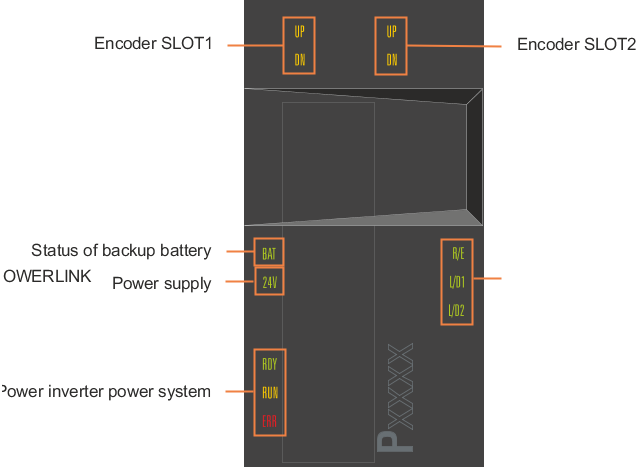
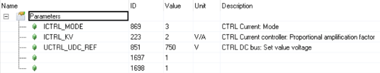
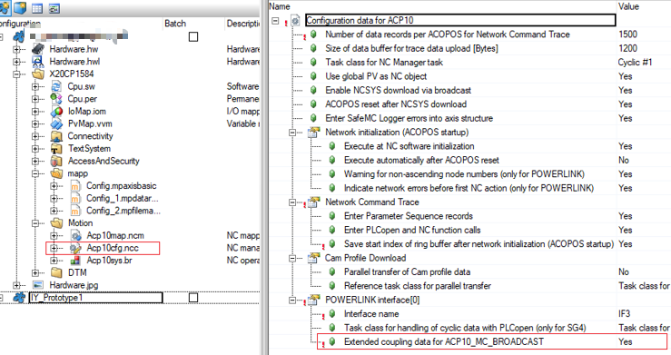
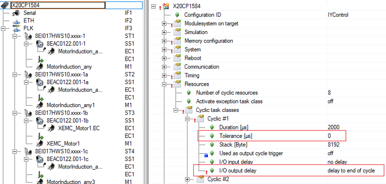

# ACOPOS 错误描述中文信息

ACOPOS 错误文本描述如下：

适用范围： ACP10/ARNC0

本节的主题:

| 错误报警号                                                   |
| ------------------------------------------------------------ |
| [31201: Di/Do Interface: Drive not ready](#31201-dido-接口-驱动器未就绪) |
| [31220: Encoder error: Encoder not configured](#31220编码器错误未配置编码器) |
| [31221: Encoder error: Cable disturbance or signal disturbance](#31221-编码器错误-电缆干扰或信号干扰) |
| [31224: Encoder Interface: HW Module not OK](#31224编码器接口硬件模块不正常) |
| [31240: Homing procedure mode not allowed with current HW Type](#31240当前硬件类型不允许使用归位home过程模式) |
| [31247: Drive Interface: DrvOK not set from HW Module](#31247驱动器接口未从硬件模块设置-drvok) |
| [31248: Trigger Interface: HW Module not OK](#31248触发接口硬件模块不正常) |
| [31249: Drive Interface: HW Module not OK](#31249驱动器接口硬件模块不正常) |
| [31250: Di/Do Interface: HW Module not OK](#31250-dido-接口-硬件模块不正常) |
| [31260: Current axis configuration only possible in simulation mode](#31260电流轴配置只能在仿真模式下进行) |
| [31261: Change mode for servo drive adjustment not allowed](#31261-不允许更改伺服驱动器调整模式) |
| [32001: Error calling CAN_xopen()](#32001调用-can_xopen时出错) |
| [32002: Error defining Write COB for Broadcast Command](#32002为广播命令定义写入-cob-时出错) |
| [32003: Error defining Write COB for Parameter Read Request](#32003为参数读取请求定义写入-cob-时出错) |
| [32004: Error defining Write COB for Parameter Write Request](#32004为参数写入请求定义写入-cob-时出错) |
| [32005: Error defining Read COB for Parameter Read Response](#32005为参数读取响应定义读取-cob-时出错) |
| [32006: Error defining Read COB for Parameter Write Response](#32006为参数写入响应定义读取-cob-时出错) |
| [32007: Error defining Read COB for Monitor Data from the drive](#32007定义从驱动器读取监视器数据的-cob-时出错) |
| [32008: Error sending Read Request (network error ?)](#32008发送读取请求时出错网络错误) |
| [32009: Error sending Write Request (network error ?)](#32009发送写入请求时出错网络错误) |
| [32010: Drive not responding to Read Request (is the drive in the network ?)](#32010驱动器未响应读取请求驱动器是否在网络中) |
| [32011: Drive not responding to Write Request (is the drive in the network ?)](#32011驱动器未响应写入请求驱动器是否在网络中) |
| [32012: Error reading module description of system module](#32012系统模块的读取模块说明时出错) |
| [32013: No operating system present on the drive](#32013驱动器上没有操作系统) |
| [32014: NCSYS version on the drive not compatible with NC software version](#32014驱动器上的-ncsys-版本与-nc-软件版本不兼容) |
| [32015: Error creating message queue](#32015创建消息队列时出错) |
| [32016: Error sending an idle time command to the NC Manager Task](#32016向-nc-管理器任务发送空闲时间命令时出错) |
| [32017: Wrong boot state after start of operating system](#32017操作系统启动后启动状态错误) |
| [32018: Invalid Parameter ID in system module](#32018系统模块中的参数-id-无效) |
| [32019: Download of NC system module not allowed (the module is on the PLC)](#32019不允许下载-nc-系统模块模块位于-plc-上) |
| [32020: System module data could not be read from the drive for initialization](#32020无法从驱动器读取系统模块数据以进行初始化) |
| [32021: System module data could not be read from the drive after download](#32021下载后无法从驱动器读取系统模块数据) |
| [32022: Error aborting data block access before download](#32022下载前中止数据块访问时出错) |
| [32023: Error reading boot state before download](#32023下载前读取启动状态时出错) |
| [32025: Wrong boot state after SW Reset before download](#32025下载前软件重置后启动状态错误) |
| [32026: Error during INIT of data block write access for download](#32026在-init-期间数据块写入访问下载时出错) |
| [32027: Error sending data segment for download](#32027发送数据段以供下载时出错) |
| [32029: Response error after sending data segment for download](#32029发送数据段以供下载后出现响应错误) |
| [32030: Error at command for system module burn after download](#32030下载后系统模块刻录命令出错) |
| [32031: Error reading status for system module burn after download](#32031下载后系统模块刻录状态时出错) |
| [32032: Error while burning system module after download](#32032下载后刻录系统模块时出错) |
| [32033: Timeout while burning system module after download](#32033下载后刻录系统模块时超时) |
| [32034: Error at SW Reset before download](#32034下载前软件重置时出错) |
| [32035: Error at SW Reset after download](#32035下载后软件重置时出错) |
| [32036: Different system module data after download](#32036下载后不同的系统模块数据) |
| [32037: Error message(s) lost because of FIFO overflow (acknowledge errors)](#32037由于fifo溢出而丢失错误消息确认错误) |
| [32040: Version of INIT parameter module is not compatible to NC manager](#32040init参数模块的版本与nc-管理器不兼容) |
| [32041: The module acp10cfg does not exist](#32041模块-acp10cfg-不存在) |
| [32042: The module acp10cfg is not an NC data module](#32042模块-acp10cfg-不是-nc-数据模块) |
| [32043: The NC module type of the module acp10cfg is invalid](#32043模块-acp10cfg-的-nc-模块类型无效) |
| [32044: The NC module type of the module acp10cfg cannot be read](#32044无法读取模块-acp10cfg-的-nc-模块类型) |
| [32045: The data address in module acp10cfg cannot be read](#32045无法读取模块-acp10cfg-中的数据地址) |
| [32046: The data section of module acp10cfg is empty](#32046模块-acp10cfg-的数据部分为空) |
| [32047: A CAN node number in module acp10cfg is invalid](#32047模块-acp10cfg-中的-can-节点号无效) |
| [32048: A CAN node number in module acp10cfg is used repeatedly](#32048反复使用模块-acp10cfg-中的-can-节点号) |
| [32049: This NC action is not allowed during Trace is active](#32049在跟踪处于活动状态期间不允许此-nc-操作) |
| [32050: A Trace Data Upload is already active](#32050跟踪数据上载已处于活动状态) |
| [32053: Error defining Write COB for Parameter Read Request 2](#32053为参数读取请求-2-定义写入-cob-时出错) |
| [32054: Error defining Write COB for Parameter Write Request 2](#32054为参数写入请求-2-定义写入-cob-时出错) |
| [32055: Error defining Read COB for Parameter Read Response 2](#32055为参数读取响应-2-定义读取-cob-时出错) |
| [32056: Error defining Read COB for Parameter Write Response 2](#32056为参数写入响应-2-定义读取-cob-时出错) |
| [32057: Error accessing HS task class table](#32057访问-hs-任务类表时出错) |
| [32058: Error accessing task class table](#32058访问任务类表时出错) |
| [32059: Parameter tk_no invalid for access to task class table](#32059参数tk_no无效无法访问任务类表) |
| [32060: Timeout for cyclic data from drive - Indications invalid (network error ?)](#32060驱动器中的循环数据超时---指示无效网络错误) |
| [32061: Timeout sending a Read Request telegram (network error ?)](#32061发送读取请求电报时超时网络错误) |
| [32062: Timeout sending a Write Request telegram (network error ?)](#32062发送写入请求电报超时网络错误) |
| [32063: Data address zero (set/read parameter via service interface)](#32063数据地址为零通过服务接口设置读取参数) |
| [32064: Converting text into binary data is not possible for this parameter data type](#32064对于此参数数据类型无法将文本转换为二进制数据) |
| [32065: Converting binary data into text is not possible for this parameter data type](#32065对于此参数数据类型无法将二进制数据转换为文本) |
| [32066: Parameter ID zero (set/read parameter via service interface)](#32066参数-id-为零通过服务接口设置读取参数) |
| [32067: Parameter ID invalid (converting text to/from binary data not possible)](#32067参数-id-无效无法将文本与二进制数据相互转换) |
| [32069: The data address of the ACOPOS parameters in module acp10cfg cannot be read](#32069无法读取模块-acp10cfg-中-acopos-参数的数据地址) |
| [32070: Drive for ACOPOS parameters in module acp10cfg not found](#32070未找到模块-acp10cfg-中用于-acopos-参数的驱动器) |
| [32071: The ACOPOS parameters are invalid (an update of AutomationStudio is necessary)](#32071-acopos-参数无效需要更新-automationstudio) |
| [32072: Wrong boot state after SW Reset](#32072软件重置后启动状态错误) |
| [32073: Download of NC system module: Error reading NC hardware version of BsLoader](#32073-nc-系统模块下载读取-bsloader-的-nc-硬件版本时出错) |
| [32074: Incompatible NC hardware version: Download of BsLoader not possible](#32074不兼容的-nc-硬件版本无法下载-bsloader) |
| [32075: Incompatible NC hardware version: Download of operating system not possible](#32075不兼容的-nc-硬件版本无法下载操作系统) |
| [32076: The FIFO for messages with high priority to NC Idle Task is full](#32076对-nc-空闲任务具有高优先级消息的-fifo-已满) |
| [32077: A POWERLINK node number in module acp10cfg is invalid](#32077模块-acp10cfg-中的-powerlink-节点号无效) |
| [32078: A POWERLINK node number in module acp10cfg is used repeatedly](#32078重复使用模块-acp10cfg-中的-powerlink-节点号) |
| [32079: With this variant one CAN interface must be in module acp10cfg](#32079使用此变体一个can接口必须位于模块acp10cfg中) |
| [32080: With this variant one POWERLINK interface must be in module acp10cfg](#32080使用此变体时模块-acp10cfg-中必须有一个-powerlink-接口) |
| [32084: The NC configuration does not contain any ACOPOS module](#32084nc-配置不包含任何-acopos-模块) |
| [32085: Module acp10cfg invalid (AutomationStudio V2.2 or higher necessary)](#32085-模块-acp10cfg-无效需要automation-studio-v22-或更高版本) |
| [32086: With this variant no CAN interface is allowed in module acp10cfg](#32086此变体不允许在模块-acp10cfg-中使用-can-接口) |
| [32087: With this variant no POWERLINK interface is allowed in module acp10cfg](#32087使用此变体模块-acp10cfg-中不允许使用-powerlink-接口) |
| [32088: The INIT parameter module specified in the NC Mapping Table does not exist](#32088nc映射表中指定的init参数模块不存在) |
| [32089: NC-HW-ID of INIT parameter module is not compatible to NC manager](#32089init-参数模块的-nc-hw-id-与-nc-管理器不兼容) |
| [32090: NC object type of INIT parameter module is not equal to NC object](#32090init-参数模块的-nc-对象类型不等于-nc-对象) |
| [32091: Invalid block data in INIT parameter module (data range exceeded)](#32091init-参数模块中的块数据无效超出数据范围) |
| [32092: Error sending a command to the NC Idle Task](#32092向-nc-空闲任务发送命令时出错) |
| [32093: NcManCtrl is defined repeatedly with different values](#32093使用不同的值重复定义-ncmanctrl) |
| [32094: NetworkInit is defined repeatedly for ncMANAGER with different values](#32094为具有不同值的-ncmanager-重复定义网络初始化) |
| [32095: Value of drive group in CAN-CFG-Module higher than maximum value](#32095can-cfg-模块中驱动器组的值高于最大值) |
| [32098: Version of the module acp10cfg is not compatible with NC manager](#32098模块-acp10cfg-的版本与-nc-管理器不兼容) |
| [32099: Length of data section of module acp10cfg is too small](#32099模块-acp10cfg-的数据段长度太小) |
| [32100: Memory for NC error text management cannot be allocated](#32100无法分配-nc-错误文本管理内存) |
| [32102: Version ID of error text module not equal to that of NC manager](#32102错误文本模块的版本-id-不等于-nc-管理器的版本-id) |
| [32103: Data section of error text module cannot be read](#32103无法读取错误文本模块的数据部分) |
| [32104: Data section of error text module is empty](#32104错误文本模块的数据部分为空) |
| [32105: Length of data section of error text module is too small](#32105错误文本模块的数据段长度太小) |
| [32106: Error list of error text module not equal with that of NC manager](#32106错误文本模块的错误列表与-nc-管理器的错误列表不相等) |
| [32107: Parameter list of error text module not equal with that of NC manager](#32107错误文本模块的参数列表与-nc-管理器的参数列表不相等) |
| [32108: The last error number of error text module is not equal to 65535](#32108错误文本模块的最后错误号不等于65535) |
| [32109: The last parameter ID of error text module is not equal to 65535](#32109错误文本模块的最后一个参数-id-不等于-65535) |
| [32110: Length of data section of CAN-CFG-Module cannot be read](#32110无法读取can-cfg模块的数据部分的长度) |
| [32111: Length of data section of CAN-CFG-Module is too small](#32111can-cfg模块的数据部分长度太小) |
| [32112: The data address in the CAN-CFG-Module cannot be read](#32112无法读取can-cfg模块中的数据地址) |
| [32113: The enable code in the CAN-CFG-Module is invalid](#32113can-cfg-模块中的启用代码无效) |
| [32114: Values not equal to zero in reserved area of CAN-CFG-Module](#32114can-cfg模块保留区域中的值不等于零) |
| [32115: The basis CAN ID for WR/RD channel1 in the CAN-CFG-Module is invalid](#32115can-cfg-模块中-wrrd-通道-1-的基本-can-id-无效) |
| [32116: The basis CAN ID for WR/RD channel2 in the CAN-CFG-Module is invalid](#32116can-cfg-模块中-wrrd-通道-2-的基本-can-id-无效) |
| [32117: The basis CAN ID for WR/RD channel3 in the CAN-CFG-Module is invalid](#32117can-cfg-模块中-wrrd-通道-3-的基本-can-id-无效) |
| [32118: The basis CAN ID for monitor data in the CAN-CFG-Module is invalid](#32118can-cfg-模块中监视器数据的基础-can-id-无效) |
| [32119: Invalid basis CAN ID for cyclic data to the drive in CAN-CFG-Module](#32119can-cfg模块中驱动器的循环数据的基础can-id无效) |
| [32120: Invalid basis CAN ID for cyclic data from the drive in CAN-CFG-Module](#32120can-cfg-模块中驱动器的循环数据的基础-can-id-无效) |
| [32121: The CAN ID for the SYNC telegram in the CAN-CFG-Module is invalid](#32121-can-cfg-模块中-sync-报文的-can-id-无效) |
| [32122: The CAN ID for the broadcast command in the CAN-CFG-Module is invalid](#32122can-cfg-模块中广播命令的-can-id-无效) |
| [32123: Error defining Read COB for WR2 Request (external set position mode)](#32123为-wr2-请求定义读取-cob-时出错外部设置位置模式) |
| [32124: Error defining Read COB for WR2 Response (external set position mode)](#32124定义-wr2-响应的读取-cob-时出错外部设置位置模式) |
| [32125: Error defining Read COB for RD2 Request (external set position mode)](#32125为-rd2-请求定义读取-cob-时出错外部设置位置模式) |
| [32126: Error defining Read COB for RD2 Response (external set position mode)](#32126定义-rd2-响应的读取-cob-时出错外部设置位置模式) |
| [32127: Error deleting Write COB for Broadcast Command (external set position mode)](#32127删除广播命令的写入-cob-时出错外部设置位置模式) |
| [32128: Error defining Read COB for Broadcast Command (external set position mode)](#32128为广播命令定义读取-cob-时出错外部设置位置模式) |
| [32129: Error defining Read COB for cyclic user data from drive (ext. set pos. mode)](#32129为驱动器中的循环用户数据定义读取-cob-时出错ext-set-pos-模式) |
| [32130: This external set position mode is only allowed with one CAN interface](#32130此外部设置位置模式仅允许与一个can接口一起使用) |
| [32131: The specified NC data module does not exist](#32131指定的-nc-数据模块不存在) |
| [32132: The specified module is not an NC data module](#32132指定的模块不是-nc-数据模块) |
| [32133: The NC module type of the specified NC data module is invalid](#32133指定-nc-数据模块的-nc-模块类型无效) |
| [32134: The NC module type of the specified NC data module cannot be read](#32134无法读取指定-nc-数据模块的-nc-模块类型) |
| [32135: The data address of the specified NC data module cannot be read](#32135无法读取指定-nc-数据模块的数据地址) |
| [32136: The data section of the specified NC data module is empty](#32136-指定-nc-数据模块的数据部分为空) |
| [32137: Data address of structure for a data block operation is zero](#32137数据块操作的结构的数据地址为零) |
| [32138: Data address zero (data structure for data block operation)](#32138数据地址零数据块操作的数据结构) |
| [32139: Data length zero (data structure for data block operation)](#32139数据长度为零数据块操作的数据结构) |
| [32140: Data block operation: Data module name or data address must be zero](#32140数据块操作数据模块名称或数据地址必须为零) |
| [32141: Invalid data format in a parameter sequence](#32141参数序列中的数据格式无效) |
| [32142: ID or type of a parameter invalid in parameter sequence with text format](#32142参数的-id-或类型在具有文本格式的参数序列中无效) |
| [32143: Data of a parameter in a parameter sequence longer than 6 bytes](#32143长度超过-6-字节的参数序列中参数的数据) |
| [32144: Error for an ACOPOS parameter table specified in the NC Mapping Table](#32144-nc-映射表中指定的-acopos-参数表出错) |
| [32145: The ACOPOS parameter table does not exist](#32145acopos-参数表不存在) |
| [32146: The ACOPOS parameter table is not an NC data module](#32146-acopos-参数表不是-nc-数据模块) |
| [32147: The NC module type of the ACOPOS parameter table is invalid](#32147acopos-参数表的-nc-模块类型无效) |
| [32148: The NC module type of the ACOPOS parameter table cannot be read](#32148无法读取-acopos-参数表的-nc-模块类型) |
| [32149: The data address in the ACOPOS parameter table cannot be read](#32149无法读取-acopos-参数表中的数据地址) |
| [32150: The data section of the ACOPOS parameter table is empty](#32150acopos-参数表的数据部分为空) |
| [32151: Error initializing memory buffer for XML parser](#32151初始化-xml-分析器的内存缓冲区时出错) |
| [32152: No XML elements present in an ACOPOS parameter table](#32152acopos-参数表中不存在-xml-元素) |
| [32153: The first XML element is invalid in the ACOPOS parameter table](#32153acopos-参数表中的第一个-xml-元素无效) |
| [32154: The ACOPOS parameter table does not contain any ACOPOS parameters](#32154acopos-参数表不包含任何-acopos-参数) |
| [32155: Nesting depth for ACOPOS parameter groups exceeded](#32155超出-acopos-参数组的嵌套深度) |
| [32156: ID or type of an ACOPOS parameter invalid for text conversion](#32156acopos-参数的-id-或类型对于文本转换无效) |
| [32157: Length of parameter data too large for ACOPOS parameter in XML data](#32157xml-数据中的-acopos-参数的参数数据长度过大) |
| [32158: ACOPOS parameter: An attribute is not defined (ID)](#32158acopos-参数未定义属性-id) |
| [32159: ACOPOS parameter: An attribute is not defined (Value)](#32159acopos-参数未定义属性值) |
| [32161: ncNC_SYS_RESTART,ncACKNOWLEDGE is not allowed (network.init=ncFALSE)](#32161ncnc_sys_restart不允许ncacknowledgenetworkinitncfalse) |
| [32163: A system module download to all drives is not possible with SwNodeSelect](#32163使用-swnodeselect-无法将系统模块下载到所有驱动器) |
| [32164: The text defined with NetworkInit (global) is invalid](#32164使用网络初始化全局定义的文本无效) |
| [32165: A CAN node number is equal to NodeNr_SwNodeSelect](#32165can-节点号等于-nodenr_swnodeselect) |
| [32166: Network initialization not allowed during active network initialization](#32166活动网络初始化期间不允许网络初始化) |
| [32167: The text defined with NetworkInit is invalid](#32167使用网络初始化定义的文本无效) |
| [32168: NodeNr_SwNodeSelect is defined repeatedly with different values](#32168使用不同的值重复定义nodenr_swnodeselect) |
| [32169: The node number defined with NodeNr_SwNodeSelect is invalid](#32169使用nodenr_swnodeselect定义的节点号无效) |
| [32170: A data module name has to be entered for this data block operation](#32170必须为此数据块操作输入数据模块名称) |
| [32171: Index zero is not allowed (data structure for data block operation)](#32171不允许索引零数据块操作的数据结构) |
| [32172: The specified data module name is not valid for a BR module](#32172指定的数据模块名称对-br-模块无效) |
| [32173: Memory for data module creation cannot be allocated](#32173无法分配用于创建数据模块的内存) |
| [32174: Error with installation of data module into BR module table](#32174将数据模块安装到-br-模块表中时出错) |
| [32175: Error with installation of data module into BR module table](#32175将数据模块安装到-br-模块表中时出错) |
| [32176: Text for parameter data too large for parameter sequence with text format](#32176参数数据的文本对于具有文本格式的参数序列而言太大) |
| [32177: Text for parameter data too large for parameter list with text format](#32177参数数据的文本对于具有文本格式的参数列表而言太大) |
| [32178: This axis is not enabled for this ACOPOS (channel number too high)](#32178此-acopos-未启用此轴通道号太高) |
| [32179: ID or type of a parameter invalid in parameter list with text format](#32179参数的-id-或类型在具有文本格式的参数列表中无效) |
| [32180: Data address of structure for a parameter list operation is zero](#32180参数列表操作的结构数据地址为零) |
| [32181: Data address zero (data structure for parameter list operation)](#32181数据地址零参数列表操作的数据结构) |
| [32182: Data length zero (data structure for parameter list operation)](#32182数据长度为零参数列表操作的数据结构) |
| [32183: Data length invalid (data structure for parameter list operation)](#32183数据长度无效参数列表操作的数据结构) |
| [32184: Invalid data format in a parameter list](#32184参数列表中的数据格式无效) |
| [32185: Data of a parameter in a parameter list longer than 6 bytes](#32185参数列表中长度超过-6-个字节的参数的数据) |
| [32186: NetBasisInitNr is defined repeatedly for ncMANAGER with different values](#32186为具有不同值的-ncmanager-重复定义-netbasisinitnr) |
| [32187: Error for synchronization of network initialization (details in Logger)](#32187网络初始化同步出错记录器logger中的详细信息) |
| [32188: This NC object is defined in hardware configuration and NC Mapping Table](#32188此-nc-对象在硬件配置和-nc-映射表中定义) |
| [32189: Timeout for cyclic data from drive - Indications invalid (network error ?)](#32189驱动器中的循环数据超时---指示无效网络错误) |
| [32190: Error defining Write COB for selection of node number via software](#32190定义通过软件选择节点号的写入-cob-时出错) |
| [32191: This parameter ID is reserved for the PLCopen MC library](#32191此参数-id-是为-plcopen-mc-库保留的) |
| [32192: The specified data module is not an INIT Parameter module](#32192指定的数据模块不是-init-参数模块) |
| [32193: For this NC object type no INIT parameter module is present](#32193对于此-nc-对象类型不存在-init-参数模块) |
| [32194: This function is not implemented for this NC object type](#32194未为此-nc-对象类型实现此函数) |
| [32195: Error downloading BsLoader to ACOPOS](#32195将bsloader下载到acopos时出错) |
| [32196: Error downloading operating system to ACOPOS](#32196将操作系统下载到-acopos-时出错) |
| [32197: Error downloading BsLoader to ACOPOS (additional info in Logger)](#32197将-bsloader-下载到-acopos-时出错记录器中的其他信息) |
| [32198: Error downloading operating system to ACOPOS (additional info in Logger)](#32198将操作系统下载到-acopos-时出错记录器中的其他信息) |
| [32200: Error calling plAcycWrite() (read parameter)](#32200-调用-placycwrite-时出错读取参数) |
| [32201: Error calling plAcycWrite() (write parameter)](#32201-调用-placycwrite写入参数-时出错) |
| [32202: Error calling plAcycRead() (read parameter)](#32202-调用-placycread时出错读取参数) |
| [32203: Error calling plAcycRead() (write parameter)](#32203-调用-placycread-写入参数-时出错) |
| [32204: Timeout while reading par. via acyclic channel (is the drive in the network ?)](#32204通过非循环通道读取标准值时超时驱动器是否在网络中) |
| [32205: Timeout while writing par. via acyclic channel (is the drive in the network ?)](#32205通过非循环通道写入时超时驱动器是否在网络中) |
| [32206: Cyclic channel: Read Request in spite of Wait for Response](#32206循环通道尽管等待响应但仍读取请求) |
| [32207: Cyclic channel: Write Request in spite of Wait for Response](#32207循环通道尽管等待响应但仍写入请求) |
| [32208: Error using plAction(DEVICE_TO_BUS_NR) (additional info in Logger)](#32208使用-plactiondevice_to_bus_nr-时出错记录器中的其他信息) |
| [32209: Error using plAction(GET_IDENT) (additional info in Logger)](#32209使用-plactionget_ident-时出错记录器中的其他信息) |
| [32210: Wrong interface ident when calling plState() (additional info in Logger)](#32210调用-plstate-时接口标识错误记录器中的其他信息) |
| [32211: Interface not available when calling plState() (additional info in Logger)](#32211调用-plstate-时接口不可用记录器中的其他信息) |
| [32212: Fatal interface error when calling plState() (additional info in Logger)](#32212调用-plstate-时出现致命接口错误记录器中的其他信息) |
| [32213: Timeout for POWERLINK interface (additional info in Logger)](#32213powerlink-接口超时记录器中的其他信息) |
| [32214: Error calling plAcycOpen() (additional info in Logger)](#32214-调用-placycopen-时出错记录器中的其他信息) |
| [32215: Error calling plCECreate() (additional info in Logger)](#32215-调用-plcecreate-时出错记录器中的其他信息) |
| [32216: Error using plAction(GET_IF_PAR) (additional info in Logger)](#32216使用-plactionget_if_par-时出错记录器中的其他信息) |
| [32217: Broadcast channel: Error calling plAcycWrite() (read parameter)](#32217-广播频道-调用-placycwrite-时出错读取参数) |
| [32218: Broadcast channel: Error calling plAcycWrite() (write parameter)](#32218-广播频道-调用-placycwrite-时出错写入参数) |
| [32219: Error using plAction(GET_IF_MUXPRESCALE) (additional info in Logger)](#32219使用-plactionget_if_muxprescale-时出错记录器中的其他信息) |
| [32220: Error using plAction(GET_IF_CYCLE_TIME) (additional info in Logger)](#32220使用-plactionget_if_cycle_time-时出错记录器中的其他信息) |
| [32221: Error using plAction(GET_IF_PRESCALE) (additional info in Logger)](#32221使用-plactionget_if_prescale-时出错记录器中的其他信息) |
| [32222: Error using plAction(GET_STATIONFLAG) (additional info in Logger)](#32222使用-plactionget_stationflag-时出错记录器中的其他信息) |
| [32223: Error calling plGetNodeInfo() (additional info in Logger)](#32223-调用-plgetnodeinfo-时出错记录器中的其他信息) |
| [32224: Error calling plAction(GET_PROTOCOL_VERSION) (additional info in Logger)](#32224-调用-plactionget_protocol_version-时出错记录器中的其他信息) |
| [32225: This ACOPOS POWERLINK node does not exist in the AR Configuration](#32225此-acopos-powerlink-节点在-ar-配置中不存在) |
| [32226: A SDC node number in module acp10cfg is invalid](#32226模块-acp10cfg-中的-sdc-节点号无效) |
| [32227: A SDC node number in module acp10cfg is used repeatedly](#32227重复使用模块-acp10cfg-中的-sdc-节点号) |
| [32228: There is no network interface (POWERLINK or SDC) contained in acp10cfg](#32228-acp10cfg-中不包含网络接口powerlink-或-sdc) |
| [32229: The SDC object needed for operation of SDC axes does not exist](#32229运行-sdc-轴所需的-sdc-对象不存在) |
| [32230: Error at initialization of SDC oder SIM object (see Logger)](#32230初始化-sdc-oder-sim-对象时出错请参见记录器) |
| [32231: Error at SDC configuration (see Logger)](#32231sdc-配置时出错请参见记录器) |
| [32232: The SIM object needed for ACOPOS Simulation does not exist](#32232acopos-仿真所需的-sim-对象不存在) |
| [32233: NCBSL (name see logger) contains no NC system module with module type 0x4F](#32233ncbsl名称见记录器不包含模块类型为-0x4f-的-nc-系统模块) |
| [32234: NCSYS (name see logger) contains no NC system module with module type 0x4F](#32234ncsys名称见记录器不包含模块类型为-0x4f-的-nc-系统模块) |
| [32235: Data address zero for parameter in parameter sequence](#32235参数序列中参数的数据地址为零) |
| [32236: Data address zero for parameter in parameter list](#32236参数列表中参数的数据地址为零) |
| [32237: Channel index for ACOPOS parameters in module acp10cfg is invalid](#32237模块-acp10cfg-中-acopos-参数的通道索引无效) |
| [32238: This function is not implemented at this time](#32238这个功能暂时没有实现) |
| [32239: Basic memory for INIT parameter modules could not be allocated](#32239无法分配-init-参数模块的基本内存) |
| [32240: NC object data invalid (PV with INIT value in variable declaration ?)](#32240nc-对象数据无效变量声明中具有-init-值的-pv) |
| [32241: Data block operation: Data module name must be zero](#32241数据块操作数据模块名称必须为零) |
| [32243: Error using plAction(GET_PDO_INFO) (additional info in Logger)](#32243使用-plactionget_pdo_info-时出错记录器中的附加信息) |
| [32244: No PDO defined in the cyclic frame for this channel: The channel is disabled](#32244此通道的循环帧中未定义-pdo通道已禁用) |
| [32245: The Memory for operating the broadcast channel cannot be allocated](#32245无法分配用于操作广播频道的内存) |
| [32246: 'Direction' of the POWERLINK broadcast channel is not 'Output'](#32246powerlink-广播频道的方向不是输出) |
| [32247: Error using plAction(GET_TC_INFO) (additional info in Logger)](#32247使用-plactionget_tc_info-时出错记录器中的附加信息) |
| [32248: Invalid ACOPOS parameter header in module acp10cfg (section exceeded)](#32248模块-acp10cfg-中的-acopos-参数头无效超出部分) |
| [32249: Invalid ACOPOS parameter descriptor in module acp10cfg (section exceeded)](#32249模块-acp10cfg-中的-acopos-参数描述符无效超出部分) |
| [32250: ACOPOS parameter in module acp10cfg: Length of parameter data too large](#32250模块-acp10cfg-中的-acopos-参数参数数据的长度太大) |
| [32251: NcNetCyc: Response timeout](#32251ncnetcyc响应超时)  |
| [32252: NcNetCyc: Unexpected Response (invalid counter value)](#32252ncnetcyc意外响应无效的计数器值) |
| [32253: The task class for POWERLINK output cycle trigger is invalid](#32253powerlink-输出循环触发器的任务类无效) |
| [32254: No PDO mapping defined (PDO mapping is required for this ACOPOS ID)](#32254未定义-pdo-映射此-acopos-id-需要-pdo-映射) |
| [32255: Trace start is not allowed while trace is active](#32255录播处于活动状态时不允许录播开始) |
| [32256: Trace trigger: Invalid Data](#32256录播触发器无效数据) |
| [32257: Trace trigger: This channel is not enabled for this ACOPOS](#32257录播触发器此-acopos-未启用此通道) |
| [32258: More than one trace trigger defined for a channel](#32258为一个通道定义了多个跟踪触发器) |
| [32259: There are currently no trace data to be saved](#32259当前没有要保存的录播数据) |
| [32260: Trace: No valid test data point is defined](#32260录播未定义有效的测试数据点) |
| [32261: Trace trigger: Invalid data](#32261录播触发器无效数据) |
| [32262: Trace test data point: Invalid data](#32262录播测试数据点无效数据) |
| [32263: Trace trigger: This channel is not enabled for this ACOPOS](#32263录播触发器此-acopos-未启用此通道) |
| [32264: Trace test data point: This channel is not enabled for this ACOPOS](#32264录播测试数据点此-acopos-未启用此通道) |
| [32265: Trace trigger: Trace for this NC object already active at trace start](#32265录播触发器此-nc-对象的录播在录播开始时已处于活动状态) |
| [32266: Trace test data point: Trace for this NC object already active at trace start](#32266录播测试数据点此-nc-对象的录播在录播开始时已处于活动状态) |
| [32267: Trace trigger: The NC object is not enabled for trace commands](#32267录播触发器未为录播命令启用-nc-对象) |
| [32268: Trace test data point: The NC object is not enabled for trace commands](#32268录播测试数据点未为录播命令启用-nc-对象) |
| [32269: Trace: Too many test data points defined for one trace channel](#32269录播为一个录播通道定义的测试数据点太多) |
| [32270: ACOPOS coupling: The channel number of the send data is invalid](#32270acopos-耦合发送数据的通道号无效) |
| [32271: ACOPOS coupling: The channel number of the receive data is invalid](#32271acopos-耦合接收数据的通道号无效) |
| [32272: ACOPOS coupling: Send data with this channel number are not configured](#32272acopos-耦合未配置使用此通道号发送数据) |
| [32273: ACOPOS coupling: The NC object of the send data is invalid](#32273acopos-耦合发送数据的-nc-对象无效) |
| [32274: Network coupling: The broadcast channel was not configured](#32274网络耦合未配置广播频道) |
| [32275: Network coupling: The broadcast channel was not successfully initialized](#32275网络耦合广播频道未成功初始化) |
| [32276: Network coupling: Cycle times not equal (POWERLINK, NC task class)](#32276网络耦合循环时间不相等powerlinknc-任务类) |
| [32277: Network coupling: In the broadcast channel no more data record has place](#32277网络耦合在广播频道中没有更多的数据记录) |
| [32278: ACOPOS coupling: Zero as Parameter ID of the send data is not allowed](#32278acopos-耦合零作为发送数据的参数-id-是不允许的) |
| [32279: Service interface: Data address zero](#32279服务接口数据地址零) |
| [32280: Timeout for enable of acyclic network communication](#32280启用非循环网络通信超时) |
| [32281: Version of SafeMC lower than minimum version (see Logger)](#32281safemc-的版本低于最低版本参见记录器) |
| [32282: Network coupling: Incompatible cycle times (POWERLINK, NC task class)](#32282网络耦合不兼容的循环时间powerlinknc-任务类) |
| [32283: INIT broadcast data point: Call of action only allowed with NC task class](#32283init-广播数据点只允许使用-nc-任务类调用操作) |
| [32284: Ext. coupling data: With this AR/NC version only for TC1 with synchr. output](#32284扩展-耦合数据此-arnc-版本仅适用于具有同步功能的-tc1-输出) |
| [32285: INIT broadcast data point: Incompatible cycle times (POWERLINK, NC task class)](#32285init-广播数据点不兼容的循环时间powerlinknc-任务类) |
| [32286: Network coupling: Incompatible cycle times (network interfaces, NC task class)](#32286网络耦合不兼容的循环时间网络接口nc-任务类) |
| [32287: Extended coupling data not possible (OutTime difference too large)](#32287无法扩展耦合数据outtime-差异太大) |
| [32288: Extended coupling data not possible (task class tolerance is not zero)](#32288无法扩展耦合数据任务类容差不为零) |
| [32289: Network coupling: SDC/SIM master and slave in different task classes](#32289网络耦合不同任务类别中的-sdcsim-主从) |
| [32290: INIT broadcast data point: Call of NC action only allowed in SDC task class](#32290init-广播数据点仅在-sdc-任务类中允许调用-nc-操作) |
| [32291: INIT broadcast data point:](#32291init-广播数据点dp_data_bits或dp_task_class为零) |
| [32292: Data of a parameter in a parameter list longer than 8 bytes](#32292参数列表中的参数数据超过-8-个字节) |
| [32302: Start setup not possible: A setup operation is already active](#32302无法启动设置设置操作已处于活动状态) |
| [32322: Data block upload/download: The data object name is zero](#32322数据块上传下载数据对象名称为零) |
| [32323: Data block upload/download: The data block parameter ID is invalid](#32323数据块上传下载数据块参数id无效) |
| [32324: Data block upload/download: The parameter ID of data block index 1 is invalid](#32324数据块上传下载数据块索引1的参数id无效) |
| [32325: Data block upload/download: The parameter ID of data block index 2 is invalid](#32325数据块上传下载数据块索引2的参数id无效) |
| [32326: Data block upload/download: Address of data buffer is zero](#32326数据块上传下载数据缓冲区地址为零) |
| [32327: Data block upload/download: Length of data buffer is zero](#32327数据块上传下载数据缓冲区长度为零) |
| [32328: Data block upload: Length of data buffer lower than length of data block](#32328数据块上传数据缓冲区长度小于数据块长度) |
| [32329: Setup: Maximum number of initial ACOPOS parameters exceeded](#32329设置超出初始-acopos-参数的最大数量) |
| [32330: Setup: Data of an ACOPOS parameter longer than 6 bytes](#32330设置超过-6-个字节的-acopos-参数数据) |
| [32331: Start setup not possible: The mode parameter is zero](#32331无法启动设置模式参数为零) |
| [32392: Network coupling: Incompatible cycle times (POWERLINK, NC task class)](#32392网络耦合不兼容的循环时间powerlinknc-任务类) |
| [32393: Network coupling: Incompatible cycle times (POWERLINK, NC task class)](#32393网络耦合不兼容的循环时间powerlinknc-任务类) |
| [32394: INIT broadcast data point: Incompatible cycle times (POWERLINK, NC task class)](#32394init-广播数据点不兼容的循环时间powerlinknc-任务类) |
| [32395: Ext. coupling data: Only possible with synchr. output for task class Cyclic \#1](#32395扩展-耦合数据仅可能与同步任务类循环-1-的输出) |
| [32396: Changing the cycle time is not allowed for this ACOPOS hardware type](#32396不允许更改此-acopos-硬件类型的循环时间) |
| [32397: NCSYS version on the target system is not compatible with NC software version](#32397目标系统上的-ncsys-版本与-nc-软件版本不兼容) |
| [32398: NCSYS does not contain an operating system for this ACOPOS hardware type](#32398ncsys-不包含此-acopos-硬件类型的操作系统) |
| [32399: Manual ACOPOS restart (POWER-OFF/-ON) after NCSYS download necessary](#32399需要在-ncsys-下载后手动重启-acopos电源关闭打开) |
| [32400: Memory cannot be allocated](#32400无法分配内存)      |
| [32401: No data object name specified](#32401未指定数据对象名称) |
| [32402: The specified file cannot be opened](#32402无法打开指定的文件) |
| [32403: The specified file cannot be created](#32403无法创建指定的文件) |
| [32404: Error at writing into a file](#32404写入文件时出错)  |
| [32405: Error at reading from a file](#32405读取文件时出错)  |
| [32406: The specified file cannot be created](#32406无法创建指定的文件) |
| [32407: Error at writing into a file](#32407写入文件时出错)  |
| [32408: Error at closing a file](#32408关闭文件时出错)       |
| [32409: The specified file cannot be deleted](#32409无法删除指定的文件) |
| [32410: The data object type is invalid](#32410数据对象类型无效) |
| [32411: The address of the data object structure is zero](#32411数据对象结构的地址为零) |
| [32412: The name in the data object structure is zero](#32412数据对象结构中的名称为零) |
| [32413: The data address in the data object structure is zero](#32413数据对象结构中的数据地址为零) |
| [32414: The data length in the data object structure is zero](#32414数据对象结构中的数据长度为零) |
| [32415: No File Device specified](#32415未指定文件设备)      |
| [32416: The FileIO functions do not exist (is library FileIO existing ?)](#32416fileio-函数不存在库-fileio-是否存在) |
| [32417: Error at writing into an NC data module](#32417写入-nc-数据模块时出错) |
| [32418: No XML elements present in MTC data](#32418mtc-数据中不存在-xml-元素) |
| [32419: MTC data: XML elements invalid or in wrong order](#32419mtc-数据xml-元素无效或顺序错误) |
| [32420: The MTC data contain an invalid configuration](#32420mtc-数据包含无效的配置) |
| [32421: The MTC data contain no configuration for Multi Axes Trace](#32421mtc-数据不包含多轴跟踪的配置) |
| [32422: The MTC data contain more than one configuration for Multi Axes Trace](#32422mtc-数据包含多轴跟踪的多个配置) |
| [32423: MTC data: Trigger.NcObject is invalid](#32423mtc-数据triggerncobject-无效) |
| [32424: MTC data: Trigger.Condition is invalid](#32424mtc-数据triggercondition-无效) |
| [32425: MTC data: Channel.NcObject is invalid](#32425mtc-数据channelncobject-无效) |
| [32426: Trace trigger: The event is invalid](#32426录播触发器事件无效) |
| [32427: Trace trigger: Parameter ID zero not allowed if event unequal to OFF](#32427录播触发器如果事件不等于-off则不允许参数-id-为零) |
| [32428: The data object format is invalid](#32428数据对象格式无效) |
| [32429: MTC data: Maximum number of test data points exceeded](#32429mtc-数据超过最大测试数据点数) |
| [32430: Data could not be read from NCBSL module (name see logger)](#32430无法从-ncbsl-模块读取数据名称见记录器) |
| [32431: Data could not be read from NCSYS module (name see logger)](#32431无法从-ncsys-模块读取数据名称见记录器) |
| [32432: Trace not possible: The ACOPOS startup is not yet complete](#32432无法traceacopos-启动尚未完成) |
| [32492: ACOPOS Simulation: TC for cyclic PLCopen data not equal to NC Manager TC](#32492acopos-仿真循环-plcopen-数据的-tc-不等于-nc-manager-tc) |
| [32494: AcoposSimulation=Off for one channel although activated for the other channel](#32494一个通道的-acopossimulationoff-尽管已为另一通道激活) |
| [32495: AcoposSimulation: Different values defined for real and virtual axis](#32495acopossimulation为实轴和虚轴定义的不同值) |
| [32496: Error creating cyclic task for PLCopen MC (details in Logger)](#32496为-plcopen-mc-创建循环任务时出错记录器中的详细信息) |
| [32497: Task class for handling of cyclic data with PLCopen in acp10cfg is invalid](#32497在-acp10cfg-中使用-plcopen-处理循环数据的任务类无效) |
| [32498: PLCopen_CyclicData_TaskClass is lower than zero or higher than maximum value](#32498plcopen_cyclicdata_taskclass-低于零或高于最大值) |
| [32499: PLCopen_CyclicData_TaskClass: Values for real and virtual axis are not equal](#32499plcopen_cyclicdata_taskclass实轴和虚轴的值不相等) |
| [32500: The Message FIFO already exists](#32500消息-fifo-已存在) |
| [32501: Error creating Message FIFO](#32501创建消息-fifo-时出错) |
| [32502: The Critical Section for Command Semaphore already exists](#32502命令信号量的临界区已经存在) |
| [32503: Error creating Critical Section for Command Semaphore](#32503为命令信号量创建临界区时出错) |
| [32504: The NC Idle Task already exists](#32504nc-空闲任务已经存在) |
| [32505: Error creating NC Idle Task](#32505创建-nc-空闲任务时出错) |
| [32506: Error reading Taskclass Cycle Time](#32506读取任务类周期时间时出错) |
| [32507: Error reading Taskclass Tolerance](#32507读取任务类容差时出错) |
| [32508: Error sending an idle time command to the NC Idle Task](#32508向-nc-空闲任务发送空闲时间命令时出错) |
| [32509: The Critical Section for Network Command Trace already exists](#32509网络命令跟踪的关键部分已经存在) |
| [32510: Error creating Critical Section for Network Command Trace](#32510为网络命令跟踪创建临界区时出错) |
| [32511: The Critical Section for messages with high priority already exists](#32511高优先级消息的临界区已经存在) |
| [32512: Error creating Critical Section for messages with high priority](#32512为具有高优先级的消息创建临界区时出错) |
| [32513: The Critical Section for global variables already exists](#32513全局变量的临界区已经存在) |
| [32514: Error creating Critical Section for global variables](#32514为全局变量创建临界区时出错) |
| [32515: The Critical Section for network coupling already exists](#32515网络耦合的临界区已经存在) |
| [32516: Error creating Critical Section for network coupling](#32516为网络耦合创建临界区时出错) |
| [32738: Error writing into SDM Motion FIFO](#32738写入-sdm-运动-fifo-时出错) |
| [32739: Error creating SDM Motion FIFO (see Logger)](#32739创建-sdm-运动-fifo-时出错请参阅记录器) |
| [32740: Error deleting SDM Motion FIFO (see Logger)](#32740删除-sdm-运动-fifo-时出错请参阅记录器) |
| [32741: Error creating SDM Motion task (see Logger)](#32741创建-sdm-运动任务时出错请参阅记录器) |
| [32742: Error deleting SDM Motion task (see Logger)](#32742删除-sdm-运动任务时出错请参阅记录器) |
| [32743: SDM_Motion_Action: ncaction() did not return with ncOK](#32743sdm_motion_actionncaction-没有返回-ncok) |
| [32744: SDM_Motion_Action not allowed (still no Trace configuration loaded)](#32744不允许-sdm_motion_action仍然没有加载跟踪配置) |
| [32745: SDM_Motion_Action not allowed (Motion Trace already started by application)](#32745不允许-sdm_motion_action应用程序已启动运动跟踪) |
| [32746: SDM_Motion_Action not allowed (Motion Trace already started by SDM)](#32746不允许-sdm_motion_action运动跟踪已由-sdm-启动) |
| [32747: SDM_Motion_Action: DataAddress is zero or defined](#32747sdm_motion_actiondataaddress-为零或已定义) |
| [32748: SDM_Motion_Action: DataLen is zero or defined](#32748sdm_motion_actiondatalen-为零或已定义) |
| [32749: SDM_Motion_Action: BrModName is too long](#32749sdm_motion_actionbrmodname-太长) |
| [32750: SDM_Motion_Action: BrModName is not defined](#32750sdm_motion_action未定义-brmodname) |
| [32751: SDM_Motion_Action: FileName is not defined](#32751sdm_motion_action未定义文件名) |
| [32752: SDM_Motion Action not possible: AR function does not exist (see Logger)](#32752sdm_motion-动作不可能ar-功能不存在见记录器) |
| [32753: SDM_Motion_Action: CREATE_NCOBJ_LIST must be called before this action](#32753sdm_motion_action必须在此操作之前调用-create_ncobj_list) |
| [32754: SDM_Motion_Action: The NC object type is invalid for this action](#32754sdm_motion_actionnc-对象类型对于此操作无效) |
| [32755: SDM_Motion_Action: Memory free error](#32755sdm_motion_action内存释放错误) |
| [32756: SDM_Motion_Action: Memory alloc error](#32756sdm_motion_action内存分配错误) |
| [32757: SDM_Motion_Action: This action is not yet implemented](#32757sdm_motion_action此操作尚未实施) |
| [32758: SDM_Motion_Action: The NC object ident is invalid for this action](#32758sdm_motion_actionnc-对象标识对于此操作无效) |
| [32759: SDM_Motion_Action: The NC object ident must be zero for this action](#32759sdm_motion_action此操作的-nc-对象标识必须为零) |
| [32760: SDM_Motion_Action: Pointer of exit function arguments is zero or not defined](#32760sdm_motion_action退出函数参数的指针为零或未定义) |
| [32761: SDM_Motion_Action: Pointer of exit function is zero or not defined](#32761sdm_motion_action退出函数指针为零或未定义) |
| [32762: SDM_Motion_Action: The first XML element in input data is invalid](#32762sdm_motion_action输入数据中的第一个-xml-元素无效) |
| [32763: SDM_Motion_Action: No XML element in input data](#32763sdm_motion_action输入数据中没有-xml-元素) |
| [32764: SDM_Motion_Action: Error initializing memory buffer for XML parser](#32764sdm_motion_action初始化-xml-解析器的内存缓冲区时出错) |
| [32765: SDM_Motion_Action: Length of XML input data is zero](#32765sdm_motion_actionxml-输入数据的长度为零) |
| [32766: SDM_Motion_Action: Pointer of XML input data is zero](#32766sdm_motion_actionxml-输入数据的指针为零) |
| [32767: SDM_Motion_Action: Invalid actionID](#32767sdm_motion_action无效的-actionid) |
| [33002: Floating-Point exception](#33002浮点异常)            |
| [33003: Address error exception](#33003地址错误异常)         |
| [33004: Bus error exception](#33004总线错误异常)             |
| [33005: Exception](#33005异常)                               |
| [33006: Access violation Exception](#33006访问冲突异常)      |
| [33007: Violation address](#33007违规地址)                   |
| [35000: SMC FS: Internal error, Program flow](#35000smc-fs内部错误程序流程) |
| [35001: SMC FS: Internal error, NULL pointer access](#35001smc-fs内部错误空指针访问) |
| [35002: SMC FS: Internal error, SPI transfer](#35002smc-fs内部错误spi-传输) |
| [35003: SMC FS: Internal error, MFW NVM data memory](#35003smc-fs内部错误mfw-nvm-数据存储器) |
| [35004: SMC FS: Internal error, Communication Encoder Master](#35004smc-fs内部错误通信编码器主站) |
| [35005: SMC FS: Internal error, Communication ACOPOS](#35005smc-fs内部错误通信-acopos) |
| [35006: SMC FS: Internal error, Communication Encoder](#35006smc-fs内部错误通信编码器) |
| [35007: SMC FS: Module/compensation data is incompatible!](#35007smc-fs模块补偿数据不兼容) |
| [35008: SMC FS: CRC of the module/compensation data is not correct!](#35008smc-fs模块补偿数据的-crc-不正确) |
| [35009: SMC FS: SOS and STO not connected but needed for RSP](#35009smc-fssos-和-sto-未连接但-rsp-需要) |
| [35010: SMC FS: Internal error, Axis index out of range](#35010smc-fs内部错误轴索引超出范围) |
| [35011: SMC FS: Internal error, Function parameter out of range](#35011smc-fs内部错误功能参数超出范围) |
| [35012: SMC FS: Unsafe encoder connected](#35012smc-fs连接了不安全的编码器) |
| [35013: SMC FS: ACP10 version does not support the enabled safety function](#35013smc-fsacp10-版本不支持启用的安全功能) |
| [35014: SMC FS: Function is not supported by hardware.](#35014smc-fs硬件不支持该功能) |
| [35015: SMC FS: Internal error, Cross communication cycle f5](#35015smc-fs内部错误交叉通信周期-f5) |
| [35016: SMC FS: Internal error, Cross communication of checkpoints](#35016smc-fs内部错误检查点的交叉通信) |
| [35017: SMC FS: Internal error, Cross communication of status word](#35017smc-fs内部错误状态字的交叉通信) |
| [35018: SMC FS: Internal error, Cross communication of output state](#35018smc-fs内部错误输出状态的交叉通信) |
| [35019: SMC FS: Internal error, Cross communication of EnDat position](#35019smc-fs内部错误endat-位置的交叉通信) |
| [35020: SMC FS: Internal error, Cross communication of EnDat error register](#35020smc-fs内部错误endat-错误寄存器的交叉通信) |
| [35021: SMC FS: Internal error, Cross communication of Encoder state machine](#35021smc-fs内部错误编码器状态机的交叉通信) |
| [35022: SMC FS: Internal error, Cross communication of EnDat state machine](#35022smc-fs内部错误endat-状态机的交叉通信) |
| [35023: SMC FS: Internal error, Cross communication of EnDat state machine](#35023smc-fs内部错误endat-状态机的交叉通信) |
| [35024: SMC FS:](#35024smc-fseus---每个物理参考系统计数的单位无效) |
| [35025: SMC FS:](#35025smc-fseus---标准化速度范围的最大速度无效) |
| [35026: SMC FS: EUS - Encoder resolution too low](#35026smc-fseus---编码器分辨率太低) |
| [35027: SMC FS: EUS - Encoder resolution too high](#35027smc-fseus---编码器分辨率太高) |
| [35028: SMC FS: EUS - Units resolution too high](#35028smc-fseus---单位分辨率太高) |
| [35029: SMC FS: EUS - One unit is shorter than one nm](#35029smc-fseus---一个单位比一纳米短) |
| [35030: SMC FS: Encoder mismatch - Configuration data changed several times](#35030smc-fs编码器不匹配---配置数据多次更改) |
| [35031: SMC FS: Encoder mismatch - Configuration data changed](#35031smc-fs编码器不匹配---配置数据已更改) |
| [35032: SMC FS: Wrong parameterization](#35032smc-fs参数化错误) |
| [35033: SMC FS: Module cycle time is not valid](#35033smc-fs模块循环时间无效) |
| [35034: SMC FS: Parameterization - Deceleration ramp is too steep](#35034smc-fs参数化---减速斜坡太陡) |
| [35035: SMC FS: Internal state machine is in Fail Safe State](#35035smc-fs内部状态机处于故障安全状态) |
| [35036: SMC FS: Deactivated safety function was requested](#35036smc-fs请求禁用安全功能) |
| [35037: SMC FS: SMS - Speed limit is out of range](#35037smc-fssms---速度限制超出范围) |
| [35038: SMC FS: SLS1 - Speed limit is out of range](#35038smc-fssls1---速度限制超出范围) |
| [35039: SMC FS: SLS2 - Speed limit is out of range](#35039smc-fssls2---速度限制超出范围) |
| [35040: SMC FS: SLS3 - Speed limit is out of range](#35040smc-fssls3---速度限制超出范围) |
| [35041: SMC FS: SLS4 - Speed limit is out of range](#35041smc-fssls4---速度限制超出范围) |
| [35042: SMC FS: Standstill speed limit is out of range](#35042smc-fs静止速度限制超出范围) |
| [35043: SMC FS: SLS1 - Speed limit violates the configuration instruction](#35043smc-fssls1---速度限制违反配置指令) |
| [35044: SMC FS: SLS2 - Speed limit violates the configuration instruction](#35044smc-fssls2---速度限制违反配置指令) |
| [35045: SMC FS: SLS3 - Speed limit violates the configuration instruction](#35045smc-fssls3---速度限制违反配置指令) |
| [35046: SMC FS: SLS4 - Speed limit violates the configuration instruction](#35046smc-fssls4---速度限制违反配置指令) |
| [35047: SMC FS: Standstill Speed limit violates the configuration instruction](#35047smc-fs静止速度限制违反配置指令) |
| [35048: SMC FS: Violation of parameter limits](#35048smc-fs违反参数限制) |
| [35049: SMC FS: SMP is used but Homing was not configured](#35049smc-fs使用了-smp但未配置回参) |
| [35050: SMC FS: SMP - Lower position limit is greater or equal than upper limit](#35050smc-fssmp---位置下限大于或等于上限) |
| [35051: SMC FS: SLP is used but Homing was not configured](#35051smc-fs使用了-slp但未配置回参) |
| [35052: SMC FS: SLP - Lower position limit is greater or equal than upper limit](#35052smc-fsslp---位置下限大于或等于上限) |
| [35053: SMC FS: SLP - Position window outside SMP position window](#35053smc-fsslp---smp-位置窗口外的位置窗口) |
| [35054: SMC FS: SMP - Tolerance is greater than SMP position window](#35054smc-fssmp---容忍参数大于-smp-位置窗口) |
| [35055: SMC FS: SLP - Tolerance is greater than SLP position window](#35055smc-fsslp---容忍参数大于-slp-位置窗口) |
| [35056: SMC FS: Value of Deceleration ramp is out of range](#35056smc-fs减速斜坡的值超出范围) |
| [35057: SMC FS: SLT Parameterization - Torque limit too high](#35057smc-fsslt-参数化---扭矩限制太高) |
| [35058: SMC FS: Motor Parameterization - Torque characteristic invalid](#35058smc-fs电机参数化---转矩特性无效) |
| [35059: SMC FS: BM Parameterization - Configured SF invalid](#35059smc-fsbm-参数化---配置的-sf-无效) |
| [35060: SMC FS: SSO tolerance violates the configuration instruction](#35060smc-fssso-容差违反配置指令) |
| [35061: SMC FS: SMS - Speed limit violates the configuration instruction](#35061smc-fssms---速度限制违反了配置指令) |
| [35062: SMC FS: SMS - Speed lag error monitoring not activated](#35062smc-fssms---速度滞后错误监控未激活) |
| [35063: SMC FS: SMS - Position lag error monitoring activated](#35063smc-fssms---位置滞后误差监控已激活) |
| [35064: SMC FS: SMS - Homing activated](#35064smc-fssms---已激活归位) |
| [35065: SMC FS: SMS - A not allowed safety function is activated](#35065smc-fssms---激活了不允许的安全功能) |
| [35066: SMC FS: SMS - Access SwitchHomingMode activated](#35066smc-fssms---access-switchhomingmode-已激活) |
| [35067: SMC FS: Internal error, Cross communication cycle f2](#35067smc-fs内部错误交叉通信周期-f2) |
| [35068: SMC FS:](#35068smc-fs归位---最大触发速度超出范围)    |
| [35069: SMC FS: Homing - Ref Switch: No reference switch connected](#35069smc-fs归位---参考开关未连接参考开关) |
| [35070: SMC FS: Homing - Home Offset: No absolute encoder connected](#35070smc-fs归位---归位偏移未连接绝对编码器) |
| [35071: SMC FS: Homing - Home Offset with Correction: SMP not configured](#35071smc-fs归位---带更正的归位偏移未配置-smp) |
| [35072: SMC FS: Homing - SMP window is greater than safe absolute encoder range](#35072smc-fs归位---smp-窗口大于安全绝对编码器范围) |
| [35073: SMC FS: Homing - SLP window is greater than safe absolute encoder range](#35073smc-fs归位---slp-窗口大于安全绝对编码器范围) |
| [35074: SMC FS: Homing - Encoder doesn't support a safe reference pulse](#35074smc-fs归位---编码器不支持安全参考脉冲) |
| [35075: SMC FS: Homing - Speed tolerance is out of range](#35075smc-fs归位---速度容忍参数超出范围) |
| [35076: SMC FS: Homing - reference pulse : Max. trigger speed is too big](#35076smc-fs归位---参考脉冲最大触发速度太大) |
| [35077: SMC FS: Homing - Function is requested but not configured](#35077smc-fs归位---功能已请求但未配置) |
| [35078: SMC FS: Homing - RefSwitch bit is set but not configured](#35078smc-fs归位---refswitch-位已设置但未配置) |
| [35079: SMC FS: Homing - Position is out of SMP window](#35079smc-fs归位---位置在-smp-窗口之外) |
| [35080: SMC FS: Homing - Direct with reference pulse: Not supported](#35080smc-fs归位---使用参考脉冲直接不支持) |
| [35081: SMC FS: Internal error, Cross communication of output signals](#35081smc-fs内部错误输出信号的交叉通信) |
| [35082: SMC FS: Internal error, Cross communication of output state machine](#35082smc-fs内部错误输出状态机的交叉通信) |
| [35083: SMC FS: Internal error, Cross communication preop f2](#35083smc-fs内部错误交叉通信-preop-f2) |
| [35084: SMC FS: Program error in PreOperational state](#35084smc-fspreoperational-状态下的程序错误) |
| [35085: SMC FS: Safe output - Stuck at high detected](#35085smc-fs安全输出---检测到高位) |
| [35086: SMC FS: Safe output - Test state has changed](#35086smc-fs安全输出---测试状态已更改) |
| [35087: SMC FS: Encoder - Speed limit exceeded](#35087smc-fs编码器---超出速度限制) |
| [35088: SMC FS: Encoder - Acceleration limit exceeded](#35088smc-fs编码器---超出加速限制) |
| [35091: SMC FS: Encoder mismatch detected](#35091smc-fs检测到编码器不匹配) |
| [35092: SMC FS: Internal error, Lockbit set](#35092smc-fs内部错误锁定位设置) |
| [35093: SMC FS: Velocity error tolerance too large](#35093smc-fs速度误差容限太大) |
| [35094: SMC FS: Lag error tolerance too large](#35094smc-fs滞后误差容限太大) |
| [35095: SMC FS: Encoder - Configuration error](#35095smc-fs编码器---配置错误) |
| [35096: SMC FS: Homing - Configuration error](#35096smc-fs归位---配置错误) |
| [35097: SMC FS: Internal error, Invalid current sensor resolution](#35097smc-fs内部错误电流传感器分辨率无效) |
| [35098: SMC FS: Internal error, Invalid current sensor measurement range](#35098smc-fs内部错误电流传感器测量范围无效) |
| [35099: SMC FS: Internal error, Current values sum not plausible](#35099smc-fs内部错误当前值总和不合理) |
| [35100: SMC FS: Internal error, Cross communication of stator current vector](#35100smc-fs内部错误定子电流矢量的交叉通信) |
| [35101: SMC FS: Internal error, Cross communication of current vector angle](#35101smc-fs内部错误电流矢量角的交叉通信) |
| [35102: SMC FS: Internal error, Cross communication of the status register IPWM](#35102smc-fs内部错误状态寄存器-ipwm-的交叉通信) |
| [35103: SMC FS: Internal error, Cross communication FPGACom state machine](#35103smc-fs内部错误交叉通信-fpgacom-状态机) |
| [35104: SMC FS: Internal error, FPGA communication](#35104smc-fs内部错误fpga-通信) |
| [35105: SMC FS: Internal error, FPGA SinCos - Reference voltage Channel A](#35105smc-fs内部错误fpga-sincos---参考电压通道-a) |
| [35106: SMC FS: Internal error, FPGA SinCos - Reference voltage Channel B](#35106smc-fs内部错误fpga-sincos---参考电压通道-b) |
| [35107: SMC FS: Internal error, FPGA SinCos - Configuration](#35107smc-fs内部错误fpga-sincos---配置) |
| [35108: SMC FS: Internal error, Hardware tests - Voltage monitoring](#35108smc-fs内部错误硬件测试---电压监控) |
| [35109: SMC FS: Internal error, ADC compensation data - Flash validation](#35109smc-fs内部错误adc-补偿数据---闪存验证) |
| [35110: SMC FS: Internal error, FPGA current measurement - ADC processing](#35110smc-fs内部错误fpga-电流测量---adc-处理) |
| [35111: SMC FS: Internal error, FPGA current measurement - Reference monitoring](#35111smc-fs内部错误fpga-电流测量---参考监控) |
| [35112: SMC FS: Internal error, FPGA current measurement - Efficiency test](#35112smc-fs内部错误fpga-电流测量---效率测试) |
| [35113: SMC FS: Internal error, FPGA current measurement - Configuration](#35113smc-fs内部错误fpga-电流测量---配置) |
| [35114: SMC FS: Internal error, FPGA SinCos - Efficiency test](#35114smc-fs内部错误fpga-sincos---效率测试) |
| [35115: SMC FS: SBT Parameterization - Current threshold too high](#35115smc-fssbt-参数化---当前阈值太高) |
| [35116: SMC FS: SBT Parameterization - External load greater than threshold](#35116smc-fssbt-参数化---外部负载大于阈值) |
| [35117: SMC FS: SBT Parameterization - External load too small](#35117smc-fssbt-参数化---外部负载太小) |
| [35118: SMC FS: Internal error, extended flashdata is wrong](#35118smc-fs内部错误扩展闪存数据错误) |
| [35119: SMC FS: SBT Parameterization - External load too high](#35119smc-fssbt-参数化---外部负载过高) |
| [35120: SMC FS: Homing - S_SwitchHomingMode is set but not connected](#35120smc-fs归位---s_switchhomingmode-已设置但未连接) |
| [35121: SMC FS: Homing - S_SwitchHomingMode is connected but ReqHoming not](#35121smc-fs归位---s_switchhomingmode-已连接但-reqhoming-未连接) |
| [35122: SMC FS: Homing - S_SwitchHomingMode connection and configuration not conform](#35122smc-fs归位---s_switchhomingmode-连接和配置不符合) |
| [35123: SMC FS: Internal error, Cross communication of RSP receive data frame](#35123smc-fs内部错误rsp-接收数据帧的交叉通信) |
| [35124: SMC FS: Internal error, Cross communication of RSP send data frame](#35124smc-fs内部错误rsp-发送数据帧的交叉通信) |
| [35125: SMC FS: RSP - Save operation failed](#35125smc-fsrsp---保存操作失败) |
| [35126: SMC FS: RSP - Homing, SOS position tolerance too big](#35126smc-fsrsp---归位sos-位置容忍参数太大) |
| [35127: SMC FS: Internal error, Invalid current sensor measurement offset](#35127smc-fs内部错误电流传感器测量偏移无效) |
| [35128: SMC FS: Internal error, Sigma delta conversion is not plausible](#35128smc-fs内部错误sigma-delta-转换不合理) |
| [35129: SMC FS: Internal error, gain and offset corrected current out of range](#35129smc-fs内部误差增益和偏移校正电流超出范围) |
| [35130: SMC FS: Internal error, testcase](#35130smc-fs内部错误测试用例) |
| [35131: SMC FS: Internal error](#35131smc-fs内部错误)        |
| [35132: SMC FS: BM - Delay time to FFS is larger 0.8 \* Node Guarding Timeout](#35132smc-fsbm---到-ffs-的延迟时间更大-08--节点保护超时) |
| [35133: SMC FS: SMS - Safe maximum speed (SMS) in combination with SSO not allowed](#35133smc-fssms---不允许将安全最大速度-sms-与-sso-结合使用) |
| [35134: SMC FS: SMS - Safe stop 1 (SS1) with ramp monitoring not allowed](#35134smc-fssms---不允许带斜坡监控的安全停止-1-ss1) |
| [35135: SMC FS: SMS - Safe stop 1 (SS1) with early limit monitoring not allowed](#35135smc-fssms---不允许带早期限位监控的安全停止-1-ss1) |
| [35136: SMC FS: Safe Encoder mounting error](#35136smc-fs安全编码器安装错误) |
| [35137: SMC FS: SafeUserData - Configuration error in function SafeUserData](#35137smc-fssafeuserdata---功能-safeuserdata-中的配置错误) |
| [35138: SMC FS: HDSL - Error in HIPERFACE DSL configuration](#35138smc-fshdsl---hiperface-dsl-配置错误) |
| [35139: SMC FS: HDSL - Error in Encoder protocol type configuration](#35139smc-fshdsl---编码器协议类型配置错误) |
| [35140: SMC FS: HDSL - Internal communication error](#35140smc-fshdsl---内部通信错误) |
| [35150: SMC FS: Additional safety parameters: Disbld. function enable bit is set](#35150smc-fs附加安全参数禁用-功能启用位已设置) |
| [35151: SMC FS: Additional safety parameters: Placeholder enable bit is set](#35151smc-fs附加安全参数设置占位符启用位) |
| [35152: SMC FS: Additional safety parameters: Invalid payload size](#35152smc-fs附加安全参数有效载荷大小无效) |
| [35153: SMC: Interner error, CUnit test](#35153smc内部错误cunit-测试) |
| [35154: SMC FS: Additional safety parameters: Invalid structure size](#35154smc-fs附加安全参数结构尺寸无效) |
| [35155: SMC FS: Received data for additional safety parameters too big](#35155smc-fs接收的额外安全参数的数据太大) |
| [35156: SMC FS: CRC chekc of the additional safety parameters failed](#35156smc-fs附加安全参数的-crc-校验失败) |
| [35161: SMC FS: Incompatible parameter structure](#35161smc-fs不兼容的参数结构) |
| [35162: SMC FS: Incompatible axis type](#35162smc-fs轴类型不兼容) |
| [35163: SMC FS: Error in PreOperational function](#35163smc-fspreoperational-功能中的错误) |
| [35164: SMC FS: Cross communication SinCos status during FPGA boot phase](#35164smc-fsfpga-启动阶段的交叉通信正余弦状态) |
| [35165: SMC FS: Encoder not configured but needed for safety functions](#35165smc-fs编码器未配置但安全功能需要) |
| [35166: SMC FS: Squared vector length too large](#35166smc-fs平方向量长度太大) |
| [35167: SMC FS: Cross communication vector control trigger counter](#35167smc-fs交叉通信矢量控制触发计数器) |
| [35170: SMC FS: SBT Current threshold too small](#35170smc-fssbt-电流阈值太小) |
| [35171: SMC FS: Internal error while processing the additional paramters](#35171smc-fs处理附加参数时出现内部错误) |
| [35172: SMC FS: Homing - RefSwitch is connected but ReqHoming not](#35172smc-fs归位---refswitch-已连接但-reqhoming-未连接) |
| [35173: SMC FS: Additional safety parameters: Invalid axis type ID](#35173smc-fs附加安全参数轴类型-id-无效) |
| [35174: SMC FS: Additional safety parameters: Invalid structure version](#35174smc-fs附加安全参数结构版本无效) |
| [35175: SMC: Safely Limited Acceleration - Violation of the acceleration monitoring](#35175smc安全限制加速---违反加速监控) |
| [35176: SMC: Safe Brake Test - SBT: Timeout](#35176smc安全制动测试---sbt超时) |
| [35177: SMC: Safe Brake Test - SBT: SBC is active](#35177smc安全制动测试---sbtsbc-处于活动状态) |
| [35178: SMC: Safe Brake Test - Illegal sector change](#35178smc安全制动测试---非法扇区更改) |
| [35179: SMC: additional parameters - Error during download](#35179smc附加参数---下载过程中出错) |
| [35180: SMC FFS: RSP - Homing, stored position invalid](#35180smc-ffsrsp---归位存储位置无效) |
| [35181: SMC: Safe Brake Test - Rho has left the actual sector too early](#35181smc安全制动测试---rho-过早离开实际区域) |
| [35182: SMC: Safe Brake Test - Measured and parametrized external load differ](#35182smc安全制动测试---测量的和参数化的外部负载不同) |
| [35183: SMC: Safe Brake Test - Current fell below parametrized test current threshold](#35183smc安全制动测试---电流低于参数化测试电流阈值) |
| [35184: SMC FFS: Drift of raw positions between uP1 and uP2 to big](#35184smc-ffsup1-和-up2-之间的原始位置漂移到大) |
| [35185: SMC FFS: internal error](#35185smc-ffs内部错误)      |
| [35186: SMC FFS: Encoder not ready](#35186smc-ffs编码器未就绪) |
| [35189: SMC: Safe Brake Test - Violation of the position tolerance](#35189smc安全制动测试---违反位置容忍参数) |
| [35190: SMC FFS: Encoder error SinCos processing](#35190smc-ffs编码器错误正余弦处理) |
| [35191: SMC: Safe Brake Test - Test interval elapsed, test required](#35191smc安全制动测试---测试间隔已过需要测试) |
| [35192: SMC: Current sum exeeded tolerance range](#35192smc电流总和超出容差范围) |
| [35193: SMC: Current sensor range exceeded phase U](#35193smc电流传感器范围超出-u-相) |
| [35194: SMC: Current sensor range exceeded phase V](#35194smc电流传感器范围超出v相) |
| [35195: SMC: Current sensor range exceeded phase W](#35195smc电流传感器范围超出w相) |
| [35196: SMC: Compensation data incomplete](#35196smc补偿数据不完整) |
| [35197: SMC FFS: SS2, SOS Violation of standstill position tolerance](#35197smc-ffsss2sos-违反静止位置容忍值) |
| [35198: SMC FFS: Encoder error was detected](#35198smc-ffs检测到编码器错误) |
| [35199: SMC FFS: SDI - Violations of the safe direction](#35199smc-ffssdi---违反安全方向) |
| [35200: SMC FFS: SDI - Violation of the positive direction](#35200smc-ffssdi---违反正方向) |
| [35201: SMC FFS: SDI - Violation of the negative direction](#35201smc-ffssdi---违反负方向) |
| [35202: SMC FFS: SLI - Violation of standstill speed limit](#35202smc-ffssli---违反静止速度限制) |
| [35203: SMC FFS: SLI - Violation of position window (increments)](#35203smc-ffssli---违反位置窗口增量) |
| [35204: SMC FFS: Violation of the actual speed limit](#35204smc-ffs违反实际速度限制) |
| [35205: SMC FFS: Violation of the deceleration ramp](#35205smc-ffs违反减速斜坡) |
| [35206: SMC FFS: SMS - Violation of the speed limit](#35206smc-ffssms---违反速度限制) |
| [35207: SMC FFS: SOS - Violation of the speed limit](#35207smc-ffssos---违反速度限制) |
| [35208: SMC FFS: SS2 - Violation of the speed limit](#35208smc-ffsss2---违反速度限制) |
| [35209: SMC FFS: SLS1 - Violation of the speed limit](#35209smc-ffssls1---违反速度限制) |
| [35210: SMC FFS: SLS2 - Violation of the speed limit](#35210smc-ffssls2---违反速度限制) |
| [35211: SMC FFS: SLS3 - Violation of the speed limit](#35211smc-ffssls3---违反速度限制) |
| [35212: SMC FFS: SLS4 - Violation of the speed limit](#35212smc-ffssls4---违反速度限制) |
| [35213: SMC FFS: Alive test of set position was not executed](#35213smc-ffs未执行设置位置的实时测试) |
| [35214: SMC FFS: Warning on output was not acknowledged](#35214smc-ffs未确认输出警告) |
| [35215: SMC FFS: Alive test - Monitoring timeout](#35215smc-ffs实时测试---监控超时) |
| [35216: SMC FFS: SMP - Homing timeout exceeded](#35216smc-ffssmp---超过归位超时) |
| [35217: SMC FFS: SMP - Violation of the deceleration ramp](#35217smc-ffssmp---违反减速斜坡) |
| [35218: SMC FFS: SLP - Violation of the deceleration ramp](#35218smc-ffsslp---违反减速斜坡) |
| [35219: SMC FFS: SMP - Violation of lower SMP limit](#35219smc-ffssmp---违反-smp-下限) |
| [35220: SMC FFS: SMP - Violation of upper SMP limit](#35220smc-ffssmp---违反-smp-上限) |
| [35221: SMC FFS: SLP - Violation of lower SLP limit](#35221smc-ffsslp---违反-slp-下限) |
| [35222: SMC FFS: SLP - Violation of upper SLP limit](#35222smc-ffsslp---违反-slp-上限) |
| [35223: SMC FFS: SMP - Movement in neg. direction outside SMP limit](#35223smc-ffssmp---运动在否定-超出-smp-限制的方向) |
| [35224: SMC FFS: SMP - Movement in pos. direction outside SMP limit](#35224smc-ffssmp---位置移动-超出-smp-限制的方向) |
| [35225: SMC FFS: SLP requested, axis is not homed yet](#35225smc-ffs请求-slp轴尚未归位) |
| [35226: SMC FFS: SMP, SLP - Internal error](#35226smc-ffssmpslp---内部错误) |
| [35227: SMC FFS: SMP, SLP - INT32 overflow of S_SafePosition](#35227smc-ffssmpslp---s_safeposition-的-int32-溢出) |
| [35228: SMC FFS: Homing - Timeout elapsed](#35228smc-ffs归位---超时) |
| [35229: SMC FFS: Homing - Standstill Speed tolerance violated](#35229smc-ffs归位---违反了静止速度容差) |
| [35230: SMC FFS: Homing reference pulse - Max. trigger speed exceeded](#35230smc-ffs归位参考脉冲---最大值-超过触发速度) |
| [35231: SMC FFS: Homing - Movement invalid](#35231smc-ffs归位---运动无效) |
| [35232: SMC FFS: Homing offset - Position outside INT32 range](#35232smc-ffs归位偏移---位置超出-int32-范围) |
| [35233: SMC FFS: Homing offset - Violation of safe encoder range](#35233smc-ffs归位偏移---违反安全编码器范围) |
| [35234: SMC: Encoder mismatch - Length of encoder configuration data changed](#35234smc编码器不匹配---编码器配置数据的长度已更改) |
| [35235: SMC: Encoder mismatch - Serial number of encoder changed](#35235smc编码器不匹配---编码器的序列号已更改) |
| [35236: SMC: Encoder mismatch - Version changed or no encoder data stored](#35236smc编码器不匹配---版本已更改或未存储编码器数据) |
| [35237: SMC: Encoder mismatch - EnDat master data or encoder data changed](#35237smc编码器不匹配---endat-主数据或编码器数据已更改) |
| [35238: SMC: Encoder - EnDat Master state error register is set](#35238smc编码器---endat-主状态错误寄存器已设置) |
| [35239: SMC FFS: Homing failed](#35239smc-ffs归位失败)       |
| [35240: SMC FFS: Violation of safety function](#35240smc-ffs违反安全功能) |
| [35241: SMC FFS: Function block switched back into IDLE state](#35241smc-ffs功能块切换回空闲状态) |
| [35243: SMC FFS: Safe output - Teststate has changed](#35243smc-ffs安全输出---测试状态已更改) |
| [35244: SMC: Encoder - Received position not valid](#35244smc编码器---接收到的位置无效) |
| [35245: SMC: Encoder mismatch detected](#35245smc检测到编码器不匹配) |
| [35246: SMC: Encoder - Initialization error](#35246smc编码器---初始化错误) |
| [35247: SMC: Debug information](#35247smc调试信息)           |
| [35248: SMC: Internal warning, Lockbit set](#35248smc内部警告锁定位设置) |
| [35249: SMC: Encoder - SafeSpeed exceeded INT16 range](#35249smc编码器---safespeed-超出-int16-范围) |
| [35250: SMC: Encoder - EnDat Master encoder error register is set](#35250smc编码器---endat-主编码器错误寄存器已设置) |
| [35251: SMC: Velocity error limit exceeded](#35251smc超出速度错误限制) |
| [35252: SMC: Position lag error limit exceeded](#35252smc超出位置滞后误差限制) |
| [35253: SMC: Encoder - Rounding error due to parametrization](#35253smc编码器---由于参数化导致的舍入错误) |
| [35254: SMC: Encoder - Length of physical reference system too large](#35254smc编码器---物理参考系统的长度太大) |
| [35255: SMC FS: Encoder - Acceleration limit exceeded](#35255smc-fs编码器---超出加速限制) |
| [35256: SMC: Information read out in encoder error state register.](#35256smc在编码器错误状态寄存器中读出的信息) |
| [35257: SMC: Quality monitoring low value warning.](#35257smc质量监控低值警告) |
| [35258: SMC: Timeout error within the HIPERFACE DSL communication.](#35258smchiperface-dsl-通信中的超时错误) |
| [35259: SMC: Encoder - Error during cyclic operation of the encoder.](#35259smc编码器---编码器循环操作期间出错) |
| [35260: SMC: Encoder - Error during error handling of the encoder.](#35260smc编码器---编码器错误处理期间出错) |
| [35484: SMC: Encoder not ready](#35484smc编码器未就绪)       |
| [35485: SMC FFS: SafeUserData - Error during requested function SafeUserData](#35485smc-ffssafeuserdata---请求函数-safeuserdata-期间出错) |
| [35486: SMC: Safe torque invalid](#35486smc安全扭矩无效)     |
| [35487: SMC: Functional phasing state is reset](#35487smc功能相位状态已重置) |
| [35488: SMC: Request SS1 - Position/speed evaluation is not ready](#35488smc请求-ss1---位置速度评估未准备好) |
| [35489: SMC: Request SLS1 - Position/speed evaluation is not ready](#35489smc请求-sls1---位置速度评估未准备好) |
| [35490: SMC: Request SLS2 - Position/speed evaluation is not ready](#35490smc请求-sls2---位置速度评估未准备好) |
| [35491: SMC: Request SLS3 - Position/speed evaluation is not ready](#35491smc请求-sls3---位置速度评估未准备好) |
| [35492: SMC: Request SLS4 - Position/speed evaluation is not ready](#35492smc请求-sls4---位置速度评估未准备好) |
| [35493: SMC: Functional encoder changed to error state](#35493smc功能编码器更改为错误状态) |
| [35494: SMC: Controller switch on detected, but state of functional encoder invalid.](#35494smc检测到控制器开启但功能编码器状态无效) |
| [35495: SMC: SSO configuration error. The encode mode is invalid.](#35495smcsso-配置错误-编码方式无效) |
| [35496: SMC: Current measurement invalid](#35496smc电流测量无效) |
| [35497: SMC: BM - Delay time expired](#35497smcbm---延迟时间已过) |
| [35498: SMC: SSO - A limitation of the observed acceleration is not possible](#35498smcsso---不可能限制观察到的加速度) |
| [35499: SMC FFS: Current measurement error was detected](#35499smc-ffs检测到电流测量错误) |
| [35500: SMC: SSO - Safe speed observer speed error](#35500smcsso---安全速度观察器速度错误) |
| [35501: SMC: SSO - Safe speed observer speed error](#35501smcsso---安全速度观察器速度错误) |
| [35502: SMC: UTILS - Testinterface, dummy logbook entry](#35502smcutils---测试接口虚拟日志条目) |
| [35503: SMC FFS: Internal error in ADC conversion](#35503smc-ffsadc-转换中的内部错误) |
| [35504: SMC FFS: RSP - Homing, INT32 overflow of S_SafePosition](#35504smc-ffsrsp---归位s_safeposition-的-int32-溢出) |
| [35505: SMC FFS: SLT - Violation of torque limit](#35505smc-ffsslt---违反扭矩限制) |
| [35506: SMC FFS: RSP - Homing, Positional change during power off too big](#35506smc-ffsrsp---归位断电期间的位置变化太大) |
| [35507: SMC FFS: RSP - Homing, Config changed](#35507smc-ffsrsp---归位配置已更改) |
| [35508: SMC FFS: Internal error, FPGA communication](#35508smc-ffs内部错误fpga-通信) |
| [35509: SMC FFS: RSP - Homing, CRC error while receiving the remanent safe position](#35509smc-ffsrsp---在接收剩余安全位置时归位crc-错误) |
| [35510: SMC FFS: RSP - Homing, Homing already done without RSP](#35510smc-ffsrsp---归位在没有-rsp-的情况下已经完成归位) |
| [35511: SMC: RSP - State RSP Valid changed during safe operation](#35511smcrsp---安全操作期间状态-rsp-有效更改) |

## 31201： Di/Do 接口： 驱动器未就绪

描述：

使用"打开控制器"命令或在控制器处于活动状态时驱动器监视器出现运行时错误。

Di/Do 接口的 SDC PV "iDriveReady" 在"打开控制器"命令后定义的时间段内未设置，或者如果控制器处于活动状态，则不再设置为 true

反应：

查看错误码 [31249](#31249驱动器接口硬件模块不正常).

原因/补救措施：

检查 SDC Di/Do 接口 PV "iDriveReady"。

请参阅错误号的过程 [31249](#31249驱动器接口硬件模块不正常).

| 应用案例                                                                                                                                                                                                                                                     |
|--------------------------------------------------------------------------------------------------------------------------------------------------------------------------------------------------------------------------------------------------------------|
| 2023.07.03 **现象** 使用CANopen接口的第三方驱动器，在办公室环境下能够正常使能与运动，但在现场实际设备上使用，无法使能，报警31201 检查了SDC轴的配置与时间配置，没有问题 **原因** 可能CANopen受外部干扰导致此问题 **解决方式** 更换一根屏蔽更好的CANopen线缆。 |

## 31220：编码器错误：未配置编码器

描述：

编码器监视中的运行时错误。

未配置正在使用的编码器。

反应：

不能使用编码器。

原因/补救措施：

检查 SDC 轴配置 PV（变量）。

## 31221： 编码器错误： 电缆干扰或信号干扰

描述：

使用"打开控制器"、"启动归位过程"命令或在控制器处于活动状态时，编码器监视中的运行时错误。

SDC PV"iActTime"不包含有效的时间戳。时间戳超出允许的时间窗口（没有实际位置的循环采样）。

SDC 编码器状态 PV "iEncOK" 不再为 TRUE。

反应：

请参阅后续错误。

一旦编码器接口的 SDC PV 'iActTime' 和 'iEncOK' 在每个 SDC 周期中收到有效数据，操作即可恢复。

原因/补救措施：

检查编码器 PV 的 I/O 映射。

检查映射SDC编码器PV的编码器硬件模块的错误状态。

检查 SDC 轴配置 PV。

编码器未连接。

编码器电源或电源均未包含错误。

编码器连接中断或有缺陷。

检查编码器连接的接线。

编码器有缺陷。

由于硬件缺陷或干扰（连接断开、线路终止、接线错误、控制硬件有缺陷或故障）导致的操作不正常。

| 应用案例                                                                                                                                                                                                                                                                                                                                          |
|---------------------------------------------------------------------------------------------------------------------------------------------------------------------------------------------------------------------------------------------------------------------------------------------------------------------------------------------------|
| 2023.07.03 **现象** AS软件在线Transfer任意非SDC相关程序块的简单逻辑会导致SDC轴掉线，可以复位此错误，SDC I/O PVs的iLifeCnt没有中断。 Transfer时的选项为Consistent installation  **解决方式** 使用SDC轴时，尽量不要使用在线更新功能  **出错后的处理** ①复位所有轴控命令，包括PowerON； ②Acknowledge所有error后，重新PowerON，Home，轴可以正常运动。 |

## 31224：编码器接口：硬件模块不正常

描述：

使用"打开控制器"命令或控制器处于活动状态时，编码器硬件监视中的运行时错误。

编码器接口的 SDC PV "iLifeCnt" 不会随每个 SDC 周期而改变。编码器硬件模块不会在每个 SDC 周期中提供新值。

反应：

请参阅后续错误。

如果编码器接口的 SDC PV "iLifeCnt" 随每个 SDC 周期再次开始更改，则可以再次激活控制器。

原因/补救措施：

检查 SDC 编码器接口特定的 PV。

请参阅错误号的过程 [31249](#31249驱动器接口硬件模块不正常).

| 应用案例                                                                                                                                                                                                                                                       |
|----------------------------------------------------------------------------------------------------------------------------------------------------------------------------------------------------------------------------------------------------------------|
| 2023.07.04 **现象** ACOPOSmicro运行超过2分钟后报6057/31224/31249/31250故障 **解决方式** 到现场检测发现PPC2100的POWERLINK的其中一个网口接到了以太网通讯的路由器上，拆掉这网线后，把BC0083的最后一个模块的BT9100到ACOPOSmicro的X2X通讯线改为贝加莱原装的通讯线。 |

## 31240：当前硬件类型不允许使用归位（Home）过程模式

描述：

使用"开始归位过程"命令响应错误。配置了 SDC 轴不支持的归位模式（"ncDCM"或"ncDCM + ncCORRECTION"）

反应：

归位（Home）过程未启动。

未设置"归位有效"状态。

原因/补救措施：

使用"ncDCM"或"ncDCM + ncCORRECTION"以外的归位(Homing)模式。

## 31247：驱动器接口：未从硬件模块设置 DrvOK

描述：

使用"打开控制器"命令或在控制器处于活动状态时驱动器监视器出现运行时错误。

驱动器接口的 SDC PV "iDrvOK" 在"打开控制器"命令后定义的时间段内未设置，或者如果控制器处于活动状态，则不再设置为 true。

反应：

查看错误码 [31249](#31249驱动器接口硬件模块不正常).

原因/补救措施：

检查 SDC 驱动器接口 PV 'iDrvOK'。

请参阅错误号 [31249](#31249驱动器接口硬件模块不正常).

## 31248：触发接口：硬件模块不正常

描述：

使用"打开控制器"命令或在控制器处于活动状态时触发硬件监视时出现运行时错误。

触发接口的 SDC PV "iLifeCnt" 不会随每个 SDC 周期而更改。触发硬件模块不会在每个 SDC 周期内提供新值。

反应：

查看错误码 [31249](#31249驱动器接口硬件模块不正常).

原因/补救措施：

检查 SDC 触发接口特定的 PV。

请参阅错误号的过程 [31249](#31249驱动器接口硬件模块不正常).

## 31249：驱动器接口：硬件模块不正常

描述：

使用"打开控制器"命令或控制器处于活动状态时驱动器硬件监视中的运行时错误。

驱动器接口的 SDC PV "iLifeCnt" 不会随每个 SDC 周期而更改。驱动器硬件模块不会在每个 SDC 周期内提供新值。

反应：

当"打开控制器"命令时：

启动过程将被取消，控制器未打开。

当控制器处于活动状态时：

移动停止，轴限制和关闭控制器。

设置 STOP_ERR_DECEL_RAMP=ncCTRL_OFF：通过立即关闭控制器来中止移动。oDriveEnable 用于请求关闭电源部分。

原因/补救措施：

检查 SDC 驱动器接口特定的 PV。

程序：

1\. 检查 SDC 轴配置 PV

2\. 检查 PV 的 I/O 映射。

3\. 检查映射 SDC PV 的硬件模块的错误状态。

4\. 检查时间设置。

由于硬件缺陷或干扰（连接断开、线路终止、接线错误、控制硬件有缺陷或故障）导致的操作不正常。

| 应用案例                                                                                                                                                                                                                                                       |
|----------------------------------------------------------------------------------------------------------------------------------------------------------------------------------------------------------------------------------------------------------------|
| 2023.07.04 **现象** ACOPOSmicro运行超过2分钟后报6057/31224/31249/31250故障 **解决方式** 到现场检测发现PPC2100的POWERLINK的其中一个网口接到了以太网通讯的路由器上，拆掉这网线后，把BC0083的最后一个模块的BT9100到ACOPOSmicro的X2X通讯线改为贝加莱原装的通讯线。 |

## 31250： Di/Do 接口： 硬件模块不正常

描述：

使用"打开控制器"命令或控制器处于活动状态时的数字 I/O 硬件监视中的运行时错误。

SDC PV之一的"iLifeCnt..."的 Di/Do 接口不会随每个 SDC 周期而更改。其中一个数字 I/O 硬件模块不会在每个 SDC 周期内提供新值。

反应：

查看错误码 [31249](#31249驱动器接口硬件模块不正常).

原因/补救措施：

检查 SDC Di/Do 接口特定的 PV。

请参阅错误号 [31249](#31249驱动器接口硬件模块不正常).

| 应用案例                                                                                                                                                                                                                                                                                                                                                                                           |
|----------------------------------------------------------------------------------------------------------------------------------------------------------------------------------------------------------------------------------------------------------------------------------------------------------------------------------------------------------------------------------------------------|
| 2022.01.12 硬件是Micro 100D步进电机，报31250 **现象：** 现场检查报警历史为31250 断伺服24V电源报错29209，断80PS电源报错29209，断X2X报31250。 **结论：** X2X通讯问题 **排查方式：** 逐个检查伺服的X2X连线，部分伺服间的连线存在用手轻微晃动即报错的问题，并且全部一起报错。检查接线，X2X接线的两个插头接反，防呆口会导致链接不可靠。 逐个检查X2X连接线，有两个接反，并且接反的线头，用手晃动会报警。 |
| 2023.07.04 **现象** ACOPOSmicro运行超过2分钟后报6057/31224/31249/31250故障 **解决方式** 到现场检测发现PPC2100的POWERLINK的其中一个网口接到了以太网通讯的路由器上，拆掉这网线后，把BC0083的最后一个模块的BT9100到ACOPOSmicro的X2X通讯线改为贝加莱原装的通讯线。                                                                                                                                     |

## 31260：电流轴配置只能在仿真模式下进行

描述：

使用"打开控制器"命令响应错误。

所使用的SDC轴只能在仿真模式下使用。SDC 轴要么只是模拟的轴，要么没有提供 SDC 轴配置 PV。

反应：

启动过程将被取消，控制器未打开。

原因/补救措施：

检查 SDC 轴配置 PV 的名称，以防存在 SDC 轴，并且 SDC 轴应该不仅仅是一个模拟轴。

如果 SDC 轴不应只是模拟轴，请检查 NC 映射表中"其他数据"字段中的条目。

启用仿真模式。

## 31261： 不允许更改伺服驱动器调整模式

描述：

更改伺服驱动器调整模式时的响应错误。

新模式对于配置的 SDC 轴无效，或者模式已更改。

反应：

伺服驱动器调整模式未更改。

原因/补救措施：

伺服驱动调节模式只能更改一次。

使用对配置的 SDC 轴有效的伺服驱动器调整模式。

## 32001：调用 CAN_xopen()时出错

描述：

对于通过CAN网络运行ACPOS伺服驱动器，NC配置中定义的每个CAN接口调用函数CAN_xopen（），以初始化CAN驱动器所需的资源。如果此过程发生错误，则输出此错误号。

反应：

连接到此CAN接口的所有ACPOS节点的初始化都将中止。不能再操作所有相应的 NC 对象。

原因/补救措施：

NC 配置中的接口名称错误。

CAN_xopen（）的状态：请参见CAN库错误号。

## 32002：为广播命令定义写入 COB 时出错

描述：

对于通过CAN网络运行ACOPOS伺服驱动器，NC配置中指定的每个CAN接口调用函数CAN_defineCOB（），以定义具有特定CAN ID的写入COB，以便将命令广播到所有连接的ACPOS节点。如果此过程发生错误，则输出此错误号。

反应：

连接到此CAN接口的所有ACPOS节点的初始化都将中止。不能再操作所有相应的 NC 对象。

原因/补救措施：

CAN_defineCOB（） 的状态：请参见 CAN 库错误号。

## 32003：为参数读取请求定义写入 COB 时出错

描述：

对于通过CAN网络操作ACOPOS伺服驱动器，每个ACPOS都调用了函数CAN_defineCOB（），以定义一个具有特定CAN ID的写入COB，用于Channel1读取请求电报。如果此过程发生错误，则输出此错误号。

反应：

此 ACOPOS 的初始化将中止。不能再操作所有相应的 NC 对象。

原因/补救措施：

CAN_defineCOB（） 的状态：请参见 CAN 库错误号。

## 32004：为参数写入请求定义写入 COB 时出错

描述：

对于通过CAN网络操作ACOPOS伺服驱动器，每个ACOPOS调用函数CAN_defineCOB（），为Channel1写入请求电报定义具有特定CAN ID的写入COB。如果此过程发生错误，则输出此错误号。

反应：

此 ACOPOS 的初始化将中止。不能再操作所有相应的 NC 对象。

原因/补救措施：

CAN_defineCOB（） 的状态：请参见 CAN 库错误号。

## 32005：为参数读取响应定义读取 COB 时出错

描述：

对于通过CAN网络操作ACOPOS伺服驱动器，每个ACPOS都调用CAN_defineCOB（）函数来定义一个读取COB，该COB具有通道1读取响应电报的特定CAN ID。如果此过程发生错误，则输出此错误号。

反应：

此 ACOPOS 的初始化将中止。不能再操作所有相应的 NC 对象。

原因/补救措施：

CAN_defineCOB（） 的状态：请参见 CAN 库错误号。

## 32006：为参数写入响应定义读取 COB 时出错

描述：

对于通过CAN网络运行ACOPOS伺服驱动器，每个ACPOS都调用了函数CAN_defineCOB（），以定义一个具有特定CAN ID的读取COB，用于Channel1写入响应电报。如果此过程发生错误，则输出此错误号。

反应：

此 ACOPOS 的初始化将中止。不能再操作所有相应的 NC 对象。

原因/补救措施：

CAN_defineCOB（） 的状态：请参见 CAN 库错误号。

## 32007：定义从驱动器读取监视器数据的 COB 时出错

描述：

对于通过CAN网络运行ACOPOS伺服驱动器，每个ACPOS调用函数CAN_defineCOB（）来定义一个读取COB，其中包含来自驱动器的监视器数据的特定CAN ID。如果此过程发生错误，则输出此错误号。

反应：

此 ACOPOS 的初始化将中止。不能再操作所有相应的 NC 对象。

原因/补救措施：

CAN_defineCOB（） 的状态：请参见 CAN 库错误号。

## 32008：发送读取请求时出错(网络错误？)

描述：

对于通过CAN网络操作ACOPOS伺服驱动器，NC管理器首先从PLC向ACPOS发送带有CAN_sendCOB（）功能的读取请求电报，以便从ACPOS读取参数值。如果此过程发生错误，则输出此错误号。

反应：

重置相应读取通道的接口。

原因/补救措施：

过载，故障或网络连接中断或ACPOS故障。

另请参阅错误号 [1004](#1004网络生命标志监视器超时).

CAN_sendCOB（） 的状态：请参见 CAN 库错误号。

特例：

如果 1 显示为 CAN_sendCOB（） 的状态，则在 NC 管理器中将调用发送读取请求报文的功能，尽管等待读取响应电报在此读取通道上仍处于活动状态。

在这种情况下，建议保存记录器数据和网络跟踪，并联系支持人员。

| 应用案例                                                                                                                                                                                                                         |
|----------------------------------------------------------------------------------------------------------------------------------------------------------------------------------------------------------------------------------|
| 2022.01.11 **问题描述：** 设备上电后，伺服Ready和RUN指示灯不亮，报警指示灯闪烁。PP65上CAN通讯卡上TXD亮，RXD不亮，伺服8AC110.60-2指示灯不亮。 **问题原因：** CAN开上的终端电阻没有打到ON。 注：CAN通讯两端都需要接120欧终端电阻。 |

## 32009：发送写入请求时出错(网络错误？)

描述：

对于通过CAN网络操作ACOPOS伺服驱动器，NC管理器首先从PLC向ACOPOS发送带有CAN_sendCOB（）功能的写入请求电报，以便将参数值传输到ACPOS。如果此过程发生错误，则输出此错误号。

反应：

重置相应写入通道的接口。

原因/补救措施：

过载，故障或网络连接中断或ACPOS故障。

另请参阅错误号 [1004](#1004网络生命标志监视器超时).

CAN_sendCOB（） 的状态：请参见 CAN 库错误号。

特例：

如果 1 显示为 CAN_sendCOB（） 的状态，则在 NC 管理器中将调用发送写入请求报文的函数，尽管等待写响应电报在此写信道上仍处于活动状态。

在这种情况下，建议保存记录器数据和网络跟踪，并联系支持人员。

## 32010：驱动器未响应读取请求(驱动器是否在网络中？)

描述：

CAN网络：

要从 ACOPOS 读取参数值，NC 管理器首先将读取请求电报从 PLC 发送到 ACOPOS。如果在CAN总线上成功传输读取请求电报后，NC管理器在特定时间内没有收到相应的读取响应电报，则会显示此错误。

电源链路网络：

要从 ACOPOS 读取参数值，NC 管理器首先在循环 POWERLINK 帧中向 ACOPOS 输入读取请求。如果在特定时间后，在 ACOPOS 的循环 POWERLINK 帧中未输入相应的读取响应，则会显示此错误。

反应：

重置相应读取通道的接口。

原因/补救措施：

过载，故障或网络连接中断或ACPOS故障。

查看错误码 [1004](#1004网络生命标志监视器超时).

查看错误码 [1012](#1012循环网络通信的崩溃).

| 应用案例                                                                                                                                                                                                                                                                                |
|-----------------------------------------------------------------------------------------------------------------------------------------------------------------------------------------------------------------------------------------------------------------------------------------|
| 20230.07.04 **现象** 使用ACOPOS与AC141模块，报32189与32010。同一版程序在多台设备上正常运行，仅一台设备出现此问题，且更换过ACOPOS 与AC141模块 **原因** 主要问题是AC141模块与ACOPOS壳体的固定不紧，造成模块断电（也是可能导致与ACOPOS的连接故障32189的原因之一）。已紧固AC141的锁紧螺丝。 |

## 32011：驱动器未响应写入请求(驱动器是否在网络中？)

描述：

CAN网络：

要将参数值传输到 ACOPOS，NC 管理器首先将写入请求电报从 PLC 发送到 ACOPOS。如果在 CAN 总线上成功传输写入请求电报后，NC 管理器在特定时间内未收到相应的读取响应电报，则会显示此错误。

电源链路网络：

要将参数值传输到 ACOPOS，NC 管理器首先在循环 POWERLINK 帧中向 ACOPOS 输入写入请求。如果在特定时间后，在 ACOPOS 的循环 POWERLINK 帧中未输入相应的写入响应，则会显示此错误。

反应：

重置相应写入通道的接口。

原因/补救措施：

过载，故障或网络连接中断或ACPOS故障。

查看故障码 [1004](#1004网络生命标志监视器超时).

查看故障码 [1012](#1012循环网络通信的崩溃).

| 应用案例                                                                                                                                                                                        |
|-------------------------------------------------------------------------------------------------------------------------------------------------------------------------------------------------|
| 2023.07.04 **现象** 电机经常报错32011，CMD Timeout，表现为断总电上电后没有问题，但是过30分钟左右就容易出现这个报警。 此报警无法复位，只能重启该驱动器。 **解决方式** 驱动器问题，需要换驱动器。 |

## 32012：系统模块的读取模块说明时出错

描述：

在将系统模块传输到 ACOPOS 之前，NC 管理器无法读取其模块说明。

反应：

将系统模块传输到 ACOPOS 将中止。

原因/补救措施：

NC 管理器无法打开系统模块的相应数据范围进行读取。

另请参阅错误号 [32018](#32018系统模块中的参数-id-无效).

## 32013：驱动器上没有操作系统

描述：

在生产过程中，操作系统不会存储在 ACOPOS 上。在设置项目期间，必须将其传输到ACOPOS。如果 NC 管理器检测到 ACOPOS 上没有操作系统，则在 ACOPOS 启动功能期间将显示此错误。

反应：

此 ACOPOS 的 ACOPOS 启动功能已中止。

原因/补救措施：

"acp10sys"不包含所连接的ACPOS硬件模块的设备类型的操作系统。

系统模块"acp10sys"未转移到ACOPOS。

如果项目中不存在系统模块"acp10sys"，则必须将ACP10软件的实际版本再次插入到项目中。与 NC 管理器"acp10man"兼容的系统模块"acp10sys"在 NC 软件更新期间自动导入到项目中。

必须激活系统模块"acp10sys"并通过项目传输将其传输到PLC。

| 应用案例                                                                                                                                                                                                                                                                                                                                                                                                                                                                                                                                                            |
|---------------------------------------------------------------------------------------------------------------------------------------------------------------------------------------------------------------------------------------------------------------------------------------------------------------------------------------------------------------------------------------------------------------------------------------------------------------------------------------------------------------------------------------------------------------------|
| 2022.01.11 **出现场景：** ①当客户将原5.10版本（mapp及ACP 10）升级到5.15，P3无法启动； ②客户在新机器中直接下载5.15版本系统，P3无法启动。 通过Test窗口查询到报错32013，No operating system present on the drive。 在原来5.10版本情况下，功能均正常。 **解决方案：** 1.将程序相关版本升级至对应的高版本后，删除对应的ACP 10相关库（Acp 10man、Acp10par、NcGlobal、Acp10sdc、Acp10_MC） 2.点击程序中的 Project-Clean Configuration，删除所有的Temp，Binaries，Diagnose文件； 3.重新添加前述删除的五个Acp10相关库； 4.全编译下载后问题解决，操作系统正常载入，P3正常运行 |

## 32014：驱动器上的 NCSYS 版本与 NC 软件版本不兼容

描述：

如果 NC 管理器检测到 ACOPOS 上的操作系统版本与 NC 管理器的版本不兼容，则在 ACOPOS 启动功能期间将显示此错误。

注意：

驱动器上操作系统的版本可以通过查看十进制值（输出为 UINT）作为十六进制值来确定。例如，值"0x1234"将对应于版本"1.23.4"。

反应：

此 ACOPOS 的 ACOPOS 启动功能已中止。

原因/补救措施：

目标系统上不存在"acp10sysys"。

"acp10sys"不包含所连接的ACPOS硬件模块的设备类型的操作系统。

"acp10sys"和"acp10man"版本号中的前三个地方是不一样的。

另请参阅错误号 [32013](#32013驱动器上没有操作系统).

| 应用案例                                                                                                                                                                                          |
|---------------------------------------------------------------------------------------------------------------------------------------------------------------------------------------------------|
| 2023.07.04 **现象** 新版本驱动器（AC114）换到旧版本机器测试后，将新版本驱动器换回原机器程序后报错 32014: NCSYS version on the drive not compatible with NC software version **解决方式** 更新程序 |

## 32015：创建消息队列时出错

描述：

如果无法创建消息队列，则此错误将显示为信息，并将函数q_create（） 的错误状态显示为信息。

反应：

NC 软件的初始化将中止。不能操作 NC 对象。

原因/补救措施：

没有足够的可用内存。

在操作系统区域配置更多内存。

NC 软件版本的更改。

更改自动化运行时版本。

确切原因可以从函数q_create（）的错误状态中确定。

## 32016：向 NC 管理器任务发送空闲时间命令时出错

描述：

如果向 NC 管理器空闲任务发送命令时发生错误，则会显示此错误，并将函数的错误状态q_send（） 作为信息。

反应：

相应 NC 操作的处理将中止。

原因/补救措施：

保存记录器数据和网络跟踪，并联系支持人员。

更改自动化运行时版本。

NC 软件版本的更改。

确切原因可以从函数 q_send（） 的错误状态中确定。

## 32017：操作系统启动后启动状态错误

描述：

以"CMD_BOOT_STATE=24"启动操作系统后，唯一允许的启动状态是"BOOT_STATE=32"。如果读取了BOOT_STATE的另一个值，则此错误将以错误的BOOT_STATE值作为信息来指示。

反应：

此 ACOPOS 的 ACOPOS 启动功能已中止。

原因/补救措施：

过载，故障或网络连接中断或ACPOS故障。

查看错误码 [1004](#1004网络生命标志监视器超时).

查看错误码 [1012](#1012循环网络通信的崩溃).

## 32018：系统模块中的参数 ID 无效

描述：

在将系统模块传输到 ACOPOS 之前，NC 管理器会从模块描述中读取其参数 ID。必须在相应的内存位置输入以下参数 ID 之一：

\- BRMOD_BSL：ACOPOS BsLoader

\- BRMOD_NCSYS：ACOPOS操作系统

反应：

将系统模块传输到 ACOPOS 将中止。

原因/补救措施：

NC 管理器处理的软件对象"acp10bsl"或"acp10sys"不是有效的 NC 系统模块。

以下系统模块可用于ACP10-SW：

\- acp10bsl： ACOPOS BsLoader

\- acp10sys： ACOPOS 操作系统

名称"acp10bsl"和"acp10sys"是为这些系统模块保留的，因此不能在项目中用于其他软件对象。

另请参阅错误号 [32013](#32013驱动器上没有操作系统).

## 32019：不允许下载 NC 系统模块（模块位于 PLC 上）

描述：

SG3 目标系统有两个选项可用于处理 ACOPOS 操作系统"acp10sys"：

1） 将 NC 操作系统存储在 PLC 上：否（SG3 的默认设置）

软件对象"acp10sys"作为 NC 系统模块添加到项目中。从自动化工作室传输到 PLC 后，它不会存储在 PLC 上。然后，"acp10sys"中包含的ACOPOS操作系统通过NC管理器传输到ACPOS，而"acp10sys"则从Automation Studio传输到PLC。

2） 将 NC 操作系统存储在 PLC 上：是

软件对象"acp10sys"作为数据对象添加到项目中。从自动化工作室传输到PLC后，它存储在PLC上。"acp10sys"中包含的ACOPOS操作系统从数据对象"acp10sys"读取，并在下次CPU重新启动后通过NC管理器传输到ACPOS。

如果 NC 管理器检测到"acp10sys"正在作为 NC 系统模块从 Automation Studio 传输到 PLC，即使"acp10sys"数据对象已存储在 PLC 上，也会显示此错误。

反应：

将系统模块传输到 ACOPOS 将中止。

原因/补救措施：

上面提到的第一个选项目前在项目中被选中，并且"acp10sys"数据对象已存储在PLC上。

从PLC中删除数据对象"acp10sys"，或将项目中的选择更改为上述第二个选项，然后将ACP10软件重新插入到项目中。

另请参阅错误号 [32013](#32013驱动器上没有操作系统).

## 32020：无法从驱动器读取系统模块数据以进行初始化

描述：

只有在系统模块下载功能期间，系统模块才应传输到 ACOPOS，前提是 ACOPOS 上尚不存在该系统模块。为了检测到这一点，NC 管理器在 ACOPOS 启动功能期间读取存储在 ACOPOS（ACOPOS BsLoader 和 ACOPOS 操作系统）上的系统模块的版本数据。如果此过程发生错误，则输出此错误号。此外，还输出有关所发生错误的更多详细信息。

反应：

将系统模块传输到 ACOPOS 将中止。

原因/补救措施：

过载，故障或网络连接中断或ACPOS故障。

查看错误码 [1004](#1004网络生命标志监视器超时).

查看错误码 [1012](#1012循环网络通信的崩溃).

## 32021：下载后无法从驱动器读取系统模块数据

描述：

在系统模块下载功能期间，系统模块传输到ACOPOS后，将从ACOPOS读取相应的版本数据。如果此过程发生错误，则输出此错误号。此外，还输出有关所发生错误的更多详细信息。

反应：:

将系统模块传输到 ACOPOS 将中止。

原因/补救措施：

过载，故障或网络连接中断或ACPOS故障。

查看错误码 [1004](#1004网络生命标志监视器超时).

查看错误码 [1012](#1012循环网络通信的崩溃).

## 32022：下载前中止数据块访问时出错

描述：

在系统模块下载功能期间，在将系统模块传输到ACPOS之前，先前启动的数据块传输将中止。如果此过程发生错误，则输出此错误号。此外，还输出有关所发生错误的更多详细信息。

反应：

将系统模块传输到 ACOPOS 将中止。

原因/补救措施：

过载，故障或网络连接中断或ACPOS故障。

查看错误码 [1004](#1004网络生命标志监视器超时).

查看错误码 [1012](#1012循环网络通信的崩溃).

## 32023：下载前读取启动状态时出错

描述：

仅当 ACOPOS 处于特定启动状态时，才允许下载系统模块。

因此，在系统模块下载功能期间，在将系统模块传输到 ACOPOS 之前，会先从 ACOPOS 读取引导状态。如果此过程发生错误，则输出此错误号。此外，还输出有关所发生错误的更多详细信息。

反应：

将系统模块传输到 ACOPOS 将中止。

原因/补救措施：

过载，故障或网络连接中断或ACPOS故障。

查看错误码 [1004](#1004网络生命标志监视器超时).

查看错误码 [1012](#1012循环网络通信的崩溃).

## 32025：下载前软件重置后启动状态错误

描述：

仅当 ACOPOS 处于特定启动状态时，才允许下载系统模块。

如果 ACOPOS 处于其他引导状态，则在系统模块下载功能期间，系统模块将发送 SW Reset 命令以更改为此引导状态，然后再将系统模块传输到 ACOPOS。然后再次读取引导状态。如果 ACOPOS 仍未处于所需的启动状态，则输出此错误号。此外，还输出有关所发生错误的更多详细信息。

反应：

将系统模块传输到 ACOPOS 将中止。

原因/补救措施：

过载，故障或网络连接中断或ACPOS故障。

查看错误码 [1004](#1004网络生命标志监视器超时).

查看错误码 [1012](#1012循环网络通信的崩溃).

## 32026：在 INIT 期间数据块写入访问下载时出错

描述：

在系统模块下载功能期间初始化对系统模块数据的写入访问权限，然后才能将来自系统模块的实际数据传输到ACPOS。如果此过程发生错误，则输出此错误号。此外，还输出有关所发生错误的更多详细信息。

反应：

将系统模块传输到 ACOPOS 将中止。

原因/补救措施：

过载，故障或网络连接中断或ACPOS故障。

查看错误码 [1004](#1004网络生命标志监视器超时).

查看错误码 [1012](#1012循环网络通信的崩溃).

## 32027：发送数据段以供下载时出错

描述：

在系统模块下载功能期间，来自系统模块的数据将分段传输到ACPOS。如果在调用相应的 send 函数时发生错误，则输出此错误号。此外，还提供了有关所发生错误的更多详细信息。

反应：

将系统模块传输到 ACOPOS 将中止。

原因/补救措施：

过载，故障或网络连接中断或ACPOS故障。

查看错误码 [1004](#1004网络生命标志监视器超时).

查看错误码 [1012](#1012循环网络通信的崩溃).

## 32029：发送数据段以供下载后出现响应错误

描述：

在系统模块下载功能期间，来自系统模块的数据将分段传输到ACPOS。如果在调用相应的 send 函数后发生响应错误，则输出此错误号。此外，还输出有关所发生错误的更多详细信息。

反应：

将系统模块传输到 ACOPOS 将中止。

原因/补救措施：

过载，故障或网络连接中断或ACPOS故障。

查看错误码 [1004](#1004网络生命标志监视器超时).

查看错误码 [1012](#1012循环网络通信的崩溃).

| 应用案例                                                                                                                                                                                                                                                                                                                                                                                                                                                                                                                                                                                                                                                                                                                                                                                                                                                                                                                                                                 |
|--------------------------------------------------------------------------------------------------------------------------------------------------------------------------------------------------------------------------------------------------------------------------------------------------------------------------------------------------------------------------------------------------------------------------------------------------------------------------------------------------------------------------------------------------------------------------------------------------------------------------------------------------------------------------------------------------------------------------------------------------------------------------------------------------------------------------------------------------------------------------------------------------------------------------------------------------------------------------|
| **现象** 新组装的机器，有一个驱动器报错32029或32280，已更换过网线、检查过拨码。 **问题排查** 采集NCT，检查网络通信情况   发现上电后通讯建立在NETWORK_PHASE = 40之前都是正常的，在40时出现报错。 NETWORK_PHASE = 40时系统通过PLK往伺服下载ACP10版本。因此怀疑时拓扑结构过长导致的异步通讯超时。 现场检查拓扑，发现从PLC的PLK口出来后所有伺服均在一条拓扑线路上，即无Hub拓展。 现场更改接线顺序，发现拓扑线路的最后一个驱动器均会触发同样的报警。由此确认与拓扑结构有关。  **解决方式** 方式一 由于现场暂无法更改拓扑结构，于是将PLK主站的 Asynchronous timeout 参数由默认的25 μs改为100 μs。 其中Asynchronous timeout 参数的含义如下图，即POWERLINK异步段通信，主站发帧，等待从站（驱动器）响应的时间，若现场拓扑复杂，同一链路下CN数量多，则此参数需要适当增大。  重新下载程序后所有伺服通讯正常。 方式二 有条件时应使用Hub修改POWERLINK网络的拓扑结构，改成星型拓扑结构。 |

## 32030：下载后系统模块刻录命令出错

描述：

在系统模块下载功能期间，将系统模块刻录到FPROM的命令在系统模块传输到ACOPOS后发送到ACPOS。如果此过程发生错误，则输出此错误号。此外，还输出有关所发生错误的更多详细信息。

反应：

将系统模块传输到 ACOPOS 将中止。

原因/补救措施：

过载，故障或网络连接中断或ACPOS故障。

查看错误码 [1004](#1004网络生命标志监视器超时).

查看错误码 [1012](#1012循环网络通信的崩溃).

## 32031：下载后系统模块刻录状态时出错

描述：

在系统模块下载功能期间，将系统模块刻录到FPROM的命令在系统模块传输到ACOPOS后发送到ACPOS。然后读取相应的状态。如果在读取此状态时发生错误，则输出此错误号。此外，还输出有关所发生错误的更多详细信息。

反应：

将系统模块传输到 ACOPOS 将中止。

原因/补救措施：

过载，故障或网络连接中断或ACPOS故障。

查看错误码 [1004](#1004网络生命标志监视器超时).

查看错误码 [1012](#1012循环网络通信的崩溃).

## 32032：下载后刻录系统模块时出错

描述：

在系统模块下载功能期间，将系统模块刻录到FPROM的命令在系统模块传输到ACOPOS后发送到ACPOS。然后读取相应的状态。如果在此状态下显示错误，则输出此错误号。此外，还输出有关所发生错误的更多详细信息。

反应：

将系统模块传输到 ACOPOS 将中止。

原因/补救措施：

ACOPOS 错误，更改 ACOPOS 模块。

## 32033：下载后刻录系统模块时超时

描述：

在系统模块下载功能期间，将系统模块刻录到FPROM的命令在系统模块传输到ACOPOS后发送到ACPOS。然后读取相应的状态。如果在系统模块成功刻录到 ACOPOS 之前，系统模块刻录过程达到超时，则会输出此错误号。此外，还输出有关所发生错误的更多详细信息。

反应：

将系统模块传输到 ACOPOS 将中止。

原因/补救措施：

ACOPOS 错误，更改 ACOPOS 模块。

## 32034：下载前软件重置时出错

描述：

仅当 ACOPOS 处于特定启动状态时，才允许下载系统模块。

如果 ACOPOS 处于其他引导状态，则在系统模块下载功能期间，系统模块将发送 SW Reset 命令以更改为此引导状态，然后再将系统模块传输到 ACOPOS。如果此过程发生错误，则输出此错误号。此外，还输出有关所发生错误的更多详细信息。

反应：

将系统模块传输到 ACOPOS 将中止。

原因/补救措施：

过载，故障或网络连接中断或ACPOS故障。

查看错误码 [1004](#1004网络生命标志监视器超时).

查看错误码 [1012](#1012循环网络通信的崩溃).

## 32035：下载后软件重置时出错

描述：

对于某些系统模块，在将系统模块传输到 ACOPOS 后，必须在系统模块下载功能期间发送软件复位命令。如果此过程发生错误，则输出此错误号。此外，还输出有关所发生错误的更多详细信息。

反应：

将系统模块传输到 ACOPOS 将中止。

原因/补救措施：

过载，故障或网络连接中断或ACPOS故障。

查看错误码 [1004](#1004网络生命标志监视器超时).

查看错误码 [1012](#1012循环网络通信的崩溃).

## 32036：下载后不同的系统模块数据

描述：

在系统模块下载功能期间，系统模块传输到ACOPOS后，将从ACOPOS读取相应的版本数据。如果确定与传输的系统模块的差异，则输出此错误号。此外，还输出有关所发生错误的更多详细信息。

反应：

将系统模块传输到 ACOPOS 将中止。

原因/补救措施：

ACOPOS 错误，更改 ACOPOS 模块。

## 32037：由于FIFO溢出而丢失错误消息（确认错误）

描述：

对于此 NC 对象，发生了错误消息的 FIFO 溢出。

反应：

进一步的错误消息将丢失。

原因/补救措施：

对于此 NC 对象，错误信息发生得太快。

此 NC 对象的错误消息未得到足够快的确认。

| 应用案例                                                                                                                                                                                                                                 |
|------------------------------------------------------------------------------------------------------------------------------------------------------------------------------------------------------------------------------------------|
| 2022.01.11 32037: Error message(s) lost because of FIFO overflow (acknowledge errors) For this NC object an overflow of the FIFO for error messages occured.  （1）通讯故障 （2）plc内存数据紊乱，重新下载程序 （3）众多伺服报警同时出现 |
| 2022.07.22 报警64006、32037、1012、32189：网线松动                                                                                                                                                                                       |
| 2023.07.04 **现象** 机器运行之后发生了某一驱动器报错，32037 32189 1012 ，其他驱动器没有报错 **原因** POWERLINK网络通信质量问题 **解决方式** 重新拔插POWERLINK线缆后，问题解决。 需要校核POWERLINK网络质量，优化参数                      |
| 2023.07.04 **现象** 开机伺服偶发32037报警 **解决方式** 客户当前伺服采取PLK串接方式，站点过多需要更换PLK专用HUB                                                                                                                           |

## 32040：INIT参数模块的版本与NC 管理器不兼容

描述：

如果 INIT 参数模块的版本和 acp10man 的版本在前三位数字上不相等，则会显示此错误。

反应：

INIT 参数模块的处理已中止。

原因/补救措施：

重新生成 INIT 参数模块并将其传输到目标。

## 32041：模块 acp10cfg 不存在

描述：

如果目标上不存在模块 acp10cfg，则会显示此错误。

注意：

如果发生此错误，则会在记录器中输入二进制数据中具有此错误号的以下错误：

\- 10550：读取 NC CFG 模块："二进制数据"中的 NC 管理器错误

反应：

NC 软件的初始化将中止。不能操作 NC 对象。

原因/补救措施：

创建模块 acp10cfg 并将其传输到目标。

## 32042：模块 acp10cfg 不是 NC 数据模块

描述：

如果模块 acp10cfg 不是 NC 数据模块，则会显示此错误。

注意：

如果发生此错误，则会在记录器中输入二进制数据中具有此错误号的以下错误：

\- 10550：读取 NC CFG 模块："二进制数据"中的 NC 管理器错误

反应：

NC 软件的初始化将中止。不能操作 NC 对象。

原因/补救措施：

将模块 acp10cfg 创建为 ACP10 配置，并将其传输到目标。

## 32043：模块 acp10cfg 的 NC 模块类型无效

描述：

如果模块 acp10cfg 具有错误的 NC 模块类型，则会显示此错误。

注意：

如果发生此错误，则会在记录器中输入二进制数据中具有此错误号的以下错误：

\- 10550：读取 NC CFG 模块："二进制数据"中的 NC 管理器错误

反应：

NC 软件的初始化将中止。不能操作 NC 对象

原因/补救措施：

将模块 acp10cfg 创建为 ACP10 配置，并将其传输到目标。

## 32044：无法读取模块 acp10cfg 的 NC 模块类型

描述：

如果无法读取模块 acp10cfg 的 NC 模块类型，则会显示此错误。

注意：

如果发生此错误，则会在记录器中输入二进制数据中具有此错误号的以下错误：

\- 10550：读取 NC CFG 模块："二进制数据"中的 NC 管理器错误

反应：

NC 软件的初始化将中止。不能操作 NC 对象。

原因/补救措施：

重建模块 acp10cfg 并将其传输到目标。

更改自动化运行时版本。

NC 软件版本的更改。

## 32045：无法读取模块 acp10cfg 中的数据地址

描述：

如果无法读取模块 acp10cfg 的数据地址，则会显示此错误。

注意：

如果发生此错误，则会在记录器中输入二进制数据中具有此错误号的以下错误：

\- 10550：读取 NC CFG 模块："二进制数据"中的 NC 管理器错误

反应：

NC 软件的初始化将中止。不能操作 NC 对象。

原因/补救措施：

重新编译模块 acp10cfg 并将其传输到目标。

更改自动化运行时版本。

NC 软件版本的更改。

## 32046：模块 acp10cfg 的数据部分为空

描述：

如果模块 acp10cfg 的数据部分为空，则会显示此错误。

注意：

如果发生此错误，则会在记录器中输入二进制数据中具有此错误号的以下错误：

\- 10550：读取 NC CFG 模块："二进制数据"中的 NC 管理器错误

反应：

NC 软件的初始化将中止。不能操作 NC 对象。

原因/补救措施：

重新编译模块 acp10cfg 并将其传输到目标。

更改自动化运行时版本。

NC 软件版本的更改。

## 32047：模块 acp10cfg 中的 CAN 节点号无效

描述：

对于 V3.0 之前的 Automation Studio 版本，硬件树中配置的所有 ACOPOS 模块的节点号都将输入到模块 acp10cfg 中。当CAN接口的节点号定义在有效范围（1到32）之外时，会显示此错误。

注意：

如果发生此错误，则会在记录器中输入二进制数据中具有此错误号的以下错误：

\- 10550：读取 NC CFG 模块："二进制数据"中的 NC 管理器错误

此外，在记录器中输入了以下错误，其中二进制数据中的状态值为"if_index \* 256 + node_nr"：

\- 10551：读取 NC CFG 模块："二进制数据"中 NC 管理器错误的状态

反应：

NC 软件的初始化将中止。不能操作 NC 对象。

原因/补救措施：

删除硬件树中具有无效节点号的 ACOPOS 模块。

重新编译模块 acp10cfg 并将其传输到目标。

NC 软件版本的更改。

更改Automation Studio版本。

## 32048：反复使用模块 acp10cfg 中的 CAN 节点号

描述：

对于 V3.0 之前的 Automation Studio 版本，硬件树中配置的所有 ACOPOS 模块的节点号都将输入到模块 acp10cfg 中。如果对于CAN接口，节点号定义了多次，则会显示此错误。

注意：

如果发生此错误，则会在记录器中输入二进制数据中具有此错误号的以下错误：

\- 10550：读取 NC CFG 模块："二进制数据"中的 NC 管理器错误

此外，在记录器中输入了以下错误，其中二进制数据中的状态值为"if_index \* 256 + node_nr"：

\- 10551：读取 NC CFG 模块："二进制数据"中 NC 管理器错误的状态

反应：

NC 软件的初始化将中止。不能操作 NC 对象。

原因/补救措施：

在每个CAN接口上为ACPOS模块定义每个节点号仅一次。

重建模块 acp10cfg 并将其传输到目标。

NC 软件版本的更改。

更改Automation Studio版本。

## 32049：在跟踪处于活动状态期间不允许此 NC 操作

描述：

当此 NC 对象的追踪处于活动状态时，无法处理此 NC 操作。

反应：

此 NC 操作的处理将中止。

原因/补救措施：

等待此 NC 对象的跟踪完成。

停止此 NC 对象的跟踪。

## 32050：跟踪数据上载已处于活动状态

描述：

当此 NC 对象的"追踪数据上载"处于活动状态时，无法处理此 NC 操作。

反应：

此 NC 操作的处理将中止。

原因/补救措施：

等待此 NC 对象的跟踪数据上载完成。

## 32053：为参数读取请求 2 定义写入 COB 时出错

描述：

对于通过CAN网络运行ACOPOS伺服驱动器，每个ACPOS都调用了函数CAN_defineCOB（），以定义一个具有特定CAN ID的写入COB，用于Channel2读取请求电报。如果此过程发生错误，则输出此错误号。

反应：

此 ACOPOS 的初始化将中止。不能再操作所有相应的 NC 对象。

原因/补救措施：

CAN_defineCOB（） 的状态：请参见 CAN 库错误号。

## 32054：为参数写入请求 2 定义写入 COB 时出错

描述：

对于通过CAN网络操作ACOPOS伺服驱动器，每个ACPOS都调用函数CAN_defineCOB（），以定义一个具有特定CAN ID的写入COB，用于Channel2写入请求电报。如果此过程发生错误，则输出此错误号。

反应：

此 ACOPOS 的初始化将中止。不能再操作所有相应的 NC 对象。

原因/补救措施：

CAN_defineCOB（） 的状态：请参见 CAN 库错误号。

## 32055：为参数读取响应 2 定义读取 COB 时出错

描述：

对于通过CAN网络操作ACPOS伺服驱动器，每个ACPOS调用函数CAN_defineCOB（），以定义具有通道2读取响应电报的特定CAN ID的读取COB。如果此过程发生错误，则输出此错误号。

反应：

此 ACOPOS 的初始化将中止。不能再操作所有相应的 NC 对象。

原因/补救措施：

CAN_defineCOB（） 的状态：请参见 CAN 库错误号。

## 32056：为参数写入响应 2 定义读取 COB 时出错

描述：

对于通过CAN网络操作ACOPOS伺服驱动器，每个ACPOS都调用了函数CAN_defineCOB（），以定义一个具有特定CAN ID的读取COB，用于Channel2写入响应电报。如果此过程发生错误，则输出此错误号。

反应：

此 ACOPOS 的初始化将中止。不能再操作所有相应的 NC 对象。

原因/补救措施：

CAN_defineCOB（） 的状态：请参见 CAN 库错误号。

## 32057：访问 HS 任务类表时出错

描述：

如果在访问 HS 任务类表时发生错误，则显示此错误，并将函数的错误状态SS_get_entry（） 作为信息。

反应：

NC 软件的初始化将中止。不能操作 NC 对象。

原因/补救措施：

确切原因可以通过函数 SS_get_entry（） 的错误状态和在记录器中输入的详细信息来确定。

NC 软件版本的更改。

更改Automation Runtime版本。

## 32058：访问任务类表时出错

描述：

如果在访问任务类表时发生错误，则会显示此错误，并将函数的错误状态SS_get_entry（） 作为信息。

反应：

NC 软件的初始化将中止。不能操作 NC 对象。

原因/补救措施：

确切原因可以通过函数 SS_get_entry（） 的错误状态和在记录器中输入的详细信息来确定。

更改 NC software 版本.

更改 Automation Runtime 版本.

## 32059：参数tk_no无效，无法访问任务类表

描述：

如果定义了无效的任务类编号 （tk_no），则此错误将显示为无效值作为信息。

反应：

NC 软件的初始化将中止。不能操作 NC 对象。

原因/补救措施：

将参数"NC 管理器任务的任务类"设置为有效范围（1 到 3）内的值。

重建模块 acp10cfg 并将其传输到目标。

更改NC software 版本.

更改Automation Runtime 版本.

更改Automation Studio 版本.

## 32060：驱动器中的循环数据超时 - 指示无效(网络错误？)

描述：

如果 NC 管理器在特定数量的 NC 任务周期内未从 ACOPOS 接收到任何循环数据，则 NC 管理器（在 PLC 上）和 ACOPOS 之间成功初始化网络通信后的运行时错误。

NC_TimeoutCycles，导致此错误的 NC 任务周期数取决于所使用的网络和 ACOPOS 的网络属性：

TC：循环 NC 任务的任务类

PL： POWERLINK

CAN网络：

\- TC_Timeout = 2 \* TC_CycleTime + TC_Tolerance

\- NC_TimeoutCycles = 1 + （2\*TC_Timeout） / TC_CycleTime

电源链路网络：

\- NC_TimeoutCycles = 2 + （2\*PL_CycleTime） / TC_CycleTime

具有"多路复用"属性的ACPOS的POWERLINK网络：

\- NC_TimeoutCycles = 2 + （2\*PL_MuxCycleTime） / TC_CycleTime

反应：

对于此 ACOPOS，NC 管理器将切换到"网络通信未激活"状态。这可以在以下状态指示器中看到：

\- network.init = ncFALSE

\- network.phase = 0

原因/补救措施：

CAN网络：

任务类周期时间或任务类公差对于 NC 管理器任务的任务类定义得太低。

电源链路网络：

电源链路循环时间定义得太短。

过载，故障或网络连接中断或ACPOS故障。

查看错误码 [1004](#1004网络生命标志监视器超时).

查看错误码 [1012](#1012循环网络通信的崩溃).

## 32061：发送读取请求电报时超时(网络错误？)

描述：

为了从 ACOPOS 读取参数值，NC 管理器首先从 PLC 向 ACOPOS 发送读取请求电报。如果在进行相应的CAN发送函数调用70ms后，NC管理器检测到相应的CAN电报尚未传输到CAN总线，则会显示此错误。

反应：

重置相应CAN读取通道的接口。

原因/补救措施：

连接到PLC CAN接口的CAN节点在CAN通信中没有一个处于活动状态，因此在发送CAN电报后不会发生CAN总线确认。

所有 ACOPOS 设备的网络连接中断或故障。

另请参阅错误号 [1004](#1004网络生命标志监视器超时).

## 32062：发送写入请求电报超时(网络错误？)

描述：

为了将参数值传输到 ACOPOS，NC 管理器首先从 PLC 向 ACOPOS 发送写入请求电报。如果在进行相应的CAN发送函数调用70ms后，NC管理器检测到相应的CAN电报尚未传输到CAN总线，则会显示此错误。

反应：

重置相应CAN写入通道的接口。

原因/补救措施：

连接到PLC CAN接口的CAN节点在CAN通信中没有一个处于活动状态，因此在发送CAN电报后不会发生CAN总线确认。

所有 ACOPOS 设备的网络连接中断或故障。

另请参阅错误号 [1004](#1004网络生命标志监视器超时).

## 32063：数据地址为零（通过服务接口设置/读取参数）

描述：

如果"通过服务接口设置/读取参数"的参数"network.service.data_adr"设置为零，则会显示此错误。

反应：

相应 NC 操作的处理将中止。

原因/补救措施：

不要使用零作为数据地址。

## 32064：对于此参数数据类型，无法将文本转换为二进制数据

描述：

如果参数 ID 用于文本二进制转换的函数，而对于其数据类型无法进行此转换，则会显示此错误。

反应：

相应函数的处理将中止。

原因/补救措施：

不要将此参数 ID 用于需要从文本转换为二进制数据的函数。

## 32065：对于此参数数据类型，无法将二进制数据转换为文本

描述：

如果参数 ID 用于二进制文本转换的函数，并且对于其数据类型无法进行此转换，则会显示此错误。

反应：

相应函数的处理将中止。

原因/补救措施：

不要将此参数 ID 用于需要从二进制数据转换为文本的函数。

## 32066：参数 ID 为零（通过服务接口设置/读取参数）

描述：

如果将零指定为"通过服务接口设置/读取参数"的参数 ID，则会显示此错误。

反应：

相应 NC 操作的处理将中止。

原因/补救措施：

不要使用零作为参数 ID。

## 32067：参数 ID 无效（无法将文本与二进制数据相互转换）

描述：

如果参数 ID 未包含在 NC 管理器的参数目录中，则无法在文本和二进制数据之间进行转换。如果将此类参数 ID 用于需要在文本和二进制数据之间进行转换的函数，则会显示此错误。

反应：

相应函数的处理将中止。

原因/补救措施：

不要将此参数 ID 用于需要在文本和二进制数据之间转换的函数。

## 32069：无法读取模块 acp10cfg 中 ACOPOS 参数的数据地址

描述：

由硬件配置产生的初始 ACOPOS 参数包含在模块 acp10cfg 的数据部分中。如果无法读取此数据部分的地址，则会显示此错误。

反应：

NC 软件的初始化将中止。不能操作 NC 对象。

原因/补救措施：

重新编译模块 acp10cfg 并将其传输到目标。

改变 NC software 版本.

改变 Automation Runtime 版本.

改变 Automation Studio 版本.

## 32070：未找到模块 acp10cfg 中用于 ACOPOS 参数的驱动器

描述：

由硬件配置产生的初始 ACOPOS 参数包含在模块 acp10cfg 的数据部分中。如果在参数标头中输入了 ACOPOS 模块，但在 NC 映射表中未启用，则会显示此错误。

反应：

NC 软件的初始化将中止。不能操作 NC 对象。

原因/补救措施：

删除硬件配置中的 ACOPOS 模块，然后重新创建模块 acp10cfg。

在 NC 映射表中启用 ACOPOS 模块并重新创建 NC 映射表。

从ACP10软件V2.410开始的解决方法：

通过将以下 XML 属性输入到 NC 映射表中 NC 对象类型"ncMANAGER"的数据记录中的"附加数据"列中，可以禁用 ACOPOS 参数从模块 acp10cfg 的传输：

\- AcoposPar_Acp10cfg_Disabled="1"

## 32071： ACOPOS 参数无效（需要更新 AutomationStudio）

描述：

使用 V1.4 之前的Automation Studio版本

反应：

NC 软件的初始化将中止。不能操作 NC 对象。

原因/补救措施：

使用高于1.4版本的Automation Studio软件。

## 32072：软件重置后启动状态错误

描述：

使用"CMD_SW_RESET"进行软件重置后，唯一允许的启动状态为"BOOT_STATE=16"。如果读取了BOOT_STATE的另一个值，则此错误将以错误的BOOT_STATE值作为信息来指示。

反应：

此 ACOPOS 的 ACOPOS 启动功能已中止。

原因/补救措施：

过载，故障或网络连接中断或ACPOS故障。

查看错误码 [1004](#1004网络生命标志监视器超时).

查看错误码 [1012](#1012循环网络通信的崩溃).

## 32073： NC 系统模块下载：读取 BsLoader 的 NC 硬件版本时出错

描述：

仅当在系统模块中输入的硬件版本与 ACOPOS 上 BsLoader 的硬件版本兼容时，才允许下载系统模块。

如果从 ACOPOS 读取此硬件版本时发生错误，则会输出此错误号。此外，还输出有关所发生错误的更多详细信息。

反应：

将系统模块传输到 ACOPOS 将中止。

原因/补救措施：

过载，故障或网络连接中断或ACPOS故障。

查看错误码 [1004](#1004网络生命标志监视器超时).

查看错误码 [1012](#1012循环网络通信的崩溃).

## 32074：不兼容的 NC 硬件版本：无法下载 BsLoader

描述：

仅当在系统模块中输入的硬件版本与 ACOPOS 上 BsLoader 的硬件版本兼容时，才允许下载系统模块。

如果确定（在传输 ACOPOS BsLoader 之前）要传输的系统模块与 ACOPOS 上 BsLoader 的硬件版本不兼容，则输出此错误号。此外，还输出有关所发生错误的更多详细信息。

反应：

将系统模块传输到 ACOPOS 将中止。

原因/补救措施：

连接到网络的 ACOPOS 的硬件版本与项目中配置的硬件版本不同。

## 32075：不兼容的 NC 硬件版本：无法下载操作系统

描述：

仅当在系统模块中输入的硬件版本与 ACOPOS 上 BsLoader 的硬件版本兼容时，才允许下载系统模块。

如果确定（在传输 ACOPOS 操作系统之前）要传输的系统模块与 ACOPOS 上 BsLoader 的硬件版本不兼容，则输出此错误号。此外，还输出有关所发生错误的更多详细信息。

反应：

将系统模块传输到 ACOPOS 将中止。

原因/补救措施：

连接到网络的 ACOPOS 的硬件版本与项目中配置的硬件版本不同。

## 32076：对 NC 空闲任务具有高优先级消息的 FIFO 已满

描述：

如果对于具有高优先级的消息，FIFO 中不再有数据记录，则会显示此错误。

反应：

相应 NC 操作的处理将中止。

原因/补救措施：

保存记录器Trace数据和网络跟踪NCT，并联系支持人员。

改变Automation Runtime版本.

改变NC software版本.

## 32077：模块 acp10cfg 中的 POWERLINK 节点号无效

描述：

对于 V3.0 之前的 Automation Studio 版本，硬件树中配置的所有 ACOPOS 模块的节点号都将输入到模块 acp10cfg 中。当 POWERLINK 接口的节点号定义在有效范围（1 到 253）之外时，将显示此错误。

注意：

如果发生此错误，则会在记录器中输入二进制数据中具有此错误号的以下错误：

\- 10550：读取 NC CFG 模块："二进制数据"中的 NC 管理器错误

此外，在记录器中输入了以下错误，其中二进制数据中的状态值为"if_index \* 256 + node_nr"：

\- 10551：读取 NC CFG 模块："二进制数据"中 NC 管理器错误的状态

反应：

NC 软件的初始化将中止。不能操作 NC 对象。

原因/补救措施：

删除硬件树中具有无效节点号的 ACOPOS 模块。

重新编译模块 acp10cfg 并将其传输到目标。

改变NC software版本。

改变Automation Studio版本。

## 32078：重复使用模块 acp10cfg 中的 POWERLINK 节点号

描述：

对于 V3.0 之前的 Automation Studio 版本，硬件树中配置的所有 ACOPOS 模块的节点号都将输入到模块 acp10cfg 中。如果对于 POWERLINK 接口多次定义了节点号，则会显示此错误。

注意：

如果发生此错误，则会在记录器中输入二进制数据中具有此错误号的以下错误：

\- 10550：读取 NC CFG 模块："二进制数据"中的 NC 管理器错误

此外，在记录器中输入了以下错误，其中二进制数据中的状态值为"if_index \* 256 + node_nr"：

\- 10551：读取 NC CFG 模块："二进制数据"中 NC 管理器错误的状态

反应：

NC 软件的初始化将中止。不能操作 NC 对象。

原因/补救措施：

在每个 POWERLINK 接口上为 ACOPOS 模块定义每个节点号仅一次，确保没有重复。

重新编译模块 acp10cfg 并将其传输到目标。

改变NC software版本。

改变Automation Studio版本。

## 32079：使用此变体，一个CAN接口必须位于模块acp10cfg中

描述：

使用此ACP10MAN变体（ACP10MAN代表CAN）时，CAN接口必须包含在模块acp10cfg中。如果不是这种情况，则会显示此错误。

注意：

如果发生此错误，则会在记录器中输入二进制数据中具有此错误号的以下错误：

\- 10550：读取 NC CFG 模块："二进制数据"中的 NC 管理器错误

反应：

NC 软件的初始化将中止。不能操作 NC 对象。

原因/补救措施：

在ACP10配置中插入CAN接口。

重建模块 acp10cfg 并将其传输到目标。

将另一个ACP10MAN变体（ACP10MAN用于POWERLINK）插入到项目中，并将其传输到目标。

## 32080：使用此变体时，模块 acp10cfg 中必须有一个 POWERLINK 接口

描述：

使用此ACP10MAN变体（ACP10MAN for POWERLINK）时，模块acp10cfg中必须包含POWERLINK接口。如果不是这种情况，则会显示此错误。

注意：

如果发生此错误，则会在记录器中输入二进制数据中具有此错误号的以下错误：

\- 10550：读取 NC CFG 模块："二进制数据"中的 NC 管理器错误

反应：

NC 软件的初始化将中止。不能操作 NC 对象。

原因/补救措施：

在 ACP10 配置中插入 POWERLINK 接口。

重新编译模块 acp10cfg 并将其传输到目标。

将另一个ACP10MAN变体（ACP10MAN for CAN）插入到项目中并将其传输到目标。

## 32084：NC 配置不包含任何 ACOPOS 模块

描述：

如果未配置 ACOPOS 模块，则会显示此错误。

注意：

如果发生此错误，则会在记录器中输入二进制数据中具有此错误号的以下错误：

\- 10550：读取 NC CFG 模块："二进制数据"中的 NC 管理器错误

反应：

NC 软件的初始化将中止。不能操作 NC 对象。

原因/补救措施：

在硬件配置或 NC 映射表中配置 ACOPOS 模块。

重新生成配置并将其传输到目标。

## 32085： 模块 acp10cfg 无效（需要Automation Studio V2.2 或更高版本）

描述：

使用 V2.2 之前的Automation Studio版本。

注意：

如果发生此错误，则会在记录器中输入二进制数据中具有此错误号的以下错误：

\- 10550：读取 NC CFG 模块："二进制数据"中的 NC 管理器错误

反应：

NC 软件的初始化将中止。不能操作 NC 对象。

原因/补救措施：

使用高于 V2.2 的Automation Studio版本。

## 32086：此变体不允许在模块 acp10cfg 中使用 CAN 接口

描述：

如果使用此ACP10MAN变体（ACP10MAN for POWERLINK）时，模块acp10cfg中包含CAN接口，则会显示此错误。

注意：

如果发生此错误，则会在记录器中输入二进制数据中具有此错误号的以下错误：

\- 10550：读取 NC CFG 模块："二进制数据"中的 NC 管理器错误

反应：

NC 软件的初始化将中止。不能操作 NC 对象。

原因/补救措施：

删除ACP10配置中的CAN接口。

重建模块 acp10cfg 并将其传输到目标。

将另一个ACP10MAN变体（ACP10MAN for CAN）插入到项目中并将其传输到目标。

## 32087：使用此变体，模块 acp10cfg 中不允许使用 POWERLINK 接口

描述：

如果使用此 ACP10MAN 变体（ACP10MAN 表示 POWERLINK）时，模块 acp10cfg 中包含 POWERLINK 接口，则会显示此错误。

注意：

如果发生此错误，则会在记录器中输入二进制数据中具有此错误号的以下错误：

\- 10550：读取 NC CFG 模块："二进制数据"中的 NC 管理器错误

反应：

NC 软件的初始化将中止。不能操作 NC 对象

原因/补救措施：

删除 ACP10 配置中的 POWERLINK 接口。

重建模块 acp10cfg 并将其传输到目标。

将另一个ACP10MAN变体（ACP10MAN用于POWERLINK）插入到项目中，并将其传输到目标。

## 32088：NC映射表中指定的INIT参数模块不存在

描述：

如果对于 NC 对象，在 NC 映射表中定义了 INIT 参数模块，但目标上不存在 INIT 参数模块，则会显示此错误。

反应：

尽管有此错误，但仍可操作 NC 对象。

原因/补救措施：

创建 INIT 参数模块并将其传输到目标。

## 32089：INIT 参数模块的 NC-HW-ID 与 NC 管理器不兼容

描述：

如果为 NC 对象指定的 INIT 参数模块被分配了不同的 NC-HW-ID（NC 软件）作为 NC 对象，则会显示此错误。

反应：

INIT 参数模块的处理将中止。

原因/补救措施：

指定一个 INIT 参数模块，该模块被分配了与 NC 对象相同的 NC 软件。

## 32090：INIT 参数模块的 NC 对象类型不等于 NC 对象

描述：

如果为 NC 对象指定的 INIT 参数模块包含与 NC 对象不同的 NC 对象类型，则会显示此错误。

反应：

INIT 参数模块的处理将中止。

原因/补救措施：

指定与 NC 对象类型相同的 NC 对象类型的 INIT 参数模块。

## 32091：INIT 参数模块中的块数据无效（超出数据范围）

描述：

如果 INIT 参数模块包含指向 NC 对象结构外部区域的块数据引用，则在加载 INIT 参数模块时会显示此错误。

反应：

INIT 参数模块的处理将中止。

原因/补救措施：

Automation Studio错误地创建了 INIT 参数模块。

重新生成 INIT 参数模块并将其传输到目标。

NC Software版本的更改。

Automation Studio版本的更改。

## 32092：向 NC 空闲任务发送命令时出错

描述：

如果向 NC 管理器空闲任务发送命令时发生错误，则会显示此错误，并将发送函数的错误状态 （SG3/SGC： q_send（）、SG4： RtkWriteFifo（）） 作为信息。

反应：

相应 NC 操作的处理将中止。

原因/补救措施：

保存记录器数据和网络跟踪，并联系支持人员。

更改Automation Runtime版本。

NC Software版本的更改。

确切的原因可以从发送函数的错误状态中确定。

## 32093：使用不同的值重复定义 NcManCtrl

描述：

某些 NC 管理器属性可以使用 XML 属性"NcManCtrl"在 NC 部署表（NC 映射表）中激活。如果"NcManCtrl"存在于具有不同值的多个数据记录中，则会显示此错误。

反应：

NC 软件的初始化将中止。不能操作 NC 对象。

原因/补救措施：

禁用所有带有"NcManCtrl"的数据记录，但一条除外。

在每条数据记录中使用"NcManCtrl"定义相同的值。

## 32094：为具有不同值的 ncMANAGER 重复定义网络初始化

描述：

网络初始化的某些全局属性可以通过 NC 对象类型"ncMANAGER"（使用 XML 属性"NetworkInit"）在 NC 部署表（NC 映射表）中激活。如果 NC 对象类型"ncMANAGER"的多个数据记录中存在"NetworkInit"，并且具有不同的值，则会显示此错误。

反应：

NC 软件的初始化将中止。不能操作 NC 对象。

原因/补救措施：

禁用 NC 对象类型"ncMANAGER"的所有数据记录，并禁用"NetworkInit"（一个除外）。

在 NC 对象类型"ncMANAGER"的每个数据记录中使用"NetworkInit"定义相同的值。

## 32095：CAN-CFG 模块中驱动器组的值高于最大值

描述：

如果在 CAN-CFG 模块中定义了驱动器组的值，该值大于最大值，则此错误将显示为信息的最大值。

反应：

NC 软件的初始化将中止。不能操作 NC 对象。

原因/补救措施：

将 CAN-CFG 模块中驱动器组的值设置为允许的值。

## 32098：模块 acp10cfg 的版本与 NC 管理器不兼容

描述：

如果模块 acp10cfg 的版本和 acp10man 的版本在前三位数字上不相等，则会显示此错误。

注意：

如果发生此错误，则会在记录器中输入二进制数据中具有此错误号的以下错误：

\- 10550：读取 NC CFG 模块："二进制数据"中的 NC 管理器错误

反应：

NC 软件的初始化将中止。不能操作 NC 对象。

原因/补救措施：

重新创建模块 acp10cfg 并将其传输到目标。

## 32099：模块 acp10cfg 的数据段长度太小

描述：

如果模块ACP10CFG的一部分太小而无法评估数据，则会显示此错误。

注意：

如果发生此错误，则会在记录器中输入二进制数据中具有此错误号的以下错误：

\- 10550：读取 NC CFG 模块："二进制数据"中的 NC 管理器错误

此外，在记录器中输入了以下错误，其中包含二进制数据中受影响数据部分的编号：

\- 10551：读取 NC CFG 模块："二进制数据"中 NC 管理器错误的状态

反应：

NC 软件的初始化将中止。不能操作 NC 对象。

原因/补救措施：

重新创建模块 acp10cfg 并将其传输到目标。

NC 软件版本的更改。

Automation Studio版本的更改。

## 32100：无法分配 NC 错误文本管理内存

描述：

如果无法分配 NC 错误文本管理的内存，则会显示此错误。

反应：

NC 软件的初始化将中止。不能操作 NC 对象。

原因/补救措施：

没有足够的可用内存。

在操作系统区域配置更多内存。

## 32102：错误文本模块的版本 ID 不等于 NC 管理器的版本 ID

描述：

如果错误文本模块的版本 ID 与 NC 管理器的版本 ID 不同，则为此错误文本模块输入此错误。

反应：

如果此错误文本模块用于 NC 操作"ncMESSAGE，ncTEXT"，则返回以下错误文本：

\- 错误文本初始化错误： 32102 （信息： 0）

原因/补救措施：

更改 NC 软件版本或将 NC 软件版本新插入到项目中。

重建错误文本模块并将其传输到目标。

## 32103：无法读取错误文本模块的数据部分

描述：

如果无法读取错误文本模块的数据部分，则为此错误文本模块输入此错误。

反应：

如果此错误文本模块用于 NC 操作"ncMESSAGE，ncTEXT"，则返回以下错误文本：

\- 错误文本初始化错误： 32103 （信息： x）

原因/补救措施：

更改 NC 软件版本或将 NC 软件版本新插入到项目中。

重建错误文本模块并将其传输到目标。

## 32104：错误文本模块的数据部分为空

描述：

如果错误文本模块的数据部分为空，则为此错误文本模块输入此错误。

反应：

如果此错误文本模块用于 NC 操作"ncMESSAGE，ncTEXT"，则返回以下错误文本：

\- 错误文本初始化错误： 32104 （信息： x）

原因/补救措施：

更改 NC 软件版本或将 NC 软件版本新插入到项目中。

重建错误文本模块并将其传输到目标。

## 32105：错误文本模块的数据段长度太小

描述：

如果错误文本模块的数据段长度太小，则为此错误文本模块输入此错误。

反应：

如果此错误文本模块用于 NC 操作"ncMESSAGE，ncTEXT"，则返回以下错误文本：

\- 错误文本初始化错误： 32105 （信息： x）

原因/补救措施：

更改 NC 软件版本或将 NC 软件版本新插入到项目中。

重建错误文本模块并将其传输到目标。

## 32106：错误文本模块的错误列表与 NC 管理器的错误列表不相等

描述：

如果错误文本模块的错误列表与 NC 管理器的错误列表不相等，则为此错误文本模块输入此错误。

反应：

如果此错误文本模块用于 NC 操作"ncMESSAGE，ncTEXT"，则返回以下错误文本：

\- 错误文本初始化错误： 32106 （信息： x）

原因/补救措施：

更改 NC 软件版本或将 NC 软件版本新插入到项目中。

重建错误文本模块并将其传输到目标。

## 32107：错误文本模块的参数列表与 NC 管理器的参数列表不相等

描述：

如果错误文本模块的参数列表与 NC 管理器的参数列表不相等，则为此错误文本模块输入此错误。

反应：

如果此错误文本模块用于 NC 操作"ncMESSAGE，ncTEXT"，则返回以下错误文本：

\- 错误文本初始化错误： 32107 （信息： x）

原因/补救措施：

更改 NC 软件版本或将 NC 软件版本新插入到项目中。

重建错误文本模块并将其传输到目标。

## 32108：错误文本模块的最后错误号不等于65535

描述：

如果错误文本模块的最后一个错误号不等于 65535，则为此错误文本模块输入此错误。

反应：

如果此错误文本模块用于 NC 操作"ncMESSAGE，ncTEXT"，则返回以下错误文本：

\- 错误文本初始化错误： 32108 （信息： x）

原因/补救措施：

更改 NC 软件版本或将 NC 软件版本新插入到项目中。

重建错误文本模块并将其传输到目标。

## 32109：错误文本模块的最后一个参数 ID 不等于 65535

描述：

如果错误文本模块的最后一个参数 ID 不等于 65535，则为此错误文本模块输入此错误。

反应：

如果此错误文本模块用于 NC 操作"ncMESSAGE，ncTEXT"，则返回以下错误文本：

\- 错误文本初始化错误： 32109 （信息： x）

原因/补救措施：

更改 NC 软件版本或将 NC 软件版本新插入到项目中。

重建错误文本模块并将其传输到目标。

## 32110：无法读取CAN-CFG模块的数据部分的长度

描述：

如果无法读取 CAN-CFG 模块的数据部分的长度，则会显示此错误。

反应：

NC 软件的初始化将中止。不能操作 NC 对象。

原因/补救措施：

正确创建CAN-CFG模块并将其传输到目标。

## 32111：CAN-CFG模块的数据部分长度太小

描述：

如果CAN-CFG模块的数据部分的长度太小，则此错误将显示为信息的预期长度。

反应：

NC 软件的初始化将中止。不能操作 NC 对象。

原因/补救措施：

正确创建CAN-CFG模块并将其传输到目标。

## 32112：无法读取CAN-CFG模块中的数据地址

描述：

如果无法读取CAN-CFG模块的数据地址，则会显示此错误。

反应：

NC 软件的初始化将中止。不能操作 NC 对象。

原因/补救措施：

正确创建CAN-CFG模块并将其传输到目标。

## 32113：CAN-CFG 模块中的启用代码无效

描述：

如果 CAN-CFG 模块中的启用代码无效，则会显示此错误。

反应：

NC 软件的初始化将中止。不能操作 NC 对象。

原因/补救措施：

将CAN-CFG模块中的启用代码设置为允许的值。

## 32114：CAN-CFG模块保留区域中的值不等于零

描述：

如果 CAN-CFG 模块的保留区域中包含不等于零的值，则会显示此错误。

反应：

NC 软件的初始化将中止。不能操作 NC 对象。

原因/补救措施：

将 CAN-CFG 模块保留区域中的值设置为零。

## 32115：CAN-CFG 模块中 WR/RD 通道 1 的基本 CAN ID 无效

描述：

如果在 CAN-CFG 模块中为此 CAN ID 定义了无效值，则会显示此错误。

反应：

NC 软件的初始化将中止。不能操作 NC 对象。

原因/补救措施：

在 CAN-CFG 模块中将此 CAN ID 设置为允许的值。

## 32116：CAN-CFG 模块中 WR/RD 通道 2 的基本 CAN ID 无效

描述：

如果在 CAN-CFG 模块中为此 CAN ID 定义了无效值，则会显示此错误。

反应：

NC 软件的初始化将中止。不能操作 NC 对象。

原因/补救措施：

在 CAN-CFG 模块中将此 CAN ID 设置为允许的值。

## 32117：CAN-CFG 模块中 WR/RD 通道 3 的基本 CAN ID 无效

描述：

如果在 CAN-CFG 模块中为此 CAN ID 定义了无效值，则会显示此错误。

反应：

NC 软件的初始化将中止。不能操作 NC 对象。

原因/补救措施：

在 CAN-CFG 模块中将此 CAN ID 设置为允许的值。

## 32118：CAN-CFG 模块中监视器数据的基础 CAN ID 无效

描述：

如果在 CAN-CFG 模块中为此 CAN ID 定义了无效值，则会显示此错误。

反应：

NC 软件的初始化将中止。不能操作 NC 对象。

原因/补救措施：

在 CAN-CFG 模块中将此 CAN ID 设置为允许的值。

## 32119：CAN-CFG模块中驱动器的循环数据的基础CAN ID无效

描述：

如果在 CAN-CFG 模块中为此 CAN ID 定义了无效值，则会显示此错误。

反应：

NC 软件的初始化将中止。不能操作 NC 对象。

原因/补救措施：

在 CAN-CFG 模块中将此 CAN ID 设置为允许的值。

## 32120：CAN-CFG 模块中驱动器的循环数据的基础 CAN ID 无效

描述：

如果在 CAN-CFG 模块中为此 CAN ID 定义了无效值，则会显示此错误。

反应：

NC 软件的初始化将中止。不能操作 NC 对象。

原因/补救措施：

在 CAN-CFG 模块中将此 CAN ID 设置为允许的值。

## 32121： CAN-CFG 模块中 SYNC 报文的 CAN ID 无效

描述：

如果在 CAN-CFG 模块中为此 CAN ID 定义了无效值，则会显示此错误。

反应：

NC 软件的初始化将中止。不能操作 NC 对象。

原因/补救措施：

在 CAN-CFG 模块中将此 CAN ID 设置为允许的值。

## 32122：CAN-CFG 模块中广播命令的 CAN ID 无效

描述：

如果在 CAN-CFG 模块中为此 CAN ID 定义了无效值，则会显示此错误。

反应：

NC 软件的初始化将中止。不能操作 NC 对象。

原因/补救措施：

在 CAN-CFG 模块中将此 CAN ID 设置为允许的值。

## 32123：为 WR2 请求定义读取 COB 时出错（外部设置位置模式）

描述：

对于通过CAN网络操作ACOPOS伺服驱动器，在外部设置位置模式下，每个ACOPOS调用CAN_defineCOB（）函数，为Channel2写入请求电报定义具有特定CAN ID的读取COB。如果此过程发生错误，则输出此错误号。

反应：

此 ACOPOS 的初始化将中止。不能再操作所有相应的 NC 对象。

原因/补救措施：

CAN_defineCOB（） 的状态：请参见 CAN 库错误号。

## 32124：定义 WR2 响应的读取 COB 时出错（外部设置位置模式）

描述：

对于通过CAN网络运行ACOPOS伺服驱动器，在外部设置位置模式下，每个ACOPOS调用CAN_defineCOB（）函数，为Channel2写入响应电报定义具有特定CAN ID的读取COB。如果此过程发生错误，则输出此错误号。

反应：

此 ACOPOS 的初始化将中止。不能再操作所有相应的 NC 对象。

原因/补救措施：

CAN_defineCOB（） 的状态：请参见 CAN 库错误号。

## 32125：为 RD2 请求定义读取 COB 时出错（外部设置位置模式）

描述：

对于通过CAN网络操作ACOPOS伺服驱动器，在外部设置位置模式下，每个ACOPOS调用CAN_defineCOB（）功能，为Channel2读取请求电报定义具有特定CAN ID的读取COB。如果此过程发生错误，则输出此错误号。

反应：

此 ACOPOS 的初始化将中止。不能再操作所有相应的 NC 对象。

原因/补救措施：

CAN_defineCOB（） 的状态：请参见 CAN 库错误号。

## 32126：定义 RD2 响应的读取 COB 时出错（外部设置位置模式）

描述：

对于通过CAN网络操作ACPOS伺服驱动器，在外部设置位置模式下，每个ACPOS调用CAN_defineCOB（）功能，为Channel2读取响应电报定义具有特定CAN ID的读取COB。如果此过程发生错误，则输出此错误号。

反应：

此 ACOPOS 的初始化将中止。不能再操作所有相应的 NC 对象。

原因/补救措施：

CAN_defineCOB（） 的状态：请参见 CAN 库错误号。

## 32127：删除广播命令的写入 COB 时出错（外部设置位置模式）

描述：

对于ACOPOS伺服驱动器在外部设定位置模式下通过CAN网络运行，广播命令从另一个PLC发送到所有连接的ACPOS节点。因此，必须使用CAN_deleteCOB（）函数删除在广播命令的 NC 配置中指定的每个 CAN 接口的写入 COB（默认设置），以便能够将其替换为读取 COB。如果此过程发生错误，则输出此错误号。

反应：

连接到此CAN接口的所有ACPOS节点的初始化都将中止。不能再操作所有相应的 NC 对象。

原因/补救措施：

CAN_deleteCOB（） 的状态：请参见 CAN 库错误号。

## 32128：为广播命令定义读取 COB 时出错（外部设置位置模式）

描述：

对于ACOPOS伺服驱动器在外部设定位置模式下通过CAN网络运行，广播命令从另一个PLC发送到所有连接的ACPOS节点。因此，对于广播命令的 NC 配置中指定的每个 CAN 接口，读取 COB 是使用具有特定 CAN ID 的 CAN_defineCOB（） 函数定义的。如果此过程发生错误，则输出此错误号。

反应：

连接到此CAN接口的所有ACPOS节点的初始化都将中止。不能再操作所有相应的 NC 对象。

原因/补救措施：

CAN_defineCOB（） 的状态：请参见 CAN 库错误号。

## 32129：为驱动器中的循环用户数据定义读取 COB 时出错（ext. set pos. 模式）

描述：

对于通过CAN网络运行ACOPOS伺服驱动器，在外部设置位置模式下，每个ACOPOS调用CAN_defineCOB（）功能，为驱动器中的监视器数据定义具有特定CAN ID的读取COB。如果此过程发生错误，则输出此错误号。

反应：

此 ACOPOS 的初始化将中止。不能再操作所有相应的 NC 对象。

原因/补救措施：

CAN_defineCOB（） 的状态：请参见 CAN 库错误号。

## 32130：此外部设置位置模式仅允许与一个CAN接口一起使用

描述：

如果在 NC 配置中定义了多个 CAN 接口，则不允许通过 CAN 网络操作 ACOPOS 伺服驱动器，则不允许使用此外部设置位置模式。

反应：

NC 软件的初始化将中止。不能操作 NC 对象。

原因/补救措施：

将 NC 配置中的 CAN 接口数量减少到一个或停用外部设置位置模式。

## 32131：指定的 NC 数据模块不存在

描述：

如果目标上不存在指定的 NC 数据模块，则会显示此错误。

反应：

相应 NC 操作的处理将中止。

原因/补救措施：

指定现有 NC 数据模块的名称。

将指定的 NC 数据模块传输到目标。

| 应用案例                                                                                                                                                                                                                                              |
|-------------------------------------------------------------------------------------------------------------------------------------------------------------------------------------------------------------------------------------------------------|
| 2023.07.04 **现象** 下载程序，出现机器报警32131 **原因** 画面参数设置检查，发现这台机器的电机使用的endat 电机，当选择endat电机时，对应的数据块没有找到， **解决方式** 修改程序，将选择Endat编码器的的数据块应用到项目中，下载程序后，伺服能正常运行； |

## 32132：指定的模块不是 NC 数据模块

描述：

如果指定的模块没有 NC 数据模块，则会显示此错误。

反应：

相应 NC 操作的处理将中止。

原因/补救措施：

指定 NC 数据模块的名称。

## 32133：指定 NC 数据模块的 NC 模块类型无效

描述：

如果应访问具有特定 NC 模块类型的 NC 数据模块，但指定的 NC 数据模块具有其他 NC 模块类型，则会显示此错误。

反应：

指定的 NC 数据模块的处理将中止。

原因/补救措施：

指定具有正确 NC 模块类型的 NC 数据模块。

NC 模块类型：

\- 11 NC管理器配置

\- 12 个 NC 初始化参数

\- 13 NC错误文本表

\- 16 ACOPOS参数表

\- 20 数控程序

\- 21 CNC零点工作台

\- 22 数控刀具数据表

\- 23 个数控 R 参数表

\- 24个数控凸轮（工作台）

\- 25个数控凸轮（多项式）

\- 27 个 ACOPOS 凸轮（多项式）

\- 28 NC映射表

\- 30 个 ACOPOS 网络跟踪

\- 31 ACOPOS参数跟踪

\- 32 MTC数据（运动跟踪配置）

## 32134：无法读取指定 NC 数据模块的 NC 模块类型

描述：

如果无法读取 NC 数据模块的 NC 模块类型，则会显示此错误。

反应：

相应 NC 操作的处理将中止。

原因/补救措施：

重建指定的 NC 数据模块并将其传输到目标。

更改Automation Runtime版本。

NC Software版本的更改。

## 32135：无法读取指定 NC 数据模块的数据地址

描述：

如果无法读取 NC 数据模块的数据地址，则会显示此错误。

反应：

相应 NC 操作的处理将中止。

原因/补救措施：

重建指定的 NC 数据模块并将其传输到目标。

更改Automation Runtime版本。

NC 软件版本的更改。

## 32136： 指定 NC 数据模块的数据部分为空

描述：

如果 NC 数据模块的数据部分为空，则会显示此错误。

反应：

相应 NC 操作的处理将中止。

原因/补救措施：

重建指定的 NC 数据模块并将其传输到目标。

更改Automation Runtime版本。

NC 软件版本的更改。

## 32137：数据块操作的结构的数据地址为零

描述：

对于数据块操作，必须在参数"network.service.data_adr"中指定用户数据结构的数据地址。如果此参数设置为零，则会显示此错误。

反应：

相应 NC 操作的处理将中止。

原因/补救措施：

不要使用零作为数据地址。

## 32138：数据地址零（数据块操作的数据结构）

描述：

如果在数据块操作的用户数据（类型为"ACP10DATBL_typ"的数据结构）中，参数"parameter.data_modul[0]"设置为零，则参数"parameter.data_adr"必须设置为零以外的值。如果不是这种情况，则指示此错误。

反应：

相应 NC 操作的处理将中止。

原因/补救措施：

参数"parameter.data_modul[0]"或参数"parameter.data_adr"和"parameter.data_len"必须设置为零以外的值。

## 32139：数据长度为零（数据块操作的数据结构）

描述：

如果在数据块操作的用户数据（数据类型为"ACP10DATBL_typ"的数据结构）中，参数"parameter.data_modul[0]"设置为零，则参数"parameter.data_len"必须设置为零以外的值。如果不是这种情况，则指示此错误。

反应：

相应 NC 操作的处理将中止。

原因/补救措施：

参数"parameter.data_modul[0]"或参数"parameter.data_adr"和"parameter.data_len"必须设置为零以外的值。

## 32140：数据块操作：数据模块名称或数据地址必须为零

描述：

如果在用户数据中对于参数列表操作（数据类型为"ACP10DATBL_typ"的数据结构）既没有参数parameter.data_modul[0]"，也没有将参数"parameter.data_adr"设置为零，则会显示此错误。

反应：

相应 NC 操作的处理将中止。

原因/补救措施：

不要使用零作为数据长度。

参数"parameter.data_modul[0]"或参数"parameter.data_adr"必须设置为零。

## 32141：参数序列中的数据格式无效

描述：

如果为参数"parameter.format"指定了除下面列出的常量以外的另一个值，则显示此错误：

\- ncFORMAT_ADR

\- ncFORMAT_B06

\- ncFORMAT_T10

\- ncFORMAT_T14

反应：

相应 NC 操作的处理将中止。

原因/补救措施：

指定有效的数据格式。

## 32142：参数的 ID 或类型在具有文本格式的参数序列中无效

描述：

如果参数记录包含无法进行文本-二进制转换或二进制-文本转换的 ParID，则此错误将与参数记录的索引一起显示为信息。

反应：

此 NC 操作的处理将中止。

原因/补救措施：

不要将此参数 ID 用于此 NC 操作。

## 32143：长度超过 6 字节的参数序列中参数的数据

描述：

如果在参数记录中使用 ParID（具有超过 6 个字节的参数数据），则此错误将与参数记录的索引一起显示为信息。

反应：

此 NC 操作的处理将中止。

原因/补救措施：

不要使用 ParId，因为 ParId 具有超过 6 个字节的参数数据。

## 32144： NC 映射表中指定的 ACOPOS 参数表出错

描述：

初始 ACOPOS 参数表是为 NC 映射表中的 NC 对象定义的表。在 ACOPOS 启动功能期间，某个 ACOPOS 模块的初始 ACOPOS 参数表中包含的所有参数都将传输到此 ACOPOS。

如果在处理初始 ACOPOS 参数表时发生错误，则输出此错误号。此外，此 ACOPOS 参数表的名称也会在记录器中输入。此外，还会输出一条额外的错误记录，其中包含有关所发生错误的详细信息。

反应：

将初始 ACOPOS 参数表传输到此 NC 对象时将中止。对于为此 ACOPOS 模块的其他 NC 对象定义的任何其他初始 ACOPOS 参数表，将继续处理。

原因/补救措施：

必须更正后续错误记录中描述的错误。

| 应用案例                                                                                                                                                                                                                                                                                                                                                                                                      |
|---------------------------------------------------------------------------------------------------------------------------------------------------------------------------------------------------------------------------------------------------------------------------------------------------------------------------------------------------------------------------------------------------------------|
| 2022.01.11 报警号1和32144 **问题** 参数表配置FB DIO时报警（用于AC130卡） **解决方式** FB DIO不能仿真，实际运行中不会报警。                                                                                                                                                                                                                                                                                    |
| 2023.03.23 **现象** 外接编码器通过8EAC0151接收外部增量编码器数值，上电后驱动器报错32144和7100。 **原因** 不只在8EAC0151的硬件配置中设置了编码器一圈的脉冲数，也在参数表中对ID289进行了设置。 **解决方式** 这个设置在ACOPOS中没有问题，但是在P3里面，只在8EAC0151的硬件配置中即可，ID289不用再设置。                                                                                                           |
| 2023.07.04 **现象** 使用异步电机与增量式编码器，寻找磁偏角，在自动Phasing模式下，设置为2，则驱动器报错32144 **原因** 由于使用的电机与编码器型号，寻找磁偏角只能使用STEPPER模式或DIRECT II 使用STEPPER模式，可以在Test模式下，手动给定，电机会旋转一定的角度，然而可以整定出磁偏角 在程序中调用PLCOPEN功能块MC_BR_SetupMotorPhasing也能求出磁偏角，但是电机依旧会旋转一定的角度 **解决方式** 使用DIRECT II模式 |

## 32145：ACOPOS 参数表不存在

描述：

如果目标上不存在指定的 ACOPOS 参数表，则会显示此错误。

反应：

ACOPOS 参数表的处理将中止。

原因/补救措施：

指定现有 ACOPOS 参数表的名称。

将指定的 ACOPOS 参数表传输到目标。

## 32146： ACOPOS 参数表不是 NC 数据模块

描述：

如果指定的 ACOPOS 参数表没有 NC 数据模块，则会显示此错误。

反应：

ACOPOS 参数表的处理将中止。

原因/补救措施：

指定 ACOPOS 参数表的名称。

## 32147：ACOPOS 参数表的 NC 模块类型无效

描述：

如果指定为 ACOPOS 参数表的 NC 数据模块不是 ACOPOS 参数表，则会显示此错误。

反应：

ACOPOS 参数表的处理将中止。

原因/补救措施：

指定 ACOPOS 参数表的名称。

## 32148：无法读取 ACOPOS 参数表的 NC 模块类型

描述：

如果无法读取 ACOPOS 参数表的 NC 模块类型，则会显示此错误。

反应：

ACOPOS 参数表的处理将中止。

原因/补救措施：

重建指定的 ACOPOS 参数表并将其传输到目标。

更改Automation Runtime版本。

NC 软件版本的更改。

## 32149：无法读取 ACOPOS 参数表中的数据地址

描述：

如果无法读取 ACOPOS 参数表的数据地址，则会显示此错误。

反应：

ACOPOS 参数表的处理将中止。

原因/补救措施：

重新生成指定的 ACOPOS 参数表并将其传输到目标。

更改Automation Runtime版本。

NC 软件版本的更改。

## 32150：ACOPOS 参数表的数据部分为空

描述：

如果 ACOPOS 参数表的数据部分为空，则会显示此错误。

反应：

ACOPOS 参数表的处理将中止。

原因/补救措施：

重新生成指定的 ACOPOS 参数表并将其传输到目标。

更改Automation Runtime版本。

NC 软件版本的更改。

## 32151：初始化 XML 分析器的内存缓冲区时出错

描述：

如果无法初始化 XML 分析器的内存缓冲区，则会显示此错误。

反应：

XML 数据的处理将中止。

原因/补救措施：

NC 软件版本的更改。

## 32152：ACOPOS 参数表中不存在 XML 元素

描述：

如果 ACOPOS 参数表不包含任何 XML 元素，则会显示此错误。

反应：

ACOPOS 参数表的处理将中止。

原因/补救措施：

更正此 ACOPOS 参数表中的语法错误。

## 32153：ACOPOS 参数表中的第一个 XML 元素无效

描述：

如果 ACOPOS 参数表中的第一个 XML 元素不是"AcoposParameter"或"AcoposParameterTable"，则会显示此错误。

反应：

ACOPOS 参数表的处理将中止。

原因/补救措施：

更正此 ACOPOS 参数表中的语法错误。

## 32154：ACOPOS 参数表不包含任何 ACOPOS 参数

描述：

如果对于用于保存设置参数的 NC 操作指定了不包含任何 ACOPOS 参数的 ACOPOS 参数表，则会显示此错误。

反应：

相应 NC 操作的处理将中止。

原因/补救措施：

请仅使用 ACOPOS 参数表来保存至少包含一个 ACOPOS 参数的设置参数。

## 32155：超出 ACOPOS 参数组的嵌套深度

描述：

如果 ACOPOS 参数表超出了组的嵌套深度，则会显示此错误。

注意：

INFO 从 V1.181 开始显示。

反应：

ACOPOS 参数表的处理将中止。

原因/补救措施：

在此 ACOPOS 参数表中向外移动深层嵌套组。

## 32156：ACOPOS 参数的 ID 或类型对于文本转换无效

描述：

如果在 ACOPOS 参数表中包含无法进行文本-二进制转换或二进制-文本转换的 ParID，则此错误将显示为参数 ID 作为信息。

反应：

ACOPOS 参数表的处理将中止。

原因/补救措施：

不要在 ACOPOS 参数表中使用此参数 ID。

## 32157：XML 数据中的 ACOPOS 参数的参数数据长度过大

描述：

如果在 ACOPOS 参数表中包含参数数据过大的 ParID，则此错误将显示为参数 ID 作为信息。

反应：

ACOPOS 参数表的处理将中止。

原因/补救措施：

不要在 ACOPOS 参数表中使用此参数 ID。

## 32158：ACOPOS 参数：未定义属性 （ID）

描述：

如果在 ACOPOS 参数表中包含未定义 XML 属性"ID"的数据记录，则会显示此错误。

反应：

ACOPOS 参数表的处理将中止。

原因/补救措施：

更正此 ACOPOS 参数表中的语法错误。

## 32159：ACOPOS 参数：未定义属性（值）

描述：

如果在 ACOPOS 参数表中包含未定义 XML 属性"Value"的数据记录，则会显示此错误。

反应：

ACOPOS 参数表的处理将中止。

原因/补救措施：

更正此 ACOPOS 参数表中的语法错误。

## 32161：ncNC_SYS_RESTART，不允许ncACKNOWLEDGE（network.init=ncFALSE）

描述：

仅当"network.init=ncTRUE"有效时，才允许将 NC 操作称为"ncnetwork+ncNC_SYS_RESTART，ncACKNOWLEDGE"。在"network.init=ncFALSE"时调用此 NC 操作时，将显示此错误。

反应：

将不处理 NC 操作。

原因/补救措施：

等到"network.init=ncTRUE"有效。

## 32163：使用 SwNodeSelect 无法将系统模块下载到所有驱动器

描述：

已启动系统模块下载到连接到网络的所有 ACOPOS 节点。如果 ACOPOS 节点在网络上处于活动状态，并且为其定义了"SwNodeSelect"（通过软件选择节点号），则由于技术原因（软件重置后节点号"丢失"），系统模块无法传输到此 ACOPOS。

反应：

将系统模块传输到 ACOPOS 将中止。

原因/补救措施：

网络上的ACOPOS节点处于活动状态，为此定义了"SwNodeSelect"，而"acp10sys"正在作为NC系统模块从Automation Studio传输到PLC。

此问题仅适用于 SG3 目标系统，并且仅具有以下设置：

\- 将 NC 操作系统存储到 PLC：否（SG3 的默认设置）

以下设置对于"SwNodeSelect"是绝对必要的：

\- 将 NC 操作系统存储到 PLC：是

查看错误码 [32019](#32019不允许下载-nc-系统模块模块位于-plc-上).

查看错误码 [32013](#32013驱动器上没有操作系统).

## 32164：使用网络初始化（全局）定义的文本无效

描述：

网络初始化的某些全局属性可以通过 NC 对象类型"ncMANAGER"（使用 XML 属性"NetworkInit"）在 NC 部署表（NC 映射表）中激活。如果为 NC 对象类型"ncMANAGER"定义的"NetworkInit"的文本无效，则会显示此错误。

反应：

NC 软件的初始化将中止。不能操作 NC 对象。

原因/补救措施：

使用"NetworkInit"定义有效文本。

## 32165：CAN 节点号等于 NodeNr_SwNodeSelect

描述：

"通过软件选择节点号"功能允许用户通过特定的软件协议在应用程序中设置用于ACOPOS的节点号，而不是使用ACOPOS硬件上提供的节点号开关。在要应用此功能的所有 ACOPOS 模块上，必须在节点号开关上设置相同的节点号。

对于 CAN 网络，可以使用 XML 属性"ncMANAGER"在 NC 部署表（NC 映射表）中定义此唯一节点号，方法是使用 XML 属性"NodeNr_SwNodeSelect"。

如果 ACOPOS 模块配置了此唯一节点号，则会显示此错误。

反应：

NC 软件的初始化将中止。不能操作 NC 对象。

原因/补救措施：

不要使用该节点号配置 ACOPOS 模块，该节点号是用"NodeNr_SwNodeSelect"定义的。

## 32166：活动网络初始化期间不允许网络初始化

描述：

当此 NC 对象的网络初始化（ACOPOS 启动）处于活动状态时，无法处理此 NC 操作。

反应：

此 NC 操作的处理将中止。

原因/补救措施：

等待此 NC 对象的网络初始化不再处于活动状态。这可以通过以下事实来识别，即以下状态指示器之一有效：

\- network.init = ncTRUE

\- network.phase = 0

## 32167：使用网络初始化定义的文本无效

描述：

网络初始化的某些 ACOPOS 属性可以通过 NC 对象类型"ncAXIS"（使用 XML 属性"NetworkInit"）在 NC 部署表（NC 映射表）中激活。如果为 NC 对象类型"ncAXIS"定义的"NetworkInit"的文本无效，则会显示此错误。

反应：

此 ACOPOS 的 ACOPOS 启动功能已中止。

此 ACOPOS 模块的所有 NC 对象的操作均处于禁用状态。

原因/补救措施：

使用"NetworkInit"定义有效文本。

## 32168：使用不同的值重复定义NodeNr_SwNodeSelect

描述：

"通过软件选择节点号"功能允许用户通过特定的软件协议在应用程序中设置用于ACOPOS的节点号，而不是使用ACOPOS硬件上提供的节点号开关。在要应用此功能的所有 ACOPOS 模块上，必须在节点号开关上设置相同的节点号。

对于 CAN 网络，可以使用 XML 属性"ncMANAGER"在 NC 部署表（NC 映射表）中定义此唯一节点号，方法是使用 XML 属性"NodeNr_SwNodeSelect"。

如果在具有不同值的多个数据记录中定义了"NodeNr_SwNodeSelect"，则会显示此错误。

反应：

NC 软件的初始化将中止。不能操作 NC 对象。

原因/补救措施：

禁用所有带有"NodeNr_SwNodeSelect"的数据记录，但一个除外。

在每条数据记录中使用"NodeNr_SwNodeSelect"定义相同的值。

## 32169：使用NodeNr_SwNodeSelect定义的节点号无效

描述：

"通过软件选择节点号"功能允许用户通过特定的软件协议在应用程序中设置用于ACOPOS的节点号，而不是使用ACOPOS硬件上提供的节点号开关。在要应用此功能的所有 ACOPOS 模块上，必须在节点号开关上设置相同的节点号。

对于 CAN 网络，可以使用 XML 属性"ncMANAGER"在 NC 部署表（NC 映射表）中定义此唯一节点号，方法是使用 XML 属性"NodeNr_SwNodeSelect"。

如果使用"NodeNr_SwNodeSelect"定义了小于 1 或大于 255 的值，则会显示此错误。

反应：

NC 软件的初始化将中止。不能操作 NC 对象。

原因/补救措施：

在有效范围（1 到 255）内定义一个值，并使用"NodeNr_SwNodeSelect"。

## 32170：必须为此数据块操作输入数据模块名称

描述：

对于某些数据块操作，必须指定数据模块名称。如果对于此类 NC 操作，参数"parameter.data_modul[0]"分别将参数"parameter.datobj_name[0]"设置为零，则显示此错误。

反应：

相应 NC 操作的处理将中止。

原因/补救措施：

指定数据模块名称。

## 32171：不允许索引零（数据块操作的数据结构）

描述：

对于某些数据块操作（例如凸轮下载），索引参数必须设置为零以外的值。如果不是这种情况，则会显示此错误。

反应：

相应 NC 操作的处理将中止。

原因/补救措施：

将索引参数设置为零以外的值。

## 32172：指定的数据模块名称对 BR 模块无效

描述：

如果对于用于将数据保存到 BR 模块的 NC 操作，指定了数据模块名称（该名称对 BR 模块无效），则会显示此错误。

反应：

相应 NC 操作的处理将中止。

原因/补救措施：

指定一个名称，该名称对 BR 模块有效。

## 32173：无法分配用于创建数据模块的内存

描述：

如果无法为 NC 操作分配所需的内存，以便从数据对象加载数据或将数据保存到数据对象中，则会显示此错误。

反应：

相应 NC 操作的处理将中止。

原因/补救措施：

没有足够的可用内存。

在操作系统区域配置更多内存。

## 32174：将数据模块安装到 BR 模块表中时出错

描述：

如果将数据模块安装到 BR 模块表中以进行 NC 操作以将数据保存到 NC 数据模块中时发生错误，则会显示此错误。

反应：

相应 NC 操作的处理将中止。

原因/补救措施：

确切原因可以从信息中显示的错误状态中确定。

## 32175：将数据模块安装到 BR 模块表中时出错

描述：

如果将数据模块安装到 BR 模块表中以进行 NC 操作以将数据保存到 NC 数据模块中时发生错误，则会显示此错误。

反应：

相应 NC 操作的处理将中止。

原因/补救措施：

确切原因可以从信息中显示的错误状态中确定。

## 32176：参数数据的文本对于具有文本格式的参数序列而言太大

描述：

如果在参数记录中，"data_text"中的字符串长度超过最大允许长度，则此错误将与参数记录的索引一起显示为信息。

允许的是

\- "ncFORMAT_T10"最多9个字节的字符串

\- "ncFORMAT_T14"的最大 13 个字节的字符串

反应：

相应 NC 操作的处理将中止。

原因/补救措施：

不要超过最大字符串长度

## 32177：参数数据的文本对于具有文本格式的参数列表而言太大

描述：

如果在参数记录中，"data_text"中的字符串长度超过最大允许长度，则此错误将与参数记录的索引一起显示为信息。

允许的是

\- "ncFORMAT_T10"最多9个字节的字符串

\- "ncFORMAT_T14"的最大 13 个字节的字符串

反应：

相应 NC 操作的处理将中止。

原因/补救措施：

不要超过最大字符串长度。

## 32178：此 ACOPOS 未启用此轴（通道号太高）

描述：

如果 NC 对象配置了通道号（连接的 ACOPOS 硬件无法做到这一点），则会显示此错误。

反应：

无法操作 NC 对象。

原因/补救措施：

不要在应用程序中使用 NC 对象。

使用 ACOPOS 硬件，对于该硬件，此通道号是可能的。

## 32179：参数的 ID 或类型在具有文本格式的参数列表中无效

描述：

如果参数记录包含无法进行文本-二进制转换或二进制-文本转换的 ParID，则此错误将与参数记录的索引一起显示为信息。

反应：

此 NC 操作的处理将中止。

原因/补救措施：

不要将此参数 ID 用于此 NC 操作。

## 32180：参数列表操作的结构数据地址为零

描述：

对于参数列表操作，必须在参数"network.service.data_adr"中指定用户数据结构的数据地址。如果此参数设置为零，则会显示此错误。

反应：

相应 NC 操作的处理将中止。

原因/补救措施：

不要使用零作为数据地址。

## 32181：数据地址零（参数列表操作的数据结构）

描述：

如果在用户数据中用于参数列表操作（数据类型为"ACP10DATBL_typ"的数据结构），则参数"parameter.data_adr"设置为零，则显示此错误。

反应：

相应 NC 操作的处理将中止。

原因/补救措施：

不要使用零作为数据地址。

## 32182：数据长度为零（参数列表操作的数据结构）

描述：

如果在参数列表操作（类型为"ACP10DATBL_typ"的数据结构）的用户数据中，参数"parameter.data_len"设置为零，则会显示此错误。

反应：

相应 NC 操作的处理将中止。

原因/补救措施：

不要使用零作为数据长度。

## 32183：数据长度无效（参数列表操作的数据结构）

描述：

如果在参数列表操作（数据类型为"ACP10DATBL_typ"的数据结构）的用户数据中，参数"parameter.data_len"设置为小于参数记录的字节长度的值，则会显示此错误。

反应：

相应 NC 操作的处理将中止。

原因/补救措施：

将参数记录的正确字节长度输入到"parameter.data_len"中。

## 32184：参数列表中的数据格式无效

描述：

如果为参数"parameter.format"指定了除下面列出的常量以外的另一个值，则显示此错误：

\- ncFORMAT_ADR

\- ncFORMAT_B06

\- ncFORMAT_T10

\- ncFORMAT_T14

反应：

相应 NC 操作的处理将中止。

原因/补救措施：

指定有效的数据格式。

## 32185：参数列表中长度超过 6 个字节的参数的数据

描述：

如果在参数记录中使用 ParID（具有超过 6 个字节的参数数据），则此错误将与参数记录的索引一起显示为信息。

反应：

此 NC 操作的处理将中止。

原因/补救措施：

不要使用 具有超过 6 个字节的参数数据ParId。

## 32186：为具有不同值的 ncMANAGER 重复定义 NetBasisInitNr

描述：

网络初始化的某些全局属性可以通过 NC 对象类型"ncMANAGER"（使用 XML 属性"NetBasisInitNr"）在 NC 部署表（NC 映射表）中激活。如果 NC 对象类型"ncMANAGER"的多个数据记录中存在"NetBasisInitNr"，并且具有不同的值，则会显示此错误。

反应：

NC 软件的初始化将中止。不能操作 NC 对象。

原因/补救措施：

禁用 NC 对象类型"ncMANAGER"的所有数据记录，并禁用"NetBasisInitNr"（一个除外）。

在 NC 对象类型"ncMANAGER"的每个数据记录中使用"NetBasisInitNr"定义相同的值。

## 32187：网络初始化同步出错（记录器Logger中的详细信息）

描述：

在某些情况下，ACP10 和 ARNC0 的网络初始化（ACOPOS 启动）必须同步。如果此过程发生错误，则输出此错误号。

反应：

对于相应的 NC 对象，ACOPOS 启动功能将中止。这些 NC 对象不能再操作。

原因/补救措施：

确切的原因可以从记录器Logger中输入的详细信息确定。

NC 软件版本的更改。

## 32188：此 NC 对象在硬件配置和 NC 映射表中定义

描述：

此错误只能发生在 V3.0 之前的Automation Studio版本中。

如果对于 NC 映射表中定义的 NC 对象，如果找到具有固定硬件配置的 INIT 参数模块，则会显示此错误。

反应：

尽管有此错误，但仍可操作 NC 对象。

原因/补救措施：

重新生成配置并将其传输到目标。

## 32189：驱动器中的循环数据超时 - 指示无效(网络错误？)

描述：

如果 NC 管理器在特定时间内未从 ACOPOS 接收任何循环数据，则成功初始化 NC 管理器（在 PLC 上）和 ACOPOS 之间的网络通信后出现运行时错误。

反应：

对于此 ACOPOS，NC 管理器将切换到"网络通信未激活"状态。这可以在以下状态指示器中看到：

\- network.init = ncFALSE

\- network.phase = 0

原因/补救措施：

CAN网络：

任务类周期时间或任务类公差对于 NC 管理器任务的任务类定义得太低。

POWERLINK网络：

POWERLINK循环时间定义得太短。

过载，故障或网络连接中断或ACPOS故障。

查看故障码 [1004](#1004网络生命标志监视器超时).

查看故障码 [1012](#1012循环网络通信的崩溃).

| **应用案例**                                                                                                                                                                                                                                                                                                                                                                                                                                                                                                                                                                                                                                                                                                                                                                                                                                                                                                                                                                                                                                                                                                                       |
|------------------------------------------------------------------------------------------------------------------------------------------------------------------------------------------------------------------------------------------------------------------------------------------------------------------------------------------------------------------------------------------------------------------------------------------------------------------------------------------------------------------------------------------------------------------------------------------------------------------------------------------------------------------------------------------------------------------------------------------------------------------------------------------------------------------------------------------------------------------------------------------------------------------------------------------------------------------------------------------------------------------------------------------------------------------------------------------------------------------------------------|
| 2022.01.10 请重新上电，故障是否仍然存在请更换驱动器上的AC114通讯卡                                                                                                                                                                                                                                                                                                                                                                                                                                                                                                                                                                                                                                                                                                                                                                                                                                                                                                                                                                                                                                                                 |
| 2022.01.11 问题原因：循环所在的任务周期太短。报此警也有可能是伺服断电。 解决方案：更改任务周期                                                                                                                                                                                                                                                                                                                                                                                                                                                                                                                                                                                                                                                                                                                                                                                                                                                                                                                                       |
| 2022.07.22 报警64006、32037、1012、32189：网线松动                                                                                                                                                                                                                                                                                                                                                                                                                                                                                                                                                                                                                                                                                                                                                                                                                                                                                                                                                                                                                                                                                 |
| 2023.02.14 1.这个通常是网络超时掉线了。优先检查从控制器（触摸屏后的背包）-\>8口HUB交换机\>驱动器之间的电缆是否都是正常，无磨损及松动。 2.检查网络拓扑是否符合规范。8口HUB交换机理论上需要连接4个网口，如果不是请联系电气工程师进行改线操作指引。 3.重点检查掉线的站点，即PLK接入的站点拨码是否正确以及网口是否工作正常。 例如: 3.1 驱动器L/D1 L/D2如果都接入网络电缆后，接口网线的网口应该是正常闪烁。R/E应该绿色常亮。   3.2 IO从站模块，L/A IF1 IF2 如果接入了网络电缆后，接口网线的网口应该是正常闪烁的。S/E应该是绿色常亮  3.3如果某个站点掉线后，可以尝试更换站点的电缆的网口。如果X20BC0083上有两个网口，如果其中一个网口接入后没反应，可以插入另一个网口试试。 4.如果电缆过长或者PLK站点超过了该项目的设计值时，可能会出现该错误，排除电缆的长度以及站点数目的问题。 5.互换8口HUB交换机，互换网络电缆排除。 6.检查8口HUB交换机，网络通信电缆是否为贝加莱原装产品。如果不是，请联系电气工程师，更换为贝加莱原装产品。 7.是否进线380V电压掉电。当出现该情况时，驱动器上存储的电能用完后，每个驱动器站点将会陆续报这个错误代码。 |
| 20230.07.04 **现象** 使用ACOPOS与AC141模块，报32189与32010。同一版程序在多台设备上正常运行，仅一台设备出现此问题，且更换过ACOPOS 与AC141模块 **原因** 主要问题是AC141模块与ACOPOS壳体的固定不紧，造成模块断电（也是可能导致与ACOPOS的连接故障32189的原因之一）。已紧固AC141的锁紧螺丝。                                                                                                                                                                                                                                                                                                                                                                                                                                                                                                                                                                                                                                                                                                                                                                                                                                            |
| 2023.07.04 **现象** 机器运行之后发生了某一驱动器报错，32037 32189 1012 ，其他驱动器没有报错 **原因** POWERLINK网络通信质量问题 **解决方式** 重新拔插POWERLINK线缆后，问题解决。 需要校核POWERLINK网络质量，优化参数                                                                                                                                                                                                                                                                                                                                                                                                                                                                                                                                                                                                                                                                                                                                                                                                                                                                                                                |
| 2023.07.04 **现象** 32189故障出现比较频繁，基本上每天都会出现一次，有时候一天会出现两次。 **解决方式** 修改 AC141 上面的 IF2 CAN 通讯口的 CAN 通讯波特率为 500 CAN Properties I/O处参数Slave Timeout 为10000， No. Of Entries 为 5                                                                                                                                                                                                                                                                                                                                                                                                                                                                                                                                                                                                                                                                                                                                                                                                                                                                                                 |
| 2023.07.04 **现象** 使用ACOPOSmulti，电源轴 8BVP1650HC00.000-1经常报出32189错误。 **解决方式** 更改 PLK网线顺序，加电源轴谐波滤波参数和更改电源轴复用模式。 1. 电源轴参数表调整  2. 电源轴PLK参数调整  3. PLK进线顺序调整，先进逆变轴，把电源轴放在末端。                                                                                                                                                                                                                                                                                                                                                                                                                                                                                                                                                                                                                                                                                                                                                                            |
| 2023.07.04 **现象** 现场生产时，伺服网络断报警32189导致停机，不同驱动器都出现过该报警。 **解决方式** 现场更换主电柜HUB后没有再出现过该问题。                                                                                                                                                                                                                                                                                                                                                                                                                                                                                                                                                                                                                                                                                                                                                                                                                                                                                                                                                                                       |
| 2023.07.04 **现象** 32280为上电启动时报警，初始化失败，驱动器PLK异步段通信超时。 32189为运行过程中，驱动器PLK同步段通信超时，相比起来更为严重。  **排查方式** 在不改动接线的基础上，遵循以下检查接线，插拔并观察HUB和驱动器网口指示灯。 1.HUB级数不宜超过4 2.以太网通信的ETH线缆和伺服驱动的PLK线缆，没有任何混合（即进入同一HUB） 3.线缆插口松紧情况查看，是否轻微手动碰触会造成通讯灯不亮 4.现场PLK线缆必须使用贝加莱原装线缆，不用普通以太网线缆代替 5.各路24V电源及驱动器机身的接地情况 6.检查线缆两端插头及线体本身 7.安排一组新的线缆和HUB在此现场更换  **相关建议** 如果按上述接线检查不存在问题的话，建议以下操作： 1.增加一个HUB给PLK用，减少各个节点的HUB级数 2.增加程序里的从站节点Response Timeout(25us-\>50us)，增加程序里的主站节点Asynchronous TimeOut(25us-100us)                                                                                                                                                                                                                                                                                                                                                  |
| 2023.07.04 **现象** 厂里调试设备多次报错32189故障，监控PLK的参数值FailedCycleCount参数有变化：  从HUB两个进线进入驱动器（如上图所示），如果把进线1改为末端逆变模块进入，32189故障没有，怀疑是电源轴的谐波干扰导致。  **解决方式** 后来把motion版本由5.10.1更新到5.14.2（该版本可以有效的过滤谐波）， 同时在电源轴参数表里配置ID1697--\>1和ID1698--\>1，过滤谐波就生效，恢复原有PLK接线，32189故障也消失                                                                                                                                                                                                                                                                                                                                                                                                                                                                                                                                                                                                                                                                             |
| 2023.07.04 **现象** 生产过程中出现报警29265、32189等故障，偶尔驱动先报警29265，重启上电后正常但运行一段时间后又会突然出现 **解决方式** 调整了PLK网络布局，更换PLK线缆，仍未解决问题 更换出问题的驱动器后解决                                                                                                                                                                                                                                                                                                                                                                                                                                                                                                                                                                                                                                                                                                                                                                                                                                                                                                                       |
| 2023.07.04 使用ACOPOSmulti双电源并联方案，由于谐波导致的32189问题。可通过使用motion 5.16及以上的版本改善谐波，不需要单独在SPT中增加谐波抑制功能。                                                                                                                                                                                                                                                                                                                                                                                                                                                                                                                                                                                                                                                                                                                                                                                                                                                                                                                                                                                  |
| 2023.07.04 用了时间较旧的0AC808.9会产生POWERLINK通讯问题 (ACOPOS 32189错误)，而且目前都已经升级为0AC808.9-1了。                                                                                                                                                                                                                                                                                                                                                                                                                                                                                                                                                                                                                                                                                                                                                                                                                                                                                                                                                                                                                    |
| 2023.07.07 检查对应的驱动器的网线是否插好，是否是网线问题。 如果网线没有问题，检查驱动器的通讯卡上指示灯状态，是否通讯卡损坏。                                                                                                                                                                                                                                                                                                                                                                                                                                                                                                                                                                                                                                                                                                                                                                                                                                                                                                                                                                                                     |

## 32190：定义通过软件选择节点号的写入 COB 时出错

描述：

"通过软件选择节点号"功能允许用户通过特定的软件协议在应用程序中设置用于ACOPOS的节点号，而不是使用ACOPOS硬件上提供的节点号开关。

对于通过CAN网络运行ACOPOS伺服驱动器，对于此功能，必须为NC配置中定义的每个CAN接口定义单独的写入COB，其功能为CAN_defineCOB（）。如果此过程发生错误，则输出此错误号。

反应：

对于使用"通过软件选择节点号"功能并连接到此CAN接口的所有ACOPOS节点，初始化都将中止。不能再操作所有相应的 NC 对象。

原因/补救措施：

CAN_defineCOB（） 的状态：请参见 CAN 库错误号

## 32191：此参数 ID 是为 PLCopen MC 库保留的

描述：

如果对于用于参数传递的 NC 操作，指定了参数 ID（该 ID 是为 PLCopen MC 库保留的），则会显示此错误。

反应：

相应 NC 操作的处理将中止。

原因/补救措施：

不要在应用程序中使用此参数 ID。

## 32192：指定的数据模块不是 INIT 参数模块

描述：

如果对于将数据保存到 INIT 参数模块中的 NC 操作，指定的数据模块不是 INIT 参数模块，则会显示此错误。

反应：

相应 NC 操作的处理将中止。

原因/补救措施：

指定 INIT 参数模块的名称。

## 32193：对于此 NC 对象类型，不存在 INIT 参数模块

描述：

为了处理 NC 对象类型的 NC 操作"ncGLOBAL，ncSAVE"或"ncSETUP+ncCONTroller，ncSAVE"，在启动期间，目标系统上必须至少存在一个 NC 对象类型的 INIT 参数模块，该模块在 NC 映射表中分配给 NC 对象。否则，当调用 NC 操作"ncGLOBAL，ncSAVE"或"ncSETUP+ncCONTROLLER，ncSAVE"时，将显示此错误。

反应：

NC 操作"ncGLOBAL，ncSAVE"的处理已中止。

原因/补救措施：

必须将此 NC 对象类型的 INIT 参数模块指定给 NC 映射表中的 NC 对象，并将其传输到目标系统。

## 32194：未为此 NC 对象类型实现此函数

描述：

如果调用了 NC 操作（该操作仅针对某些 NC 对象类型实现，而不对当前使用的 NC 对象实现），则会显示此错误。

反应：

将不处理 NC 操作。

原因/补救措施：

不要为此 NC 对象类型调用此 NC 操作。

## 32195：将BsLoader下载到ACOPOS时出错

描述：

"acp10bsl"对象中的数据由 NC 管理器作为 BsLoader 传输到 ACOPOS。如果在此过程中发生错误，则输出此错误号。有关所发生错误的附加错误记录中还会输出更多详细信息。

反应：

BsLoader到ACPOS的传输被中止。

原因/补救措施：

将BsLoader转移到ACOPOS期间出错。

确切的原因可以从其他错误记录中输入的详细信息来确定。

## 32196：将操作系统下载到 ACOPOS 时出错

描述：

"acp10sys"对象中的数据由 NC 管理器作为操作系统传输到 ACOPOS。如果在此过程中发生错误，则输出此错误号。有关所发生错误的附加错误记录中还会输出更多详细信息。

反应：

将操作系统传输到 ACOPOS 将中止。

原因/补救措施：

在将操作系统传输到 ACOPOS 期间。

确切的原因可以从其他错误记录中输入的详细信息来确定。

## 32197：将 BsLoader 下载到 ACOPOS 时出错（记录器中的其他信息）

描述：

"acp10bsl"对象中的数据由 NC 管理器作为 BsLoader 传输到 ACOPOS。如果在此过程中发生错误，则输出此错误号。记录器中还提供了有关所发生错误的更多详细信息。

反应：

ACOPOS 启动功能已中止。

原因/补救措施：

将操作系统传输到 ACOPOS 期间出错。

确切的原因可以从记录器中输入的详细信息确定。

另请参阅错误号 [32198](#32198将操作系统下载到-acopos-时出错记录器中的其他信息).

## 32198：将操作系统下载到 ACOPOS 时出错（记录器中的其他信息）

描述：

"acp10sys"对象中的数据由 NC 管理器作为操作系统传输到 ACOPOS。如果在此过程中发生错误，则输出此错误号。记录器中还提供了有关所发生错误的更多详细信息。

反应：

ACOPOS 启动功能已中止。

原因/补救措施：

将操作系统传输到 ACOPOS 期间出错。

确切的原因可以从记录器中输入的详细信息确定。

以下记录器编号的信息包含以下详细信息：

\- 10940：ACP10 软件错误号（在本文档中描述）

\- 10941：ACP10 软件错误号（在本文档中描述）

\- 10942：10941 中错误号的信息（如果未提供 10941，则为 10940）

\- 10943：发生错误的参数 ID

\- 10965：发生错误的 ACOPOS 的节点号

另请参阅错误号 [32018](#32018系统模块中的参数-id-无效).

## 32200： 调用 plAcycWrite() 时出错（读取参数）

描述：

要从 ACOPOS 读取参数值，NC 管理器首先通过调用函数 plAcycWrite（） 发送非循环读取请求帧。如果此过程发生错误，则输出此错误号。

反应：

重置相应非循环 POWERLINK 读取通道的接口。

原因/补救措施：

确切的原因可以从plAcycWrite（）的状态中确定。

过载，故障或网络连接中断或ACPOS故障。

## 32201： 调用 plAcycWrite()（写入参数） 时出错

描述：

要将参数值传输到 ACOPOS，NC 管理器首先通过调用函数 plAcycWrite（） 发送一个非循环写入请求帧。如果此过程发生错误，则输出此错误号。

反应：

重置相应非循环 POWERLINK 写入通道的接口。

原因/补救措施：

确切的原因可以从plAcycWrite（）的状态中确定。

## 32202： 调用 plAcycRead()时出错（读取参数）

描述：

为了从 ACOPOS 读取参数值，NC 管理器调用函数 plAcycRead（）以便从 ACOPOS 接收非循环写入响应帧。

反应：

重置相应非循环 POWERLINK 读取通道的接口。

原因/补救措施：

确切的原因可以从plAcycRead（）的状态中确定。

## 32203： 调用 plAcycRead() （写入参数） 时出错

描述：

将参数值传输到 ACOPOS 后，NC 管理器调用函数 plAcycRead（）以便从 ACOPOS 接收非循环写入响应帧。

反应：

重置相应非循环 POWERLINK 写入通道的接口。

原因/补救措施：

确切的原因可以从plAcycRead（）的状态中确定。

## 32204：通过非循环通道读取标准值时超时(驱动器是否在网络中？)

描述：

要从 ACOPOS 读取参数值，NC 管理器首先将非循环读取请求帧从 PLC 发送到 ACOPOS。如果在进行 POWERLINK 发送函数调用后的特定时间内，NC 管理器无法使用 POWERLINK 库从 ACOPOS 读取相应的非循环读取响应帧，则会显示此错误。

反应：

重置相应非循环 POWERLINK 读取通道的接口。

原因/补救措施：

过载，故障或网络连接中断或ACPOS故障。

另请参阅错误号 [1012](#1012循环网络通信的崩溃).

| 应用案例                                                           |
|--------------------------------------------------------------------|
| 2022.01.10 请重新上电，故障是否仍然存在请更换驱动器上的AC114通讯卡 |

## 32205：通过非循环通道写入时超时(驱动器是否在网络中？)

描述：

为了将参数值传输到 ACOPOS，NC 管理器首先将非循环写入请求帧从 PLC 发送到 ACOPOS。如果在进行 POWERLINK 发送函数调用后的特定时间内，NC 管理器无法使用 POWERLINK 库从 ACOPOS 读取相应的非循环写入响应帧，则会显示此错误。

反应：

重置相应非循环 POWERLINK 写入通道的接口。

原因/补救措施：

过载，故障或网络连接中断或ACPOS故障。

另请参阅错误号[1012](#1012循环网络通信的崩溃).

## 32206：循环通道：尽管等待响应，但仍读取请求

描述：

要从 ACOPOS 读取参数值，NC 管理器首先将循环 POWERLINK 帧中的读取请求数据输入到 ACOPOS，然后等待相应的读取响应数据。如果在 NC 管理器中调用了输入读取请求数据的函数，则显示此错误，尽管等待响应数据在此通道上仍处于活动状态。

反应：

输入读取请求数据的函数已中止

原因/补救措施：

致命的 NC 管理器错误。

保存记录器数据和网络跟踪，并联系支持人员。

## 32207：循环通道：尽管等待响应，但仍写入请求

描述：

要从 ACOPOS 传输参数值，NC 管理器首先将循环 POWERLINK 帧中的写入请求数据输入到 ACOPOS，然后等待相应的写入响应数据。如果在 NC 管理器中调用了输入写入请求数据的函数，则显示此错误，尽管等待响应数据在此通道上仍处于活动状态。

反应：

输入写入请求数据的函数已中止

原因/补救措施：

致命的 NC 管理器错误。

保存记录器数据和网络跟踪，并联系支持人员。

## 32208：使用 plAction（DEVICE_TO_BUS_NR） 时出错（记录器中的其他信息）

描述：

对于通过POWERLINK网络操作ACOPOS伺服驱动器，除其他外，调用了plAction（GET_PDO_INFO）功能。如果此过程发生错误，则输出此错误号。

反应：

对于相应的 NC 对象，ACOPOS 启动功能将中止。这些 NC 对象不能再操作。

原因/补救措施：

更正"信息"中列出的 POWERLINK 错误。

从 Automation Studio V4.0 开始，当使用真实 CPU 作为目标平台时，可以切换到基于 ARsim 的 CPU 仿真，而无需更改 ACOPOS 仿真的设置。

如果将基于 ARsim 的 CPU 仿真用于 V2.380 之前的 ACP10 版本，则对于以下所有有效的 ACOPOS 轴，将显示此错误号和 Info 20903：

\- ACOPOS模拟已打开此轴

\- 对于同一 POWERLINK 接口上的其他轴，ACOPOS 仿真已关闭

为避免此问题，必须为 NC 映射表中的所有轴显式打开 ACOPOS 仿真。

切换到ACP10版本V2.380或更高版本时不再出现此问题，因为当将ARsim与这些ACP10版本一起使用时，ACOPOS仿真会自动打开。

## 32209：使用 plAction（GET_IDENT） 时出错（记录器中的其他信息）

描述：

对于通过POWERLINK网络操作ACOPOS伺服驱动器，除其他外，调用了plAction（GET_IDENT）功能。如果此过程发生错误，则输出此错误号。

反应：

对于相应的 NC 对象，ACOPOS 启动功能将中止。这些 NC 对象不能再操作。

原因/补救措施：

有关原因的更多信息可以从 plAction（） 的状态和在记录器中输入的详细信息来确定。

更改自动化运行时版本。

## 32210：调用 plState（） 时接口标识错误（记录器中的其他信息）

描述：

如果使用 plAction（GET_IDENT） 确定的 POWERLINK 接口的 ID 在调用 plState（） 时导致错误plSTATE_WRONG_IDENT，则会显示此错误。

反应：

对于相应的 NC 对象，ACOPOS 启动功能将中止。这些 NC 对象不能再操作。

原因/补救措施：

有关原因的详细信息，请输入到记录器中。

更改Automation Runtime版本。

## 32211：调用 plState（） 时接口不可用（记录器中的其他信息)

描述：

如果使用 plAction（GET_IDENT） 确定的 POWERLINK 接口的 ID 在调用 plState（） 时导致错误plSTATE_STATION_NONEXISTANT，则会显示此错误。

反应：

对于相应的 NC 对象，ACOPOS 启动功能将中止。这些 NC 对象不能再操作。

原因/补救措施：

有关原因的详细信息，请输入到记录器中。

更改Automation Runtime版本。

## 32212：调用 plState（） 时出现致命接口错误（记录器中的其他信息）

描述：

如果 POWERLINK 接口的 ID（使用 plAction（GET_IDENT） 确定）在调用 plState（） 时导致错误plSTATE_STATION_FAILED，则会显示此错误。

反应：

对于相应的 NC 对象，ACOPOS 启动功能将中止。这些 NC 对象不能再操作。

原因/补救措施：

有关原因的详细信息，请输入到记录器中。

更改Automation Runtime版本。

更改 POWERLINK 接口卡。

## 32213：POWERLINK 接口超时（记录器中的其他信息）

描述：

如果 POWERLINK 接口的启动未在一定时间内完成，则会显示此错误。

反应：

对于相应的 NC 对象，ACOPOS 启动功能将中止。这些 NC 对象不能再操作。

原因/补救措施：

更改Automation Runtime版本。

更改 POWERLINK 接口卡。

有关原因的详细信息，请输入到记录器中。

## 32214： 调用 plAcycOpen（） 时出错（记录器中的其他信息）

描述：

对于通过POWERLINK网络操作ACOPOS伺服驱动器，必须使用plAcycOpen（）功能打开非循环通信通道。如果此过程发生错误，则输出此错误号。

反应：

对于相应的 NC 对象，ACOPOS 启动功能将中止。这些 NC 对象不能再操作。

原因/补救措施：

有关原因的更多信息可以从plAcycOpen（）的状态和记录器中输入的详细信息来确定。

重新生成配置并将其传输到目标。

更改Automation Runtime版本。

## 32215： 调用 plCECreate（） 时出错（记录器中的其他信息）

描述：

对于通过POWERLINK网络操作ACOPOS伺服驱动器，必须使用函数plCECreate（）创建循环POWERLINK副本条目。如果此过程发生错误，则输出此错误号。

反应：

对于相应的 NC 对象，ACOPOS 启动功能将中止。这些 NC 对象不能再操作。

原因/补救措施：

有关原因的更多信息可以从 plCECreate（） 的状态和记录器中输入的详细信息来确定。

重新生成配置并将其传输到目标。

更改Automation Runtime版本。

## 32216：使用 plAction（GET_IF_PAR） 时出错（记录器中的其他信息）

描述：

对于通过POWERLINK网络操作ACOPOS伺服驱动器，除其他外，调用了plAction（GET_IF_PAR）功能。如果此过程发生错误，则输出此错误号。

反应：

对于相应的 NC 对象，ACOPOS 启动功能将中止。这些 NC 对象不能再操作。

原因/补救措施：

有关原因的更多信息可以从 plAction（） 的状态和在记录器中输入的详细信息来确定。

更改Automation Runtime版本。

## 32217： 广播频道： 调用 plAcycWrite（） 时出错（读取参数）

描述：

为了通过广播通道读取参数值，NC 管理器通过调用函数 plAcycWrite（） 发送一个非循环读取请求帧。如果此过程发生错误，则输出此错误号。

反应：

重置相应非循环 POWERLINK 广播通道的接口。

原因/补救措施：

确切的原因可以从plAcycWrite（）的状态中确定。

## 32218： 广播频道： 调用 plAcycWrite（） 时出错（写入参数）

描述：

为了通过广播通道传输参数值，NC 管理器首先通过调用函数 plAcycWrite（） 发送一个非循环写入请求帧。如果此过程发生错误，则输出此错误号。

反应：

重置相应非循环 POWERLINK 广播通道的接口。

原因/补救措施：

确切的原因可以从plAcycWrite（）的状态中确定。

## 32219：使用 plAction（GET_IF_MUXPRESCALE） 时出错（记录器中的其他信息）

描述：

对于通过POWERLINK网络操作ACOPOS伺服驱动器，除其他外，调用了plAction（GET_IF_MUXPRESCALE）功能。如果此过程发生错误，则输出此错误号。

反应：

对于相应的 NC 对象，ACOPOS 启动功能将中止。这些 NC 对象不能再操作。

原因/补救措施：

有关原因的更多信息可以从 plAction（） 的状态和在记录器中输入的详细信息来确定。

更改Automation Runtime版本。

## 32220：使用 plAction（GET_IF_CYCLE_TIME） 时出错（记录器中的其他信息）

描述：

对于通过POWERLINK网络操作ACOPOS伺服驱动器，除其他外，调用了plAction（GET_IF_CYCLE_TIME）功能。如果此过程发生错误，则输出此错误号。

反应：

对于相应的 NC 对象，ACOPOS 启动功能将中止。这些 NC 对象不能再操作。

原因/补救措施：

有关原因的更多信息可以从 plAction（） 的状态和在记录器中输入的详细信息来确定。

更改Automation Runtime版本。

## 32221：使用 plAction（GET_IF_PRESCALE） 时出错（记录器中的其他信息）

描述：

对于通过POWERLINK网络操作ACOPOS伺服驱动器，除其他外，称为plAction（GET_IF_PRESCALE）功能。如果此过程发生错误，则输出此错误号。

反应：

对于相应的 NC 对象，ACOPOS 启动功能将中止。这些 NC 对象不能再操作。

原因/补救措施：

有关原因的更多信息可以从 plAction（） 的状态和在记录器中输入的详细信息来确定。

更改Automation Runtime版本。

## 32222：使用 plAction（GET_STATIONFLAG） 时出错（记录器中的其他信息）

描述：

对于通过POWERLINK网络操作ACOPOS伺服驱动器，除其他外，调用了plAction（GET_STATIONFLAG）功能。如果此过程发生错误，则输出此错误号。

反应：

对于相应的 NC 对象，ACOPOS 启动功能将中止。这些 NC 对象不能再操作。

原因/补救措施：

有关原因的更多信息可以从 plAction（） 的状态和在记录器中输入的详细信息来确定。

更改Automation Runtime版本。

## 32223： 调用 plGetNodeInfo（） 时出错（记录器中的其他信息）

描述：

对于通过POWERLINK网络操作ACOPOS伺服驱动器，除其他外，调用了plGetNodeInfo（）函数。如果此过程发生错误，则输出此错误号。

反应：

对于相应的 NC 对象，ACOPOS 启动功能将中止。这些 NC 对象不能再操作。

原因/补救措施：

有关原因的更多信息可以从 plGetNodeInfo（） 的状态和在记录器中输入的详细信息来确定。

更改Automation Runtime版本。

## 32224： 调用 plAction（GET_PROTOCOL_VERSION） 时出错（记录器中的其他信息）

描述：

对于通过POWERLINK网络操作ACOPOS伺服驱动器，除其他外，称为plAction（GET_PROTOCOL_VERSION）功能。如果此过程发生错误，则输出此错误号。

反应：

对于相应的 NC 对象，ACOPOS 启动功能将中止。这些 NC 对象不能再操作。

原因/补救措施：

有关原因的更多信息可以从 plAction（） 的状态和在记录器中输入的详细信息来确定。

更改Automation Runtime版本。

## 32225：此 ACOPOS POWERLINK 节点在 AR 配置中不存在

描述：

如果 ACOPOS 模块在 NC 配置（NC 映射表）中作为 POWERLINK 节点包含在，但在 AR 配置中未包含，则指示此错误。

反应：

此 ACOPOS 的 ACOPOS 启动功能已中止。

此 ACOPOS 模块的所有 NC 对象的操作均处于禁用状态。

原因/补救措施：

新创建 AR 配置和 NC 配置，以便它们匹配。

## 32226：模块 acp10cfg 中的 SDC 节点号无效

描述：

对于 V3.0 之前的 Automation Studio 版本，硬件树中配置的所有 ACOPOS 模块的节点号都将输入到模块 acp10cfg 中。当 SDC 接口的节点号定义在有效范围（1 到 200）之外时，将显示此错误。

注意：

如果发生此错误，则会在记录器中输入二进制数据中具有此错误号的以下错误：

\- 10550：读取 NC CFG 模块："二进制数据"中的 NC 管理器错误

此外，在记录器中输入了以下错误，其中二进制数据中的状态值为"if_index \* 256 + node_nr"：

\- 10551：读取 NC CFG 模块："二进制数据"中 NC 管理器错误的状态

反应：

NC 软件的初始化将中止。不能操作 NC 对象。

原因/补救措施：

删除硬件树中具有无效节点号的 ACOPOS 模块。

重建模块 acp10cfg 并将其传输到目标。

NC 软件版本的更改。

Automation Studio的更改。

## 32227：重复使用模块 acp10cfg 中的 SDC 节点号

描述：

对于 V3.0 之前的 Automation Studio 版本，硬件树中配置的所有 ACOPOS 模块的节点号都将输入到模块 acp10cfg 中。如果对于 SDC 接口多次定义节点号，则会显示此错误。

注意：

如果发生此错误，则会在记录器中输入二进制数据中具有此错误号的以下错误：

\- 10550：读取 NC CFG 模块："二进制数据"中的 NC 管理器错误

此外，在记录器中输入了以下错误，其中二进制数据中的状态值为"if_index \* 256 + node_nr"：

\- 10551：读取 NC CFG 模块："二进制数据"中 NC 管理器错误的状态

反应：

NC 软件的初始化将中止。不能操作 NC 对象。

原因/补救措施：

在每个 SDC 接口上为 ACOPOS 模块定义每个节点号仅一次。

重建模块 acp10cfg 并将其传输到目标。

NC 软件版本的更改。

Automation Studio的更改。

## 32228： acp10cfg 中不包含网络接口（POWERLINK 或 SDC）

描述：

当使用此ACP10MAN变体（ACP10MAN用于POWERLINK和SDC）时，具有POWERLINK或SDC类型的网络接口必须包含在模块acp10cfg中。如果不是这种情况，则会显示此错误。

注意：

如果发生此错误，则会在记录器中输入二进制数据中具有此错误号的以下错误：

\- 10550：读取 NC CFG 模块："二进制数据"中的 NC 管理器错误

反应：

NC 软件的初始化将中止。不能操作 NC 对象。

原因/补救措施：

在 ACP10 配置中插入 POWERLINK 或 SDC 类型的网络接口。

重建模块 acp10cfg 并将其传输到目标。

将另一个ACP10MAN变体（ACP10MAN for CAN）插入到项目中并将其传输到目标。

## 32229：运行 SDC 轴所需的 SDC 对象不存在

描述：

对于 SDC 轴的操作，目标系统上必须存在 acp10sdc 库。如果不是这种情况，则指示此错误。

反应：

SDC 轴的 ACOPOS 启动功能已中止。这些 NC 对象不能再操作。

原因/补救措施：

必须将库 acp10sdc 传输到目标系统。

## 32230：初始化 SDC oder SIM 对象时出错（请参见记录器）

描述：

对于具有 acp10sdc 或 acp10sim 的轴的操作，必须调用初始化函数。如果此函数不可用或在处理此函数期间发生错误，则会显示此错误。

反应：

对于相应的 NC 对象，ACOPOS 启动功能将中止。这些 NC 对象不能再操作。

原因/补救措施：

确切的原因可以从记录器中输入的详细信息确定。例如，如果在记录器中显示错误"找不到 PV"，则这可能是由该错误引起的，即已声明 PV 但未使用。

NC 软件版本的更改。

| 应用案例                                                                                                                                                                                                                                                                                                                                                                                                   |
|------------------------------------------------------------------------------------------------------------------------------------------------------------------------------------------------------------------------------------------------------------------------------------------------------------------------------------------------------------------------------------------------------------|
| 2023.07.04 **现象** 使用工控机控制SDC轴报错32230，复位后报错29265 **解决方式** SDC程序中需要  1.根据实际硬件调整PLK口站点； 2.并且需要将程序放在Cyclic 1，保证时序准确；选择“输出无抖动”。堆栈要改为32000，默认的8192会引起“Page Fault”错误。  3.任务周期不能有Torlerence，即参数为0. 4. PLC的时钟选PLK 5. 任务周期不能大于10ms，否则会造成系统不停的重启。 |

## 32231：SDC 配置时出错（请参见记录器）

描述：

如果 SDC 接口的配置不正确，则会显示此错误。

反应：

NC 软件的初始化将中止。不能操作 NC 对象。

原因/补救措施：

确切的原因可以从记录器中输入的详细信息确定。

## 32232：ACOPOS 仿真所需的 SIM 对象不存在

描述：

如果为 NC 对象激活了 ACOPOS 模拟，则 ACP10sim 库将模拟 ACOPOS 功能。如果在这种情况下，目标系统上不存在库 acp10sim，则指示此错误。

反应：

对于相应的 NC 对象，ACOPOS 启动功能将中止。这些 NC 对象不能再操作。

原因/补救措施：

必须将库 acp10sim 传输到目标系统。

## 32233：NCBSL（名称见记录器）不包含模块类型为 0x4F 的 NC 系统模块

描述：

名称为"acp10bsl"的 BR 模块必须包含模块类型为 0x4F 的 BR 模块（NC 系统模块）。如果不是这种情况，则指示此错误。

反应：

ACOPOS 启动功能已中止。NC 对象不能再操作。

原因/补救措施：

名称"acp10bsl"用于与ACOPOS BsLoader模块不同的对象。必须在目标系统上重命名或删除此对象。

## 32234：NCSYS（名称见记录器）不包含模块类型为 0x4F 的 NC 系统模块

描述：

名称为"acp10sys"的 BR 模块必须包含模块类型为 0x4F 的 BR 模块（NC 系统模块）。如果不是这种情况，则指示此错误。

反应：

ACOPOS 启动功能已中止。NC 对象不能再操作。

原因/补救措施：

名称"acp10sys"用于与ACOPOS操作系统模块不同的对象。必须在目标系统上重命名或删除此对象。

## 32235：参数序列中参数的数据地址为零

描述：

对于格式为"ncFORMAT_ADR"的参数序列，必须在参数"data_adr"的每个参数记录中指定参数数据的地址。如果此参数在参数记录中为零，则此错误将与参数记录的索引一起显示为信息。

反应：

此 NC 操作的处理将中止。

原因/补救措施：

使用正确的数据地址初始化每个参数记录中的参数"data_adr"。

## 32236：参数列表中参数的数据地址为零

描述：

对于格式为“ncFORMAT_ADR”的参数列表，必须在参数“data_adr”的每个参数记录中指定参数数据的地址。 如果该参数在参数记录中为零，则该错误将显示为参数记录的索引作为信息。

反应：

该 NC 动作的处理被中止。

原因/补救措施：

用正确的数据地址初始化每个参数记录中的参数“data_adr”。

## 32237：模块 acp10cfg 中 ACOPOS 参数的通道索引无效

描述：

由硬件配置产生的初始 ACOPOS 参数包含在模块 acp10cfg 的数据部分中。 如果在参数标题中输入了无效的频道索引，则会显示此错误。

反应：

NC 软件的初始化被中止。 不能操作任何 NC 对象。

原因/补救措施：

此 Automation Studio 版本错误地创建了模块 acp10cfg 中的 ACOPOS 参数数据。

Automation Studio 版本的更改。

删除硬件配置中的ACOPOS模块、ACOPOS插卡或电机，重新创建模块acp10cfg。

从 ACP10-Software V2.410 开始的解决方法：

通过将以下 XML 属性输入到 NC 映射表中 NC 对象类型“ncMANAGER”的数据记录的“附加数据”列中，可以禁用从模块 acp10cfg 传输 ACOPOS 参数：

\- AcoposPar_Acp10cfg_Disabled="1"

## 32238：这个功能暂时没有实现

描述：

如果调用了 NC 操作，但此时未执行（尚未执行或不再执行），则会显示此错误。

反应：

不处理 NC 动作。

原因/补救措施：

不要将此称为 NC 操作。

## 32239：无法分配 INIT 参数模块的基本内存

描述：

为了将数据保存到 INIT 参数模块中，需要在 NC 软件初始化期间分配的基本存储器。 如果此过程发生错误，则在调用用于将数据保存到 INIT 参数模块的 NC 操作时会显示此错误。

反应：

相应的 NC 动作的处理被中止。

原因/补救措施：

没有足够的可用内存。

在 OS 区域配置更多内存。

## 32240：NC 对象数据无效（变量声明中具有 INIT 值的 PV？）

描述：

NC 对象数据由 NC 管理器初始化。 如果识别出某些 NC 对象数据已被无效值覆盖，则指示此错误，否则由 NC 管理器初始化的值将被覆盖。

反应：

该 NC 对象的操作被禁用。

原因/补救措施：

如果一个 PV 用于一个 NC 对象，对于这个 PV，在变量声明中不能定义一个 INIT 值，否则由 NC 管理器初始化的 NC 对象数据将被覆盖。 对于这样的 PV，必须禁用 INIT 值。

## 32241：数据块操作：数据模块名称必须为零

描述：

对于某些数据块操作，不允许指定数据模块名称。 如果对于此类 NC 操作，参数“parameter.data_modul[0]”设置为非零值，则会显示此错误。

反应：

相应的 NC 动作的处理被中止。

原因/补救措施：

指定数据模块名称..

## 32243：使用 plAction(GET_PDO_INFO) 时出错（记录器中的附加信息）

描述：

为了通过 POWERLINK 网络操作 ACOPOS 伺服驱动器，其中调用了函数 plAction(GET_PDO_INFO)。如果此过程发生错误，则输出此错误编号。

反应：

该 ACOPOS 的 ACOPOS 启动功能被中止。

原因/补救措施：

更正信息中列出的 POWERLINK 错误。

从Automation Studio V4.0开始，当使用真实的CPU作为目标平台时，可以切换到基于ARsim的CPU模拟，而无需更改ACOPOS模拟的设置。

如果基于 ARsim 的 CPU 模拟与 V2.380 之前的 ACP10 版本一起使用，那么对于关闭 ACOPOS 模拟的所有轴，都会显示带有信息 20903 的错误编号。为避免此问题，必须为 NC 映射表中的所有轴明确打开 ACOPOS 模拟。

切换到 ACP10 版本 V2.380 或更高版本时不再出现此问题，因为在这些 ACP10 版本中使用 ARsim 时会自动打开 ACOPOS 模拟。

## 32244：此通道的循环帧中未定义 PDO：通道已禁用

描述：

如果在 POWERLINK 配置的过程数据映射中没有为 ACOPOS 模块的一个通道（一个轴）定义数据点，则会显示此错误。

反应：

该通道（该轴）的处理被禁用。

原因/补救措施：

ACOPOS 多轴模块的通道 2 被禁用，因为“单轴”被选为操作模式。 如果选择“双轴”作为操作模式（或“用户配置”并激活轴 2 的数据点），则只能使用通道 2。

ACOPOS 多轴模块的通道 3 被禁用，因为选择了“单轴”或“双轴”作为操作模式。 如果选择“三轴”作为操作模式（或“用户配置”并激活轴 3 的数据点），则只能使用通道 3。

## 32245：无法分配用于操作广播频道的内存

描述：

为了耦合不同网络上的轴，必须为耦合从站的网络接口组态广播通道。

如果无法分配用于操作广播频道的内存，则会显示此错误。

反应：

此 POWERLINK 接口的耦合从站不能耦合到另一个网络接口的耦合主站。

原因/补救措施：

没有足够的可用内存。

在 OS 区域配置更多内存。

## 32246：POWERLINK 广播频道的“方向”不是“输出”

描述：

为了耦合不同网络上的轴，必须为耦合从站的网络接口组态广播通道。 如果耦合从站配置在 POWERLINK 接口上，则必须在 POWERLINK 配置中为此接口定义名为“ACP10_MC_BROADCAST”的广播通道。

如果对于 POWERLINK 接口，定义了名称为“ACP10_MC_BROADCAST”的数据点，并为其定义了另一个“方向”作为“输出”，则会显示此错误。

反应：

此 POWERLINK 接口的耦合从站不能耦合到另一个网络接口的耦合主站。

原因/补救措施：

除了用于耦合不同网络上的轴之外，请勿出于任何目的定义名称为“ACP10_MC_BROADCAST”的数据点。

## 32247：使用 plAction(GET_TC_INFO) 时出错（记录器中的附加信息）

描述：

如果在 NC 配置中为此网络接口定义了“ACP10_MC_BROADCAST=Yes 的扩展耦合数据”，则扩展耦合数据将用于网络接口。

为了使用精确的时间戳而不是简单的计数器，有必要通过调用 plAction(GET_TC_INFO) 来确定附加信息。 如果这个函数返回一个错误，这个错误号会存储在一个错误记录中，plAction() 的返回值作为信息。

如果调用了需要 plAction (GET_TC_INFO) 信息的 NC 动作，则指示存储的错误记录。

反应：

相应的 NC 动作的处理被中止。

原因/补救措施：

确切原因可以从 plAction() 的状态和在 Logger 中输入的详细信息确定。

## 32248：模块 acp10cfg 中的 ACOPOS 参数头无效（超出部分）

描述：

由硬件配置产生的初始 ACOPOS 参数包含在模块 acp10cfg 的数据部分中。 如果包含在参数标题中的引用指向此数据部分之外的区域，则会显示此错误。

反应：

NC 软件的初始化被中止。 不能操作任何 NC 对象。

原因/补救措施：

查看错误编号 [32237](#32237模块-acp10cfg-中-acopos-参数的通道索引无效).

## 32249：模块 acp10cfg 中的 ACOPOS 参数描述符无效（超出部分）

描述：

由硬件配置产生的初始 ACOPOS 参数包含在模块 acp10cfg 的数据部分中。 如果参数描述符中包含的引用指向此数据部分之外的区域，则会显示此错误。

反应：

用于从模块 acp10cfg 传输 ACOPOS 参数的功能在此 ACOPOS 中被中止。

原因/补救措施：

查看错误编号 [32237](#32237模块-acp10cfg-中-acopos-参数的通道索引无效).

## 32250：模块 acp10cfg 中的 ACOPOS 参数：参数数据的长度太大

描述：

由硬件配置产生的初始 ACOPOS 参数包含在模块 acp10cfg 的数据部分中。 如果在参数描述符中包含的参数数据长度大于允许的最大值，则会显示此错误。

反应：

用于从模块 acp10cfg 传输 ACOPOS 参数的功能在此 ACOPOS 中被中止。

原因/补救措施：

查看错误编号 [32237](#32237模块-acp10cfg-中-acopos-参数的通道索引无效).

## 32251：NcNetCyc：响应超时

描述：

要将参数值传送到 ACOPOS，NC 管理器首先在循环 POWERLINK 帧中向 ACOPOS 输入读取或写入请求。 如果在特定时间后未收到来自 ACOPOS 的循环 POWERLINK 帧中相应的读取或写入响应数据，则会显示此错误。

反应：

复位相应读或写通道的接口。

原因/补救措施：

网络连接过载、故障或中断或 ACOPOS 故障

查看错误码 [1004](#1004网络生命标志监视器超时).

查看错误码 [1012](#1012循环网络通信的崩溃).

## 32252：NcNetCyc：意外响应（无效的计数器值）

描述：

要将参数值传送到 ACOPOS，NC 管理器首先在循环 POWERLINK 帧中向 ACOPOS 输入具有特定计数器值的读或写请求。 如果来自 ACOPOS 的循环 POWERLINK 帧中包含具有不同于预期的计数器值的读取或写入响应数据，则会显示此错误。

反应：

复位相应读或写通道的接口。

原因/补救措施：

网络连接过载、故障或中断或 ACOPOS 故障。

查看错误码 [1004](#1004网络生命标志监视器超时).

查看错误码 [1012](#1012循环网络通信的崩溃).

## 32253：POWERLINK 输出循环触发器的任务类无效

描述：

在 POWERLINK 配置中，可以选择任务类作为输出循环触发器（默认情况下，输出循环触发器由系统滴答执行）。 如果为 POWERLINK 接口选择了比 NC 管理器任务的任务类更高的任务类，则会指示此错误。

反应：

对于连接到该 POWERLINK 接口的所有 ACOPOS 模块，ACOPOS 启动功能被中止。

原因/补救措施：

在 POWERLINK 配置中选择一个有效的任务类。.

## 32254：未定义 PDO 映射（此 ACOPOS ID 需要 PDO 映射）

描述：

对于具有此 ACOPOS ID 的 ACOPOS 模块，绝对需要在 POWERLINK 配置中定义过程数据映射。 如果不是这种情况，则会指示此错误。

反应：

该 ACOPOS 的 ACOPOS 启动功能被中止。

原因/补救措施：

对于此 ACOPOS 模块，必须使用硬件配置文件，通过该文件将过程数据映射输入到 POWERLINK 配置中.

## 32255：录播处于活动状态时不允许录播开始

描述：

之前启动的录播处于活动状态时，无法开始录播。

反应：

此操作的处理被中止。

原因/补救措施：

等待之前开始的录播完成。

中止之前启动的录播.

## 32256：录播触发器：无效数据

描述：

如果录播配置中的触发记录数不为零，则如果第一个触发记录的地址为零或触发记录包含无效的模块句柄，则会显示此错误。

反应：

录播处理被中止。

原因/补救措施：

将录播配置中的触发器记录数设置为零。

为每个触发记录定义有效数据。

从录播配置中删除无效的触发器记录.

## 32257：录播触发器：此 ACOPOS 未启用此通道

描述：

指定的通道不能在相应的 ACOPOS 硬件上使用。

反应：

录播处理被中止。

原因/补救措施：

定义在相应 ACOPOS 硬件上启用的通道。

从录播配置中删除此触发器记录.

## 32258：为一个通道定义了多个跟踪触发器

描述：

如果在录播配置中为一个通道定义了多个触发器，则会显示此错误。

反应：

录播处理被中止。

原因/补救措施：

每个通道仅定义一个触发器.

## 32259：当前没有要保存的录播数据

描述：

没有为此录播配置记录跟踪数据，可以将其保存到数据对象中。

反应：

保存录播数据的功能被中止。

原因/补救措施：

使用此配置进行录播，以便记录数据.

## 32260：录播：未定义有效的测试数据点

描述：

只有定义了至少一个有效的测试数据点，才能开始跟踪。 如果不是这种情况，则会指示此错误。

反应：

录播处理被中止。

原因/补救措施：

更正录播配置，以便至少定义一个有效的测试数据点.

## 32261：录播触发器：无效数据

描述：

不允许在多轴跟踪中使用此 NC 对象。 只能使用具有以下类型的 NC 对象：

\- 实轴

\- 虚拟轴

反应：

跟踪处理被中止。

原因/补救措施：

从跟踪配置中删除无效的 NC 对象或将其替换为有效的对象.

## 32262：录播测试数据点：无效数据

描述：

不允许在多轴录播中使用此 NC 对象。 只能使用具有以下类型的 NC 对象：

\- 实轴

\- 虚拟轴

反应：

录播处理被中止。

原因/补救措施：

从录播配置中删除无效的 NC 对象或将其替换为有效的对象。.

## 32263：录播触发器：此 ACOPOS 未启用此通道

描述：

该 NC 对象不能在相应的 ACOPOS 硬件上使用。

反应：

录播处理被中止。

原因/补救措施：

从录播配置中删除此 NC 对象。.

## 32264：录播测试数据点：此 ACOPOS 未启用此通道

描述：

该 NC 对象不能在相应的 ACOPOS 硬件上使用。

反应：

录播处理被中止。

原因/补救措施：

从录播配置中删除此 NC 对象。.

## 32265：录播触发器：此 NC 对象的录播在录播开始时已处于活动状态

描述：

如果没有涉及的 NC 对象录播处于活动状态，则只能启动多轴录播。

反应：

录播处理被中止。

原因/补救措施：

等待此 NC 对象的录播完成。.

## 32266：录播测试数据点：此 NC 对象的录播在录播开始时已处于活动状态

描述：

如果没有涉及的 NC 对象录播处于活动状态，则只能启动多轴录播。

反应：

录播处理被中止。

原因/补救措施：

等待此 NC 对象的录播完成。.

## 32267：录播触发器：未为录播命令启用 NC 对象

描述：

在以下情况下，不会为录播命令启用 NC 对象：

\- 对于相应的 ACOPOS 模块，启动尚未完成

\- 对应的trace通道已经在trace中使用

反应：

录播处理被中止。

原因/补救措施：

等待 ACOPOS 启动或之前启动的录播完成。.

## 32268：录播测试数据点：未为录播命令启用 NC 对象

描述：

在以下情况下，不会为录播命令启用 NC 对象：

\- 对于相应的 ACOPOS 模块，启动尚未完成

\- 对应的trace通道已经在trace中使用

反应：

录播处理被中止。

原因/补救措施：

等待 ACOPOS 启动或之前启动的录播完成。.

## 32269：录播：为一个录播通道定义的测试数据点太多

描述：

对于一个录播通道最大。 可以定义 10 个测试数据点。

一个录播通道属于一个ACOPOS 模块上具有相同通道号的实轴和虚轴。

反应：

录播处理被中止。

原因/补救措施：

减少测试数据点.

## 32270：ACOPOS 耦合：发送数据的通道号无效

描述：

只有值 1 到 3 对发送数据的通道号有效。 如果指定了不同的通道号，则会报告此错误。

笔记：

从 V2.370 开始显示 INFO。

反应：

相应的 NC 动作的处理被中止。

原因/补救措施：

指定用于激活发送数据的有效通道号.

## 32271：ACOPOS 耦合：接收数据的通道号无效

描述：

只有值 1 到 5 对接收数据的通道号有效。 如果指定了不同的通道号，则会报告此错误。

反应：

相应的 NC 动作的处理被中止。

原因/补救措施：

为接收数据的配置指定一个有效的通道号。.

## 32272：ACOPOS 耦合：未配置使用此通道号发送数据

描述：

如果在 ACOPOS 模块的 POWERLINK 配置中启用了相应的耦合对象，则耦合数据只能由耦合主站发送。 如果在 POWERLINK 配置中禁用了具有指定通道编号的耦合对象，则会报告此错误。

反应：

相应的 NC 动作的处理被中止。

原因/补救措施：

指定用于激活发送数据的其他通道编号。

在 POWERLINK 配置中启用具有指定通道编号的耦合对象。.

## 32273：ACOPOS 耦合：发送数据的 NC 对象无效

描述：

只有属于 ACP10 软件的“ncAXIS”或“ncV_AXIS”类型的 NC 对象才允许作为发送数据的 NC 对象。

反应：

相应的 NC 动作的处理被中止。

原因/补救措施：

指定发送数据的有效 NC 对象。.

## 32274：网络耦合：未配置广播频道

描述：

为了耦合不同网络上的轴，必须为耦合从站的网络接口组态广播通道。

如果调用将一个从站耦合到不同网络接口的主站的 NC 操作，则如果没有为耦合从站的网络接口配置广播通道，则会显示此错误。

反应：

相应的 NC 动作的处理被中止。

原因/补救措施：

如果耦合从站配置在 POWERLINK 接口上，则必须在 POWERLINK 配置中为此接口定义名为“ACP10_MC_BROADCAST”的广播通道。

如果耦合从机配置在 SDC 接口上，则可以在 ACP10 配置数据中为该接口定义广播通道的大小。.

| 应用案例                                                                                                                                                                                                                                                                                                                                                                                                        |
|-----------------------------------------------------------------------------------------------------------------------------------------------------------------------------------------------------------------------------------------------------------------------------------------------------------------------------------------------------------------------------------------------------------------|
| 2023.07.04 **现象** MpAxisBasic和MpMpAxisCoupling时，再调用MC_BR_MoveCyclicPosition，主轴会报错32274。  **解决方式** 需要设置如下三处： 1) NC Manager 配置 将Extended coupling data for ACP10_MC_BROADCAST设置为Yes   2) PLK配置 添加广播通道  3) PLC任务周期配置  |

## 32275：网络耦合：广播频道未成功初始化

描述：

为了耦合不同网络上的轴，必须为耦合从站的网络接口组态广播通道。

如果调用将一个从站耦合到不同网络接口的主站的 NC 操作，则如果在耦合从站的网络接口的广播通道初始化期间发生错误，则会显示此错误。

反应：

相应的 NC 动作的处理被中止。

原因/补救措施：

确切原因可以从为初始化错误显示的错误编号确定。.

## 32276：网络耦合：循环时间不相等（POWERLINK，NC 任务类）

描述：

如果耦合主站和耦合从站连接到不同的网络接口，则证明以下循环时间是否相等：

\- NC 管理器任务类的循环时间

\- POWERLINK 循环时间（如果主站或从站通过 POWERLINK 网络操作）

如果不是这种情况，则会指示此错误。

反应：

相应的 NC 动作的处理被中止。

原因/补救措施：

使循环时间相等，这在上面的描述中列出。.

## 32277：网络耦合：在广播频道中没有更多的数据记录

描述：

为了耦合不同网络上的轴，必须为耦合从站的网络接口组态广播通道。

如果调用用于将一个从站耦合到不同网络接口的主站的 NC 操作，则如果广播通道中没有更多的耦合数据记录，则会显示此错误。

反应：

相应的 NC 动作的处理被中止。

原因/补救措施：

增加广播频道的大小。

如果耦合从站配置在 POWERLINK 接口上，则必须在 POWERLINK 配置中为此接口定义名为“ACP10_MC_BROADCAST”的广播通道。

如果耦合从机配置在 SDC 接口上，则可以在 ACP10 配置数据中为该接口定义广播通道的大小。.

## 32278：ACOPOS 耦合：零作为发送数据的参数 ID 是不允许的

描述：

如果在调用用于激活发送数据的 NC 动作时将发送数据的参数 ID 定义为零，则会指示此错误。

反应：

相应的 NC 动作的处理被中止。

原因/补救措施：

指定用于激活发送数据的有效参数 ID。.

## 32279：服务接口：数据地址零

描述：

如果参数“network.service.data_adr”对于 NC 操作设置为零，则必须在服务接口中为其指定用户数据结构的数据地址，则会显示此错误。

反应：

相应的 NC 动作的处理被中止。

原因/补救措施：

不要使用零作为数据地址。.

## 32280：启用非循环网络通信超时

描述：

在 POWERLINK 网络的网络初始化（ACOPOS 启动函数）期间，在第一次读取参数 BOOT_STATE 之前，对于每个 ACOPOS 模块，初始化暂停，直到 plState() 函数指示以下状态之一：

\- plSTATE_STATION_ACTIVATEING (0x0004: 该站刚刚被激活)

\- plSTATE_STATION_ACTIVE（0x0005：站在线并执行循环复制指令）

\- plSTATE_STATION_CHANGED（0x0007：站的硬件配置已更改）

\- plSTATE_STATION_CFGFAILED (0x0008: 站的配置失败)

如果达到等待此 POWERLINK 状态的超时时间，则会出现此错误。

反应：

该 ACOPOS 的 ACOPOS 启动功能被中止。

原因/补救措施：

网络连接过载、故障或中断或 ACOPOS 故障。.

查看错误码 [1004](#1004网络生命标志监视器超时).

查看错误码 [1012](#1012循环网络通信的崩溃).

| 应用案例                                                                                                                                                                                                                                                                                                                                                                                                                                                                                                                                                                                                                                                                                                                                                                                                                                                                                                                                                                                                                                                                                                |
|---------------------------------------------------------------------------------------------------------------------------------------------------------------------------------------------------------------------------------------------------------------------------------------------------------------------------------------------------------------------------------------------------------------------------------------------------------------------------------------------------------------------------------------------------------------------------------------------------------------------------------------------------------------------------------------------------------------------------------------------------------------------------------------------------------------------------------------------------------------------------------------------------------------------------------------------------------------------------------------------------------------------------------------------------------------------------------------------------------|
| **现象** 新组装的机器，有一个驱动器报错32029或32280，已更换过网线、检查过拨码。 **问题排查** 采集NCT，检查网络通信情况   发现上电后通讯建立在NETWORK_PHASE = 40之前都是正常的，在40时出现报错。 NETWORK_PHASE = 40时系统通过PLK往伺服下载ACP10版本。因此怀疑时拓扑结构过长导致的异步通讯超时。 现场检查拓扑，发现从PLC的PLK口出来后所有伺服均在一条拓扑线路上，即无Hub拓展。 现场更改接线顺序，发现拓扑线路的最后一个驱动器均会触发同样的报警。由此确认与拓扑结构有关。  **解决方式** 方式一 由于现场暂无法更改拓扑结构，于是将PLK主站的 Asynchronous timeout 参数由默认的25 μs改为100 μs。 其中Asynchronous timeout 参数的含义如下图，即POWERLINK异步段通信，主站发帧，等待从站（驱动器）响应的时间，若现场拓扑复杂，同一链路下CN数量多，则此参数需要适当增大。  重新下载程序后所有伺服通讯正常。 方式二 有条件时应使用Hub修改POWERLINK网络的拓扑结构，改成星型拓扑结构。                                                                                                                                |
| 2023.07.05 **现象** 380V电源还未接通时，驱动器和控制器的24V控制电路都已接通，有随机驱动器出现报错32280（异步通讯超时），该问题的出现没有规律性，不同驱动器均有出现过该报错，但是没有出现过一次上电后多个驱动器同时报这个错误。 该问题通过断电重新启动控制器和驱动器的控制电路，可以解决，正常生产。 网络线缆，HUB，PLK网络超时时间的设置或是湿度造成的网口松动都有可能导致此问题出现  **总结** 32280为上电启动时报警，初始化失败，驱动器PLK异步段通信超时。  **接线检查思路** 在不改动接线的基础上，遵循以下检查接线，需要插拔并观察HUB和驱动器网口指示灯。 1.HUB级数不宜超过4 2.ETH以太网和伺服驱动的PLK线缆，没有任何混合（进入同一HUB） 3.线缆插口松紧情况查看，是否轻微手动碰触会造成通讯灯不亮 4.现场PLK线缆必须使用贝加莱原装线缆，不用普通以太网线缆代替 5.各个各路24V电源及驱动器机身的接地情况 6.检查线缆两端插头及线体本身 7.安排一组新的线缆和HUB在此现场更换，正向检查  **相关建议** 如果按上述接线检查不存在问题的话，建议以下操作： 1.增加一个HUB给PLK用，减少各个节点的HUB级数 2.增加程序里的从站节点Response Timeout(25us-\>50us)，增加程序里的主站节点Asynchronous TimeOut(25us-100us) |
| 2023.07.05 **现象** 驱动器上电会报错，报错代码为32280。插拔驱动器的端子排，用以重新24V上电，可排除故障。有时候一次不行，再插拔一下。 更换了AC114卡后部分驱动器仍然会报此错误  **改善措施** 1. 加强AC114卡接地抗干扰特性 把整机所有的114卡拆下来，进行处理，如图所示，把相应位置的涂层刮掉，增强114卡和驱动器的金属接触，并用酒精擦拭金手指   2. 清洗水晶头。 对整机所有驱动器上的网线水晶头进行清洗。使用75%的酒精和牙刷，对水晶头进行刷洗。 清洗完后，过了一段时间，再插上测试。测试过程中，每1小时上电启动一次，差不多测试了约5到6次，PLK上电都可以初始化完成。  **再出问题可以考虑更换POWERLINK线缆**  3. 检查客户线路 主线槽内强电，弱电，通讯线不分槽，并相互绞在一起，走线极其不合理 电柜线槽很窄，且强弱电不分，全在线槽中挤着。走线凌乱 一个端子孔塞两根线，建议一个端子一根线。 设备接地方式不合理  **建议客户合理走线，保证强弱电分离，驱动器充分接地**  4. 检查客户环境 车间配备加湿装置，由湿度控制器控制。现场湿度一般在80多，90多。只有一个唯一的空调吸风口。 有故障的唯一一台设备离空调吸风口最远。  **建议客户保证湿度在85及以下环境**   |
| 2023.07.05 **现象** 多个ACOPOS Micro上电后报警1012、32280等通讯故障，无法复位 现场检查报警驱动，发现从拓扑无一致性，部分驱动位于PLK的通讯末端、部分位于PLK的网络中部。 断电后修改PLK网线的连接顺序，无效果。 Test模式下连接伺服，可强制复位报警，但其仍显示网络无法连接。  **解决方式** 考虑到该设备时间已久、可能存在硬件老化问题，修改PLK配置的Asynchronous timeout数值，由默认的25改为100。 多次断电重启，未再出现通讯报警。                                                                                                                                                                                                                                                                                                                                                                                                                                                                                                                                                                                                                                                                         |
| 2023.07.05 **现象** 某一驱动器的编码器卡有烧焦的痕迹，确定是坏了，下一步确定驱动是否损坏，上电后此驱动器后面所有轴报32280，通讯问题，PLK指示灯不亮，而且有一股烧焦的味道， PLK线跳过此驱动器，后面的驱动器的轴通讯正常，说明此驱动器已经损坏。  **解决方式** 更换驱动器                                                                                                                                                                                                                                                                                                                                                                                                                                                                                                                                                                                                                                                                                                                                                                                                                                 |

## 32281：SafeMC 的版本低于最低版本（参见记录器）

描述：

如果 NC 管理器检测到 SafeMC 库的版本太低，则会显示此错误。 此外，记录器中会输入编号为 10560 和 ASCII 数据“SafeMC version \< x.xx.x”（x.xx.x：SafeMC 库的最低版本）的错误。

反应：

启动功能被中止，所有 NC 对象的操作都被禁用。

原因/补救措施：

在项目中插入 SafeMC 库，其最小版本显示在 Logger 中。 然后将库传输到目标系统并重新启动 CPU。.

## 32282：网络耦合：不兼容的循环时间（POWERLINK，NC 任务类）

描述：

如果耦合主机和耦合从机连接到不同的网络接口，则证明是否满足以下条件：

\- 从轴的网络循环时间等于 NC 管理器任务类的循环时间

\- 从轴的网络循环时间大于或等于主轴的网络循环时间

\- 从轴与主轴的网络循环次数之比为整数

如果上述条件之一不满足，则指示此错误。

反应：

相应的 NC 动作的处理被中止。

原因/补救措施：

调整上面描述中列出的循环时间，以便满足所有条件。.

## 32283：INIT 广播数据点：只允许使用 NC 任务类调用操作

描述：

用于初始化广播数据点的 NC 动作只能在该任务类中调用，该任务类在 NC 配置中被定义为 NC 管理器任务的任务类。 如果在另一个任务类中调用此 NC 操作，则会指示此错误。

反应：

相应的 NC 动作的处理被中止。

原因/补救措施：

调用 NC 操作以初始化该任务类中的广播数据点（或使用该 NC 操作的 PLCopen MC FB），该任务类被定义为 NC 管理器任务的任务类。.

## 32284：扩展 耦合数据：此 AR/NC 版本仅适用于具有同步功能的 TC1。 输出

描述：

如果在 NC 配置中为此网络接口定义了“ACP10_MC_BROADCAST=Yes 的扩展耦合数据”，则扩展耦合数据将用于网络接口。

对于 A3.09 之前的 AR 版本（分别是 A4.01 之前的）或 V2.310 之前的 ACP10 版本，这仅在以下限制下是可能的：

\- 循环 \#1 必须定义为 NC 管理器任务类

\- 对于这个任务类，输出数据必须与网络同步写入

如果在使用这些版本时未满足这些限制之一，则会指示此错误。

反应：

相应的 NC 动作的处理被中止。

原因/补救措施：

将 AR 版本更改为 A3.09 或更高版本（分别为 A4.01 或更高版本），将 ACP10 版本更改为 V2.310 或更高版本。

这些版本的扩展耦合数据可在以下条件下使用：

\- 查看错误码 [32285](#32285init-广播数据点不兼容的循环时间powerlinknc-任务类)

\- 查看错误码 [32286](#32286网络耦合不兼容的循环时间网络接口nc-任务类)

如果要进一步使用 A3.09 之前（分别为 A4.01 之前）的 AR 版本或 V2.310 之前的 ACP10 版本，则必须以符合上述限制的方式修改配置。

在 NC 配置中定义“NC Manager task=Cyclic \#1 的任务类”。

在系统配置中为任务类循环\#1选择输出数据与网络同步写入：

\- V3.0.90之前的Automation Studio：“Output without jitter”

\- 从 V3.0.90 开始的 Automation Studio：“I/O output delay=delay to end of cycle”

## 32285：INIT 广播数据点：不兼容的循环时间（POWERLINK、NC 任务类）

描述：

在何种条件下可以初始化数据点广播，取决于参数“ACP10_MC_BROADCAST 的扩展耦合数据=否/是”在 NC 配置中为相应网络接口定义的值。

ACP10_MC_BROADCAST=No 的扩展耦合数据：

只有当以下循环时间相等时，才可能初始化数据点广播：

\- NC 管理器任务类的循环时间

\- POWERLINK 循环时间

ACP10_MC_BROADCAST=Yes 的扩展耦合数据：

如果以下循环时间的比率是整数，则数据点广播的初始化才可能：

\- NC 管理器任务类的循环时间

\- POWERLINK 循环时间

如果不满足以上指定的条件，则会指示此错误。

反应：

相应的 NC 动作的处理被中止。

原因/补救措施：

调整上面描述中列出的循环时间，以便满足条件。.

## 32286：网络耦合：不兼容的循环时间（网络接口、NC 任务类）

描述：

在哪些条件下可以耦合不同网络上的轴，取决于在相应网络接口的 NC 配置中定义的参数“ACP10_MC_BROADCAST 的扩展耦合数据=否/是”的值。

ACP10_MC_BROADCAST=No 的扩展耦合数据：

只有满足以下条件，才能在不同网络上耦合轴：

\- 从轴的网络循环时间等于 NC 管理器任务类的循环时间

\- 从轴的网络循环时间大于或等于主轴的网络循环时间

\- 从轴与主轴的网络循环次数之比为整数

ACP10_MC_BROADCAST=Yes 的扩展耦合数据：

只有当以下循环时间的比率为整数时，才能耦合不同网络上的轴：

\- NC 管理器任务类的循环时间

\- 从轴的网络循环时间

\- 主轴的网络循环时间

如果上述条件之一不满足，则指示此错误。

反应：

相应的 NC 动作的处理被中止。

原因/补救措施：

调整上面描述中列出的循环时间，以便满足所有条件。.

## 32287：无法扩展耦合数据（OutTime 差异太大）

描述：

如果在 NC 配置中为此网络接口定义了“ACP10_MC_BROADCAST=Yes 的扩展耦合数据”，则扩展耦合数据将用于网络接口。

扩展耦合数据只有在保证ACOPOS在每个耦合周期都能与网络同步接收到耦合数据时才能使用。 除其他事项外（另请参阅错误编号 [32288](#32288无法扩展耦合数据任务类容差不为零)),这就要求最大传输时间（maxOutTime）和最小传输时间（minOutTime）之差小于耦合循环的循环时间。

耦合循环的循环时间是以下两个循环时间中的最大值：

\- NC 管理器任务类的循环时间

\- 相应网络接口的POWERLINK循环时间

如果 maxOutTime 和 minOutTime 之间的差值大于或等于耦合周期的周期时间，则表示此错误。

反应：

扩展耦合数据的初始化被中止。

原因/补救措施：

maxOutTime 和 minOutTime 的区别取决于 NC 管理器任务类的系统配置和相应网络接口的 POWERLINK 配置。

NC管理器任务类的系统配置：

可以通过为参数“I/O 输出延迟”选择以下设置之一来减少差异：

\- 延迟到周期中间

\- 延迟到循环结束，仅适用于任务类 Cyclic\#1

POWERLINK接口配置，I/O总线参数：

可以通过为参数“Bus cycle trigger”选择 NC 管理器任务类别来减少差异。

## 32288：无法扩展耦合数据（任务类容差不为零）

描述：

如果在 NC 配置中为此网络接口定义了“ACP10_MC_BROADCAST=Yes 的扩展耦合数据”，则扩展耦合数据将用于网络接口。

扩展耦合数据只有在保证ACOPOS在每个耦合周期都能与网络同步接收到耦合数据时才能使用。 除其他事项外（另请参阅错误编号 [32287](#32287无法扩展耦合数据outtime-差异太大)), 这要求将 NC 管理器任务类的任务类容差设置为零。

如果 NC 管理器任务类的任务类容差未设置为零，则指示此错误。

反应：

扩展耦合数据的初始化被中止。

原因/补救措施：

将 NC 管理器任务类的任务类容差设置为零。.

## 32289：网络耦合：不同任务类别中的 SDC/SIM 主从

描述：

如果耦合主站和耦合从站是 SDC 或 SIM 轴，配置在不同的网络接口中，则相应的循环功能必须在相同的任务类别中处理。 如果不是这种情况，则会显示此错误。

反应：

相应的 NC 动作的处理被中止。

原因/补救措施：

只能耦合 SDC/SIM 轴，其循环功能在同一任务类别中处理。

SDC 轴的循环功能在该任务类中处理，该任务类是为 NC 配置中的相应 SDC 接口定义的。

SIM 轴（POWERLINK 轴，激活 ACOPOS 模拟）的循环功能始终在 NC 管理器任务类中处理。.

## 32290：INIT 广播数据点：仅在 SDC 任务类中允许调用 NC 操作

描述：

用于初始化广播数据点的 NC 动作只能在该任务类中调用，其中相应的循环 SDC 功能由 NC 管理器处理。 如果在另一个任务类中调用此 NC 操作，则会指示此错误。

反应：

相应的 NC 动作的处理被中止。 信息中显示对应SDC接口的任务类号。

原因/补救措施：

调用 NC 操作以初始化该任务类中的广播数据点（或使用该 NC 操作的 PLCopen MC FB），其中相应的循环 SDC 功能由 NC 管理器处理。

SDC 轴的循环功能在该任务类中处理，该任务类是为 NC 配置中的相应 SDC 接口定义的。.

## 32291：INIT 广播数据点：“dp_data_bits”或“dp_task_class”为零

描述：

如果参数“dp_data_bits”或“dp_task_class”之一为零，则无法处理此用于初始化广播数据点的 NC 操作。 如果在调用此 NC 操作时将这些参数之一设置为零，则指示此错误。

反应：

相应的 NC 动作的处理被中止。

原因/补救措施：

为“dp_data_bits”和“dp_task_class”指定除零以外的其他值。.

## 32292：参数列表中的参数数据超过 8 个字节

描述：

如果在参数记录中使用的 ParID 具有超过 8 个字节的参数数据，则显示此错误并带有参数记录的索引作为信息。

反应：

该 NC 动作的处理被中止。

原因/补救措施：

不要使用超过 8 个字节的参数数据的 ParIds.

## 32302：无法启动设置：设置操作已处于活动状态

描述：

在先前启动的设置操作仍处于活动状态时尝试启动设置操作时，会显示此错误。

反应：

不执行设置操作的开始。

原因/补救措施：

停止之前启动的设置操作。

等待之前启动的设置操作完成。.

## 32322：数据块上传/下载：数据对象名称为零

描述：

对于数据块上传/下载的 NC 动作，必须指定数据对象名称。 如果对于此类 NC 操作，参数“parameter.datobj_name[0]”设置为零，则会显示此错误。

反应：

相应的 NC 动作的处理被中止。

原因/补救措施：

指定数据对象名称。.

## 32323：数据块上传/下载：数据块参数ID无效

描述：

对于数据块上传/下载的 NC 动作，只能将数据类型为“DATA”或“BRMOD”的参数 ID 用于参数“parameter.datblock_par_id”。 如果不是这种情况，则会显示此错误。

反应：

相应的 NC 动作的处理被中止。

原因/补救措施：

使用数据类型为“DATA”或“BRMOD”的参数 ID。.

## 32324：数据块上传/下载：数据块索引1的参数ID无效

描述：

对于数据块上传/下载的 NC 动作，只能将数据类型为“UINT”的参数 ID 用于参数“parameter.idx1_par_id”。 如果不是这种情况，则会显示此错误。

此外，如果“parameter.datblock_par_id”设置为“AUT_POLY_DATA”且“parameter.idx1_par_id”设置为“AUT_DATA_INDEX”以外的值，则会显示此错误。

反应：

相应的 NC 动作的处理被中止。

原因/补救措施：

使用数据类型为“UINT”的参数 ID。.

## 32325：数据块上传/下载：数据块索引2的参数ID无效

描述：

对于数据块上传/下载的 NC 动作，只能将数据类型为“UINT”的参数 ID 用于参数“parameter.idx2_par_id”。 如果不是这种情况，则会显示此错误。

此外，如果“parameter.datblock_par_id”设置为“AUT_POLY_DATA”且“parameter.idx2_par_id”设置为非零值，则会显示此错误。

反应：

相应的 NC 动作的处理被中止。

原因/补救措施：

使用数据类型为“UINT”的参数 ID.

## 32326：数据块上传/下载：数据缓冲区地址为零

描述：

对于数据块上传/下载的某些 NC 操作，参数“parameter.data_adr”必须设置为非零值。 如果不是这种情况，则会显示此错误。

反应：

相应的 NC 动作的处理被中止。

原因/补救措施：

指定数据对象名称。

将参数“parameter.data_adr”设置为非零值。.

## 32327：数据块上传/下载：数据缓冲区长度为零

描述：

对于数据块上传/下载的某些 NC 操作，参数“parameter.data_len”必须设置为非零值。 如果不是这种情况，则会显示此错误。

反应：

相应的 NC 动作的处理被中止。

原因/补救措施：

指定数据对象名称。

将参数“parameter.data_len”设置为非零值。.

## 32328：数据块上传：数据缓冲区长度小于数据块长度

描述：

对于将数据块上传到数据缓冲区的 NC 动作，参数“parameter.data_len”的值必须大于数据块的字节长度。 如果不是这种情况，则会显示此错误。

反应：

相应的 NC 动作的处理被中止。

原因/补救措施：

指定数据对象名称。

将参数“parameter.data_len”设置为足够大的值.

## 32329：设置：超出初始 ACOPOS 参数的最大数量

描述：

对于 NC 操作“ncSETUP, ncSTART”，从 ACOPOS 参数表中读取输入参数。 如果此 ACOPOS 参数表中包含过多的 ACOPOS 参数，则会显示此错误，其中包含初始 ACOPOS 参数的最大数量作为信息。

反应：

该 NC 动作的处理被中止。

原因/补救措施：

不要将 ACOPOS 参数表中的更多参数与 NC 操作“ncSETUP, ncSTART”的输入参数一起使用，如该错误编号的信息中所示。.

## 32330：设置：超过 6 个字节的 ACOPOS 参数数据

描述：

对于 NC 操作“ncSETUP, ncSTART”，从 ACOPOS 参数表中读取输入参数。 如果这个 ACOPOS 参数表包含一个超过 6 个字节的参数数据的参数 ID，那么这个错误会以这个参数 ID 作为信息显示。

反应：

该 NC 动作的处理被中止。

原因/补救措施：

不要在 ACOPOS 参数表中使用超过 6 字节参数数据的参数 ID 和 NC 动作“ncSETUP, ncSTART”的输入参数。.

## 32331：无法启动设置：模式参数为零

描述：

为了开始设置操作，此设置操作的参数“模式”必须设置为非零值。 如果不是这种情况，则会显示此错误。

反应：

不执行设置操作的开始。

原因/补救措施：

将参数“mode”设置为非零值。.

## 32392：网络耦合：不兼容的循环时间（POWERLINK，NC 任务类）

描述：

如果要通过 POWERLINK 接口将循环位置值传输到轴，如果从轴的 POWERLINK 循环时间和 NC 任务类（任务类 Cyclic \#1）的循环时间，则使用每个数据集 8 个字节的标准耦合数据 ) 相等。

只有满足以下条件，才能使用标准耦合数据耦合不同 POWERLINK 网络上的轴：

\- 从轴的POWERLINK循环时间大于或等于主轴的POWERLINK循环时间

\- 从轴和主轴的 POWERLINK 循环次数之比为整数

如果上述条件之一不满足，则指示此错误。

反应：

相应的 NC 动作的处理被中止。

原因/补救措施：

调整上面描述中列出的循环时间，以便满足所有条件。.

## 32393：网络耦合：不兼容的循环时间（POWERLINK，NC 任务类）

描述：

如果要通过 POWERLINK 接口将循环位置值传输到轴，如果从轴的 POWERLINK 循环时间和 NC 任务类（任务类 Cyclic \#1）的循环时间 ） 是不同的。

只有当以下循环时间的比率为整数时，才可以使用扩展的耦合数据耦合不同 POWERLINK 网络上的轴：

\- NC 任务类的循环时间

\- 从轴的 POWERLINK 循环时间

\- 主轴的 POWERLINK 循环时间（如果多路复用，乘以“多路复用预分频”系数）

如果不是这种情况，则会指示此错误。

反应：

相应的 NC 动作的处理被中止。

原因/补救措施：

调整上面描述中列出的循环时间，使所有的比率都是整数.

## 32394：INIT 广播数据点：不兼容的循环时间（POWERLINK，NC 任务类）

描述：

如果要通过 POWERLINK 接口将循环位置值传输到轴，如果 POWERLINK 和 NC 任务类（任务类 Cyclic \#1）的循环时间不同，则使用每个数据集 12 个字节的扩展耦合数据。

仅当以下循环时间的比率为整数时，才可以使用扩展耦合数据初始化广播数据点：

\- NC 任务类的循环时间

\- POWERLINK 循环时间

如果不是这种情况，则会指示此错误。

反应：

相应的 NC 动作的处理被中止。

原因/补救措施：

调整NC任务类和POWERLINK的循环次数，使之比为整数。.

## 32395：扩展 耦合数据：仅可能与同步.任务类循环 \#1 的输出

描述：

如果要通过 POWERLINK 接口将循环位置值传输到轴，如果 POWERLINK 和任务类别 Cyclic \#1 的循环时间不同，则使用每个数据集 12 个字节的扩展耦合数据。

如果任务类 Cyclic \#1 的输出数据与 POWERLINK 网络同步写入，则只能使用扩展耦合数据。

如果不是这种情况，则会指示此错误。

反应：

相应的 NC 动作的处理被中止。

原因/补救措施：

在系统配置中为任务类循环\#1选择输出数据与网络同步写入：

\- “I/O output delay=delay to end of cycle”

## 32396：不允许更改此 ACOPOS 硬件类型的循环时间

描述：

只能针对某些 ACOPOS 硬件类型更改驱动循环时间。 如果 NC 管理器检测到 ACOPOS 模块要求更改驱动循环时间，但不允许更改驱动循环时间，则在 ACOPOS 启动功能期间会显示此错误。

反应：

该 ACOPOS 的 ACOPOS 启动功能被中止。

原因/补救措施：

如果为POWERLINK接口配置了驱动循环时间变化的变化，则只有那些ACOPOS模块可以连接到该接口，对于其硬件类型，驱动循环时间的变化是允许的。.

## 32397：目标系统上的 NCSYS 版本与 NC 软件版本不兼容

描述：

如果NC管理器检测到目标系统上ACOPOS操作系统的BR模块的NCSYS版本与NCMAN版本不兼容，则在ACOPOS启动功能时会显示此错误。

笔记：

如果十六进制值与前三位数字匹配，则 NCSYS 版本与 NCMAN 版本兼容。

反应：

ACOPOS 启动功能被中止。

原因/补救措施：

必须将带有 ACOPOS 操作系统的 BR 模块传输到目标系统，其 NCSYS 版本与 NCMAN 版本兼容.

## 32398：NCSYS 不包含此 ACOPOS 硬件类型的操作系统

描述：

BR 模块“acp10sys”应该包含一个特定于设备的操作系统，适用于可以连接到网络的每种类型的 ACOPOS 硬件单元。 如果 ACOPOS 单元上尚未存在特定于设备的操作系统，则可以在 ACOPOS 启动期间将其传输到 ACOPOS 模块。

如果 NC 管理器检测到 ACOPOS 模块的设备特定操作系统不包含在 BR 模块“acp10sys”中，并且 ACOPOS 上不存在与 NC 管理器。

反应：

该 ACOPOS 的 ACOPOS 启动功能被中止。

原因/补救措施：

“acp10sys”不包含连接的 ACOPOS 硬件模块的设备类型的操作系统。

必须将包含此 ACOPOS 硬件类型的设备特定操作系统的 ACP10 软件版本添加到项目中。.

## 32399：需要在 NCSYS 下载后手动重启 ACOPOS（电源关闭/打开）

描述：

如果在 NC 配置中选择了“ACOPOS reset after NCSYS download=No”，则必须在下载操作系统后手动重启 ACOPOS (POWER-OFF/-ON)。 如果在下载操作系统后尚未执行手动 ACOPOS 重启，则此错误将显示在 ACOPOS 启动功能中。

反应：

该 ACOPOS 的 ACOPOS 启动功能被中止。

原因/补救措施：

执行手动 ACOPOS 重启或在 NC 配置中选择“ACOPOS reset after NCSYS download=Yes”。.

## 32400：无法分配内存

描述：

如果无法分配所需的内存，则会显示此错误。

反应：

相应的 NC 动作的处理被中止。

原因/补救措施：

没有足够的可用内存。

在 OS 区域配置更多内存。.

## 32401：未指定数据对象名称

描述：

如果没有为从数据对象加载数据或将数据保存到数据对象的 NC 操作指定数据对象名称，则会显示此错误。

反应：

相应的 NC 动作的处理被中止。

原因/补救措施：

指定文件名。

## 32402：无法打开指定的文件

描述：

如果无法为从数据对象加载数据的 NC 操作打开指定文件，则会显示此错误。

反应：

相应的 NC 动作的处理被中止。

原因/补救措施：

指定现有文件的名称。.

## 32403：无法创建指定的文件

描述：

如果无法为将数据保存到数据对象的 NC 操作创建指定的文件，则会显示此错误。

反应：

相应的 NC 动作的处理被中止。

原因/补救措施：

没有足够的内存来创建数据对象。

在 OS 区域配置更多内存。.

## 32404：写入文件时出错

描述：

如果将数据保存到文件中的 NC 操作发生写入错误，则会显示此错误。

反应：

相应的 NC 动作的处理被中止。

原因/补救措施：

没有足够的内存写入文件。.

## 32405：读取文件时出错

描述：

如果从文件加载数据的 NC 操作发生读取错误，则会显示此错误。

反应：

相应的 NC 动作的处理被中止。

原因/补救措施：

该文件已被删除。.

## 32406：无法创建指定的文件

描述：

如果无法为用于将数据保存到数据对象的 NC 操作创建指定的文件，则会显示此错误，并将函数 FileCreate() 的错误状态作为信息显示。

反应：

相应的 NC 动作的处理被中止。

原因/补救措施：

确切原因可以从函数 FileCreate() 的错误状态确定。.

## 32407：写入文件时出错

描述：

如果用于将数据保存到文件中的 NC 操作发生写入错误，则会显示此错误，并显示函数 FileWrite() 的错误状态作为信息。

反应：

相应的 NC 动作的处理被中止。

原因/补救措施：

确切原因可以从函数 FileWrite() 的错误状态确定。.

## 32408：关闭文件时出错

描述：

如果无法为从数据对象加载数据或将数据保存到数据对象的 NC 操作中关闭指定的文件，则会显示此错误，并将函数 FileClose() 的错误状态作为信息显示。

反应：

相应的 NC 动作的处理被中止。

原因/补救措施：

确切原因可以从函数 FileClose() 的错误状态确定。.

## 32409：无法删除指定的文件

描述：

如果无法为将数据保存到数据对象的 NC 操作删除指定的文件，则显示此错误，并带有函数 FileDelete() 的错误状态作为信息。

反应：

相应的 NC 动作的处理被中止。

原因/补救措施：

确切原因可以从函数 FileDelete() 的错误状态确定。.

## 32410：数据对象类型无效

描述：

如果为从数据对象加载数据或将数据保存到数据对象中的 NC 操作指定了该 NC 操作不允许的类型，则会显示此错误。

反应：

相应的 NC 动作的处理被中止。

原因/补救措施：

指定此 NC 操作允许的数据对象类型。.

## 32411：数据对象结构的地址为零

描述：

对于用于创建 NC 数据模块的 NC 操作，必须在参数“network.service.data_adr”中指定用户数据结构的数据地址。 如果此参数设置为零，则会显示此错误。

反应：

NC 动作的处理被中止。

原因/补救措施：

不要使用零作为数据对象结构的地址。.

## 32412：数据对象结构中的名称为零

描述：

对于用于创建 NC 数据模块的 NC 操作，必须在用户数据结构（类型为“ACP10DATMO_typ”的数据结构）的参数“parameter.name”中指定数据模块名称。 如果此参数设置为零，则会显示此错误。

反应：

NC 动作的处理被中止。

原因/补救措施：

在“parameter.name”中指定数据模块名称。.

## 32413：数据对象结构中的数据地址为零

描述：

对于用于创建 NC 数据模块的 NC 操作，必须在用户数据结构（类型为“ACP10DATMO_typ”的数据结构）的参数“parameter.data_adr”中指定数据地址。 如果此参数设置为零，则会显示此错误。

反应：

NC 动作的处理被中止。

原因/补救措施：

参数“parameter.data_adr”必须设置为非零值。.

## 32414：数据对象结构中的数据长度为零

**描述：**

对于用于创建 NC 数据模块的 NC 操作，必须在用户数据结构（类型为“ACP10DATMO_typ”的数据结构）的参数“parameter.data_len”中指定数据长度。 如果此参数设置为零，则会显示此错误。

**反应：**

NC 动作的处理被中止。

**原因/补救措施：**

参数“parameter.data_len”必须设置为非零值。.

## 32415：未指定文件设备

描述：

如果将“ncDATOBJ_FILE”指定为用于从数据对象加载数据或将数据保存到数据对象的 NC 操作的类型，则必须在参数“parameter.file_device”中指定相应的文件设备。 如果“parameter.file_device[0]”设置为零，则会显示此错误。

反应：

相应的 NC 动作的处理被中止。

原因/补救措施：

在“parameter.file_device”中指定对应的文件设备。.

## 32416：FileIO 函数不存在（库 FileIO 是否存在？）

描述：

如果将“ncDATOBJ_FILE”指定为用于从数据对象加载数据或将数据保存到数据对象的 NC 操作的类型，则目标上必须存在某些 FileIO 函数。 如果这些功能之一不可用，则会显示此错误。

反应：

相应的 NC 动作的处理被中止。

原因/补救措施：

将 FileIO 库传输到目标。.

## 32417：写入 NC 数据模块时出错

描述：

如果在将数据写入 NC 数据模块时发生错误，则会显示该错误，并将函数 ncda_wr() 的错误状态作为信息显示。

反应：

相应的 NC 动作的处理被中止。

原因/补救措施：

确切原因可以从函数 ncda_wr() 的错误状态确定。.

## 32418：MTC 数据中不存在 XML 元素

描述：

在 Automation Studio 中，通过选择“Save Configuration to File”，可以将多轴轨迹的配置以 MTC 格式（MTC：运动轨迹配置）保存到文件中。 这些 XML 数据的结构是明确定义的。 在加载跟踪配置的功能中，数据的结构得到验证。

如果这些数据根本不包含 XML 元素，则指示此错误。

反应：

加载跟踪配置的功能被中止。

原因/补救措施：

使用“将配置保存到文件Save Configuration to File”在 Automation Studio 中创建数据。.

## 32419：MTC 数据：XML 元素无效或顺序错误

描述：

在 Automation Studio 中，通过选择“Save Configuration to File”，可以将多轴轨迹的配置以 MTC 格式（MTC：运动轨迹配置）保存到文件中。 这些 XML 数据的结构是明确定义的。 在加载跟踪配置的功能中，数据的结构得到验证。

如果这些数据的结构不正确，则指示此错误。

反应：

加载跟踪配置的功能被中止。

原因/补救措施：

使用“将配置保存到文件Save Configuration to File”在 Automation Studio 中创建数据。.

## 32420：MTC 数据包含无效的配置

描述：

在 Automation Studio 中，通过选择“Save Configuration to File”，可以将多轴轨迹的配置以 MTC 格式（MTC：运动轨迹配置）保存到文件中。 这些 XML 数据的结构是明确定义的。 在加载跟踪配置的功能中，数据的结构得到验证。

数据必须只包含一次 XML 元素“Configuration”，其中 Type="PARID" 和 Active="true"。 如果包含没有“类型”或“活动”的 XML 元素“配置”，则会指示此错误。

反应：

加载跟踪配置的功能被中止。

原因/补救措施：

使用“将配置保存到文件”在 Automation Studio 中创建数据。.

## 32421：MTC 数据不包含多轴跟踪的配置

描述：

在 Automation Studio 中，通过选择“Save Configuration to File”，可以将多轴轨迹的配置以 MTC 格式（MTC：运动轨迹配置）保存到文件中。 这些 XML 数据的结构是明确定义的。 在加载跟踪配置的功能中，数据的结构得到验证。

数据必须只包含一次 XML 元素“Configuration”，其中 Type="PARID" 和 Active="true"。 如果不包含 Type="PARID" 和 Active="true" 的 XML 元素“Configuration”，则指示此错误。

反应：

加载跟踪配置的功能被中止。

原因/补救措施：

使用“将配置保存到文件”在 Automation Studio 中创建数据。.

## 32422：MTC 数据包含多轴跟踪的多个配置

描述：

在 Automation Studio 中，通过选择“Save Configuration to File”，可以将多轴轨迹的配置以 MTC 格式（MTC：运动轨迹配置）保存到文件中。 这些 XML 数据的结构是明确定义的。 在加载跟踪配置的功能中，数据的结构得到验证。

数据必须只包含一次 XML 元素“Configuration”，其中 Type="PARID" 和 Active="true"。 如果包含多个带有 Type="PARID" 和 Active="true" 的 XML 元素“Configuration”，则会指示此错误。

反应：

加载跟踪配置的功能被中止。

原因/补救措施：

使用“将配置保存到文件”在 Automation Studio 中创建数据.

## 32423：MTC 数据：Trigger.NcObject 无效

描述：

在 Automation Studio 中，通过选择“Save Configuration to File”，可以将多轴轨迹的配置以 MTC 格式（MTC：运动轨迹配置）保存到文件中。 这些 XML 数据的结构是明确定义的。 在加载跟踪配置的功能中，数据的结构得到验证。

如果 XML 元素“触发器”中的“NcObject”包含一个 NC 对象名称，但不存在关联的 NC 对象，则指示此错误。

反应：

加载跟踪配置的功能被中止。

原因/补救措施：

使用“将配置保存到文件”在 Automation Studio 中创建数据。.

## 32424：MTC 数据：Trigger.Condition 无效

描述：

在 Automation Studio 中，通过选择“Save Configuration to File”，可以将多轴轨迹的配置以 MTC 格式（MTC：运动轨迹配置）保存到文件中。 这些 XML 数据的结构是明确定义的。 在加载跟踪配置的功能中，数据的结构得到验证。

如果 XML 元素“触发器”中的“条件”包含无效字符串，则指示此错误。

反应：

加载跟踪配置的功能被中止。

原因/补救措施：

使用“将配置保存到文件”在 Automation Studio 中创建数据。.

## 32425：MTC 数据：Channel.NcObject 无效

描述：

在 Automation Studio 中，通过选择“Save Configuration to File”，可以将多轴轨迹的配置以 MTC 格式（MTC：运动轨迹配置）保存到文件中。 这些 XML 数据的结构是明确定义的。 在加载跟踪配置的功能中，数据的结构得到验证。

如果 XML 元素“Channel”中的“NcObject”包含一个 NC 对象名称，但不存在关联的 NC 对象，则指示此错误。

反应：

加载跟踪配置的功能被中止。

原因/补救措施：

使用“将配置保存到文件”在 Automation Studio 中创建数据。.

## 32426：录播触发器：事件无效

描述：

在以MTC格式保存trace配置的功能中，trace配置的数据被证明。 如果触发事件无效，则指示此错误。

反应：

保存录播配置的功能被中止。

原因/补救措施：

更正录播配置中的数据。.

## 32427：录播触发器：如果事件不等于 OFF，则不允许参数 ID 为零

描述：

在以MTC格式保存trace配置的功能中，trace配置的数据被证明。 如果在触发器中参数 ID 为零且事件未关闭，则指示此错误。

反应：

保存录播配置的功能被中止。

原因/补救措施：

更正录播配置中的数据。.

## 32428：数据对象格式无效

描述：

如果为将数据保存到数据对象的 NC 操作指定了该 NC 操作不允许的格式，则会显示此错误。

反应：

相应的 NC 动作的处理被中止。

原因/补救措施：

指定此 NC 操作允许的格式。.

## 32429：MTC 数据：超过最大测试数据点数

描述：

在以 MTC 格式加载跟踪配置的功能（MTC：运动跟踪配置）中，验证活动测试数据点的数量（（“通道”行与 Traced="True"）。如果超过最大数量，则此 错误以最大允许数量显示为信息。

反应：

加载跟踪配置的功能被中止。

原因/补救措施：

减少 mtc 数据中测试数据点的数量：

\- 删除一个或多个“频道”行

\- 将一个或多个“通道”行中的 Traced="True" 更改为 Traced="False"

## 32430：无法从 NCBSL 模块读取数据（名称见记录器）

描述：

在传输 ACOPOS BsLoader 期间，NC 管理器从 NCBSL 模块“acp10bsl”中读取各个数据段。 如果无法读取数据，则会显示此错误。

反应：

ACOPOS 启动功能被中止。 无法再操作 NC 对象。

原因/补救措施：

模块“acp10bsl”已被删除

## 32431：无法从 NCSYS 模块读取数据（名称见记录器）

描述：

在 ACOPOS 操作系统的传输过程中，NC 管理器从 NCSYS 模块“acp10sys”中读取各个数据段。 如果无法读取数据，则会显示此错误。

反应：

ACOPOS 启动功能被中止。 无法再操作 NC 对象。

原因/补救措施：

模块“acp10sys”已被删除

## 32432：无法Trace：ACOPOS 启动尚未完成

描述：

只有在trace配置中包含的所有 ACOPOS 模块的启动完成后，才能开始trace。 如果不是这种情况，则会显示此错误。

反应：

该函数的处理被中止。

原因/补救措施：

等待所有ACOPOS 模块启动完成。

## 32492：ACOPOS 仿真：循环 PLCopen 数据的 TC 不等于 NC Manager TC

描述：

对于 SG4 目标，可以定义任务类别，其中循环 PLCopen 数据将从程序复制到 POWERLINK 网络，反之亦然。

在 ACP10 配置 (acp10cfg) 中，对于每个 POWERLINK 接口，使用参数“使用 PLCopen 处理循环数据的任务类（仅适用于 SG4）”，这是可能的。 acp10cfg 中包含的值被输入到每个 POWERLINK 接口的网络跟踪中，节点编号为 0，ParID 为 TASKCL_CycDat_PLCopen。

对于每个 ACOPOS 通信通道，此任务类别可以在 NC 映射表中的“附加数据”列中的真实或虚拟轴的数据记录中使用 XML 属性 PLCopen_CyclicData_TaskClass 定义。使用 PLCopen_CyclicData_TaskClass 定义的值输入到具有 ParID TASKCL_CycDat_PLCopen 的相应 NC 对象的网络跟踪中。

如果激活了 ACOPOS 模拟，则使用 PLCopen 处理循环数据的任务等级必须等于 NC 管理器任务的任务等级（TASKCL_CycDat_PLCopen 零或与 NC 管理器任务的任务等级相同）。如果定义了另一个值，则会指示此错误。

反应：

该 ACOPOS 的 ACOPOS 启动功能被中止。

原因/补救措施：

更正 ACP10 配置或 NC 映射表中的值。

## 32494：一个通道的 AcoposSimulation=Off 尽管已为另一通道激活

描述：

如果为 ACOPOS 模拟选择了“关闭”以外的模式，则 ACP10SIM 库在 PLC 上模拟 ACOPOS 功能。 如果模拟伺服驱动器的一个通道，则还必须模拟所有其他通道。

如果伺服驱动器的一个通道为 ACOPOS 模拟选择了“关闭”，而另一个通道没有选择，则指示此错误。

反应：

相应 NC 对象的 ACOPOS 启动功能被中止。 无法再操作这些 NC 对象。

原因/补救措施：

为两个通道的 ACOPOS 模拟选择模式“关闭”，或为两个通道选择另一种模式。.

## 32495：AcoposSimulation：为实轴和虚轴定义的不同值

描述：

如果仅为 ACOPOS 通道的实轴或虚轴定义了 ACOPOS 模拟的模式，则定义的值将从一个 NC 对象转移到另一个。

如果为 ACOPOS 通道的实轴和虚轴都定义了模式，则两个 NC 对象的值必须相等，否则会显示此错误。

反应：

相应 NC 对象的 ACOPOS 启动功能被中止。 无法再操作这些 NC 对象。

原因/补救措施：

为 ACOPOS 通道的实轴和虚轴定义相同的 ACOPOS 模拟模式，或仅为这些 NC 对象之一定义模式。.

## 32496：为 PLCopen MC 创建循环任务时出错（记录器中的详细信息）

描述：

如果在为 PLCopen MC 创建循环任务时发生错误，则会指示此错误。

反应：

相应 NC 对象的 ACOPOS 启动功能被中止。 无法再操作这些 NC 对象。

原因/补救措施：

可以从记录器中输入的详细信息确定确切原因。.

## 32497：在 acp10cfg 中使用 PLCopen 处理循环数据的任务类无效

描述：

对于每个 POWERLINK 接口的 ACP10 配置 (acp10cfg) 中的 SG4 目标，参数“使用 PLCopen 处理循环数据的任务类别（仅适用于 SG4）”可以选择任务类别，在其中复制循环 PLCopen 数据 从程序到 POWERLINK 网络，反之亦然。

如果 BR 模块 acp10cfg 包含此参数的无效值，则此错误将显示为最大任务类号作为附加信息。 此外，acp10cfg 中包含的值被输入到每个 POWERLINK 接口的网络跟踪中，节点编号为 0，ParID 为 TASKCL_CycDat_PLCopen。

反应：

对于连接到该 POWERLINK 接口的所有 ACOPOS 模块，ACOPOS 启动功能被中止。

原因/补救措施：

更正 ACP10 配置中的值。.

## 32498：PLCopen_CyclicData_TaskClass 低于零或高于最大值

描述：

对于每个 ACOPOS 通信通道的 NC 映射表中的 SG4 目标，可以定义任务类，其中循环 PLCopen 数据将从程序复制到 POWERLINK 网络，反之亦然。 这可以在具有以下 XML 属性的“附加数据”列中的真实或虚拟轴的数据记录中实现：

\- PLCopen_CyclicData_TaskClass=""

如果 BR 模块 acp10cfg 包含此参数的无效值，则此错误将显示为最大任务类号作为附加信息。 此外，使用 PLCopen_CyclicData_TaskClass 定义的值被输入到具有 ParID TASKCL_CycDat_PLCopen 的相应 NC 对象的网络跟踪中。

反应：

该 ACOPOS 的 ACOPOS 启动功能被中止。

原因/补救措施：

更正 NC 映射表中用 PLCopen_CyclicData_TaskClass 定义的值。.

## 32499：PLCopen_CyclicData_TaskClass：实轴和虚轴的值不相等

描述：

对于每个 ACOPOS 通信通道的 NC 映射表中的 SG4 目标，可以定义任务类，其中循环 PLCopen 数据将从程序复制到 POWERLINK 网络，反之亦然。 这可以在具有以下 XML 属性的“附加数据”列中的真实或虚拟轴的数据记录中实现：

\- PLCopen_CyclicData_TaskClass=""

具有相同节点号和相同通道号的实轴和虚轴使用相同的ACOPOS 通信通道进行操作。 如果为来自同一通信通道的实轴和虚拟轴定义了不同的任务类别，则会输出此错误。 此外，使用 PLCopen_CyclicData_TaskClass 定义的值被输入到具有 ParID TASKCL_CycDat_PLCopen 的相应 NC 对象的网络跟踪中。

反应：

该 ACOPOS 的 ACOPOS 启动功能被中止。

原因/补救措施：

更正 NC 映射表中用 PLCopen_CyclicData_TaskClass 定义的值。.

## 32500：消息 FIFO 已存在

描述：

在 NC 管理器的 INIT 功能中，必须重新生成消息 FIFO。 如果它已经存在，则会显示此错误。

反应：

NC 软件的初始化被中止。 不能操作任何 NC 对象。

原因/补救措施：

更改 NC 软件版本。

更改Automation Runtime版本。.

## 32501：创建消息 FIFO 时出错

描述：

如果无法创建消息 FIFO，则显示此错误，并带有函数 RtkCreateFifo() 的错误状态作为信息。

反应：

NC 软件的初始化被中止。 不能操作任何 NC 对象。

原因/补救措施：

没有足够的可用内存。

在 OS 区域配置更多内存。

更改 NC 软件版本。

更改Automation Runtime版本。

确切原因可以从函数 RtkCreateFifo() 的错误状态确定。

## 32502：命令信号量的临界区已经存在

描述：

在 NC 管理器的 INIT 功能中，必须新生成命令信号量的临界区。 如果它已经存在，则会显示此错误。

反应：

NC 软件的初始化被中止。 不能操作任何 NC 对象。

原因/补救措施：

更改 NC 软件版本。

更改Automation Runtime版本。

## 32503：为命令信号量创建临界区时出错

描述：

如果无法创建命令信号量的临界区，则会显示此错误，并显示函数 RtkCreateCriticalSection() 的错误状态作为信息。

反应：

NC 软件的初始化被中止。 不能操作任何 NC 对象。

原因/补救措施：

没有足够的可用内存。

在 OS 区域配置更多内存。

更改 NC 软件版本。

更改Automation Runtime版本。

确切原因可以从函数 RtkCreateCriticalSection() 的错误状态确定。.

## 32504：NC 空闲任务已经存在

描述：

在 NC 管理器的 INIT 功能中，必须重新生成 NC Idle Task。 如果它已经存在，则会显示此错误。

反应：

NC 软件的初始化被中止。 不能操作任何 NC 对象。

原因/补救措施：

更改 NC 软件版本。

更改Automation Runtime版本。

## 32505：创建 NC 空闲任务时出错

描述：

如果无法创建 NC 空闲任务，则会显示此错误，并将函数 RtkCreateTask() 的错误状态作为信息显示。

反应：

NC 软件的初始化被中止。 不能操作任何 NC 对象。

原因/补救措施：

没有足够的可用内存。

在 OS 区域配置更多内存。

更改 NC 软件版本。

更改Automation Runtime版本。

确切原因可以从函数 RtkCreateTask() 的错误状态确定。.

## 32506：读取任务类周期时间时出错

描述：

如果在读取任务类周期时间时发生错误，则显示此错误并带有函数 GetTaskclassCycleTime() 的错误状态作为信息。

反应：

NC 软件的初始化被中止。 不能操作任何 NC 对象。

原因/补救措施：

确切原因可以从函数 GetTaskclassCycleTime() 的错误状态和在 Logger 中输入的详细信息确定。

更改 NC 软件版本。

更改Automation Runtime版本。.

## 32507：读取任务类容差时出错

描述：

如果在读取任务类容差时发生错误，则该错误将与函数 GetTaskclassMaxCycleTime() 的错误状态一起显示为信息。

反应：

NC 软件的初始化被中止。 不能操作任何 NC 对象。

原因/补救措施：

确切原因可以从函数 GetTaskclassMaxCycleTime() 的错误状态和在 Logger 中输入的详细信息确定。

更改 NC 软件版本。

更改Automation Runtime版本。.

## 32508：向 NC 空闲任务发送空闲时间命令时出错

描述：

如果在向 NC Idle Task 发送命令时发生错误，则显示该错误并带有函数 RtkWriteFifo() 的错误状态作为信息。

反应：

相应的 NC 动作的处理被中止。

原因/补救措施：

保存记录器数据和网络跟踪并联系支持人员。

更改 NC 软件版本。

更改Automation Runtime版本。

确切原因可以从函数 RtkWriteFifo() 的错误状态确定。.

## 32509：网络命令跟踪的关键部分已经存在

描述：

在 NC 管理器的 INIT 功能中，必须新生成 Network Command Trace 的临界区。 如果它已经存在，则会显示此错误。

反应：

NC 软件的初始化被中止。 不能操作任何 NC 对象。

原因/补救措施：

更改 NC 软件版本。

更改Automation Runtime版本。.

## 32510：为网络命令跟踪创建临界区时出错

描述：

如果无法创建网络命令跟踪的临界区，则会显示此错误，并将函数 RtkCreateCriticalSection() 的错误状态作为信息显示。

反应：

NC 软件的初始化被中止。 不能操作任何 NC 对象。

原因/补救措施：

没有足够的可用内存。

在 OS 区域配置更多内存。

更改 NC 软件版本。

更改Automation Runtime版本。

确切原因可以从函数 RtkCreateCriticalSection() 的错误状态确定。.

## 32511：高优先级消息的临界区已经存在

描述：

在 NC 管理器的 INIT 功能中，必须重新生成高优先级消息的临界区。 如果它已经存在，则会显示此错误。

反应：

NC 软件的初始化被中止。 不能操作任何 NC 对象。

原因/补救措施：

更改 NC 软件版本。

更改Automation Runtime版本。.

## 32512：为具有高优先级的消息创建临界区时出错

描述：

如果无法创建高优先级消息的临界区，则会显示此错误，并带有函数 RtkCreateCriticalSection() 的错误状态作为信息。

反应：

NC 软件的初始化被中止。 不能操作任何 NC 对象。

原因/补救措施：

没有足够的可用内存。

在 OS 区域配置更多内存。

更改 NC 软件版本。

更改Automation Runtime版本。

确切原因可以从函数 RtkCreateCriticalSection() 的错误状态确定。.

## 32513：全局变量的临界区已经存在

描述：

在 NC 管理器的 INIT 函数中，必须新生成全局变量的临界区。 如果它已经存在，则会显示此错误。

反应：

NC 软件的初始化被中止。 不能操作任何 NC 对象。

原因/补救措施：

更改 NC 软件版本。

更改Automation Runtime系统版本.

## 32514：为全局变量创建临界区时出错

描述：

如果无法创建全局变量的临界区，则会显示此错误，并带有函数 RtkCreateCriticalSection() 的错误状态作为信息。

反应：

NC 软件的初始化被中止。 不能操作任何 NC 对象。

原因/补救措施：

没有足够的可用内存。

在 OS 区域配置更多内存。

更改 NC 软件版本。

更改Automation Runtime版本。

确切原因可以从函数 RtkCreateCriticalSection() 的错误状态确定。.

## 32515：网络耦合的临界区已经存在

描述：

在 NC 管理器的 INIT 功能中，必须新生成网络耦合的临界区。 如果它已经存在，则会显示此错误。

反应：

NC 软件的初始化被中止。 不能操作任何 NC 对象。

原因/补救措施：

更改 NC 软件版本。

更改Automation Runtime版本.

## 32516：为网络耦合创建临界区时出错

描述：

如果无法创建网络耦合的临界区，则显示此错误，并带有函数 RtkCreateCriticalSection() 的错误状态作为信息。

反应：

NC 软件的初始化被中止。 不能操作任何 NC 对象。

原因/补救措施：

没有足够的可用内存。

在 OS 区域配置更多内存。

更改 NC 软件版本。

更改Automation Runtime版本。

确切原因可以从函数 RtkCreateCriticalSection() 的错误状态确定。.

## 32738：写入 SDM 运动 FIFO 时出错

描述：

SDM Motion 功能通过 FIFO 移交给 SDM Motion 任务。

反应：

此 SDM_Motion_Action 的处理被中止。

原因/补救措施：

数据记录无法写入 FIFO（FIFO 已满等）。

稍后再次调用 SDM Funktion。

更改Automation Runtime版本。

更改 NC 软件版本。.

## 32739：创建 SDM 运动 FIFO 时出错（请参阅记录器）

描述：

为了处理 SDM 运动功能，必须创建一个 FIFO。

反应：

SDM 运动任务的初始化被中止。 此外，在记录器中输入了有关错误的详细信息。

无法处理 SDM 运动功能。

原因/补救措施：

创建 SDM 运动 FIFO 时出错。

可以从记录器中输入的详细信息确定确切原因。.

## 32740：删除 SDM 运动 FIFO 时出错（请参阅记录器）

描述：

为了处理 SDM 运动功能，必须创建一个 FIFO。 如果此 FIFO 已存在，则将其删除并重新创建。

反应：

SDM 运动任务的初始化被中止。 此外，在记录器中输入了有关错误的详细信息。

无法处理 SDM 运动功能。

原因/补救措施：

删除 SDM 运动 FIFO 时出错。

可以从记录器中输入的详细信息确定确切原因。.

## 32741：创建 SDM 运动任务时出错（请参阅记录器）

描述：

为了处理 SDM 运动功能，必须创建一个任务。

反应：

SDM 运动任务的初始化被中止。 此外，在记录器中输入了有关错误的详细信息。

无法处理 SDM 运动功能。

原因/补救措施：

创建 SDM 运动任务时出错。

可以从记录器中输入的详细信息确定确切原因。.

## 32742：删除 SDM 运动任务时出错（请参阅记录器）

描述：

为了处理 SDM 运动功能，必须创建一个任务。 如果此任务已存在，则将其删除并重新创建。

反应：

SDM 运动任务的初始化被中止。 此外，在记录器中输入了有关错误的详细信息。

无法处理 SDM 运动功能。

原因/补救措施：

删除 SDM 运动任务时出错。

可以从记录器中输入的详细信息确定确切原因。.

## 32743：SDM_Motion_Action：ncaction() 没有返回 ncOK

描述：

为了处理这个 SDM_Motion_Action，有必要调用函数 ncaction()。

反应：

此 SDM_Motion_Action 的处理被中止。

原因/补救措施：

用于处理相应NC动作的命令接口被占用。

再次调用相应的 SDM Funktion。.

## 32744：不允许 SDM_Motion_Action（仍然没有加载跟踪配置）

描述：

为了处理此 SDM_Motion_Action，必须已调用用于加载跟踪配置的 SDM_Motion_Action。

反应：

此 SDM_Motion_Action 的处理被中止。

原因/补救措施：

使用的自动化运行时版本不会调用 SDM_Motion_Action 来加载跟踪配置。

更改Automation Runtime版本。.

## 32745：不允许 SDM_Motion_Action（应用程序已启动运动跟踪）

描述：

为了处理此 SDM_Motion_Action，运动跟踪不得处于活动状态。

反应：

此 SDM_Motion_Action 的处理被中止。

原因/补救措施：

运动跟踪已由应用程序启动。

稍后再次调用 SDM Funktion 以启动运动跟踪。

更改自动化运行系统版本（应阻止在活动跟踪期间启动运动跟踪）。.

## 32746：不允许 SDM_Motion_Action（运动跟踪已由 SDM 启动）

描述：

为了处理此 SDM_Motion_Action，运动跟踪不得处于活动状态。

反应：

此 SDM_Motion_Action 的处理被中止。

原因/补救措施：

运动跟踪已在 SDM 中启动。

稍后再次调用 SDM Funktion 以启动运动跟踪。

更改自动化运行系统版本（应阻止在活动跟踪期间启动运动跟踪）。.

## 32747：SDM_Motion_Action：DataAddress 为零或已定义

描述：

并非用于处理此 SDM_Motion_Action 的所有必需参数都包含在输入数据中。

反应：

此 SDM_Motion_Action 的处理被中止。

原因/补救措施：

使用的自动化运行时版本不会为此 SDM_Motion_Action 设置所有必需的输入参数。

更改Automation Runtime版本。.

## 32748：SDM_Motion_Action：DataLen 为零或已定义

说明：

在输入数据中没有包含处理该SDM_Motion_Action的所有强制性参数。

反应：

该SDM_Motion_Action的处理被中止。

原因/补救措施：

使用的Automation Runtime版本没有为这个SDM_Motion_Action设置所有强制性的输入参数。

改变Automation Runtime的版本。

## 32749：SDM_Motion_Action：BrModName 太长

描述：

输入数据中包含的 BR 模块名称包含超过 10 个字符。

反应：

此 SDM_Motion_Action 的处理被中止。

原因/补救措施：

使用的Automation Runtime版本允许 BR 模块名称超过 10 个字符。

如果可能，请使用 max 定义名称。 10 个字符。

更改Automation Runtime版本。.

## 32750：SDM_Motion_Action：未定义 BrModName

描述：

并非用于处理此 SDM_Motion_Action 的所有必需参数都包含在输入数据中。

反应：

此 SDM_Motion_Action 的处理被中止。

原因/补救措施：

使用的Automation Runtime版本不会为此 SDM_Motion_Action 设置所有必需的输入参数。

更改Automation Runtime版本。.

## 32751：SDM_Motion_Action：未定义文件名

描述：

并非用于处理此 SDM_Motion_Action 的所有必需参数都包含在输入数据中。

反应：

此 SDM_Motion_Action 的处理被中止。

原因/补救措施：

使用的自动化运行时版本不会为此 SDM_Motion_Action 设置所有必需的输入参数。

更改Automation Runtime版本。.

32751：SDM_Motion_Action：未定义文件名

## 32752：SDM_Motion 动作不可能：AR 功能不存在（见记录器）

描述：

为了处理 SDM_Motion_Action，某些自动化运行系统功能必须存在。

反应：

SDM_Motion_Action 的处理根本不可能。

原因/补救措施：

所用NC软件版本的软件依赖关系不完整。

更改 NC 软件版本。

解决方法：手动将所需的Automation Runtime库插入到项目中。.

## 32753：SDM_Motion_Action：必须在此操作之前调用 CREATE_NCOBJ_LIST

描述：

为了处理这个 SDM_Motion_Action，可用 NC 对象的列表必须存在。

反应：

此 SDM_Motion_Action 的处理被中止。

原因/补救措施：

使用的自动化运行时版本过早地调用此 SDM_Motion_Action。

更改Automation Runtime版本。.

## 32754：SDM_Motion_Action：NC 对象类型对于此操作无效

描述：

此 SDM_Motion_Action 仅针对某些 NC 对象类型实施。

反应：

此 SDM_Motion_Action 的处理被中止。

原因/补救措施：

所使用的自动化运行系统版本为具有wearg 类型的NC 对象调用此SDM_Motion_Action。

更改Automation Runtime版本。

## 32755：SDM_Motion_Action：内存释放错误

描述：

为了处理此 SDM_Motion_Action，必须释放先前分配的内存。

反应：

此 SDM_Motion_Action 的处理被中止。

原因/补救措施：

使用的Automation Runtime版本存在内存管理问题。

更改Automation Runtime版本。.

## 32756：SDM_Motion_Action：内存分配错误

描述：

必须为处理此 SDM_Motion_Action 分配内存。

反应：

此 SDM_Motion_Action 的处理被中止。

原因/补救措施：

没有足够的可用内存。

在 OS 区域配置更多内存。.

## 32757：SDM_Motion_Action：此操作尚未实施

描述：

此 SDM_Motion_Action 未实现。

反应：

此 SDM_Motion_Action 的处理被中止。

原因/补救措施：

使用的自动化运行系统版本为使用的 NC 软件版本调用无效的 SDM_Motion_Action。

更改Automation Runtime版本。

更改 NC 软件版本。.

## 32758：SDM_Motion_Action：NC 对象标识对于此操作无效

描述：

在可用的 NC 对象列表中找不到 NC 对象标识。

反应：

此 SDM_Motion_Action 的处理被中止。

原因/补救措施：

使用的自动化运行系统版本使用错误的 NC 对象标识调用此 SDM_Motion_Action。

更改Automation Runtime版本。.

## 32759：SDM_Motion_Action：此操作的 NC 对象标识必须为零

描述：

此 SDM_Motion_Action 仅适用于 NC 对象标识零。

反应：

此 SDM_Motion_Action 的处理被中止。

原因/补救措施：

使用的Automaiton Runtime系统版本使用错误的 NC 对象标识调用此 SDM_Motion_Action。

更改Automation Runtime版本。.

## 32760：SDM_Motion_Action：退出函数参数的指针为零或未定义

描述：

并非用于处理此 SDM_Motion_Action 的所有必需参数都包含在输入数据中。

反应：

此 SDM_Motion_Action 的处理被中止。

原因/补救措施：

使用的自动化运行时版本不会为此 SDM_Motion_Action 设置所有必需的输入参数。

更改Automation Runtime版本。.

## 32761：SDM_Motion_Action：退出函数指针为零或未定义

描述：

并非用于处理此 SDM_Motion_Action 的所有必需参数都包含在输入数据中。

反应：

此 SDM_Motion_Action 的处理被中止。

原因/补救措施：

使用的自动化运行时版本不会为此 SDM_Motion_Action 设置所有必需的输入参数。

更改Automation Runtime版本。.

## 32762：SDM_Motion_Action：输入数据中的第一个 XML 元素无效

描述：

为了处理此 SDM_Motion_Action 输入数据，需要采用 XML 格式。

反应：

此 SDM_Motion_Action 的处理被中止。

原因/补救措施：

所用自动化运行时版本的 XML 输入数据不正确。

更改Automation Runtime版本。.

## 32763：SDM_Motion_Action：输入数据中没有 XML 元素

描述：

为了处理此 SDM_Motion_Action 输入数据，需要采用 XML 格式。

反应：

此 SDM_Motion_Action 的处理被中止。

原因/补救措施：

所用自动化运行时版本的 XML 输入数据不正确。

更改Automation Runtime系统版本.

## 32764：SDM_Motion_Action：初始化 XML 解析器的内存缓冲区时出错

描述：

为了处理此 SDM_Motion_Action 输入数据，需要采用 XML 格式。

反应：

此 SDM_Motion_Action 的处理被中止。

原因/补救措施：

所用Automaiton Runtime版本的 XML 输入数据不正确。

更改Automation Runtime版本。.

## 32765：SDM_Motion_Action：XML 输入数据的长度为零

描述：

为了处理此 SDM_Motion_Action 输入数据，需要采用 XML 格式。

反应：

此 SDM_Motion_Action 的处理被中止。

原因/补救措施：

对于此 XML 输入数据，使用的自动化运行系统版本将长度设置为零，因此无法访问数据。

更改Automation Runtime版本。.

## 32766：SDM_Motion_Action：XML 输入数据的指针为零

描述：

为了处理此 SDM_Motion_Action 输入数据，需要采用 XML 格式。

反应：

此 SDM_Motion_Action 的处理被中止。

原因/补救措施：

对于此 XML 输入数据，使用的自动化运行系统版本将指针设置为零，因此无法访问数据。

更改Automation Runtime版本。.

## 32767：SDM_Motion_Action：无效的 actionID

描述：

此 SDM_Motion_Action 未实现。

反应：

此 SDM_Motion_Action 的处理被中止。

原因/补救措施：

使用的Automation Runtime系统版本为使用的 NC 软件版本调用无效的 SDM_Motion_Action。

更改Automation Runtime版本。

更改 NC 软件版本。.

## 33002：浮点异常

描述：

如果浮点单元 (FPU) 检测到异常情况，则在处理 R4 数据时会出现运行时错误。

此类异常源于使用无效浮点数的计算或当结果超出有效范围时。 此错误仅在 1. 轴（通道）上记录一次。

32位浮点数的有效范围：见错误号 [73](#73无效的-r4-浮点格式).

反应：

错误的计算因无效结果而中止。 反应取决于对该无效数据的进一步处理。

原因/补救措施：

写入参数、向驱动器发送循环数据或从网络耦合接收数据时出现无效浮点数。

可能会导致无效数字，例如 在以下情况下：

\- 使用 64 位浮点数（双浮点数）和转换（转换）为浮点数的计算。

\- 在浮点数的数据区域内使用整数（错误的映射）。

功能块输入或凸轮自动机轴上的大位置跳转 - 例如 当主/从耦合仍处于活动状态时由归位程序引起。

凸轮的极端设计与非常高的主速度相结合。.

| 应用案例                                                                                                                                                                                                                                                                                       |
|------------------------------------------------------------------------------------------------------------------------------------------------------------------------------------------------------------------------------------------------------------------------------------------------|
| 2023.07.05 **现象** 寻参时非常偶然会报33002，且报33002时，位置都是0 **临时解决方式** 其他设备之前使用acp10sys V3.16也有出现33002，后来升为常用的V3.18.2，就极少出现33002。 查看过NCT那边大致可以判断是回零的凸轮挂上的情况下，对主轴回零会有这个报警的发生，已尝试去掉所有的homing，效果较好。 |

## 33003：地址错误异常

描述：

如果处理器检测到异常情况，则在写入或读取无效地址时出现运行时错误。

此错误仅在 1. 轴（通道）上记录一次。

反应：

错误访问因无效数据而中止。 反应取决于对该无效数据的进一步处理。

原因/补救措施：

通过服务功能访问无效内存区域或奇数地址。

ACOPOS 有缺陷。.

## 33004：总线错误异常

描述:

查看错误码 [33003](#33003地址错误异常).

反应:

查看错误码 [33003](#33003地址错误异常).

原因/补救措施:

查看错误码 [33003](#33003地址错误异常).

## 33005：异常

描述:

查看错误码 [33003](#33003地址错误异常).

反应:

查看错误码 [33003](#33003地址错误异常).

原因/补救措施:

查看错误码 [33003](#33003地址错误异常).

## 33006：访问冲突异常

描述:

查看错误码 [33003](#33003地址错误异常).

反应:

查看错误码 [33003](#33003地址错误异常).

原因/补救措施:

查看错误码 [33003](#33003地址错误异常).

## 33007：违规地址

描述:

查看错误码 [33003](#33003地址错误异常).

反应:

查看错误码 [33003](#33003地址错误异常).

原因/补救措施:

查看错误码 [33003](#33003地址错误异常).

## 35000：SMC FS：内部错误，程序流程

描述：

内部运行时错误，无效开关。

反应：

模块变为故障安全状态。

原因/补救措施：

致电技术支持！

## 35001：SMC FS：内部错误，空指针访问

描述：

内部运行时错误，检测到空指针。

反应：

模块变为故障安全状态。

原因/补救措施：

请将附加信息发送至技术支持进一步分析！

如果断电/通电后错误仍然存在，则模块有缺陷，必须更换！!

## 35002：SMC FS：内部错误，SPI 传输

描述：

SPI 传输期间的内部运行时错误。

反应：

模块变为故障安全状态。

原因/补救措施：

致电技术支持！

## 35003：SMC FS：内部错误，MFW NVM 数据存储器

描述：

NVM 内存访问期间的内部运行时错误。

反应：

模块变为故障安全状态。

原因/补救措施：

致电技术支持！!

## 35004：SMC FS：内部错误，通信编码器主站

描述：

编码器主站通信期间的内部运行时错误。

附加信息 (Info1) 显示详细信息：

0x00000000 ... REGID

0x00000001 ... BUFFER_SIZE

0x00000002 ... REG_SIZE

0x00000003 ... REGID_SIZE

0x00000004 ... JOB_BUFFER_SIZE

0x00000005 ... JOB_BUFFER_AXIS

0x00000006 ... CHANNEL_ID

0x00000007 ... UNKNOWN_STARTED

0x00000008 ... UNKNOWN_CFG

安全记录器的偏移信息：

二进制数据[20..17]：Info1

反应：

模块变为故障安全状态。

原因/补救措施：

致电技术支持！!

## 35005：SMC FS：内部错误，通信 ACOPOS

描述：

ACOPOS 通信期间的内部运行时错误。

附加信息 (Info1) 显示详细信息：

0x00000000 ...对齐

0x00000001 ... CHANNEL_INVALID

0x00000002 ... WR_OEM_INDEX_INVALID

0x00000003 ... UNKNOWN_ENCODER_TYPE

0x00000004 ... WR_HDSL_INDEX_INVALID

0x00000005 ... COM_RETRY_FAILED

安全记录器的偏移信息：

二进制数据[20..17]：Info1

反应：

模块变为故障安全状态。

原因/补救措施：

致电技术支持！!

## 35006：SMC FS：内部错误，通信编码器

描述：

编码器通信期间的内部运行时错误。

反应：

模块变为故障安全状态。

原因/补救措施：

致电技术支持！!

## 35007：SMC FS：模块/补偿数据不兼容！

描述：

模块/补偿数据与固件不兼容！

附加信息 (Info1) 显示详细信息：

0xMMMMmmmm MMMM..majorant, mmmm..minorant

安全记录器的偏移信息：

二进制数据[20..17]：Info1

反应：

模块变为故障安全状态。

原因/补救措施：

致电技术支持！!

## 35008：SMC FS：模块/补偿数据的 CRC 不正确！

描述：

模块/补偿数据的 CRC 不正确！

附加信息 (Info1) 显示详细信息：

0xCCCCcccc CCCC..存储的CRC，cccc..计算的CRC

安全记录器的偏移信息：

二进制数据[20..17]：Info1

反应：

模块变为故障安全状态。

原因/补救措施：

致电技术支持！!

## 35009：SMC FS：SOS 和 STO 未连接但 RSP 需要

描述：

RSP 归位(Homing)配置错误。 不使用安全功能 SOS 和 STO。

反应：

模块变为故障安全状态。

原因/补救措施：

要使用归位（Homing）变体“剩余安全位置”，需要安全功能 SOS 和 STO。

更正 SafeDESIGNER 中的安全应用程序！

## 35010：SMC FS：内部错误，轴索引超出范围

描述：

内部运行时错误，轴索引超出范围。

反应：

模块变为故障安全状态。

原因/补救措施：

致电技术支持！

## 35011：SMC FS：内部错误，功能参数超出范围

描述：

内部错误，函数参数超出范围

反应：

模块变为故障安全状态。

原因/补救措施：

致电技术支持！

## 35012：SMC FS：连接了不安全的编码器

描述：

对于配置的安全功能，需要安全编码器位置和/或安全速度，但连接了非安全编码器。

反应：

模块变为故障安全状态。

原因/补救措施：

检查连接的编码器的安全能力！

检查 SafeDesigner 中的编码器配置！

检查 SafeDesigner 中启用的安全功能！!

## 35013：SMC FS：ACP10 版本不支持启用的安全功能

描述：

启用的安全功能需要更新的 ACP 固件版本。

附加信息 (Info1) 显示所需的最低 ACP 版本：

0x00000002 .. ACP固件版本V5.02.1

0x00000003 .. 使用 Safety Legacy 时 ACP 固件版本 V5.03.0 或使用 mapp Safety 时 V5.07.0

0x00000004 .. ACP 固件版本 V5.04.0（使用 Safety Legacy 时）或 V5.07.0（使用 mapp Safety 时）

0x00000005 .. ACP 固件版本 V5.04.1（使用 Safety Legacy 时）或 V5.07.0（使用 mapp Safety 时）

0x00000006 .. ACP固件版本V5.13.0

安全记录器的偏移信息：

二进制数据[20..17]：Info1

反应：

模块变为故障安全状态。

原因/补救措施：

执行 ACP 固件更新。

检查 SafeDesigner 中启用的安全功能！

## 35014：SMC FS：硬件不支持该功能

描述：

硬件不支持一项或多项启用的功能。

附加信息 (Info1) 显示了不支持的功能：

0x00000001 .. SLT

0x00000002 .. SBT

0x00000004 .. 单点登录

安全记录器的偏移信息：

二进制数据[20..17]：Info1

反应：

模块变为故障安全状态。

原因/补救措施：

更换 SafeMOTION 硬件。

检查 SafeDesigner 中启用的安全功能！

## 35015：SMC FS：内部错误，交叉通信周期 f5

描述：

MFW 交叉通信周期 f5 期间出现内部运行时间错误。 数据不一样。

附加信息（Info1）指示第一个不同数据的字节偏移量。

安全记录器的偏移信息：

二进制数据[20..17]：Info1

反应：

模块变为故障安全状态。

原因/补救措施：

致电技术支持！

## 35016：SMC FS：内部错误，检查点的交叉通信

描述：

MFW 交叉通信期间的内部运行时错误。 检查点不同。

反应：

模块变为故障安全状态。

原因/补救措施：

致电技术支持！!

## 35017：SMC FS：内部错误，状态字的交叉通信

描述：

MFW 交叉通信期间的内部运行时错误。 状态词不同

反应：

模块变为故障安全状态。

原因/补救措施：

致电技术支持！!

## 35018：SMC FS：内部错误，输出状态的交叉通信

描述：

MFW 交叉通信期间的内部运行时错误。 输出状态不同。

反应：

模块变为故障安全状态。

原因/补救措施：

致电技术支持！!

## 35019：SMC FS：内部错误，EnDat 位置的交叉通信

描述：

MFW 交叉通信期间的内部运行时错误。 EnDat 位置寄存器不同。

反应：

模块变为故障安全状态。

原因/补救措施：

致电技术支持！!

## 35020：SMC FS：内部错误，EnDat 错误寄存器的交叉通信

描述：

MFW 交叉通信期间的内部运行时错误。 EnDat 错误寄存器不同。

反应：

模块变为故障安全状态。

原因/补救措施：

致电技术支持！

## 35021：SMC FS：内部错误，编码器状态机的交叉通信

描述：

MFW 交叉通信期间的内部运行时错误。 Encoder 状态机的状态不同。

反应：

模块变为故障安全状态。

原因/补救措施：

致电技术支持！!

## 35022：SMC FS：内部错误，EnDat 状态机的交叉通信

描述：

MFW 交叉通信期间的内部运行时错误。 EnDat状态机1的状态不同。

反应：

模块变为故障安全状态。

原因/补救措施：

致电技术支持！!

## 35023：SMC FS：内部错误，EnDat 状态机的交叉通信

描述：

MFW 交叉通信期间的内部运行时错误。 EnDat状态机2的状态不同。

反应：

模块变为故障安全状态。

原因/补救措施：

致电技术支持！!

## 35024：SMC FS：“EUS - 每个物理参考系统计数的单位”无效

描述：

编码器单元系统配置错误。 模块参数“EUS - 物理参考系统计数”大于模块参数“EUS - 物理参考系统计数的单位”。

反应：

模块变为故障安全状态。

原因/补救措施：

检查 SafeDESIGNER 中编码器单元系统的配置！

执行断电/通电循环！!

## 35025：SMC FS：“EUS - 标准化速度范围的最大速度”无效

描述：

编码器单元系统配置错误。 模块参数“EUS - 标准化速度范围的最大速度”小于模块参数“EUS - 每个物理参考系统计数的单位”/（“EUS - 物理参考系统计数” \* 800us \* 2 \^ 16）。

反应：

模块变为故障安全状态。

原因/补救措施：

检查 SafeDESIGNER 中编码器单元系统的配置！

执行断电/通电循环！!

## 35026：SMC FS：EUS - 编码器分辨率太低

描述：

编码器单元系统配置错误。 使用的编码器的分辨率低于每米 10\^3 增量。

反应：

模块变为故障安全状态。

原因/补救措施：

检查 SafeDESIGNER 中编码器单元系统的配置！

执行断电/通电循环！!

## 35027：SMC FS：EUS - 编码器分辨率太高

描述：

编码器单元系统配置错误。 使用的编码器的分辨率高于每米 10\^12 增量。

反应：

模块变为故障安全状态。

原因/补救措施：

检查 SafeDESIGNER 中编码器单元系统的配置！

执行断电/通电循环！!

## 35028：SMC FS：EUS - 单位分辨率太高

描述：

编码器单元系统配置错误。

附加信息 (Info1) 显示详细信息：

0x00000000 ... 配置的单位系统具有比编码器增量分辨率更高的分辨率。

0x00000001 ... 配置的单位系统不允许正确的速度计算。

0x00000002 ... 配置的单位系统道琼斯指数不允许正确的内部加速度计算。

0x00000011 ... 配置的单位系统不允许正确的速度计算。

0x00000012 ... 配置的单位系统道琼斯指数不允许正确的内部加速度计算。

反应：

模块变为故障安全状态。

原因/补救措施：

检查 SafeDESIGNER 中编码器单元系统的配置！

执行断电/通电循环！!

## 35029：SMC FS：EUS - 一个单位比一纳米短

描述：

编码器单元系统配置错误。 一个配置单位短于一纳米。

反应：

模块变为故障安全状态。

原因/补救措施：

检查 SafeDESIGNER 中编码器单元系统的配置！

执行断电/通电循环！!

## 35030：SMC FS：编码器不匹配 - 配置数据多次更改

描述：

在模块状态 PreOperational 下启动编码器时出错。 检测到编码器配置数据发生变化。 编码器配置数据已多次更改。

反应：

模块变为故障安全状态。

原因/补救措施：

在电压下，不允许更换编码器。

执行断电/通电循环！!

## 35031：SMC FS：编码器不匹配 - 配置数据已更改

描述：

在模块状态 Operational 下启动编码器时出错。 检测到编码器配置数据发生变化。 运行状态改变后，编码器配置数据已改变。

反应：

模块变为故障安全状态。

原因/补救措施：

在电压下，不允许更换编码器。

执行断电/通电循环！!

## 35032：SMC FS：参数化错误

描述：

安全功能的配置错误。

附加信息 (Info1) 显示详细信息：

0x00000001 ... 模块循环时间无效！

0x00000002 ... 减速斜坡太陡！

0x00000003 ... 状态机处于“故障安全状态”

0xXXXX0004 ...请求停用功能（XXXX..控制位）

0x00000012 ... 限速短信超出范围。

0x00000112 ... 速度限制 SLS1 超出范围。

0x00000212 ... 速度限制 SLS2 超出范围。

0x00000312 ... 速度限制 SLS3 超出范围。

0x00000412 ... 速度限制 SLS4 超出范围。

0x00000512 ... 静止速度限制超出范围。

0x00000113 ... 速度限制 SLS1 不符合优先级指令！

0x00000213 ... 速度限制 SLS2 不符合优先级指令！

0x00000313 ... 限速 SLS3 不符合优先级指令！

0x00000413 ... 限速 SLS4 不符合优先级指令！

0x00000513 ... 静止速度限制不符合优先级指令！

0x00000600 ... SMP 已使用但未配置归位

0x00000601 ... SMP：位置下限大于上限

0x00000604 ... SLP 已使用但未配置归位

0x00000605 ... SLP：位置下限大于等于上限

0x00000608 ... SLP 限制超出 SMP 限制

0x00000609 ... SMP：与位置限制之间的差异相比，容差太大

0x0000060A ... SLP：与位置限制之间的差异相比，容差太大

0x0000060B ...减速斜坡超出范围

安全记录器的偏移信息：

二进制数据[20..17]：Info1

反应：

模块变为故障安全状态。

原因/补救措施：

检查 SafeDESIGNER 中的配置并执行断电/通电循环！!

## 35033：SMC FS：模块循环时间无效

描述：

模块启动期间的内部运行时错误。 模块循环时间无效。

反应：

模块变为故障安全状态。

原因/补救措施：

致电技术支持！!

## 35034：SMC FS：参数化 - 减速斜坡太陡

描述：

安全功能 SS1、SS2、SLS、SLP 和 SMP 的减速斜坡配置错误。 配置的减速斜坡太陡！

反应：

模块变为故障安全状态。

原因/补救措施：

更正 SafeDESIGNER 中的配置并执行断电/通电循环！!

## 35035：SMC FS：内部状态机处于故障安全状态

描述：

安全功能的内部运行时间错误。 内部状态机处于故障安全状态！

反应：

模块变为故障安全状态。

原因/补救措施：

致电技术支持！!

## 35036：SMC FS：请求禁用安全功能

描述：

安全功能的内部运行时间错误。 请求禁用安全功能！

反应：

模块变为故障安全状态。

原因/补救措施：

致电技术支持！!

## 35037：SMC FS：SMS - 速度限制超出范围

描述：

安全功能 SMS 的配置错误。 SMS 速度限制配置超出范围。 内部标定的速度限制已超过限制 INT16。

反应：

模块变为故障安全状态。

原因/补救措施：

更正 SafeDESIGNER 中的配置并执行断电/通电循环!

## 35038：SMC FS：SLS1 - 速度限制超出范围

描述：

安全功能 SLS1 的配置错误。 SLS1 速度限制配置超出范围。 内部标定的速度限制已超过限制 INT16。

反应：

模块变为故障安全状态。

原因/补救措施：

更正 SafeDESIGNER 中的配置并执行断电/通电循环！!

## 35039：SMC FS：SLS2 - 速度限制超出范围

描述：

安全功能 SLS2 的配置错误。 SLS2 速度限制配置超出范围。 内部标定的速度限制已超过限制 INT16。

反应：

模块变为故障安全状态。

原因/补救措施：

更正 SafeDESIGNER 中的配置并执行断电/通电循环！!

## 35040：SMC FS：SLS3 - 速度限制超出范围

描述：

安全功能 SLS3 的配置错误。 SLS3 速度限制配置超出范围。 内部标定的速度限制已超过限制 INT16。

反应：

模块变为故障安全状态。

原因/补救措施：

更正 SafeDESIGNER 中的配置并执行断电/通电循环！!

## 35041：SMC FS：SLS4 - 速度限制超出范围

描述：

安全功能 SLS4 的配置错误。 SLS4 速度限制配置超出范围。 内部标定的速度限制已超过限制 INT16。

反应：

模块变为故障安全状态。

原因/补救措施：

更正 SafeDESIGNER 中的配置并执行断电/通电循环！!

## 35042：SMC FS：静止速度限制超出范围

描述：

停机监控的组态错误。 “静止监控 - 速度公差”配置超出范围。 内部标定的速度限制已超过限制 INT16。

反应：

模块变为故障安全状态。

原因/补救措施：

更正 SafeDESIGNER 中的配置并执行断电/通电循环！!

## 35043：SMC FS：SLS1 - 速度限制违反配置指令

描述：

安全功能 SLS1 的配置错误。 SLS1 违反了以下优先规则的速度限制。

（SSO \<= SOS \<= SLS4 \<= SLS3 \<= SLS2 \<= SLS1 \<= SMS）

反应：

模块变为故障安全状态。

原因/补救措施：

更正 SafeDESIGNER 中的配置并执行断电/通电循环！!

## 35044：SMC FS：SLS2 - 速度限制违反配置指令

描述：

安全功能 SLS2 的配置错误。 SLS2 违反了以下优先规则的速度限制。

（SSO \<= SOS \<= SLS4 \<= SLS3 \<= SLS2 \<= SLS1 \<= SMS）

反应：

模块变为故障安全状态。

原因/补救措施：

更正 SafeDESIGNER 中的配置并执行断电/通电循环！!

## 35045：SMC FS：SLS3 - 速度限制违反配置指令

描述：

安全功能 SLS3 的配置错误。 SLS3 违反了以下优先规则的速度限制。

（SSO \<= SOS \<= SLS4 \<= SLS3 \<= SLS2 \<= SLS1 \<= SMS）

反应：

模块变为故障安全状态。

原因/补救措施：

更正 SafeDESIGNER 中的配置并执行断电/通电循环！!

## 35046：SMC FS：SLS4 - 速度限制违反配置指令

描述：

安全功能 SLS3 的配置错误。 SLS3 违反了以下优先规则的速度限制。

（SSO \<= SOS \<= SLS4 \<= SLS3 \<= SLS2 \<= SLS1 \<= SMS）

反应：

模块变为故障安全状态。

原因/补救措施：

更正 SafeDESIGNER 中的配置并执行断电/通电循环！！!!

## 35047：SMC FS：静止速度限制违反配置指令

描述：

停机监控的组态错误。 按照优先级规则违反了静止速度限制。

（SSO \<= SOS \<= SLS4 \<= SLS3 \<= SLS2 \<= SLS1 \<= SMS）

反应：

模块变为故障安全状态。

原因/补救措施：

更正 SafeDESIGNER 中的配置并执行断电/通电循环！!

## 35048：SMC FS：违反参数限制

描述：

已违反 SafeDESIGNER 中至少一个参数的参数限制。

附加信息 (Info1) 显示发生违规的第一个参数：

0x00000001 ... EUS - 物理参考系统的计数

0x00000002 ... EUS - 每个物理参考系统计数的单位（单位）

0x00000003 ... EUS - 计数方向

0x00000004 ... EUS - 标准化速度范围的最大速度（单位/秒）

0x00000005 ...斜坡监控 - 速度减速度限制（单位/秒\^ 2）

0x00000006 ... SMS - 速度限制（单位/秒）

0x00000007 ... SLS1 - 速度限制（单位/秒）

0x00000008 ... SLS2 - 速度限制（单位/秒）

0x00000009 ... SLS3 - 速度限制（单位/秒）

0x0000000A ... SLS4 - 速度限制（单位/秒）

0x0000000B ... 静止监测 - 速度公差（单位/秒）

0x0000000C ... 静止监测 - 位置公差（单位）

0x0000000D ... SLI - 位置限制（单位）

0x0000000E ... SS1 - 斜坡监控 - 时间 (us)

0x0000000F ... SS2 - 斜坡监控 - 时间 (us)

0x00000010 ... SLS1 - 斜坡监控 - 时间 (us)

0x00000011 ... SLS2 - 斜坡监控 - 时间 (us)

0x00000012 ... SLS3 - 斜坡监控 - 时间 (us)

0x00000013 ... SLS4 - 斜坡监控 - 时间 (us)

0x00000014 ... FFS - STO 启用延迟时间 (us)

0x00000015 ... 斜坡监控 - 启用延迟时间 (us)

0x00000016 ... SDI - 启用延迟时间 (us)

0x00000017 ... SLI - 禁用延迟时间 (us)

0x00000018 ... SBC - 启用延迟时间 (us)

0x00000019 ... 早期限制监控 - 时间 (us)

0x0000001A ... 编码器监控 - 模式

0x0000001C ... 编码器监控 - 速度误差容限（单位/秒）

0x0000001D ... 编码器监控 - 位置误差容限（单位）

0x0000001E ... FFS - 制动器接合前的延迟时间

0x0000001F ... EUS - 线性编码器的物理参考系统长度 (nm)

0x00000020 ... 归位 - 最大触发速度（单位/秒）

0x00000021 ... 归位 - 监控时间 (us)

0x00000022 ... 归位 - 模式

0x00000023 ... 归位 - 阻挡距离（% 编码器参考系统）

0x00000024 ... SLP - 启用延迟时间 (us)

0x00000025 ... EUS - 编码器加速度限制（rad/s\^2 或 mm/s\^2）

0x00000026 ... 归位 - 设置

0x00000027 ... SBT - 测试间隔（秒）

0x00000028 ... SBT - 阈值 (uA)

0x00000029 ... SBT - 外部负载 (uA)

0x0000002A ... SBT - 测试间隔（秒）

0x0000002B ... SBT - 位置公差（单位）

0x0000002C ... SBT - 启用延迟时间 (us)

0x0000002D ... EUS - 编码器类型

0x0000002E ... EUS - 信号周期数

0x0000002F ... 安全机器选项 - 启用

0x00000030 ... SLA - 正向加速度限制（单位/s\^2）

0x00000031 ... SLA - 正向减速限制（单位/s\^2）

0x00000032 ... SLA - 负方向的加速度限制（单位/s\^2）

0x00000033 ... SLA - 负方向的减速限制（单位/秒\^ 2）

0x00000034 ... SLA - 启用延迟时间 (us)

0x00000035 ... 电机 - 极对数

0x00000036 ... 电机 - 定子电阻 (mOhm)

0x00000037 ... 电机 - 定子电感 (uH)

0x00000038 ... 电机 - 扭矩常数 (uNm/A)

0x00000039 ... 电机 - 额定速度（单位/秒）

0x0000003A ... 电机 - 堵转电流 (mA)

0x0000003B ... 电机 - 额定电流 (mA)

0x0000003C ... 电机 - 峰值电流 (mA)

0x0000003D ... 电机 - 方向

0x0000003E ... 电机 - 失速扭矩 (mNm)

0x0000003F ... 电机 - 峰值扭矩 (mNm)

0x00000040 ... 电机 - 转动惯量 (ukgm\^2)

0x00000041 ... 电机 - 外部转动惯量 (ukgm\^2)

0x00000043 ... SSO - 速度公差安全速度（每磨机电机额定速度）

0x00000044 ... SSO - 逆变器开关频率 (Hz)

0x00000045 ... SSO - 逆变器调整放大系数 (10\^-3)

0x00000046 ... SSO - 逆变器调整指数 (10\^-3/A)

0x00000047 ... SLT - 扭矩限制 (mNm)

0x00000048 ... SLT - 启用延迟时间 (us)

0x00000049 ... FFS - 模式

0x0000004A ... FFS - 由编码器错误引起

0x0000004B ... BM - 模式

0x0000004C ... BM - FFS 的延迟时间

0x0000004D ... SSO - 外部负载 - 启用

0x0000004E ... 安全用户数据 1（4 字节）- 通道

0x0000004F ... 安全用户数据 1 - FFS 启用

0x00000050 ... 编码器协议类型

0x00000051 ... HDSL - 编码器

安全记录器的偏移信息：

二进制数据[20..17]：Info1

反应：

模块变为故障安全状态。

原因/补救措施：

检查安全应用程序！

检查您是否使用了正确的 HWC/HWX/OSDD 文件！!

## 35049：SMC FS：使用了 SMP，但未配置回参

描述：

安全功能 SMP 的配置错误。 使用了安全功能 SMP，但尚未配置安全回参！

反应：

模块变为故障安全状态。

原因/补救措施：

更正 SafeDESIGNER 中的配置并执行断电/通电循环！!

## 35050：SMC FS：SMP - 位置下限大于或等于上限

描述：

安全功能 SMP 的配置错误。 安全功能 SMP 的位置下限大于或等于上限。

反应：

模块变为故障安全状态。

原因/补救措施：

更正 SafeDESIGNER 中的配置并执行断电/通电循环！!

## 35051：SMC FS：使用了 SLP，但未配置回参

描述：

安全功能 SLP 的配置错误。 使用了安全功能 SLP，但尚未配置安全回参！

反应：

模块变为故障安全状态。

原因/补救措施：

更正 SafeDESIGNER 中的配置并执行断电/通电循环！!

## 35052：SMC FS：SLP - 位置下限大于或等于上限

描述：

安全功能 SLP 的配置错误。 安全功能 SLP 的位置下限大于或等于上限。

反应：

模块变为故障安全状态。

原因/补救措施：

更正 SafeDESIGNER 中的配置并执行断电/通电循环！!

## 35053：SMC FS：SLP - SMP 位置窗口外的位置窗口

描述：

安全功能 SLP 的配置错误。 安全功能 SLP 的组态位置窗口在安全功能 SMP 的组态窗口之外。

反应：

模块变为故障安全状态。

原因/补救措施：

更正 SafeDESIGNER 中的配置并执行断电/通电循环！!

## 35054：SMC FS：SMP - 容忍参数大于 SMP 位置窗口

描述：

安全功能 SMP 的配置错误。 配置的位置容忍参数大于为 SMP 配置的位置窗口。

反应：

模块变为故障安全状态。

原因/补救措施：

更正 SafeDESIGNER 中的配置并执行断电/通电循环！!

## 35055：SMC FS：SLP - 容忍参数大于 SLP 位置窗口

描述：

安全功能 SLP 的配置错误。 配置的位置容忍参数大于为 SLP 配置的位置窗口。

反应：

模块变为故障安全状态。

原因/补救措施：

更正 SafeDESIGNER 中的配置并执行断电/通电循环！!

## 35056：SMC FS：减速斜坡的值超出范围

描述：

安全功能 SS1、SS2、SLS、SLP 和 SMP 的减速斜坡配置错误。 配置的减速斜坡的值超出范围！

反应：

模块变为故障安全状态。

原因/补救措施：

更正 SafeDESIGNER 中的配置并执行断电/通电循环！!

## 35057：SMC FS：SLT 参数化 - 扭矩限制太高

描述：

安全功能 SLT 的配置错误。 参数“SLT - Limit”大于模块的当前测量范围。

附加信息 (Info1) 显示参数值。

安全记录器的偏移信息：

二进制数据[20..17]：Info1

反应：

模块变为故障安全状态。

原因/补救措施：

检查 SafeDESIGNER 中的参数“SLT - Limit”！!

## 35058：SMC FS：电机参数化 - 转矩特性无效

描述：

电机转矩特性函数配置错误。

附加信息 (Info1) 显示详细信息：

0x00000001 ...“电机 - 扭矩常数”为零

0x00000002 ...“电机 - 堵转电流”为零

0x00000003 ...“电机 - 失速扭矩”为零

0x00000004 ...“电机-峰值电流”-“电机-堵转电流”的差值小于或等于零

0x00000005 ...“电机-峰值扭矩”-“电机-失速扭矩”之差小于或等于零

0x00000006 ... 堵转和峰值之间的电机转矩常数大于 0 和堵转之间

0x00000007 ...“电机 - 失速扭矩”/“电机 - 失速电流”不在“电机 - 扭矩常数”的 85%...115% 之内

0x00000008 ...“电机 - 峰值扭矩”小于“SLT - 扭矩限制”

0x00000009 ... 转换后的监控限制超出范围

0x0000000A ...“电机 - 堵转扭矩”小于“电机 - 堵转电流”\* 堵转和峰值之间的电机扭矩常数

0x0000000B ... 失速和峰值之间的电机转矩常数大于“电机 - 转矩常数”

0x0000000C ...“电机-扭矩常数”\*“电机-峰值电流”小于“电机-峰值扭矩”

偏移信息 f黵 安全记录器：

Bin鋜daten[20..17]: Info1

反应：

模块变为故障安全状态。

原因/补救措施：

检查 SafeDESIGNER 中的电机转矩特性参数和 SLT 参数！!

## 35059：SMC FS：BM 参数化 - 配置的 SF 无效

描述：

停电模式配置错误。 参数“BM - Configured SF”包含无效位。

附加信息 (Info1) 显示配置参数的无效位。

安全记录器的偏移信息：

二进制数据[20..17]：Info1

反应：

模块变为故障安全状态。

原因/补救措施：

检查 SafeDESIGNER 中的参数“BM - Configured SF”！!

## 35060：SMC FS：SSO 容差违反配置指令

描述：

原则：

安全功能 SSO 的配置错误。 SSO 容差配置超出范围。 内部标定容差已超过限制 INT16。

反应：

模块变为故障安全状态。

原因/补救措施：

更正 SafeDESIGNER 中的配置并执行断电/通电循环！!

## 35061：SMC FS：SMS - 速度限制违反了配置指令

描述：

安全功能 SMS 的配置错误。 按照优先级规则违反限速短信。

（1% n_Rated \<= 公差安全速度 \<= SOS \<= SLS4 \<= SLS3 \<= SLS2 \<= SLS1 \<= SMS）

反应：

模块变为故障安全状态。

原因/补救措施：

更正 SafeDESIGNER 中的配置并执行断电/通电循环！!

## 35062：SMC FS：SMS - 速度滞后错误监控未激活

描述：

安全速度观察器 SSO 的配置错误。 速度滞后误差的监控未激活。

反应：

模块变为故障安全状态。

原因/补救措施：

更正 SafeDESIGNER 中的配置并执行断电/通电循环！!

## 35063：SMC FS：SMS - 位置滞后误差监控已激活

描述：

安全速度观察器 SSO 的配置错误。 位置滞后误差的监控被激活。

反应：

模块变为故障安全状态。

原因/补救措施：

更正 SafeDESIGNER 中的配置并执行断电/通电循环！!

## 35064：SMC FS：SMS - 已激活归位

描述：

安全速度观察器 SSO 的配置错误。 归位激活。

反应：

模块变为故障安全状态。

原因/补救措施：

更正 SafeDESIGNER 中的配置并执行断电/通电循环！!

## 35065：SMC FS：SMS - 激活了不允许的安全功能

描述：

安全速度观察器 SSO 的配置错误。 激活了不允许的安全功能。

附加信息 (Info1) 显示详细信息：

FB 上不允许连接以下引脚：

0x00000100 ... S_Control_SOS

0x00000200 ... S_Control_SS2

0x00000400 ... S_Control_SLA

0x00010000 ..._S_Control_SDI-POS

0x00020000 ... S_Control_SDI-NEG

0x00040000 ... S_Control_SLI

0x00080000 ... S_Control_SBT

0x08000000 ... S_Control_SLP

如果连接了多个不允许的引脚，则附加信息 (Info1) 包含单个附加信息的总和。

反应：

模块变为故障安全状态。

原因/补救措施：

更正 SafeDESIGNER 中的配置并执行断电/通电循环！!

## 35066：SMC FS：SMS - Access SwitchHomingMode 已激活

描述：

安全速度观察器 SSO 的配置错误。 SwitchHomingMode 已激活。

反应：

模块变为故障安全状态。

原因/补救措施：

更正 SafeDESIGNER 中的配置并执行断电/通电循环！!

## 35067：SMC FS：内部错误，交叉通信周期 f2

描述：

MFW 交叉通信周期 F2 期间的内部运行时间错误。 数据不一样。

附加信息（Info1）指示第一个不同数据的字节偏移量。

安全记录器的偏移信息：

二进制数据[20..17]：Info1

反应：

模块变为故障安全状态。

原因/补救措施：

致电技术支持！!

## 35068：SMC FS：“归位 - 最大触发速度”超出范围

描述：

编码器归位配置错误。 最大触发速度超出范围。

内部标定的最大触发速度已超过限制 INT16。

反应：

模块变为故障安全状态。

原因/补救措施：

检查归位参数“归位 - 最大触发速度”！

检查编码器参数“EUS - 最大速度以标准化速度范围”！

执行断电/通电循环！!

## 35069：SMC FS：归位 - 参考开关：未连接参考开关

描述：

编码器归位配置错误。 选择了归位模式“参考开关”，但没有连接到 FUB 的参考开关。

反应：

模块变为故障安全状态。

原因/补救措施：

检查归位参数“归位 - 模式”！

检查信号是否连接到 SafeMOTION 功能块输入 S_ReferenceSwitch/S_Control_RefSwitch！

执行断电/通电循环！!

## 35070：SMC FS：归位 - 归位偏移：未连接绝对编码器

描述：

编码器归位配置错误。 选择了归位模式“Home Offset”或“Home Offset with Correction”，但没有连接绝对值编码器。

反应：

模块变为故障安全状态。

原因/补救措施：

检查连接的编码器类型！

检查归位参数“归位 - 模式”！

执行断电/通电循环！!

## 35071：SMC FS：归位 - 带更正的归位偏移：未配置 SMP

描述：

编码器归位配置错误。 选择了归位模式“带校正的归位偏移”，但未配置 SMP。

反应：

模块变为故障安全状态。

原因/补救措施：

检查归位参数“归位 - 模式”！

检查通用参数“SMP - 位置下限”和“SMP - 位置上限”！

执行断电/通电循环！!

## 35072：SMC FS：归位 - SMP 窗口大于安全绝对编码器范围

描述：

编码器归位配置错误。 SMP 已配置且 SMP 位置窗口大于安全绝对编码器计数范围。

反应：

模块变为故障安全状态。

原因/补救措施：

检查所连接编码器的绝对编码器计数范围！

检查参数“SMP - 位置下限”！

检查参数“SMP - 位置上限”！

执行断电/通电循环！!

## 35073：SMC FS：归位 - SLP 窗口大于安全绝对编码器范围

描述：

编码器归位配置错误。 SLP 已配置且 SLP 位置窗口大于安全绝对编码器计数范围。

反应：

模块变为故障安全状态。

原因/补救措施：

检查所连接编码器的绝对编码器计数范围！

检查参数“SLP - 位置下限”！

检查参数“SLP - 位置上限”！

执行断电/通电循环！!

## 35074：SMC FS：归位 - 编码器不支持安全参考脉冲

描述：

编码器归位配置错误。 插入的编码器不支持安全参考脉冲。

反应：

模块变为故障安全状态。

原因/补救措施：

检查连接的编码器类型！

检查归位参数“归位 - 模式Homing - Mode”！

执行断电/通电循环！!

## 35075：SMC FS：归位 - 速度容忍参数超出范围

说明：

编码器归位的配置错误。速度公差超出了范围。

反应：

模块进入故障安全状态。

原因/补救措施：

检查归位参数 "归位 - 最大触发速度"!

检查参数 "Standstill Monitoring - Speed Tolerance"!

进行一次断电/上电循环!

## 35076：SMC FS：归位 - 参考脉冲：最大.触发速度太大

描述：

编码器归位配置错误。 最大触发速度太大，无法模拟参考脉冲。

反应：

模块变为故障安全状态。

原因/补救措施：

检查编码器单元系统参数！

检查归位参数“归位 - 最大触发速度”！

执行断电/通电循环！!

## 35077：SMC FS：归位 - 功能已请求但未配置

描述：

编码器归位配置错误。 输入 S_RequestHoming/S_Control_Homing 已设置，但未连接到 SafeMOTION 功能块。

反应：

模块变为故障安全状态。

原因/补救措施：

致电技术支持！!

## 35078：SMC FS：归位 - RefSwitch 位已设置但未配置

描述：

编码器归位配置错误。 输入 S_ReferenceSwitch/S_Control_RefSwitch 已设置，但未连接到 SafeMOTION 功能块。

反应：

模块变为故障安全状态。

原因/补救措施：

致电技术支持！!

## 35079：SMC FS：归位 - 位置在 SMP 窗口之外

描述：

编码器归位配置错误。 归位位置在 SMP 窗口之外，同时以“归位直接”模式归位。

反应：

模块变为故障安全状态。

原因/补救措施：

检查参数“SMP - 位置下限”！

检查参数“SMP - 位置上限”！

检查归位参数“Homing - Home position or home offset”！

执行断电/通电循环！!

## 35080：SMC FS：归位 - 使用参考脉冲直接：不支持

描述：

编码器归位配置错误。 选择了“Homing direct”归位模式，但不支持参考脉冲。

反应：

模块变为故障安全状态。

原因/补救措施：

检查连接的编码器类型！

检查归位参数“归位 - 模式Homing - Mode”！

检查归位参数“归位 - 启用参考脉冲Homing - Enable reference pulse”！

执行断电/通电循环！!

## 35081：SMC FS：内部错误，输出信号的交叉通信

描述：

MFW 交叉通信期间的内部运行时错误。 输出信号不同。

反应：

模块变为故障安全状态。

原因/补救措施：

致电技术支持！!

## 35082：SMC FS：内部错误，输出状态机的交叉通信

描述：

MFW 交叉通信期间的内部运行时错误。 输出状态机的状态不同！

反应：

模块变为故障安全状态。

原因/补救措施：

致电技术支持！!

## 35083：SMC FS：内部错误，交叉通信 preop f2

描述：

MFW 交叉通信 preop F2 期间的内部运行时错误。 数据不一样。

附加信息 (Info1) 表示第一个不同日期的字节偏移量。

安全记录器的偏移信息：

二进制数据[20..17]：Info1

反应：

模块变为故障安全状态。

原因/补救措施：

致电技术支持！!

## 35084：SMC FS：PreOperational 状态下的程序错误

描述：

PreOperational 状态中的内部运行时错误。 检查点的数量不正确！

反应：

模块变为故障安全状态。

原因/补救措施：

致电技术支持！!

## 35085：SMC FS：安全输出 - 检测到高位

描述：

模块状态 PreOperational 中的安全输出出错。

并非所有输出反馈都在 PreOp 中为 0。

Info1= 输出反馈状态

位 0 .. STO1 低端

BIT 1 .. STO1 高边

BIT 2 .. STO2 低端

BIT 3 .. STO2 高端

BIT 4 .. SBC 低端

BIT 5 .. SBC 高端

安全记录器的偏移信息：

二进制数据[20..17]：Info1

反应：

模块变为故障安全状态。

原因/补救措施：

检查接线！!

## 35086：SMC FS：安全输出 - 测试状态已更改

描述：

安全输出错误。

STO1、STO2 和 SBC 的输出状态显示在附加信息（info0、info1、info2）中。

附加信息（信息 4）中显示了哪个轴导致此错误。

状态介于 0x00 和 0x0F 之间：模块缺陷。

状态介于 0x21 和 0x23 之间：检测到内部错误。

安全记录器的偏移信息：

二进制数据[17]：Info0 = STO1 通道的状态

二进制数据[18]：Info1 = STO2 通道的状态

二进制数据[19]：Info2 = SBC 通道状态

反应：

模块变为故障安全状态。

原因/补救措施：

通道特定状态：

0x00 到 0x0F：模块缺陷。 更换模块！

0x21 到 0x23：检测到内部错误。 致电技术支持!

## 35087：SMC FS：编码器 - 超出速度限制

描述：

编码器输入错误。 超速了！

反应：

模块变为故障安全状态。

原因/补救措施：

降低编码器速度！

旋转编码器的最大允许速度是以下限制的最小值：

MIN（32767 rev/s，INT32_MAX/1250 增量每秒）

线性编码器的最大允许速度是以下限制的最小值：

MIN（32767 m/s，INT32_MAX/1250 增量每秒）

对于具有 pm 分辨率的线性编码器，执行人工分辨率降低

以一种方式，之后一个增量的长度至少为 1 nm。

在这种情况下，限制属于降低的分辨率。.

## 35088：SMC FS：编码器 - 超出加速限制

描述：

编码器输入错误。超出编码器加速度限制！

电机和编码器之间的连接可以通过。

附加信息 (Info1) 显示实际加速度 a [Inc/Ta\^2]。实际加速度可以转换为 [rad/s\^2] 或 [mm/s\^2] 如下：

旋转测量系统：

EnDat：a[rad/s\^2] = (2\*pi\*Ta\^2/res) \* a[Inc/Ta\^2]

正余弦：a[rad/s\^2] = (Ta\^2/lines/16384) \* a[Inc/Ta\^2]

线性测量系统：

EnDat：a[mm/s\^2] = (Ta\^2/reslength) \* a[Inc/Ta\^2]

正余弦：a[mm/s\^2] = (Ta\^2\*linelength/16384) \* a[Inc/Ta\^2]

Ta ... 采样间隔（ACOPOSmulti 和 ACOPOSmotor 0.0008s）

res ... 测量系统的分辨率 [Inc/U] bzw。 [LSB/U]（参见测量系统技术数据表）

reslength ... 测量系统的分辨率 [Inc/mm] bzw。 [LSB/mm]（参见测量系统技术数据表）

行 ... EUS - 信号周期数 [1/U]

linelength ... EUS - 线性编码器物理参考系统的长度 [nm]

反应：

模块变为故障安全状态。

原因/补救措施：

检查参数“EUS - 编码器加速度限制”！

降低编码器加速度！!

## 35091：SMC FS：检测到编码器不匹配

描述：

编码器启动期间出错。 检测到编码器配置数据发生变化。

附加信息 (Info1) 显示详细信息：

0x00000000 ... 检测到不止一个编码器不匹配

0x00000001 ... 开始运行后检测到编码器不匹配

安全记录器的偏移信息：

二进制数据[20..17]：Info1

反应：

模块变为故障安全状态。

原因/补救措施：

在电压下，不允许更换编码器。

执行断电/通电循环！!

## 35092：SMC FS：内部错误，锁定位设置

描述：

内部运行时错误。 锁定位设置。

反应：

模块变为故障安全状态。

原因/补救措施：

模块有缺陷。 换模块！!

## 35093：SMC FS：速度误差容限太大

描述：

滞后误差监控参数“编码器监控 - 速度误差容限”的配置错误。

附加信息 (Info1) 显示详细信息：

二进制数据[31]：

0 ... 模块参数大于模块参数“EUS - 标准化速度范围的最大速度”。

1 ... 相对于配置的单位制，模块参数太大。

反应：

模块变为故障安全状态。

原因/补救措施：

检查 SafeDESIGNER 中的配置！!

## 35094：SMC FS：滞后误差容限太大

描述：

延迟错误监控的配置错误。 模块参数“编码器监控 - 位置误差容限”太大！

反应：

模块变为故障安全状态。

原因/补救措施：

检查 SafeDESIGNER 中的配置！!

## 35095：SMC FS：编码器 - 配置错误

描述：

编码器单元系统配置错误。

附加信息 (Info1) 显示详细信息：

0x00000001 ... 模块参数“EUS - 物理参考系统计数”大于模块参数“EUS - 物理参考系统计数的单位”。

0x00000002 ... 模块参数“EUS - 标准化速度范围的最大速度”低于“EUS - 每个物理参考系统计数的单位”/（“EUS - 物理参考系统计数”\* 800us \* 2\^16）。

0x00000003 ... 使用的编码器的分辨率低于每米 10\^3 的增量。

0x00000004 ... 使用的编码器的分辨率高于每米 10\^12 增量。

0x00000005 ... 配置的单位系统具有比编码器增量分辨率更高的分辨率。

0x00000006 ... 一个配置的单位短于一纳米。

安全记录器的偏移信息：

二进制数据[20..17]：Info1

反应：

模块变为故障安全状态。

原因/补救措施：

检查 SafeDESIGNER 中的配置！!

## 35096：SMC FS：归位 - 配置错误

描述：

归位单元配置错误。

附加信息 (Info1) 显示详细信息：

0x00000001 ... 最大触发速度超出范围。

0x00000002 ... 选择了归位模式“参考开关”，但未连接参考开关。

0x00000003 ... 选择了“Home Offset”或“Home Offset with Correction”归位模式，但未连接绝对编码器。

0x00000004 ... 选择了归位模式“带校正的归位偏移”，但未配置 SMP。

0x00000006 ... SMP 已配置且 SMP 范围大于最大安全绝对编码器范围。

0x00000007 ... SLP 已配置且 SLP 范围大于最大安全绝对编码器范围。

0x00000008 ... 插入的编码器不支持安全参考脉冲。

0x00000009 ... 速度公差超出范围。

0x0000000A ... 最大触发速度太大，无法模拟参考脉冲。

0x0000000B ... 控制字的归位位已设置但未使用。

0x0000000C ... 控制字的 RefSwitch 位已设置但未使用。

0x0000000D ... 归位位置超出 SMP 位置窗口。

0x0000000E ... 选择了归位模式“直接使用参考脉冲”，但不受支持。

安全记录器的偏移信息：

二进制数据[20..17]：Info1

反应：

模块变为故障安全状态。

原因/补救措施：

检查 SafeDESIGNER 中的配置！

检查安全应用程序！!

## 35097：SMC FS：内部错误，电流传感器分辨率无效

描述：

内部参数错误。 与 ADC 补偿数据一起存储的当前传感器分辨率无效。

附加信息 (Info1) 显示详细信息：

0x0000 ... U 相和 V 相的电流传感器分辨率不相等。

0x0001 ... 当前传感器分辨率超出限制 (+/- 1048575)。

0x0002 ... 当前传感器分辨率为零。

安全记录器的偏移信息：

二进制数据[20..17]：Info1

反应：

模块变为故障安全状态。

原因/补救措施：

致电技术支持！!

## 35098：SMC FS：内部错误，电流传感器测量范围无效

描述：

内部参数错误。 电流传感器的补偿数据无效。

附加信息 (Info1) 显示详细信息：

0x0000 ... U、V 或 W 相电流传感器：量程无效。

0x0001 ... U 相电流传感器：范围或偏移超出限制。

0x0002 ... V 相电流传感器：范围或偏移超出限制。

0x0003 ... W 相电流传感器：范围或偏移超出限制。

0x0004 ... U 相和 V 相的电流传感器：范围不相等。

0x0005 ... W 相电流传感器：分辨率缩放无效。

反应：

模块变为故障安全状态。

原因/补救措施：

致电技术支持！!

## 35099：SMC FS：内部错误，当前值总和不合理

描述：

内部运行时错误。 测得的电流值不合理。

附加信息 (Info1) 显示详细信息：

0x0000 ... 当前总和超出 INT32 范围

0x0001 ... 相电流超出有效转换范围

反应：

模块变为故障安全状态。

原因/补救措施：

致电技术支持！!

## 35100：SMC FS：内部错误，定子电流矢量的交叉通信

描述：

MFW 交叉通信期间的内部运行时错误。 定子电流矢量长度不同。

反应：

模块变为故障安全状态。

原因/补救措施：

致电技术支持！!

## 35101：SMC FS：内部错误，电流矢量角的交叉通信

描述：

MFW 交叉通信期间的内部运行时错误。 定子电流矢量角不同。

反应：

模块变为故障安全状态。

原因/补救措施：

致电技术支持！!

## 35102：SMC FS：内部错误，状态寄存器 IPWM 的交叉通信

描述：

MFW 交叉通信期间的内部运行时错误。 FPGA 状态寄存器 IPWM 不同。

反应：

模块变为故障安全状态。

原因/补救措施：

致电技术支持！!

## 35103：SMC FS：内部错误，交叉通信 FPGACom 状态机

描述：

MFW 交叉通信期间的内部运行时错误。 FPGACom 状态机的状态是不同的。

反应：

模块变为故障安全状态。

原因/补救措施：

致电技术支持！!

## 35104：SMC FS：内部错误，FPGA 通信

描述：

FPGA 通信期间的内部运行时错误。 FPGACom 状态机的状态是不同的。

附加信息 (Info1) 显示详细信息：

0x0000 ... 请求的寄存器 ID 无效。

0x0001 ... 写入缓冲区溢出。

0x0002 ... INIT DONE 无效。

0x0003 ... 不支持请求的寄存器 ID 的长度。

0x0004 ... 来自 FPGA 的数据的 CRC 错误。

0x0005 ... 连续数不等于预期值。

0x0006 ... 检测到时钟漂移。

0x0007 ... FPGA ID 无效。

0x0008 ... FPGA 版本无效。

0x0009 ... CRAM CRC 错误。

0x000A ... 循环写入缓冲区无效。

0x0010 ... FPGA 模块寄存器：默认值无效

0x0011 ... FPGA 模块寄存器：配置寄存器的 CRC_S 无效

0x0021 ... FPGA 模块寄存器：PULPS 状态无效

0x0022 ... FPGA 模块寄存器：内核状态无效

0x0030 ... FPGA模块寄存器：最大极限时钟漂移监控功能测试失败

0x0031 ... FPGA 模块寄存器：最小极限时钟漂移监控功能测试失败

0x0040 ... FPGA 模块寄存器：SEU 检查功能测试失败（端口错误）

0x0041 ... FPGA 模块寄存器：SEU 检查功能测试失败（状态错误）

0x0042 ... FPGA 模块寄存器：SEU 检查功能测试失败（超时）\*/

0x0050 ... FPGA 模块寄存器：最小限值功能测试 SYNC 监控失败

0x0051 ... FPGA 模块寄存器：标称限值的功能测试 SYNC 监控失败

0x0052 ... FPGA 模块寄存器：最大限制功能测试 SYNC 监控失败

0x0053 ... 配置的功能无效

0x0060 ... FPGA轴寄存器：配置寄存器的CRC_S无效\*/

0x0080 ... FPGA 轴寄存器：默认值无效 \*/

0x0090 ... 插槽 1 和插槽 2 之间的采样无效

0x0091 ... Slot 2 和 Slot 3 之间的采样无效

0x0092 ... Slot 3 和 Slot 4 之间的采样无效

0x0093 ... Slot 4 和 Slot 1 之间的采样无效

安全记录器的偏移信息：

二进制数据[20..17]：Info1

反应：

模块变为故障安全状态。

原因/补救措施：

致电技术支持！!

## 35105：SMC FS：内部错误，FPGA SinCos - 参考电压通道 A

描述：

编码器启动期间出错。 通道 A 的参考电压超出容限。

反应：

模块变为故障安全状态。

原因/补救措施：

致电技术支持！!

## 35106：SMC FS：内部错误，FPGA SinCos - 参考电压通道 B

描述：

编码器启动期间出错。 通道 B 的参考电压超出容限。

反应：

模块变为故障安全状态。

原因/补救措施：

致电技术支持！!

## 35107：SMC FS：内部错误，FPGA SinCos - 配置

描述：

编码器启动期间出错。

附加信息 (Info1) 显示了不正确的配置寄存器：

0x0000 ... 增益校正 ADCA

0x0001 ... 偏移校正 ADCA

0x0002 ...增益校正ADCB

0x0003 ...偏移校正ADCB

0x0004 ... 迟滞内部比较器

0x0005 ... 矢量标称容差下限

0x0006 ... 矢量标称容差上限

0x0007 ... 自适应矢量控制容差

0x0008 ... 脉宽监控值寄存器

0x0009 ... INT200 监控下限

0x000A ... INT200 监控上限

0x000B ... 控制寄存器

0x000C ... PULPS 信号限制为大

0x000D ... PWM 信号限制为大

安全记录器的偏移信息：

二进制数据[20..17]：Info1

反应：

模块变为故障安全状态。

原因/补救措施：

致电技术支持！!

## 35108：SMC FS：内部错误，硬件测试 - 电压监控

描述：

由电压监控引起的内部运行时间错误。

附加信息 (Info1) 显示详细信息：

0x0001 ... 从 ADC 获取数据时出错

0x0002 ...电压超出范围（0xiivvvv02: ii.. index [mux = ii & 0x80, chl = ii & 0x7F], vvvv.. value）

0x0003 ... 错误的情况

0x0004 ... 未清除所有通道的转换

0x0005 ... 看门狗错误

0x0006 ... 通道配置已磨损g

0x0007 ...配置的差分通道太多

0x0008 ... AFEC DMA 传输忙

0x0009 ... 从 AFEC 银行 0 获取数据时出错

0x000A ... 从 AFEC 银行 1 获取数据时出错

0x1100 ... PreOperational 中的第一个函数调用出错

0x1200 ... PreOperational 中的第二个函数调用出错

0x1300 ... PreOperational 中的第三个函数调用出错

0x2100 ... Operational 中的第一个函数调用出错

0x2200 ... 操作中的第二个函数调用出错

0x2300 ... 操作中的第三个函数调用出错

安全记录器的偏移信息：

二进制数据[20..17]：Info1

反应：

模块变为故障安全状态。

原因/补救措施：

请将附加信息发送至技术支持进一步分析！!

## 35109：SMC FS：内部错误，ADC 补偿数据 - 闪存验证

描述：

ADC 补偿闪存数据中出现错误。

0x0001...当前ADC补偿flash数据的CRC16错误！

0x0002...ADC 补偿闪存数据的 CRC16 错误！

0x0004...ADC 补偿闪存数据的次要和/或次要不兼容！

0x0005...给定 ADC 原始值的数据类型错误！

0x0006...给定ADC验证值的数据类型错误！

0x0007...超时 - ADC 补偿/验证尚未开始！

0x0008...PG110 上的验证尚未完成！

0x0009...地址对齐错误！

0x000A...验证CRC错误！

安全记录器的偏移信息：

二进制数据[20..17]：Info1

反应：

模块变为故障安全状态。

原因/补救措施：

致电技术支持！!

## 35110：SMC FS：内部错误，FPGA 电流测量 - ADC 处理

描述：

由电流测量 ADC 监控功能引起的内部运行时间错误。

附加信息 (Info1) 显示详细信息：

0x0000 ... ADC 采样错误（看门狗）

0x0001 ... ADC 增益溢出，偏移校正

安全记录器的偏移信息：

二进制数据[20..17]：Info1

反应：

模块变为故障安全状态。

原因/补救措施：

致电技术支持！!

## 35111：SMC FS：内部错误，FPGA 电流测量 - 参考监控

描述：

内部运行时错误。 ADC 的参考电压超出容差。

附加信息 (Info1) 显示详细信息：

Bit0 ... 错误参考监控 ADC_C 通道 A1

Bit1 ... 错误参考监控 ADC_C 通道 B1

Bit2 ... 错误参考监控 ADC_D 通道 A1

Bit3 ... 错误参考监控 ADC_D 通道 B0

安全记录器的偏移信息：

二进制数据[20..17]：Info1

反应：

模块变为故障安全状态。

原因/补救措施：

致电技术支持！!

## 35112：SMC FS：内部错误，FPGA 电流测量 - 效率测试

描述：

电流测量效率测试引起的内部运行时误差。

附加信息 (Info1) 显示详细信息：

0x0000 ... ETI1（参考电压监测测试）失败

0x0001 ... ETI2（ADC 看门狗测试）失败

0x000A ...超时

0x000B ... 测试激活，无需请求

安全记录器的偏移信息：

二进制数据[20..17]：Info1

反应：

模块变为故障安全状态。

原因/补救措施：

致电技术支持！!

## 35113：SMC FS：内部错误，FPGA 电流测量 - 配置

描述：

模块启动时出错。

附加信息 (Info1) 显示了不正确的配置寄存器：

0x0000 ... 增益校正 U 相

0x0001 ... 偏移校正相位 U

0x0002 ...增益校正相位V

0x0003 ... 偏移校正相位 V

0x0004 ...增益校正W相

0x0005 ... 偏移校正相位 W

0x0006 ... 公差 ADC 参考监控

0x0007 ... 容差分压器监控

0x0008 ... 参考监控效率测试偏移

安全记录器的偏移信息：

二进制数据[20..17]：Info1

反应：

模块变为故障安全状态。

原因/补救措施：

致电技术支持！!

## 35114：SMC FS：内部错误，FPGA SinCos - 效率测试

描述：

SinCos 效率测试导致的内部运行时错误。

附加信息 (Info1) 显示详细信息：

0x0000 ... ET1（标称公差上限测试）失败

0x0001 ... ET2（标称公差下限测试）失败

0x0002 ... ET3（自适应矢量控制容差上限测试）失败

0x0003 ... ET4（自适应矢量控制容差下限测试）失败

0x0004 ... ET5（ADC 样本监控测试）失败

0x0005 ... ET6（非int200监控上限测试）失败

0x0006 ... ET7（非int200监控下限测试）失败

0x0007 ... ET8（脉宽监控测试）失败

0x0008 ... ET9（看门狗漂移上限测试）失败

0x0009 ... ET10（看门狗漂移下限测试）失败

0x000A ...超时

0x000B ... 测试激活，无需请求

安全记录器的偏移信息：

二进制数据[20..17]：Info1

反应：

模块变为故障安全状态。

原因/补救措施：

致电技术支持！!

## 35115：SMC FS：SBT 参数化 - 当前阈值太高

描述：

安全功能 SBT 的配置错误。 参数“SBT - Threshold”大于模块的当前测量范围。

附加信息 (Info1) 显示参数值。

安全记录器的偏移信息：

二进制数据[20..17]：Info1

反应：

模块变为故障安全状态。

原因/补救措施：

检查 SafeDESIGNER 中的参数“SBT - Threshold”！!

## 35116：SMC FS：SBT 参数化 - 外部负载大于阈值

描述：

安全功能 SBT 的配置错误。 参数“SBT - 外部负载”大于“SBT - 阈值”。

反应：

模块变为故障安全状态。

原因/补救措施：

检查 SafeDESIGNER 中的参数“SBT - Threshold”！

检查 SafeDESIGNER 中的参数“SBT - 外部负载”！!

## 35117：SMC FS：SBT 参数化 - 外部负载太小

描述：

安全功能 SBT 的配置错误。 参数“SBT - 外部负载”必须至少是预期的电流测量误差。

附加信息（Info1）显示了基础参数的最小值。

安全记录器的偏移信息：

二进制数据[20..17]：Info1

反应：

模块变为故障安全状态。

原因/补救措施：

检查 SafeDESIGNER 中的参数“SBT - 外部负载”！!

## 35118：SMC FS：内部错误，扩展闪存数据错误

描述：

内部错误，扩展 flashdata 错误

附加信息 (Info1) 显示更多详细信息

0 .. 报头的 CRC 错误

1 .. 有效载荷数据块 1 的 CRC 错误

2 .. MINORANT / MAJORANT 的组合是错误的

1 .. 有效载荷数据块 2 的 CRC 错误

安全记录器的偏移信息：

二进制数据[20..17]：Info1

反应：

模块变为故障安全状态。

原因/补救措施：

致电技术支持！!

## 35119：SMC FS：SBT 参数化 - 外部负载过高

描述：

参数化的外部负载过高。 该值取决于

带有 SafeMOTION 的 ACOPOSmulti 的功率等级

附加信息 (Info1) 显示参数值。

安全记录器的偏移信息：

二进制数据[20..17]：Info1

反应：

模块变为故障安全状态。

原因/补救措施：

Info1 包含基础中外部负载的最大值

## 35120：SMC FS：归位 - S_SwitchHomingMode 已设置但未连接

描述：

RSP 归位内部错误。 输入 S_SwitchHomingMode/S_Control_SwitchHomingMode 已设置，但未连接到 SafeMOTION 功能块。

反应：

模块变为故障安全状态。

原因/补救措施：

致电技术支持！!

## 35121：SMC FS：归位 - S_SwitchHomingMode 已连接但 ReqHoming 未连接

描述：

RSP 归位配置错误。输入S_SwitchHomingMode/S_Control_SwitchHomingMode 已连接，但输入S_RequestHoming/S_Control_Homing 未连接。

反应：

模块变为故障安全状态。

原因/补救措施：

为了使用 S_SwitchHomingMode/S_Control_SwitchHomingMode，还需要输入 S_RequestHoming/S_Control_Homing。

更正 SafeDESIGNER 中的安全应用程序！!

## 35122：SMC FS：归位 - S_SwitchHomingMode 连接和配置不符合

描述：

RSP 归位配置错误。 S_SwitchHomingMode/S_Control_SwitchHomingMode 连接和配置不符合。 发生以下错误之一：

\- SafeMOTION 功能块上的输入 S_SwitchHomingMode/S_Control_SwitchHomingMode 已连接，但未使用“剩余安全位置”。

\- SafeMOTION 功能块上的输入 S_SwitchHomingMode/S_Control_SwitchHomingMode 已连接，但不能使用“剩余安全位置”。

\- 使用“剩余安全位置”，但输入 S_SwitchHomingMode/S_Control_SwitchHomingMode 未连接到 SafeMOTION 功能块。

反应：

模块变为故障安全状态。

原因/补救措施：

为了使用“剩余安全位置”，必须连接输入 S_SwitchHomingMode/S_Control_SwitchHomingMode。

更正 SafeDESIGNER 中的安全应用程序！!

## 35123：SMC FS：内部错误，RSP 接收数据帧的交叉通信

描述：

RSP归位内部错误，RSP接收数据帧交叉通信错误

附加信息 (Info1) 显示了两个微处理器的数据帧 CRC。

安全记录器的偏移信息：

二进制数据[20..17]：Info1

反应：

模块变为故障安全状态。

原因/补救措施：

致电技术支持！!

## 35124：SMC FS：内部错误，RSP 发送数据帧的交叉通信

描述：

RSP 归位内部错误，RSP 发送数据帧交叉通信。

附加信息 (Info1) 显示了两个微处理器的数据帧 CRC。

安全记录器的偏移信息：

二进制数据[20..17]：Info1

反应：

模块变为故障安全状态。

原因/补救措施：

致电技术支持！!

## 35125：SMC FS：RSP - 保存操作失败

描述：

内部错误，在剩余安全位置的保存操作期间。

附加信息 (Info1) 提供了错误原因。

0x0001 ... 超时或收到数据帧。

0x0002 ... 数据帧检查不匹配。

0x0003 ... 接收缓冲区释放失败。

0x0004 ... 发送缓冲区发送失败。

0x0005 ... 接收到帧长度错误的数据帧。

0x0006 ... 无法请求发送缓冲区

安全记录器的偏移信息：

二进制数据[20..17]：Info1

反应：

模块变为故障安全状态。

原因/补救措施：

如果此错误是永久性的，请致电技术支持！!

## 35126：SMC FS：RSP - 归位，SOS 位置容忍参数太大

描述：

RSP 归位配置错误。 SOS 的静止容差大于编码器安全编码器范围的四分之一。

反应：

模块变为故障安全状态。

原因/补救措施：

检查安全应用程序！

检查参数“静止监控”。

## 35127：SMC FS：内部错误，电流传感器测量偏移无效

描述：

内部参数错误。 与 ADC 补偿数据一起存储的电流传感器测量偏移无效。

反应：

模块变为故障安全状态。

原因/补救措施：

致电技术支持！!

## 35128：SMC FS：内部错误，Sigma delta 转换不合理

描述：

内部错误。 sigma delta 转换是不合理的。

附加信息 (Info1) 提供了错误原因。

0xuuxxDDDD: uu.. U 相或 V 相，DDDD.. 差异

反应：

模块变为故障安全状态。

原因/补救措施：

致电技术支持！!

## 35129：SMC FS：内部误差、增益和偏移校正电流超出范围

描述：

内部错误。 增益和偏移校正电流值超出有效范围！

反应：

模块变为故障安全状态。

原因/补救措施：

致电技术支持！!

## 35130：SMC FS：内部错误，测试用例

描述：

内部错误。 内部测试用例处于活动状态。

反应：

模块变为故障安全状态。

原因/补救措施：

致电技术支持！!

## 35131：SMC FS：内部错误

描述：

内部错误。

附加信息 (Info1) 显示详细信息：

0x0001...实习生计算的额定速度无效

0x0002...定子磁通参考的计算值无效

0x0003...转子磁通观测器偏移的计算值无效

0x0004...定子磁通推导的计算值无效

0x0005...定子磁通计算值无效

0x0006...转子磁通的计算值无效

0x0007...计算的最大加速度无效

0x0009...当前向量长度的计算平均值无效

反应：

模块变为故障安全状态。

原因/补救措施：

检查安全应用程序中的参数！!

## 35132：SMC FS：BM - 到 FFS 的延迟时间更大 0.8 \* 节点保护超时

描述：

停电模式配置错误。

不允许 SafeMOTION 模块参数“BM - 到 FFS 的延迟时间”大于 SafeLOGIC 参数“节点保护超时”的 80%。

反应：

模块变为故障安全状态。

原因/补救措施：

在 SafeDESIGNER 中减少 SafeMOTION 模块参数“BM - Delay time to FFS”或增加 SafeLOGIC 参数“Node Guarding Timeout”！!

## 35133：SMC FS：SMS - 不允许将安全最大速度 (SMS) 与 SSO 结合使用

描述：

安全速度观察器 SSO 的配置错误。 安全最大速度 (SMS) 已激活。

附加信息 (Info1) 提供了错误原因。

0x0...“SMS - 已启用”设置为“已启用”，同时“EUS - 编码器类型”设置为“安全速度观察器 - 旋转”或“安全速度观察器 - 线性”是不允许的。

0x1...当设置“SSO - 外部负载 - 启用”时，“SMS - 启用”设置为“启用”，并结合“EUS - 编码器类型”设置为“安全速度观察器 - 旋转”或“安全速度观察器 - 线性” 不允许“启用”。

反应：

模块变为故障安全状态。

原因/补救措施：

更正 SafeDESIGNER 中的配置并执行断电/通电循环！!

## 35134：SMC FS：SMS - 不允许带斜坡监控的安全停止 1 (SS1)

描述：

安全速度观察器 SSO 的配置错误。 如果使用外部负载，斜坡监控

不允许与安全功能安全停止 1 (SS1) 结合使用。

反应：

模块变为故障安全状态。

原因/补救措施：

更正 SafeDESIGNER 中的配置并执行断电/通电循环！!

## 35135：SMC FS：SMS - 不允许带早期限位监控的安全停止 1 (SS1)

描述：

安全速度观察器 SSO 的配置错误。 如果使用外部负载，提前限制

不允许结合安全功能安全停止 1 (SS1) 进行监控。

反应：

模块变为故障安全状态。

原因/补救措施：

更正 SafeDESIGNER 中的配置并执行断电/通电循环！!

## 35136：SMC FS：安全编码器安装错误

描述：

检查编码器安装时出错。安全编码器安装设置为“来自电机数据记录”，但未检测到编码器安装是否安全。

需要安全编码器安装或附加监控的安全功能。

附加信息 (Info1) 提供了错误原因。

信息 1: 0xXXXXXXba

A：

0x1...要求绝对安全位置的安全功能。

0x2...要求增加安全位置或安全速度的安全功能，但未激活编码器监控。

乙：

0x0 ... 不支持从电机数据记录中读取。

0x1 ... 支持编码器上的电机数据记录，但编码器安装不安全。

0x2 ... 编码器上的电机数据记录不可用或不支持

反应：

模块变为故障安全状态。

原因/补救措施：

检查编码器安装是否安全（编码器安装有疲劳强度证明）。

激活轴断裂监控（仅适用于 Info1 a:0x2 允许）。

如果提供了编码器的疲劳强度证明，则可以检查编码器是否安全安装

通过将参数“安全编码器安装Safe Encoder mounting”设置为“用户批准Approved by user”来禁用。.

## 35137：SMC FS：SafeUserData - 功能 SafeUserData 中的配置错误

描述：

功能 SafeUserData 中的配置错误！

附加信息 (Info1) 显示详细信息：

0x00000001 ...“安全用户数据 1（4 字节）- 通道”已配置，但 ControlSwitchUserData 未连接。

0x00000002 ...“安全用户数据 1（4 字节）- 通道”设置为“禁用”，但 ControlSwitchUserData 已连接。

安全记录器的偏移信息：

二进制数据[20..17]：Info1

反应：

模块变为故障安全状态。

原因/补救措施：

检查安全用户数据。

检查安全应用程序中的参数。.

## 35138：SMC FS：HDSL - HIPERFACE DSL 配置错误

描述：

HIPERFACE DSL 配置错误。

附加信息 (Info1) 显示详细信息：

0x00000001 ... 尽管“编码器接口”设置为“HIPERFACE DSL”并且编码器用于安全目的，但未定义“HDSL - 编码器”。

0x00000002 ...“HDSL - 编码器”索引超出范围

安全记录器的偏移信息：

二进制数据[20..17]：Info1

反应：

模块变为故障安全状态。

原因/补救措施：

如果参数“编码器接口”设置为“HIPERFACE DSL”，则必须定义参数“HDSL 编码器”

编码器以与安全相关的方式使用，即“EUS - 编码器类型”设置为“使用的编码器”。

检查 SafeDESIGNER 中的参数或 SafeCommissioning 参数！!

## 35139：SMC FS：HDSL - 编码器协议类型配置错误

描述：

配置的参数“Safe Encoder Interace”和“Encoder protocol type”彼此不兼容。

安全记录器的偏移信息：

Bin鋜daten[20..17]: Info1

反应：

模块变为故障安全状态。

原因/补救措施：

参数“安全编码器接口”和“编码器协议类型”必须匹配。

检查 SafeDESIGNER 或 SafeCommissioning 参数中的参数“编码器协议类型”！

检查逆变器模块编码器配置中的参数“安全编码器接口”！!

## 35140：SMC FS：HDSL - 内部通信错误

描述：

内部通讯错误。

附加信息 (Info1) 显示详细信息：

0x0001 ... 在 IP 核访问期间检测到错误。

0x0002 ... 在块评估期间检测到错误。

反应：

模块变为故障安全状态。

原因/补救措施：

致电技术支持！!

## 35150：SMC FS：附加安全参数：禁用。 功能启用位已设置

描述：

设置安全机器选项结构的禁用功能的启用位。

附加信息 (Info1) 包含该启用位的索引。

安全记录器的偏移信息：

二进制数据[20..17]：Info1

反应：

模块变为故障安全状态。

原因/补救措施：

检查功能应用程序！!

## 35151：SMC FS：附加安全参数：设置占位符启用位

描述：

设置安全机器选项结构的占位符的启用位。

附加信息 (Info1) 包含此占位符变量的索引

安全记录器的偏移信息：

二进制数据[20..17]：Info1

反应：

模块变为故障安全状态。

原因/补救措施：

检查功能应用程序！!

## 35152：SMC FS：附加安全参数：有效载荷大小无效

描述：

安全机器选项的接收数据大小与预期数据大小不匹配

附加信息 (Info1) 显示详细信息：

信息 1：0xaaaabbbb

aaaa ... 接收数据的大小

bbbb ... 接收数据的预期大小

安全记录器的偏移信息：

二进制数据[20..17]：Info1

反应：

模块变为故障安全状态。

原因/补救措施：

检查功能应用程序！!

## 35153：SMC：内部错误，CUnit 测试

描述：

由 CUnit 测试引起的内部运行时错误。

反应：

模块变为故障安全状态。

原因/补救措施：

致电技术支持！!

## 35154：SMC FS：附加安全参数：结构尺寸无效

描述：

功能中安全机器选项的指定大小

应用程序与集合结构版本的预期大小不匹配。

附加信息 (Info1) 显示详细信息：

信息 1：0xaaaabbbb

aaaa ...数据结构中安全机器选项的指定大小（StructInfoSize）

bbbb ... 安全机器选项结构的最大可接受大小

安全记录器的偏移信息：

二进制数据[20..17]：Info1

反应：

模块变为故障安全状态。

原因/补救措施：

检查功能应用程序！!

## 35155：SMC FS：接收的额外安全参数的数据太大

描述：

安全机器选项的接收数据大小超过

最大可接受尺寸。

附加信息 (Info1) 包含接收数据的大小。

安全记录器的偏移信息：

二进制数据[20..17]：Info1

反应：

模块变为故障安全状态。

原因/补救措施：

如果使用了正确的结构版本，请检查功能应用程序！!

## 35156：SMC FS：附加安全参数的 CRC 校验失败

描述：

计算的附加安全参数的 CRC32 和 CRC32 值

在 openSAFETY 标头中不相等。

附加信息 (Info1) 包含计算的 CRC32

安全记录器的偏移信息：

二进制数据[20..17]：Info1

反应：

模块变为故障安全状态。

原因/补救措施：

致电技术支持！!

## 35161：SMC FS：不兼容的参数结构

描述：

内部参数错误。 参数结构与固件版本不兼容。

附加信息 (Info1) 显示详细信息：

0x00000000...参数版本不兼容

0x00000001...参数大小不兼容

0xvvssss02...参数大小与使用的版本不兼容

vv.. 版本，ssss..size

安全记录器的偏移信息：

二进制数据[20..17]：Info1

反应：

模块变为故障安全状态。

原因/补救措施：

检查 FW 和 HWC/HWX/OSDD 文件之间的依赖关系

## 35162：SMC FS：轴类型不兼容

描述：

内部参数错误。 固件和轴类型不兼容。

附加信息 (Info1) 显示详细信息：

0x00000000...主要版本不兼容

0x00000001...次要版本不兼容

安全记录器的偏移信息：

二进制数据[20..17]：Info1

反应：

模块变为故障安全状态。

原因/补救措施：

版本冲突。 致电技术支持！!

## 35163：SMC FS：PreOperational 功能中的错误

描述：

模块状态 PreOperational 中的内部运行时错误。

反应：

模块变为故障安全状态。

原因/补救措施：

致电技术支持！!

## 35164：SMC FS：FPGA 启动阶段的交叉通信正余弦状态

描述：

FPGA 启动阶段正余弦状态交叉通信中的内部错误。

附加信息 (Info1) 显示两个微处理器的正余弦状态。

安全记录器的偏移信息：

二进制数据[20..17]：Info1

反应：

模块变为故障安全状态。

原因/补救措施：

致电技术支持！!

## 35165：SMC FS：编码器未配置但安全功能需要

描述：

配置错误。 参数“EUS - 编码器类型”设置为“未使用编码器”，但安全功能需要编码器。

反应：

模块变为故障安全状态。

原因/补救措施：

检查 SafeDesigner 中的安全应用程序和配置！

检查参数“EUS - 编码器类型”！!

## 35166：SMC FS：平方向量长度太大

描述：

内部运行时错误。 平方向量长度超出 INT32 范围。

反应：

模块变为故障安全状态。

原因/补救措施：

检查编码器和编码器电缆。.

## 35167：SMC FS：交叉通信矢量控制触发计数器

描述：

MFW 交叉通信期间的内部运行时错误。 矢量控制触发计数器不同。

反应：

模块变为故障安全状态。

原因/补救措施：

致电技术支持！!

## 35170：SMC FS：SBT 电流阈值太小

描述：

阈值必须大于当前的总和容差

附加信息 (Info1) 显示参数值。

安全记录器的偏移信息：

二进制数据[20..17]：Info1

反应：

模块变为故障安全状态。

原因/补救措施：

将当前阈值设置为高于当前总和容差的值

## 35171：SMC FS：处理附加参数时出现内部错误

描述：

处理安全机器选项时发生错误。

附加信息 (Info1) 显示详细信息：

0x00000000 ... 安全机器选项结构的指定大小无效。

0xssss0001 ... 预期的数据是 OpenSAFETY 标头，但接收到的数据的大小不是

匹配 OpenSAFETY 标头的大小。 “ssss”包含接收数据的实际大小

0x00000002 ... 计算收到的安全机器选项的 CRC32 时出错。

0x00000003 ... 从 SCM 接收数据时请求代码无效。

0x00000004 ... 从 SCM 请求数据时请求代码无效。

0xaaaa0005 ... 更改为“操作”状态时下载过程的状态无效。

“aaaa”是导致错误的状态编号

0xiiii0006 ... 为安全机器选项解析接收到的数据时出错。

“iiii”是导致错误的参数的索引

0x00000007 ... 将模块重新设置为“预操作”状态时出错。

0xiiii0008 ... 收到参数索引无效的安全机器选项。

“iiii”是接收到的参数的参数索引

0xvvvv0009 ... 收到带有无效 OpenSAFETY 标头版本的安全机器选项。

“vvvv”包含收到的 openSAFETY 标头的版本。

0xssss000A ... 初始化期间状态无效。 “ssss”代表状态的索引。

0x0000000B ... 传递给映射函数的位偏移无效

安全记录器的偏移信息：

二进制数据[20..17]：Info1

反应：

模块变为故障安全状态。

原因/补救措施：

如果使用了正确的结构版本，请检查功能应用程序！

如果使用的结构正确，请致电技术支持！!

## 35172：SMC FS：归位 - RefSwitch 已连接但 ReqHoming 未连接

描述：

在 SafeMOTION 功能块中，输入 S_ReferenceSwitch/S_Control_RefSwitch 已连接，

尽管未使用安全归位（“S_RequestHoming/S_Control_Homing”未连接）！

反应：

模块变为故障安全状态。

原因/补救措施：

更正 SafeDESIGNER 中的安全应用程序！!

## 35173：SMC FS：附加安全参数：轴类型 ID 无效

描述：

安全机器选项结构中指定的轴类型 ID 无效。

附加数据 (Info1) 包含更多信息：

信息 1：0xssssaaaa

ssss .. 指定的轴类型 ID

aaaa .. 接受的轴类型 ID

安全记录器的偏移信息：

二进制数据[20..17]：Info1

反应：

模块变为故障安全状态。

原因/补救措施：

如果使用了正确的结构版本，请检查功能应用程序！!

## 35174：SMC FS：附加安全参数：结构版本无效

描述：

指定的安全机器选项结构的结构版本无效

附加数据 (Info1) 包含更多信息：

信息 1：0xssssaaaa

ssss .. 指定结构版本

aaaa .. 接受的结构版本

安全记录器的偏移信息：

二进制数据[20..17]：Info1

反应：

模块变为故障安全状态。

原因/补救措施：

如果使用了正确的结构版本，请检查功能应用程序！!

## 35175：SMC：安全限制加速 - 违反加速监控

描述：

激活安全功能 SLA 期间出错 - 违反了加速度限制！

附加数据 (Info1) 显示违规时的加速度。

安全记录器的偏移信息：

二进制数据[20..17]：Info1

反应：

模块变为功能故障安全状态。

原因/补救措施：

检查应用程序！!

## 35176：SMC：安全制动测试 - SBT：超时

描述：

安全制动测试未在配置的时间内完成。

反应：

已创建警告。

安全刹车测试无效

原因/补救措施：

确保 SBT 可以在配置的时间内完成。.

## 35177：SMC：安全制动测试 - SBT：SBC 处于活动状态

描述：

如果配置了外部负载，则不得请求安全制动控制

反应：

已创建警告。

安全刹车测试无效

原因/补救措施：

确保在 SBT 期间没有请求 SBT

## 35178：SMC：安全制动测试 - 非法扇区更改

描述：

在安全制动试验中，定子磁通角必须旋转超过 360癳l。 为了遵守这个程序

一场革命分为32个部门。 当前磁通角必须在每个扇区中保持指定的持续时间。

如果磁通角在错误的方向改变或超过一个扇区，则安全制动测试无效

附加信息 Info1 包含此错误的原因：

0x01 .. 扇区改变方向错误。

0x02 .. 一个或多个扇区被过度跳转。

安全记录器的偏移信息：

二进制数据[20..17]：Info1

反应：

已创建警告。

安全刹车测试无效

原因/补救措施：

磁通角旋转太快改变旋转方向

## 35179：SMC：附加参数 - 下载过程中出错

描述：

如果激活了安全机器选项，但 SafeLOGIC 没有为该 SafeMOTION 保存适当的安全机器选项，则会发生此错误。

模块或数据传输不成功。 SafeMOTION 模块再次尝试从 SafeLOGIC 请求数据。

模块不会更改为“操作”状态。 重复此过程，直到 SafeLOGIC 上有适当的数据可用。

反应：

模块不会更改为“操作”状态

原因/补救措施：

检查 SCM 是否包含安全机器选项。 禁用安全机器选项或将安全机器选项传输到 SafeLOGIC。.

## 35180：SMC FFS：RSP - 归位，存储位置无效

描述：

RSP 归位错误。 存储位置无效。

附加信息 (Info1) 显示可能的附加错误，这些错误已设置并导致 RSP 归位错误：

Bit1 (0x00000002) ... 配置已更改（请参阅错误编号 [35507](#35507smc-ffsrsp---归位配置已更改))

Bit1 (0x00000004) ... 接收剩余安全位置时的 CRC 错误（参见错误编号 [35509](#35509smc-ffsrsp---在接收剩余安全位置时归位crc-错误))

Bit3 (0x00000008) ... 存储位置无效（参见错误编号 [35180](#35180smc-ffsrsp---归位存储位置无效))

Bit4 (0x00000010) ... 断电时位置变化过大（见错误编号 [35506](#35506smc-ffsrsp---归位断电期间的位置变化太大))

Bit6 (0x00000040) ... SafePosition 的 INT32 溢出（请参阅错误编号 [35504](#35504smc-ffsrsp---归位s_safeposition-的-int32-溢出))

Bit7 (0x00000080) ... 在没有 RSP 的情况下已经完成归位（参见错误编号 [35510](#35510smc-ffsrsp---归位在没有-rsp-的情况下已经完成归位))

Bit8 (0x00000100) ... 已安装固件更新，该固件更新更改了重新安装的位置数据的版本。

安全记录器的偏移信息：

二进制数据[20..17]：Info1

反应：

未设置输出 S_SafePositionValid/S_Status_Homing。

模块变为功能故障安全状态。

原因/补救措施：

模块已关闭或更改为 PreOp，而未设置状态 S_RSPValid/S_Status_RSPValid。

在此状态下无法进行 RSP 归位。

RSP 归位指南：

\- 在没有输入 S_SwitchHomingMode/S_Control_SwitchHomingMode 的情况下执行安全归位以接收安全有效位置！

\- 如果要使用 RSP 归位，请确保在关闭模块时设置状态 S_RSPValid/S_Status_RSPValid。

\- 当安全功能 SOS 和 STO 处于活动状态并且 S_SafePositionValid/S_Status_Homing 被设置时，状态 S_RSPValid/S_Status_RSPValid 被设置。

## 35181：SMC：安全制动测试 - Rho 过早离开实际区域

描述：

在安全制动试验中，定子磁通角必须旋转超过 360° 为了遵守这个程序

一圈分为32个区域。 当前磁通角必须在每个扇区中保持指定的持续时间。

如果旋转太快，角度会过早离开该扇区，测试失败。

反应：

已创建警告。

安全制动测试失败

原因/补救措施：

检查安全制动测试持续时间的参数

## 35182：SMC：安全制动测试 - 测量的和参数化的外部负载不同

描述：

如果配置了参数“SBT - 外部负载”（不等于零），则在安全制动测试开始时锁定轴的实际负载。

该值超出了“SBT - 外部负载”+/-6.25% 的容差。

测量值不等于配置的外部负载。

附加数据 (Info1) 显示平方测量值。

安全记录器的偏移信息：

二进制数据[20..17]：Info1

反应：

已创建警告。

安全制动测试状态被清除。

原因/补救措施：

外部（例如悬挂）负载已更改。

检查参数“SBT - 外部负载”！

检查功能制动测试序列！!

## 35183：SMC：安全制动测试 - 电流低于参数化测试电流阈值

描述：

在安全制动测试期间，测得的定子电流低于测试电流阈值“SBT - 阈值”。

附加数据 (Info1) 显示平方测量值。

安全记录器的偏移信息：

二进制数据[20..17]：Info1

反应：

已创建警告。

安全制动测试状态被清除。

原因/补救措施：

检查刹车！

检查参数“SBT - 阈值”！

检查功能制动测试参数！

检查功能制动测试序列！!

## 35184：SMC FFS：uP1 和 uP2 之间的原始位置漂移到大

描述：

通道 A 和 B 之间计算的原始位置差异大于 1/4 信号周期

Info1= 通道 A 和 B 之间原始位置的差异

安全记录器的偏移信息：

二进制数据[20..17]：Info1

反应：

模块变为功能故障安全状态。

原因/补救措施：

致电技术支持！!

## 35185：SMC FFS：内部错误

描述：

内部错误

反应：

Das Modul 保持功能故障安全状态。

原因/补救措施:

## 35186：SMC FFS：编码器未就绪

描述：

编码器未准备好。

附加信息 (Info1) 显示详细信息：

0x00000000 ... 编码器在更改为操作状态后 10 秒内未准备好。

安全记录器的偏移信息：

二进制数据[20..17]：Info1

反应：

模块变为功能故障安全状态。

原因/补救措施：

检查编码器和编码器电缆。

检查功能配置的编码器及其状态！!

## 35189：SMC：安全制动测试 - 违反位置容忍参数

描述：

在安全制动测试期间，实际位置超出了参数化的位置容忍范围。

反应：

已创建警告。

安全制动测试状态被清除。

原因/补救措施：

检查刹车！

检查参数“SBT - 位置容忍范围”！

检查功能制动测试参数！!

## 35190：SMC FFS：编码器错误正余弦处理

描述：

编码器模拟正余弦信号的信号处理出错。

附加信息 (Info1) 显示详细信息：

Bit0 0x00000001 ... 超出标称容差下限

Bit1 0x00000002 ... 超出标称容差上限

Bit2 0x00000004 ... 超出自适应矢量控制的下限

Bit3 0x00000008 ... 超出自适应矢量控制的上限

Bit4 0x00000010 ... 违反模拟增量监控

Bit5 0x00000020 ... 违反数字增量监控

Bit6 0x00000040 ... 违反脉宽监控

Bit7 0x00000080 ... ADC 溢出

Bit8 0x00000200 ... 没有发生中断 200

Bit9 0x00000400 ... 违反 ADC 采样监控

Bit10 0x00008000 ... ADC 模式（内部状态，无错误）

Bit11 0x00010000 ... 矢量长度小于标称容差下限

Bit12 0x00020000 ... 违反数字和模拟增量计数器检查

Bit13 0x00040000 ... 矢量长度不正确

Bit14 0x00080000 ... 复位后矢量长度小于 0.75Vpp。

安全记录器的偏移信息：

二进制数据[20..17]：Info1

反应：

已创建警告。

原因/补救措施：

检查编码器和编码器电缆。.

## 35191：SMC：安全制动测试 - 测试间隔已过，需要测试

描述：

“安全制动测试间隔”已过。 需要进行新的测试。

反应：

已创建警告。

安全制动测试状态被清除。

原因/补救措施：

执行安全制动测试！

安全制动测试成功后，测试间隔计时器重新启动。.

## 35192：SMC：电流总和超出容差范围

描述：

在电流测量期间，实际电流总和 (Iu + Iv + Iw) 过高。

电流总和被监控以检查电流测量的正确功能。

附加信息 (Info1) 显示了实际的当前总和（第一个记录器条目）。 基础中的当前总和限制（第二个记录器条目）。

安全记录器的偏移信息：

二进制数据[20..17]：Info1

反应：

已创建警告。

对于 SSO 编码器，状态 S_NotErrENC / S_Status_EncStatus 设置为 FALSE。

状态 S_SafetyStatusSBT/S_Status_SBT 设置为 FALSE

状态 S_Status_SLT 设置为 FALSE

原因/补救措施：

电机相和接地导体已切换。 -\> 检查接线！

电机相和外壳之间的外壳短路。 -\> 检查电机！

电流测量有缺陷。 -\> 致电技术支持！!

## 35193：SMC：电流传感器范围超出 U 相

描述：

在安全制动测试期间，U 相的实际电流超出了电流传感器的测量范围。

附加信息（Info1）显示了基础中U相的实际电流。

安全记录器的偏移信息：

二进制数据[20..17]：Info1

反应：

已创建警告。

安全制动测试状态被清除。

原因/补救措施：

设置当前值跳转。 -\> 检查功能制动测试序列！

电机故障。 -\> 检查电机！

电流测量缺陷。 -\> 致电技术支持！!

## 35194：SMC：电流传感器范围超出V相

描述：

在安全制动测试期间，V 相的实际电流超出了电流传感器的测量范围。

附加信息 (Info1) 显示了基础中 V 相的实际电流。

安全记录器的偏移信息：

二进制数据[20..17]：Info1

反应：

已创建警告。

安全制动测试状态被清除。

原因/补救措施：

设置当前值跳转。 -\> 检查功能制动测试序列！

电机故障。 -\> 检查电机！

电流测量缺陷。 -\> 致电技术支持！!

## 35195：SMC：电流传感器范围超出W相

描述：

在安全制动测试期间，W 相的实际电流超出了电流传感器的测量范围。

附加信息 (Info1) 显示了基础中 W 相的实际电流。

安全记录器的偏移信息：

二进制数据[20..17]：Info1

反应：

已创建警告。

安全制动测试状态被清除。

原因/补救措施：

设置当前值跳转。 -\> 检查功能制动测试序列！

电机故障。 -\> 检查电机！

电流测量缺陷。 -\> 致电技术支持！!

## 35196：SMC：补偿数据不完整

描述：

用于测量电流和/或编码器输入的 ADC 补偿没有完全完成。

附加信息 (Info1) 显示详细信息。

0x0001...FLASH 中没有存储补偿数据！

0x0003...模块在未完全验证 ADC 补偿的情况下发送到运行状态！

0x0004...ADC 补偿不完整！

0x0005...ADC 补偿的验证尚未完成，模块停留在 preop！

安全记录器的偏移信息：

二进制数据[20..17]：Info1

反应：

已创建警告！

原因/补救措施：

致电技术支持！!

## 35197：SMC FFS：SS2、SOS 违反静止位置容忍值

描述：

激活静止监控（SS2 或 SOS）期间出错 - 违反了静止位置公差！

反应：

模块变为功能故障安全状态。

原因/补救措施：

检查应用程序！!

## 35198：SMC FFS：检测到编码器错误

描述：

激活安全功能时出错，需要安全位置或安全速度（SS2、SLS、SLP、..）。 检测到编码器错误！

反应：

模块变为功能故障安全状态。

原因/补救措施：

检查编码器和编码器电缆。.

## 35199：SMC FFS：SDI - 违反安全方向

描述：

激活安全功能 SDI 时出错 - 违反了安全方向。

反应：

模块变为功能故障安全状态。

原因/补救措施：

检查应用程序！!

## 35200：SMC FFS：SDI - 违反正方向

描述：

激活安全功能 SDIpos 期间出错 - 违反了安全方向。

反应：

模块变为功能故障安全状态。

原因/补救措施：

检查应用程序！!

## 35201：SMC FFS：SDI - 违反负方向

描述：

激活安全功能 SDIneg 期间出错 - 违反了安全方向。

反应：

模块变为功能故障安全状态。

原因/补救措施：

检查应用程序！!

## 35202：SMC FFS：SLI - 违反静止速度限制

描述：

激活安全功能 SLI 时出错 - 违反了静止速度限制！

反应：

模块变为功能故障安全状态。

原因/补救措施：

检查应用程序！!

## 35203：SMC FFS：SLI - 违反位置窗口（增量）

描述：

激活安全功能 SLI 期间出错 - 已违反安全增量。

反应：

模块变为功能故障安全状态。

原因/补救措施：

检查应用程序！!

## 35204：SMC FFS：违反实际速度限制

描述：

激活安全功能时出错，需要安全位置或安全速度（SS2、SLS、SLP、..） - 安全速度超出了允许范围！

反应：

模块变为功能故障安全状态。

原因/补救措施：

检查应用程序！!

## 35205：SMC FFS：违反减速斜坡

描述：

激活安全功能 SLS、SS1 或 SS2 期间出错，在监控减速斜坡期间 - 已违反当前减速斜坡的实际速度限制！

反应：

模块变为功能故障安全状态。

原因/补救措施：

检查应用程序！!

## 35206：SMC FFS：SMS - 违反速度限制

描述：

激活安全功能 SMS 时出错 - 违反了 SMS 速度限制！

反应：

模块变为功能故障安全状态。

原因/补救措施：

检查应用程序！!

## 35207：SMC FFS：SOS - 违反速度限制

描述：

激活安全功能 SOS 时出错 - 违反了静止速度容忍值！ 检测到轴运动！

反应：

模块变为功能故障安全状态。

原因/补救措施：

检查应用程序！!

## 35208：SMC FFS：SS2 - 违反速度限制

描述：

激活安全功能 SS2 时出错 - 违反了静止速度公差！ 检测到轴运动！

反应：

模块变为功能故障安全状态。

原因/补救措施：

检查应用程序！!

| 应用案例                                                                                                                                                                                                                                                                                                                                                                                                                                                                                                                                                                                                                                                                                      |
|-----------------------------------------------------------------------------------------------------------------------------------------------------------------------------------------------------------------------------------------------------------------------------------------------------------------------------------------------------------------------------------------------------------------------------------------------------------------------------------------------------------------------------------------------------------------------------------------------------------------------------------------------------------------------------------------------|
| 2023.07.05 **现象** 安全编码器的电机。在电机更换完成后，伺服可以正常启动但是只要电机一动，伺服就报错35208。 维护人员对驱动器，电机，编码器电缆进行了更换，问题仍然存在。 所有的安全伺服都可以正常Power ON，无论哪个伺服只要一动就会报错35208.  **问题排查** 发现有问题的设备中安全输入的状态不正常   有问题设备的第二个输入模块，X20SI4100的第三和第四个点没有信号。经过中德的杨工排查，接线没有问题，但是该模块端子排没有插到底，导致外部信号没有进入输入模块。  **解决方式** 经过对该模块端子排的重新安装，输入信号恢复正常。然后伺服驱动就可以正常动作了。  **原因梳理** 安全输入点没有信号，触发了安全逻辑，进而触发了安全伺服的安全报警。 |

## 35209：SMC FFS：SLS1 - 违反速度限制

描述：

激活安全功能 SLS1 时出错 - 违反了 SLS1 速度限制！

反应：

模块变为功能故障安全状态。

原因/补救措施：

检查应用程序！!

## 35210：SMC FFS：SLS2 - 违反速度限制

描述：

激活安全功能 SLS2 时出错 - 违反了 SLS2 速度限制！

反应：

模块变为功能故障安全状态。

原因/补救措施：

检查应用程序！!

## 35211：SMC FFS：SLS3 - 违反速度限制

描述：

激活安全功能 SLS3 时出错 - 违反了 SLS3 速度限制！

反应：

模块变为功能故障安全状态。

原因/补救措施：

检查应用程序！!

## 35212：SMC FFS：SLS4 - 违反速度限制

描述：

激活安全功能 SLS4 时出错 - 违反了 SLS4 速度限制！

反应：

模块变为功能故障安全状态。

原因/补救措施：

检查应用程序！!

## 35213：SMC FFS：未执行设置位置的实时测试

描述：

激活 Alive-Test 期间出错 - 设置位置的合理性检查（alive test）尚未完成。

反应：

模块变为功能故障安全状态。

原因/补救措施：

检查应用程序！

成功检查设定点的合理性后，24 小时超时开始。

每当位置设定值变化超过位置滞后误差的两倍时，就会设置 SPA 位并重置超时容忍值。

请注意用户手册中位置滞后误差容限的配置规则。.

## 35214：SMC FFS：未确认输出警告

描述：

安全输出错误。 未确认输出中的警告！

反应：

模块变为功能故障安全状态。

原因/补救措施：

检查应用程序！!

## 35215：SMC FFS：实时测试 - 监控超时

描述：

激活的实时测试期间出错。 上电后15分钟内未进行设定位置的真实性检查（活体测试）！

反应：

模块变为功能故障安全状态。

原因/补救措施：

检查应用程序！

成功检查设定点的合理性后，24 小时超时开始。

The SPA bit is set and timeout is reset any time the position setpoint changes by more than twice the position lag error tolerance.

当位置设定点的变化超过两倍的位置滞后误差容限时，SPA位被设置，超时被重置。

请注意用户手册中位置滞后误差容限的配置规则。.

## 35216：SMC FFS：SMP - 超过归位超时

描述：

激活安全功能 SMP 期间出错。 通电后 15 分钟内未执行安全归位！

反应：

模块变为功能故障安全状态。

原因/补救措施：

检查应用程序并执行安全归位！!

## 35217：SMC FFS：SMP - 违反减速斜坡

描述：

激活安全功能 SMP 时出错 - 违反了位置相关的速度限制！

反应：

模块变为功能故障安全状态。

原因/补救措施：

检查应用程序！!

## 35218：SMC FFS：SLP - 违反减速斜坡

描述：

激活安全功能 SLP 时出错 - 违反了位置相关的速度限制！

反应：

模块变为功能故障安全状态。

原因/补救措施：

检查应用程序！!

## 35219：SMC FFS：SMP - 违反 SMP 下限

描述：

激活安全功能 SMP 时出错 - 已违反位置下限！

反应：

模块变为功能故障安全状态。

原因/补救措施：

检查应用程序！!

## 35220：SMC FFS：SMP - 违反 SMP 上限

描述：

激活安全功能 SMP 时出错 - 超出了位置上限！

反应：

模块变为功能故障安全状态。

原因/补救措施：

检查应用程序！!

## 35221：SMC FFS：SLP - 违反 SLP 下限

描述：

激活安全功能 SLP 时出错 - 已违反位置下限！

反应：

模块变为功能故障安全状态。

原因/补救措施：

检查应用程序！!

## 35222：SMC FFS：SLP - 违反 SLP 上限

描述：

激活安全功能 SLP 时出错 - 超出了位置上限！

反应：

模块变为功能故障安全状态。

原因/补救措施：

检查应用程序！!

## 35223：SMC FFS：SMP - 运动在否定。 超出 SMP 限制的方向

描述：

激活安全功能 SMP 期间出错 - 实际位置超出 SMP 下限。

只允许在 SMP 位置窗口的方向上移动！

反应：

模块变为功能故障安全状态。

原因/补救措施：

检查应用程序！

向正方向移动轴！!

## 35224：SMC FFS：SMP - 位置移动。 超出 SMP 限制的方向

描述：

激活安全功能 SMP 期间出错 - 实际位置超出 SMP 上限。

只允许在 SMP 位置窗口的方向上移动！

反应：

模块变为功能故障安全状态。

原因/补救措施：

检查应用程序！

向负方向移动轴！!

## 35225：SMC FFS：请求 SLP，轴尚未归位

描述：

激活安全功能 SMP 期间出错 - 未参考绝对位置。

反应：

模块变为功能故障安全状态。

原因/补救措施：

检查应用程序！

在请求 SLP 之前执行安全归位！!

## 35226：SMC FFS：SMP、SLP - 内部错误

描述：

内部错误！

反应：

模块变为功能故障安全状态。

原因/补救措施：

致电技术支持！!

## 35227：SMC FFS：SMP、SLP - S_SafePosition 的 INT32 溢出

描述：

激活安全功能 SMP 或 SLP 期间出错 - 安全绝对位置 SafePosition 已超出 INT32 范围。

反应：

模块变为功能故障安全状态。

原因/补救措施：

检查安全应用程序和 SafeDESIGNER 中的配置！

检查归位参数“SMP 限制”和“SLP 限制”！!

## 35228：SMC FFS：归位 - 超时

描述：

编码器归位期间出错 - 参数化的监控时间已过。

反应：

模块变为功能故障安全状态。

原因/补救措施：

检查安全应用程序和 SafeDESIGNER 中的配置！

检查归位参数“归位 - 监控时间Homing - Monitoring time”！

检查归位程序！!

## 35229：SMC FFS：归位 - 违反了静止速度容差

描述：

使用“Homing direct”模式进行编码器归位期间出错 - 已超出静止速度限制。

反应：

模块变为功能故障安全状态。

原因/补救措施：

检查安全应用程序和 SafeDESIGNER 中的配置！

检查归位参数“静止监控 - 速度公差”！

检查归位程序！!

## 35230：SMC FFS：归位参考脉冲 - 最大值 超过触发速度

描述：

使用“参考脉冲归位”模式进行编码器归位期间出错 - 在等待参考脉冲期间已超出最大触发速度。

反应：

模块变为功能故障安全状态。

原因/补救措施：

检查安全应用程序和 SafeDESIGNER 中的配置！

检查归位参数“归位 - 最大触发速度Homing - Maximum trigger speed”！

检查归位程序！!

## 35231：SMC FFS：归位 - 运动无效

描述：

使用“Homing direct”模式进行编码器归位期间出错。 发生了不可接受的大运动。

反应：

模块变为功能故障安全状态。

原因/补救措施：

检查安全应用程序和 SafeDESIGNER 中的配置！

检查编码器单元系统！

检查归位程序！!

## 35232：SMC FFS：归位偏移 - 位置超出 INT32 范围

描述：

使用“Homing offset”模式进行编码器归位期间出错 - 参数化的“Homing offset”导致位置超出 INT32 范围。

反应：

模块变为功能故障安全状态。

原因/补救措施：

检查安全应用程序和 SafeDESIGNER 中的配置！

检查归位参数“Homing - Home position or home offset”！

检查归位程序！!

## 35233：SMC FFS：归位偏移 - 违反安全编码器范围

描述：

使用“带校正的归位偏移”模式进行编码器归位期间出错 - 参数化的“归位偏移”导致安全位置超出绝对编码器计数范围。

反应：

模块变为功能故障安全状态。

原因/补救措施：

检查安全应用程序和 SafeDESIGNER 中的配置！

检查归位参数“Homing - Home position or home offset”！

检查编码器单元系统！

检查编码器的绝对范围！!

## 35234：SMC：编码器不匹配 - 编码器配置数据的长度已更改

描述：

编码器启动期间出错 - 编码器配置数据长度已更改。

反应：

模块变为功能故障安全状态。

原因/补救措施：

致电技术支持！!

## 35235：SMC：编码器不匹配 - 编码器的序列号已更改

描述：

编码器启动期间出错。 编码器的序列号已更改。

反应：

模块状态未变为可操作状态。

原因/补救措施：

编码器已更改。 确认 SafeLogic 上的编码器更换！!

## 35236：SMC：编码器不匹配 - 版本已更改或未存储编码器数据

描述：

编码器启动期间出错。 编码器配置数据的版本已更改或没有可用的配置数据。

反应：

模块状态未变为可操作状态。

原因/补救措施：

执行了固件更新，更改了编码器配置数据的版本。

存储在模块上的编码器配置数据无效。

确认 SafeLogic 上的编码器更换！

编码器配置数据已从模块中删除。

确认 SafeLogic 上的编码器更换！!

## 35237：SMC：编码器不匹配 - EnDat 主数据或编码器数据已更改

描述：

编码器启动期间出错。

EnDat 主配置寄存器或编码器反馈数据已更改。

附加信息 (Info1) 显示详细信息：

1 - 10 ... EnDat 主配置寄存器编号

20 ... 编码器反馈数据（编码器制造商 EnDat 2.1 的参数）

21 ... 编码器反馈数据（编码器制造商 EnDat 2.2 的参数）

安全记录器的偏移信息：

二进制数据[20..17]：Info1

反应：

模块状态未变为可操作状态。

原因/补救措施：

致电技术支持！!

## 35238：SMC：编码器 - EnDat 主状态错误寄存器已设置

描述：

编码器输入错误。 在 EnDat 主站状态寄存器中设置了错误

附加信息 (Info1) 显示详细信息：

安全记录器的偏移信息：

二进制数据[20..17]：Info1

反应：

状态 S_SafePositionValid/S_Status_Homing 设置为 FALSE。

状态 S_NotErrENC/S_Status_EncStatus 设置为 FALSE。

如果使用需要编码器的安全功能，则模块会更改为功能故障安全状态。

原因/补救措施：

编码器和模块之间的传输受到干扰。 检查编码器和模块之间的接线！

编码器有缺陷。 换编码器！

模块有缺陷。 换模块！

致电技术支持！!

## 35239：SMC FFS：归位失败

描述：

编码器归位期间出错。

附加信息 (Info1) 显示详细信息：

0x00000001 ... 归位超时已过。

0x00000002 ... 在等待参考脉冲期间移动方向改变。

0x00000003 ... 在等待参考脉冲期间超出了最大触发速度。

0x00000004 ... 归位期间发生巨大运动。

0x00000005 ... 给定的归位偏移导致位置超出 INT32 范围。

0x00000006 ... 给定的归位偏移导致位置超出安全绝对编码器范围。

安全记录器的偏移信息：

二进制数据[20..17]：Info1

反应：

模块变为功能故障安全状态。

原因/补救措施：

检查安全应用程序！

检查参考开关！

检查 ACOPOS 上的归位程序！!

## 35240：SMC FFS：违反安全功能

描述：

主动安全功能期间出错。

附加信息 (Info1) 显示详细信息：

0x00000000 ... 状态机处于功能故障安全状态

0x00000010 ... 在激活 SS2 或 SOS 期间违反停止位置

0x00000020 ...检测到编码器错误（编码器是必需的）

0x00000030 ... 违反方向，两个方向（正和负）都会受到监控。

0x00000031 ... 在活动 SDI 期间违反正方向。

0x00000032 ... 在活动 SDI 期间违反负方向。

0x00000041 ... SLI 请求期间违反静止速度限制。

0x00000042 ... 在活动 SLI 期间违反增量

0xSSSS0050 ... 违反实际限速，没有有效限速！ （SSSS..违规速度）

0xSSSS0051 ... 违反实际速度限制，斜坡监控处于活动状态（SSSS.. 速度违反）

0xSSSS0052 ... 违反实际速度限制，SMS 处于活动状态（SSSS.. 速度违反）

0xSSSS0053 ...违反实际速度限制，SOS处于活动状态（SSSS..速度违反）

0xSSSS0054 ... 违反实际速度限制，SS2 处于活动状态（SSSS.. 速度违反）

0xSSSS0055 ... 违反实际速度限制，SLS1 处于活动状态（SSSS.. 速度违反）

0xSSSS0056 ... 违反实际速度限制，SLS2 处于活动状态（SSSS.. 速度违反）

0xSSSS0057 ... 违反实际速度限制，SLS3 处于活动状态（SSSS.. 速度违反）

0xSSSS0058 ... 违反实际速度限制，SLS4 处于活动状态（SSSS.. 速度违反）

0x00000059 ... 缺少请求的安全功能的设置位置的实时测试

0x00000060 ... 未确认输出警告

0x00000061 ... 设置位置的活动测试超时

0x00000062 ... 超出安全功能 SMP 的归位超时

0x00000063 ... 违反 SMP 的减速斜坡

0x00000064 ... 违反 SLP 的减速斜坡

0x00000065 ... 在负方向上违反 SMP 位置窗口

0x00000066 ... 沿正方向违反 SMP 位置窗口

0x00000067 ... 在负方向违反 SLP 位置窗口

0x00000068 ... 沿正方向违反 SLP 位置窗口

0x00000069 ... 运动否定。违反方向和 SMP 下限

0x0000006A ... 位置移动。违反方向和 SMP 上限

0x0000006B ... SLP 请求但轴未归位

0x0000006C ...关于SMP/SLP的一般错误

0x000000F7 ... 编码器绝对位置超出 INT32 范围

安全记录器的偏移信息：

二进制数据[20..17]：Info1

反应：

模块变为功能故障安全状态。

原因/补救措施：

检查应用程序和/或编码器！!

## 35241：SMC FFS：功能块切换回空闲状态

描述：

活动功能块期间的错误或信息。 功能块已经回落到空闲状态：

反应：

模块变为功能故障安全状态。

原因/补救措施：

“激活”位设置为 FALSE，或者存在通信错误。

检查应用程序或致电技术支持！!

## 35243：SMC FFS：安全输出 - 测试状态已更改

描述：

安全输出错误。

STO1、STO2 和 SBC 的输出状态显示在附加信息（info0、info1、info2）中。

附加信息（信息 4）中显示了哪个轴导致此错误。

下表显示了有关输出状态和错误原因的详细信息。

\|------------------------------------------------- -------------------------------------------------- ---\|

\| 状态 \| S1 \| S2 \| FB1 \| FB2 \| SBC 输出备注 \| SBC 输出备注 (P3) \|

\|------------------------------------------------- -------------------------------------------------- ---\|

\| 输出关闭 \|

\|------------------------------------------------- -------------------------------------------------- ---\|

\| 0x10 \| 0 \| 0 \| 0 \| 0 \|好的 \|好的 \|

\| 0x11 \| 0 \| 0 \| 0 \| 1 \|卡在高位 (M1) \|内部错误 (M2) \|

\| 0x12 \| 0 \| 0 \| 1 \| 0 \|内部错误 (M2) \|内部错误 (M2) \|

\| 0x13 \| 0 \| 0 \| 1 \| 1 \|卡在高位 (M1) \|内部错误 (M2) \|

\|------------------------------------------------- -------------------------------------------------- ---\|

\|测试脉冲开关S2 \|

\|------------------------------------------------- -------------------------------------------------- ---\|

\| 0x14 \| 0 \| 1 \| 0 \| 0 \|好的 \| OK（电阻负载）或短路 B-/B+ \|

\| 0x15 \| 0 \| 1 \| 0 \| 1 \|卡在高位 (M1) \|好的 \|

\| 0x16 \| 0 \| 1 \| 1 \| 0 \|内部错误 (M2) \|内部错误 (M2) \|

\| 0x17 \| 0 \| 1 \| 1 \| 1 \|卡在高位 (M1) \|内部错误 (M2) \|

\|------------------------------------------------- -------------------------------------------------- ---\|

\|测试脉冲开关S2 \|

\|------------------------------------------------- -------------------------------------------------- ---\|

\| 0x18 \| 1 \| 0 \| 0 \| 0 \|内部错误 (M2) \|好的 \|

\| 0x19 \| 1 \| 0 \| 0 \| 1 \|卡在高位 (M1) \|内部错误 (M2) \|

\| 0x1A \| 1 \| 0 \| 1 \| 0 \|好的 \| B- 卡在低位 (M1) \|

\| 0x1B \| 1 \| 0 \| 1 \| 1 \|卡在高位 (M1) \|内部错误 (M2) \|

\|------------------------------------------------- -------------------------------------------------- ---\|

\|输出打开 \|

\|------------------------------------------------- -------------------------------------------------- ---\|

\| 0x1C \| 1 \| 1 \| 0 \| 0 \|卡在低位 (M1) \|未连接制动器或内部错误 (M1) \|

\| 0x1D \| 1 \| 1 \| 0 \| 1 \|内部错误 (M2) \| B- 或 B+ 卡在高位或内部错误 (M1) \|

\| 0x1E \| 1 \| 1 \| 1 \| 0 \|卡在低位 (M1) \| B- 或 B+ 卡在低位 (M1) \|

\| 0x1F \| 1 \| 1 \| 1 \| 1 \|好的 \|好的 \|

\|------------------------------------------------- -------------------------------------------------- ---\|

\| 0x20 \| 0-\>1 \|最大限度。超出开关频率（一个级别的最小保持时间为 10ms）(M3) \|

\|------------------------------------------------- -------------------------------------------------- ---\|

S1...开关1，S2...开关2，FB1...反馈开关1，FB2...反馈开关2

安全记录器的偏移信息：

二进制数据[17]：Info0= STO1 通道的状态

二进制数据[18]：Info1= STO2 通道的状态

二进制数据[19]：Info2= SBC 通道的状态

反应：

模块变为功能故障安全状态。

原因/补救措施：

M1...检查接线和屏蔽！

M2……换模块！

M3...降低输出的开关频率!

## 35244：SMC：编码器 - 接收到的位置无效

描述：

编码器输入错误。在读取位置的过程中，发生了错误。

附加信息 (Info1) 显示详细信息：

Bit0 (0x00000001) ... 编码器传输时序错误。

Bit1 (0x00000002) ... 轴地址值无效。

Bit2 (0x00000004) ... 接收寄存器 1S 的 CRC 错误。

Bit3 (0x00000008) ... 接收寄存器 4 的 CRC 错误。

Bit4 (0x00000010) ... 错误寄存器的 CRC 错误。

Bit5 (0x00000020) ... 安全循环尚未完成。

Bit6 (0x00000040) ... 数据存储寄存器4的连续编号错误。

Bit7 (0x00000080) ... 数据存储寄存器2的连续编号错误。

Bit8 (0x00000100) ... 数据存储寄存器3的连续编号错误。

Bit9 (0x00000200) ... 设置了错误寄存器中的错误位。

Bit10 (0x00000400) ... EnDat 主站的强制动态测试有问题。

Bit11 (0x00000800) ... 编码器的强制动态测试有问题。

Bit12 (0x00001000) ... 位置比较 (Pos1/Pos2) 有问题。

Bit13 (0x00002000) ... 错误编码器掩码错误。

Bit14 (0x00004000) ... 编码器参数读取错误。

安全记录器的偏移信息：

二进制数据[20..17]：Info1

反应：

状态 S_SafePositionValid/S_Status_Homing 设置为 FALSE。

状态 S_NotErrENC/S_Status_EncStatus 设置为 FALSE。

如果使用需要编码器的安全功能，则模块会更改为功能故障安全状态。

原因/补救措施：

编码器和模块之间的数据传输受到干扰。检查编码器和模块之间的接线！

编码器有缺陷。换编码器！

模块有缺陷。换模块！!

## 35245：SMC：检测到编码器不匹配

描述：

编码器启动期间出错。检测到编码器配置数据发生变化。

附加信息 (Info1) 显示详细信息：

0x01 ... 配置数据的长度已更改。

0x02 ... 编码器序列号已更改。

0x03 ... 配置数据版本已更改或没有配置数据。

0x10 ... EnDat 主配置寄存器 1 已更改。

0x11 ... EnDat 主配置寄存器 5 已更改。

0x12 ... EnDat 主配置寄存器 6 已更改。

0x13 ... EnDat 主配置寄存器 7 已更改。

0x14 ... EnDat 主配置寄存器 8 已更改。

0x15 ... EnDat 主配置寄存器 9 已更改。

0x16 ... EnDat 主配置寄存器 10 已更改。

安全记录器的偏移信息：

二进制数据[20..17]：Info1

反应：

模块状态未变为可操作状态。

原因/补救措施：

0x02,0x03：

确认 SafeLogic 上的编码器更换！

检查应用程序和/或编码器。

0x01,0x10-0x16：

联系技术支持!

## 35246：SMC：编码器 - 初始化错误

描述：

编码器启动期间出错。编码器初始化过程中出现错误。

附加信息 (Info1) 显示详细信息：

0xXXXX0001 ...无法删除 EnDat 主 LKM 位。

0xXXXX0002 ... 测量设备制造商第 2.1 节中的编码器内存校验和错误。

0xXXXX0003 ... 编码器警报处于活动状态。

0xXXXX0004 ... 编码器警告处于活动状态。

0xXXXX0005 ... 编码器不支持 EnDat2.2 命令集。

0xXXXX0006 ... 在安全 EnDat 主站配置参数中写入错误。

0xXXXX0007 ... EnDat 参数“传输位置值的周期数”无效。

0xXXXX0008 ... 测量设备制造商第 2.2 节中的编码器存储器校验和错误。

0xXXXX0009 ... 编码器不支持“可调恢复时间”功能。

0xXXXX000A ... EnDat 编码器：不支持分辨率 1。

0xXXXX000B ... EnDat 编码器：不支持分辨率 2。

0xXXXX000C ... EnDat 编码器：不支持分辨率 3.

0xXXXX000D ... EnDat 编码器：不支持分辨率 4.

0xXXXX000E ... 固件 (2) 不支持 EnDat 参数“单圈位数”。

0xXXXX000F ... EnDat 编码器：非安全相关细分位置 1 无效

0xXXXX0010 ... EnDat 编码器：安全位置范围或 NPV 太大

0xXXXX0013 ... 初始化期间编码器位置变化过大。

0xXXXX0014 ... EnDat 安全配置参数不正确。

0xXXXX0015 ... EnDat 主寄存器的默认值无效。

0xXXXX0016 ... LKM 位未设置。

0xXXXX0017 ... EnDat 参数“函数初始化”无效。

0xXXXX0018 ... EnDat 参数“内存分配”无效。

0xXXXX0019 ... 固件 (5) 不支持 EnDat 参数“串行数据传输的测量步骤”。

0xXXXX001A ... EnDat 参数“具有比例因子的可区分转数”太大

0xXXXX001B ... 不支持 EnDat 参数“具有缩放系数的可区分转数”

0xXXXX00FC ... 发生 EnDat 传输错误。

0xXXXX00FD ... 发生了与 EnDat MRS 代码相关的错误。

0xXXXX00FF ... EnDat 传输超时。

0xXXXX0101 ... HIPERFACE DSL 长消息请求超时。

0xXXXX0102 ... 发生了长消息响应的 HIPERFACE DSL 超时。

0xXXXX0103 ... 发生长消息响应的 HIPERFACE DSL 错误。

0xXXXX0104 ... HIPERFACE DSL IP-Core Version1 无效。

0xXXXX0105 ... HIPERFACE DSL IP-Core Version2 无效。

0xXXXX0106 ... HIPERFACE DSL 编码器：访问级别太高。

0xXXXX0107 ... HIPERFACE DSL 参数“分辨率”与配置的“HDSL - 编码器”不匹配。

0xXXXX0108 ... HIPERFACE DSL 参数“测量范围”与配置的“HDSL - 编码器”不匹配。

0xXXXX0109 ... HIPERFACE DSL 参数“编码器类型”与配置的“HDSL - 编码器”不匹配。

0xXXXX010A ... HIPERFACE DSL 参数“Lifetime”“剩余任务生命周期”为零。

0xXXXX010B ... HIPERFACE DSL 参数“类型名称”与配置的“HDSL - 编码器”不匹配。

0xXXXX010C ... HIPERFACE DSL 参数“Safe Channel 2 Resolution”与配置的“HDSL - Encoder”不匹配。

0xXXXX010D ... OnlineStatus1/2 中的 HIPERFACE DSL 固定位无效。

0xXXXX010E ... HIPERFACE DSL 参数“电缆延迟”无效。

0xXXXX010F ... HIPERFACE DSL 参数“ENC2_ID”无效。

0xXXXX0110 ... HIPERFACE DSL 同步和 CRC 校验失败。

0xXXXX0111 ... 未检测到 HIPERFACE DSL SSUM2 位。

0xXXXX0112 ... 未检测到上电后 HIPERFACE DSL 所需的“ENC_STx”位。

0xXXXX0113 ... HIPERFACE DSL 上电失败后“ENC_STx”位的初始确认。

0xXXXX0114 ... HIPERFACE DSL 对 Event_S 的初始确认失败。

0xXXXX0115 ... 上电失败后，HIPERFACE DSL 检查已确认的“ENC_STx”位。

0xXXXX0116 ... HIPERFACE DSL 参数“EDGES”无效。

0xXXXX0117 ... HIPERFACE DSL 数据同步检查失败。

0xXXXX0118 ... HIPERFACE DSL“设置访问级别”为 3 失败。

0xXXXX0119 ... HIPERFACE DSL 参数“用户定义的编码器索引”设置失败。

0xXXXX011A ... HIPERFACE DSL 参数“用户定义的编码器索引”无效。

0xXXXX011B ... HIPERFACE DSL 功能编码器超时。

XXXX .. 内部信息

安全记录器的偏移信息：

二进制数据[20..17]：Info1

反应：

状态 S_SafePositionValid/S_Status_Homing 设置为 FALSE。

状态 S_NotErrENC/S_Status_EncStatus 设置为 FALSE。

如果使用需要编码器的安全功能，则模块会更改为功能故障安全状态。

原因/补救措施：

编码器和模块之间的数据传输受到干扰。检查编码器和模块之间的接线！

不支持编码器。检查编码器类型！

编码器有缺陷。换编码器！

模块有缺陷。换模块！!

## 35247：SMC：调试信息

描述：

内部调试信息！

反应：

无

原因/补救措施：

无

## 35248：SMC：内部警告，锁定位设置

描述：

内部运行时错误。 锁定位设置。

反应：

没有任何

原因/补救措施：

致电技术支持！!

## 35249：SMC：编码器 - SafeSpeed 超出 INT16 范围

描述：

编码器输入错误。 安全速度已超出数据类型范围。

反应：

状态 S_NotErrENC/S_Status_EncStatus 设置为 FALSE。

如果使用需要编码器的安全功能，则模块会更改为功能故障安全状态。

原因/补救措施：

检查编码器单元系统！

降低编码器速度！!

## 35250：SMC：编码器 - EnDat 主编码器错误寄存器已设置

描述：

编码器输入错误。在 EnDat 主站错误寄存器中设置了一个错误。

附加信息 (Info1) 显示详细信息：

Bit0 (0x00000001) ... 编码器报警 F1

Bit1 (0x00000002) ... 编码器报警/F2

Bit3 (0x00000008) ... Pos1/Pos2 比较

Bit4 (0x00000010) ... 位置 2 的连续编号

Bit5 (0x00000020) ...看门狗

Bit6 (0x00000040) ... Position1 CRC5

Bit7 (0x00000080) ... Position2 CRC5

Bit10 (0x00000400) ... Mono 触发器时间

Bit11 (0x00000800) ... Pos1/Pos2 比较

Bit12 (0x00001000) ... 位置 2 的连续编号

Bit13 (0x00002000) ...看门狗

Bit14 (0x00004000) ... Position1 CRC5

Bit15 (0x00008000) ... Position2 CRC5

Bit24 (0x01000000) ... 错误类型 1

Bit25 (0x02000000) ... 错误类型 2

Bit26 (0x04000000) ... 错误类型 3

Bit27-29 ... Pos1/Pos2 比较错误的数量

Bit30 (0x40000000) ... EnDat Strobe 错误

Bit31 (0x80000000) ... EnDat 传输完成

安全记录器的偏移信息：

二进制数据[20..17]：Info1

反应：

状态 S_SafePositionValid/S_Status_Homing 设置为 FALSE。

状态 S_NotErrENC/S_Status_EncStatus 设置为 FALSE。

如果使用需要编码器的安全功能，则模块会更改为功能故障安全状态。

原因/补救措施：

编码器和模块之间的数据传输受到干扰。检查编码器和模块之间的接线！

编码器有缺陷。换编码器！

模块有缺陷。换模块！

致电技术支持！!

## 35251：SMC：超出速度错误限制

描述：

滞后错误监控期间的错误。 已违反速度错误限制。

附加信息 (Info1) 显示实际速度误差 [rev/s\*2\^16]。

安全记录器的偏移信息：

二进制数据[20..17]：Info1

反应：

状态 S_SafePositionValid/S_Status_Homing 设置为 FALSE。

状态 S_NotErrENC/S_Status_EncStatus 设置为 FALSE。

如果使用需要编码器的安全功能，则模块会更改为功能故障安全状态。

原因/补救措施：

检查参数“编码器监控 - 速度误差容限”！

电机和编码器之间的连接漏掉了。 检查编码器和电机之间的机械连接。.

## 35252：SMC：超出位置滞后误差限制

描述：

滞后错误监控期间的错误。 已违反位置滞后误差限制。

反应：

状态 S_SafePositionValid/S_Status_Homing 设置为 FALSE。

状态 S_NotErrENC/S_Status_EncStatus 设置为 FALSE。

如果使用需要编码器的安全功能，则模块会更改为功能故障安全状态。

原因/补救措施：

检查参数“编码器监控 - 位置误差容限”！

电机和编码器之间的连接漏掉了。 检查编码器和电机之间的机械连接。.

## 35253：SMC：编码器 - 由于参数化导致的舍入错误

描述：

编码器启动期间出错。 “EUS-线性编码器物理参考系长度”中配置的长度不能表示为编码器增量的整数倍。

在附加信息 (Info1) 中显示增量的长度。

编码器的分辨率单位显示在 Info0 中。 此信息仅在安全记录器中可用。

0 ... 纳米

1 ...皮米

安全记录器的偏移信息：

二进制数据[16..15]：Info0

二进制数据[20..17]：Info1

反应：

状态 S_SafePositionValid/S_Status_Homing 设置为 FALSE。

状态 S_NotErrENC/S_Status_EncStatus 设置为 FALSE。

如果使用需要编码器的安全功能，则模块会更改为功能故障安全状态。

原因/补救措施：

检查 SafeDesigner 中的参数“EUS - 线性编码器的物理参考系统长度”或使用其他编码器！!

## 35254：SMC：编码器 - 物理参考系统的长度太大

描述：

编码器启动期间出错。

对于连接的编码器，已超出“EUS - 线性编码器物理参考系统的长度”的最大值。

最大允许值显示在附加信息（信息 1）中。

安全记录器的偏移信息：

二进制数据[20..17]：Info1

反应：

状态 S_SafePositionValid/S_Status_Homing 设置为 FALSE。

状态 S_NotErrENC/S_Status_EncStatus 设置为 FALSE。

如果使用需要编码器的安全功能，则模块会更改为功能故障安全状态。

原因/补救措施：

检查 SafeDesigner 中的参数“EUS - 线性编码器的物理参考系统长度”或使用分辨率较低的编码器。.

## 35255：SMC FS：编码器 - 超出加速限制

描述：

编码器输入错误。 超出“EUS-编码器加速限制”！

反应：

状态 S_SafePositionValid/S_Status_Homing 设置为 FALSE。

状态 S_NotErrENC/S_Status_EncStatus 设置为 FALSE。

如果使用需要编码器的安全功能，则模块会更改为功能故障安全状态。

原因/补救措施：

电机和编码器之间的连接可以通过。

检查参数“EUS - 编码器加速度限制”！

降低编码器加速度！

检查编码器和电机之间的机械连接！!

## 35256：SMC：在编码器错误状态寄存器中读出的信息。

描述：

在编码器错误状态寄存器中读出的信息。

附加信息 (Info1) 显示有关编码器错误状态寄存器的信息。

0x000000XX：读取编码器错误状态信息

0x0000XX00：编码器错误状态寄存器地址（0x40 - 0x47）

0x00XX0000：寄存器EVENT_S的实际值

0xXX000000：汇总寄存器的实际状态（SAFE_SUM）

反应：

如果发生安全严重错误，模块将更改为功能故障安全状态。

如果发生非安全严重错误，模块将保持运行状态。

原因/补救措施：

检查编码器。.

## 35257：SMC：质量监控低值警告。

描述：

质量监控低值警告。

附加信息 (Info1) 显示有关事件的信息。

0x000000XX：确认事件后的实际 event_s 寄存器。

反应：

模块保持在操作状态。

原因/补救措施：

无.

## 35258：SMC：HIPERFACE DSL 通信中的超时错误。

描述：

HIPERFACE DSL 通信中的超时错误。

附加信息 (Info1) 显示详细信息：

0xXXXX0001 ... 短消息传输过程中发生超时。

反应：

状态 S_NotErrENC/S_Status_EncStatus 设置为 FALSE 或保持 FALSE。

原因/补救措施：

检查编码器和编码器电缆。.

## 35259：SMC：编码器 - 编码器循环操作期间出错。

描述：

编码器循环运行期间出现错误。

附加信息 (Info1) 显示详细信息：

0xXXXX0001 ... HIPERFACE DSL 由于读取编码器错误状态寄存器而出现超时错误。

0xXXXX0002 ... HIPERFACE DSL 由于确认编码器错误状态寄存器而出现超时错误。

0xXXXX0003 ... HIPERFACE DSL 由于确认 Event_S 寄存器中的事件而出现超时错误。

0xXXXX0004 ... 由于读取 ping 寄存器导致 HIPERFACE DSL 超时错误。

0xXXXX0005 ... HIPERFACE DSL 在 SSum 寄存器中检测到错误。

0xXXXX0006 ... HIPERFACE DSL 根据技术手册，在 SSum 寄存器中设置了一个位，该位不得存在。

0xXXXX0007 ... HIPERFACE DSL 根据技术手册，在编码器错误状态寄存器中设置了一个位，该位不得存在。

0xXXXX0008 ... HIPERFACE DSL 在在线状态 1/2（零位模式）中检测到错误。

0xXXXX0009 ... HIPERFACE DSL 在在线状态 1/2（一位模式）中检测到错误。

0xXXXX000A ... HIPERFACE DSL 在安全通道 2 中检测到错误。

0xXXXX000B ... HIPERFACE DSL 在在线状态 1 中检测到错误。

0xXXXX000C ... HIPERFACE DSL 在在线状态 2 中检测到错误。

0xXXXX000D ... HIPERFACE DSL 在 Event_S 寄存器中检测到错误。

0xXXXX000E ... HIPERFACE DSL 通过安全通道 2 传输无效位置。

0xXXXX000F ... HIPERFACE DSL 传输质量监控检测到错误。

0xXXXX0010 ... HIPERFACE DSL 循环 BR 状态无效。

0xXXXX0011 ... HIPERFACE DSL 在同步验证中检测到错误。

0xXXXX0012 ... HIPERFACE DSL 在 CRC 验证中检测到错误。

0xXXXX0013 ... HIPERFACE DSL 在 TOG2 验证中检测到错误。

0xXXXX0014 ... HIPERFACE DSL 在 ENC_ID 寄存器中检测到错误。

0xXXXX0015 ... HIPERFACE DSL 在通信配置寄存器中检测到错误。

XXXX .. 内部信息

安全记录器的偏移信息：

二进制数据[20..17]：Info1

反应：

模块变为功能故障安全状态。

原因/补救措施：

检查编码器。

致电技术支持！!

## 35260：SMC：编码器 - 编码器错误处理期间出错。

描述：

已超出显示错误消息的最大数量或显示错误消息的最长时间。

可能出现更多错误，但不会显示。

附加信息 (Info1) 显示详细信息：

0xXXXX0001 ... HIPERFACE DSL 已超出显示错误消息的最大数量。

0xXXXX0002 ... HIPERFACE DSL 超出显示错误消息的最长时间。

XXXX .. 内部信息

偏移信息 f黵 安全记录器：

Bin鋜daten[20..17]: Info1

反应：

模块保持在功能故障安全状态。

原因/补救措施：

致电技术支持！!

## 35484：SMC：编码器未就绪

描述：

编码器尚未准备好，但根据 SafeDESIGNER 中的配置，它也不需要。

附加信息 (Info1) 显示详细信息：

0x00000001 ... 未激活未安全安装的编码器所需的监控功能。

0x00000002 ... 评估来自 SL 的 SOD 数据后 60 秒内编码器未就绪，因为功能配置的编码器未就绪或配置了错误的功能编码器。

安全记录器的偏移信息：

二进制数据[20..17]：Info1

反应：

S_NotErrENC/S_Status_EncStatus 状态仍为 FALSE。

位置/速度未更新

原因/补救措施：

无，如果不需要编码器。将“EUS - 编码器类型”配置为“未使用编码器”。

如果在 SafeDESIGNER 中评估安全位置/速度，请检查编码器、编码器配置（安装）和编码器电缆！

如果在 SafeDESIGNER 中评估安全位置/速度，请检查功能配置的编码器及其状态！!

## 35485：SMC FFS：SafeUserData - 请求函数 SafeUserData 期间出错

描述：

请求函数 SafeUserData 时出错！

附加信息 (Info1) 显示详细信息：

0x00000001 ... 配置和请求的 SafeUserData 有错误。

安全记录器的偏移信息：

二进制数据[20..17]：Info1

反应：

模块变为功能故障安全状态。

原因/补救措施：

检查安全应用程序！

检查安全应用程序中的参数。.

## 35486：SMC：安全扭矩无效

描述：

计算安全扭矩时出错。

附加信息 (Info1) 显示详细信息：

0x00000001 ... 计算出的安全扭矩大于配置的“电机 - 峰值扭矩”。

0x00000002 ... 检测到电流测量错误。

0x00000004 ... 当前测量值超出有效值范围。

0x00000008 ... 计算出的安全扭矩超出了数据类型范围。

安全记录器的偏移信息：

二进制数据[20..17]：Info1

反应：

已创建警告。

原因/补救措施：

检查电机和电机电缆。

检查安全应用程序！

检查安全应用程序中的电机和 SafeUserData 参数。.

## 35487：SMC：功能相位状态已重置

描述：

功能相位状态被重置。

反应：

如果使用需要安全速度的安全功能，则模块会变为功能故障安全状态。

原因/补救措施：

功能编码器错误。 检查功能编码器。

使用有效的换向偏移重新定相。

重新定相时不得要求需要安全速度的安全功能.

## 35488：SMC：请求 SS1 - 位置/速度评估未准备好

描述：

已请求安全功能 SS1，但位置/速度评估尚未准备就绪。

反应：

模块变为功能故障安全状态。

原因/补救措施：

检查安全应用程序中的参数。

SSO：在第一次开启（包括电机定相）控制器之前，不得请求安全功能！

SSO：如果使用外部负载且控制器已关闭，则不得请求此安全功能！!

## 35489：SMC：请求 SLS1 - 位置/速度评估未准备好

描述：

已请求安全功能 SLS1，但位置/速度评估尚未准备就绪。

反应：

模块变为功能故障安全状态。

原因/补救措施：

检查安全应用程序中的参数。

SSO：在第一次开启（包括电机定相）控制器之前，不得请求安全功能！

SSO：如果使用外部负载且控制器已关闭，则不得请求此安全功能！!

## 35490：SMC：请求 SLS2 - 位置/速度评估未准备好

描述：

已请求安全功能 SLS2，但位置/速度评估尚未准备就绪。

反应：

模块变为功能故障安全状态。

原因/补救措施：

检查安全应用程序中的参数。

SSO：在第一次开启（包括电机定相）控制器之前，不得请求安全功能！

SSO：如果使用外部负载且控制器已关闭，则不得请求此安全功能！!

## 35491：SMC：请求 SLS3 - 位置/速度评估未准备好

描述：

已请求安全功能 SLS3，但位置/速度评估尚未准备就绪。

反应：

模块变为功能故障安全状态。

原因/补救措施：

检查安全应用程序中的参数。

SSO：在第一次开启（包括电机定相）控制器之前，不得请求安全功能！

SSO：如果使用外部负载且控制器已关闭，则不得请求此安全功能！!

## 35492：SMC：请求 SLS4 - 位置/速度评估未准备好

描述：

已请求安全功能 SLS4，但位置/速度评估尚未准备就绪。

反应：

模块变为功能故障安全状态。

原因/补救措施：

检查安全应用程序中的参数。

SSO：在第一次开启（包括电机定相）控制器之前，不得请求安全功能！

SSO：如果使用外部负载且控制器已关闭，则不得请求此安全功能！!

## 35493：SMC：功能编码器更改为错误状态

描述：

功能编码器已更改为错误状态。

反应：

状态 S_NotErrENC/S_Status_EncStatus 设置为 FALSE。

模块变为功能故障安全状态。

原因/补救措施：

检查功能编码器。.

## 35494：SMC：检测到控制器开启，但功能编码器状态无效。

描述：

如果安全观察器被激活，则检测到控制器开启，但功能编码器的状态无效。

反应：

状态 S_NotErrENC/S_Status_EncStatus 设置为 FALSE。

模块变为功能故障安全状态。

原因/补救措施：

检查功能编码器。.

## 35495：SMC：SSO 配置错误。 编码方式无效。

描述：

SSO - 安全速度观察器配置错误。 编码方式无效。

反应：

状态 S_NotErrENC/S_Status_EncStatus 设置为 FALSE。

模块变为功能故障安全状态。

原因/补救措施：

检查功能应用程序中的参数 P_CTRL_S_ACT 和 V_CTRL_S_ACT。.

## 35496：SMC：电流测量无效

描述：

相电流测量误差。

附加信息 (Info1) 显示详细信息：

0xSSxxxxEE：SS..槽EE..错误

0xxxxxxx01 .. 当前测量状态无效

0xxxxxxx02 .. BR 状态无效

0xxxxxxx03 .. Sigma delta 电流测量 U 相不合理。

0xxxxxxx04 .. Sigma delta 电流测量 U 相不合理。

反应：

模块变为功能故障安全状态。

原因/补救措施：

致电技术支持！!

## 35497：SMC：BM - 延迟时间已过

描述：

停电模式 - 延迟时间已过

Powerlink 网络断开连接，FFS 延迟到期。

附加信息 (Info1) 显示详细信息：

Info1 ... 延迟时间在祍

反应：

模块变为功能故障安全状态。

原因/补救措施：

检查模块和安全逻辑Safe Logic的 powerlink 网络连接c

## 35498：SMC：SSO - 不可能限制观察到的加速度

描述：

不可能限制观察到的加速度。

计算出的电机最大加速度大于安全速度观测器的最大可观察加速度。

附加信息 (Info1) 显示详细信息：

Info1 ... 计算出的最大加速度（最大可观察加速度 = 0xFFFF 增量/样本\^2）

反应：

没有任何

原因/补救措施：

检查安全应用程序中的参数

## 35499：SMC FFS：检测到电流测量错误

描述：

激活安全功能期间出错，这需要安全电流或安全扭矩（SLT、SBT、SSO...）。

检测到当前错误！

反应：

模块变为功能故障安全状态。

原因/补救措施：

检查电机和电机电缆。.

## 35500：SMC：SSO - 安全速度观察器速度错误

描述：

SSO - 安全速度观察器速度错误。 已违反速度错误限制。

观察到的转子磁通速度与电压观察器的速度之间的偏差大于允许的速度误差限制。

附加信息 (Info1) 显示实际绝对速度滞后误差 [m/s \* 2\^16]。

反应：

状态 S_NotErrENC/S_Status_EncStatus 设置为 FALSE。

如果使用需要 SSO 的安全功能，则模块会更改为功能故障安全状态。

原因/补救措施：

检查安全应用程序中的参数。

检查编码器和电机之间的机械连接。.

## 35501：SMC：SSO - 安全速度观察器速度错误

描述：

SSO - 安全速度观察器速度错误。 已违反速度错误限制（“SSO - 速度容限安全速度”）。

观察到的转子磁通速度与测得的转子磁通速度之间的偏差大于允许的速度误差限制（“SSO - 速度容限安全速度”）。

附加信息 (Info1) 显示实际绝对速度滞后误差 [m/s \* 2\^16]。

反应：

状态 S_NotErrENC/S_Status_EncStatus 设置为 FALSE。

如果使用需要 SSO 的安全功能，则模块会更改为功能故障安全状态。

原因/补救措施：

检查安全应用程序中的参数。

检查编码器和电机之间的机械连接。.

## 35502：SMC：UTILS - 测试接口，虚拟日志条目

描述：

Testinterface 虚拟日志条目。

反应：

无

原因/补救措施：

无

## 35503：SMC FFS：ADC 转换中的内部错误

描述：

由 ADC 转换引起的内部运行时错误。

附加信息 (Info1) 显示详细信息：

0x0001 ... 从 ADC 获取数据时出错（bank 0）

0x0002 ... 从 ADC（组 1）获取数据时出错

安全记录器的偏移信息：

二进制数据[20..17]：Info1

反应：

模块变为功能故障安全状态。

原因/补救措施：

致电技术支持！!

## 35504：SMC FFS：RSP - 归位，S_SafePosition 的 INT32 溢出

描述：

RSP 归位错误。 剩余安全位置无法恢复，因为安全绝对位置 SafePosition 已超出 INT32 范围。

附加信息 (Info1) 显示可能的附加错误，这些错误已设置并导致 RSP 归位错误：

查看错误编号 [35180](#35180smc-ffsrsp---归位存储位置无效)

安全记录器的偏移信息：

二进制数据[20..17]：Info1

反应：

输出 S_SafePositionValid/S_Status_Homing 未设置。

模块变为功能故障安全状态。

原因/补救措施：

在使用设置输入 S_SwitchHomingMode/S_Control_SwitchHomingMode 进行归位之前，检测到 SafePosition 的 INT32 溢出。

在此状态下无法进行 RSP 归位。

在使用设置的输入 S_SwitchHomingMode/S_Control_SwitchHomingMode 归位之前，不要超过 SafePosition 的 INT32 范围。

有关 RSP 归位指南，请参阅错误编号 [35180](#35180smc-ffsrsp---归位存储位置无效)

## 35505：SMC FFS：SLT - 违反扭矩限制

描述：

主动安全功能 SLT 期间出错 - 违反了 SLT 扭矩限制！

反应：

模块变为功能故障安全状态。

原因/补救措施：

检查应用程序！!

## 35506：SMC FFS：RSP - 归位，断电期间的位置变化太大

描述：

RSP 归位错误。 断电时位置变化过大。 当前位置不在允许的续流公差范围内。

附加信息 (Info1) 显示可能的附加错误，这些错误已设置并导致 RSP 归位错误：

查看错误编号 [35180](#35180smc-ffsrsp---归位存储位置无效)

[安全记录器的偏移信息：](#35180smc-ffsrsp---归位存储位置无效)

二进制数据[20..17]：Info1

反应：

输出 S_SafePositionValid/S_Status_Homing 未设置。

模块变为功能故障安全状态。

原因/补救措施：

检测到超出允许的续流公差。 在此状态下无法进行 RSP 归位。

对于剩余安全位置的使用，该位置仅允许在断电期间允许的超速自由运行范围内。

有关 RSP 归位指南，请参阅错误编号[35180](#35180smc-ffsrsp---归位存储位置无效)

## 35507：SMC FFS：RSP - 归位，配置已更改

描述：

RSP 归位错误。 配置已更改。

附加信息 (Info1) 显示可能的附加错误，这些错误已设置并导致 RSP 归位错误：

查看错误编号 [35180](#35180smc-ffsrsp---归位存储位置无效)

安全记录器的偏移信息：

二进制数据[20..17]：Info1

反应：

输出 S_SafePositionValid/S_Status_Homing 未设置。

模块变为功能故障安全状态。

原因/补救措施：

检测到模块配置发生变化。

由于配置的变化，编码器系统会发生变化，因此可能会发生 S_SafePosition/S_SafePosition_4Byte 的变化。

在此状态下无法进行 RSP 归位。

不允许在同时使用剩余安全位置的情况下更改配置。

有关 RSP 归位指南，请参阅错误编号 [35180](#35180smc-ffsrsp---归位存储位置无效)

## 35508：SMC FFS：内部错误，FPGA 通信

描述：

FPGA 通信期间的内部运行时错误。

附加信息 (Info1) 显示详细信息：

0x0000 ... CRAM CRC 错误。

0x0020 ... FPGA 模块寄存器：CRC_D 值无效

0x0023 ... FPGA 模块寄存器：DSCNT 值无效

0x0061 ... FPGA 轴寄存器：CRC_D 值无效

0x0062 ... FPGA 轴寄存器：DSCNT 值无效

0x0063 ... FPGA 轴寄存器：Fast CRC_D 值无效

0x0064 ... FPGA 轴寄存器：快速 DSCNT 值无效

0x0070 ... FPGA 轴寄存器：PWM 上电状态无效

0x0071 ... FPGA 轴寄存器：PWM 互锁状态无效

0x0072 ... FPGA 轴寄存器：上电时超出 PWM 互锁时间限制

0x0073 ... FPGA 轴寄存器：超出 PWM 捷径

0x0074 ... FPGA 轴寄存器：超出 PWM 互锁数量

安全记录器的偏移信息：

二进制数据[20..17]：Info1

反应：

模块变为功能故障安全状态。

原因/补救措施：

执行断电/通电循环！!

## 35509：SMC FFS：RSP - 在接收剩余安全位置时归位、CRC 错误

描述：

RSP 归位错误。 在检查剩余安全位置时，发生了 crc 错误。

附加信息 (Info1) 显示可能的附加错误，这些错误已设置并导致 RSP 归位错误：

查看错误编号 [35180](#35180smc-ffsrsp---归位存储位置无效)

安全记录器的偏移信息：

二进制数据[20..17]：Info1

反应：

输出 S_SafePositionValid/S_Status_Homing 未设置。

模块变为功能故障安全状态。

原因/补救措施：

在存储或转移剩余安全位置期间发生错误。

在此状态下无法进行 RSP 归位。

有关 RSP 归位指南，请参阅错误编号 [35180](#35180smc-ffsrsp---归位存储位置无效)

如果此问题持续存在，请致电技术支持！

## 35510：SMC FFS：RSP - 归位，在没有 RSP 的情况下已经完成归位

描述：

RSP 归位错误。 无需 RSP 即可完成归位。

附加信息 (Info1) 显示可能的附加错误，这些错误已设置并导致 RSP 归位错误：

查看错误编号 [35180](#35180smc-ffsrsp---归位存储位置无效)

安全记录器的偏移信息：

二进制数据[20..17]：Info1

反应：

输出 S_SafePositionValid/S_Status_Homing 未设置。

模块变为功能故障安全状态。

原因/补救措施：

没有输入 S_SwitchHomingMode/S_Control_SwitchHomingMode 的归位发生了。 在此状态下无法进行 RSP 归位。

如果在初始化或重新初始化后应使用 RSP 归位，则必须设置输入 S_SwitchHomingMode/S_Control_SwitchHomingMode。

如果要使用 RSP 归位，请确保在关闭模块时设置状态 S_RSPValid/S_Status_RSPValid。

当安全功能 SOS 和 STO 处于活动状态并且 S_SafePositionValid/S_Status_Homing 被设置时，状态 S_RSPValid/S_Status_RSPValid 被设置。

## 35511：SMC：RSP - 安全操作期间状态 RSP 有效更改

描述：

在安全操作期间，指示实际位置是否正确存储并且可以在重启后使用的状态正在改变。

该状态取决于功能 STO 和 SOS。

反应：

已创建警告。

原因/补救措施：

降低 STO 和/或 SOS 的开关频率。.

