# 32001：调用 CAN_xopen()时出错

描述：

对于通过CAN网络运行ACPOS伺服驱动器，NC配置中定义的每个CAN接口调用函数CAN_xopen（），以初始化CAN驱动器所需的资源。如果此过程发生错误，则输出此错误号。

反应：

连接到此CAN接口的所有ACPOS节点的初始化都将中止。不能再操作所有相应的 NC 对象。

原因/补救措施：

NC 配置中的接口名称错误。

CAN_xopen（）的状态：请参见CAN库错误号。

# 32002：为广播命令定义写入 COB 时出错

描述：

对于通过CAN网络运行ACOPOS伺服驱动器，NC配置中指定的每个CAN接口调用函数CAN_defineCOB（），以定义具有特定CAN ID的写入COB，以便将命令广播到所有连接的ACPOS节点。如果此过程发生错误，则输出此错误号。

反应：

连接到此CAN接口的所有ACPOS节点的初始化都将中止。不能再操作所有相应的 NC 对象。

原因/补救措施：

CAN_defineCOB（） 的状态：请参见 CAN 库错误号。

# 32003：为参数读取请求定义写入 COB 时出错

描述：

对于通过CAN网络操作ACOPOS伺服驱动器，每个ACPOS都调用了函数CAN_defineCOB（），以定义一个具有特定CAN ID的写入COB，用于Channel1读取请求电报。如果此过程发生错误，则输出此错误号。

反应：

此 ACOPOS 的初始化将中止。不能再操作所有相应的 NC 对象。

原因/补救措施：

CAN_defineCOB（） 的状态：请参见 CAN 库错误号。

# 32004：为参数写入请求定义写入 COB 时出错

描述：

对于通过CAN网络操作ACOPOS伺服驱动器，每个ACOPOS调用函数CAN_defineCOB（），为Channel1写入请求电报定义具有特定CAN ID的写入COB。如果此过程发生错误，则输出此错误号。

反应：

此 ACOPOS 的初始化将中止。不能再操作所有相应的 NC 对象。

原因/补救措施：

CAN_defineCOB（） 的状态：请参见 CAN 库错误号。

# 32005：为参数读取响应定义读取 COB 时出错

描述：

对于通过CAN网络操作ACOPOS伺服驱动器，每个ACPOS都调用CAN_defineCOB（）函数来定义一个读取COB，该COB具有通道1读取响应电报的特定CAN ID。如果此过程发生错误，则输出此错误号。

反应：

此 ACOPOS 的初始化将中止。不能再操作所有相应的 NC 对象。

原因/补救措施：

CAN_defineCOB（） 的状态：请参见 CAN 库错误号。

# 32006：为参数写入响应定义读取 COB 时出错

描述：

对于通过CAN网络运行ACOPOS伺服驱动器，每个ACPOS都调用了函数CAN_defineCOB（），以定义一个具有特定CAN ID的读取COB，用于Channel1写入响应电报。如果此过程发生错误，则输出此错误号。

反应：

此 ACOPOS 的初始化将中止。不能再操作所有相应的 NC 对象。

原因/补救措施：

CAN_defineCOB（） 的状态：请参见 CAN 库错误号。

# 32007：定义从驱动器读取监视器数据的 COB 时出错

描述：

对于通过CAN网络运行ACOPOS伺服驱动器，每个ACPOS调用函数CAN_defineCOB（）来定义一个读取COB，其中包含来自驱动器的监视器数据的特定CAN ID。如果此过程发生错误，则输出此错误号。

反应：

此 ACOPOS 的初始化将中止。不能再操作所有相应的 NC 对象。

原因/补救措施：

CAN_defineCOB（） 的状态：请参见 CAN 库错误号。

# 32008：发送读取请求时出错(网络错误？)

描述：

对于通过CAN网络操作ACOPOS伺服驱动器，NC管理器首先从PLC向ACPOS发送带有CAN_sendCOB（）功能的读取请求电报，以便从ACPOS读取参数值。如果此过程发生错误，则输出此错误号。

反应：

重置相应读取通道的接口。

原因/补救措施：

过载，故障或网络连接中断或ACPOS故障。

另请参阅错误号 [1004](#1004网络生命标志监视器超时).

CAN_sendCOB（） 的状态：请参见 CAN 库错误号。

特例：

如果 1 显示为 CAN_sendCOB（） 的状态，则在 NC 管理器中将调用发送读取请求报文的功能，尽管等待读取响应电报在此读取通道上仍处于活动状态。

在这种情况下，建议保存记录器数据和网络跟踪，并联系支持人员。

## 应用案例

### 2022.01.11

**问题描述：** 设备上电后，伺服 Ready 和 RUN 指示灯不亮，报警指示灯闪烁。PP65上 CAN 通讯卡上 TXD 亮，RXD 不亮，伺服8AC110.60-2指示灯不亮。

**问题原因：** CAN开上的终端电阻没有打到ON。 注：CAN通讯两端都需要接120欧终端电阻。

# 32009：发送写入请求时出错(网络错误？)

描述：

对于通过CAN网络操作ACOPOS伺服驱动器，NC管理器首先从PLC向ACOPOS发送带有CAN_sendCOB（）功能的写入请求电报，以便将参数值传输到ACPOS。如果此过程发生错误，则输出此错误号。

反应：

重置相应写入通道的接口。

原因/补救措施：

过载，故障或网络连接中断或ACPOS故障。

另请参阅错误号 [1004](#1004网络生命标志监视器超时).

CAN_sendCOB（） 的状态：请参见 CAN 库错误号。

特例：

如果 1 显示为 CAN_sendCOB（） 的状态，则在 NC 管理器中将调用发送写入请求报文的函数，尽管等待写响应电报在此写信道上仍处于活动状态。

在这种情况下，建议保存记录器数据和网络跟踪，并联系支持人员。

# 32010：驱动器未响应读取请求(驱动器是否在网络中？)

描述：

CAN网络：

要从 ACOPOS 读取参数值，NC 管理器首先将读取请求电报从 PLC 发送到 ACOPOS。如果在CAN总线上成功传输读取请求电报后，NC管理器在特定时间内没有收到相应的读取响应电报，则会显示此错误。

电源链路网络：

要从 ACOPOS 读取参数值，NC 管理器首先在循环 POWERLINK 帧中向 ACOPOS 输入读取请求。如果在特定时间后，在 ACOPOS 的循环 POWERLINK 帧中未输入相应的读取响应，则会显示此错误。

反应：

重置相应读取通道的接口。

原因/补救措施：

过载，故障或网络连接中断或ACPOS故障。

查看错误码 [1004](#1004网络生命标志监视器超时).

查看错误码 [1012](#1012循环网络通信的崩溃).

## 应用案例

### 20230.07.04

**现象** 使用 ACOPOS 与 AC 141 模块，报 32189 与 32010。同一版程序在多台设备上正常运行，仅一台设备出现此问题，且更换过 ACOPOS 与 AC 141 模块

**原因** 主要问题是AC141模块与ACOPOS壳体的固定不紧，造成模块断电（也是可能导致与ACOPOS的连接故障32189的原因之一）。已紧固AC141的锁紧螺丝。

# 32011：驱动器未响应写入请求(驱动器是否在网络中？)

描述：

CAN网络：

要将参数值传输到 ACOPOS，NC 管理器首先将写入请求电报从 PLC 发送到 ACOPOS。如果在 CAN 总线上成功传输写入请求电报后，NC 管理器在特定时间内未收到相应的读取响应电报，则会显示此错误。

电源链路网络：

要将参数值传输到 ACOPOS，NC 管理器首先在循环 POWERLINK 帧中向 ACOPOS 输入写入请求。如果在特定时间后，在 ACOPOS 的循环 POWERLINK 帧中未输入相应的写入响应，则会显示此错误。

反应：

重置相应写入通道的接口。

原因/补救措施：

过载，故障或网络连接中断或ACPOS故障。

查看故障码 [1004](#1004网络生命标志监视器超时).

查看故障码 [1012](#1012循环网络通信的崩溃).

## 应用案例

### 2023.07.04

**现象** 电机经常报错32011，CMD Timeout，表现为断总电上电后没有问题，但是过30分钟左右就容易出现这个报警。此报警无法复位，只能重启该驱动器。

**解决方式** 驱动器问题，需要换驱动器。

# 32012：系统模块的读取模块说明时出错

描述：

在将系统模块传输到 ACOPOS 之前，NC 管理器无法读取其模块说明。

反应：

将系统模块传输到 ACOPOS 将中止。

原因/补救措施：

NC 管理器无法打开系统模块的相应数据范围进行读取。

另请参阅错误号 [32018](#32018系统模块中的参数-id-无效).

# 32013：驱动器上没有操作系统

描述：

在生产过程中，操作系统不会存储在 ACOPOS 上。在设置项目期间，必须将其传输到ACOPOS。如果 NC 管理器检测到 ACOPOS 上没有操作系统，则在 ACOPOS 启动功能期间将显示此错误。

反应：

此 ACOPOS 的 ACOPOS 启动功能已中止。

原因/补救措施：

"acp10sys"不包含所连接的ACPOS硬件模块的设备类型的操作系统。

系统模块"acp10sys"未转移到ACOPOS。

如果项目中不存在系统模块"acp10sys"，则必须将ACP10软件的实际版本再次插入到项目中。与 NC 管理器"acp10man"兼容的系统模块"acp10sys"在 NC 软件更新期间自动导入到项目中。

必须激活系统模块"acp10sys"并通过项目传输将其传输到PLC。

## 应用案例

### 2022.01.11

**出现场景：**

- ①当客户将原5.10版本（mapp 及 ACP 10）升级到5.15，P3无法启动；
- ②客户在新机器中直接下载5.15版本系统，P3无法启动。通过 Test 窗口查询到报错32013，No operating system present on the drive。在原来5.10版本情况下，功能均正常。
**解决方案：**
- 1.将程序相关版本升级至对应的高版本后，删除对应的 ACP 10相关库（Acp 10man、Acp10par、NcGlobal、Acp10sdc、Acp10_MC）
- 2.点击程序中的 Project-Clean Configuration，删除所有的 Temp，Binaries，Diagnose 文件；
- 3.重新添加前述删除的五个 Acp10相关库；
- 4.全编译下载后问题解决，操作系统正常载入，P3正常运行

# 32014：驱动器上的 NCSYS 版本与 NC 软件版本不兼容

描述：

如果 NC 管理器检测到 ACOPOS 上的操作系统版本与 NC 管理器的版本不兼容，则在 ACOPOS 启动功能期间将显示此错误。

注意：

驱动器上操作系统的版本可以通过查看十进制值（输出为 UINT）作为十六进制值来确定。例如，值"0x1234"将对应于版本"1.23.4"。

反应：

此 ACOPOS 的 ACOPOS 启动功能已中止。

原因/补救措施：

目标系统上不存在"acp10sysys"。

"acp10sys"不包含所连接的ACPOS硬件模块的设备类型的操作系统。

"acp10sys"和"acp10man"版本号中的前三个地方是不一样的。

另请参阅错误号 [32013](#32013驱动器上没有操作系统).

## 应用案例

### 2023.07.04

**现象** 新版本驱动器（AC114）换到旧版本机器测试后，将新版本驱动器换回原机器程序后报错 32014: NCSYS version on the drive not compatible with NC software version

**解决方式** 更新程序

# 32015：创建消息队列时出错

描述：

如果无法创建消息队列，则此错误将显示为信息，并将函数q_create（） 的错误状态显示为信息。

反应：

NC 软件的初始化将中止。不能操作 NC 对象。

原因/补救措施：

没有足够的可用内存。

在操作系统区域配置更多内存。

NC 软件版本的更改。

更改自动化运行时版本。

确切原因可以从函数q_create（）的错误状态中确定。

# 32016：向 NC 管理器任务发送空闲时间命令时出错

描述：

如果向 NC 管理器空闲任务发送命令时发生错误，则会显示此错误，并将函数的错误状态q_send（） 作为信息。

反应：

相应 NC 操作的处理将中止。

原因/补救措施：

保存记录器数据和网络跟踪，并联系支持人员。

更改自动化运行时版本。

NC 软件版本的更改。

确切原因可以从函数 q_send（） 的错误状态中确定。

# 32017：操作系统启动后启动状态错误

描述：

以"CMD_BOOT_STATE=24"启动操作系统后，唯一允许的启动状态是"BOOT_STATE=32"。如果读取了BOOT_STATE的另一个值，则此错误将以错误的BOOT_STATE值作为信息来指示。

反应：

此 ACOPOS 的 ACOPOS 启动功能已中止。

原因/补救措施：

过载，故障或网络连接中断或ACPOS故障。

查看错误码 [1004](#1004网络生命标志监视器超时).

查看错误码 [1012](#1012循环网络通信的崩溃).

# 32018：系统模块中的参数 ID 无效

描述：

在将系统模块传输到 ACOPOS 之前，NC 管理器会从模块描述中读取其参数 ID。必须在相应的内存位置输入以下参数 ID 之一：

\- BRMOD_BSL：ACOPOS BsLoader

\- BRMOD_NCSYS：ACOPOS操作系统

反应：

将系统模块传输到 ACOPOS 将中止。

原因/补救措施：

NC 管理器处理的软件对象"acp10bsl"或"acp10sys"不是有效的 NC 系统模块。

以下系统模块可用于ACP10-SW：

\- acp10bsl： ACOPOS BsLoader

\- acp10sys： ACOPOS 操作系统

名称"acp10bsl"和"acp10sys"是为这些系统模块保留的，因此不能在项目中用于其他软件对象。

另请参阅错误号 [32013](#32013驱动器上没有操作系统).

# 32019：不允许下载 NC 系统模块（模块位于 PLC 上）

描述：

SG3 目标系统有两个选项可用于处理 ACOPOS 操作系统"acp10sys"：

1） 将 NC 操作系统存储在 PLC 上：否（SG3 的默认设置）

软件对象"acp10sys"作为 NC 系统模块添加到项目中。从自动化工作室传输到 PLC 后，它不会存储在 PLC 上。然后，"acp10sys"中包含的ACOPOS操作系统通过NC管理器传输到ACPOS，而"acp10sys"则从Automation Studio传输到PLC。

2） 将 NC 操作系统存储在 PLC 上：是

软件对象"acp10sys"作为数据对象添加到项目中。从自动化工作室传输到PLC后，它存储在PLC上。"acp10sys"中包含的ACOPOS操作系统从数据对象"acp10sys"读取，并在下次CPU重新启动后通过NC管理器传输到ACPOS。

如果 NC 管理器检测到"acp10sys"正在作为 NC 系统模块从 Automation Studio 传输到 PLC，即使"acp10sys"数据对象已存储在 PLC 上，也会显示此错误。

反应：

将系统模块传输到 ACOPOS 将中止。

原因/补救措施：

上面提到的第一个选项目前在项目中被选中，并且"acp10sys"数据对象已存储在PLC上。

从PLC中删除数据对象"acp10sys"，或将项目中的选择更改为上述第二个选项，然后将ACP10软件重新插入到项目中。

另请参阅错误号 [32013](#32013驱动器上没有操作系统).

# 32020：无法从驱动器读取系统模块数据以进行初始化

描述：

只有在系统模块下载功能期间，系统模块才应传输到 ACOPOS，前提是 ACOPOS 上尚不存在该系统模块。为了检测到这一点，NC 管理器在 ACOPOS 启动功能期间读取存储在 ACOPOS（ACOPOS BsLoader 和 ACOPOS 操作系统）上的系统模块的版本数据。如果此过程发生错误，则输出此错误号。此外，还输出有关所发生错误的更多详细信息。

反应：

将系统模块传输到 ACOPOS 将中止。

原因/补救措施：

过载，故障或网络连接中断或ACPOS故障。

查看错误码 [1004](#1004网络生命标志监视器超时).

查看错误码 [1012](#1012循环网络通信的崩溃).

# 32021：下载后无法从驱动器读取系统模块数据

描述：

在系统模块下载功能期间，系统模块传输到ACOPOS后，将从ACOPOS读取相应的版本数据。如果此过程发生错误，则输出此错误号。此外，还输出有关所发生错误的更多详细信息。

反应：:

将系统模块传输到 ACOPOS 将中止。

原因/补救措施：

过载，故障或网络连接中断或ACPOS故障。

查看错误码 [1004](#1004网络生命标志监视器超时).

查看错误码 [1012](#1012循环网络通信的崩溃).

# 32022：下载前中止数据块访问时出错

描述：

在系统模块下载功能期间，在将系统模块传输到ACPOS之前，先前启动的数据块传输将中止。如果此过程发生错误，则输出此错误号。此外，还输出有关所发生错误的更多详细信息。

反应：

将系统模块传输到 ACOPOS 将中止。

原因/补救措施：

过载，故障或网络连接中断或ACPOS故障。

查看错误码 [1004](#1004网络生命标志监视器超时).

查看错误码 [1012](#1012循环网络通信的崩溃).

# 32023：下载前读取启动状态时出错

描述：

仅当 ACOPOS 处于特定启动状态时，才允许下载系统模块。

因此，在系统模块下载功能期间，在将系统模块传输到 ACOPOS 之前，会先从 ACOPOS 读取引导状态。如果此过程发生错误，则输出此错误号。此外，还输出有关所发生错误的更多详细信息。

反应：

将系统模块传输到 ACOPOS 将中止。

原因/补救措施：

过载，故障或网络连接中断或ACPOS故障。

查看错误码 [1004](#1004网络生命标志监视器超时).

查看错误码 [1012](#1012循环网络通信的崩溃).

# 32025：下载前软件重置后启动状态错误

描述：

仅当 ACOPOS 处于特定启动状态时，才允许下载系统模块。

如果 ACOPOS 处于其他引导状态，则在系统模块下载功能期间，系统模块将发送 SW Reset 命令以更改为此引导状态，然后再将系统模块传输到 ACOPOS。然后再次读取引导状态。如果 ACOPOS 仍未处于所需的启动状态，则输出此错误号。此外，还输出有关所发生错误的更多详细信息。

反应：

将系统模块传输到 ACOPOS 将中止。

原因/补救措施：

过载，故障或网络连接中断或ACPOS故障。

查看错误码 [1004](#1004网络生命标志监视器超时).

查看错误码 [1012](#1012循环网络通信的崩溃).

# 32026：在 INIT 期间数据块写入访问下载时出错

描述：

在系统模块下载功能期间初始化对系统模块数据的写入访问权限，然后才能将来自系统模块的实际数据传输到ACPOS。如果此过程发生错误，则输出此错误号。此外，还输出有关所发生错误的更多详细信息。

反应：

将系统模块传输到 ACOPOS 将中止。

原因/补救措施：

过载，故障或网络连接中断或ACPOS故障。

查看错误码 [1004](#1004网络生命标志监视器超时).

查看错误码 [1012](#1012循环网络通信的崩溃).

# 32027：发送数据段以供下载时出错

描述：

在系统模块下载功能期间，来自系统模块的数据将分段传输到ACPOS。如果在调用相应的 send 函数时发生错误，则输出此错误号。此外，还提供了有关所发生错误的更多详细信息。

反应：

将系统模块传输到 ACOPOS 将中止。

原因/补救措施：

过载，故障或网络连接中断或ACPOS故障。

查看错误码 [1004](#1004网络生命标志监视器超时).

查看错误码 [1012](#1012循环网络通信的崩溃).

# 32029：发送数据段以供下载后出现响应错误

描述：

在系统模块下载功能期间，来自系统模块的数据将分段传输到ACPOS。如果在调用相应的 send 函数后发生响应错误，则输出此错误号。此外，还输出有关所发生错误的更多详细信息。

反应：

将系统模块传输到 ACOPOS 将中止。

原因/补救措施：

过载，故障或网络连接中断或ACPOS故障。

查看错误码 [1004](#1004网络生命标志监视器超时).

查看错误码 [1012](#1012循环网络通信的崩溃).

## 应用案例

### 2023.07.11

**现象** 新组装的机器，有一个驱动器报错32029或32280，已更换过网线、检查过拨码。

**问题排查** 采集 NCT，检查网络通信情况

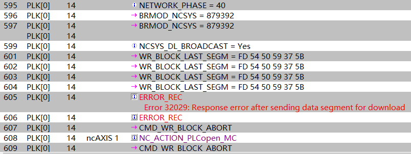

发现上电后通讯建立在 NETWORK_PHASE = 40之前都是正常的，在40时出现报错。 NETWORK_PHASE = 40时系统通过 PLK 往伺服下载 ACP10版本。因此怀疑时拓扑结构过长导致的异步通讯超时。现场检查拓扑，发现从 PLC 的 PLK 口出来后所有伺服均在一条拓扑线路上，即无 Hub 拓展。现场更改接线顺序，发现拓扑线路的最后一个驱动器均会触发同样的报警。由此确认与拓扑结构有关。

**解决方式** 方式一由于现场暂无法更改拓扑结构，于是将 PLK 主站的 Asynchronous timeout 参数由默认的25 μs 改为100 μs。其中 Asynchronous timeout 参数的含义如下图，即 POWERLINK 异步段通信，主站发帧，等待从站（驱动器）响应的时间，若现场拓扑复杂，同一链路下 CN 数量多，则此参数需要适当增大。

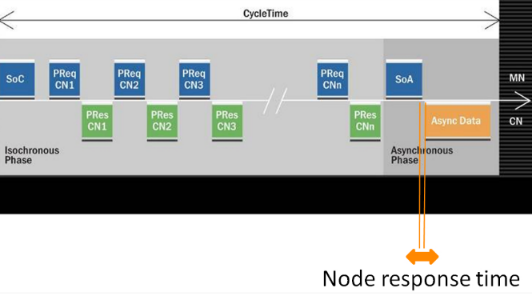

重新下载程序后所有伺服通讯正常。 方式二 有条件时应使用Hub修改POWERLINK网络的拓扑结构，改成星型拓扑结构。

# 32030：下载后系统模块刻录命令出错

描述：

在系统模块下载功能期间，将系统模块刻录到FPROM的命令在系统模块传输到ACOPOS后发送到ACPOS。如果此过程发生错误，则输出此错误号。此外，还输出有关所发生错误的更多详细信息。

反应：

将系统模块传输到 ACOPOS 将中止。

原因/补救措施：

过载，故障或网络连接中断或ACPOS故障。

查看错误码 [1004](#1004网络生命标志监视器超时).

查看错误码 [1012](#1012循环网络通信的崩溃).

# 32031：下载后系统模块刻录状态时出错

描述：

在系统模块下载功能期间，将系统模块刻录到FPROM的命令在系统模块传输到ACOPOS后发送到ACPOS。然后读取相应的状态。如果在读取此状态时发生错误，则输出此错误号。此外，还输出有关所发生错误的更多详细信息。

反应：

将系统模块传输到 ACOPOS 将中止。

原因/补救措施：

过载，故障或网络连接中断或ACPOS故障。

查看错误码 [1004](#1004网络生命标志监视器超时).

查看错误码 [1012](#1012循环网络通信的崩溃).

# 32032：下载后刻录系统模块时出错

描述：

在系统模块下载功能期间，将系统模块刻录到FPROM的命令在系统模块传输到ACOPOS后发送到ACPOS。然后读取相应的状态。如果在此状态下显示错误，则输出此错误号。此外，还输出有关所发生错误的更多详细信息。

反应：

将系统模块传输到 ACOPOS 将中止。

原因/补救措施：

ACOPOS 错误，更改 ACOPOS 模块。

# 32033：下载后刻录系统模块时超时

描述：

在系统模块下载功能期间，将系统模块刻录到FPROM的命令在系统模块传输到ACOPOS后发送到ACPOS。然后读取相应的状态。如果在系统模块成功刻录到 ACOPOS 之前，系统模块刻录过程达到超时，则会输出此错误号。此外，还输出有关所发生错误的更多详细信息。

反应：

将系统模块传输到 ACOPOS 将中止。

原因/补救措施：

ACOPOS 错误，更改 ACOPOS 模块。

# 32034：下载前软件重置时出错

描述：

仅当 ACOPOS 处于特定启动状态时，才允许下载系统模块。

如果 ACOPOS 处于其他引导状态，则在系统模块下载功能期间，系统模块将发送 SW Reset 命令以更改为此引导状态，然后再将系统模块传输到 ACOPOS。如果此过程发生错误，则输出此错误号。此外，还输出有关所发生错误的更多详细信息。

反应：

将系统模块传输到 ACOPOS 将中止。

原因/补救措施：

过载，故障或网络连接中断或ACPOS故障。

查看错误码 [1004](#1004网络生命标志监视器超时).

查看错误码 [1012](#1012循环网络通信的崩溃).

# 32035：下载后软件重置时出错

描述：

对于某些系统模块，在将系统模块传输到 ACOPOS 后，必须在系统模块下载功能期间发送软件复位命令。如果此过程发生错误，则输出此错误号。此外，还输出有关所发生错误的更多详细信息。

反应：

将系统模块传输到 ACOPOS 将中止。

原因/补救措施：

过载，故障或网络连接中断或ACPOS故障。

查看错误码 [1004](#1004网络生命标志监视器超时).

查看错误码 [1012](#1012循环网络通信的崩溃).

# 32036：下载后不同的系统模块数据

描述：

在系统模块下载功能期间，系统模块传输到ACOPOS后，将从ACOPOS读取相应的版本数据。如果确定与传输的系统模块的差异，则输出此错误号。此外，还输出有关所发生错误的更多详细信息。

反应：

将系统模块传输到 ACOPOS 将中止。

原因/补救措施：

ACOPOS 错误，更改 ACOPOS 模块。

# 32037：由于 FIFO 溢出而丢失错误消息（确认错误）

描述：

对于此 NC 对象，发生了错误消息的 FIFO 溢出。

反应：

进一步的错误消息将丢失。

原因/补救措施：

对于此 NC 对象，错误信息发生得太快。

此 NC 对象的错误消息未得到足够快的确认。

## 应用案例

### 2022.01.11

32037: Error message (s) lost because of FIFO overflow (acknowledge errors) For this NC object an overflow of the FIFO for error messages occured.

- （1）通讯故障
- （2）plc 内存数据紊乱，重新下载程序
- （3）众多伺服报警同时出现

### 2022.07.22

报警64006、32037、1012、32189：网线松动

### 2023.07.04

**现象** 机器运行之后发生了某一驱动器报错，32037 32189 1012 ，其他驱动器没有报错

**原因** POWERLINK 网络通信质量问题

**解决方式** 重新拔插 POWERLINK 线缆后，问题解决。需要校核 POWERLINK 网络质量，优化参数

### 2023.07.04

**现象** 开机伺服偶发32037报警

**解决方式** 客户当前伺服采取 PLK 串接方式，站点过多需要更换 PLK 专用 HUB

### 2023.08.21

**现象**：当速度设定值超过 limit 时，sdc 轴就会挂掉，故障无法清除。手动清除时会反复出现32037，29294。用 MC_Reset 功能块能清掉，但是 test 反而不行，只是 Error 清掉但 ErrorText 内容不不消失。Status.ErrorText[0]的信息为 The Error Text table does not exist!

**原因**：轴控报错文本名在初始化表，MC_ReadAxisError_0，CPU 的配置里面不一致。

一系列问题都是 ErrorText 文本名字不一致导致。新版 acp 版本的 `acp10etxen名称` 和旧的 simple 例程默认不一致。

# 32040：INIT参数模块的版本与NC 管理器不兼容

描述：

如果 INIT 参数模块的版本和 acp10man 的版本在前三位数字上不相等，则会显示此错误。

反应：

INIT 参数模块的处理已中止。

原因/补救措施：

重新生成 INIT 参数模块并将其传输到目标。

# 32041：模块 acp10cfg 不存在

描述：

如果目标上不存在模块 acp10cfg，则会显示此错误。

注意：

如果发生此错误，则会在记录器中输入二进制数据中具有此错误号的以下错误：

\- 10550：读取 NC CFG 模块："二进制数据"中的 NC 管理器错误

反应：

NC 软件的初始化将中止。不能操作 NC 对象。

原因/补救措施：

创建模块 acp10cfg 并将其传输到目标。

# 32042：模块 acp10cfg 不是 NC 数据模块

描述：

如果模块 acp10cfg 不是 NC 数据模块，则会显示此错误。

注意：

如果发生此错误，则会在记录器中输入二进制数据中具有此错误号的以下错误：

\- 10550：读取 NC CFG 模块："二进制数据"中的 NC 管理器错误

反应：

NC 软件的初始化将中止。不能操作 NC 对象。

原因/补救措施：

将模块 acp10cfg 创建为 ACP10 配置，并将其传输到目标。

# 32043：模块 acp10cfg 的 NC 模块类型无效

描述：

如果模块 acp10cfg 具有错误的 NC 模块类型，则会显示此错误。

注意：

如果发生此错误，则会在记录器中输入二进制数据中具有此错误号的以下错误：

\- 10550：读取 NC CFG 模块："二进制数据"中的 NC 管理器错误

反应：

NC 软件的初始化将中止。不能操作 NC 对象

原因/补救措施：

将模块 acp10cfg 创建为 ACP10 配置，并将其传输到目标。

# 32044：无法读取模块 acp10cfg 的 NC 模块类型

描述：

如果无法读取模块 acp10cfg 的 NC 模块类型，则会显示此错误。

注意：

如果发生此错误，则会在记录器中输入二进制数据中具有此错误号的以下错误：

\- 10550：读取 NC CFG 模块："二进制数据"中的 NC 管理器错误

反应：

NC 软件的初始化将中止。不能操作 NC 对象。

原因/补救措施：

重建模块 acp10cfg 并将其传输到目标。

更改自动化运行时版本。

NC 软件版本的更改。

# 32045：无法读取模块 acp10cfg 中的数据地址

描述：

如果无法读取模块 acp10cfg 的数据地址，则会显示此错误。

注意：

如果发生此错误，则会在记录器中输入二进制数据中具有此错误号的以下错误：

\- 10550：读取 NC CFG 模块："二进制数据"中的 NC 管理器错误

反应：

NC 软件的初始化将中止。不能操作 NC 对象。

原因/补救措施：

重新编译模块 acp10cfg 并将其传输到目标。

更改自动化运行时版本。

NC 软件版本的更改。

# 32046：模块 acp10cfg 的数据部分为空

描述：

如果模块 acp10cfg 的数据部分为空，则会显示此错误。

注意：

如果发生此错误，则会在记录器中输入二进制数据中具有此错误号的以下错误：

\- 10550：读取 NC CFG 模块："二进制数据"中的 NC 管理器错误

反应：

NC 软件的初始化将中止。不能操作 NC 对象。

原因/补救措施：

重新编译模块 acp10cfg 并将其传输到目标。

更改自动化运行时版本。

NC 软件版本的更改。

# 32047：模块 acp10cfg 中的 CAN 节点号无效

描述：

对于 V3.0 之前的 Automation Studio 版本，硬件树中配置的所有 ACOPOS 模块的节点号都将输入到模块 acp10cfg 中。当CAN接口的节点号定义在有效范围（1到32）之外时，会显示此错误。

注意：

如果发生此错误，则会在记录器中输入二进制数据中具有此错误号的以下错误：

\- 10550：读取 NC CFG 模块："二进制数据"中的 NC 管理器错误

此外，在记录器中输入了以下错误，其中二进制数据中的状态值为"if_index \* 256 + node_nr"：

\- 10551：读取 NC CFG 模块："二进制数据"中 NC 管理器错误的状态

反应：

NC 软件的初始化将中止。不能操作 NC 对象。

原因/补救措施：

删除硬件树中具有无效节点号的 ACOPOS 模块。

重新编译模块 acp10cfg 并将其传输到目标。

NC 软件版本的更改。

更改Automation Studio版本。

# 32048：反复使用模块 acp10cfg 中的 CAN 节点号

描述：

对于 V3.0 之前的 Automation Studio 版本，硬件树中配置的所有 ACOPOS 模块的节点号都将输入到模块 acp10cfg 中。如果对于CAN接口，节点号定义了多次，则会显示此错误。

注意：

如果发生此错误，则会在记录器中输入二进制数据中具有此错误号的以下错误：

\- 10550：读取 NC CFG 模块："二进制数据"中的 NC 管理器错误

此外，在记录器中输入了以下错误，其中二进制数据中的状态值为"if_index \* 256 + node_nr"：

\- 10551：读取 NC CFG 模块："二进制数据"中 NC 管理器错误的状态

反应：

NC 软件的初始化将中止。不能操作 NC 对象。

原因/补救措施：

在每个CAN接口上为ACPOS模块定义每个节点号仅一次。

重建模块 acp10cfg 并将其传输到目标。

NC 软件版本的更改。

更改Automation Studio版本。

# 32049：在跟踪处于活动状态期间不允许此 NC 操作

描述：

当此 NC 对象的追踪处于活动状态时，无法处理此 NC 操作。

反应：

此 NC 操作的处理将中止。

原因/补救措施：

等待此 NC 对象的跟踪完成。

停止此 NC 对象的跟踪。

# 32050：跟踪数据上载已处于活动状态

描述：

当此 NC 对象的"追踪数据上载"处于活动状态时，无法处理此 NC 操作。

反应：

此 NC 操作的处理将中止。

原因/补救措施：

等待此 NC 对象的跟踪数据上载完成。

# 32053：为参数读取请求 2 定义写入 COB 时出错

描述：

对于通过CAN网络运行ACOPOS伺服驱动器，每个ACPOS都调用了函数CAN_defineCOB（），以定义一个具有特定CAN ID的写入COB，用于Channel2读取请求电报。如果此过程发生错误，则输出此错误号。

反应：

此 ACOPOS 的初始化将中止。不能再操作所有相应的 NC 对象。

原因/补救措施：

CAN_defineCOB（） 的状态：请参见 CAN 库错误号。

# 32054：为参数写入请求 2 定义写入 COB 时出错

描述：

对于通过CAN网络操作ACOPOS伺服驱动器，每个ACPOS都调用函数CAN_defineCOB（），以定义一个具有特定CAN ID的写入COB，用于Channel2写入请求电报。如果此过程发生错误，则输出此错误号。

反应：

此 ACOPOS 的初始化将中止。不能再操作所有相应的 NC 对象。

原因/补救措施：

CAN_defineCOB（） 的状态：请参见 CAN 库错误号。

# 32055：为参数读取响应 2 定义读取 COB 时出错

描述：

对于通过CAN网络操作ACPOS伺服驱动器，每个ACPOS调用函数CAN_defineCOB（），以定义具有通道2读取响应电报的特定CAN ID的读取COB。如果此过程发生错误，则输出此错误号。

反应：

此 ACOPOS 的初始化将中止。不能再操作所有相应的 NC 对象。

原因/补救措施：

CAN_defineCOB（） 的状态：请参见 CAN 库错误号。

# 32056：为参数写入响应 2 定义读取 COB 时出错

描述：

对于通过CAN网络操作ACOPOS伺服驱动器，每个ACPOS都调用了函数CAN_defineCOB（），以定义一个具有特定CAN ID的读取COB，用于Channel2写入响应电报。如果此过程发生错误，则输出此错误号。

反应：

此 ACOPOS 的初始化将中止。不能再操作所有相应的 NC 对象。

原因/补救措施：

CAN_defineCOB（） 的状态：请参见 CAN 库错误号。

# 32057：访问 HS 任务类表时出错

描述：

如果在访问 HS 任务类表时发生错误，则显示此错误，并将函数的错误状态SS_get_entry（） 作为信息。

反应：

NC 软件的初始化将中止。不能操作 NC 对象。

原因/补救措施：

确切原因可以通过函数 SS_get_entry（） 的错误状态和在记录器中输入的详细信息来确定。

NC 软件版本的更改。

更改Automation Runtime版本。

# 32058：访问任务类表时出错

描述：

如果在访问任务类表时发生错误，则会显示此错误，并将函数的错误状态SS_get_entry（） 作为信息。

反应：

NC 软件的初始化将中止。不能操作 NC 对象。

原因/补救措施：

确切原因可以通过函数 SS_get_entry（） 的错误状态和在记录器中输入的详细信息来确定。

更改 NC software 版本.

更改 Automation Runtime 版本.

# 32059：参数tk_no无效，无法访问任务类表

描述：

如果定义了无效的任务类编号 （tk_no），则此错误将显示为无效值作为信息。

反应：

NC 软件的初始化将中止。不能操作 NC 对象。

原因/补救措施：

将参数"NC 管理器任务的任务类"设置为有效范围（1 到 3）内的值。

重建模块 acp10cfg 并将其传输到目标。

更改NC software 版本.

更改Automation Runtime 版本.

更改Automation Studio 版本.

# 32060：驱动器中的循环数据超时 - 指示无效(网络错误？)

描述：

如果 NC 管理器在特定数量的 NC 任务周期内未从 ACOPOS 接收到任何循环数据，则 NC 管理器（在 PLC 上）和 ACOPOS 之间成功初始化网络通信后的运行时错误。

NC_TimeoutCycles，导致此错误的 NC 任务周期数取决于所使用的网络和 ACOPOS 的网络属性：

TC：循环 NC 任务的任务类

PL： POWERLINK

CAN网络：

\- TC_Timeout = 2 \* TC_CycleTime + TC_Tolerance

\- NC_TimeoutCycles = 1 + （2\*TC_Timeout） / TC_CycleTime

电源链路网络：

\- NC_TimeoutCycles = 2 + （2\*PL_CycleTime） / TC_CycleTime

具有"多路复用"属性的ACPOS的POWERLINK网络：

\- NC_TimeoutCycles = 2 + （2\*PL_MuxCycleTime） / TC_CycleTime

反应：

对于此 ACOPOS，NC 管理器将切换到"网络通信未激活"状态。这可以在以下状态指示器中看到：

\- network.init = ncFALSE

\- network.phase = 0

原因/补救措施：

CAN网络：

任务类周期时间或任务类公差对于 NC 管理器任务的任务类定义得太低。

电源链路网络：

电源链路循环时间定义得太短。

过载，故障或网络连接中断或ACPOS故障。

查看错误码 [1004](#1004网络生命标志监视器超时).

查看错误码 [1012](#1012循环网络通信的崩溃).

# 32061：发送读取请求电报时超时(网络错误？)

描述：

为了从 ACOPOS 读取参数值，NC 管理器首先从 PLC 向 ACOPOS 发送读取请求电报。如果在进行相应的CAN发送函数调用70ms后，NC管理器检测到相应的CAN电报尚未传输到CAN总线，则会显示此错误。

反应：

重置相应CAN读取通道的接口。

原因/补救措施：

连接到PLC CAN接口的CAN节点在CAN通信中没有一个处于活动状态，因此在发送CAN电报后不会发生CAN总线确认。

所有 ACOPOS 设备的网络连接中断或故障。

另请参阅错误号 [1004](#1004网络生命标志监视器超时).

# 32062：发送写入请求电报超时(网络错误？)

描述：

为了将参数值传输到 ACOPOS，NC 管理器首先从 PLC 向 ACOPOS 发送写入请求电报。如果在进行相应的CAN发送函数调用70ms后，NC管理器检测到相应的CAN电报尚未传输到CAN总线，则会显示此错误。

反应：

重置相应CAN写入通道的接口。

原因/补救措施：

连接到PLC CAN接口的CAN节点在CAN通信中没有一个处于活动状态，因此在发送CAN电报后不会发生CAN总线确认。

所有 ACOPOS 设备的网络连接中断或故障。

另请参阅错误号 [1004](#1004网络生命标志监视器超时).

# 32063：数据地址为零（通过服务接口设置/读取参数）

描述：

如果"通过服务接口设置/读取参数"的参数"network.service.data_adr"设置为零，则会显示此错误。

反应：

相应 NC 操作的处理将中止。

原因/补救措施：

不要使用零作为数据地址。

# 32064：对于此参数数据类型，无法将文本转换为二进制数据

描述：

如果参数 ID 用于文本二进制转换的函数，而对于其数据类型无法进行此转换，则会显示此错误。

反应：

相应函数的处理将中止。

原因/补救措施：

不要将此参数 ID 用于需要从文本转换为二进制数据的函数。

# 32065：对于此参数数据类型，无法将二进制数据转换为文本

描述：

如果参数 ID 用于二进制文本转换的函数，并且对于其数据类型无法进行此转换，则会显示此错误。

反应：

相应函数的处理将中止。

原因/补救措施：

不要将此参数 ID 用于需要从二进制数据转换为文本的函数。

# 32066：参数 ID 为零（通过服务接口设置/读取参数）

描述：

如果将零指定为"通过服务接口设置/读取参数"的参数 ID，则会显示此错误。

反应：

相应 NC 操作的处理将中止。

原因/补救措施：

不要使用零作为参数 ID。

# 32067：参数 ID 无效（无法将文本与二进制数据相互转换）

描述：

如果参数 ID 未包含在 NC 管理器的参数目录中，则无法在文本和二进制数据之间进行转换。如果将此类参数 ID 用于需要在文本和二进制数据之间进行转换的函数，则会显示此错误。

反应：

相应函数的处理将中止。

原因/补救措施：

不要将此参数 ID 用于需要在文本和二进制数据之间转换的函数。

# 32069：无法读取模块 acp10cfg 中 ACOPOS 参数的数据地址

描述：

由硬件配置产生的初始 ACOPOS 参数包含在模块 acp10cfg 的数据部分中。如果无法读取此数据部分的地址，则会显示此错误。

反应：

NC 软件的初始化将中止。不能操作 NC 对象。

原因/补救措施：

重新编译模块 acp10cfg 并将其传输到目标。

改变 NC software 版本.

改变 Automation Runtime 版本.

改变 Automation Studio 版本.

# 32070：未找到模块 acp10cfg 中用于 ACOPOS 参数的驱动器

描述：

由硬件配置产生的初始 ACOPOS 参数包含在模块 acp10cfg 的数据部分中。如果在参数标头中输入了 ACOPOS 模块，但在 NC 映射表中未启用，则会显示此错误。

反应：

NC 软件的初始化将中止。不能操作 NC 对象。

原因/补救措施：

删除硬件配置中的 ACOPOS 模块，然后重新创建模块 acp10cfg。

在 NC 映射表中启用 ACOPOS 模块并重新创建 NC 映射表。

从ACP10软件V2.410开始的解决方法：

通过将以下 XML 属性输入到 NC 映射表中 NC 对象类型"ncMANAGER"的数据记录中的"附加数据"列中，可以禁用 ACOPOS 参数从模块 acp10cfg 的传输：

\- AcoposPar_Acp10cfg_Disabled="1"

# 32071： ACOPOS 参数无效（需要更新 AutomationStudio）

描述：

使用 V1.4 之前的Automation Studio版本

反应：

NC 软件的初始化将中止。不能操作 NC 对象。

原因/补救措施：

使用高于1.4版本的Automation Studio软件。

# 32072：软件重置后启动状态错误

描述：

使用"CMD_SW_RESET"进行软件重置后，唯一允许的启动状态为"BOOT_STATE=16"。如果读取了BOOT_STATE的另一个值，则此错误将以错误的BOOT_STATE值作为信息来指示。

反应：

此 ACOPOS 的 ACOPOS 启动功能已中止。

原因/补救措施：

过载，故障或网络连接中断或ACPOS故障。

查看错误码 [1004](#1004网络生命标志监视器超时).

查看错误码 [1012](#1012循环网络通信的崩溃).

# 32073： NC 系统模块下载：读取 BsLoader 的 NC 硬件版本时出错

描述：

仅当在系统模块中输入的硬件版本与 ACOPOS 上 BsLoader 的硬件版本兼容时，才允许下载系统模块。

如果从 ACOPOS 读取此硬件版本时发生错误，则会输出此错误号。此外，还输出有关所发生错误的更多详细信息。

反应：

将系统模块传输到 ACOPOS 将中止。

原因/补救措施：

过载，故障或网络连接中断或ACPOS故障。

查看错误码 [1004](#1004网络生命标志监视器超时).

查看错误码 [1012](#1012循环网络通信的崩溃).

# 32074：不兼容的 NC 硬件版本：无法下载 BsLoader

描述：

仅当在系统模块中输入的硬件版本与 ACOPOS 上 BsLoader 的硬件版本兼容时，才允许下载系统模块。

如果确定（在传输 ACOPOS BsLoader 之前）要传输的系统模块与 ACOPOS 上 BsLoader 的硬件版本不兼容，则输出此错误号。此外，还输出有关所发生错误的更多详细信息。

反应：

将系统模块传输到 ACOPOS 将中止。

原因/补救措施：

连接到网络的 ACOPOS 的硬件版本与项目中配置的硬件版本不同。

# 32075：不兼容的 NC 硬件版本：无法下载操作系统

描述：

仅当在系统模块中输入的硬件版本与 ACOPOS 上 BsLoader 的硬件版本兼容时，才允许下载系统模块。

如果确定（在传输 ACOPOS 操作系统之前）要传输的系统模块与 ACOPOS 上 BsLoader 的硬件版本不兼容，则输出此错误号。此外，还输出有关所发生错误的更多详细信息。

反应：

将系统模块传输到 ACOPOS 将中止。

原因/补救措施：

连接到网络的 ACOPOS 的硬件版本与项目中配置的硬件版本不同。

# 32076：对 NC 空闲任务具有高优先级消息的 FIFO 已满

描述：

如果对于具有高优先级的消息，FIFO 中不再有数据记录，则会显示此错误。

反应：

相应 NC 操作的处理将中止。

原因/补救措施：

保存记录器Trace数据和网络跟踪NCT，并联系支持人员。

改变Automation Runtime版本.

改变NC software版本.

# 32077：模块 acp10cfg 中的 POWERLINK 节点号无效

描述：

对于 V3.0 之前的 Automation Studio 版本，硬件树中配置的所有 ACOPOS 模块的节点号都将输入到模块 acp10cfg 中。当 POWERLINK 接口的节点号定义在有效范围（1 到 253）之外时，将显示此错误。

注意：

如果发生此错误，则会在记录器中输入二进制数据中具有此错误号的以下错误：

\- 10550：读取 NC CFG 模块："二进制数据"中的 NC 管理器错误

此外，在记录器中输入了以下错误，其中二进制数据中的状态值为"if_index \* 256 + node_nr"：

\- 10551：读取 NC CFG 模块："二进制数据"中 NC 管理器错误的状态

反应：

NC 软件的初始化将中止。不能操作 NC 对象。

原因/补救措施：

删除硬件树中具有无效节点号的 ACOPOS 模块。

重新编译模块 acp10cfg 并将其传输到目标。

改变NC software版本。

改变Automation Studio版本。

# 32078：重复使用模块 acp10cfg 中的 POWERLINK 节点号

描述：

对于 V3.0 之前的 Automation Studio 版本，硬件树中配置的所有 ACOPOS 模块的节点号都将输入到模块 acp10cfg 中。如果对于 POWERLINK 接口多次定义了节点号，则会显示此错误。

注意：

如果发生此错误，则会在记录器中输入二进制数据中具有此错误号的以下错误：

\- 10550：读取 NC CFG 模块："二进制数据"中的 NC 管理器错误

此外，在记录器中输入了以下错误，其中二进制数据中的状态值为"if_index \* 256 + node_nr"：

\- 10551：读取 NC CFG 模块："二进制数据"中 NC 管理器错误的状态

反应：

NC 软件的初始化将中止。不能操作 NC 对象。

原因/补救措施：

在每个 POWERLINK 接口上为 ACOPOS 模块定义每个节点号仅一次，确保没有重复。

重新编译模块 acp10cfg 并将其传输到目标。

改变NC software版本。

改变Automation Studio版本。

# 32079：使用此变体，一个CAN接口必须位于模块acp10cfg中

描述：

使用此ACP10MAN变体（ACP10MAN代表CAN）时，CAN接口必须包含在模块acp10cfg中。如果不是这种情况，则会显示此错误。

注意：

如果发生此错误，则会在记录器中输入二进制数据中具有此错误号的以下错误：

\- 10550：读取 NC CFG 模块："二进制数据"中的 NC 管理器错误

反应：

NC 软件的初始化将中止。不能操作 NC 对象。

原因/补救措施：

在ACP10配置中插入CAN接口。

重建模块 acp10cfg 并将其传输到目标。

将另一个ACP10MAN变体（ACP10MAN用于POWERLINK）插入到项目中，并将其传输到目标。

# 32080：使用此变体时，模块 acp10cfg 中必须有一个 POWERLINK 接口

描述：

使用此ACP10MAN变体（ACP10MAN for POWERLINK）时，模块acp10cfg中必须包含POWERLINK接口。如果不是这种情况，则会显示此错误。

注意：

如果发生此错误，则会在记录器中输入二进制数据中具有此错误号的以下错误：

\- 10550：读取 NC CFG 模块："二进制数据"中的 NC 管理器错误

反应：

NC 软件的初始化将中止。不能操作 NC 对象。

原因/补救措施：

在 ACP10 配置中插入 POWERLINK 接口。

重新编译模块 acp10cfg 并将其传输到目标。

将另一个ACP10MAN变体（ACP10MAN for CAN）插入到项目中并将其传输到目标。

# 32084：NC 配置不包含任何 ACOPOS 模块

描述：

如果未配置 ACOPOS 模块，则会显示此错误。

注意：

如果发生此错误，则会在记录器中输入二进制数据中具有此错误号的以下错误：

\- 10550：读取 NC CFG 模块："二进制数据"中的 NC 管理器错误

反应：

NC 软件的初始化将中止。不能操作 NC 对象。

原因/补救措施：

在硬件配置或 NC 映射表中配置 ACOPOS 模块。

重新生成配置并将其传输到目标。

# 32085： 模块 acp10cfg 无效（需要Automation Studio V2.2 或更高版本）

描述：

使用 V2.2 之前的Automation Studio版本。

注意：

如果发生此错误，则会在记录器中输入二进制数据中具有此错误号的以下错误：

\- 10550：读取 NC CFG 模块："二进制数据"中的 NC 管理器错误

反应：

NC 软件的初始化将中止。不能操作 NC 对象。

原因/补救措施：

使用高于 V2.2 的Automation Studio版本。

# 32086：此变体不允许在模块 acp10cfg 中使用 CAN 接口

描述：

如果使用此ACP10MAN变体（ACP10MAN for POWERLINK）时，模块acp10cfg中包含CAN接口，则会显示此错误。

注意：

如果发生此错误，则会在记录器中输入二进制数据中具有此错误号的以下错误：

\- 10550：读取 NC CFG 模块："二进制数据"中的 NC 管理器错误

反应：

NC 软件的初始化将中止。不能操作 NC 对象。

原因/补救措施：

删除ACP10配置中的CAN接口。

重建模块 acp10cfg 并将其传输到目标。

将另一个ACP10MAN变体（ACP10MAN for CAN）插入到项目中并将其传输到目标。

# 32087：使用此变体，模块 acp10cfg 中不允许使用 POWERLINK 接口

描述：

如果使用此 ACP10MAN 变体（ACP10MAN 表示 POWERLINK）时，模块 acp10cfg 中包含 POWERLINK 接口，则会显示此错误。

注意：

如果发生此错误，则会在记录器中输入二进制数据中具有此错误号的以下错误：

\- 10550：读取 NC CFG 模块："二进制数据"中的 NC 管理器错误

反应：

NC 软件的初始化将中止。不能操作 NC 对象

原因/补救措施：

删除 ACP10 配置中的 POWERLINK 接口。

重建模块 acp10cfg 并将其传输到目标。

将另一个ACP10MAN变体（ACP10MAN用于POWERLINK）插入到项目中，并将其传输到目标。

# 32088：NC映射表中指定的INIT参数模块不存在

描述：

如果对于 NC 对象，在 NC 映射表中定义了 INIT 参数模块，但目标上不存在 INIT 参数模块，则会显示此错误。

反应：

尽管有此错误，但仍可操作 NC 对象。

原因/补救措施：

创建 INIT 参数模块并将其传输到目标。

# 32089：INIT 参数模块的 NC-HW-ID 与 NC 管理器不兼容

描述：

如果为 NC 对象指定的 INIT 参数模块被分配了不同的 NC-HW-ID（NC 软件）作为 NC 对象，则会显示此错误。

反应：

INIT 参数模块的处理将中止。

原因/补救措施：

指定一个 INIT 参数模块，该模块被分配了与 NC 对象相同的 NC 软件。

# 32090：INIT 参数模块的 NC 对象类型不等于 NC 对象

描述：

如果为 NC 对象指定的 INIT 参数模块包含与 NC 对象不同的 NC 对象类型，则会显示此错误。

反应：

INIT 参数模块的处理将中止。

原因/补救措施：

指定与 NC 对象类型相同的 NC 对象类型的 INIT 参数模块。

# 32091：INIT 参数模块中的块数据无效（超出数据范围）

描述：

如果 INIT 参数模块包含指向 NC 对象结构外部区域的块数据引用，则在加载 INIT 参数模块时会显示此错误。

反应：

INIT 参数模块的处理将中止。

原因/补救措施：

Automation Studio错误地创建了 INIT 参数模块。

重新生成 INIT 参数模块并将其传输到目标。

NC Software版本的更改。

Automation Studio版本的更改。

# 32092：向 NC 空闲任务发送命令时出错

描述：

如果向 NC 管理器空闲任务发送命令时发生错误，则会显示此错误，并将发送函数的错误状态 （SG3/SGC： q_send（）、SG4： RtkWriteFifo（）） 作为信息。

反应：

相应 NC 操作的处理将中止。

原因/补救措施：

保存记录器数据和网络跟踪，并联系支持人员。

更改Automation Runtime版本。

NC Software版本的更改。

确切的原因可以从发送函数的错误状态中确定。

# 32093：使用不同的值重复定义 NcManCtrl

描述：

某些 NC 管理器属性可以使用 XML 属性"NcManCtrl"在 NC 部署表（NC 映射表）中激活。如果"NcManCtrl"存在于具有不同值的多个数据记录中，则会显示此错误。

反应：

NC 软件的初始化将中止。不能操作 NC 对象。

原因/补救措施：

禁用所有带有"NcManCtrl"的数据记录，但一条除外。

在每条数据记录中使用"NcManCtrl"定义相同的值。

# 32094：为具有不同值的 ncMANAGER 重复定义网络初始化

描述：

网络初始化的某些全局属性可以通过 NC 对象类型"ncMANAGER"（使用 XML 属性"NetworkInit"）在 NC 部署表（NC 映射表）中激活。如果 NC 对象类型"ncMANAGER"的多个数据记录中存在"NetworkInit"，并且具有不同的值，则会显示此错误。

反应：

NC 软件的初始化将中止。不能操作 NC 对象。

原因/补救措施：

禁用 NC 对象类型"ncMANAGER"的所有数据记录，并禁用"NetworkInit"（一个除外）。

在 NC 对象类型"ncMANAGER"的每个数据记录中使用"NetworkInit"定义相同的值。

# 32095：CAN-CFG 模块中驱动器组的值高于最大值

描述：

如果在 CAN-CFG 模块中定义了驱动器组的值，该值大于最大值，则此错误将显示为信息的最大值。

反应：

NC 软件的初始化将中止。不能操作 NC 对象。

原因/补救措施：

将 CAN-CFG 模块中驱动器组的值设置为允许的值。

# 32098：模块 acp10cfg 的版本与 NC 管理器不兼容

描述：

如果模块 acp10cfg 的版本和 acp10man 的版本在前三位数字上不相等，则会显示此错误。

注意：

如果发生此错误，则会在记录器中输入二进制数据中具有此错误号的以下错误：

\- 10550：读取 NC CFG 模块："二进制数据"中的 NC 管理器错误

反应：

NC 软件的初始化将中止。不能操作 NC 对象。

原因/补救措施：

重新创建模块 acp10cfg 并将其传输到目标。

# 32099：模块 acp10cfg 的数据段长度太小

描述：

如果模块ACP10CFG的一部分太小而无法评估数据，则会显示此错误。

注意：

如果发生此错误，则会在记录器中输入二进制数据中具有此错误号的以下错误：

\- 10550：读取 NC CFG 模块："二进制数据"中的 NC 管理器错误

此外，在记录器中输入了以下错误，其中包含二进制数据中受影响数据部分的编号：

\- 10551：读取 NC CFG 模块："二进制数据"中 NC 管理器错误的状态

反应：

NC 软件的初始化将中止。不能操作 NC 对象。

原因/补救措施：

重新创建模块 acp10cfg 并将其传输到目标。

NC 软件版本的更改。

Automation Studio版本的更改。

# 32100：无法分配 NC 错误文本管理内存

描述：

如果无法分配 NC 错误文本管理的内存，则会显示此错误。

反应：

NC 软件的初始化将中止。不能操作 NC 对象。

原因/补救措施：

没有足够的可用内存。

在操作系统区域配置更多内存。

# 32102：错误文本模块的版本 ID 不等于 NC 管理器的版本 ID

描述：

如果错误文本模块的版本 ID 与 NC 管理器的版本 ID 不同，则为此错误文本模块输入此错误。

反应：

如果此错误文本模块用于 NC 操作"ncMESSAGE，ncTEXT"，则返回以下错误文本：

\- 错误文本初始化错误： 32102 （信息： 0）

原因/补救措施：

更改 NC 软件版本或将 NC 软件版本新插入到项目中。

重建错误文本模块并将其传输到目标。

# 32103：无法读取错误文本模块的数据部分

描述：

如果无法读取错误文本模块的数据部分，则为此错误文本模块输入此错误。

反应：

如果此错误文本模块用于 NC 操作"ncMESSAGE，ncTEXT"，则返回以下错误文本：

\- 错误文本初始化错误： 32103 （信息： x）

原因/补救措施：

更改 NC 软件版本或将 NC 软件版本新插入到项目中。

重建错误文本模块并将其传输到目标。

# 32104：错误文本模块的数据部分为空

描述：

如果错误文本模块的数据部分为空，则为此错误文本模块输入此错误。

反应：

如果此错误文本模块用于 NC 操作"ncMESSAGE，ncTEXT"，则返回以下错误文本：

\- 错误文本初始化错误： 32104 （信息： x）

原因/补救措施：

更改 NC 软件版本或将 NC 软件版本新插入到项目中。

重建错误文本模块并将其传输到目标。

# 32105：错误文本模块的数据段长度太小

描述：

如果错误文本模块的数据段长度太小，则为此错误文本模块输入此错误。

反应：

如果此错误文本模块用于 NC 操作"ncMESSAGE，ncTEXT"，则返回以下错误文本：

\- 错误文本初始化错误： 32105 （信息： x）

原因/补救措施：

更改 NC 软件版本或将 NC 软件版本新插入到项目中。

重建错误文本模块并将其传输到目标。

# 32106：错误文本模块的错误列表与 NC 管理器的错误列表不相等

描述：

如果错误文本模块的错误列表与 NC 管理器的错误列表不相等，则为此错误文本模块输入此错误。

反应：

如果此错误文本模块用于 NC 操作"ncMESSAGE，ncTEXT"，则返回以下错误文本：

\- 错误文本初始化错误： 32106 （信息： x）

原因/补救措施：

更改 NC 软件版本或将 NC 软件版本新插入到项目中。

重建错误文本模块并将其传输到目标。

# 32107：错误文本模块的参数列表与 NC 管理器的参数列表不相等

描述：

如果错误文本模块的参数列表与 NC 管理器的参数列表不相等，则为此错误文本模块输入此错误。

反应：

如果此错误文本模块用于 NC 操作"ncMESSAGE，ncTEXT"，则返回以下错误文本：

\- 错误文本初始化错误： 32107 （信息： x）

原因/补救措施：

更改 NC 软件版本或将 NC 软件版本新插入到项目中。

重建错误文本模块并将其传输到目标。

# 32108：错误文本模块的最后错误号不等于65535

描述：

如果错误文本模块的最后一个错误号不等于 65535，则为此错误文本模块输入此错误。

反应：

如果此错误文本模块用于 NC 操作"ncMESSAGE，ncTEXT"，则返回以下错误文本：

\- 错误文本初始化错误： 32108 （信息： x）

原因/补救措施：

更改 NC 软件版本或将 NC 软件版本新插入到项目中。

重建错误文本模块并将其传输到目标。

# 32109：错误文本模块的最后一个参数 ID 不等于 65535

描述：

如果错误文本模块的最后一个参数 ID 不等于 65535，则为此错误文本模块输入此错误。

反应：

如果此错误文本模块用于 NC 操作"ncMESSAGE，ncTEXT"，则返回以下错误文本：

\- 错误文本初始化错误： 32109 （信息： x）

原因/补救措施：

更改 NC 软件版本或将 NC 软件版本新插入到项目中。

重建错误文本模块并将其传输到目标。

# 32110：无法读取CAN-CFG模块的数据部分的长度

描述：

如果无法读取 CAN-CFG 模块的数据部分的长度，则会显示此错误。

反应：

NC 软件的初始化将中止。不能操作 NC 对象。

原因/补救措施：

正确创建CAN-CFG模块并将其传输到目标。

# 32111：CAN-CFG模块的数据部分长度太小

描述：

如果CAN-CFG模块的数据部分的长度太小，则此错误将显示为信息的预期长度。

反应：

NC 软件的初始化将中止。不能操作 NC 对象。

原因/补救措施：

正确创建CAN-CFG模块并将其传输到目标。

# 32112：无法读取CAN-CFG模块中的数据地址

描述：

如果无法读取CAN-CFG模块的数据地址，则会显示此错误。

反应：

NC 软件的初始化将中止。不能操作 NC 对象。

原因/补救措施：

正确创建CAN-CFG模块并将其传输到目标。

# 32113：CAN-CFG 模块中的启用代码无效

描述：

如果 CAN-CFG 模块中的启用代码无效，则会显示此错误。

反应：

NC 软件的初始化将中止。不能操作 NC 对象。

原因/补救措施：

将CAN-CFG模块中的启用代码设置为允许的值。

# 32114：CAN-CFG模块保留区域中的值不等于零

描述：

如果 CAN-CFG 模块的保留区域中包含不等于零的值，则会显示此错误。

反应：

NC 软件的初始化将中止。不能操作 NC 对象。

原因/补救措施：

将 CAN-CFG 模块保留区域中的值设置为零。

# 32115：CAN-CFG 模块中 WR/RD 通道 1 的基本 CAN ID 无效

描述：

如果在 CAN-CFG 模块中为此 CAN ID 定义了无效值，则会显示此错误。

反应：

NC 软件的初始化将中止。不能操作 NC 对象。

原因/补救措施：

在 CAN-CFG 模块中将此 CAN ID 设置为允许的值。

# 32116：CAN-CFG 模块中 WR/RD 通道 2 的基本 CAN ID 无效

描述：

如果在 CAN-CFG 模块中为此 CAN ID 定义了无效值，则会显示此错误。

反应：

NC 软件的初始化将中止。不能操作 NC 对象。

原因/补救措施：

在 CAN-CFG 模块中将此 CAN ID 设置为允许的值。

# 32117：CAN-CFG 模块中 WR/RD 通道 3 的基本 CAN ID 无效

描述：

如果在 CAN-CFG 模块中为此 CAN ID 定义了无效值，则会显示此错误。

反应：

NC 软件的初始化将中止。不能操作 NC 对象。

原因/补救措施：

在 CAN-CFG 模块中将此 CAN ID 设置为允许的值。

# 32118：CAN-CFG 模块中监视器数据的基础 CAN ID 无效

描述：

如果在 CAN-CFG 模块中为此 CAN ID 定义了无效值，则会显示此错误。

反应：

NC 软件的初始化将中止。不能操作 NC 对象。

原因/补救措施：

在 CAN-CFG 模块中将此 CAN ID 设置为允许的值。

# 32119：CAN-CFG模块中驱动器的循环数据的基础CAN ID无效

描述：

如果在 CAN-CFG 模块中为此 CAN ID 定义了无效值，则会显示此错误。

反应：

NC 软件的初始化将中止。不能操作 NC 对象。

原因/补救措施：

在 CAN-CFG 模块中将此 CAN ID 设置为允许的值。

# 32120：CAN-CFG 模块中驱动器的循环数据的基础 CAN ID 无效

描述：

如果在 CAN-CFG 模块中为此 CAN ID 定义了无效值，则会显示此错误。

反应：

NC 软件的初始化将中止。不能操作 NC 对象。

原因/补救措施：

在 CAN-CFG 模块中将此 CAN ID 设置为允许的值。

# 32121： CAN-CFG 模块中 SYNC 报文的 CAN ID 无效

描述：

如果在 CAN-CFG 模块中为此 CAN ID 定义了无效值，则会显示此错误。

反应：

NC 软件的初始化将中止。不能操作 NC 对象。

原因/补救措施：

在 CAN-CFG 模块中将此 CAN ID 设置为允许的值。

# 32122：CAN-CFG 模块中广播命令的 CAN ID 无效

描述：

如果在 CAN-CFG 模块中为此 CAN ID 定义了无效值，则会显示此错误。

反应：

NC 软件的初始化将中止。不能操作 NC 对象。

原因/补救措施：

在 CAN-CFG 模块中将此 CAN ID 设置为允许的值。

# 32123：为 WR2 请求定义读取 COB 时出错（外部设置位置模式）

描述：

对于通过CAN网络操作ACOPOS伺服驱动器，在外部设置位置模式下，每个ACOPOS调用CAN_defineCOB（）函数，为Channel2写入请求电报定义具有特定CAN ID的读取COB。如果此过程发生错误，则输出此错误号。

反应：

此 ACOPOS 的初始化将中止。不能再操作所有相应的 NC 对象。

原因/补救措施：

CAN_defineCOB（） 的状态：请参见 CAN 库错误号。

# 32124：定义 WR2 响应的读取 COB 时出错（外部设置位置模式）

描述：

对于通过CAN网络运行ACOPOS伺服驱动器，在外部设置位置模式下，每个ACOPOS调用CAN_defineCOB（）函数，为Channel2写入响应电报定义具有特定CAN ID的读取COB。如果此过程发生错误，则输出此错误号。

反应：

此 ACOPOS 的初始化将中止。不能再操作所有相应的 NC 对象。

原因/补救措施：

CAN_defineCOB（） 的状态：请参见 CAN 库错误号。

# 32125：为 RD2 请求定义读取 COB 时出错（外部设置位置模式）

描述：

对于通过CAN网络操作ACOPOS伺服驱动器，在外部设置位置模式下，每个ACOPOS调用CAN_defineCOB（）功能，为Channel2读取请求电报定义具有特定CAN ID的读取COB。如果此过程发生错误，则输出此错误号。

反应：

此 ACOPOS 的初始化将中止。不能再操作所有相应的 NC 对象。

原因/补救措施：

CAN_defineCOB（） 的状态：请参见 CAN 库错误号。

# 32126：定义 RD2 响应的读取 COB 时出错（外部设置位置模式）

描述：

对于通过CAN网络操作ACPOS伺服驱动器，在外部设置位置模式下，每个ACPOS调用CAN_defineCOB（）功能，为Channel2读取响应电报定义具有特定CAN ID的读取COB。如果此过程发生错误，则输出此错误号。

反应：

此 ACOPOS 的初始化将中止。不能再操作所有相应的 NC 对象。

原因/补救措施：

CAN_defineCOB（） 的状态：请参见 CAN 库错误号。

# 32127：删除广播命令的写入 COB 时出错（外部设置位置模式）

描述：

对于ACOPOS伺服驱动器在外部设定位置模式下通过CAN网络运行，广播命令从另一个PLC发送到所有连接的ACPOS节点。因此，必须使用CAN_deleteCOB（）函数删除在广播命令的 NC 配置中指定的每个 CAN 接口的写入 COB（默认设置），以便能够将其替换为读取 COB。如果此过程发生错误，则输出此错误号。

反应：

连接到此CAN接口的所有ACPOS节点的初始化都将中止。不能再操作所有相应的 NC 对象。

原因/补救措施：

CAN_deleteCOB（） 的状态：请参见 CAN 库错误号。

# 32128：为广播命令定义读取 COB 时出错（外部设置位置模式）

描述：

对于ACOPOS伺服驱动器在外部设定位置模式下通过CAN网络运行，广播命令从另一个PLC发送到所有连接的ACPOS节点。因此，对于广播命令的 NC 配置中指定的每个 CAN 接口，读取 COB 是使用具有特定 CAN ID 的 CAN_defineCOB（） 函数定义的。如果此过程发生错误，则输出此错误号。

反应：

连接到此CAN接口的所有ACPOS节点的初始化都将中止。不能再操作所有相应的 NC 对象。

原因/补救措施：

CAN_defineCOB（） 的状态：请参见 CAN 库错误号。

# 32129：为驱动器中的循环用户数据定义读取 COB 时出错（ext. set pos. 模式）

描述：

对于通过CAN网络运行ACOPOS伺服驱动器，在外部设置位置模式下，每个ACOPOS调用CAN_defineCOB（）功能，为驱动器中的监视器数据定义具有特定CAN ID的读取COB。如果此过程发生错误，则输出此错误号。

反应：

此 ACOPOS 的初始化将中止。不能再操作所有相应的 NC 对象。

原因/补救措施：

CAN_defineCOB（） 的状态：请参见 CAN 库错误号。

# 32130：此外部设置位置模式仅允许与一个CAN接口一起使用

描述：

如果在 NC 配置中定义了多个 CAN 接口，则不允许通过 CAN 网络操作 ACOPOS 伺服驱动器，则不允许使用此外部设置位置模式。

反应：

NC 软件的初始化将中止。不能操作 NC 对象。

原因/补救措施：

将 NC 配置中的 CAN 接口数量减少到一个或停用外部设置位置模式。

# 32131：指定的 NC 数据模块不存在

描述：

如果目标上不存在指定的 NC 数据模块，则会显示此错误。

反应：

相应 NC 操作的处理将中止。

原因/补救措施：

指定现有 NC 数据模块的名称。

将指定的 NC 数据模块传输到目标。

## 应用案例

### 2023.07.04

**现象** 下载程序，出现机器报警32131

**原因** 画面参数设置检查，发现这台机器的电机使用的 endat 电机，当选择 endat 电机时，对应的数据块没有找到

**解决方式** 修改程序，将选择Endat编码器的的数据块应用到项目中，下载程序后，伺服能正常运行；

# 32132：指定的模块不是 NC 数据模块

描述：

如果指定的模块没有 NC 数据模块，则会显示此错误。

反应：

相应 NC 操作的处理将中止。

原因/补救措施：

指定 NC 数据模块的名称。

# 32133：指定 NC 数据模块的 NC 模块类型无效

描述：

如果应访问具有特定 NC 模块类型的 NC 数据模块，但指定的 NC 数据模块具有其他 NC 模块类型，则会显示此错误。

反应：

指定的 NC 数据模块的处理将中止。

原因/补救措施：

指定具有正确 NC 模块类型的 NC 数据模块。

NC 模块类型：

\- 11 NC管理器配置

\- 12 个 NC 初始化参数

\- 13 NC错误文本表

\- 16 ACOPOS参数表

\- 20 数控程序

\- 21 CNC零点工作台

\- 22 数控刀具数据表

\- 23 个数控 R 参数表

\- 24个数控凸轮（工作台）

\- 25个数控凸轮（多项式）

\- 27 个 ACOPOS 凸轮（多项式）

\- 28 NC映射表

\- 30 个 ACOPOS 网络跟踪

\- 31 ACOPOS参数跟踪

\- 32 MTC数据（运动跟踪配置）

# 32134：无法读取指定 NC 数据模块的 NC 模块类型

描述：

如果无法读取 NC 数据模块的 NC 模块类型，则会显示此错误。

反应：

相应 NC 操作的处理将中止。

原因/补救措施：

重建指定的 NC 数据模块并将其传输到目标。

更改Automation Runtime版本。

NC Software版本的更改。

# 32135：无法读取指定 NC 数据模块的数据地址

描述：

如果无法读取 NC 数据模块的数据地址，则会显示此错误。

反应：

相应 NC 操作的处理将中止。

原因/补救措施：

重建指定的 NC 数据模块并将其传输到目标。

更改Automation Runtime版本。

NC 软件版本的更改。

# 32136： 指定 NC 数据模块的数据部分为空

描述：

如果 NC 数据模块的数据部分为空，则会显示此错误。

反应：

相应 NC 操作的处理将中止。

原因/补救措施：

重建指定的 NC 数据模块并将其传输到目标。

更改Automation Runtime版本。

NC 软件版本的更改。

# 32137：数据块操作的结构的数据地址为零

描述：

对于数据块操作，必须在参数"network.service.data_adr"中指定用户数据结构的数据地址。如果此参数设置为零，则会显示此错误。

反应：

相应 NC 操作的处理将中止。

原因/补救措施：

不要使用零作为数据地址。

# 32138：数据地址零（数据块操作的数据结构）

描述：

如果在数据块操作的用户数据（类型为"ACP10DATBL_typ"的数据结构）中，参数"parameter.data_modul[0]"设置为零，则参数"parameter.data_adr"必须设置为零以外的值。如果不是这种情况，则指示此错误。

反应：

相应 NC 操作的处理将中止。

原因/补救措施：

参数"parameter.data_modul[0]"或参数"parameter.data_adr"和"parameter.data_len"必须设置为零以外的值。

# 32139：数据长度为零（数据块操作的数据结构）

描述：

如果在数据块操作的用户数据（数据类型为"ACP10DATBL_typ"的数据结构）中，参数"parameter.data_modul[0]"设置为零，则参数"parameter.data_len"必须设置为零以外的值。如果不是这种情况，则指示此错误。

反应：

相应 NC 操作的处理将中止。

原因/补救措施：

参数"parameter.data_modul[0]"或参数"parameter.data_adr"和"parameter.data_len"必须设置为零以外的值。

# 32140：数据块操作：数据模块名称或数据地址必须为零

描述：

如果在用户数据中对于参数列表操作（数据类型为"ACP10DATBL_typ"的数据结构）既没有参数parameter.data_modul[0]"，也没有将参数"parameter.data_adr"设置为零，则会显示此错误。

反应：

相应 NC 操作的处理将中止。

原因/补救措施：

不要使用零作为数据长度。

参数"parameter.data_modul[0]"或参数"parameter.data_adr"必须设置为零。

# 32141：参数序列中的数据格式无效

描述：

如果为参数"parameter.format"指定了除下面列出的常量以外的另一个值，则显示此错误：

\- ncFORMAT_ADR

\- ncFORMAT_B06

\- ncFORMAT_T10

\- ncFORMAT_T14

反应：

相应 NC 操作的处理将中止。

原因/补救措施：

指定有效的数据格式。

# 32142：参数的 ID 或类型在具有文本格式的参数序列中无效

描述：

如果参数记录包含无法进行文本-二进制转换或二进制-文本转换的 ParID，则此错误将与参数记录的索引一起显示为信息。

反应：

此 NC 操作的处理将中止。

原因/补救措施：

不要将此参数 ID 用于此 NC 操作。

# 32143：长度超过 6 字节的参数序列中参数的数据

描述：

如果在参数记录中使用 ParID（具有超过 6 个字节的参数数据），则此错误将与参数记录的索引一起显示为信息。

反应：

此 NC 操作的处理将中止。

原因/补救措施：

不要使用 ParId，因为 ParId 具有超过 6 个字节的参数数据。

# 32144： NC 映射表中指定的 ACOPOS 参数表出错

描述：

初始 ACOPOS 参数表是为 NC 映射表中的 NC 对象定义的表。在 ACOPOS 启动功能期间，某个 ACOPOS 模块的初始 ACOPOS 参数表中包含的所有参数都将传输到此 ACOPOS。

如果在处理初始 ACOPOS 参数表时发生错误，则输出此错误号。此外，此 ACOPOS 参数表的名称也会在记录器中输入。此外，还会输出一条额外的错误记录，其中包含有关所发生错误的详细信息。

反应：

将初始 ACOPOS 参数表传输到此 NC 对象时将中止。对于为此 ACOPOS 模块的其他 NC 对象定义的任何其他初始 ACOPOS 参数表，将继续处理。

原因/补救措施：

必须更正后续错误记录中描述的错误。

## 应用案例

### 2022.01.11

报警号1和32144

**问题** 参数表配置 FB DIO 时报警（用于 AC130卡）

**解决方式** FB DIO 不能仿真，实际运行中不会报警。

### 2023.03.23

**现象** 外接编码器通过8EAC0151接收外部增量编码器数值，上电后驱动器报错32144和7100。

**原因** 不只在8EAC0151的硬件配置中设置了编码器一圈的脉冲数，也在参数表中对 ID289进行了设置。

**解决方式** 这个设置在 ACOPOS 中没有问题，但是在 P3里面，只在8EAC0151的硬件配置中即可，ID289不用再设置。

### 2023.07.04

**现象** 使用异步电机与增量式编码器，寻找磁偏角，在自动 Phasing 模式下，设置为2，则驱动器报错32144

**原因** 由于使用的电机与编码器型号，寻找磁偏角只能使用 STEPPER 模式或 DIRECT II 使用 STEPPER 模式，可以在 Test 模式下，手动给定，电机会旋转一定的角度，然而可以整定出磁偏角在程序中调用 PLCOPEN 功能块 MC_BR_SetupMotorPhasing 也能求出磁偏角，但是电机依旧会旋转一定的角度

**解决方式** 使用DIRECT II模式

# 32145：ACOPOS 参数表不存在

描述：

如果目标上不存在指定的 ACOPOS 参数表，则会显示此错误。

反应：

ACOPOS 参数表的处理将中止。

原因/补救措施：

指定现有 ACOPOS 参数表的名称。

将指定的 ACOPOS 参数表传输到目标。

# 32146： ACOPOS 参数表不是 NC 数据模块

描述：

如果指定的 ACOPOS 参数表没有 NC 数据模块，则会显示此错误。

反应：

ACOPOS 参数表的处理将中止。

原因/补救措施：

指定 ACOPOS 参数表的名称。

# 32147：ACOPOS 参数表的 NC 模块类型无效

描述：

如果指定为 ACOPOS 参数表的 NC 数据模块不是 ACOPOS 参数表，则会显示此错误。

反应：

ACOPOS 参数表的处理将中止。

原因/补救措施：

指定 ACOPOS 参数表的名称。

# 32148：无法读取 ACOPOS 参数表的 NC 模块类型

描述：

如果无法读取 ACOPOS 参数表的 NC 模块类型，则会显示此错误。

反应：

ACOPOS 参数表的处理将中止。

原因/补救措施：

重建指定的 ACOPOS 参数表并将其传输到目标。

更改Automation Runtime版本。

NC 软件版本的更改。

# 32149：无法读取 ACOPOS 参数表中的数据地址

描述：

如果无法读取 ACOPOS 参数表的数据地址，则会显示此错误。

反应：

ACOPOS 参数表的处理将中止。

原因/补救措施：

重新生成指定的 ACOPOS 参数表并将其传输到目标。

更改Automation Runtime版本。

NC 软件版本的更改。

# 32150：ACOPOS 参数表的数据部分为空

描述：

如果 ACOPOS 参数表的数据部分为空，则会显示此错误。

反应：

ACOPOS 参数表的处理将中止。

原因/补救措施：

重新生成指定的 ACOPOS 参数表并将其传输到目标。

更改Automation Runtime版本。

NC 软件版本的更改。

# 32151：初始化 XML 分析器的内存缓冲区时出错

描述：

如果无法初始化 XML 分析器的内存缓冲区，则会显示此错误。

反应：

XML 数据的处理将中止。

原因/补救措施：

NC 软件版本的更改。

# 32152：ACOPOS 参数表中不存在 XML 元素

描述：

如果 ACOPOS 参数表不包含任何 XML 元素，则会显示此错误。

反应：

ACOPOS 参数表的处理将中止。

原因/补救措施：

更正此 ACOPOS 参数表中的语法错误。

# 32153：ACOPOS 参数表中的第一个 XML 元素无效

描述：

如果 ACOPOS 参数表中的第一个 XML 元素不是"AcoposParameter"或"AcoposParameterTable"，则会显示此错误。

反应：

ACOPOS 参数表的处理将中止。

原因/补救措施：

更正此 ACOPOS 参数表中的语法错误。

# 32154：ACOPOS 参数表不包含任何 ACOPOS 参数

描述：

如果对于用于保存设置参数的 NC 操作指定了不包含任何 ACOPOS 参数的 ACOPOS 参数表，则会显示此错误。

反应：

相应 NC 操作的处理将中止。

原因/补救措施：

请仅使用 ACOPOS 参数表来保存至少包含一个 ACOPOS 参数的设置参数。

# 32155：超出 ACOPOS 参数组的嵌套深度

描述：

如果 ACOPOS 参数表超出了组的嵌套深度，则会显示此错误。

注意：

INFO 从 V1.181 开始显示。

反应：

ACOPOS 参数表的处理将中止。

原因/补救措施：

在此 ACOPOS 参数表中向外移动深层嵌套组。

# 32156：ACOPOS 参数的 ID 或类型对于文本转换无效

描述：

如果在 ACOPOS 参数表中包含无法进行文本-二进制转换或二进制-文本转换的 ParID，则此错误将显示为参数 ID 作为信息。

反应：

ACOPOS 参数表的处理将中止。

原因/补救措施：

不要在 ACOPOS 参数表中使用此参数 ID。

# 32157：XML 数据中的 ACOPOS 参数的参数数据长度过大

描述：

如果在 ACOPOS 参数表中包含参数数据过大的 ParID，则此错误将显示为参数 ID 作为信息。

反应：

ACOPOS 参数表的处理将中止。

原因/补救措施：

不要在 ACOPOS 参数表中使用此参数 ID。

# 32158：ACOPOS 参数：未定义属性 （ID）

描述：

如果在 ACOPOS 参数表中包含未定义 XML 属性"ID"的数据记录，则会显示此错误。

反应：

ACOPOS 参数表的处理将中止。

原因/补救措施：

更正此 ACOPOS 参数表中的语法错误。

# 32159：ACOPOS 参数：未定义属性（值）

描述：

如果在 ACOPOS 参数表中包含未定义 XML 属性"Value"的数据记录，则会显示此错误。

反应：

ACOPOS 参数表的处理将中止。

原因/补救措施：

更正此 ACOPOS 参数表中的语法错误。

# 32161：ncNC_SYS_RESTART，不允许ncACKNOWLEDGE（network.init=ncFALSE）

描述：

仅当"network.init=ncTRUE"有效时，才允许将 NC 操作称为"ncnetwork+ncNC_SYS_RESTART，ncACKNOWLEDGE"。在"network.init=ncFALSE"时调用此 NC 操作时，将显示此错误。

反应：

将不处理 NC 操作。

原因/补救措施：

等到"network.init=ncTRUE"有效。

# 32163：使用 SwNodeSelect 无法将系统模块下载到所有驱动器

描述：

已启动系统模块下载到连接到网络的所有 ACOPOS 节点。如果 ACOPOS 节点在网络上处于活动状态，并且为其定义了"SwNodeSelect"（通过软件选择节点号），则由于技术原因（软件重置后节点号"丢失"），系统模块无法传输到此 ACOPOS。

反应：

将系统模块传输到 ACOPOS 将中止。

原因/补救措施：

网络上的ACOPOS节点处于活动状态，为此定义了"SwNodeSelect"，而"acp10sys"正在作为NC系统模块从Automation Studio传输到PLC。

此问题仅适用于 SG3 目标系统，并且仅具有以下设置：

\- 将 NC 操作系统存储到 PLC：否（SG3 的默认设置）

以下设置对于"SwNodeSelect"是绝对必要的：

\- 将 NC 操作系统存储到 PLC：是

查看错误码 [32019](#32019不允许下载-nc-系统模块模块位于-plc-上).

查看错误码 [32013](#32013驱动器上没有操作系统).

# 32164：使用网络初始化（全局）定义的文本无效

描述：

网络初始化的某些全局属性可以通过 NC 对象类型"ncMANAGER"（使用 XML 属性"NetworkInit"）在 NC 部署表（NC 映射表）中激活。如果为 NC 对象类型"ncMANAGER"定义的"NetworkInit"的文本无效，则会显示此错误。

反应：

NC 软件的初始化将中止。不能操作 NC 对象。

原因/补救措施：

使用"NetworkInit"定义有效文本。

# 32165：CAN 节点号等于 NodeNr_SwNodeSelect

描述：

"通过软件选择节点号"功能允许用户通过特定的软件协议在应用程序中设置用于ACOPOS的节点号，而不是使用ACOPOS硬件上提供的节点号开关。在要应用此功能的所有 ACOPOS 模块上，必须在节点号开关上设置相同的节点号。

对于 CAN 网络，可以使用 XML 属性"ncMANAGER"在 NC 部署表（NC 映射表）中定义此唯一节点号，方法是使用 XML 属性"NodeNr_SwNodeSelect"。

如果 ACOPOS 模块配置了此唯一节点号，则会显示此错误。

反应：

NC 软件的初始化将中止。不能操作 NC 对象。

原因/补救措施：

不要使用该节点号配置 ACOPOS 模块，该节点号是用"NodeNr_SwNodeSelect"定义的。

# 32166：活动网络初始化期间不允许网络初始化

描述：

当此 NC 对象的网络初始化（ACOPOS 启动）处于活动状态时，无法处理此 NC 操作。

反应：

此 NC 操作的处理将中止。

原因/补救措施：

等待此 NC 对象的网络初始化不再处于活动状态。这可以通过以下事实来识别，即以下状态指示器之一有效：

\- network.init = ncTRUE

\- network.phase = 0

# 32167：使用网络初始化定义的文本无效

描述：

网络初始化的某些 ACOPOS 属性可以通过 NC 对象类型"ncAXIS"（使用 XML 属性"NetworkInit"）在 NC 部署表（NC 映射表）中激活。如果为 NC 对象类型"ncAXIS"定义的"NetworkInit"的文本无效，则会显示此错误。

反应：

此 ACOPOS 的 ACOPOS 启动功能已中止。

此 ACOPOS 模块的所有 NC 对象的操作均处于禁用状态。

原因/补救措施：

使用"NetworkInit"定义有效文本。

# 32168：使用不同的值重复定义NodeNr_SwNodeSelect

描述：

"通过软件选择节点号"功能允许用户通过特定的软件协议在应用程序中设置用于ACOPOS的节点号，而不是使用ACOPOS硬件上提供的节点号开关。在要应用此功能的所有 ACOPOS 模块上，必须在节点号开关上设置相同的节点号。

对于 CAN 网络，可以使用 XML 属性"ncMANAGER"在 NC 部署表（NC 映射表）中定义此唯一节点号，方法是使用 XML 属性"NodeNr_SwNodeSelect"。

如果在具有不同值的多个数据记录中定义了"NodeNr_SwNodeSelect"，则会显示此错误。

反应：

NC 软件的初始化将中止。不能操作 NC 对象。

原因/补救措施：

禁用所有带有"NodeNr_SwNodeSelect"的数据记录，但一个除外。

在每条数据记录中使用"NodeNr_SwNodeSelect"定义相同的值。

# 32169：使用NodeNr_SwNodeSelect定义的节点号无效

描述：

"通过软件选择节点号"功能允许用户通过特定的软件协议在应用程序中设置用于ACOPOS的节点号，而不是使用ACOPOS硬件上提供的节点号开关。在要应用此功能的所有 ACOPOS 模块上，必须在节点号开关上设置相同的节点号。

对于 CAN 网络，可以使用 XML 属性"ncMANAGER"在 NC 部署表（NC 映射表）中定义此唯一节点号，方法是使用 XML 属性"NodeNr_SwNodeSelect"。

如果使用"NodeNr_SwNodeSelect"定义了小于 1 或大于 255 的值，则会显示此错误。

反应：

NC 软件的初始化将中止。不能操作 NC 对象。

原因/补救措施：

在有效范围（1 到 255）内定义一个值，并使用"NodeNr_SwNodeSelect"。

# 32170：必须为此数据块操作输入数据模块名称

描述：

对于某些数据块操作，必须指定数据模块名称。如果对于此类 NC 操作，参数"parameter.data_modul[0]"分别将参数"parameter.datobj_name[0]"设置为零，则显示此错误。

反应：

相应 NC 操作的处理将中止。

原因/补救措施：

指定数据模块名称。

# 32171：不允许索引零（数据块操作的数据结构）

描述：

对于某些数据块操作（例如凸轮下载），索引参数必须设置为零以外的值。如果不是这种情况，则会显示此错误。

反应：

相应 NC 操作的处理将中止。

原因/补救措施：

将索引参数设置为零以外的值。

# 32172：指定的数据模块名称对 BR 模块无效

描述：

如果对于用于将数据保存到 BR 模块的 NC 操作，指定了数据模块名称（该名称对 BR 模块无效），则会显示此错误。

反应：

相应 NC 操作的处理将中止。

原因/补救措施：

指定一个名称，该名称对 BR 模块有效。

# 32173：无法分配用于创建数据模块的内存

描述：

如果无法为 NC 操作分配所需的内存，以便从数据对象加载数据或将数据保存到数据对象中，则会显示此错误。

反应：

相应 NC 操作的处理将中止。

原因/补救措施：

没有足够的可用内存。

在操作系统区域配置更多内存。

# 32174：将数据模块安装到 BR 模块表中时出错

描述：

如果将数据模块安装到 BR 模块表中以进行 NC 操作以将数据保存到 NC 数据模块中时发生错误，则会显示此错误。

反应：

相应 NC 操作的处理将中止。

原因/补救措施：

确切原因可以从信息中显示的错误状态中确定。

# 32175：将数据模块安装到 BR 模块表中时出错

描述：

如果将数据模块安装到 BR 模块表中以进行 NC 操作以将数据保存到 NC 数据模块中时发生错误，则会显示此错误。

反应：

相应 NC 操作的处理将中止。

原因/补救措施：

确切原因可以从信息中显示的错误状态中确定。

# 32176：参数数据的文本对于具有文本格式的参数序列而言太大

描述：

如果在参数记录中，"data_text"中的字符串长度超过最大允许长度，则此错误将与参数记录的索引一起显示为信息。

允许的是

\- "ncFORMAT_T10"最多9个字节的字符串

\- "ncFORMAT_T14"的最大 13 个字节的字符串

反应：

相应 NC 操作的处理将中止。

原因/补救措施：

不要超过最大字符串长度

# 32177：参数数据的文本对于具有文本格式的参数列表而言太大

描述：

如果在参数记录中，"data_text"中的字符串长度超过最大允许长度，则此错误将与参数记录的索引一起显示为信息。

允许的是

\- "ncFORMAT_T10"最多9个字节的字符串

\- "ncFORMAT_T14"的最大 13 个字节的字符串

反应：

相应 NC 操作的处理将中止。

原因/补救措施：

不要超过最大字符串长度。

# 32178：此 ACOPOS 未启用此轴（通道号太高）

描述：

如果 NC 对象配置了通道号（连接的 ACOPOS 硬件无法做到这一点），则会显示此错误。

反应：

无法操作 NC 对象。

原因/补救措施：

不要在应用程序中使用 NC 对象。

使用 ACOPOS 硬件，对于该硬件，此通道号是可能的。

# 32179：参数的 ID 或类型在具有文本格式的参数列表中无效

描述：

如果参数记录包含无法进行文本-二进制转换或二进制-文本转换的 ParID，则此错误将与参数记录的索引一起显示为信息。

反应：

此 NC 操作的处理将中止。

原因/补救措施：

不要将此参数 ID 用于此 NC 操作。

# 32180：参数列表操作的结构数据地址为零

描述：

对于参数列表操作，必须在参数"network.service.data_adr"中指定用户数据结构的数据地址。如果此参数设置为零，则会显示此错误。

反应：

相应 NC 操作的处理将中止。

原因/补救措施：

不要使用零作为数据地址。

# 32181：数据地址零（参数列表操作的数据结构）

描述：

如果在用户数据中用于参数列表操作（数据类型为"ACP10DATBL_typ"的数据结构），则参数"parameter.data_adr"设置为零，则显示此错误。

反应：

相应 NC 操作的处理将中止。

原因/补救措施：

不要使用零作为数据地址。

# 32182：数据长度为零（参数列表操作的数据结构）

描述：

如果在参数列表操作（类型为"ACP10DATBL_typ"的数据结构）的用户数据中，参数"parameter.data_len"设置为零，则会显示此错误。

反应：

相应 NC 操作的处理将中止。

原因/补救措施：

不要使用零作为数据长度。

# 32183：数据长度无效（参数列表操作的数据结构）

描述：

如果在参数列表操作（数据类型为"ACP10DATBL_typ"的数据结构）的用户数据中，参数"parameter.data_len"设置为小于参数记录的字节长度的值，则会显示此错误。

反应：

相应 NC 操作的处理将中止。

原因/补救措施：

将参数记录的正确字节长度输入到"parameter.data_len"中。

# 32184：参数列表中的数据格式无效

描述：

如果为参数"parameter.format"指定了除下面列出的常量以外的另一个值，则显示此错误：

\- ncFORMAT_ADR

\- ncFORMAT_B06

\- ncFORMAT_T10

\- ncFORMAT_T14

反应：

相应 NC 操作的处理将中止。

原因/补救措施：

指定有效的数据格式。

# 32185：参数列表中长度超过 6 个字节的参数的数据

描述：

如果在参数记录中使用 ParID（具有超过 6 个字节的参数数据），则此错误将与参数记录的索引一起显示为信息。

反应：

此 NC 操作的处理将中止。

原因/补救措施：

不要使用 具有超过 6 个字节的参数数据ParId。

# 32186：为具有不同值的 ncMANAGER 重复定义 NetBasisInitNr

描述：

网络初始化的某些全局属性可以通过 NC 对象类型"ncMANAGER"（使用 XML 属性"NetBasisInitNr"）在 NC 部署表（NC 映射表）中激活。如果 NC 对象类型"ncMANAGER"的多个数据记录中存在"NetBasisInitNr"，并且具有不同的值，则会显示此错误。

反应：

NC 软件的初始化将中止。不能操作 NC 对象。

原因/补救措施：

禁用 NC 对象类型"ncMANAGER"的所有数据记录，并禁用"NetBasisInitNr"（一个除外）。

在 NC 对象类型"ncMANAGER"的每个数据记录中使用"NetBasisInitNr"定义相同的值。

# 32187：网络初始化同步出错（记录器Logger中的详细信息）

描述：

在某些情况下，ACP10 和 ARNC0 的网络初始化（ACOPOS 启动）必须同步。如果此过程发生错误，则输出此错误号。

反应：

对于相应的 NC 对象，ACOPOS 启动功能将中止。这些 NC 对象不能再操作。

原因/补救措施：

确切的原因可以从记录器Logger中输入的详细信息确定。

NC 软件版本的更改。

# 32188：此 NC 对象在硬件配置和 NC 映射表中定义

描述：

此错误只能发生在 V3.0 之前的Automation Studio版本中。

如果对于 NC 映射表中定义的 NC 对象，如果找到具有固定硬件配置的 INIT 参数模块，则会显示此错误。

反应：

尽管有此错误，但仍可操作 NC 对象。

原因/补救措施：

重新生成配置并将其传输到目标。

# 32189：驱动器中的循环数据超时 - 指示无效(网络错误？)

描述：

如果 NC 管理器在特定时间内未从 ACOPOS 接收任何循环数据，则成功初始化 NC 管理器（在 PLC 上）和 ACOPOS 之间的网络通信后出现运行时错误。

反应：

对于此 ACOPOS，NC 管理器将切换到"网络通信未激活"状态。这可以在以下状态指示器中看到：

\- network.init = ncFALSE

\- network.phase = 0

原因/补救措施：

CAN网络：

任务类周期时间或任务类公差对于 NC 管理器任务的任务类定义得太低。

POWERLINK网络：

POWERLINK循环时间定义得太短。

过载，故障或网络连接中断或ACPOS故障。

查看故障码 [1004](#1004网络生命标志监视器超时).

查看故障码 [1012](#1012循环网络通信的崩溃).

## 应用案例

### 2022.01.10

请重新上电，故障是否仍然存在请更换驱动器上的 AC114通讯卡

### 2022.01.11

**问题原因**：循环所在的任务周期太短。报此警也有可能是伺服断电。

**解决方案**：更改任务周期

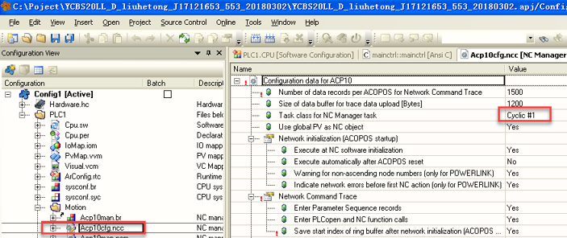

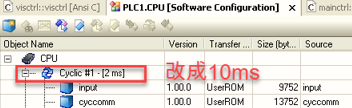

### 2022.07.22

报警64006、32037、1012、32189：网线松动

### 2023.02.14

- 1.这个通常是网络超时掉线了。优先检查从控制器（触摸屏后的背包）-> 8口 HUB 交换机 > 驱动器之间的电缆是否都是正常，无磨损及松动。
- 2.检查网络拓扑是否符合规范。8口 HUB 交换机理论上需要连接4个网口，如果不是请联系电气工程师进行改线操作指引。
- 3.重点检查掉线的站点，即 PLK 接入的站点拨码是否正确以及网口是否工作正常。
- 例如: 3.1 驱动器 L/D 1 L/D 2 如果都接入网络电缆后，接口网线的网口应该是正常闪烁。R/E 应该绿色常亮。
- 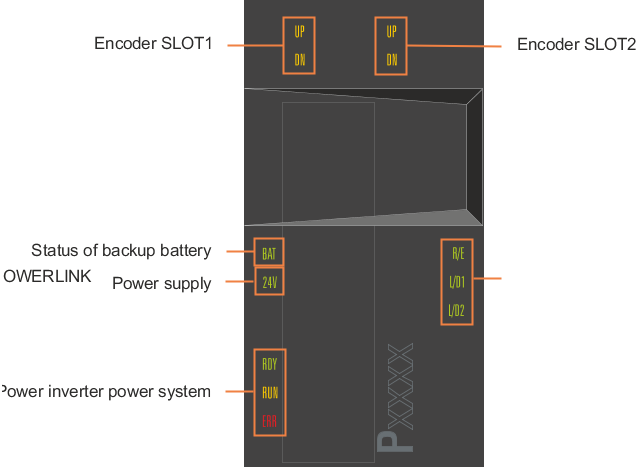
- 3.2 IO 从站模块，L/A IF 1 IF 2 如果接入了网络电缆后，接口网线的网口应该是正常闪烁的。S/E 应该是绿色常亮
- 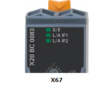
- 3.3如果某个站点掉线后，可以尝试更换站点的电缆的网口。如果 X20BC0083上有两个网口，如果其中一个网口接入后没反应，可以插入另一个网口试试。
- 4.如果电缆过长或者 PLK 站点超过了该项目的设计值时，可能会出现该错误，排除电缆的长度以及站点数目的问题。
- 5.互换8口 HUB 交换机，互换网络电缆排除。
- 6.检查8口 HUB 交换机，网络通信电缆是否为贝加莱原装产品。如果不是，请联系电气工程师，更换为贝加莱原装产品。
- 是否进线 380 V 电压掉电。当出现该情况时，驱动器上存储的电能用完后，每个驱动器站点将会陆续报这个错误代码。

### 2023.07.04

**现象** 使用 ACOPOS 与 AC141模块，报32189与32010。同一版程序在多台设备上正常运行，仅一台设备出现此问题，且更换过 ACOPOS 与 AC141模块

**原因** 主要问题是 AC141模块与 ACOPOS 壳体的固定不紧，造成模块断电（也是可能导致与 ACOPOS 的连接故障32189的原因之一）。已紧固 AC141的锁紧螺丝。

### 2023.07.04

**现象** 机器运行之后发生了某一驱动器报错，32037 32189 1012 ，其他驱动器没有报错

**原因** POWERLINK 网络通信质量问题

**解决方式** 重新拔插 POWERLINK 线缆后，问题解决。需要校核 POWERLINK 网络质量，优化参数

### 2023.07.04

**现象** 32189故障出现比较频繁，基本上每天都会出现一次，有时候一天会出现两次。

**解决方式** 修改 AC141 上面的 IF2 CAN 通讯口的 CAN 通讯波特率为 500 CAN Properties I/O 处参数 Slave Timeout 为10000， No. Of Entries 为 5

### 2023.07.04

**现象** 使用 ACOPOSmulti，电源轴 8BVP1650HC00.000-1经常报出32189错误。

**解决方式** 更改 PLK 网线顺序，加电源轴谐波滤波参数和更改电源轴复用模式。

1.电源轴参数表调整

 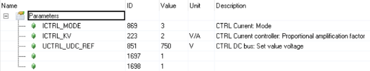

2.电源轴 PLK 参数调整

 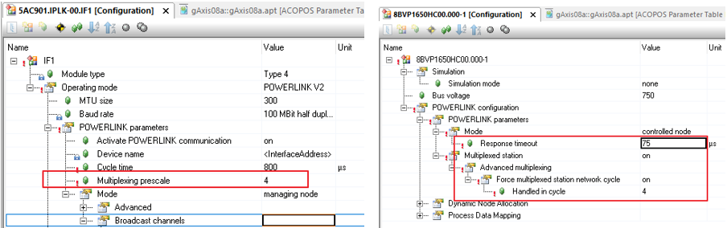

3.PLK进线顺序调整，先进逆变轴，把电源轴放在末端。

### 2023.07.04

**现象** 现场生产时，伺服网络断报警32189导致停机，不同驱动器都出现过该报警。

**解决方式** 现场更换主电柜HUB后没有再出现过该问题。

2023.07.04

**现象** 32280为上电启动时报警，初始化失败，驱动器PLK异步段通信超时。 32189为运行过程中，驱动器PLK同步段通信超时，相比起来更为严重。

**排查方式** 在不改动接线的基础上，遵循以下检查接线，插拔并观察HUB和驱动器网口指示灯。

- 1.HUB级数不宜超过4
- 2.以太网通信的ETH线缆和伺服驱动的PLK线缆，没有任何混合（即进入同一HUB）
- 3.线缆插口松紧情况查看，是否轻微手动碰触会造成通讯灯不亮
- 4.现场PLK线缆必须使用贝加莱原装线缆，不用普通以太网线缆代替
- 5.各路24V电源及驱动器机身的接地情况
- 6.检查线缆两端插头及线体本身
- 7.安排一组新的线缆和HUB在此现场更换

**相关建议** 如果按上述接线检查不存在问题的话，建议以下操作：

1.增加一个HUB给PLK用，减少各个节点的HUB级数

2.增加程序里的从站节点Response Timeout(25us-\>50us)，增加程序里的主站节点Asynchronous TimeOut(25us-100us) |

### 2023.07.04

**现象** 厂里调试设备多次报错32189故障，监控PLK的参数值FailedCycleCount参数有变化：

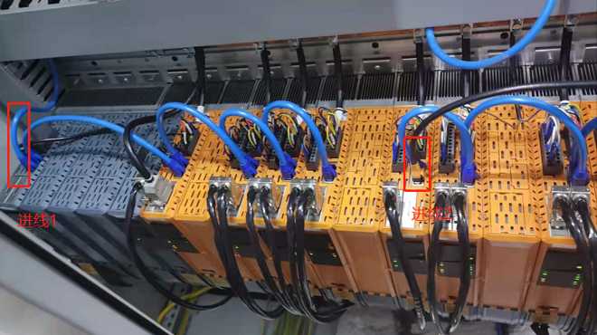

从HUB两个进线进入驱动器（如上图所示），如果把进线1改为末端逆变模块进入，32189故障没有，怀疑是电源轴的谐波干扰导致。

**解决方式** 后来把motion版本由5.10.1更新到5.14.2（该版本可以有效的过滤谐波）， 同时在电源轴参数表里配置ID1697--\>1和ID1698--\>1，过滤谐波就生效，恢复原有PLK接线，32189故障也消失

### 2023.07.04

**现象** 生产过程中出现报警29265、32189等故障，偶尔驱动先报警29265，重启上电后正常但运行一段时间后又会突然出现

**解决方式** 调整了PLK网络布局，更换PLK线缆，仍未解决问题 更换出问题的驱动器后解决

### 2023.07.04

使用ACOPOSmulti双电源并联方案，由于谐波导致的32189问题。可通过使用motion 5.16及以上的版本改善谐波，不需要单独在SPT中增加谐波抑制功能。

### 2023.07.04

用了时间较旧的0AC808.9会产生POWERLINK通讯问题 (ACOPOS 32189错误)，而且目前都已经升级为0AC808.9-1了。

### 2023.07.07

检查对应的驱动器的网线是否插好，是否是网线问题。 如果网线没有问题，检查驱动器的通讯卡上指示灯状态，是否通讯卡损坏。

# 32190：定义通过软件选择节点号的写入 COB 时出错

描述：

"通过软件选择节点号"功能允许用户通过特定的软件协议在应用程序中设置用于ACOPOS的节点号，而不是使用ACOPOS硬件上提供的节点号开关。

对于通过CAN网络运行ACOPOS伺服驱动器，对于此功能，必须为NC配置中定义的每个CAN接口定义单独的写入COB，其功能为CAN_defineCOB（）。如果此过程发生错误，则输出此错误号。

反应：

对于使用"通过软件选择节点号"功能并连接到此CAN接口的所有ACOPOS节点，初始化都将中止。不能再操作所有相应的 NC 对象。

原因/补救措施：

CAN_defineCOB（） 的状态：请参见 CAN 库错误号

# 32191：此参数 ID 是为 PLCopen MC 库保留的

描述：

如果对于用于参数传递的 NC 操作，指定了参数 ID（该 ID 是为 PLCopen MC 库保留的），则会显示此错误。

反应：

相应 NC 操作的处理将中止。

原因/补救措施：

不要在应用程序中使用此参数 ID。

# 32192：指定的数据模块不是 INIT 参数模块

描述：

如果对于将数据保存到 INIT 参数模块中的 NC 操作，指定的数据模块不是 INIT 参数模块，则会显示此错误。

反应：

相应 NC 操作的处理将中止。

原因/补救措施：

指定 INIT 参数模块的名称。

# 32193：对于此 NC 对象类型，不存在 INIT 参数模块

描述：

为了处理 NC 对象类型的 NC 操作"ncGLOBAL，ncSAVE"或"ncSETUP+ncCONTroller，ncSAVE"，在启动期间，目标系统上必须至少存在一个 NC 对象类型的 INIT 参数模块，该模块在 NC 映射表中分配给 NC 对象。否则，当调用 NC 操作"ncGLOBAL，ncSAVE"或"ncSETUP+ncCONTROLLER，ncSAVE"时，将显示此错误。

反应：

NC 操作"ncGLOBAL，ncSAVE"的处理已中止。

原因/补救措施：

必须将此 NC 对象类型的 INIT 参数模块指定给 NC 映射表中的 NC 对象，并将其传输到目标系统。

# 32194：未为此 NC 对象类型实现此函数

描述：

如果调用了 NC 操作（该操作仅针对某些 NC 对象类型实现，而不对当前使用的 NC 对象实现），则会显示此错误。

反应：

将不处理 NC 操作。

原因/补救措施：

不要为此 NC 对象类型调用此 NC 操作。

# 32195：将BsLoader下载到ACOPOS时出错

描述：

"acp10bsl"对象中的数据由 NC 管理器作为 BsLoader 传输到 ACOPOS。如果在此过程中发生错误，则输出此错误号。有关所发生错误的附加错误记录中还会输出更多详细信息。

反应：

BsLoader到ACPOS的传输被中止。

原因/补救措施：

将BsLoader转移到ACOPOS期间出错。

确切的原因可以从其他错误记录中输入的详细信息来确定。

# 32196：将操作系统下载到 ACOPOS 时出错

描述：

"acp10sys"对象中的数据由 NC 管理器作为操作系统传输到 ACOPOS。如果在此过程中发生错误，则输出此错误号。有关所发生错误的附加错误记录中还会输出更多详细信息。

反应：

将操作系统传输到 ACOPOS 将中止。

原因/补救措施：

在将操作系统传输到 ACOPOS 期间。

确切的原因可以从其他错误记录中输入的详细信息来确定。

# 32197：将 BsLoader 下载到 ACOPOS 时出错（记录器中的其他信息）

描述：

"acp10bsl"对象中的数据由 NC 管理器作为 BsLoader 传输到 ACOPOS。如果在此过程中发生错误，则输出此错误号。记录器中还提供了有关所发生错误的更多详细信息。

反应：

ACOPOS 启动功能已中止。

原因/补救措施：

将操作系统传输到 ACOPOS 期间出错。

确切的原因可以从记录器中输入的详细信息确定。

另请参阅错误号 [32198](#32198将操作系统下载到-acopos-时出错记录器中的其他信息).

# 32198：将操作系统下载到 ACOPOS 时出错（记录器中的其他信息）

描述：

"acp10sys"对象中的数据由 NC 管理器作为操作系统传输到 ACOPOS。如果在此过程中发生错误，则输出此错误号。记录器中还提供了有关所发生错误的更多详细信息。

反应：

ACOPOS 启动功能已中止。

原因/补救措施：

将操作系统传输到 ACOPOS 期间出错。

确切的原因可以从记录器中输入的详细信息确定。

以下记录器编号的信息包含以下详细信息：

\- 10940：ACP10 软件错误号（在本文档中描述）

\- 10941：ACP10 软件错误号（在本文档中描述）

\- 10942：10941 中错误号的信息（如果未提供 10941，则为 10940）

\- 10943：发生错误的参数 ID

\- 10965：发生错误的 ACOPOS 的节点号

另请参阅错误号 [32018](#32018系统模块中的参数-id-无效).

# 32200： 调用 plAcycWrite() 时出错（读取参数）

描述：

要从 ACOPOS 读取参数值，NC 管理器首先通过调用函数 plAcycWrite（） 发送非循环读取请求帧。如果此过程发生错误，则输出此错误号。

反应：

重置相应非循环 POWERLINK 读取通道的接口。

原因/补救措施：

确切的原因可以从plAcycWrite（）的状态中确定。

过载，故障或网络连接中断或ACPOS故障。

# 32201： 调用 plAcycWrite()（写入参数） 时出错

描述：

要将参数值传输到 ACOPOS，NC 管理器首先通过调用函数 plAcycWrite（） 发送一个非循环写入请求帧。如果此过程发生错误，则输出此错误号。

反应：

重置相应非循环 POWERLINK 写入通道的接口。

原因/补救措施：

确切的原因可以从plAcycWrite（）的状态中确定。

# 32202： 调用 plAcycRead()时出错（读取参数）

描述：

为了从 ACOPOS 读取参数值，NC 管理器调用函数 plAcycRead（）以便从 ACOPOS 接收非循环写入响应帧。

反应：

重置相应非循环 POWERLINK 读取通道的接口。

原因/补救措施：

确切的原因可以从plAcycRead（）的状态中确定。

# 32203： 调用 plAcycRead() （写入参数） 时出错

描述：

将参数值传输到 ACOPOS 后，NC 管理器调用函数 plAcycRead（）以便从 ACOPOS 接收非循环写入响应帧。

反应：

重置相应非循环 POWERLINK 写入通道的接口。

原因/补救措施：

确切的原因可以从plAcycRead（）的状态中确定。

# 32204：通过非循环通道读取标准值时超时(驱动器是否在网络中？)

描述：

要从 ACOPOS 读取参数值，NC 管理器首先将非循环读取请求帧从 PLC 发送到 ACOPOS。如果在进行 POWERLINK 发送函数调用后的特定时间内，NC 管理器无法使用 POWERLINK 库从 ACOPOS 读取相应的非循环读取响应帧，则会显示此错误。

反应：

重置相应非循环 POWERLINK 读取通道的接口。

原因/补救措施：

过载，故障或网络连接中断或ACPOS故障。

另请参阅错误号 [1012](#1012循环网络通信的崩溃).

## 应用案例

### 2022.01.10

请重新上电，故障是否仍然存在请更换驱动器上的AC114通讯卡

# 32205：通过非循环通道写入时超时(驱动器是否在网络中？)

描述：

为了将参数值传输到 ACOPOS，NC 管理器首先将非循环写入请求帧从 PLC 发送到 ACOPOS。如果在进行 POWERLINK 发送函数调用后的特定时间内，NC 管理器无法使用 POWERLINK 库从 ACOPOS 读取相应的非循环写入响应帧，则会显示此错误。

反应：

重置相应非循环 POWERLINK 写入通道的接口。

原因/补救措施：

过载，故障或网络连接中断或ACPOS故障。

另请参阅错误号[1012](#1012循环网络通信的崩溃).

# 32206：循环通道：尽管等待响应，但仍读取请求

描述：

要从 ACOPOS 读取参数值，NC 管理器首先将循环 POWERLINK 帧中的读取请求数据输入到 ACOPOS，然后等待相应的读取响应数据。如果在 NC 管理器中调用了输入读取请求数据的函数，则显示此错误，尽管等待响应数据在此通道上仍处于活动状态。

反应：

输入读取请求数据的函数已中止

原因/补救措施：

致命的 NC 管理器错误。

保存记录器数据和网络跟踪，并联系支持人员。

# 32207：循环通道：尽管等待响应，但仍写入请求

描述：

要从 ACOPOS 传输参数值，NC 管理器首先将循环 POWERLINK 帧中的写入请求数据输入到 ACOPOS，然后等待相应的写入响应数据。如果在 NC 管理器中调用了输入写入请求数据的函数，则显示此错误，尽管等待响应数据在此通道上仍处于活动状态。

反应：

输入写入请求数据的函数已中止

原因/补救措施：

致命的 NC 管理器错误。

保存记录器数据和网络跟踪，并联系支持人员。

# 32208：使用 plAction（DEVICE_TO_BUS_NR） 时出错（记录器中的其他信息）

描述：

对于通过POWERLINK网络操作ACOPOS伺服驱动器，除其他外，调用了plAction（GET_PDO_INFO）功能。如果此过程发生错误，则输出此错误号。

反应：

对于相应的 NC 对象，ACOPOS 启动功能将中止。这些 NC 对象不能再操作。

原因/补救措施：

更正"信息"中列出的 POWERLINK 错误。

从 Automation Studio V4.0 开始，当使用真实 CPU 作为目标平台时，可以切换到基于 ARsim 的 CPU 仿真，而无需更改 ACOPOS 仿真的设置。

如果将基于 ARsim 的 CPU 仿真用于 V2.380 之前的 ACP10 版本，则对于以下所有有效的 ACOPOS 轴，将显示此错误号和 Info 20903：

\- ACOPOS模拟已打开此轴

\- 对于同一 POWERLINK 接口上的其他轴，ACOPOS 仿真已关闭

为避免此问题，必须为 NC 映射表中的所有轴显式打开 ACOPOS 仿真。

切换到ACP10版本V2.380或更高版本时不再出现此问题，因为当将ARsim与这些ACP10版本一起使用时，ACOPOS仿真会自动打开。

# 32209：使用 plAction（GET_IDENT） 时出错（记录器中的其他信息）

描述：

对于通过POWERLINK网络操作ACOPOS伺服驱动器，除其他外，调用了plAction（GET_IDENT）功能。如果此过程发生错误，则输出此错误号。

反应：

对于相应的 NC 对象，ACOPOS 启动功能将中止。这些 NC 对象不能再操作。

原因/补救措施：

有关原因的更多信息可以从 plAction（） 的状态和在记录器中输入的详细信息来确定。

更改自动化运行时版本。

# 32210：调用 plState（） 时接口标识错误（记录器中的其他信息）

描述：

如果使用 plAction（GET_IDENT） 确定的 POWERLINK 接口的 ID 在调用 plState（） 时导致错误plSTATE_WRONG_IDENT，则会显示此错误。

反应：

对于相应的 NC 对象，ACOPOS 启动功能将中止。这些 NC 对象不能再操作。

原因/补救措施：

有关原因的详细信息，请输入到记录器中。

更改Automation Runtime版本。

# 32211：调用 plState（） 时接口不可用（记录器中的其他信息)

描述：

如果使用 plAction（GET_IDENT） 确定的 POWERLINK 接口的 ID 在调用 plState（） 时导致错误plSTATE_STATION_NONEXISTANT，则会显示此错误。

反应：

对于相应的 NC 对象，ACOPOS 启动功能将中止。这些 NC 对象不能再操作。

原因/补救措施：

有关原因的详细信息，请输入到记录器中。

更改Automation Runtime版本。

# 32212：调用 plState（） 时出现致命接口错误（记录器中的其他信息）

描述：

如果 POWERLINK 接口的 ID（使用 plAction（GET_IDENT） 确定）在调用 plState（） 时导致错误plSTATE_STATION_FAILED，则会显示此错误。

反应：

对于相应的 NC 对象，ACOPOS 启动功能将中止。这些 NC 对象不能再操作。

原因/补救措施：

有关原因的详细信息，请输入到记录器中。

更改Automation Runtime版本。

更改 POWERLINK 接口卡。

# 32213：POWERLINK 接口超时（记录器中的其他信息）

描述：

如果 POWERLINK 接口的启动未在一定时间内完成，则会显示此错误。

反应：

对于相应的 NC 对象，ACOPOS 启动功能将中止。这些 NC 对象不能再操作。

原因/补救措施：

更改Automation Runtime版本。

更改 POWERLINK 接口卡。

有关原因的详细信息，请输入到记录器中。

# 32214： 调用 plAcycOpen（） 时出错（记录器中的其他信息）

描述：

对于通过POWERLINK网络操作ACOPOS伺服驱动器，必须使用plAcycOpen（）功能打开非循环通信通道。如果此过程发生错误，则输出此错误号。

反应：

对于相应的 NC 对象，ACOPOS 启动功能将中止。这些 NC 对象不能再操作。

原因/补救措施：

有关原因的更多信息可以从plAcycOpen（）的状态和记录器中输入的详细信息来确定。

重新生成配置并将其传输到目标。

更改Automation Runtime版本。

# 32215： 调用 plCECreate（） 时出错（记录器中的其他信息）

描述：

对于通过POWERLINK网络操作ACOPOS伺服驱动器，必须使用函数plCECreate（）创建循环POWERLINK副本条目。如果此过程发生错误，则输出此错误号。

反应：

对于相应的 NC 对象，ACOPOS 启动功能将中止。这些 NC 对象不能再操作。

原因/补救措施：

有关原因的更多信息可以从 plCECreate（） 的状态和记录器中输入的详细信息来确定。

重新生成配置并将其传输到目标。

更改Automation Runtime版本。

# 32216：使用 plAction（GET_IF_PAR） 时出错（记录器中的其他信息）

描述：

对于通过POWERLINK网络操作ACOPOS伺服驱动器，除其他外，调用了plAction（GET_IF_PAR）功能。如果此过程发生错误，则输出此错误号。

反应：

对于相应的 NC 对象，ACOPOS 启动功能将中止。这些 NC 对象不能再操作。

原因/补救措施：

有关原因的更多信息可以从 plAction（） 的状态和在记录器中输入的详细信息来确定。

更改Automation Runtime版本。

# 32217： 广播频道： 调用 plAcycWrite（） 时出错（读取参数）

描述：

为了通过广播通道读取参数值，NC 管理器通过调用函数 plAcycWrite（） 发送一个非循环读取请求帧。如果此过程发生错误，则输出此错误号。

反应：

重置相应非循环 POWERLINK 广播通道的接口。

原因/补救措施：

确切的原因可以从plAcycWrite（）的状态中确定。

# 32218： 广播频道： 调用 plAcycWrite（） 时出错（写入参数）

描述：

为了通过广播通道传输参数值，NC 管理器首先通过调用函数 plAcycWrite（） 发送一个非循环写入请求帧。如果此过程发生错误，则输出此错误号。

反应：

重置相应非循环 POWERLINK 广播通道的接口。

原因/补救措施：

确切的原因可以从plAcycWrite（）的状态中确定。

# 32219：使用 plAction（GET_IF_MUXPRESCALE） 时出错（记录器中的其他信息）

描述：

对于通过POWERLINK网络操作ACOPOS伺服驱动器，除其他外，调用了plAction（GET_IF_MUXPRESCALE）功能。如果此过程发生错误，则输出此错误号。

反应：

对于相应的 NC 对象，ACOPOS 启动功能将中止。这些 NC 对象不能再操作。

原因/补救措施：

有关原因的更多信息可以从 plAction（） 的状态和在记录器中输入的详细信息来确定。

更改Automation Runtime版本。

# 32220：使用 plAction（GET_IF_CYCLE_TIME） 时出错（记录器中的其他信息）

描述：

对于通过POWERLINK网络操作ACOPOS伺服驱动器，除其他外，调用了plAction（GET_IF_CYCLE_TIME）功能。如果此过程发生错误，则输出此错误号。

反应：

对于相应的 NC 对象，ACOPOS 启动功能将中止。这些 NC 对象不能再操作。

原因/补救措施：

有关原因的更多信息可以从 plAction（） 的状态和在记录器中输入的详细信息来确定。

更改Automation Runtime版本。

# 32221：使用 plAction（GET_IF_PRESCALE） 时出错（记录器中的其他信息）

描述：

对于通过POWERLINK网络操作ACOPOS伺服驱动器，除其他外，称为plAction（GET_IF_PRESCALE）功能。如果此过程发生错误，则输出此错误号。

反应：

对于相应的 NC 对象，ACOPOS 启动功能将中止。这些 NC 对象不能再操作。

原因/补救措施：

有关原因的更多信息可以从 plAction（） 的状态和在记录器中输入的详细信息来确定。

更改Automation Runtime版本。

# 32222：使用 plAction（GET_STATIONFLAG） 时出错（记录器中的其他信息）

描述：

对于通过POWERLINK网络操作ACOPOS伺服驱动器，除其他外，调用了plAction（GET_STATIONFLAG）功能。如果此过程发生错误，则输出此错误号。

反应：

对于相应的 NC 对象，ACOPOS 启动功能将中止。这些 NC 对象不能再操作。

原因/补救措施：

有关原因的更多信息可以从 plAction（） 的状态和在记录器中输入的详细信息来确定。

更改Automation Runtime版本。

# 32223： 调用 plGetNodeInfo（） 时出错（记录器中的其他信息）

描述：

对于通过POWERLINK网络操作ACOPOS伺服驱动器，除其他外，调用了plGetNodeInfo（）函数。如果此过程发生错误，则输出此错误号。

反应：

对于相应的 NC 对象，ACOPOS 启动功能将中止。这些 NC 对象不能再操作。

原因/补救措施：

有关原因的更多信息可以从 plGetNodeInfo（） 的状态和在记录器中输入的详细信息来确定。

更改Automation Runtime版本。

# 32224： 调用 plAction（GET_PROTOCOL_VERSION） 时出错（记录器中的其他信息）

描述：

对于通过POWERLINK网络操作ACOPOS伺服驱动器，除其他外，称为plAction（GET_PROTOCOL_VERSION）功能。如果此过程发生错误，则输出此错误号。

反应：

对于相应的 NC 对象，ACOPOS 启动功能将中止。这些 NC 对象不能再操作。

原因/补救措施：

有关原因的更多信息可以从 plAction（） 的状态和在记录器中输入的详细信息来确定。

更改Automation Runtime版本。

# 32225：此 ACOPOS POWERLINK 节点在 AR 配置中不存在

描述：

如果 ACOPOS 模块在 NC 配置（NC 映射表）中作为 POWERLINK 节点包含在，但在 AR 配置中未包含，则指示此错误。

反应：

此 ACOPOS 的 ACOPOS 启动功能已中止。

此 ACOPOS 模块的所有 NC 对象的操作均处于禁用状态。

原因/补救措施：

新创建 AR 配置和 NC 配置，以便它们匹配。

# 32226：模块 acp10cfg 中的 SDC 节点号无效

描述：

对于 V3.0 之前的 Automation Studio 版本，硬件树中配置的所有 ACOPOS 模块的节点号都将输入到模块 acp10cfg 中。当 SDC 接口的节点号定义在有效范围（1 到 200）之外时，将显示此错误。

注意：

如果发生此错误，则会在记录器中输入二进制数据中具有此错误号的以下错误：

\- 10550：读取 NC CFG 模块："二进制数据"中的 NC 管理器错误

此外，在记录器中输入了以下错误，其中二进制数据中的状态值为"if_index \* 256 + node_nr"：

\- 10551：读取 NC CFG 模块："二进制数据"中 NC 管理器错误的状态

反应：

NC 软件的初始化将中止。不能操作 NC 对象。

原因/补救措施：

删除硬件树中具有无效节点号的 ACOPOS 模块。

重建模块 acp10cfg 并将其传输到目标。

NC 软件版本的更改。

Automation Studio的更改。

# 32227：重复使用模块 acp10cfg 中的 SDC 节点号

描述：

对于 V3.0 之前的 Automation Studio 版本，硬件树中配置的所有 ACOPOS 模块的节点号都将输入到模块 acp10cfg 中。如果对于 SDC 接口多次定义节点号，则会显示此错误。

注意：

如果发生此错误，则会在记录器中输入二进制数据中具有此错误号的以下错误：

\- 10550：读取 NC CFG 模块："二进制数据"中的 NC 管理器错误

此外，在记录器中输入了以下错误，其中二进制数据中的状态值为"if_index \* 256 + node_nr"：

\- 10551：读取 NC CFG 模块："二进制数据"中 NC 管理器错误的状态

反应：

NC 软件的初始化将中止。不能操作 NC 对象。

原因/补救措施：

在每个 SDC 接口上为 ACOPOS 模块定义每个节点号仅一次。

重建模块 acp10cfg 并将其传输到目标。

NC 软件版本的更改。

Automation Studio的更改。

# 32228： acp10cfg 中不包含网络接口（POWERLINK 或 SDC）

描述：

当使用此ACP10MAN变体（ACP10MAN用于POWERLINK和SDC）时，具有POWERLINK或SDC类型的网络接口必须包含在模块acp10cfg中。如果不是这种情况，则会显示此错误。

注意：

如果发生此错误，则会在记录器中输入二进制数据中具有此错误号的以下错误：

\- 10550：读取 NC CFG 模块："二进制数据"中的 NC 管理器错误

反应：

NC 软件的初始化将中止。不能操作 NC 对象。

原因/补救措施：

在 ACP10 配置中插入 POWERLINK 或 SDC 类型的网络接口。

重建模块 acp10cfg 并将其传输到目标。

将另一个ACP10MAN变体（ACP10MAN for CAN）插入到项目中并将其传输到目标。

# 32229：运行 SDC 轴所需的 SDC 对象不存在

描述：

对于 SDC 轴的操作，目标系统上必须存在 acp10sdc 库。如果不是这种情况，则指示此错误。

反应：

SDC 轴的 ACOPOS 启动功能已中止。这些 NC 对象不能再操作。

原因/补救措施：

必须将库 acp10sdc 传输到目标系统。

# 32230：初始化 SDC oder SIM 对象时出错（请参见记录器）

描述：

对于具有 acp10sdc 或 acp10sim 的轴的操作，必须调用初始化函数。如果此函数不可用或在处理此函数期间发生错误，则会显示此错误。

反应：

对于相应的 NC 对象，ACOPOS 启动功能将中止。这些 NC 对象不能再操作。

原因/补救措施：

确切的原因可以从记录器中输入的详细信息确定。例如，如果在记录器中显示错误"找不到 PV"，则这可能是由该错误引起的，即已声明 PV 但未使用。

NC 软件版本的更改。

## 应用案例

### 2023.07.04

**现象** 使用工控机控制SDC轴报错32230，复位后报错29265

**解决方式** SDC程序中需要

- 1.根据实际硬件调整PLK口站点；
- 2. 并且需要将程序放在 Cyclic 1，保证时序准确；选择“输出无抖动”。堆栈要改为 32000，默认的 8192 会引起“Page Fault”错误。
- 
- 3.任务周期不能有Torlerence，即参数为0.
- 4.PLC的时钟选PLK
- 5.任务周期不能大于10ms，否则会造成系统不停的重启。

# 32231：SDC 配置时出错（请参见记录器）

描述：

如果 SDC 接口的配置不正确，则会显示此错误。

反应：

NC 软件的初始化将中止。不能操作 NC 对象。

原因/补救措施：

确切的原因可以从记录器中输入的详细信息确定。

# 32232：ACOPOS 仿真所需的 SIM 对象不存在

描述：

如果为 NC 对象激活了 ACOPOS 模拟，则 ACP10sim 库将模拟 ACOPOS 功能。如果在这种情况下，目标系统上不存在库 acp10sim，则指示此错误。

反应：

对于相应的 NC 对象，ACOPOS 启动功能将中止。这些 NC 对象不能再操作。

原因/补救措施：

必须将库 acp10sim 传输到目标系统。

# 32233：NCBSL（名称见记录器）不包含模块类型为 0x4F 的 NC 系统模块

描述：

名称为"acp10bsl"的 BR 模块必须包含模块类型为 0x4F 的 BR 模块（NC 系统模块）。如果不是这种情况，则指示此错误。

反应：

ACOPOS 启动功能已中止。NC 对象不能再操作。

原因/补救措施：

名称"acp10bsl"用于与ACOPOS BsLoader模块不同的对象。必须在目标系统上重命名或删除此对象。

# 32234：NCSYS（名称见记录器）不包含模块类型为 0x4F 的 NC 系统模块

描述：

名称为"acp10sys"的 BR 模块必须包含模块类型为 0x4F 的 BR 模块（NC 系统模块）。如果不是这种情况，则指示此错误。

反应：

ACOPOS 启动功能已中止。NC 对象不能再操作。

原因/补救措施：

名称"acp10sys"用于与ACOPOS操作系统模块不同的对象。必须在目标系统上重命名或删除此对象。

# 32235：参数序列中参数的数据地址为零

描述：

对于格式为"ncFORMAT_ADR"的参数序列，必须在参数"data_adr"的每个参数记录中指定参数数据的地址。如果此参数在参数记录中为零，则此错误将与参数记录的索引一起显示为信息。

反应：

此 NC 操作的处理将中止。

原因/补救措施：

使用正确的数据地址初始化每个参数记录中的参数"data_adr"。

# 32236：参数列表中参数的数据地址为零

描述：

对于格式为“ncFORMAT_ADR”的参数列表，必须在参数“data_adr”的每个参数记录中指定参数数据的地址。 如果该参数在参数记录中为零，则该错误将显示为参数记录的索引作为信息。

反应：

该 NC 动作的处理被中止。

原因/补救措施：

用正确的数据地址初始化每个参数记录中的参数“data_adr”。

# 32237：模块 acp10cfg 中 ACOPOS 参数的通道索引无效

描述：

由硬件配置产生的初始 ACOPOS 参数包含在模块 acp10cfg 的数据部分中。 如果在参数标题中输入了无效的频道索引，则会显示此错误。

反应：

NC 软件的初始化被中止。 不能操作任何 NC 对象。

原因/补救措施：

此 Automation Studio 版本错误地创建了模块 acp10cfg 中的 ACOPOS 参数数据。

Automation Studio 版本的更改。

删除硬件配置中的ACOPOS模块、ACOPOS插卡或电机，重新创建模块acp10cfg。

从 ACP10-Software V2.410 开始的解决方法：

通过将以下 XML 属性输入到 NC 映射表中 NC 对象类型“ncMANAGER”的数据记录的“附加数据”列中，可以禁用从模块 acp10cfg 传输 ACOPOS 参数：

\- AcoposPar_Acp10cfg_Disabled="1"

# 32238：这个功能暂时没有实现

描述：

如果调用了 NC 操作，但此时未执行（尚未执行或不再执行），则会显示此错误。

反应：

不处理 NC 动作。

原因/补救措施：

不要将此称为 NC 操作。

# 32239：无法分配 INIT 参数模块的基本内存

描述：

为了将数据保存到 INIT 参数模块中，需要在 NC 软件初始化期间分配的基本存储器。 如果此过程发生错误，则在调用用于将数据保存到 INIT 参数模块的 NC 操作时会显示此错误。

反应：

相应的 NC 动作的处理被中止。

原因/补救措施：

没有足够的可用内存。

在 OS 区域配置更多内存。

# 32240：NC 对象数据无效（变量声明中具有 INIT 值的 PV？）

描述：

NC 对象数据由 NC 管理器初始化。 如果识别出某些 NC 对象数据已被无效值覆盖，则指示此错误，否则由 NC 管理器初始化的值将被覆盖。

反应：

该 NC 对象的操作被禁用。

原因/补救措施：

如果一个 PV 用于一个 NC 对象，对于这个 PV，在变量声明中不能定义一个 INIT 值，否则由 NC 管理器初始化的 NC 对象数据将被覆盖。 对于这样的 PV，必须禁用 INIT 值。

# 32241：数据块操作：数据模块名称必须为零

描述：

对于某些数据块操作，不允许指定数据模块名称。 如果对于此类 NC 操作，参数“parameter.data_modul[0]”设置为非零值，则会显示此错误。

反应：

相应的 NC 动作的处理被中止。

原因/补救措施：

指定数据模块名称..

# 32243：使用 plAction(GET_PDO_INFO) 时出错（记录器中的附加信息）

描述：

为了通过 POWERLINK 网络操作 ACOPOS 伺服驱动器，其中调用了函数 plAction(GET_PDO_INFO)。如果此过程发生错误，则输出此错误编号。

反应：

该 ACOPOS 的 ACOPOS 启动功能被中止。

原因/补救措施：

更正信息中列出的 POWERLINK 错误。

从Automation Studio V4.0开始，当使用真实的CPU作为目标平台时，可以切换到基于ARsim的CPU模拟，而无需更改ACOPOS模拟的设置。

如果基于 ARsim 的 CPU 模拟与 V2.380 之前的 ACP10 版本一起使用，那么对于关闭 ACOPOS 模拟的所有轴，都会显示带有信息 20903 的错误编号。为避免此问题，必须为 NC 映射表中的所有轴明确打开 ACOPOS 模拟。

切换到 ACP10 版本 V2.380 或更高版本时不再出现此问题，因为在这些 ACP10 版本中使用 ARsim 时会自动打开 ACOPOS 模拟。

# 32244：此通道的循环帧中未定义 PDO：通道已禁用

描述：

如果在 POWERLINK 配置的过程数据映射中没有为 ACOPOS 模块的一个通道（一个轴）定义数据点，则会显示此错误。

反应：

该通道（该轴）的处理被禁用。

原因/补救措施：

ACOPOS 多轴模块的通道 2 被禁用，因为“单轴”被选为操作模式。 如果选择“双轴”作为操作模式（或“用户配置”并激活轴 2 的数据点），则只能使用通道 2。

ACOPOS 多轴模块的通道 3 被禁用，因为选择了“单轴”或“双轴”作为操作模式。 如果选择“三轴”作为操作模式（或“用户配置”并激活轴 3 的数据点），则只能使用通道 3。

# 32245：无法分配用于操作广播频道的内存

描述：

为了耦合不同网络上的轴，必须为耦合从站的网络接口组态广播通道。

如果无法分配用于操作广播频道的内存，则会显示此错误。

反应：

此 POWERLINK 接口的耦合从站不能耦合到另一个网络接口的耦合主站。

原因/补救措施：

没有足够的可用内存。

在 OS 区域配置更多内存。

# 32246：POWERLINK 广播频道的“方向”不是“输出”

描述：

为了耦合不同网络上的轴，必须为耦合从站的网络接口组态广播通道。 如果耦合从站配置在 POWERLINK 接口上，则必须在 POWERLINK 配置中为此接口定义名为“ACP10_MC_BROADCAST”的广播通道。

如果对于 POWERLINK 接口，定义了名称为“ACP10_MC_BROADCAST”的数据点，并为其定义了另一个“方向”作为“输出”，则会显示此错误。

反应：

此 POWERLINK 接口的耦合从站不能耦合到另一个网络接口的耦合主站。

原因/补救措施：

除了用于耦合不同网络上的轴之外，请勿出于任何目的定义名称为“ACP10_MC_BROADCAST”的数据点。

# 32247：使用 plAction(GET_TC_INFO) 时出错（记录器中的附加信息）

描述：

如果在 NC 配置中为此网络接口定义了“ACP10_MC_BROADCAST=Yes 的扩展耦合数据”，则扩展耦合数据将用于网络接口。

为了使用精确的时间戳而不是简单的计数器，有必要通过调用 plAction(GET_TC_INFO) 来确定附加信息。 如果这个函数返回一个错误，这个错误号会存储在一个错误记录中，plAction() 的返回值作为信息。

如果调用了需要 plAction (GET_TC_INFO) 信息的 NC 动作，则指示存储的错误记录。

反应：

相应的 NC 动作的处理被中止。

原因/补救措施：

确切原因可以从 plAction() 的状态和在 Logger 中输入的详细信息确定。

# 32248：模块 acp10cfg 中的 ACOPOS 参数头无效（超出部分）

描述：

由硬件配置产生的初始 ACOPOS 参数包含在模块 acp10cfg 的数据部分中。 如果包含在参数标题中的引用指向此数据部分之外的区域，则会显示此错误。

反应：

NC 软件的初始化被中止。 不能操作任何 NC 对象。

原因/补救措施：

查看错误编号 [32237](#32237模块-acp10cfg-中-acopos-参数的通道索引无效).

# 32249：模块 acp10cfg 中的 ACOPOS 参数描述符无效（超出部分）

描述：

由硬件配置产生的初始 ACOPOS 参数包含在模块 acp10cfg 的数据部分中。 如果参数描述符中包含的引用指向此数据部分之外的区域，则会显示此错误。

反应：

用于从模块 acp10cfg 传输 ACOPOS 参数的功能在此 ACOPOS 中被中止。

原因/补救措施：

查看错误编号 [32237](#32237模块-acp10cfg-中-acopos-参数的通道索引无效).

# 32250：模块 acp10cfg 中的 ACOPOS 参数：参数数据的长度太大

描述：

由硬件配置产生的初始 ACOPOS 参数包含在模块 acp10cfg 的数据部分中。 如果在参数描述符中包含的参数数据长度大于允许的最大值，则会显示此错误。

反应：

用于从模块 acp10cfg 传输 ACOPOS 参数的功能在此 ACOPOS 中被中止。

原因/补救措施：

查看错误编号 [32237](#32237模块-acp10cfg-中-acopos-参数的通道索引无效).

# 32251：NcNetCyc：响应超时

描述：

要将参数值传送到 ACOPOS，NC 管理器首先在循环 POWERLINK 帧中向 ACOPOS 输入读取或写入请求。 如果在特定时间后未收到来自 ACOPOS 的循环 POWERLINK 帧中相应的读取或写入响应数据，则会显示此错误。

反应：

复位相应读或写通道的接口。

原因/补救措施：

网络连接过载、故障或中断或 ACOPOS 故障

查看错误码 [1004](#1004网络生命标志监视器超时).

查看错误码 [1012](#1012循环网络通信的崩溃).

# 32252：NcNetCyc：意外响应（无效的计数器值）

描述：

要将参数值传送到 ACOPOS，NC 管理器首先在循环 POWERLINK 帧中向 ACOPOS 输入具有特定计数器值的读或写请求。 如果来自 ACOPOS 的循环 POWERLINK 帧中包含具有不同于预期的计数器值的读取或写入响应数据，则会显示此错误。

反应：

复位相应读或写通道的接口。

原因/补救措施：

网络连接过载、故障或中断或 ACOPOS 故障。

查看错误码 [1004](#1004网络生命标志监视器超时).

查看错误码 [1012](#1012循环网络通信的崩溃).

# 32253：POWERLINK 输出循环触发器的任务类无效

描述：

在 POWERLINK 配置中，可以选择任务类作为输出循环触发器（默认情况下，输出循环触发器由系统滴答执行）。 如果为 POWERLINK 接口选择了比 NC 管理器任务的任务类更高的任务类，则会指示此错误。

反应：

对于连接到该 POWERLINK 接口的所有 ACOPOS 模块，ACOPOS 启动功能被中止。

原因/补救措施：

在 POWERLINK 配置中选择一个有效的任务类。.

# 32254：未定义 PDO 映射（此 ACOPOS ID 需要 PDO 映射）

描述：

对于具有此 ACOPOS ID 的 ACOPOS 模块，绝对需要在 POWERLINK 配置中定义过程数据映射。 如果不是这种情况，则会指示此错误。

反应：

该 ACOPOS 的 ACOPOS 启动功能被中止。

原因/补救措施：

对于此 ACOPOS 模块，必须使用硬件配置文件，通过该文件将过程数据映射输入到 POWERLINK 配置中.

# 32255：录播处于活动状态时不允许录播开始

描述：

之前启动的录播处于活动状态时，无法开始录播。

反应：

此操作的处理被中止。

原因/补救措施：

等待之前开始的录播完成。

中止之前启动的录播.

# 32256：录播触发器：无效数据

描述：

如果录播配置中的触发记录数不为零，则如果第一个触发记录的地址为零或触发记录包含无效的模块句柄，则会显示此错误。

反应：

录播处理被中止。

原因/补救措施：

将录播配置中的触发器记录数设置为零。

为每个触发记录定义有效数据。

从录播配置中删除无效的触发器记录.

# 32257：录播触发器：此 ACOPOS 未启用此通道

描述：

指定的通道不能在相应的 ACOPOS 硬件上使用。

反应：

录播处理被中止。

原因/补救措施：

定义在相应 ACOPOS 硬件上启用的通道。

从录播配置中删除此触发器记录.

# 32258：为一个通道定义了多个跟踪触发器

描述：

如果在录播配置中为一个通道定义了多个触发器，则会显示此错误。

反应：

录播处理被中止。

原因/补救措施：

每个通道仅定义一个触发器.

# 32259：当前没有要保存的录播数据

描述：

没有为此录播配置记录跟踪数据，可以将其保存到数据对象中。

反应：

保存录播数据的功能被中止。

原因/补救措施：

使用此配置进行录播，以便记录数据.

# 32260：录播：未定义有效的测试数据点

描述：

只有定义了至少一个有效的测试数据点，才能开始跟踪。 如果不是这种情况，则会指示此错误。

反应：

录播处理被中止。

原因/补救措施：

更正录播配置，以便至少定义一个有效的测试数据点.

# 32261：录播触发器：无效数据

描述：

不允许在多轴跟踪中使用此 NC 对象。 只能使用具有以下类型的 NC 对象：

\- 实轴

\- 虚拟轴

反应：

跟踪处理被中止。

原因/补救措施：

从跟踪配置中删除无效的 NC 对象或将其替换为有效的对象.

# 32262：录播测试数据点：无效数据

描述：

不允许在多轴录播中使用此 NC 对象。 只能使用具有以下类型的 NC 对象：

\- 实轴

\- 虚拟轴

反应：

录播处理被中止。

原因/补救措施：

从录播配置中删除无效的 NC 对象或将其替换为有效的对象。.

# 32263：录播触发器：此 ACOPOS 未启用此通道

描述：

该 NC 对象不能在相应的 ACOPOS 硬件上使用。

反应：

录播处理被中止。

原因/补救措施：

从录播配置中删除此 NC 对象。.

# 32264：录播测试数据点：此 ACOPOS 未启用此通道

描述：

该 NC 对象不能在相应的 ACOPOS 硬件上使用。

反应：

录播处理被中止。

原因/补救措施：

从录播配置中删除此 NC 对象。.

# 32265：录播触发器：此 NC 对象的录播在录播开始时已处于活动状态

描述：

如果没有涉及的 NC 对象录播处于活动状态，则只能启动多轴录播。

反应：

录播处理被中止。

原因/补救措施：

等待此 NC 对象的录播完成。.

# 32266：录播测试数据点：此 NC 对象的录播在录播开始时已处于活动状态

描述：

如果没有涉及的 NC 对象录播处于活动状态，则只能启动多轴录播。

反应：

录播处理被中止。

原因/补救措施：

等待此 NC 对象的录播完成。.

# 32267：录播触发器：未为录播命令启用 NC 对象

描述：

在以下情况下，不会为录播命令启用 NC 对象：

\- 对于相应的 ACOPOS 模块，启动尚未完成

\- 对应的trace通道已经在trace中使用

反应：

录播处理被中止。

原因/补救措施：

等待 ACOPOS 启动或之前启动的录播完成。.

# 32268：录播测试数据点：未为录播命令启用 NC 对象

描述：

在以下情况下，不会为录播命令启用 NC 对象：

\- 对于相应的 ACOPOS 模块，启动尚未完成

\- 对应的trace通道已经在trace中使用

反应：

录播处理被中止。

原因/补救措施：

等待 ACOPOS 启动或之前启动的录播完成。.

# 32269：录播：为一个录播通道定义的测试数据点太多

描述：

对于一个录播通道最大。 可以定义 10 个测试数据点。

一个录播通道属于一个ACOPOS 模块上具有相同通道号的实轴和虚轴。

反应：

录播处理被中止。

原因/补救措施：

减少测试数据点.

# 32270：ACOPOS 耦合：发送数据的通道号无效

描述：

只有值 1 到 3 对发送数据的通道号有效。 如果指定了不同的通道号，则会报告此错误。

笔记：

从 V2.370 开始显示 INFO。

反应：

相应的 NC 动作的处理被中止。

原因/补救措施：

指定用于激活发送数据的有效通道号.

# 32271：ACOPOS 耦合：接收数据的通道号无效

描述：

只有值 1 到 5 对接收数据的通道号有效。 如果指定了不同的通道号，则会报告此错误。

反应：

相应的 NC 动作的处理被中止。

原因/补救措施：

为接收数据的配置指定一个有效的通道号。.

# 32272：ACOPOS 耦合：未配置使用此通道号发送数据

描述：

如果在 ACOPOS 模块的 POWERLINK 配置中启用了相应的耦合对象，则耦合数据只能由耦合主站发送。 如果在 POWERLINK 配置中禁用了具有指定通道编号的耦合对象，则会报告此错误。

反应：

相应的 NC 动作的处理被中止。

原因/补救措施：

指定用于激活发送数据的其他通道编号。

在 POWERLINK 配置中启用具有指定通道编号的耦合对象。.

# 32273：ACOPOS 耦合：发送数据的 NC 对象无效

描述：

只有属于 ACP10 软件的“ncAXIS”或“ncV_AXIS”类型的 NC 对象才允许作为发送数据的 NC 对象。

反应：

相应的 NC 动作的处理被中止。

原因/补救措施：

指定发送数据的有效 NC 对象。.

# 32274：网络耦合：未配置广播频道

描述：

为了耦合不同网络上的轴，必须为耦合从站的网络接口组态广播通道。

如果调用将一个从站耦合到不同网络接口的主站的 NC 操作，则如果没有为耦合从站的网络接口配置广播通道，则会显示此错误。

反应：

相应的 NC 动作的处理被中止。

原因/补救措施：

如果耦合从站配置在 POWERLINK 接口上，则必须在 POWERLINK 配置中为此接口定义名为“ACP10_MC_BROADCAST”的广播通道。

如果耦合从机配置在 SDC 接口上，则可以在 ACP10 配置数据中为该接口定义广播通道的大小。.

## 应用案例

### 2023.07.04

**现象** MpAxisBasic和MpMpAxisCoupling时，再调用MC_BR_MoveCyclicPosition，主轴会报错32274。

**解决方式** 需要设置如下三处：

- 1.NC Manager 配置 将Extended coupling data for ACP10_MC_BROADCAST设置为Yes
- 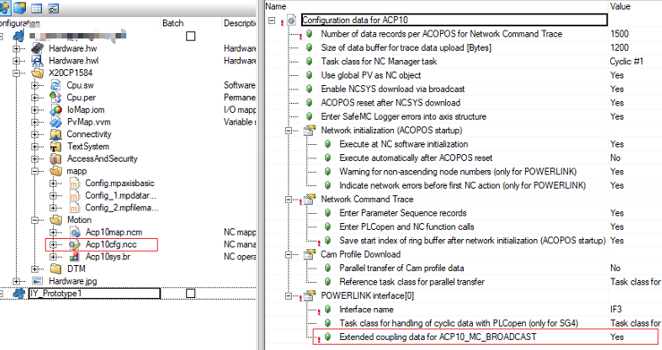
- 2.PLK配置 添加广播通道
- 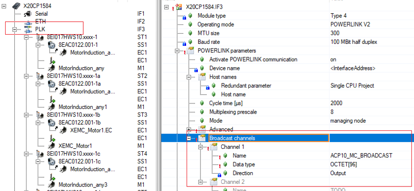
- 3.PLC任务周期配置
- 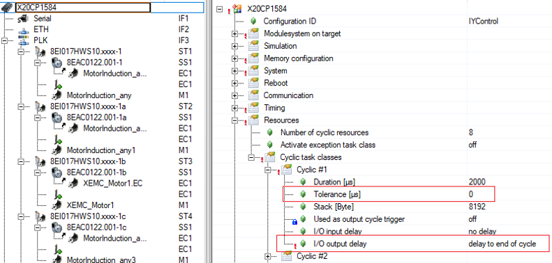

# 32275：网络耦合：广播频道未成功初始化

描述：

为了耦合不同网络上的轴，必须为耦合从站的网络接口组态广播通道。

如果调用将一个从站耦合到不同网络接口的主站的 NC 操作，则如果在耦合从站的网络接口的广播通道初始化期间发生错误，则会显示此错误。

反应：

相应的 NC 动作的处理被中止。

原因/补救措施：

确切原因可以从为初始化错误显示的错误编号确定。.

# 32276：网络耦合：循环时间不相等（POWERLINK，NC 任务类）

描述：

如果耦合主站和耦合从站连接到不同的网络接口，则证明以下循环时间是否相等：

\- NC 管理器任务类的循环时间

\- POWERLINK 循环时间（如果主站或从站通过 POWERLINK 网络操作）

如果不是这种情况，则会指示此错误。

反应：

相应的 NC 动作的处理被中止。

原因/补救措施：

使循环时间相等，这在上面的描述中列出。.

# 32277：网络耦合：在广播频道中没有更多的数据记录

描述：

为了耦合不同网络上的轴，必须为耦合从站的网络接口组态广播通道。

如果调用用于将一个从站耦合到不同网络接口的主站的 NC 操作，则如果广播通道中没有更多的耦合数据记录，则会显示此错误。

反应：

相应的 NC 动作的处理被中止。

原因/补救措施：

增加广播频道的大小。

如果耦合从站配置在 POWERLINK 接口上，则必须在 POWERLINK 配置中为此接口定义名为“ACP10_MC_BROADCAST”的广播通道。

如果耦合从机配置在 SDC 接口上，则可以在 ACP10 配置数据中为该接口定义广播通道的大小。.

# 32278：ACOPOS 耦合：零作为发送数据的参数 ID 是不允许的

描述：

如果在调用用于激活发送数据的 NC 动作时将发送数据的参数 ID 定义为零，则会指示此错误。

反应：

相应的 NC 动作的处理被中止。

原因/补救措施：

指定用于激活发送数据的有效参数 ID。.

# 32279：服务接口：数据地址零

描述：

如果参数“network.service.data_adr”对于 NC 操作设置为零，则必须在服务接口中为其指定用户数据结构的数据地址，则会显示此错误。

反应：

相应的 NC 动作的处理被中止。

原因/补救措施：

不要使用零作为数据地址。.

# 32280：启用非循环网络通信超时

描述：

在 POWERLINK 网络的网络初始化（ACOPOS 启动函数）期间，在第一次读取参数 BOOT_STATE 之前，对于每个 ACOPOS 模块，初始化暂停，直到 plState() 函数指示以下状态之一：

\- plSTATE_STATION_ACTIVATEING (0x0004: 该站刚刚被激活)

\- plSTATE_STATION_ACTIVE（0x0005：站在线并执行循环复制指令）

\- plSTATE_STATION_CHANGED（0x0007：站的硬件配置已更改）

\- plSTATE_STATION_CFGFAILED (0x0008: 站的配置失败)

如果达到等待此 POWERLINK 状态的超时时间，则会出现此错误。

反应：

该 ACOPOS 的 ACOPOS 启动功能被中止。

原因/补救措施：

网络连接过载、故障或中断或 ACOPOS 故障。.

查看错误码 [1004](#1004网络生命标志监视器超时).

查看错误码 [1012](#1012循环网络通信的崩溃).

## 应用案例

### 2023.07.11

**现象** 新组装的机器，有一个驱动器报错32029或32280，已更换过网线、检查过拨码。

**问题排查** 采集 NCT，检查网络通信情况

发现上电后通讯建立在 NETWORK_PHASE = 40之前都是正常的，在40时出现报错。 NETWORK_PHASE = 40时系统通过 PLK 往伺服下载 ACP10版本。因此怀疑时拓扑结构过长导致的异步通讯超时。现场检查拓扑，发现从 PLC 的 PLK 口出来后所有伺服均在一条拓扑线路上，即无 Hub 拓展。现场更改接线顺序，发现拓扑线路的最后一个驱动器均会触发同样的报警。由此确认与拓扑结构有关。

**解决方式** 方式一由于现场暂无法更改拓扑结构，于是将 PLK 主站的 Asynchronous timeout 参数由默认的25 μs 改为100 μs。其中 Asynchronous timeout 参数的含义如下图，即 POWERLINK 异步段通信，主站发帧，等待从站（驱动器）响应的时间，若现场拓扑复杂，同一链路下 CN 数量多，则此参数需要适当增大。

重新下载程序后所有伺服通讯正常。 方式二 有条件时应使用Hub修改POWERLINK网络的拓扑结构，改成星型拓扑结构。

### 2023.07.05

 **现象** 380 V 电源还未接通时，驱动器和控制器的 24 V 控制电路都已接通，有随机驱动器出现报错 32280（异步通讯超时），该问题的出现没有规律性，不同驱动器均有出现过该报错，但是没有出现过一次上电后多个驱动器同时报这个错误。该问题通过断电重新启动控制器和驱动器的控制电路，可以解决，正常生产。网络线缆，HUB，PLK 网络超时时间的设置或是湿度造成的网口松动都有可能导致此问题出现

 **总结** 32280 为上电启动时报警，初始化失败，驱动器 PLK 异步段通信超时。

 **接线检查思路** 在不改动接线的基础上，遵循以下检查接线，需要插拔并观察 HUB 和驱动器网口指示灯。

 - 1.HUB 级数不宜超过 4
 - 2.ETH 以太网和伺服驱动的 PLK 线缆，没有任何混合（进入同一 HUB）
 - 3.线缆插口松紧情况查看，是否轻微手动碰触会造成通讯灯不亮
 - 4.现场 PLK 线缆必须使用贝加莱原装线缆，不用普通以太网线缆代替
 - 5.各个各路 24 V 电源及驱动器机身的接地情况
 - 6.检查线缆两端插头及线体本身
 - 7. 安排一组新的线缆和 HUB 在此现场更换，正向检查

 **相关建议** 如果按上述接线检查不存在问题的话，建议以下操作： 1.增加一个 HUB 给 PLK 用，减少各个节点的 HUB 级数 2.增加程序里的从站节点 Response Timeout(25us->50us)，增加程序里的主站节点 Asynchronous TimeOut(25us -> 100us)

### 2023.07.05

**现象** 驱动器上电会报错，报错代码为32280。插拔驱动器的端子排，用以重新24V上电，可排除故障。有时候一次不行，再插拔一下。 更换了AC114卡后部分驱动器仍然会报此错误

**改善措施**

- 1.加强AC114卡接地抗干扰特性 把整机所有的114卡拆下来，进行处理，如图所示，把相应位置的涂层刮掉，增强114卡和驱动器的金属接触，并用酒精擦拭金手指
- 
- 2.清洗水晶头。 对整机所有驱动器上的网线水晶头进行清洗。使用75%的酒精和牙刷，对水晶头进行刷洗。 清洗完后，过了一段时间，再插上测试。测试过程中，每1小时上电启动一次，差不多测试了约5到6次，PLK上电都可以初始化完成。 **再出问题可以考虑更换POWERLINK线缆**
- 3.检查客户线路 主线槽内强电，弱电，通讯线不分槽，并相互绞在一起，走线极其不合理 电柜线槽很窄，且强弱电不分，全在线槽中挤着。走线凌乱 一个端子孔塞两根线，建议一个端子一根线。 设备接地方式不合理 **建议客户合理走线，保证强弱电分离，驱动器充分接地**
- 4.检查客户环境 车间配备加湿装置，由湿度控制器控制。现场湿度一般在80多，90多。只有一个唯一的空调吸风口。 有故障的唯一一台设备离空调吸风口最远。 **建议客户保证湿度在85及以下环境**

### 2023.07.05

**现象** 多个ACOPOS Micro上电后报警1012、32280等通讯故障，无法复位 现场检查报警驱动，发现从拓扑无一致性，部分驱动位于PLK的通讯末端、部分位于PLK的网络中部。 断电后修改PLK网线的连接顺序，无效果。 Test模式下连接伺服，可强制复位报警，但其仍显示网络无法连接。

**解决方式** 考虑到该设备时间已久、可能存在硬件老化问题，修改PLK配置的Asynchronous timeout数值，由默认的25改为100。 多次断电重启，未再出现通讯报警。

### 2023.07.05

**现象** 某一驱动器的编码器卡有烧焦的痕迹，确定是坏了，下一步确定驱动是否损坏，上电后此驱动器后面所有轴报32280，通讯问题，PLK指示灯不亮，而且有一股烧焦的味道， PLK线跳过此驱动器，后面的驱动器的轴通讯正常，说明此驱动器已经损坏。

 **解决方式** 更换驱动器

# 32281：SafeMC 的版本低于最低版本（参见记录器）

描述：

如果 NC 管理器检测到 SafeMC 库的版本太低，则会显示此错误。 此外，记录器中会输入编号为 10560 和 ASCII 数据“SafeMC version \< x.xx.x”（x.xx.x：SafeMC 库的最低版本）的错误。

反应：

启动功能被中止，所有 NC 对象的操作都被禁用。

原因/补救措施：

在项目中插入 SafeMC 库，其最小版本显示在 Logger 中。 然后将库传输到目标系统并重新启动 CPU。.

# 32282：网络耦合：不兼容的循环时间（POWERLINK，NC 任务类）

描述：

如果耦合主机和耦合从机连接到不同的网络接口，则证明是否满足以下条件：

\- 从轴的网络循环时间等于 NC 管理器任务类的循环时间

\- 从轴的网络循环时间大于或等于主轴的网络循环时间

\- 从轴与主轴的网络循环次数之比为整数

如果上述条件之一不满足，则指示此错误。

反应：

相应的 NC 动作的处理被中止。

原因/补救措施：

调整上面描述中列出的循环时间，以便满足所有条件。.

# 32283：INIT 广播数据点：只允许使用 NC 任务类调用操作

描述：

用于初始化广播数据点的 NC 动作只能在该任务类中调用，该任务类在 NC 配置中被定义为 NC 管理器任务的任务类。 如果在另一个任务类中调用此 NC 操作，则会指示此错误。

反应：

相应的 NC 动作的处理被中止。

原因/补救措施：

调用 NC 操作以初始化该任务类中的广播数据点（或使用该 NC 操作的 PLCopen MC FB），该任务类被定义为 NC 管理器任务的任务类。.

# 32284：扩展 耦合数据：此 AR/NC 版本仅适用于具有同步功能的 TC1。 输出

描述：

如果在 NC 配置中为此网络接口定义了“ACP10_MC_BROADCAST=Yes 的扩展耦合数据”，则扩展耦合数据将用于网络接口。

对于 A3.09 之前的 AR 版本（分别是 A4.01 之前的）或 V2.310 之前的 ACP10 版本，这仅在以下限制下是可能的：

\- 循环 \#1 必须定义为 NC 管理器任务类

\- 对于这个任务类，输出数据必须与网络同步写入

如果在使用这些版本时未满足这些限制之一，则会指示此错误。

反应：

相应的 NC 动作的处理被中止。

原因/补救措施：

将 AR 版本更改为 A3.09 或更高版本（分别为 A4.01 或更高版本），将 ACP10 版本更改为 V2.310 或更高版本。

这些版本的扩展耦合数据可在以下条件下使用：

\- 查看错误码 [32285](#32285init-广播数据点不兼容的循环时间powerlinknc-任务类)

\- 查看错误码 [32286](#32286网络耦合不兼容的循环时间网络接口nc-任务类)

如果要进一步使用 A3.09 之前（分别为 A4.01 之前）的 AR 版本或 V2.310 之前的 ACP10 版本，则必须以符合上述限制的方式修改配置。

在 NC 配置中定义“NC Manager task=Cyclic \#1 的任务类”。

在系统配置中为任务类循环\#1选择输出数据与网络同步写入：

\- V3.0.90之前的Automation Studio：“Output without jitter”

\- 从 V3.0.90 开始的 Automation Studio：“I/O output delay=delay to end of cycle”

# 32285：INIT 广播数据点：不兼容的循环时间（POWERLINK、NC 任务类）

描述：

在何种条件下可以初始化数据点广播，取决于参数“ACP10_MC_BROADCAST 的扩展耦合数据=否/是”在 NC 配置中为相应网络接口定义的值。

ACP10_MC_BROADCAST=No 的扩展耦合数据：

只有当以下循环时间相等时，才可能初始化数据点广播：

\- NC 管理器任务类的循环时间

\- POWERLINK 循环时间

ACP10_MC_BROADCAST=Yes 的扩展耦合数据：

如果以下循环时间的比率是整数，则数据点广播的初始化才可能：

\- NC 管理器任务类的循环时间

\- POWERLINK 循环时间

如果不满足以上指定的条件，则会指示此错误。

反应：

相应的 NC 动作的处理被中止。

原因/补救措施：

调整上面描述中列出的循环时间，以便满足条件。.

# 32286：网络耦合：不兼容的循环时间（网络接口、NC 任务类）

描述：

在哪些条件下可以耦合不同网络上的轴，取决于在相应网络接口的 NC 配置中定义的参数“ACP10_MC_BROADCAST 的扩展耦合数据=否/是”的值。

ACP10_MC_BROADCAST=No 的扩展耦合数据：

只有满足以下条件，才能在不同网络上耦合轴：

\- 从轴的网络循环时间等于 NC 管理器任务类的循环时间

\- 从轴的网络循环时间大于或等于主轴的网络循环时间

\- 从轴与主轴的网络循环次数之比为整数

ACP10_MC_BROADCAST=Yes 的扩展耦合数据：

只有当以下循环时间的比率为整数时，才能耦合不同网络上的轴：

\- NC 管理器任务类的循环时间

\- 从轴的网络循环时间

\- 主轴的网络循环时间

如果上述条件之一不满足，则指示此错误。

反应：

相应的 NC 动作的处理被中止。

原因/补救措施：

调整上面描述中列出的循环时间，以便满足所有条件。.

# 32287：无法扩展耦合数据（OutTime 差异太大）

描述：

如果在 NC 配置中为此网络接口定义了“ACP10_MC_BROADCAST=Yes 的扩展耦合数据”，则扩展耦合数据将用于网络接口。

扩展耦合数据只有在保证ACOPOS在每个耦合周期都能与网络同步接收到耦合数据时才能使用。 除其他事项外（另请参阅错误编号 [32288](#32288无法扩展耦合数据任务类容差不为零)),这就要求最大传输时间（maxOutTime）和最小传输时间（minOutTime）之差小于耦合循环的循环时间。

耦合循环的循环时间是以下两个循环时间中的最大值：

\- NC 管理器任务类的循环时间

\- 相应网络接口的POWERLINK循环时间

如果 maxOutTime 和 minOutTime 之间的差值大于或等于耦合周期的周期时间，则表示此错误。

反应：

扩展耦合数据的初始化被中止。

原因/补救措施：

maxOutTime 和 minOutTime 的区别取决于 NC 管理器任务类的系统配置和相应网络接口的 POWERLINK 配置。

NC管理器任务类的系统配置：

可以通过为参数“I/O 输出延迟”选择以下设置之一来减少差异：

\- 延迟到周期中间

\- 延迟到循环结束，仅适用于任务类 Cyclic\#1

POWERLINK接口配置，I/O总线参数：

可以通过为参数“Bus cycle trigger”选择 NC 管理器任务类别来减少差异。

# 32288：无法扩展耦合数据（任务类容差不为零）

描述：

如果在 NC 配置中为此网络接口定义了“ACP10_MC_BROADCAST=Yes 的扩展耦合数据”，则扩展耦合数据将用于网络接口。

扩展耦合数据只有在保证ACOPOS在每个耦合周期都能与网络同步接收到耦合数据时才能使用。 除其他事项外（另请参阅错误编号 [32287](#32287无法扩展耦合数据outtime-差异太大)), 这要求将 NC 管理器任务类的任务类容差设置为零。

如果 NC 管理器任务类的任务类容差未设置为零，则指示此错误。

反应：

扩展耦合数据的初始化被中止。

原因/补救措施：

将 NC 管理器任务类的任务类容差设置为零。.

# 32289：网络耦合：不同任务类别中的 SDC/SIM 主从

描述：

如果耦合主站和耦合从站是 SDC 或 SIM 轴，配置在不同的网络接口中，则相应的循环功能必须在相同的任务类别中处理。 如果不是这种情况，则会显示此错误。

反应：

相应的 NC 动作的处理被中止。

原因/补救措施：

只能耦合 SDC/SIM 轴，其循环功能在同一任务类别中处理。

SDC 轴的循环功能在该任务类中处理，该任务类是为 NC 配置中的相应 SDC 接口定义的。

SIM 轴（POWERLINK 轴，激活 ACOPOS 模拟）的循环功能始终在 NC 管理器任务类中处理。.

# 32290：INIT 广播数据点：仅在 SDC 任务类中允许调用 NC 操作

描述：

用于初始化广播数据点的 NC 动作只能在该任务类中调用，其中相应的循环 SDC 功能由 NC 管理器处理。 如果在另一个任务类中调用此 NC 操作，则会指示此错误。

反应：

相应的 NC 动作的处理被中止。 信息中显示对应SDC接口的任务类号。

原因/补救措施：

调用 NC 操作以初始化该任务类中的广播数据点（或使用该 NC 操作的 PLCopen MC FB），其中相应的循环 SDC 功能由 NC 管理器处理。

SDC 轴的循环功能在该任务类中处理，该任务类是为 NC 配置中的相应 SDC 接口定义的。.

# 32291：INIT 广播数据点：“dp_data_bits”或“dp_task_class”为零

描述：

如果参数“dp_data_bits”或“dp_task_class”之一为零，则无法处理此用于初始化广播数据点的 NC 操作。 如果在调用此 NC 操作时将这些参数之一设置为零，则指示此错误。

反应：

相应的 NC 动作的处理被中止。

原因/补救措施：

为“dp_data_bits”和“dp_task_class”指定除零以外的其他值。.

# 32292：参数列表中的参数数据超过 8 个字节

描述：

如果在参数记录中使用的 ParID 具有超过 8 个字节的参数数据，则显示此错误并带有参数记录的索引作为信息。

反应：

该 NC 动作的处理被中止。

原因/补救措施：

不要使用超过 8 个字节的参数数据的 ParIds.

# 32302：无法启动设置：设置操作已处于活动状态

描述：

在先前启动的设置操作仍处于活动状态时尝试启动设置操作时，会显示此错误。

反应：

不执行设置操作的开始。

原因/补救措施：

停止之前启动的设置操作。

等待之前启动的设置操作完成。.

# 32322：数据块上传/下载：数据对象名称为零

描述：

对于数据块上传/下载的 NC 动作，必须指定数据对象名称。 如果对于此类 NC 操作，参数“parameter.datobj_name[0]”设置为零，则会显示此错误。

反应：

相应的 NC 动作的处理被中止。

原因/补救措施：

指定数据对象名称。.

# 32323：数据块上传/下载：数据块参数ID无效

描述：

对于数据块上传/下载的 NC 动作，只能将数据类型为“DATA”或“BRMOD”的参数 ID 用于参数“parameter.datblock_par_id”。 如果不是这种情况，则会显示此错误。

反应：

相应的 NC 动作的处理被中止。

原因/补救措施：

使用数据类型为“DATA”或“BRMOD”的参数 ID。.

# 32324：数据块上传/下载：数据块索引1的参数ID无效

描述：

对于数据块上传/下载的 NC 动作，只能将数据类型为“UINT”的参数 ID 用于参数“parameter.idx1_par_id”。 如果不是这种情况，则会显示此错误。

此外，如果“parameter.datblock_par_id”设置为“AUT_POLY_DATA”且“parameter.idx1_par_id”设置为“AUT_DATA_INDEX”以外的值，则会显示此错误。

反应：

相应的 NC 动作的处理被中止。

原因/补救措施：

使用数据类型为“UINT”的参数 ID。.

# 32325：数据块上传/下载：数据块索引2的参数ID无效

描述：

对于数据块上传/下载的 NC 动作，只能将数据类型为“UINT”的参数 ID 用于参数“parameter.idx2_par_id”。 如果不是这种情况，则会显示此错误。

此外，如果“parameter.datblock_par_id”设置为“AUT_POLY_DATA”且“parameter.idx2_par_id”设置为非零值，则会显示此错误。

反应：

相应的 NC 动作的处理被中止。

原因/补救措施：

使用数据类型为“UINT”的参数 ID.

# 32326：数据块上传/下载：数据缓冲区地址为零

描述：

对于数据块上传/下载的某些 NC 操作，参数“parameter.data_adr”必须设置为非零值。 如果不是这种情况，则会显示此错误。

反应：

相应的 NC 动作的处理被中止。

原因/补救措施：

指定数据对象名称。

将参数“parameter.data_adr”设置为非零值。.

# 32327：数据块上传/下载：数据缓冲区长度为零

描述：

对于数据块上传/下载的某些 NC 操作，参数“parameter.data_len”必须设置为非零值。 如果不是这种情况，则会显示此错误。

反应：

相应的 NC 动作的处理被中止。

原因/补救措施：

指定数据对象名称。

将参数“parameter.data_len”设置为非零值。.

# 32328：数据块上传：数据缓冲区长度小于数据块长度

描述：

对于将数据块上传到数据缓冲区的 NC 动作，参数“parameter.data_len”的值必须大于数据块的字节长度。 如果不是这种情况，则会显示此错误。

反应：

相应的 NC 动作的处理被中止。

原因/补救措施：

指定数据对象名称。

将参数“parameter.data_len”设置为足够大的值.

# 32329：设置：超出初始 ACOPOS 参数的最大数量

描述：

对于 NC 操作“ncSETUP, ncSTART”，从 ACOPOS 参数表中读取输入参数。 如果此 ACOPOS 参数表中包含过多的 ACOPOS 参数，则会显示此错误，其中包含初始 ACOPOS 参数的最大数量作为信息。

反应：

该 NC 动作的处理被中止。

原因/补救措施：

不要将 ACOPOS 参数表中的更多参数与 NC 操作“ncSETUP, ncSTART”的输入参数一起使用，如该错误编号的信息中所示。.

# 32330：设置：超过 6 个字节的 ACOPOS 参数数据

描述：

对于 NC 操作“ncSETUP, ncSTART”，从 ACOPOS 参数表中读取输入参数。 如果这个 ACOPOS 参数表包含一个超过 6 个字节的参数数据的参数 ID，那么这个错误会以这个参数 ID 作为信息显示。

反应：

该 NC 动作的处理被中止。

原因/补救措施：

不要在 ACOPOS 参数表中使用超过 6 字节参数数据的参数 ID 和 NC 动作“ncSETUP, ncSTART”的输入参数。.

# 32331：无法启动设置：模式参数为零

描述：

为了开始设置操作，此设置操作的参数“模式”必须设置为非零值。 如果不是这种情况，则会显示此错误。

反应：

不执行设置操作的开始。

原因/补救措施：

将参数“mode”设置为非零值。.

# 32392：网络耦合：不兼容的循环时间（POWERLINK，NC 任务类）

描述：

如果要通过 POWERLINK 接口将循环位置值传输到轴，如果从轴的 POWERLINK 循环时间和 NC 任务类（任务类 Cyclic \#1）的循环时间，则使用每个数据集 8 个字节的标准耦合数据 ) 相等。

只有满足以下条件，才能使用标准耦合数据耦合不同 POWERLINK 网络上的轴：

\- 从轴的POWERLINK循环时间大于或等于主轴的POWERLINK循环时间

\- 从轴和主轴的 POWERLINK 循环次数之比为整数

如果上述条件之一不满足，则指示此错误。

反应：

相应的 NC 动作的处理被中止。

原因/补救措施：

调整上面描述中列出的循环时间，以便满足所有条件。.

# 32393：网络耦合：不兼容的循环时间（POWERLINK，NC 任务类）

描述：

如果要通过 POWERLINK 接口将循环位置值传输到轴，如果从轴的 POWERLINK 循环时间和 NC 任务类（任务类 Cyclic \#1）的循环时间 ） 是不同的。

只有当以下循环时间的比率为整数时，才可以使用扩展的耦合数据耦合不同 POWERLINK 网络上的轴：

\- NC 任务类的循环时间

\- 从轴的 POWERLINK 循环时间

\- 主轴的 POWERLINK 循环时间（如果多路复用，乘以“多路复用预分频”系数）

如果不是这种情况，则会指示此错误。

反应：

相应的 NC 动作的处理被中止。

原因/补救措施：

调整上面描述中列出的循环时间，使所有的比率都是整数.

# 32394：INIT 广播数据点：不兼容的循环时间（POWERLINK，NC 任务类）

描述：

如果要通过 POWERLINK 接口将循环位置值传输到轴，如果 POWERLINK 和 NC 任务类（任务类 Cyclic \#1）的循环时间不同，则使用每个数据集 12 个字节的扩展耦合数据。

仅当以下循环时间的比率为整数时，才可以使用扩展耦合数据初始化广播数据点：

\- NC 任务类的循环时间

\- POWERLINK 循环时间

如果不是这种情况，则会指示此错误。

反应：

相应的 NC 动作的处理被中止。

原因/补救措施：

调整NC任务类和POWERLINK的循环次数，使之比为整数。.

# 32395：扩展 耦合数据：仅可能与同步.任务类循环 \#1 的输出

描述：

如果要通过 POWERLINK 接口将循环位置值传输到轴，如果 POWERLINK 和任务类别 Cyclic \#1 的循环时间不同，则使用每个数据集 12 个字节的扩展耦合数据。

如果任务类 Cyclic \#1 的输出数据与 POWERLINK 网络同步写入，则只能使用扩展耦合数据。

如果不是这种情况，则会指示此错误。

反应：

相应的 NC 动作的处理被中止。

原因/补救措施：

在系统配置中为任务类循环\#1选择输出数据与网络同步写入：

\- “I/O output delay=delay to end of cycle”

# 32396：不允许更改此 ACOPOS 硬件类型的循环时间

描述：

只能针对某些 ACOPOS 硬件类型更改驱动循环时间。 如果 NC 管理器检测到 ACOPOS 模块要求更改驱动循环时间，但不允许更改驱动循环时间，则在 ACOPOS 启动功能期间会显示此错误。

反应：

该 ACOPOS 的 ACOPOS 启动功能被中止。

原因/补救措施：

如果为POWERLINK接口配置了驱动循环时间变化的变化，则只有那些ACOPOS模块可以连接到该接口，对于其硬件类型，驱动循环时间的变化是允许的。.

# 32397：目标系统上的 NCSYS 版本与 NC 软件版本不兼容

描述：

如果NC管理器检测到目标系统上ACOPOS操作系统的BR模块的NCSYS版本与NCMAN版本不兼容，则在ACOPOS启动功能时会显示此错误。

笔记：

如果十六进制值与前三位数字匹配，则 NCSYS 版本与 NCMAN 版本兼容。

反应：

ACOPOS 启动功能被中止。

原因/补救措施：

必须将带有 ACOPOS 操作系统的 BR 模块传输到目标系统，其 NCSYS 版本与 NCMAN 版本兼容.

# 32398：NCSYS 不包含此 ACOPOS 硬件类型的操作系统

描述：

BR 模块“acp10sys”应该包含一个特定于设备的操作系统，适用于可以连接到网络的每种类型的 ACOPOS 硬件单元。 如果 ACOPOS 单元上尚未存在特定于设备的操作系统，则可以在 ACOPOS 启动期间将其传输到 ACOPOS 模块。

如果 NC 管理器检测到 ACOPOS 模块的设备特定操作系统不包含在 BR 模块“acp10sys”中，并且 ACOPOS 上不存在与 NC 管理器。

反应：

该 ACOPOS 的 ACOPOS 启动功能被中止。

原因/补救措施：

“acp10sys”不包含连接的 ACOPOS 硬件模块的设备类型的操作系统。

必须将包含此 ACOPOS 硬件类型的设备特定操作系统的 ACP10 软件版本添加到项目中。.

# 32399：需要在 NCSYS 下载后手动重启 ACOPOS（电源关闭/打开）

描述：

如果在 NC 配置中选择了“ACOPOS reset after NCSYS download=No”，则必须在下载操作系统后手动重启 ACOPOS (POWER-OFF/-ON)。 如果在下载操作系统后尚未执行手动 ACOPOS 重启，则此错误将显示在 ACOPOS 启动功能中。

反应：

该 ACOPOS 的 ACOPOS 启动功能被中止。

原因/补救措施：

执行手动 ACOPOS 重启或在 NC 配置中选择“ACOPOS reset after NCSYS download=Yes”。.

# 32400：无法分配内存

描述：

如果无法分配所需的内存，则会显示此错误。

反应：

相应的 NC 动作的处理被中止。

原因/补救措施：

没有足够的可用内存。

在 OS 区域配置更多内存。.

# 32401：未指定数据对象名称

描述：

如果没有为从数据对象加载数据或将数据保存到数据对象的 NC 操作指定数据对象名称，则会显示此错误。

反应：

相应的 NC 动作的处理被中止。

原因/补救措施：

指定文件名。

# 32402：无法打开指定的文件

描述：

如果无法为从数据对象加载数据的 NC 操作打开指定文件，则会显示此错误。

反应：

相应的 NC 动作的处理被中止。

原因/补救措施：

指定现有文件的名称。.

# 32403：无法创建指定的文件

描述：

如果无法为将数据保存到数据对象的 NC 操作创建指定的文件，则会显示此错误。

反应：

相应的 NC 动作的处理被中止。

原因/补救措施：

没有足够的内存来创建数据对象。

在 OS 区域配置更多内存。.

# 32404：写入文件时出错

描述：

如果将数据保存到文件中的 NC 操作发生写入错误，则会显示此错误。

反应：

相应的 NC 动作的处理被中止。

原因/补救措施：

没有足够的内存写入文件。.

# 32405：读取文件时出错

描述：

如果从文件加载数据的 NC 操作发生读取错误，则会显示此错误。

反应：

相应的 NC 动作的处理被中止。

原因/补救措施：

该文件已被删除。.

# 32406：无法创建指定的文件

描述：

如果无法为用于将数据保存到数据对象的 NC 操作创建指定的文件，则会显示此错误，并将函数 FileCreate() 的错误状态作为信息显示。

反应：

相应的 NC 动作的处理被中止。

原因/补救措施：

确切原因可以从函数 FileCreate() 的错误状态确定。.

# 32407：写入文件时出错

描述：

如果用于将数据保存到文件中的 NC 操作发生写入错误，则会显示此错误，并显示函数 FileWrite() 的错误状态作为信息。

反应：

相应的 NC 动作的处理被中止。

原因/补救措施：

确切原因可以从函数 FileWrite() 的错误状态确定。.

# 32408：关闭文件时出错

描述：

如果无法为从数据对象加载数据或将数据保存到数据对象的 NC 操作中关闭指定的文件，则会显示此错误，并将函数 FileClose() 的错误状态作为信息显示。

反应：

相应的 NC 动作的处理被中止。

原因/补救措施：

确切原因可以从函数 FileClose() 的错误状态确定。.

# 32409：无法删除指定的文件

描述：

如果无法为将数据保存到数据对象的 NC 操作删除指定的文件，则显示此错误，并带有函数 FileDelete() 的错误状态作为信息。

反应：

相应的 NC 动作的处理被中止。

原因/补救措施：

确切原因可以从函数 FileDelete() 的错误状态确定。.

# 32410：数据对象类型无效

描述：

如果为从数据对象加载数据或将数据保存到数据对象中的 NC 操作指定了该 NC 操作不允许的类型，则会显示此错误。

反应：

相应的 NC 动作的处理被中止。

原因/补救措施：

指定此 NC 操作允许的数据对象类型。.

# 32411：数据对象结构的地址为零

描述：

对于用于创建 NC 数据模块的 NC 操作，必须在参数“network.service.data_adr”中指定用户数据结构的数据地址。 如果此参数设置为零，则会显示此错误。

反应：

NC 动作的处理被中止。

原因/补救措施：

不要使用零作为数据对象结构的地址。.

# 32412：数据对象结构中的名称为零

描述：

对于用于创建 NC 数据模块的 NC 操作，必须在用户数据结构（类型为“ACP10DATMO_typ”的数据结构）的参数“parameter.name”中指定数据模块名称。 如果此参数设置为零，则会显示此错误。

反应：

NC 动作的处理被中止。

原因/补救措施：

在“parameter.name”中指定数据模块名称。.

# 32413：数据对象结构中的数据地址为零

描述：

对于用于创建 NC 数据模块的 NC 操作，必须在用户数据结构（类型为“ACP10DATMO_typ”的数据结构）的参数“parameter.data_adr”中指定数据地址。 如果此参数设置为零，则会显示此错误。

反应：

NC 动作的处理被中止。

原因/补救措施：

参数“parameter.data_adr”必须设置为非零值。.

# 32414：数据对象结构中的数据长度为零

**描述：**

对于用于创建 NC 数据模块的 NC 操作，必须在用户数据结构（类型为“ACP10DATMO_typ”的数据结构）的参数“parameter.data_len”中指定数据长度。 如果此参数设置为零，则会显示此错误。

**反应：**

NC 动作的处理被中止。

**原因/补救措施：**

参数“parameter.data_len”必须设置为非零值。.

# 32415：未指定文件设备

描述：

如果将“ncDATOBJ_FILE”指定为用于从数据对象加载数据或将数据保存到数据对象的 NC 操作的类型，则必须在参数“parameter.file_device”中指定相应的文件设备。 如果“parameter.file_device[0]”设置为零，则会显示此错误。

反应：

相应的 NC 动作的处理被中止。

原因/补救措施：

在“parameter.file_device”中指定对应的文件设备。.

# 32416：FileIO 函数不存在（库 FileIO 是否存在？）

描述：

如果将“ncDATOBJ_FILE”指定为用于从数据对象加载数据或将数据保存到数据对象的 NC 操作的类型，则目标上必须存在某些 FileIO 函数。 如果这些功能之一不可用，则会显示此错误。

反应：

相应的 NC 动作的处理被中止。

原因/补救措施：

将 FileIO 库传输到目标。.

# 32417：写入 NC 数据模块时出错

描述：

如果在将数据写入 NC 数据模块时发生错误，则会显示该错误，并将函数 ncda_wr() 的错误状态作为信息显示。

反应：

相应的 NC 动作的处理被中止。

原因/补救措施：

确切原因可以从函数 ncda_wr() 的错误状态确定。.

# 32418：MTC 数据中不存在 XML 元素

描述：

在 Automation Studio 中，通过选择“Save Configuration to File”，可以将多轴轨迹的配置以 MTC 格式（MTC：运动轨迹配置）保存到文件中。 这些 XML 数据的结构是明确定义的。 在加载跟踪配置的功能中，数据的结构得到验证。

如果这些数据根本不包含 XML 元素，则指示此错误。

反应：

加载跟踪配置的功能被中止。

原因/补救措施：

使用“将配置保存到文件Save Configuration to File”在 Automation Studio 中创建数据。.

# 32419：MTC 数据：XML 元素无效或顺序错误

描述：

在 Automation Studio 中，通过选择“Save Configuration to File”，可以将多轴轨迹的配置以 MTC 格式（MTC：运动轨迹配置）保存到文件中。 这些 XML 数据的结构是明确定义的。 在加载跟踪配置的功能中，数据的结构得到验证。

如果这些数据的结构不正确，则指示此错误。

反应：

加载跟踪配置的功能被中止。

原因/补救措施：

使用“将配置保存到文件Save Configuration to File”在 Automation Studio 中创建数据。.

# 32420：MTC 数据包含无效的配置

描述：

在 Automation Studio 中，通过选择“Save Configuration to File”，可以将多轴轨迹的配置以 MTC 格式（MTC：运动轨迹配置）保存到文件中。 这些 XML 数据的结构是明确定义的。 在加载跟踪配置的功能中，数据的结构得到验证。

数据必须只包含一次 XML 元素“Configuration”，其中 Type="PARID" 和 Active="true"。 如果包含没有“类型”或“活动”的 XML 元素“配置”，则会指示此错误。

反应：

加载跟踪配置的功能被中止。

原因/补救措施：

使用“将配置保存到文件”在 Automation Studio 中创建数据。.

# 32421：MTC 数据不包含多轴跟踪的配置

描述：

在 Automation Studio 中，通过选择“Save Configuration to File”，可以将多轴轨迹的配置以 MTC 格式（MTC：运动轨迹配置）保存到文件中。 这些 XML 数据的结构是明确定义的。 在加载跟踪配置的功能中，数据的结构得到验证。

数据必须只包含一次 XML 元素“Configuration”，其中 Type="PARID" 和 Active="true"。 如果不包含 Type="PARID" 和 Active="true" 的 XML 元素“Configuration”，则指示此错误。

反应：

加载跟踪配置的功能被中止。

原因/补救措施：

使用“将配置保存到文件”在 Automation Studio 中创建数据。.

# 32422：MTC 数据包含多轴跟踪的多个配置

描述：

在 Automation Studio 中，通过选择“Save Configuration to File”，可以将多轴轨迹的配置以 MTC 格式（MTC：运动轨迹配置）保存到文件中。 这些 XML 数据的结构是明确定义的。 在加载跟踪配置的功能中，数据的结构得到验证。

数据必须只包含一次 XML 元素“Configuration”，其中 Type="PARID" 和 Active="true"。 如果包含多个带有 Type="PARID" 和 Active="true" 的 XML 元素“Configuration”，则会指示此错误。

反应：

加载跟踪配置的功能被中止。

原因/补救措施：

使用“将配置保存到文件”在 Automation Studio 中创建数据.

# 32423：MTC 数据：Trigger.NcObject 无效

描述：

在 Automation Studio 中，通过选择“Save Configuration to File”，可以将多轴轨迹的配置以 MTC 格式（MTC：运动轨迹配置）保存到文件中。 这些 XML 数据的结构是明确定义的。 在加载跟踪配置的功能中，数据的结构得到验证。

如果 XML 元素“触发器”中的“NcObject”包含一个 NC 对象名称，但不存在关联的 NC 对象，则指示此错误。

反应：

加载跟踪配置的功能被中止。

原因/补救措施：

使用“将配置保存到文件”在 Automation Studio 中创建数据。.

# 32424：MTC 数据：Trigger.Condition 无效

描述：

在 Automation Studio 中，通过选择“Save Configuration to File”，可以将多轴轨迹的配置以 MTC 格式（MTC：运动轨迹配置）保存到文件中。 这些 XML 数据的结构是明确定义的。 在加载跟踪配置的功能中，数据的结构得到验证。

如果 XML 元素“触发器”中的“条件”包含无效字符串，则指示此错误。

反应：

加载跟踪配置的功能被中止。

原因/补救措施：

使用“将配置保存到文件”在 Automation Studio 中创建数据。.

# 32425：MTC 数据：Channel.NcObject 无效

描述：

在 Automation Studio 中，通过选择“Save Configuration to File”，可以将多轴轨迹的配置以 MTC 格式（MTC：运动轨迹配置）保存到文件中。 这些 XML 数据的结构是明确定义的。 在加载跟踪配置的功能中，数据的结构得到验证。

如果 XML 元素“Channel”中的“NcObject”包含一个 NC 对象名称，但不存在关联的 NC 对象，则指示此错误。

反应：

加载跟踪配置的功能被中止。

原因/补救措施：

使用“将配置保存到文件”在 Automation Studio 中创建数据。.

# 32426：录播触发器：事件无效

描述：

在以MTC格式保存trace配置的功能中，trace配置的数据被证明。 如果触发事件无效，则指示此错误。

反应：

保存录播配置的功能被中止。

原因/补救措施：

更正录播配置中的数据。.

# 32427：录播触发器：如果事件不等于 OFF，则不允许参数 ID 为零

描述：

在以MTC格式保存trace配置的功能中，trace配置的数据被证明。 如果在触发器中参数 ID 为零且事件未关闭，则指示此错误。

反应：

保存录播配置的功能被中止。

原因/补救措施：

更正录播配置中的数据。.

# 32428：数据对象格式无效

描述：

如果为将数据保存到数据对象的 NC 操作指定了该 NC 操作不允许的格式，则会显示此错误。

反应：

相应的 NC 动作的处理被中止。

原因/补救措施：

指定此 NC 操作允许的格式。.

# 32429：MTC 数据：超过最大测试数据点数

描述：

在以 MTC 格式加载跟踪配置的功能（MTC：运动跟踪配置）中，验证活动测试数据点的数量（（“通道”行与 Traced="True"）。如果超过最大数量，则此 错误以最大允许数量显示为信息。

反应：

加载跟踪配置的功能被中止。

原因/补救措施：

减少 mtc 数据中测试数据点的数量：

\- 删除一个或多个“频道”行

\- 将一个或多个“通道”行中的 Traced="True" 更改为 Traced="False"

# 32430：无法从 NCBSL 模块读取数据（名称见记录器）

描述：

在传输 ACOPOS BsLoader 期间，NC 管理器从 NCBSL 模块“acp10bsl”中读取各个数据段。 如果无法读取数据，则会显示此错误。

反应：

ACOPOS 启动功能被中止。 无法再操作 NC 对象。

原因/补救措施：

模块“acp10bsl”已被删除

# 32431：无法从 NCSYS 模块读取数据（名称见记录器）

描述：

在 ACOPOS 操作系统的传输过程中，NC 管理器从 NCSYS 模块“acp10sys”中读取各个数据段。 如果无法读取数据，则会显示此错误。

反应：

ACOPOS 启动功能被中止。 无法再操作 NC 对象。

原因/补救措施：

模块“acp10sys”已被删除

# 32432：无法Trace：ACOPOS 启动尚未完成

描述：

只有在trace配置中包含的所有 ACOPOS 模块的启动完成后，才能开始trace。 如果不是这种情况，则会显示此错误。

反应：

该函数的处理被中止。

原因/补救措施：

等待所有ACOPOS 模块启动完成。

# 32492：ACOPOS 仿真：循环 PLCopen 数据的 TC 不等于 NC Manager TC

描述：

对于 SG4 目标，可以定义任务类别，其中循环 PLCopen 数据将从程序复制到 POWERLINK 网络，反之亦然。

在 ACP10 配置 (acp10cfg) 中，对于每个 POWERLINK 接口，使用参数“使用 PLCopen 处理循环数据的任务类（仅适用于 SG4）”，这是可能的。 acp10cfg 中包含的值被输入到每个 POWERLINK 接口的网络跟踪中，节点编号为 0，ParID 为 TASKCL_CycDat_PLCopen。

对于每个 ACOPOS 通信通道，此任务类别可以在 NC 映射表中的“附加数据”列中的真实或虚拟轴的数据记录中使用 XML 属性 PLCopen_CyclicData_TaskClass 定义。使用 PLCopen_CyclicData_TaskClass 定义的值输入到具有 ParID TASKCL_CycDat_PLCopen 的相应 NC 对象的网络跟踪中。

如果激活了 ACOPOS 模拟，则使用 PLCopen 处理循环数据的任务等级必须等于 NC 管理器任务的任务等级（TASKCL_CycDat_PLCopen 零或与 NC 管理器任务的任务等级相同）。如果定义了另一个值，则会指示此错误。

反应：

该 ACOPOS 的 ACOPOS 启动功能被中止。

原因/补救措施：

更正 ACP10 配置或 NC 映射表中的值。

# 32494：一个通道的 AcoposSimulation=Off 尽管已为另一通道激活

描述：

如果为 ACOPOS 模拟选择了“关闭”以外的模式，则 ACP10SIM 库在 PLC 上模拟 ACOPOS 功能。 如果模拟伺服驱动器的一个通道，则还必须模拟所有其他通道。

如果伺服驱动器的一个通道为 ACOPOS 模拟选择了“关闭”，而另一个通道没有选择，则指示此错误。

反应：

相应 NC 对象的 ACOPOS 启动功能被中止。 无法再操作这些 NC 对象。

原因/补救措施：

为两个通道的 ACOPOS 模拟选择模式“关闭”，或为两个通道选择另一种模式。.

# 32495：AcoposSimulation：为实轴和虚轴定义的不同值

描述：

如果仅为 ACOPOS 通道的实轴或虚轴定义了 ACOPOS 模拟的模式，则定义的值将从一个 NC 对象转移到另一个。

如果为 ACOPOS 通道的实轴和虚轴都定义了模式，则两个 NC 对象的值必须相等，否则会显示此错误。

反应：

相应 NC 对象的 ACOPOS 启动功能被中止。 无法再操作这些 NC 对象。

原因/补救措施：

为 ACOPOS 通道的实轴和虚轴定义相同的 ACOPOS 模拟模式，或仅为这些 NC 对象之一定义模式。.

# 32496：为 PLCopen MC 创建循环任务时出错（记录器中的详细信息）

描述：

如果在为 PLCopen MC 创建循环任务时发生错误，则会指示此错误。

反应：

相应 NC 对象的 ACOPOS 启动功能被中止。 无法再操作这些 NC 对象。

原因/补救措施：

可以从记录器中输入的详细信息确定确切原因。.

# 32497：在 acp10cfg 中使用 PLCopen 处理循环数据的任务类无效

描述：

对于每个 POWERLINK 接口的 ACP10 配置 (acp10cfg) 中的 SG4 目标，参数“使用 PLCopen 处理循环数据的任务类别（仅适用于 SG4）”可以选择任务类别，在其中复制循环 PLCopen 数据 从程序到 POWERLINK 网络，反之亦然。

如果 BR 模块 acp10cfg 包含此参数的无效值，则此错误将显示为最大任务类号作为附加信息。 此外，acp10cfg 中包含的值被输入到每个 POWERLINK 接口的网络跟踪中，节点编号为 0，ParID 为 TASKCL_CycDat_PLCopen。

反应：

对于连接到该 POWERLINK 接口的所有 ACOPOS 模块，ACOPOS 启动功能被中止。

原因/补救措施：

更正 ACP10 配置中的值。.

# 32498：PLCopen_CyclicData_TaskClass 低于零或高于最大值

描述：

对于每个 ACOPOS 通信通道的 NC 映射表中的 SG4 目标，可以定义任务类，其中循环 PLCopen 数据将从程序复制到 POWERLINK 网络，反之亦然。 这可以在具有以下 XML 属性的“附加数据”列中的真实或虚拟轴的数据记录中实现：

\- PLCopen_CyclicData_TaskClass=""

如果 BR 模块 acp10cfg 包含此参数的无效值，则此错误将显示为最大任务类号作为附加信息。 此外，使用 PLCopen_CyclicData_TaskClass 定义的值被输入到具有 ParID TASKCL_CycDat_PLCopen 的相应 NC 对象的网络跟踪中。

反应：

该 ACOPOS 的 ACOPOS 启动功能被中止。

原因/补救措施：

更正 NC 映射表中用 PLCopen_CyclicData_TaskClass 定义的值。.

# 32499：PLCopen_CyclicData_TaskClass：实轴和虚轴的值不相等

描述：

对于每个 ACOPOS 通信通道的 NC 映射表中的 SG4 目标，可以定义任务类，其中循环 PLCopen 数据将从程序复制到 POWERLINK 网络，反之亦然。 这可以在具有以下 XML 属性的“附加数据”列中的真实或虚拟轴的数据记录中实现：

\- PLCopen_CyclicData_TaskClass=""

具有相同节点号和相同通道号的实轴和虚轴使用相同的ACOPOS 通信通道进行操作。 如果为来自同一通信通道的实轴和虚拟轴定义了不同的任务类别，则会输出此错误。 此外，使用 PLCopen_CyclicData_TaskClass 定义的值被输入到具有 ParID TASKCL_CycDat_PLCopen 的相应 NC 对象的网络跟踪中。

反应：

该 ACOPOS 的 ACOPOS 启动功能被中止。

原因/补救措施：

更正 NC 映射表中用 PLCopen_CyclicData_TaskClass 定义的值。.

# 32500：消息 FIFO 已存在

描述：

在 NC 管理器的 INIT 功能中，必须重新生成消息 FIFO。 如果它已经存在，则会显示此错误。

反应：

NC 软件的初始化被中止。 不能操作任何 NC 对象。

原因/补救措施：

更改 NC 软件版本。

更改Automation Runtime版本。.

# 32501：创建消息 FIFO 时出错

描述：

如果无法创建消息 FIFO，则显示此错误，并带有函数 RtkCreateFifo() 的错误状态作为信息。

反应：

NC 软件的初始化被中止。 不能操作任何 NC 对象。

原因/补救措施：

没有足够的可用内存。

在 OS 区域配置更多内存。

更改 NC 软件版本。

更改Automation Runtime版本。

确切原因可以从函数 RtkCreateFifo() 的错误状态确定。

# 32502：命令信号量的临界区已经存在

描述：

在 NC 管理器的 INIT 功能中，必须新生成命令信号量的临界区。 如果它已经存在，则会显示此错误。

反应：

NC 软件的初始化被中止。 不能操作任何 NC 对象。

原因/补救措施：

更改 NC 软件版本。

更改Automation Runtime版本。

# 32503：为命令信号量创建临界区时出错

描述：

如果无法创建命令信号量的临界区，则会显示此错误，并显示函数 RtkCreateCriticalSection() 的错误状态作为信息。

反应：

NC 软件的初始化被中止。 不能操作任何 NC 对象。

原因/补救措施：

没有足够的可用内存。

在 OS 区域配置更多内存。

更改 NC 软件版本。

更改Automation Runtime版本。

确切原因可以从函数 RtkCreateCriticalSection() 的错误状态确定。.

# 32504：NC 空闲任务已经存在

描述：

在 NC 管理器的 INIT 功能中，必须重新生成 NC Idle Task。 如果它已经存在，则会显示此错误。

反应：

NC 软件的初始化被中止。 不能操作任何 NC 对象。

原因/补救措施：

更改 NC 软件版本。

更改Automation Runtime版本。

# 32505：创建 NC 空闲任务时出错

描述：

如果无法创建 NC 空闲任务，则会显示此错误，并将函数 RtkCreateTask() 的错误状态作为信息显示。

反应：

NC 软件的初始化被中止。 不能操作任何 NC 对象。

原因/补救措施：

没有足够的可用内存。

在 OS 区域配置更多内存。

更改 NC 软件版本。

更改Automation Runtime版本。

确切原因可以从函数 RtkCreateTask() 的错误状态确定。.

# 32506：读取任务类周期时间时出错

描述：

如果在读取任务类周期时间时发生错误，则显示此错误并带有函数 GetTaskclassCycleTime() 的错误状态作为信息。

反应：

NC 软件的初始化被中止。 不能操作任何 NC 对象。

原因/补救措施：

确切原因可以从函数 GetTaskclassCycleTime() 的错误状态和在 Logger 中输入的详细信息确定。

更改 NC 软件版本。

更改Automation Runtime版本。.

# 32507：读取任务类容差时出错

描述：

如果在读取任务类容差时发生错误，则该错误将与函数 GetTaskclassMaxCycleTime() 的错误状态一起显示为信息。

反应：

NC 软件的初始化被中止。 不能操作任何 NC 对象。

原因/补救措施：

确切原因可以从函数 GetTaskclassMaxCycleTime() 的错误状态和在 Logger 中输入的详细信息确定。

更改 NC 软件版本。

更改Automation Runtime版本。.

# 32508：向 NC 空闲任务发送空闲时间命令时出错

描述：

如果在向 NC Idle Task 发送命令时发生错误，则显示该错误并带有函数 RtkWriteFifo() 的错误状态作为信息。

反应：

相应的 NC 动作的处理被中止。

原因/补救措施：

保存记录器数据和网络跟踪并联系支持人员。

更改 NC 软件版本。

更改Automation Runtime版本。

确切原因可以从函数 RtkWriteFifo() 的错误状态确定。.

# 32509：网络命令跟踪的关键部分已经存在

描述：

在 NC 管理器的 INIT 功能中，必须新生成 Network Command Trace 的临界区。 如果它已经存在，则会显示此错误。

反应：

NC 软件的初始化被中止。 不能操作任何 NC 对象。

原因/补救措施：

更改 NC 软件版本。

更改Automation Runtime版本。.

# 32510：为网络命令跟踪创建临界区时出错

描述：

如果无法创建网络命令跟踪的临界区，则会显示此错误，并将函数 RtkCreateCriticalSection() 的错误状态作为信息显示。

反应：

NC 软件的初始化被中止。 不能操作任何 NC 对象。

原因/补救措施：

没有足够的可用内存。

在 OS 区域配置更多内存。

更改 NC 软件版本。

更改Automation Runtime版本。

确切原因可以从函数 RtkCreateCriticalSection() 的错误状态确定。.

# 32511：高优先级消息的临界区已经存在

描述：

在 NC 管理器的 INIT 功能中，必须重新生成高优先级消息的临界区。 如果它已经存在，则会显示此错误。

反应：

NC 软件的初始化被中止。 不能操作任何 NC 对象。

原因/补救措施：

更改 NC 软件版本。

更改Automation Runtime版本。.

# 32512：为具有高优先级的消息创建临界区时出错

描述：

如果无法创建高优先级消息的临界区，则会显示此错误，并带有函数 RtkCreateCriticalSection() 的错误状态作为信息。

反应：

NC 软件的初始化被中止。 不能操作任何 NC 对象。

原因/补救措施：

没有足够的可用内存。

在 OS 区域配置更多内存。

更改 NC 软件版本。

更改Automation Runtime版本。

确切原因可以从函数 RtkCreateCriticalSection() 的错误状态确定。.

# 32513：全局变量的临界区已经存在

描述：

在 NC 管理器的 INIT 函数中，必须新生成全局变量的临界区。 如果它已经存在，则会显示此错误。

反应：

NC 软件的初始化被中止。 不能操作任何 NC 对象。

原因/补救措施：

更改 NC 软件版本。

更改Automation Runtime系统版本.

# 32514：为全局变量创建临界区时出错

描述：

如果无法创建全局变量的临界区，则会显示此错误，并带有函数 RtkCreateCriticalSection() 的错误状态作为信息。

反应：

NC 软件的初始化被中止。 不能操作任何 NC 对象。

原因/补救措施：

没有足够的可用内存。

在 OS 区域配置更多内存。

更改 NC 软件版本。

更改Automation Runtime版本。

确切原因可以从函数 RtkCreateCriticalSection() 的错误状态确定。.

# 32515：网络耦合的临界区已经存在

描述：

在 NC 管理器的 INIT 功能中，必须新生成网络耦合的临界区。 如果它已经存在，则会显示此错误。

反应：

NC 软件的初始化被中止。 不能操作任何 NC 对象。

原因/补救措施：

更改 NC 软件版本。

更改Automation Runtime版本.

# 32516：为网络耦合创建临界区时出错

描述：

如果无法创建网络耦合的临界区，则显示此错误，并带有函数 RtkCreateCriticalSection() 的错误状态作为信息。

反应：

NC 软件的初始化被中止。 不能操作任何 NC 对象。

原因/补救措施：

没有足够的可用内存。

在 OS 区域配置更多内存。

更改 NC 软件版本。

更改Automation Runtime版本。

确切原因可以从函数 RtkCreateCriticalSection() 的错误状态确定。.

# 32738：写入 SDM 运动 FIFO 时出错

描述：

SDM Motion 功能通过 FIFO 移交给 SDM Motion 任务。

反应：

此 SDM_Motion_Action 的处理被中止。

原因/补救措施：

数据记录无法写入 FIFO（FIFO 已满等）。

稍后再次调用 SDM Funktion。

更改Automation Runtime版本。

更改 NC 软件版本。.

# 32739：创建 SDM 运动 FIFO 时出错（请参阅记录器）

描述：

为了处理 SDM 运动功能，必须创建一个 FIFO。

反应：

SDM 运动任务的初始化被中止。 此外，在记录器中输入了有关错误的详细信息。

无法处理 SDM 运动功能。

原因/补救措施：

创建 SDM 运动 FIFO 时出错。

可以从记录器中输入的详细信息确定确切原因。.

# 32740：删除 SDM 运动 FIFO 时出错（请参阅记录器）

描述：

为了处理 SDM 运动功能，必须创建一个 FIFO。 如果此 FIFO 已存在，则将其删除并重新创建。

反应：

SDM 运动任务的初始化被中止。 此外，在记录器中输入了有关错误的详细信息。

无法处理 SDM 运动功能。

原因/补救措施：

删除 SDM 运动 FIFO 时出错。

可以从记录器中输入的详细信息确定确切原因。.

# 32741：创建 SDM 运动任务时出错（请参阅记录器）

描述：

为了处理 SDM 运动功能，必须创建一个任务。

反应：

SDM 运动任务的初始化被中止。 此外，在记录器中输入了有关错误的详细信息。

无法处理 SDM 运动功能。

原因/补救措施：

创建 SDM 运动任务时出错。

可以从记录器中输入的详细信息确定确切原因。.

# 32742：删除 SDM 运动任务时出错（请参阅记录器）

描述：

为了处理 SDM 运动功能，必须创建一个任务。 如果此任务已存在，则将其删除并重新创建。

反应：

SDM 运动任务的初始化被中止。 此外，在记录器中输入了有关错误的详细信息。

无法处理 SDM 运动功能。

原因/补救措施：

删除 SDM 运动任务时出错。

可以从记录器中输入的详细信息确定确切原因。.

# 32743：SDM_Motion_Action：ncaction() 没有返回 ncOK

描述：

为了处理这个 SDM_Motion_Action，有必要调用函数 ncaction()。

反应：

此 SDM_Motion_Action 的处理被中止。

原因/补救措施：

用于处理相应NC动作的命令接口被占用。

再次调用相应的 SDM Funktion。.

# 32744：不允许 SDM_Motion_Action（仍然没有加载跟踪配置）

描述：

为了处理此 SDM_Motion_Action，必须已调用用于加载跟踪配置的 SDM_Motion_Action。

反应：

此 SDM_Motion_Action 的处理被中止。

原因/补救措施：

使用的自动化运行时版本不会调用 SDM_Motion_Action 来加载跟踪配置。

更改Automation Runtime版本。.

# 32745：不允许 SDM_Motion_Action（应用程序已启动运动跟踪）

描述：

为了处理此 SDM_Motion_Action，运动跟踪不得处于活动状态。

反应：

此 SDM_Motion_Action 的处理被中止。

原因/补救措施：

运动跟踪已由应用程序启动。

稍后再次调用 SDM Funktion 以启动运动跟踪。

更改自动化运行系统版本（应阻止在活动跟踪期间启动运动跟踪）。.

# 32746：不允许 SDM_Motion_Action（运动跟踪已由 SDM 启动）

描述：

为了处理此 SDM_Motion_Action，运动跟踪不得处于活动状态。

反应：

此 SDM_Motion_Action 的处理被中止。

原因/补救措施：

运动跟踪已在 SDM 中启动。

稍后再次调用 SDM Funktion 以启动运动跟踪。

更改自动化运行系统版本（应阻止在活动跟踪期间启动运动跟踪）。.

# 32747：SDM_Motion_Action：DataAddress 为零或已定义

描述：

并非用于处理此 SDM_Motion_Action 的所有必需参数都包含在输入数据中。

反应：

此 SDM_Motion_Action 的处理被中止。

原因/补救措施：

使用的自动化运行时版本不会为此 SDM_Motion_Action 设置所有必需的输入参数。

更改Automation Runtime版本。.

# 32748：SDM_Motion_Action：DataLen 为零或已定义

说明：

在输入数据中没有包含处理该SDM_Motion_Action的所有强制性参数。

反应：

该SDM_Motion_Action的处理被中止。

原因/补救措施：

使用的Automation Runtime版本没有为这个SDM_Motion_Action设置所有强制性的输入参数。

改变Automation Runtime的版本。

# 32749：SDM_Motion_Action：BrModName 太长

描述：

输入数据中包含的 BR 模块名称包含超过 10 个字符。

反应：

此 SDM_Motion_Action 的处理被中止。

原因/补救措施：

使用的Automation Runtime版本允许 BR 模块名称超过 10 个字符。

如果可能，请使用 max 定义名称。 10 个字符。

更改Automation Runtime版本。.

# 32750：SDM_Motion_Action：未定义 BrModName

描述：

并非用于处理此 SDM_Motion_Action 的所有必需参数都包含在输入数据中。

反应：

此 SDM_Motion_Action 的处理被中止。

原因/补救措施：

使用的Automation Runtime版本不会为此 SDM_Motion_Action 设置所有必需的输入参数。

更改Automation Runtime版本。.

# 32751：SDM_Motion_Action：未定义文件名

描述：

并非用于处理此 SDM_Motion_Action 的所有必需参数都包含在输入数据中。

反应：

此 SDM_Motion_Action 的处理被中止。

原因/补救措施：

使用的自动化运行时版本不会为此 SDM_Motion_Action 设置所有必需的输入参数。

更改Automation Runtime版本。.

32751：SDM_Motion_Action：未定义文件名

# 32752：SDM_Motion 动作不可能：AR 功能不存在（见记录器）

描述：

为了处理 SDM_Motion_Action，某些自动化运行系统功能必须存在。

反应：

SDM_Motion_Action 的处理根本不可能。

原因/补救措施：

所用NC软件版本的软件依赖关系不完整。

更改 NC 软件版本。

解决方法：手动将所需的Automation Runtime库插入到项目中。.

# 32753：SDM_Motion_Action：必须在此操作之前调用 CREATE_NCOBJ_LIST

描述：

为了处理这个 SDM_Motion_Action，可用 NC 对象的列表必须存在。

反应：

此 SDM_Motion_Action 的处理被中止。

原因/补救措施：

使用的自动化运行时版本过早地调用此 SDM_Motion_Action。

更改Automation Runtime版本。.

# 32754：SDM_Motion_Action：NC 对象类型对于此操作无效

描述：

此 SDM_Motion_Action 仅针对某些 NC 对象类型实施。

反应：

此 SDM_Motion_Action 的处理被中止。

原因/补救措施：

所使用的自动化运行系统版本为具有wearg 类型的NC 对象调用此SDM_Motion_Action。

更改Automation Runtime版本。

# 32755：SDM_Motion_Action：内存释放错误

描述：

为了处理此 SDM_Motion_Action，必须释放先前分配的内存。

反应：

此 SDM_Motion_Action 的处理被中止。

原因/补救措施：

使用的Automation Runtime版本存在内存管理问题。

更改Automation Runtime版本。.

# 32756：SDM_Motion_Action：内存分配错误

描述：

必须为处理此 SDM_Motion_Action 分配内存。

反应：

此 SDM_Motion_Action 的处理被中止。

原因/补救措施：

没有足够的可用内存。

在 OS 区域配置更多内存。.

# 32757：SDM_Motion_Action：此操作尚未实施

描述：

此 SDM_Motion_Action 未实现。

反应：

此 SDM_Motion_Action 的处理被中止。

原因/补救措施：

使用的自动化运行系统版本为使用的 NC 软件版本调用无效的 SDM_Motion_Action。

更改Automation Runtime版本。

更改 NC 软件版本。.

# 32758：SDM_Motion_Action：NC 对象标识对于此操作无效

描述：

在可用的 NC 对象列表中找不到 NC 对象标识。

反应：

此 SDM_Motion_Action 的处理被中止。

原因/补救措施：

使用的自动化运行系统版本使用错误的 NC 对象标识调用此 SDM_Motion_Action。

更改Automation Runtime版本。.

# 32759：SDM_Motion_Action：此操作的 NC 对象标识必须为零

描述：

此 SDM_Motion_Action 仅适用于 NC 对象标识零。

反应：

此 SDM_Motion_Action 的处理被中止。

原因/补救措施：

使用的Automaiton Runtime系统版本使用错误的 NC 对象标识调用此 SDM_Motion_Action。

更改Automation Runtime版本。.

# 32760：SDM_Motion_Action：退出函数参数的指针为零或未定义

描述：

并非用于处理此 SDM_Motion_Action 的所有必需参数都包含在输入数据中。

反应：

此 SDM_Motion_Action 的处理被中止。

原因/补救措施：

使用的自动化运行时版本不会为此 SDM_Motion_Action 设置所有必需的输入参数。

更改Automation Runtime版本。.

# 32761：SDM_Motion_Action：退出函数指针为零或未定义

描述：

并非用于处理此 SDM_Motion_Action 的所有必需参数都包含在输入数据中。

反应：

此 SDM_Motion_Action 的处理被中止。

原因/补救措施：

使用的自动化运行时版本不会为此 SDM_Motion_Action 设置所有必需的输入参数。

更改Automation Runtime版本。.

# 32762：SDM_Motion_Action：输入数据中的第一个 XML 元素无效

描述：

为了处理此 SDM_Motion_Action 输入数据，需要采用 XML 格式。

反应：

此 SDM_Motion_Action 的处理被中止。

原因/补救措施：

所用自动化运行时版本的 XML 输入数据不正确。

更改Automation Runtime版本。.

# 32763：SDM_Motion_Action：输入数据中没有 XML 元素

描述：

为了处理此 SDM_Motion_Action 输入数据，需要采用 XML 格式。

反应：

此 SDM_Motion_Action 的处理被中止。

原因/补救措施：

所用自动化运行时版本的 XML 输入数据不正确。

更改Automation Runtime系统版本.

# 32764：SDM_Motion_Action：初始化 XML 解析器的内存缓冲区时出错

描述：

为了处理此 SDM_Motion_Action 输入数据，需要采用 XML 格式。

反应：

此 SDM_Motion_Action 的处理被中止。

原因/补救措施：

所用Automaiton Runtime版本的 XML 输入数据不正确。

更改Automation Runtime版本。.

# 32765：SDM_Motion_Action：XML 输入数据的长度为零

描述：

为了处理此 SDM_Motion_Action 输入数据，需要采用 XML 格式。

反应：

此 SDM_Motion_Action 的处理被中止。

原因/补救措施：

对于此 XML 输入数据，使用的自动化运行系统版本将长度设置为零，因此无法访问数据。

更改Automation Runtime版本。.

# 32766：SDM_Motion_Action：XML 输入数据的指针为零

描述：

为了处理此 SDM_Motion_Action 输入数据，需要采用 XML 格式。

反应：

此 SDM_Motion_Action 的处理被中止。

原因/补救措施：

对于此 XML 输入数据，使用的自动化运行系统版本将指针设置为零，因此无法访问数据。

更改Automation Runtime版本。

# 32767：SDM_Motion_Action：无效的 actionID

描述：

此 SDM_Motion_Action 未实现。

反应：

此 SDM_Motion_Action 的处理被中止。

原因/补救措施：

使用的Automation Runtime系统版本为使用的 NC 软件版本调用无效的 SDM_Motion_Action。

更改Automation Runtime版本。

更改 NC 软件版本。

# 📋回到总览页

[000轴控ACOPOS报警号](000轴控ACOPOS报警号.md)
