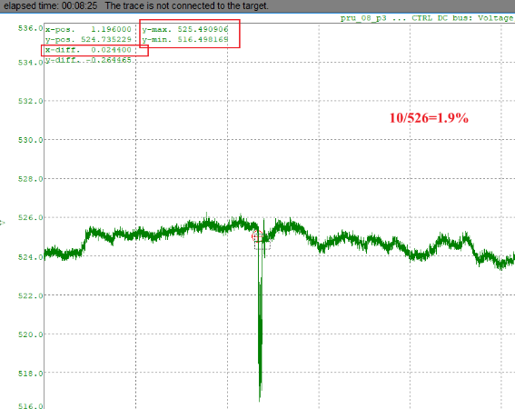
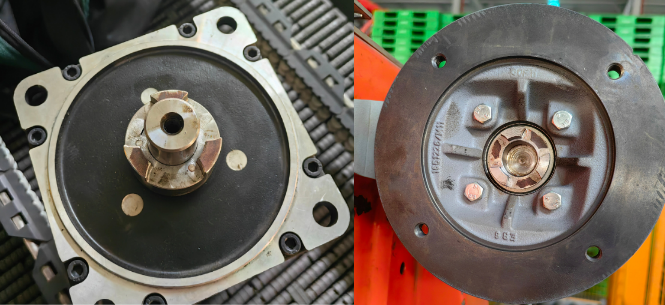

# ACOPOS 错误描述中文信息

ACOPOS 错误文本描述如下：

适用范围： ACP10/ARNC0

本节的主题:

| 错误报警号                                                   |
| ------------------------------------------------------------ |
| [36001: Parameter limited to valid range](#36001参数限制在有效范围内) |
| [36002: Total time for the position loop controller limited to prediction time](#36002位置环控制器的总时间限制为预测时间) |
| [36003: Braking distance exceeds positive SW limit - Deceleration parameter increased](#36003制动距离超过正-sw-限制---减速参数增加) |
| [36004: Braking distance exceeds negative SW limit - Deceleration parameter increased](#36004制动距离超过负-sw-限制---减速参数增加) |
| [36005: Warning triggered by command](#36005由命令触发的警告) |
| [37101: Calculated compensation distance on slave axis limited to maximum](#37101从轴上计算的补偿距离限制为最大值) |
| [37102: Calculated compensation distance on slave axis limited to minimum](#37102从轴上计算的补偿距离限制为最小值) |
| [37108: Calculated compensation distance of master axis limited to minimum](#37108计算出的主轴补偿距离限制为最小值) |
| [37111: Cam data: Difference between polynomial value y(xn) and slave period](#37111凸轮数据多项式值-yxn-与从站周期之间的差异) |
| [37112: Polynomial within cam data exceeds limit value](#37112凸轮数据中的多项式超过限值) |
| [37113: Compensation gear: Limit values exceeded](#37113补偿齿轮超出限值) |
| [38001: Torque limiter: Limit value higher than maximum value](#38001扭矩限制器限制值高于最大值) |
| [38003: Motor holding brake: Test torque was limited](#38003电机抱闸测试扭矩受限) |
| [38004: Motor holding brake: Test torque less than load torque](#38004电机抱闸测试扭矩小于负载扭矩) |
| [38005: Motor test: Speed is too high during switch on](#38005电机测试开启期间速度太高) |
| [38006: Current controller: Permissible current offset values exceeded](#38006电流控制器超出允许的电流偏移值) |
| [38008: Bleeder: No current flow](#38008泄放器无电流)        |
| [38009: Inverter: Output: Current flow test aborted](#38009逆变器输出电流测试中止) |
| [39000: Encoder: Warning active](#39000编码器警告激活)       |
| [39001: Encoder: Position correction active](#39001编码器位置校正激活) |
| [39002: Resolver: Speed limit for 14 bit resolution exceeded](#39002解析器超出-14-位分辨率的速度限制) |
| [39003: EnDat encoder: Alarm bit is set](#39003endat-编码器设置了警报位) |
| [39004: EnDat encoder: Alarm bit - Lighting failure](#39004endat-编码器警报位---照明故障) |
| [39005: EnDat encoder: Alarm bit - Signal amplitude too small](#39005endat-编码器警报位---信号幅度太小) |
| [39006: EnDat encoder: Alarm bit - Position value contains an error](#39006endat-编码器报警位---位置值包含错误) |
| [39007: EnDat encoder: Alarm bit - Overvoltage](#39007endat-编码器警报位---过压) |
| [39008: EnDat encoder: Alarm bit - Undervoltage](#39008endat-编码器报警位---欠压) |
| [39009: EnDat encoder: Alarm bit - Overcurrent](#39009endat-编码器报警位---过流) |
| [39010: EnDat encoder: Alarm bit - Battery change required](#39010endat-编码器警报位---需要更换电池) |
| [39011: EnDat encoder: Warning bit - Frequency too high](#39011endat-编码器警告位---频率太高) |
| [39012: EnDat encoder: Warning bit - Temperature too high](#39012endat-编码器警告位---温度过高) |
| [39013: EnDat encoder: Warning bit - Lighting reserve reached](#39013endat-编码器警告位---达到照明储备) |
| [39014: EnDat encoder: Warning bit - Battery charge too low](#39014endat-编码器警告位---电池电量过低) |
| [39015: EnDat encoder: Warning bit - Reference point not reached](#39015endat-编码器警告位---未达到参考点) |
| [39016: Incremental encoder emulation: Frequency too high](#39016增量编码器仿真频率太高) |
| [39017: Encoder: CRC error while reading position](#39017编码器读取位置时出现-crc-错误) |
| [39018: Reference pulse monitoring: Faulty position, resolution, or reference pulse](#39018参考脉冲监控位置分辨率或参考脉冲错误) |
| [39019: Serial encoder interface: Stop bit error](#39019串行编码器接口停止位错误) |
| [39020: Serial encoder interface: Receive data overrun](#39020串行编码器接口接收数据溢出) |
| [39021: Serial encoder interface: Send data error](#39021串行编码器接口发送数据错误) |
| [39022: EnDat encoder: Warning bit is set](#39022endat-编码器设置了警告位) |
| [39023: EnDat encoder: CRC error while reading EnDat2.2 additional information](#39023endat-编码器读取-endat22-附加信息时出现-crc-错误) |
| [39024: EnDat encoder: Operating status error sources: M ALL Power down](#39024endat-编码器操作状态错误来源m-all-掉电) |
| [39025: EnDat encoder: Operating status error sources: M Overflow / Underflow](#39025endat-编码器操作状态错误来源m-上溢下溢) |
| [39026: EnDat encoder: Type 3 error while reading EnDat2.2 additional information](#39026endat-编码器读取-endat22-附加信息时出现类型-3-错误) |
| [39027: Encoder Emulation: power supply fail](#39027编码器仿真电源故障) |
| [39028: Encoder: Multiturn failure](#39028编码器多圈故障)    |
| [39029: Encoder: Battery charge too low](#39029编码器电池电量过低) |
| [39030: Encoder: Warning bit is set](#39030编码器设置了警告位) |
| [39032: EnDat encoder: Operating status error sources: Lighting](#39032endat-编码器操作状态错误来源照明) |
| [39033: EnDat encoder: Operating status error sources: Signal amplitude](#39033endat-编码器运行状态错误源信号幅度) |
| [39034: EnDat encoder: Operating status error sources: S Pos 1](#39034endat-编码器运行状态错误源s-pos-1) |
| [39035: EnDat encoder: Operating status error sources: Overvoltage](#39035endat-编码器运行状态错误源过压) |
| [39036: EnDat encoder: Operating status error sources: Undervoltage](#39036endat-编码器运行状态错误源欠压) |
| [39037: EnDat encoder: Operating status error sources: over current](#39037endat-编码器运行状态错误源过电流) |
| [39038: EnDat encoder: Operating status error sources: Temperature exceeded](#39038endat-编码器运行状态错误源超出温度) |
| [39039: EnDat encoder: Operating status error sources: S Pos](#39039endat-编码器运行状态错误源s-pos) |
| [39040: EnDat encoder: Operating status error sources: S sytem](#39040endat-编码器运行状态错误来源s-系统) |
| [39041: EnDat encoder: Operating status error sources: S ALL power down](#39041endat-编码器操作状态错误来源s-all-掉电) |
| [39042: EnDat encoder: Operating status error sources: M Pos 1](#39042endat-编码器运行状态错误源m-pos-1) |
| [39043: EnDat encoder: Operating status error sources: M Pos 2](#39043endat-编码器运行状态错误源m-pos-2) |
| [39044: EnDat encoder: Operating status error sources: M System](#39044endat-编码器运行状态错误来源m-系统) |
| [39045: EnDat encoder: Operating status error sources: M battery](#39045endat-编码器运行状态错误来源m-电池) |
| [39046: Encoder: Incorrect encoder address acknowledgment](#39046编码器不正确的编码器地址确认) |
| [39047: Encoder: Position value not synchronous with absolute value](#39047编码器位置值与绝对值不同步) |
| [39048: Encoder: Incorrect command code acknowledgment](#39048编码器不正确的命令代码确认) |
| [39049: Encoder: Timeout during parameter transfer](#39049编码器参数传输期间超时) |
| [39050: Encoder: Parity](#39050编码器奇偶校验)               |
| [39051: Encoder: Hiperface error bit](#39051编码器hiperface-错误位) |
| [39052: Encoder: Measurement range exceeded](#39052编码器超出测量范围) |
| [39053: Encoder: Internal check of the encoder interface failed](#39053编码器编码器接口的内部检查失败) |
| [39054: Encoder: Invalid supply voltage](#39054编码器电源电压无效) |
| [39055: Encoder: Incremental signal amplitude too small](#39055编码器增量信号幅度太小) |
| [39056: Encoder: Incremental signal amplitude too large](#39056编码器增量信号幅度太大) |
| [39059: Encoder: Status message](#39059编码器状态消息)       |
| [39060: Encoder: Sync bit error](#39060编码器同步位错误)     |
| [39061: Encoder: UART Transmission error](#39061编码器uart-传输错误) |
| [39086: Encoder: Register address](#39086编码器寄存器地址)   |
| [39087: Encoder: Register data](#39087编码器寄存器数据)      |
| [39088: Encoder: HIPERFACE DSL: Online status: Bit 4: ANS: Incorrect answer detected](#39088编码器hiperface-dsl在线状态位-4ans检测到错误答案) |
| [39089: Encoder: HIPERFACE DSL: Online status: Bit 10: VPOS: Safe position invalid](#39089编码器hiperface-dsl在线状态位-10vpos安全位置无效) |
| [39090: Encoder: HIPERFACE DSL: Online status: Bit 11: POS: Estimator turned on](#39090编码器hiperface-dsl在线状态位-11pos估计器已打开) |
| [39091: Encoder: HIPERFACE DSL: Online status: Bit 13: SCE: CRC error Safe Channel](#39091编码器hiperface-dsl在线状态位-13scecrc-错误安全通道) |
| [39092: EnDat encoder: Warning bit - cyclical operation](#39092endat-编码器警告位---循环操作) |
| [39093: EnDat encoder: Warning bit - boundary layer not reached](#39093endat-编码器警告位---未到达边界层) |
| [39094: EnDat encoder: Warning bit - not ready](#39094endat-编码器警告位---未准备好) |
| [39095: EnDat encoder: Warning bit - diagnostic threshold below](#39095endat-编码器警告位---低于诊断阈值) |
| [39301: Analog/Digital IO: 24V power supply fail](#39301模拟数字-io24v-电源故障) |
| [39302: Digital IO 1-4: Diagnose bit active (current, 24V supply)](#39302数字-io-1-4诊断位激活电流24v-电源) |
| [39303: Digital IO 5-8: Diagnose bit active (current, 24V supply)](#39303数字-io-5-8诊断位激活电流24v-电源) |
| [39305: Digital IO 10: Diagnose bit active (current, temperature)](#39305数字-io-10诊断位激活电流温度) |
| [39306: Digital IO 9: Diagnose bit active (current, temperature)](#39306数字-io-9诊断位激活电流温度) |
| [39307: Digital IO: Outputs deactivated by output mask after network error](#39307数字-io网络错误后输出掩码停用) |
| [39308: Analog/Digital IO: Diagnose bit active](#39308模拟数字-io诊断位激活) |
| [39309: Digital IO: Digital output: Diagnose bit active](#39309数字-io数字输出诊断位激活) |
| [39310: Analog IO: Analog output: Diagnose bit active](#39310模拟-io模拟输出诊断位激活) |
| [39311: Analog IO: Analog input: Input disturbed](#39311模拟-io模拟输入输入受到干扰) |
| [39312: Analog IO: Analog input: Analog value smaller than minimum value](#39312模拟-io模拟输入模拟值小于最小值) |
| [39313: Analog IO: Analog input: Analog value greater than maximum value](#39313模拟-io模拟输入模拟值大于最大值) |
| [39314: Analog IO: Analog input: Analog value below the measuring range](#39314模拟-io模拟输入模拟值低于测量范围) |
| [39315: Analog IO: Analog input: Analog value above the measuring range](#39315模拟-io模拟输入模拟值高于测量范围) |
| [39316: Analog IO: Analog input: Analog value corrupted](#39316模拟-io模拟输入模拟值损坏) |
| [39317: Analog IO: Analog output: Input value outside the validity range](#39317模拟-io模拟输出输入值超出有效范围) |
| [39500: Encoder: HIPERFACE: Status: Incorrect alignment data (01h)](#39500编码器hiperface状态对齐数据不正确-01h) |
| [39501: Encoder: HIPERFACE: Status: Sensor not adjusted or in adjustment mode (20h)](#39501编码器hiperface状态传感器未调整或处于调整模式20-小时) |
| [39502: Encoder: HIPERFACE: Status: Distance measure/sensor too high (21h)](#39502编码器hiperface状态距离测量值传感器太高21-小时) |
| [39504: Encoder: HIPERFACE: Status: Linear position fault (23h)](#39504编码器hiperface状态线性位置故障23-小时) |
| [39510: Encoder: HIPERFACE: Status: The encoder has not detected any faults (00h)](#39510编码器hiperface状态编码器未检测到任何故障-00h) |
| [39511: Encoder: HIPERFACE: Status: Analog signals outside specification (01h)](#39511编码器hiperface状态模拟信号超出规范-01h) |
| [39512: Encoder: HIPERFACE: Status: Incorrect internal angular offset (02h)](#39512编码器hiperface状态内部角度偏移不正确-02h) |
| [39513: Encoder: HIPERFACE: Status: Data field partitioning table destroyed (03h)](#39513编码器hiperface状态数据字段分区表已损坏-03h) |
| [39514: Encoder: HIPERFACE: Status: Analog limit values not available (04h)](#39514编码器hiperface状态模拟限值不可用-04h) |
| [39515: Encoder: HIPERFACE: Status: Internal I睠 bus not operational (05h)](#39515编码器hiperface状态内部总线不运行05h) |
| [39516: Encoder: HIPERFACE: Status: Internal checksum error (06h)](#39516编码器hiperface状态内部校验和错误06h) |
| [39517: Encoder: HIPERFACE: Status: Program watchdog fault (07h)](#39517编码器hiperface状态程序看门狗故障-07h) |
| [39518: Encoder: HIPERFACE: Status: Counter overflow (08h)](#39518编码器hiperface状态计数器溢出08h) |
| [39519: Encoder: HIPERFACE: Status: Parity error (09h)](#39519编码器hiperface状态奇偶校验错误-09h) |
| [39520: Encoder: HIPERFACE: Status: Checksum error (0Ah)](#39520编码器hiperface状态校验和错误0ah) |
| [39521: Encoder: HIPERFACE: Status: Unknown command (0Bh)](#39521编码器hiperface状态未知命令-0bh) |
| [39522: Encoder: HIPERFACE: Status: Wrong command length (0Ch)](#39522编码器hiperface状态命令长度错误0ch) |
| [39523: Encoder: HIPERFACE: Status: Wrong command argument (0Dh)](#39523编码器hiperface状态错误的命令参数-0dh) |
| [39524: Encoder: HIPERFACE: Status: Read-only data field (0Eh)](#39524编码器hiperface状态只读数据字段-0eh) |
| [39525: Encoder: HIPERFACE: Status: Incorrect access code (0Fh)](#39525编码器hiperface状态访问代码不正确0fh) |
| [39526: Encoder: HIPERFACE: Status: Out of memory fault (10h)](#39526编码器hiperface状态内存不足故障-10h) |
| [39527: Encoder: HIPERFACE: Status: Wrong data field offset (11h)](#39527编码器hiperface状态数据字段偏移错误11h) |
| [39528: Encoder: HIPERFACE: Status: Wrong data field number (12h)](#39528编码器hiperface状态数据字段编号错误12-小时) |
| [39538: Encoder: HIPERFACE: Status: Value monitoring analog signals (1Ch)](#39538编码器hiperface状态值监控模拟信号-1ch) |
| [39539: Encoder: HIPERFACE: Status: Transmitter current critical (1Dh)](#39539编码器hiperface状态发射器电流严重1dh) |
| [39540: Encoder: HIPERFACE: Status: Encoder temperature critical (1Eh)](#39540编码器hiperface状态编码器温度临界-1eh) |
| [39541: Encoder: HIPERFACE: Status: Speed too high (1Fh)](#39541编码器hiperface状态速度太高-1fh) |
| [39542: Encoder: HIPERFACE: Status: Singleturn position unreliable (20h)](#39542编码器hiperface状态单圈位置不可靠20-h) |
| [39543: Encoder: HIPERFACE: Status: Multiturn amplitude fault (21h)](#39543编码器hiperface状态多圈幅度故障21-h) |
| [39544: Encoder: HIPERFACE: Status: Multiturn sync fault (22h)](#39544编码器hiperface状态多圈同步故障22-h) |
| [39545: Encoder: HIPERFACE: Status: Multiturn vectorlength fault (23h)](#39545编码器hiperface状态多圈矢量长度故障23h) |
| [39546: Encoder: HIPERFACE: Status: Multiturn counter fault (24h)](#39546编码器hiperface状态多圈计数器故障-24h) |
| [39594: Encoder: HIPERFACE DSL: Encoder status: Plausibility Error (ST0:4)](#39594编码器hiperface-dsl编码器状态合理性错误-st04) |
| [39596: Encoder: HIPERFACE DSL: Encoder status: Improper Configuration Error (ST0:6)](#39596编码器hiperface-dsl编码器状态不正确的配置错误-st06) |
| [39597: Encoder: HIPERFACE DSL: Encoder status: Crosscheck Error (ST0:7)](#39597编码器hiperface-dsl编码器状态交叉检查错误-st07) |
| [39600: Encoder: HIPERFACE DSL: Encoder status: Protocol Reset Indication (ST0:0)](#39600编码器hiperface-dsl编码器状态协议重置指示-st00) |
| [39601: Encoder: HIPERFACE DSL: Encoder status: Acceleration Overflow Error (ST0:1)](#39601编码器hiperface-dsl编码器状态加速溢出错误-st01) |
| [39602: Encoder: HIPERFACE DSL: Encoder status: Test Running (ST0:2)](#39602编码器hiperface-dsl编码器状态测试运行-st02) |
| [39603: Encoder: HIPERFACE DSL: Encoder status: Drift Compensation Error (ST0:3)](#39603编码器hiperface-dsl编码器状态漂移补偿错误-st03) |
| [39604: Encoder: HIPERFACE DSL: Encoder status: Position Tracking Filter Error (ST0:4)](#39604编码器hiperface-dsl编码器状态位置跟踪滤波器错误-st04) |
| [39605: Encoder: HIPERFACE DSL: Encoder status: Position Vector Length Error (ST0:5)](#39605编码器hiperface-dsl编码器状态位置向量长度错误-st05) |
| [39606: Encoder: HIPERFACE DSL: Encoder status: Counter Error (ST0:6)](#39606编码器hiperface-dsl编码器状态计数器错误-st06) |
| [39607: Encoder: HIPERFACE DSL: Encoder status: Position Synchronization Error (ST0:7)](#39607编码器hiperface-dsl编码器状态位置同步错误-st07) |
| [39610: Encoder: HIPERFACE DSL: Encoder status: Singleturn Error (ST1:0)](#39610编码器hiperface-dsl编码器状态单圈错误-st10) |
| [39611: Encoder: HIPERFACE DSL: Encoder status: Multiturn Amplitude Error (ST1:1)](#39611编码器hiperface-dsl编码器状态多圈幅度误差-st11) |
| [39612: Encoder: HIPERFACE DSL: Encoder status: Multiturn Sync Error (ST1:2)](#39612编码器hiperface-dsl编码器状态多圈同步错误-st12) |
| [39613: Encoder: HIPERFACE DSL: Encoder status: Multiturn Vector Length Error (ST1:3)](#39613编码器hiperface-dsl编码器状态多圈矢量长度错误-st13) |
| [39614: Encoder: HIPERFACE DSL: Encoder status: Position Crosscheck Error (ST1:4)](#39614编码器hiperface-dsl编码器状态位置交叉检查错误-st14) |
| [39620: Encoder: HIPERFACE DSL: Encoder status: Power-on Self-test Conducted (ST2:0)](#39620编码器hiperface-dsl编码器状态进行开机自检-st20) |
| [39621: Encoder: HIPERFACE DSL: Encoder status: Safety Parameter Warning (ST2:1)](#39621编码器hiperface-dsl编码器状态安全参数警告-st21) |
| [39622: Encoder: HIPERFACE DSL: Encoder status: Safety Parameter Error (ST2:2)](#39622编码器hiperface-dsl编码器状态安全参数错误-st22) |
| [39623: Encoder: HIPERFACE DSL: Encoder status: Standard Parameter Error (ST2:3)](#39623编码器hiperface-dsl编码器状态标准参数错误-st23) |
| [39624: Encoder: HIPERFACE DSL: Encoder status: Internal Communication Error 1 (ST2:4)](#39624编码器hiperface-dsl编码器状态内部通信错误-1-st24) |
| [39625: Encoder: HIPERFACE DSL: Encoder status: Internal Communication Error 2 (ST2:5)](#39625编码器hiperface-dsl编码器状态内部通信错误-2-st25) |
| [39626: Encoder: HIPERFACE DSL: Encoder status: Internal System Error (ST2:6)](#39626编码器hiperface-dsl编码器状态内部系统错误-st26) |
| [39630: Encoder: HIPERFACE DSL: Encoder status: Critical Temperature (ST3:0)](#39630编码器hiperface-dsl编码器状态临界温度-st30) |
| [39631: Encoder: HIPERFACE DSL: Encoder status: Critical LED Current (ST3:1)](#39631编码器hiperface-dsl编码器状态临界-led-电流-st31) |
| [39632: Encoder: HIPERFACE DSL: Encoder status: Critical Supply Voltage (ST3:2)](#39632编码器hiperface-dsl编码器状态临界电源电压-st32) |
| [39633: Encoder: HIPERFACE DSL: Encoder status: Critical Rotation Speed (ST3:3)](#39633编码器hiperface-dsl编码器状态临界转速-st33) |
| [39634: Encoder: HIPERFACE DSL: Encoder status: Critical Acceleration (ST3:4)](#39634编码器hiperface-dsl编码器状态临界加速-st34) |
| [39635: Encoder: HIPERFACE DSL: Encoder status: Counter Overflow (ST3:5)](#39635编码器hiperface-dsl编码器状态计数器溢出-st35) |
| [39636: Encoder: HIPERFACE DSL: Encoder status: Internal Monitoring Error (ST3:6)](#39636编码器hiperface-dsl编码器状态内部监控错误-st36) |
| [39638: Encoder: HIPERFACE DSL: Encoder status: Critical Rotor Position (ST3:1)](#39638编码器hiperface-dsl编码器状态转子临界位置-st31) |
| [39640: Encoder: HIPERFACE DSL: Encoder status: Invalid access (ST4:0)](#39640编码器hiperface-dsl编码器状态无效访问-st40) |
| [39641: Encoder: HIPERFACE DSL: Encoder status: Access denied (ST4:1)](#39641编码器hiperface-dsl编码器状态拒绝访问-st41) |
| [39642: Encoder: HIPERFACE DSL: Encoder status: Resource access error (ST4:2)](#39642编码器hiperface-dsl编码器状态资源访问错误-st42) |
| [39643: Encoder: HIPERFACE DSL: Encoder status: File access error (ST4:3)](#39643编码器hiperface-dsl编码器状态文件访问错误-st43) |
| [39670: Encoder: HIPERFACE DSL: Encoder status: User defined warning (ST7:0)](#39670编码器hiperface-dsl编码器状态用户定义警告-st70) |
| [39671: Encoder: HIPERFACE DSL: Encoder status: User defined warning (ST7:1)](#39671编码器hiperface-dsl编码器状态用户定义警告-st71) |
| [39672: Encoder: HIPERFACE DSL: Encoder status: User defined warning (ST7:2)](#39672编码器hiperface-dsl编码器状态用户定义警告-st72) |
| [39673: Encoder: HIPERFACE DSL: Encoder status: User defined warning (ST7:3)](#39673编码器hiperface-dsl编码器状态用户定义警告-st73) |
| [39674: Encoder: HIPERFACE DSL: Encoder status: User defined warning (ST7:4)](#39674编码器hiperface-dsl编码器状态用户定义警告-st74) |
| [39675: Encoder: HIPERFACE DSL: Encoder status: User defined warning (ST7:5)](#39675编码器hiperface-dsl编码器状态用户定义警告-st75) |
| [39676: Encoder: HIPERFACE DSL: Encoder status: User defined warning (ST7:6)](#39676编码器hiperface-dsl编码器状态用户定义警告-st76) |
| [39677: Encoder: HIPERFACE DSL: Encoder status: User defined warning (ST7:7)](#39677编码器hiperface-dsl编码器状态用户定义警告-st77) |

## 36001：参数限制在有效范围内

描述：

如果值超出有效限制，则写入参数时响应错误。

反应：

参数限制为有效值并被接受。

原因/补救措施：

查看错误编号 [1002](#1002参数超出有效范围).

## 36002：位置环控制器的总时间限制为预测时间

描述：

如果该值小于预测时间，则写入位置控制器的总延迟时间时响应错误。

反应：

位置控制器的总延迟时间设置为预测时间。

原因/补救措施：

位置控制器的总延迟时间太短。

配置顺序效率不高。

\-\> 应首先减少预测时间。

另请参阅错误编号 [1002](#1002参数超出有效范围).

## 36003：制动距离超过正 SW 限制 - 减速参数增加

描述：

使用 CMD_MOVE_STOP_A2 停止运动时的响应错误。 使用减速参数时，制动距离不能保持在正 SW 限制以内。

反应：

随着减速度值的增加，运动停止。

原因/补救措施：

减速参数太低。

命令 CMD_MOVE_STOP_A2 在软件限制之前写入太短。

另请参阅错误编号 [5001](#5001目标位置超出正-sw-限制).

## 36004：制动距离超过负 SW 限制 - 减速参数增加

描述：

使用 CMD_MOVE_STOP_A2 停止运动时的响应错误。 使用减速参数时，制动距离无法保持在 SW 负限值以内。

反应：

随着减速度值的增加，运动停止。

原因/补救措施：

减速参数太低。

命令 CMD_MOVE_STOP_A2 在软件限制之前写入太短。

另请参阅错误编号 [5001](#5001目标位置超出正-sw-限制).

## 36005：由命令触发的警告

描述：

查看错误编号 [4015](#4015命令触发的错误).

反应：

没有任何。

原因/补救措施：

命令 CMD_ERROR 或 CMD_ERROR_VAX1 参数值为零.

## 37101：从轴上计算的补偿距离限制为最大值

描述：

在计算补偿齿轮期间凸轮自动装置处于活动状态时出现运行错误。 “有效”从站补偿路径超过最大值（AUT_COMP_SL_S_MAX 或 CAM_SL_S_COMP_MAX）。 另请参阅错误编号 [5101](#5101补偿齿轮超出限值). 仅在启动或重启后注册一次。

反应：

补偿是用极限值计算的。

结果，从属间隔被移位。

原因/补救措施：

具有 ncAT_ONCE 属性的事件错误发生。

从站补偿路径太长。

从机曲线周期太小。

从机倍增因子太小。

| 应用案例                                                                                                                                                                                                                                                                                                                                                                                                                                          |
|---------------------------------------------------------------------------------------------------------------------------------------------------------------------------------------------------------------------------------------------------------------------------------------------------------------------------------------------------------------------------------------------------------------------------------------------------|
| 2023.07.05 MC_AUTDATA_STATE_TYP data type 有限制从轴补偿段最小速度的接口，但是尝试后发现37101的报警，说曲线周期太短，研究后发现MinSlaveCompVelocity，MaxSlaveAccelComp1,MaxSlaveAccelComp2,相当于是一个比例值，增加从轴最小补偿速度后，从轴的速度便不会为0，即不会报37101。 例如: ExtendedCompLimits = ncON; MinslaveCompVelocity = 0.2; MaxslaveCompVelocity = 1; MaxslaveAccelComp1 = 1; MaxSlaveAccelComp2 = 1; MaxSlaveCompDistance = 285575; |

## 37102：从轴上计算的补偿距离限制为最小值

描述：

在计算补偿齿轮期间凸轮自动装置处于活动状态时出现运行错误。 “有效”从站补偿低于最小值（AUT_COMP_SL_S_MIN 或 CAM_SL_S_COMP_MIN）。 另请参阅错误编号 [5101](#5101补偿齿轮超出限值). 仅在启动或重启后注册一次。

反应：

补偿是用极限值计算的。

结果，从属间隔被移位。

原因/补救措施：

从站补偿路径太短。

Slave曲线周期过大。

Slave倍增因子太大。

另请参阅错误编号 [37101](#37101从轴上计算的补偿距离限制为最大值).

## 37108：计算出的主轴补偿距离限制为最小值

描述：

在计算补偿齿轮期间凸轮自动装置处于活动状态时出现运行错误。 “有效”主站补偿低于最小值 (AUT_COMP_MA_S_MIN)。 另请参阅错误编号 [5101](#5101补偿齿轮超出限值). 仅在启动或重启后注册一次。

反应：

补偿是用极限值计算的。

结果，主间隔被移动。

原因/补救措施：

具有 ncAT_ONCE 属性的事件错误发生。

Master补偿路径太短。

Master曲线周期过大。

Master乘法因子太大。

| 应用案例                                                                                                                                                                           |
|------------------------------------------------------------------------------------------------------------------------------------------------------------------------------------|
| 2023.07.05 **现象** 连续过瓶套标时出现停分瓶1虚轴报警37108： **解决方式** 主要是ST7的主轴补偿值太小，将ST7的补偿模式关闭后，正常；  |

## 37111：凸轮数据：多项式值 y(xn) 与从站周期之间的差异

描述：

凸轮下载 (AUT_POLY_DATA) 的最后一个数据段的响应错误。 检查多项式函数值 y(xn) 以查看它是否对应于主区间结束时的从区间。 函数值计算为浮点数。 间隔（周期）作为整数放置在凸轮数据中。 如果偏差大于 0.1 且小于 1.0，则会生成此警告。 另请参阅错误编号 [5304](#5304凸轮数据格式错误).

反应：

凸轮被接受，但在主动凸轮耦合期间，偏差可能导致位置跳跃。

原因/补救措施：

计算凸轮多项式时出现数值错误。

计算算法没有考虑到只允许整数间隔的事实。

| 应用案例                                                                                                                                                                                                                                                                                                                                                                                                                                                                                                                                                                                                                                                                                                  |
|-----------------------------------------------------------------------------------------------------------------------------------------------------------------------------------------------------------------------------------------------------------------------------------------------------------------------------------------------------------------------------------------------------------------------------------------------------------------------------------------------------------------------------------------------------------------------------------------------------------------------------------------------------------------------------------------------------------|
| 2022.12.19 现象 绝大多数时候没问题，但会偶发  原因 整数是必需保证的，但是曲线参数是浮点数，精度有限，每一段曲线是从起点按照多项式参数计算的，最后一段计算到终点的时候误差比较大了   第三段曲线，起点是(x2,y2)，是很准确的，后面直到(x3，y3)都是多项式系数算出来的，计算出来的 y3 跟sl_period差值超过0.1了  注意事项 第一个点要是0，最后一个点要是整数 这代码说其实曲线是接受了，提示有突变而已  可尝试的解决方式 优化曲线的点 看能否加多一小段主轴，而从轴是静止的。 从轴在曲线结束是停止的话，就提前停下，比如359.9度就走完，剩下0.1，也是静止。来避免这代码，或者程序发现这代码就自动确认即可。 不超过128个点可以考虑使用此功能块MC_BR_CalcCamFromPoints |
| 2023.07.05 **现象**  **原因** 画面中设置的刀长度是315.000mm会报错37111，需注意五阶多项式最后一项不能为小数                                                                                                                                                                                                                                                                                                                                                                                                                                                                                                                                                 |
| 2023.07.05 **现象** 轴报错偶发37111 **原因** 由上位下发的CAM数据点由相机生成，而头尾的位置点是固定不变的。 对于短片，凸轮最后第二个点和最后一个点之间位置离太远，系统无法拟合成贴合6阶多项式曲线，因此报错。                                                                                                                                                                                                                                                                                                                                                                                                                                                                                              |

## 37112：凸轮数据中的多项式超过限值

描述：

写入 AUT_POLY_CHECK 时出现响应错误。 检查凸轮多项式是否违反限制。

反应：

没有任何。

原因/补救措施：

凸轮尺寸不正确。

AUT_MA_V_MAX 参数或轴限制不正确。

细节

1：Y-shift（位置跳转）向左连接多项式

2：Y-shift（位置跳转）向右连接多项式

3：正向最大加速度（AXLIM_A1_POS）

4：正向最大减速度（AXLIM_A2_POS）

5：负方向最大加速度（AXLIM_A1_NEG）

6：负方向最大减速度（AXLIM_A2_NEG）

7：正向最大速度（AXLIM_V_POS）

8：负方向最大速度（AXLIM_V_NEG）

## 37113：补偿齿轮：超出限值

描述：

查看错误编号 [5101](#5101补偿齿轮超出限值).

反应：

查看错误编号 [5101](#5101补偿齿轮超出限值).

原因/补救措施：

查看错误编号 [5101](#5101补偿齿轮超出限值).

| 应用案例                                                                                                                                                                                                                                                                                                                                                                                                                                                                                                                                                                                                                                                                                               |
|--------------------------------------------------------------------------------------------------------------------------------------------------------------------------------------------------------------------------------------------------------------------------------------------------------------------------------------------------------------------------------------------------------------------------------------------------------------------------------------------------------------------------------------------------------------------------------------------------------------------------------------------------------------------------------------------------------|
| 2022.01.11 问题：MC_GearInPos指令静止时投入正常，主轴运动中投入时，报警37113. 解决：设置MasterParIDMaxVelocity参数，如果不设置，从轴的补偿速度太大，超过限制。                                                                                                                                                                                                                                                                                                                                                                                                                                                                                                                                         |
| 2022.01.17 原因：将MC_BR_InitAutPar功能块的MaxMasterVelocity数值设小，例如设为1.                                                                                                                                                                                                                                                                                                                                                                                                                                                                                                                                                                                                                       |
| 2023.07.05 **现象** 使用MC_GearInPos功能块 当MasterParID=0时，MasterParIDMaxVelocity会直接影响到报警37113的产生和限制补偿段从轴加速度。分三种情况： a. MasterParIDMaxVelocity=1时，不产生报警，从轴加速度为三角波（不受限制）。触发Execute时主轴是否运动不影响结论。 b. MasterParIDMaxVelocity=0时,如果触发从轴同步时主轴在运动，则报警且从轴加速度受限制。如果先触发从轴同步，再让主轴运动，则不会报警且从轴加速度不受限制 c. MasterParIDMaxVelocity=Others时，一定会产生报警，但是从轴加速度波形不一定受限制，表现为MasterParIDMaxVelocity为较小的正值时从轴加速度仍为三角波。  **结论** 建议Velocity=1，Acceleration=1，MasterParIDMaxVelocity=1，可以避免报错37113，且可以保证从轴加速度不受限制。 |

## 38000：电流控制器：启动时电机转速过高

描述：

接通电流控制器时出现运行错误。 电流偏移补偿期间转子速度（次级元件）过高。 由于感应同步产生的电压，无法补偿电流偏移。

反应：

当前偏移设置为 0。

原因/补救措施：

等到电机静止

## 38001：扭矩限制器：限制值高于最大值

描述：

写入扭矩限制（扭矩限制或扭矩限制覆盖）参数时的响应错误。 驱动器无法产生所需的电流或电机不允许所需的电流。

反应：

转矩限制受驱动器的最大电流 ACOPOS_CURR_MAX 和电机的最大电流 MOTOR_CURR_MAX 的限制。

原因/补救措施：

ACOPOS 无法提供必要的电流。

电机无法提供必要的电流。

配置错误：扭矩限制被错误地设置得太高。

电机配置错误：如果 MOTOR_TORQ_MAX / MOTOR_CURR_MAX 的配置高于 MOTOR_TORQ_CONST 并且扭矩限制设置为高于 MOTOR_TORQ_CONST \* MOTOR_CURR_MAX，则报告此警告。.

## 38003：电机抱闸：测试扭矩受限

描述：

抱闸扭矩测试期间的运行错误。 无法达到测试扭矩。 测量误差大于 5%。

反应：

无。

原因/补救措施：

测试扭矩太大，分别激活扭矩限制（检查 ACOPOS 峰值电流、电机峰值电流、温度）。

控制器不稳定。.

## 38004：电机抱闸：测试扭矩小于负载扭矩

描述：

抱闸扭矩测试期间的运行错误。 测试扭矩小于实际负载扭矩。

反应：

无。

原因/补救措施：

实际负载转矩对于抱闸来说太大。

测试扭矩太小。

负载转矩确定不正确（电流测量系统、电机配置、转子换向或电机编码器测量系统）。

控制器不稳定。.

## 38005：电机测试：开启期间速度太高

描述：

接通电流控制器时出现运行错误。 接通控制器时，进行测试以确定电机速度 SCTRL_SPEED_ACT 是否高于 0.05\*MOTOR_SPEED_RATED/60。 测得的速度太高。

反应：

没有任何

原因/补救措施：

通过设置 MOTOR_TEST_MODE 中的 Bit4 和 Bit5 可以禁用移动电机时偏移电流的警告和有问题的自动调整.

| 应用案例                                                                                                                                                    |
|-------------------------------------------------------------------------------------------------------------------------------------------------------------|
| 2022.06.10 伺服switch_on时, 需要确保测得实际速度(RPS)\<0.05\*MOTOR_SPEED_RATED/60。 switch_on瞬间, 给的力有角度要求, 所以最好电机静止时做, 速度够低也可以。 |

## 38006：电流控制器：超出允许的电流偏移值

描述：

接通电流控制器时出现运行错误。 在此阶段校准电流测量的偏移值。 功率部分已打开，电机的电压为零。 测得的电流对于偏移校准来说太大了。

反应：

当前偏移设置为零。

原因/补救措施：

电流测量校准期间的转子运动：

当控制器开启时，转子（次级元件）在运动。 因此，在电流偏移校准期间，会感应电压并在直流总线中提供电流。 测得的电流被解释为偏移电流。

ACOPOS 硬件缺陷（电流测量、IGBT 模块、IGBT 控制器）。

通过设置参数 MOTOR_TEST_MODE 中的 Bit5，可以禁用有功功率级期间的电流偏移校准。.

## 38008：泄放器：无电流

描述：

打开控制器时的运行时警告。

8Vxxxx.00-x：

在控制器启动时，会进行测试以查看在制动电阻斩波器短暂激活时（20 毫秒）直流总线电压 UDC_ACT 下降是否超过 2%。测试过程中的直流母线压降小于 2%。

8B0Pxxxxxxxx.xxx-x：

在控制器启动时，会进行测试以查看在制动电阻斩波器短暂激活（20 毫秒）时斩波器电流 UDC_CHOP_CURR 是否超过限值 0.8 \* UDC_ACT / R_BLEEDER_EXT。斩波电流不超过限制。

反应：

无

原因/补救措施：

ACOPOS：

保险丝损坏：更换保险丝。

斩波器故障：更换 ACOPOS 模块。

外接制动电阻：

接线错误：检查所有制动电阻线是否正确固定在RB+和RB-连接处。

接线错误：从连接 RB+ 和 RB- 上拆下制动电阻器线路。检查 ACOPOS 侧制动电阻线路上 RB+ 和 RB- 之间的电阻。电阻必须是有限的并且对应于制动电阻数据。如果阻值为无穷大，则制动电阻或线路有故障。

制动电阻损坏：检查制动电阻上 RB+ 和 RB- 之间的电阻。如果阻值为无穷大，则制动电阻有故障。

8B0Pxxxxxxxx.xxx-x：

制动电阻错误配置：制动电阻R_BLEEDER_EXT的阻值参数设置过低。

斩波器电流测量故障：更换 ACOPOS 模块

直流母线电压测量不良：实际直流母线电压值低于测得的直流母线电压值 UDC_ACT：更换ACOPOS模块

可以通过在 MOTOR_TEST_MODE 中设置 Bit6 (0x40) 来禁用警告。.

| 应用案例                                                                                                                                                                                                                                                                                                                                                                                                                                                                                                                                                                                                                                                                                                                                                                                                                                                                                                                                                                                                                                                                                                |
|---------------------------------------------------------------------------------------------------------------------------------------------------------------------------------------------------------------------------------------------------------------------------------------------------------------------------------------------------------------------------------------------------------------------------------------------------------------------------------------------------------------------------------------------------------------------------------------------------------------------------------------------------------------------------------------------------------------------------------------------------------------------------------------------------------------------------------------------------------------------------------------------------------------------------------------------------------------------------------------------------------------------------------------------------------------------------------------------------------|
| 2023.06.29 此问题一般为制动电阻处出现问题。 需要排查的问题点： **1.保险丝损坏：更换保险丝。** ACOPOS 1320，可取下保险丝进行检查。   **2.斩波器故障：更换 ACOPOS 驱动器。** 可通过将ParID 398设置为0，切换为不使用外部制动电阻的方式，若驱动器Switch On，如果不报错则驱动器没有问题。 **3.外接制动电阻故障** 接线错误：检查所有制动电阻线是否正确固定在RB+和RB-连接处。 制动电阻正常：RB+与RB-之间的阻值一般在30Ω左右（即制动电阻铭牌上的标称阻值），如果为无穷大，则制动电阻或线路有问题。 **4.驱动器的24V供电偏低（例如23.2V)** 若24V供电是多设备串接，请检查驱动器的24V供电。 **5.现场三相供电偏低（例如370V)** **6.多个驱动器，共直流母线** **7.所选制动电阻的制动功率偏小** 偶尔出现检测时DC BUS 压降不满足检测条件                                                                                                                                                                                                                                                                                                                                  |
| 2023.06.26 **现象** 在现场生产几年的ACOPOS 1320驱动器，上电后报38008错误，可复位，但一旦运行仍报错。 **解决方式** 驱动器损坏，维修后解决。                                                                                                                                                                                                                                                                                                                                                                                                                                                                                                                                                                                                                                                                                                                                                                                                                                                                                                                                                              |
| 2023.06.26 **38008报错产生的原因** 驱动器Switch 时的DC BUS压降不满足检测条件（测试过程中的直流母线压降小于 2%）前提条件：使用外接制动电阻。  若使用内置，不使用即使降低2%以内也不会触发报错机制，因为内置制动电阻默认关闭了这个检测。  使用外部制动电阻时，可通过Trace驱动器Switch On过程中的ParID 298的数值变化来判断  **如何屏蔽此检测机制** ParID 866写为64                                                                                                                                                                                                                                                                                                                                                                                                                                                                                                                                                                                                                                                                                           |
| 2023.06.26 **现象** 同样的设备与程序，使用ACOPOS P3 8.8A 单轴，在某一个现场上电后偶发38008，在运行过程中不会报出38008。 使用的外接制动电阻参数为75Ω，1kW **原因** 此现场的供电电压较低为370V，其他现场的供电电压均为400V。 而DC BUS的压降自检与供电有直接关系，过低的电压会导致自检不通过。  **解决方式** 由于现场的工厂供电电压低问题无法解决，故通过ParID写64屏幕，并在HMI上留相关的接口，可实现此屏蔽功能可调整。                                                                                                                                                                                                                                                                                                                                                                                                                                                                                                                                                                                                                                     |
| 2023.06.26 基本上，当驱动器被Switch On时，斩波器以100%的占空比被打开20ms。 在电源周期的六分之一（20ms/6 @ fn = 50Hz），直流母线电压以制动电阻的最大制动功率降低。 0 ) 若选用的制动电阻制动功率较低，而供电电压也偏低，则在驱动器Switch on时，直流母线电压可能会偶发下降不到2%，从而出发此38008报警。  1 ) 如果直流母线电压至少降低了2%，那么就意味着已经连接了一个制动电阻。 这个条件通常对没有与其他P3驱动器的直流母线连接的单个模块来说是足够的。 当与其他驱动器进行直流母线连接时，直流母线的容量增加、这就降低了降低的幅度，导致直流母线电压下降没有超过2%，从而报警。 此时可以通过屏蔽此自检解决  2 ) 在一个ACOPOS P3 Switch on期间，它通过直流总线连接到其他ACOPOS P3驱动器、再生能量在同一时刻由另一个轴返回到直流总线。在关于警告38008的内部测试中，这也会影响到直流母线电压的降低和测试的结果。这也会影响到直流母线电压的降低。如果是这种情况，也可以停用该警告。  建议首先验证所用机器的硬件结构是什么样子的，以及几个驱动器之间是否有直流总线连接。 如果是这种情况，下一步就是验证是否存在上述的某一点。在这种情况下，可以解释该警告，并且可以通过MOTOR_TEST_MODE中的第6位（0x40）来停用它。 |

## 38009：逆变器：输出：电流测试中止

描述：

接通电流控制器时的运行警告。 当控制器打开时，检查电流是否可以通过电压设置注入电机或再生扼流圈（逆变器输出）的各相。 测试前，电流测量信号的量程大于sqrt(2)\*MIN(MOTOR_CURR_RATED,ACOPOS_CURR_RATED)。 这意味着无法执行电流测试。

反应：

无

原因/补救措施：

查看错误编号 [6045](#6045逆变器输出无电流).

电机接线不正确。 检查电机接线和屏蔽。

电机与变频器不匹配。 电机额定电流 MOTOR_CURR_RATED 远低于变频器额定电流 ACOPOS_CURR_RATED。

## 39000：编码器：警告激活

描述：

编码器驱动程序会报告带有附加信息的警告（与编码器编号不同）。

为了能够建立与编码器的分配，该警告还与编码器编号一起作为附加信息报告。

反应：

请参阅进一步的警告。

原因/补救措施：

请参阅进一步的警告。.

## 39001：编码器：位置校正激活

描述：

SinCos/RS485 编码器 (EnDat, HIPERFACE? SSI,..) 中的运行时错误并激活监视器 [7030](#7030编码器增量信号幅度太大)). 几次比较循环后，插入卡的增量位置与编码器的串行绝对位置的位置差异过大。

此错误仅输入一次。

反应：

增量位置根据串行绝对位置重新调整。

原因/补救措施：

AB 编码器连接中断或损坏。 请参阅接线指南错误编号 [7030](#7030编码器增量信号幅度太大).

串行绝对位置的问题。 查看错误编号 [39006](#39006endat-编码器报警位---位置值包含错误).

编码器故障。

AC120 或 AC121 插卡缺陷

| 应用案例                                                                                                                                                                                                                                                                                                                                                                                                                                                                                                                                                                                                                                                                                                                                                                                                                                                           |
|--------------------------------------------------------------------------------------------------------------------------------------------------------------------------------------------------------------------------------------------------------------------------------------------------------------------------------------------------------------------------------------------------------------------------------------------------------------------------------------------------------------------------------------------------------------------------------------------------------------------------------------------------------------------------------------------------------------------------------------------------------------------------------------------------------------------------------------------------------------------|
| 2022.01.10 Endat2.2的编码器报错39001一类的错误是无法用普通的复位去复位的，需要通过设置ID719才能复位。一旦报错通常的轴控程序是跳转到报错里面去了，无法执行write ID的指令，所以需要单独写一个action，判断有39001后去执行这个action，这样才会有效复位。                                                                                                                                                                                                                                                                                                                                                                                                                                                                                                                                                                                                               |
| 2017.08.03 8BAC0125.000-1 编码器卡搭配施耐博格 AMSABS 绝对值磁栅尺 **现象** 驱动器上电初始没有错误，但在大范围手推滑动磁轨时会有 WARNING 39001， 而且滑动方向和 ID91 数值的增减对应关系并不固定，经过此次验证发现这种配置和实际不符。关于 SSI+SinCos 配置中位置获取的解释——上电初始时，先从数字信号读取当前绝对位置，为了满 足高精度的需求，后续就会结合模拟增量信号来计算更精确的绝对位置，并且编码器卡会循环获取数字绝对位 置和当前结合模拟增量信号计算出来的位置值进行对比，如果检测到误差，就会自动更正绝对位置 （Warning39001）。数字绝对位置和模拟增量位置就是通过 ID1228（ENCOD_SSI_LINE_RES）建立关联的， 而 ID1225（ENCOD_SSI_LINE_OFF）又决定了数字绝对位置和模拟增量信号的相位偏移关系，只有确定了 ID1225，才能确定绝对信号周期数。  **解决方式** 设置调整编码器卡参数，并设置正确的ID（1228,1225）参数  |
| 2023.07.05 **原因** 由于改变编码器的位置，使得伺服得到的位置值发生跳变，会生成报警信息，如39001。 **解决方式** 可通过轴报警复位程序或者在Test中手动复位。                                                                                                                                                                                                                                                                                                                                                                                                                                                                                                                                                                                                                                                                                                          |

## 39002：解析器：超出 14 位分辨率的速度限制

描述：

解析器中的运行时错误。 以每转 2\^14 增量的分辨率超出了允许的速度（每个旋转变压器极对 4000 转/分钟）。

反应：

没有任何

原因/补救措施：

分辨率或设置速度定义过高（降低分辨率或设置速度）。

解析器故障。

解析器连接中断或有缺陷。 请参阅接线指南错误编号 [7030](#7030编码器增量信号幅度太大).

AC122 插件卡故障。

| 应用案例                                                                                                                                                                                                                                                  |
|-----------------------------------------------------------------------------------------------------------------------------------------------------------------------------------------------------------------------------------------------------------|
| 2023.07.05 **现象** 偶尔出现41011和39002的错误，从而导致停机或者界面上的实际速度不能够显示。 **原因** 初步推断为电机温度过高和电机转速过高，编码器卡分辨率出现问题 **解决方式** 更改系统的ParID 74和ParID 289参数，调大电机的限制温度，降低编码器卡分辨率 |
| 2023.07.05 使用旋转编码器设置  转速小于4000转每分的设备应该将ID109设置成16384，以提高控制精度及响应速度。转速大于4000rpm的时候只能设置成4096。否则会产生报警39002。                                        |

## 39003：EnDat 编码器：设置了警报位

描述：

正在使用的活动 EnDat 编码器中的运行时错误。报警输入到编码器的操作状态寄存器中。

如果测量系统中的故障会导致位置值不正确，则会设置警报。

反应：

对于正在使用的编码器，根据读取的报警存储器输入附加警告。

当存在活动警报时，不会执行归位命令并且不再更新位置。

对于 Endat 2.2 编码器，还会读取“模式错误”寄存器中的条目并输入警告。

原因/补救措施：

原因可以从以下警告中读出：

39004、39005、39006、39007、39008、39009 和 39010。

对于 Endat 2.2 编码器，还有：

39024、39025、39026、39032、39034、39035、39036、39037、39038、39039、39040、39041、39042、39044、39043

对于 Endat 2.2 编码器，一旦原因得到纠正，警报位可以通过 ENCOD_CMD = 1 清除。

重要提示：对于电池缓冲编码器，必须验证多圈位置。

（参见错误 39024）)

| 应用案例                                                                                                                                                                                                                                                                                                                             |
|--------------------------------------------------------------------------------------------------------------------------------------------------------------------------------------------------------------------------------------------------------------------------------------------------------------------------------------|
| 2022.01.10 电机编码器损坏：请重新上电，故障是否仍然存在。如故障仍然存在，需要更换编码器。                                                                                                                                                                                                                                            |
| 2022.06.27 问题：使用扉叶电机E09编码器，在test模式下使能，就会报4005，39003，6057，39042，39024，39006。 解决方式：参数表719写1来确认编码器。                                                                                                                                                                                        |
| 2023.02.14 1. 检查电机侧编码器接头是否拧紧，针脚有松动弯曲，缺失。 2. 检查编码器电缆是否有磨损。建议使用新的编码器线缆进行排除。 3. 驱动器侧屏蔽是否良好并接上。 4. 检查编码器卡是否完好，且型号和实际使用匹配。建议更新新的编码器卡测试。 5. 如上排除后，仍不能排除故障，建议更换电机。                                             |
| 2022.03.21 **现象** 现场设备电机偶发报出39003、7032等错误 拆开电机与减速箱的连接，发现电机轴与减速机连接的地方顶在一起（如下图），这样电机轴受到轴向的作用力，这样电机编码器（海德翰32线磁性编码器）就有可能偏心，导致报警                                                            |
| 2023.07.05 在ACOPOSmicro上这个错误的原因是在打开ACOPOSmicro的电源时，电缆已经断开了。而由于这个伺服机里有一个寄存器，即使关闭了它，它也不会忘记这个编码器错误。  这就是为什么我们需要写到ParID 719: Encoder1: Encoder command = 1。                                                                                                  |
| 2023.07.05 **现象** 生产时报警39003，之后界面上显示位置变为一个很大的值，错误无法复位，断电重启后可以正常运行 现场电机查下后，发现端盖上有很多锈渍，锈渍为润滑油与铁锈混合，铁锈不是来自电机轴头，怀疑是减速机内部流出来的。 **解决方式** 为保证现场稳定生产，更换一台电机后解决此问题                                               |
| 2023.07.05 电机上电后报错 39042 39024 39006 39003 ，提示编码器电压过低，将719写1可以暂时屏蔽错误测试                                                                                                                                                                                                                                 |
| 2023.07.05 **现象** 电机39003 39006报错 **解决思路** 编码器类型的故障，建议拧紧编码器卡，编码器线，更换编码器卡，更换编码器线逐步排除问题  **解决方式** 紧固编码器卡，编码器线后问题暂时解决                                                                                                                                         |
| 2023.07.05 **现象** 轴报警39003、39005，而且错误无法消除 **排查方式** 通过交换编码器卡和电缆的方式很快确认到问题出现在电机编码器上，根据之前的经验，大概率是因为电机轴受力导致编码器轴心偏离，于是协调现场把电机和减速机拆分开，然后上电测试，这个时候编码器信号正常，单电机运行正常。 **问题原因** 减速箱安装的时候电机轴头受力导致 |
| 2023.07.05 垂直于转动轴圆心方向(电机轴向方向），两个圆垂直中心不共线，并且报错。39003 39005 39033                                                                                                                                                                                                                                    |

## 39004：EnDat 编码器：警报位 - 照明故障

描述：

正在使用的活动 EnDat 编码器中的运行时错误。 光学编码器中的照明故障。

反应：

没有任何

原因/补救措施：

编码器故障。

| 应用案例                                                                                                       |
|----------------------------------------------------------------------------------------------------------------|
| 2022.09.14 现象：错误号39005、39004、5034。经过检查，发现电机进水，导致了电机中编码器损坏。 解决方式：更换电机 |

## 39005：EnDat 编码器：警报位 - 信号幅度太小

描述：

正在使用的活动 EnDat 编码器中的运行时错误。 正弦增量信号的幅度太小。

反应：

无

原因/补救措施：

编码器不再干净。

编码器调整不正确（检查物理安装）。

编码器故障。

| 应用案例                                                                                                                                                                                                                                                                                                                             |
|--------------------------------------------------------------------------------------------------------------------------------------------------------------------------------------------------------------------------------------------------------------------------------------------------------------------------------------|
| 2022.01.11 39005/39006/39033/39034/39042/39044 endat编码器一类的报错 （1）Encoder卡或者线缆 （2）电机问题                                                                                                                                                                                                                            |
| 2022.09.14 现象：错误号39005、39004、5034。经过检查，发现电机进水，导致了电机中编码器损坏。 解决方式：更换电机                                                                                                                                                                                                                       |
| 2023.07.05 **现象** 轴报警39003、39005，而且错误无法消除 **排查方式** 通过交换编码器卡和电缆的方式很快确认到问题出现在电机编码器上，根据之前的经验，大概率是因为电机轴受力导致编码器轴心偏离，于是协调现场把电机和减速机拆分开，然后上电测试，这个时候编码器信号正常，单电机运行正常。 **问题原因** 减速箱安装的时候电机轴头受力导致 |
| 2023.07.05 垂直于转动轴圆心方向(电机轴向方向），两个圆垂直中心不共线，并且报错。39003 39005 39033                                                                                                                                                                                                                                    |
| 2023.07.05 **现象** 一台电机在运调试过程中报编码器错误（39005）发现两台电机都报电机温度异常，远程监控看了一下电机反馈的电机温度，达到了1000000度，判断热敏电阻的阻值存在问题。 **解决方式** 电机维修/更换                                                                                                                            |

## 39006：EnDat 编码器：报警位 - 位置值包含错误

描述：

带有激活监视器的 EnDat 编码器中的运行时错误（激活，请参见错误编号 [7030](#7030编码器增量信号幅度太大)). 编码器内部的位置监视器检测到错误。

反应：

没有任何

原因/补救措施：

另请参阅错误编号 [39005](#39005endat-编码器警报位---信号幅度太小).

编码器速度或移动速度太高。

编码器振动（机械振动）。

使用电池缓冲编码器：请参阅错误编号 [39010](#39010endat-编码器警报位---需要更换电池)

| 应用案例                                                                                                                                                                                                                                                                                                                  |
|---------------------------------------------------------------------------------------------------------------------------------------------------------------------------------------------------------------------------------------------------------------------------------------------------------------------------|
| 2022.01.10 电机编码器损坏：请重新上电，故障是否仍然存在。如故障仍然存在，需要更换编码器。                                                                                                                                                                                                                                 |
| 2022.01.11 39005/39006/39033/39034/39042/39044 endat编码器一类的报错 （1）Encoder卡或者线缆 （2）电机问题                                                                                                                                                                                                                 |
| 2022.06.27 问题：使用扉叶电机E09编码器，在test模式下使能，就会报4005，39003，6057，39042，39024，39006。 解决方式：参数表719写1来确认编码器。                                                                                                                                                                             |
| 2023.07.05 **现象** 电机39003 39006报错 **解决思路** 编码器类型的故障，建议拧紧编码器卡，编码器线，更换编码器卡，更换编码器线逐步排除问题  **解决方式** 紧固编码器卡，编码器线后问题暂时解决                                                                                                                              |
| 2023.07.05 **现象** 驱动器为ACOPOSmulti, 使用EnDat2.2编码器 轴上电时报错 39006,39042,39024, 复位后报错6057,39003,39042,39024,39006 查看帮助确认为编码器电池原因导致的报错，在39010的报错中提示，EnDat2.2编码器报多圈位置错误后，需要给PARID_ENCOD_CMD（719）写1才能清除。 **解决方式** Test中给719写1后，驱动器可以上电。 |

## 39007：EnDat 编码器：警报位 - 过压

描述：

带有激活监视器的 EnDat 编码器中的运行时错误（激活，请参见错误编号 [7030](#7030编码器增量信号幅度太大)). 电源电压过高。

反应：

没有任何

原因/补救措施：

编码器电源电压问题（检查电压波动或干扰）。

编码器故障。

## 39008：EnDat 编码器：报警位 - 欠压

描述：

带有激活监视器的 EnDat 编码器中的运行时错误（激活，请参见错误编号 [7030](#7030编码器增量信号幅度太大)). 电源电压过低。

反应：

无

原因/补救措施：

查看错误编号 [39007](#39007endat-编码器警报位---过压).

## 39009：EnDat 编码器：报警位 - 过流

描述：

带有激活监视器的 EnDat 编码器中的运行时错误（激活，请参见错误编号 [7030](#7030编码器增量信号幅度太大)). 在编码器中测量到过电流。

反应：

没有任何

原因/补救措施：

编码器故障（内部短路）。.

## 39010：EnDat 编码器：警报位 - 需要更换电池

描述：

带有激活监视器的 EnDat 编码器中的运行时错误（激活，请参见错误编号 [7030](#7030编码器增量信号幅度太大)). 必须更换电池。

使用电池缓冲编码器时，电池电压下降到一定限度以下。

如果编码器未通电，则不会记录多圈位置的变化。 因此，多圈位置无效。

反应：

没有任何

原因/补救措施：

更换编码器电池。

更换编码器电池。

无编码器电源或电源包含错误。

请参阅接线指南错误编号 [7030](#7030编码器增量信号幅度太大).

只能通过设置 PARID_ENCOD_CMD = 1 来确认错误。

然后必须测量多圈位置。.

| 应用案例                                                                                                                                                                                                                                                                                                                  |
|---------------------------------------------------------------------------------------------------------------------------------------------------------------------------------------------------------------------------------------------------------------------------------------------------------------------------|
| 2023.07.05 **现象** 驱动器为ACOPOSmulti, 使用EnDat2.2编码器 轴上电时报错 39006,39042,39024, 复位后报错6057,39003,39042,39024,39006 查看帮助确认为编码器电池原因导致的报错，在39010的报错中提示，EnDat2.2编码器报多圈位置错误后，需要给PARID_ENCOD_CMD（719）写1才能清除。 **解决方式** Test中给719写1后，驱动器可以上电。 |

## 39011：EnDat 编码器：警告位 - 频率太高

描述：

带有激活监视器的 EnDat 编码器中的运行时错误（激活，请参见错误编号 [7030](#7030编码器增量信号幅度太大)). 增量信号的计数频率太高。

反应：

无

原因/补救措施：

速度或移动速度太高。

编码器振动（机械振动）。

编码器故障。.

## 39012：EnDat 编码器：警告位 - 温度过高

描述：

带有激活监视器的 EnDat 编码器中的运行时错误（激活，请参见错误编号 [7030](#7030编码器增量信号幅度太大)). 编码器温度过高。 温度进一步升高会导致位置故障。

反应：

没有任何

原因/补救措施：

检查电机和环境温度。

编码器故障。

## 39013：EnDat 编码器：警告位 - 达到照明储备

描述：

带有激活监视器的 EnDat 编码器中的运行时错误（激活，请参见错误编号 [7030](#7030编码器增量信号幅度太大)). 已达到内部照明亮度控制器的最大调节变量。 亮度的进一步衰减会导致定位失败。

反应：

没有任何

原因/补救措施：

编码器照明老化。

编码器故障。.

## 39014：EnDat 编码器：警告位 - 电池电量过低

描述：

带有激活监视器的 EnDat 编码器中的运行时错误（激活，请参见错误编号 [7030](#7030编码器增量信号幅度太大)). 电池电量过低。

反应：

没有任何

原因/补救措施：

更换编码器电池。

编码器故障。.

| 应用案例                                                                                                                                                                    |
|-----------------------------------------------------------------------------------------------------------------------------------------------------------------------------|
| 2023.06.28 **现象** 电机编码器没有备用电池供电报错39014。 **解决方式** 有些编码器需要备用电池以支持多圈功能，可以考虑改造Endat2.2 编码器线缆，外接3.6V 电池盒给编码器供电。 |

## 39015：EnDat 编码器：警告位 - 未达到参考点

描述：

EnDat 编码器中的运行时错误。 未到达参考点

反应：

无

原因/补救措施：

编码器故障.

## 39016：增量编码器仿真：频率太高

描述：

执行增量编码器仿真时出现运行时错误。 输出位置 ENCODx_OUT_PARID 的速度太高。 允许的最大频率为每秒 65,000 个信号周期。

反应：

输出频率根据允许的最大频率进行限制。 仿真编码器位置跟踪输出位置以防止增量丢失。

原因/补救措施：

增量编码器仿真的编码器分辨率太大。

输出位置的速度太高。

由于归位导致输出位置跳跃（归位期间关闭编码器仿真）。

| 应用案例                                                                                                                                                                                                                                                                                                                                       |
|------------------------------------------------------------------------------------------------------------------------------------------------------------------------------------------------------------------------------------------------------------------------------------------------------------------------------------------------|
| 2022.12.09 使用ACOPOS P3的外接编码器8EAC0130， Emulation开启期间，如果位置信号来源（ID712）有 home的动作，会触发报错 39016。为此在位置信号来源执行 home之前应当先关闭 Emulation，待 home完成后再重新开启。 建议使用方式如下： 1.SwitchOFF轴。 2.ID712写入 0。 3. 依次写入 ID420、ID1572、ID712、ID1301。 4. 恢复轴原先状态                     |
| 2023.07.05 8AC130.60-1限制 输出的脉冲被限制在65kHz（相当于260,000 incr./s） 8BAC0130.00x-1 输出的脉冲被限制在65kHz（相当于260,000 incr./s） 8BAC0133.000-1 输出的脉冲被限制在1MHz（相当于4,000,000 incr./s）  如果超过了这些限制、 警告39016被输出。仿真位置与实际位置相比，会出现临时的位置偏移。与实际位置相比，模拟位置会发生暂时性的偏移。 |

## 39017：编码器：读取位置时出现 CRC 错误

描述：

读取编码器的串行绝对位置时出现运行时错误。 数据传输期间发生 CRC 或校验和错误。

反应：

再次读取串行绝对位置。

原因/补救措施：

查看错误编号 [7014](#7014编码器参数传输过程中出现-crc-错误).

## 39018：参考脉冲监控：位置、分辨率或参考脉冲错误

描述：

增量参考脉冲监视器激活时的运行错误。 两个参考脉冲之间的距离在有效范围之外。

反应：

无

原因/补救措施：

将参考脉冲监视器的配置（脉冲宽度、脉冲间隔、观察窗口和模式）与编码器数据表进行比较。

另请参阅错误编号 [7047](#7047无效的参考标记距离).

## 39019：串行编码器接口：停止位错误

描述：

操作编码器的串行接口时出现运行时错误。 接收数据时发生停止位错误。

反应：

编码器初始化：重复数据传输。

绝对位置读数：忽略数据。

通过数据块传输操作：无。

原因/补救措施：

查看错误编号 [7014](#7014编码器参数传输过程中出现-crc-错误).

## 39020：串行编码器接口：接收数据溢出

描述：

操作编码器的串行接口时出现运行时错误。 接收数据时接收缓冲区溢出。

反应：

编码器初始化：重复数据传输。

绝对位置读数：忽略数据。

通过数据块传输操作：无。

原因/补救措施：

查看错误编号 [7014](#7014编码器参数传输过程中出现-crc-错误).

## 39021：串行编码器接口：发送数据错误

描述：

操作编码器的串行接口时出现运行时错误。 发送数据时发生数据传输错误。

反应：

编码器初始化：重复数据传输。

绝对位置读数：忽略数据。

通过数据块传输操作：无。

原因/补救措施：

查看错误编号 [7014](#7014编码器参数传输过程中出现-crc-错误).

## 39022：EnDat 编码器：设置了警告位

描述：

EnDat 2.2 编码器的运行时错误。

编码器设置警告位，这是多种原因的总和位。

反应：

无

原因/补救措施：

警告位通常会输出多个描述原因的错误消息：

可能的其他错误消息：

\- 错误编号 [39011](#39011endat-编码器警告位---频率太高)

\- 错误编号 [39012](#39012endat-编码器警告位---温度过高)

\- 错误编号 [39013](#39013endat-编码器警告位---达到照明储备)

\- 错误编号 [39014](#39014endat-编码器警告位---电池电量过低)

\- 错误编号 [39015](#39015endat-编码器警告位---未达到参考点)

\- 错误编号 [39092](#39092endat-编码器警告位---循环操作)

\- 错误编号 [39093](#39093endat-编码器警告位---未到达边界层)

\- 错误编号 [39094](#39094endat-编码器警告位---未准备好)

\- 错误编号 [39095](#39095endat-编码器警告位---低于诊断阈值)

一旦错误的原因得到纠正，您可以尝试使用 ENCOD_CMD = 6 清除警告位。

重要提示：此命令还会清除任何设置的警报位！!

| 应用案例                                                                                                                                                   |
|------------------------------------------------------------------------------------------------------------------------------------------------------------|
| 2023.07.05 **现象** 轴偶发报错39022 重新上电后错误清除，但是无法用TEST复现错误，只是在跑动作流程时偶发 **结论** 可能是电磁干扰引起，进行布线优化和干扰检查 |

## 39023：EnDat 编码器：读取 EnDat2.2 附加信息时出现 CRC 错误

描述：

操作 EnDat2.2 编码器的串行接口时出现运行时错误。 发送 EnDat2.2 附加信息时发生数据传输错误。

反应：

接收到的数据将被忽略并重复数据传输。

原因/补救措施：

另请参阅错误编号 [7014](#7014编码器参数传输过程中出现-crc-错误).

## 39024：EnDat 编码器：操作状态错误来源：M ALL 掉电

[描述：](#7030编码器增量信号幅度太大)

带有激活监视器的编码器中的运行错误（激活，参见错误编号[7030](#7030编码器增量信号幅度太大)). 电池电量过低。

使用电池缓冲编码器和驱动器关闭驱动器时，电池电压下降到特定限制以下。

如果编码器未通电，则不会记录多圈位置的变化。 因此，多圈位置无效。

反应：

查看错误编号 [7030](#7030编码器增量信号幅度太大).

原因/补救措施：

更换编码器电池。

无编码器电源或电源包含错误。

请参阅接线指南错误编号 [7030](#7030编码器增量信号幅度太大).

只能通过设置 ENCOD_CMD = 1 来确认错误。

然后必须测量多圈位置.

| 应用案例                                                                                                                                                                                                                                                                                                                  |
|---------------------------------------------------------------------------------------------------------------------------------------------------------------------------------------------------------------------------------------------------------------------------------------------------------------------------|
| 2022.06.27 问题：使用扉叶电机E09编码器，在test模式下使能，就会报4005，39003，6057，39042，39024，39006。 解决方式：参数表719写1来确认编码器。                                                                                                                                                                             |
| 2023.07.05 **现象** 驱动器为ACOPOSmulti, 使用EnDat2.2编码器 轴上电时报错 39006,39042,39024, 复位后报错6057,39003,39042,39024,39006 查看帮助确认为编码器电池原因导致的报错，在39010的报错中提示，EnDat2.2编码器报多圈位置错误后，需要给PARID_ENCOD_CMD（719）写1才能清除。 **解决方式** Test中给719写1后，驱动器可以上电。 |

## 39025：EnDat 编码器：操作状态错误来源：M 上溢/下溢

描述：

带有激活监视器的编码器中的运行错误（激活，参见错误编号 [7030](#7030编码器增量信号幅度太大)).

多圈溢流

反应：

原因/补救措施：

将编码器返回到允许的多圈范围并通过写入确认错误

或者，可以通过将值 4 写入 ENCOD_CMD 将多圈位置重置为当前位置。

这会导致编码器失去其绝对参考，因此需要对其进行校准.

## 39026：EnDat 编码器：读取 EnDat2.2 附加信息时出现类型 3 错误

描述：

操作 EnDat2.2 编码器的串行接口时出现运行时错误。 发送 EnDat2.2 附加信息时发生数据传输错误。

反应：

接收到的数据将被忽略并重复数据传输。

原因/补救措施：

另请参阅错误编号 [7014](#7014编码器参数传输过程中出现-crc-错误).

## 39027：编码器仿真：电源故障

描述：

编码器电源中的运行错误。

反应：

没有任何

原因/补救措施：

检查电源控制。

电源过载或故障。

电源故障。

电源连接缺陷（线路开路、线路终端、接线错误、保险丝）。

传感器电源短路。

插卡缺陷。.

## 39028：编码器：多圈故障

描述：

带有激活监视器的编码器中的运行错误（激活，参见错误编号 [7030](#7030编码器增量信号幅度太大)).

反应：

无

原因/补救措施：

增量确定的位置偏离串行传输的位置。

超出测量范围（线性编码器）。

另请参阅错误编号 [7030](#7030编码器增量信号幅度太大).

多圈范围错误。

如果多圈范围的一部分被错误地映射，绝对位置可能是错误的，

当例如 在该字段中会发生重新启动。

通过在重启后测量绝对位置来验证编码器。 然后

通过移动整个多转弯区域进行检查。

## 39029：编码器：电池电量过低

描述：

编码器中的运行时错误。 必须更换电池。

使用电池缓冲编码器时，电池电压下降到一定限度以下。

反应：

没有任何

原因/补救措施：

更换编码器电池。

无编码器电源或电源包含错误。

请参阅接线指南错误编号 [7030](#7030编码器增量信号幅度太大).

## 39030：编码器：设置了警告位

描述：

启用了警告位评估的编码器的运行时信息。

反应：

无

原因/补救措施：

发生了导致编码器设置警告位的事件。

产生警告位的原因可以在编码器制造商提供的文档中找到。

编码器配置不正确。

编码器连接中断或损坏。 请参阅接线指南错误编号 [7030](#7030编码器增量信号幅度太大).

## 39032：EnDat 编码器：操作状态错误来源：照明

描述：

编码器中的运行时错误。

反应：

无

原因/补救措施：

无

## 39033：EnDat 编码器：运行状态错误源：信号幅度

描述：

编码器中的运行时错误。

反应：

无

原因/补救措施：

无

| 应用案例                                                                                                  |
|-----------------------------------------------------------------------------------------------------------|
| 2022.01.11 39005/39006/39033/39034/39042/39044 endat编码器一类的报错 （1）Encoder卡或者线缆 （2）电机问题 |
| 2023.07.05 垂直于转动轴圆心方向(电机轴向方向），两个圆垂直中心不共线，并且报错。39003 39005 39033         |

## 39034：EnDat 编码器：运行状态错误源：S Pos 1

描述：

编码器中的运行时错误。

反应：

没有任何

原因/补救措施：

形成单圈位置时编码器错误。

编码器故障.

| 应用案例                                                                                                  |
|-----------------------------------------------------------------------------------------------------------|
| 2022.01.11 39005/39006/39033/39034/39042/39044 endat编码器一类的报错 （1）Encoder卡或者线缆 （2）电机问题 |

## 39035：EnDat 编码器：运行状态错误源：过压

描述：

编码器中的运行时错误。

反应：

没有任何

原因/补救措施：

没有任何

## 39036：EnDat 编码器：运行状态错误源：欠压

描述：

编码器中的运行时错误。

反应：

无

原因/补救措施：

无

## 39037：EnDat 编码器：运行状态错误源：过电流

描述：

编码器中的运行时错误。

反应：

无

原因/补救措施：

无

## 39038：EnDat 编码器：运行状态错误源：超出温度

描述：

编码器中的运行时错误。

反应：

无

原因/补救措施：

无

## 39039：EnDat 编码器：运行状态错误源：S Pos

描述：

编码器中的运行时错误。

反应：

没有任何

原因/补救措施：

形成单圈位置时编码器错误。

编码器故障。.

## 39040：EnDat 编码器：运行状态错误来源：S 系统

描述：

编码器中的运行时错误。

反应：

没有任何

原因/补救措施：

形成单圈位置时编码器错误。

编码器故障。.

## 39041：EnDat 编码器：操作状态错误来源：S ALL 掉电

描述：

编码器中的运行时错误。

反应：

没有任何

原因/补救措施：

形成单圈位置时编码器错误。

编码器故障。.

## 39042：EnDat 编码器：运行状态错误源：M Pos 1

描述：

编码器中的运行时错误。

反应：

没有任何

原因/补救措施：

形成多圈位置时编码器错误。

对于电池缓冲编码器，也会出现电源电压故障 - 参见错误 39029 和 39024

编码器故障.

| 应用案例                                                                                                                                                                                                                                                                                                                  |
|---------------------------------------------------------------------------------------------------------------------------------------------------------------------------------------------------------------------------------------------------------------------------------------------------------------------------|
| 2022.01.11 39005/39006/39033/39034/39042/39044 endat编码器一类的报错 （1）Encoder卡或者线缆 （2）电机问题                                                                                                                                                                                                                 |
| 2022.06.27 问题：使用扉叶电机E09编码器，在test模式下使能，就会报4005，39003，6057，39042，39024，39006。 解决方式：参数表719写1来确认编码器。                                                                                                                                                                             |
| 2023.07.05 **现象** 驱动器为ACOPOSmulti, 使用EnDat2.2编码器 轴上电时报错 39006,39042,39024, 复位后报错6057,39003,39042,39024,39006 查看帮助确认为编码器电池原因导致的报错，在39010的报错中提示，EnDat2.2编码器报多圈位置错误后，需要给PARID_ENCOD_CMD（719）写1才能清除。 **解决方式** Test中给719写1后，驱动器可以上电。 |

## 39043：EnDat 编码器：运行状态错误源：M Pos 2

描述：

编码器中的运行时错误。

反应：

没有任何

原因/补救措施：

形成多圈位置时编码器错误。

对于电池缓冲编码器，也会出现电源电压故障 - 参见错误 39029 和 39024

编码器故障.

## 39044：EnDat 编码器：运行状态错误来源：M 系统

描述：

编码器中的运行时错误。

反应：

没有任何

原因/补救措施：

形成多圈位置时编码器错误。

对于电池缓冲编码器，也会出现电源电压故障 - 参见错误 39029 和 39024

编码器故障.

| 应用案例                                                                                                  |
|-----------------------------------------------------------------------------------------------------------|
| 2022.01.11 39005/39006/39033/39034/39042/39044 endat编码器一类的报错 （1）Encoder卡或者线缆 （2）电机问题 |

## 39045：EnDat 编码器：运行状态错误来源：M 电池

描述：

编码器中的运行时错误。

反应：

没有任何

原因/补救措施：

形成多圈位置时编码器错误。

对于电池缓冲编码器，也会出现电源电压故障 - 参见错误 39029 和 39024

编码器故障.

## 39046：编码器：不正确的编码器地址确认

描述：

响应中包含的编码器地址与请求的编码器地址不匹配。

反应：

无

原因/补救措施：

无

## 39047：编码器：位置值与绝对值不同步

描述：

带有激活监视器的绝对编码器中的运行错误（激活，参见错误编号 [7030](#7030编码器增量信号幅度太大)). 插卡的增量位置无法与编码器的绝对串行位置同步。

反应：

查看错误编号 [7030](#7030编码器增量信号幅度太大).

原因/补救措施：

串行通信错误（参见另外输入的错误编号）.

| 应用案例                                                                                                                                                                                                                                                                                                                                                                                                                                                                                                                                                                                                                                                                                                                                                   |
|------------------------------------------------------------------------------------------------------------------------------------------------------------------------------------------------------------------------------------------------------------------------------------------------------------------------------------------------------------------------------------------------------------------------------------------------------------------------------------------------------------------------------------------------------------------------------------------------------------------------------------------------------------------------------------------------------------------------------------------------------------|
| 2023.07.05 **现象** 移机后频繁出现的39047与29209错误 设备开一个小时左右报一次，复位能够正常生产，使用ACOPOS驱动器，外接SICK 编码器，接口为HIPERFACE  **排查方式** 1.不会是驱动器或者编码卡坏了，因为如果坏了，是无法复位成功继续工作生产的。 2.大概率是干扰带来的问题，可能线缆的屏蔽没有接，通讯卡件有松动，或者接地排有问题有电压导致了问题。  **建议检查方向** 1.动力线的线缆屏蔽层确保已经接地 2.确认伺服控制器的外壳是否正确接地 3.编码器卡附近的接地是正确的，并确认螺丝已经插好。 4.检查接地排在出现问题的时候，是否有电压。 5.出现问题的频率不固定，需要收集一下信息，是否附近其他机器在开的时候，出现问题的频率就增高，可通过这个定位问题点。  **解决方式** 打了接地的地桩，但还是有报警 把线重新整理并拔插驱动器线缆，并清理了灰尘，问题不再出现 |

## 39048：编码器：不正确的命令代码确认

描述：

请求的命令代码与收到的命令代码不匹配。

反应：

没有任何

原因/补救措施：

没有任何ne

## 39049：编码器：参数传输期间超时

描述：

带有激活监视器的编码器中的运行错误（激活，参见错误编号 [7030](#7030编码器增量信号幅度太大)). 数据传输过程中发生超时错误。 编码器未发送对发送请求的答复。

反应：

在编码器初始化期间重复传输。

写入参数时传输中止。

原因/补救措施：

未连接编码器。

另请参阅错误编号 [7014](#7014编码器参数传输过程中出现-crc-错误).

| 应用案例                                                                                                                |
|-------------------------------------------------------------------------------------------------------------------------|
| 2023.07.05 **现象** 当下载程序时，提示报错7040、39049 **问题原因** 与干扰有关，因此报警仅在一条线路上出现，建议更换线缆 |

## 39050：编码器：奇偶校验

描述：

带有激活监视器的编码器中的运行错误（激活，参见错误编号 [7030](#7030编码器增量信号幅度太大)). 传送的奇偶校验位与确定的奇偶校验位不匹配。 确定的奇偶校验位由读取的数据位和定义的 PARITY_MODE 之和的 LSB 得出。

反应：

查看错误编号 [7030](#7030编码器增量信号幅度太大).

原因/补救措施：

PARITY_MODE 参数的配置与编码器规格不符（检查编码器数据表）。

编码器连接中断或损坏。 请参阅接线指南错误编号 [7030](#7030编码器增量信号幅度太大).

编码器故障。

AC123 插件卡故障。.

## 39051：编码器：Hiperface 错误位

描述：

读取或写入参数时 HIPERFACE? 编码器中的运行时错误。 HIPERFACE?encoder与AC121插卡之间传输数据时发生错误。 结果，设置了错误位。 由于无法处理的命令（协议错误、命令参数）或由于内部编码器错误而设置此错误位。

反应：

输入了错误号 7013 或特定的状态消息。

原因/补救措施：

请参阅另外输入的错误编号。.

## 39052：编码器：超出测量范围

描述：

使用线性编码器 linear encoder时的运行时错误。 已离开允许的测量范围。

反应：

无

原因/补救措施：

编码器配置不正确。.

## 39053：编码器：编码器接口的内部检查失败

描述：

编码器中的运行时错误。 传输线校准失败。

反应：

没有任何

原因/补救措施：

编码器故障.

## 39054：编码器：电源电压无效

描述：

编码器中的运行时错误。 所选的编码器电源电压不允许

反应：

无

原因/补救措施：

选择了无效的编码器电源电压。

硬件不支持所选的编码器电源电压。

所选接口类型不支持所选编码器电源电压.

## 39055：编码器：增量信号幅度太小

描述：

带有激活监视器的编码器中的运行错误（激活，参见错误编号 [7030](#7030编码器增量信号幅度太大)).

正弦 AB 信号的幅度低于警告限值。

限制值在编码器接口的文档中指定。

反应：

没有任何

原因/补救措施：

编码器连接中断或损坏。 请参阅接线指南错误编号 [7030](#7030编码器增量信号幅度太大).

编码器故障。.

## 39056：编码器：增量信号幅度太大

描述：

带有激活监视器的编码器中的运行错误（激活，参见错误编号 [7030](#7030编码器增量信号幅度太大)).

正弦 AB 信号的幅度已超过警告限值。

限制值在编码器接口的文档中指定。

反应：

没有任何

原因/补救措施：

编码器连接中断或损坏。 请参阅接线指南错误编号 [7030](#7030编码器增量信号幅度太大).

编码器故障。.

## 39059：编码器：状态消息

描述：

编码器中的运行时错误。 此状态码应提供有关错误原因的答案。

反应：

没有任何

原因/补救措施：

见编码器接口说明或编码器数据表.

## 39060：编码器：同步位错误

描述：

带有激活监视器的编码器中的运行错误（激活，参见错误编号 [7030](#7030编码器增量信号幅度太大)).

数据或位置传输期间发生错误。

此错误与错误 7080 一起报告。

反应：

没有任何

原因/补救措施：

编码器连接中断或损坏。 请参阅接线指南错误编号 [7030](#7030编码器增量信号幅度太大).

编码器配置不正确。

编码器故障。.

## 39061：编码器：UART 传输错误

描述：

带有激活监视器的编码器中的运行错误（激活，参见错误编号 [7030](#7030编码器增量信号幅度太大)).

数据或位置传输期间发生错误。

此错误与错误 7080 一起报告。

反应：

没有任何

原因/补救措施：

编码器连接中断或损坏。 请参阅接线指南错误编号 [7030](#7030编码器增量信号幅度太大).

编码器配置不正确。

编码器故障。.

## 39086：编码器：寄存器地址

描述：

HIPERFACE DSL

提供寄存器地址，后跟错误编号 [39087](#39087编码器寄存器数据).

可能的地址：0x40-0x47 和 0x60-0x67（状态 0-7 或位 0-63）

寄存器 0x60-0x67 对应于寄存器 0x40-0x47。

请参阅编码器数据表或 HIPERFACE DSL接口说明

反应：

无

原因/补救措施：

请参阅编码器数据表或 HIPERFACE DSL接口说明

## 39087：编码器：寄存器数据

描述：

HIPERFACE DSL

提供了寄存器的数据。 寄存器地址见错误号 [39086](#39086编码器寄存器地址).

有关数据的含义，请参阅编码器数据表或 HIPERFACE DSL?接口说明。

反应：

无

原因/补救措施：

请参阅编码器数据表或 HIPERFACE DSL？接口说明

## 39088：编码器：HIPERFACE DSL：在线状态：位 4：ANS：检测到错误答案

描述：

此状态由 HIPERFACE DSL?Master IP-Core 报告。 更多信息可以在编码器数据表或 HIPERFACE DSL? 规范中找到。

摘自 HIPERFACE DSL 在线状态位 4 规范：

对长消息的最后一个答复已损坏。

反应：

查看错误编号 [7030](#7030编码器增量信号幅度太大).

原因/补救措施：

请参阅编码器数据表或 HIPERFACE DSL规范.

## 39089：编码器：HIPERFACE DSL：在线状态：位 10：VPOS：安全位置无效

描述：

此状态由 HIPERFACE DSL?Master IP-Core 报告。 更多信息可以在编码器数据表或 HIPERFACE DSL? 规范中找到。

摘自 HIPERFACE DSL? 在线状态位 10 的规范：

识别出安全位置的错误。 预计编码器传输的安全位置无效。

反应：

查看错误编号 [7030](#7030编码器增量信号幅度太大).

原因/补救措施：

请参阅编码器数据表或 HIPERFACE DSL规范。.

## 39090：编码器：HIPERFACE DSL：在线状态：位 11：POS：估计器已打开

描述：

此状态由 HIPERFACE DSL?Master IP-Core 报告。 更多信息可以在编码器数据表或 HIPERFACE DSL? 规范中找到。

摘自 HIPERFACE DSL? 在线状态位 11 的规范：

识别出快速位置中的错误来源或当前正在执行对齐程序。

很可能最后一个快速位置是无效的。

请注意，通过驱动器接口读取的快速位置是由估计器提供的。

反应：

查看错误编号 [7030](#7030编码器增量信号幅度太大).

原因/补救措施：

请参阅编码器数据表或 HIPERFACE DSL? 规范。.

## 39091：编码器：HIPERFACE DSL：在线状态：位 13：SCE：CRC 错误安全通道

描述：

此状态由 HIPERFACE DSL Master IP-Core 报告。 更多信息可以在编码器数据表或 HIPERFACE DSL? 规范中找到。

摘自 HIPERFACE DSL? 在线状态位 13 的规范：

最后收到的安全通道 CRC 是错误的。 预计传输的最后一个安全位置是无效的。

反应：

查看错误编号 [7030](#7030编码器增量信号幅度太大).

原因/补救措施：

请参阅编码器数据表或 HIPERFACE DSL规范。.

## 39092：EnDat 编码器：警告位 - 循环操作

描述：

来自 EnDat 编码器的错误消息。

该错误与错误 39022 一起报告。

反应：

无

原因/补救措施：

无

## 39093：EnDat 编码器：警告位 - 未到达边界层

描述：

来自 EnDat 编码器的错误消息。

该错误与错误 39022 一起报告。

反应：

无

原因/补救措施：

无

## 39094：EnDat 编码器：警告位 - 未准备好

描述：

来自 EnDat 编码器的错误消息。

该错误与错误 39022 一起报告。

反应：

无

原因/补救措施：

无

## 39095：EnDat 编码器：警告位 - 低于诊断阈值

描述：

来自 EnDat 编码器的错误消息。

该错误与错误 39022 一起报告。

反应：

无

原因/补救措施：

无

## 39301：模拟/数字 IO：24V 电源故障

描述：

模拟/数字插件卡的电源电压运行错误。

电源电压小于硬件特定的警告阈值。

反应：

无法再保证输出的供应。

原因/补救措施：

检查电源控制。

电源过载或故障。

电源故障。

电源连接缺陷（线路开路、线路终端、接线错误、保险丝）。

插卡缺陷.

## 39302：数字 IO 1-4：诊断位激活（电流，24V 电源）

描述：

AC130 插件卡的数字输出 1 到 4 上的运行时错误。

由于以下错误之一而设置了诊断位：

\- 输出晶体管的有源电流限制

\- 晶体管的结温过高

\- 电源电压过低

反应：

电流过载、电源电压错误或热过载会导致输出关闭。

原因/补救措施：

超出连续输出负载（见插卡技术数据）。

输出短路。

另请参阅错误编号 [39301](#39301模拟数字-io24v-电源故障).

| 应用案例                                                                                                          |
|-------------------------------------------------------------------------------------------------------------------|
| 2022.01.11 问题：AC130卡，报警39302 解决办法： 应该是AC130上24V电源接线虚接的问题 把AC130卡重新插拔了下后问题解决 |

## 39303：数字 IO 5-8：诊断位激活（电流，24V 电源）

描述：

AC130 插件卡的数字输出 5 到 8 上的运行时错误。

另请参阅错误编号 [39302](#39302数字-io-1-4诊断位激活电流24v-电源).

反应：

查看错误编号 [39302](#39302数字-io-1-4诊断位激活电流24v-电源).

原因/补救措施：

查看错误编号 [39302](#39302数字-io-1-4诊断位激活电流24v-电源).

## 39305：数字 IO 10：诊断位激活（电流、温度）

描述：

AC130 插件卡的数字输出 10 上的运行时错误。 诊断是由于电流过载或热过载而设置的。

反应：

电流过载或热过载导致输出关闭。

原因/补救措施：

查看错误编号 [39302](#39302数字-io-1-4诊断位激活电流24v-电源).

## 39306：数字 IO 9：诊断位激活（电流、温度）

描述：

AC130 插件卡的数字输出 9 上的运行时错误。

另请参阅错误编号 [39305](#39305数字-io-10诊断位激活电流温度).

反应：

查看错误编号 [39305](#39305数字-io-10诊断位激活电流温度).

原因/补救措施：

查看错误编号 [39302](#39302数字-io-1-4诊断位激活电流24v-电源).

## 39307：数字 IO：网络错误后输出掩码停用

描述：

网络错误后 8BAC0130.00x-1 的数字量输出出现运行时错误

反应：

输出被输出掩码禁用

原因/补救措施：

输出可以通过输出掩码 DIO_OUT_MASK 重新激活

## 39308：模拟/数字 IO：诊断位激活

描述：

模拟/数字 IO 上的运行时错误。

详细信息请参见附加错误编号。

反应：

请参阅其他错误编号。

原因/补救措施：

查看其他错误编号.

## 39309：数字 IO：数字输出：诊断位激活

描述：

数字 IO 上的运行时错误。

反应：

查看错误编号 [39302](#39302数字-io-1-4诊断位激活电流24v-电源).

原因/补救措施：

查看错误编号 [39302](#39302数字-io-1-4诊断位激活电流24v-电源).

## 39310：模拟 IO：模拟输出：诊断位激活

描述：

模拟输出上的运行时错误。

反应：

查看错误编号 [39302](#39302数字-io-1-4诊断位激活电流24v-电源).

原因/补救措施：

查看错误编号 [39302](#39302数字-io-1-4诊断位激活电流24v-电源).

## 39311：模拟 IO：模拟输入：输入受到干扰

描述：

模拟输入上的运行时错误。

反应：

没有任何

原因/补救措施：

连接中断或出现故障。 请参阅接线指南错误编号 [7030](#7030编码器增量信号幅度太大).

插件卡中断或有缺陷。

## 39312：模拟 IO：模拟输入：模拟值小于最小值

描述：

模拟输入上的运行时错误。

模拟值低于转换限制。

反应：

模拟值被限制为最小值。

原因/补救措施：

施加的电压低于可表示的测量范围。

连接中断。 请参阅接线指南错误编号 [7030](#7030编码器增量信号幅度太大).

## 39313：模拟 IO：模拟输入：模拟值大于最大值

描述：

模拟输入上的运行时错误。

模拟值已超出转换限制。

反应：

模拟值被限制为最大值。

原因/补救措施：

施加的电压高于可表示的测量范围。

连接中断。 请参阅接线指南错误编号 [7030](#7030编码器增量信号幅度太大).

## 39314：模拟 IO：模拟输入：模拟值低于测量范围

描述：

模拟输入上的运行时错误。

模拟值低于测量范围。

反应：

模拟值被限制为最小值。

原因/补救措施：

模拟输入负上的断线。

施加的电压低于测量范围。

连接中断或出现故障。 请参阅接线指南错误编号 [7030](#7030编码器增量信号幅度太大).

插卡故障。

## 39315：模拟 IO：模拟输入：模拟值高于测量范围

描述：

模拟输入上的运行时错误。

模拟值高于测量范围。

反应：

模拟值被限制为最大值。

原因/补救措施：

模拟输入 plus 断线。

施加的电压高于测量范围。

连接中断或出现故障。 请参阅接线指南错误编号 [7030](#7030编码器增量信号幅度太大).

插卡故障。.

## 39316：模拟 IO：模拟输入：模拟值损坏

描述：

模拟输入上的运行时错误。

由于在过滤时间内超出了测量范围，模拟值已损坏。

反应：

没有任何

原因/补救措施：

连接中断或出现故障。 请参阅接线指南错误编号 [7030](#7030编码器增量信号幅度太大).

施加的电压超出测量范围。.

## 39317：模拟 IO：模拟输出：输入值超出有效范围

描述：

模拟输入上的运行时错误。

设置模拟电压或模拟电流的输入值超出有效范围。

反应：

要设置的电压或要设置的电流被限制在限制值内。

原因/补救措施：

错误设计的输入值.

## 39500：编码器：HIPERFACE：状态：对齐数据不正确 (01h)

描述：

该状态由 HIPERFACE? 编码器报告。 更多信息可以在数据表或 HIPERFACE?编码器规范中找到。

摘自 HIPERFACE? 规范：

“不正确的对齐数据”表示存储在非易失性存储器中的以下值之一已损坏：

\- 单圈分辨率和多圈范围设置

\- 传感器校准

该指示将与“内部校验和错误”一起存储在错误堆栈中（请参阅错误编号 [39516](#39516编码器hiperface状态内部校验和错误06h)).

如果检测到此故障，则锁定位置输出。 “读取位置”或“设置位置”命令将始终收到带有此故障代码的从站错误响应。

反应：

无

原因/补救措施：

请参阅编码器数据表或 HIPERFACE 规范。.

## 39501：编码器：HIPERFACE：状态：传感器未调整或处于调整模式（20 小时）

描述：

该状态由 HIPERFACE? 编码器报告。 更多信息可以在数据表或 HIPERFACE编码器规范中找到。

摘自 HIPERFACE? 规范：

“传感器未调整或处于调整模式”用于线性编码器，表示 HIPERFACE 的从站检测到对编码器读取头的测量实施例的无效调整。

反应：

没有任何

原因/补救措施：

请参阅编码器数据表或 HIPERFACE规格.

## 39502：编码器：HIPERFACE：状态：距离测量值/传感器太高（21 小时）

描述：

该状态由 HIPERFACE 编码器报告。 更多信息可以在数据表或 HIPERFACE? 编码器规范中找到。

摘自 HIPERFACE 规范：

“距离测量/传感器太高”用于线性编码器，表示 HIPERFACE 的从站检测到测量实施例到编码器读取头的无效距离。

反应：

没有任何

原因/补救措施：

请参阅编码器数据表或 HIPERFACE？规格.

## 39504：编码器：HIPERFACE：状态：线性位置故障（23 小时）

描述：

该状态由 HIPERFACE? 编码器报告。 更多信息可以在数据表或 HIPERFACE 编码器规范中找到。

摘自 HIPERFACE 规范：

“线性位置故障”用于线性编码器，表示 HIPERFACE 的从站检测到测量实施例到编码器读头的无效距离。

反应：

无

原因/补救措施：

请参阅编码器数据表或 HIPERFACE规格.

## 39510：编码器：HIPERFACE：状态：编码器未检测到任何故障 (00h)

描述：

请参阅编码器数据表或 HIPERFACE规范。.

反应：

无

原因/补救措施：

请参阅编码器数据表或 HIPERFACE规范。.

## 39511：编码器：HIPERFACE：状态：模拟信号超出规范 (01h)

描述：

该状态由 HIPERFACE? 编码器报告。 更多信息可以在数据表或 HIPERFACE? 编码器规范中找到。

摘自 HIPERFACE? 规范：

运行期间，“模拟信号超出规范”表示检测到以下信号故障之一：

\- 电源电压超出有效范围

反应：

无

原因/补救措施：

请参阅编码器数据表或 HIPERFACE规范。.

## 39512：编码器：HIPERFACE：状态：内部角度偏移不正确 (02h)

描述：

该状态由 HIPERFACE? 编码器报告。 更多信息可以在数据表或 HIPERFACE? 编码器规范中找到。

摘自 HIPERFACE? 规范：

启动时，“Incorrect internal angular offset”表示非易失性存储器中存储的以下值之一已损坏：

\- 位置偏移

\- 传感器同步

该指示将与“内部校验和错误”一起存储在错误堆栈中（请参阅错误编号 [39516](#39516编码器hiperface状态内部校验和错误06h)).

如果检测到此故障，则锁定位置输出。 “读取位置”或“设置位置”命令将始终收到带有此故障代码的从站错误响应。.

反应：

无

原因/补救措施：

请参阅编码器数据表或 HIPERFACE规范。.

## 39513：编码器：HIPERFACE：状态：数据字段分区表已损坏 (03h)

描述：

该状态由 HIPERFACE? 编码器报告。 更多信息可以在数据表或 HIPERFACE? 编码器规范中找到。

摘自 HIPERFACE? 规范：

启动时，“数据字段分区表已损坏”表示非易失性存储器中存储的以下值之一已损坏：

\- UART 设置

\- 用户内存大小

\- 访问代码

该指示将与“内部校验和错误”一起存储在错误堆栈中（请参阅错误编号 [39516](#39516编码器hiperface状态内部校验和错误06h)).

如果检测到此故障，则写入非易失性存储器数据将被锁定。 相关命令请求将始终收到带有此故障代码的从站错误响应。

在操作过程中，“数据域分区表被破坏”表示在数据域操作（“读取数据”、“存储数据”、“数据域状态”和“创建数据域”）期间用户数据域中的数据损坏。.

反应：

无

原因/补救措施：

请参阅编码器数据表或 HIPERFACE规范。.

## 39514：编码器：HIPERFACE：状态：模拟限值不可用 (04h)

描述：

该状态由 HIPERFACE? 编码器报告。 更多信息可以在数据表或 HIPERFACE? 编码器规范中找到。

摘自 HIPERFACE? 规范：

启动时，“模拟限制值不可用”表示非易失性存储器中存储的以下值之一已损坏：

\- 温度警告范围

\- LED电流警告范围

\- 同步检查警告范围

\- 其他诊断范围

该指示将与“内部校验和错误”一起存储在错误堆栈中（请参阅错误编号 [39516](#39516编码器hiperface状态内部校验和错误06h)).

如果检测到此故障，则锁定位置输出。 “读取位置”或“设置位置”命令将始终收到带有此故障代码的从站错误响应.

反应：

无

原因/补救措施：

请参阅编码器数据表或 HIPERFACE规范。.

## 39515：编码器：HIPERFACE：状态：内部总线不运行（05h）

描述：

该状态由 HIPERFACE编码器报告。 更多信息可以在数据表或 HIPERFACE编码器规范中找到。

摘自 HIPERFACE规范：

“Internal I辅助总线不工作”表示HIPERFACE slave无法与其非易失性存储器建立通信或检测到与其非易失性存储器的通信协议中的故障。

此外，如果存储在非易失性存储器中的以下值之一已损坏，则在启动时使用“内部 I 眷总线不运行”：

\- 编码器类型代码

此外，如果在启动时检测到“内部校验和错误”并且用户尝试使用使用 HIPERFACE?slave 的非易失性存储器的命令（参见错误编号 [39516](#39516编码器hiperface状态内部校验和错误06h)).

反应：

无

原因/补救措施：

请参阅编码器数据表或 HIPERFACE规范。.

## 39516：编码器：HIPERFACE：状态：内部校验和错误（06h）

描述：

该状态由 HIPERFACE? 编码器报告。 更多信息可以在数据表或 HIPERFACE? 编码器规范中找到。

摘自 HIPERFACE? 规范：

“内部校验和错误”表示 HIPERFACE?slave 在其内部配置中检测到数据损坏。

注意：其他错误代码通常也与“内部校验和错误”一起设置，以缩小受影响的数据。

这被记录为：

错误号 [39500](#39500编码器hiperface状态对齐数据不正确-01h),

错误号 [39512](#39512编码器hiperface状态内部角度偏移不正确-02h),

错误号 [39513](#39513编码器hiperface状态数据字段分区表已损坏-03h),

错误号 [39518](#39518编码器hiperface状态计数器溢出08h),

错误号 [39528](#39528编码器hiperface状态数据字段编号错误12-小时),

错误号 [39543](#39543编码器hiperface状态多圈幅度故障21-h).

如果在启动时检测到“内部校验和错误”，则不会执行读取关键数据或将任何数据写入非易失性存储器的命令

（“读取计数器”、“增量计数器”、“重置计数器”、“存储数据”、“创建数据字段”、“设置访问代码”、“设置编码器地址”、“设置串行接口”）。

如果用户访问这些功能，将提示“内部我眷巴士不运行”（见错误编号 [39515](#39515编码器hiperface状态内部总线不运行05h)).

反应：

无

原因/补救措施：

请参阅编码器数据表或 HIPERFACE规范。.

## 39517：编码器：HIPERFACE：状态：程序看门狗故障 (07h)

描述：

该状态由 HIPERFACE 编码器报告。 更多信息可以在数据表或 HIPERFACE? 编码器规范中找到。

摘自 HIPERFACE 规范：

如果 HIPERFACE slave 由于看门狗违规而复位，则指示“程序看门狗故障”。 这可以指示应用程序中的 EMC 问题。

故障指示不会在操作过程中产生进一步的后果.

反应：

无

原因/补救措施：

请参阅编码器数据表或 HIPERFACE规范。.

## 39518：编码器：HIPERFACE：状态：计数器溢出（08h）

描述：

该状态由 HIPERFACE? 编码器报告。 更多信息可以在数据表或 HIPERFACE? 编码器规范中找到。

摘自 HIPERFACE? 规范：

启动时，“Counter overflow”表示非易失性存储器中HIPERFACE?slave的计数器值已损坏。

该指示将与“内部校验和错误”一起存储在错误堆栈中（请参阅错误编号 [39516](#39516编码器hiperface状态内部校验和错误06h)).

操作过程中，“Counter overflow”表示HIPERFACE?slave的计数器达到最大值（FF FF FFh），用户尝试递增（参见错误编号） [39514](#39514编码器hiperface状态模拟限值不可用-04h)).

计数器将保持在最大值直到被重置（参见错误编号 [39515](#39515编码器hiperface状态内部总线不运行05h)).

反应：

无

原因/补救措施：

请参阅编码器数据表或 HIPERFACE规范。.

## 39519：编码器：HIPERFACE：状态：奇偶校验错误 (09h)

描述：

该状态由 HIPERFACE? 编码器报告。 更多信息可以在数据表或 HIPERFACE? 编码器规范中找到。

摘自 HIPERFACE? 规范：

在操作过程中，“Parity error”表示 HIPERFACE?slave 在主机请求消息中检测到 UART 故障。

这些故障通常包括 UART 外设的奇偶校验故障、帧错误、噪声错误和/或溢出错误。

在这种情况下不会进一步解析消息.

反应：

无

原因/补救措施：

请参阅编码器数据表或 HIPERFACE规范。.

## 39520：编码器：HIPERFACE：状态：校验和错误（0Ah）

描述：

该状态由 HIPERFACE 编码器报告。 更多信息可以在数据表或 HIPERFACE 编码器规范中找到。

摘自 HIPERFACE? 规范：

在操作过程中，“Checksum error”表示 HIPERFACE slave 在主请求消息中检测到校验和错误。

这可能是由于线路上的电气干扰、断线或主站发送的错误请求造成的。

在这种情况下不会进一步解析消息.

反应：

无

原因/补救措施：

请参阅编码器数据表或 HIPERFACE规范。.

## 39521：编码器：HIPERFACE：状态：未知命令 (0Bh)

描述：

该状态由 HIPERFACE? 编码器报告。 更多信息可以在数据表或 HIPERFACE? 编码器规范中找到。

摘自 HIPERFACE? 规范：

在操作过程中，“Unknown command”表示 HIPERFACE?slave 收到了一个带有未知命令值的 master 请求消息。

这可能是由于线路上的电气干扰或主站发送的错误请求造成的。

在这种情况下不会进一步解析消息.

反应：

无

原因/补救措施：

请参阅编码器数据表或 HIPERFACE规范。.

## 39522：编码器：HIPERFACE：状态：命令长度错误（0Ch）

描述：

该状态由 HIPERFACE 编码器报告。 更多信息可以在数据表或 HIPERFACE 编码器规范中找到。

摘自 HIPERFACE规范：

在操作过程中，“Wrong command length”表示 HIPERFACE?slave 收到了一个带有无效消息字节数的 master 请求消息。

这可能是由于线路上的电气干扰或主站发送的错误请求造成的。

在这种情况下不会进一步解析消息.

反应：

无

原因/补救措施：

请参阅编码器数据表或 HIPERFACE规范。.

## 39523：编码器：HIPERFACE：状态：错误的命令参数 (0Dh)

描述：

该状态由 HIPERFACE? 编码器报告。 更多信息可以在数据表或 HIPERFACE? 编码器规范中找到。

摘自 HIPERFACE? 规范：

在操作过程中，“错误的命令参数”表示 HIPERFACE?slave 已收到主请求消息，其命令参数字节之一具有无效值。

这可能是由于线路上的电气干扰或主站发送的错误请求造成的。

在这种情况下不会进一步解析消息.

反应：

无

原因/补救措施：

请参阅编码器数据表或 HIPERFACE规范。.

## 39524：编码器：HIPERFACE：状态：只读数据字段 (0Eh)

描述：

该状态由 HIPERFACE编码器报告。 更多信息可以在数据表或 HIPERFACE 编码器规范中找到。

摘自 HIPERFACE 规范：

在操作过程中，“只读数据字段”表示 HIPERFACE?slave 已收到“存储数据”请求，该请求以具有“只读”设置或“扩展类型标签”的数据字段为目标。

在这种情况下不会进一步解析消息.

反应：

无

原因/补救措施：

请参阅编码器数据表或 HIPERFACE规范。.

## 39525：编码器：HIPERFACE：状态：访问代码不正确（0Fh）

描述：

该状态由 HIPERFACE 编码器报告。 更多信息可以在数据表或 HIPERFACE编码器规范中找到。

摘自 HIPERFACE? 规范：

在操作过程中，“Incorrect access code”表示HIPERFACE slave 收到了一个需要访问代码（Code0、Code1、Code2 或Code3）之一的主消息请求，并且传输的访问代码字节是错误的。

在这种情况下不会进一步解析消息.

反应：

无

原因/补救措施：

请参阅编码器数据表或 HIPERFACE规范。.

## 39526：编码器：HIPERFACE：状态：内存不足故障 (10h)

描述：

该状态由 HIPERFACE? 编码器报告。 更多信息可以在数据表或 HIPERFACE? 编码器规范中找到。

摘自 HIPERFACE? 规范：

在操作过程中，“内存不足故障”表示以下故障条件之一：

\- HIPERFACE?slave 收到“创建数据字段”请求，以创建一个新的数据字段，其数据字段大小不适合剩余的用户内存。

\- HIPERFACE?slave 收到“创建数据字段”请求，以更改现有数据字段的大小，其数据字段大小不适合剩余的用户内存。

\- HIPERFACE?slave 收到了一个针对扩展类型标签的“创建数据字段”请求

在这种情况下，不会进一步解析消息。

注意：如果用户尝试修改除上次创建的数据字段之外的数据字段的大小，则会使用“错误的数据字段编号”指示.

反应：

无

原因/补救措施：

请参阅编码器数据表或 HIPERFACE规范。.

## 39527：编码器：HIPERFACE：状态：数据字段偏移错误（11h）

描述：

该状态由 HIPERFACE? 编码器报告。 更多信息可以在数据表或 HIPERFACE? 编码器规范中找到。

摘自 HIPERFACE? 规范：

在操作过程中，“Wrong data field offset”表示HIPERFACE?slave 收到了一个master 请求消息，以读取或写入具有超出数据字段大小的偏移量的数据字段。

如果对扩展类型标签的读取访问使用超出类型标签大小（64 字节）的偏移量，则也使用该指示。

在这种情况下不会进一步解析消息.

反应：

无

原因/补救措施：

请参阅编码器数据表或 HIPERFACE规范。.

## 39528：编码器：HIPERFACE：状态：数据字段编号错误（12 小时）

描述：

该状态由 HIPERFACE 编码器报告。 更多信息可以在数据表或 HIPERFACE 编码器规范中找到。

摘自 HIPERFACE 规范：

启动时，“数据字段编号错误”表示非易失性存储器中存储的以下值之一已损坏：

\- 扩展类型标签

该指示将与“内部校验和错误”一起存储在错误堆栈中（请参阅错误编号 [39516](#39516编码器hiperface状态内部校验和错误06h)).

如果检测到此故障，则锁定位置输出。 “读取位置”或“设置位置”命令将始终收到带有此故障代码的从站错误响应。

在操作过程中，“错误的数据字段编号”表示以下故障条件之一：

\- HIPERFACE slave 收到一个数据字段操作请求，其数据字段编号无效。

\- HIPERFACE slave 已收到“创建数据字段”请求以创建带有“删除”位设置的新数据字段。

\- HIPERFACE slave 已收到“创建数据字段”请求以修改不是最后一个的数据字段的数据字段大小。

在这种情况下不会进一步解析消息.

反应：

无

原因/补救措施：

请参阅编码器数据表或 HIPERFACE规范。.

## 39538：编码器：HIPERFACE：状态：值监控模拟信号 (1Ch)

描述：

该状态由 HIPERFACE 编码器报告。 更多信息可以在数据表或 HIPERFACE 编码器规范中找到。

摘自 HIPERFACE 规范：

“数值监控模拟信号”表明 HIPERFACE slave 在模拟正弦/余弦信号中检测到明显的信号故障。

此故障的典型瞬态原因是从站上的机械应力过大（例如冲击）。

如果检测到这种情况，则不会锁定位置输出。

注意：此诊断通常也在电机控制器内部完成.

反应：

无

原因/补救措施：

请参阅编码器数据表或 HIPERFACE规范。.

## 39539：编码器：HIPERFACE：状态：发射器电流严重（1Dh）

描述：

该状态由 HIPERFACE 编码器报告。 更多信息可以在数据表或 HIPERFACE? 编码器规范中找到。

摘自 HIPERFACE 规范：

“发射器电流严重”表示 HIPERFACE slave 检测到传感器 LED 的错误情况。

该故障的潜在原因包括LED使用寿命结束、光拾取系统中的各种硬件故障或码盘缺陷。

对于光学编码器，将在每个从站响应消息之前检查此条件。

如果检测到这种情况，则不会锁定位置输出。

注意：一些传统的 HIPERFACE?slaves 使用警告位传输这种情况.

反应：

无

原因/补救措施：

请参阅编码器数据表或 HIPERFACE规范。.

## 39540：编码器：HIPERFACE：状态：编码器温度临界 (1Eh)

描述：

该状态由 HIPERFACE 编码器报告。 更多信息可以在数据表或 HIPERFACE 编码器规范中找到。

摘自 HIPERFACE 规范：

“编码器温度临界”表示 HIPERFACE slave 检测到无效的环境温度。

此条件将在每个从站响应消息之前进行检查。

如果检测到这种情况，则不会锁定位置输出.

反应：

无

原因/补救措施：

请参阅编码器数据表或 HIPERFACE规范。.

## 39541：编码器：HIPERFACE：状态：速度太高 (1Fh)

描述：

该状态由 HIPERFACE? 编码器报告。 更多信息可以在数据表或 HIPERFACE? 编码器规范中找到。

摘自 HIPERFACE? 规范：

“速度太高”表示以下情况之一：

\- HIPERFACE?slave 在“读取位置”请求期间检测到无效的轴速度。 将输出错误指示。

\- HIPERFACE?slave 在“设置位置”请求期间检测到轴运动。 将输出错误指示并且不会处理该命令。

注意：一些传统的 HIPERFACE?slaves 使用警告位传输这种情况.

反应：

无

原因/补救措施：

请参阅编码器数据表或 HIPERFACE规范。.

## 39542：编码器：HIPERFACE：状态：单圈位置不可靠（20 h）

描述：

该状态由 HIPERFACE 编码器报告。 更多信息可以在数据表或 HIPERFACE 编码器规范中找到。

摘自 HIPERFACE? 规范：

“单圈位置不可靠”用于旋转编码器，表示 HIPERFACE 的从站检测到无效的单圈传感器信号。 将输出错误指示。

该故障的潜在原因包括LED使用寿命结束、光拾取系统中的各种硬件故障或码盘缺陷。

注意：一些传统的 HIPERFACE slaves 使用警告位传输这种情况.

反应：

无

原因/补救措施：

请参阅编码器数据表或 HIPERFACE规范。.

## 39543：编码器：HIPERFACE：状态：多圈幅度故障（21 h）

描述：

该状态由 HIPERFACE 编码器报告。 更多信息可以在数据表或 HIPERFACE 编码器规范中找到。

摘自 HIPERFACE 规范：

“多圈幅度故障”用于旋转编码器，表示 HIPERFACE 的从站检测到无效的多圈传感器信号幅度。 将输出错误指示。

此故障的潜在原因包括磁干扰、多匝传感器缺陷或多匝磁铁丢失。

在新的和未来的 HIPERFACE™ 从站中，此故障还用于指示存储在非易失性存储器中的多匝参数中的故障。

在这种情况下，错误将与“内部校验和错误”一起存储在错误堆栈中（请参阅错误编号 [39516](#39516编码器hiperface状态内部校验和错误06h)).

注意：一些传统的 HIPERFACE 的从设备通过警告位传输这种情况。.

反应：

无

原因/补救措施：

请参阅编码器数据表或 HIPERFACE规范。.

## 39544：编码器：HIPERFACE：状态：多圈同步故障（22 h）

描述：

该状态由 HIPERFACE 编码器报告。 更多信息可以在数据表或 HIPERFACE 编码器规范中找到。

摘自 HIPERFACE 规范：

“多圈同步故障”用于旋转编码器，表示 HIPERFACE 的从站检测到无效的多圈传感器同步。

将输出错误指示。 此故障的典型原因是多圈齿轮使用寿命结束。

注意：一些传统的 HIPERFACE 的从设备通过警告位传输这种情况。

注意：多圈同步诊断无法在较长时间内可靠地检测齿轮同步故障。

在首次发现此故障后，齿轮同步可能会磨损得更多，并导致无法检测到错误位置输出。.

反应：

无

原因/补救措施：

请参阅编码器数据表或 HIPERFACE规范。.

## 39545：编码器：HIPERFACE：状态：多圈矢量长度故障(23h)

描述：

该状态由 HIPERFACE 编码器报告。 更多信息可以在数据表或 HIPERFACE 编码器规范中找到。

摘自 HIPERFACE 规范：

“多圈矢量长度故障”用于旋转编码器，表示HIPERFACE从站检测到无效的多圈传感器信号矢量长度。

将输出错误指示。 此故障的典型瞬态原因是从站上的机械应力过大（例如冲击）。

注意：一些传统的 HIPERFACE slaves 使用警告位传输这种情况.

反应：

无

原因/补救措施：

请参阅编码器数据表或 HIPERFACE规范。.

## 39546：编码器：HIPERFACE：状态：多圈计数器故障 (24h)

描述：

该状态由 HIPERFACE 编码器报告。 更多信息可以在数据表或 HIPERFACE 编码器规范中找到。

摘自 HIPERFACE 规范：

“多圈计数器故障”用于旋转编码器，表示 HIPERFACE 的从站在计数多圈模块中检测到无效的多圈信号。 将输出错误指示.

反应：

无

原因/补救措施：

请参阅编码器数据表或 HIPERFACE规范。.

## 39594：编码器：HIPERFACE DSL：编码器状态：合理性错误 (ST0:4)

描述：

此状态由 HIPERFACE DSL? 编码器报告。 更多信息可以在编码器数据表或 HIPERFACE DSL? 规范中找到。

编码器状态 0 (ENC_ST0, Adresse 40h) 位 4 的 HIPERFACE DSL 规范摘录：

潜在原因：影响传感器、模拟输入链、激励信号的故障。

也可能：由于电击或机械冲击导致传感器信号失真。

传感器信号行为不符合预期：合理性结果大于允许的阈值。

将导致 VPOS 错误。

反应：

查看错误编号 [7030](#7030编码器增量信号幅度太大).

原因/补救措施：

请参阅编码器数据表或 HIPERFACE DSL? 规范。

摘自 HIPERFACE DSL? 规范：

驱动系统必须处于安全状态。

措施：编码器的软件复位.

## 39596：编码器：HIPERFACE DSL：编码器状态：不正确的配置错误 (ST0:6)

描述：

此状态由 HIPERFACE DSL 编码器报告。 更多信息可以在编码器数据表或 HIPERFACE DSL? 规范中找到。

编码器状态 0 (ENC_ST0, Adresse 40h) 位 6 的 HIPERFACE DSL 规范摘录：

编码器检测到无效配置。

可能原因：编码器与电机轴配置不对中或编码器硬件一般问题。

操作期间发生的情况会导致永久性错误。

反应：

查看错误编号 [7030](#7030编码器增量信号幅度太大).

原因/补救措施：

请参阅编码器数据表或 HIPERFACE DSL 规范。

摘自 HIPERFACE DSL? 规范：

该位将在启动后设置，因此需要清除。

措施：编码器的软件复位

## 39597：编码器：HIPERFACE DSL：编码器状态：交叉检查错误 (ST0:7)

描述：

此状态由 HIPERFACE DSL 编码器报告。 更多信息可以在编码器数据表或 HIPERFACE DSL? 规范中找到。

编码器状态 0 (ENC_ST0, Adresse 40h) 位 7 的 HIPERFACE DSL 规范摘录：

两个安全通道的交叉检查失败。

反应：

查看错误编号 [7030](#7030编码器增量信号幅度太大).

原因/补救措施：

请参阅编码器数据表或 HIPERFACE DSL? 规范。

摘自 HIPERFACE DSL 规范：

驱动系统必须处于安全状态。

措施：编码器的软件复位.

## 39600：编码器：HIPERFACE DSL：编码器状态：协议重置指示 (ST0:0)

描述：

此状态由 HIPERFACE DSL 编码器报告。 更多信息可以在编码器数据表或 HIPERFACE DSL? 规范中找到。

编码器状态 0 (ENC_ST0, Adresse 40h) 位 0 的 HIPERFACE DSL 规范摘录：

表示 DSL 协议已重置并已建立新连接。

为通信开始提供基本指示（如 LINK）。 如果在编码器复位后未设置，则不能依赖任何状态寄存器！

反应：

查看错误编号 [7030](#7030编码器增量信号幅度太大).

原因/补救措施：

请参阅编码器数据表或 HIPERFACE DSL 规范。

摘自 HIPERFACE DSL 规范：

操作：需要成功清除。

如果此指示持续存在（位已设置），则编码器可能已再次重置。 检查编码器的连接或电源。

在成功清除该指示之前，不能依赖其他 ENC_ST 信息!

## 39601：编码器：HIPERFACE DSL：编码器状态：加速溢出错误 (ST0:1)

描述：

此状态由 HIPERFACE DSL? 编码器报告。 更多信息可以在编码器数据表或 HIPERFACE DSL? 规范中找到。

编码器状态 0 (ENC_ST0, Adresse 40h) 位 1 的 HIPERFACE DSL 规范摘录：

两个随后的快速位置值对于有效的 DSL 传输来说相距太远； 轴加速度太高或在链接未激活时转动了轴。

反应：

查看错误编号 [7030](#7030编码器增量信号幅度太大).

原因/补救措施：

请参阅编码器数据表或 HIPERFACE DSL 规范。

摘自 HIPERFACE DSL 规范：

无需任何操作。

故障不是永久性的，编码器会自动恢复。

这个错误很可能会导致其他错误。

可能的原因：机械冲击或硬件故障。

如果错误仍然存在，则可能存在一般硬件或机械故障。

通知客服.

## 39602：编码器：HIPERFACE DSL：编码器状态：测试运行 (ST0:2)

描述：

此状态由 HIPERFACE DSL? 编码器报告。 更多信息可以在编码器数据表或 HIPERFACE DSL? 规范中找到。

编码器状态 0 (ENC_ST0, Adresse 40h) 位 2 的 HIPERFACE DSL 规范摘录：

仅适用于安全编码器。

表示应用程序已请求诊断测试。

反应：

查看错误编号 [7030](#7030编码器增量信号幅度太大).

原因/补救措施：

请参阅编码器数据表或 HIPERFACE DSL 规范。

摘自 HIPERFACE DSL 规范：

安全实施手册中详述的要求采取的行动.

## 39603：编码器：HIPERFACE DSL：编码器状态：漂移补偿错误 (ST0:3)

描述：

此状态由 HIPERFACE DSL 编码器报告。 更多信息可以在编码器数据表或 HIPERFACE DSL 规范中找到。

编码器状态 0 (ENC_ST0, Adresse 40h) 位 3 的 HIPERFACE DSL 规范摘录：

位置漂移没有得到适当补偿。

将导致 VPOS 错误。

反应：

查看错误编号 [7030](#7030编码器增量信号幅度太大).

原因/补救措施：

请参阅编码器数据表或 HIPERFACE DSL 规范。

摘自 HIPERFACE DSL 规范：

驱动系统必须处于安全状态。

措施：编码器的软件复位.

## 39604：编码器：HIPERFACE DSL：编码器状态：位置跟踪滤波器错误 (ST0:4)

描述：

此状态由 HIPERFACE DSL 编码器报告。 更多信息可以在编码器数据表或 HIPERFACE DSL 规范中找到。

编码器状态 0 (ENC_ST0, Adresse 40h) 位 4 的 HIPERFACE DSL 规范摘录：

潜在原因：影响传感器、模拟输入链、激励信号的故障。

也可能：由于电击或机械冲击导致传感器信号失真。

传感器信号行为不符合预期：合理性结果大于允许的阈值。

将导致 VPOS 错误。

反应：

查看错误编号 [7030](#7030编码器增量信号幅度太大).

原因/补救措施：

请参阅编码器数据表或 HIPERFACE DSL 规范。

摘自 HIPERFACE DSL? 规范：

驱动系统必须处于安全状态。

措施：编码器的软件复位.

## 39605：编码器：HIPERFACE DSL：编码器状态：位置向量长度错误 (ST0:5)

描述：

此状态由 HIPERFACE DSL 编码器报告。 更多信息可以在编码器数据表或 HIPERFACE DSL 规范中找到。

编码器状态 0 (ENC_ST0, Adresse 40h) 位 5 的 HIPERFACE DSL 规范摘录：

采样和测量的 Sin-Cos 信号的矢量长度已超出其边界。

可能的原因：硬件或电源故障、机械冲击。

反应：

查看错误编号 [7030](#7030编码器增量信号幅度太大).

原因/补救措施：

请参阅编码器数据表或 HIPERFACE DSL 规范。

摘自 HIPERFACE DSL 规范：

发生此错误时，IP 内核通过打开其估算器 (estimator_on = 1) 以线性方式推进快速位置，直到再次出现有效值。

根据应用，可以容忍一个或多个连续的向量长度错误。

可以通过计算每个出现的错误的最大偏差来确定可容忍的错误数。

建议：监视（计数）此错误的发生。

如果超过最大可容忍错误数，则驱动系统必须处于安全状态，这意味着严重性。

如有必要，安全位置可用作位置测量的替代，如果快速位置出现此错误。

在这种情况下，必须考虑明显较慢的安全位置刷新周期。

如果错误仍然存​​在，则可能存在一般硬件或机械故障。通知客服.

## 39606：编码器：HIPERFACE DSL：编码器状态：计数器错误 (ST0:6)

描述：

此状态由 HIPERFACE DSL 编码器报告。 更多信息可以在编码器数据表或 HIPERFACE DSL 规范中找到。

编码器状态 0 (ENC_ST0, Adresse 40h) 位 6 的 HIPERFACE DSL 规范摘录：

位置象限计数器检测到无效的信号序列。

操作期间发生的情况会导致永久性错误。

反应：

查看错误编号 [7030](#7030编码器增量信号幅度太大).

原因/补救措施：

请参阅编码器数据表或 HIPERFACE DSL 规范。

摘自 HIPERFACE DSL 规范：

驱动系统必须处于安全状态。

措施：编码器的软件复位.

## 39607：编码器：HIPERFACE DSL：编码器状态：位置同步错误 (ST0:7)

描述：

此状态由 HIPERFACE DSL? 编码器报告。 更多信息可以在编码器数据表或 HIPERFACE DSL? 规范中找到。

编码器状态 0 (ENC_ST0, Adresse 40h) 位 7 的 HIPERFACE DSL 规范摘录：

由于冲击、硬件故障或加电期间速度过高，位置传感器子系统无法匹配其信号。

计数位置和新绝对位置的同步是不可能的。

反应：

查看错误编号 [7030](#7030编码器增量信号幅度太大).

原因/补救措施：

请参阅编码器数据表或 HIPERFACE DSL? 规范。

摘自 HIPERFACE DSL? 规范：

注意！

如果此错误伴随以下（位置同步相关）严重错误，则必须将系统置于安全状态：

\- 计数器错误 (ENC_ST0)

\- 位置交叉检查错误 (ENC_ST1)

意思是，它变成了严重的严重性错误。

在任何其他情况下，它可以作为轻微的严重错误处理，无需采取任何措施.

## 39610：编码器：HIPERFACE DSL：编码器状态：单圈错误 (ST1:0)

描述：

此状态由 HIPERFACE DSL? 编码器报告。 更多信息可以在编码器数据表或 HIPERFACE DSL? 规范中找到。

编码器状态 1（ENC_ST1，地址 41h）位 0 的 HIPERFACE DSL 规范摘录：

单圈传感器初始化错误，或编码器无法测量绝对单圈位置。

这会导致整体无效的编码器位置。

潜在原因：硬件故障或外部冲击。

反应：

查看错误编号 [7030](#7030编码器增量信号幅度太大).

原因/补救措施：

请参阅编码器数据表或 HIPERFACE DSL? 规范。

摘自 HIPERFACE DSL? 规范：

驱动系统必须处于安全状态。

操作：编码器的 SW 复位

## 39611：编码器：HIPERFACE DSL：编码器状态：多圈幅度误差 (ST1:1)

描述：

此状态由 HIPERFACE DSL? 编码器报告。 更多信息可以在编码器数据表或 HIPERFACE DSL? 规范中找到。

编码器状态 1（ENC_ST1，地址 41h）位 1 的 HIPERFACE DSL 规范摘录：

无效的多圈传感器信号幅度。

潜在原因：磁干扰、多匝传感器缺陷、多匝磁铁丢失或多匝参数错误。

反应：

查看错误编号 [7030](#7030编码器增量信号幅度太大).

原因/补救措施：

请参阅编码器数据表或 HIPERFACE DSL? 规范。

摘自 HIPERFACE DSL? 规范：

驱动系统必须处于安全状态。

措施：立即更换编码器

## 39612：编码器：HIPERFACE DSL：编码器状态：多圈同步错误 (ST1:2)

描述：

此状态由 HIPERFACE DSL? 编码器报告。 更多信息可以在编码器数据表或 HIPERFACE DSL? 规范中找到。

编码器状态 1 (ENC_ST1, Adresse 41h) 位 2 的 HIPERFACE DSL 规范摘录：

多圈传感器同步错误。

潜在原因：编码器已达到使用寿命、硬件故障、磁铁（夹子）故障或齿轮磨损。

注意：多圈同步诊断无法在较长时间内可靠地检测齿轮同步故障。

在此故障的第一次指示之后，齿轮同步会磨损得更多并导致未检测到的错误位置输出。

反应：

查看错误编号 [7030](#7030编码器增量信号幅度太大).

原因/补救措施：

请参阅编码器数据表或 HIPERFACE DSL? 规范。

摘自 HIPERFACE DSL? 规范：

驱动系统必须处于安全状态。

措施：立即更换编码器

## 39613：编码器：HIPERFACE DSL：编码器状态：多圈矢量长度错误 (ST1:3)

描述：

此状态由 HIPERFACE DSL? 编码器报告。 更多信息可以在编码器数据表或 HIPERFACE DSL? 规范中找到。

编码器状态 1 (ENC_ST1, Adresse 41h) 位 3 的 HIPERFACE DSL 规范摘录：

编码器检测到无效的多圈传感器信号矢量长度。

潜在原因：机械应力过大

反应：

查看错误编号 [7030](#7030编码器增量信号幅度太大).

原因/补救措施：

请参阅编码器数据表或 HIPERFACE DSL? 规范。

摘自 HIPERFACE DSL? 规范：

驱动系统必须处于安全状态。

操作：编码器的 SW 复位

## 39614：编码器：HIPERFACE DSL：编码器状态：位置交叉检查错误 (ST1:4)

描述：

此状态由 HIPERFACE DSL? 编码器报告。 更多信息可以在编码器数据表或 HIPERFACE DSL? 规范中找到。

编码器状态 1 (ENC_ST1, Adresse 41h) 位 4 的 HIPERFACE DSL 规范摘录：

仅适用于安全编码器和 HF2DSL 耦合器。

安全绝对位置的内部交叉检查失败。

对于非安全编码器，该位始终为“0”。

潜在原因：硬件故障； 对于线性编码器：对齐错误读取头/测量。

反应：

查看错误编号 [7030](#7030编码器增量信号幅度太大).

原因/补救措施：

请参阅编码器数据表或 HIPERFACE DSL? 规范。

摘自 HIPERFACE DSL? 规范：

驱动系统必须处于安全状态。

操作：编码器的 SW 复位.

## 39620：编码器：HIPERFACE DSL：编码器状态：进行开机自检 (ST2:0)

描述：

此状态由 HIPERFACE DSL? 编码器报告。 更多信息可以在编码器数据表或 HIPERFACE DSL? 规范中找到。

编码器状态 2（ENC_ST2，地址 42h）位 0 的 HIPERFACE DSL 规范摘录：

仅用于安全编码器。

对于所有安全编码器，在启动时必须读取该位。

反应：

查看错误编号 [7030](#7030编码器增量信号幅度太大).

原因/补救措施：

请参阅编码器数据表或 HIPERFACE DSL? 规范。

摘自 HIPERFACE DSL? 规范：

操作：需要成功清除。

如果此指示持续存在（位已设置），则编码器可能已再次重置。 检查编码器的连接或电源。

在成功清除该指示之前，不能依赖其他 ENC_ST 信息!

## 39621：编码器：HIPERFACE DSL：编码器状态：安全参数警告 (ST2:1)

描述：

此状态由 HIPERFACE DSL? 编码器报告。 更多信息可以在编码器数据表或 HIPERFACE DSL? 规范中找到。

编码器状态 2（ENC_ST2，地址 42h）位 1 的 HIPERFACE DSL 规范摘录：

发现安全参数有错误，已修复。

反应：

查看错误编号 [7030](#7030编码器增量信号幅度太大).

原因/补救措施：

请参阅编码器数据表或 HIPERFACE DSL? 规范。

摘自 HIPERFACE DSL? 规范：

无需任何操作.

## 39622：编码器：HIPERFACE DSL：编码器状态：安全参数错误 (ST2:2)

描述：

此状态由 HIPERFACE DSL? 编码器报告。 更多信息可以在编码器数据表或 HIPERFACE DSL? 规范中找到。

编码器状态 2 (ENC_ST2, Adresse 42h) 位 2 的 HIPERFACE DSL 规范摘录：

在启动期间或之后，内部编码器 EEPROM 参数或诊断中存在无法纠正的错误。

反应：

查看错误编号 [7030](#7030编码器增量信号幅度太大).

原因/补救措施：

请参阅编码器数据表或 HIPERFACE DSL? 规范。

摘自 HIPERFACE DSL? 规范：

驱动系统必须处于安全状态。

操作：编码器的 SW 复位

如果错误仍然存在，则可能存在 EEPROM 硬件故障。 需要更换编码器!

## 39623：编码器：HIPERFACE DSL：编码器状态：标准参数错误 (ST2:3)

描述：

此状态由 HIPERFACE DSL? 编码器报告。 更多信息可以在编码器数据表或 HIPERFACE DSL? 规范中找到。

编码器状态 2 (ENC_ST2, Adresse 42h) 位 3 的 HIPERFACE DSL 规范摘录：

在启动期间或之后，内部编码器 EEPROM 参数或诊断中存在无法纠正的错误。

反应：

查看错误编号 [7030](#7030编码器增量信号幅度太大).

原因/补救措施：

请参阅编码器数据表或 HIPERFACE DSL? 规范。

摘自 HIPERFACE DSL? 规范：

驱动系统必须处于安全状态。

操作：编码器的 SW 复位

## 39624：编码器：HIPERFACE DSL：编码器状态：内部通信错误 1 (ST2:4)

描述：

此状态由 HIPERFACE DSL? 编码器报告。 更多信息可以在编码器数据表或 HIPERFACE DSL? 规范中找到。

编码器状态 2 (ENC_ST2, Adresse 42h) 位 4 的 HIPERFACE DSL 规范摘录：

在启动期间或之后发生了内部通信错误 (SPI)。

反应：

查看错误编号 [7030](#7030编码器增量信号幅度太大).

原因/补救措施：

请参阅编码器数据表或 HIPERFACE DSL? 规范。

摘自 HIPERFACE DSL? 规范：

无需任何操作。

编码器自动恢复。

如果错误仍然存在，则存在潜在的硬件故障.

## 39625：编码器：HIPERFACE DSL：编码器状态：内部通信错误 2 (ST2:5)

描述：

此状态由 HIPERFACE DSL? 编码器报告。 更多信息可以在编码器数据表或 HIPERFACE DSL? 规范中找到。

编码器状态 2 (ENC_ST2, Adresse 42h) 位 5 的 HIPERFACE DSL 规范摘录：

启动过程中出现内部通讯错误（I眷）。

反应：

查看错误编号 [7030](#7030编码器增量信号幅度太大).

原因/补救措施：

请参阅编码器数据表或 HIPERFACE DSL? 规范。

摘自 HIPERFACE DSL? 规范：

无需任何操作。

如果错误仍然存在，则存在潜在的 EEPROM 硬件故障.

## 39626：编码器：HIPERFACE DSL：编码器状态：内部系统错误 (ST2:6)

描述：

此状态由 HIPERFACE DSL? 编码器报告。 更多信息可以在编码器数据表或 HIPERFACE DSL? 规范中找到。

编码器状态 2 (ENC_ST2, Adresse 42h) 位 6 的 HIPERFACE DSL 规范摘录：

在启动期间或之后，发现内部电子错误。

（编码器初始化超时；固件 CRC 错误；安全相关参数的内部传输故障 (SPI)）。

潜在原因：uC 故障、硬件故障； EMC 噪声注入

反应：

查看错误编号 [7030](#7030编码器增量信号幅度太大).

原因/补救措施：

请参阅编码器数据表或 HIPERFACE DSL? 规范。

摘自 HIPERFACE DSL? 规范：

驱动系统必须处于安全状态。

操作：编码器的 SW 复位

## 39630：编码器：HIPERFACE DSL：编码器状态：临界温度 (ST3:0)

描述：

此状态由 HIPERFACE DSL? 编码器报告。 更多信息可以在编码器数据表或 HIPERFACE DSL? 规范中找到。

编码器状态 3（ENC_ST3，地址 43h）位 0 的 HIPERFACE DSL 规范摘录：

编码器温度超出规格

反应：

查看错误编号 [7030](#7030编码器增量信号幅度太大).

原因/补救措施：

请参阅编码器数据表或 HIPERFACE DSL? 规范。

摘自 HIPERFACE DSL? 规范：

无需任何操作；

检查应用程序是否有潜在的电机/编码器冷却

## 39631：编码器：HIPERFACE DSL：编码器状态：临界 LED 电流 (ST3:1)

描述：

此状态由 HIPERFACE DSL? 编码器报告。 更多信息可以在编码器数据表或 HIPERFACE DSL? 规范中找到。

编码器状态 3（ENC_ST3，地址 43h）位 1 的 HIPERFACE DSL 规范摘录：

监控的传感器行为或代码盘位置超出规范。

潜在原因：编码器传感器接近使用寿命，传感器被污染，编码器的使用超出其规格。

反应：

查看错误编号 [7030](#7030编码器增量信号幅度太大).

原因/补救措施：

请参阅编码器数据表或 HIPERFACE DSL? 规范。

摘自 HIPERFACE DSL? 规范：

操作：编码器的 SW 复位。

检查应用是否存在潜在污染（灰尘/刹车灰尘）。

如果在正确设置转子位置后错误仍然存在，则需要更换编码器.

## 39632：编码器：HIPERFACE DSL：编码器状态：临界电源电压 (ST3:2)

描述：

此状态由 HIPERFACE DSL? 编码器报告。 更多信息可以在编码器数据表或 HIPERFACE DSL? 规范中找到。

编码器状态 3 (ENC_ST3, Adresse 43h) 位 2 的 HIPERFACE DSL 规范摘录：

电源电压超出规格。

反应：

查看错误编号 [7030](#7030编码器增量信号幅度太大).

原因/补救措施：

请参阅编码器数据表或 HIPERFACE DSL? 规范。

摘自 HIPERFACE DSL? 规范：

无需任何操作。

检查编码器电源状况。

如果在确保输入电源后错误仍然存在，则存在潜在的硬件故障，需要立即更换编码器.

## 39633：编码器：HIPERFACE DSL：编码器状态：临界转速 (ST3:3)

描述：

此状态由 HIPERFACE DSL? 编码器报告。 更多信息可以在编码器数据表或 HIPERFACE DSL? 规范中找到。

编码器状态 3 (ENC_ST3, Adresse 43h) 位 3 的 HIPERFACE DSL 规范摘录：

转速超出规格。

反应：

查看错误编号 [7030](#7030编码器增量信号幅度太大).

原因/补救措施：

请参阅编码器数据表或 HIPERFACE DSL? 规范。

摘自 HIPERFACE DSL? 规范：

无需任何操作。

检查应用是否有比规定更高的速度。

可能会降低速度.

## 39634：编码器：HIPERFACE DSL：编码器状态：临界加速 (ST3:4)

描述：

此状态由 HIPERFACE DSL? 编码器报告。 更多信息可以在编码器数据表或 HIPERFACE DSL? 规范中找到。

编码器状态 3 (ENC_ST3, Adresse 43h) 位 4 的 HIPERFACE DSL 规范摘录：

加速度超出规格。

反应：

查看错误编号 [7030](#7030编码器增量信号幅度太大).

原因/补救措施：

请参阅编码器数据表或 HIPERFACE DSL? 规范。

摘自 HIPERFACE DSL? 规范：

无需任何操作； 检查应用，降低加速度或检查冲击.

## 39635：编码器：HIPERFACE DSL：编码器状态：计数器溢出 (ST3:5)

描述：

此状态由 HIPERFACE DSL? 编码器报告。 更多信息可以在编码器数据表或 HIPERFACE DSL? 规范中找到。

编码器状态 3 (ENC_ST3, Adresse 43h) 位 5 的 HIPERFACE DSL 规范摘录：

内部监控计数器溢出（总轴转数、寿命或直方图）或用户计数器溢出。

反应：

查看错误编号 [7030](#7030编码器增量信号幅度太大).

原因/补救措施：

请参阅编码器数据表或 HIPERFACE DSL? 规范。

摘自 HIPERFACE DSL? 规范：

内部监控计数器无需操作； 取决于用户计数器用例.

## 39636：编码器：HIPERFACE DSL：编码器状态：内部监控错误 (ST3:6)

描述：

此状态由 HIPERFACE DSL? 编码器报告。 更多信息可以在编码器数据表或 HIPERFACE DSL? 规范中找到。

编码器状态 3 (ENC_ST3, Adresse 43h) 位 6 的 HIPERFACE DSL 规范摘录：

在监控内部电子设备的过程中，发现了一个错误。

反应：

查看错误编号 [7030](#7030编码器增量信号幅度太大).

原因/补救措施：

请参阅编码器数据表或 HIPERFACE DSL? 规范。

摘自 HIPERFACE DSL? 规范：

无需任何操作。

编码器可能会自动恢复。

如果清除后错误仍然存在，则可能存在硬件故障，需要立即更换编码器!

## 39638：编码器：HIPERFACE DSL：编码器状态：转子临界位置 (ST3:1)

描述：

此状态由 HIPERFACE DSL? 编码器报告。 更多信息可以在编码器数据表或 HIPERFACE DSL? 规范中找到。

编码器状态 3（ENC_ST3，地址 43h）位 1 的 HIPERFACE DSL 规范摘录：

仅适用于电容式编码器：

转子位置超出规定公差。

注意力！ 必须确保正确正确地安装编码器，否则无法保证正确的功能！

潜在原因：机械冲击、编码器安装不当

反应：

查看错误编号 [7030](#7030编码器增量信号幅度太大).

原因/补救措施：

请参阅编码器数据表或 HIPERFACE DSL? 规范。

摘自 HIPERFACE DSL? 规范：

驱动系统必须处于安全状态，因为信号失真时无法保证正常功能

措施：编码器的软件复位。

复位后，将再次检查转子位置。

如果设置了错误位，请检查应用和编码器安装。

如果即使正确设置了转子位置，错误仍然存在，则需要更换编码器!

## 39640：编码器：HIPERFACE DSL：编码器状态：无效访问 (ST4:0)

描述：

此状态由 HIPERFACE DSL? 编码器报告。 更多信息可以在编码器数据表或 HIPERFACE DSL? 规范中找到。

编码器状态 4（ENC_ST4，地址 44h）位 0 的 HIPERFACE DSL 规范摘录：

资源访问的无效参数/命令。

潜在原因：驱动器固件故障或内部信号传输故障（由于 EMC）或仅仅是访问参数不正确。

反应：

查看错误编号 [7030](#7030编码器增量信号幅度太大).

原因/补救措施：

请参阅编码器数据表或 HIPERFACE DSL? 规范。

摘自 HIPERFACE DSL? 规范：

检查并重试命令； 检查驱动器固件.

## 39641：编码器：HIPERFACE DSL：编码器状态：拒绝访问 (ST4:1)

描述：

此状态由 HIPERFACE DSL? 编码器报告。 更多信息可以在编码器数据表或 HIPERFACE DSL? 规范中找到。

编码器状态 4（ENC_ST4，地址 44h）位 1 的 HIPERFACE DSL 规范摘录：

对资源的访问被拒绝。

反应：

查看错误编号 [7030](#7030编码器增量信号幅度太大).

原因/补救措施：

请参阅编码器数据表或 HIPERFACE DSL? 规范。

摘自 HIPERFACE DSL? 规范：

检查并重试命令； 检查用户访问级别.

## 39642：编码器：HIPERFACE DSL：编码器状态：资源访问错误 (ST4:2)

描述：

此状态由 HIPERFACE DSL? 编码器报告。 更多信息可以在编码器数据表或 HIPERFACE DSL? 规范中找到。

编码器状态 4 (ENC_ST4, Adresse 44h) 位 2 的 HIPERFACE DSL 规范摘录：

访问内部资源时出错。

潜在原因：可能表示 EMC 问题、过多的 EEPROM 写入周期或电源周期与 EEPROM 写入访问的时间错误，或者只是访问参数不正确。

反应：

查看错误编号 [7030](#7030编码器增量信号幅度太大).

原因/补救措施：

请参阅编码器数据表或 HIPERFACE DSL? 规范。

摘自 HIPERFACE DSL? 规范：

检查并重试命令； 检查资源访问顺序.

## 39643：编码器：HIPERFACE DSL：编码器状态：文件访问错误 (ST4:3)

描述：

此状态由 HIPERFACE DSL? 编码器报告。 更多信息可以在编码器数据表或 HIPERFACE DSL? 规范中找到。

编码器状态 4（ENC_ST4，地址 44h）第 3 位的 HIPERFACE DSL 规范摘录：

访问 EEPROM 中的文件时出错。

潜在原因：可能表示 EMC 问题或由于先前在写访问期间断电或只是访问参数不正确而导致的文件系统损坏。

反应：

查看错误编号 [7030](#7030编码器增量信号幅度太大).

原因/补救措施：

请参阅编码器数据表或 HIPERFACE DSL? 规范。

摘自 HIPERFACE DSL? 规范：

检查并重试命令.

## 39670：编码器：HIPERFACE DSL：编码器状态：用户定义警告 (ST7:0)

描述：

此状态由 HIPERFACE DSL? 编码器报告。 更多信息可以在编码器数据表或 HIPERFACE DSL? 规范中找到。

编码器状态 7（ENC_ST7，地址 47h）位 0 的 HIPERFACE DSL 规范摘录：

视用户定制而定。

反应：

查看错误编号 [7030](#7030编码器增量信号幅度太大).

原因/补救措施：

请参阅编码器数据表或 HIPERFACE DSL? 规范。

摘自 HIPERFACE DSL? 规范：

取决于配置.

## 39671：编码器：HIPERFACE DSL：编码器状态：用户定义警告 (ST7:1)

描述：

此状态由 HIPERFACE DSL? 编码器报告。 更多信息可以在编码器数据表或 HIPERFACE DSL? 规范中找到。

编码器状态 7（ENC_ST7，地址 47h）位 1 的 HIPERFACE DSL 规范摘录：

视用户定制而定。

反应：

查看错误编号 [7030](#7030编码器增量信号幅度太大).

原因/补救措施：

请参阅编码器数据表或 HIPERFACE DSL? 规范。

摘自 HIPERFACE DSL? 规范：

取决于配置.

## 39672：编码器：HIPERFACE DSL：编码器状态：用户定义警告 (ST7:2)

描述：

此状态由 HIPERFACE DSL? 编码器报告。 更多信息可以在编码器数据表或 HIPERFACE DSL? 规范中找到。

编码器状态 7 (ENC_ST7, Adresse 47h) 位 2 的 HIPERFACE DSL 规范摘录：

视用户定制而定。

反应：

查看错误编号 [7030](#7030编码器增量信号幅度太大).

原因/补救措施：

请参阅编码器数据表或 HIPERFACE DSL? 规范。

摘自 HIPERFACE DSL? 规范：

取决于配置.

## 39673：编码器：HIPERFACE DSL：编码器状态：用户定义警告 (ST7:3)

描述：

此状态由 HIPERFACE DSL? 编码器报告。 更多信息可以在编码器数据表或 HIPERFACE DSL? 规范中找到。

编码器状态 7 (ENC_ST7, Adresse 47h) 位 3 的 HIPERFACE DSL 规范摘录：

视用户定制而定。

反应：

查看错误编号 [7030](#7030编码器增量信号幅度太大).

原因/补救措施：

请参阅编码器数据表或 HIPERFACE DSL? 规范。

摘自 HIPERFACE DSL? 规范：

取决于配置.

## 39674：编码器：HIPERFACE DSL：编码器状态：用户定义警告 (ST7:4)

描述：

此状态由 HIPERFACE DSL? 编码器报告。 更多信息可以在编码器数据表或 HIPERFACE DSL? 规范中找到。

编码器状态 7 (ENC_ST7, Adresse 47h) 位 4 的 HIPERFACE DSL 规范摘录：

视用户定制而定。

反应：

查看错误编号 [7030](#7030编码器增量信号幅度太大).

原因/补救措施：

请参阅编码器数据表或 HIPERFACE DSL? 规范。

摘自 HIPERFACE DSL? 规范：

取决于配置.

## 39675：编码器：HIPERFACE DSL：编码器状态：用户定义警告 (ST7:5)

描述：

此状态由 HIPERFACE DSL? 编码器报告。 更多信息可以在编码器数据表或 HIPERFACE DSL? 规范中找到。

编码器状态 7 (ENC_ST7, Adresse 47h) 位 5 的 HIPERFACE DSL 规范摘录：

视用户定制而定。

反应：

查看错误编号 [7030](#7030编码器增量信号幅度太大).

原因/补救措施：

请参阅编码器数据表或 HIPERFACE DSL? 规范。

摘自 HIPERFACE DSL? 规范：

取决于配置.

## 39676：编码器：HIPERFACE DSL：编码器状态：用户定义警告 (ST7:6)

[描述：](#7030编码器增量信号幅度太大)

此状态由 HIPERFACE DSL? 编码器报告。 更多信息可以在编码器数据表或 HIPERFACE DSL? 规范中找到。

编码器状态 7 (ENC_ST7, Adresse 47h) 位 6 的 HIPERFACE DSL 规范摘录：

视用户定制而定。

反应：

查看错误编号[7030](#7030编码器增量信号幅度太大).

原因/补救措施：

请参阅编码器数据表或 HIPERFACE DSL? 规范。

摘自 HIPERFACE DSL? 规范：

取决于配置.

## 39677：编码器：HIPERFACE DSL：编码器状态：用户定义警告 (ST7:7)

描述：

此状态由 HIPERFACE DSL? 编码器报告。 更多信息可以在编码器数据表或 HIPERFACE DSL? 规范中找到。

编码器状态 7 (ENC_ST7, Adresse 47h) 位 7 的 HIPERFACE DSL 规范摘录：

视用户定制而定。

反应：

查看错误编号 [7030](#7030编码器增量信号幅度太大).

原因/补救措施：

请参阅编码器数据表或 HIPERFACE DSL? 规范。

摘自 HIPERFACE DSL? 规范：

取决于配置.

