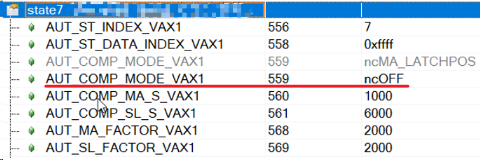
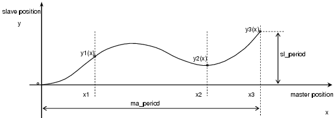
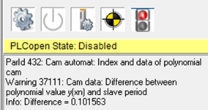

# 37101：从轴上计算的补偿距离限制为最大值

- **描述**：
    - 在计算补偿齿轮期间凸轮自动装置处于活动状态时出现运行错误。 “有效”从站补偿路径超过最大值（AUT_COMP_SL_S_MAX 或 CAM_SL_S_COMP_MAX）。另请参阅错误编号 [5101](#5101补偿齿轮超出限值). 仅在启动或重启后注册一次。
- **反应**：
    - 补偿是用极限值计算的。
    - 结果，从属间隔被移位。
- **原因/补救措施**：
    - 具有 ncAT_ONCE 属性的事件错误发生。
    - 从站补偿路径太长。
    - 从机曲线周期太小。
    - 从机倍增因子太小。

## 应用案例

### 2023.07.05

- MC_AUTDATA_STATE_TYP data type 有限制从轴补偿段最小速度的接口，但是尝试后发现 37101 的报警，说曲线周期太短，研究后发现 MinSlaveCompVelocity，MaxSlaveAccelComp 1, MaxSlaveAccelComp 2, 相当于是一个比例值，增加从轴最小补偿速度后，从轴的速度便不会为 0，即不会报 37101。
- 例如: ExtendedCompLimits = ncON; MinslaveCompVelocity = 0.2; MaxslaveCompVelocity = 1; MaxslaveAccelComp1 = 1; MaxSlaveAccelComp2 = 1; MaxSlaveCompDistance = 285575;

# 37102：从轴上计算的补偿距离限制为最小值

- **描述**：
    - 在计算补偿齿轮期间凸轮自动装置处于活动状态时出现运行错误。 “有效”从站补偿低于最小值（AUT_COMP_SL_S_MIN 或 CAM_SL_S_COMP_MIN）。另请参阅错误编号 [5101](#5101补偿齿轮超出限值). 仅在启动或重启后注册一次。
- **反应**：
    - 补偿是用极限值计算的。
    - 结果，从属间隔被移位。
- **原因/补救措施**：
    - 从站补偿路径太短。
    - Slave曲线周期过大。
    - Slave倍增因子太大。
    - 另请参阅错误编号 [37101](#37101从轴上计算的补偿距离限制为最大值).

# 37108：计算出的主轴补偿距离限制为最小值

- **描述**：
    - 在计算补偿齿轮期间凸轮自动装置处于活动状态时出现运行错误。 “有效”主站补偿低于最小值 (AUT_COMP_MA_S_MIN)。另请参阅错误编号 [5101](#5101补偿齿轮超出限值). 仅在启动或重启后注册一次。
- **反应**：
    - 补偿是用极限值计算的。
    - 结果，主间隔被移动。
- **原因/补救措施**：
    - 具有 ncAT_ONCE 属性的事件错误发生。
    - Master补偿路径太短。
    - Master曲线周期过大。
    - Master乘法因子太大。

## 应用案例

### 2023.07.05

- **现象** 连续过瓶套标时出现停分瓶1虚轴报警37108：
- **解决方式** 主要是 ST7的主轴补偿值太小，将 ST7的补偿模式关闭后，正常；
    - 

# 37111：凸轮数据：多项式值 y(xn) 与从站周期之间的差异

- **描述**：
    - 凸轮下载 (AUT_POLY_DATA) 的最后一个数据段的响应错误。检查多项式函数值 y(xn) 以查看它是否对应于主区间结束时的从区间。函数值计算为浮点数。间隔（周期）作为整数放置在凸轮数据中。如果偏差大于 0.1 且小于 1.0，则会生成此警告。另请参阅错误编号 [5304](#5304凸轮数据格式错误).
- **反应**：
    - 凸轮被接受，但在主动凸轮耦合期间，偏差可能导致位置跳跃。
- **原因/补救措施**：
    - 计算凸轮多项式时出现数值错误。
    - 计算算法没有考虑到只允许整数间隔的事实。

## 应用案例

### 2022.12.19

- **现象** 绝大多数时候没问题，但会偶发
- **原因**
    - 整数是必需保证的，但是曲线参数是浮点数，精度有限，每一段曲线是从起点按照多项式参数计算的，最后一段计算到终点的时候误差比较大了
    - 
    - 第三段曲线，起点是(x2,y2)，是很准确的，后面直到(x3，y3)都是多项式系数算出来的，计算出来的 y3 跟 sl_period 差值超过0.1了注意事项第一个点要是0，最后一个点要是整数这代码说其实曲线是接受了，提示有突变而已可尝试的解决方式优化曲线的点看能否加多一小段主轴，而从轴是静止的。从轴在曲线结束是停止的话，就提前停下，比如359.9度就走完，剩下0.1，也是静止。来避免这代码，或者程序发现这代码就自动确认即可。不超过128个点可以考虑使用此功能块 MC_BR_CalcCamFromPoints

### 2023.07.05

- **现象**
    - 
- **原因**
    - 画面中设置的刀长度是 315.000 mm 会报错 37111，需注意五阶多项式最后一项不能为小数

### 2023.07.05

- **现象** 轴报错偶发37111
- **原因** 由上位下发的 CAM 数据点由相机生成，而头尾的位置点是固定不变的。对于短片，凸轮最后第二个点和最后一个点之间位置离太远，系统无法拟合成贴合6阶多项式曲线，因此报错。

# 37112：凸轮数据中的多项式超过限值

- **描述**：
    - 写入 AUT_POLY_CHECK 时出现响应错误。检查凸轮多项式是否违反限制。
- **反应**：
    - 没有任何。
- **原因/补救措施**：
    - 凸轮尺寸不正确。
    - AUT_MA_V_MAX 参数或轴限制不正确。
    - 细节
        - 1：Y-shift（位置跳转）向左连接多项式
        - 2：Y-shift（位置跳转）向右连接多项式
        - 3：正向最大加速度（AXLIM_A1_POS）
        - 4：正向最大减速度（AXLIM_A2_POS）
        - 5：负方向最大加速度（AXLIM_A1_NEG）
        - 6：负方向最大减速度（AXLIM_A2_NEG）
        - 7：正向最大速度（AXLIM_V_POS）
        - 8：负方向最大速度（AXLIM_V_NEG）

# 37113：补偿齿轮：超出限值

- **描述**：
    - 查看错误编号 [5101](#5101补偿齿轮超出限值).
- **反应**：
    - 查看错误编号 [5101](#5101补偿齿轮超出限值).
- **原因/补救措施**：
    - 查看错误编号 [5101](#5101补偿齿轮超出限值).

## 应用案例

### 2022.01.11

- **问题**：MC_GearInPos 指令静止时投入正常，主轴运动中投入时，报警37113.
- **解决**：设置 MasterParIDMaxVelocity 参数，如果不设置，从轴的补偿速度太大，超过限制。

### 2022.01.17

- 原因：将 MC_BR_InitAutPar 功能块的 MaxMasterVelocity 数值设小，例如设为1.

### 2023.07.05

> 🐞注意！以下验证结论得出有一定的偶然性，仅供参考
- **现象** 使用 MC_GearInPos 功能块当 MasterParID=0时，MasterParIDMaxVelocity 会直接影响到报警37113的产生和限制补偿段从轴加速度。
    - 分三种情况：
        - a. MasterParIDMaxVelocity=1时，不产生报警，从轴加速度为三角波（不受限制）。触发 Execute 时主轴是否运动不影响结论。
        - b. MasterParIDMaxVelocity=0时,如果触发从轴同步时主轴在运动，则报警且从轴加速度受限制。如果先触发从轴同步，再让主轴运动，则不会报警且从轴加速度不受限制
        - c. MasterParIDMaxVelocity=Others 时，一定会产生报警，但是从轴加速度波形不一定受限制，表现为 MasterParIDMaxVelocity 为较小的正值时从轴加速度仍为三角波。
- **结论** 建议 Velocity=1，Acceleration=1，MasterParIDMaxVelocity=1，可以避免报错 37113，且可以保证从轴加速度不受限制。

### 2023.09.15

- **问题**：MC_GearInPos 功能块使用时出现37113报警
- **分析**：MC_GearInPos的Execute触发时，主轴正在匀速运动，从轴的当前位置离功能块中设定的SlaveSyncPosition已经很接近，说明在从轴补偿段追速的距离非常短，功能块会自动计算出很大的加速度值，超过了功能块设定的最大加速度。
- **解决方式 1**：给 Execute 指令时，确认补偿段的从轴行程 (需要自己计算从轴当前位置与 SlaveSyncPosition 的差值)，使从轴留有足够加速距离。
- **解决方法2**：确认电机负载可承受情况下，增大加速度最大值(功能块中Acceleration变量)

# 📋回到总览页

[000轴控ACOPOS报警号](000轴控ACOPOS报警号.md)
