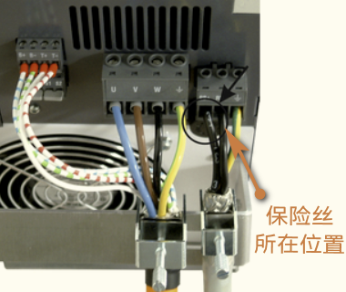
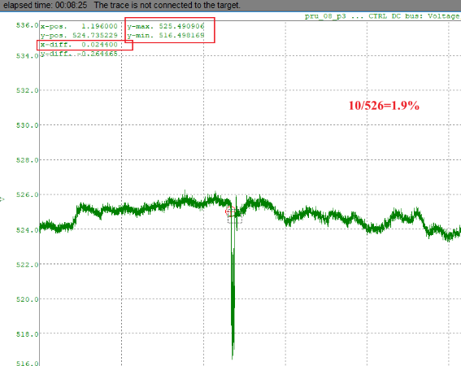
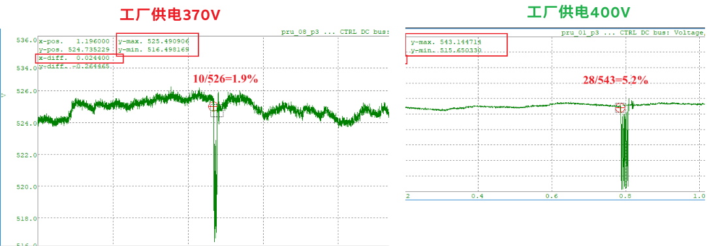

# 38000：电流控制器：启动时电机转速过高

描述：

接通电流控制器时出现运行错误。 电流偏移补偿期间转子速度（次级元件）过高。 由于感应同步产生的电压，无法补偿电流偏移。

反应：

当前偏移设置为 0。

原因/补救措施：

等到电机静止

# 38001：扭矩限制器：限制值高于最大值

描述：

写入扭矩限制（扭矩限制或扭矩限制覆盖）参数时的响应错误。 驱动器无法产生所需的电流或电机不允许所需的电流。

反应：

转矩限制受驱动器的最大电流 ACOPOS_CURR_MAX 和电机的最大电流 MOTOR_CURR_MAX 的限制。

原因/补救措施：

ACOPOS 无法提供必要的电流。

电机无法提供必要的电流。

配置错误：扭矩限制被错误地设置得太高。

电机配置错误：如果 MOTOR_TORQ_MAX / MOTOR_CURR_MAX 的配置高于 MOTOR_TORQ_CONST 并且扭矩限制设置为高于 MOTOR_TORQ_CONST \* MOTOR_CURR_MAX，则报告此警告。.

# 38003：电机抱闸：测试扭矩受限

描述：

抱闸扭矩测试期间的运行错误。 无法达到测试扭矩。 测量误差大于 5%。

反应：

无。

原因/补救措施：

测试扭矩太大，分别激活扭矩限制（检查 ACOPOS 峰值电流、电机峰值电流、温度）。

控制器不稳定。.

# 38004：电机抱闸：测试扭矩小于负载扭矩

描述：

抱闸扭矩测试期间的运行错误。 测试扭矩小于实际负载扭矩。

反应：

无。

原因/补救措施：

实际负载转矩对于抱闸来说太大。

测试扭矩太小。

负载转矩确定不正确（电流测量系统、电机配置、转子换向或电机编码器测量系统）。

控制器不稳定。.

# 38005：电机测试：开启期间速度太高

描述：

接通电流控制器时出现运行错误。 接通控制器时，进行测试以确定电机速度 SCTRL_SPEED_ACT 是否高于 0.05\*MOTOR_SPEED_RATED/60。 测得的速度太高。

反应：

没有任何

原因/补救措施：

通过设置 MOTOR_TEST_MODE 中的 Bit4 和 Bit5 可以禁用移动电机时偏移电流的警告和有问题的自动调整.

## 应用案例

### 2022.06.10

伺服 switch_on 时, 需要确保测得实际速度(RPS) < 0.05 * MOTOR_SPEED_RATED / 60。 switch_on 瞬间, 给的力有角度要求, 所以最好电机静止时做, 速度够低也可以。

# 38006：电流控制器：超出允许的电流偏移值

描述：

接通电流控制器时出现运行错误。 在此阶段校准电流测量的偏移值。 功率部分已打开，电机的电压为零。 测得的电流对于偏移校准来说太大了。

反应：

当前偏移设置为零。

原因/补救措施：

电流测量校准期间的转子运动：

当控制器开启时，转子（次级元件）在运动。 因此，在电流偏移校准期间，会感应电压并在直流总线中提供电流。 测得的电流被解释为偏移电流。

ACOPOS 硬件缺陷（电流测量、IGBT 模块、IGBT 控制器）。

通过设置参数 MOTOR_TEST_MODE 中的 Bit5，可以禁用有功功率级期间的电流偏移校准。.

# 38008：泄放器：无电流

描述：

打开控制器时的运行时警告。

8Vxxxx.00-x：

在控制器启动时，会进行测试以查看在制动电阻斩波器短暂激活时（20 毫秒）直流总线电压 UDC_ACT 下降是否超过 2%。测试过程中的直流母线压降小于 2%。

8B0Pxxxxxxxx.xxx-x：

在控制器启动时，会进行测试以查看在制动电阻斩波器短暂激活（20 毫秒）时斩波器电流 UDC_CHOP_CURR 是否超过限值 0.8 \* UDC_ACT / R_BLEEDER_EXT。斩波电流不超过限制。

反应：

无

原因/补救措施：

ACOPOS：

保险丝损坏：更换保险丝。

斩波器故障：更换 ACOPOS 模块。

外接制动电阻：

接线错误：检查所有制动电阻线是否正确固定在RB+和RB-连接处。

接线错误：从连接 RB+ 和 RB- 上拆下制动电阻器线路。检查 ACOPOS 侧制动电阻线路上 RB+ 和 RB- 之间的电阻。电阻必须是有限的并且对应于制动电阻数据。如果阻值为无穷大，则制动电阻或线路有故障。

制动电阻损坏：检查制动电阻上 RB+ 和 RB- 之间的电阻。如果阻值为无穷大，则制动电阻有故障。

8B0Pxxxxxxxx.xxx-x：

制动电阻错误配置：制动电阻R_BLEEDER_EXT的阻值参数设置过低。

斩波器电流测量故障：更换 ACOPOS 模块

直流母线电压测量不良：实际直流母线电压值低于测得的直流母线电压值 UDC_ACT：更换ACOPOS模块

可以通过在 MOTOR_TEST_MODE 中设置 Bit6 (0x40) 来禁用警告。.

## 应用案例

### 2023.06.29

此问题一般为制动电阻处出现问题。需要排查的问题点：

**1.保险丝损坏：更换保险丝。** ACOPOS 1320，可取下保险丝进行检查。 

**2. 斩波器故障：更换 ACOPOS 驱动器。** 可通过将 ParID 398 设置为 0，切换为不使用外部制动电阻的方式，若驱动器 Switch On，如果不报错则驱动器没有问题。

**3.外接制动电阻故障** 接线错误：检查所有制动电阻线是否正确固定在 RB+和 RB-连接处。制动电阻正常：RB+与 RB-之间的阻值一般在30Ω左右（即制动电阻铭牌上的标称阻值），如果为无穷大，则制动电阻或线路有问题。

**4.驱动器的24V 供电偏低（例如23.2V)** 若24V 供电是多设备串接，请检查驱动器的24V 供电。

**5.现场三相供电偏低（例如370V)**

**6.多个驱动器，共直流母线**

**7.所选制动电阻的制动功率偏小** 偶尔出现检测时 DC BUS 压降不满足检测条件

### 2023.06.26

**现象** 在现场生产几年的 ACOPOS 1320驱动器，上电后报38008错误，可复位，但一旦运行仍报错。

**解决方式** 驱动器损坏，维修后解决。

### 2023.06.26

**38008报错产生的原因** 驱动器 Switch 时的 DC BUS 压降不满足检测条件（测试过程中的直流母线压降小于 2%）前提条件：使用外接制动电阻。

若使用内置，不使用即使降低2%以内也不会触发报错机制，因为内置制动电阻默认关闭了这个检测。使用外部制动电阻时，可通过 Trace 驱动器 Switch On 过程中的 ParID 298的数值变化来判断

**如何屏蔽此检测机制** ParID 866写为64

### 2023.06.26

**现象** 同样的设备与程序，使用 ACOPOS P3 8.8A 单轴，在某一个现场上电后偶发38008，在运行过程中不会报出38008。使用的外接制动电阻参数为75Ω，1kW

**原因** 此现场的供电电压较低为370V，其他现场的供电电压均为400V。而 DC BUS 的压降自检与供电有直接关系，过低的电压会导致自检不通过。

**解决方式** 由于现场的工厂供电电压低问题无法解决，故通过 ParID 写64屏幕，并在 HMI 上留相关的接口，可实现此屏蔽功能可调整。

### 2023.06.26

- 基本上，当驱动器被 Switch On 时，斩波器以100%的占空比被打开20ms。在电源周期的六分之一（20ms/6 @ fn = 50Hz），直流母线电压以制动电阻的最大制动功率降低。
- 0 ) 若选用的制动电阻制动功率较低，而供电电压也偏低，则在驱动器 Switch on 时，直流母线电压可能会偶发下降不到2%，从而出发此38008报警。
- 1 ) 如果直流母线电压至少降低了2%，那么就意味着已经连接了一个制动电阻。这个条件通常对没有与其他 P3驱动器的直流母线连接的单个模块来说是足够的。当与其他驱动器进行直流母线连接时，直流母线的容量增加、这就降低了降低的幅度，导致直流母线电压下降没有超过2%，从而报警。此时可以通过屏蔽此自检解决
- 2 ) 在一个 ACOPOS P3 Switch on 期间，它通过直流总线连接到其他 ACOPOS P3驱动器、再生能量在同一时刻由另一个轴返回到直流总线。在关于警告38008的内部测试中，这也会影响到直流母线电压的降低和测试的结果。这也会影响到直流母线电压的降低。如果是这种情况，也可以停用该警告。建议首先验证所用机器的硬件结构是什么样子的，以及几个驱动器之间是否有直流总线连接。如果是这种情况，下一步就是验证是否存在上述的某一点。在这种情况下，可以解释该警告，并且可以通过 MOTOR_TEST_MODE 中的第6位（0x40）来停用它。

# 38009：逆变器：输出：电流测试中止

描述：

接通电流控制器时的运行警告。 当控制器打开时，检查电流是否可以通过电压设置注入电机或再生扼流圈（逆变器输出）的各相。 测试前，电流测量信号的量程大于sqrt(2)\*MIN(MOTOR_CURR_RATED,ACOPOS_CURR_RATED)。 这意味着无法执行电流测试。

反应：

无

原因/补救措施：

查看错误编号 [6045](#6045逆变器输出无电流).

电机接线不正确。 检查电机接线和屏蔽。

电机与变频器不匹配。 电机额定电流 MOTOR_CURR_RATED 远低于变频器额定电流 ACOPOS_CURR_RATED。

# 📋回到总览页

[000轴控ACOPOS报警号](000轴控ACOPOS报警号.md)
