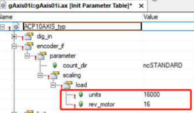
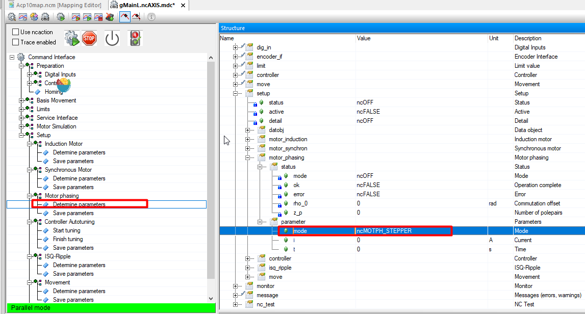

- [4005：控制器无法开启：驱动处于错误状态](#_4005%EF%BC%9A%E6%8E%A7%E5%88%B6%E5%99%A8%E6%97%A0%E6%B3%95%E5%BC%80%E5%90%AF%EF%BC%9A%E9%A9%B1%E5%8A%A8%E5%A4%84%E4%BA%8E%E9%94%99%E8%AF%AF%E7%8A%B6%E6%80%81)
	- [应用案例](#_%E5%BA%94%E7%94%A8%E6%A1%88%E4%BE%8B)
		- [2022.01.10](#_20220110)
		- [2022.01.11](#_20220111)
		- [2022.01.11](#_20220111)
		- [2022.06.27](#_20220627)
		- [2023.06.28](#_20230628)
		- [2023.06.28](#_20230628)
		- [2023.10.07](#_20231007)
- [4007：超出滞后错误停止限制](#_4007%EF%BC%9A%E8%B6%85%E5%87%BA%E6%BB%9E%E5%90%8E%E9%94%99%E8%AF%AF%E5%81%9C%E6%AD%A2%E9%99%90%E5%88%B6)
	- [应用案例](#_%E5%BA%94%E7%94%A8%E6%A1%88%E4%BE%8B)
		- [2022.01.10](#_20220110)
		- [2022.01.11](#_20220111)
		- [2022.01.17](#_20220117)
		- [2019.11.27](#_20191127)
		- [2022.12.09](#_20221209)
		- [2023.02.13](#_20230213)
		- [2023.02.14](#_20230214)
		- [2023.03.23](#_20230323)
		- [2023.12.06](#_20231206)
		- [2024.03.15](#_20240315)
- [4008：到达正限位开关](#_4008%EF%BC%9A%E5%88%B0%E8%BE%BE%E6%AD%A3%E9%99%90%E4%BD%8D%E5%BC%80%E5%85%B3)
	- [应用案例](#_%E5%BA%94%E7%94%A8%E6%A1%88%E4%BE%8B)
		- [2023.02.14](#_20230214)
- [4009：到达负限位开关](#_4009%EF%BC%9A%E5%88%B0%E8%BE%BE%E8%B4%9F%E9%99%90%E4%BD%8D%E5%BC%80%E5%85%B3)
- [应用案例](#_%E5%BA%94%E7%94%A8%E6%A1%88%E4%BE%8B)
	- [2023.02.14](#_20230214)
- [4010：控制器无法开启：两个限位开关都关闭](#_4010%EF%BC%9A%E6%8E%A7%E5%88%B6%E5%99%A8%E6%97%A0%E6%B3%95%E5%BC%80%E5%90%AF%EF%BC%9A%E4%B8%A4%E4%B8%AA%E9%99%90%E4%BD%8D%E5%BC%80%E5%85%B3%E9%83%BD%E5%85%B3%E9%97%AD)
- [4011：控制器无法关闭：运动激活](#_4011%EF%BC%9A%E6%8E%A7%E5%88%B6%E5%99%A8%E6%97%A0%E6%B3%95%E5%85%B3%E9%97%AD%EF%BC%9A%E8%BF%90%E5%8A%A8%E6%BF%80%E6%B4%BB)
- [4012：控制器无法开启：初始化参数丢失或无效](#_4012%EF%BC%9A%E6%8E%A7%E5%88%B6%E5%99%A8%E6%97%A0%E6%B3%95%E5%BC%80%E5%90%AF%EF%BC%9A%E5%88%9D%E5%A7%8B%E5%8C%96%E5%8F%82%E6%95%B0%E4%B8%A2%E5%A4%B1%E6%88%96%E6%97%A0%E6%95%88)
- [4014：两个编码器控制：超出位置差的停止限制](#_4014%EF%BC%9A%E4%B8%A4%E4%B8%AA%E7%BC%96%E7%A0%81%E5%99%A8%E6%8E%A7%E5%88%B6%EF%BC%9A%E8%B6%85%E5%87%BA%E4%BD%8D%E7%BD%AE%E5%B7%AE%E7%9A%84%E5%81%9C%E6%AD%A2%E9%99%90%E5%88%B6)
- [4015：命令触发的错误](#_4015%EF%BC%9A%E5%91%BD%E4%BB%A4%E8%A7%A6%E5%8F%91%E7%9A%84%E9%94%99%E8%AF%AF)
- [4016：任务类循环时间无效](#_4016%EF%BC%9A%E4%BB%BB%E5%8A%A1%E7%B1%BB%E5%BE%AA%E7%8E%AF%E6%97%B6%E9%97%B4%E6%97%A0%E6%95%88)
- [4017：网络循环时间无效](#_4017%EF%BC%9A%E7%BD%91%E7%BB%9C%E5%BE%AA%E7%8E%AF%E6%97%B6%E9%97%B4%E6%97%A0%E6%95%88)
- [📋回到总览页](#_%E5%9B%9E%E5%88%B0%E6%80%BB%E8%A7%88%E9%A1%B5)

# 4005：控制器无法开启：驱动处于错误状态

- **描述**：
    - 如果驱动器处于错误状态，则在打开控制器时响应错误。绿色闪烁的就绪 LED 指示“控制器未就绪”状态（V2.130 之前：红色错误 LED 持续亮起）。此外，还会输入运行时错误，提供有关错误原因的详细信息。 （例如错误号 [1011](#1011快速停止输入处于活动状态)). 也可以使用单独的命令 (CMD_ERR_STATE_INTO_FIFO) 触发此错误条目。
- **反应**：
    - 功率电平未启用且控制器未开启。
- **原因/补救措施**：
    - 查看另外输入的错误编号.

## 应用案例

### 2022.01.10

- 伺服无法启动：伺服处于错误状态无法启动，具体原因需要确认该驱动器当前报警后查看后续信息。

### 2022.01.11

- 报警 6033,4005
- **问题描述**：伺服不能使能，RUN 指示灯不亮，报警号 4005,6033
- **解决方法**：更新伺服驱动器固件到最新版本 2.3.0.0，没有解决，继续更新编码器卡固件，问题得以解决。
- **附注**：最好把伺服固件及相关固件都更新。

### 2022.01.11

- 伺服报警 5005. 4005 复不了位，现场用的伺服是 ACOPOS 1045，换成 ACOPO 1090 就可以复位了。
- 早期换伺服驱动器选1045主要替换客户原来的设备，使用中没发现什么问题，但在后来终端客户的需求中速度提高，1045略显过载，后期设备全部改为了1090的驱动器此问题解决。

### 2022.06.27

- **问题：** 使用翡叶电机 `E09` 编码器，在 test 模式下使能，就会报 4005，39003，6057，39042，39024，39006。
- **解决方式**：参数表719写1来确认编码器。

### 2023.06.28

- **现象**
    - 4005: Controller cannot be switched on: Drive in error state
    - 5005: Start of movement not possible: Position controller inactive
    - 6048: Motor holding brake movement monitor: Position error too large
    - 9070: Motor temperature model: Stop limit exceeded
    - 41031: Junction temperature model: Warning limit exceeded
    - 41070: Motor temperature model: Warning limit exceeded
    - 29203: Drive is not ready.
    - 29209: The drive is in error state.
    - 29217: Invalid input parameter
- **原因**
    - 零位参数不对引起过载，客户更换了模具，但是没有重新走回零的流程，导致参数错误，机械卡主了，当前顶住位置距离零位还有1mm 以上因此当伺服使能，由于不在零位位置，所以向零位运动，由于已机械顶住，所以动态偏差 LagError 一直有 1 mm 以上，就一直以最大扭矩输出，造成电机温度超过 70 度以上，驱动器的散热片温度高达 70 度，IGBT 温度高达 133 度。持续较长时间后就报警而 POWER OFF，进行复位后，又进入以上死循环。
- **优化方式**
    - 使能后，走到零位，如果持续1秒超过+5Nm 或小于-5Nm，则把 HomePosition 进行偏移，再进行 MC_HOME 操作

### 2023.06.28

- **现象** ACOPOS P 3 上电，AS 通过 test 独占模式测试电机。在系统刚启动且轴没有 Switch On 的状态下报警 9040，复位后无错误提示。 Switch On 电机，出现报错。依次复位后，共出现以下报警：
    - 4005
    - 9078，Info：Temperature = 60
    - 9096，Info：Temperature = 90
    - 9104，Info：Temperature = 100
    - 9098，Info：Temperature = 110
- **问题排查** Trace ParID 1543和1540，发现数据明显异常，ID1543与 ID1540在伺服未工作情况下应与环境温度近似。判断 ACOPOS P3损坏
- **解决方式**
    - 1. 更换 ACOPOS P 3
    - 2.如出现9040报警，则需降低生产速度

### 2023.10.07

- **现象**
    - 8BVP6150HC00.008-1 RDY灯闪烁，无法使能
- **测试**
    - 刷空程序，使能报4005和9010。
    - 从滤波器开始，检查温度接线，所有端子插拔。左右柜对换，无效。
- **原因与解决方式**
    - 电源轴背板螺丝没拧紧，电抗器下面两根线没接好。

# 4007：超出滞后错误停止限制

- **描述**：
    - 如果滞后误差 PCTRL_LAG_ERROR 超过配置的滞后误差限值 AXLIM_DS_STOP，则位置控制器处于活动状态时的运行错误。
- **反应**：
    - 默认设置 STOP_ERR_DECEL_RAMP=ncA_LIMIT：
        - 通过速度调节斜坡、轴限制和关闭控制器停止运动。
    - 设置 STOP_ERR_DECEL_RAMP=ncINDUCTION：
        - 独立于控制器模式：运动中止，感应停止。另请参阅错误编号 [9001](#9001散热器温度传感器超出关闭限制).
    - 设置 STOP_ERR_DECEL_RAMP=ncCTRL_OFF：
        - 独立于控制器模式：通过立即关闭控制器和电源部分来中止运动。驱动器没有电气扭矩。
- **原因/补救措施**：
    - 滞后误差限制太小 (AXLIM_DS_STOP)。
    - 设置值生成的错误配置：
        - 加速、减速或速度参数太大（例如 AXLIM_A1_NEG、BASIS_MOVE_V_POS、..）。
    - 控制器配置不正确：
        - 控制器设置太弱。
        - 前馈配置不正确（例如预测时间 = 0）。
        - 不稳定的控制回路。
    - 限流：
        - 增加电流。 查看错误编号 [9030](#9030结温模型超出停止限制).
        - EMF：运行速度太高和/或网络电压太低。检查电机是否在电压限制 sqrt(ICTRL_USD_REF\^2+ ICTRL_USQ_REF\^2) \> UDC_ACT/sqrt(3) 内运行。
        - 电流限制：检查电流 ICTRL_ISQ_REF 是否受到限制 sqrt(2)\* MOTOR_CURR_MAX 或 sqrt(2)\* ACOPOS_CURR_MAX 的限制。
        - 转矩限制：检查电流控制器 ICTRL_ISQ_REF 的设定值是否被 4 二次转矩限制器（LIM_T1_POS、LIM_T1_NEG、LIM_T2_POS、LIM_T2_NEG、LIM_T1_POS_OVR、LIM_T1_NEG_OVR、LIM_VRO_OVRT_OVRP_OVRT_LIM_T1_OVRT_OVRP_OVRT_LIM_T1_OVRT_OVRP_OVRT_OVRT_OVRT_O_G_POS_LIM_T1_OVRT_G_POS_LIM_T1_OVRT_O_G_POS_LIM_T1_O_G_POS_LIM_T1_O_RMP_LIM_T1_NEG_LIM_T1_N_O
        - ISQ 滤波器限制：检查电流控制器 ICTRL_ISQ_REF 的设定值是否受 ISQ 滤波器之一的限制。
        - 欠压限制器：检查 UDC_ACT \< UDC_NOMINAL 和 ICTRL_ISQ_REF = ISQ_MAX_UDC 和 ICTRL_ISQ_REF = ISQ_MIN_UDC。
        - 恢复功率限制器：检查 UDC_ACT \> UDC_BLEEDER_ON 和 ICTRL_ISQ_REF = ISQ_MAX_UDC 和 ICTRL_ISQ_REF = ISQ_MIN_UDC。
        - 温度限制器：当由于结点温度过高而停止运动时，电流会受到限制。查看错误编号 [9030](#9030结温模型超出停止限制).
    - 限速：
        - 速度控制器。 检查速度 SCTRL_SPEED_REF 是否受到限制 SCTRL_LIM_V_POS、SCTRL_LIM_V_NEG 或 MOTOR_SPEED_MAX 的限制。
        - 位置控制器。 检查速度 PCTRL_V_ACT 是否受到限制 POS_CTRL_P_MAX 的限制。
    - 编码器位置或速度包含错误：请参阅错误编号 [4014](#4014两个编码器控制超出位置差的停止限制).
    - 电机接线错误：见错误编号 [6044](#6044相位旋转方向或位置无效).
    - 电机接线错误：见错误编号 [6045](#6045逆变器输出无电流).
    - 电机缺陷：参见错误编号 [6045](#6045逆变器输出无电流).
    - ACOPOS 缺陷：请参阅错误编号 [6045](#6045逆变器输出无电流).

## 应用案例

### 2022.01.10

- 常见于引入引出，被收放料拖动。请降低加速度，或调整收放料，使其响应加快。

### 2022.01.11

- 动态跟随误差超过限值：
    - 1、重新插拔电机侧动力电缆和编码器电缆
    - 2、检查驱动器侧动力电缆顺序是否与端子标注一致
    - 3、调整三环参数
    - 4、检查机械是否有卡顿现象

### 2022.01.17

- UVW 三相接错，特别是 U 和 V

### 2019.11.27

- 电机内部存在减速箱的情况下，默认为 1000 的 Load units 过小，需要根据外部机械结构和误差结果适当调节上图中两个参数的比例。
- 

### 2022.12.09

- 实际位置偏差超过阈值

### 2023.02.13

- 1.请优先检查机械是否卡死，在断开电机使能转动负载以及断开联轴器，手动转动电机轴确认机械卡死位置。并同时检查是否可能有负载过大的可能。
- 2.程序中通常会设置比较大的 Lagerror 限制值，正常状态可以不用考虑程序参数配置的问题。
- 3.如果在伺服上电瞬间出现，检查是否为最近新安装电机，检查 U V W 接线是否牢固及接线顺序正常。
- 4.必要情况下，使用脱开负载，使用 AS 软件进行 Test 整定磁偏角以及接线相序问题。
-  5.手动转动正常，排除机械问题后，请手动转动该负载，在电机页面，查看位置数据是否连续变化。如果发现数据变化和实际不符，请检查电机端编码器插头，编码器线，编码卡。必要时更换其中物料排除。

### 2023.02.14

- **现象：** 运行了大概半小时报错4007（lagerror 过大）和7032（增量信号振幅太小）和6057（编码器报错）和6054（电流过冲）
- **原因：** 经排查发现 muti 编码器连线摆放过于密集，产生干扰导致编码器位置数据跳动，致使 lagerror 过大，导致电流增大最终电流过冲。
- 

### 2023.03.23

- **现象** ACOPOS 1180 在整机同步状态下由100RPM 加速到150RPMS 时出现报错报7211，4007，7200，9300 在实际测试过程中测量 DC BUS 电压，发现此驱动器的偏低
- **原因** 可能为1180驱动器内部整流模块故障。
- **解决方式** 更换驱动器

### 2023.12.06

- **现象**：
    - 贝加莱ACOPOS 1090 频繁出现4007故障，频率是每天两三次。这两天较为频繁，有时一个小时出现20次。
    - 报警号除了4007，还有6048
- **原因分析**：
    - 4007是跟随误差过大，6048是有抱闸的情况下跟随误差过大。
    - 4007故障可能是机械原因，也可能是通讯问题，还可能是硬件故障
    - 有可能是机械原因导致的负载变化，也可能是抱闸24v供电不稳定导致异常抱死。抱死的瞬间由于闭环控制，电机电流也会瞬间增大

### 2024.03.15

- **现象**
    - 电机（使用新电机脱开负载的状态），运动一会儿后开始报错4007，LagError过大，多次尝试还是如此
    - 使用先前测试可用的空程序也同样报错4007。
- **使用版本**
    - AR: B4.63
    - ACP10: 3.18.2
    - 驱动+电机: 8EI034HWS10.0100-1+8LSA84.R2022D100-3
    - 编码器卡: 8EAC0122.003
    - 编码器线：RESOLVER 编码器线
- **测试验证**
    - 测试一
        - 驱动断开使能后，使用手转动新的主轴电机轴，无卡顿，运动顺畅；Test窗口观察转动一圈时monitor.s增量与编码器标定一致；
    - 测试二
        - 使用空程序，autotunning以后电机即报4007；整机断电上电有时自整定能通过，通过后Test使能轴正反转，电机有时运行一段时间后报4007，有时使能即报4007；升级ACP 10版本至5.18.1，AR至E4.63均无效。
    - 测试三
        - 使用空程序对轴进行多次MoveAdditive，一次走半圈，驱动报错41051
    - 测试四
        - 将UVW六种相序接线全部进行了遍历测试，仍然报错4007。量新的主轴电机的三相绕组电阻值均为4欧姆左右。
    - 测试五
        - 使用Stepper mode进行新的主轴电机的磁偏角测定
        - 每次测试完成磁偏角后，报出lagError后再次重测磁偏角，测试结果如下：
            - 磁偏角测试一：1.561176
            - 磁偏角测试二：6.27283815
            - 磁偏角测试三：3.1694324
            - 磁偏角测试四：4.7152729
            - 磁偏角测试五：2.2595239
        - 出现LagError过大报警4007以后每次的测定磁偏角都不一样，每次整定磁偏角以后以该磁偏角参数运行可以稳定运行一段时间，时间不定，有时几秒，有时几分钟，在启停、加减速过程中lagError均无明显异常
- **结论**
    - 更换电机后，即运行正常。
    - 正常磁偏角一般为 π/2的整数倍，若发现运行过程中报4007，且每次磁偏角都有变化，则可怀疑电机损坏。

# 4008：到达正限位开关

- **描述**：
    - 如果在正运动方向上到达正限位开关，则运动激活时的运行错误。
- **反应**：
    - 默认设置 STOP_ERR_DECEL_RAMP=ncA_LIMIT：
    - 运动在轴限制处停止。 控制器保持开启状态。
    - STOP_ERR_DECEL_RAMP 的不同设置见错误号 [4007](#4007超出滞后错误停止限制).
- **原因/补救措施**：
    - 没有目标位置或目标位置不正确的运动命令。
    - SW 限制已停用或定义过大。
    - 凸轮自动机的从动范围太大。
    - 当缓慢“退出”时，如果主位置没有稳定增加，则带有凸轮的闭合限位开关会自动运行。
    - 另请参阅错误编号 [4010](#4010控制器无法开启两个限位开关都关闭).

## 应用案例

### 2023.02.14

- 1.该故障一般为相对运动的轴可能出现，例如排线，工作台这类。这个报警为正极限到达，当出现该报警时，无法再往正方向动电机。
- 2.核实是否超过极限。如果是，请切换到设置模式，复位，使用反向点动电机方式，将极限位置移除。
- 3.核实是否超过极限。如果否，则重新标定电机的零点位置，可能是电机零点的位置设置不合理，或者是正负极限传感器安装位置不合理。

# 4009：到达负限位开关

- **描述**：
    - 如果在运动的负方向上到达负限位开关，则运动激活时的运行错误。
- **反应**：
    - 运动在轴限制处停止。控制器保持开启状态。
- **原因/补救措施**：
    - 查看错误编号 [4008](#4008到达正限位开关).

# 应用案例

## 2023.02.14

- 1.该故障一般为相对运动的轴可能出现，例如排线，工作台这类。这个报警为负极限到达，当出现该报警时，无法再往负方向动电机。
- 2.核实是否超过极限。如果是，请切换到设置模式，复位，使用正向点动电机方式，将极限位置移除。
- 3.核实是否超过极限。如果否，则重新标定电机的零点位置，可能是电机零点的位置设置不合理，或者是正负极限传感器安装位置不合理。

# 4010：控制器无法开启：两个限位开关都关闭

- **描述**：
    - 如果正负限位开关关闭，则使用“开启控制器”命令的响应错误。
- **反应**：
    - 不执行命令。
- **原因/补救措施**：
    - 限位开关的有效输入电平被反转。
    - 由于“外力”（机械锁定，手动关闭），限位开关错误关闭。
    - 由于硬件错误（断线、线路端接、接线错误、电源电压）而错误关闭。
    - 对于无限制运动范围且无终点开关的“无限轴”或“循环轴”：
    - 也可以禁用限位开关的监控 (LIMIT_SWITCH_IGNORE) 以替代使用数字输入.

# 4011：控制器无法关闭：运动激活

- **描述**：
    - 如果运动处于活动状态，则使用“关闭控制器”命令响应错误。
- **反应**：
    - 不执行命令。
    - 这不会中断主动运动。
- **原因/补救措施**：
    - 运动停止后命令写入过快。
    - 缺少“移动完成”状态的请求（延迟步骤）。
    - -> 检查程序顺序和状态请求.

# 4012：控制器无法开启：初始化参数丢失或无效

- **描述**：
    - 如果至少一个 Init 参数丢失或设置为无效值，则使用“打开控制器”命令响应错误。
- **反应**：
    - 不执行命令。
- **原因/补救措施**：
    - 在配置完成之前，在初始化阶段写入命令过早。
    - 缺少“全局初始化”状态的参数初始化或请求（延迟步骤）。
    - -> 检查程序顺序和状态请求.

# 4014：两个编码器控制：超出位置差的停止限制

- **描述**：
    - 两个编码器位置控制处于活动状态时的运行时错误。位置编码器位置与电机编码器位置的差值大于 AXLIM_DS_STOP2。
- **反应**：
    - 查看错误编号 [4007](#4007超出滞后错误停止限制).
- **原因/补救措施**：
    - 电机/位置编码器配置错误。
    - 驱动机械中的公差（主轴斜率的波动、背隙、动力传输系统中的热膨胀、动力传输系统中的高加速度和低刚度）需要更大的 AXLIM_DS_STOP2。
    - 有缺陷的驱动机制（打滑、联轴器断裂）
    - 编码器位置或速度包含错误：
    - 电机和编码器之间的机械连接有缺陷。
    - 位置编码器监视器或电机编码器监视器未检测到的编码器。
    - 检查编码器插卡上的 UP/DOWN LED 和编码器位置 PCTRL_S_ACT。
    - 编码器不符合插卡规格（对照用户手册和编码器数据表）。
    - 编码器连接中断或损坏。 请参阅接线指南错误编号 [7030](#7030编码器增量信号幅度太大).
    - 编码器电源缺陷。
    - 编码器故障。
    - 插卡故障。
    - 解析器信号干扰。 查看错误编号 [7045](#7045旋转变压器信号干扰合理性检查).
    - 解析器信号干扰。 查看错误编号 [39002](#39002解析器超出-14-位分辨率的速度限制).

# 4015：命令触发的错误

- **描述**：
    - 命令触发的运行时错误。此命令用于测试应用程序的错误处理。
- **反应**：
    - 取决于参数值：
        - 1：无。
        - 2：运动停止，轴限位。 控制器保持开启状态。
        - 3：运动在轴限制和关闭控制器的情况下停止。
        - 4: 运动通过速度调节斜坡、轴限制和关闭控制器停止。
    - 对于不同的控制器模式，另见错误编号 [9000](#9000散热器温度传感器超出停止限制).
- **原因/补救措施**：
    - 命令 CMD_ERROR（带参数值 1 到 4）或 CMD_ERROR_VAX1（带参数值 1 到 2）。
    - 另请参阅错误编号 [36005](#36005由命令触发的警告).

# 4016：任务类循环时间无效

- **描述**：
    - 如果所请求的功能不允许循环时间，则写入参数时出现响应错误。
- **反应**：
    - 不接受参数值并且不执行请求的函数。
- **原因/补救措施**：
    - 检查任务类循环时间的设置.

# 4017：网络循环时间无效

- **描述**：
    - 如果请求的功能性不允许网络循环时间，则写入参数时出现响应错误。
- **反应**：
    - 不接受参数值并且不执行请求的函数。
- **原因/补救措施**：
    - 检查网络循环时间的设置

# 📋回到总览页

[000轴控ACOPOS报警号](000轴控ACOPOS报警号.md)
