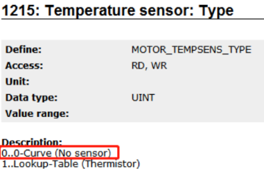

- [41001：散热器温度传感器：超出警告限制](#_41001%EF%BC%9A%E6%95%A3%E7%83%AD%E5%99%A8%E6%B8%A9%E5%BA%A6%E4%BC%A0%E6%84%9F%E5%99%A8%EF%BC%9A%E8%B6%85%E5%87%BA%E8%AD%A6%E5%91%8A%E9%99%90%E5%88%B6)
	- [应用案例](#_%E5%BA%94%E7%94%A8%E6%A1%88%E4%BE%8B)
		- [2022.01.11](#_20220111)
- [41002：散热器温度传感器：未连接或损坏](#_41002%EF%BC%9A%E6%95%A3%E7%83%AD%E5%99%A8%E6%B8%A9%E5%BA%A6%E4%BC%A0%E6%84%9F%E5%99%A8%EF%BC%9A%E6%9C%AA%E8%BF%9E%E6%8E%A5%E6%88%96%E6%8D%9F%E5%9D%8F)
	- [应用案例](#_%E5%BA%94%E7%94%A8%E6%A1%88%E4%BE%8B)
		- [2023.08.29](#_20230829)
		- [2024.03.14](#_20240314)
		- [2023.03.15](#_20230315)
- [41011：温度传感器（电机 | 扼流圈 | 外部）：超出警告限值](#_41011%EF%BC%9A%E6%B8%A9%E5%BA%A6%E4%BC%A0%E6%84%9F%E5%99%A8%EF%BC%88%E7%94%B5%E6%9C%BA--%E6%89%BC%E6%B5%81%E5%9C%88--%E5%A4%96%E9%83%A8%EF%BC%89%EF%BC%9A%E8%B6%85%E5%87%BA%E8%AD%A6%E5%91%8A%E9%99%90%E5%80%BC)
	- [应用案例](#_%E5%BA%94%E7%94%A8%E6%A1%88%E4%BE%8B)
		- [2022.01.10](#_20220110)
		- [2022.01.11](#_20220111)
		- [2023.03.23](#_20230323)
		- [2023.03.23](#_20230323)
		- [2023.04.03](#_20230403)
		- [2023.04.21](#_20230421)
		- [2023.07.05](#_20230705)
		- [2023.07.06](#_20230706)
- [41031：结温模型：超出警告限制](#_41031%EF%BC%9A%E7%BB%93%E6%B8%A9%E6%A8%A1%E5%9E%8B%EF%BC%9A%E8%B6%85%E5%87%BA%E8%AD%A6%E5%91%8A%E9%99%90%E5%88%B6)
	- [应用案例](#_%E5%BA%94%E7%94%A8%E6%A1%88%E4%BE%8B)
		- [总结](#_%E6%80%BB%E7%BB%93)
		- [2022.01.09](#_20220109)
		- [2022.01.10](#_20220110)
		- [2022.01.11](#_20220111)
		- [2022.01.11](#_20220111)
		- [2022.01.27](#_20220127)
		- [2023.03.23](#_20230323)
		- [2023.06.28](#_20230628)
		- [2023.06.28](#_20230628)
		- [2023.07.07](#_20230707)
		- [2023.07.07](#_20230707)
		- [2023.07.07](#_20230707)
		- [2023.07.07](#_20230707)
		- [2023.07.07](#_20230707)
		- [2023.07.07](#_20230707)
		- [2023.07.07](#_20230707)
		- [2023.07.07](#_20230707)
		- [2024.01.18](#_20240118)
- [41041：泄放温度模型：超出警告限制](#_41041%EF%BC%9A%E6%B3%84%E6%94%BE%E6%B8%A9%E5%BA%A6%E6%A8%A1%E5%9E%8B%EF%BC%9A%E8%B6%85%E5%87%BA%E8%AD%A6%E5%91%8A%E9%99%90%E5%88%B6)
	- [应用案例](#_%E5%BA%94%E7%94%A8%E6%A1%88%E4%BE%8B)
		- [2022.01.10](#_20220110)
		- [2022.01.10](#_20220110)
		- [2023.03.23](#_20230323)
		- [2023.07.07](#_20230707)
		- [2023.07.07](#_20230707)
		- [2023.07.07](#_20230707)
- [41051：ACOPOS 峰值电流：超出警告限值](#_41051%EF%BC%9Aacopos-%E5%B3%B0%E5%80%BC%E7%94%B5%E6%B5%81%EF%BC%9A%E8%B6%85%E5%87%BA%E8%AD%A6%E5%91%8A%E9%99%90%E5%80%BC)
	- [应用案例](#_%E5%BA%94%E7%94%A8%E6%A1%88%E4%BE%8B)
		- [2023.02.13](#_20230213)
		- [2023.07.07](#_20230707)
		- [2023.07.07](#_20230707)
- [41061：ACOPOS 连续电流：超出警告限值](#_41061%EF%BC%9Aacopos-%E8%BF%9E%E7%BB%AD%E7%94%B5%E6%B5%81%EF%BC%9A%E8%B6%85%E5%87%BA%E8%AD%A6%E5%91%8A%E9%99%90%E5%80%BC)
	- [应用案例](#_%E5%BA%94%E7%94%A8%E6%A1%88%E4%BE%8B)
		- [2022.01.11](#_20220111)
		- [2023.07.07](#_20230707)
		- [2023.07.07](#_20230707)
		- [2023.07.07](#_20230707)
- [41070：电机温度模型：超出警告限值](#_41070%EF%BC%9A%E7%94%B5%E6%9C%BA%E6%B8%A9%E5%BA%A6%E6%A8%A1%E5%9E%8B%EF%BC%9A%E8%B6%85%E5%87%BA%E8%AD%A6%E5%91%8A%E9%99%90%E5%80%BC)
	- [应用案例](#_%E5%BA%94%E7%94%A8%E6%A1%88%E4%BE%8B)
		- [2022.01.11](#_20220111)
		- [2022.01.11](#_20220111)
		- [2023.06.28](#_20230628)
		- [2023.07.07](#_20230707)
		- [2023.07.07](#_20230707)
		- [2023.07.07](#_20230707)
		- [2023.07.07](#_20230707)
- [41075：ACOPOS 持续功率：超出警告限制](#_41075%EF%BC%9Aacopos-%E6%8C%81%E7%BB%AD%E5%8A%9F%E7%8E%87%EF%BC%9A%E8%B6%85%E5%87%BA%E8%AD%A6%E5%91%8A%E9%99%90%E5%88%B6)
	- [应用案例](#_%E5%BA%94%E7%94%A8%E6%A1%88%E4%BE%8B)
		- [2022.01.11](#_20220111)
- [41078：功率级：温度传感器 1：超出警告限值](#_41078%EF%BC%9A%E5%8A%9F%E7%8E%87%E7%BA%A7%EF%BC%9A%E6%B8%A9%E5%BA%A6%E4%BC%A0%E6%84%9F%E5%99%A8-1%EF%BC%9A%E8%B6%85%E5%87%BA%E8%AD%A6%E5%91%8A%E9%99%90%E5%80%BC)
	- [应用案例](#_%E5%BA%94%E7%94%A8%E6%A1%88%E4%BE%8B)
		- [2023.03.23](#_20230323)
		- [2023.12.04](#_20231204)
- [41080：预充电电阻温度模型：超出警告限值](#_41080%EF%BC%9A%E9%A2%84%E5%85%85%E7%94%B5%E7%94%B5%E9%98%BB%E6%B8%A9%E5%BA%A6%E6%A8%A1%E5%9E%8B%EF%BC%9A%E8%B6%85%E5%87%BA%E8%AD%A6%E5%91%8A%E9%99%90%E5%80%BC)
- [41081：功率级温度模型：超出警告限制](#_41081%EF%BC%9A%E5%8A%9F%E7%8E%87%E7%BA%A7%E6%B8%A9%E5%BA%A6%E6%A8%A1%E5%9E%8B%EF%BC%9A%E8%B6%85%E5%87%BA%E8%AD%A6%E5%91%8A%E9%99%90%E5%88%B6)
- [41083：功率级：温度传感器 2：超出警告限值](#_41083%EF%BC%9A%E5%8A%9F%E7%8E%87%E7%BA%A7%EF%BC%9A%E6%B8%A9%E5%BA%A6%E4%BC%A0%E6%84%9F%E5%99%A8-2%EF%BC%9A%E8%B6%85%E5%87%BA%E8%AD%A6%E5%91%8A%E9%99%90%E5%80%BC)
- [41085：功率级：温度传感器 3：超出警告限值](#_41085%EF%BC%9A%E5%8A%9F%E7%8E%87%E7%BA%A7%EF%BC%9A%E6%B8%A9%E5%BA%A6%E4%BC%A0%E6%84%9F%E5%99%A8-3%EF%BC%9A%E8%B6%85%E5%87%BA%E8%AD%A6%E5%91%8A%E9%99%90%E5%80%BC)
- [41087：功率级：温度传感器 4：超出警告限值](#_41087%EF%BC%9A%E5%8A%9F%E7%8E%87%E7%BA%A7%EF%BC%9A%E6%B8%A9%E5%BA%A6%E4%BC%A0%E6%84%9F%E5%99%A8-4%EF%BC%9A%E8%B6%85%E5%87%BA%E8%AD%A6%E5%91%8A%E9%99%90%E5%80%BC)
- [41089：编码器温度传感器：超出警告限值](#_41089%EF%BC%9A%E7%BC%96%E7%A0%81%E5%99%A8%E6%B8%A9%E5%BA%A6%E4%BC%A0%E6%84%9F%E5%99%A8%EF%BC%9A%E8%B6%85%E5%87%BA%E8%AD%A6%E5%91%8A%E9%99%90%E5%80%BC)
- [41090：24V 电源/主继电器温度传感器：超出警告限值](#_41090%EF%BC%9A24v-%E7%94%B5%E6%BA%90%E4%B8%BB%E7%BB%A7%E7%94%B5%E5%99%A8%E6%B8%A9%E5%BA%A6%E4%BC%A0%E6%84%9F%E5%99%A8%EF%BC%9A%E8%B6%85%E5%87%BA%E8%AD%A6%E5%91%8A%E9%99%90%E5%80%BC)
- [41091：功率级：温度传感器 5：超出警告限值](#_41091%EF%BC%9A%E5%8A%9F%E7%8E%87%E7%BA%A7%EF%BC%9A%E6%B8%A9%E5%BA%A6%E4%BC%A0%E6%84%9F%E5%99%A8-5%EF%BC%9A%E8%B6%85%E5%87%BA%E8%AD%A6%E5%91%8A%E9%99%90%E5%80%BC)
- [41092：整流器温度模型：超出警告限值](#_41092%EF%BC%9A%E6%95%B4%E6%B5%81%E5%99%A8%E6%B8%A9%E5%BA%A6%E6%A8%A1%E5%9E%8B%EF%BC%9A%E8%B6%85%E5%87%BA%E8%AD%A6%E5%91%8A%E9%99%90%E5%80%BC)
- [41093：直流总线继电器温度模型：超出警告限值](#_41093%EF%BC%9A%E7%9B%B4%E6%B5%81%E6%80%BB%E7%BA%BF%E7%BB%A7%E7%94%B5%E5%99%A8%E6%B8%A9%E5%BA%A6%E6%A8%A1%E5%9E%8B%EF%BC%9A%E8%B6%85%E5%87%BA%E8%AD%A6%E5%91%8A%E9%99%90%E5%80%BC)
- [41094：直流母线电容器温度模型：超出警告限值](#_41094%EF%BC%9A%E7%9B%B4%E6%B5%81%E6%AF%8D%E7%BA%BF%E7%94%B5%E5%AE%B9%E5%99%A8%E6%B8%A9%E5%BA%A6%E6%A8%A1%E5%9E%8B%EF%BC%9A%E8%B6%85%E5%87%BA%E8%AD%A6%E5%91%8A%E9%99%90%E5%80%BC)
- [41095：直流母线：连续总功率：超出警告限制](#_41095%EF%BC%9A%E7%9B%B4%E6%B5%81%E6%AF%8D%E7%BA%BF%EF%BC%9A%E8%BF%9E%E7%BB%AD%E6%80%BB%E5%8A%9F%E7%8E%87%EF%BC%9A%E8%B6%85%E5%87%BA%E8%AD%A6%E5%91%8A%E9%99%90%E5%88%B6)
- [41096：直流母线：峰值总功率：超出警告限制](#_41096%EF%BC%9A%E7%9B%B4%E6%B5%81%E6%AF%8D%E7%BA%BF%EF%BC%9A%E5%B3%B0%E5%80%BC%E6%80%BB%E5%8A%9F%E7%8E%87%EF%BC%9A%E8%B6%85%E5%87%BA%E8%AD%A6%E5%91%8A%E9%99%90%E5%88%B6)
- [41097：直流连接器温度模型：超出警告限制](#_41097%EF%BC%9A%E7%9B%B4%E6%B5%81%E8%BF%9E%E6%8E%A5%E5%99%A8%E6%B8%A9%E5%BA%A6%E6%A8%A1%E5%9E%8B%EF%BC%9A%E8%B6%85%E5%87%BA%E8%AD%A6%E5%91%8A%E9%99%90%E5%88%B6)
- [41098：功率级：温度传感器：超出警告限值](#_41098%EF%BC%9A%E5%8A%9F%E7%8E%87%E7%BA%A7%EF%BC%9A%E6%B8%A9%E5%BA%A6%E4%BC%A0%E6%84%9F%E5%99%A8%EF%BC%9A%E8%B6%85%E5%87%BA%E8%AD%A6%E5%91%8A%E9%99%90%E5%80%BC)
- [41099：电机温度模型：超出警告限值](#_41099%EF%BC%9A%E7%94%B5%E6%9C%BA%E6%B8%A9%E5%BA%A6%E6%A8%A1%E5%9E%8B%EF%BC%9A%E8%B6%85%E5%87%BA%E8%AD%A6%E5%91%8A%E9%99%90%E5%80%BC)
- [41100：电机：温度传感器：温差高](#_41100%EF%BC%9A%E7%94%B5%E6%9C%BA%EF%BC%9A%E6%B8%A9%E5%BA%A6%E4%BC%A0%E6%84%9F%E5%99%A8%EF%BC%9A%E6%B8%A9%E5%B7%AE%E9%AB%98)
- [41101：功率级：温度传感器 1：温度过低：超出警告限值](#_41101%EF%BC%9A%E5%8A%9F%E7%8E%87%E7%BA%A7%EF%BC%9A%E6%B8%A9%E5%BA%A6%E4%BC%A0%E6%84%9F%E5%99%A8-1%EF%BC%9A%E6%B8%A9%E5%BA%A6%E8%BF%87%E4%BD%8E%EF%BC%9A%E8%B6%85%E5%87%BA%E8%AD%A6%E5%91%8A%E9%99%90%E5%80%BC)
- [📋回到总览页](#_%E5%9B%9E%E5%88%B0%E6%80%BB%E8%A7%88%E9%A1%B5)

# 41001：散热器温度传感器：超出警告限制

- **描述**：
    - 如果散热片温度传感器 TEMP_HEATSINK 的温度超过警告限值 0.95\*103℃，则运行时发出警告。
- **反应**：
    - 无
- **原因/补救措施**：
    - 查看错误编号 [9000](#9000散热器温度传感器超出停止限制).

## 应用案例

### 2022.01.11

- 41001/9000 Heatsink temperature sensor: Warning limit exceeded:
    - （1）ID 380：伺服驱动器温度读取值变化较大有可能驱动器硬件有问题：驱动器的问题是通过 IGBT 读取过来的，IGBT 某引脚焊点有氧化或者进水腐蚀
    - （2）如果是 acoposmulti 电源轴，那么有可能是 T+ T- 接线问题，或者外部动力电问题（比如动力电缆温度高）

# 41002：散热器温度传感器：未连接或损坏

- **描述：**
    - 如果测得的散热器温度低于模块相关的下限值 (~ -30℃)，则会发出运行警告。
- **反应：**
    - 没有任何。
- **原因/补救措施：**
    - 无效的操作条件：
        - 运行期间的环境温度低于模块相关的下限值 (~ -30℃)。 -> 检查进气口正前方的散热器温度。
    - ACOPOS 模块缺陷：
        - 散热器温度测量有缺陷。如果继续运行，逆变器也可能会损坏。

## 应用案例

### 2023.08.29

- **现象**：断电重启，伺服报错 41002 后，复位报错后电机不受控制
    - 重新上电，主轴报错 41002，复位该报错后点击运行，主轴电机不转，同时在使能状态下手能拨动负载转动
    - 伺服未有其他故障问题，不同速度下正点动、负点动也能转起来，但运行一会就报错，观察动态偏差一直在增加
    - 现场重新复现问题，断电重启后发现伺服立马报错 41002，该报错能够复位掉，只是重新上电那一瞬间出现这个错，复位后在轴控界面单独对左主轴电机上电，伺服也可以正常上使能，同时检查伺服上的状态灯都正常
    - 重新界面上一键优化一次，然后再启动，这个时候发现电机控制正常了，但断电重启后还是一样的故障现象。
- **原因**：每次断电重启后，伺服会立刻报错，这样轴控步序就会直接跳转到报错步，然后复位后跳转到上使能等待步，但这样电机的参数、控制三环参数等都未能刷写成功，所以就导致电机不受控制，因此出现这种现象是轴控程序 Bug
- **解决方式**：优化逻辑，确保在刚上电时，轴控报错处理，增加轴控参数是否更新的标志位判断，若没有更新轴控参数，则在跳到使能等待步之前，先逻辑跳转到轴参数更新步骤。

### 2024.03.14

- **现象**
    - 8BVI0220HCD0.000-1硬件（ACOPOSmulti 逆变器模块），上电报41002（Heatsink temperature sensor: Not connected or damaged）。
- **测试验证方式**
    - 多次空程序测试，报41031（Junction temperature model: Warning limit exceeded），6054（Power stage: Overcurrent），9030（Junction temperature model: Stop limit exceeded），4007（Lag error stop limit exceeded），也有几次可以正常运行。
    - 读ID373，381，380，40度左右，温度正常。更换左右接线，故障跟着驱动器的口走。
- **解决方式**
    - 更换驱动器，运行正常。

### 2023.03.15

- **现象**
    - 一上电，电源轴（8BVP1650HC00.008-1）就报41002，复位之后就可以正常运行。报警复位后就能正常switch on
    - 再一上电，又有41002。
    - ParID 380 读取到的实际温度为28度，ParID 841 是103。
- **解决方式**
    - 更换驱动器硬件

# 41011：温度传感器（电机 | 扼流圈 | 外部）：超出警告限值

- **描述**：
    - 如果电机温度传感器 TEMP_MOTOR 的温度超过以下警告限值，则运行时发出警告。
    - 如果 MOTOR_COMPATIBILITY = 513，则警告极限 = 0.95 * 110℃
    - 如果 MOTOR_COMPATIBILITY > 513，则警告限制 = 0.95 * MOTOR_WIND_TEMP_MAX
- **反应**：
    - 没有任何
- **原因/补救措施**：
    - 查看错误编号 [9010](#9010温度传感器电机扼流圈外部超出停止限制).

## 应用案例

### 2022.01.10

- 电机超温：电机允许温度90℃，如果达到该温度请减轻负载或加强散热。

### 2022.01.11

- Temperature sensor (Motor | Choke | External): Warning limit exceeded
    - （1）ID 381：电机温度读取值变化较大电机温度是通过电机电缆通讯传递到伺服上，电机内部的热敏电阻有问题。
    - （2）如果是 acoposmulti 电源轴，那么有可能是 T+T-接线问题，或者外部动力电问题（比如动力电缆温度高）

### 2023.03.23

- **现象** 放卷伺服在速度高于2万/小时时会很快报错41011
- **原因** 由于这个伺服也采用的是跟随外部编码器的方式
- **解决方式** 据此对外部编码器进行了滤波，然后跟随滤波后的结果。实际生产表明这个更改是成功的。

### 2023.03.23

- **现象** 现场使用8BVP 双电源模块驱动器报错 7211，9303，41011，7232 设备本体：断路器跳闸，动力电缆温度高达 70℃，设备未开机情况下，电流波动大。单拖电缆供电则不再报警
- **原因** 谐振
- 
- **解决方式** 临时方案：加磁环
- 
- **最终解决方案**： 加电抗器，能够有效抑制电网谐波，使得线缆发热的问题得到有效控制；增加的电抗器出线侧直接供给贝加莱相应的滤波器驱动器等，电抗器后不要再接其他外设设备，外设设备的供电从电抗器前取电；
-  |

### 2023.04.03

- **现象** 直线电机运行时出现报警41011和9010 连续运行的时长同报警时机目前并没有发现严格的关联，有时连续运行多个小时不报警，有时0.5小时就报警。电机温度传感器为常开型温度开关，开关状态切换的温度阈值暂定为 100℃
- **解决方式** 将电机参数里的 MOTOR_WIND_TEMP_MAX 设置为100（Endat），则 ID1172缺省值为100。

### 2023.04.21

- 关闭41011和9013报警，都是有关电机温度检测的，一个是超温，一个是短路
- **方式一:** 参数表里，64到73号，十个参数写0
- **方式二:**
    - 
    - **需注意，此方式为把电机温度传感器关了，有烧电机风险！**

### 2023.07.05

- **现象** 偶尔出现41011和39002的错误，从而导致停机或者界面上的实际速度不能够显示。
- **原因** 初步推断为电机温度过高和电机转速过高，编码器卡分辨率出现问题
- **解决方式** 更改系统的 ParID 74和 ParID 289参数，调大电机的限制温度，降低编码器卡分辨率

### 2023.07.06

- **现象** 测试过程中，出现过报警41011温度传感器温度超报警限制报警导致停机。读取上来的温度传感器的温度为100000℃（此温度与温度传感器断路的情况下读取到的数值一致），而在复位电机后重新读取温度时为38.4℃，且两台伺服电机同时出现相同的报警。在检测过接线后，判定不应该是电机（8 LSA 66. EA 030 D 000-1）或者接线松动的问题。在多次测试后发现，只要客户开启了加热风机后，就会导致驱动器出现此故障。
- **原因** 其他控制系统和贝加莱驱动器的24V 之间存在互相干扰，通过调整后解决

# 41031：结温模型：超出警告限制

- **描述**：
    - 如果结温模型 TEMP_JUNCTION 的温度超过允许的最大结温的 95%，则运行时警告（请参阅错误编号 [9030](#9030结温模型超出停止限制)).
- **反应**：
    - 没有任何
- **原因/补救措施**：
    - 查看错误编号 [9030](#9030结温模型超出停止限制).

## 应用案例

### 总结

- 41031是温度模型报警，驱动器为了保护驱动器超温，根据温度模型自动算的，用以提前避免驱动器超温。
    - 驱动器风扇转不转，有没有风量？
    - 风扇前是否有遮挡？包装纸板有没有拿掉？
    - 环境温度如何，电器柜是否没有良好散热？
    - 是否机械负载过高，是否应该换更大的驱动器或者优化机械结构，降低机械负载？
    - 是否机械上有卡顿？
    - 是否使用了外接编码器，信号波动大，滤波时间不够？
    - 凸轮曲线是否有优化，避免加速度过大？

### 2022.01.09

- ACOPOS 1020硬件在现场运行一年多，驱动器内部进铁屑，导致此问题。同时报出的报警有：[9000](#9000散热器温度传感器超出停止限制), [9030](#9030结温模型超出停止限制) 之后通过更换驱动器硬件解决。

### 2022.01.10

- 驱动器坏了；multi 背板风扇是否工作正常；外部负载有阻碍电机运行的地方

### 2022.01.11

- 41031错误：Junction temperature model: Warning limit exceeded
- **错误解释：** 根据温度和电流计算的模型保护报警，在一定电流的情况下，检测到温升异常，就会报错！跟负载大有关系，跟 IGBT 里面的温度传感器有关系。跟动力电压高有关系。跟编码器干扰有关系. 伺服模型温度（ID382）高！ 此时伺服驱动器温度或许本身并不高，但驱动器电流很大，已经超过驱动器额定电流，且持续超过100秒。根据温度和电流计算的模型保护报警，在一定电流的情况下，检测到温升异常，就会报错跟 IGBT 里面的温度传感器有关系。驱动器过载
- **解决办法：** 增加扭矩限制降低母线电压（UDC_NOMINAL）:有一定的效果改变 PWM 的开关频率（ID347）: 5K --> 2.5K 效果较好检查负载复位不了，伺服驱动器已损坏

### 2022.01.11

- 驱动器节点温度模型超过限值:
    - 1.驱动器背板灰尘清理（干燥空气、断电操作）
    - 2.驱动器底部风扇拆卸，灰尘清理（干燥空气、断电操作）
    - 3.检查驱动器底部风扇是否损坏
    - 4.检查动力电缆接线检查电机侧 U-V, U-W, V-W 阻值是否均衡且合适

### 2022.01.27

- 1.客户反映 P3伺服报错41031，初步怀疑是选型选小了，采集了电流扭矩等曲线后，发现选型没有问题。
- 2.客户经过多次观察，发现是上电后 phasing 结果出错，导致 P3报错。
- 3.该机器配置为 P3+直线电机，编码器是增量型编码器，所以每次上次都需要执行 phasing。
- 4.据客户说，执行 phasing 的结果大部分是对的，但是也有几次会出错。
- 5.询问了客户负载情况，负载大概有80kg，直线电机直接驱动负载。电机额定电流为9.6A。
- 6.使用默认参数 phasing，电流和时间都比较小，模式为 stepper。帮助上建议大负载可以增加 phasing 的电流和时间，因此建议客户增大 phasing 的电流和时间再试试。
- 7.后来询问客户得知，增大了 phasing 的时间到0.1s，暂未出现 phasing 出错情况。

### 2023.03.23

- 驱动器为了保护驱动器超温，根据温度模型自动算的，用以提前避免驱动器超温。
- 可能原因为编码器反馈的位置不准确，需要检查一下外接编码器的工装，转动是否平稳，如果经常发生，建议更换外接编码器。

### 2023.06.28

- 使用 ACOPOSmulti 8BVI0028HW 模块，在标称 PWM 频率（5kHz）的以上频率工作。
- 在高开关频率下，过载特性是不同的，在极少数情况下，在静止运行期间或使用长电机电缆（超过数据手册中规定的）时，可能会报告以下错误： 41031: 结温模型：超出警告限值 9030: 结温模型：超出停止限制
- 通过将开关频率 F_SWITCH 减半并在参数 ICTRL_MODE（双边沿采样）中设置 bit0，可以避免上述误差而不会损失控制器性能。

### 2023.06.28

- **现象**
    - 4005: Controller cannot be switched on: Drive in error state
    - 5005: Start of movement not possible: Position controller inactive
    - 6048: Motor holding brake movement monitor: Position error too large
    - 9070: Motor temperature model: Stop limit exceeded 41031: Junction temperature model: Warning limit exceeded
    - 41070: Motor temperature model: Warning limit exceeded
    - 29203: Drive is not ready. 29209: The drive is in error state.
    - 29217: Invalid input parameter
- **原因** 零位参数不对引起过载，客户更换了模具，但是没有重新走回零的流程，导致参数错误，机械卡主了，当前顶住位置距离零位还有1mm 以上因此当伺服使能，由于不在零位位置，所以向零位运动，由于已机械顶住，所以动态偏差 LagError 一直有1mm 以上，就一直以最大扭矩输出，造成电机温度超过70度以上，驱动器的散热片温度高达70度，IGBT 温度高达133度。持续较长时间后就报警而 POWER OFF，进行复位后，又进入以上死循环。
- **优化方式** 使能后，走到零位，如果持续1秒超过+5Nm 或小于-5Nm，则把 HomePosition 进行偏移，再进行 MC_HOME 操作。

### 2023.07.07

- **现象** 电机电流过大，驱动器报警41031
- **解决方式** 修改 CITRL_MODE（ParID 869）为1，调小 Inverter: Switch frequency(ParID 347)，重新调整点击三环参数，并没有明显降电流效果。通过机械上调整部分机械结构的松紧与压力，电流较之前明显降低。

### 2023.07.07

- **现象** 电机轴是直线电机（第三方电机），轴 Test 时，可使能，但运行时报报警9030 与 41031。监控 Trace 曲线，电流达到三十多安培，结合伺服报警信息判断是电流过大导致 IGBT 温度过高而报警
- **解决方式** 磁偏角重新整定后解决

### 2023.07.07

- **现象** 电机在生产过程中扭矩使用率接近100%，长时间运行会触发41031、41051等报警。
- **解决方式** 更换扭矩更大的电机，额定扭矩从110.5Nm 增加至142.6Nm。从现场数据分析，目前电机及驱动器使用率均低于80%，可满足负载需求

### 2023.07.07

- **解决方法** 两个开关电源共 COM，电缆屏蔽层夹，要连接可靠。

### 2023.07.07

- **现象** 点动与单独定位动作时出现41031问题，Trace 电流后发现原先加速度设定过大，电机启动时瞬时最大电流超过 ACOPOS 1090最大电流24A
- **解决方式** 减小加速度后问题解决。

### 2023.07.07

- **现象** 电机开机2小时后，会发生41031报警。
- **问题处理** Multi 背板问题导致风扇模块接触不良，发生风扇不转的情况。时间长了之后发生报警。

### 2023.07.07

- **现象** 所有电机都是抱闸电机，由于调试前疏忽没有检查接线，导致电机运转扭矩大，即使是空转也如此，并且报错41031（Junction temperature model: Warning limit exceeded），而且电机 poweron 后，也没有抱闸线圈的声音
- **原因** 检查发现抱闸 B+、B-接反了。

### 2023.07.07

- 脱开负载，看是否报警，若不报警则负载可能存在机械问题脱开减速箱，看是否报警，若不报警则减速箱可能存在问题电机空转，若仍然报警，则电机可能有问题

### 2024.01.18

- **现象**
    - 在生产的过程中车速达到220pcs/min时，四个送纸轴（驱动器均为ACOPOSmulti）都会出现41031的报警，在现场生产时反复出现
- **排查思路**
    - 考虑41031报警是温度模型报警，检查是否multi的背板散热有问题
    - 在电柜中用手感知是否背板有风吹出，发现没有风感，停机后温度也烫手，检查背板安装是否争正确
- **原因**
    - 发现在驱动器底部，也就是背板风扇下方有一张用于出厂包装的纸板条完全遮挡的进风口，导致驱动没法散热，出现报警，拿到后解决此问题
    - 新机器需要确认包装纸板全部拿出
    - 

### 2024.07.22

- 41031通常会伴随9030报警，这个指向的是伺服驱动器的温度。
- 有几种可能，一般41301同时会伴随其他报警，可以看其他报警的内容进一步判断：
    - 1）速度和加速度设置过高。伴随5036；
    - 2）负载的扭矩过高，空载没事，一加负载就报警，可以检查下电机后端的机械部分的安装和润滑。
    - 3）电机线缆故障。伴随6044,6045等。
    - 4）电机故障，比如退磁之类。
    - 5）驱动器的环境温度确实过高，这个建议通过增加冷却方式。
    - 6）驱动器本身故障，伴随9040

# 41041：泄放温度模型：超出警告限制

- **描述**：
    - 如果制动电阻温度模型 TEMP_BLEEDER 的温度超过允许的最大制动电阻温度的 95%（参见错误编号），则运行时警告 [9040](#9040泄放温度模型超出停止限制)).
- **反应**：
    - 没有任何
- **原因/补救措施**：
    - 查看错误编号 [9040](#9040泄放温度模型超出停止限制).

## 应用案例

### 2022.01.10

- 制动电阻温度过高：电机长时间被拖拽，请配置外部制动电阻

### 2022.01.10

- 刹车电阻报警。这个是 ID383的值大于0.95倍的 ID11的值，或者 ID843的值。

### 2023.03.23

- BLEEDER_POWER_LOSS：ID 876，制动功率损耗，此值与配置的电阻参数共同作用于制动电阻的温度模型，当热容或热阻等设置不正确时，可能导致制动电阻温度模型报警 41041/9040/9041。

### 2023.07.07

- 41041 / 7225 / 29226由于外部制动电阻的欧姆电阻或功率不足，导致机器无法在较高的速度运行。

### 2023.07.07

- **现象** 前牵引有时会有41041制动电阻温度模型报警。现场采集 ID383、298发现，当印刷材料为卡纸、放卷的储纸库气压为0.4MPa 或以下时，前牵引 DC_Bus 最高可升至800V，且制动电阻温度模型温度一直升高直至报警。当使用铜版纸时、放卷的储纸库气压为 0.4 MPa 或以下时，制动电阻温度模型数值不会超过 250℃。后经现场多次调节发现，如放卷的储纸库气压设为 0.7 MPa，则使用任意材料，前牵引均不会报警。
- **原因** 与工艺与外部参数设置有关，需找到合适的参数。

### 2023.07.07

- **现象** 正常按启停键停止伺服报错41041，驱动器共直流母线并不能减少故障报错
- **解决方式** 外接制动电阻

### 2024.04.27

- **现象**
    - 双轴无制动电阻的ACOPOS P3，其中一个轴上使能后两个轴会报41041或9040。
- **问题原因**
    - 经过排查是电机坏了，电机内有水渍，且三相不平衡
    - 电机坏了报制动电阻温度高，而且没有别的报警
- **解决方式**
    - 更换电机

# 41051：ACOPOS 峰值电流：超出警告限值

- **描述**：
    - 如果 ACOPOS 峰值电流负载 LOAD_PEAK_CURR 超过 95%，则运行时发出警告。
    - 查看错误编号 [9050](#9050acopos-峰值电流超出停止限制).
- **反应**：
    - 无
- **原因/补救措施**：
    - 查看错误编号 [9050](#9050acopos-峰值电流超出停止限制).

## 应用案例

### 2023.02.13

- 1.通常出现这个为过载前的报警。请优先检查机械是否卡死，在断开电机使能转动负载以及断开联轴器，手动转动电机轴确认机械卡死位置。
- 2.检查是否为返修或者维修电机或者驱动器。可能由于驱动器侧或电机侧 UVW 接线错误导致。
- 3.如果是更换后的电机，可能由于新的电机磁偏角错误导致。

### 2023.07.07

- **现象** 电机在生产过程中扭矩使用率接近100%，长时间运行会触发41031、41051等报警。
- **解决方式** 更换扭矩更大的电机，额定扭矩从110.5Nm增加至142.6Nm。 从现场数据分析，目前电机及驱动器使用率均低于80%，可满足负载需求

### 2023.07.07

- 电机运动时报警41051，检查时发现机械干涉

# 41061：ACOPOS 连续电流：超出警告限值

- **描述**：
    - 如果 ACOPOS 持续电流负载 LOAD_CONT_CURR 超过 95%，则运行时发出警告。
    - 查看错误编号 [9060](#9060acopos-持续电流超出停止限制).
- **反应**：
    - 没有任何
- **原因/补救措施**：
    - 查看错误编号 [9060](#9060acopos-持续电流超出停止限制).

## 应用案例

### 2022.01.11

- 驱动器连续输出电流超过限值： 外部负载电流长时间超过驱动器能输出的额定电流，当 ID378值大于118.75时报警
    - 1、降低三环参数（特别是位置环比例系数）
    - 2、更换更大型号的驱动器和电机
    - 3、程序内部强制 ID 378 数值小于 118.75
- **注意事项**
    - Q:如果把378长期限制在110，对伺服有什么影响吗（实际电流确实比较大，长期超额定运行）？
    - A:高负载率会导致更高的伺服内部温度，缩短内部元件的寿命，提高伺服硬件故障率

### 2023.07.07

- **现象** 生产很长时间报41061，电机热
- **尝试方式**
    - 1.检查驱动器散热、机械润滑。
    - 2.查看伺服手动页面的扭矩、电流大小，扭矩比较大。
    - 3.Trace 电流、扭矩等。
    - 4.ParID 378设置为115 后不再出现此报错

### 2023.07.07

- **现象** 客户更改了机械结构，导致机组伺服电流很大，频繁报警41061。
- **原因** 41061报警的原因是 ID377（实际电流与伺服驱动器额定电流百分比）超过 118.75%，由于设备安装时缺少 0440 驱动器，使用 0330 驱动器替换，所以最直接有效的办法是将 0330 驱动器更换为 0440 驱动器。
- **解决方式** ParID377是可读可写参数，所以从以下三个方面着手：
    - 1.更换驱动器；
    - 2.程序内增加当 ID377数值大于110%时，写 ID377等于100%；
    - 3.降低三环参数； 通过运行验证以上2,3方法有效，未再报过41061报警，但是机组伺服lag error增大至±300，需后续确认影响范围，是否有必要更换驱动器。

### 2023.07.07

- **现象** 电机在半小时内两次报警41061（连续电流超出限值）
- **原因** 经测试原因为：当以90%的印刷吸风量印刷较大的纸板时，纸板与大皮带紧密贴合并堵住大部分风眼，使得大皮带负载增加所致。适当减小印刷吸风量可以有效解决过流问题。

# 41070：电机温度模型：超出警告限值

- **描述**：
    - 如果满足 TEMP_MOTOR_MODELL \> MOTOR_AMB_TEMP_RATED + 0.95\*(TEMP_MOTOR_MODEL_LIM - MOTOR_AMB_TEMP_RATED) 条件，则运行时警告。
    - 查看错误编号 [9070](#9070电机温度模型超出停止限制).
- **反应**：
    - 没有任何
- **原因/补救措施**：
    - 查看错误编号 [9070](#9070电机温度模型超出停止限制).

## 应用案例

### 2022.01.11

- 41070：Motor temperature model: Warning limi exceeded 6057：Position loop controller: Load encoder error
- (1)如果使用环境有水的话，而且报警复位不掉，或者很频繁，很有可能是电机编码器接口进水了。
- (2)增加负载润滑
- (3)通过 ID373=0关掉，但不能保护电机

### 2022.01.11

- **问题情况**：伺服电机报警41070（电机超温），修改程序关闭温度检测功能，依然报警
- **解决方式**：伺服曲线优化

### 2023.06.28

- **现象**
    - 4005: Controller cannot be switched on: Drive in error state
    - 5005: Start of movement not possible: Position controller inactive
    - 6048: Motor holding brake movement monitor: Position error too large
    - 9070: Motor temperature model: Stop limit exceeded
    - 41031: Junction temperature model: Warning limit exceeded
    - 41070: Motor temperature model: Warning limit exceeded
    - 29203: Drive is not ready.
    - 29209: The drive is in error state.
    - 29217: Invalid input parameter
- **原因** 零位参数不对引起过载，客户更换了模具，但是没有重新走回零的流程，导致参数错误，机械卡主了，当前顶住位置距离零位还有1mm 以上因此当伺服使能，由于不在零位位置，所以向零位运动，由于已机械顶住，所以动态偏差 LagError 一直有1mm 以上，就一直以最大扭矩输出，造成电机温度超过70度以上，驱动器的散热片温度高达70度，IGBT 温度高达133度。持续较长时间后就报警而 POWER OFF，进行复位后，又进入以上死循环。
- **优化方式** 使能后，走到零位，如果持续1秒超过+5Nm 或小于-5Nm，则把 HomePosition 进行偏移，再进行 MC_HOME 操作。

### 2023.07.07

- **现象** 高温天长时间生产时发现轴频繁报41070，电机温度模型超温警告 TRACE 发现电机实际电流峰值 ParaID214 持续维持在-60 A 左右，表现形式为尖峰数值大，且持续时间较久，电流值已经接近或超过伺服驱动器的最大输出电流 42.5 * 1.414=60.095 A。长时间运行时导致电机超温，进而报错41070
- **解决方式** 减速距离增大，补偿距离增大，可以有效将峰值电流从60A 降低到40A
- **补充说明** 在这种情况下，优化三环参数的效果有限最有效的方式还是降低生产速度，优化曲线通过将 ACOPOS P3的 ParID 145设为1开启 Power 模式，将三环运算加快（400μs —> 100μs)，并不能将电机负载降低，反而引起电机啸叫。

### 2023.07.07

- **现象** 其中一台电机报警41070 摸电机表面确实温度比较高，该报警是由于真实的电机温度过高引起。程序控制的三环参数，所有的电机都是共用一套参数。其他电机的表面温度比较合理，并不觉得烫。
- **原因** 与安装电机的机械传动机构有关系，可能存在憋死情况。
- **解决方式** 与客户沟通，查清楚机械结构。

### 2023.07.07

- **现象** 伺服电机报警，报警号41070
- **原因分析** 伺服电机加减速机安装，散热性能不够，导致减速机和伺服电机运行中温升升的快，而太高的温升造成了减速机的润滑油的润滑功能减弱甚至失效，从造成了机械磨损严重以及机械负载极大增加，电机出力因此增加，驱动器电流加大。这样的情况下，驱动功能率大部分转化成了热能，发热厉害，温度迅速飙升。由此贝加莱智能伺服驱动器通过温度检测元件以及内部的模型智能算法检测外部异常，报警温度超限异常
- **现场排查** 电机和机械减速机安装完成后，我们还需要注意减速机和伺服电机的机械适配情况。在现场，工程师发现，减速机和电机正常安装的情况下，伺服电机不能转动，存在机械卡死的问题，然而把法兰螺丝松开一些后，伺服电机能正常转动。我们判定电机和减速机存在安装适配问题。
- **解决方式** 去掉减速机，修改驱动减速比参数，设备正常运转。

### 2023.07.07

- **现象** 出现报警41070，监控数据，伺服运行都正常，但就是切刀回不到原位。
- **原因** 经多次查找，发现是切刀的1扩展轴的齿轮齿数与设计的不符合（设计41齿，实际是40齿）导致伸出切刀时位置不正确，从而与挡位销干涉，使得伺服报警。

# 41075：ACOPOS 持续功率：超出警告限制

- **描述**：
    - 如果 ACOPOS 持续功率 LOAD_POWER 超过 95%，则运行时发出警告。
- **反应**：
    - 没有任何
- **原因/补救措施**：
    - 查看错误编号 [9075](#9075acopos-持续功率超出停止限制).

## 应用案例

### 2022.01.11

- **现象**
    - 9075、41075错误：ACOPOS continuous power: Warning limit exceeded Info: 伺服输出功率高。
- **原因**
    - 可能是程序中对ID390这个参数进行限制了，而且数值比较小。

### 2024.05.15

- **现象**
    - 使用ACOPOS P3，使用交流电源供电，报出41075错误。
- **原因解释**
    - 显示此警告的 P3 轴上运行的电机负载已达到该轴ACOPOS P3 连续功率的 95%
    - 相关解释说明在 AS Help中的以下路径
        - Motion control → ACPlo/ARNCO → Reference manual → ACOPOS drivefunctions → Power unit → Inverter → Monitoring → Continuous power
    - 使用直流电源代替交流电源并不能解决该警告
    - 此问题与应用侧，负载侧有关，需要考虑优化凸轮曲线、降低加速度、降低负载。
- **解决方式**
    - 进行跟踪记录 ParID LOAD_POWER 并检查，在哪种应用情况下以及在哪种运动状态下会触发警告。
    - 然后将运动凸轮曲线调整为在这种情况下所需功率较小的曲线。或者看实际情况选择使用更大的驱动器。

# 41078：功率级：温度传感器 1：超出警告限值

- **描述**：
    - 如果温度传感器 1 (TEMP_AIRIN) 超出限制，则运行时发出警告（请参阅信息）。
- **反应**：
    - 没有任何
- **原因/补救措施**：
    - 查看错误编号 [9078](#9078功率级温度传感器-1超出停止限制).

## 应用案例

### 2023.03.23

- **现象** 现场用的是 P3伺服，经常报41078
- **原因** 环境温度太高了，电柜散热不好车间环境确实高，电气柜和P3伺服摸着都烫手，P3会有下面的散热风扇坏掉的情况

### 2023.12.04

- **现象**：一天报41078四次，现场使用PTC热敏电阻作为电机温度传感器
    - 可能性：
    - 1：电机温度开关型号与配置不一致或接线不对；
    - 2：干扰所致，驱动器漏电，别的电器漏电等；
    - 3：确实温度超过130度，电机散热损坏等。
- **解决方式**：优化程序，当电机持续运行时，保持电机风扇持续运行。

# 41080：预充电电阻温度模型：超出警告限值

- **描述**：
    - 如果计算出的预充电电阻温度超过限值，则运行时发出警告（请参阅信息）。
- **反应**：
    - 没有任何
- **原因/补救措施**：
    - 查看错误编号 [9080](#9080预充电电阻温度模型超出停止限制).

# 41081：功率级温度模型：超出警告限制

- **描述**：
    - 如果计算出的功率级 (TEMP_POWERSTAGE) 温度超出限制（请参阅信息），则运行时会发出警告。
- **反应**：
    - 没有任何
- **原因/补救措施**：
    - 查看错误编号 [9081](#9081功率级温度模型超出停止限制).

# 41083：功率级：温度传感器 2：超出警告限值

- **描述**：
    - 如果温度传感器 2 (TEMP_AIROUT) 超出限制，则运行时发出警告（请参阅信息）。
- **反应**：
    - 没有任何
- **原因/补救措施**：
    - 查看错误编号 [9083](#9083功率级温度传感器-2超出停止限制).

# 41085：功率级：温度传感器 3：超出警告限值

- **描述**：
    - 如果温度传感器 3 (TEMP_MODUL3) 超出限制，则运行时发出警告（请参阅信息）。
- **反应**：
    - 没有任何
- **原因/补救措施**：
    - 查看错误编号 [9085](#9085功率级温度传感器-3超出停止限制).

# 41087：功率级：温度传感器 4：超出警告限值

- **描述**：
    - 如果温度传感器 4 (TEMP_MODUL4) 超出限制，则运行时发出警告（请参阅信息）。
- **反应**：
    - 没有任何
- **原因/补救措施**：
    - 查看错误编号 [9087](#9087功率级温度传感器-4超出停止限制).

# 41089：编码器温度传感器：超出警告限值

- **描述**：
    - 如果电机编码器 (ENCODxTEMP) 中的温度超过限制 (0.98\*MOTOR_ENCOD_TEMP_LIM)，则运行时发出警告。
- **反应**：
    - 没有任何
- **原因/补救措施**：
    - 查看错误编号 [9089](#9089编码器温度传感器超出停止限制).

# 41090：24V 电源/主继电器温度传感器：超出警告限值

- **描述**：
    - 主继电器或 DC-DC 转换器的温度超过限值时的运行警告。
- **反应**：
    - 没有任何
- **原因/补救措施**：
    - 查看错误编号 [9091](#909124v-电源主继电器温度传感器超出停止限制).

# 41091：功率级：温度传感器 5：超出警告限值

- **描述**：
    - 如果温度传感器 5 (TEMP_MODUL5) 超出限制，则运行时发出警告（请参阅信息）。
- **反应**：
    - 没有任何
- **原因/补救措施**：
    - 查看错误编号 [9092](#9092功率级温度传感器-5超出停止限制).

# 41092：整流器温度模型：超出警告限值

- **描述**：
    - 如果整流器温度模型 (RECT_TEMP) 的温度超过模块相关限制（请参阅信息），则运行时发出警告。
    - 看 Rectifier temp model Guid：3ef43a6d-eaac-4411-adf0-9993cb63e6d8
- **反应**：
    - 没有任何
- **原因/补救措施**：
    - 查看错误编号 [9094](#9094整流器温度模型超出停止限制).

# 41093：直流总线继电器温度模型：超出警告限值

- **描述**：
    - 如果主继电器温度模型 (DCREL_TEMP) 的温度超过模块相关限制（请参阅信息），则运行时发出警告。
    - 看 DC bus relay temp model Guid：baf81214-df0a-4c26-8235-60142bd617c5
- **反应**：
    - 没有任何
- **原因/补救措施**：
    - 查看错误编号 [9096](#9096直流总线继电器温度模型超出停止限制).

# 41094：直流母线电容器温度模型：超出警告限值

- **描述**：
    - 如果电容器温度模型 (DCCAP_TEMP) 的温度超过模块相关限制（请参阅信息），则运行时发出警告。
    - 看 DC bus capacitor temp model Guid：02057d37-8caf-4bae-bc3d-cc52daaffbcb
- **反应**：
    - 没有任何
- **原因/补救措施**：
    - 查看错误编号 [9098](#9098直流母线电容器温度模型超出停止限制)

# 41095：直流母线：连续总功率：超出警告限制

- **描述**：
    - 如果连续总功率负载 (INVR_TPOW_CONT_LOAD) 超过限制 98%，则运行时发出警告。
    - 看 Continuous total power Guid：c65e9336-eb8b-4d8e-aa2b-8d176b66d62b
- **反应**：
    - 没有任何
- **原因/补救措施**：
    - 查看错误编号 [9100](#9100直流母线连续总功率超出停止限制)

# 41096：直流母线：峰值总功率：超出警告限制

- **描述**：
    - 如果峰值总功率负载 (INVR_TPOW_PEAK_LOAD) 超过限制 95%，则运行时发出警告。
    - 看 Peak total power Guid：29c92b37-12e8-4090-a5e7-32a8e6ae84bd
- **反应**：
    - 没有任何
- **原因/补救措施**：
    - 查看错误编号 [9102](#9102直流母线峰值总功率超出停止限制)

# 41097：直流连接器温度模型：超出警告限制

- **描述**：
    - 查看错误编号 [9104](#9104直流连接器温度模型超出停止限制)
- **反应**：
    - 没有任何
- **原因/补救措施**：
    - 查看错误编号 [9104](#9104直流连接器温度模型超出停止限制)

# 41098：功率级：温度传感器：超出警告限值

- **描述**：
    - 如果功率级的传感器温度超过警告限值，则运行时会出错。
    - 信息显示触发传感器（请参阅错误编号 [9106](#9106功率级温度传感器超出停止限制)).
- **反应**：
    - 没有任何
- **原因/补救措施**：
    - 查看错误编号 [9110](#9110电机温度模型超出停止限制).

# 41099：电机温度模型：超出警告限值

- **描述**：
    - 如果计算出的线圈温度 MOT_TEMPMODEL_TEMP 的最大值超过限制 MOT_TEMPMODEL_TEMP_WRN，则运行时会出错。
    - 信息显示最热线圈的相位指数。
    - 查看错误编号 [9110](#9110电机温度模型超出停止限制).
- **反应**
    - 没有任何
- **原因/补救措施**：
    - 查看错误编号 [9110](#9110电机温度模型超出停止限制).

# 41100：电机：温度传感器：温差高

- **描述**：
    - 如果定子中相邻温度传感器的温差超过允许限值，则运行错误。
    - 信息显示温度传感器的索引。
- **反应**：
    - 定子中的最高温度值用作计算所有线圈温度的参考温度。
- **原因/补救措施**：
    - 局部温升：
    	- 小段区域的高负载
    	- 局部环境温度升高
    - 段缺陷.

# 41101：功率级：温度传感器 1：温度过低：超出警告限值

- **描述**：
    - 温度传感器 1 (TEMP_AIRIN) 低于限值时的运行时错误（请参阅信息）。
- **反应**：
    - 没有任何
- **原因/补救措施**：
    - 模块在规范之外运行：
    - 环境温度太低。
    - 温度传感器坏了.

# 📋回到总览页

[000轴控ACOPOS报警号](000轴控ACOPOS报警号.md)
