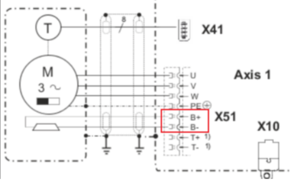
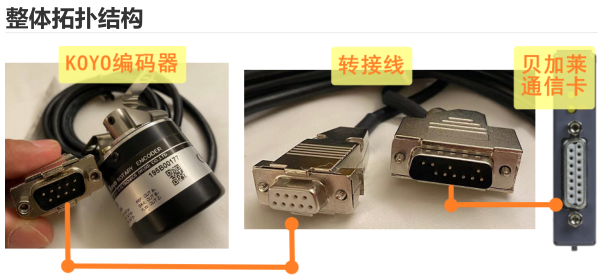

- [5001：目标位置超出正 SW 限制](#_5001%EF%BC%9A%E7%9B%AE%E6%A0%87%E4%BD%8D%E7%BD%AE%E8%B6%85%E5%87%BA%E6%AD%A3-sw-%E9%99%90%E5%88%B6)
- [5002：目标位置超过负 SW 限制](#_5002%EF%BC%9A%E7%9B%AE%E6%A0%87%E4%BD%8D%E7%BD%AE%E8%B6%85%E8%BF%87%E8%B4%9F-sw-%E9%99%90%E5%88%B6)
- [5003：达到正 SW 限制](#_5003%EF%BC%9A%E8%BE%BE%E5%88%B0%E6%AD%A3-sw-%E9%99%90%E5%88%B6)
	- [应用案例](#_%E5%BA%94%E7%94%A8%E6%A1%88%E4%BE%8B)
		- [2023.07.07](#_20230707)
- [5004：达到负 SW 限制](#_5004%EF%BC%9A%E8%BE%BE%E5%88%B0%E8%B4%9F-sw-%E9%99%90%E5%88%B6)
- [5005：无法开始运动：位置控制器未激活](#_5005%EF%BC%9A%E6%97%A0%E6%B3%95%E5%BC%80%E5%A7%8B%E8%BF%90%E5%8A%A8%EF%BC%9A%E4%BD%8D%E7%BD%AE%E6%8E%A7%E5%88%B6%E5%99%A8%E6%9C%AA%E6%BF%80%E6%B4%BB)
	- [应用案例](#_%E5%BA%94%E7%94%A8%E6%A1%88%E4%BE%8B)
		- [2022.01.11](#_20220111)
		- [2023.04.03](#_20230403)
		- [2023.06.28](#_20230628)
- [5006：无法开始运动：轴未参考](#_5006%EF%BC%9A%E6%97%A0%E6%B3%95%E5%BC%80%E5%A7%8B%E8%BF%90%E5%8A%A8%EF%BC%9A%E8%BD%B4%E6%9C%AA%E5%8F%82%E8%80%83)
- [5010：移入位置.不可能的方向：Pos。 限位开关关闭](#_5010%EF%BC%9A%E7%A7%BB%E5%85%A5%E4%BD%8D%E7%BD%AE%E4%B8%8D%E5%8F%AF%E8%83%BD%E7%9A%84%E6%96%B9%E5%90%91%EF%BC%9Apos-%E9%99%90%E4%BD%8D%E5%BC%80%E5%85%B3%E5%85%B3%E9%97%AD)
- [5011：移入负方向不可能：负限位开关关闭](#_5011%EF%BC%9A%E7%A7%BB%E5%85%A5%E8%B4%9F%E6%96%B9%E5%90%91%E4%B8%8D%E5%8F%AF%E8%83%BD%EF%BC%9A%E8%B4%9F%E9%99%90%E4%BD%8D%E5%BC%80%E5%85%B3%E5%85%B3%E9%97%AD)
- [5012：无法开始运动：停止斜坡激活](#_5012%EF%BC%9A%E6%97%A0%E6%B3%95%E5%BC%80%E5%A7%8B%E8%BF%90%E5%8A%A8%EF%BC%9A%E5%81%9C%E6%AD%A2%E6%96%9C%E5%9D%A1%E6%BF%80%E6%B4%BB)
	- [应用案例](#_%E5%BA%94%E7%94%A8%E6%A1%88%E4%BE%8B)
		- [2022.12.09](#_20221209)
		- [2023.03.23](#_20230323)
- [5015：不可能开始运动：归位程序激活](#_5015%EF%BC%9A%E4%B8%8D%E5%8F%AF%E8%83%BD%E5%BC%80%E5%A7%8B%E8%BF%90%E5%8A%A8%EF%BC%9A%E5%BD%92%E4%BD%8D%E7%A8%8B%E5%BA%8F%E6%BF%80%E6%B4%BB)
- [5016：无法写入参数：归位程序已激活](#_5016%EF%BC%9A%E6%97%A0%E6%B3%95%E5%86%99%E5%85%A5%E5%8F%82%E6%95%B0%EF%BC%9A%E5%BD%92%E4%BD%8D%E7%A8%8B%E5%BA%8F%E5%B7%B2%E6%BF%80%E6%B4%BB)
- [5017：归位程序模式不可能：位置控制器未激活](#_5017%EF%BC%9A%E5%BD%92%E4%BD%8D%E7%A8%8B%E5%BA%8F%E6%A8%A1%E5%BC%8F%E4%B8%8D%E5%8F%AF%E8%83%BD%EF%BC%9A%E4%BD%8D%E7%BD%AE%E6%8E%A7%E5%88%B6%E5%99%A8%E6%9C%AA%E6%BF%80%E6%B4%BB)
- [5018：无法进行归位程序：运动激活](#_5018%EF%BC%9A%E6%97%A0%E6%B3%95%E8%BF%9B%E8%A1%8C%E5%BD%92%E4%BD%8D%E7%A8%8B%E5%BA%8F%EF%BC%9A%E8%BF%90%E5%8A%A8%E6%BF%80%E6%B4%BB)
- [5019：归位参数超出有效范围](#_5019%EF%BC%9A%E5%BD%92%E4%BD%8D%E5%8F%82%E6%95%B0%E8%B6%85%E5%87%BA%E6%9C%89%E6%95%88%E8%8C%83%E5%9B%B4)
- [5020：无法进行归位程序：两个限位开关均已关闭](#_5020%EF%BC%9A%E6%97%A0%E6%B3%95%E8%BF%9B%E8%A1%8C%E5%BD%92%E4%BD%8D%E7%A8%8B%E5%BA%8F%EF%BC%9A%E4%B8%A4%E4%B8%AA%E9%99%90%E4%BD%8D%E5%BC%80%E5%85%B3%E5%9D%87%E5%B7%B2%E5%85%B3%E9%97%AD)
	- [应用案例](#_%E5%BA%94%E7%94%A8%E6%A1%88%E4%BE%8B)
		- [2022.10.10](#_20221010)
- [5021：限位开关关闭：此归位模式无方向改变](#_5021%EF%BC%9A%E9%99%90%E4%BD%8D%E5%BC%80%E5%85%B3%E5%85%B3%E9%97%AD%EF%BC%9A%E6%AD%A4%E5%BD%92%E4%BD%8D%E6%A8%A1%E5%BC%8F%E6%97%A0%E6%96%B9%E5%90%91%E6%94%B9%E5%8F%98)
- [5022：接收到第二个限位开关信号：未找到参考开关](#_5022%EF%BC%9A%E6%8E%A5%E6%94%B6%E5%88%B0%E7%AC%AC%E4%BA%8C%E4%B8%AA%E9%99%90%E4%BD%8D%E5%BC%80%E5%85%B3%E4%BF%A1%E5%8F%B7%EF%BC%9A%E6%9C%AA%E6%89%BE%E5%88%B0%E5%8F%82%E8%80%83%E5%BC%80%E5%85%B3)
- [5023: 当前运动方向接收到错误的限位开关信号](#_5023-%E5%BD%93%E5%89%8D%E8%BF%90%E5%8A%A8%E6%96%B9%E5%90%91%E6%8E%A5%E6%94%B6%E5%88%B0%E9%94%99%E8%AF%AF%E7%9A%84%E9%99%90%E4%BD%8D%E5%BC%80%E5%85%B3%E4%BF%A1%E5%8F%B7)
- [5025：无法设置带计数范围校正的归位偏移](#_5025%EF%BC%9A%E6%97%A0%E6%B3%95%E8%AE%BE%E7%BD%AE%E5%B8%A6%E8%AE%A1%E6%95%B0%E8%8C%83%E5%9B%B4%E6%A0%A1%E6%AD%A3%E7%9A%84%E5%BD%92%E4%BD%8D%E5%81%8F%E7%A7%BB)
	- [应用案例](#_%E5%BA%94%E7%94%A8%E6%A1%88%E4%BE%8B)
		- [2023.01.12](#_20230112)
- [5026：基本运动参数（覆写）超过速度限制值](#_5026%EF%BC%9A%E5%9F%BA%E6%9C%AC%E8%BF%90%E5%8A%A8%E5%8F%82%E6%95%B0%EF%BC%88%E8%A6%86%E5%86%99%EF%BC%89%E8%B6%85%E8%BF%87%E9%80%9F%E5%BA%A6%E9%99%90%E5%88%B6%E5%80%BC)
- [5027：基本运动参数（覆写）超过加速度限制值](#_5027%EF%BC%9A%E5%9F%BA%E6%9C%AC%E8%BF%90%E5%8A%A8%E5%8F%82%E6%95%B0%EF%BC%88%E8%A6%86%E5%86%99%EF%BC%89%E8%B6%85%E8%BF%87%E5%8A%A0%E9%80%9F%E5%BA%A6%E9%99%90%E5%88%B6%E5%80%BC)
- [5028：当前运动不是基础运动](#_5028%EF%BC%9A%E5%BD%93%E5%89%8D%E8%BF%90%E5%8A%A8%E4%B8%8D%E6%98%AF%E5%9F%BA%E7%A1%80%E8%BF%90%E5%8A%A8)
- [5029：触发器被忽略 - 剩余距离超过 SW 限制](#_5029%EF%BC%9A%E8%A7%A6%E5%8F%91%E5%99%A8%E8%A2%AB%E5%BF%BD%E7%95%A5---%E5%89%A9%E4%BD%99%E8%B7%9D%E7%A6%BB%E8%B6%85%E8%BF%87-sw-%E9%99%90%E5%88%B6)
- [5032：加速度太低 - 制动距离超过正 SW 限制](#_5032%EF%BC%9A%E5%8A%A0%E9%80%9F%E5%BA%A6%E5%A4%AA%E4%BD%8E---%E5%88%B6%E5%8A%A8%E8%B7%9D%E7%A6%BB%E8%B6%85%E8%BF%87%E6%AD%A3-sw-%E9%99%90%E5%88%B6)
- [5033：加速度太低 - 制动距离超过负 SW 限制](#_5033%EF%BC%9A%E5%8A%A0%E9%80%9F%E5%BA%A6%E5%A4%AA%E4%BD%8E---%E5%88%B6%E5%8A%A8%E8%B7%9D%E7%A6%BB%E8%B6%85%E8%BF%87%E8%B4%9F-sw-%E9%99%90%E5%88%B6)
- [5034：无法进行归位程序：编码器错误](#_5034%EF%BC%9A%E6%97%A0%E6%B3%95%E8%BF%9B%E8%A1%8C%E5%BD%92%E4%BD%8D%E7%A8%8B%E5%BA%8F%EF%BC%9A%E7%BC%96%E7%A0%81%E5%99%A8%E9%94%99%E8%AF%AF)
	- [应用案例](#_%E5%BA%94%E7%94%A8%E6%A1%88%E4%BE%8B)
		- [2022.09.13](#_20220913)
		- [2022.09.14](#_20220914)
- [5035：未检测到参考标记](#_5035%EF%BC%9A%E6%9C%AA%E6%A3%80%E6%B5%8B%E5%88%B0%E5%8F%82%E8%80%83%E6%A0%87%E8%AE%B0)
- [5036：超过加速停止限制](#_5036%EF%BC%9A%E8%B6%85%E8%BF%87%E5%8A%A0%E9%80%9F%E5%81%9C%E6%AD%A2%E9%99%90%E5%88%B6)
- [5037：无法使用归位程序模式：编码器类型错误](#_5037%EF%BC%9A%E6%97%A0%E6%B3%95%E4%BD%BF%E7%94%A8%E5%BD%92%E4%BD%8D%E7%A8%8B%E5%BA%8F%E6%A8%A1%E5%BC%8F%EF%BC%9A%E7%BC%96%E7%A0%81%E5%99%A8%E7%B1%BB%E5%9E%8B%E9%94%99%E8%AF%AF)
- [5038：无法使用归位程序模式：恢复数据无效](#_5038%EF%BC%9A%E6%97%A0%E6%B3%95%E4%BD%BF%E7%94%A8%E5%BD%92%E4%BD%8D%E7%A8%8B%E5%BA%8F%E6%A8%A1%E5%BC%8F%EF%BC%9A%E6%81%A2%E5%A4%8D%E6%95%B0%E6%8D%AE%E6%97%A0%E6%95%88)
- [5039：功能不可用：编码器错误](#_5039%EF%BC%9A%E5%8A%9F%E8%83%BD%E4%B8%8D%E5%8F%AF%E7%94%A8%EF%BC%9A%E7%BC%96%E7%A0%81%E5%99%A8%E9%94%99%E8%AF%AF)
- [5043：无法使用归位程序模式：补偿激活](#_5043%EF%BC%9A%E6%97%A0%E6%B3%95%E4%BD%BF%E7%94%A8%E5%BD%92%E4%BD%8D%E7%A8%8B%E5%BA%8F%E6%A8%A1%E5%BC%8F%EF%BC%9A%E8%A1%A5%E5%81%BF%E6%BF%80%E6%B4%BB)
- [5044：无法使用归位程序模式：需要改变方向](#_5044%EF%BC%9A%E6%97%A0%E6%B3%95%E4%BD%BF%E7%94%A8%E5%BD%92%E4%BD%8D%E7%A8%8B%E5%BA%8F%E6%A8%A1%E5%BC%8F%EF%BC%9A%E9%9C%80%E8%A6%81%E6%94%B9%E5%8F%98%E6%96%B9%E5%90%91)
- [5101：补偿齿轮：超出限值](#_5101%EF%BC%9A%E8%A1%A5%E5%81%BF%E9%BD%BF%E8%BD%AE%EF%BC%9A%E8%B6%85%E5%87%BA%E9%99%90%E5%80%BC)
- [5102：每个周期的凸轮变化太多（主轴周期太短）](#_5102%EF%BC%9A%E6%AF%8F%E4%B8%AA%E5%91%A8%E6%9C%9F%E7%9A%84%E5%87%B8%E8%BD%AE%E5%8F%98%E5%8C%96%E5%A4%AA%E5%A4%9A%EF%BC%88%E4%B8%BB%E8%BD%B4%E5%91%A8%E6%9C%9F%E5%A4%AA%E7%9F%AD%EF%BC%89)
	- [应用案例](#_%E5%BA%94%E7%94%A8%E6%A1%88%E4%BE%8B)
		- [2022.08.10](#_20220810)
- [5107：无法启动凸轮耦合：参数超出有效范围](#_5107%EF%BC%9A%E6%97%A0%E6%B3%95%E5%90%AF%E5%8A%A8%E5%87%B8%E8%BD%AE%E8%80%A6%E5%90%88%EF%BC%9A%E5%8F%82%E6%95%B0%E8%B6%85%E5%87%BA%E6%9C%89%E6%95%88%E8%8C%83%E5%9B%B4)
- [5110：凸轮耦合中止：缺少循环设定位置](#_5110%EF%BC%9A%E5%87%B8%E8%BD%AE%E8%80%A6%E5%90%88%E4%B8%AD%E6%AD%A2%EF%BC%9A%E7%BC%BA%E5%B0%91%E5%BE%AA%E7%8E%AF%E8%AE%BE%E5%AE%9A%E4%BD%8D%E7%BD%AE)
	- [应用案例](#_%E5%BA%94%E7%94%A8%E6%A1%88%E4%BE%8B)
		- [2022.01.10](#_20220110)
- [5111：凸轮耦合中止：编码器错误](#_5111%EF%BC%9A%E5%87%B8%E8%BD%AE%E8%80%A6%E5%90%88%E4%B8%AD%E6%AD%A2%EF%BC%9A%E7%BC%96%E7%A0%81%E5%99%A8%E9%94%99%E8%AF%AF)
	- [应用案例](#_%E5%BA%94%E7%94%A8%E6%A1%88%E4%BE%8B)
		- [2023.01.12](#_20230112)
- [5115：无法执行重新启动命令：凸轮自动机Automat未激活](#_5115%EF%BC%9A%E6%97%A0%E6%B3%95%E6%89%A7%E8%A1%8C%E9%87%8D%E6%96%B0%E5%90%AF%E5%8A%A8%E5%91%BD%E4%BB%A4%EF%BC%9A%E5%87%B8%E8%BD%AE%E8%87%AA%E5%8A%A8%E6%9C%BAautomat%E6%9C%AA%E6%BF%80%E6%B4%BB)
- [5202：凸轮控制：开关位置不按升序排列](#_5202%EF%BC%9A%E5%87%B8%E8%BD%AE%E6%8E%A7%E5%88%B6%EF%BC%9A%E5%BC%80%E5%85%B3%E4%BD%8D%E7%BD%AE%E4%B8%8D%E6%8C%89%E5%8D%87%E5%BA%8F%E6%8E%92%E5%88%97)
- [5300：上传的数据块不可用](#_5300%EF%BC%9A%E4%B8%8A%E4%BC%A0%E7%9A%84%E6%95%B0%E6%8D%AE%E5%9D%97%E4%B8%8D%E5%8F%AF%E7%94%A8)
- [5301：无法启动凸轮Automat联动：参数超出有效范围](#_5301%EF%BC%9A%E6%97%A0%E6%B3%95%E5%90%AF%E5%8A%A8%E5%87%B8%E8%BD%AEautomat%E8%81%94%E5%8A%A8%EF%BC%9A%E5%8F%82%E6%95%B0%E8%B6%85%E5%87%BA%E6%9C%89%E6%95%88%E8%8C%83%E5%9B%B4)
- [5302：无法写入参数：凸轮Automat激活](#_5302%EF%BC%9A%E6%97%A0%E6%B3%95%E5%86%99%E5%85%A5%E5%8F%82%E6%95%B0%EF%BC%9A%E5%87%B8%E8%BD%AEautomat%E6%BF%80%E6%B4%BB)
- [5303：索引处的凸轮数据不可用](#_5303%EF%BC%9A%E7%B4%A2%E5%BC%95%E5%A4%84%E7%9A%84%E5%87%B8%E8%BD%AE%E6%95%B0%E6%8D%AE%E4%B8%8D%E5%8F%AF%E7%94%A8)
	- [应用案例](#_%E5%BA%94%E7%94%A8%E6%A1%88%E4%BE%8B)
		- [2022.07.28](#_20220728)
- [5304：凸轮数据格式错误](#_5304%EF%BC%9A%E5%87%B8%E8%BD%AE%E6%95%B0%E6%8D%AE%E6%A0%BC%E5%BC%8F%E9%94%99%E8%AF%AF)
	- [应用案例](#_%E5%BA%94%E7%94%A8%E6%A1%88%E4%BE%8B)
		- [2023.01.12](#_20230112)
- [5311：凸轮自动机Automat：事件导致未初始化状态](#_5311%EF%BC%9A%E5%87%B8%E8%BD%AE%E8%87%AA%E5%8A%A8%E6%9C%BAautomat%EF%BC%9A%E4%BA%8B%E4%BB%B6%E5%AF%BC%E8%87%B4%E6%9C%AA%E5%88%9D%E5%A7%8B%E5%8C%96%E7%8A%B6%E6%80%81)
- [5315：下载错误：凸轮自动机或功能块正在使用凸轮数据](#_5315%EF%BC%9A%E4%B8%8B%E8%BD%BD%E9%94%99%E8%AF%AF%EF%BC%9A%E5%87%B8%E8%BD%AE%E8%87%AA%E5%8A%A8%E6%9C%BA%E6%88%96%E5%8A%9F%E8%83%BD%E5%9D%97%E6%AD%A3%E5%9C%A8%E4%BD%BF%E7%94%A8%E5%87%B8%E8%BD%AE%E6%95%B0%E6%8D%AE)
- [5316：事件类型无法进入补偿齿轮](#_5316%EF%BC%9A%E4%BA%8B%E4%BB%B6%E7%B1%BB%E5%9E%8B%E6%97%A0%E6%B3%95%E8%BF%9B%E5%85%A5%E8%A1%A5%E5%81%BF%E9%BD%BF%E8%BD%AE)
- [5319：状态 0 不允许凸轮数据](#_5319%EF%BC%9A%E7%8A%B6%E6%80%81-0-%E4%B8%8D%E5%85%81%E8%AE%B8%E5%87%B8%E8%BD%AE%E6%95%B0%E6%8D%AE)
- [5329：没有有效的凸轮数据](#_5329%EF%BC%9A%E6%B2%A1%E6%9C%89%E6%9C%89%E6%95%88%E7%9A%84%E5%87%B8%E8%BD%AE%E6%95%B0%E6%8D%AE)
- [📋回到总览页](#_%E5%9B%9E%E5%88%B0%E6%80%BB%E8%A7%88%E9%A1%B5)

# 5001：目标位置超出正 SW 限制

- **描述**：
    - 如果请求的目标位置大于正 SW 限制，则运动开始时的响应错误。
    - 如果当前位置已经超出正 SW 限制，则当正向运动处于活动状态时的响应错误。
- **反应**：
    - 不执行请求的移动开始。
    - 这不会中断主动运动。
- **原因/补救措施**：
    - 软件限制配置不正确。
    - 目标位置不正确。
    - 错误的移动命令。
    - 对于无限制运动范围的“无限轴”或“循环轴”，也可以禁用 (SGEN_SW_END_IGNORE) 的软件限制监视器。

# 5002：目标位置超过负 SW 限制

- **描述**：
    - 如果请求的目标位置小于负 SW 限制，则运动开始时的响应错误。
    - 如果当前位置已经超出 SW 负限制，则当负方向运动处于活动状态时会出现响应错误。
- **反应**：
    - 查看错误编号 [5001](#5001目标位置超出正-sw-限制).
- **原因/补救措施**：
    - 查看错误编号 [5001](#5001目标位置超出正-sw-限制).

# 5003：达到正 SW 限制

- **描述**：
    - 如果已达到正 SW 限制的制动范围且设置速度为 0，则运动激活时的运行错误。
- **反应**：
    - 运动被停用。 控制器保持开启状态。
- **原因/补救措施**：
    - 没有绝对目标位置的错误运动指令（正向运动）。
    - 正 SW 限制配置不正确。
    - 凸轮自动机：对于轴限制 AXLIM_A2_POS 而言，设定值生成过于动态（速度或加速度太高），因此超出了正 SW 限制上的“制动抛物线”范围。
    - 另请参阅错误编号 [5001](#5001目标位置超出正-sw-限制).

## 应用案例

### 2023.07.07

- **现象** 使用 MpAxisBasic 中的 Move Velocity 指令，其中 Position 为 0，速度与加速度为 0.001，运动后报错 29216,5003
- **原因** 速度、加速度太小，0.001相当于0 加大两个参数后解决

# 5004：达到负 SW 限制

- **描述**：
    - 如果已达到负 SW 限制的制动范围且设置速度为 0，则运动激活时的运行错误。
- **反应**：
    - 运动被停用。控制器保持开启状态。
- **原因/补救措施**：
    - 查看错误编号 [5003](#5003达到正-sw-限制).
    - 负 SW 限制配置不正确。
    - 凸轮自动机：对于轴限制 AXLIM_A2_NEG 而言，设定值生成过于动态（速度或加速度太高），因此超出了负 SW 限制上的“制动抛物线”范围。
    - 另请参阅错误编号 [5001](#5001目标位置超出正-sw-限制).

# 5005：无法开始运动：位置控制器未激活

- **描述**：
    - 如果位置控制器未激活，则开始运动时的响应错误。
- **反应**：
    - 不执行请求的移动开始。
- **原因/补救措施**：
    - 缺少“打开控制器”命令。
    - 缺少“控制器开启”状态的请求（延迟步骤）。
    - 由于驱动器错误，控制器已关闭。
    - 控制器在没有位置控制的模式下被激活，例如 速度控制。 检查 CONTROLLER_MODE。
    - 启用输入 PCTRL_ENABLE_PARID 停用位置控制.

## 应用案例

### 2022.01.11

- 伺服报警5005. 4005复不了位，现场用的伺服是 ACOPOS 1045，换成 ACOPO 1090就可以复位了。早期换伺服驱动器选1045主要替换客户原来的设备，使用中没发现什么问题，但在后来终端客户的需求中速度提高，1045 略显过载，后期设备全部改为了 1090 的驱动器此问题解决。

### 2023.04.03

- **现象** 现场运行很多天的 ACOPOS P3设备，先报5005，后面重复断电上电一直报6030，且无法复位
- **原因** 机械振动导致刹车线 B+ B-存在虚接的现象
- 
- **解决方式** 把电机接线的刹车线 B+ B-重新接线，端子上拆下来线重新接。

### 2023.06.28

- **现象** 4005: Controller cannot be switched on: Drive in error state 5005: Start of movement not possible: Position controller inactive 6048: Motor holding brake movement monitor: Position error too large 9070: Motor temperature model: Stop limit exceeded 41031: Junction temperature model: Warning limit exceeded 41070: Motor temperature model: Warning limit exceeded 29203: Drive is not ready. 29209: The drive is in error state. 29217: Invalid input parameter
- **原因** 零位参数不对引起过载，客户更换了模具，但是没有重新走回零的流程，导致参数错误，机械卡主了，当前顶住位置距离零位还有1mm 以上因此当伺服使能，由于不在零位位置，所以向零位运动，由于已机械顶住，所以动态偏差 LagError 一直有1mm 以上，就一直以最大扭矩输出，造成电机温度超过 70 度以上，驱动器的散热片温度高达 70 度，IGBT 温度高达 133 度。持续较长时间后就报警而 POWER OFF，进行复位后，又进入以上死循环。
- **优化方式** 使能后，走到零位，如果持续1秒超过+5Nm 或小于-5Nm，则把 HomePosition 进行偏移，再进行 MC_HOME 操作。

# 5006：无法开始运动：轴未参考

- **描述**：
    - 如果起始位置无效，则开始运动时的响应错误。
- **反应**：
    - 不执行请求的移动开始。
- **原因/补救措施**：
    - 缺少“引用”命令。
    - 缺少“参考已完成”的状态请求（延迟步骤）。
    - 引用过程因错误而中止。
    - 也可以为无限制运动范围的“无限轴”或“循环轴”停用 (SGEN_SW_END_IGNORE) 的“参考”监视器.

# 5010：移入位置.不可能的方向：Pos。 限位开关关闭

- **描述**：
    - 开始运动时的响应错误。正向限位开关闭合，请求的运动正向正向移动。
- **反应**：
    - 不执行请求的移动开始。
- **原因/补救措施**：
    - 运动指令或目标位置不正确。
    - 另请参阅错误编号 [4010](#4010控制器无法开启两个限位开关都关闭).

# 5011：移入负方向不可能：负限位开关关闭

- **描述**：
    - 开始运动时的响应错误。负限位开关闭合，请求的运动正在向负方向移动。
- **反应**：
    - 另请参阅错误编号 [5010](#5010移入位置不可能的方向pos-限位开关关闭).
- **原因/补救措施**：
    - 另请参阅错误编号 [5010](#5010移入位置不可能的方向pos-限位开关关闭).

# 5012：无法开始运动：停止斜坡激活

- **描述**：
    - 如果运动停止处于活动状态，则开始运动时的响应错误。
- **反应**：
    - 不执行请求的移动开始。
- **原因/补救措施**：
    - 停止命令后缺少状态请求（延迟步骤）。
    - 运动停止由驱动器错误触发。
    - 在“停止基础运动”命令之后，也可以在减速斜坡中开始运动.

## 应用案例

### 2022.12.09

- 放卷伺服报错5012。虚轴控制有问题，通过在虚轴控制的地方添加延迟，确保虚轴停下来之后再启动新的运动

### 2023.03.23

- **现象** 放卷纠偏不正常，虚轴报错5012
- **原因** 放卷纠偏的虚轴是通过 service 通道操作的，这个里面的延迟比较大，所以在纠偏的时候考虑延迟，加了许多时间延迟。
- **解决方式** 5012是说虚轴在停下来的过程中，又给了新的运动指令。由于没有单独的虚轴控制程序，这里无法对虚轴的运动状态进行监控。只能加个延迟来确定虚轴已经停下来了。这个后面还得改成单独的轴控

# 5015：不可能开始运动：归位程序激活

- **描述**：
    - 如果归位程序处于活动状态，则使用移动启动命令响应错误。
- **反应**：
    - 不执行请求的移动开始。
    - 这不会中断归位过程。
- **原因/补救措施**：
    - 缺少“参考已完成”的状态请求（延迟步骤）。
    - 可以通过移动停止来结束归位程序.

# 5016：无法写入参数：归位程序已激活

- **描述**：
    - 如果归位程序处于活动状态，则写入参数时出现响应错误。不能对归位参数进行“在线”更改。
- **反应**：
    - 不接受参数值。
    - 这不会中断主动归位过程。
- **原因/补救措施**：
    - 在“开始归位程序”命令之后，参数写入太晚了。
    - -> 检查程序顺序和状态请求.

# 5017：归位程序模式不可能：位置控制器未激活

- **描述**：
    - 使用“开始归位程序”命令响应错误。已定义归位模式，该模式需要运动，因此仅在控制处于活动状态时才可用（例如归位模式 ncSWITCH_GATE）。
- **反应**：
    - 未启动归位程序。
    - “归位有效”状态被重置。
- **原因/补救措施**：
    - 不正确的归位模式。
    - 带有参考脉冲的归位模式 ncDIRECT。
    - 缺少“打开控制器”命令。
    - 缺少“控制器开启”状态的请求（延迟步骤）。
    - 由于驱动器错误，控制器已关闭.

# 5018：无法进行归位程序：运动激活

- **描述**：
    - 如果运动处于活动状态，则使用“开始归位程序”命令响应错误。主动运动期间不支持“即时”归位。
- **反应**：
    - 查看错误编号 [5017](#5017归位程序模式不可能位置控制器未激活).
    - 当前活动的运动不会中断。
- **原因/补救措施**：
    - 移动停止完成丢失。
    - 缺少“移动完成”状态的请求（延迟步骤）.

# 5019：归位参数超出有效范围

- **描述**：
    - 写入归位参数或使用“开始归位程序”命令时出现响应错误。检测到无效配置。
- **反应**：
    - 不接受参数值。
    - 当“开始归位程序”命令时：请参阅错误编号 [5017](#5017归位程序模式不可能位置控制器未激活).
- **原因/补救措施**：
    - 根据附加信息中的参数 ID.

# 5020：无法进行归位程序：两个限位开关均已关闭

- **描述**：
    - 使用“开始归位程序”命令响应错误。正负限位开关闭合。
- **反应**：
    - 查看错误编号 [5017](#5017归位程序模式不可能位置控制器未激活).
- **原因/补救措施**：
    - 查看错误编号 [4010](#4010控制器无法开启两个限位开关都关闭).

## 应用案例

### 2022.10.10

- 急停按钮动作：急停按钮动作触发限位报警，急停消除后自动复位。

# 5021：限位开关关闭：此归位模式无方向改变

- **描述**：
    - 定义的归位模式不允许在硬件限制下改变方向。
    - 如果在给出“开始归位程序”命令时启动方向上的限位开关已经关闭 (ncABS_SWITCH)，则会出现响应错误。
    - 如果出现限位开关信号（ncABS_SWITCH、ncEND_SWITCH），则在归位过程中出现运行错误。
- **反应**：
    - 当“开始归位程序”命令时：请参阅错误编号 [5017](#5017归位程序模式不可能位置控制器未激活).
    - 归位程序时：参见错误编号 [5035](#5035未检测到参考标记).
- **原因/补救措施**：
    - 在搜索绝对参考开关的边缘时达到了硬件限制。
    - -> 参考开关的硬件错误（断线、线路端接、接线错误、电源电压）。
    - 参考开关安装得离限位开关太近。
    - 另请参阅错误编号 [4010](#4010控制器无法开启两个限位开关都关闭).

# 5022：接收到第二个限位开关信号：未找到参考开关

- **描述**：
    - 如果限位开关信号已经出现两次，则在归位过程中出现运行错误。
- **反应**：
    - 查看错误编号 [5035](#5035未检测到参考标记).
- **原因/补救措施**：
    - 在搜索参考开关边沿或参考脉冲时，覆盖了正负端开关之间的整个范围。
        - -> 参考开关或编码器的硬件错误（断线、线路端接、接线错误、电源电压）。
    - 由于“弹跳”而在限位开关处误触发。
    - 另请参阅错误编号 [4010](#4010控制器无法开启两个限位开关都关闭).

# 5023: 当前运动方向接收到错误的限位开关信号

- **描述**：
    - 如果在正方向上达到负限位开关信号或在负方向上达到正限位开关信号，则在归位过程中会出现运行错误。
- **反应**：
    - 查看错误编号 [5035](#5035未检测到参考标记).
- **原因/补救措施**：
    - 参考开关安装得离限位开关太近。
    - 另请参阅错误编号 [4010](#4010控制器无法开启两个限位开关都关闭).

# 5025：无法设置带计数范围校正的归位偏移

- **描述**：
    - 使用“开始归位程序”命令响应错误。归位模式定义为计数范围校正 (+ncCORRECTION)。无法执行归位偏移的自动校正，因为溢出的编码器计数范围在整个运动范围内不是唯一的。
- **反应**：
    - 查看错误编号 [5017](#5017归位程序模式不可能位置控制器未激活).
- **原因/补救措施**：
    - 最大编码器计数范围小于 SW 限制之间的移动范围。
        - -> SW 限制之间的差异太大。 负载缩放（电机每转的单位）太小。没有绝对编码器（增量编码器），编码器计数范围太小（例如只有“单圈”）。
    - 测试限制超出了 Integer32 计数范围的一半。
        - -> SW 限制或负载缩放的值定义太大.

## 应用案例

### 2023.01.12

- 迈信 EP5伺服测试 SDC 轴寻零使用的功能块是 MC_Home，并使用 mcHOME_ABSOLUTE_CORR 模式： 这种模式跟 mcHOME_ABSOLUTE 类似，应对编码器圈数溢出情况下的位置恢复。对于 SDC 轴，若想使用该种寻零方式，必须要在参数表中设置 ID64225，其数值可以是 DINT 类型的数据的最大值。如果不对 ID64225进行设置，则寻零时会报错5025。
- 
- 但是在实际测试中发现：在这种模式下完成寻零后，如果在运行过程中发生绝对值编码器圈数溢出的情况，例如从65535到0或者从0到65535则SDC轴报错7033。目前这个错误还无法通过参数设置避免，所以这种模式在SDC轴中并不实用

# 5026：基本运动参数（覆写）超过速度限制值

- **描述**：
    - 开始运动或写入速度倍率时出现响应错误。基础运动参数的速度值乘以倍率大于对应的轴限制。
- **反应**：
    - 不执行请求的运动开始，并且不接受速度覆盖。
    - 这不会中断主动运动。
- **原因/补救措施**：
    - 速度覆写参数大于 100%

# 5027：基本运动参数（覆写）超过加速度限制值

- **描述**：
    - 开始运动或写入加速度倍率时出现响应错误。基础运动参数的加速度乘以倍率大于相应的轴限制。
- **反应**：
    - 不执行请求的运动开始，并且不接受加速度覆盖。
    - 这不会中断主动运动。
- **原因/补救措施**：
    - 加速度参数覆写大于 100%.

# 5028：当前运动不是基础运动

- **描述**：
    - 如果活动运动不是基础运动，则使用“停止基础运动”命令的响应错误。
- **反应**：
    - 请求的命令未执行。
- **原因/补救措施**：
    - 例如，凸轮自动装置或“外部循环设定值external, cyclic set values”操作模式处于激活状态。
    - -> 任何移动都允许使用“停止移动”命令.

# 5029：触发器被忽略 - 剩余距离超过 SW 限制

- **描述**：
    - 在“触发后停止”模式下激活基础运动时出现运行时错误。触发事件发生并且目标位置（锁定位置加上剩余距离）在 SW 限制之外。
- **反应**：
    - 触发事件被忽略，运动保持活动状态。
- **原因/补救措施**：
    - 剩余距离过大或 SW 限制定义不正确。
    - 由于先前的归位程序，设置了错误的位置（触发传感器的参考系统）。
    - 触发传感器太靠近移动范围的末端。
    - 实际触发边缘（印刷标记、产品边缘）失败并在后续不希望的触发边缘触发。
    - 另请参阅错误编号 [5001](#5001目标位置超出正-sw-限制).

# 5032：加速度太低 - 制动距离超过正 SW 限制

- **描述**：
    - 开始运动或写入加速度倍率时出现响应错误。运动处于活动状态，加速度降低到制动距离无法保持到正 SW 限制的程度。
- **反应**
    - 不执行请求的运动开始，并且不接受加速度覆盖。
    - 这不会中断主动运动。
- **原因/补救措施**：
    - 在正 SW 限制处以绝对目标位置移动，并在目标前不久开始降低加速度参数的新移动。
    - 另请参阅错误编号 [5001](#5001目标位置超出正-sw-限制).

# 5033：加速度太低 - 制动距离超过负 SW 限制

- **描述**：
    - 开始运动或写入加速度倍率时出现响应错误。运动处于活动状态，加速度降低到制动距离无法保持到负 SW 限制的程度。
- **反应**：
    - 查看错误编号 [5032](#5032加速度太低---制动距离超过正-sw-限制).
- **原因/补救措施**：
    - 在负 SW 限制处以绝对目标位置移动，并在目标前不久开始降低加速度参数的新移动。
    - 另请参阅错误编号 [5001](#5001目标位置超出正-sw-限制).

# 5034：无法进行归位程序：编码器错误

- **描述**：
    - 使用“开始归位程序”命令响应错误。对应的编码器处于错误状态。
- **反应**：
    - 查看错误编号 [5017](#5017归位程序模式不可能位置控制器未激活).
- **原因/补救措施**：
    - 查看错误编号 [6057](#6057位置环控制器负载编码器错误).

## 应用案例

### 2022.09.13

- **现象** 5034、7041循环提示报警。经过检查，为外接编码器的转接线缆缺 pin 问题，导致外接编码器不能正常使能工作。（项目中跟随第三方编码器主轴，因此需要 Home 外接编码器 MC_BR_HomeAcpEncoder）
    - 
- **原因** 驱动器 ACOPOS 使用外接编码器8AC123.60-1，使用转接线，转接线针脚缺失，导致编码器卡的 PIN 14,15没有接线
    - 
    - 
- **解决方式** 更换外接编码器转接线缆

### 2022.09.14

- **现象**：错误号39005、39004、5034。经过检查，发现电机进水，导致了电机中编码器损坏。
- **解决方式**：更换电机

# 5035：未检测到参考标记

- **描述**：
    - 使用距离编码参考标记进行参考时出现运行时错误。移动范围已经超过了一般距离，没有出现两个标记脉冲（归位模式 DCM）。
- **反应**：
    - 归位过程中止。
    - “归位有效”状态不会复位。
- **原因/补救措施**：
    - 查看错误编号 [7047](#7047无效的参考标记距离).

# 5036：超过加速停止限制

- **描述**：
    - 当 cam automat 处于活动状态或处于操作模式时的运行错误，“循环，外部设置值”。设定位置的加速度超过定义的最大值 (LIM_A_SET_STOP)。
- **反应**：
    - 默认设置 STOP_ERR_DECEL_RAMP=ncA_LIMIT：
    - 通过轴限制和关闭控制器停止运动。
    - STOP_ERR_DECEL_RAMP 的不同设置见错误号 [4007](#4007超出滞后错误停止限制).
- **原因/补救措施**：
    - 当活动凸轮自动运行时：
        - 最大值 (LIM_A_SET_STOP) 太小。
    - 设置值生成过于动态。 速度和加速度过高的原因是：
        - 覆盖附加轴上的附加运动。
        - 具有“粗”分辨率的外部编码器作为主轴。
        - 形成曲线时不考虑主运动的动态。
        - 具有“未知”运动动态的外部大师。
        - 乘法因子的在线变化。
        - 查看错误编号 [5101](#5101补偿齿轮超出限值) 用于补偿齿轮。
        - 凸轮自动机终止于斜率不等于 0 (EVENT_ST_INDEX=255) 的曲线。
        - 凸轮自动机从活动的基础运动中移动的主件直接启动。
    - 由于以下原因设置位置跳跃：
        - 参考主轴或附加轴。
        - 在附加轴上引起跳跃的值变化。
        - 凸轮之间和多项式内的小位置偏移。 查看错误编号 [37111](#37111凸轮数据多项式值-yxn-与从站周期之间的差异).
        - 将主轴耦合到循环网络位置时出现网络错误。
        - 主轴中的滞后错误停止（设定值跳转到实际值）。
    - 在操作模式下，“循环，外部设定值”：
        - 最大值 (LIM_A_SET_STOP) 太小。
        - 设置值生成过于动态。 速度和加速度太高。
        - 错误的设定值生成。
        - 在控制器开启后或跟随驱动控制的运动（归位）后，实际/设定值设置错误。
        - 附加偏移量 (CYC_ADD_SET_PARID) 的跳转导致值更改。
        - 网络错误

# 5037：无法使用归位程序模式：编码器类型错误

- **描述**：
    - 使用“开始归位程序”命令响应错误。定义了归位模式 (ncRESTORE_POS)，它需要绝对编码器测量系统 - 至少在一转内。
- **反应**：
    - 未启动归位程序。
    - “归位有效”状态被重置。
- **原因/补救措施**：
    - 不正确的归位模式。
    - 编码器类型不正确。
    - -> 使用绝对编码器或至少单圈编码器代替增量编码器.

# 5038：无法使用归位程序模式：恢复数据无效

- **描述**：
    - 使用“开始归位程序”命令响应错误。配置的归位模式 (ncRESTORE_POS) 从永久存储区恢复单元位置。该存储区为空或包含无效数据。
- **反应**：
    - 未启动归位程序。
    - “归位有效”状态被重置。
- **原因/补救措施**：
    - 永久存储区中没有数据：
        - 新的 ACOPOS-HW
        - 缺少激活 HOMING_RESTORE_MODE=1
    - 永久存储区的数据与编码器/单元配置不匹配：
        - 编码器已更改
        - 配置不正确或已更改（ENCOD_COUNT_DIR、SCALE_LOAD_UNITS、SCALE_LOAD_MOTREV、SCALE_ENCOD_INCR）
    - 永久存储区的数据被破坏（校验和）
        - -> 使用“正常”归位程序校准轴，这意味着除 ncRESTORE_POS 之外的归位模式

# 5039：功能不可用：编码器错误

- **描述**：
    - 激活需要编码器数据的功能时出现响应错误。对应的编码器处于错误状态。
- **反应**：
    - 查看错误编号 [5017](#5017归位程序模式不可能位置控制器未激活).
- **原因/补救措施**：
    - 查看错误编号 [6057](#6057位置环控制器负载编码器错误).

# 5043：无法使用归位程序模式：补偿激活

- **描述**：
    - 如果补偿处于活动状态，则使用“开始归位程序”命令响应错误。
- **反应**：
    - 未启动归位程序。
    - “归位有效”状态被重置。
- **原因/补救措施**：
    - 补偿激活时不允许归位。
    - 失去电机位置和补偿位置之间的唯一映射.

# 5044：无法使用归位程序模式：需要改变方向

- **描述**：
    - 使用“开始归位程序”命令响应错误。
    - 定义了一种归位模式，它需要改变方向，并且设置了“不改变方向”的模式控制位。
- **反应**：
    - 未启动归位程序。
    - “归位有效”状态被重置。
- **原因/补救措施**：
    - 不正确的归位模式。
    - 归位模式控制位“不改变方向”（固定方向）。
    - 归位模式控制位“开始方向”和“触发方向”不同.

# 5101：补偿齿轮：超出限值

- **描述**：
    - 在计算补偿齿轮期间凸轮自动装置处于活动状态时出现运行错误。当前参数、连接曲线和补偿路径的组合无法维持速度或加速度限制。另一方面，“有效”主/从补偿路径取决于补偿模式、补偿路径参数、倍增因子和曲线周期。仅在启动或重新启动后注册一次。
- **反应**：
    - 补偿是使用过量值计算的。
    - 例如，最大从速度增加了进入或退出速度。
    - 凸轮自动运动保持激活。 但是，可能会出现后续错误（例如错误编号 [4007](#4007超出滞后错误停止限制)).
- **原因/补救措施**：
    - “有效”主轴补偿路径太短。 另请参阅错误编号 [37108](#37108计算出的主轴补偿距离限制为最小值).
    - 与 AUT_COMP_SL_V_MIN 相关的“有效”主轴补偿路径太长。
    - “有效”从补偿路径太短或太长。 另请参阅错误编号 [37101](#37101从轴上计算的补偿距离限制为最大值) 和
    - 错误编号 37102。
    - 主轴AUT_MA_V_MAX 最大速度值太大。
    - 与 AUT_COMP_SL_V_MIN 相关的主轴 AUT_MA_V_MAX 的最大速度值太小。
    - “旧”状态曲线的退出斜率太大。
    - “新”状态曲线的入口斜率太大（从轴的倍增系数）。
    - 最大从速度值 AUT_COMP_SL_V_MAX 太小。
    - 最小从站速度值 AUT_COMP_SL_V_MIN 太大。
    - 第一部分补偿 AUT_COMP_SL_A1_MAX 中的最大从加速度值太小。
    - 第二部分补偿的最大从加速度值 AUT_COMP_SL_A2_MAX 太小.

# 5102：每个周期的凸轮变化太多（主轴周期太短）

- **描述**：
    - 如果连续扫描周期（计算周期 400us）每次都需要更改凸轮，则凸轮自动机处于活动状态时会出现运行时错误。一个扫描周期中最多执行一次凸轮变换。如果这个最大的“变化频率”不再足够，那么凸轮就会失去形状，主从之间的位置关系就会丢失。
- **反应**
    - 查看错误编号 [4008](#4008到达正限位开关).
- **原因/补救措施**：
    - 主轴或附加轴的速度太高。
    - 主轴或附加轴中的位置跳跃。
    - 凸轮或补偿齿轮的主周期太短。
    - 主乘法因子太小。
    - 具有 ncAT_ONCE 属性的状态变化事件发生得太频繁。
    - 另请参阅错误编号 [5036](#5036超过加速停止限制).

## 应用案例

### 2022.08.10

- **问题描述**：伺服上电报警5102 问题原因：MC_BR_AutControl 内 State[1].MasterFactor 设置太小，之前设置100可以，是因为之前1u=0.1mm。现在改为1u=0.001mm，所以需要设置为10000。最小也得设置为1000。程序里的单位是工程单位 mm。
- **解决方案**：放大 MasterFactor 值

# 5107：无法启动凸轮耦合：参数超出有效范围

- **描述**：
    - 如果检测到无效配置，则凸轮自动机 (CMD_CAM_START) 启动和重新启动时的响应错误。
- **反应**：
    - 不执行凸轮自动启动。
- **原因/补救措施**：
    - 附加信息的参数ID区分以下原因：
    - CAM_MA_S_START
    - 当前主位置已超过 CAM_MA_S_START。
    - CAM_MA_V_MAX
    - 从站速度超过轴限制值。这意味着主轴的最大速度或凸轮斜率太大（(CAM_MA_V_MAX * CAM_SL_S_SYNC / CAM_MA_S_SYNC) > AXLIM_V_POS）。
    - CAM_SL_S_COMP_MIN
    - 从轴补偿路径小于最小值（CAM_SL_S_COMP < CAM_SL_S_COMP_MIN）
    - CAM_SL_S_COMP_MAX
    - 从轴补偿路径大于最大值（CAM_SL_S_COMP > CAM_SL_S_COMP_MAX）
    - CAM_MA_TRIG_WINDOW
    - 主轴触发窗口大于间隔(CAM_MA_TRIG_WINDOW \> (CAM_MA_S_SYNC + CAM_MA_S_COMP))
    - CAM_MA_COMP_TRIG_WINDOW
    - 主轴补偿触发窗口大于间隔(CAM_MA_COMP_TRIG_WINDOW > (CAM_MA_S_SYNC + CAM_MA_S_COMP))
    - CAM_SL_TRIG_WINDOW
    - 从轴触发窗口大于间隔(CAM_SL_TRIG_WINDOW > (CAM_SL_S_SYNC + CAM_SL_S_COMP))
    - CAM_MA_S_TRIG
    - 主触发 FIFO 超过最大长度。这表示主轴的相对触发位置太大或间隔太小。
    - CAM_MA_S_COMP_TRIG
    - 主补偿触发 FIFO 超过最大长度。这表示主轴的相对位置补偿触发过大或间隔过小。
    - CAM_SL_S_TRIG
    - 从机触发 FIFO 超过最大长度。这说明从轴的相对触发位置太大或间隔太小.

# 5110：凸轮耦合中止：缺少循环设定位置

- **描述**：
    - 耦合到循环网络位置 (MA1/2/3_CYCLIC_POS) 时出现运行错误。如果在主轴循环内未接收到新的设定位置，则会发生线性外推。如果此故障连续发生多次，则会记录此错误。
- **反应**：
    - 查看错误编号 [4008](#4008到达正限位开关).
- **原因/补救措施**：
    - 在发送设定值之前过早激活耦合。
    - 设定值发送未激活或主站故障。
    - 主轴周期太短或网络负载太高。
    - 网络连接中断或断开。 另请参阅错误编号 [1012](#1012循环网络通信的崩溃).

## 应用案例

### 2022.01.10

- 发送主轴位置的驱动器的节点号要在从轴的前面。调整节点号的设置。

# 5111：凸轮耦合中止：编码器错误

- **描述**：
    - 如果主轴由编码器位置组成并且编码器评估检测到错误，则凸轮自动机处于活动状态时会出现运行错误。
- **反应**：
    - 查看错误编号 [4008](#4008到达正限位开关).
- **原因/补救措施**：
    - 查看错误编号 [6057](#6057位置环控制器负载编码器错误).

## 应用案例

### 2023.01.12

- ParID 写错，收到的主轴位置应为542
- 

# 5115：无法执行重新启动命令：凸轮自动机Automat未激活

- **描述**：
    - 如果自动机功能未激活，则在重新启动 (ncRESTART) 凸轮自动机时出现响应错误。
- **反应**：
    - 不执行凸轮自动重启。
- **原因/补救措施**：
    - 凸轮自动机Automat尚未使用 ncSTART“正常”启动。
    - 凸轮自动机Automat之前已使用 ncSTOP 终止。
    - 凸轮自动机Automat先前已使用结束状态 255 终止（仅适用于 CMD_AUT_START）.

# 5202：凸轮控制：开关位置不按升序排列

- **描述**：
    - 使用鼓音序器 (CMD_DRUMSEQ=ncSTART) 或使用凸轮控制器功能块 (CAMCON_MODE, CAMCON_CAM_S2) 的响应错误。间隔内凸轮的起始位置大于结束位置或相邻凸轮的位置重叠。
- **反应**：
    - 鼓音序器 (CMD_DRUMSEQ) 未启动。
    - 不接受参数值 (CAMCON_CAM_S2)。
- **原因/补救措施**：
    - 重新配置时未停用凸轮或未减少凸轮数量（保留“旧凸轮”）。
    - 配置顺序被切换（首先是开始位置，然后是结束位置）

# 5300：上传的数据块不可用

- **描述**：
    - 如果当前索引中不存在数据，则在初始化数据上传（数据块读取访问）时出现响应错误。
    - 例如：凸轮数据或来自参数序列的数据。
- **反应**：
    - 数据块读访问未初始化。无法执行上传。
- **原因/补救措施**：
    - 无效的数据索引。
    - 尚未为数据索引执行下载。
    - 数据索引的下载较早执行，但数据无效.

# 5301：无法启动凸轮Automat联动：参数超出有效范围

- **描述**：
    - 如果检测到无效配置，则凸轮自动机启动时的响应错误 (CMD_AUT_START)。
- **反应**：
    - 不执行凸轮自动启动。
- **原因/补救措施**：
    - 附加信息的参数ID区分以下原因：
    - AUT_COMP_MODE
    - 启动状态下无效补偿档位模式

# 5302：无法写入参数：凸轮Automat激活

- **描述**：
    - 写入参数时出现响应错误，当凸轮自动机处于活动状态 (CMD_AUT_START) 时，不允许在线更改。
- **反应**：
    - 不接受参数值。
- **原因/补救措施**：
    - 参数写入太晚（在凸轮自动启动之后）。
    - 参数写入过早（在凸轮自动机运动中止之前）。
    - -> 检查程序顺序和状态请求

# 5303：索引处的凸轮数据不可用

- **描述**：
    - 如果该索引处不存在凸轮数据，则写入数据索引时会出现响应错误。
- **反应**：
    - 不接受数据索引。
- **原因/补救措施**：
    - 查看错误编号 [5300](#5300上传的数据块不可用).
    - 查看错误编号 [5304](#5304凸轮数据格式错误).

## 应用案例

### 2022.07.28

- PLC 程序异常，需要
    - 1. 重新更新 PLC 程序
    - 2. 更换新的 PLC

# 5304：凸轮数据格式错误

- **描述**：
    - 凸轮下载 (AUT_POLY_DATA) 的最后一个数据段的响应错误。在接受凸轮之前检查多项式数据的有效性。
- **反应**：
    - 不接受新凸轮。
    - 保留具有此数据索引的先前有效凸轮。
- **原因/补救措施**：
    - 细节
        - 1：多项式的个数不在1-128的范围内。
        - 2：第一个多项式的 y 偏移系数 a1 不为 0。
        - 3：系数的浮点值范围无效。
        - 4：多项式主位置xi 为负或小于前一个主位置。
        - 5：最后一个主位置xn 不对应主间隔（周期）。
        - 6：主区间末尾的多项式函数值y(xn)与从区间不对应。 另请参阅错误编号 [37111](#37111凸轮数据多项式值-yxn-与从站周期之间的差异).
        - 7：主周期（period）的长度太小或为负。
        - 8：数据块中的字节数不在1-128多项式范围内。
        - 9：'reserve' 的值不为 0。

## 应用案例

### 2023.01.12

- 报错5304 detail 2，原因是描点生成的曲线不是从 (0,0)开始的
- 

# 5311：凸轮自动机Automat：事件导致未初始化状态

- **描述**：
    - 写入 CMD_AUT_ST_CHECK 时出现响应错误。执行自动状态的参数检查。
- **反应**：
    - 没有任何。
- **原因/补救措施**：
    - 在此状态下组态了一个事件，这会导致没有有效凸轮数据的状态。
    - 事件配置不正确 (AUT_EVENT_ST_INDEX)。
    - AUT_EVENT_ST_INDEX 的状态尚未完全配置.

# 5315：下载错误：凸轮自动机或功能块正在使用凸轮数据

- **描述**：
    - 凸轮下载的最后一个数据段（AUT_DATA_INDEX、AUT_POLY_DATA）的响应错误。此数据索引的下载已执行多次（凸轮的在线更改）。这些凸轮尚未启用，现在使用相同索引的凸轮太多。
- **反应**：
    - 不接受新凸轮。
    - 保留具有此数据索引的先前有效凸轮。
- **原因/补救措施**：
    - 下载到错误的数据索引。
    - 一致在线参数更改 (AUT_ONL_PAR_LOCK) 的锁不会重置。
    - 太多实例正在使用相同的凸轮。 例如，凸轮自动实轴和虚轴、CURVE 功能块。
    - 凸轮未启用（例如，凸轮主轴不移动，因此保持在曲线中）。
    - CURVE 功能块连续阻塞一条曲线。
    - -> 对于在线更改和静态应用程序，不应使用公共数据索引。 如果需要相同的凸轮，可以将其传输到第二个数据索引.

# 5316：事件类型无法进入补偿齿轮

- **描述**：
    - 写入 CMD_AUT_ST_CHECK 时出现响应错误。执行自动状态的参数检查。
- **反应**：
    - 没有任何。
- **原因/补救措施**：
    - 在此状态 (AUT_EVENT_TYPE = ncST_END + ncNEGATIVE) 中组态了一个用于负运动方向的事件，这会导致带有补偿齿轮的状态。仅对正方向执行补偿计算.

# 5319：状态 0 不允许凸轮数据

- **描述**：
    - 写入 AUT_ST_DATA_INDEX 时出现响应错误。在基本状态 (AUT_ST_INDEX=0) 下，不能使用凸轮。
- **反应**：
    - 没有任何。
- **原因/补救措施**：
    - 状态索引无效。
    - 如果凸轮自动机带有凸轮，则可以使用 AUT_START_ST_INDEX（直接启动）配置相应的状态.

# 5329：没有有效的凸轮数据

- **描述**：
    - 写入 CMD_AUT_ST_CHECK 时出现响应错误。执行自动状态的参数检查。
- **反应**：
    - 没有任何。
- **原因/补救措施**：
    - 该状态下没有凸轮数据。
    - 状态尚未完全配置

# 📋回到总览页

[000轴控ACOPOS报警号](000轴控ACOPOS报警号.md)
