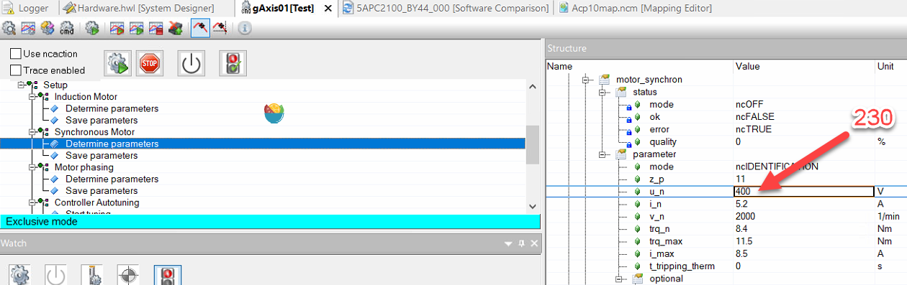
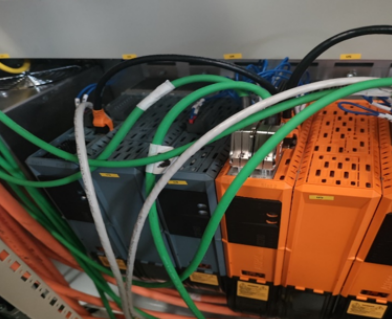

# 6000：主站采样时间不是位置控制器采样时间的倍数

- **描述**：
    - 写入主循环时间时出现响应错误。主循环时间不能除以位置控制器循环时间 (400us)。
- **反应**：
    - 不接受主循环时间。
- **原因/补救措施**：
    - 查看错误编号 [1002](#1002参数超出有效范围).
    - 使用 POWERLINK 时，另请参阅错误编号 [1012](#1012循环网络通信的崩溃).

# 6002：同步控制器：超出系统时间差的容错范围

- **描述**：
    - 驱动同步期间的运行错误。主系统时间与从系统时间 SYNC_SYS_TIME_DIFF 的偏差太大。
- **反应**：
    - “驱动同步”状态被重置。
    - 在网络耦合期间可能发生位置跳跃。
    - 在“外部、循环设定值”操作模式下可能会发生设定值跳跃。
- **原因/补救措施**：
    - 构成系统时间的主从石英频率偏差太大。
    - 在具有低级驱动器同步的 CAN 网络中，由于网络负载高，同步报文传输延迟。
    - 使用 POWERLINK 时，请参阅错误编号 [1012](#1012循环网络通信的崩溃).

## 应用案例

### 2022.09.07

- **原因**：
    - POWERLINK 通信受到干扰，例如线缆过滑环。现象：多轴运动时，10 个轴有 2 个轴报出出此错误，停止运行。查看 PLK 的 IO Mapping 通道信息，FailedCycleCount 有累加，即意味着 PLK 通信有一定的丢包。
    - 
- **解决方式一**：
    - 1.更换 PLK 线缆（若怀疑 PLK 线缆有问题）
    - 2.更换滑环，滑环接 PLK 线缆的时候接8个根线
- **解决方式二**：
    - 1.调整 PLK 通信参数，允许更多的丢包数量。
    - 2.设置 PLK 的主站配置参数，POWERLINK parameters - Mode - Advanced - Cycle loss limit 修改为 manually，Number of lost cycles 从2改为20。需注意，此方式调整可能会影响控制精度与响应速度
    - 

# 6008：控制器已经激活

- **描述**：
    - 使用“设置控制器模式”和“打开控制器”命令响应错误。不允许在控制器处于活动状态时切换控制器模式。
- **反应**：
    - 不执行命令。
- **原因/补救措施**：
    - 在写入命令之前必须关闭控制器

# 6014：驱动器初始化激活

- **描述**：
    - 使用“打开控制器”命令时出现运行时错误。另请参阅错误编号 [4005](#4005控制器无法开启驱动处于错误状态).
    - 初始化访问闪存。访问期间不得打开控制器。
- **反应**：
    - 查看错误编号 [4005](#4005控制器无法开启驱动处于错误状态).
- **原因/补救措施**：
    - 使用 AC123 插件卡时，通过将编码器类型从 ncINC 更改为 ncSSI 来启动初始化。 在此阶段发出了“打开控制器”命令。
    - -> 在命令“打开控制器”之前请求状态“控制器准备好”

# 6017：软件：看门狗激活

- **描述**：
    - 处理具有中等优先级的操作系统功能期间的运行时错误。函数调用期间发生超时。无法再保证网络通信。
    - 另请参阅错误编号 [4005](#4005控制器无法开启驱动处于错误状态).
- **反应**：
    - 查看错误编号 [1004](#1004网络生命标志监视器超时).
- **原因/补救措施**：
    - ACOPOS 硬件缺陷。
    - 操作系统故障

# 6018：硬件：内部电源故障

- **描述**：
    - 使用“打开控制器”命令或控制器处于活动状态时硬件监视器中的运行时错误。 另请参阅错误编号 [4005](#4005控制器无法开启驱动处于错误状态).
    - 内部电源电压有问题。 根据硬件，该电源用于插入式卡、风扇、电流测量、直流总线继电器等。
- **反应**：
    - 查看错误编号 [6021](#6021控制器使能输入低电平).
- **原因/补救措施**：
    - 伺服驱动器的 24VDC 电源电压出现故障或电压骤降。
    - 伺服驱动器的主电源出现故障或电压骤降。
    - ACOPOS硬件缺陷.

## 应用案例

### 2022.01.10

- 制动电阻温度过高：电机长时间被拖拽
- 请配置外部制动电阻

### 2022.01.10

- 硬件：内部供电失败。这个是 380 和 24 都没有的情况下会报出来的错误。
- 这个错误应当是在正常上电但是突然供电都lost的情况

### 2022.01.11

- 内部供电失败： 交流380V和直流24V供电丢失

# 6019：ACOPOS：过流

- **描述**：
    - 如果逆变器中的六个晶体管中的至少一个或制动电阻器的晶体管记录过流，则出现运行错误。
    - 使用以下 ACOPOS 模块时，此错误也会因电流互感器（U 和 V）中的过电流而记录：

|  |      |
|:-----|:-----|
| 8V1180.xx-2 | 95.4 A |
| 8V1320.xx-2 | 160.4 A |
| 8V1640.xx-x | 400.0 A |
| 8V128M.xx-x | 585.0 A |

- **反应**：
    - 同步电机：运动停止，短路制动。
    - 异步电机：通过关闭动力部分并打开抱闸来停止运动。
    - 如果错误连续发生两次，则通过关闭电源部分并打开抱闸来停止运动。
    - 设置 STOP_ERR_DECEL_RAMP=ncCTRL_OFF：
    - 通过立即关闭控制器和电源部分来中止运动。驱动器没有电气扭矩。
- **原因/补救措施**：
    - 电机接线错误：
        - 相和接地导体切换。 -> 检查变频器输出端电机电缆中的接地导体 PE 是否与电机 U、V 或 W 相连接。
        - 电机电缆短路。两相之间短路，接地 PE 和相或屏蔽和相。 -> 检查 U-V、V-W、W-U、U-PE、V-PE、W-PE、U-shield、V-shield 和 W-shield 之间的电阻。
    - 电机缺陷：
        - 电机相绕组短路。 -> 检查电机插头和电机端子上的三个电机阻抗（相-相）中的两个是否降低。
        - 电机两相之间的绕组短路。 -> 检查电机插头和电机端子上的三个电机阻抗（相-相）中的一个是否降低。
        - 电机相和外壳之间的外壳短路。 -> 使用通断测试仪或兆欧表，检查电机相位和外壳之间的绝缘电阻。
    - ACOPOS模块缺陷：
        - 查看错误编号 [6052](#6052功率级高端过流).
        - 查看错误编号 [6054](#6054功率级过流).
        - 制动电阻的合金晶体管或控制有缺陷。 -\> 检查当直流母线电压 UDC_ACT 大于制动电阻 UDC_BLEEDER_ON 的接通电压时是否记录错误。
    - 外部制动电阻缺陷：
        - 短路 -> 检查未连接外部制动电阻时是否也记录错误。
        - 设置当前值跳转：见错误号 [9300](#9300电流控制器过流). 这种原因更可能发生在带有电流互感器监控的设备上.

## 应用案例

### 2010.03.23

- **现象**
    - 手动单轴运行该轴时，电机转动不均匀，速度时快时慢，并且抖动很大。运行大约 10 s 后 ACOPOS 报 39001，9300，6019，偶尔整个系统启动时该电机轴报警 7032
- **分析思路**
    - 根据报警号（9300: Current controller: Overcurrent /6019: ACOPOS: Overcurrent），可能驱动 ACOPOS 损坏，导致电流输出不稳定，从而使得电机抖动或者速度不稳定。
    - 根据报警号（39001：Encoder: Position correction active /7032: Encoder: Incremental signal amplitude too small）等，可能电机编码器损坏，光栅及电路板个元器件性能下降，干扰信号串入导致位置信号不准确。
- **检查措施**
    - 检查驱动 ACOPOS 功能是否正常，将其他相同型号的电机接到该驱动上，连接配置好后机器可以正常运行，初步判断该 ACOPOS 功能正常。
    - 检查驱动电机的编码器是否真的损坏，采取更换电机编码器方式，重新对电机进行 Phasing，采用步进模式 (Par[276]=1)，重复执行 4 次 (Par[334]=258)后,取平均值 (Par[63]=4.59756)，执行烧写 (Par[81]=340)后，该电机空载情况下在±3000 r/min 下运行 5 分钟无故障。安装在设备上后，正常生产无故障报警，可以正常使用。
- **结论**
    - 由上可知，在出现 9300 报错与39001/7032 等与编码器相关的报警号时，若检查对应的 ACOPOS 无故障情况且电机表现为速度不稳定或抖动较大，则可初步判断电机编码器损坏，进行电机编码器更换。

### 2022.07.28

- **解决方式**：
    - 1.更换电机动力线
    - 2.更换电机

### 2022.08.10

- 6019，6052，6054这几个报警一般都是逆变单元的 IGBT 坏了

### 2023.10.18

- **现象**
    - 持续生产多年的 ACOPOS 驱动器（接了外接制动电阻），突然上电无法正常工作。
    - ACOPOS 报警为可以复位，但过一会又报出故障，报警情况如下
    - 一般是先显示29209报警
    - 复位了后，可能会显示39047或29203
    - 再次复位后报警号变为6019
    - 再次复位后，报警清除，过一会报警再次变为29209
        - 
- **结论**
    - 据现场观察，制动电阻有冒烟
    - 更换制动电阻为新的后解决此问题。

# 6020：控制电源：欠压

- **描述**：
    - 控制电源电压已降至最低允许限值以下（参见 ACOPOS 用户手册）。
    - 另请参阅错误编号 [4005](#4005控制器无法开启驱动处于错误状态).
- **反应**：
    - 查看错误编号 [6021](#6021控制器使能输入低电平).
- **原因/补救措施**：
    - 通过直流总线供电的供电电压：
        - VAC 电源：干扰（断线、控制、电源故障、电源骤降等）
    - 通过外部电源供电：
        - 控制电源：超出规范的操作（参见 ACOPOS 用户手册）
        - 控制电源：干扰（断线、控制、电源过载、电源故障等）
    - ACOPOS硬件缺陷

# 6021：控制器使能输入低电平

- **描述**：
    - 使用“打开控制器”命令或控制器处于活动状态时硬件监视器中的运行时错误。没有为控制器使能输入提供足够的电压。
    - 例如下图 ACOPOS P3驱动器的 X7端子的 Enable 引脚没有提供24V 电压。
        - 
- **反应**：
    - 当“打开控制器”命令时：请参阅错误编号 [4005](#4005控制器无法开启驱动处于错误状态).
    - 当控制器处于活动状态时：
    - 通过关闭 IGBT 输出级并打开抱闸来停止运动。
    - “控制器就绪”状态被重置。
- **原因/补救措施**：
    - 由外部操作或外部因素（应用程序或手动操作）触发。
    - 由于硬件缺陷或故障（连接断开、线路终止、接线错误、控制硬件有缺陷或故障、ACOPOS 24VDC 电源电压、故障）而导致错误触发。 另请参阅接线指南错误编号 [7030](#7030编码器增量信号幅度太大).
    - ACOPOS硬件缺陷

# 6023：控制器启用输入处的电压骤降

- **描述**：
    - 使用“打开控制器”命令或控制器处于活动状态时硬件监视器中的运行时错误。控制器使能输入上出现电压骤降。
- **反应**：
    - 当“打开控制器”命令时：请参阅错误编号 [4005](#4005控制器无法开启驱动处于错误状态).
    - 当控制器处于活动状态时：
    - 通过关闭 IGBT 输出级并打开抱闸来停止运动。
    - “控制器就绪”状态被重置。
- **原因/补救措施**：
    - 由外部操作或外部因素（应用程序或手动操作）触发。
    - 由于硬件缺陷或故障（连接断开、线路终止、接线错误、控制硬件有缺陷或故障、ACOPOS 24VDC 电源电压、故障）而导致错误触发。 另请参阅接线指南错误编号 [7030](#7030编码器增量信号幅度太大).
    - ACOPOS 模块缺陷。

## 应用案例

### 2022.01.10

- 请检查驱动器24V输入是否有电

# 6026：抱闸：释放期间超出定子电流限制

- **描述**：
    - 当抱闸监控器处于活动状态时，使用“打开控制器”命令时出现运行错误。打开（释放）抱闸 MIN(ACOPOS_CURR_MAX, MOTOR_CURR_MAX) 时流过的电流最大。
- **反应**：
    - 查看错误编号 [6045](#6045逆变器输出无电流).
- **原因/补救措施**：
    - 电流控制器不稳定。
    - 打开（释放）暂停时间太长，控制器设置太“软”.
    - **设置的太软意味着三环参数设置的偏小**

# 6027：抱闸：不允许手动操作

- **描述**：
    - 使用命令 CMD_BRAKE 操作抱闸时出现响应错误。当控制器处于活动状态时，不允许手动操作抱闸。
- **反应**：
    - 不执行命令。
- **原因/补救措施**：
    - 控制器激活时手动操作抱闸未通过抱闸模式开启（BRAKE_MODE 中的位 1 未设置）.

# 6029：抱闸：控制信号开启，输出状态关闭

- **描述**：
    - 抱闸控制监控器激活期间的运行错误。在滤波器时间 BRAKE_CTRL_MON_FILTER 期间，当抱闸门控信号打开时，抱闸没有提供足够的电流和/或电压。
- **反应**：
    - 如果控制器关闭：无。
    - 查看错误编号 [9000](#9000散热器温度传感器超出停止限制).
- **原因/补救措施**：
    - 查看错误编号 [6055](#6055抱闸低电压).
    - 查看错误编号 [6056](#6056抱闸低电流).

## 应用案例

### 2022.01.11

- 报警号6029+6055
- **问题**： P 3 驱动器带抱闸电机，接线正确的情况下，switch on 的时候会报抱闸打不开，
- **问题原因:** 开关电源功率不够
- **解决：** 测量一下在驱动器的24供电的电压，压降太低了 电压低于23.6就不行，很敏感。具体参数看帮助 换了个单独的电源可以了。之前23.7V电压的时候报错，24.1V就可以了。

# 6030：抱闸：抱闸输出激活，但没有在电机数据中输入抱闸

- **描述**：
    - 当抱闸监控器处于活动状态时，使用“打开控制器”命令时出现运行错误。即使在电机配置数据中未指定抱闸，电流仍会流向抱闸输出。
- **反应**：
    - 查看错误编号 [6045](#6045逆变器输出无电流).
- **原因/补救措施**：
    - 抱闸的电机配置数据不正确。
    - 抱闸的输出正用于其他功能，并且制动监视器尚未停用（BRAKE_MODE 中的位 2 未设置）.

## 应用案例

### 2023.04.03

- **现象** 现场运行很多天的 ACOPOS P3设备，先报5005，后面重复断电上电一直报6030，且无法复位
- **原因** 机械振动导致刹车线 B+ B-存在虚接的现象
- 
- **解决方式** 把电机接线的刹车线 B+ B-重新接线，端子上拆下来线重新接。

# 6031：系统模块已删除

- **描述**：
    - 删除 NC 系统模块时的响应错误。要删除的操作系统“acp10sys.br”或 BsLoader“acp10bsl.br”不在驱动器上。
- **反应**：
    - 不执行“删除 NC 系统模块”命令。
- **原因/补救措施**：
    - 没有要删除的数控系统模块.

# 6032：接口：FPGA 配置错误

- **描述**：
    - 插件卡初始化期间的运行时错误。配置 FPGA 功能块时出错。
- **反应**：
    - 不支持插卡
- **原因/补救措施**：
    - 插卡故障。
    - 来自插件卡的 PROM 数据包含错误。
    - ACOPOS硬件缺陷（总线板、插头、内部SSI总线）

# 6033：ACOPOS 固件不支持伺服放大器类型

- **描述**：
    - 启动驱动程序时出现运行时错误。来自驱动器的 PROM 数据与固件不兼容。
    - 另请参阅错误编号 [4005](#4005控制器无法开启驱动处于错误状态).
- **反应**：
    - 查看错误编号 [4005](#4005控制器无法开启驱动处于错误状态).
- **原因/补救措施**：
    - 固件不支持驱动器
    - ACOPOS 硬件缺陷（驱动器上的 PROM 数据不正确，内部 SSI 总线缺陷）

## 应用案例

### 2022.01.11

- 报警6033,4005
- **问题描述：** 伺服不能使能，RUN 指示灯不亮，报警号4005,6033
- **解决方法：** 更新伺服驱动器固件到最新版本2.3.0.0，没有解决，继续更新编码器卡固件，问题得以解决。
- **附注**：最好把伺服固件及相关固件都更新。

# 6034：循环设定值模式中止：设定速度丢失

- **描述**：
    - 使用循环设定值激活速度控制时出现运行错误。至少 3 个主轴周期没有从网络接收到速度设定值。
- **反应**：
    - 查看错误编号 [4007](#4007超出滞后错误停止限制).
- **原因/补救措施**：
    - 驱动器未提供足够的速度设定值 -> 检查应用程序。
    - 查看错误编号 [5110](#5110凸轮耦合中止缺少循环设定位置).

# 6036：电机参数缺失或无效

- **描述**：
    - 使用“打开控制器”或“燃烧电机数据”命令时出现响应错误。
    - 电机配置数据未完全初始化。
    - 信息中列出了第一个无效参数 ID。
- **反应**：
    - 不执行命令。
- **原因/补救措施**：
    - 至少有一个电机参数未写入或写入错误（参见信息）。
    - MOTOR_TYPE 参数未作为电机配置数据的第一个参数写入。
    - 在带有 EnDat 编码器的电机上，无法从 EnDat 内存中读取电机配置数据（编码器错误、第 3 方电机、编码器内存中没有电机数据）.
    - 信息错误 1224 或 652
        - 如果信息 1224 (MOTOR_VENDOR_ID ParID) 或 652 (MOTOR_ENCOD_ATTR ParID) 出现错误，原因可能如下： 带有 EnDat 编码器的贝加莱电机的电机升级在 Automation Studio 4.0 或更高版本中带有不完整的电机配置数据。来自带有 EnDat 编码器的贝加莱电机的电机配置数据不需要传输到驱动器，因为数据存储在编码器中。
        - 补救：
            - 从项目中禁用或删除电机配置数据。
            - 将 Automation Studio 升级到 V4.1.6 或更高版本或 V4.2.3 或更高版本。这将自动禁用电机配置数据。
            - 添加缺少的参数 MOTOR_VENDOR_ID = 0 和 MOTOR_ENCOD_ATTR = 0（例如使用参数表）。这将使用项目中的电机配置数据.

## 应用案例

### 2023.02.13

- **原因** 某些第三方驱动器会修改 Endat2.1 电机芯片中的参数，尤其是磁偏角 ID63 使用我们的 8V1180.001-2 驱动器带第三方驱动器驱动过的电机 8LSA54.EB045D700-3，正常组态配置，驱动器无法上电；在 Physical View 里面默认-3 的电机加进来，电机参数默认都是 disable 的，但是驱动器上电时会报错，电机参数丢失，无法从电机芯片中读取；如果配置了电机参数，又会报错 6036，TEST 中会说 ID1224 和 ID652 丢失或无效
- **解决方式** 在参数表中增加电机参数；电机配置参数必须在 ID652 和 ID1224 前面； ParID 1209 值必须修改为 0，关闭温度模型。否则会报错 9090：Motor encoder temperature sensor: Temperature value not valid 手动增加 ID652 值为 0，和 ID1224 值为 1
    - 
    - 最重要的是，需要重新整定 ID63 号磁偏角，手动写到参数表中

# 6038：扭矩限制高于峰值电机扭矩

- **描述**：
    - 写入扭矩限制（扭矩限制或扭矩限制覆盖）参数时的响应错误。通过写入参数，有效扭矩限制将大于峰值电机扭矩。
- **反应**：
    - 不接受扭矩限制。
- **原因/补救措施**：
    - 扭矩限制和/或扭矩限制覆盖大于电机配置数据中的峰值扭矩。
    - 另请参阅错误编号 [1002](#1002参数超出有效范围).

# 6043：PHASING_MODE 无效

- **描述**：
    - 如果增量编码器用作电机编码器并且选择了错误的 PHASING_MODE 来确定换向偏移 MOTOR_COMMUT_OFFSET，则在打开控制器时出现运行错误。
- **反应**：
    - 启动程序被取消。
- **原因/补救措施**：
    - PHASING_MODE 的允许值：
        - 0：饱和模式
        - 2：抖动模式
        - 4：直接II
    - PHASING_MODE 不允许的值：
        - 1：步进模式会导致无效动作。
        - 3：不支持直接模式。
    - 查看错误编号 [1002](#1002参数超出有效范围).

# 6044：相位：旋转方向或位置无效

- **描述**：
    - 在步进模式 (PHASING_MODE=1) 下对 CMD_PHASING 进行定相期间出现运行时错误。
- **反应**：
    - 分阶段被中止。
- **原因/补救措施**：
    - 计算出的极对数为负数（参见信息）：
        - 电机接线错误：电机相位置换。 -> 交换两个电机相位或设置 MOTOR_CURR_ROT_DIR = ncINVERSE。
        - 编码器位置或速度包含错误：参见错误编号 [4014](#4014两个编码器控制超出位置差的停止限制).
    - 计算出的极对数在 -0.5..0.5 范围内（请参阅信息）：
        - 编码器缩放 SCALE_ENCODx_INCR 不正确
        - 编码器位置或速度包含错误：参见错误编号 [4014](#4014两个编码器控制超出位置差的停止限制).
        - 电机接线错误：电机相位未连接到逆变器输出。 -> 在定相期间检查电机运动。 电机应移动 10 个极对。
        - 负载扭矩激活。 -> 在定相期间检查电机运动。 电机应移动 10 个极对。
        - 电机抱闸未打开。 -> 在定相期间检查电机运动。 电机应移动 10 个极对。
    - 计算出的极对数高于 255（参见信息）：
        - 计算的极对数高于最大值.

## 应用案例

### 2022.02.13

- 贝加莱伺服+第三方直线电机调试过程中，ncSTEPPER, phasing. 如果出现6044报警, 试着 ID872=255, 将 UVW 相序反一下

### 2023.05.31

- 将 MOTOR_CURR_ROT_DIR=ncINVERSE 后启动正常。
- 后续电工调线时发现动力线相序确实接错了

# 6045：逆变器：输出：无电流

- **描述**：
    - 接通电流控制器时出现运行错误。当控制器打开时，检查电流是否可以通过电压设置注入电机或再生扼流圈（逆变器输出）的各相。在此阶段测得的电流太低。
- **反应**：
    - 通过关闭 IGBT 输出级并打开抱闸来停止运动。
- **原因/补救措施**：
    - 逆变器输出接线错误：检查所有相（U、V 和 W）是否正确连接到逆变器输出。
    - 电机接线错误：从逆变器输出中移除相位（U、V 和 W）。检查电机线（ACOPOS-侧）上U-V、V-W和W-V之间的相间电阻。三个电阻必须相同且有限。如果至少有一个电阻为无穷大，则电机或电机线路有缺陷。
    - 电机故障：检查电机上U-V、V-W、W-V之间的相间电阻。三个电阻必须相同且有限。如果至少有一个电阻为无穷大，则必须更换电机。
    - 电机配置不正确：MOTOR_STATOR_INDUCTANCE 太低。
    - 电机配置不正确：MOTOR_CURR_RATED 太低。
    - 8BVP：电源缺相：检查接触器、熔断器、变压器和电源电压。
    - ACOPOS 功率级缺陷：更换 ACOPOS 模块。
    - 可以使用 MOTOR_TEST_MODE 停用连接检查.

## 应用案例

### 2022.01.11

- 报警6045和7220
- **问题描述**：进线电源电压测得360V，伺服启动不起来，参数 ID300已经改成300了，也启动不起来，中午休息时，进线电源380V 时，伺服就能起来，运行版本：K4.26;ACP10 3.18.2
- **问题原因**：进线电压低于380V，测量值为360V 左右解决方法：更换 ACP10版本为5.11.1 注：ACP10 3.18.2 版本下，电压在360V 时上电会报6045故障，而相同外部条件下，更换 ACP10 为 5.11.1 版本后，不会报 6045的故障

### 2023.07.07

- **现象** 生产过程中报错6045/29207/29203
- **原因** 查看驱动器 UVW 接线，打开电柜发现驱动器 UVW 接线处有一相线烧了

### 2023.09.06

- **现象** ACOPOSmulti 电源轴一直报错，无法复位。电源模块为主动式电源，首先上电运行，电源直接报警 6045，无法使能，因为程序里降低了逆变模块的报警电压，驱动器可以正常工作，电源模块的参数表中配置了电机温度传感器参数，将这些参数屏蔽后重新上电，依旧报该故障
- **问题排查** 6045 主要提示为电源进线缺相，整流部件问题或驱动损坏。用万用表测量驱动器上的 380 V 输入，发现 L 1 - L 2，L 2 - L 3 之间的电压为 200 V，L 1 - L 3 之间为 400 V，确定电源输入缺相，继续往前测量，确认电抗器和滤波器两侧也是缺相，电柜的进线 380 V 端子上测量也是缺相。
- **问题原因** 电工排查后确认为主电柜分线时压到了线皮，导致缺相。

# 6046：相位：无转子运动

- **描述**：
    - 在抖动模式 (PHASING_MODE=2) 下定相 (CMD_PHASING=ncSTART) 期间出现运行时错误。在“定相”期间速度 SCTRL_SPEED_ACT 太低。
- **反应**：
    - 分阶段被中止。
- **原因/补救措施**：
    - 转子堵塞：
        - 带有抱闸的电机，由于外部负载而阻塞，电机具有非常高的转动惯量。 -> 在“定相”期间检查速度 SCTRL_SPEED_ACT。
    - 电机配置不正确：
        - 当相位电流 PHASING_CURR 太低时，不会产生扭矩。 -> 在“定相”期间检查速度 SCTRL_SPEED_ACT。
    - 编码器位置或速度包含错误：请参阅错误编号 [4014](#4014两个编码器控制超出位置差的停止限制).
    - 电机接线错误：电机至少两相断开，端子松动。 查看错误编号 [6045](#6045逆变器输出无电流).

# 6047：抱闸：控制信号关闭，输出状态开启

- **描述**：
    - 抱闸控制监控器激活期间的运行错误。在滤波器时间 BRAKE_CTRL_MON_FILTER 期间为抱闸提供电流和电压，同时抱闸门控信号关闭。
- **反应**：
    - 查看错误编号 [6029](#6029抱闸控制信号开启输出状态关闭).
    - 但如果位置控制处于活动状态（CONTROLLER_MODE=1 或 33）： 运动停止，轴限制并在错误消除后关闭控制器。
- **原因/补救措施**：
    - ACOPOS 故障（抱闸控制、信号电平监控、内部继电器)

# 6048：电机抱闸运动监视器：位置误差过大

- **描述**：
    - 抱闸运动监控期间的运行错误。抱闸关闭时，电机编码器的实际位置已超过位置误差限值 BRAKE_TEST_POS_LIM（BRAKE_STATUS Bit2 = 0）。抱闸磨损更快。
- **反应**：
    - 如果抱闸力矩的功能测试处于激活状态：测试中止。
    - 否则：无。
- **原因/补救措施**：
    - 抱闸配置错误（抱闸闭合延迟时间太小）。
    - 电机编码器配置错误。
    - 位置误差限制太小（必须考虑抱闸和电机编码器之间的间隙和弹性变形）。
    - 负载转矩过大。
    - 无位置控制运动停止。
    - 抱闸故障。
    - “抱闸机械闭合”状态错误。 （抱闸的信号电平监控损坏。参见错误编号 [6029](#6029抱闸控制信号开启输出状态关闭).)
    - 此外，在对抱闸扭矩进行功能测试时：
        - 测试扭矩或抱闸额定扭矩过大。
        - 负载转矩确定不正确（电流测量系统、电机配置、转子换向或电机编码器测量系统）。
        - 控制器不稳定。
    - 如果抱闸扭矩测试未激活，则可以通过设置 BRAKE_MODE Bit3 = 1 禁用停止监控.

## 应用案例

### 2023.06.28

- **现象**
    - 4005: Controller cannot be switched on: Drive in error state
    - 5005: Start of movement not possible: Position controller inactive
    - 6048: Motor holding brake movement monitor: Position error too large
    - 9070: Motor temperature model: Stop limit exceeded
    - 41031: Junction temperature model: Warning limit exceeded
    - 41070: Motor temperature model: Warning limit exceeded
    - 29203: Drive is not ready.
    - 29209: The drive is in error state.
    - 29217: Invalid input parameter
- **原因** 零位参数不对引起过载，客户更换了模具，但是没有重新走回零的流程，导致参数错误，机械卡主了，当前顶住位置距离零位还有1mm 以上因此当伺服使能，由于不在零位位置，所以向零位运动，由于已机械顶住，所以动态偏差 LagError 一直有1mm 以上，就一直以最大扭矩输出，造成电机温度超过70度以上，驱动器的散热片温度高达70度，IGBT 温度高达133度。持续较长时间后就报警而 POWER OFF，进行复位后，又进入以上死循环。
- **优化方式** 使能后，走到零位，如果持续1秒超过+5Nm 或小于-5Nm，则把 HomePosition 进行偏移，再进行 MC_HOME 操作。

### 2023.12.06

- 可能是抱闸24v供电不稳定导致异常抱死

# 6049：逆变器：输出：电流测量故障

- **描述**：
    - 查看错误编号 [6045](#6045逆变器输出无电流).
- **反应**：
    - 查看错误编号 [6045](#6045逆变器输出无电流).
- **原因/补救措施**：
    - ACOPOS 电流测量或功率级故障：更换 ACOPOS 模块。
    - 查看错误编号 [6045](#6045逆变器输出无电流).

## 应用案例

### 2023.06.29

- **现象** 9300，6049，7215，7218
- **原因** 驱动器跟随一个外接编码器作为主轴，外接编码器通过两个挂耳固定，由于固定支架断裂，外接编码器转动时有剧烈晃动，编码器信号波动过大，导致驱动器产生异常频繁的加速减速，故发生此问题。
    - 
- **解决方式** 更换编码器，并重新固定支架，使编码器没有明显晃动

### 2023.07.14

- **现象** 现场使用外接增量式编码器，且驱动器型号为 ACOPOS 1320。现场生产过程中设备卡机10次会出现7次停机需要设备复位，且7次中有1次会出现9300,6049,7218报警
- **原因** 终端现场没有给驱动器接地线，导致信号干扰
- **解决方式** 接了地线后，设备卡机也不会导致停机需要设备复位。

# 6050：不允许写入参数：设置当前滤波器或陷波滤波器处于活动状态

- **描述**：
    - 如果已使用过滤器传递函数，则写入参数时出现响应错误。
- **反应**：
    - 不接受参数值。
- **原因/补救措施**：
    - 在写入设置的当前滤波器参数之前打开陷波滤波器。
    - 在写入陷波滤波器参数之前打开了设置的电流滤波器.

# 6051：相位：速度到高

- **描述**：
    - 接通电流控制器时出现运行错误。开启控制器时，进行测试以确定电机速度是否高于 0.05\*MOTOR_SPEED_RATED。此阶段测得的速度太高。
- **反应**：
    - 查看错误编号 [6045](#6045逆变器输出无电流).
- **原因/补救措施**：

# 6052：功率级：高端：过流

- **描述**：
    - 如果功率级中的三个高侧晶体管（U、V、W 相）中的至少一个记录过流，则会出现运行时错误。
- **反应**：
    - 查看错误编号 [6019](#6019acopos过流).
- **原因/补救措施**：
    - 电机接线错误：
        - 查看错误编号 [6019](#6019acopos过流).
    - 电机缺陷：
        - 查看错误编号 [6019](#6019acopos过流).
    - ACOPOS模块缺陷：
        - 半桥中的合金晶体管或控制有缺陷。 -> 检查在拔下电机电缆时是否也记录了错误。
        - 设置当前值跳转：
        - 查看错误编号 [9300](#9300电流控制器过流).

## 应用案例

### 2022.01.11

- 6052/6053: Power stage: High-side: Overcurrent（Power stage: Low-side: Overcurrent）
- 伺服驱动器IGBT故障，更换硬件

### 2023.02.14

- 参考 [6054：功率级：过流](#6054功率级过流)

### 2023.02.14

- 88A 再生电抗+44A 主动电源的模式配置，在上电后电源会报错6052/6053，但当做被动电源使用，电源轴报错不使能可解决

### 2023.06.09

- 6052/6053/6078 上电运行都无异常，运行一段时间之后出现频繁报警停机
- **原因** 电机接线盒进行检查，发现电机侧 UVW 线接线不稳，很松动
- 
- **解决方式** 重新拧紧后上电，未再出现报警等问题

# 6053：功率级：低侧：过流

- **描述**：
    - 如果功率级中的三个低侧晶体管（U、V、W 相）中的至少一个记录过流，则会出现运行时错误。
- **反应**：
    - 查看错误编号 [6019](#6019acopos过流).
- **原因/补救措施**：
    - 查看错误编号 [6052](#6052功率级高端过流).

## 应用案例

### 2022.01.11

- 6052/6053: Power stage: High-side: Overcurrent（Power stage: Low-side: Overcurrent）
- 伺服驱动器 IGBT 故障，更换硬件

### 2023.02.14

- 参考 [6054：功率级：过流](#6054功率级过流)

### 2023.02.14

- 88 A 再生电抗+44 A 主动电源的模式配置，在上电后电源会报错 6052/6053
- 但当做被动电源使用，电源轴报错不使能可解决

### 2022.02.14

- 轴控程序无法复位报警，TEST 可以。
- **原因**：直线电机故障

### 2023.06.09

- **现象** 6052/6053/6078 上电运行都无异常，运行一段时间之后出现频繁报警停机
- **原因** 电机接线盒进行检查，发现电机侧 UVW 线接线不稳，很松动
- 
- **解决方式** 重新拧紧后上电，未再出现报警等问题 |

# 6054：功率级：过流

- **描述**：
    - 如果功率级中的至少一个电流传感器（U 相、V 相、“W”相）记录过电流，则会出现运行时错误。
- **反应**：
    - 查看错误编号 [6019](#6019acopos过流).
- **原因/补救措施**：
    - 电机接线错误：
        - 查看错误编号 [6019](#6019acopos过流).
    - 电机缺陷：
        - 查看错误编号 [6019](#6019acopos过流).
    - ACOPOS模块缺陷：
        - 查看错误编号 [6052](#6052功率级高端过流).
        - 电流测量问题。 -> 检查电源部分关闭时的相电流。
    - 设置当前值跳转：
        - 查看错误编号 [9300](#9300电流控制器过流).

## 应用案例

### 2022.01.11

- power stage: Overcurrent
    - （1）检查电机 uvw 接线或者三相对地有没有虚接的
    - （2）检查电机 uvw 三相电阻是否一样
    - （3）读一下电机参数 ID60和 ID61，定子电阻（电感）是否正常
    - （4）如果是8BVP 电源轴，有可能是谐波引起的（有可能报错7200等），那么考虑改一下 ID869=1或者3，也可以设置 ID223=2（适当的值，比默认的大一点）

### 2022.01.11

- UVW 至少有一项过流
- 1、重新插接动力电缆
- 2、检查电机侧 U-V, U-W, V-W, U-PE, V-PE, W-PE 阻值是否均衡
- 3、检查动力电缆相线与 PE、相线与屏蔽层是否导通检查逆变动力输出端子 U/V/W/PE 是否导通

### 2022.08.10

- 6019，6052，6054这几个报警一般都是逆变单元的 IGBT 坏了

### 2023.02.13

- 如果在同步电机参数辨识过程中出现错误6054（Power stage：Overcurrent），输入较小的电压值 u_n 会有帮助：
- 
- 然后识别将无误地进行。

### 2023.02.14

1. 断电后，从驱动器下拔下电机的插头，分别测量 U V W 之间的电阻是否一致，测量 U V W 与地线之间是否无穷大。
2. 断电后，检查电机 U V W 地线之间接线是否牢固。
3. 读取电机参数 ID60 ID61，数据是否正常。
4. 更换新的驱动器，查看故障是否消失。 5. 更换新的电机，查看故障是否消失。

### 2023.02.14

- **现象：** 8BVI0440驱动器驱动电机反复报警6054。使用触摸屏程序单独轴点动及调试，伺服能 POWER ON，但是执行 MOVE 动作时，就会报错6054 UVW 没有接错，UVW 电阻都一样0.2欧姆，读左右两个电机 ID61 60 都一样。互换左右两边的驱动器，原来左边驱动器 0220 是好的，右边报警。互换后左边报警，右边正常。
- **原因：** 驱动板问题，接上外壳报过流，不接外壳没事，最后更换驱动板正常。

### 2023.02.14

- **现象：** 运行了大概半小时报错4007（lagerror 过大）和7032（增量信号振幅太小）和6057（编码器报错）和6054（电流过冲）
- **原因：** 经排查发现 muti 编码器连线摆放过于密集，产生干扰导致编码器位置数据跳动，致使 lagerror 过大，导致电流增大最终电流过冲。
- 

### 2023.07.07

- 驱动器报6054（超电流）错误，整定驱动器三环参数后正常。

### 2023.08.21

- **现象**：
    - P3驱动器驱动8LSA44-R2060D100-3的电机，电机额定转速6000RPM，当电机运行到3000RPM 时，会立即报警停车（报警代码6054过流）
    - 最开始电机未安装时调试能在4200RPM 匀速稳定运行，运行到4800RPM 时报警过流；今天安装了比较小的负载（联轴器直连）后，电机运行到3000RPM 后就会出现报警过流。
- **检查事项**
    - Trace 一下母线电压
    - 确认动力电缆是否有破损，接地等
    - 确认一下电机参数，读取电机参数的各个 ID 来对比
    - 检查三环参数是否太大了
    - 测试一下磁偏角
- **结论**
    - 三环参数设置不合理
    - 电机的额定电流为 3.7 A
    - 自整定出的三环参数: 位置环 kv 434，速度环 kv 3.1，3000 RPM 运行会报 6054
    - 将位置环 kv 改小为 200，速度环 kv 改小为 2.7 后运行正常，能够在额定转速 6000 RPM 下正常运行。

### 2023.12.22

- **现象**
    - 客户在进行对A机型自动测试时，点击操作按钮，驱动器立刻报警停止，电机随机带动丝杠前进一定的距离，驱动器显示报警29209 → 29215 → 6054。
    - 
- **原因分析**
    - 当前程序使用的加减速度参数15000000 unit/s^2，适配B机型机械设计中48:1的减速比
    - 而此A机型机械设计中使用的为48:29的减速比，对应加速度应设置为700000 unit/s^2。
- **根本原因**
    - 机械结构变化，例如减速器的减速比变化，但程序配置中相关加速度参数没有对应修改，导致了以过高的加速度运行
- **解决方式**
    - 速度应设置为匹配A机械结构700000 unit/s^2后，不再出现驱动器报警

# 6055：抱闸：低电压

- **描述**：
    - 监控抱闸控制器时出现运行错误。在过滤时间 BRAKE_CTRL_MON_FILTER 期间超出了允许的最小抱闸输出电压。可在用户手册中找到与模块相关的限值。
- **反应**：
    - 查看错误编号 [6029](#6029抱闸控制信号开启输出状态关闭).
- **原因/补救措施**：
    - 接线：辅助电源模块的24V输出和逆变模块的抱闸输出之间的电压降过大。 -> 使用多个扩展模块，电缆截面
    - 8B0C：辅助电源模块的直流电源小于315VDC
    - 8B0C：辅助电源模块的 24V 输出故障 -> 更换模块
    - 8B0C：重载模块 -> 使用更大的模块或附加模块
    - 8BVI：抱闸控制器或电压监控器故障 -> 更换模块
    - 8DI、80V：参数MOTOR_BRAKE_VOLT_REL设置的值太大.

## 应用案例

### 2022.01.11

- 报警号6029+6055
- **问题：** P3驱动器带抱闸电机，接线正确的情况下，switch on 的时候会报抱闸打不开，报错号6029+6055
- **问题原因:** 开关电源功率不够
- **解决：** 测量一下在驱动器的24供电的电压，压降太低了电压低于23.6就不行，很敏感。具体参数看帮助换了个单独的电源可以了。之前23.7V 电压的时候报错，24.1V 就可以了。

### 2022.02.14

- 通过调节开关电源上的电位计，将开关电源输出至25V以上后，6055报警解除。

# 6056：抱闸：低电流

- **描述**：
    - 查看错误编号 [6029](#6029抱闸控制信号开启输出状态关闭).
- **反应**：
    - 查看错误编号 [6029](#6029抱闸控制信号开启输出状态关闭).
- **原因/补救措施**：
    - 接线错误：例如：所需的跳线 S1-S2 和 S3-S4 未插入，...
        - -> 按照用户手册中的规定检查抱闸的模块相关接线。
    - 接线故障：连接断开
    - 抱闸或外部继电器不符合驱动器规格（输入电阻太大，..）。
        - -> 通过设置 BRAKE_MODE 中的第 2 位禁用监控。
    - 外部继电器损坏或控制不当。
    - 抱闸故障。
    - ACOPOS 故障（抱闸控制，内部继电器)

# 6057：位置环控制器：负载编码器错误

- **描述**：
    - 带有激活监视器的编码器中的运行错误（激活，参见错误编号 [7030](#7030编码器增量信号幅度太大)).
- **反应**：
    - 查看错误编号 [7030](#7030编码器增量信号幅度太大).
- **原因/补救措施**：
    - 如果在该轴上生成编码器状态，则在附加条目中提供有关编码器运行时间错误的详细信息
    - 如果该轴上未生成编码器状态（另一轴上的编码器或 X20 模块），则相应模块必须提供详细信息.

## 应用案例

### 2022.01.10

- 驱动器 switch on 的时候报错 6057 , 7031 , 7038 ，都是编码器的问题。
- 最后对编码器电缆进行了加固，问题解决。

### 2022.01.11

- 41070：Motor temperature model: Warning limi exceeded 6057：Position loop controller: Load encoder error
    - (1)如果使用环境有水的话，而且报警复位不掉，或者很频繁，很有可能是电机编码器接口进水了。
    - (2)增加负载润滑
    - (3)通过 ID373=0关掉，但不能保护电机

### 2022.01.11

- 位置环编码器异常：
    - 1、重新插拔电机侧编码器电缆
    - 2、重新插拔驱动器侧编码器电缆
    - 3、与距离最近的驱动器交换编码器卡，验证报警是否跟随编码器卡变动到另一电机
    - 4、与距离最近的电机交换安装编码器线（电机侧和驱动器侧），验证报警是否跟随编码器线变动到另一电机
    - 5、更换编码器电缆

### 2022.01.11

- **问题原因**：编码器报警6057，线断了，也有可能是编码器卡，编码器这条之路有硬件问题

### 2022.06.27

- **问题**：使用翡叶电机 E09编码器，在 test 模式下使能，就会报4005，39003，6057，39042，39024，39006。
- **解决方式**：参数表719写1来确认编码器。

### 2023.02.14

- **现象：** 运行了大概半小时报错4007（lagerror 过大）和7032（增量信号振幅太小）和6057（编码器报错）和6054（电流过冲）
- **原因：** 经排查发现 muti 编码器连线摆放过于密集，产生干扰导致编码器位置数据跳动，致使 lagerror 过大，导致电流增大最终电流过冲。
- 

### 2022.02.14

- 使用 BISS 编码器，在机器上通常很好。但是，有时会发生打开激光源时发生干涉并显示错误 6057 的情况。当激光打开时，很明显总线存在干扰。可见下图中的数据变化
- 

### 2022.02.14

- 使用第三方伺服
- **现象：** 为了保持位置和相位，使用 HomeRestore 功能。但实际在测试过程中，伺服运行5-10分钟会发生 PLCopen 层面的报警7033/6057。
- **结论：** 初步怀疑为与 homeRestore 回零方式有关，估计第三方不能使用该种回零方式。测试中去除该回零方式后，伺服能长时间运行不报错。

### 2022.02.14

- **现象：** 电机 PowerOn 时 Resolver 编码器报警7081、7032、6057。
- **解决方案：** 排查线缆、编码器卡问题，最后确认电机编码器故障。

### 2023.07.04

- **现象** ACOPOSmicro 运行超过2分钟后报6057/31224/31249/31250故障
- **解决方式** 到现场检测发现 PPC2100的 POWERLINK 的其中一个网口接到了以太网通讯的路由器上，拆掉这网线后，把 BC0083的最后一个模块的 BT9100到 ACOPOSmicro 的 X2X 通讯线改为贝加莱原装的通讯线。

# 6058：Enable 1端口：电压骤降

- **描述**：
    - 使用“打开控制器”命令或控制器处于活动状态时硬件监视器中的运行时错误。控制器使能输入上出现电压骤降。
- **反应**：
    - 当“打开控制器”命令时：
        - 请参阅错误编号 [4005](#4005控制器无法开启驱动处于错误状态).
    - 当控制器处于活动状态时：
        - 查看错误编号 [6023](#6023控制器启用输入处的电压骤降).
- **原因/补救措施**：
    - 查看错误编号 [6023](#6023控制器启用输入处的电压骤降).

## 应用案例

### 2023.02.14

- **现象：** 伺服报警 6058，Enbale 1 电压下降，且 6059 没有报出，经过检查后确定为 ACOPOS P 3 X 7 接口内部针脚接触不良
- 
- **解决方式：** 锡焊加固

### 2023.03.23

- **现象** ACOPOSmulti 逆变模块 PowerOn 时，报错6058，Voltage Sag，Multi 逆变模块 Enable 端无24V 电压。
- **原因** 接线错误 查看接线手册和Multi接线说明。发现x1，x2端子接线接错，原本应为端口1并联端口3的线接到了端口4。

# 6059：Enable2端口：电压骤降

- **描述**：
    - 使用“打开控制器”命令或控制器处于活动状态时硬件监视器中的运行时错误。控制器使能输入上出现电压骤降。
- **反应**：
    - 当“打开控制器”命令时：
        - 请参阅错误编号 [4005](#4005控制器无法开启驱动处于错误状态).
    - 当控制器处于活动状态时：
        - 查看错误编号 [6023](#6023控制器启用输入处的电压骤降).
- **原因/补救措施**：
    - 查看错误编号 [6023](#6023控制器启用输入处的电压骤降).

## 应用案例

### 2023.03.21

- **现象** 出厂的批量设备反馈报出6059错误
- **原因** 检查发现为使能输入误接入强电所致。
    -  |

# 6060：功率级：超出极限速度

- **描述**：
    - 如果伺服驱动器的电气输出速度（= SCTRL_SPEED_ACT \* MOTOR_POLEPAIRS）超过 600Hz 限制值持续 0.5 秒而没有中断，则运行错误。
- **反应**：
    - 查看错误编号 [9000](#9000散热器温度传感器超出停止限制).
- **原因/补救措施**：
    - 防止高速。
    - 使用具有更高速度限制的伺服驱动器类型.

# 6061：CTRL 速度控制器：超出速度停止限制

- **描述**：
    - 如果速度 SCTRL_SPEED_ACT 的绝对值超过限制值（参见信息），则运行错误。
    - 极限值根据电机最大速度 MOTOR_SPEED_MAX 和齿轮箱最大速度 MOTOR_GEAR_SPEED_MAX 计算如下：
    - Grenzwert = 1.1 * MIN(MOTOR_SPEED_MAX, MOTOR_GEAR_SPEED_MAX * MOTOR_GEAR_MOTOR_REV/MOTOR_GEAR_LOAD_REV) / 60
    - 使用弱磁 (PMSM) 时，可以降低限值。看 Parameter initialization/calculation Guid: e189933a-70c3-476b-be8f-c204d5d7bee1
- **反应**：
    - 查看错误编号 [9000](#9000散热器温度传感器超出停止限制).
- **原因/补救措施**：
    - 参数设置不正确
    - 避免高速

# 6062：CTRL 速度控制器：超出速度错误停止限制

- **描述**：
    - 控制器处于活动状态时的运行时错误。速度误差 SCTRL_SPEED_ERROR 的绝对值超过了极限值 AXLIM_DV_STOP。
- **反应**：
    - 查看错误编号 [9001](#9001散热器温度传感器超出关闭限制).
- **原因/补救措施**：
    - 速度误差限制太小 (AXLIM_DV_STOP)。
    - 设置值生成的配置不正确：请参阅错误编号 [4007](#4007超出滞后错误停止限制).
    - 控制器配置不正确：请参阅错误编号 [4007](#4007超出滞后错误停止限制).
    - 限流：见错误编号 [4007](#4007超出滞后错误停止限制).
    - 编码器速度包含错误：请参阅错误编号 [4014](#4014两个编码器控制超出位置差的停止限制).
    - 电机接线错误：见错误编号 [6044](#6044相位旋转方向或位置无效).
    - 电机接线错误：见错误编号 [6045](#6045逆变器输出无电流).
    - 电机缺陷：参见错误编号 [6045](#6045逆变器输出无电流).
    - ACOPOS 缺陷：请参阅错误编号 [6045](#6045逆变器输出无电流).

# 6063：抱闸：输出端的外部电压超过 24V

- **描述**：
    - 关闭抱闸期间的运行错误。抱闸关闭时抱闸输出电压超过限值 24V（BRAKE_STATUS Bit2 = 0）。
- **反应**：
    - 没有任何。
- **原因/补救措施**：
    - 在关闭条件下施加超过 24V 的外部电压。
    - 可以通过设置 BRAKE_MODE Bit6 = 1 禁用关闭抱闸时的电压监控.

# 6064：无法写入参数：重复控制激活

- **描述**：
    - 写入参数时出现响应错误，在周期性干扰抑制处于活动状态时不允许更改值。
- **反应**：
    - 不接受参数值。
- **原因/补救措施**：
    - 在写入此参数之前，必须关闭周期性干扰抑制 (CMD_SCTRL_RC = ncSWITCH_OFF).

# 6065：初始化激活

- **描述**：
    - 写入参数时响应错误。只有在初始化完成后才能执行此操作。
- **反应**：
    - 动作停止。
- **原因/补救措施**：
    - 等待驱动器准备就绪（设置 STATUS_CYCLIC_BITS (PARID 179) 的第 19 位）。
    - 写FBCTRL_MODE时：等到STATUS_BITS，bit8被复位.

# 6066：矩阵初始化时索引溢出

- **描述**：
    - 写入参数时响应错误。超过了矩阵条目的最大数量。
- **反应**：
    - 动作停止。
- **原因/补救措施**：
    - 应重新加载矩阵，并应考虑最大条目数.

# 6067：动态系统初始化期间出错

- **描述**：
    - 初始化已停止。有关详细信息，请参阅错误代码。
- **反应**：
    - 初始化停止。
- **原因/补救措施**：
    - 参数可能不一致。
    - 请参阅 ACOPOS 功能块 DYNSYS - General dynamical system 错误代码的解释 Guid: cdf96d03-2a30-4a37-a5cf-d13794986cdc

# 6068：当制动测试处于活动状态时无法写入参数

- **描述**：
    - 如果制动测试处于活动状态，则不允许写入参数 BRAKE_MODE (90)
- **反应**：
    - 不接受参数值。
- **原因/补救措施**：
    - 确保在写入参数 BRAKE_MODE (90) 时制动测试未激活.

# 6069：抱闸：过电流

- **描述**：
    - 查看错误编号 [6029](#6029抱闸控制信号开启输出状态关闭).
- **反应**：
    - 查看错误编号 [6029](#6029抱闸控制信号开启输出状态关闭).
- **原因/补救措施**：
    - 抱闸不符合 ACOPOS 规范（阻抗太小，电流超出测量范围，...）。 参见 ACOPOS 手册。
    - 抱闸电源电压过高。
    - 抱闸连接故障（接线错误、短路、..）
    - 抱闸故障（短路）。
    - ACOPOS 有缺陷

# 6070：无法写入参数：相位过程激活

- **描述**：
    - 写入参数时出现响应错误，在相位激活时不允许更改值。
- **反应**：
    - 不接受参数值。
- **原因/补救措施**：
    - 必须在写入该参数之前完成定相.

# 6071：相位：极对数 MOTOR_POLEPAIRS 无效

- **描述**：
    - 如果测量的极对数（请参阅信息）不等于配置的极对数 (MOTOR_POLEPAIRS)，则在定相时出现运行时错误。
- **反应**：
    - “控制器就绪”状态被重置。查看错误编号 [4005](#4005控制器无法开启驱动处于错误状态).
- **原因/补救措施**：
    - 极对数（MOTOR_POLEPAIRS）必须正确配置.

# 6072：抱闸：高压

- **描述**：
    - 查看错误编号 [6029](#6029抱闸控制信号开启输出状态关闭).
- **反应**：
    - 查看错误编号 [6029](#6029抱闸控制信号开启输出状态关闭).
- **原因/补救措施**：
    - 抱闸电源电压过高。
    - ACOPOS 有缺陷
    - 参数 MOTOR_BRAKE_VOLT_MAX 设置的值太低。仅与具有可配置过压监控功能的 ACOPOS 模块相关.

# 6073：错误状态下的附加控制功能

- **描述**：
    - 伺服回路控制器中错误的初始化和/或附加控制功能的执行。
- **反应**：
    - 附加控制功能停止。
- **原因/补救措施**：
    - 附加控制功能的可能参数错误 "Pitch error and backlash compensation". Guid:20e6c171-55a3-48ff-b4f6-08fa101db54d
    - 通过分析提供的错误状态，可以获得更详细的错误描述。

# 6074：控制电源：过压

- **描述**：
    - 控制电源电压已超过最大允许限值（参见 ACOPOS 用户手册）。
- **反应**：
    - 没有任何
- **原因/补救措施**：
    - 控制电源：超出规范的操作（参见 ACOPOS 用户手册）
    - 控制电源：干扰（浪涌脉冲等）
    - ACOPOS硬件缺陷

# 6075：负载模拟初始化失败

- **描述**：
    - 初始化负载模拟模型时出错。
- **反应**：
    - 初始化停止。
- **原因/补救措施**：
    - 通过再次写入模拟模式重新启动负载模拟的初始化。

# 6076：逆变器：接线：相序不正确

- **描述**：
    - 如果逆变器连接上的相序检测超出有效范围，则接通控制器时出现运行错误。
- **反应**：
    - 逆变器功率级关闭。
- **原因/补救措施**：
    - 检查逆变器连接和整流器连接（L1-U、L2-V、L3-W）之间再生扼流圈的接线。参见用户手册.

# 6077：扭矩限制高于电机齿轮箱的最大输入扭矩

- **描述**：
    - 写入扭矩限制（扭矩限制或扭矩限制覆盖）参数时的响应错误。通过写入参数，有效扭矩限制将高于电机齿轮箱的最大输入扭矩。
- **反应**：
    - 不接受扭矩限制。
- **原因/补救措施**：
    - 扭矩限制和/或扭矩限制覆盖大于电机配置数据中电机齿轮箱的最大输入扭矩。
    - 另请参阅错误编号 [1002](#1002参数超出有效范围).

# 6078：逆变器：总和电流：模拟监控：过电流

- **描述**：
    - 如果模拟总和电流的绝对值超过模块相关的比较器值，则出现运行时错误。
- **反应**：
    - 查看错误编号 [7224](#7224背板连接器24v-gnd-接触监控电压过低).
- **原因/补救措施**：
    - 查看错误编号 [7222](#7222逆变器总和电流过电流).

## 应用案例

### 2023.06.09

- **现象** 6052/6053/6078 上电运行都无异常，运行一段时间之后出现频繁报警停机
- **原因** 电机接线盒进行检查，发现电机侧 UVW 线接线不稳，很松动
- 
- **解决方式** 重新拧紧后上电，未再出现报警等问题

# 📋回到总览页

[000轴控ACOPOS报警号](000轴控ACOPOS报警号.md)
