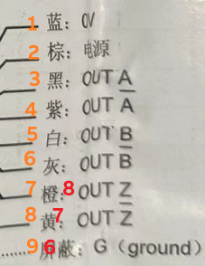
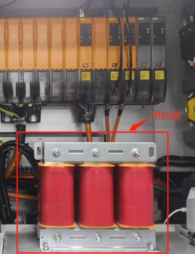
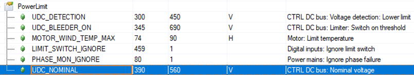

# ACOPOS 错误描述中文信息

ACOPOS 错误文本描述如下：

适用范围： ACP10/ARNC0

本节的主题:

| 错误报警号                                                   |
| ------------------------------------------------------------ |
| [7000: Encoder: Error active](#7000编码器错误激活)           |
| [7012: Encoder: Hiperface error bit](#7012编码器hiperface-错误位) |
| [7013: Encoder: Status message](#7013编码器状态消息)         |
| [7014: Encoder: CRC error during parameter transfer](#7014编码器参数传输过程中出现-crc-错误) |
| [7015: Encoder: Timeout error during data transmission](#7015编码器数据传输期间超时错误) |
| [7017: Encoder: Error while reading encoder parameter](#7017编码器读取编码器参数时出错) |
| [7022: Encoder: Initialization is active](#7022编码器初始化处于活动状态) |
| [7023: Encoder: Parameter transfer is active](#7023编码器参数传输已激活) |
| [7029: Encoder: Incremental signal amplitude too small](#7029编码器增量信号幅度太小) |
| [7030: Encoder: Incremental signal amplitude too large](#7030编码器增量信号幅度太大) |
| [7031: Encoder: Incremental signal amplitude too large (Disturbance)](#7031编码器增量信号幅度太大干扰) |
| [7032: Encoder: Incremental signal amplitude too small (Disturbance, no connection)](#7032编码器增量信号幅度太小干扰无连接) |
| [7033: Encoder: Incremental position step too large](#7033编码器增量位置步长太大) |
| [7036: Encoder: Interface ID invalid (Check slot and Interface EEPROM data)](#7036编码器接口-id-无效检查插槽和接口-eeprom-数据) |
| [7038: Encoder: Position value not synchronous with absolute value](#7038编码器位置值与绝对值不同步) |
| [7039: Incremental encoder: Cable disturbance track A](#7039增量编码器电缆干扰轨迹-a) |
| [7040: Incremental encoder: Cable disturbance track B](#7040增量编码器电缆干扰轨迹-b) |
| [7041: Incremental encoder: Cable disturbance track R](#7041增量编码器电缆干扰轨道-r) |
| [7042: Incremental encoder: Edge distance of quadrature signal too small](#7042增量编码器正交信号的边缘距离太小) |
| [7043: Encoder: Cable disturbance track D](#7043编码器电缆干扰轨道-d) |
| [7044: Encoder: Parity](#7044编码器奇偶校验)                 |
| [7045: Resolver: Signal disturbance (plausibility check)](#7045旋转变压器信号干扰合理性检查) |
| [7046: Resolver: Cable disturbance](#7046旋转变压器电缆干扰) |
| [7047: Invalid distance of reference marks](#7047无效的参考标记距离) |
| [7048: Error during the reading of encoder memory](#7048读取编码器存储器时出错) |
| [7049: Abnormal encoder current consumption](#7049编码器电流消耗异常) |
| [7050: Incremental encoder: Illegal AB signal change](#7050增量编码器ab-信号非法改变) |
| [7051: Encoder: Acceleration too large (Disturbance)](#7051编码器加速度太大干扰) |
| [7052: Encoder: Encoder is not Supported](#7052编码器编码器不支持) |
| [7053: Encoder: Power supply faulty](#7053编码器电源故障)    |
| [7054: Encoder: Position in channel already defined](#7054编码器已定义通道中的位置) |
| [7055: Encoder: Invalid content type 'frame end'](#7055编码器无效的内容类型帧结束) |
| [7057: Encoder: Register read/write forbidden or not implemented](#7057编码器寄存器读写禁止或未实现) |
| [7058: Encoder: Alarm bit is set](#7058编码器设置了警报位)   |
| [7059: Virtual Encoder: Error state](#7059虚拟编码器错误状态) |
| [7060: Virtual Encoder: Transition error](#7060虚拟编码器转换错误) |
| [7061: Virtual Encoder: stall detection](#7061虚拟编码器失速检测) |
| [7062: Encoder: SafeMOTION module not ready](#7062编码器safemotion-模块未准备好) |
| [7063: Encoder: Error in the UART communication](#7063编码器uart-通信错误) |
| [7064: Encoder: Error in the SafeMOTION communication](#7064编码器safemotion-通信错误) |
| [7065: Encoder: Encod type invalid](#7065编码器编码类型无效) |
| [7066: Encoder: Encoder not ready](#7066编码器编码器未准备好) |
| [7067: Encoder: SafeMOTION modul not in operational state](#7067编码器safemotion-模块未处于运行状态) |
| [7068: Encoder: Maximum cycle time exceeded](#7068编码器超出最大循环时间) |
| [7069: Encoder: encoder error filter activ](#7069编码器编码器错误过滤器激活) |
| [7070: Encoder: Lag error stop limit exceeded](#7070编码器超出滞后错误停止限制) |
| [7071: Encoder: Limit speed error exceeded](#7071编码器超出限制速度错误) |
| [7072: Encoder: Transfer time position exceeded](#7072编码器超出传输时间位置) |
| [7073: Encoder: Multiturn failure](#7073编码器多圈故障)      |
| [7074: Encoder: SafeMOTION error](#7074编码器safemotion-错误) |
| [7075: Encoder: Incorrect configuration encoder type](#7075编码器配置编码器类型不正确) |
| [7076: Encoder: Data transfer active](#7076编码器数据传输激活) |
| [7077: Encoder: Encoder evaluation blocked by the SafeMOTION configuration](#7077编码器safemotion-配置阻止了编码器评估) |
| [7078: Encoder: Inter-segment communication failed](#7078编码器段间通信失败) |
| [7079: Encoder: Internal error](#7079编码器内部错误)         |
| [7080: Encoder: Error in the encoder communication](#7080编码器编码器通讯错误) |
| [7081: Encoder: Timeout during initialization](#7081编码器初始化期间超时) |
| [7082: Encoder: Link to encoder disturbed](#7082编码器到编码器的链接被干扰) |
| [7083: Reference pulse monitoring: Faulty position, resolution, or reference pulse](#7083参考脉冲监控位置分辨率或参考脉冲错误) |
| [7084: Encoder: Error in the position evaluation](#7084编码器位置评估错误) |
| [7085: Encoder: SafeMOTION not initialized](#7085编码器safemotion-未初始化) |
| [7087: Encoder Emulation: Network connection interrupted](#7087编码器仿真网络连接中断) |
| [7089: Encoder: HIPERFACE DSL: Online status: Bit 2: QMLW: Quality monitor. Low-level](#7089编码器hiperface-dsl在线状态位-2qmlw质量监视器-低级) |
| [7090: Encoder: HIPERFACE DSL: Online status: Bit 3: FIX0: Bit not '0'](#7090编码器hiperface-dsl在线状态位-3fix0位不是0) |
| [7091: Encoder: HIPERFACE DSL: Online status: Bit 8: PRST: Protocol reset](#7091编码器hiperface-dsl在线状态位-8prst协议重置) |
| [7092: Encoder: HIPERFACE DSL: Online status: Bit 9: DTE: Deviation Threshold Error](#7092编码器hiperface-dsl在线状态位-9dte偏差阈值错误) |
| [7093: Encoder: HIPERFACE DSL: Online status: Bit 12: FIX1: Bit not '1'](#7093编码器hiperface-dsl在线状态位-12fix1位不是1) |
| [7094: Encoder: HIPERFACE DSL: Online status: Bit 14: SUM: Summary byte enc. status](#7094编码器hiperface-dsl在线状态位-14sum摘要字节编码-地位) |
| [7095: Encoder: Encoder type not supported by SafeMOTION firmware](#7095编码器safemotion-固件不支持编码器类型) |
| [7100: Parameter function is not supported.](#7100参数功能不支持) |
| [7103: Incompatible interface](#7103接口不兼容)              |
| [7104: Initialization aborted](#7104初始化中止)              |
| [7200: DC bus: Overvoltage](#7200直流母线过压)               |
| [7210: DC bus: Pre-charging: Voltage unstable](#7210直流母线预充电电压不稳定) |
| [7211: DC bus: Voltage dip](#7211直流母线电压骤降)           |
| [7212: DC bus: Large voltage dip](#7212直流母线电压骤降大)   |
| [7214: DC bus: Pre-charging resistor hot (too many power line fails)](#7214直流母线预充电电阻热电源线故障太多) |
| [7215: Power mains: At least one phase of the power line failed](#7215电源至少电源线的一相出现故障) |
| [7217: DC bus: Nominal voltage detection: Voltage too high](#7217直流母线标称电压检测电压过高) |
| [7218: DC bus: Nominal voltage detection: Voltage too low](#7218直流母线标称电压检测电压过低) |
| [7219: DC bus: Pre-charging: Voltage too low](#7219直流母线预充电电压过低) |
| [7220: DC bus: Nominal voltage detection: Voltage not allowed](#7220直流母线标称电压检测电压不允许) |
| [7221: Mains: Failure](#7221电源故障)                        |
| [7222: Inverter: Summation current: Overcurrent](#7222逆变器总和电流过电流) |
| [7223: DC bus: Overvoltage DC-GND](#7223直流母线过压-dc-gnd) |
| [7224: Connector to back plane: 24V-GND contact monitoring: Voltage too low](#7224背板连接器24v-gnd-接触监控电压过低) |
| [7225: DC bus: Overvoltage](#7225直流母线过压)               |
| [7226: DC bus: Overcurrent](#7226直流母线过流)               |
| [7227: Bleeder: Overcurrent](#7227泄放器过流)                |
| [7228: DC bus: Nominal voltage detection: High inrush current](#7228直流母线标称电压检测高浪涌电流) |
| [7229: Chopper: Overcurrent](#7229斩波器过流)                |
| [7230: DC bus: center voltage limit exceeded](#7230直流母线超出中心电压限制) |
| [7231: Motor: Overvoltage](#7231电机过压)                    |
| [7232: Mains: Detected frequency outside the range [20,200]](#7232主电源检测到的频率超出范围-20200) |
| [7300: Analog/Digital IO: IO Configuration invalid](#7300模拟数字-ioio-配置无效) |
| [7303: Analog/Digital IO: 24V power supply fail](#7303模拟数字-io24v-电源故障) |
| [7304: Analog/Digital IO: Network connection interrupted](#7304模拟数字-io网络连接中断) |
| [7305: Digital IO: Digital output: Diagnose bit active](#7305数字-io数字输出诊断位激活) |
| [7306: Analog IO: Analog output: Diagnose bit active](#7306模拟-io模拟输出诊断位激活) |
| [7401: Parameter position exceeds maximum data length](#7401参数位置超过最大数据长度) |
| [7402: Processing of parameter sequence aborted: Write error](#7402参数序列的处理中止写入错误) |
| [7403: Processing of parameter sequence is still active](#7403参数序列的处理仍然有效) |
| [7404: Parameter sequence not available at index](#7404参数序列在索引处不可用) |
| [8001: EEPROM select not valid](#8001-eeprom-选择无效)       |
| [8003: Table index not valid](#8003-表索引无效)              |
| [8004: EEPROM variable type not valid](#8004-eeprom-变量类型无效) |
| [8005: EEPROM type not valid](#8005-eeprom-类型无效)         |
| [8006: Value of EEPROM parameter is zero](#8006-eeprom-参数值为零) |
| [8007: Value of EEPROM parameter is not valid](#8007-eeprom-参数值无效) |
| [8011: EPROM: Data not valid](#8011eprom数据无效)            |
| [8012: EPROM: Controller-ID not valid](#8012eprom控制器-id-无效) |
| [8013: EPROM: CRC error](#8013epromcrc-错误)                 |
| [8020: Invalid switch frequency](#8020无效的开关频率)        |
| [8021: User decice configuration data: CRC error](#8021用户设备配置数据crc-错误) |
| [8022: User decice configuration data: Parameter value invalid](#8022用户设备配置数据参数值无效) |
| [9000: Heatsink temperature sensor: Stop limit exceeded](#9000散热器温度传感器超出停止限制) |
| [9001: Heatsink temperature sensor: Switch off limit exceeded](#9001散热器温度传感器超出关闭限制) |
| [9003: Heatsink temperature sensor: Not connected or destroyed](#9003散热器温度传感器未连接或损坏) |
| [9010: Temperature sensor (Motor\|Choke\|External): Stop limit exceeded](#9010温度传感器电机扼流圈外部超出停止限制) |
| [9011: Temperature sensor (Motor\|Choke\|External): Switch off limit exceeded](#9011温度传感器电机扼流圈外部超出关闭限制) |
| [9012: Temperature sensor (Motor\|Choke\|External): Not connected or destroyed](#9012温度传感器电机扼流圈外部未连接或损坏) |
| [9013: Temperature sensor (Motor\|Choke\|External): Short circuit](#9013温度传感器电机扼流圈外部短路) |
| [9030: Junction temperature model: Stop limit exceeded](#9030结温模型超出停止限制) |
| [9031: Junction temperature model: Switch off limit exceeded](#9031结温模型超出关闭限制) |
| [9040: Bleeder temperature model: Stop limit exceeded](#9040泄放温度模型超出停止限制) |
| [9041: Bleeder temperature model: Switch off limit exceeded](#9041泄放温度模型超出关闭限制) |
| [9050: ACOPOS peak current: Stop limit exceeded](#9050acopos-峰值电流超出停止限制) |
| [9051: ACOPOS peak current: Switch off limit exceeded](#9051acopos-峰值电流超出关闭限制) |
| [9060: ACOPOS continuous current: Stop limit exceeded](#9060acopos-持续电流超出停止限制) |
| [9061: ACOPOS continuous current: Switch off limit exceeded](#9061acopos-持续电流超出关闭限制) |
| [9070: Motor temperature model: Stop limit exceeded](#9070电机温度模型超出停止限制) |
| [9071: Motor temperature model: Switch off limit exceeded](#9071电机温度模型超出关闭限制) |
| [9075: ACOPOS continuous power: Stop limit exceeded](#9075acopos-持续功率超出停止限制) |
| [9076: ACOPOS continuous power: Switch off limit exceeded](#9076acopos-持续供电超出关闭限制) |
| [9078: Power stage: Temperature sensor 1: Stop limit exceeded](#9078功率级温度传感器-1超出停止限制) |
| [9079: Power stage: Temperature sensor 1: Switch off limit exceeded](#9079功率级温度传感器-1超出关闭限制) |
| [9080: Pre-charging resistor temperature model: Stop limit exceeded](#9080预充电电阻温度模型超出停止限制) |
| [9081: Power stage temperature model: Stop limit exceeded](#9081功率级温度模型超出停止限制) |
| [9082: Power stage temperature model: Switch off limit exceeded](#9082功率级温度模型超出关闭限制) |
| [9083: Power stage: Temperature sensor 2: Stop limit exceeded](#9083功率级温度传感器-2超出停止限制) |
| [9084: Power stage: Temperature sensor 2: Switch off limit exceeded](#9084功率级温度传感器-2超出关闭限制) |
| [9085: Power stage: Temperature sensor 3: Stop limit exceeded](#9085功率级温度传感器-3超出停止限制) |
| [9086: Power stage: Temperature sensor 3: Switch off limit exceeded](#9086功率级温度传感器-3超出关闭限制) |
| [9087: Power stage: Temperature sensor 4: Stop limit exceeded](#9087功率级温度传感器-4超出停止限制) |
| [9088: Power stage: Temperature sensor 4: Switch off limit exceeded](#9088功率级温度传感器-4超出关闭限制) |
| [9089: Encoder temperature sensor: Stop limit exceeded](#9089编码器温度传感器超出停止限制) |
| [9090: Encoder temperature sensor: Temperature value not valid](#9090编码器温度传感器温度值无效) |
| [9091: 24V Supply/Main relay temperature sensor: Stop limit exceeded](#909124v-电源主继电器温度传感器超出停止限制) |
| [9092: Power stage: Temperature sensor 5: Stop limit exceeded](#9092功率级温度传感器-5超出停止限制) |
| [9093: Power stage: Temperature sensor 5: Switch off limit exceeded](#9093功率级温度传感器-5超出关闭限制) |
| [9094: Rectifier temperature model: Stop limit exceeded](#9094整流器温度模型超出停止限制) |
| [9095: Rectifier temperature model: Switch off limit exceeded](#9095整流器温度模型超出关闭限制) |
| [9096: DC bus relay temperature model: Stop limit exceeded](#9096直流总线继电器温度模型超出停止限制) |
| [9097: DC bus relay temperature model: Switch off limit exceeded](#9097直流总线继电器温度模型超出关闭限制) |
| [9098: DC bus capacitor temperature model: Stop limit exceeded](#9098直流母线电容器温度模型超出停止限制) |
| [9099: DC bus capacitor temperature model: Switch off limit exceeded](#9099直流母线电容器温度模型超出关闭限制) |
| [9100: DC bus: Continuous total power: Stop limit exceeded](#9100直流母线连续总功率超出停止限制) |
| [9101: DC bus: Continuous total power: Switch off limit exceeded](#9101直流母线持续总功率超出关闭限制) |
| [9102: DC bus: Peak total power: Stop limit exceeded](#9102直流母线峰值总功率超出停止限制) |
| [9103: DC bus: Peak total power: Switch off limit exceeded](#9103直流母线峰值总功率超出关闭限制) |
| [9104: DC connector temperature model: Stop limit exceeded](#9104直流连接器温度模型超出停止限制) |
| [9105: DC connector temperature model: Switch off limit exceeded](#9105直流连接器温度模型超出关闭限制) |
| [9106: Power stage: Temperature sensor: Stop limit exceeded](#9106功率级温度传感器超出停止限制) |
| [9107: Power stage: Temperature sensor: Switch off limit exceeded](#9107功率级温度传感器超出关闭限制) |
| [9108: Motor: Temperature sensor: Multiplexer reference voltage fail](#9108电机温度传感器多路复用器参考电压故障) |
| [9110: Motor temperature model: Stop limit exceeded](#9110电机温度模型超出停止限制) |
| [9111: Motor temperature model: Switch off limit exceeded](#9111电机温度模型超出关闭限制) |
| [9300: Current controller: Overcurrent](#9300电流控制器过流) |
| [9302: Current controller: Cycle time invalid](#9302电流控制器循环时间无效) |
| [9303: Infeed: Summation current: Overcurrent](#9303馈电总和电流过电流) |
| [10000: Identification parameter(s) missing](#10000缺少标识参数) |
| [10001: Parameter identification: Invalid sub-mode](#10001参数标识子模式无效) |
| [10100: Parameter identification: Quality factor not fulfilled](#10100参数标识未满足质量系数) |
| [10101: No ISQ-filter free](#10101没有isq滤波器空闲)         |
| [10102: No resonance-frequency for ISQ-filter (band-stop) found](#10102未找到isq滤波器的谐振频率带阻) |
| [10103: Autotuning: Maximum lag error exceeded](#10103自动调谐超出最大滞后误差) |
| [10104: Parameter identification: Movement during identification of the position](#10104参数识别位置识别过程中的移动) |
| [10105: Parameter identification: Plausibility check of the shuttle positions](#10105参数识别穿梭机位置的合理性检查) |
| [10500: Induction stop was terminated](#10500感应停止已终止) |
| [11000: Inter segment communication: Wiring fault](#11000段间通信接线故障) |
| [11101: Encoder: Signal amplitude too low](#11101编码器信号幅度过低) |
| [11102: Encoder: Signal amplitude too high](#11102编码器信号幅度过高) |

## 7000：编码器：错误激活

描述：

编码器驱动程序报告带有附加信息的错误（与编码器编号不同）。

为了能够建立与编码器的分配，该错误会与编码器编号一起作为附加信息附加报告。

反应：

请参阅进一步的错误。

原因/补救措施：

查看更多错误.

## 7012：编码器：Hiperface 错误位

描述：

读取或写入参数时 HIPERFACE? 编码器中的运行时错误。 HIPERFACE?encoder与AC121插卡之间传输数据时发生错误。 结果，设置了错误位。 由于无法处理的命令（协议错误、命令参数）或由于内部编码器错误而设置此错误位。

反应：

输入了错误号 7013。

原因/补救措施：

查看另外输入的错误编号.

## 7013：编码器：状态消息

描述：

带有激活监视器的编码器中的运行错误（激活，参见错误编号 [7030](#7030编码器增量信号幅度太大)). 此状态码应提供有关错误原因的答案。

反应：

查看错误编号 [7030](#7030编码器增量信号幅度太大).

原因/补救措施：

见编码器接口说明或编码器数据表.

## 7014：编码器：参数传输过程中出现 CRC 错误

描述：

带有激活监视器的编码器中的运行错误（激活，参见错误编号 [7030](#7030编码器增量信号幅度太大)). 数据或位置传输期间发生 CDC 错误。

反应：

在编码器初始化期间重复传输。

写入参数时传输中止。

原因/补救措施：

编码器电压骤降（通过插卡供电时检查 ACOPOS 24VDC 电源）。

编码器故障。

SSI 编码器连接中断或损坏。 请参阅接线指南错误编号 [7030](#7030编码器增量信号幅度太大).

AC120 或 AC121 插卡缺陷。

| 应用案例                                                                                                                                                                                                                                                                                    |
|---------------------------------------------------------------------------------------------------------------------------------------------------------------------------------------------------------------------------------------------------------------------------------------------|
| 2022.01.11 编码器校验错误，数据异常： 1、重新插拔电机侧编码器电缆 2、重新插拔驱动器侧编码器电缆 3、与距离最近的驱动器交换编码器卡，验证报警是否跟随编码器卡变动到另一电机 4、与距离最近的电机交换安装编码器线（电机侧和驱动器侧），验证报警是否跟随编码器线变动到另一电机 5、更换编码器电缆 |
| 2023.03.21 电机编码器电缆接头处的问题，稍微震动即会报警 更换编码器电缆                                                                                                                                                                                                                      |
| 2023.03.21 **现象** 随机出现7022、7038、7014、7048 **原因** ACOPOSmulti的Endat连接器的插座上的螺丝没有拧紧                                                                                                                                   |

## 7015：编码器：数据传输期间超时错误

描述：

带有激活监视器的编码器中的运行错误（激活，参见错误编号 [7030](#7030编码器增量信号幅度太大)). 数据传输过程中发生超时错误。 编码器未发送对发送请求的答复。

反应：

在编码器初始化期间重复传输。

写入参数时传输中止。

原因/补救措施：

未连接编码器。

另请参阅错误编号 [7014](#7014编码器参数传输过程中出现-crc-错误).

| 应用案例                                                                                                                                                |
|---------------------------------------------------------------------------------------------------------------------------------------------------------|
| 2023.03.21 **现象** 现场使用 “Hengstler 空心轴编码器 AD35” 频繁出现7015报警 **原因** 由于客户在接线焊接时由于失误，将电源地和信号地接错，导致故障频发。 |

## 7017：编码器：读取编码器参数时出错

描述：

带有激活监视器的编码器中的运行错误（激活，参见错误编号 [7030](#7030编码器增量信号幅度太大)). 编码器数据包含错误或不受支持。

反应：

查看错误编号 [7030](#7030编码器增量信号幅度太大).

原因/补救措施：

EnDat 编码器：

编码器数据校验和错误。

HIPERFACE 编码器：

不支持编码器类型.

## 7022：编码器：初始化处于活动状态

描述：

带有激活监视器的编码器中的运行错误（激活，参见错误编号 [7030](#7030编码器增量信号幅度太大)). 编码器初始化未完成。

反应：

不执行写入命令电机数据、读/写 PROM 数据等。

另请参阅错误编号 [7030](#7030编码器增量信号幅度太大).

原因/补救措施：

未连接编码器。

编码器故障。

由于 AB 信号故障，编码器初始化处于活动状态。

串行通信错误（参见另外输入的错误编号）.

| 应用案例                                                                                                                                                                                                                                                                                                                                                                                                                                                                                                                                                                                                                                                                                                  |
|-----------------------------------------------------------------------------------------------------------------------------------------------------------------------------------------------------------------------------------------------------------------------------------------------------------------------------------------------------------------------------------------------------------------------------------------------------------------------------------------------------------------------------------------------------------------------------------------------------------------------------------------------------------------------------------------------------------|
| 2022.01.10 外接编码器电缆没有接地并且电机的动力电缆没有接地，导致外接编码器时不时报错 7022 和 7031 ，并且背标贴标驱动器接收不到编码器数值。 接地很重要！                                                                                                                                                                                                                                                                                                                                                                                                                                                                                                                                                  |
| 2022.01.10 这个错误与 7038 在上电的时候报出来。可以复位掉。 这个错误的原因是：在第二个参数表中使用了ID578，但是由于ID578生效的快，但是外部编码器实际硬件检查的慢，还没有检测出来，所以会有这个错误发生。这个问题的解决是把对外部编码器的使用放到第二个参数表里就好。如果是默认的参数表会有问题。                                                                                                                                                                                                                                                                                                                                                                                                          |
| 2023.03.21 **现象** 随机出现7022、7038、7014、7048 **原因** ACOPOSmulti的Endat连接器的插座上的螺丝没有拧紧                                                                                                                                                                                                                                                                                                                                                                                                                                                                                                                                                 |
| 2023.03.21 编码器初始化问题，通常是编码器线电机侧或者驱动器侧没拧紧，编码器线可能有问题，或者编码器卡有问题。 需要按照上述的问题排除。先排除拧紧，再排除编码器卡，最后更换线。                                                                                                                                                                                                                                                                                                                                                                                                                                                                                                                            |
| 2023.03.21 **现象** 电机报错7022、7048、9003、9000，其它电机报错64006。随后所有使用HomeRestore的电机相位丢失 **原因** 使用了Home Restore Position功能 偶发的Permanent变量丢失问题会导致HomeRestore异常 **解决方式** 需要重新标定零点  若重新标定零点无法接受，可以考虑以下方案: InitEndlessPosition的问题是，当你丢失了永久保持变量或者掉电保持变量，位置的数据丢失了，必须重新进行Home。 为了避免这种情况，可以将MC_ENDLESS_POSITION不断存储到一个文件中。启动后，如果永久变量为空，在执行归位恢复模式（homing restore position mode）前，可以将文件中的那些数据写入MC_ENDLESS_POSITION变量。 可以将轴的整个永久保持变量数据结构体包括校验和备份到文件或DataObj中。需要注意的是，整个内存都被完整复制。  |

## 7023：编码器：参数传输已激活

描述：

读取/写入编码器 OEM 数据时出现响应错误。 对编码器 OEM 数据的读/写访问已激活，但尚未完成。

反应：

不执行命令。

原因/补救措施：

两次读/写访问之间的间隔太短。

串行通信错误（参见另外输入的错误编号）.

## 7029：编码器：增量信号幅度太小

描述：

带有激活监视器的编码器中的运行错误（激活，参见错误编号 [7030](#7030编码器增量信号幅度太大)). 正弦 AB 信号的幅度小于可以显示的最大幅度的 17.5% (AC120) 或 20.0% (AC121)（参见 ACOPOS 用户手册）。

反应：

查看错误编号 [7030](#7030编码器增量信号幅度太大).

原因/补救措施：

无编码器电源或电源包含错误。

另请参阅错误编号 [7030](#7030编码器增量信号幅度太大).

## 7030：编码器：增量信号幅度太大

描述：

已激活监视器的编码器中的运行错误。

**监视器通过以下配置激活：**

\- 归位编码器位置（CMD_HOMING、ENCOD2_CMD_HOMING、ENCOD3_CMD_HOMING）。

\- 用于驱动器控制的编码器位置（VCTRL_S_ACT_PARID、PCTRL_S_ACT_PARID）。

\- 打开驱动控制 (CMD_CONTROLLER)。 另请参阅错误编号 [4005](#4005控制器无法开启驱动处于错误状态).

\- 用于凸轮耦合的编码器位置 (CAM_MA_AXIS)。

\- 用于凸轮自动机的编码器位置（AUT_MA_AXIS、AUT_MA_AXIS_VAX1、AUT_MA_ADD_AXIS、AUT_MA_ADD_AXIS_VAX1、AUT_SL_ADD_AXIS、AUT_SL_ADD_AXIS_VAX1）。

\- 用于鼓音序器 (DRUMSEQ_MA_AXIS) 的编码器位置。

\- 用于网络耦合的编码器位置 (MA1/2/3_CYCLIC_SEND)。

\- 用于编码器仿真输出值的编码器位置 (ENCOD2/3_OUT_PARID)。

\- 用于 Latch 的编码器位置 (LATCH1/2_VALUE_PARID)。

\- 用于循环设定值输入的编码器位置 (CYC_ABS_MOVE_PARID)。

\- 用于 FUB 指针参数 ID 的编码器位置（例如 PID_IN_PARID 等）。

AB 正弦信号的幅度大于可以显示的最大幅度的 99%（参见 ACOPOS 用户手册）。

反应：

“打开控制器”命令：查看错误编号 [4005](#4005控制器无法开启驱动处于错误状态).

“归位”命令：查看错误编号 [5034](#5034无法进行归位程序编码器错误).

其他命令：不执行命令。

**当控制器处于活动状态时：**

带同步电机的位置和电机编码器：通过短路制动和关闭控制器停止运动。

带异步电机的位置和电机编码器：通过短路制动和关闭控制器停止运动。

有源双编码器位置控制器的位置编码器：参见错误编号 [4007](#4007超出滞后错误停止限制).

设置 STOP_ERR_DECEL_RAMP=ncCTRL_OFF：通过立即关闭控制器和电源部分来中止运动。 驱动器没有电气扭矩。

**数据连接：**

网络耦合编码器：见错误编号 [1008](#1008网络耦合主站已停用---编码器错误).

凸轮自动编码器：参见错误编号 [5111](#5111凸轮耦合中止编码器错误).

**状态：**

位置或电机编码器：“控制器就绪”状态被重置。

“归位有效”状态被重置。

“换向有效”状态被复位。

原因/补救措施：

无编码器电源或电源包含错误。

Sense +5V 或Sense COM 未连接。

编码器AB信号电平不符合插卡规格（查看编码器数据表）。

AB 编码器连接中断或损坏。检查接线指南。

编码器读头未调整。

整个运动区域的编码器读取头安装公差太大。

编码器测量不再干净。

未连接编码器。

编码器故障。

AC120 或 AC121 插卡缺陷。

**接线指南：**

1\. 检查线路开路、线路端接、触点松动和接线错误

2\. 检查干扰的周期性发生。接触器或继电器等感应开关元件应配备相应的抑制元件，如压敏电阻、RC 元件或阻尼二极管。

3\. 为防止干扰影响电机线、编码器线、控制器线和数据线必须适当屏蔽。

4\. 所有电气连接都应尽可能短。

5\. 在所有插卡上，用于固定模块的所有螺钉必须拧紧，以便安装支架接地。

6\. 应使用带铜网或镀锡铜网的屏蔽电缆。不允许使用单根导线扭转或延长保护网。如果可能，未使用的电缆导体应在两侧接地。

7\. 电缆屏蔽层必须连接到屏蔽连接器上。电缆屏蔽层应连接到指定的屏蔽端子和插头外壳上。

8.1.通过 DSUB 插头连接电缆：必须使用金属或镀金属插头外壳中的指定夹子连接电缆屏蔽层。紧固螺钉必须拧紧。

8.2.通过端子连接电缆：电缆屏蔽层必须连接到屏蔽连接端子上。

8.3.通过 RJ45 插头连接电缆：将电缆屏蔽层接地也可改善 EMC 特性。两侧应在连接器附近正确接地。

9\. 在电机侧，编码器电缆屏蔽层使用编码器插头连接到电机外壳，并通过机器接地。拔下模块侧的编码器电缆。测量电缆屏蔽（DSUB 插头外壳）与接地（开关柜中的接地连接）之间的电阻。电阻不得超过 0.2 欧姆。

10\. 电机线路的电缆屏蔽层或外部制动电阻的连接电缆使用提供的接地夹通过接地板与 ACOPOS 的外壳连接。

11\. 在电机侧，电机线的电缆屏蔽层使用电机插头连接到电机外壳，并通过机器接地。外部制动电阻连接电缆上的电缆屏蔽层必须与制动电阻外壳相连.

## 7031：编码器：增量信号幅度太大（干扰）

描述：

带有激活监视器的编码器中的运行错误（激活，参见错误编号 [7030](#7030编码器增量信号幅度太大)).AB 正弦信号的幅度大于可显示最大幅度的 100%（参见 ACOPOS 用户手册）

反应：

查看错误编号 [7030](#7030编码器增量信号幅度太大).

原因/补救措施：

另请参阅错误编号 [7030](#7030编码器增量信号幅度太大).

| 应用案例                                                                                                                                             |
|------------------------------------------------------------------------------------------------------------------------------------------------------|
| 2022.01.10 外接编码器电缆没有接地并且电机的动力电缆没有接地，导致外接编码器时不时报错7022和7031，并且背标贴标驱动器接收不到编码器数值。 接地很重要！ |
| 2022.01.10 驱动器switch on的时候报错 6057 , 7031 , 7038 ，都是编码器的问题。最后对编码器电缆进行了加固，问题解决。                                   |

## 7032：编码器：增量信号幅度太小（干扰，无连接）

描述：

带有激活监视器的编码器中的运行错误（激活，参见错误编号 [7030](#7030编码器增量信号幅度太大)). AB 正弦信号的幅度小于可显示最大幅度的 10%（参见 ACOPOS 用户手册） -\> ACOPOS 伺服驱动器无法识别编码器。

反应：

内部状态“位置同步”被重置。

另请参阅错误编号 [7029](#7029编码器增量信号幅度太小).

原因/补救措施：

无编码器电源或电源包含错误。

另请参阅错误编号 [7029](#7029编码器增量信号幅度太小).

| 应用案例                                                                                                                                                                                                                                                                                                                                                                                                                                                 |
|----------------------------------------------------------------------------------------------------------------------------------------------------------------------------------------------------------------------------------------------------------------------------------------------------------------------------------------------------------------------------------------------------------------------------------------------------------|
| 2023.02.14 1. 检查电机侧编码器接头是否拧紧，针脚有松动弯曲，缺失。 2. 检查编码器电缆是否有磨损。建议使用新的编码器线缆进行排除。 3. 驱动器侧屏蔽是否良好并接上，驱动器侧编码器卡及电缆是否处于紧固状态。 4. 检查编码器卡是否完好，且型号和实际使用匹配。建议更新新的编码器卡测试。 5. 如上排除后，仍不能排除故障，建议更换电机或者更换电机编码器。 6. 建议同时查看是否有其他的编码器类型伺服报错，并依照其他伺服报错进行排除。                           |
| 2023.02.14 **现象：** 运行了大概半小时报错4007（lagerror过大）和7032（增量信号振幅太小）和6057（编码器报错）和6054（电流过冲） **原因：** 经排查发现muti编码器连线摆放过于密集，产生干扰导致编码器位置数据跳动，致使lagerror过大，导致电流增大最终电流过冲。                                                                                                                                              |
| 2022.02.14 **现象：** 电机PowerOn时Resolver编码器报警7081、7032、6057。 **解决方案：** 排查线缆、编码器卡问题，最后确认电机编码器故障。                                                                                                                                                                                                                                                                                                                  |
| 2022.03.21 resolver 电机现场报出7032 现场测量发现报错的 resolver 编码器的阻值(50 欧姆)大于正常的线的阻值(1 欧姆)，终端客户现场将ParID 1048：NCOD_TRANS_RATIO 修改成 0.4 后不再报警                                                                                                                                                                                                                                                                       |
| 2022.03.21 **现象** ACP10版本 V2.32.2与V2.52.4版本，使用resolver电机会报7032，更新ACP10版本至V3.18.2则不报。 **原因** 7032出现的原因为信号值低于A_min时报错 GUID: 7d12da53-099a-493b-9f62-7b6a22e2d6f0 **解决方式** 1. 升级ACP10版本至V3.10.0及以上 2.若无法升级ACP10版本，将ENCOD_TRANS_RATIO由默认值0.5调整到0.4 **后续版本变更** ACP10 V2.47.0，调整ENCOD_TRANS_RATIO从[0.2..0.5]到[0.2..0.55] ACP10 V3.10.0，部分编码器卡ENCOD_TRANS_RATIO不再起作用 |
| 2022.03.21 **现象** 现场设备电机偶发报出39003、7032等错误 拆开电机与减速箱的连接，发现电机轴与减速机连接的地方顶在一起（如下图），这样电机轴受到轴向的作用力，这样电机编码器（海德翰32线磁性编码器）就有可能偏心，导致报警    **解决方案** 用角磨机把连接部分磨掉3到4个毫米，确保安装后电机轴向不再受力                                                                                                   |
|                                                                                                                                                                                                                                                                                                                                                                                                                                                          |

## 7033：编码器：增量位置步长太大

描述：

带有激活监视器的编码器中的运行错误（激活，参见错误编号 [7030](#7030编码器增量信号幅度太大)).

不允许的位置跳跃。

反应：

原因/补救措施：

编码器速度太高。

编码器连接中断或损坏。

编码器配置不正确.

| 应用案例                                                                                                                                                                                                                                                                                                                                                                                                                                                                                                                                                                                                                                                                                                                                                                                                                                                                                                                                                                                                                                                                                                                                                                                                                                                                                                              |
|-----------------------------------------------------------------------------------------------------------------------------------------------------------------------------------------------------------------------------------------------------------------------------------------------------------------------------------------------------------------------------------------------------------------------------------------------------------------------------------------------------------------------------------------------------------------------------------------------------------------------------------------------------------------------------------------------------------------------------------------------------------------------------------------------------------------------------------------------------------------------------------------------------------------------------------------------------------------------------------------------------------------------------------------------------------------------------------------------------------------------------------------------------------------------------------------------------------------------------------------------------------------------------------------------------------------------|
| 2022.02.14 使用第三方伺服 **现象：** 为了保持位置和相位，使用HomeRestore功能。但实际在测试过程中，伺服运行5-10分钟会发生PLCopen层面的报警7033/6057。 **结论：** 初步怀疑为与homeRestore回零方式有关，估计第三方不能使用该种回零方式。测试中去除该回零方式后，伺服能长时间运行不报错。                                                                                                                                                                                                                                                                                                                                                                                                                                                                                                                                                                                                                                                                                                                                                                                                                                                                                                                                                                                                                                 |
| 2023.03.22 **现象** 与mappMotion有关（但也适用于ACP10），对于在PLC端（PureVAx, DS402Ax, ACP10SDC）而不是在ACOPOS HW计算的轴位置，可能会出现ACOPOS驱动错误7033："编码器：增量位置步长太大 "的报告。 在 "编码器速度过高 "的原因中，可以增加一个信息，即在两个任务类周期之间的速度高于1/2转（SCALE_ENCOD_INCR）也会导致错误。 PureVAx、DS402Ax或ACP10SDC等轴不允许以高于该速度的速度运行，因为这样就有可能在位置计算中出现错误。 **有用的Help章节** Motion control → ACP10/ARNC0 → Reference manual → ACP10 → ACOPOS Error Texts → 7033: Encoder: Incremental position step too large Motion control → mapp Motion → Programming → Libraries → Core → McDS402Ax → Technical information → Third-party servo drives → Important information Motion control → mapp Motion → Programming → Libraries → Core → McPureVAx → Technical information → General purpose axis interface → Complete hardware interface → Reading in the current position **可能的解决方法** 在机械元素--\>齿轮箱(Mechanical elements --\> Gearbox)下面的(DS402)mappMotion轴配置(axis configuration)中定义一个齿轮箱比率(gearbox ratio)。例如，使用输入=1，输出=100，并且由于100的系数，编码器设置--\>每转增量也乘以100的系数。 当这样做时，可以实现执行相同的运动，但由于在两个任务类周期之间没有高于1/2转的速度，可以避免错误的位置计算/错误7033。 |
|                                                                                                                                                                                                                                                                                                                                                                                                                                                                                                                                                                                                                                                                                                                                                                                                                                                                                                                                                                                                                                                                                                                                                                                                                                                                                                                       |
|                                                                                                                                                                                                                                                                                                                                                                                                                                                                                                                                                                                                                                                                                                                                                                                                                                                                                                                                                                                                                                                                                                                                                                                                                                                                                                                       |

## 7036：编码器：接口 ID 无效（检查插槽和接口 EEPROM 数据）

描述：

带有激活监视器的编码器中的运行错误（激活，参见错误编号 [7030](#7030编码器增量信号幅度太大)). 驱动器不支持编码器。

反应：

查看错误编号 [7030](#7030编码器增量信号幅度太大).

原因/补救措施：

插入卡未插入分配给编码器的插槽中。

不支持编码器的插入卡插入分配给编码器的插槽中。

由于硬件错误，读取了无效的插件卡 ID。 （插卡、PROM数据、SSI接口、总线板、模块插头等。)

| 应用案例                                                                                                                                                                                                                                                                                                            |
|---------------------------------------------------------------------------------------------------------------------------------------------------------------------------------------------------------------------------------------------------------------------------------------------------------------------|
| 2023.03.23 **现象** ACOPOSmulti主动电源模块无法PoweOn，报错7224，7036。 **解决方案** 通过查看Multi安装手册，对其进行拆卸重装以检测是否有连接不良的情况。结果刚一拧螺丝发现连接主动电源与底板的螺丝根本没拧紧，导致供电不足。同时Multi还有三个模块的连接螺丝未拧紧。  |

## 7038：编码器：位置值与绝对值不同步

描述：

带有激活监视器的绝对编码器中的运行错误（激活，参见错误编号 [7030](#7030编码器增量信号幅度太大)). 插卡的增量位置无法与编码器的绝对串行位置同步。

反应：

查看错误编号 [7030](#7030编码器增量信号幅度太大).

原因/补救措施：

串行通信错误（参见另外输入的错误编号）。

增量信号错误（参见额外输入的错误编号）.

| 应用案例                                                                                                                                                                                                                                                                                                                          |
|-----------------------------------------------------------------------------------------------------------------------------------------------------------------------------------------------------------------------------------------------------------------------------------------------------------------------------------|
| 2022.01.10 这个错误与 [7022](#7022编码器初始化处于活动状态) 在上电的时候报出来。可以复位掉。 这个错误的原因是：在第二个参数表中使用了ID578，但是由于ID578生效的快，但是外部编码器实际硬件检查的慢，还没有检测出来，所以会有这个错误发生。这个问题的解决是把对外部编码器的使用放到第二个参数表里就好。如果是默认的参数表会有问题。 |
| 2022.01.10 驱动器switch on的时候报错 [6057](#6057位置环控制器负载编码器错误) , [7031](#7031编码器增量信号幅度太大干扰) , [7038](#7038编码器位置值与绝对值不同步) ，都是编码器的问题。最后对编码器电缆进行了加固，问题解决。                                                                                                       |
| 2022.01.12 实际编码器类型与配置的编码器类型不一致                                                                                                                                                                                                                                                                                 |
| 2022.01.17 程序中电机类型是否与现场匹配                                                                                                                                                                                                                                                                                           |
| 2023.03.21 **现象** 随机出现7022、7038、7014、7048 **原因** ACOPOSmulti的Endat连接器的插座上的螺丝没有拧紧                                                                                                                                                                         |

## 7039：增量编码器：电缆干扰轨迹 A

描述：

带有激活监视器的增量编码器中的运行错误（激活，参见错误编号 [7030](#7030编码器增量信号幅度太大)). 信号 A 和 nA 必须相互补充。 重叠仅发生在切换边缘区域。 如果低电平或高电平长时间重叠，则记录到电缆干扰。

反应：

查看错误编号 [7030](#7030编码器增量信号幅度太大).

原因/补救措施：

未连接编码器。

无编码器电源或电源包含错误。

编码器连接中断或损坏。 请参阅接线指南错误编号 [7030](#7030编码器增量信号幅度太大).

编码器信号电平不符合插卡规格（查看编码器数据表）。

编码器故障。

AC123 插卡故障.

## 7040：增量编码器：电缆干扰轨迹 B

描述：

带有激活监视器的增量编码器中的运行错误（激活，参见错误编号 [7030](#7030编码器增量信号幅度太大)).信号 B 和 nB 不相互补充。

查看错误编号 [7039](#7039增量编码器电缆干扰轨迹-a).

反应：

查看错误编号 [7030](#7030编码器增量信号幅度太大).

原因/补救措施：

查看错误编号 [7039](#7039增量编码器电缆干扰轨迹-a).

| 应用案例                                                                                                                                                                                                                                                                                                                                                                                                                                                                                                                                                                                                                                                                                                                                                                                                                                                                                                                                                                                                                                                                                                                                                                                                           |
|--------------------------------------------------------------------------------------------------------------------------------------------------------------------------------------------------------------------------------------------------------------------------------------------------------------------------------------------------------------------------------------------------------------------------------------------------------------------------------------------------------------------------------------------------------------------------------------------------------------------------------------------------------------------------------------------------------------------------------------------------------------------------------------------------------------------------------------------------------------------------------------------------------------------------------------------------------------------------------------------------------------------------------------------------------------------------------------------------------------------------------------------------------------------------------------------------------------------|
| 2023.06.28 **故障号** 7040、7042、7050 **现象** 使用ACOPOS P3 + 8EAC151.00X-1 对接外接增量式编码器，其中使用了两根转接线，一根为官方转接线8ECG00X4.3151D-0，一根为第三方转接线，连接方式如下图:  8EAC151.00X-1的参数 ENCOD2_LINE_RESISTANCE 参数已写了4 Ohm （ 注: 若此参数不写或者设置的太小，则报错几率更大 ） 8EAC151.00X-1的ABR信号检测也已关闭  驱动器能够正常获取编码器的信号，但是在运行一段时间之后，会报出7040、7042、7050等故障号。  注：在ACOPOS型号上使用对应的编码器卡，关闭对应ABR相信号检查，能够正常使用。  **原因** 1. KOYO编码器的内部的接线错误，检查编码器接线，看到678三根接到987上，导致B相信号的互补信号丢失，抗干扰能力变差。   2. 使用的转接线较长，且使用两次转接线，会导致电压降低，抗干扰能力差。  **解决方式** 对应原因1： 重新改正编码器接线后，能够在原接线方式“ KOYO编码器 — 第三方转接线 — 官方短线 — 驱动器编码器卡 ”上正常使用，且不需要设置ENCOD2_LINE_RESISTANCE。  对应原因2： 在不修正编码器接线的情况下，外接编码器9 PIN 口改为15 PIN口，不使用第三方转接线，直接通过官方转接线与编码器卡连接，长时间运行，不会再报出错误。   |
| 2023.07.05 **现象** 当下载程序时，提示报错7040、39049 **问题原因** 与干扰有关，因此报警仅在一条线路上出现，建议更换线缆                                                                                                                                                                                                                                                                                                                                                                                                                                                                                                                                                                                                                                                                                                                                                                                                                                                                                                                                                                                                                                                                                            |

## 7041：增量编码器：电缆干扰轨道 R

描述：

带有激活监视器的增量编码器中的运行错误（激活，参见错误编号 [7030](#7030编码器增量信号幅度太大)). 信号 R 和 nR 不相互补充。

查看错误编号 [7039](#7039增量编码器电缆干扰轨迹-a).

反应：

查看错误编号 [7030](#7030编码器增量信号幅度太大).

原因/补救措施：

查看错误编号 [7039](#7039增量编码器电缆干扰轨迹-a).

如果编码器不支持参考脉冲并且它们不是必需的，则可以通过设置 ENCODX_LINE_CHK_IGNORE 的位 1 来禁用参考脉冲监视器.

| 应用案例                                                                                                                                                                                                                                                                                                                                      |
|-----------------------------------------------------------------------------------------------------------------------------------------------------------------------------------------------------------------------------------------------------------------------------------------------------------------------------------------------|
| 2023.03.22 **现象** 新设备，上电就报5034报警，使用AS的Test复位后报29226，再复位报7041，依次循环 **原因** 驱动器ACOPOS使用外接编码器8AC123.60-1，使用转接线，转接线针脚缺失，导致编码器卡的PIN 14,15没有接线   **解决方式** 更换编码器转接线缆   |

## 7042：增量编码器：正交信号的边缘距离太小

描述：

带有激活监视器的增量编码器中的运行错误（激活，参见错误编号 [7030](#7030编码器增量信号幅度太大)).评估正交信号（A/B 增量编码器信号）的每个边沿。 未达到两个边缘之间的时间间隔的限制值。

反应：

查看错误编号 [7030](#7030编码器增量信号幅度太大).

原因/补救措施：

编码器速度太高。

最大限度。 计数器频率 (ENCOD_OUTPUT_FREQUENCY) 设置为低（8BAC0123.00x-1 和 80VD100PD.C144-01）。

编码器连接中断或损坏。 请参阅接线指南错误编号 [7030](#7030编码器增量信号幅度太大).

信号A和B之间的相移不等于90度

编码器振动。

编码器故障。

插卡故障.

| 应用案例                                                                                                                                                                                                                                                                                                                                                                                                                                                                                                                                                                                                                                                                                                                                                                                                                                                                                                                                                                                                                                                                                                                                                                                                           |
|--------------------------------------------------------------------------------------------------------------------------------------------------------------------------------------------------------------------------------------------------------------------------------------------------------------------------------------------------------------------------------------------------------------------------------------------------------------------------------------------------------------------------------------------------------------------------------------------------------------------------------------------------------------------------------------------------------------------------------------------------------------------------------------------------------------------------------------------------------------------------------------------------------------------------------------------------------------------------------------------------------------------------------------------------------------------------------------------------------------------------------------------------------------------------------------------------------------------|
| 2023.03.22 **现象** 用手转动电机，就报警7042.而且正转时候，编码器卡的Up Down同时亮，反转时候只有Down亮。正常应该是一个方向只有一个指示灯亮。 **解决方式** 经检查，是其中三相异步电机的A相线鼻子端子做得不好，引起接触不好。重新压制，故障解决                                                                                                                                                                                                                                                                                                                                                                                                                                                                                                                                                                                                                                                                                                                                                                                                                                                                                                                                                                      |
| 2023.06.28 **故障号** 7040、7042、7050 **现象** 使用ACOPOS P3 + 8EAC151.00X-1 对接外接增量式编码器，其中使用了两根转接线，一根为官方转接线8ECG00X4.3151D-0，一根为第三方转接线，连接方式如下图:  8EAC151.00X-1的参数 ENCOD2_LINE_RESISTANCE 参数已写了4 Ohm （ 注: 若此参数不写或者设置的太小，则报错几率更大 ） 8EAC151.00X-1的ABR信号检测也已关闭  驱动器能够正常获取编码器的信号，但是在运行一段时间之后，会报出7040、7042、7050等故障号。  注：在ACOPOS型号上使用对应的编码器卡，关闭对应ABR相信号检查，能够正常使用。  **原因** 1. KOYO编码器的内部的接线错误，检查编码器接线，看到678三根接到987上，导致B相信号的互补信号丢失，抗干扰能力变差。   2. 使用的转接线较长，且使用两次转接线，会导致电压降低，抗干扰能力差。  **解决方式** 对应原因1： 重新改正编码器接线后，能够在原接线方式“ KOYO编码器 — 第三方转接线 — 官方短线 — 驱动器编码器卡 ”上正常使用，且不需要设置ENCOD2_LINE_RESISTANCE。  对应原因2： 在不修正编码器接线的情况下，外接编码器9 PIN 口改为15 PIN口，不使用第三方转接线，直接通过官方转接线与编码器卡连接，长时间运行，不会再报出错误。   |

## 7043：编码器：电缆干扰轨道 D

描述：

带有激活监视器的 SSI 编码器中的运行时错误（激活，参见错误编号 [7030](#7030编码器增量信号幅度太大)). 信号 D 和 nD 不相互补充。

查看错误编号 [7039](#7039增量编码器电缆干扰轨迹-a).

反应：

查看错误编号 [7030](#7030编码器增量信号幅度太大).

原因/补救措施：

查看错误编号 [7039](#7039增量编码器电缆干扰轨迹-a).

## 7044：编码器：奇偶校验

描述：

带有激活监视器的编码器中的运行错误（激活，参见错误编号 [7030](#7030编码器增量信号幅度太大)). 传送的奇偶校验位与确定的奇偶校验位不匹配。 确定的奇偶校验位由读取的数据位和定义的 PARITY_MODE 之和的 LSB 得出。

反应：

查看错误编号 [7030](#7030编码器增量信号幅度太大).

原因/补救措施：

PARITY_MODE 参数的配置与编码器规格不符（检查编码器数据表）。

编码器连接中断或损坏。 请参阅接线指南错误编号 [7030](#7030编码器增量信号幅度太大).

编码器故障。

AC123 插卡故障.

## 7045：旋转变压器：信号干扰（合理性检查）

描述：

具有激活监视器的解析器中的运行时错误（激活，请参阅错误编号 [7030](#7030编码器增量信号幅度太大)).解析器位置的确定加速度大于允许的最大加速度 ENCODX_A_LIM。

反应：

查看错误编号 [7030](#7030编码器增量信号幅度太大).

原因/补救措施：

最大加速度 ENCODX_A_LIM 的配置过于严格。

解析器连接中断或有缺陷。 请参阅接线指南错误编号 [7030](#7030编码器增量信号幅度太大).

Resolver不符合AC122插卡规格。

未连接解析器。

解析器故障。

AC122 插卡故障.

## 7046：旋转变压器：电缆干扰

描述：

具有激活监视器的解析器中的运行时错误（激活，请参阅错误编号 [7030](#7030编码器增量信号幅度太大)). 在旋转变压器评估电路中的正弦/余弦信号之间进行矢量比较。 如果偏差过大，则会输出错误。 监视器的正确运行很大程度上取决于输入阻抗和旋转变压器的电压比。

反应：

查看错误编号 [7030](#7030编码器增量信号幅度太大).

原因/补救措施：

查看错误编号 [7045](#7045旋转变压器信号干扰合理性检查).

如果旋转变压器不符合 AC122 插卡的规格，可以通过设置 ENCODX_LINE_CHK_IGNORE 的位 0 来禁用电缆干扰的监控。

注意：当发生“真正的”解析器错误时，这可能会导致不受控制的运动。

8AC122.60-1 插卡不支持此错误.

## 7047：无效的参考标记距离

描述：

使用距离编码参考标记进行参考时出现运行时错误。 两个参考标记之间的距离为 0 或大于参考标记 ENCODX_REF_DCM_DISTANCE 的一般距离。

反应：

查看错误编号 [5035](#5035未检测到参考标记).

原因/补救措施：

配置的一般距离与编码器参考标记的一般距离不匹配（检查编码器数据表）。

参考信号编码器连接中断或有缺陷（参见接线指南错误编号 [7030](#7030编码器增量信号幅度太大)).

编码器不支持参考标记（检查编码器数据表）。

编码器参考信号不符合插入卡的规格（检查编码器数据表）。

编码器测量不再干净。

编码器故障。

AC120、AC123或AC130插卡缺陷.

## 7048：读取编码器存储器时出错

[描述：](#7030编码器增量信号幅度太大)

带有激活监视器的编码器中的运行错误（激活，参见错误编号[7030](#7030编码器增量信号幅度太大)).在读取编码器内存期间发生了太多数据传输错误。

反应：

编码器初始化中止。

查看错误编号 [7030](#7030编码器增量信号幅度太大).

原因/补救措施：

只有通过 SW 复位才能清除编码器错误。

另请参阅错误编号 [7015](#7015编码器数据传输期间超时错误).

| 应用案例                                                                                                                                                                                                                                                                                                                                                                                                                                                                                                                                                                                                                                                                                                  |
|-----------------------------------------------------------------------------------------------------------------------------------------------------------------------------------------------------------------------------------------------------------------------------------------------------------------------------------------------------------------------------------------------------------------------------------------------------------------------------------------------------------------------------------------------------------------------------------------------------------------------------------------------------------------------------------------------------------|
| 2023.03.21 **现象** 随机出现7022、7038、7014、7048 **原因** ACOPOSmulti的Endat连接器的插座上的螺丝没有拧紧                                                                                                                                                                                                                                                                                                                                                                                                                                                                                                                                                 |
| 2023.03.21 **现象** 电机报错7022、7048、9003、9000，其它电机报错64006。随后所有使用HomeRestore的电机相位丢失 **原因** 使用了Home Restore Position功能 偶发的Permanent变量丢失问题会导致HomeRestore异常 **解决方式** 需要重新标定零点  若重新标定零点无法接受，可以考虑以下方案: InitEndlessPosition的问题是，当你丢失了永久保持变量或者掉电保持变量，位置的数据丢失了，必须重新进行Home。 为了避免这种情况，可以将MC_ENDLESS_POSITION不断存储到一个文件中。启动后，如果永久变量为空，在执行归位恢复模式（homing restore position mode）前，可以将文件中的那些数据写入MC_ENDLESS_POSITION变量。 可以将轴的整个永久保持变量数据结构体包括校验和备份到文件或DataObj中。需要注意的是，整个内存都被完整复制。  |

## 7049：编码器电流消耗异常

描述：

编码器功耗已降至指定水平以下。

反应：

查看错误编号 [7030](#7030编码器增量信号幅度太大).

原因/补救措施：

如果编码器由外部供电，则必须关闭此监控。 见参数 PARID_ENCOD_LINE_CHK_IGNORE. Guid：ed36d853-f25d-483f-9ab1-714cd0a78dab

无编码器电源或电源包含错误。

\+5V、+24V 或 COM 未连接。

请参阅接线指南错误编号 [7030](#7030编码器增量信号幅度太大).

编码器/模块损坏。

编码器功耗 \< 150mW (5V)

编码器功耗 \< 200mW (24V))

## 7050：增量编码器：AB 信号非法改变

描述：

带有激活监视器的增量/正余弦编码器中的运行错误（激活，参见错误编号 [7030](#7030编码器增量信号幅度太大)).

正交信号（AB 增量编码器信号/SinCos 编码器信号）的非法更改。

对于具有 SinCos 类似信号的编码器，正交信号对应于单位圆的象限。

反应：

查看错误编号 [7030](#7030编码器增量信号幅度太大).

原因/补救措施：

编码器速度太高。

编码器连接中断或损坏。 请参阅接线指南错误编号 [7030](#7030编码器增量信号幅度太大).

信号A和B之间的相移不等于90度

编码器振动。

编码器/模块损坏.

| 应用案例                                                                                                                                                                                                                                                                                                                                                                                                                                                                                                                                                                                                                                                                                                                                                                                                                                                                                                                                                                                                                                                                                                                                                                                                           |
|--------------------------------------------------------------------------------------------------------------------------------------------------------------------------------------------------------------------------------------------------------------------------------------------------------------------------------------------------------------------------------------------------------------------------------------------------------------------------------------------------------------------------------------------------------------------------------------------------------------------------------------------------------------------------------------------------------------------------------------------------------------------------------------------------------------------------------------------------------------------------------------------------------------------------------------------------------------------------------------------------------------------------------------------------------------------------------------------------------------------------------------------------------------------------------------------------------------------|
| 2023.06.28 **故障号** 7040、7042、7050 **现象** 使用ACOPOS P3 + 8EAC151.00X-1 对接外接增量式编码器，其中使用了两根转接线，一根为官方转接线8ECG00X4.3151D-0，一根为第三方转接线，连接方式如下图:  8EAC151.00X-1的参数 ENCOD2_LINE_RESISTANCE 参数已写了4 Ohm （ 注: 若此参数不写或者设置的太小，则报错几率更大 ） 8EAC151.00X-1的ABR信号检测也已关闭  驱动器能够正常获取编码器的信号，但是在运行一段时间之后，会报出7040、7042、7050等故障号。  注：在ACOPOS型号上使用对应的编码器卡，关闭对应ABR相信号检查，能够正常使用。  **原因** 1. KOYO编码器的内部的接线错误，检查编码器接线，看到678三根接到987上，导致B相信号的互补信号丢失，抗干扰能力变差。   2. 使用的转接线较长，且使用两次转接线，会导致电压降低，抗干扰能力差。  **解决方式** 对应原因1： 重新改正编码器接线后，能够在原接线方式“ KOYO编码器 — 第三方转接线 — 官方短线 — 驱动器编码器卡 ”上正常使用，且不需要设置ENCOD2_LINE_RESISTANCE。  对应原因2： 在不修正编码器接线的情况下，外接编码器9 PIN 口改为15 PIN口，不使用第三方转接线，直接通过官方转接线与编码器卡连接，长时间运行，不会再报出错误。   |

## 7051：编码器：加速度太大（干扰）

描述：

带有激活监视器的编码器中的运行错误（激活，参见错误编号 [7030](#7030编码器增量信号幅度太大)).

多圈编码器上的转数计数器使用加速度监视器来监控其真实性。

如果在800μs区间内位置差大于一圈，

那么假设一个革命跳跃。

反应：

查看错误编号 [7030](#7030编码器增量信号幅度太大).

原因/补救措施：

编码器速度太高。

编码器连接中断或损坏。

编码器配置不正确。

编码器故障。.

| 应用案例                                                                                                                                                                                                                                                                                                                                                   |
|------------------------------------------------------------------------------------------------------------------------------------------------------------------------------------------------------------------------------------------------------------------------------------------------------------------------------------------------------------|
| 2023.03.22 **现象** 手动转动多圈 SSI 编码器，每次都会出现反馈数据上的跳变，因而出现7051 报警 **原因** 现场工况为驱动器断使能后电机迅速反转，电磁刹车随后投入，从而对编码器造成较大冲击,同时期间也检测到多次超过编码器最大允许速度的情况。  该问题也反映出 SSI 编码器并不太适合在此类工况上使用，相比较旋变则更为适合。 **解决方式** 编码器损坏，更换编码器 |

## 7052：编码器：编码器不支持

描述：

编码器中的运行时错误。

无法处理编码器数据。

反应：

编码器初始化中止。

原因/补救措施：

编码器不被支持.

## 7053：编码器：电源故障

描述：

编码器电源中的运行错误。

反应：

输入/输出设置为错误状态（无法再保证供电）。

原因/补救措施：

检查电源控制。

电源过载或故障。

电源故障。

电源连接缺陷（线路开路、线路终端、接线错误、保险丝）。

传感器电源短路。

插卡缺陷.

## 7054：编码器：已定义通道中的位置

描述：

写入参数时响应错误。

反应：

没有任何

原因/补救措施：

有人尝试创建类型为 ncSSI_CONT_TYP_POS 的第二个内容。

编码器配置不正确.

## 7055：编码器：无效的内容类型“帧结束”

描述：

写入参数时响应错误。

反应：

没有任何

原因/补救措施：

无效的“帧结束”内容类型。

对于类型为 ncSSI_CONT_TYP_END 的内容，尝试设置参数

ENCODx_SSI_ZERO_BITS、ENCODx_SSI_BITS 或 ENCODx_SSI_TRAIL_BITS。

编码器配置不正确.

## 7057：编码器：寄存器读/写禁止或未实现

描述：

访问编码器存储器时 BiSS 编码器的响应错误

反应：

没有任何

原因/补救措施：

不允许对所选寄存器进行读/写访问。

所选内存不可用。

请参阅编码器文档.

## 7058：编码器：设置了警报位

描述：

编码器的运行时错误。 如果测量系统的故障会导致位置值不正确，则会设置警报。

反应：

当警报处于活动状态时，不执行参考命令。

原因/补救措施：

报警位由编码器设置。

请参阅编码器文档.

| **应用案例**                                                    |
|-----------------------------------------------------------------|
| 2023.03.22 编码器线缆松动、干扰或直线电机编码器光栅读头存在干扰 |

## 7059：虚拟编码器：错误状态

描述：

ENCOD0_STATUS_PARID 的值不等于 0 时的运行时错误。

看 Encoder interface: Virtual Encoder Guid：0432809d-70c5-493e-bd9c-1b5bfdc6d3d2

反应：

查看错误编号 [7030](#7030编码器增量信号幅度太大).

原因/补救措施：

## 7060：虚拟编码器：转换错误

描述:

看 Encoder interface: Virtual Encoder Guid：0432809d-70c5-493e-bd9c-1b5bfdc6d3d2

反应:

看错误码 [7030](#7030编码器增量信号幅度太大).

原因/补救措施

## 7061：虚拟编码器：失速检测

描述：

触发失速检测时的运行时错误。.

看 Encoder interface: Virtual Encoder Guid：0432809d-70c5-493e-bd9c-1b5bfdc6d3d2

反应：

查看错误编号 [7030](#7030编码器增量信号幅度太大).

原因/补救措施：

## 7062：编码器：SafeMOTION 模块未准备好

描述：

编码器与 SafeMOTION 模块的运行错误。

反应：

没有任何

原因/补救措施：

SafeMOTION 模块未就绪。

可以从记录器中输入的详细信息中确定确切原因.

## 7063：编码器：UART 通信错误

描述：

编码器与 SafeMOTION 模块的运行错误。

反应：

没有任何

原因/补救措施：

可以从记录器中输入的详细信息中确定确切原因.

## 7064：编码器：SafeMOTION 通信错误

描述：

编码器与 SafeMOTION 模块的运行错误。

反应：

没有任何

原因/补救措施：

可以从记录器中输入的详细信息中确定确切原因.

## 7065：编码器：编码类型无效

描述：

带有激活监视器的编码器中的运行错误（激活，参见错误编号 [7030](#7030编码器增量信号幅度太大)).

反应：

没有任何

原因/补救措施：

编码器类型（参数 id ENCOD_TYPE）未设置或设置不正确.

## 7066：编码器：编码器未准备好

描述：

带有 Safe MC 和激活的监视器的编码器中的运行错误（激活，参见错误编号 [7030](#7030编码器增量信号幅度太大)).

反应：

编码器初始化中止。

另请参阅错误编号 [7030](#7030编码器增量信号幅度太大).

原因/补救措施：

已超过 SafeMOTION 初始化的超时时间。

只有通过 SW 复位才能清除编码器错误.

## 7067：编码器：SafeMOTION 模块未处于运行状态

描述：

编码器与 SafeMOTION 模块的运行错误。

反应：

没有任何

原因/补救措施：

可以从记录器中输入的详细信息中确定确切原因.

## 7068：编码器：超出最大循环时间

描述：

使用时间信息时虚拟编码器中的运行时错误。 已超过预定义的最大循环时间。

反应：

没有任何

原因/补救措施：

网络上的信息流已中断。

组态的最大循环时间太小。

配置的数据点不正确，或时间信息不符合要求的标准（参见编码器接口文档）.

## 7069：编码器：编码器错误过滤器激活

描述：

已激活错误过滤器的编码器中的运行时错误。 发生编码器错误。

反应：

错误响应会延迟编码器错误过滤时间。

原因/补救措施：

原因可以由其他错误消息确定.

## 7070：编码器：超出滞后错误停止限制

描述：

编码器/设置值跟踪器激活时的运行错误。 滞后误差 PCTRL_LAG_ERROR 的绝对值超过限制值 ENCOD0_DS_STOP。

反应：

切换到设置值跟踪器

原因/补救措施：

位置检测错误。

错误限制太小 (ENCOD0_DS_STOP)。

其他原因见错误号 [4007](#4007超出滞后错误停止限制).

## 7071：编码器：超出限制速度错误

描述：

编码器/设置值跟踪器激活时的运行错误。 速度误差 SCTRL_SPEED_ERROR 的绝对值超过了 ENCOD0_DV_STOP 限值。

反应：

切换到设置值跟踪器

原因/补救措施：

位置检测错误。

错误限制太小 (ENCOD0_DV_STOP)。

其他原因见错误号 [6062](#6062ctrl-速度控制器超出速度错误停止限制).

## 7072：编码器：超出传输时间位置

描述：

所需的传输时间太长（BiSS 或 SSI 编码器）。

反应：

没有任何

原因/补救措施：

ENCOD_BAUDRATE 的参数化不正确。

控制器级联循环时间太小.

## 7073：编码器：多圈故障

描述：

带有激活监视器的编码器中的运行错误（激活，参见错误编号 [7030](#7030编码器增量信号幅度太大)).

反应：

没有任何

原因/补救措施：

处理位置时出错.

## 7074：编码器：SafeMOTION 错误

描述：

带有激活监视器的编码器中的运行错误（激活，参见错误编号 [7030](#7030编码器增量信号幅度太大)).

不同错误的分组消息。

反应：

没有任何

原因/补救措施：

请参阅另外输入的错误消息。

可能的其他错误消息：

\- 错误编号 [7064](#7064编码器safemotion-通信错误)

\- 错误编号 [7053](#7053编码器电源故障)

\- 错误编号 [7085](#7085编码器safemotion-未初始化)

\- 错误编号 [7062](#7062编码器safemotion-模块未准备好)

\- 错误编号 [7077](#7077编码器safemotion-配置阻止了编码器评估)

\- 错误编号 [7075](#7075编码器配置编码器类型不正确)

\- 错误编号 [7095](#7095编码器safemotion-固件不支持编码器类型)

\- 错误编号 [7067](#7067编码器safemotion-模块未处于运行状态)

## 7075：编码器：配置编码器类型不正确

描述：

编码器接口的配置（“接口类型”）与 SafeDESIGNER 中的配置不匹配。

反应：

没有任何

原因/补救措施：

ParID ENCOD_TYPE 的配置不正确。

SafeDESIGNER 中编码器接口的配置不正确（“未使用编码器”/“使用编码器”）.

## 7076：编码器：数据传输激活

描述：

如果从电机到驱动器的编码器数据传输处于活动状态，则写入参数时出现响应错误。

反应：

不接受参数值。

原因/补救措施：

仅当通用状态（参数 STATUS_BITS）中的以下位等于 0 时才允许写入。

\- Bit5：编码器初始化激活

## 7077：编码器：SafeMOTION 配置阻止了编码器评估

描述：

编码器接口的配置（“接口类型”）与 SafeDESIGNER 中的配置不匹配。

反应：

没有任何

原因/补救措施：

SafeDESIGNER 中编码器接口的配置不正确（“未使用编码器”/“使用编码器”）。

另请参阅错误编号 [7064](#7064编码器safemotion-通信错误) 与错误编码 [7067](#7067编码器safemotion-模块未处于运行状态).

## 7078：编码器：段间通信失败

描述：

如果 ISC 连接在传输编码器数据时报告错误，则出现运行时错误。

信息显示错误的 ISC 连接：

1 ... X3A / ISC1

2 ... X3B / ISC2

反应：

编码器评估中止/编码器更改为错误状态。

运动中止。

班车信息被删除。

原因/补救措施：

段间通信中断：检查ISC的连接。.

## 7079：编码器：内部错误

描述：

发生内部编码器评估错误。

反应：

ACOPOStrak：

编码器评估中止/编码器更改为错误状态。

运动中止。

班车信息被删除。

原因/补救措施：

ACOPOStrak：

\- 信息 4：

在没有 ISC 的穿梭传输区域中的编码器初始化期间出错（例如移动到转向器中）。

没有 ISC 的穿梭传输区域的滞后误差必须小于 4 毫米，以确保正确放置在受影响的段上。

检查受影响区域中线段的对齐情况。

检查滞后错误和控制器设置.

## 7080：编码器：编码器通讯错误

描述：

带有激活监视器的编码器中的运行错误（激活，参见错误编号 [7030](#7030编码器增量信号幅度太大)).

数据或位置传输期间发生错误。

此错误与以下错误之一一起报告：7014、7015、7044、39048、39060、39061。

反应：

没有任何

原因/补救措施：

可以从附加传输的错误消息中读取原因.

## 7081：编码器：初始化期间超时

描述：

带有激活监视器的编码器中的运行错误（激活，参见错误编号 [7030](#7030编码器增量信号幅度太大)).

初始化期间发生超时错误。

反应：

没有任何

原因/补救措施：

查看错误编号 [7022](#7022编码器初始化处于活动状态).

| 应用案例                                                                                                                                |
|-----------------------------------------------------------------------------------------------------------------------------------------|
| 2022.02.14 **现象：** 电机PowerOn时Resolver编码器报警7081、7032、6057。 **解决方案：** 排查线缆、编码器卡问题，最后确认电机编码器故障。 |

## 7082：编码器：到编码器的链接被干扰

描述：

没有连接到编码器，或者由于传输错误导致连接错误。

反应：

查看错误编号 [7030](#7030编码器增量信号幅度太大).

原因/补救措施：

编码器连接中断或损坏。 请参阅接线指南错误编号 [7030](#7030编码器增量信号幅度太大)。

编码器/模块损坏.

## 7083：参考脉冲监控：位置、分辨率或参考脉冲错误

描述：

增量参考脉冲监视器激活时的运行错误。 两个参考脉冲之间的距离在有效范围之外。

反应：

没有任何

原因/补救措施：

将参考脉冲监视器的配置（脉冲宽度、脉冲间隔、观察窗口和模式）与编码器数据表进行比较。

另请参阅错误编号 [7047](#7047无效的参考标记距离).

## 7084：编码器：位置评估错误

描述：

带有激活监视器的增量编码器中的运行错误（激活，参见错误编号 [7030](#7030编码器增量信号幅度太大)).

在位置形成中它出现了错误。

反应：

查看错误编号 [7030](#7030编码器增量信号幅度太大).

原因/补救措施：

编码器速度或加速度太高。

编码器连接中断或损坏。 请参阅接线指南错误编号 7030。

编码器振动。

编码器故障。

插卡故障.

## 7085：编码器：SafeMOTION 未初始化

描述：

编码器与 SafeMOTION 模块的运行错误。

反应：

没有任何

原因/补救措施：

SafeMOTION 模块未初始化。

可以从记录器中输入的详细信息中确定确切原因.

## 7086：编码器仿真：电源故障

描述：

编码器仿真电源电压的运行时错误。

反应：

无法再保证输出的供应。

原因/补救措施：

插卡故障。

A - A\\, B - B\\ 和 R - R\\ 之间短路.

## 7087：编码器仿真：网络连接中断

描述：

编码器仿真的网络连接中的运行时错误。

反应：

编码器仿真的输出被禁用。

原因/补救措施：

查看错误编号 [1012](#1012循环网络通信的崩溃).

## 7089：编码器：HIPERFACE DSL：在线状态：位 2：QMLW：质量监视器。 低级

描述：

此状态由 HIPERFACE DSL?Master IP-Core 报告。 更多信息可以在编码器数据表或 HIPERFACE DSL? 规范中找到。

摘自 HIPERFACE DSL? 在线状态位 2 规范：

质量监控当前值小于14。

反应：

查看错误编号 [7030](#7030编码器增量信号幅度太大).

原因/补救措施：

请参阅编码器数据表或 HIPERFACE DSL？规范.

## 7090：编码器：HIPERFACE DSL：在线状态：位 3：FIX0：位不是“0”

描述：

此状态由 HIPERFACE DSL?Master IP-Core 报告。 更多信息可以在编码器数据表或 HIPERFACE DSL? 规范中找到。

摘自 HIPERFACE DSL? 在线状态位 3 规范：

该位总是给出“0”。 对于 SPI 接口，这用于检查 spi_miso 引脚是否存在卡在“1”故障。

反应：

查看错误编号 [7030](#7030编码器增量信号幅度太大).

原因/补救措施：

请参阅编码器数据表或 HIPERFACE DSL? 规范。.

## 7091：编码器：HIPERFACE DSL：在线状态：位 8：PRST：协议重置

描述：

此状态由 HIPERFACE DSL?Master IP-Core 报告。 更多信息可以在编码器数据表或 HIPERFACE DSL? 规范中找到。

摘自 HIPERFACE DSL? 在线状态位 8 的规范：

IP-Core 已重新启动协议。

反应：

查看错误编号 [7030](#7030编码器增量信号幅度太大).

原因/补救措施：

请参阅编码器数据表或 HIPERFACE DSL？规范.

## 7092：编码器：HIPERFACE DSL：在线状态：位 9：DTE：偏差阈值错误

描述：

此状态由 HIPERFACE DSL?Master IP-Core 报告。 更多信息可以在编码器数据表或 HIPERFACE DSL? 规范中找到。

摘自 HIPERFACE DSL? 在线状态位 9 的规范：

当前偏差值大于指定的最大值。

反应：

查看错误编号 [7030](#7030编码器增量信号幅度太大).

原因/补救措施：

请参阅编码器数据表或 HIPERFACE DSL？规范.

## 7093：编码器：HIPERFACE DSL：在线状态：位 12：FIX1：位不是“1”

描述：

此状态由 HIPERFACE DSL?Master IP-Core 报告。 更多信息可以在编码器数据表或 HIPERFACE DSL? 规范中找到。

摘自 HIPERFACE DSL? 在线状态位 12 的规范：

该位总是给出“1”。 对于 SPI 接口，这用于检查 spi_miso 引脚是否存在卡在“0”的故障。

反应：

查看错误编号 [7030](#7030编码器增量信号幅度太大).

原因/补救措施：

请参阅编码器数据表或 HIPERFACE DSL？规范.

## 7094：编码器：HIPERFACE DSL：在线状态：位 14：SUM：摘要字节编码。 地位

描述：

此状态由 HIPERFACE DSL?Master IP-Core 报告。 更多信息可以在编码器数据表或 HIPERFACE DSL? 规范中找到。

摘自 HIPERFACE DSL? 在线状态位 14 的规范：

总结的最后一个有效值不为零。 此标志的重要性取决于导致设置概要的特定错误源。

反应：

查看错误编号 [7030](#7030编码器增量信号幅度太大).

原因/补救措施：

请参阅编码器数据表或 HIPERFACE DSL？规范.

## 7095：编码器：SafeMOTION 固件不支持编码器类型

描述：

配置的 SafeMOTION 固件不支持配置的编码器类型。

反应：

没有任何

原因/补救措施：

编码器接口或 SafeMOTION 固件配置不正确。

另请参阅错误编号 [7064](#7064编码器safemotion-通信错误) 和错误号 7067。

## 7100：参数功能不支持

描述：

写入不受支持的参数时出现响应错误。

反应：

参数未设置或函数未执行。

原因/补救措施：

未配置编码器。

编码器类型、插卡或设备不支持该参数。

插卡未插入、损坏或不支持。

另请参阅错误编号 [1002](#1002参数超出有效范围).

| 应用案例                                                                                                                                                                                                                                                                                                           |
|--------------------------------------------------------------------------------------------------------------------------------------------------------------------------------------------------------------------------------------------------------------------------------------------------------------------|
| 2023.02.14 muti逆变模块编码器卡（Slot1）信号异常，报错7100。 解决方案：推测可能是编码器卡或者线的问题。将右边正常的编码器卡与左边编码器卡拆卸后互换位置和编码器线。最后发现是电柜装配时编码器卡本身没有插到最底（测试时看不出没插到最底部）导致编码器卡接触不良。   |
| 2023.03.23 **现象** 外接编码器通过8EAC0151接收外部增量编码器数值，上电后驱动器报错32144和7100。 **原因** 不只在8EAC0151的硬件配置中设置了编码器一圈的脉冲数，也在参数表中对ID289进行了设置。 **解决方式** 这个设置在ACOPOS中没有问题，但是在P3里面，只在8EAC0151的硬件配置中即可，ID289不用再设置。                |
|                                                                                                                                                                                                                                                                                                                    |

## 7103：接口不兼容

描述：

软件版本与第二个组件（软件或硬件）不兼容。

信息字节 0：接口

INFO 字节 1：附加信息 1

INFO 字节 2：附加信息 2

界面：

0x00-0x0F：插槽

0x10：ACP/SMC-Com

附加信息1：

0x00-0x0F：版本

附加信息2：

0x01-0xFF：硬件 ID

反应：

不支持组件及其功能。

原因/补救措施：

这些组件之一的软件版本不兼容。

更新软件版本或更换硬件.

## 7104：初始化中止

描述：

由于错误，初始化被中止。

反应：

硬件无法使用。

原因/补救措施：

插件模块有缺陷.

## 7200：直流母线：过压

描述：

如果 DC 总线电压 UDC_ACT 超过模块相关的限制电压，则控制器处于活动状态时的运行时错误。

\|----------------------------\|---------------------------------------------------\|

\| 8Vxxxx.00-x \|\~ 900VDC \|

\| 8Vxxxx.50-x \|\~ 450VDC \|

\| 8B \|\~ 900VDC (UDC_OVMON_CTRL_OFF_LIM) \|

\| 8C \|\~ 900VDC (UDC_OVMON_CTRL_OFF_LIM) \|

\| 8D \|\~ 900VDC (UDC_OVMON_CTRL_OFF_LIM) \|

\| 8EIxxxHxxxx.xxxx-x \|\~ 875VDC \|

\| 8EIxxxMxxxx.xxxx-x \|\~ 450VDC \|

\| 80 \|\~ 95VDC (UDC_OVMON_CTRL_OFF_LIM) \|

\|----------------------------\|---------------------------------------------------\|

反应：

8Vxxxx.00-x、8Vxxxx.50-x、8BVI、8CVI、80V、8DI：

如果直流总线电压在 AXLIM_T_STOP_END 时间内下降到模块相关的限制电压以下，则运动停止并通过短路制动停止，没有电流限制。

设置 STOP_ERR_DECEL_RAMP=ncCTRL_OFF：

通过立即关闭控制器和电源部分来中止运动。驱动器没有电气扭矩。

原因/补救措施：

看 Power unit Guid：5d7b1758-8ae0-4bef-8a82-f2b8b1017926

**制动电阻未激活：**

在发电机运行中，检查记录的直流母线电压 (UDC_ACT) 在超过制动电阻的接通电压 (UDC_ACT \> UDC_BLEEDER_ON) 时是否不平稳。

\- 制动电阻的控制有缺陷。 -\> 更换 ACOPOS 模块

\- 继电器泄放器（intern/extern）有缺陷。 -\> 更换 ACOPOS 模块

\- 外部制动电阻的保险丝损坏。 -\> 检查或切换保险丝

\- 内部或外部制动电阻器损坏或未连接。 -\> 更换 ACOPOS 模块或制动电阻器。 测量插头上的制动电阻并与数据表进行比较。 -\> 检查外部制动电阻的接线。 注意：遵守安全规定。

\- 8B0Pxxxxxxxx.xxx-x：控制器未开启

**主电源干扰：**

\- 电源电压或直流母线电压过高。 -\> 检查直流母线电压.

| 应用案例                                                                                                                                                                                                                        |
|---------------------------------------------------------------------------------------------------------------------------------------------------------------------------------------------------------------------------------|
| 2023.03.23 **现象** ACOPOS 1180 在整机同步状态下由100RPM加速到150RPMS时出现报错 报7211，4007，7200，9300 在实际测试过程中测量DC BUS电压，发现此驱动器的偏低 **原因** 可能为1180驱动器内部整流模块故障。 **解决方式** 更换驱动器 |
| 2023.03.23 **现象** 运行中报以下错误 7200: DC bus: Overvoltage (超过驱动器极限阈值） 7225: DC bus: Overvoltage (超过用户设置阈值) **解决方式** 需要接外部制动电阻                                                               |

## 7210：直流母线：预充电：电压不稳定

描述：

使用“打开控制器”命令时出现运行时错误。

主继电器打开。

无法检测到有效的标称直流总线电压 UDC_NOMINAL。

滤波后的直流母线电压UDC_FILTER的变化率大于62.5 VDC/s。

滤波后的直流母线电压UDC_FILTER的变化率小于-6.25 VDC/s。

过滤后的直流母线电压 UDC_FILTER 偶尔会下降到最小截止电压 0.9\*MAX(UDC_NOMINAL, UDC_DETECTION) 以下。

过滤后的直流母线电压 UDC_FILTER 偶尔会超过限制电压：

\|---------------------------\|-----------------------------------------\|

\| 8Vxxxx.00-x \| 746 VDC (1.1\*sqrt(2)\*480VAC) \|

\| 8Vxxxx.50-x \| 357 VDC (1.1\*sqrt(2)\*230VAC) \|

\| 8BxP \| 746 VDC (1.1\*sqrt(2)\*480VAC) \|

\| 8C \| 880 VDC \|

\| 8D \| 880 VDC \|

\| 8EIxxxHxxxx.xxxx-x \| 825 VDC \|

\| 8EIxxxMxxxx.xxxx-x \| 358 VDC \|

\| 80 \| 88 VDC \|

\|----------------------------\|-----------------------------------------\|

反应：

查看错误编号 [4005](#4005控制器无法开启驱动处于错误状态).

原因/补救措施：

看 Power unit Guid：5d7b1758-8ae0-4bef-8a82-f2b8b1017926

\-\> 在命令“打开控制器”之前请求状态“控制器准备好”。

主电源干扰：直流母线电压波动大。 -\> 检查过滤后的直流母线电压 UDC_FILTER.

| 应用案例                                                                                                                                                                                                                                                                                                                                                                          |
|-----------------------------------------------------------------------------------------------------------------------------------------------------------------------------------------------------------------------------------------------------------------------------------------------------------------------------------------------------------------------------------|
| 2023.03.23 接通主电后，若UDC_FILTER变化率\>62.5 Vdc/s，或\<-6.25 Vdc/s, 或UDC_FILTER短暂\<0.9 x Max(UDC_NOMINAL,  UDC_DETECTION), 或短暂超出上限电压，则报7210错误  上限电压（能够完成正常侦测的UDC_ACT的上限，超过则报7217） 8Vx.00-2: 746 Vdc (3x480Vac) 8Vx.50-2: 357 Vdc (3x230Vac) 8EIxHx: 825 (3x480Vac) 8EIxMx: 358 (3x230Vac) 8BxP: 746 (3x480Vac) 8C: 880 8D: 880 80: 88 |

## 7211：直流母线：电压骤降

描述：

如果直流母线电压 UDC_ACT 低于阈值电压 POWERFAIL_DETECT_RATIO \* UDC_NOMINAL，则会出现运行时错误。

8Vxxxx.xx-x：检测到电源相位故障 (STAT_UDC_MON = 16)。

反应：

查看错误编号 [9000](#9000散热器温度传感器超出停止限制).

参数 STAT_UDC_POWERFAIL 设置为值 2。

运动停止期间欠压限制器开启。

原因/补救措施：

看 Power unit Guid：5d7b1758-8ae0-4bef-8a82-f2b8b1017926

主电源干扰：

\- 短暂的电源或相位故障。 -\> 检查运行期间的相电压和直流母线电压是否有短暂的下降。

电源接线错误或电源过载：

\- 电源阻抗高，电源变压器的饱和效应。 -\> 检查直流母线电压UDC_ACT 的包络或电机运行中的相电压是否降低了10% 以上。

\- 接触不良或电源相未连接。 查看错误编号 [7215](#7215电源至少电源线的一相出现故障).

\- 电源缺相。 查看错误编号 [7215](#7215电源至少电源线的一相出现故障).

单相主电源操作：

\- 当电机负载过高时，无法充分支持直流母线电压 UDC_ACT。

\- 标称电压检测问题： -\> 将测量标称直流母线电压 UDC_NOMINAL 与直流母线电压 UDC_ACT 或万用表进行比较。

\- 标称电压初始化问题：-\> 将标称直流母线电压 UDC_NOMINAL 与直流母线电压 UDC_ACT 或万用表进行比较.

| 应用案例                                                                                                                                                                                                                                                                                                                                                                                                                                                                                                                                                                                                                                                                                                                                                                                                                                                                                                                                                                                     |
|----------------------------------------------------------------------------------------------------------------------------------------------------------------------------------------------------------------------------------------------------------------------------------------------------------------------------------------------------------------------------------------------------------------------------------------------------------------------------------------------------------------------------------------------------------------------------------------------------------------------------------------------------------------------------------------------------------------------------------------------------------------------------------------------------------------------------------------------------------------------------------------------------------------------------------------------------------------------------------------------|
| 2022.01.11 7211：DC bus: Voltage dip 电源轴可能已经损坏或者外围电压波动比较大 也有可能是电机烧坏了                                                                                                                                                                                                                                                                                                                                                                                                                                                                                                                                                                                                                                                                                                                                                                                                                                                                                           |
| 2022.01.11 检查380V供电 有时是驱动器损坏                                                                                                                                                                                                                                                                                                                                                                                                                                                                                                                                                                                                                                                                                                                                                                                                                                                                                                                                                     |
| 2022.08.02 ACOPOS案例：有可能是UDC_NOMINAL电压在充电过程中得到的DC BUS电压虚高，自动对ParID390赋值，最终导致POWERFAIL_DETECT_RATIO \* UDC_NOMINAL过高。 解决方式：将ParID 390设置成550（389 \* 1.414） 相关信息可从AS Help GUID：60f3a0eb-93c2-45db-b860-1d8175715bd1 了解 可尝试重新接线，紧固线缆。                                                                                                                                                                                                                                                                                                                                                                                                                                                                                                                                                                                                                                                                                        |
| 2023.02.14 1. 出现以上报警通常大概率会提示掉电停车状态。请务必注意，出现掉电停车后，只能重启PLC来恢复生产状态。 2. 以上报警提示母线电压低，可能与厂务进线380V不稳定，有波动有关系，观察其他机台是否出现。 3. 断电后，检查厂务进线到-\>断路器-\>电抗器-\>8BVF→8BVR→8BVP之间的电缆是否拧紧。 4. 如果出现了其中一个电源出现报警，则也会触发7211。此时重点应该关注电源轴的伺服报警问题。 5. 在“状态”→" 电机状态" 以及“虚轴状态” 查看所有电机，驱动器，电源模块的温度是否在合理范围。如果单独有模块异常，则更换该模块。                                                                                                                                                                                                                                                                                                                                                                                                                                                                           |
| 2023.03.23 **现象** ACOPOS 1180 在整机同步状态下由100RPM加速到150RPMS时出现报错 报7211，4007，7200，9300 在实际测试过程中测量DC BUS电压，发现此驱动器的偏低 **原因** 可能为1180驱动器内部整流模块故障。 **解决方式** 更换驱动器                                                                                                                                                                                                                                                                                                                                                                                                                                                                                                                                                                                                                                                                                                                                                              |
| 2023.03.23 **什么时候会报7211** 在电机运行过程中爆出7211，即意味着DC BUS的当前电压，低于了UDC_NOMINAL \* POWERFAIL_DETECT_RATIO。 POWERFAIL_DETECT_RATIO一般为固定值0.779   **实际现象** 通过设备高速运行过程中的Trace DC Bus电压，由于带载运动，快速加速导致DC BUS降低，减速会导致DC BUS升高。例如，可见下图现场生产的设备，可发现DC BUS在运动过程中最大值为858V 最低值为508V。  通过现场的数据采集，发现DC BUS Nominal的数值偏高，如果为654，则一旦DC BUS下降至509 （654 \* 0.779 = 509）以下，就会触发7211。 由于此情况正好为整个运动过程中高速运动时的DC BUS最小值，所以与现场的反馈情况正好一致：只有在刚开机，马上快速加速到高速时，才会报出7211错误  **解决方式** 重新接线后无法复现，可以初步判断与接线的松紧有关 可在上电后读取DC BUS nominal的数值，ParID 为 390 理论的  三相相电压。正常合理范围的数值应该在380 \* 1.414 = 537 左右  |
| 2023.03.23 **现象** 现场使用8BVP双电源模块 驱动器报错 7211，9303，41011，7232 设备本体：断路器跳闸，动力电缆温度高达70℃，设备未开机情况下，电流波动大。 单拖电缆供电则不再报警 **原因** 谐振   **解决方式** 临时方案：加磁环   **最终解决方案**： 加电抗器，能够有效抑制电网谐波，使得线缆发热的问题得到有效控制； 增加的电抗器出线侧直接供给贝加莱相应的滤波器驱动器等，电抗器后不要再接其他外设设备，外设设备的供电从电抗器前取电；                                                                                                                                                                                                                                                                                                                                                                                                           |
| 2023.03.23 经过持续关注，问题的原因是现场电压有波动                                                                                                                                                                                                                                                                                                                                                                                                                                                                                                                                                                                                                                                                                                                                                                                                                                                                                                                                          |
| 2023.03.23 使用ACOPOSmulti，并使用了电容模块 **现象** 目前拍急停，会将设备的所有380V全断，由于ACOPOS Multi中有电容模块，直接断380V一段时间后（10秒左右），伺服驱动器需要将电容中的电量放完后，才能重新恢复工作，这期间可见电容模块的ERR灯红灯常亮并在复位后驱动器始终显示7211错误码，并无法复位，在最多等待2分30秒后，即可重新复位成功。 **解决方式** 考虑到急停复位后需要立刻能够恢复生产，推荐的拍急停的接线方式为STO接法，通过驱动器的X1端子的ENABLE的供电切断来切换对电机的供电来达到急停效果。                                                                                                                                                                                                                                                                                                                                                                                                                                                                                          |
| 2023.03.25 **接线问题原因与排查方式** 如果客户380V的零线和地线之间存在较大的电压差(100V以上)，我们的驱动在未switch on时会有一个670V以上的虚DC bus电压，这时驱动switch on时会报7211 常用的三相五线制供电系统（TN-S）在电源变压器端，N和PE是短接在一起（然后一起再接大地）的，正常情况下在用电端两者的压差应该较小。 出现大压差，通常是PE线阻抗偏大导致，可能由于PE线径偏小，或者中间连接处接触不良导致。                                                                                                                                                                                                                                                                                                                                                                                                                                                                                                                                                                                      |

## 7212：直流母线：电压骤降大

描述：

控制器处于活动状态时的运行时错误。

直流总线电压 UDC_ACT 下降到截止电压 0.65 \* UDC_NOMINAL 以下。

反应：

主继电器打开。

逆变器功率级关闭。

斩波器功率级关闭。

抱闸已打开。

“控制器就绪”状态被重置。

原因/补救措施：

看 Power unit Guid：5d7b1758-8ae0-4bef-8a82-f2b8b1017926

恢复功率过低：断电后，直流母线网络的恢复功率低于直流母线网络的功率损耗 -\> 检查电源平衡.

## 7214：直流母线：预充电电阻热（电源线故障太多）

描述：

如果使用以下 ACOPOS 模块在 20 秒内至少两次加载直流母线，则运行错误：

\|-----------------------------------------------------------\|

\| 8V1022.00-1 \|

\| 8V1045.00-1 \|

\| 8V1090.00-1 \|

\| 8V1022.00-2 从修订版：A0 到并包括修订版：F0 \|

\| 8V1045.00-2 从修订版：A0 到并包括修订版：F0 \|

\| 8V1090.00-2 从修订版：A0 到并包括修订版：F0 \|

\|-----------------------------------------------------------\|

如果接通电源的时间间隔短于 20 秒，可能会损坏充电电阻。

反应：

查看错误编号 [7210](#7210直流母线预充电电压不稳定).

原因/补救措施：

看 Power unit Guid：5d7b1758-8ae0-4bef-8a82-f2b8b1017926

在应用中必须防止接通电源的短时间间隔 (\< 20s).

## 7215：电源：至少电源线的一相出现故障

描述：

运行时错误。 至少有一个电源相出现故障。

以下模块没有缺相监控：

\|-----------------------------------------------------------\|

\| 8V1022.00-1 \|

\| 8V1045.00-1 \|

\| 8V1090.00-1 \|

\| 8V1022.00-2 从修订版：A0 到并包括修订版：F0 \|

\| 8V1045.00-2 从修订版：A0 到并包括修订版：F0 \|

\| 8V1090.00-2 从修订版：A0 到并包括修订版：F0 \|

\| 8BVP \|

\| 8C \|

\| 8D \|

\| 8E \|

\| 80 \|

\|-----------------------------------------------------------\|

反应：

ACOPOS：查看错误编号 [7211](#7211直流母线电压骤降).

ACOPOSmulti: 无.

原因/补救措施：

看 Power unit Guid：5d7b1758-8ae0-4bef-8a82-f2b8b1017926

电源接线错误：接触不良或电源相未连接。 -\> 检查电源连接上的接线和电压。

电源缺相：检查接触器、保险丝、变压器和电源电压。

直流母线供电或单相操作：如果 ACOPOS 模块由直流母线或单相供电，则必须忽略相位监视器 (PHASE_MON_IGNORE = 1)。 注意：这些操作模式仅在有条件的情况下允许.

| 应用案例                                                                                                                                                                                 |
|------------------------------------------------------------------------------------------------------------------------------------------------------------------------------------------|
| 2023.01.12 Power On时报7215，屏蔽缺相检测(ID80 = 1)，可临时解决此问题 若驱动器均为旧驱动器，且频繁报出，为设备长期稳定运行，建议更换设备。                                               |
| 2023.03.23 **现象** 设备高速运行时，个别设备会报7215错误，发现断路器已断开 **解决方式** 断路器存在问题，更换后即解决，除此之外断路器的选型与设置存在问题，应该设置在实际需要的数值以上。 |
| 2023.03.23 **现象** 设备运行一阵，设备会报7215错误 **原因** 外接编码器损坏，导致高速运行时给出错误信号，伺服给出过高的加速指令，导致过高的电流的需求 **解决方式** 更换编码器             |
| 2023.03.23 三相供电380V断了，驱动器的24V没有断就会报出此错误，需要复位操作。                                                                                                             |
| 2023.06.29 **现象** 9300，6049，7215，7218 **原因** 编码器固定支架断裂  **解决方式** 更换编码器，并重新固定支架，使编码器没有明显晃动     |

## 7217：直流母线：标称电压检测：电压过高

描述：

使用“打开控制器”命令时出现运行时错误。

主继电器打开。

当控制器开启时，检查滤波后的直流母线电压 UDC_FILTER。

如果滤波后的直流母线电压 UDC_FILTER 高于制动电阻 UDC_BLEEDER_ON 的阈值电压或高于以下取决于模块的限制电压，则会生成错误。

\|-------------------------\|-------------------------------------\|

\| 8Vxxxx.00-x \| 746 VDC (1.1\*sqrt(2)\*480VAC) \|

\| 8Vxxxx.50-x \| 357 VDC (1.1\*sqrt(2)\*230VAC) \|

\| 8BxP \| 746 VDC (1.1\*sqrt(2)\*480VAC) \|

\| 8C \| 880 VDC \|

\| 8D \| 880 VDC \|

\| 8EIxxxHxxxx.xxxx-x \| 825 VDC \|

\| 8EIxxxMxxxx.xxxx-x \| 358 VDC \|

\| 80 \| 88 VDC \|

\|------------------------\|--------------------------------------\|

反应：

查看错误编号 [7210](#7210直流母线预充电电压不稳定).

原因/补救措施：

看 Power unit Guid：5d7b1758-8ae0-4bef-8a82-f2b8b1017926

主电源无效：电源电压或直流母线电压过高。 -\> 检查直流母线电压.

| 应用案例                                                                                                                                                                                                                                                                                                                                                                                                                                                                                                                                                                                                                                                                                                                                                                                                                                                                                                                                                                                                                           |
|------------------------------------------------------------------------------------------------------------------------------------------------------------------------------------------------------------------------------------------------------------------------------------------------------------------------------------------------------------------------------------------------------------------------------------------------------------------------------------------------------------------------------------------------------------------------------------------------------------------------------------------------------------------------------------------------------------------------------------------------------------------------------------------------------------------------------------------------------------------------------------------------------------------------------------------------------------------------------------------------------------------------------------|
| 2023.03.23 接通主电后，若UDC_ACT (=UDC_FILTER) \> UDC_BLEEDER_ON, 或超过上限电压，则报7217错误                                                                                                                                                                                                                                                                                                                                                                                                                                                                                                                                                                                                                                                                                                                                                                                                                                                                                                                                     |
| 2023.03.23 ACOPOS1640带大惯量负载减速报警直流母线过压，报警后电机自由停止 **现象** 负载减速造成驱动器直流母线电压升高，超过直流母线电压限制值，因而产生报警。负载减速时，对驱动器ID298：UDC_ACT进行trace，发现负载减速UDC_ACT数值曲线升高，超过900V，产生报警7217。观察UDC_ACT曲线，在负载减速时曲线一直上升而没有下降，由此分析原因为驱动器没有将制动产生的能量在外置制动电阻上进行释放。 1、检查制动单元内置保险丝，发现保险丝导通正常，保险丝位置如下图所示。  2、在已有的外接制动电阻处，并上电阻，减小外接制动电阻的阻值，增加外接制动电阻的功率，同时修改参数ID R_BLEEDER_EXT与外接制动电阻阻值一致，再次进行试验仍然报警驱动器直流母线电压过压，trace曲线UDC_ACT与未作修改前一致。 3、在负载减速时，外接制动电阻温度没有升高，因此判断外置制动电阻没有工作。 **解决方式** 修改驱动器制动电阻启用直流母线电压参数ID：UDC_BLEEDER_ON的默认值770V为660V。 修改后再次进行试验，在负载减速时trace曲线UDC_ACT，在UDC_ACT数值超过660V之后基本不再上升，也不再产生报警直流母线过压。 |

## 7218：直流母线：标称电压检测：电压过低

描述：

使用“打开控制器”命令时出现运行时错误。

主继电器打开。

UDC_FILTER \< 0.9\*UDC_DETECTION

滤波后的直流母线电压 UDC_FILTER 小于自动标称电压检测的 10% 下限电压 0.9\*UDC_DETECTION 的容许值。

无法检测到有效的标称直流总线电压 UDC_NOMINAL。

反应：

查看错误编号 [7210](#7210直流母线预充电电压不稳定).

原因/补救措施：

看 Power unit Guid：5d7b1758-8ae0-4bef-8a82-f2b8b1017926

市电无效：电源电压或直流母线电压过低。 -\> 检查直流母线电压。

标称电压检测配置不正确：UDC_DETECTION 太高.

| 应用案例                                                                                                                                                                                                                                                                            |
|-------------------------------------------------------------------------------------------------------------------------------------------------------------------------------------------------------------------------------------------------------------------------------------|
| 2022.01.10 ID300设定的是下限值， 如果DC总线的电压低于这个值，会报7218                                                                                                                                                                                                               |
| 2022.09.20 如果始终报此故障号，且无法复位，可在断电后，测试是否L1 L2 L3与DC+ DC- 之间有无二极管压降，如果没有，则基本是驱动器损坏。                                                                                                                                                 |
| 2023.03.23 接通主电后，若UDC_ACT (=UDC_FILTER) \< 0.9 x UDC_DETECTION, 则报7218错误                                                                                                                                                                                                 |
| 2023.06.29 ACOPOS P3上电报7218，读取ParID 298 DC Bus电压为0，驱动器故障。                                                                                                                                                                                                           |
| 2023.06.29 **现象** 9300，6049，7215，7218 **原因** 编码器固定支架断裂  **解决方式** 更换编码器，并重新固定支架，使编码器没有明显晃动                                                                                                |
| 2023.07.06 **解决方法** 1．开关电源电压：22.4, 伺服18芯端子插拔后，断主380VAC后电压升至23伏以上，之后不再报警。 2．开关电源出来的电源线太细，如1.5平方，换粗或并联一根线后正常。                                                                                                    |
| 2023.07.14 **现象** 现场使用外接增量式编码器，且驱动器型号为ACOPOS 1320。 现场生产过程中设备卡机10次会出现7次停机需要设备复位，且7次中有1次会出现9300,6049,7218报警 **原因** 终端现场没有给驱动器接地线，导致信号干扰 **解决方式** 接了地线后，设备卡机也不会导致停机需要设备复位。 |

## 7219：直流母线：预充电：电压过低

描述：

使用“打开控制器”命令时出现运行时错误。

主继电器打开。

UDC_FILTER \< 0.9\*UDC_NOMINAL

过滤后的直流母线电压 UDC_FILTER 小于 10% 标称电压 0.9\*UDC_NOMINAL 的容许值。

反应：

查看错误编号 [7210](#7210直流母线预充电电压不稳定).

原因/补救措施：

看 Power unit Guid：5d7b1758-8ae0-4bef-8a82-f2b8b1017926

主电源无效：电源电压或直流母线电压过低。 -\> 检查直流母线电压。

标称电压初始化配置不正确：UDC_NOMINAL 太高.

| 应用案例                                                                                                                                                              |
|-----------------------------------------------------------------------------------------------------------------------------------------------------------------------|
| 2022.01.10 请检查驱动器380V输入是否有电                                                                                                                               |
| 2023.01.11 进线电压380V，但保险丝断了                                                                                                                                 |
| 2023.03.23 DC Bus测量值虚高，但是实际内部电压检测没有达到Nominal Voltage +- 10%。 之前程序通过参数表手动设置ID390=560  |
| 2023.03.23 **现象** ACOPOSmulti逆变模块PowerOn时，母线电压不足，报错7219。 **解决方案** 读取ID298，DC BUS为580V，电源模块与逆变模块设定母线电压改为600V(被动式使用)   |

## 7220：直流母线：标称电压检测：电压不允许

描述：

使用“开启控制器”命令时出现运行时错误。

主继电器打开。

如果在带有内部直流母线电源 (8V1180.xx-x - 8V128M.xx-x) 的 ACOPOS 模块中，滤波后的直流母线电压 UDC_FILTER 在不允许的范围内 [1.1\*SQRT(2)\*240, 0.9\*SQRT(2 )\*380] 直流电压

或者

如果 (PHASE_MON_IGNORE = 1) 并且满足以下条件：

\|-----------------\|-------------------------------\|

\| 8Vxxxx.00-2 \| UDC_FILTER \< 484VDC \|

\| 8Vxxxx.50-2 \| UDC_FILTER \< 293VDC \|

\|-----------------\|-------------------------------\|

反应：

查看错误编号 [7210](#7210直流母线预充电电压不稳定).

原因/补救措施：

看 Power unit Guid：5d7b1758-8ae0-4bef-8a82-f2b8b1017926

主电源无效：市电电压或直流母线电压无效。 -\> 检查直流母线电压.

| 应用案例                                                                                                                                                                                                                                                                                                                                                                                               |
|--------------------------------------------------------------------------------------------------------------------------------------------------------------------------------------------------------------------------------------------------------------------------------------------------------------------------------------------------------------------------------------------------------|
| 2022.01.10 7220是对8V1180-8V128M的驱动器才有的报错，是DC总线的电压稳定在373V到484V 之间。这个应该也是供电出了问题。                                                                                                                                                                                                                                                                                    |
| 2022.01.11 报警6045和7220 **问题描述** 进线电源电压测得360V，伺服启动不起来，参数ID300已经改成300了，也启动不起来，中午休息时，进线电源380V时，伺服就能起来，运行版本：K4.26;ACP10 3.18.2 **问题原因** 进线电压低于380V，测量值为360V左右 **解决方法** 更换ACP10版本为5.11.1 注：ACP10 3.18.2 版本下，电压在360V时上电会报6045故障，而相同外部条件下，更换ACP10 为 5.11.1 版本后，不会报6045的故障     |
| 2023.03.23 当ACOPOS(8Vxx)接单相主电时，若禁用缺相检测（即ID80 PHASE_MON_IGNORE为1)，且UDC_ACT小于510V (UDC_DETECTION的默认值的0.9倍)，则报7220 (DC bus: Nominal voltage detection: voltage not allowed) 当带内置24V电源的ACOPOS(8V1180 - 8V128M)主电上电，且UDC_ACT稳定在 373V \~ 484V区间（对应 3x240Vac+10% \~ 3x380Vac-10%输入），则报7220 (DC bus: Nominal voltage detection: voltage not allowed) |

## 7221：电源：故障

描述：

8BVPxxxxxxxx.xxx-x：如果观察到的电源频率 (SCTRL_SPEED_ACT) 与启动时识别的电源频率（参见信息）相差超过 MAINS_FREQ_TOL %，则会出现运行时错误。

反应：

关闭电源部分

参数 STAT_UDC_POWERFAIL 设置为值 2。

“控制器就绪”状态被重置。

原因/补救措施：

主电源干扰：主电源线路的至少一相故障。

\-\> 使用万用表检查电压。

市电干扰：市电电压高度失真或不对称。

\-\> 使用功率分析仪检查电压.

## 7222：逆变器：总和电流：过电流

描述：

如果总和电流的绝对值 (= \|VCTRL_I0\| = \|VCTRL_I1 + VCTRL_I2 + VCTRL_I3\|) 超过模块相关的限制 VCTRL_I0_LIM（参见信息），则运行时错误：

反应：

查看错误编号 [7224](#7224背板连接器24v-gnd-接触监控电压过低).

原因/补救措施：

接地连接到触点 U、V 或 W 上的逆变器输出

容性负载：当使用长电机电缆 (\> 50m) 或来自第三方制造商的电缆时。

不稳定的电流控制器：请参阅错误编号 [9300](#9300电流控制器过流).

\-\> 在大电流和高电流变化率的情况下，动态电流互感器误差会导致测得的总和电流值过高.

| 应用案例                                                                                                                                                                                                                                                                                                                                                                                                                                |
|-----------------------------------------------------------------------------------------------------------------------------------------------------------------------------------------------------------------------------------------------------------------------------------------------------------------------------------------------------------------------------------------------------------------------------------------|
| 2023.02.13 1.请先排除上述的电机以及驱动器上的接地是否连接。以及接地与U V W 是否接通。 2.请检查机械是否卡死或者电机转动有异响，在断开电机使能转动负载以及断开联轴器，手动转动电机轴确认机械卡死位置。 3.如果是线轴电机8LSC84，请先考虑是否为电机已损坏，通常会带有类似以下报警代码。 4.检查动力电缆，编码器电缆是否拧紧，电机侧端子针脚是否有弯曲或折断。 5.测量电机的U V W三相之间的电阻是否平衡，测量电机U V W与地之间电阻是否无穷大。 |

## 7223：直流母线：过压 DC-GND

描述

如果 UDC+ 和 GND 或 GND 和 UDC- 之间的电压差大于 900V，则运行错误。

反应

查看错误编号 [7224](#7224背板连接器24v-gnd-接触监控电压过低).

原因/补救措施

接线错误：当电机相接地故障时：检查接线

无效电源：不得使用 IT 电源和 TN-S 电源

电源干扰：电压脉冲（例如：闪电等）：检查电源电压。

8BVxxxxxxxxx.xxx-x：硬件缺陷（例如：旁路电容故障）：更换电源模块

| 应用案例                                                                |
|-------------------------------------------------------------------------|
| 2022.01.11 7223: DC bus: Overvoltage DC-GND 电机UVW等接线可能对地短路了 |

## 7224：背板连接器：24V-GND 接触监控：电压过低

描述：

如果未在模块的所有背板连接器上 24V 和 GND 触点之间测量 24V 总线电压，则会出现运行时错误。

背板连接器的定义：

背板连接器通过拧紧模块的下部安装螺钉将电源模块与直流总线和 24V 导轨连接起来。 背板连接器包含 5 个触点：从上到下 UDC+、UDC-、PE、24V、GND。

背板连接器中的接触监控存在于以下模块上：

\- 电源模块 8BVPxxxxxxxx.xxx-x

\- 具有至少 2 个背板连接器的逆变器模块（例如：8BVx0880xxxx.xxx-x）。

反应：

当“打开控制器”命令时：

查看错误编号 [4005](#4005控制器无法开启驱动处于错误状态).

当控制器处于活动状态时：

逆变器模块：通过关闭功率元件输出级并打开抱闸来停止运动。

电源单元：关闭功率元件输出级。

“控制器就绪”状态被重置。

原因/补救措施：

如果

\- 辅助电源模块上的绿色 LED 亮起并且

\- 存在 24V 总线电压：

电源模块：背板连接器接触问题：24V 总线电压无法在至少一个背板连接器上传输。检查模块的下部安装螺钉。

电源模块：24V 接触式监视器的评估电路有缺陷。更换电源模块。

如果

\- 辅助电源模块上的绿色 LED 亮起并且

\- 24V 总线电压不存在：

辅助电源模块：24V 输出故障。更换辅助电源模块。

如果

\- 只有辅助电源模块上的红色 LED 亮起，

\- 逆变器模块上没有 LED 亮起，并且

\- 不存在 24V 总线电压：

辅助电源模块：背板连接器接触问题：辅助电源模块的背板连接器与 24V 导轨没有接触。检查模块的下部安装螺钉。

辅助供电模块：模块过载。检查当前的要求。

辅助电源模块：模块损坏。更换辅助电源模块。

24V-Bus：24V-和GND-rail之间的短路

如果

\- 辅助电源模块上没有 LED 亮起，

\- 逆变器模块上没有 LED 亮起，并且

\- 不存在 24V 总线电压：

辅助供电模块：24V输出未关闭：X1接头CR_OK信号缺失：CR_OK（Pin5/Pin6）与COM（Pin3/Pin3）X1接头上无5V电压差。检查 X1 连接器。

电源单元：CR_OK 输出故障。更换电源模块。

网络：CR_OK 输出未关闭，因为主电源不稳定。检查主电源和直流母线电压.

| 应用案例                                                                                                                                                                                                                                                                                                            |
|---------------------------------------------------------------------------------------------------------------------------------------------------------------------------------------------------------------------------------------------------------------------------------------------------------------------|
| 2023.03.21 背板螺丝没有拧紧                                                                                                                                                                                                                                                                                         |
| 2023.03.23 **现象** ACOPOSmulti主动电源模块无法PoweOn，报错7224，7036。 **解决方案** 通过查看Multi安装手册，对其进行拆卸重装以检测是否有连接不良的情况。结果刚一拧螺丝发现连接主动电源与底板的螺丝根本没拧紧，导致供电不足。同时Multi还有三个模块的连接螺丝未拧紧。  |

## 7225：直流母线：过压

描述：

如果直流母线电压 UDC_ACT 超过限制电压 UDC_OVMON_STOP_LIM（参见信息），则主动控制期间的运行时错误。

反应：

没有电流限制的短路制动停止运动。

原因/补救措施：

看 Power unit

看错误代码 [7200](#7200直流母线过压).

| 应用案例                                                                                                                                                                                                                                                                                                                                                                                                                 |
|--------------------------------------------------------------------------------------------------------------------------------------------------------------------------------------------------------------------------------------------------------------------------------------------------------------------------------------------------------------------------------------------------------------------------|
| 2023.03.23 **现象** 运行中报以下错误 7200: DC bus: Overvoltage (超过驱动器极限阈值） 7225: DC bus: Overvoltage (超过用户设置阈值) **解决方式** 需要接外部制动电阻                                                                                                                                                                                                                                                        |
| 2023.03.23 **现象** Z轴高速下降产生的回馈能量，使得 DC bus 电压超过 micro 的阈值（ID1221=95V），产生报错7225。 **解决方案** 让 micro 的电源厂家增加能量泄放单元                                                                                                                                                                                                                                                          |
| 2023.03.23 **现象** 制动电阻不起作用 **解决方式** 更换制动电阻  **检查方式** UDC_BLEEDER_ON ：ID345，制动电阻工作电压； UDC_ACT：ID298，直流母线实际电压； UDC_CHOP_CURR：ID1155，实际制动电流，仅在8B0P有效，单位A，只读；  通过监控ID298或ID1155或ID876可确定在制动过程中，制动电阻是否工作。 不工作的可能原因有以下几点： a. 接线错误； b. 保险丝未安装或烧毁（P3无保险丝） c. UDC_BLEEDER_ON设置过高 d. 8B0P必须使能 |
| 2023.07.07 41041 / 7225 / 29226由于外部制动电阻的欧姆电阻或功率不足，导致机器无法在较高的速度运行。                                                                                                                                                                                                                                                                                                                      |

## 7226：直流母线：过流

描述：

8B0Pxxxxxxxx.xxx-x：如果直流总线电流 RECT_CURR 超过限制值 sqrt(2)\*ACOPOS_CURR_MAX，则运行错误。

80Vxxxxxx.xxxx-xx：如果直流总线电流超过模块相关的极限值，则会出现运行错误。

反应：

8B0Pxxxxxxxx.xxx-x：主继电器打开。 IGBT 输出级关断。

80Vxxxxxx.xxxx-xx：输出级关闭。

原因/补救措施：

直流母线：短路

## 7227：泄放器：过流

描述：

如果测量的斩波器电流 UDC_CHOP_CURR 超过限值 1.2 \* UDC_ACT / R_BLEEDER，则运行时会出错。

外部泄放器 (BLEEDER_SELECTOR_EXT == 1)：R_BLEEDER = R_BLEEDER_EXT

内部泄放器 (BLEEDER_SELECTOR_EXT == 0)：取决于模块（参见用户手册，例如：8B0P0110xxxx.xxx-x：R_BLEEDER = 270 Ohm）

反应：

没有任何。

原因/补救措施：

制动电阻错误配置：制动电阻R_BLEEDER_EXT的阻值参数设置过高。

制动电阻损坏：制动电阻的实际阻值降低。

制动电阻损坏或连接 RB+ 和 RB-：短路

制动电阻器损坏或连接 RB-：接地故障 RB-

直流母线电压测量不良：实际直流母线电压值高于测得的直流母线电压值UDC_ACT。

斩波器电流测量缺陷：测量的斩波器电流值 UDC_CHOP_CURR 太高。

可以通过设置参数 MOTOR_TEST_MODE 中的 Bit8 (0x100) 来禁用过流检查。

注意：忽略制动电阻过流会导致 ACOPOS 模块或制动电阻损坏.

| 应用案例                                                                                                                                                                                                                                                                |
|-------------------------------------------------------------------------------------------------------------------------------------------------------------------------------------------------------------------------------------------------------------------------|
| 2023.02.14 **现象** 整机上电后，伺服报错7227 **解决方式** 降低参数表内R_BLEEDER_EXT（ID10）数值。 实际使用过程发现，8B0P0440电源的制动电阻实际阻值是13Ω，连续功率10KW。伺服在整机上电后会报错7227，复位后即不再产生此错误，修改参数表内R_BLEEDER_EXT至10Ω后，问题解决。 |

## 7228：直流母线：标称电压检测：高浪涌电流

描述：

如果在关闭主继电器时直流母线电压增加的系数大于 1.283 (= 1/(0.9\*sqrt(3)/2))，则会出现运行时错误（请参阅信息）。

反应：

没有任何。

原因/补救措施：

模块在规范之外运行：

\- 开机间隔太短

\- 直流母线电容过大

\- 环境温度太高。

直流母线短路

外部充电电路出现故障

并联电源模块出现故障

## 7229：斩波器：过流

描述：

如果斩波器记录过流，则出现运行时错误。

反应：

关闭斩波器。

原因/补救措施：

制动电阻损坏或连接 RB+ 和 RB-：短路

制动电阻器损坏或连接 RB-：接地故障 RB-

## 7230：直流母线：超出中心电压限制

描述：

当直流总线的中心电压 (UDC_MIDDLE_ACT) 超出范围时，主动控制期间的运行时错误。

反应：

执行带有配置行为的错误停止运动。

原因/补救措施：

该信息显示了平衡器状态的详细信息：

\- 0-6 ... 必要的负载情况的额外评估

\- 7 ...超出系统限制

验证梭子运动和故障段上的位置

\- 穿梭机之间的距离太小

\- 段过渡区中穿梭机的同时性

\- 速度和/或加速度和/或力太高

## 7231：电机：过压

描述：

主动控制期间的运行错误，如果直流总线电压 UDC_ACT 超过电机 MOTOR_UDC_MAX 的最大允许直流总线电压（参见信息）。

反应：

逆变器功率级关闭。

原因/补救措施：

电源电压过高。

泄放器UDC_BLEEDER_ON的开启阈值过高.

## 7232：主电源：检测到的频率超出范围 [20,200]

描述：

如果检测到的电源频率的绝对值（参见信息）超出范围 [20,200]Hz，则在打开控制器时出现运行错误。

反应：

逆变器功率级关闭。

原因/补救措施：

检查电源频率.

| 应用案例                                                                                                                                                                                                                                                                                                                                                                                                                                                                                                                                                                                |
|-----------------------------------------------------------------------------------------------------------------------------------------------------------------------------------------------------------------------------------------------------------------------------------------------------------------------------------------------------------------------------------------------------------------------------------------------------------------------------------------------------------------------------------------------------------------------------------------|
| 2022.10.13 情况：multi主动电源上电报7232，并且ParID 80已设1 原因：检查8BVR和8BVP的三相接线顺序，发现接线错误。                                                                                                                                                                                                                                                                                                                                                                                                                                                                          |
| 2023.03.23 **现象** 现场使用8BVP双电源模块 驱动器报错 7211，9303，41011，7232 设备本体：断路器跳闸，动力电缆温度高达70℃，设备未开机情况下，电流波动大。 单拖电缆供电则不再报警 **原因** 谐振   **解决方式** 临时方案：加磁环   最终解决方案：加电抗器 加电抗器，能够有效抑制电网谐波，使得线缆发热的问题得到有效控制； 增加的电抗器出线侧直接供给贝加莱相应的滤波器驱动器等，电抗器后不要再接其他外设设备，外设设备的供电从电抗器前取电；  |

## 7300：模拟/数字 IO：IO 配置无效

描述：

模拟/数字 IO 的输入/输出配置期间的响应错误。 定义了硬件/软件不支持的配置。

反应：

不接受参数值。

原因/补救措施：

使用 AC130 插卡时，前 8 个 IO 必须成对配置（1/2、3/4、5/6、7/8）作为输入或输出。

查看错误编号 [1002](#1002参数超出有效范围).

## 7303：模拟/数字 IO：24V 电源故障

描述：

模拟/数字插件卡的电源电压运行错误。

电源电压小于硬件特定的错误阈值。

反应：

输出关闭。

原因/补救措施：

检查电源控制。

电源过载或故障。

电源故障。

电源连接缺陷（线路开路、线路终端、接线错误、保险丝）。

插卡缺陷.

## 7304：模拟/数字 IO：网络连接中断

描述：

模拟/数字 IO 的网络连接中的运行时错误。

反应：

模拟/数字输出被禁用。

原因/补救措施：

查看错误编号 [1012](#1012循环网络通信的崩溃).

## 7305：数字 IO：数字输出：诊断位激活

描述:

数字输出上的运行时错误。

反应：

查看错误编号 [39302](#39302数字-io-1-4诊断位激活电流24v-电源).

原因/补救措施：

查看错误编号 [39302](#39302数字-io-1-4诊断位激活电流24v-电源).

## 7306：模拟 IO：模拟输出：诊断位激活

描述：

模拟输出上的运行时错误。

反应：

查看错误编号 [39302](#39302数字-io-1-4诊断位激活电流24v-电源).

原因/补救措施：

查看错误编号 [39302](#39302数字-io-1-4诊断位激活电流24v-电源).

## 7401：参数位置超过最大数据长度

描述：

为驱动器（CYCLIC_TORV_PARID、CYCLIC_FRDRV_PARID）的循环操作写入参数 ID 时出现响应错误。

反应：

不接受参数 ID。

原因/补救措施：

要驱动的参数超过最大数据长度。

监控块中驱动器的参数超过最大数据长度.

## 7402：参数序列的处理中止：写入错误

描述：

如果参数在当前索引处发送错误（索引从 0 开始），则参数序列初始化期间的运行时错误。

反应：

不处理参数序列中的后续参数。 状态保持在“未初始化”。 参数错误额外输入为运行时错误。

原因/补救措施：

根据参数ID和另外输入的错误号.

## 7403：参数序列的处理仍然有效

描述：

如果该序列中的参数尚未完成处理，则在下载或初始化参数序列期间出现响应错误。

反应：

不接受新的下载数据或不重新启动初始化。

原因/补救措施：

缺少“参数序列初始化”状态的请求（延迟步骤）。

\-\> 检查程序顺序和状态请求.

## 7404：参数序列在索引处不可用

描述：

如果索引处没有数据，则使用“初始化参数序列”命令响应错误。

反应：

不执行命令。

原因/补救措施：

无效的参数序列索引。

尚未为索引执行下载。

下载到索引之前因错误而中止.

## 8001: EEPROM 选择无效

描述：

写入参数 EEPROM_SELECT 时出现响应错误。

反应：

没有任何。

原因/补救措施：

参数值超出有效范围 [0...5]。

注意：用于写入 EEPROM 的内部参数。 错误使用会导致 ACOPOS 模块损坏.

## 8003: 表索引无效

描述：

写入 SEP_ULONG_WR 和 SEP_FLOAT_WR 参数或读取 SEP_ULONG_RD 和 SEP_FLOAT_RD 参数时出现响应错误。

反应：

没有任何。

原因/补救措施：

访问计数器在上述参数的每次读写过程后递增。

注意：用于写入 EEPROM 的内部参数。 错误使用会导致 ACOPOS 模块损坏.

## 8004: EEPROM 变量类型无效

描述：

从 EEPROM 读取时出现运行时错误。

反应：

没有任何。

原因/补救措施：

软件错误：ACOPOS 操作系统.

## 8005: EEPROM 类型无效

描述：

从 EEPROM 读取时出现运行时错误。

反应：

查看错误编号 [8004](#8004-eeprom-变量类型无效).

原因/补救措施：

查看错误编号 [8004](#8004-eeprom-变量类型无效).

## 8006: EEPROM 参数值为零

描述：

从 EEPROM 读取时出现运行时错误。

反应：

没有任何。

原因/补救措施：

插卡：EEPROM缺陷，更换插卡。

ACOPOS 模块：EEPROM 故障，更换 ACOPOS 模块。

必要参数的 EEPROM 值损坏或为零，更换 ACOPOS 模块.

## 8007: EEPROM 参数值无效

描述：

查看错误编号 [8006](#8006-eeprom-参数值为零).

反应：

没有任何。

原因/补救措施：

查看错误编号 [8006](#8006-eeprom-参数值为零).

## 8011：EPROM：数据无效

描述：

启动时运行时错误。 非易失性存储器中的数据无效。

反应：

查看错误编号 [4005](#4005控制器无法开启驱动处于错误状态).

原因/补救措施：

ACOPOS 模块：非易失性存储器有缺陷

## 8012：EPROM：控制器 ID 无效

描述：

启动时运行时错误。 非易失性存储器中的控制器 ID 无效。

反应：

查看错误编号 [4005](#4005控制器无法开启驱动处于错误状态).

原因/补救措施：

查看错误编号 [8011](#8011eprom数据无效).

## 8013：EPROM：CRC 错误

描述：

启动时运行时错误。 非易失性存储器中的 CRC 无效。

反应：

查看错误编号 [4005](#4005控制器无法开启驱动处于错误状态).

原因/补救措施：

查看错误编号 [8011](#8011eprom数据无效).

## 8020：无效的开关频率

描述：

从 EEPROM 读取时出现运行时错误。

反应：

“控制器就绪”状态被重置。 查看错误编号 [4005](#4005控制器无法开启驱动处于错误状态).

原因/补救措施：

ACOPOS 模块：EEPROM 缺陷 -\> 更换 ACOPOS 模块.

## 8021：用户设备配置数据：CRC 错误

描述：

启动时运行时错误。 用户设备配置数据的 CRC 值无效。

用户设备配置数据永久存储在非易失性存储器（例如 FRAM）中。

反应：

用户设备配置数据的参数不是从非易失性存储器中读取而是重置为出厂设置。

原因/补救措施：

查看错误编号 [8011](#8011eprom数据无效).

写入非易失性存储器时 24V 电源出现故障。

当用户设备配置数据的参数（例如，FAN_CTRL_MODE）通过网络写入时，重新生成CRC值.

## 8022：用户设备配置数据：参数值无效

描述：

启动时运行时错误。 用户设备配置数据中的参数值（ParID 参见 INFO）无效。

用户设备配置数据永久存储在非易失性存储器（例如 FRAM）中。

反应：

该参数不是从用户设备配置数据中读取的，而是重置为出厂默认值。

参数错误额外输入为运行时错误。

原因/补救措施：

由于固件更改或硬件更改，用户设备配置数据中的参数值不再与固件或硬件兼容。

参数（ParID 见 INFO）必须设置为有效值.

## 9000：散热器温度传感器：超出停止限制

描述：

如果散热器温度传感器 TEMP_HEATSINK 的温度超过限制（请参阅信息），则会出现运行时错误。

反应：

“控制器就绪”状态被重置。

当“打开控制器”命令时：请参阅错误编号 [4005](#4005控制器无法开启驱动处于错误状态)。

8V、8BVI、8CVI、80V、8DI：

默认设置 STOP_ERR_DECEL_RAMP=ncA_LIMIT：

当位置控制激活时（CONTROLLER_MODE=1 或 33）：

通过轴限制和关闭控制器停止运动。

当速度控制激活时：

通过速度调节斜坡、轴限制和关闭控制器停止运动。

当 V/f 控制处于活动状态时 (CONTROLLER_MODE=7)：

通过速度控制斜坡、轴限制和关闭控制器停止运动。

当电流控制通过换向激活时 (CONTROLLER_MODE=4)：

通过电流限制和关闭控制器停止运动。

设置 STOP_ERR_DECEL_RAMP=ncINDUCTION：

独立于控制器模式：运动中止，感应停止。另请参阅错误编号 [9001](#9001散热器温度传感器超出关闭限制)。

设置 STOP_ERR_DECEL_RAMP=ncCTRL_OFF：

独立于控制器模式：通过立即关闭控制器和电源部分来中止运动。驱动器没有电气扭矩。

8B0P：

斩波器输出和 CR_OK 输出关闭，主继电器打开，RDY-、RUN- 和 ERR LED 以 3 秒周期同步闪烁。

错误状态只能通过重启模块退出（例如：关闭电源和外部 24V 电源或软件重启）。

8BVP：

逆变器功率级关闭。

原因/补救措施：

无效的操作条件：

\- 运行时环境温度高于40℃。 -\> 打开进气口后立即检查冷空气温度。

\- 更换 ACOPOS 模块中的空气流量适中。 -\> 检查安装方向和进气口盖。

更换ACOPOS模块缺陷：

\- 冷却风扇缺陷。 -\> 检查控制器开启时风扇是否发出声音。当散热器温度高时，风扇发出的声音更大。

\- 散热片温度测量问题： -\> 当控制器关闭时，将环境温度与散热片温度传感器 TEMP_HEATSINK 的温度进行比较。

\- 如果 IGBT 和散热器之间的热转换电阻过高，请检查散热器和 IGBT 之间的散热情况。 -\> 更换 ACOPOS 模块。

阻塞的热传输（冷却气流）)

| 应用案例                                                                                                                                                                                                                                                                                                                                                                                                                                                                                                                                                                                                                                                                                                  |
|-----------------------------------------------------------------------------------------------------------------------------------------------------------------------------------------------------------------------------------------------------------------------------------------------------------------------------------------------------------------------------------------------------------------------------------------------------------------------------------------------------------------------------------------------------------------------------------------------------------------------------------------------------------------------------------------------------------|
| 2022.01.11 41001/9000 Heatsink temperature sensor: Warning limit exceeded: （1）ID380：伺服驱动器温度读取值变化较大 有可能驱动器硬件有问题：驱动器的问题是通过IGBT读取过来的，IGBT某引脚焊点有氧化或者进水腐蚀 （2）如果是acoposmulti电源轴，那么有可能是T+T-接线问题，或者外部动力电问题（比如动力电缆温度高）                                                                                                                                                                                                                                                                                                                                                                                           |
| 2023.03.21 **现象** 电机报错7022、7048、9003、9000，其它电机报错64006。随后所有使用HomeRestore的电机相位丢失 **原因** 使用了Home Restore Position功能 偶发的Permanent变量丢失问题会导致HomeRestore异常 **解决方式** 需要重新标定零点  若重新标定零点无法接受，可以考虑以下方案: InitEndlessPosition的问题是，当你丢失了永久保持变量或者掉电保持变量，位置的数据丢失了，必须重新进行Home。 为了避免这种情况，可以将MC_ENDLESS_POSITION不断存储到一个文件中。启动后，如果永久变量为空，在执行归位恢复模式（homing restore position mode）前，可以将文件中的那些数据写入MC_ENDLESS_POSITION变量。 可以将轴的整个永久保持变量数据结构体包括校验和备份到文件或DataObj中。需要注意的是，整个内存都被完整复制。  |
| 2023.03.23 9000、9030、41031 无法复位解决，驱动器内部可能被铁屑与油污损坏，更换驱动器                                                                                                                                                                                                                                                                                                                                                                                                                                                                                                                                                                                                                     |
| 2023.04.03 **现象** 驱动器Switch On报错9000 9003，Heatsink和Junction温度超限 **解决方式** 更换驱动器                                                                                                                                                                                                                                                                                                                                                                                                                                                                                                                                                                                                      |
| 2023.06.29 **现象** ACOPOS P3一台驱动器报9000,9030,9094，读ParID 380，数值为不合理的140。 **解决方式** 驱动器故障，更换。                                                                                                                                                                                                                                                                                                                                                                                                                                                                                                                                                                                 |

## 9001：散热器温度传感器：超出关闭限制

描述：

如果散热器温度传感器 TEMP_HEATSINK 的温度超过限制（请参阅信息），则会出现运行时错误。

反应：

同步电机：通过短路制动停止运动。如果阶段 1 和阶段 2 中的电流信号和电压信号是稳定的，逆变器功率级将关闭。

异步电机：通过涡流制动停止运动。如果阶段 1 和阶段 2 中的电流信号和电压信号是稳定的，逆变器功率级将关闭。

运动停止时电机电流被限制在电机额定电流 MOTOR_CURR_RATED 和伺服驱动器额定电流 ACOPOS_CURR_RATED。

设置 STOP_ERR_DECEL_RAMP=ncCTRL_OFF：

通过立即关闭控制器和电源部分来中止运动。驱动器没有电气扭矩。

原因/补救措施：

在运动停止期间（参见错误编号 [9000](#9000散热器温度传感器超出停止限制) ），散热器的温度升高。

如果运动已经在更深的温度下停止，则不会超过极限温度（参见信息）.

## 9003：散热器温度传感器：未连接或损坏

描述：

如果测得的散热器温度超出允许值范围，则运行错误。

反应：

请参阅错误编号 [9000](#9000散热器温度传感器超出停止限制) 。

原因/补救措施：

无效的操作条件：模块在规范之外操作。 环境温度过高或过低。

ACOPOS 模块缺陷：散热片温度测量问题。 查看错误编号 [41002](#41002散热器温度传感器未连接或损坏).

| 应用案例                                                                                                                                                                                                                                                                                                                                                                                                                                                                                                                                                                                                                                                                                                  |
|-----------------------------------------------------------------------------------------------------------------------------------------------------------------------------------------------------------------------------------------------------------------------------------------------------------------------------------------------------------------------------------------------------------------------------------------------------------------------------------------------------------------------------------------------------------------------------------------------------------------------------------------------------------------------------------------------------------|
| 2023.03.21 **现象** 电机报错7022、7048、9003、9000，其它电机报错64006。随后所有使用HomeRestore的电机相位丢失 **原因** 使用了Home Restore Position功能 偶发的Permanent变量丢失问题会导致HomeRestore异常 **解决方式** 需要重新标定零点  若重新标定零点无法接受，可以考虑以下方案: InitEndlessPosition的问题是，当你丢失了永久保持变量或者掉电保持变量，位置的数据丢失了，必须重新进行Home。 为了避免这种情况，可以将MC_ENDLESS_POSITION不断存储到一个文件中。启动后，如果永久变量为空，在执行归位恢复模式（homing restore position mode）前，可以将文件中的那些数据写入MC_ENDLESS_POSITION变量。 可以将轴的整个永久保持变量数据结构体包括校验和备份到文件或DataObj中。需要注意的是，整个内存都被完整复制。  |
| 2023.04.03 **现象** 驱动器Switch On报错9000 9003，Heatsink和Junction温度超限 **解决方式** 更换驱动器                                                                                                                                                                                                                                                                                                                                                                                                                                                                                                                                                                                                      |

## 9010：温度传感器（电机\|扼流圈\|外部）：超出停止限制

描述：

如果电机温度传感器 TEMP_MOTOR 的温度超过限制（请参阅信息），则会出现运行时错误。

反应：

请参阅错误编号 [9000](#9000散热器温度传感器超出停止限制) 。

原因/补救措施：

无效的操作条件：

\- 环境温度过高。 -\> 检查电机规格。

\- 法兰温度过高。 -\> 检查电机规格。

\- 冷却有缺陷。 -\> 检查任何必要的风冷或水冷。

超过电机持续电流：

\- 增加电流。参见错误编号 [9030](#9030结温模型超出停止限制) 。 -\> 确定电机电流的中速和有效值，并将这些值与电机的连续电流曲线（S1 操作）进行比较。

电机温度测量问题：

\- 传感器缺陷：-\> 当控制器关闭时，将环境温度与 TEMP_MOTOR 进行比较。

\- 传感器无法连接：错误报告在单轴模块的第二个轴上。

\- 干扰：连接器电缆上的电机温度传感器缺失或屏蔽不良。检查电机温度 TEMP_MOTOR 是否存在干扰脉冲。

\- 温度传感器的隔离不良

\- ACOPOS 模块缺陷

电机最高温度（=110℃）过低.

| 应用案例                                                                                                                                                                                                                                                                                                                                                                                                                                                                                                                                                                                                                                                                                                                                                                                                                                                                                                                                                                              |
|---------------------------------------------------------------------------------------------------------------------------------------------------------------------------------------------------------------------------------------------------------------------------------------------------------------------------------------------------------------------------------------------------------------------------------------------------------------------------------------------------------------------------------------------------------------------------------------------------------------------------------------------------------------------------------------------------------------------------------------------------------------------------------------------------------------------------------------------------------------------------------------------------------------------------------------------------------------------------------------|
| 2022.02.13 ACOPOS伺服达到**MOTOR_WIND_TEMP_MAX**温度限制后的行为 **TEMP_MOTOR** 此变量 （ParID） 包含由温度传感器测量的电机温度。传感器通常位于两个电机定子绕组之间。 **MOTOR_WIND_TEMP_MAX** MOTOR_WIND_TEMP_MAX参数包含引擎的阈值。如果发动机温度达到TEMP_MOTOR极限值 MOTOR_WIND_TEMP_MAX，则发动机关闭。以下错误消息：9010：温度传感器（电机\|扼流圈\|\|外部）：超出止损限制。 **达到MOTOR_WIND_TEMP_MAX阈值后的行为** 可以检查提到的错误消息 9010，但无法再次打开发动机。必须等到电机温度降至MOTOR_WIND_TEMP_MAX值的70%以下。只有这样，才能再次打开电机。这种冷却可能需要很长时间，具体取决于情况。 **解决方法** 此解决方案仅用于服务干预（因此不适用于客户应用中的正常运行）。 如果电机温度传感器电路短时间中断，或者如果相应的PLC重启，则可以立即打开电机。不再需要等待它冷却下来。 **例** 在本例中：MOTOR_WIND_TEMP_MAX = 100 °C：    **备注** 必要冷却到MOTOR_WIND_TEMP_MAX值的70%将被改变。从ACP10 3.15.0开始，此值将为 90%。 |
| 2023.04.03 ACOPOSmulti中的8BVF线路滤波器和8BVR再生电抗器有内置温度传感器。 这些温度传感器必须按照 "8BVP1650电源与2个8BVR0880和2个8BVF0880的连接 "图进行接线!  如果接线不正确，会报告错误9010或9012。检查接线!                                                                                                                                                                                                                                                                                                                                                                                                                                                                                                                                                                                                                                                                                                                          |
| 2023.04.03 **现象** 连续运行约 15 分钟后出现电机过温报警(9010) **解决方式** 发现是电机侧散热风扇未开，检查接线打开散热风扇                                                                                                                                                                                                                                                                                                                                                                                                                                                                                                                                                                                                                                                                                                                                                                                                                                                            |
| 2023.04.03 **现象** 直线电机运行时出现报警41011和9010 连续运行的时长同报警时机目前并没有发现严格的关联，有时连续运行多个小时不报警，有时0.5小时就报警。 电机温度传感器为常开型温度开关，开关状态切换的温度阈值暂定为100℃ **解决方式** 将电机参数里的MOTOR_WIND_TEMP_MAX 设置为100（Endat），则ID1172缺省值为100。                                                                                                                                                                                                                                                                                                                                                                                                                                                                                                                                                                                                                                                                     |

## 9011：温度传感器（电机\|扼流圈\|外部）：超出关闭限制

描述：

如果电机温度传感器 TEMP_MOTOR 的温度超过限制（请参阅信息），则会出现运行时错误。

反应：

请参阅错误编号 [9001](#9001散热器温度传感器超出关闭限制)

原因/补救措施：

在运动停止期间（参见错误编号 [9010](#9010温度传感器电机扼流圈外部超出停止限制) ），电机温度升高。

如果运动已经在更深的温度下停止，则不会超过极限温度（参见信息）.

## 9012：温度传感器（电机\|扼流圈\|外部）：未连接或损坏

描述：

如果超过温度传感器 MAX(MOTOR_TEMPSENS_PAR1, MOTOR_TEMPSENS_PAR2) 的电阻上限，则使用线性热敏电阻时会出现运行时错误。

如果 PTC 开关的电阻超过 \~7000 欧姆，则使用 PTC 开关时会出现运行时错误。

反应：

请参阅错误编号 [9000](#9000散热器温度传感器超出停止限制) 。

原因/补救措施：

电机温度传感器接线错误或缺陷：电机温度传感器未连接，或接触松动。 -\> 当控制器关闭时，将环境温度与 TEMP_MOTOR 进行比较。 -\> 使用万用表检查插头上电机温度传感器的电阻是否合理。

线性热敏电阻 MAX(MOTOR_TEMPSENS_PAR1, MOTOR_TEMPSENS_PAR2) 的电阻上限选择得太低。

电机温度测量问题：请参见错误编号 [9010](#9010温度传感器电机扼流圈外部超出停止限制).

| **应用案例**                                                                                                                                                                                                                                                 |
|--------------------------------------------------------------------------------------------------------------------------------------------------------------------------------------------------------------------------------------------------------------|
| 2022.07.28 更换电机线缆后解决问题                                                                                                                                                                                                                            |
| 2023.02.14 1. 检查电器柜驱动器上的接线是否松动及下面的动力线缆是否松动 2. 检查驱动器24v灯是否有，没有的话重启拧紧24v背板螺丝 3. 检查电机上的动力线缆及编码器线是否松动，重新拧紧。                                                                           |
| 2023.04.03 ACOPOSmulti中的8BVF线路滤波器和8BVR再生电抗器有内置温度传感器。 这些温度传感器必须按照 "8BVP1650电源与2个8BVR0880和2个8BVF0880的连接 "图进行接线!  如果接线不正确，会报告错误9010或9012。检查接线! |
| 2023.06.28 **现象** 现场通电后电源模块报警9012 **原因** 经检查，确认8BVP的T-未与8BVF的T-连接，客户电气图上也无该线，且8BVF的F+F-接线顺序相反。                                                                |
| 2023.06.28 **现象** 设备生产过程中突然报出9012 **原因** 电机温度传感器断线。                                                                                                                                                                                 |

## 9013：温度传感器（电机\|扼流圈\|外部）：短路

描述：

如果未达到温度传感器 MIN(MOTOR_TEMPSENS_PAR1, MOTOR_TEMPSENS_PAR2) 的电阻下限，则使用线性热敏电阻时会出现运行时错误。

如果 PTC 开关 TEMPSENS_RESISTANCE 的电阻低于参数 MOTOR_TEMPSENS_PAR2 的值，则使用 PTC 开关时会出现运行时错误。

反应：

请参阅错误编号 [9000](#9000散热器温度传感器超出停止限制) 。

原因/补救措施：

电机温度传感器接线错误或缺陷：温度传感器短路。 当控制器关闭时，将环境温度与 TEMP_MOTOR 进行比较。 -\> 使用万用表检查插头上电机温度传感器的电阻是否合理。

温度传感器 MIN(MOTOR_TEMPSENS_PAR1, MOTOR_TEMPSENS_PAR2) 的电阻下限选择过高。

电机温度测量问题：请参见错误编号 [9010](#9010温度传感器电机扼流圈外部超出停止限制).

| 应用案例                                                                                                                                                                                                                                                                               |
|----------------------------------------------------------------------------------------------------------------------------------------------------------------------------------------------------------------------------------------------------------------------------------------|
| 2023.04.21 关闭41011和9013报警，都是有关电机温度检测的，一个是超温，一个是短路 **方式一:** 参数表里，64到73号，十个参数写0 **方式二:**  **需注意，此方式为把电机温度传感器关了，有烧电机风险！**                                        |
| 2023.06.28 **现象** 电机报警9013 在排查线缆、接线顺序均无误的情况下，用万用电表测量电机的温度传感器阻值，发现其阻值仅700欧，正常情况下应为1000欧。 **解决方式** 需要更换电机 **临时解决方式** 暂时设ParID 1215为0，屏蔽该报警 **需注意，此方式为把电机温度传感器关了，有烧电机风险！** |

## 9030：结温模型：超出停止限制

描述：

如果结温模型 TEMP_JUNCTION 的温度超过模块相关限制 TEMP_JUNCTION_LIM（请参阅信息），则会出现运行时错误。

反应：

参见错误编号 [9000](#9000散热器温度传感器超出停止限制) 。结温限制器在运动停止期间开启。

原因/补救措施：

增加电流：

\- 设置值生成不正确：速度和加速度太高。请参阅错误编号 [5036](#5036超过加速停止限制) 。

\- 负载转矩过高：由于不允许的高负载转矩（摩擦、机械卡滞、老化、负载推力）而增加了电流需求。

\- 设置当前值步长：参见错误编号 [9300](#9300电流控制器过流) 。

\- 控制器配置错误：不稳定的控制器。

\- 电机配置或接线错误：MOTOR_COMMUT_OFFSET。 -\> 检查换向偏移 MOTOR_COMMUT_OFFSET。

\- 电机缺陷：电机去磁。 -\> 检查电机的转矩常数 MOTOR_TORQ_CONST 和电压常数 MOTOR_VOLT_CONST。

\- 电机尺寸错误： -\> 检查产生所需扭矩的电流需求。通常，由于磁饱和，转矩常数 MOTOR_TORQ_CONST 在高电流 (\> MOTOR_CURR_RATED) 下会降低。

\- 异步电机配置错误： -\> 检查励磁电流 SQRT(2)\*MOTOR_MAGNETIZING_CURR 是否大于 ACOPOS_CURR_RATED。

\- 异步电机配置错误： -\> 检查励磁电流 MOTOR_MAGNETIZING_CURR 是否小于 0.5\*MOTOR_CURR_RATED。

\- 8B0P：由于瞬态电源故障增加了充电电流。

电机接线错误：参见错误编号 [6044](#6044相位旋转方向或位置无效) 。

电机接线错误：参见错误编号 [6045](#6045逆变器输出无电流) 。

编码器位置或速度包含错误：参见错误编号 [4014](#4014两个编码器控制超出位置差的停止限制) 。

电源干扰或尺寸错误：电源电压或直流母线电压过高。注意取决于直流母线电压的降额（参见用户手册）。

ACOPOS 模块缺陷：直流母线电压测量问题。请参阅错误编号 [9040](#9040泄放温度模型超出停止限制) 。

最小化结温的措施：

\- 开关频率：ACOPOSmulti、ACOPOS P3：如果开关频率 F_SWITCH 降低了 2 倍，并且在参数 ICTRL_MODE 中设置了 Bit0，则电流控制性能保持不变，发热更少。

\- 直流母线电压：ACOPOSmulti - 电源单元：减少 UCTRL_UDC_REF = 750.0 和 UCTRL_TN = [0.01 - 0.02]

\- 直流母线电压：ACOPOSmulti 逆变器模块：减少 UDC_NOMINAL = 750.0

\- 电流： - 感应电机：KSCTRL_TORQUE_LIM 可用于降低直流制动电流。

\- 当前：降低加速度。增加震动时间。降低电机峰值电流和电机峰值扭矩。

\- 冷却：用于改善冷却的气候装置。

\- 冷却：ACOPOSmulti：馈通冷却：使用导热膏.

| 应用案例                                                                                                                                                                                                                                                                                                                                                                                   |
|--------------------------------------------------------------------------------------------------------------------------------------------------------------------------------------------------------------------------------------------------------------------------------------------------------------------------------------------------------------------------------------------|
| 2022.01.10 电流过大造成，请减少负载或张力                                                                                                                                                                                                                                                                                                                                                  |
| 2023.03.23 9000、9030、41031 无法复位解决，驱动器内部可能被铁屑与油污损坏，更换驱动器                                                                                                                                                                                                                                                                                                      |
| 2023.06.28 使用ACOPOSmulti 8BVI0028HW模块，在标称PWM频率（5kHz）的以上频率工作。 在高开关频率下，过载特性是不同的，在极少数情况下，在静止运行期间或使用长电机电缆（超过数据手册中规定的）时，可能会报告以下错误： 41031: 结温模型：超出警告限值 9030: 结温模型：超出停止限制 通过将开关频率F_SWITCH减半并在参数ICTRL_MODE（双边沿采样）中设置 bit0，可以避免上述误差而不会损失控制器性能。 |
| 2023.06.29 **现象** ACOPOS P3一台驱动器报9000,9030,9094，读ParID 380，数值为不合理的140。 **解决方式** 驱动器故障，更换。                                                                                                                                                                                                                                                                  |

## 9031：结温模型：超出关闭限制

描述：

如果结温模型 TEMP_JUNCTION 的温度超过限制（请参阅信息），则会出现运行时错误。

反应：

请参阅错误编号 [9001](#9001散热器温度传感器超出关闭限制)

原因/补救措施：

在运动停止期间（参见错误编号 [9030](#9030结温模型超出停止限制) ），结温升高。

如果运动已经在更深的温度下停止，则不会超过极限温度（参见信息）.

## 9040：泄放温度模型：超出停止限制

描述：

如果制动电阻温度模型 TEMP_BLEEDER 的温度超过限制（参见 INFO），则运行错误（外部 -\> TEMP_MAX_BLEEDER_EXT \| 内部 -\> 参见下表）。

内部制动电阻的限制取决于 ACOPOS 模块：

\|-----------------\|----------\|

\| 8V1010.xx-x \| 250℃ \|

\| 8V1016.xx-x \| 250℃ \|

\| 8V1022.xx-x \| 400℃ \|

\| 8V1045.xx-x \| 400℃ \|

\| 8V1090.xx-x \| 400℃ \|

\| 8V1180.xx-x \| 350℃ \|

\| 8V1320.xx-x \| 350℃ \|

\| 8V1640.xx-x \| 400℃ \|

\| 8V128M.xx-x \| 400℃ \|

\|------------------\|---------\|

反应：

请参阅错误编号 [9000](#9000散热器温度传感器超出停止限制) 。

原因/补救措施：

恢复力增加：

\-\> 检查制动电阻的尺寸（参见用户手册）。如果来自多个 ACOPOS 模块的直流母线连接在一起，则制动功率分配到控制器上。

散热器温度传感器：参见错误编号 [9000](#9000散热器温度传感器超出停止限制) 。

ACOPOS模块缺陷：

\- 直流母线电压测量问题：-\> 用万用表检查直流母线电压UDC_ACT.

| **应用案例**                                                                                                                                                                                                                                                                                                                                                                                                                                                                                                       |
|--------------------------------------------------------------------------------------------------------------------------------------------------------------------------------------------------------------------------------------------------------------------------------------------------------------------------------------------------------------------------------------------------------------------------------------------------------------------------------------------------------------------|
| 2022.01.10 制动电阻温度过高：电机长时间被拖拽，请配置外部制动电阻                                                                                                                                                                                                                                                                                                                                                                                                                                                  |
| 2022.01.10 报错9040是刹车电阻算出来的温度\>ID 843. 每个驱动器允许的限定值是限定死的，不能改。                                                                                                                                                                                                                                                                                                                                                                                                                      |
| 2023.03.23 BLEEDER_POWER_LOSS：ID876，制动功率损耗，此值与配置的电阻参数共同作用于制动电阻的温度模型，当热容或热阻等设置不正确时，可能导致制动电阻温度模型报警41041/9040/9041。                                                                                                                                                                                                                                                                                                                                    |
| 2023.06.28 **现象** ACOPOS P3上电，AS通过test独占模式测试电机。 在系统刚启动且轴没有Switch On的状态下报警9040，复位后无错误提示。 Switch On电机，出现报错。依次复位后，共出现以下报警： 4005 9078，Info：Temperature = 60 9096，Info：Temperature = 90 9104，Info：Temperature = 100 9098，Info：Temperature = 110  **问题排查** Trace ParID 1543和1540，发现数据明显异常，ID1543与ID1540在伺服未工作情况下应与环境温度近似。 判断ACOPOS P3损坏  **解决方式** 1. 更换ACOPOS P3 2. 如出现9040报警，则需降低生产速度 |

## 9041：泄放温度模型：超出关闭限制

描述：

如果制动电阻温度模型 TEMP_BLEEDER 的温度超过限制（参见信息），则运行错误。

反应：

请参阅错误编号 [9001](#9001散热器温度传感器超出关闭限制)

原因/补救措施：

在运动停止期间（参见错误编号 [9040](#9040泄放温度模型超出停止限制) ），泄放器的温度升高。

如果运动已经在更深的温度下停止，则不会超过极限温度（参见信息）.

| 应用案例                                                                                                                                                                        |
|---------------------------------------------------------------------------------------------------------------------------------------------------------------------------------|
| 2022.01.10 制动电阻温度过高：电机长时间被拖拽，请配置外部制动电阻                                                                                                               |
| 2023.03.23 BLEEDER_POWER_LOSS：ID876，制动功率损耗，此值与配置的电阻参数共同作用于制动电阻的温度模型，当热容或热阻等设置不正确时，可能导致制动电阻温度模型报警41041/9040/9041。 |

## 9050：ACOPOS 峰值电流：超出停止限制

描述：

如果 ACOPOS 峰值电流负载 LOAD_PEAK_CURR 超过限制（请参阅信息），则会出现运行时错误。

反应：

请参阅错误编号 [9000](#9000散热器温度传感器超出停止限制) 。

原因/补救措施：

电流增加：参见错误编号 [9030](#9030结温模型超出停止限制).

| **应用案例**                                                                                                                                                                                                                                                                                                                                       |
|----------------------------------------------------------------------------------------------------------------------------------------------------------------------------------------------------------------------------------------------------------------------------------------------------------------------------------------------------|
| 2023.02.13 1.通常出现这个为过载报警。请优先检查机械是否卡死，在断开电机使能转动负载以及断开联轴器，手动转动电机轴确认机械卡死位置。 2.检查是否为返修或者维修电机或者驱动器。可能由于驱动器侧或电机侧UVW接线错误导致。 3.如果是更换后的电机，可能由于新的电机磁偏角错误导致。                                                                       |
| 2023.06.28 **现象** 电机轴带负载运行过程中频繁报错9050 Trace用PCTRL_V_SET\<\>0做触发条件采集PCTRL_LAG_ERROR、PCTRL_S_ACT和ICTRL_ISQ_ACT，发现move additive命令发出后，轴实际位置几乎没有变化，电流陡增到峰值，然后报错9050：ACOPOS peak current: Stop limit exceeded **解决方式** 若此报错跟着电机出现，即意味着此电机存在硬件隐患，建议更换电机。 |

## 9051：ACOPOS 峰值电流：超出关闭限制

描述：

如果 ACOPOS 峰值电流负载 LOAD_PEAK_CURR 的负载超过限制（请参阅信息），则会出现运行时错误。

反应：

请参阅错误编号 [9001](#9001散热器温度传感器超出关闭限制)

原因/补救措施：

在运动停止期间（参见错误编号 [9050](#9050acopos-峰值电流超出停止限制) ），ACOPOS 峰值电流的负载增加。

如果运动已经在更深的负载中停止，则不会超过限制负载（参见信息）.

## 9060：ACOPOS 持续电流：超出停止限制

描述：

如果 ACOPOS 连续电流负载 LOAD_CONT_CURR 超出限制（请参阅信息），则会出现运行时错误。

反应：

请参阅错误编号 [9000](#9000散热器温度传感器超出停止限制) 。

原因/补救措施：

电流增加：见错误号 [9030](#9030结温模型超出停止限制).

| **应用案例**                                                                                                                                                                                                                                                                                                                                                                                                        |
|---------------------------------------------------------------------------------------------------------------------------------------------------------------------------------------------------------------------------------------------------------------------------------------------------------------------------------------------------------------------------------------------------------------------|
| 2022.01.11 同 [41061](#41061acopos-连续电流超出警告限值) 当ID378值大于125时报警                                                                                                                                                                                                                                                                                                                                     |
| 2023.06.28 **现象** 精校机启动送较厚板后，最前端电机频繁报警持续电流过高(9060)与驱动器过温(9030)。 **优化方式** 按照以下方式优化，能在一定程度上缓解问题，但需要注意Lag error 4007报错。 减少加速度 增加扭矩限制，设定最大扭矩 驱动器逆变开关频率降低 Jolt Time 设定为 0.4s 跟随误差检测范围加大 位置环加 0.1s 积分时间 **解决方式** 此问题是由于终端机器加载了超出设计范围的负载，因此需要增大驱动器与电机的功率。 |
| 2023.06.28 **现象** 使用ACOPOS 8V1180.001-2驱动器，驱动电机带载高速持续运行，驱动器报错 9060。电流远超额定值，减速时 DC bus 最高上升到 790V **解决方式** 根据不同的应用场景，应合理选择电机，在大惯量频繁启停的应用场景下，应选择低惯量大扭矩电机。                                                                                                                                                                 |

## 9061：ACOPOS 持续电流：超出关闭限制

描述：

如果 ACOPOS 连续电流负载 LOAD_CONT_CURR 的负载超过限制（请参阅信息），则会出现运行时错误。

反应：

请参阅错误编号 [9001](#9001散热器温度传感器超出关闭限制)

原因/补救措施：

在运动停止期间（参见错误编号 [9060](#9060acopos-持续电流超出停止限制) ），ACOPOS 连续电流的负载增加。

如果运动已经在更深的负载中停止，则不会超过限制负载（参见信息）.

| 应用案例                                                                           |
|------------------------------------------------------------------------------------|
| 2022.01.11 同 [41061](#41061acopos-连续电流超出警告限值) 当ID378值大于143.75时报警 |

## 9070：电机温度模型：超出停止限制

描述：

如果满足 TEMP_MOTOR_MODELL \> TEMP_MOTOR_MODEL_LIM 条件，则会出现运行时错误。

参见电机温度模型

反应：

请参阅错误编号 [9000](#9000散热器温度传感器超出停止限制) 。

原因/补救措施：

电流增加：参见错误编号 [9030](#9030结温模型超出停止限制) 。

电机配置不正确：

\-\> 将电机额定电流 MOTOR_CURR_RATED 与电机规格进行比较。

\-\> 将电机堵转电流 MOTOR_CURR_STALL 与电机规格进行比较。

\-\> 检查电机绕组横截面 MOTOR_WIND_CROSS_SECT.

| 应用案例                                                                                                                                                                                                                                                                                                                                                                                                                                                                                                                                                                                                                                                                                                                                                                                                                                                                                                                                                                                                       |
|----------------------------------------------------------------------------------------------------------------------------------------------------------------------------------------------------------------------------------------------------------------------------------------------------------------------------------------------------------------------------------------------------------------------------------------------------------------------------------------------------------------------------------------------------------------------------------------------------------------------------------------------------------------------------------------------------------------------------------------------------------------------------------------------------------------------------------------------------------------------------------------------------------------------------------------------------------------------------------------------------------------|
| 2023.06.28 现象 电机电流到达一定值驱动器9070报警 解决方式 Trace相关ParID 214，确认驱动器与电机实际的电流RMS值与电机的额定电流 方式一 适当调大电机额定电流设置值与电机堵转电流设置值 方式二 当前使用电机的额定电流偏小，需要更换更大额定电流的电机                                                                                                                                                                                                                                                                                                                                                                                                                                                                                                                                                                                                                                                                                                                                                              |
| 2023.06.28 **现象** 4005: Controller cannot be switched on: Drive in error state 5005: Start of movement not possible: Position controller inactive 6048: Motor holding brake movement monitor: Position error too large 9070: Motor temperature model: Stop limit exceeded 41031: Junction temperature model: Warning limit exceeded 41070: Motor temperature model: Warning limit exceeded 29203: Drive is not ready. 29209: The drive is in error state. 29217: Invalid input parameter **原因** 零位参数不对引起过载，客户更换了模具，但是没有重新走回零的流程，导致参数错误，机械卡主了，当前顶住位置距离零位还有1mm以上 因此当伺服使能，由于不在零位位置，所以向零位运动，由于已机械顶住，所以动态偏差LagError一直有1mm以上，就一直以最大扭矩输出，造成电机温度超过70度以上，驱动器的散热片温度高达70度，IGBT温度高达133度。持续较长时间后就报警而POWER OFF，进行复位后，又进入以上死循环。 **优化方式** 使能后，走到零位，如果持续1秒超过+5Nm或小于-5Nm，则把HomePosition 进行偏移，再进行MC_HOME操作。 |
| 2023.06.28 **原因** 与机械结构有关，若零点设置的不合理。 在操作侧和传动侧各有一个L型的电机-丝杆传动结构，可分别进行操作，现场的人根据肉眼分别操作两个电机，使得版辊保持水平状态，将两轴单独分别调整至水平以后，按寻参按钮，将当前位置HomeDirect作为零位，此后在进行初始、离压、合压等同步操作。 万一机械上存在不水平，对一侧电机造成不均衡负载，容易报警过载 电机温度模型超温等 **解决方式** 现场操作人员在进行寻零点操作时，提供给他们更明确的操作要求与判断条件。                                                                                                                                                                                                                                                                                                                                                                                                                                                                                                                                            |

## 9071：电机温度模型：超出关闭限制

描述：

如果满足 TEMP_MOTOR_MODELL \> MOTOR_AMB_TEMP_RATED + 1.15\*(TEMP_MOTOR_MODEL_LIM - MOTOR_AMB_TEMP_RATED) 条件，则会出现运行时错误。

反应：

请参阅错误编号 [9001](#9001散热器温度传感器超出关闭限制)

原因/补救措施：

在运动停止期间（参见错误编号 [9070](#9070电机温度模型超出停止限制) ），电机温度模型的负载增加。

如果运动已经在更深的负载中停止，则不会超过限制负载（参见信息）.

## 9075：ACOPOS 持续功率：超出停止限制

描述：

如果 ACOPOS 持续功率 LOAD_POWER 超出限制（请参阅信息），则会出现运行时错误。

反应：

请参阅错误编号 [9000](#9000散热器温度传感器超出停止限制) 。

原因/补救措施：

电流增加：见错误号 [9030](#9030结温模型超出停止限制).

| 应用案例                                                                                                                                                       |
|----------------------------------------------------------------------------------------------------------------------------------------------------------------|
| 2022.01.11 9075、41075错误：ACOPOS continuous power: Warning limit exceeded Info:  伺服输出功率高，原因可能是程序中对ID390这个参数进行限制了，而且数值比较小。 |

## 9076：ACOPOS 持续供电：超出关闭限制

描述：

如果 ACOPOS 连续电源 LOAD_POWER 的负载超过限制（请参阅信息），则会出现运行时错误。

反应：

查看错误编号 [9001](#9001散热器温度传感器超出关闭限制)

原因/补救措施：

在运动停止期间（参见错误编号 [9075](#9075acopos-持续功率超出停止限制) ），ACOPOS 连续电源的负载增加。

如果运动已经在更深的负载中停止，则不会超过限制负载（参见信息）.

## 9078：功率级：温度传感器 1：超出停止限制

描述：

如果温度传感器 1 (TEMP_AIRIN) 超过限制（请参阅信息），则会出现运行时错误。

反应：

请参阅错误编号 [9000](#9000散热器温度传感器超出停止限制)

原因/补救措施：

模块在规范之外运行：

\- 持续电流过大

\- 环境温度太高。

\- 温度传感器有缺陷。

8B：风扇有故障。

8B：进风或出风区域气流阻塞.

| 应用案例                                                                                                                                                                                                                                                                                                                                                                                                                                                                                                           |
|--------------------------------------------------------------------------------------------------------------------------------------------------------------------------------------------------------------------------------------------------------------------------------------------------------------------------------------------------------------------------------------------------------------------------------------------------------------------------------------------------------------------|
| 2023.06.28 **现象** ACOPOS P3上电，AS通过test独占模式测试电机。 在系统刚启动且轴没有Switch On的状态下报警9040，复位后无错误提示。 Switch On电机，出现报错。依次复位后，共出现以下报警： 4005 9078，Info：Temperature = 60 9096，Info：Temperature = 90 9104，Info：Temperature = 100 9098，Info：Temperature = 110  **问题排查** Trace ParID 1543和1540，发现数据明显异常，ID1543与ID1540在伺服未工作情况下应与环境温度近似。 判断ACOPOS P3损坏  **解决方式** 1. 更换ACOPOS P3 2. 如出现9040报警，则需降低生产速度 |

## 9079：功率级：温度传感器 1：超出关闭限制

描述：

请参阅错误编号 [9078](#9078功率级温度传感器-1超出停止限制)

反应：

请参阅错误编号 [9001](#9001散热器温度传感器超出关闭限制)

原因/补救措施：

请参阅错误编号 [9078](#9078功率级温度传感器-1超出停止限制)

## 9080：预充电电阻温度模型：超出停止限制

描述：

如果计算出的预充电电阻温度超过限值（请参阅信息），则会出现运行时错误。

反应：

主继电器打开，RDY-LED 和 ERR-LED 以 3 秒周期同步闪烁。

错误状态只能通过重启模块退出（例如：关闭电源和外部 24V 电源或通过命令重启）。

原因/补救措施：

模块在规范之外运行：

\- 开机间隔太短

\- 直流母线电容过大

\- 环境温度太高。

直流母线短路

外部预充电电路出现故障

并联电源模块出现故障

并联电源模块有上电延时

## 9081：功率级温度模型：超出停止限制

描述：

如果计算出的功率级 (TEMP_POWERSTAGE) 温度超出限制（请参阅信息），则会出现运行时错误。

反应：

请参阅错误编号 [9000](#9000散热器温度传感器超出停止限制)

原因/补救措施：

模块在规范之外运行：

\- 持续电流过大

\- 环境温度太高。

\- 温度传感器 1 损坏.

## 9082：功率级温度模型：超出关闭限制

描述：

请参阅错误编号 [9081](#9081功率级温度模型超出停止限制)

反应：

请参阅错误编号 [9001](#9001散热器温度传感器超出关闭限制)

原因/补救措施：

查看错误编号 [9081](#9081功率级温度模型超出停止限制)

## 9083：功率级：温度传感器 2：超出停止限制

描述：

如果温度传感器 2 (TEMP_AIROUT) 超过限制（请参阅信息），则会出现运行时错误。

反应：

请参阅错误编号 [9000](#9000散热器温度传感器超出停止限制)

原因/补救措施：

查看错误编号 [9078](#9078功率级温度传感器-1超出停止限制)

## 9084：功率级：温度传感器 2：超出关闭限制

描述：

请参阅错误编号 [9083](#9083功率级温度传感器-2超出停止限制)

反应：

请参阅错误编号 [9001](#9001散热器温度传感器超出关闭限制)

原因/补救措施：

查看错误编号 [9078](#9078功率级温度传感器-1超出停止限制)

## 9085：功率级：温度传感器 3：超出停止限制

描述：

如果温度传感器 3 (TEMP_MODUL3) 超过限制（请参阅信息），则会出现运行时错误。

反应：

请参阅错误编号 [9000](#9000散热器温度传感器超出停止限制)

原因/补救措施：

查看错误编号 [9078](#9078功率级温度传感器-1超出停止限制)

## 9086：功率级：温度传感器 3：超出关闭限制

描述：

请参阅错误编号 [9085](#9085功率级温度传感器-3超出停止限制)

反应：

请参阅错误编号 [9001](#9001散热器温度传感器超出关闭限制)

原因/补救措施：

查看错误编号 [9078](#9078功率级温度传感器-1超出停止限制)

## 9087：功率级：温度传感器 4：超出停止限制

描述：

如果温度传感器 4 (TEMP_MODUL4) 超过限制（请参阅信息），则会出现运行时错误。

反应：

请参阅错误编号 [9000](#9000散热器温度传感器超出停止限制)

原因/补救措施：

查看错误编号 [9078](#9078功率级温度传感器-1超出停止限制)

## 9088：功率级：温度传感器 4：超出关闭限制

描述：

请参阅错误编号 [9087](#9087功率级温度传感器-4超出停止限制)

反应：

请参阅错误编号 [9001](#9001散热器温度传感器超出关闭限制)

原因/补救措施：

查看错误编号 [9078](#9078功率级温度传感器-1超出停止限制)

## 9089：编码器温度传感器：超出停止限制

描述：

如果电机编码器 (ENCODxTEMP) 中的温度超过限制 (MOTOR_ENCOD_TEMP_LIM)，则运行错误。

反应：

请参阅错误编号 [9000](#9000散热器温度传感器超出停止限制)

原因/补救措施：

电机编码器在规格之外运行：

\- 电机温度过高

\- 环境温度太高。

\- 编码器中的温度传感器有缺陷.

## 9090：编码器温度传感器：温度值无效

描述：

如果电机编码器 (ENCODxTEMP) 中的温度传感器返回无效值，则会出现运行时错误。

反应：

请参阅错误编号 [9000](#9000散热器温度传感器超出停止限制)

原因/补救措施：

从编码器到驱动器的数据传输尚未激活。

电机编码器和/或插件模块不支持编码器中的温度测量，并且错误激活了温度监控 (MOTOR_ENCOD_TEMP_LIM! = 0)。

由于硬件缺陷或故障（连接断开、线路终止、接线错误、控制硬件有缺陷或故障、ACOPOS 24VDC 电源电压、故障）而导致错误触发。 另请参阅接线指南错误编号 [7030](#7030编码器增量信号幅度太大) 。

编码器中的温度传感器损坏。

可以通过将参数 MOTOR_ENCOD_TEMP_LIM 设置为 0 来禁用电机编码器温度监控.

| 应用案例                                                                                                                                                                                                                                                                                                                                                                                                                                                                                                                                                                                                                                                                                                                                                                       |
|--------------------------------------------------------------------------------------------------------------------------------------------------------------------------------------------------------------------------------------------------------------------------------------------------------------------------------------------------------------------------------------------------------------------------------------------------------------------------------------------------------------------------------------------------------------------------------------------------------------------------------------------------------------------------------------------------------------------------------------------------------------------------------|
| 2023.06.28 **原因** 某些第三方驱动器会修改 Endat2.1 电机芯片中的参数，尤其是磁偏角 ID63 使用我们的 8V1180.001-2 驱动器带第三方驱动器驱动过的电机 8LSA54.EB045D700-3，正常组态配置，驱动器无法上电； 在 Physical View 里面默认-3 的电机加进来，电机参数默认都是 disable 的，但是驱动器上电时会报错，电机参数丢失，无法从电机芯片中读取；  如果配置了电机参数，又会报错 6036，TEST 中会说 ID1224 和 ID652 丢失或无效  **解决方式** 在参数表中增加电机参数；电机配置参数必须在 ID652 和 ID1224 前面；  ParID 1209 值必须修改为 0，关闭温度模型。否则会报错 9090：Motor encoder temperature sensor: Temperature value not valid  手动增加 ID652 值为 0，和 ID1224 值为 1   最重要的是，需要重新整定 ID63 号磁偏角，手动写到参数表中 |

## 9091：24V 电源/主继电器温度传感器：超出停止限制

描述：

当主继电器或 DC-DC 转换器的温度超过限制至少 60 秒时运行时警告。

反应：

请参阅错误编号 [7226](#7226直流母线过流)

原因/补救措施：

请参阅错误编号 [9078](#9078功率级温度传感器-1超出停止限制)

\- 模块有缺陷.

## 9092：功率级：温度传感器 5：超出停止限制

描述：

如果温度传感器 5 (TEMP_MODUL5) 超过限制（请参阅信息），则会出现运行时错误。

反应：

请参阅错误编号 [9000](#9000散热器温度传感器超出停止限制)

原因/补救措施：

查看错误编号 [9078](#9078功率级温度传感器-1超出停止限制)

## 9093：功率级：温度传感器 5：超出关闭限制

描述：

请参阅错误编号 [9092](#9092功率级温度传感器-5超出停止限制)

反应：

请参阅错误编号 [9001](#9001散热器温度传感器超出关闭限制)

原因/补救措施：

查看错误编号 [9078](#9078功率级温度传感器-1超出停止限制)

## 9094：整流器温度模型：超出停止限制

描述：

如果整流器温度模型 (RECT_TEMP) 的温度超过模块相关限制（请参阅信息），则会出现运行时错误。

看 Rectifier temp model Guid：3ef43a6d-eaac-4411-adf0-9993cb63e6d8

反应：

请参阅错误编号 [9000](#9000散热器温度传感器超出停止限制)

原因/补救措施：

请参阅错误编号 [9000](#9000散热器温度传感器超出停止限制)

增加的整流器电流 (RECT_CURR)：

\- 瞬时电源故障。

\- 通过直流链路端子 (DCCON_CURR) 消耗高直流总线电流。

\- 通过逆变器 (INVR_TPOW/UDC_ACT) 消耗高直流总线电流。

减少整流器发热的措施：

\- 通过使用线路扼流圈减少整流器电流.

| 应用案例                                                                                                                  |
|---------------------------------------------------------------------------------------------------------------------------|
| 2023.06.29 **现象** ACOPOS P3一台驱动器报9000,9030,9094，读ParID 380，数值为不合理的140。 **解决方式** 驱动器故障，更换。 |

## 9095：整流器温度模型：超出关闭限制

描述：

请参阅错误编号 [9094](#9094整流器温度模型超出停止限制)

反应：

请参阅错误编号 [9001](#9001散热器温度传感器超出关闭限制)

原因/补救措施：

查看错误编号 [9094](#9094整流器温度模型超出停止限制)

## 9096：直流总线继电器温度模型：超出停止限制

描述：

如果主继电器温度模型 (DCREL_TEMP) 的温度超过模块相关限制（请参阅信息），则会出现运行时错误。

看 DC bus relay temp model Guid：baf81214-df0a-4c26-8235-60142bd617c5

反应：

请参阅错误编号 [9000](#9000散热器温度传感器超出停止限制)

原因/补救措施：

查看错误编号 [9094](#9094整流器温度模型超出停止限制)

| 应用案例                                                                                                                                                                                                                                                                                                                                                                                                                                                                                                           |
|--------------------------------------------------------------------------------------------------------------------------------------------------------------------------------------------------------------------------------------------------------------------------------------------------------------------------------------------------------------------------------------------------------------------------------------------------------------------------------------------------------------------|
| 2023.06.28 **现象** ACOPOS P3上电，AS通过test独占模式测试电机。 在系统刚启动且轴没有Switch On的状态下报警9040，复位后无错误提示。 Switch On电机，出现报错。依次复位后，共出现以下报警： 4005 9078，Info：Temperature = 60 9096，Info：Temperature = 90 9104，Info：Temperature = 100 9098，Info：Temperature = 110  **问题排查** Trace ParID 1543和1540，发现数据明显异常，ID1543与ID1540在伺服未工作情况下应与环境温度近似。 判断ACOPOS P3损坏  **解决方式** 1. 更换ACOPOS P3 2. 如出现9040报警，则需降低生产速度 |

## 9097：直流总线继电器温度模型：超出关闭限制

描述：

请参阅错误编号 [9096](#9096直流总线继电器温度模型超出停止限制)

反应：

请参阅错误编号 [9001](#9001散热器温度传感器超出关闭限制)

原因/补救措施：

查看错误编号 [9094](#9094整流器温度模型超出停止限制)

## 9098：直流母线电容器温度模型：超出停止限制

描述：

如果电容器温度模型 (DCCAP_TEMP) 的温度超过模块相关限制（请参阅信息），则会出现运行时错误。

请参阅直流母线电容器温度模型

反应：

请参阅错误编号 [9000](#9000散热器温度传感器超出停止限制)

原因/补救措施：

请参阅错误编号 [9000](#9000散热器温度传感器超出停止限制)

请参阅错误编号 [9104](#9104直流连接器温度模型超出停止限制)

通过整流器或直流母线连接提供高电流：

\- 在电源连接上使用扼流圈（线路电抗）

\- 将直流母线连接到电容器温度低的模块

\- 使用有源电源模块

通过直流总线连接的高电流消耗：

\- 断开与直流母线连接器的连接

\- 将直流母线连接到电容器温度低的模块

逆变器上的高电流：

\- 查看错误编号 [9030](#9030结温模型超出停止限制)

| 应用案例                                                                                                                                                                                                                                                                                                                                                                                                                                                                                                           |
|--------------------------------------------------------------------------------------------------------------------------------------------------------------------------------------------------------------------------------------------------------------------------------------------------------------------------------------------------------------------------------------------------------------------------------------------------------------------------------------------------------------------|
| 2023.06.28 **现象** ACOPOS P3上电，AS通过test独占模式测试电机。 在系统刚启动且轴没有Switch On的状态下报警9040，复位后无错误提示。 Switch On电机，出现报错。依次复位后，共出现以下报警： 4005 9078，Info：Temperature = 60 9096，Info：Temperature = 90 9104，Info：Temperature = 100 9098，Info：Temperature = 110  **问题排查** Trace ParID 1543和1540，发现数据明显异常，ID1543与ID1540在伺服未工作情况下应与环境温度近似。 判断ACOPOS P3损坏  **解决方式** 1. 更换ACOPOS P3 2. 如出现9040报警，则需降低生产速度 |

## 9099：直流母线电容器温度模型：超出关闭限制

描述：

请参阅错误编号 [9098](#9098直流母线电容器温度模型超出停止限制)

反应：

请参阅错误编号 [9001](#9001散热器温度传感器超出关闭限制)

原因/补救措施：

查看错误编号 [9098](#9098直流母线电容器温度模型超出停止限制)

## 9100：直流母线：连续总功率：超出停止限制

描述：

如果连续总功率负载 (INVR_TPOW_CONT_LOAD) 超过限制 100%，则出现运行时错误。

看 Continuous total power Guid：c65e9336-eb8b-4d8e-aa2b-8d176b66d62b

反应：

请参阅错误编号 [9000](#9000散热器温度传感器超出停止限制)

原因/补救措施：

增加逆变器功率 (MOTOR_TERMINAL_POWER)

低额定直流母线电压 (UDC_NOMINAL)

## 9101：直流母线：持续总功率：超出关闭限制

描述：

如果连续总功率负载 (INVR_TPOW_CONT_LOAD) 超过限制 102%，则运行时会出错。

看 Continuous total power Guid ID:c65e9336-eb8b-4d8e-aa2b-8d176b66d62b

反应：

请参阅错误编号 [9001](#9001散热器温度传感器超出关闭限制)

原因/补救措施：

查看错误编号 [9100](#9100直流母线连续总功率超出停止限制)

## 9102：直流母线：峰值总功率：超出停止限制

描述：

如果峰值总功率负载 (INVR_TPOW_PEAK_LOAD) 超过限制 100%，则会出现运行时错误。

看 Peak total power Guid:29c92b37-12e8-4090-a5e7-32a8e6ae84bd

反应：

请参阅错误编号 9000

原因/补救措施：

查看错误编号 [9100](#9100直流母线连续总功率超出停止限制)

## 9103：直流母线：峰值总功率：超出关闭限制

描述：

如果峰值总功率负载 (INVR_TPOW_PEAK_LOAD) 超过限制 115%，则会出现运行时错误。

看 Peak total power Guid:29c92b37-12e8-4090-a5e7-32a8e6ae84bd

反应：

请参阅错误编号 [9001](#9001散热器温度传感器超出关闭限制)

原因/补救措施：

查看错误编号 [9100](#9100直流母线连续总功率超出停止限制)

## 9104：直流连接器温度模型：超出停止限制

描述：

如果直流总线连接器温度模型 (DCCON_TEMP) 的温度超过模块相关限制（请参阅信息），则会出现运行时错误。

看 DC bus connector temp model Guid ID:7978aa54-2759-4920-9b59-94bd79018af6

反应：

请参阅错误编号 [9000](#9000散热器温度传感器超出停止限制)

原因/补救措施：

请参阅错误编号 [9000](#9000散热器温度传感器超出停止限制)

通过直流总线连接的高电流：

\- 断开与直流母线连接器的连接

\- 在电源连接上使用扼流圈（线路电抗）

\- 使用有源电源模块

| 应用案例                                                                                                                                                                                                                                                                                                                                                                                                                                                                                                           |
|--------------------------------------------------------------------------------------------------------------------------------------------------------------------------------------------------------------------------------------------------------------------------------------------------------------------------------------------------------------------------------------------------------------------------------------------------------------------------------------------------------------------|
| 2023.06.28 **现象** ACOPOS P3上电，AS通过test独占模式测试电机。 在系统刚启动且轴没有Switch On的状态下报警9040，复位后无错误提示。 Switch On电机，出现报错。依次复位后，共出现以下报警： 4005 9078，Info：Temperature = 60 9096，Info：Temperature = 90 9104，Info：Temperature = 100 9098，Info：Temperature = 110  **问题排查** Trace ParID 1543和1540，发现数据明显异常，ID1543与ID1540在伺服未工作情况下应与环境温度近似。 判断ACOPOS P3损坏  **解决方式** 1. 更换ACOPOS P3 2. 如出现9040报警，则需降低生产速度 |

## 9105：直流连接器温度模型：超出关闭限制

描述：

请参阅错误编号 [9104](#9104直流连接器温度模型超出停止限制)

反应：

请参阅错误编号 [9101](#9101直流母线持续总功率超出关闭限制)

原因/补救措施：

查看错误编号 [9104](#9104直流连接器温度模型超出停止限制)

## 9106：功率级：温度传感器：超出停止限制

描述：

如果功率级的传感器温度超过停止限制，则运行时会出错。

信息显示触发传感器：

\- 位 0 ... TEMP_POWERSTAGE_AIR

\- 位 1 ... TEMP_POWERSTAGE_BAL

\- 位 2 ... TEMP_POWERSTAGE_SENS3

\- 位 3 ... TEMP_POWERSTAGE_SENS4

.

.

\- 位 10 ... TEMP_POWERSTAGE_SENS11

反应：

执行带有配置行为的错误停止运动。

原因/补救措施：

查看错误编号 [9110](#9110电机温度模型超出停止限制)

## 9107：功率级：温度传感器：超出关闭限制

描述：

如果功率级的传感器温度超过允许的最大值，则运行错误。

信息显示触发传感器（参见错误编号 [9106](#9106功率级温度传感器超出停止限制) ）。

反应：

请参阅错误编号 [9111](#9111电机温度模型超出关闭限制) 。

原因/补救措施：

在运动停止期间（参见错误编号 [9106](#9106功率级温度传感器超出停止限制) ），功率级上的传感器温度升高.

## 9108：电机：温度传感器：多路复用器参考电压故障

描述：

如果功率级上温度传感器多路复用器的参考电压超出范围，则会出现运行时错误。

反应：

执行带有配置行为的错误停止运动。

控制器启用被永久删除。

原因/补救措施：

无效工作条件：功率级温度过高或过低。

段缺陷.

## 9109：电机：违反温度伸长限制

描述：

反应：

原因/补救措施:

## 9110：电机温度模型：超出停止限制

描述：

如果计算出的线圈温度 MOT_TEMPMODEL_TEMP 的最大值超过限制 MOT_TEMPMODEL_TEMP_ERR，则运行时会出错。

信息显示最热线圈的相位指数。

反应：

执行带有配置行为的错误停止运动。

原因/补救措施：

增加电流

- 设定值生成不正确：加速度和/或换向器开关频率太高。
- 负载转矩过高：由于不允许的高负载转矩（摩擦、齿槽、机械卡死、老化等）而增加了电流需求。
- 控制器配置错误：不稳定的控制器。

环境温度升高

减少散热

## 9111：电机温度模型：超出关闭限制

描述：

如果计算出的线圈温度 MOT_TEMPMODEL_TEMP 的最大值超过限制 1.15\*MOT_TEMPMODEL_TEMP_ERR，则运行时会出错。

信息显示最热线圈的相位指数。

反应：

通过立即关闭控制器和电源部分来中止运动。

原因/补救措施：

运动停止期间（参见错误编号 [9110](#9110电机温度模型超出停止限制) ），温度 MOT_TEMPMODEL_TEMP 升高.

## 9300：电流控制器：过流

描述：

如果在 U 相或 V 相中超过最大允许（可测量）相电流，则出现运行错误。

电流限制取决于 ACOPOS 模块：

\|-------------------\|--------------------------------------------\|

\| 8V1010.00-2 \| 4.0 A \|

\| 8V1010.50-2 \| 16.0 A \|

\| 8V1016.00-2 \| 9.6 \|

\| 8V1016.50-2 \| 26.7 A \|

\| 8V1022.xx-x \| 20.0 A \|

\| 8V1045.xx-x \| 40.0 A \|

\| 8V1090.xx-x \| 40.0 A \|

\| 8V1180.xx-2 \| 82.0 A \|

\| 8V1320.xx-2 \| 133.0 A \|

\| 8V1640.xx-x \| 333.0 A \|

\| 8V128M.xx-x \| 500.0 A \|

\| 8B \| 1.35\*sqrt(2)\*ACOPOS_CURR_MAX \|

\| 8C \| 1.35\*sqrt(2)\*ACOPOS_CURR_MAX \|

\| 8D \| 1.35\*sqrt(2)\*ACOPOS_CURR_MAX \|

\| 8E \| 1.35\*sqrt(2)\*ACOPOS_CURR_MAX \|

\|-------------------\|---------------------------------------------\|

反应：

请参阅错误编号 [6019](#6019acopos过流) 。

原因/补救措施：

**设置当前值跳转：**

由于以下原因，会发生正交分量 ICTRL_ISQ_REF 的设定定子电流跳跃：

\- 跳转到设定位置或设定速度：参见错误编号 [5036](#5036超过加速停止限制) 。

\- 跳入编码器位置或速度：参见错误编号 [4014](#4014两个编码器控制超出位置差的停止限制) 。

\- 跳转到速度偏移（SCTRL_ADD_SET_PARID、SCTRL_SPEED_REF、SCTRL_V_SET_UNITS）

\- 跳转到负载偏移（ICTRL_ADD_SET_PARID、ICTRL_ADD_TRQ）

\- 电机轴上的负载跳跃（卡住的机械装置、负载推力等）

由于严格设置的电流控制器和正交分量 ICTRL_ISQ_REF 的设置定子电流跃升至最大值，正交分量 ICTRL_ISQ_ACT 的实际定子电流可能会在最大值以上波动。

**不稳定的电流控制器：**

\- 由于磁饱和，大电流时电感较低。电流控制器根据电机电感 MOTOR_STATOR_INDUCTANCE 自动初始化。 -\> 检查具有最大允许电流的电流控制器。

\- 电流控制器配置不正确：电流控制器根据电机参数 MOTOR_STATOR_INDUCTANCE、MOTOR_ROTOR_INDUCTANCE 自动初始化。检查这些参数。 -\> 检查电流控制器上阶跃响应的过冲行为。

电机接线错误：参见错误编号 [6045](#6045逆变器输出无电流) 。

电机缺陷：参见错误编号 [6019](#6019acopos过流) 。

ACOPOS 模块缺陷：见错误编号 [6019](#6019acopos过流).

| **应用案例**                                                                                                                                                                                                                                                                                                                                                                          |
|---------------------------------------------------------------------------------------------------------------------------------------------------------------------------------------------------------------------------------------------------------------------------------------------------------------------------------------------------------------------------------------|
| 2022.01.10 伺服驱动器过电流报警，这个报警不是实际的电流报错而是理论计算值的电流超过了驱动器的最大允许电流值。 这个一般是在Cam中加、减速段发生，因为这个阶段电流需求很大。这个可以通过增加Cam的加速段减小电流。                                                                                                                                                                        |
| 2023.03.23 **现象** ACOPOS 1180 在整机同步状态下由100RPM加速到150RPMS时出现报错 报7211，4007，7200，9300 在实际测试过程中测量DC BUS电压，发现此驱动器的偏低 **原因** 可能为1180驱动器内部整流模块故障。 **解决方式** 更换驱动器                                                                                                                                                       |
| 2023.06.29 现场设备机器运行速度超出原设计值，导致驱动器理论电流值过高。 建议现场以设备额定速度生产。                                                                                                                                                                                                                                                                                  |
| 2023.06.29 驱动器的伺服轴跟随的是第三方外接编码器，并且线缆有一定长度。 1. 需要确认编码器反馈的信号是否平滑，可根据实际情况，适当增加编码器滤波时间（ParID 429 设置到0.13） 2. 需要确认编码器安装是否稳定，是否有晃动导致的数据跳变 3. 检查一下是否有环境辐射，线缆是否做好屏蔽。 4. 在高速运行过程中Trace采集ParID 214电流曲线，观察实际电流是否超出驱动器额定值，是否驱动器选型偏小 |
| 2023.06.29 **现象** 9300，6049，7215，7218 **原因** 编码器固定支架断裂  **解决方式** 更换编码器，并重新固定支架，使编码器没有明显晃动                                                                                                                                                                                                  |
| 2023.07.14 **现象** 现场使用外接增量式编码器，且驱动器型号为ACOPOS 1320。 现场生产过程中设备卡机10次会出现7次停机需要设备复位，且7次中有1次会出现9300,6049,7218报警 **原因** 终端现场没有给驱动器接地线，导致信号干扰 **解决方式** 接了地线后，设备卡机也不会导致停机需要设备复位。                                                                                                   |

## 9302：电流控制器：循环时间无效

描述：

如果自动配置的电流控制器循环时间高于最大允许电流控制器循环时间，则写入参数 F_SWITCH 和 ICTRL_MODE 时出现响应错误。

自动配置的电流控制器循环时间取决于参数 F_SWITCH 和 ICTRL_MODE (Bit0).

\|----------------------------------------------------------------------------------------------------------------------\|
\| \| \| 自动配置 \|
\| \| \| 电流控制器循环时间 [s] \|
\| F_SWITCH \| ICTRL_MODE:Bit0 \|-------------------------------------------------------------------------\|
\| \| \| CTRL_CYCLE_TIME_MODE \| CTRL_CYCLE_TIME_MODE \|
\| \| \| 0,1,2 \| 4 \|
\|----------------------------------------------------------------------------------------------------------------------\|
\| \>20000 \| - \| 0.00005 \| 0.000025 \|
\| 20000 \| 1 \| 0.00005 \| 0.000025 \|
\|----------------------------------------------------------------------------------------------------------------------\|
\| 20000 \| 0 \| 0.00005 \|
\| 10000 \| 1 \| 0.00005 \|
\| 10000 \| 0 \| 0.0001 \|
\| 5000 \| 1 \| 0.0001 \|
\| 5000 \| 0 \| 0.0002 \|
\| 2500 \| 1 \| 0.0002 \|
\| 2500 \| 0 \| 0.0004 \|
\|-----------------------------------------------------------------------------------------------------------------------\|

允许的最大电流控制器循环时间等于速度控制器循环时间。 速度控制器循环时间取决于参数 CTRL_CYCLE_TIME_MODE.

\|-----------------------------------------------------------------------------------------\|
\| CTRL_CYCLE_TIME_MODE \| 最大电流控制器循环时间 [s] \|
\|-----------------------------------------------------------------------------------------\|
\| 0 \| 0.0002 \|
\| 1 \| 0.0001 \|
\| 2 \| 0.00005 \|
\| 4 \| 0.000025 \|
\|------------------------------------------------------------------------------------------\|

反应：

不接受参数值。

原因/补救措施：

检查参数 CTRL_CYCLE_TIME_MODE、ICTRL_MODE 和 F_SWITCH 的一致性.

## 9303：馈电：总和电流：过电流

描述：

如果总和电流的绝对值 (= \|VCTRL_I0\| = \|VCTRL_I1 + VCTRL_I2 + VCTRL_I3\|) 超过模块相关的限制 VCTRL_I0_LIM（参见信息），则运行时错误：

反应：

请参阅错误编号 [7224](#7224背板连接器24v-gnd-接触监控电压过低) 。

原因/补救措施：

8BVPxxxxxxxx.xxx-x：接地连接到触点 L1、L2 或 L3 上的 X5 接头

\-\> 使用万用表检查电压。

8BVPxxxxxxxx.xxx-x：电机侧有接地故障的逆变器模块通过直流总线连接。

\-\> 检查8BVIxxxxxxxx.xxx-x：逆变器输出是否接地。

8BVPxxxxxxxx.xxx-x：主滤波器接线错误：连接 X1 和 X2 切换

\-\> 检查 8BVFxxxxxxxx.xxx-x:X1 接口是否连接到电源。

\-\> 检查8BVFxxxxxxxx.xxx-x:X2 连接是否连接到8BVRxxxxxxxx.xxx-x:U1,V1,W1 连接。

8BVPxxxxxxxx.xxx-x：主过滤器缺陷：更换主过滤器filter

| **应用案例**                                                                                                                                                                                                                                                                                                                                                                                                                                                                                                                                                                                                                                                                                                       |
|--------------------------------------------------------------------------------------------------------------------------------------------------------------------------------------------------------------------------------------------------------------------------------------------------------------------------------------------------------------------------------------------------------------------------------------------------------------------------------------------------------------------------------------------------------------------------------------------------------------------------------------------------------------------------------------------------------------------|
| 2022.01.11 Infeed: Summation current: Overcurrent 进线电流三相不平衡 （1）检测动力线 （2）如果是双电源，那么有可能是两个电源轴上电有时差，如果时差超过4ms就出现9303. （3）谐波干扰                                                                                                                                                                                                                                                                                                                                                                                                                                                                                                                                 |
| 2023.02.13 按照上述的解决方案，接线、接地检查，替换8BVP模块。 在双电源并联方案中，在未加整机电抗器下，可能随机出现。增加4% 400A电抗器即可消除该随机报错。                                                                                                                                                                                                                                                                                                                                                                                                                                                                                                                                                          |
| 2023.03.23 **现象** 现场使用8BVP双电源模块 驱动器报错 7211，9303，41011，7232 设备本体：断路器跳闸，动力电缆温度高达70℃，设备未开机情况下，电流波动大。 单拖电缆供电则不再报警 **原因** 谐振   **解决方式** 临时方案：加磁环   最终解决方案： 加输入电抗器，电抗器型号为4%压降 400A 73μH@400V / 50Hz。 程序增加上电逻辑及下电逻辑。当设备处于停止待机状态时，必须手动关闭整流。  加电抗器，能够有效抑制电网谐波，使得线缆发热的问题得到有效控制； 增加的电抗器出线侧直接供给贝加莱相应的滤波器驱动器等，电抗器后不要再接其他外设设备，外设设备的供电从电抗器前取电；  |

## 10000：缺少标识参数

描述：

PIDENT_CMD写入参数时出现响应错误。缺少至少一个标识所必需的参数。

反应：

身份查验程序被取消。

原因/补救措施：

必要的参数

查看 Drive identification:GUID: a9aadd11-ee47-4e88-9dfa-c355d86aa5bd

## 10001：参数标识：子模式无效

描述：

PIDENT_CMD写入参数时出现响应错误。

反应：

身份查验程序被取消。

原因/补救措施：

查看 Drive identification:GUID: a9aadd11-ee47-4e88-9dfa-c355d86aa5bd

## 10100：参数标识：未满足质量系数

描述：

当参数标识达到 0 时，PIDENT_FIT出现运行时错误。

反应：

身份查验程序被取消。

原因/补救措施：

细节：

0：没有可用的详细信息。

1：确定比例放大kv超出范围（0\<kv\< TUNE_KV_MAX）。

\- 扭矩限制器处于活动状态（选择TLIM_MODE = 0）

\- 错误的换向偏移MOTOR_COMMUT_OFFSET（重复相位）

\- 为TUNE_I_MAX_PERCENT选择更高的值

\- 用于识别频率响应函数的瞬态过程尚未消退（增加TUNE_DELAY_TIME）

\- 由于在识别过程中自动预配置速度和位置控制器，反馈太强（减少MOTOR_INERTIA）

\- 在开始识别之前，将位置控制器增益POS_CTRL_KV调整为一个小值

\- 直流母线标称电压UDC_NOMINAL无效或太小（例如：UDC_NOMINAL = 0）

2：闭合速度回路具有不合格的行为（弱阻尼）。

\- 降低速度控制器增益SCTRL_KV

3：闭合位置回路具有不合格行为（弱阻尼）。

\- 降低位置控制器增益POS_CTRL_KV

4：频率响应测量无法完全以恒定速度进行。

\- 选择更高的值以获得最大移动距离TUNE_S_MAX

5：确定质量转动惯量FFCTRL_INERTIA超出范围（\>0）。

\- 选择加速度过大和/或速度过慢

\- 选择更高的值以获得最大移动距离TUNE_S_MAX

6：确定由于重力引起的恒载转矩高于电机MOTOR_TORQ_RATED的额定转矩。

\- 选择更大的电机

7：确定加速度值过高。

\- 选择另一个最大移动距离TUNE_S_MAX

8：确定的震动时间AXLIM_T_JOLT不在允许的范围内（0...0.4）。

\- PIDENT_S不适合选择

\- AXLIM_AX_XXX选择太小

\- 控制回路不够动态

\- 前馈控制以这样一种方式进行参数化，即在滞后误差中无法识别振荡

13：总质量惯性矩的估计值太小。

\- 适应PIDENT_SIGNAL_F_START和/或PIDENT_SIGNAL_F_STOP

\- 检查MOTOR_TORQ_CONST

14：确定的谐振和反谐振频率的比率不合适。

\- 适应PIDENT_SIGNAL_F_START和/或PIDENT_SIGNAL_F_STOP

\- 检查机械装置是否能够振荡

15：标识未提供有意义的值

\- 适应PIDENT_SIGNAL_F_START和/或PIDENT_SIGNAL_F_STOP

\- 检查MOTOR_TORQ_CONST

\- 检查机械装置是否能够振荡

17：麦克斯韦摩擦参数的计算无效

\- 改编PARID_TUNE_S_MAX

\- 设置或改编PARID_TUNE_A

电机 - 识别参数集：

\- 电机线路过长或未屏蔽

应用屏蔽

\- 伺服和电机的功率组合不合适

\- 过载错误

减少PIDENT_CURR_MAX并手动分配

电机 - ISQ-纹波：

\- 设定电流信号中的噪声过大

选择合适的过滤 （SCTRL_TI_FIL）

\- PIDENT_SPEED太高

设置低速

\- 实际速度波动过大

调整控制器设置

驱动-逆变器特性曲线：

\- 电机线路过长或未屏蔽

应用屏蔽

\- 伺服和电机的功率组合不合适

\- 过载错误

减少MOTOR_CURR_MAX并手动分配

控制器参数（自动调谐）：

查看细节。

运动参数 - 识别震动时间：

查看细节。

查看 Drive identification:GUID: a9aadd11-ee47-4e88-9dfa-c355d86aa5bd

| 应用案例                                                                                                                                                                                                                                                                                                                                                                     |
|------------------------------------------------------------------------------------------------------------------------------------------------------------------------------------------------------------------------------------------------------------------------------------------------------------------------------------------------------------------------------|
| 2023.06.29 **其他参数** PIDENT_FIT = 0 **原因** 低频时有噪音的FRF  低频的频率分辨率不好 **补救措施** 增加激励幅度 增加PRBS的信号顺序 选择其他激励信号 使用TUNE_DELAY_TIME                                                                                                                                                                                                    |
| 2023.06.29 **现象** 对电机进行ncSPEED的tunning是正常的 但是在ncPOSITION上进行tunning，却反馈错误10100   **解决办法** 对电机进行相位调整，找出换向偏移。  然后在ncPOSITION上将poud设置为75%，将电压设置为75%。   然后电机就可以运行正常   从acopos表中保存了这些参数 并在init表中添加了几条命令，在每次启动后自动进行相位调整  |
| 2023.07.07 速度模式的驱动轴Test下整定报错10100，无法test启动轴 重新整定速度环和位置环后可以                                                                                                                                                                                                                                                                                  |

## 10101：没有ISQ滤波器空闲

描述：

反应：

身份查验程序被取消。

原因/补救措施：

见驱动器识别: ISQ - Ripple compensation GUID: a9aadd11-ee47-4e88-9dfa-c355d86aa5bd

## 10102：未找到ISQ滤波器的谐振频率（带阻）

描述：

检测谐振频率时的运行时误差，应由ISQ滤波器作为陷波抑制。

反应：

取消识别过程并恢复参数。

原因/补救措施：

选择其他模式。

## 10103：自动调谐：超出最大滞后误差

描述：

如果最大滞后误差超过 TUNE_DS_MAX，则在自动调优期间出现运行时错误。

反应：

自动调谐在感应停止时中止，控制器参数恢复。

原因/补救措施：

ds_max太小，外部负载扭矩要高，...

## 10104：参数识别：位置识别过程中的移动

描述：

由于识别过程中的移动而导致的运行时错误

反应：

识别程序被取消

原因/补救措施：

在识别过程中，检测到一个或多个穿梭机的运动。运动可能是由以下原因引起的

\- 在中止期间仍然储存动能，

\- 外力（例如重力）和/或

\- 磁阻力（例如分流器区域，节段过渡）。

确保所有穿梭车在通电时都处于静止状态

## 10105：参数识别：穿梭机位置的合理性检查

描述：

运行时错误，这是由于穿梭机位置的合理性检查的负面结果

反应：

识别程序被取消

原因/补救措施：

在识别过程中，所确定的穿梭位置之间存在差异

和位置传感器的响应。这可能是由于

\- 不正确的气隙，

\- 减少航天飞机之间的距离，

\- 缺陷穿梭车，

\- 段的不正确安装，

\- 在识别过程中穿梭机的移动和/或

\- 缺陷位置传感器。

可能的改进或帮助识别问题：

\- 换班车

\- 移动受影响航段的穿梭车

\- 检查气隙

\- 检查受影响网段的安装和/或

\- 更改段

## 10500：感应停止已终止

描述：

运行时错误导致感应停止终止。

反应：

动力元件已停用，保持制动器已打开。

原因/补救措施：

同步电机：

\- 由错误6019触发的感应停止：ACOPOS："过流"将被终止

如果再次发生过电流。

\- 由错误7200触发的感应停止：直流母线电压："过压"将是

如果发生温度误差或短路电流高于

最大电机电流或最大 ACOPOS 电流。

## 11000：段间通信：接线故障

描述：

如果连接了错误的连接器，则建立 ISC 连接时出错。

该信息显示了有故障的 ISC 连接器：

1 ... X3A / ISC1

2 ... X3B / ISC2

反应：

未建立 ISC 连接。

原因/补救措施：

检查 ISC1/X3A \<--\> ISC2/X3B 的接线

## 11101：编码器：信号幅度过低

描述：

具有主动监视功能的编码器的运行时错误。振幅小于最小允许振幅。

反应：

编码器评估中止/编码器更改为错误状态。

运动已中止。

快速导航栏信息将被删除。

原因/补救措施：

编码器系统有缺陷。

编码器校准数据不正确。

穿梭车不在预期的位置范围（分流器或转移点）内。

气隙太大。请参阅ACOPOStrak用户手册。

| 应用案例                                                                                                                                                                                                                                                                        |
|---------------------------------------------------------------------------------------------------------------------------------------------------------------------------------------------------------------------------------------------------------------------------------|
| 2023.06.29 如果这些错误信息在开机后的第一次运动中立即出现（该段的控制器自动switch off关闭），那么应使用功能块MC_BR_AsmDeleteShuttle_AcpTrak删除该梭子，并再次开机（Switch on）（这将重新初始化该梭子）。 因此，不正确的位置检测可以以最好的方式得到纠正，而不需要手动移动梭子。 |

## 11102：编码器：信号幅度过高

描述：

具有主动监视功能的编码器的运行时错误。振幅大于最大允许振幅。

反应：

编码器评估中止/编码器更改为错误状态。

运动已中止。

快速导航栏信息将被删除。

原因/补救措施：

编码器系统有缺陷。

编码器校准数据不正确。

