# 7000：编码器：错误激活

- **描述**：
    - 编码器驱动程序报告带有附加信息的错误（与编码器编号不同）。
    - 为了能够建立与编码器的分配，该错误会与编码器编号一起作为附加信息附加报告。
- **反应**：
    - 请参阅进一步的错误。
- **原因/补救措施**：
    - 查看更多错误.

# 7012：编码器：Hiperface 错误位

- **描述**：
    - 读取或写入参数时 HIPERFACE? 编码器中的运行时错误。 HIPERFACE? Encoder 与 AC 121 插卡之间传输数据时发生错误。结果，设置了错误位。由于无法处理的命令（协议错误、命令参数）或由于内部编码器错误而设置此错误位。
- **反应**：
    - 输入了错误号 7013。
- **原因/补救措施**：
    - 查看另外输入的错误编号.

# 7013：编码器：状态消息

- **描述**：
    - 带有激活监视器的编码器中的运行错误（激活，参见错误编号 [7030](#7030编码器增量信号幅度太大)). 此状态码应提供有关错误原因的答案。
- **反应**：
    - 查看错误编号 [7030](#7030编码器增量信号幅度太大).
- **原因/补救措施**：
    - 见编码器接口说明或编码器数据表.

# 7014：编码器：参数传输过程中出现 CRC 错误

- **描述**：
    - 带有激活监视器的编码器中的运行错误（激活，参见错误编号 [7030](#7030编码器增量信号幅度太大)). 数据或位置传输期间发生 CDC 错误。
- **反应**：
    - 在编码器初始化期间重复传输。
    - 写入参数时传输中止。
- **原因/补救措施**：
    - 编码器电压骤降（通过插卡供电时检查 ACOPOS 24VDC 电源）。
    - 编码器故障。
    - SSI 编码器连接中断或损坏。 请参阅接线指南错误编号 [7030](#7030编码器增量信号幅度太大).
    - AC120 或 AC121 插卡缺陷。

## 应用案例

### 2022.01.11

- 编码器校验错误，数据异常：
    - 1、重新插拔电机侧编码器电缆
    - 2、重新插拔驱动器侧编码器电缆
    - 3、与距离最近的驱动器交换编码器卡，验证报警是否跟随编码器卡变动到另一电机
    - 4、与距离最近的电机交换安装编码器线（电机侧和驱动器侧），验证报警是否跟随编码器线变动到另一电机
    - 5、更换编码器电缆

### 2023.03.21

- 电机编码器电缆接头处的问题，稍微震动即会报警 更换编码器电缆

### 2023.03.21

- **现象** 随机出现7022、7038、7014、7048
- **原因** ACOPOSmulti 的 Endat 连接器的插座上的螺丝没有拧紧
    - 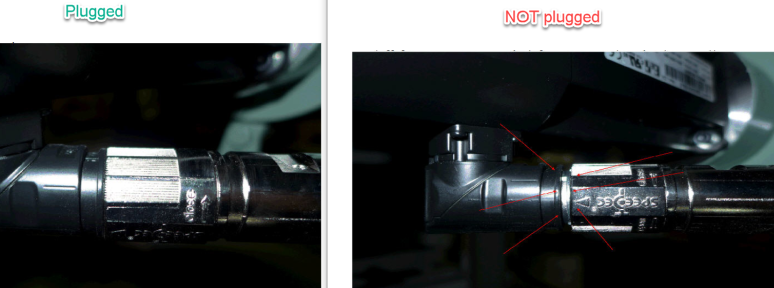 |

# 7015：编码器：数据传输期间超时错误

- **描述**：
    - 带有激活监视器的编码器中的运行错误（激活，参见错误编号 [7030](#7030编码器增量信号幅度太大)). 数据传输过程中发生超时错误。 编码器未发送对发送请求的答复。
- **反应**：
    - 在编码器初始化期间重复传输。
    - 写入参数时传输中止。
- **原因/补救措施**：
    - 未连接编码器。
    - 另请参阅错误编号 [7014](#7014编码器参数传输过程中出现-crc-错误).

## 应用案例

### 2023.03.21

- **现象** 现场使用 “Hengstler 空心轴编码器 AD35” 频繁出现7015报警
- **原因** 由于客户在接线焊接时由于失误，将电源地和信号地接错，导致故障频发。

# 7017：编码器：读取编码器参数时出错

- **描述**：
    - 带有激活监视器的编码器中的运行错误（激活，参见错误编号 [7030](#7030编码器增量信号幅度太大)). 编码器数据包含错误或不受支持。
- **反应**：
    - 查看错误编号 [7030](#7030编码器增量信号幅度太大).
- **原因/补救措施**：
    - EnDat 编码器：
    - 编码器数据校验和错误。
    - HIPERFACE 编码器：
    - 不支持编码器类型.

# 7022：编码器：初始化处于活动状态

- **描述**：
    - 带有激活监视器的编码器中的运行错误（激活，参见错误编号 [7030](#7030编码器增量信号幅度太大)). 编码器初始化未完成。
- **反应**：
    - 不执行写入命令电机数据、读/写 PROM 数据等。
    - 另请参阅错误编号 [7030](#7030编码器增量信号幅度太大).
- **原因/补救措施**：
    - 未连接编码器。
    - 编码器故障。
    - 由于 AB 信号故障，编码器初始化处于活动状态。
    - 串行通信错误（参见另外输入的错误编号）.

## 应用案例

### 2022.01.10

- 外接编码器电缆没有接地并且电机的动力电缆没有接地，导致外接编码器时不时报错 7022 和 7031 ，并且背标贴标驱动器接收不到编码器数值。
- 接地很重要！

### 2022.01.10

- **现象**
    - 这个错误与 7038 在上电的时候报出来。可以复位掉。
- **原因**
    - 在第二个参数表中使用了 ID 578，但是由于 ID 578 生效的快，但是外部编码器实际硬件检查的慢，还没有检测出来，所以会有这个错误发生。
- **解决方式**
    - 把对外部编码器的使用放到第二个参数表里就好。如果是默认的参数表会有问题。

### 2023.03.21

- **现象** 随机出现7022、7038、7014、7048
- **原因** ACOPOSmulti 的 Endat 连接器的插座上的螺丝没有拧紧
    - 

### 2023.03.21

- 编码器初始化问题，通常是编码器线电机侧或者驱动器侧没拧紧，编码器线可能有问题，或者编码器卡有问题。
- 需要按照上述的问题排除。
- 先排除拧紧，再排除编码器卡，最后更换线。

### 2023.03.21

- **现象**
    - 电机报错7022、7048、9003、9000，其它电机报错64006。随后所有使用 HomeRestore 的电机相位丢失
- **原因**
    - 使用了 Home Restore Position 功能偶发的 Permanent 变量丢失问题会导致 HomeRestore 异常
- **解决方式**
    - 需要重新标定零点若重新标定零点无法接受，可以考虑以下方案:
    - InitEndlessPosition 的问题是，当你丢失了永久保持变量或者掉电保持变量，位置的数据丢失了，必须重新进行 Home。
    - 为了避免这种情况，可以将 MC_ENDLESS_POSITION 不断存储到一个文件中。启动后，如果永久变量为空，在执行归位恢复模式（homing restore position mode）前，可以将文件中的那些数据写入 MC_ENDLESS_POSITION 变量。可以将轴的整个永久保持变量数据结构体包括校验和备份到文件或 DataObj 中。需要注意的是，整个内存都被完整复制。

### 2023.09.16

- **解决方式**
    - 更换编码器卡、编码器线缆、编码器后解决

# 7023：编码器：参数传输已激活

- **描述**：
    - 读取/写入编码器 OEM 数据时出现响应错误。对编码器 OEM 数据的读/写访问已激活，但尚未完成。
- **反应**：
    - 不执行命令。
- **原因/补救措施**：
    - 两次读/写访问之间的间隔太短。
    - 串行通信错误（参见另外输入的错误编号）.

# 7029：编码器：增量信号幅度太小

- **描述**：
    - 带有激活监视器的编码器中的运行错误（激活，参见错误编号 [7030](#7030编码器增量信号幅度太大)). 正弦 AB 信号的幅度小于可以显示的最大幅度的 17.5% (AC120) 或 20.0% (AC121)（参见 ACOPOS 用户手册）。
- **反应**：
    - 查看错误编号 [7030](#7030编码器增量信号幅度太大).
- **原因/补救措施**：
    - 无编码器电源或电源包含错误。
    - 另请参阅错误编号 [7030](#7030编码器增量信号幅度太大).

# 7030：编码器：增量信号幅度太大

- **描述**：
    - 已激活监视器的编码器中的运行错误。
    - **监视器通过以下配置激活：**
        - 归位编码器位置（CMD_HOMING、ENCOD2_CMD_HOMING、ENCOD3_CMD_HOMING）。
        - 用于驱动器控制的编码器位置（VCTRL_S_ACT_PARID、PCTRL_S_ACT_PARID）。
        - 打开驱动控制 (CMD_CONTROLLER)。 另请参阅错误编号 [4005](#4005控制器无法开启驱动处于错误状态).
        - 用于凸轮耦合的编码器位置 (CAM_MA_AXIS)。
        - 用于凸轮自动机的编码器位置（AUT_MA_AXIS、AUT_MA_AXIS_VAX1、AUT_MA_ADD_AXIS、AUT_MA_ADD_AXIS_VAX1、AUT_SL_ADD_AXIS、AUT_SL_ADD_AXIS_VAX1）。
        - 用于鼓音序器 (DRUMSEQ_MA_AXIS) 的编码器位置。
        - 用于网络耦合的编码器位置 (MA1/2/3_CYCLIC_SEND)。
        - 用于编码器仿真输出值的编码器位置 (ENCOD2/3_OUT_PARID)。
        - 用于 Latch 的编码器位置 (LATCH1/2_VALUE_PARID)。
        - 用于循环设定值输入的编码器位置 (CYC_ABS_MOVE_PARID)。
        - 用于 FUB 指针参数 ID 的编码器位置（例如 PID_IN_PARID 等）。
    - AB 正弦信号的幅度大于可以显示的最大幅度的 99%（参见 ACOPOS 用户手册）。
- **反应**：
    - “打开控制器”命令：查看错误编号 [4005](#4005控制器无法开启驱动处于错误状态).
    - “归位”命令：查看错误编号 [5034](#5034无法进行归位程序编码器错误).
    - 其他命令：不执行命令。
    - **当控制器处于活动状态时：**
        - 带同步电机的位置和电机编码器：通过短路制动和关闭控制器停止运动。
        - 带异步电机的位置和电机编码器：通过短路制动和关闭控制器停止运动。
        - 有源双编码器位置控制器的位置编码器：参见错误编号 [4007](#4007超出滞后错误停止限制).
        - 设置 STOP_ERR_DECEL_RAMP=ncCTRL_OFF：通过立即关闭控制器和电源部分来中止运动。 驱动器没有电气扭矩。
    - **数据连接：**
        - 网络耦合编码器：见错误编号 [1008](#1008网络耦合主站已停用---编码器错误).
        - 凸轮自动编码器：参见错误编号 [5111](#5111凸轮耦合中止编码器错误).
    - **状态：**
        - 位置或电机编码器：“控制器就绪”状态被重置。
        - “归位有效”状态被重置。
        - “换向有效”状态被复位。
- **原因/补救措施**：
    - 无编码器电源或电源包含错误。
    - Sense +5V 或Sense COM 未连接。
    - 编码器AB信号电平不符合插卡规格（查看编码器数据表）。
    - AB 编码器连接中断或损坏。检查接线指南。
    - 编码器读头未调整。
    - 整个运动区域的编码器读取头安装公差太大。
    - 编码器测量不再干净。
    - 未连接编码器。
    - 编码器故障。
    - AC120 或 AC121 插卡缺陷。
    - **接线指南：**
        - 1. 检查线路开路、线路端接、触点松动和接线错误
        - 2. 检查干扰的周期性发生。接触器或继电器等感应开关元件应配备相应的抑制元件，如压敏电阻、RC 元件或阻尼二极管。
        - 3. 为防止干扰影响电机线、编码器线、控制器线和数据线必须适当屏蔽。
        - 4. 所有电气连接都应尽可能短。
        - 5. 在所有插卡上，用于固定模块的所有螺钉必须拧紧，以便安装支架接地。
        - 6. 应使用带铜网或镀锡铜网的屏蔽电缆。不允许使用单根导线扭转或延长保护网。如果可能，未使用的电缆导体应在两侧接地。
        - 7. 电缆屏蔽层必须连接到屏蔽连接器上。电缆屏蔽层应连接到指定的屏蔽端子和插头外壳上。
        - 8.1.通过 DSUB 插头连接电缆：必须使用金属或镀金属插头外壳中的指定夹子连接电缆屏蔽层。紧固螺钉必须拧紧。
        - 8.2.通过端子连接电缆：电缆屏蔽层必须连接到屏蔽连接端子上。
        - 8.3.通过 RJ45 插头连接电缆：将电缆屏蔽层接地也可改善 EMC 特性。两侧应在连接器附近正确接地。
        - 9. 在电机侧，编码器电缆屏蔽层使用编码器插头连接到电机外壳，并通过机器接地。拔下模块侧的编码器电缆。测量电缆屏蔽（DSUB 插头外壳）与接地（开关柜中的接地连接）之间的电阻。电阻不得超过 0.2 欧姆。
        - 10. 电机线路的电缆屏蔽层或外部制动电阻的连接电缆使用提供的接地夹通过接地板与 ACOPOS 的外壳连接。
        - 11. 在电机侧，电机线的电缆屏蔽层使用电机插头连接到电机外壳，并通过机器接地。外部制动电阻连接电缆上的电缆屏蔽层必须与制动电阻外壳相连.

# 7031：编码器：增量信号幅度太大（干扰）

- **描述**：
    - 带有激活监视器的编码器中的运行错误（激活，参见错误编号 [7030](#7030编码器增量信号幅度太大)). AB 正弦信号的幅度大于可显示最大幅度的 100%（参见 ACOPOS 用户手册）
- **反应**：
    - 查看错误编号 [7030](#7030编码器增量信号幅度太大).
- **原因/补救措施**
    - 另请参阅错误编号 [7030](#7030编码器增量信号幅度太大).

## 应用案例

### 2022.01.10

- 外接编码器电缆没有接地并且电机的动力电缆没有接地，导致外接编码器时不时报错 7022 和 7031，并且背标贴标驱动器接收不到编码器数值。
- 接地很重要！

### 2022.01.10

- 驱动器 switch on 的时候报错 6057 , 7031 , 7038 ，都是编码器的问题。
- 最后对编码器电缆进行了加固，问题解决。

# 7032：编码器：增量信号幅度太小（干扰，无连接）

- **描述**：
    - 带有激活监视器的编码器中的运行错误（激活，参见错误编号 [7030](#7030编码器增量信号幅度太大)). AB 正弦信号的幅度小于可显示最大幅度的 10%（参见 ACOPOS 用户手册） -\> ACOPOS 伺服驱动器无法识别编码器。
- **反应**：
    - 内部状态“位置同步”被重置。
    - 另请参阅错误编号 [7029](#7029编码器增量信号幅度太小).
- **原因/补救措施**：
    - 无编码器电源或电源包含错误。
    - 另请参阅错误编号 [7029](#7029编码器增量信号幅度太小).

## 应用案例

### 2010.03.23

- **现象**
    - 手动单轴运行该轴时，电机转动不均匀，速度时快时慢，并且抖动很大。运行大约 10 s 后 ACOPOS 报 39001，9300，6019，偶尔整个系统启动时该电机轴报警 7032
- **分析思路**
    - 根据报警号（9300: Current controller: Overcurrent /6019: ACOPOS: Overcurrent），可能驱动 ACOPOS 损坏，导致电流输出不稳定，从而使得电机抖动或者速度不稳定。
    - 根据报警号（39001：Encoder: Position correction active /7032: Encoder: Incremental signal amplitude too small）等，可能电机编码器损坏，光栅及电路板个元器件性能下降，干扰信号串入导致位置信号不准确。
- **检查措施**
    - 检查驱动 ACOPOS 功能是否正常，将其他相同型号的电机接到该驱动上，连接配置好后机器可以正常运行，初步判断该 ACOPOS 功能正常。
    - 检查驱动电机的编码器是否真的损坏，采取更换电机编码器方式，重新对电机进行 Phasing，采用步进模式 (Par[276]=1)，重复执行 4 次 (Par[334]=258)后,取平均值 (Par[63]=4.59756)，执行烧写 (Par[81]=340)后，该电机空载情况下在±3000 r/min 下运行 5 分钟无故障。安装在设备上后，正常生产无故障报警，可以正常使用。
- **结论**
    - 由上可知，在出现 9300 报错与39001/7032 等与编码器相关的报警号时，若检查对应的 ACOPOS 无故障情况且电机表现为速度不稳定或抖动较大，则可初步判断电机编码器损坏，进行电机编码器更换。

### 2023.02.14

1. 检查电机侧编码器接头是否拧紧，针脚有松动弯曲，缺失。
2. 检查编码器电缆是否有磨损。建议使用新的编码器线缆进行排除。
3. 驱动器侧屏蔽是否良好并接上，驱动器侧编码器卡及电缆是否处于紧固状态。
4. 检查编码器卡是否完好，且型号和实际使用匹配。建议更新新的编码器卡测试。
5. 如上排除后，仍不能排除故障，建议更换电机或者更换电机编码器。
6. 建议同时查看是否有其他的编码器类型伺服报错，并依照其他伺服报错进行排除。

### 2023.02.14

- **现象：** 运行了大概半小时报错 4007（lagerror 过大）和 7032（增量信号振幅太小）和 6057（编码器报错）和 6054（电流过冲）
- **原因：** 经排查发现 muti 编码器连线摆放过于密集，产生干扰导致编码器位置数据跳动，致使 lagerror 过大，导致电流增大最终电流过冲。
- 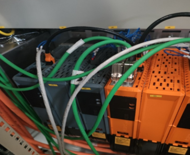

### 2022.02.14

- **现象：** 电机 PowerOn 时 Resolver 编码器报警7081、7032、6057。
- **解决方案：** 排查线缆、编码器卡问题，最后确认电机编码器故障。

### 2022.03.21

- **现象**
    - resolver 电机现场报出7032 现场测量发现报错的 resolver 编码器的阻值(50 欧姆)大于正常的线的阻值(1 欧姆)
- **解决方案**
    - 终端客户现场将 ParID 1048：NCOD_TRANS_RATIO 修改成 0.4 后不再报警

### 2022.03.21

- **现象** ACP10版本 V2.32.2与 V2.52.4版本，使用 resolver 电机会报7032，更新 ACP10版本至 V3.18.2则不报。
- **原因** 7032出现的原因为信号值低于 A_min 时报错 GUID: 7d12da53-099a-493b-9f62-7b6a22e2d6f0
- **解决方式** 1. 升级 ACP 10 版本至 V 3.10.0 及以上 2. 若无法升级 ACP 10 版本，将 ENCOD_TRANS_RATIO 由默认值 0.5 调整到0.4
- **后续版本变更** ACP10 V2.47.0，调整ENCOD_TRANS_RATIO从[0.2..0.5]到[0.2..0.55] ACP10 V3.10.0，部分编码器卡ENCOD_TRANS_RATIO不再起作用

### 2022.03.21

- **现象** 现场设备电机偶发报出39003、7032等错误拆开电机与减速箱的连接，发现电机轴与减速机连接的地方顶在一起（如下图），这样电机轴受到轴向的作用力，这样电机编码器（海德翰32线磁性编码器）就有可能偏心，导致报警
- 
- **解决方案** 用角磨机把连接部分磨掉3到4个毫米，确保安装后电机轴向不再受力

### 2023.12.04

- **现象**：持续运行设备，连续每天都有报7032报警，
- **原因**：编码器信号干扰导致
    - 盘柜厂商自己做的编码器线不好
    - 受到现场干扰
    - 编码器电缆的屏蔽层和接头的金属片连接不充分
    - 
- **解决方式**
    - 优化编码器线缆

### 2024.01.13

- **现象**
    - 现场多台设备伺服不定期报警7032。
    - 硬件配置：双轴P3+ Resolver电机
    - AR版本：B4.93 ACP10版本：5.18.1
- **解决方式**
    - 后经排查发现是编码器线缆屏蔽层有问题
    - 用万用表测量发现屏蔽层线缆中间出现开路情况，线缆屏蔽层实际未接地。

# 7033：编码器：增量位置步长太大

- **描述**：
    - 带有激活监视器的编码器中的运行错误（激活，参见错误编号 [7030](#7030编码器增量信号幅度太大)).
    - 不允许的位置跳跃。
- **反应**：
- **原因/补救措施**：
    - 编码器速度太高。
    - 编码器连接中断或损坏。
    - 编码器配置不正确.

## 应用案例

### 2022.02.14

- 使用第三方伺服
- **现象：** 为了保持位置和相位，使用 HomeRestore 功能。但实际在测试过程中，伺服运行5-10分钟会发生 PLCopen 层面的报警7033/6057。
- **结论：** 初步怀疑为与 homeRestore 回零方式有关，估计第三方不能使用该种回零方式。测试中去除该回零方式后，伺服能长时间运行不报错。

### 2023.03.22

- **现象** 与 mappMotion 有关（但也适用于 ACP10），对于在 PLC 端（PureVAx, DS402Ax, ACP10SDC）而不是在 ACOPOS HW 计算的轴位置，可能会出现 ACOPOS 驱动错误 7033："编码器：增量位置步长太大 "的报告。在 "编码器速度过高 "的原因中，可以增加一个信息，即在两个任务类周期之间的速度高于 1/2 转（SCALE_ENCOD_INCR）也会导致错误。 PureVAx、DS 402 Ax 或 ACP 10 SDC 等轴不允许以高于该速度的速度运行，因为这样就有可能在位置计算中出现错误。
- **有用的 Help 章节**
    - Motion control → ACP10/ARNC0 → Reference manual → ACP10 → ACOPOS Error Texts → 7033: Encoder: Incremental position step too large Motion control
    - mapp Motion → Programming → Libraries → Core → McDS402Ax → Technical information → Third-party servo drives → Important information Motion control
    - Mapp Motion → Programming → Libraries → Core → McPureVAx → Technical information → General purpose axis interface → Complete hardware interface → Reading in the current position
- **可能的解决方法** 在机械元素--\>齿轮箱(Mechanical elements --\> Gearbox)下面的(DS402)mappMotion轴配置(axis configuration)中定义一个齿轮箱比率(gearbox ratio)。例如，使用输入=1，输出=100，并且由于100的系数，编码器设置--\>每转增量也乘以100的系数。 当这样做时，可以实现执行相同的运动，但由于在两个任务类周期之间没有高于1/2转的速度，可以避免错误的位置计算/错误7033。

# 7036：编码器：接口 ID 无效（检查插槽和接口 EEPROM 数据）

- **描述**：
    - 带有激活监视器的编码器中的运行错误（激活，参见错误编号 [7030](#7030编码器增量信号幅度太大)). 驱动器不支持编码器。
- **反应**：
    - 查看错误编号 [7030](#7030编码器增量信号幅度太大).
- **原因/补救措施**
    - 插入卡未插入分配给编码器的插槽中。
    - 不支持编码器的插入卡插入分配给编码器的插槽中。
    - 由于硬件错误，读取了无效的插件卡 ID。 （插卡、PROM数据、SSI接口、总线板、模块插头等。)

## 应用案例

### 2023.03.23

- **现象** ACOPOSmulti 主动电源模块无法 PoweOn，报错7224，7036。
- **解决方案** 通过查看 Multi 安装手册，对其进行拆卸重装以检测是否有连接不良的情况。结果刚一拧螺丝发现连接主动电源与底板的螺丝根本没拧紧，导致供电不足。同时 Multi 还有三个模块的连接螺丝未拧紧。
- 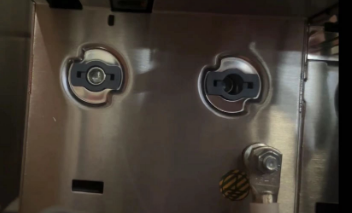 |

# 7038：编码器：位置值与绝对值不同步

- **描述**：
    - 带有激活监视器的绝对编码器中的运行错误（激活，参见错误编号 [7030](#7030编码器增量信号幅度太大)). 插卡的增量位置无法与编码器的绝对串行位置同步。
- **反应**：
    - 查看错误编号 [7030](#7030编码器增量信号幅度太大).
- **原因/补救措施**：
    - 串行通信错误（参见另外输入的错误编号）。
    - 增量信号错误（参见额外输入的错误编号）.

## 应用案例

### 2022.01.10

- **现象**：这个错误与 [7022](#7022编码器初始化处于活动状态) 在上电的时候报出来。可以复位掉。
- **原因**：在第二个参数表中使用了 ID578，但是由于 ID578生效的快，但是外部编码器实际硬件检查的慢，还没有检测出来，所以会有这个错误发生。这个问题的解决是把对外部编码器的使用放到第二个参数表里就好。如果是默认的参数表会有问题。

### 2022.01.10

- 驱动器 switch on 的时候报错 [6057](#6057位置环控制器负载编码器错误) , [7031](#7031编码器增量信号幅度太大干扰) , [7038](#7038编码器位置值与绝对值不同步) ，都是编码器的问题。最后对编码器电缆进行了加固，问题解决。

### 2022.01.12

- 实际编码器类型与配置的编码器类型不一致

### 2022.01.17

- 程序中电机类型是否与现场匹配

### 2023.03.21

- **现象** 随机出现7022、7038、7014、7048
- **原因** ACOPOSmulti 的 Endat 连接器的插座上的螺丝没有拧紧
-  |

### 2023.12.04

- **现象**：原先正常使用的贝加莱8LSC74电机，客户自行更换电机轴承后，运行报错39003 → 39005 → 7038，报错情况先报39003，复位之后过一会出现39005或者7038
- **解决方式**：更换电机与编码器线缆后解决

# 7039：增量编码器：电缆干扰轨迹 A

- **描述**：
    - 带有激活监视器的增量编码器中的运行错误（激活，参见错误编号 [7030](#7030编码器增量信号幅度太大)). 信号 A 和 nA 必须相互补充。重叠仅发生在切换边缘区域。如果低电平或高电平长时间重叠，则记录到电缆干扰。
- **反应**：
    - 查看错误编号 [7030](#7030编码器增量信号幅度太大).
- **原因/补救措施**：
    - 未连接编码器。
    - 无编码器电源或电源包含错误。
    - 编码器连接中断或损坏。 请参阅接线指南错误编号 [7030](#7030编码器增量信号幅度太大).
    - 编码器信号电平不符合插卡规格（查看编码器数据表）。
    - 编码器故障。
    - AC123 插卡故障.

# 7040：增量编码器：电缆干扰轨迹 B

- **描述**：
    - 带有激活监视器的增量编码器中的运行错误（激活，参见错误编号 [7030](#7030编码器增量信号幅度太大)).信号 B 和 nB 不相互补充。
    - 查看错误编号 [7039](#7039增量编码器电缆干扰轨迹-a).
- **反应**：
    - 查看错误编号 [7030](#7030编码器增量信号幅度太大).
- **原因/补救措施**：
    - 查看错误编号 [7039](#7039增量编码器电缆干扰轨迹-a).

## 应用案例

### 2023.06.28

- **故障号** 7040、7042、7050
- **现象** 使用 ACOPOS P 3 + 8 EAC 151.00 X-1 对接外接增量式编码器，其中使用了两根转接线，一根为官方转接线 8 ECG 00 X 4.3151 D-0，一根为第三方转接线，连接方式如下图:
    - 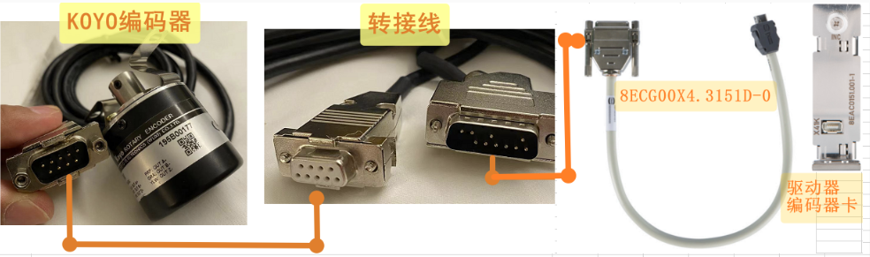
    - 8 EAC 151.00 X-1的参数 ENCOD2_LINE_RESISTANCE 参数已写了4 Ohm （ 注: 若此参数不写或者设置的太小，则报错几率更大 ） 8EAC151.00X-1的 ABR 信号检测也已关闭驱动器能够正常获取编码器的信号，但是在运行一段时间之后，会报出7040、7042、7050等故障号。注：在 ACOPOS 型号上使用对应的编码器卡，关闭对应 ABR 相信号检查，能够正常使用。
- **原因**
    - 1. KOYO 编码器的内部的接线错误，检查编码器接线，看到678三根接到987上，导致 B 相信号的互补信号丢失，抗干扰能力变差。
    - 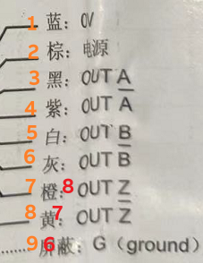
    - 2. 使用的转接线较长，且使用两次转接线，会导致电压降低，抗干扰能力差。
- **解决方式**
    - 对应原因 1： 重新改正编码器接线后，能够在原接线方式“ KOYO 编码器 — 第三方转接线 — 官方短线 — 驱动器编码器卡 ”上正常使用，且不需要设置 ENCOD2_LINE_RESISTANCE。
    - 对应原因 2： 在不修正编码器接线的情况下，外接编码器 9 PIN 口改为 15 PIN 口，不使用第三方转接线，直接通过官方转接线与编码器卡连接，长时间运行，不会再报出错误。
        - 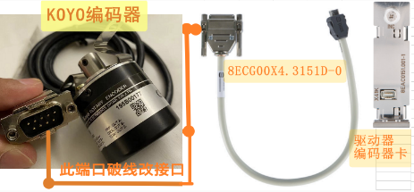

### 2023.07.05

- **现象** 当下载程序时，提示报错7040、39049
- **问题原因** 与干扰有关，因此报警仅在一条线路上出现，建议更换线缆

# 7041：增量编码器：电缆干扰轨道 R

- **描述**：
    - 带有激活监视器的增量编码器中的运行错误（激活，参见错误编号 [7030](#7030编码器增量信号幅度太大)). 信号 R 和 nR 不相互补充。
    - 查看错误编号 [7039](#7039增量编码器电缆干扰轨迹-a).
- **反应**：
    - 查看错误编号 [7030](#7030编码器增量信号幅度太大).
- **原因/补救措施**：
    - 查看错误编号 [7039](#7039增量编码器电缆干扰轨迹-a).
    - 如果编码器不支持参考脉冲并且它们不是必需的，则可以通过设置 ENCODX_LINE_CHK_IGNORE 的位 1 来禁用参考脉冲监视器.

## 应用案例

### 2023.03.22

- **现象** 新设备，上电就报5034报警，使用 AS 的 Test 复位后报29226，再复位报7041，依次循环
- **原因** 驱动器 ACOPOS 使用外接编码器8AC123.60-1，使用转接线，转接线针脚缺失，导致编码器卡的 PIN 14,15 没有接线
    - 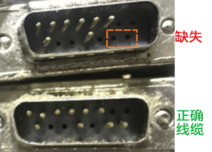
    - 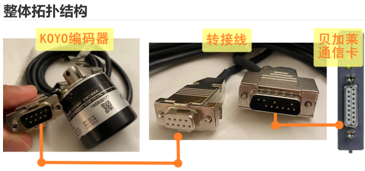
- **解决方式** 更换编码器转接线缆

# 7042：增量编码器：正交信号的边缘距离太小

- **描述**：
    - 带有激活监视器的增量编码器中的运行错误（激活，参见错误编号 [7030](#7030编码器增量信号幅度太大)).评估正交信号（A/B 增量编码器信号）的每个边沿。未达到两个边缘之间的时间间隔的限制值。
- **反应**：
    - 查看错误编号 [7030](#7030编码器增量信号幅度太大).
- **原因/补救措施**：
    - 编码器速度太高。
    - 最大限度。 计数器频率 (ENCOD_OUTPUT_FREQUENCY) 设置为低（8BAC0123.00x-1 和 80VD100PD.C144-01）。
    - 编码器连接中断或损坏。 请参阅接线指南错误编号 [7030](#7030编码器增量信号幅度太大).
    - 信号A和B之间的相移不等于90度
    - 编码器振动。
    - 编码器故障。
    - 插卡故障.

## 应用案例

### 2023.03.22

- **现象** 用手转动电机，就报警7042.而且正转时候，编码器卡的 Up Down 同时亮，反转时候只有 Down 亮。正常应该是一个方向只有一个指示灯亮。
- **解决方式** 经检查，是其中三相异步电机的A相线鼻子端子做得不好，引起接触不好。重新压制，故障解决

### 2023.06.28

- **故障号** 7040、7042、7050
- **现象** 使用 ACOPOS P3 + 8EAC151.00X-1 对接外接增量式编码器，其中使用了两根转接线，一根为官方转接线8ECG00X4.3151D-0，一根为第三方转接线，连接方式如下图:
    - 
    - 8 EAC 151.00X-1的参数 ENCOD2_LINE_RESISTANCE 参数已写了4 Ohm （ 注: 若此参数不写或者设置的太小，则报错几率更大 ） 8EAC151.00X-1的 ABR 信号检测也已关闭驱动器能够正常获取编码器的信号，但是在运行一段时间之后，会报出7040、7042、7050等故障号。注：在 ACOPOS 型号上使用对应的编码器卡，关闭对应 ABR 相信号检查，能够正常使用。
- **原因**
    - 1.KOYO 编码器的内部的接线错误，检查编码器接线，看到678三根接到987上，导致 B 相信号的互补信号丢失，抗干扰能力变差。
    - 
    - 2.使用的转接线较长，且使用两次转接线，会导致电压降低，抗干扰能力差。
- **解决方式**
    - 对应原因 1： 重新改正编码器接线后，能够在原接线方式“ KOYO 编码器 — 第三方转接线 — 官方短线 — 驱动器编码器卡 ”上正常使用，且不需要设置 ENCOD 2_LINE_RESISTANCE。
    - 对应原因 2： 在不修正编码器接线的情况下，外接编码器 9 PIN 口改为 15 PIN 口，不使用第三方转接线，直接通过官方转接线与编码器卡连接，长时间运行，不会再报出错误。
     - 

# 7043：编码器：电缆干扰轨道 D

- **描述**：
    - 带有激活监视器的 SSI 编码器中的运行时错误（激活，参见错误编号 [7030](#7030编码器增量信号幅度太大)). 信号 D 和 nD 不相互补充。
    - 查看错误编号 [7039](#7039增量编码器电缆干扰轨迹-a).
- **反应**：
    - 查看错误编号 [7030](#7030编码器增量信号幅度太大).
- **原因/补救措施**：
    - 查看错误编号 [7039](#7039增量编码器电缆干扰轨迹-a).

# 7044：编码器：奇偶校验

- **描述**：
    - 带有激活监视器的编码器中的运行错误（激活，参见错误编号 [7030](#7030编码器增量信号幅度太大)). 传送的奇偶校验位与确定的奇偶校验位不匹配。确定的奇偶校验位由读取的数据位和定义的 PARITY_MODE 之和的 LSB 得出。
- **反应**：
    - 查看错误编号 [7030](#7030编码器增量信号幅度太大).
- **原因/补救措施**：
    - PARITY_MODE 参数的配置与编码器规格不符（检查编码器数据表）。
    - 编码器连接中断或损坏。 请参阅接线指南错误编号 [7030](#7030编码器增量信号幅度太大).
    - 编码器故障。
    - AC123 插卡故障.

# 7045：旋转变压器：信号干扰（合理性检查）

- **描述**：
    - 具有激活监视器的解析器中的运行时错误（激活，请参阅错误编号 [7030](#7030编码器增量信号幅度太大)).解析器位置的确定加速度大于允许的最大加速度 ENCODX_A_LIM。
- **反应**：
    - 查看错误编号 [7030](#7030编码器增量信号幅度太大).
- **原因/补救措施**：
    - 最大加速度 ENCODX_A_LIM 的配置过于严格。
    - 解析器连接中断或有缺陷。 请参阅接线指南错误编号 [7030](#7030编码器增量信号幅度太大).
    - Resolver不符合AC122插卡规格。
    - 未连接解析器
    - 解析器故障。
    - AC122 插卡故障.

# 7046：旋转变压器：电缆干扰

- **描述**：
    - 具有激活监视器的解析器中的运行时错误（激活，请参阅错误编号 [7030](#7030编码器增量信号幅度太大)). 在旋转变压器评估电路中的正弦/余弦信号之间进行矢量比较。如果偏差过大，则会输出错误。监视器的正确运行很大程度上取决于输入阻抗和旋转变压器的电压比。
- **反应**：
    - 查看错误编号 [7030](#7030编码器增量信号幅度太大).
- **原因/补救措施**：
    - 查看错误编号 [7045](#7045旋转变压器信号干扰合理性检查).
    - 如果旋转变压器不符合 AC122 插卡的规格，可以通过设置 ENCODX_LINE_CHK_IGNORE 的位 0 来禁用电缆干扰的监控。
    - 注意：当发生“真正的”解析器错误时，这可能会导致不受控制的运动。
    - 8AC122.60-1 插卡不支持此错误.

# 7047：无效的参考标记距离

- **描述**：
    - 使用距离编码参考标记进行参考时出现运行时错误。两个参考标记之间的距离为 0 或大于参考标记 ENCODX_REF_DCM_DISTANCE 的一般距离。
- **反应**：
    - 查看错误编号 [5035](#5035未检测到参考标记).
- **原因/补救措施**：
    - 配置的一般距离与编码器参考标记的一般距离不匹配（检查编码器数据表）。
    - 参考信号编码器连接中断或有缺陷（参见接线指南错误编号 [7030](#7030编码器增量信号幅度太大)).
    - 编码器不支持参考标记（检查编码器数据表）。
    - 编码器参考信号不符合插入卡的规格（检查编码器数据表）。
    - 编码器测量不再干净。
    - 编码器故障。
    - AC120、AC123或AC130插卡缺陷.

# 7048：读取编码器存储器时出错

- **描述**
    - 带有激活监视器的编码器中的运行错误（激活，参见错误编号 [7030](#7030编码器增量信号幅度太大)).在读取编码器内存期间发生了太多数据传输错误。
- **反应**
    - 编码器初始化中止。
    - 查看错误编号 [7030](#7030编码器增量信号幅度太大).
- **原因/补救措施**
    - 只有通过 SW 复位才能清除编码器错误。
    - 另请参阅错误编号 [7015](#7015编码器数据传输期间超时错误).

## 应用案例

### 2023.03.21

- **现象** 随机出现7022、7038、7014、7048
- **原因** ACOPOSmulti 的 Endat 连接器的插座上的螺丝没有拧紧
- 

### 2023.03.21

- **现象** 电机报错7022、7048、9003、9000，其它电机报错64006。随后所有使用 HomeRestore 的电机相位丢失
- **原因** 使用了 Home Restore Position 功能偶发的 Permanent 变量丢失问题会导致 HomeRestore 异常
- **解决方式** 需要重新标定零点 若重新标定零点无法接受，可以考虑以下方案: InitEndlessPosition的问题是，当你丢失了永久保持变量或者掉电保持变量，位置的数据丢失了，必须重新进行Home。 为了避免这种情况，可以将MC_ENDLESS_POSITION不断存储到一个文件中。启动后，如果永久变量为空，在执行归位恢复模式（homing restore position mode）前，可以将文件中的那些数据写入MC_ENDLESS_POSITION变量。 可以将轴的整个永久保持变量数据结构体包括校验和备份到文件或DataObj中。需要注意的是，整个内存都被完整复制。

# 7049：编码器电流消耗异常

- **描述**：
    - 编码器功耗已降至指定水平以下。
- **反应**：
    - 查看错误编号 [7030](#7030编码器增量信号幅度太大).
- **原因/补救措施**：
    - 如果编码器由外部供电，则必须关闭此监控。 见参数 PARID_ENCOD_LINE_CHK_IGNORE. Guid：ed36d853-f25d-483f-9ab1-714cd0a78dab
    - 无编码器电源或电源包含错误。
    - \+5V、+24V 或 COM 未连接。
    - 请参阅接线指南错误编号 [7030](#7030编码器增量信号幅度太大).
    - 编码器/模块损坏。
    - 编码器功耗 \< 150mW (5V)
    - 编码器功耗 \< 200mW (24V))

# 7050：增量编码器：AB 信号非法改变

- **描述**：
    - 带有激活监视器的增量/正余弦编码器中的运行错误（激活，参见错误编号 [7030](#7030编码器增量信号幅度太大)).
    - 正交信号（AB 增量编码器信号/SinCos 编码器信号）的非法更改。
    - 对于具有 SinCos 类似信号的编码器，正交信号对应于单位圆的象限。
- **反应**：
    - 查看错误编号 [7030](#7030编码器增量信号幅度太大).
- **原因/补救措施**：
    - 编码器速度太高。
    - 编码器连接中断或损坏。 请参阅接线指南错误编号 [7030](#7030编码器增量信号幅度太大).
    - 信号A和B之间的相移不等于90度
    - 编码器振动。
    - 编码器/模块损坏.

## 应用案例

### 2023.06.28

- **故障号** 7040、7042、7050
- **现象** 使用 ACOPOS P3 + 8EAC151.00X-1 对接外接增量式编码器，其中使用了两根转接线，一根为官方转接线8ECG00X4.3151D-0，一根为第三方转接线，连接方式如下图:
    - 
    - 8EAC151.00X-1的参数 ENCOD2_LINE_RESISTANCE 参数已写了4 Ohm （ 注: 若此参数不写或者设置的太小，则报错几率更大 ） 8EAC151.00X-1的 ABR 信号检测也已关闭驱动器能够正常获取编码器的信号，但是在运行一段时间之后，会报出 7040、7042、7050 等故障号。注：在 ACOPOS 型号上使用对应的编码器卡，关闭对应 ABR 相信号检查，能够正常使用。
- **原因**
    - 1.KOYO 编码器的内部的接线错误，检查编码器接线，看到678三根接到987上，导致 B 相信号的互补信号丢失，抗干扰能力变差。
        - 
    - 2.使用的转接线较长，且使用两次转接线，会导致电压降低，抗干扰能力差。
- **解决方式**
    - 对应原因1： 重新改正编码器接线后，能够在原接线方式“ KOYO 编码器 — 第三方转接线 — 官方短线 — 驱动器编码器卡 ”上正常使用，且不需要设置 ENCOD2_LINE_RESISTANCE。
    - 对应原因2： 在不修正编码器接线的情况下，外接编码器9 PIN 口改为15 PIN 口，不使用第三方转接线，直接通过官方转接线与编码器卡连接，长时间运行，不会再报出错误。
    - 

# 7051：编码器：加速度太大（干扰）

- **描述**：
    - 带有激活监视器的编码器中的运行错误（激活，参见错误编号 [7030](#7030编码器增量信号幅度太大)).
    - 多圈编码器上的转数计数器使用加速度监视器来监控其真实性。
    - 如果在800μs区间内位置差大于一圈，
    - 那么假设一个革命跳跃。
- **反应**：
    - 查看错误编号 [7030](#7030编码器增量信号幅度太大).
- **原因/补救措施**：
    - 编码器速度太高。
    - 编码器连接中断或损坏。
    - 编码器配置不正确。
    - 编码器故障

## 应用案例

### 2023.03.22

- **现象** 手动转动多圈 SSI 编码器，每次都会出现反馈数据上的跳变，因而出现7051 报警
- **原因** 现场工况为驱动器断使能后电机迅速反转，电磁刹车随后投入，从而对编码器造成较大冲击,同时期间也检测到多次超过编码器最大允许速度的情况。该问题也反映出 SSI 编码器并不太适合在此类工况上使用，相比较旋变则更为适合。
- **解决方式** 编码器损坏，更换编码器

# 7052：编码器：编码器不支持

- **描述**：
    - 编码器中的运行时错误。
    - 无法处理编码器数据。
- **反应**：
    - 编码器初始化中止。
- **原因/补救措施**：
    - 编码器不被支持.

# 7053：编码器：电源故障

- **描述**：
    - 编码器电源中的运行错误。
- **反应**：
    - 输入/输出设置为错误状态（无法再保证供电）。
- **原因/补救措施**：
    - 检查电源控制。
    - 电源过载或故障。
    - 电源故障。
    - 电源连接缺陷（线路开路、线路终端、接线错误、保险丝）。
    - 传感器电源短路。
    - 插卡缺陷.

# 7054：编码器：已定义通道中的位置

- **描述**：
    - 写入参数时响应错误。
- **反应**：
    - 没有任何
- **原因/补救措施**：
    - 有人尝试创建类型为 ncSSI_CONT_TYP_POS 的第二个内容。
    - 编码器配置不正确.

# 7055：编码器：无效的内容类型“帧结束”

- **描述**：
    - 写入参数时响应错误。
- **反应**：
    - 没有任何
- **原因/补救措施**：
    - 无效的“帧结束”内容类型。
    - 对于类型为 ncSSI_CONT_TYP_END 的内容，尝试设置参数
    - ENCODx_SSI_ZERO_BITS、ENCODx_SSI_BITS 或 ENCODx_SSI_TRAIL_BITS。
    - 编码器配置不正确.

# 7057：编码器：寄存器读/写禁止或未实现

- **描述**：
    - 访问编码器存储器时 BiSS 编码器的响应错误
- **反应**：
    - 没有任何
- **原因/补救措施**：
    - 不允许对所选寄存器进行读/写访问。
    - 所选内存不可用。
    - 请参阅编码器文档.

# 7058：编码器：设置了警报位

- **描述**：
    - 编码器的运行时错误。如果测量系统的故障会导致位置值不正确，则会设置警报。
- **反应**：
    - 当警报处于活动状态时，不执行参考命令。
- **原因/补救措施**：
    - 报警位由编码器设置。
    - 请参阅编码器文档.

## 应用案例

### 2023.03.22

- 编码器线缆松动、干扰或直线电机编码器光栅读头存在干扰

# 7059：虚拟编码器：错误状态

- **描述**：
    - ENCOD 0_STATUS_PARID 的值不等于 0 时的运行时错误。
    - 看 Encoder interface: Virtual Encoder Guid：0432809d-70c5-493e-bd9c-1b5bfdc6d3d2
- **反应**：
    - 查看错误编号 [7030](#7030编码器增量信号幅度太大).
- 原因/补救措施：

# 7060：虚拟编码器：转换错误

- **描述**:
    - 看 Encoder interface: Virtual Encoder Guid：0432809d-70c5-493e-bd9c-1b5bfdc6d3d2
- **反应**:
    - 看错误码 [7030](#7030编码器增量信号幅度太大).
- 原因/补救措施

# 7061：虚拟编码器：失速检测

- **描述**：
    - 触发失速检测时的运行时错误。.
    - 看 Encoder interface: Virtual Encoder Guid：0432809d-70c5-493e-bd9c-1b5bfdc6d3d2
- **反应**：
    - 查看错误编号 [7030](#7030编码器增量信号幅度太大).
- 原因/补救措施：

# 7062：编码器：SafeMOTION 模块未准备好

- **描述**：
    - 编码器与 SafeMOTION 模块的运行错误。
- **反应**：
    - 没有任何
- **原因/补救措施**：
    - SafeMOTION 模块未就绪。
    - 可以从记录器中输入的详细信息中确定确切原因.

# 7063：编码器：UART 通信错误

- **描述**：
    - 编码器与 SafeMOTION 模块的运行错误。
- **反应**：
    - 没有任何
- **原因/补救措施**：
    - 可以从记录器中输入的详细信息中确定确切原因.

# 7064：编码器：SafeMOTION 通信错误

- **描述**：
    - 编码器与 SafeMOTION 模块的运行错误。
- **反应**：
    - 没有任何
- **原因/补救措施**：
    - 可以从记录器中输入的详细信息中确定确切原因.

# 7065：编码器：编码类型无效

- **描述**：
    - 带有激活监视器的编码器中的运行错误（激活，参见错误编号 [7030](#7030编码器增量信号幅度太大)).
- **反应**：
    - 没有任何
- **原因/补救措施**：
    - 编码器类型（参数 id ENCOD_TYPE）未设置或设置不正确.

# 7066：编码器：编码器未准备好

- **描述**：
    - 带有 Safe MC 和激活的监视器的编码器中的运行错误（激活，参见错误编号 [7030](#7030编码器增量信号幅度太大)).
- **反应**：
    - 编码器初始化中止。
    - 另请参阅错误编号 [7030](#7030编码器增量信号幅度太大).
- **原因/补救措施**：
    - 已超过 SafeMOTION 初始化的超时时间。
    - 只有通过 SW 复位才能清除编码器错误.

# 7067：编码器：SafeMOTION 模块未处于运行状态

- 描述：
    - 编码器与 SafeMOTION 模块的运行错误。
- 反应：
    - 没有任何
- 原因/补救措施：
    - 可以从记录器中输入的详细信息中确定确切原因.

# 7068：编码器：超出最大循环时间

- 描述：
    - 使用时间信息时虚拟编码器中的运行时错误。已超过预定义的最大循环时间。
- 反应：
    - 没有任何
- 原因/补救措施：
    - 网络上的信息流已中断。
    - 组态的最大循环时间太小。
    - 配置的数据点不正确，或时间信息不符合要求的标准（参见编码器接口文档）.

# 7069：编码器：编码器错误过滤器激活

- **描述**：
    - 已激活错误过滤器的编码器中的运行时错误。发生编码器错误。
- **反应**：
    - 错误响应会延迟编码器错误过滤时间。
- **原因/补救措施**：
    - 原因可以由其他错误消息确定.

# 7070：编码器：超出滞后错误停止限制

- **描述**：
    - 编码器/设置值跟踪器激活时的运行错误。滞后误差 PCTRL_LAG_ERROR 的绝对值超过限制值 ENCOD 0_DS_STOP。
- **反应**：
    - 切换到设置值跟踪器
- **原因/补救措施**：
    - 位置检测错误。
    - 错误限制太小 (ENCOD0_DS_STOP)。
    - 其他原因见错误号 [4007](#4007超出滞后错误停止限制).

# 7071：编码器：超出限制速度错误

- **描述**：
    - 编码器/设置值跟踪器激活时的运行错误。速度误差 SCTRL_SPEED_ERROR 的绝对值超过了 ENCOD0_DV_STOP 限值。
- **反应**：
    - 切换到设置值跟踪器
- **原因/补救措施**：
    - 位置检测错误。
    - 错误限制太小 (ENCOD0_DV_STOP)。
    - 其他原因见错误号 [6062](#6062ctrl-速度控制器超出速度错误停止限制).

# 7072：编码器：超出传输时间位置

- **描述**：
    - 所需的传输时间太长（BiSS 或 SSI 编码器）。
- **反应**：
    - 没有任何
- **原因/补救措施**：
    - ENCOD_BAUDRATE 的参数化不正确。
    - 控制器级联循环时间太小.

# 7073：编码器：多圈故障

- **描述**：
    - 带有激活监视器的编码器中的运行错误（激活，参见错误编号 [7030](#7030编码器增量信号幅度太大)).
- **反应**：
    - 没有任何
- **原因/补救措施**：
    - 处理位置时出错.

# 7074：编码器：SafeMOTION 错误

- **描述**：
    - 带有激活监视器的编码器中的运行错误（激活，参见错误编号 [7030](#7030编码器增量信号幅度太大)).
    - 不同错误的分组消息。
- **反应**：
    - 没有任何
- **原因/补救措施**：
    - 请参阅另外输入的错误消息。
    - 可能的其他错误消息：
        - 错误编号 [7064](#7064编码器safemotion-通信错误)
        - 错误编号 [7053](#7053编码器电源故障)
        - 错误编号 [7085](#7085编码器safemotion-未初始化)
        - 错误编号 [7062](#7062编码器safemotion-模块未准备好)
        - 错误编号 [7077](#7077编码器safemotion-配置阻止了编码器评估)
        - 错误编号 [7075](#7075编码器配置编码器类型不正确)
        - 错误编号 [7095](#7095编码器safemotion-固件不支持编码器类型)
        - 错误编号 [7067](#7067编码器safemotion-模块未处于运行状态)

# 7075：编码器：配置编码器类型不正确

- **描述**：
    - 编码器接口的配置（“接口类型”）与 SafeDESIGNER 中的配置不匹配。
- **反应**：
    - 没有任何
- **原因/补救措施**：
    - ParID ENCOD_TYPE 的配置不正确。
    - SafeDESIGNER 中编码器接口的配置不正确（“未使用编码器”/“使用编码器”）.

# 7076：编码器：数据传输激活

- **描述**：
    - 如果从电机到驱动器的编码器数据传输处于活动状态，则写入参数时出现响应错误。
- **反应**：
    - 不接受参数值。
- **原因/补救措施**：
    - 仅当通用状态（参数 STATUS_BITS）中的以下位等于 0 时才允许写入。
        - Bit 5：编码器初始化激活

# 7077：编码器：SafeMOTION 配置阻止了编码器评估

- **描述**：
    - 编码器接口的配置（“接口类型”）与 SafeDESIGNER 中的配置不匹配。
- **反应**：
    - 没有任何
- **原因/补救措施**：
    - SafeDESIGNER 中编码器接口的配置不正确（“未使用编码器”/“使用编码器”）。
    - 另请参阅错误编号 [7064](#7064编码器safemotion-通信错误) 与错误编码 [7067](#7067编码器safemotion-模块未处于运行状态).

# 7078：编码器：段间通信失败

- **描述**：
    - 如果 ISC 连接在传输编码器数据时报告错误，则出现运行时错误。
    - 信息显示错误的 ISC 连接：
        - 1 ... X3A / ISC1
        - 2 ... X3B / ISC2
- **反应**：
    - 编码器评估中止/编码器更改为错误状态。
    - 运动中止。
    - 班车信息被删除。
- **原因/补救措施**：
    - 段间通信中断：检查 ISC 的连接。

# 7079：编码器：内部错误

- **描述**：
    - 发生内部编码器评估错误。
    - 传感器初始化过程中发生错误。
- **反应**：
    - ACOPOStrak：
        - 编码器评估中止/编码器更改为错误状态。
        - 运动中止。
        - 小车（shuttle）信息被删除。
- **原因/补救措施**：
    - 信息 4：
    - 在没有 ISC 的穿梭传输区域中的编码器初始化期间出错（例如移动到转向器中）。
    - 没有 ISC 的穿梭传输区域的滞后误差必须小于 4 毫米，以确保正确放置在受影响的段上。
    - 检查受影响区域中线段的对齐情况。
    - 检查滞后错误和控制器设置。

## 应用案例

### 2023.08.31

- 使用了 ENCOD_HW_SELECT 功能
- 一定是先设置编码器选择，再设定编码器类型和相关参数。
- 如果顺序颠倒，驱动器报错 7097。
- 参考 [032单轴ACOPOS P3更改编码器卡8EAC0152.003-1接口方法](/A02_产品_Motion/032单轴ACOPOS%20P3更改编码器卡8EAC0152.003-1接口方法.md)

# 7080：编码器：编码器通讯错误

- **描述**：
    - 带有激活监视器的编码器中的运行错误（激活，参见错误编号 [7030](#7030编码器增量信号幅度太大)).
    - 数据或位置传输期间发生错误。
    - 此错误与以下错误之一一起报告：7014、7015、7044、39048、39060、39061。
- **反应**：
    - 没有任何
- **原因/补救措施**：
    - 可以从附加传输的错误消息中读取原因.

# 7081：编码器：初始化期间超时

- **描述**：
    - 带有激活监视器的编码器中的运行错误（激活，参见错误编号 [7030](#7030编码器增量信号幅度太大)).
    - 初始化期间发生超时错误。
- **反应**：
    - 没有任何
- **原因/补救措施**：
    - 查看错误编号 [7022](#7022编码器初始化处于活动状态).

## 应用案例

### 2022.02.14

- **现象：** 电机 PowerOn 时 Resolver 编码器报警7081、7032、6057。
- **解决方案：** 排查线缆、编码器卡问题，最后确认电机编码器故障。

# 7082：编码器：到编码器的链接被干扰

- **描述**：
    - 没有连接到编码器，或者由于传输错误导致连接错误。
- **反应**：
    - 查看错误编号 [7030](#7030编码器增量信号幅度太大).
- **原因/补救措施**：
    - 编码器连接中断或损坏。 请参阅接线指南错误编号 [7030](#7030编码器增量信号幅度太大)。
    - 编码器/模块损坏.

# 7083：参考脉冲监控：位置、分辨率或参考脉冲错误

- **描述**：
    - 增量参考脉冲监视器激活时的运行错误。两个参考脉冲之间的距离在有效范围之外。
- **反应**：
    - 没有任何
- **原因/补救措施**：
    - 将参考脉冲监视器的配置（脉冲宽度、脉冲间隔、观察窗口和模式）与编码器数据表进行比较。
    - 另请参阅错误编号 [7047](#7047无效的参考标记距离).

# 7084：编码器：位置评估错误

- **描述**：
    - 带有激活监视器的增量编码器中的运行错误（激活，参见错误编号 [7030](#7030编码器增量信号幅度太大)).
    - 在位置形成中它出现了错误。
- **反应**：
    - 查看错误编号 [7030](#7030编码器增量信号幅度太大).
- **原因/补救措施**：
    - 编码器速度或加速度太高。
    - 编码器连接中断或损坏。 请参阅接线指南错误编号 7030。
    - 编码器振动。
    - 编码器故障。
    - 插卡故障.

# 7085：编码器：SafeMOTION 未初始化

- **描述**：
    - 编码器与 SafeMOTION 模块的运行错误。
- **反应**：
    - 没有任何
- **原因/补救措施**：
    - SafeMOTION 模块未初始化。
    - 可以从记录器中输入的详细信息中确定确切原因.

# 7086：编码器仿真：电源故障

- **描述**：
    - 编码器仿真电源电压的运行时错误。
- **反应**：
    - 无法再保证输出的供应。
- **原因/补救措施**：
    - 插卡故障。
    - A - A\\, B - B\\ 和 R - R\\ 之间短路.

# 7087：编码器仿真：网络连接中断

- **描述**：
    - 编码器仿真的网络连接中的运行时错误。
- **反应**：
    - 编码器仿真的输出被禁用。
- **原因/补救措施**：
    - 查看错误编号 [1012](#1012循环网络通信的崩溃).

# 7089：编码器：HIPERFACE DSL：在线状态：位 2：QMLW：质量监视器。 低级

- **描述**：
    - 此状态由 HIPERFACE DSL?Master IP-Core 报告。更多信息可以在编码器数据表或 HIPERFACE DSL? 规范中找到。
    - 摘自 HIPERFACE DSL? 在线状态位 2 规范：
    - 质量监控当前值小于 14。
- **反应**：
    - 查看错误编号 [7030](#7030编码器增量信号幅度太大).
- **原因/补救措施**：
    - 请参阅编码器数据表或 HIPERFACE DSL？规范.

# 7090：编码器：HIPERFACE DSL：在线状态：位 3：FIX0：位不是“0”

- **描述**：
    - 此状态由 HIPERFACE DSL?Master IP-Core 报告。更多信息可以在编码器数据表或 HIPERFACE DSL? 规范中找到。
    - 摘自 HIPERFACE DSL? 在线状态位 3 规范：
    - 该位总是给出“0”。对于 SPI 接口，这用于检查 spi_miso 引脚是否存在卡在“1”故障。
- **反应**：
    - 查看错误编号 [7030](#7030编码器增量信号幅度太大).
- **原因/补救措施**：
    - 请参阅编码器数据表或 HIPERFACE DSL? 规范。.

# 7091：编码器：HIPERFACE DSL：在线状态：位 8：PRST：协议重置

- **描述**：
    - 此状态由 HIPERFACE DSL?Master IP-Core 报告。更多信息可以在编码器数据表或 HIPERFACE DSL? 规范中找到。
    - 摘自 HIPERFACE DSL? 在线状态位 8 的规范：
    - IP-Core 已重新启动协议。
- **反应**：
    - 查看错误编号 [7030](#7030编码器增量信号幅度太大).
- **原因/补救措施**：
    - 请参阅编码器数据表或 HIPERFACE DSL？规范.

# 7092：编码器：HIPERFACE DSL：在线状态：位 9：DTE：偏差阈值错误

- **描述**：
    - 此状态由 HIPERFACE DSL?Master IP-Core 报告。更多信息可以在编码器数据表或 HIPERFACE DSL? 规范中找到。
    - 摘自 HIPERFACE DSL? 在线状态位 9 的规范：
    - 当前偏差值大于指定的最大值。
- **反应**：
    - 查看错误编号 [7030](#7030编码器增量信号幅度太大).
- **原因/补救措施**：
    - 请参阅编码器数据表或 HIPERFACE DSL？规范.

# 7093：编码器：HIPERFACE DSL：在线状态：位 12：FIX1：位不是“1”

- **描述**：
    - 此状态由 HIPERFACE DSL?Master IP-Core 报告。更多信息可以在编码器数据表或 HIPERFACE DSL? 规范中找到。
    - 摘自 HIPERFACE DSL? 在线状态位 12 的规范：
    - 该位总是给出“1”。 对于 SPI 接口，这用于检查 spi_miso 引脚是否存在卡在“0”的故障。
- **反应**：
    - 查看错误编号 [7030](#7030编码器增量信号幅度太大).
- **原因/补救措施**：
    - 请参阅编码器数据表或 HIPERFACE DSL？规范.

# 7094：编码器：HIPERFACE DSL：在线状态：位 14：SUM：摘要字节编码。 地位

- **描述**：
    - 此状态由 HIPERFACE DSL?Master IP-Core 报告。更多信息可以在编码器数据表或 HIPERFACE DSL? 规范中找到。
    - 摘自 HIPERFACE DSL? 在线状态位 14 的规范：
    - 总结的最后一个有效值不为零。此标志的重要性取决于导致设置概要的特定错误源。
- **反应**：
    - 查看错误编号 [7030](#7030编码器增量信号幅度太大).
- **原因/补救措施**：
    - 请参阅编码器数据表或 HIPERFACE DSL？规范.

# 7095：编码器：SafeMOTION 固件不支持编码器类型

- **描述**：
    - 配置的 SafeMOTION 固件不支持配置的编码器类型。
- **反应**：
    - 没有任何
- **原因/补救措施**：
    - 编码器接口或 SafeMOTION 固件配置不正确。
    - 另请参阅错误编号 [7064](#7064编码器safemotion-通信错误) 和错误号 7067。

# 7100：参数功能不支持

- **描述**：
    - 写入不受支持的参数时出现响应错误。
- **反应**：
    - 参数未设置或函数未执行。
- **原因/补救措施**：
    - 未配置编码器。
    - 编码器类型、插卡或设备不支持该参数。
    - 插卡未插入、损坏或不支持。
    - 另请参阅错误编号 [1002](#1002参数超出有效范围).

## 应用案例

### 2023.02.14

- **现象**：multi 逆变模块编码器卡（Slot1）信号异常，报错7100。
- **解决方案**：推测可能是编码器卡或者线的问题。将右边正常的编码器卡与左边编码器卡拆卸后互换位置和编码器线。最后发现是电柜装配时编码器卡本身没有插到最底（测试时看不出没插到最底部）导致编码器卡接触不良。
    - 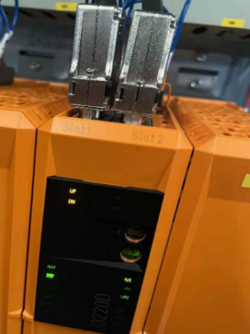

### 2023.03.23

- **现象** 外接编码器通过8EAC0151接收外部增量编码器数值，上电后驱动器报错32144和7100。
- **原因** 不只在8EAC0151的硬件配置中设置了编码器一圈的脉冲数，也在参数表中对 ID289进行了设置。
- **解决方式** 这个设置在 ACOPOS 中没有问题，但是在 P3里面，只在8EAC0151的硬件配置中即可，ID289不用再设置。

# 7103：接口不兼容

- **描述**：
    - 软件版本与第二个组件（软件或硬件）不兼容。
    - 信息字节 0：接口
        - INFO 字节 1：附加信息 1
        - INFO 字节 2：附加信息 2
    - 界面：
        - 0x00-0x0F：插槽
        - 0x10：ACP/SMC-Com
    - 附加信息1：
        - 0 x 00-0 x 0 F：版本
    - 附加信息2：
        - 0 x 01-0 xFF：硬件 ID
- **反应**：
    - 不支持组件及其功能。
- **原因/补救措施**：
    - 这些组件之一的软件版本不兼容。
    - 更新软件版本或更换硬件。

# 7104：初始化中止

- **描述**：
    - 由于错误，初始化被中止。
- **反应**：
    - 硬件无法使用。
- **原因/补救措施**：
    - 插件模块有缺陷.

# 7200：直流母线：过压

**描述**：

- 如果 DC 总线电压 UDC_ACT 超过模块相关的限制电压，则控制器处于活动状态时的运行时错误。

|      |      |
|----------------------------|---------------------------------------------------|
| 8Vxxxx.00-x |~ 900VDC |
| 8Vxxxx.50-x |~ 450VDC |
| 8B |~ 900VDC (UDC_OVMON_CTRL_OFF_LIM) |
| 8C |~ 900VDC (UDC_OVMON_CTRL_OFF_LIM) |
| 8D |~ 900VDC (UDC_OVMON_CTRL_OFF_LIM) |
| 8EIxxxHxxxx.xxxx-x |~ 875VDC |
| 8EIxxxMxxxx.xxxx-x |~ 450VDC |
| 80 |~ 95VDC (UDC_OVMON_CTRL_OFF_LIM) |

- **反应**：
    - 8Vxxxx.00-x、8Vxxxx.50-x、8BVI、8CVI、80V、8DI：
    - 如果直流总线电压在 AXLIM_T_STOP_END 时间内下降到模块相关的限制电压以下，则运动停止并通过短路制动停止，没有电流限制。
    - 设置 STOP_ERR_DECEL_RAMP=ncCTRL_OFF：
    - 通过立即关闭控制器和电源部分来中止运动。驱动器没有电气扭矩。
- **原因/补救措施**：
    - 看 Power unit Guid：5d7b1758-8ae0-4bef-8a82-f2b8b1017926
    - **制动电阻未激活：**
        - 在发电机运行中，检查记录的直流母线电压 (UDC_ACT) 在超过制动电阻的接通电压 (UDC_ACT \> UDC_BLEEDER_ON) 时是否不平稳。
            - 制动电阻的控制有缺陷。 -> 更换 ACOPOS 模块
            - 继电器泄放器（intern/extern）有缺陷。 -> 更换 ACOPOS 模块
            - 外部制动电阻的保险丝损坏。 -> 检查或切换保险丝
            - 内部或外部制动电阻器损坏或未连接。 -> 更换 ACOPOS 模块或制动电阻器。 测量插头上的制动电阻并与数据表进行比较。 -> 检查外部制动电阻的接线。 注意：遵守安全规定。
            - 8B0Pxxxxxxxx.xxx-x：控制器未开启
    - **主电源干扰：**
        - 电源电压或直流母线电压过高。 -\> 检查直流母线电压.

## 应用案例

### 2023.03.23

- **现象** ACOPOS 1180 在整机同步状态下由100RPM 加速到150RPMS 时出现报错报7211，4007，7200，9300 在实际测试过程中测量 DC BUS 电压，发现此驱动器的偏低
- **原因** 可能为1180驱动器内部整流模块故障。
- **解决方式** 更换驱动器

### 2023.03.23

- **现象** 运行中报以下错误 7200: DC bus: Overvoltage (超过驱动器极限阈值） 7225: DC bus: Overvoltage (超过用户设置阈值)
- **解决方式** 需要接外部制动电阻

# 7210：直流母线：预充电：电压不稳定

- **描述**：
    - 使用“打开控制器”命令时出现运行时错误。
    - 主继电器打开。
    - 无法检测到有效的标称直流总线电压 UDC_NOMINAL。
    - 滤波后的直流母线电压 UDC_FILTER 的变化率大于62.5 VDC/s。
    - 滤波后的直流母线电压 UDC_FILTER 的变化率小于-6.25 VDC/s。
    - 过滤后的直流母线电压 UDC_FILTER 偶尔会下降到最小截止电压 0.9\*MAX(UDC_NOMINAL, UDC_DETECTION) 以下。
    - 过滤后的直流母线电压 UDC_FILTER 偶尔会超过限制电压：

|      |      |
|:-----|:-----|
| 8Vxxxx.00-x | 746 VDC (1.1 * sqrt(2) * 480VAC) |
| 8Vxxxx.50-x | 357 VDC (1.1 * sqrt(2) * 230VAC) |
| 8BxP | 746 VDC (1.1 * sqrt(2) * 480VAC) |
| 8C | 880 VDC |
| 8D | 880 VDC |
| 8EIxxxHxxxx.xxxx-x | 825 VDC |
| 8EIxxxMxxxx.xxxx-x | 358 VDC |
| 80 | 88 VDC |

- **反应**：
    - 查看错误编号 [4005](#4005控制器无法开启驱动处于错误状态).
- **原因/补救措施**：
    - 看 Power unit Guid：5d7b1758-8ae0-4bef-8a82-f2b8b1017926
    - -> 在命令“打开控制器”之前请求状态“控制器准备好”。
    - 主电源干扰：直流母线电压波动大。 -> 检查过滤后的直流母线电压 UDC_FILTER.

## 应用案例

### 2011.04.07

- **现象**：
    - ACOPOS 批量故障的情况，几乎所有故障都是报 7200、7218、7210。检修后发现问题都是基于底板上的四个光耦损坏。这些光耦位于内置散热片左侧位置。
    - 伺服控制器故障的大都雷同，在断电清洁或其他原因停机后再上电，伺服就出现无法得电的报警
- **原因**：
    - 使用行业为棉纺细纱机、棉纺粗纱机，柜内细碎棉絮很多，线槽被棉絮塞满；PLC 设备、伺服控制器等上已有棉絮。
        - 需要对电控柜进行防尘处理，避免棉絮进入驱动器内部，导致意外短路。
    - 高低压绝缘问题
        - 强电设备底板与强电设备，如电抗器、变压器等。强电设备底板与 PLC 系统底板都是使用普通非绝缘螺丝固定，两底板之间没有任何绝缘处理。
        - 高低压必须采取绝缘处理，比如各底板的固定螺丝处，加上绝缘垫片，或者对螺丝绝缘处理，使得底板与机柜隔离绝缘，底板上的设备与柜体绝缘，达到设备与设备间隔离绝缘。
    - 接地问题
        - 交流地与信号地不能共用。由于在一段电源地线的两点间会有数 mV 甚至几 V 电压，对低电平信号电路来说，这是一个非常重要的干扰，因此必须加以隔离和防止。
        - 控制系统宜采用一点接地。一般情况下,高频电路应就近多点接地，低频电路应一点接地。

### 2023.03.23

- 接通主电后，若 UDC_FILTER 变化率 > 62.5 Vdc/s，或 < -6.25 Vdc/s, 或 UDC_FILTER 短暂 < 0.9 x Max(UDC_NOMINAL, UDC_DETECTION), 或短暂超出上限电压，则报7210错误上限电压（能够完成正常侦测的 UDC_ACT 的上限，超过则报7217）
    - 8Vx.00-2: 746 Vdc (3x480Vac)
    - 8Vx.50-2: 357 Vdc (3x230Vac)
    - 8EIxHx: 825 (3x480Vac)
    - 8EIxMx: 358 (3x230Vac)
    - 8BxP: 746 (3x480Vac)
    - 8C: 880
    - 8D: 880
    - 80: 88

# 7211：直流母线：电压骤降

- **描述**：
    - 如果直流母线电压 UDC_ACT 低于阈值电压 POWERFAIL_DETECT_RATIO * UDC_NOMINAL，则会出现运行时错误。
    - 8 Vxxxx. Xx-x：检测到电源相位故障 (STAT_UDC_MON = 16)。
- **反应**：
    - 查看错误编号 [9000](#9000散热器温度传感器超出停止限制).
    - 参数 STAT_UDC_POWERFAIL 设置为值 2。
    - 运动停止期间欠压限制器开启。
- **原因/补救措施**：
    - 看 Power unit Guid：5d7b1758-8ae0-4bef-8a82-f2b8b1017926
    - 主电源干扰：
        - 短暂的电源或相位故障。 -> 检查运行期间的相电压和直流母线电压是否有短暂的下降。
    - 电源接线错误或电源过载：
        - 电源阻抗高，电源变压器的饱和效应。 -> 检查直流母线电压UDC_ACT 的包络或电机运行中的相电压是否降低了10% 以上。
        - 接触不良或电源相未连接。 查看错误编号 [7215](#7215电源至少电源线的一相出现故障).
        - 电源缺相。 查看错误编号 [7215](#7215电源至少电源线的一相出现故障).
    - 单相主电源操作：
        - 当电机负载过高时，无法充分支持直流母线电压 UDC_ACT。
        - 标称电压检测问题： -> 将测量标称直流母线电压 UDC_NOMINAL 与直流母线电压 UDC_ACT 或万用表进行比较。
        - 标称电压初始化问题：-> 将标称直流母线电压 UDC_NOMINAL 与直流母线电压 UDC_ACT 或万用表进行比较.

## 应用案例

### 2022.01.11

- 7211：DC bus: Voltage dip 电源轴可能已经损坏或者外围电压波动比较大也有可能是电机烧坏了

### 2022.01.11

- 检查380V 供电有时是驱动器损坏

### 2022.08.02

- **ACOPOS 案例**：有可能是 UDC_NOMINAL 电压在充电过程中得到的 DC BUS 电压虚高，自动对 ParID390 赋值，最终导致 POWERFAIL_DETECT_RATIO \* UDC_NOMINAL 过高。
- **解决方式**：将 ParID 390设置成550（389 * 1.414） 相关信息可从 AS Help GUID：60f3a0eb-93c2-45db-b860-1d8175715bd1 了解可尝试重新接线，紧固线缆。

### 2023.02.14

1. 出现以上报警通常大概率会提示掉电停车状态。请务必注意，出现掉电停车后，只能重启 PLC 来恢复生产状态。
2. 以上报警提示母线电压低，可能与厂务进线380V 不稳定，有波动有关系，观察其他机台是否出现。
3. 断电后，检查厂务进线到-\>断路器-\>电抗器-\>8BVF→8BVR→8BVP 之间的电缆是否拧紧。
4. 如果出现了其中一个电源出现报警，则也会触发7211。此时重点应该关注电源轴的伺服报警问题。
5. 在“状态”→" 电机状态" 以及“虚轴状态” 查看所有电机，驱动器，电源模块的温度是否在合理范围。如果单独有模块异常，则更换该模块。

### 2023.03.23

- **现象** ACOPOS 1180 在整机同步状态下由100RPM 加速到150RPMS 时出现报错报7211，4007，7200，9300 在实际测试过程中测量 DC BUS 电压，发现此驱动器的偏低
- **原因** 可能为1180驱动器内部整流模块故障。
- **解决方式** 更换驱动器

### 2023.03.23

- **什么时候会报7211** 在电机运行过程中爆出7211，即意味着 DC BUS 的当前电压，低于了 UDC_NOMINAL * POWERFAIL_DETECT_RATIO。 POWERFAIL_DETECT_RATIO 一般为固定值 0.779
    - 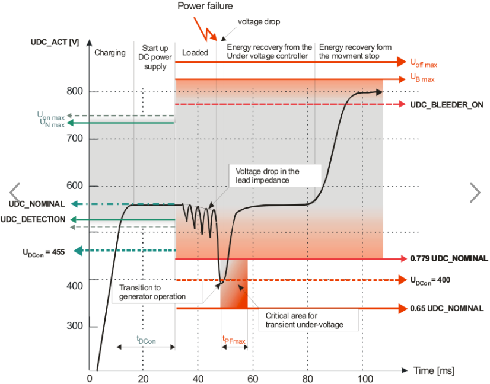
- **实际现象**
    - 通过设备高速运行过程中的 Trace DC Bus 电压，由于带载运动，快速加速导致 DC BUS 降低，减速会导致 DC BUS 升高。例如，可见下图现场生产的设备，可发现 DC BUS 在运动过程中最大值为858V 最低值为508 V。
    - 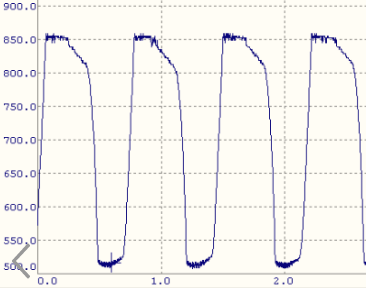
    - 通过现场的数据采集，发现 DC BUS Nominal 的数值偏高，如果为654，则一旦 DC BUS 下降至509 （654 * 0.779 = 509）以下，就会触发7211。由于此情况正好为整个运动过程中高速运动时的 DC BUS 最小值，所以与现场的反馈情况正好一致：只有在刚开机，马上快速加速到高速时，才会报出7211错误
- **解决方式**
    - 重新接线后无法复现，可以初步判断与接线的松紧有关可在上电后读取 DC BUS nominal 的数值，ParID 为 390 理论的
    - $DC BUS Nominal = \sqrt {2}  三相相电压$
    - 正常合理范围的数值应该在380 * 1.414 = 537 左右

### 2023.03.23

- **现象** 现场使用8BVP 双电源模块驱动器报错 7211，9303，41011，7232 设备本体：断路器跳闸，动力电缆温度高达70℃，设备未开机情况下，电流波动大。单拖电缆供电则不再报警
- **原因** 谐振
- 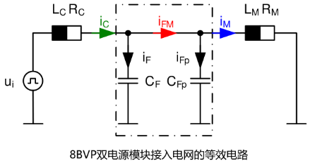
- **解决方式**
    - 临时方案：
    - 加磁环
    - 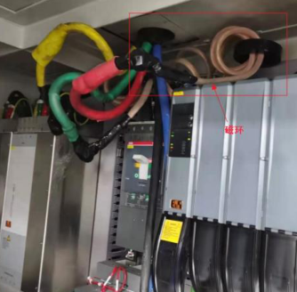
- **最终解决方案**：
    - 加电抗器，能够有效抑制电网谐波，使得线缆发热的问题得到有效控制；增加的电抗器出线侧直接供给贝加莱相应的滤波器驱动器等，电抗器后不要再接其他外设设备，外设设备的供电从电抗器前取电；
    - 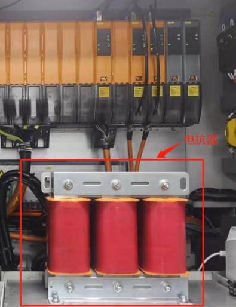

### 2023.03.23

- 经过持续关注，问题的原因是现场电压有波动

### 2023.03.23

- 使用 ACOPOSmulti，并使用了电容模块
- **现象** 目前拍急停，会将设备的所有380V 全断，由于 ACOPOS Multi 中有电容模块，直接断380V 一段时间后（10秒左右），伺服驱动器需要将电容中的电量放完后，才能重新恢复工作，这期间可见电容模块的 ERR 灯红灯常亮并在复位后驱动器始终显示7211错误码，并无法复位，在最多等待2分30秒后，即可重新复位成功。
- **解决方式** 考虑到急停复位后需要立刻能够恢复生产，推荐的拍急停的接线方式为 STO 接法，通过驱动器的 X1端子的 ENABLE 的供电切断来切换对电机的供电来达到急停效果。

### 2023.03.25

- **接线问题原因与排查方式**
- 如果客户380V的零线和地线之间存在较大的电压差(100V以上)，我们的驱动在未switch on时会有一个670V以上的虚DC bus电压，这时驱动switch on时会报7211 常用的三相五线制供电系统（TN-S）在电源变压器端，N和PE是短接在一起（然后一起再接大地）的，正常情况下在用电端两者的压差应该较小。 出现大压差，通常是PE线阻抗偏大导致，可能由于PE线径偏小，或者中间连接处接触不良导致。

# 7212：直流母线：电压骤降大

- **描述**：
    - 控制器处于活动状态时的运行时错误。
    - 直流总线电压 UDC_ACT 下降到截止电压 0.65 \* UDC_NOMINAL 以下。
- **反应**：
    - 主继电器打开。
    - 逆变器功率级关闭。
    - 斩波器功率级关闭。
    - 抱闸已打开。
    - “控制器就绪”状态被重置。
- **原因/补救措施**：
    - 看 Power unit Guid：5d7b1758-8ae0-4bef-8a82-f2b8b1017926
    - 恢复功率过低：断电后，直流母线网络的恢复功率低于直流母线网络的功率损耗 -\> 检查电源平衡.

# 7214：直流母线：预充电电阻热（电源线故障太多）

- **描述**：
    - 如果使用以下 ACOPOS 模块在 20 秒内至少两次加载直流母线，则运行错误：

| | |
|-----------------------------------------------------------|-|
| 8V1022.00-1 | |
| 8V1045.00-1 | |
| 8V1090.00-1 | |
| 8V1022.00-2 从修订版：A0 到并包括修订版：F0 | |
| 8V1045.00-2 从修订版：A0 到并包括修订版：F0 | |
| 8V1090.00-2 从修订版：A0 到并包括修订版：F0 | |

- 如果接通电源的时间间隔短于 20 秒，可能会损坏充电电阻。
- **反应**：
    - 查看错误编号 [7210](#7210直流母线预充电电压不稳定).
- **原因/补救措施**：
    - 看 Power unit Guid：5d7b1758-8ae0-4bef-8a82-f2b8b1017926
    - 在应用中必须防止接通电源的短时间间隔 (\< 20s).

# 7215：电源：至少电源线的一相出现故障

- **描述**：
    - 运行时错误。至少有一个电源相出现故障。
    - 以下模块没有缺相监控：

|      |      |
|:-----|:-----|
| 8V1022.00-1 | |
| 8V1045.00-1 | |
| 8V1090.00-1 | |
| 8V1022.00-2 从修订版：A0 到并包括修订版：F0 | |
| 8V1045.00-2 从修订版：A0 到并包括修订版：F0 | |
| 8V1090.00-2 从修订版：A0 到并包括修订版：F0 | |
| 8BVP | |
| 8C | |
| 8D | |
| 8E | |
| 80 | |

- **反应**：
    - ACOPOS：查看错误编号 [7211](#7211直流母线电压骤降).
    - ACOPOSmulti: 无.
- **原因/补救措施**：
    - 看 Power unit Guid：5d7b1758-8ae0-4bef-8a82-f2b8b1017926
    - 电源接线错误：接触不良或电源相未连接。 -\> 检查电源连接上的接线和电压。
    - 电源缺相：检查接触器、保险丝、变压器和电源电压。
    - 直流母线供电或单相操作：如果 ACOPOS 模块由直流母线或单相供电，则必须忽略相位监视器 (PHASE_MON_IGNORE = 1)。 注意：这些操作模式仅在有条件的情况下允许.

## 应用案例

### 2023.01.12

- Power On 时报7215，屏蔽缺相检测(ID80 = 1)，可临时解决此问题若驱动器均为旧驱动器，且频繁报出，为设备长期稳定运行，建议更换设备。

### 2023.03.23

- **现象** 设备高速运行时，个别设备会报7215错误，发现断路器已断开
- **解决方式** 断路器存在问题，更换后即解决，除此之外断路器的选型与设置存在问题，应该设置在实际需要的数值以上。

### 2023.03.23

- **现象** 设备运行一阵，设备会报7215错误
- **原因** 外接编码器损坏，导致高速运行时给出错误信号，伺服给出过高的加速指令，导致过高的电流的需求
- **解决方式** 更换编码器

### 2023.03.23

- 三相供电380V 断了，驱动器的24V 没有断就会报出此错误，需要复位操作。

### 2023.06.29

- **现象** 9300，6049，7215，7218
- **原因** 驱动器跟随一个外接编码器作为主轴，外接编码器通过两个挂耳固定，由于固定支架断裂，外接编码器转动时有剧烈晃动，编码器信号波动过大，导致驱动器产生异常频繁的加速减速，故发生此问题。
- 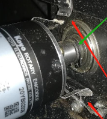
- **解决方式** 更换编码器，并重新固定支架，使编码器没有明显晃动

# 7217：直流母线：标称电压检测：电压过高

- **描述**：
    - 使用“打开控制器”命令时出现运行时错误。
    - 主继电器打开。
    - 当控制器开启时，检查滤波后的直流母线电压 UDC_FILTER。
    - 如果滤波后的直流母线电压 UDC_FILTER 高于制动电阻 UDC_BLEEDER_ON 的阈值电压或高于以下取决于模块的限制电压，则会生成错误。

| | |
|-------------------------|-------------------------------------|
| 8Vxxxx.00-x | 746 VDC (1.1 * sqrt(2) * 480VAC) |
| 8Vxxxx.50-x | 357 VDC (1.1 * sqrt(2) * 230VAC) |
| 8BxP | 746 VDC (1.1 * sqrt(2) * 480VAC) |
| 8C | 880 VDC |
| 8D | 880 VDC |
| 8EIxxxHxxxx.xxxx-x | 825 VDC |
| 8EIxxxMxxxx.xxxx-x | 358 VDC |
| 80 | 88 VDC |

- **反应**：
    - 查看错误编号 [7210](#7210直流母线预充电电压不稳定).
- **原因/补救措施**：
    - 看 Power unit Guid：5d7b1758-8ae0-4bef-8a82-f2b8b1017926
    - 主电源无效：电源电压或直流母线电压过高。 -> 检查直流母线电压.

## 应用案例

### 2023.03.23

- 接通主电后，若 UDC_ACT ( =UDC_FILTER ) > UDC_BLEEDER_ON, 或超过上限电压，则报7217错误

### 2023.03.23

- ACOPOS1640带大惯量负载减速报警直流母线过压，报警后电机自由停止
- **现象** 负载减速造成驱动器直流母线电压升高，超过直流母线电压限制值，因而产生报警。负载减速时，对驱动器 ID298：UDC_ACT 进行 trace，发现负载减速 UDC_ACT 数值曲线升高，超过900V，产生报警7217。观察 UDC_ACT 曲线，在负载减速时曲线一直上升而没有下降，由此分析原因为驱动器没有将制动产生的能量在外置制动电阻上进行释放。
    - 1、检查制动单元内置保险丝，发现保险丝导通正常，保险丝位置如下图所示。
    - 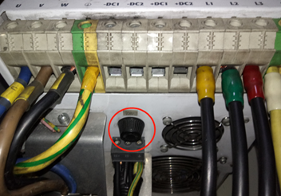
    - 2、在已有的外接制动电阻处，并上电阻，减小外接制动电阻的阻值，增加外接制动电阻的功率，同时修改参数 ID R_BLEEDER_EXT 与外接制动电阻阻值一致，再次进行试验仍然报警驱动器直流母线电压过压，trace 曲线 UDC_ACT 与未作修改前一致。
    - 3、在负载减速时，外接制动电阻温度没有升高，因此判断外置制动电阻没有工作。
- **解决方式** 修改驱动器制动电阻启用直流母线电压参数ID：UDC_BLEEDER_ON的默认值770V为660V。 修改后再次进行试验，在负载减速时trace曲线UDC_ACT，在UDC_ACT数值超过660V之后基本不再上升，也不再产生报警直流母线过压。

# 7218：直流母线：标称电压检测：电压过低

- **描述**：
    - 使用“打开控制器”命令时出现运行时错误。
    - 主继电器打开。
    - UDC_FILTER < 0.9 * UDC_DETECTION
    - 滤波后的直流母线电压 UDC_FILTER 小于自动标称电压检测的 10% 下限电压 0.9\*UDC_DETECTION 的容许值。
    - 无法检测到有效的标称直流总线电压 UDC_NOMINAL。
- **反应**：
    - 查看错误编号 [7210](#7210直流母线预充电电压不稳定).
- **原因/补救措施**：
    - 看 Power unit Guid：5d7b1758-8ae0-4bef-8a82-f2b8b1017926
    - 市电无效：电源电压或直流母线电压过低。 -> 检查直流母线电压。
    - 标称电压检测配置不正确：UDC_DETECTION 太高.

## 应用案例

### 2011.04.07

- **现象**：
    - ACOPOS 批量故障的情况，几乎所有故障都是报 7200、7218、7210。检修后发现问题都是基于底板上的四个光耦损坏。这些光耦位于内置散热片左侧位置。
    - 伺服控制器故障的大都雷同，在断电清洁或其他原因停机后再上电，伺服就出现无法得电的报警
- **原因**：
    - 使用行业为棉纺细纱机、棉纺粗纱机，柜内细碎棉絮很多，线槽被棉絮塞满；PLC 设备、伺服控制器等上已有棉絮。
        - 需要对电控柜进行防尘处理，避免棉絮进入驱动器内部，导致意外短路。
    - 高低压绝缘问题
        - 强电设备底板与强电设备，如电抗器、变压器等。强电设备底板与 PLC 系统底板都是使用普通非绝缘螺丝固定，两底板之间没有任何绝缘处理。
        - 高低压必须采取绝缘处理，比如各底板的固定螺丝处，加上绝缘垫片，或者对螺丝绝缘处理，使得底板与机柜隔离绝缘，底板上的设备与柜体绝缘，达到设备与设备间隔离绝缘。
    - 接地问题
        - 交流地与信号地不能共用。由于在一段电源地线的两点间会有数 mV 甚至几 V 电压，对低电平信号电路来说，这是一个非常重要的干扰，因此必须加以隔离和防止。
        - 控制系统宜采用一点接地。一般情况下,高频电路应就近多点接地，低频电路应一点接地。

### 2012.11.16

- **现象**：使用 ACOPOSmulti，在现场，每台驱动器均报 7218
- **解决方式**：需要取消缺相保护 ParID 80 的设置，需要设置 ParID 300 为 300 VDC 就可以取消 7218 的报警。

### 2013.05.03

- **现象**：
    - 使用 ACOPOSmulti，CPU 上电后 ACOPOSmulti 电源模块 ready 灯正常，但逆变模块 ready 灯闪烁。
    - test 环境下，对逆变模块强制 switch on 操作，报错7218，直流母线电压低，监控电源模块直流电源为545 V
- **解决方式**
    - 参数表中，增加 ParID 390 参数，限制直流电压为 500 V 后，解决问题。

### 2022.01.10

- ID300设定的是下限值， 如果DC总线的电压低于这个值，会报7218

### 2022.09.20

- 如果始终报此故障号，且无法复位，可在断电后，测试是否 L1 L2 L3与 DC+ DC- 之间有无二极管压降，如果没有，则基本是驱动器损坏。

### 2023.03.23

- 接通主电后，若 UDC_ACT (=UDC_FILTER) < 0.9 x UDC_DETECTION, 则报7218错误

### 2023.06.29

- ACOPOS P3上电报7218，读取 ParID 298 DC Bus 电压为0，驱动器故障。

### 2023.06.29

- **现象** 9300，6049，7215，7218
- **原因** 驱动器跟随一个外接编码器作为主轴，外接编码器通过两个挂耳固定，由于固定支架断裂，外接编码器转动时有剧烈晃动，编码器信号波动过大，导致驱动器产生异常频繁的加速减速，故发生此问题。
- 
- **解决方式** 更换编码器，并重新固定支架，使编码器没有明显晃动

### 2023.07.06

- **解决方法**
    - 1.开关电源电压：22.4 V, 伺服18芯端子插拔后，断主380VAC 后电压升至23伏以上，之后不再报警。
    - 2.开关电源出来的电源线太细，如1.5平方，换粗或并联一根线后正常。

### 2023.07.14

- **现象** 现场使用外接增量式编码器，且驱动器型号为 ACOPOS 1320。现场生产过程中设备卡机10次会出现7次停机需要设备复位，且7次中有1次会出现9300,6049,7218报警
- **原因** 终端现场没有给驱动器接地线，导致信号干扰
- **解决方式** 接了地线后，设备卡机也不会导致停机需要设备复位。

### 2023.08.23

- **现象**：伺服上电后，报错7218。检测伺服端子时，电压稳定在555V 左右。但是通过 AS 软件监控时 DC BUS 上的电压稳定在280V 左右。
- **原因**：伺服上的 DC BUS 检测电路故障
- **解决方式**：更换伺服驱动器

# 7219：直流母线：预充电：电压过低

- **描述**：
    - 使用“打开控制器”命令时出现运行时错误。
    - 主继电器打开。
    - UDC_FILTER < 0.9 * UDC_NOMINAL
    - 过滤后的直流母线电压 UDC_FILTER 小于 10% 标称电压 0.9 * UDC_NOMINAL 的容许值。
- **反应**：
    - 查看错误编号 [7210](#7210直流母线预充电电压不稳定).
- **原因/补救措施**：
    - 看 Power unit Guid：5d7b1758-8ae0-4bef-8a82-f2b8b1017926
    - 主电源无效：电源电压或直流母线电压过低。 -> 检查直流母线电压。
    - 标称电压初始化配置不正确：UDC_NOMINAL 太高.

## 应用案例

### 2022.01.10

- 请检查驱动器380V 输入是否有电

### 2023.01.11

- 进线电压380V，但保险丝断了

### 2023.03.23

- DC Bus 测量值虚高，但是实际内部电压检测没有达到 Nominal Voltage +- 10%。之前程序通过参数表手动设置 ID390=560
- 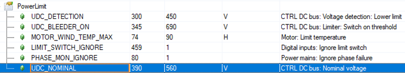

### 2023.03.23

- **现象** ACOPOSmulti 逆变模块 PowerOn 时，母线电压不足，报错7219。
- **解决方案** 读取ID298，DC BUS为580V，电源模块与逆变模块设定母线电压改为600V(被动式使用)

# 7220：直流母线：标称电压检测：电压不允许

- **描述**：
    - 使用“开启控制器”命令时出现运行时错误。
    - 主继电器打开。
    - 如果在带有内部直流母线电源 (8 V 1180. Xx-x - 8 V 128 M. Xx-x) 的 ACOPOS 模块中，滤波后的直流母线电压 UDC_FILTER 在不允许的范围内 [1.1\*SQRT(2)\*240, 0.9\*SQRT(2 )\*380] 直流电压
    - 或者
    - 如果 (PHASE_MON_IGNORE = 1) 并且满足以下条件：

| | |
|-----------------|-------------------------------|
| 8Vxxxx.00-2 | UDC_FILTER < 484VDC |
| 8Vxxxx.50-2 | UDC_FILTER < 293VDC |

- **反应**：
    - 查看错误编号 [7210](#7210直流母线预充电电压不稳定).
- **原因/补救措施**：
    - 看 Power unit Guid：5d7b1758-8ae0-4bef-8a82-f2b8b1017926
    - 主电源无效：市电电压或直流母线电压无效。 -\> 检查直流母线电压.

## 应用案例

### 2011.04.07

- **现象**：
    - ACOPOS 批量故障的情况，几乎所有故障都是报 7200、7218、7210。检修后发现问题都是基于底板上的四个光耦损坏。这些光耦位于内置散热片左侧位置。
    - 伺服控制器故障的大都雷同，在断电清洁或其他原因停机后再上电，伺服就出现无法得电的报警
- **原因**：
    - 使用行业为棉纺细纱机、棉纺粗纱机，柜内细碎棉絮很多，线槽被棉絮塞满；PLC 设备、伺服控制器等上已有棉絮。
        - 需要对电控柜进行防尘处理，避免棉絮进入驱动器内部，导致意外短路。
    - 高低压绝缘问题
        - 强电设备底板与强电设备，如电抗器、变压器等。强电设备底板与 PLC 系统底板都是使用普通非绝缘螺丝固定，两底板之间没有任何绝缘处理。
        - 高低压必须采取绝缘处理，比如各底板的固定螺丝处，加上绝缘垫片，或者对螺丝绝缘处理，使得底板与机柜隔离绝缘，底板上的设备与柜体绝缘，达到设备与设备间隔离绝缘。
    - 接地问题
        - 交流地与信号地不能共用。由于在一段电源地线的两点间会有数 mV 甚至几 V 电压，对低电平信号电路来说，这是一个非常重要的干扰，因此必须加以隔离和防止。
        - 控制系统宜采用一点接地。一般情况下,高频电路应就近多点接地，低频电路应一点接地。

### 2022.01.10

- 7220是对8V1180-8V128M 的驱动器才有的报错，是 DC 总线的电压稳定在373V 到484V 之间。这个应该也是供电出了问题。

### 2022.01.11

- 报警6045和7220
- **问题描述** 进线电源电压测得360V，伺服启动不起来，参数 ID300已经改成300了，也启动不起来，中午休息时，进线电源380V 时，伺服就能起来，运行版本：K4.26;ACP10 3.18.2
- **问题原因** 进线电压低于380V，测量值为360V 左右
- **解决方法** 更换 ACP10版本为5.11.1 注：ACP10 3.18.2 版本下，电压在360V 时上电会报6045故障，而相同外部条件下，更换 ACP10 为 5.11.1 版本后，不会报6045的故障

### 2023.03.23

- 当ACOPOS(8Vxx)接单相主电时，若禁用缺相检测（即ID80 PHASE_MON_IGNORE为1)，且UDC_ACT小于510V (UDC_DETECTION的默认值的0.9倍)，则报7220 (DC bus: Nominal voltage detection: voltage not allowed) 当带内置24V电源的ACOPOS(8V1180 - 8V128M)主电上电，且UDC_ACT稳定在 373V ~ 484V区间（对应 3x240Vac+10% ~ 3x380Vac-10%输入），则报7220 (DC bus: Nominal voltage detection: voltage not allowed)

# 7221：电源：故障

- **描述**：
    - 8 BVPxxxxxxxx.xxx-x：如果观察到的电源频率 (SCTRL_SPEED_ACT) 与启动时识别的电源频率（参见信息）相差超过 MAINS_FREQ_TOL %，则会出现运行时错误。
- **反应**：
    - 关闭电源部分
    - 参数 STAT_UDC_POWERFAIL 设置为值 2。
    - “控制器就绪”状态被重置。
- **原因/补救措施**：
    - 主电源干扰：主电源线路的至少一相故障。
        - -> 使用万用表检查电压。
    - 市电干扰：市电电压高度失真或不对称。
        - -> 使用功率分析仪检查电压.

# 7222：逆变器：总和电流：过电流

- **描述**：
    - 如果总和电流的绝对值 (= |VCTRL_I 0| = |VCTRL_I 1 + VCTRL_I 2 + VCTRL_I 3|) 超过模块相关的限制 VCTRL_I 0_LIM（参见信息），则运行时错误：
- **反应**：
    - 查看错误编号 [7224](#7224背板连接器24v-gnd-接触监控电压过低).
- **原因/补救措施**：
    - 接地连接到触点 U、V 或 W 上的逆变器输出
    - 容性负载：当使用长电机电缆 (\> 50m) 或来自第三方制造商的电缆时。
    - 不稳定的电流控制器：请参阅错误编号 [9300](#9300电流控制器过流).
    - -> 在大电流和高电流变化率的情况下，动态电流互感器误差会导致测得的总和电流值过高.

## 应用案例

### 2023.02.13

1. 请先排除上述的电机以及驱动器上的接地是否连接。以及接地与 U V W 是否接通。
2. 请检查机械是否卡死或者电机转动有异响，在断开电机使能转动负载以及断开联轴器，手动转动电机轴确认机械卡死位置。
3. 如果是线轴电机8LSC84，请先考虑是否为电机已损坏，通常会带有类似以下报警代码。
4. 检查动力电缆，编码器电缆是否拧紧，电机侧端子针脚是否有弯曲或折断。
5. 测量电机的U V W三相之间的电阻是否平衡，测量电机U V W与地之间电阻是否无穷大。

# 7223：直流母线：过压 DC-GND

- **描述**
    - 如果 UDC+ 和 GND 或 GND 和 UDC- 之间的电压差大于 900V，则运行错误。
- **反应**
    - 查看错误编号 [7224](#7224背板连接器24v-gnd-接触监控电压过低).
- **原因/补救措施**
    - 接线错误：当电机相接地故障时：检查接线
    - 无效电源：不得使用 IT 电源和 TN-S 电源
    - 电源干扰：电压脉冲（例如：闪电等）：检查电源电压。
    - 8 BVxxxxxxxxx.xxx-x：硬件缺陷（例如：旁路电容故障）：更换电源模块

## 应用案例

### 2022.01.11

- 7223: DC bus: Overvoltage DC-GND 电机UVW等接线可能对地短路了

# 7224：背板连接器：24V-GND 接触监控：电压过低

- **描述**：
    - 如果未在模块的所有背板连接器上 24V 和 GND 触点之间测量 24V 总线电压，则会出现运行时错误。
    - 背板连接器的定义：
        - 背板连接器通过拧紧模块的下部安装螺钉将电源模块与直流总线和 24V 导轨连接起来。背板连接器包含 5 个触点：从上到下 UDC+、UDC-、PE、24V、GND。
    - 背板连接器中的接触监控存在于以下模块上：
        - 电源模块 8BVPxxxxxxxx.xxx-x
        - 具有至少 2 个背板连接器的逆变器模块（例如：8BVx0880xxxx.xxx-x）。
- **反应**：
    - 当“打开控制器”命令时：
    - 查看错误编号 [4005](#4005控制器无法开启驱动处于错误状态).
    - 当控制器处于活动状态时：
    - 逆变器模块：通过关闭功率元件输出级并打开抱闸来停止运动。
    - 电源单元：关闭功率元件输出级。
    - “控制器就绪”状态被重置。
- **原因/补救措施**：
    - *如果*
        - 辅助电源模块上的绿色 LED 亮起并且
        - 存在 24V 总线电压：
            - 电源模块：背板连接器接触问题：24V 总线电压无法在至少一个背板连接器上传输。检查模块的下部安装螺钉。
            - 电源模块：24 V 接触式监视器的评估电路有缺陷。更换电源模块。
    - *如果*
        - 辅助电源模块上的绿色 LED 亮起并且
        - 24 V 总线电压不存在：
            - 辅助电源模块：24 V 输出故障。更换辅助电源模块。
    - *如果*
        - 只有辅助电源模块上的红色 LED 亮起，
        - 逆变器模块上没有 LED 亮起，并且
        - 不存在 24V 总线电压：
            - 辅助电源模块：背板连接器接触问题：辅助电源模块的背板连接器与 24V 导轨没有接触。检查模块的下部安装螺钉。
            - 辅助供电模块：模块过载。检查当前的要求。
            - 辅助电源模块：模块损坏。更换辅助电源模块。
            - 24V-Bus：24V-和GND-rail之间的短路
    - *如果*
        - 辅助电源模块上没有 LED 亮起，
        - 逆变器模块上没有 LED 亮起，并且
        - 不存在 24V 总线电压：
            - 辅助供电模块：24V输出未关闭：X1接头CR_OK信号缺失：CR_OK（Pin5/Pin6）与COM（Pin3/Pin3）X1接头上无5V电压差。检查 X1 连接器。
            - 电源单元：CR_OK 输出故障。更换电源模块。
            - 网络：CR_OK 输出未关闭，因为主电源不稳定。检查主电源和直流母线电压.

## 应用案例

### 2023.03.21

- 背板螺丝没有拧紧

### 2023.03.23

- **现象** ACOPOSmulti 主动电源模块无法 PoweOn，报错7224，7036。
- **解决方案** 通过查看 Multi 安装手册，对其进行拆卸重装以检测是否有连接不良的情况。结果刚一拧螺丝发现连接主动电源与底板的螺丝根本没拧紧，导致供电不足。同时 Multi 还有三个模块的连接螺丝未拧紧。
    - 

# 7225：直流母线：过压

- **描述**：
    - 如果直流母线电压 UDC_ACT 超过限制电压 UDC_OVMON_STOP_LIM（参见信息），则主动控制期间的运行时错误。
- **反应**：
    - 没有电流限制的短路制动停止运动。
- **原因/补救措施**：
    - 看 Power unit
    - 看错误代码 [7200](#7200直流母线过压).

## 应用案例

### 2023.03.23

- **现象** 运行中报以下错误 7200: DC bus: Overvoltage (超过驱动器极限阈值） 7225: DC bus: Overvoltage (超过用户设置阈值)
- **解决方式** 需要接外部制动电阻

### 2023.03.23

- **现象** Z 轴高速下降产生的回馈能量，使得 DC bus 电压超过 micro 的阈值（ID1221=95V），产生报错7225。
- **解决方案** 让 micro 的电源厂家增加能量泄放单元

### 2023.03.23

- **现象** 制动电阻不起作用
- **解决方式** 更换制动电阻
- **检查方式**
    - UDC_BLEEDER_ON ：ID 345 制动电阻工作电压；
    - UDC_ACT：ID 298，直流母线实际电压；
    - UDC_CHOP_CURR：ID 1155，实际制动电流，仅在 8 B 0 P 有效，单位 A，只读；
    - 通过监控 ID298或 ID1155或 ID876可确定在制动过程中，制动电阻是否工作。
        - 不工作的可能原因有以下几点：
            - a. 接线错误；
            - b. 保险丝未安装或烧毁（P 3 无保险丝）
            - c. UDC_BLEEDER_ON 设置过高
            - d. 8B0P 必须使能

### 2023.07.07

- 41041 / 7225 / 29226由于外部制动电阻的欧姆电阻或功率不足，导致机器无法在较高的速度运行。

# 7226：直流母线：过流

- **描述**：
    - 8B0Pxxxxxxxx.xxx-x：如果直流总线电流 RECT_CURR 超过限制值 sqrt(2) * ACOPOS_CURR_MAX，则运行错误。
    - 80Vxxxxxx.xxxx-xx：如果直流总线电流超过模块相关的极限值，则会出现运行错误。
- **反应**：
    - 8B0Pxxxxxxxx.xxx-x：主继电器打开。 IGBT 输出级关断。
    - 80Vxxxxxx.xxxx-xx：输出级关闭。
- **原因/补救措施**：
    - 直流母线：短路

# 7227：泄放器：过流

- **描述**：
    - 如果测量的斩波器电流 UDC_CHOP_CURR 超过限值 1.2 * UDC_ACT / R_BLEEDER，则运行时会出错。
    - 外部泄放器 (BLEEDER_SELECTOR_EXT == 1)：R_BLEEDER = R_BLEEDER_EXT
    - 内部泄放器 (BLEEDER_SELECTOR_EXT == 0)：取决于模块（参见用户手册，例如：8B0P0110xxxx.xxx-x：R_BLEEDER = 270 Ohm）
- **反应**：
    - 没有任何。
- **原因/补救措施**：
    - 制动电阻错误配置：制动电阻R_BLEEDER_EXT的阻值参数设置过高。
    - 制动电阻损坏：制动电阻的实际阻值降低。
    - 制动电阻损坏或连接 RB+ 和 RB-：短路
    - 制动电阻器损坏或连接 RB-：接地故障 RB-
    - 直流母线电压测量不良：实际直流母线电压值高于测得的直流母线电压值UDC_ACT。
    - 斩波器电流测量缺陷：测量的斩波器电流值 UDC_CHOP_CURR 太高。
    - 可以通过设置参数 MOTOR_TEST_MODE 中的 Bit8 (0x100) 来禁用过流检查。
        - 注意：忽略制动电阻过流会导致 ACOPOS 模块或制动电阻损坏.

## 应用案例

### 2023.02.14

- **现象** 整机上电后，伺服报错7227
- **解决方式** 降低参数表内R_BLEEDER_EXT（ID10）数值。 实际使用过程发现，8B0P0440电源的制动电阻实际阻值是13Ω，连续功率10KW。伺服在整机上电后会报错7227，复位后即不再产生此错误，修改参数表内R_BLEEDER_EXT至10Ω后，问题解决。

# 7228：直流母线：标称电压检测：高浪涌电流

- **描述**：
    - 如果在关闭主继电器时直流母线电压增加的系数大于 1.283 (= 1/(0.9\*sqrt(3)/2))，则会出现运行时错误（请参阅信息）。
- **反应**：
    - 没有任何。
- **原因/补救措施**：
    - 模块在规范之外运行：
        - 开机间隔太短
        - 直流母线电容过大
        - 环境温度太高。
    - 直流母线短路
    - 外部充电电路出现故障
    - 并联电源模块出现故障

# 7229：斩波器：过流

- **描述**：
    - 如果斩波器记录过流，则出现运行时错误。
- **反应**：
    - 关闭斩波器。
- **原因/补救措施**：
    - 制动电阻损坏或连接 RB+ 和 RB-：短路
    - 制动电阻器损坏或连接 RB-：接地故障 RB-

# 7230：直流母线：超出中心电压限制

- **描述**：
    - 当直流总线的中心电压 (UDC_MIDDLE_ACT) 超出范围时，主动控制期间的运行时错误。
- **反应**：
    - 执行带有配置行为的错误停止运动。
- **原因/补救措施**：
    - 该信息显示了平衡器状态的详细信息：
        - 0-6 ... 必要的负载情况的额外评估
        - 7 ...超出系统限制
    - 验证梭子运动和故障段上的位置
        - 穿梭机之间的距离太小
        - 段过渡区中穿梭机的同时性
        - 速度和/或加速度和/或力太高

# 7231：电机：过压

- **描述**：
    - 主动控制期间的运行错误，如果直流总线电压 UDC_ACT 超过电机 MOTOR_UDC_MAX 的最大允许直流总线电压（参见信息）。
- **反应**：
    - 逆变器功率级关闭。
- **原因/补救措施**：
    - 电源电压过高。
    - 泄放器UDC_BLEEDER_ON的开启阈值过高.

# 7232：主电源：检测到的频率超出范围 [20,200]

- **描述**：
    - 如果检测到的电源频率的绝对值（参见信息）超出范围 [20,200]Hz，则在打开控制器时出现运行错误。
- **反应**：
    - 逆变器功率级关闭。
- **原因/补救措施**：
    - 检查电源频率.

## 应用案例

### 2022.10.13

- **情况**：multi 主动电源上电报 7232，并且 ParID 80 已设 1
- **原因**：检查8BVR 和8BVP 的三相接线顺序，发现接线错误。

### 2023.03.23

- **现象** 现场使用8BVP 双电源模块驱动器报错 7211，9303，41011，7232 设备本体：断路器跳闸，动力电缆温度高达70℃，设备未开机情况下，电流波动大。单拖电缆供电则不再报警
- **原因** 谐振
    - 
- **解决方式**
    - 临时方案：加磁环
        - 
    - **最终解决方案**：
        - 加电抗器加电抗器，能够有效抑制电网谐波，使得线缆发热的问题得到有效控制；增加的电抗器出线侧直接供给贝加莱相应的滤波器驱动器等，电抗器后不要再接其他外设设备，外设设备的供电从电抗器前取电；
        - 

# 7300：模拟/数字 IO：IO 配置无效

- **描述**：
    - 模拟/数字 IO 的输入/输出配置期间的响应错误。定义了硬件/软件不支持的配置。
- **反应**：
    - 不接受参数值。
- **原因/补救措施**：
    - 使用 AC130 插卡时，前 8 个 IO 必须成对配置（1/2、3/4、5/6、7/8）作为输入或输出。
    - 查看错误编号 [1002](#1002参数超出有效范围).

# 7303：模拟/数字 IO：24V 电源故障

- **描述**：
    - 模拟/数字插件卡的电源电压运行错误。
    - 电源电压小于硬件特定的错误阈值。
- **反应**：
    - 输出关闭。
- **原因/补救措施**：
    - 检查电源控制。
    - 电源过载或故障。
    - 电源故障。
    - 电源连接缺陷（线路开路、线路终端、接线错误、保险丝）。
    - 插卡缺陷.

# 7304：模拟/数字 IO：网络连接中断

- **描述**：
    - 模拟/数字 IO 的网络连接中的运行时错误。
- **反应**：
    - 模拟/数字输出被禁用。
- **原因/补救措施**：
    - 查看错误编号 [1012](#1012循环网络通信的崩溃).

# 7305：数字 IO：数字输出：诊断位激活

- **描述**:
    - 数字输出上的运行时错误。
- **反应**
    - 查看错误编号 [39302](#39302数字-io-1-4诊断位激活电流24v-电源).
- **原因/补救措施**：
    - 查看错误编号 [39302](#39302数字-io-1-4诊断位激活电流24v-电源).

# 7306：模拟 IO：模拟输出：诊断位激活

- **描述**：
    - 模拟输出上的运行时错误。
- **反应**：
    - 查看错误编号 [39302](#39302数字-io-1-4诊断位激活电流24v-电源).
- **原因/补救措施**：
    - 查看错误编号 [39302](#39302数字-io-1-4诊断位激活电流24v-电源).

# 7401：参数位置超过最大数据长度

- **描述**：
    - 为驱动器（CYCLIC_TORV_PARID、CYCLIC_FRDRV_PARID）的循环操作写入参数 ID 时出现响应错误。
- **反应**：
    - 不接受参数 ID。
- **原因/补救措施**：
    - 要驱动的参数超过最大数据长度。
    - 监控块中驱动器的参数超过最大数据长度.

# 7402：参数序列的处理中止：写入错误

- **描述**：
    - 如果参数在当前索引处发送错误（索引从 0 开始），则参数序列初始化期间的运行时错误。
- **反应**：
    - 不处理参数序列中的后续参数。状态保持在“未初始化”。参数错误额外输入为运行时错误。
- **原因/补救措施**：
    - 根据参数 ID 和另外输入的错误号.

# 7403：参数序列的处理仍然有效

- **描述**：
    - 如果该序列中的参数尚未完成处理，则在下载或初始化参数序列期间出现响应错误。
- **反应**：
    - 不接受新的下载数据或不重新启动初始化。
- **原因/补救措施**：
    - 缺少“参数序列初始化”状态的请求（延迟步骤）。
    - -> 检查程序顺序和状态请求.

# 7404：参数序列在索引处不可用

- **描述**：
    - 如果索引处没有数据，则使用“初始化参数序列”命令响应错误。
- **反应**：
    - 不执行命令。
- **原因/补救措施**：
    - 无效的参数序列索引。
    - 尚未为索引执行下载。
    - 下载到索引之前因错误而中止.

# 📋回到总览页

[000轴控ACOPOS报警号](000轴控ACOPOS报警号.md)
