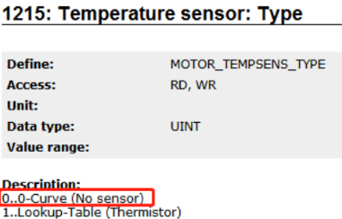

# 9000：散热器温度传感器：超出停止限制

- **描述**：
    - 如果散热器温度传感器 TEMP_HEATSINK 的温度超过限制（请参阅信息），则会出现运行时错误。
- **反应**：
    - “控制器就绪”状态被重置。
    - 当“打开控制器”命令时：请参阅错误编号 [4005](#4005控制器无法开启驱动处于错误状态)。
    - 8V、8BVI、8CVI、80V、8DI：
        - 默认设置 STOP_ERR_DECEL_RAMP=ncA_LIMIT：
        - 当位置控制激活时（CONTROLLER_MODE=1 或 33）：
        - 通过轴限制和关闭控制器停止运动。
        - 当速度控制激活时：
        - 通过速度调节斜坡、轴限制和关闭控制器停止运动。
        - 当 V/f 控制处于活动状态时 (CONTROLLER_MODE=7)：
        - 通过速度控制斜坡、轴限制和关闭控制器停止运动。
        - 当电流控制通过换向激活时 (CONTROLLER_MODE=4)：
        - 通过电流限制和关闭控制器停止运动。
        - 设置 STOP_ERR_DECEL_RAMP=ncINDUCTION：
        - 独立于控制器模式：运动中止，感应停止。另请参阅错误编号 [9001](#9001散热器温度传感器超出关闭限制)。
        - 设置 STOP_ERR_DECEL_RAMP=ncCTRL_OFF：
        - 独立于控制器模式：通过立即关闭控制器和电源部分来中止运动。驱动器没有电气扭矩。
    - 8B0P：
        - 斩波器输出和 CR_OK 输出关闭，主继电器打开，RDY-、RUN- 和 ERR LED 以 3 秒周期同步闪烁。
        - 错误状态只能通过重启模块退出（例如：关闭电源和外部 24V 电源或软件重启）。
    - 8BVP：
        - 逆变器功率级关闭。
- **原因/补救措施**：
    - 无效的操作条件：
        - 运行时环境温度高于 40℃。 -\> 打开进气口后立即检查冷空气温度。
        - 更换 ACOPOS 模块中的空气流量适中。 -\> 检查安装方向和进气口盖。
    - 更换ACOPOS模块缺陷：
        - 冷却风扇缺陷。 -> 检查控制器开启时风扇是否发出声音。当散热器温度高时，风扇发出的声音更大。
        - 散热片温度测量问题： -> 当控制器关闭时，将环境温度与散热片温度传感器 TEMP_HEATSINK 的温度进行比较。
        - 如果 IGBT 和散热器之间的热转换电阻过高，请检查散热器和 IGBT 之间的散热情况。 -> 更换 ACOPOS 模块。
    - 阻塞的热传输（冷却气流）

## 应用案例

### 2022.01.11

- 41001/9000 Heatsink temperature sensor: Warning limit exceeded:
- （1）ID380：伺服驱动器温度读取值变化较大有可能驱动器硬件有问题：驱动器的问题是通过 IGBT 读取过来的，IGBT 某引脚焊点有氧化或者进水腐蚀
- （2）如果是 acoposmulti 电源轴，那么有可能是 T+T-接线问题，或者外部动力电问题（比如动力电缆温度高）

### 2023.03.21

- **现象** 电机报错7022、7048、9003、9000，其它电机报错 64006。随后所有使用 HomeRestore 的电机相位丢失
- **原因** 使用了 Home Restore Position 功能偶发的 Permanent 变量丢失问题会导致 HomeRestore 异常
- **解决方式** 需要重新标定零点若重新标定零点无法接受，可以考虑以下方案: InitEndlessPosition 的问题是，当你丢失了永久保持变量或者掉电保持变量，位置的数据丢失了，必须重新进行 Home。为了避免这种情况，可以将 MC_ENDLESS_POSITION 不断存储到一个文件中。启动后，如果永久变量为空，在执行归位恢复模式（homing restore position mode）前，可以将文件中的那些数据写入 MC_ENDLESS_POSITION 变量。可以将轴的整个永久保持变量数据结构体包括校验和备份到文件或 DataObj 中。需要注意的是，整个内存都被完整复制。

### 2023.03.23

- 9000、9030、41031 无法复位解决，驱动器内部可能被铁屑与油污损坏，更换驱动器

### 2023.04.03

- **现象** 驱动器 Switch On 报错9000 9003，Heatsink 和 Junction 温度超限
- **解决方式** 更换驱动器

### 2023.06.29

- **现象** ACOPOS P3一台驱动器报9000,9030,9094，读 ParID 380，数值为不合理的140。
- **解决方式** 驱动器故障，更换。

# 9001：散热器温度传感器：超出关闭限制

- **描述**：
    - 如果散热器温度传感器 TEMP_HEATSINK 的温度超过限制（请参阅信息），则会出现运行时错误。
- **反应**：
    - 同步电机：通过短路制动停止运动。如果阶段 1 和阶段 2 中的电流信号和电压信号是稳定的，逆变器功率级将关闭。
    - 异步电机：通过涡流制动停止运动。如果阶段 1 和阶段 2 中的电流信号和电压信号是稳定的，逆变器功率级将关闭。
    - 运动停止时电机电流被限制在电机额定电流 MOTOR_CURR_RATED 和伺服驱动器额定电流 ACOPOS_CURR_RATED。
    - 设置 STOP_ERR_DECEL_RAMP=ncCTRL_OFF：
    - 通过立即关闭控制器和电源部分来中止运动。驱动器没有电气扭矩。
- **原因/补救措施**：
    - 在运动停止期间（参见错误编号 [9000](#9000散热器温度传感器超出停止限制) ），散热器的温度升高。
    - 如果运动已经在更深的温度下停止，则不会超过极限温度（参见信息）.

# 9003：散热器温度传感器：未连接或损坏

- **描述**：
    - 如果测得的散热器温度超出允许值范围，则运行错误。
- **反应**：
    - 请参阅错误编号 [9000](#9000散热器温度传感器超出停止限制) 。
- **原因/补救措施**：
    - 无效的操作条件：模块在规范之外操作。 环境温度过高或过低。
    - ACOPOS 模块缺陷：散热片温度测量问题。 查看错误编号 [41002](#41002散热器温度传感器未连接或损坏).

## 应用案例

### 2023.03.21

- **现象** 电机报错7022、7048、9003、9000，其它电机报错64006。随后所有使用 HomeRestore 的电机相位丢失
- **原因** 使用了 Home Restore Position 功能偶发的 Permanent 变量丢失问题会导致 HomeRestore 异常
- **解决方式** 需要重新标定零点若重新标定零点无法接受，可以考虑以下方案: InitEndlessPosition 的问题是，当你丢失了永久保持变量或者掉电保持变量，位置的数据丢失了，必须重新进行 Home。为了避免这种情况，可以将 MC_ENDLESS_POSITION 不断存储到一个文件中。启动后，如果永久变量为空，在执行归位恢复模式（homing restore position mode）前，可以将文件中的那些数据写入 MC_ENDLESS_POSITION 变量。可以将轴的整个永久保持变量数据结构体包括校验和备份到文件或 DataObj 中。需要注意的是，整个内存都被完整复制。

### 2023.04.03

- **现象** 驱动器 Switch On 报错9000 9003，Heatsink 和 Junction 温度超限
- **解决方式** 更换驱动器

# 9010：温度传感器（电机\|扼流圈\|外部）：超出停止限制

- **描述**：
    - 如果电机温度传感器 TEMP_MOTOR 的温度超过限制（请参阅信息），则会出现运行时错误。
- **反应**：
    - 请参阅错误编号 [9000](#9000散热器温度传感器超出停止限制) 。
- **原因/补救措施**：
    - 无效的操作条件：
        - 环境温度过高。 -> 检查电机规格。
        - 法兰温度过高。 -> 检查电机规格。
        - 冷却有缺陷。 -> 检查任何必要的风冷或水冷。
    - 超过电机持续电流：
        - 增加电流。参见错误编号 [9030](#9030结温模型超出停止限制) 。 -> 确定电机电流的中速和有效值，并将这些值与电机的连续电流曲线（S1 操作）进行比较。
    - 电机温度测量问题：
        - 传感器缺陷：-> 当控制器关闭时，将环境温度与 TEMP_MOTOR 进行比较。
        - 传感器无法连接：错误报告在单轴模块的第二个轴上。
        - 干扰：连接器电缆上的电机温度传感器缺失或屏蔽不良。检查电机温度 TEMP_MOTOR 是否存在干扰脉冲。
        - 温度传感器的隔离不良
        - ACOPOS 模块缺陷
    - 电机最高温度（=110℃）过低.

## 应用案例

### 2022.02.13

- ACOPOS 伺服达到**MOTOR_WIND_TEMP_MAX**温度限制后的行为 **TEMP_MOTOR** 此变量 （ParID） 包含由温度传感器测量的电机温度。传感器通常位于两个电机定子绕组之间。 **MOTOR_WIND_TEMP_MAX** MOTOR_WIND_TEMP_MAX 参数包含引擎的阈值。如果发动机温度达到 TEMP_MOTOR 极限值 MOTOR_WIND_TEMP_MAX，则发动机关闭。以下错误消息：9010：温度传感器（电机 | 扼流圈 | 外部）：超出止损限制。 **达到 MOTOR_WIND_TEMP_MAX 阈值后的行为** 可以检查提到的错误消息 9010，但无法再次打开发动机。必须等到电机温度降至 MOTOR_WIND_TEMP_MAX 值的 70%以下。只有这样，才能再次打开电机。这种冷却可能需要很长时间，具体取决于情况。
- **解决方法** 此解决方案仅用于服务干预（因此不适用于客户应用中的正常运行）。如果电机温度传感器电路短时间中断，或者如果相应的 PLC 重启，则可以立即打开电机。不再需要等待它冷却下来。
- **例** 在本例中：MOTOR_WIND_TEMP_MAX = 100 °C：
- 
- **备注** 必要冷却到 MOTOR_WIND_TEMP_MAX 值的70%将被改变。从 ACP10 3.15.0开始，此值将为 90%。

### 2023.04.03

- ACOPOSmulti 中的8BVF 线路滤波器和8BVR 再生电抗器有内置温度传感器。这些温度传感器必须按照 "8BVP1650电源与2个8BVR0880和2个8BVF0880的连接 "图进行接线!
- 
- 如果接线不正确，会报告错误9010或9012。检查接线!

### 2023.04.03

- **现象** 连续运行约 15 分钟后出现电机过温报警(9010)
- **解决方式** 发现是电机侧散热风扇未开，检查接线打开散热风扇

### 2023.04.03

- **现象** 直线电机运行时出现报警41011和9010 连续运行的时长同报警时机目前并没有发现严格的关联，有时连续运行多个小时不报警，有时0.5小时就报警。电机温度传感器为常开型温度开关，开关状态切换的温度阈值暂定为100℃
- **解决方式** 将电机参数里的MOTOR_WIND_TEMP_MAX 设置为100（Endat），则ID1172缺省值为100。

# 9011：温度传感器（电机\|扼流圈\|外部）：超出关闭限制

- **描述**：
    - 如果电机温度传感器 TEMP_MOTOR 的温度超过限制（请参阅信息），则会出现运行时错误。
- **反应**：
    - 请参阅错误编号 [9001](#9001散热器温度传感器超出关闭限制)
- **原因/补救措施**：
    - 在运动停止期间（参见错误编号 [9010](#9010温度传感器电机扼流圈外部超出停止限制) ），电机温度升高。
    - 如果运动已经在更深的温度下停止，则不会超过极限温度（参见信息）.

# 9012：温度传感器（电机\|扼流圈\|外部）：未连接或损坏

- **描述**：
    - 如果超过温度传感器 MAX(MOTOR_TEMPSENS_PAR1, MOTOR_TEMPSENS_PAR2) 的电阻上限，则使用线性热敏电阻时会出现运行时错误。
    - 如果 PTC 开关的电阻超过 \~7000 欧姆，则使用 PTC 开关时会出现运行时错误。
- **反应**：
    - 请参阅错误编号 [9000](#9000散热器温度传感器超出停止限制) 。
- **原因/补救措施**：
    - 电机温度传感器接线错误或缺陷：电机温度传感器未连接，或接触松动。 -> 当控制器关闭时，将环境温度与 TEMP_MOTOR 进行比较。 -> 使用万用表检查插头上电机温度传感器的电阻是否合理。
    - 线性热敏电阻 MAX ( MOTOR_TEMPSENS_PAR1, MOTOR_TEMPSENS_PAR2 ) 的电阻上限选择得太低。
    - 电机温度测量问题：请参见错误编号 [9010](#9010温度传感器电机扼流圈外部超出停止限制).

## 应用案例

### 2022.07.28

- 更换电机线缆后解决问题

### 2023.02.14

- 1.检查电器柜驱动器上的接线是否松动及下面的动力线缆是否松动
- 2.检查驱动器24v 灯是否有，没有的话重启拧紧24v 背板螺丝
- 3.检查电机上的动力线缆及编码器线是否松动，重新拧紧。

### 2023.04.03

- ACOPOSmulti 中的8BVF 线路滤波器和8BVR 再生电抗器有内置温度传感器。这些温度传感器必须按照 "8BVP1650电源与2个8BVR0880和2个8BVF0880的连接 "图进行接线!
- 
- 如果接线不正确，会报告错误9010或9012。检查接线!

### 2023.06.28

- **现象** 现场通电后电源模块报警9012
- **原因** 经检查，确认8BVP 的 T-未与8BVF 的 T-连接，客户电气图上也无该线，且8BVF 的 F+F-接线顺序相反。
- 

### 2023.06.28

- **现象** 设备生产过程中突然报出9012
- **原因** 电机温度传感器断线。

# 9013：温度传感器（电机\|扼流圈\|外部）：短路

- **描述**：
    - 如果未达到温度传感器 MIN(MOTOR_TEMPSENS_PAR1, MOTOR_TEMPSENS_PAR2) 的电阻下限，则使用线性热敏电阻时会出现运行时错误。
    - 如果 PTC 开关 TEMPSENS_RESISTANCE 的电阻低于参数 MOTOR_TEMPSENS_PAR2 的值，则使用 PTC 开关时会出现运行时错误。
- **反应**：
    - 请参阅错误编号 [9000](#9000散热器温度传感器超出停止限制) 。
- **原因/补救措施**：
    - 电机温度传感器接线错误或缺陷：温度传感器短路。 当控制器关闭时，将环境温度与 TEMP_MOTOR 进行比较。 -\> 使用万用表检查插头上电机温度传感器的电阻是否合理。
    - 温度传感器 MIN(MOTOR_TEMPSENS_PAR1, MOTOR_TEMPSENS_PAR2) 的电阻下限选择过高。
    - 电机温度测量问题：请参见错误编号 [9010](#9010温度传感器电机扼流圈外部超出停止限制).

## 应用案例

### 2023.04.21

- 关闭41011和9013报警，都是有关电机温度检测的，一个是超温，一个是短路
- **方式一:** 参数表里，64到73号，十个参数写0
- **方式二:**
    - 
    - **需注意，此方式为把电机温度传感器关了，有烧电机风险！**

### 2023.06.28

- **现象** 电机报警9013 在排查线缆、接线顺序均无误的情况下，用万用电表测量电机的温度传感器阻值，发现其阻值仅700欧，正常情况下应为1000欧。
- **解决方式** 需要更换电机
- **临时解决方式** 暂时设 ParID 1215为0，屏蔽该报警
    - **需注意，此方式为把电机温度传感器关了，有烧电机风险！**

# 9030：结温模型：超出停止限制

- **描述**：
    - 如果结温模型 TEMP_JUNCTION 的温度超过模块相关限制 TEMP_JUNCTION_LIM（请参阅信息），则会出现运行时错误。
- **反应**：
    - 参见错误编号 [9000](#9000散热器温度传感器超出停止限制) 。结温限制器在运动停止期间开启。
- **原因/补救措施**：
    - 增加电流：
        - 设置值生成不正确：速度和加速度太高。请参阅错误编号 [5036](#5036超过加速停止限制) 。
        - 负载转矩过高：由于不允许的高负载转矩（摩擦、机械卡滞、老化、负载推力）而增加了电流需求。
        - 设置当前值步长：参见错误编号 [9300](#9300电流控制器过流) 。
        - 控制器配置错误：不稳定的控制器。
        - 电机配置或接线错误：MOTOR_COMMUT_OFFSET。 -> 检查换向偏移 MOTOR_COMMUT_OFFSET。
        - 电机缺陷：电机去磁。 -> 检查电机的转矩常数 MOTOR_TORQ_CONST 和电压常数 MOTOR_VOLT_CONST。
        - 电机尺寸错误： -> 检查产生所需扭矩的电流需求。通常，由于磁饱和，转矩常数 MOTOR_TORQ_CONST 在高电流 (\> MOTOR_CURR_RATED) 下会降低。
        - 异步电机配置错误： -> 检查励磁电流 SQRT(2) * MOTOR_MAGNETIZING_CURR 是否大于 ACOPOS_CURR_RATED。
        - 异步电机配置错误： -> 检查励磁电流 MOTOR_MAGNETIZING_CURR 是否小于 0.5 * MOTOR_CURR_RATED。
        - `8B0P`：由于瞬态电源故障增加了充电电流。
    - 电机接线错误：参见错误编号 [6044](#6044相位旋转方向或位置无效) 。
    - 电机接线错误：参见错误编号 [6045](#6045逆变器输出无电流) 。
        - 编码器位置或速度包含错误：参见错误编号 [4014](#4014两个编码器控制超出位置差的停止限制) 。
        - 电源干扰或尺寸错误：电源电压或直流母线电压过高。注意取决于直流母线电压的降额（参见用户手册）。
        - ACOPOS 模块缺陷：直流母线电压测量问题。请参阅错误编号 [9040](#9040泄放温度模型超出停止限制) 。
    - 最小化结温的措施：
        - 开关频率：ACOPOSmulti、ACOPOS P3：如果开关频率 F_SWITCH 降低了 2 倍，并且在参数 ICTRL_MODE 中设置了 Bit0，则电流控制性能保持不变，发热更少。
        - 直流母线电压：ACOPOSmulti - 电源单元：减少 UCTRL_UDC_REF = 750.0 和 UCTRL_TN = [0.01 - 0.02]
        - 直流母线电压：ACOPOSmulti 逆变器模块：减少 UDC_NOMINAL = 750.0
        - 电流： - 感应电机：KSCTRL_TORQUE_LIM 可用于降低直流制动电流。
        - 当前：降低加速度。增加震动时间。降低电机峰值电流和电机峰值扭矩。
        - 冷却：用于改善冷却的气候装置。
        - 冷却：ACOPOSmulti：馈通冷却：使用导热膏

## 应用案例

### 2022.01.10

- 电流过大造成，请减少负载或张力

### 2023.03.23

- 9000、9030、41031 无法复位解决，驱动器内部可能被铁屑与油污损坏，更换驱动器

### 2023.06.28

- 使用 ACOPOSmulti 8 BVI 0028 HW 模块，在标称 PWM 频率（5 kHz）的以上频率工作。在高开关频率下，过载特性是不同的，在极少数情况下，在静止运行期间或使用长电机电缆（超过数据手册中规定的）时，可能会报告以下错误：
    - 41031: 结温模型：超出警告限值
    - 9030: 结温模型：超出停止限制
- 通过将开关频率 F_SWITCH 减半并在参数 ICTRL_MODE（双边沿采样）中设置 bit0，可以避免上述误差而不会损失控制器性能。

### 2023.06.29

- **现象** ACOPOS P3一台驱动器报9000,9030,9094，读 ParID 380，数值为不合理的140。
- **解决方式** 驱动器故障，更换。

# 9031：结温模型：超出关闭限制

- **描述**：
    - 如果结温模型 TEMP_JUNCTION 的温度超过限制（请参阅信息），则会出现运行时错误。
- **反应**：
    - 请参阅错误编号 [9001](#9001散热器温度传感器超出关闭限制)
- **原因/补救措施**：
    - 在运动停止期间（参见错误编号 [9030](#9030结温模型超出停止限制) ），结温升高。
    - 如果运动已经在更深的温度下停止，则不会超过极限温度（参见信息）

# 9040：泄放温度模型：超出停止限制

- **描述**：
    - 如果制动电阻温度模型 TEMP_BLEEDER 的温度超过限制（参见 INFO），则运行错误（外部 -> TEMP_MAX_BLEEDER_EXT | 内部 -> 参见下表）。
    - 内部制动电阻的限制取决于 ACOPOS 模块：

|  |  |
|:--|:--|
| 8V1010.xx-x | 250℃ |
| 8V1016.xx-x | 250℃ |
| 8V1022.xx-x | 400℃ |
| 8V1045.xx-x | 400℃ |
| 8V1090.xx-x | 400℃ |
| 8V1180.xx-x | 350℃ |
| 8V1320.xx-x | 350℃ |
| 8V1640.xx-x | 400℃ |
| 8V128M.xx-x | 400℃ |

- **反应**：
    - 请参阅错误编号 [9000](#9000散热器温度传感器超出停止限制) 。
- **原因/补救措施**：
    - 恢复力增加：
        - -> 检查制动电阻的尺寸（参见用户手册）。如果来自多个 ACOPOS 模块的直流母线连接在一起，则制动功率分配到控制器上。
    - 散热器温度传感器：参见错误编号 [9000](#9000散热器温度传感器超出停止限制) 。
    - ACOPOS模块缺陷：
        - 直流母线电压测量问题：-> 用万用表检查直流母线电压 UDC_ACT

## 应用案例

### 2022.01.10

- 制动电阻温度过高：电机长时间被拖拽，请配置外部制动电阻

### 2022.01.10

- 报错9040是刹车电阻算出来的温度 > ID 843. 每个驱动器允许的限定值是限定死的，不能改。

### 2023.03.23

- BLEEDER_POWER_LOSS：ID876，制动功率损耗，此值与配置的电阻参数共同作用于制动电阻的温度模型，当热容或热阻等设置不正确时，可能导致制动电阻温度模型报警41041/9040/9041。

### 2023.06.28

- **现象** ACOPOS P3上电，AS 通过 test 独占模式测试电机。在系统刚启动且轴没有 Switch On 的状态下报警9040，复位后无错误提示。 Switch On 电机，出现报错。依次复位后，共出现以下报警： 4005 9078，Info：Temperature = 60 9096，Info：Temperature = 90 9104，Info：Temperature = 100 9098，Info：Temperature = 110
- **问题排查** Trace ParID 1543和1540，发现数据明显异常，ID1543与 ID1540在伺服未工作情况下应与环境温度近似。判断 ACOPOS P3损坏
- **解决方式**
- 1. 更换 ACOPOS P 3
- 2.如出现9040报警，则需降低生产速度

# 9041：泄放温度模型：超出关闭限制

- **描述**：
    - 如果制动电阻温度模型 TEMP_BLEEDER 的温度超过限制（参见信息），则运行错误。
- **反应**：
    - 请参阅错误编号 [9001](#9001散热器温度传感器超出关闭限制)
- **原因/补救措施**：
    - 在运动停止期间（参见错误编号 [9040](#9040泄放温度模型超出停止限制) ），泄放器的温度升高。
    - 如果运动已经在更深的温度下停止，则不会超过极限温度（参见信息）

## 应用案例

### 2022.01.10

- 制动电阻温度过高：电机长时间被拖拽，请配置外部制动电阻

### 2023.03.23

- BLEEDER_POWER_LOSS：ID876，制动功率损耗，此值与配置的电阻参数共同作用于制动电阻的温度模型，当热容或热阻等设置不正确时，可能导致制动电阻温度模型报警41041/9040/9041。

# 9050：ACOPOS 峰值电流：超出停止限制

- **描述**：
    - 如果 ACOPOS 峰值电流负载 LOAD_PEAK_CURR 超过限制（请参阅信息），则会出现运行时错误。
- **反应**：
    - 请参阅错误编号 [9000](#9000散热器温度传感器超出停止限制) 。
- **原因/补救措施**：
    - 电流增加：参见错误编号 [9030](#9030结温模型超出停止限制).

## 应用案例

### 2023.02.13

- 1.通常出现这个为过载报警。请优先检查机械是否卡死，在断开电机使能转动负载以及断开联轴器，手动转动电机轴确认机械卡死位置。
- 2.检查是否为返修或者维修电机或者驱动器。可能由于驱动器侧或电机侧 UVW 接线错误导致。
- 3.如果是更换后的电机，可能由于新的电机磁偏角错误导致。

### 2023.06.28

- **现象** 电机轴带负载运行过程中频繁报错9050 Trace 用 PCTRL_V_SET\<\>0做触发条件采集 PCTRL_LAG_ERROR、PCTRL_S_ACT 和 ICTRL_ISQ_ACT，发现 move additive 命令发出后，轴实际位置几乎没有变化，电流陡增到峰值，然后报错9050：ACOPOS peak current: Stop limit exceeded
- **解决方式** 若此报错跟着电机出现，即意味着此电机存在硬件隐患，建议更换电机。

# 9051：ACOPOS 峰值电流：超出关闭限制

- **描述**：
    - 如果 ACOPOS 峰值电流负载 LOAD_PEAK_CURR 的负载超过限制（请参阅信息），则会出现运行时错误。
- **反应**：
    - 请参阅错误编号 [9001](#9001散热器温度传感器超出关闭限制)
- **原因/补救措施**：
    - 在运动停止期间（参见错误编号 [9050](#9050acopos-峰值电流超出停止限制) ），ACOPOS 峰值电流的负载增加。
    - 如果运动已经在更深的负载中停止，则不会超过限制负载（参见信息）.

# 9060：ACOPOS 持续电流：超出停止限制

- **描述**：
    - 如果 ACOPOS 连续电流负载 LOAD_CONT_CURR 超出限制（请参阅信息），则会出现运行时错误。
- **反应**：
    - 请参阅错误编号 [9000](#9000散热器温度传感器超出停止限制) 。
- **原因/补救措施**：
    - 电流增加：见错误号 [9030](#9030结温模型超出停止限制).

## 应用案例

### 2022.01.11

- 同 [41061](#41061acopos-连续电流超出警告限值) 当ID378值大于125时报警

### 2023.06.28

- **现象** 精校机启动送较厚板后，最前端电机频繁报警持续电流过高(9060)与驱动器过温(9030)。
- **优化方式** 按照以下方式优化，能在一定程度上缓解问题，但需要注意 Lag error 4007报错。减少加速度增加扭矩限制，设定最大扭矩驱动器逆变开关频率降低 Jolt Time 设定为 0.4s 跟随误差检测范围加大位置环加 0.1s 积分时间
- **解决方式** 此问题是由于终端机器加载了超出设计范围的负载，因此需要增大驱动器与电机的功率。

### 2023.06.28

- **现象** 使用 ACOPOS 8V1180.001-2驱动器，驱动电机带载高速持续运行，驱动器报错 9060。电流远超额定值，减速时 DC bus 最高上升到 790V
- **解决方式** 根据不同的应用场景，应合理选择电机，在大惯量频繁启停的应用场景下，应选择低惯量大扭矩电机。

# 9061：ACOPOS 持续电流：超出关闭限制

- **描述**：
    - 如果 ACOPOS 连续电流负载 LOAD_CONT_CURR 的负载超过限制（请参阅信息），则会出现运行时错误。
- **反应**：
    - 请参阅错误编号 [9001](#9001散热器温度传感器超出关闭限制)
- **原因/补救措施**：
    - 在运动停止期间（参见错误编号 [9060](#9060acopos-持续电流超出停止限制) ），ACOPOS 连续电流的负载增加。
    - 如果运动已经在更深的负载中停止，则不会超过限制负载（参见信息）.

## 应用案例

### 2022.01.11

- 同 [41061](#41061acopos-连续电流超出警告限值) 当ID378值大于143.75时报警

# 9070：电机温度模型：超出停止限制

- **描述**：
    - 如果满足 TEMP_MOTOR_MODELL > TEMP_MOTOR_MODEL_LIM 条件，则会出现运行时错误。
    - 参见电机温度模型
- **反应**：
    - 请参阅错误编号 [9000](#9000散热器温度传感器超出停止限制) 。
- **原因/补救措施**：
    - 电流增加：参见错误编号 [9030](#9030结温模型超出停止限制) 。
    - 电机配置不正确：
        - -> 将电机额定电流 MOTOR_CURR_RATED 与电机规格进行比较。
        - -> 将电机堵转电流 MOTOR_CURR_STALL 与电机规格进行比较。
        - -> 检查电机绕组横截面 MOTOR_WIND_CROSS_SECT.

## 应用案例

### 2023.06.28

- **现象**
- 电机电流到达一定值驱动器9070报警解决方式 Trace 相关 ParID 214，确认驱动器与电机实际的电流 RMS 值与电机的额定电流
- **方式一**：适当调大电机额定电流设置值与电机堵转电流设置值
- **方式二**：当前使用电机的额定电流偏小，需要更换更大额定电流的电机

### 2023.06.28

- **现象** 4005: Controller cannot be switched on: Drive in error state 5005: Start of movement not possible: Position controller inactive 6048: Motor holding brake movement monitor: Position error too large 9070: Motor temperature model: Stop limit exceeded 41031: Junction temperature model: Warning limit exceeded 41070: Motor temperature model: Warning limit exceeded 29203: Drive is not ready. 29209: The drive is in error state. 29217: Invalid input parameter
- **原因** 零位参数不对引起过载，客户更换了模具，但是没有重新走回零的流程，导致参数错误，机械卡主了，当前顶住位置距离零位还有1mm 以上因此当伺服使能，由于不在零位位置，所以向零位运动，由于已机械顶住，所以动态偏差 LagError 一直有1mm 以上，就一直以最大扭矩输出，造成电机温度超过70度以上，驱动器的散热片温度高达70度，IGBT 温度高达133度。持续较长时间后就报警而 POWER OFF，进行复位后，又进入以上死循环。
- **优化方式** 使能后，走到零位，如果持续1秒超过+5Nm 或小于-5Nm，则把 HomePosition 进行偏移，再进行 MC_HOME 操作。

### 2023.06.28

- **原因** 与机械结构有关，若零点设置的不合理。在操作侧和传动侧各有一个 L 型的电机-丝杆传动结构，可分别进行操作，现场的人根据肉眼分别操作两个电机，使得版辊保持水平状态，将两轴单独分别调整至水平以后，按寻参按钮，将当前位置 HomeDirect 作为零位，此后在进行初始、离压、合压等同步操作。万一机械上存在不水平，对一侧电机造成不均衡负载，容易报警过载电机温度模型超温等
- **解决方式** 现场操作人员在进行寻零点操作时，提供给他们更明确的操作要求与判断条件。

# 9071：电机温度模型：超出关闭限制

- **描述**：
    - 如果满足 TEMP_MOTOR_MODELL > MOTOR_AMB_TEMP_RATED + 1.15 * (TEMP_MOTOR_MODEL_LIM - MOTOR_AMB_TEMP_RATED) 条件，则会出现运行时错误。
- **反应**：
    - 请参阅错误编号 [9001](#9001散热器温度传感器超出关闭限制)
- **原因/补救措施**：
    - 在运动停止期间（参见错误编号 [9070](#9070电机温度模型超出停止限制) ），电机温度模型的负载增加。
    - 如果运动已经在更深的负载中停止，则不会超过限制负载（参见信息）.

# 9075：ACOPOS 持续功率：超出停止限制

- **描述**：
    - 如果 ACOPOS 持续功率 LOAD_POWER 超出限制（请参阅信息），则会出现运行时错误。
- **反应**：
    - 请参阅错误编号 [9000](#9000散热器温度传感器超出停止限制) 。
- **原因/补救措施**
    - 电流增加：见错误号 [9030](#9030结温模型超出停止限制).

## 应用案例

### 2022.01.11

- 9075、41075错误：ACOPOS continuous power: Warning limit exceeded Info: 伺服输出功率高，原因可能是程序中对ID390这个参数进行限制了，而且数值比较小。

# 9076：ACOPOS 持续供电：超出关闭限制

- **描述**：
    - 如果 ACOPOS 连续电源 LOAD_POWER 的负载超过限制（请参阅信息），则会出现运行时错误。
- **反应**：
    - 查看错误编号 [9001](#9001散热器温度传感器超出关闭限制)
- **原因/补救措施**
    - 在运动停止期间（参见错误编号 [9075](#9075acopos-持续功率超出停止限制) ），ACOPOS 连续电源的负载增加。
    - 如果运动已经在更深的负载中停止，则不会超过限制负载（参见信息）

# 9078：功率级：温度传感器 1：超出停止限制

- **描述**：
    - 如果温度传感器 1 (TEMP_AIRIN) 超过限制（请参阅信息），则会出现运行时错误。
- **反应**：
    - 请参阅错误编号 [9000](#9000散热器温度传感器超出停止限制)
- **原因/补救措施**：
    - 模块在产品规格要求之外运行：
        - 持续电流过大
        - 环境温度太高。
        - 温度传感器有缺陷。
    - 8B：风扇有故障。
    - 8B：进风或出风区域气流阻塞.

## 应用案例

### 2023.06.28

- **现象**
    - ACOPOS P 3 上电，AS 通过 test 独占模式测试电机。在系统刚启动且轴没有 Switch On 的状态下报警 9040，复位后无错误提示。 Switch On 电机，出现报错。
    - 依次复位后，共出现以下报警：
        - 4005
        - 9078，Info：Temperature = 60
        - 9096，Info：Temperature = 90
        - 9104，Info：Temperature = 100
        - 9098，Info：Temperature = 110
- **问题排查** Trace ParID 1543和1540，发现数据明显异常，ID1543与 ID1540在伺服未工作情况下应与环境温度近似。判断 ACOPOS P3损坏
- **解决方式**
    - 更换 ACOPOS P3
    - 如出现9040报警，则需降低生产速度

# 9079：功率级：温度传感器 1：超出关闭限制

- **描述**：
    - 请参阅错误编号 [9078](#9078功率级温度传感器-1超出停止限制)
- **反应**：
    - 请参阅错误编号 [9001](#9001散热器温度传感器超出关闭限制)
- **原因/补救措施**：
    - 请参阅错误编号 [9078](#9078功率级温度传感器-1超出停止限制)

# 9080：预充电电阻温度模型：超出停止限制

- **描述**：
    - 如果计算出的预充电电阻温度超过限值（请参阅信息），则会出现运行时错误。
- **反应**：
    - 主继电器打开，RDY-LED 和 ERR-LED 以 3 秒周期同步闪烁。
    - 错误状态只能通过重启模块退出（例如：关闭电源和外部 24V 电源或通过命令重启）。
- **原因/补救措施**：
    - 模块在产品规格之外运行：
        - 开机间隔太短
        - 直流母线电容过大
        - 环境温度太高。
    - 直流母线短路
    - 外部预充电电路出现故障
    - 并联电源模块出现故障
    - 并联电源模块有上电延时

# 9081：功率级温度模型：超出停止限制

- **描述**：
    - 如果计算出的功率级 (TEMP_POWERSTAGE) 温度超出限制（请参阅信息），则会出现运行时错误。
- **反应**：
    - 请参阅错误编号 [9000](#9000散热器温度传感器超出停止限制)
- **原因/补救措施**：
    - 模块在产品规格之外运行：
        - 持续电流过大
        - 环境温度太高。
        - 温度传感器 1 损坏

# 9082：功率级温度模型：超出关闭限制

- **描述**：
    - 请参阅错误编号 [9081](#9081功率级温度模型超出停止限制)
- **反应**：
    - 请参阅错误编号 [9001](#9001散热器温度传感器超出关闭限制)
- **原因/补救措施**：
    - 查看错误编号 [9081](#9081功率级温度模型超出停止限制)

# 9083：功率级：温度传感器 2：超出停止限制

- **描述**：
    - 如果温度传感器 2 (TEMP_AIROUT) 超过限制（请参阅信息），则会出现运行时错误。
- **反应**：
    - 请参阅错误编号 [9000](#9000散热器温度传感器超出停止限制)
- **原因/补救措施**：
    - 查看错误编号 [9078](#9078功率级温度传感器-1超出停止限制)

# 9084：功率级：温度传感器 2：超出关闭限制

- **描述**：
    - 请参阅错误编号 [9083](#9083功率级温度传感器-2超出停止限制)
- **反应**：
    - 请参阅错误编号 [9001](#9001散热器温度传感器超出关闭限制)
- **原因/补救措施**：
    - 查看错误编号 [9078](#9078功率级温度传感器-1超出停止限制)

# 9085：功率级：温度传感器 3：超出停止限制

- **描述**：
    - 如果温度传感器 3 (TEMP_MODUL3) 超过限制（请参阅信息），则会出现运行时错误。
- **反应**：
    - 请参阅错误编号 [9000](#9000散热器温度传感器超出停止限制)
- **原因/补救措施**：
    - 查看错误编号 [9078](#9078功率级温度传感器-1超出停止限制)

# 9086：功率级：温度传感器 3：超出关闭限制

- **描述**：
    - 请参阅错误编号 [9085](#9085功率级温度传感器-3超出停止限制)
- **反应**：
    - 请参阅错误编号 [9001](#9001散热器温度传感器超出关闭限制)
- **原因/补救措施**：
    - 查看错误编号 [9078](#9078功率级温度传感器-1超出停止限制)

# 9087：功率级：温度传感器 4：超出停止限制

- **描述**：
    - 如果温度传感器 4 (TEMP_MODUL4) 超过限制（请参阅信息），则会出现运行时错误。
- **反应**：
    - 请参阅错误编号 [9000](#9000散热器温度传感器超出停止限制)
- **原因/补救措施**：
    - 查看错误编号 [9078](#9078功率级温度传感器-1超出停止限制)

# 9088：功率级：温度传感器 4：超出关闭限制

- **描述**：
    - 请参阅错误编号 [9087](#9087功率级温度传感器-4超出停止限制)
- **反应**：
    - 请参阅错误编号 [9001](#9001散热器温度传感器超出关闭限制)
- **原因/补救措施**：
    - 查看错误编号 [9078](#9078功率级温度传感器-1超出停止限制)

# 9089：编码器温度传感器：超出停止限制

- **描述**：
    - 如果电机编码器 (ENCODxTEMP) 中的温度超过限制 (MOTOR_ENCOD_TEMP_LIM)，则运行错误。
- **反应**：
    - 请参阅错误编号 [9000](#9000散热器温度传感器超出停止限制)
- **原因/补救措施**：
    - 电机编码器在产品规格之外运行：
        - 电机温度过高
        - 环境温度太高。
        - 编码器中的温度传感器有缺陷

# 9090：编码器温度传感器：温度值无效

- **描述**：
    - 如果电机编码器 (ENCODxTEMP) 中的温度传感器返回无效值，则会出现运行时错误。
- **反应**：
    - 请参阅错误编号 [9000](#9000散热器温度传感器超出停止限制)
- **原因/补救措施**：
    - 从编码器到驱动器的数据传输尚未激活。
    - 电机编码器和/或插件模块不支持编码器中的温度测量，并且错误激活了温度监控 (MOTOR_ENCOD_TEMP_LIM! = 0)。
    - 由于硬件缺陷或故障（连接断开、线路终止、接线错误、控制硬件有缺陷或故障、ACOPOS 24VDC 电源电压、故障）而导致错误触发。 另请参阅接线指南错误编号 [7030](#7030编码器增量信号幅度太大) 。
    - 编码器中的温度传感器损坏。
    - 可以通过将参数 MOTOR_ENCOD_TEMP_LIM 设置为 0 来禁用电机编码器温度监控.

## 应用案例

### 2023.06.28

- **原因** 某些第三方驱动器会修改 Endat2.1 电机芯片中的参数，尤其是磁偏角 ID63 使用我们的 8V1180.001-2 驱动器带第三方驱动器驱动过的电机 8LSA54.EB045D700-3，正常组态配置，驱动器无法上电；在 Physical View 里面默认-3 的电机加进来，电机参数默认都是 disable 的，但是驱动器上电时会报错，电机参数丢失，无法从电机芯片中读取；如果配置了电机参数，又会报错 6036，TEST 中会说 ID1224 和 ID652 丢失或无效
- **解决方式** 在参数表中增加电机参数；电机配置参数必须在 ID652 和 ID1224 前面； ParID 1209 值必须修改为 0，关闭温度模型。否则会报错 9090：Motor encoder temperature sensor: Temperature value not valid 手动增加 ID652 值为 0，和 ID1224 值为 1
    - 
- 最重要的是，需要重新整定 ID63 号磁偏角，手动写到参数表中

# 9091：24V 电源/主继电器温度传感器：超出停止限制

- **描述**：
    - 当主继电器或 DC-DC 转换器的温度超过限制至少 60 秒时运行时警告。
- **反应**：
    - 请参阅错误编号 [7226](#7226直流母线过流)
- **原因/补救措施**：
    - 请参阅错误编号 [9078](#9078功率级温度传感器-1超出停止限制)
    - 模块有缺陷

# 9092：功率级：温度传感器 5：超出停止限制

- **描述**：
    - 如果温度传感器 5 (TEMP_MODUL5) 超过限制（请参阅信息），则会出现运行时错误。
- **反应**：
    - 请参阅错误编号 [9000](#9000散热器温度传感器超出停止限制)
- **原因/补救措施**：
    - 查看错误编号 [9078](#9078功率级温度传感器-1超出停止限制)

# 9093：功率级：温度传感器 5：超出关闭限制

- **描述**：
    - 请参阅错误编号 [9092](#9092功率级温度传感器-5超出停止限制)
- **反应**：
    - 请参阅错误编号 [9001](#9001散热器温度传感器超出关闭限制)
- **原因/补救措施**：
    - 查看错误编号 [9078](#9078功率级温度传感器-1超出停止限制)

# 9094：整流器温度模型：超出停止限制

- **描述**：
    - 如果整流器温度模型 (RECT_TEMP) 的温度超过模块相关限制（请参阅信息），则会出现运行时错误。
    - 看 Rectifier temp model Guid：3ef43a6d-eaac-4411-adf0-9993cb63e6d8
- **反应**：
    - 请参阅错误编号 [9000](#9000散热器温度传感器超出停止限制)
- **原因/补救措施**：
    - 请参阅错误编号 [9000](#9000散热器温度传感器超出停止限制)
    - 增加的整流器电流 (RECT_CURR)：
        - 瞬时电源故障。
        - 通过直流链路端子 (DCCON_CURR) 消耗高直流总线电流。
        - 通过逆变器 (INVR_TPOW/UDC_ACT) 消耗高直流总线电流。
    - 减少整流器发热的措施：
        - 通过使用线路扼流圈减少整流器电流.

## 应用案例

### 2023.06.29

- **现象** ACOPOS P3一台驱动器报9000,9030,9094，读 ParID 380，数值为不合理的140。
- **解决方式** 驱动器故障，更换。

# 9095：整流器温度模型：超出关闭限制

- **描述**：
    - 请参阅错误编号 [9094](#9094整流器温度模型超出停止限制)
- **反应**：
    - 请参阅错误编号 [9001](#9001散热器温度传感器超出关闭限制)
- **原因/补救措施**：
    - 查看错误编号 [9094](#9094整流器温度模型超出停止限制)

# 9096：直流总线继电器温度模型：超出停止限制

- **描述**：
    - 如果主继电器温度模型 (DCREL_TEMP) 的温度超过模块相关限制（请参阅信息），则会出现运行时错误。
    - 看 DC bus relay temp model Guid：baf81214-df0a-4c26-8235-60142bd617c5
- **反应**：
    - 请参阅错误编号 [9000](#9000散热器温度传感器超出停止限制)
- **原因/补救措施**：
    - 查看错误编号 [9094](#9094整流器温度模型超出停止限制)

## 应用案例

### 2023.06.28

- **现象**
    - ACOPOS P 3 上电，AS 通过 test 独占模式测试电机。在系统刚启动且轴没有 Switch On 的状态下报警 9040，复位后无错误提示。 Switch On 电机，出现报错。依次复位后，共出现以下报警：
        - 4005
        - 9078，Info：Temperature = 60
        - 9096，Info：Temperature = 90
        - 9104，Info：Temperature = 100
        - 9098，Info：Temperature = 110
- **问题排查** Trace ParID 1543和1540，发现数据明显异常，ID1543与 ID1540在伺服未工作情况下应与环境温度近似。判断 ACOPOS P3损坏
- **解决方式**
    - 1. 更换 ACOPOS P 3
    - 2.如出现9040报警，则需降低生产速度

# 9097：直流总线继电器温度模型：超出关闭限制

- **描述**：
    - 请参阅错误编号 [9096](#9096直流总线继电器温度模型超出停止限制)
- **反应**：
    - 请参阅错误编号 [9001](#9001散热器温度传感器超出关闭限制)
- **原因/补救措施**：
    - 查看错误编号 [9094](#9094整流器温度模型超出停止限制)

# 9098：直流母线电容器温度模型：超出停止限制

- **描述**：
    - 如果电容器温度模型 (DCCAP_TEMP) 的温度超过模块相关限制（请参阅信息），则会出现运行时错误。
    - 请参阅直流母线电容器温度模型
- **反应**：
    - 请参阅错误编号 [9000](#9000散热器温度传感器超出停止限制)
- **原因/补救措施**：
    - 请参阅错误编号 [9000](#9000散热器温度传感器超出停止限制)
    - 请参阅错误编号 [9104](#9104直流连接器温度模型超出停止限制)
    - 通过整流器或直流母线连接提供高电流：
        - 在电源连接上使用扼流圈（线路电抗）
        - 将直流母线连接到电容器温度低的模块
        - 使用有源电源模块
    - 通过直流总线连接的高电流消耗：
        - 断开与直流母线连接器的连接
        - 将直流母线连接到电容器温度低的模块
    - 逆变器上的高电流：
        - 查看错误编号 [9030](#9030结温模型超出停止限制)

## 应用案例

### 2023.06.28

- **现象**
    - ACOPOS P 3 上电，AS 通过 test 独占模式测试电机。在系统刚启动且轴没有 Switch On 的状态下报警 9040，复位后无错误提示。 Switch On 电机，出现报错。依次复位后，共出现以下报警：
        - 4005
        - 9078，Info：Temperature = 60
        - 9096，Info：Temperature = 90
        - 9104，Info：Temperature = 100
        - 9098，Info：Temperature = 110
- **问题排查** Trace ParID 1543和1540，发现数据明显异常，ID1543与 ID1540在伺服未工作情况下应与环境温度近似。判断 ACOPOS P3损坏
- **解决方式**
    - 1. 更换 ACOPOS P 3
    - 2.如出现9040报警，则需降低生产速度

# 9099：直流母线电容器温度模型：超出关闭限制

- **描述**：
    - 请参阅错误编号 [9098](#9098直流母线电容器温度模型超出停止限制)
- **反应**：
    - 请参阅错误编号 [9001](#9001散热器温度传感器超出关闭限制)
- **原因/补救措施**：
    - 查看错误编号 [9098](#9098直流母线电容器温度模型超出停止限制)

# 9100：直流母线：连续总功率：超出停止限制

- **描述**：
    - 如果连续总功率负载 (INVR_TPOW_CONT_LOAD) 超过限制 100%，则出现运行时错误。
    - 看 Continuous total power Guid：c65e9336-eb8b-4d8e-aa2b-8d176b66d62b
- **反应**：
    - 请参阅错误编号 [9000](#9000散热器温度传感器超出停止限制)
- **原因/补救措施**：
    - 增加逆变器功率 (MOTOR_TERMINAL_POWER)
    - 低额定直流母线电压 (UDC_NOMINAL)

# 9101：直流母线：持续总功率：超出关闭限制

- **描述**：
    - 如果连续总功率负载 (INVR_TPOW_CONT_LOAD) 超过限制 102%，则运行时会出错。
    - 看 Continuous total power Guid ID: c65e9336-eb8b-4d8e-aa2b-8d176b66d62b
- **反应**：
    - 请参阅错误编号 [9001](#9001散热器温度传感器超出关闭限制)
- **原因/补救措施**：
    - 查看错误编号 [9100](#9100直流母线连续总功率超出停止限制)

# 9102：直流母线：峰值总功率：超出停止限制

- **描述**：
    - 如果峰值总功率负载 (INVR_TPOW_PEAK_LOAD) 超过限制 100%，则会出现运行时错误。
    - 看 Peak total power Guid: 29c92b37-12e8-4090-a5e7-32a8e6ae84bd
- **反应**：
    - 请参阅错误编号 9000
- **原因/补救措施**：
    - 查看错误编号 [9100](#9100直流母线连续总功率超出停止限制)

# 9103：直流母线：峰值总功率：超出关闭限制

- **描述**：
    - 如果峰值总功率负载 (INVR_TPOW_PEAK_LOAD) 超过限制 115%，则会出现运行时错误。
    - 看 Peak total power Guid:29c92b37-12e8-4090-a5e7-32a8e6ae84bd
- **反应**：
    - 请参阅错误编号 [9001](#9001散热器温度传感器超出关闭限制)
- **原因/补救措施**：
    - 查看错误编号 [9100](#9100直流母线连续总功率超出停止限制)

# 9104：直流连接器温度模型：超出停止限制

- **描述**：
    - 如果直流总线连接器温度模型 (DCCON_TEMP) 的温度超过模块相关限制（请参阅信息），则会出现运行时错误。
    - 看 DC bus connector temp model Guid ID:7978aa54-2759-4920-9b59-94bd79018af6
- **反应**：
    - 请参阅错误编号 [9000](#9000散热器温度传感器超出停止限制)
- **原因/补救措施**：
    - 请参阅错误编号 [9000](#9000散热器温度传感器超出停止限制)
    - 通过直流总线连接的高电流：
        - 断开与直流母线连接器的连接
        - 在电源连接上使用扼流圈（线路电抗）
        - 使用有源电源模块

## 应用案例

### 2023.06.28

- **现象** ACOPOS P 3 上电，AS 通过 test 独占模式测试电机。在系统刚启动且轴没有 Switch On 的状态下报警 9040，复位后无错误提示。 Switch On 电机，出现报错。依次复位后，共出现以下报警：
    - 4005
    - 9078，Info：Temperature = 60
    - 9096，Info：Temperature = 90
    - 9104，Info：Temperature = 100
    - 9098，Info：Temperature = 110
- **问题排查** Trace ParID 1543和1540，发现数据明显异常，ID1543与 ID1540在伺服未工作情况下应与环境温度近似。判断 ACOPOS P3损坏
- **解决方式**
    - 1. 更换 ACOPOS P3
    - 2.如出现9040报警，则需降低生产速度

# 9105：直流连接器温度模型：超出关闭限制

- **描述**：
    - 请参阅错误编号 [9104](#9104直流连接器温度模型超出停止限制)
- **反应**：
    - 请参阅错误编号 [9101](#9101直流母线持续总功率超出关闭限制)
- **原因/补救措施**：
    - 查看错误编号 [9104](#9104直流连接器温度模型超出停止限制)

# 9106：功率级：温度传感器：超出停止限制

- **描述**：
    - 如果功率级的传感器温度超过停止限制，则运行时会出错。
    - 信息显示触发传感器：
        - 位 0 ... TEMP_POWERSTAGE_AIR
        - 位 1 ... TEMP_POWERSTAGE_BAL
        - 位 2 ... TEMP_POWERSTAGE_SENS3
        - 位 3 ... TEMP_POWERSTAGE_SENS4
        - 位 10 ... TEMP_POWERSTAGE_SENS11
- **反应**：
    - 执行带有配置行为的错误停止运动。
- **原因/补救措施**：
    - 查看错误编号 [9110](#9110电机温度模型超出停止限制)

# 9107：功率级：温度传感器：超出关闭限制

- **描述**：
    - 如果功率级的传感器温度超过允许的最大值，则运行错误。
    - 信息显示触发传感器（参见错误编号 [9106](#9106功率级温度传感器超出停止限制) ）。
- **反应**：
    - 请参阅错误编号 [9111](#9111电机温度模型超出关闭限制) 。
- **原因/补救措施**：
    - 在运动停止期间（参见错误编号 [9106](#9106功率级温度传感器超出停止限制) ），功率级上的传感器温度升高

# 9108：电机：温度传感器：多路复用器参考电压故障

- **描述**：
    - 如果功率级上温度传感器多路复用器的参考电压超出范围，则会出现运行时错误。
- **反应**：
    - 执行带有配置行为的错误停止运动。
    - 控制器启用被永久删除。
- **原因/补救措施**：
    - 无效工作条件：功率级温度过高或过低。
    - 段缺陷.

# 9109：电机：违反温度伸长限制

**描述**：

**反应**：

**原因/补救措施**:

# 9110：电机温度模型：超出停止限制

- **描述**：
    - 如果计算出的线圈温度 MOT_TEMPMODEL_TEMP 的最大值超过限制 MOT_TEMPMODEL_TEMP_ERR，则运行时会出错。
    - 信息显示最热线圈的相位指数。
- **反应**：
    - 执行带有配置行为的错误停止运动。
- **原因/补救措施**：
    - 增加电流
        - 设定值生成不正确：加速度和/或换向器开关频率太高。
        - 负载转矩过高：由于不允许的高负载转矩（摩擦、齿槽、机械卡死、老化等）而增加了电流需求。
        - 控制器配置错误：不稳定的控制器。
    - 环境温度升高
    - 减少散热

# 9111：电机温度模型：超出关闭限制

- **描述**：
    - 如果计算出的线圈温度 MOT_TEMPMODEL_TEMP 的最大值超过限制 1.15\*MOT_TEMPMODEL_TEMP_ERR，则运行时会出错。
    - 信息显示最热线圈的相位指数。
- **反应**：
    - 通过立即关闭控制器和电源部分来中止运动。
- **原因/补救措施**：
    - 运动停止期间（参见错误编号 [9110](#9110电机温度模型超出停止限制) ），温度 MOT_TEMPMODEL_TEMP 升高.

# 9300：电流控制器：过流

- **描述**：
    - 如果在 U 相或 V 相中超过最大允许（可测量）相电流，则出现运行错误。
    - 电流限制取决于 ACOPOS 模块：

|      |      |
|:-----|:-----|
| 8V1010.00-2 | 4.0 A |
| 8V1010.50-2 | 16.0 A |
| 8V1016.00-2 | 9.6 |
| 8V1016.50-2 | 26.7 A |
| 8V1022.xx-x | 20.0 A |
| 8V1045.xx-x | 40.0 A |
| 8V1090.xx-x | 40.0 A |
| 8V1180.xx-2 | 82.0 A |
| 8V1320.xx-2 | 133.0 A |
| 8V1640.xx-x | 333.0 A |
| 8V128M.xx-x | 500.0 A |
| 8B | 1.35  sqrt(2) * ACOPOS_CURR_MAX |
| 8C | 1.35  sqrt(2) * ACOPOS_CURR_MAX |
| 8D | 1.35 sqrt(2) * ACOPOS_CURR_MAX |
| 8E | 1.35 sqrt(2) * ACOPOS_CURR_MAX |

- **反应**：
    - 请参阅错误编号 [6019](#6019acopos过流) 。
- **原因/补救措施**：
    - **设置当前值跳转：**
        - 由于以下原因，会发生正交分量 ICTRL_ISQ_REF 的设定定子电流跳跃：
        - 跳转到设定位置或设定速度：参见错误编号 [5036](#5036超过加速停止限制) 。
        - 跳入编码器位置或速度：参见错误编号 [4014](#4014两个编码器控制超出位置差的停止限制) 。
        - 跳转到速度偏移（SCTRL_ADD_SET_PARID、SCTRL_SPEED_REF、SCTRL_V_SET_UNITS）
        - 跳转到负载偏移（ICTRL_ADD_SET_PARID、ICTRL_ADD_TRQ）
        - 电机轴上的负载跳跃（卡住的机械装置、负载推力等）
        - 由于严格设置的电流控制器和正交分量 ICTRL_ISQ_REF 的设置定子电流跃升至最大值，正交分量 ICTRL_ISQ_ACT 的实际定子电流可能会在最大值以上波动。
    - **不稳定的电流控制器：**
        - 由于磁饱和，大电流时电感较低。电流控制器根据电机电感 MOTOR_STATOR_INDUCTANCE 自动初始化。 -> 检查具有最大允许电流的电流控制器。
        - 电流控制器配置不正确：电流控制器根据电机参数 MOTOR_STATOR_INDUCTANCE、MOTOR_ROTOR_INDUCTANCE 自动初始化。检查这些参数。 -> 检查电流控制器上阶跃响应的过冲行为。
    - 电机接线错误：参见错误编号 [6045](#6045逆变器输出无电流) 。
    - 电机缺陷：参见错误编号 [6019](#6019acopos过流) 。
    - ACOPOS 模块缺陷：见错误编号 [6019](#6019acopos过流).

## 应用案例

### 2010.03.23

- **现象**
    - 手动单轴运行该轴时，电机转动不均匀，速度时快时慢，并且抖动很大。运行大约 10 s 后 ACOPOS 报 39001，9300，6019，偶尔整个系统启动时该电机轴报警 7032
- **分析思路**
    - 根据报警号（9300: Current controller: Overcurrent /6019: ACOPOS: Overcurrent），可能驱动 ACOPOS 损坏，导致电流输出不稳定，从而使得电机抖动或者速度不稳定。
    - 根据报警号（39001：Encoder: Position correction active /7032: Encoder: Incremental signal amplitude too small）等，可能电机编码器损坏，光栅及电路板个元器件性能下降，干扰信号串入导致位置信号不准确。
- **检查措施**
    - 检查驱动 ACOPOS 功能是否正常，将其他相同型号的电机接到该驱动上，连接配置好后机器可以正常运行，初步判断该 ACOPOS 功能正常。
    - 检查驱动电机的编码器是否真的损坏，采取更换电机编码器方式，重新对电机进行 Phasing，采用步进模式 (Par[276]=1)，重复执行 4 次 (Par[334]=258)后,取平均值 (Par[63]=4.59756)，执行烧写 (Par[81]=340)后，该电机空载情况下在±3000 r/min 下运行 5 分钟无故障。安装在设备上后，正常生产无故障报警，可以正常使用。
- **结论**
    - 由上可知，在出现 9300 报错与39001/7032 等与编码器相关的报警号时，若检查对应的 ACOPOS 无故障情况且电机表现为速度不稳定或抖动较大，则可初步判断电机编码器损坏，进行电机编码器更换。

### 2011.07.04

- **现象**：上电后，出现 9300 Over current 过电流报警，可以通过‘复位’按钮消除报警，但一旦按下‘点动’，9300 报警就会复现
- **原因**：经过线路查看及测量，发现电机动力电缆编号出现错误现象。经过图纸与现场线路比对，查明两个轴的电机动力线接错
- **解决方式**：更正线路，之后无出现报警现象，电机运行正常

### 2014.12.22

- 原因：`AC122` 编码器卡有问题。
- 解决方式：更换 `AC122` 编码器卡后解决

### 2022.01.10

- 伺服驱动器过电流报警，这个报警不是实际的电流报错而是理论计算值的电流超过了驱动器的最大允许电流值。
- 这个一般是在 Cam 中加、减速段发生，因为这个阶段电流需求很大。
- 可以通过增加Cam的加速段减小电流。

### 2023.03.23

- **现象** ACOPOS 1180 在整机同步状态下由100RPM 加速到150RPMS 时出现报错报7211，4007，7200，9300 在实际测试过程中测量 DC BUS 电压，发现此驱动器的偏低
- **原因** 可能为1180驱动器内部整流模块故障。
- **解决方式** 更换驱动器

### 2023.06.29

- **原因**：现场设备机器运行速度超出原设计值，导致驱动器理论电流值过高。
- **解决方式**：建议现场以设备额定速度生产。

### 2023.06.29

- 驱动器的伺服轴跟随的是第三方外接编码器，并且线缆有一定长度。
- 1.需要确认编码器反馈的信号是否平滑，可根据实际情况，适当增加编码器滤波时间（ParID 429 设置到0.13）
- 2.需要确认编码器安装是否稳定，是否有晃动导致的数据跳变
- 3.检查一下是否有环境辐射，线缆是否做好屏蔽。
- 4.在高速运行过程中Trace采集ParID 214电流曲线，观察实际电流是否超出驱动器额定值，是否驱动器选型偏小

### 2023.06.29

- **现象** 9300，6049，7215，7218
- **原因** 驱动器跟随一个外接编码器作为主轴，外接编码器通过两个挂耳固定，由于固定支架断裂，外接编码器转动时有剧烈晃动，编码器信号波动过大，导致驱动器产生异常频繁的加速减速，故发生此问题。
    - 
- **解决方式** 更换编码器，并重新固定支架，使编码器没有明显晃动

### 2023.07.14

- **现象** 现场使用外接增量式编码器，且驱动器型号为 ACOPOS 1320。现场生产过程中设备卡机10次会出现7次停机需要设备复位，且7次中有1次会出现 9300,6049,7218 报警
- **原因** 终端现场没有给驱动器接地线，导致信号干扰
- **解决方式** 接了地线后，设备卡机也不会导致停机需要设备复位。

### 2023.10.08

- **现象**：
    - 偶发报出9300报警，且均在设备高速带大惯量负载急停过程中出现。
- **原因**：
    - 设备高速急停需要瞬间大电流让电机停下，而为了减少 LagError 保证位置精度，系统会以非常激进的方式让电机动作，这会计算出很大的电流，对于大惯量的高速运行中急停的场景，有时会超出驱动器的电流 Limit，从而报出9300报警
- **解决方式**：
    - 增加扭矩限制，例如限制在90%
    - 

# 9302：电流控制器：循环时间无效

- **描述**：
    - 如果自动配置的电流控制器循环时间高于最大允许电流控制器循环时间，则写入参数 F_SWITCH 和 ICTRL_MODE 时出现响应错误。
    - 自动配置的电流控制器循环时间取决于参数 F_SWITCH 和 ICTRL_MODE (Bit0).

|      |      |      |    |
|:-----|:-----|:-----|:-----|
| | |自动配置|  |
|  | |电流控制器循环时间 [s]|  |
| F_SWITCH | ICTRL_MODE: Bit0 |-----------------------------------|--------------------------------------|
| | |CTRL_CYCLE_TIME_MODE | CTRL_CYCLE_TIME_MODE|
| | | 0,1,2 | 4 |
| >20000 | - | 0.00005 | 0.000025 |
| 20000 | 1 | 0.00005 | 0.000025 |
| 20000 | 0 |0.00005|0.00005|
| 10000 | 1 | 0.00005 |0.00005 |
| 10000 | 0 |0.0001|0.0001|
| 5000 | 1 | 0.0001 |0.0001 |
| 5000 | 0 | 0.0002 |0.0002 |
| 2500 | 1 | 0.0002 |0.0002 |
| 2500 | 0 | 0.0004|0.0004|

- 允许的最大电流控制器循环时间等于速度控制器循环时间。 速度控制器循环时间取决于参数 CTRL_CYCLE_TIME_MODE.

|      |      |
|:-----|:-----|
| CTRL_CYCLE_TIME_MODE | 最大电流控制器循环时间 [s] |
| 0 | 0.0002 |
| 1 | 0.0001 |
| 2 | 0.00005 |
| 4 | 0.000025 |

- **反应**：
    - 不接受参数值。
- **原因/补救措施**：
    - 检查参数 CTRL_CYCLE_TIME_MODE、ICTRL_MODE 和 F_SWITCH 的一致性.

# 9303：馈电：总和电流：过电流

- **描述**：
    - 如果总和电流的绝对值 (= | VCTRL_I0 | = | VCTRL_ I1 + VCTRL_I2 + VCTRL_I3 | ) 超过模块相关的限制 VCTRL_I0_LIM（参见信息），则运行时错误：
- **反应**：
    - 请参阅错误编号 [7224](#7224背板连接器24v-gnd-接触监控电压过低) 。
- **原因/补救措施**：
    - 8BVPxxxxxxxx.xxx-x：接地连接到触点 L1、L2 或 L3 上的 X5 接头
        - -> 使用万用表检查电压。
    - 8BVPxxxxxxxx.xxx-x：电机侧有接地故障的逆变器模块通过直流总线连接。
        - -> 检查 8 BVIxxxxxxxx. Xxx-x：逆变器输出是否接地。
    - 8BVPxxxxxxxx.xxx-x：主滤波器接线错误：连接 X1 和 X2 切换
        - -> 检查 8BVFxxxxxxxx.xxx-x:X1 接口是否连接到电源。
        - -> 检查8BVFxxxxxxxx.xxx-x:X2 连接是否连接到8BVRxxxxxxxx.xxx-x:U1,V1,W1 连接。
    - 8BVPxxxxxxxx.xxx-x：主过滤器缺陷：更换主过滤器filter

## 应用案例

### 2022.01.11

- Infeed: Summation current: Overcurrent 进线电流三相不平衡
- （1）检测动力线
- （2）如果是双电源，那么有可能是两个电源轴上电有时差，如果时差超过4ms 就出现9303.
- （3）谐波干扰

### 2023.02.13

- 按照上述的解决方案，接线、接地检查，替换 8 BVP 模块。在双电源并联方案中，在未加整机电抗器下，可能随机出现。
- 增加4% 400A 电抗器即可消除该随机报错。

### 2023.03.23

- **现象** 现场使用8BVP 双电源模块驱动器报错 7211，9303，41011，7232 设备本体：断路器跳闸，动力电缆温度高达70℃，设备未开机情况下，电流波动大。单拖电缆供电则不再报警
- **原因** 谐振
    - 
- **解决方式** 临时方案：加磁环
    - 
- **最终解决方案**： 加输入电抗器，电抗器型号为4%压降 400A 73μ H@400V / 50Hz。程序增加上电逻辑及下电逻辑。当设备处于停止待机状态时，必须手动关闭整流。加电抗器，能够有效抑制电网谐波，使得线缆发热的问题得到有效控制；增加的电抗器出线侧直接供给贝加莱相应的滤波器驱动器等，电抗器后不要再接其他外设设备，外设设备的供电从电抗器前取电；
    - 

### 2023.08.21

- **现象**：ACOPOSmulti 电源轴故障代码为9303，正常启动运行10来分钟再次发生掉电停车报警，且右电源报错9303。
- **排查思路**：查伺服驱动的接线以及驱动背板是否拧紧，整流运行正常
- **尝试流程**：加大主电源频率容忍值并且忽略相序。将 ParID 1223（Power mains: Frequency tolerance）设置15、ParID 80 (Power mains: Frequency tolerance) 设置1。设置这两个参数后继续重新上电重启，但运行一段时间后，还是出现了同样的情况，有电源报错9303导致掉电停车。
- **解决方式**：最后更换了一个新的电源模块后，不再报警，设备正常

# 📋回到总览页

[000轴控ACOPOS报警号](000轴控ACOPOS报警号.md)
