# ACOPOS 错误描述中文信息

ACOPOS 错误文本描述如下：

适用范围： ACP10/ARNC0

本节的主题:

| [1: Invalid parameter ID](#1参数id无效)                                                                                                                  |
|----------------------------------------------------------------------------------------------------------------------------------------------------------|
| [2: Data block for upload is not available](#2用于上传的数据块不可用)                                                                                    |
| [3: Write access for a read-only parameter](#3只读参数的写入访问权限)                                                                                    |
| [4: Read access for a write-only parameter](#4对只写参数的读访问)                                                                                        |
| [8: Data block read access already initialized](#8数据块读访问已经初始化)                                                                                |
| [9: Data block write access already initialized](#9数据块写访问已经初始化)                                                                               |
| [10: Data block read access not initialized](#10数据块读取访问未初始化)                                                                                  |
| [11: Data block write access not initialized](#11数据块写入访问未初始化)                                                                                 |
| [16: The data segment is already the last when reading the data block](#16读取数据块时数据段已经是最后一个)                                              |
| [17: The data segment is already the last when writing the data block](#17写入数据块时数据段已经是最后一个)                                              |
| [18: The data segment is not yet the last when reading the data block](#18读取数据块时数据段还不是最后一个)                                              |
| [19: The data segment is not yet the last when writing the data block](#19写入数据块时数据段还不是最后一个)                                              |
| [21: Checksum after data block write is invalid](#21数据块写入后的校验和无效)                                                                            |
| [23: Parameter ID in data block is invalid (data block write)](#23数据块中的参数-id-无效数据块写入)                                                      |
| [25: Burn system module only allowed immediately after download](#25刻录系统模块只允许在下载后立即使用)                                                  |
| [27: Operating system not able to be started (operating system is not on the FPROM)](#27操作系统无法启动操作系统不在fprom上)                             |
| [40: Value of parameter higher than maximum value](#40参数值高于最大值)                                                                                  |
| [41: Value of parameter higher than maximum value](#41参数值高于最大值)                                                                                  |
| [42: Value of parameter higher than maximum value](#42参数值高于最大值)                                                                                  |
| [52: Value of parameter lower than minimum value](#52参数值低于最小值)                                                                                   |
| [53: Value of parameter lower than minimum value](#53参数值低于最小值)                                                                                   |
| [54: Value of parameter lower than minimum value](#54参数值低于最小值)                                                                                   |
| [64: Hardware ID in BR module is invalid (data block write)](#64br-模块中的硬件-id-无效数据块写入)                                                       |
| [65: Hardware version in BR module is invalid (data block write)](#65br模块中的硬件版本无效数据块写入)                                                   |
| [66: The operating system on the drive is incompatible to the existing network](#66驱动器上的操作系统与现有网络不兼容)                                   |
| [67: Necessary parameter is missing or is invalid](#67必要的参数丢失或无效)                                                                              |
| [68: Data block length invalid](#68数据块长度无效)                                                                                                       |
| [69: Command interface is occupied](#69命令接口被占用)                                                                                                   |
| [70: Value of a necessary parameter too high](#70必要参数的值太高)                                                                                       |
| [71: Value of a necessary parameter too low](#71必要参数的值太低)                                                                                        |
| [72: firmware version less than minimal necessary firmware version](#72固件版本低于最低必要固件版本)                                                     |
| [73: Invalid R4 floating point format](#73无效的-r4-浮点格式)                                                                                            |
| [74: Parameter can only be written via channel 1 (Axis 1)](#74只能通过通道1轴1写入参数)                                                                  |
| [75: Parameter is not allowed for selected motor type](#75所选电机类型不允许参数)                                                                        |
| [1001: Error-FIFO overflow](#1001错误---fifo-溢出)                                                                                                       |
| [1002: Parameter outside the valid range](#1002参数超出有效范围)                                                                                         |
| [1003: Parameter cannot be written while loop control is active](#1003循环控制处于活动状态时无法写入参数)                                                |
| [1004: Timeout in network life sign monitor](#1004网络生命标志监视器超时)                                                                                |
| [1005: Parameter cannot be written while a movement is active](#1005当运动处于活动状态时无法写入参数)                                                    |
| [1006: Invalid parameter for trigger event (digital input + edge)](#1006触发事件数字输入--边沿参数无效)                                                  |
| [1008: Master for network coupling deactivated - Encoder error](#1008网络耦合主站已停用---编码器错误)                                                    |
| [1009: Error during memory allocation](#1009内存分配期间出错)                                                                                            |
| [1011: Quickstop input active](#1011快速停止输入处于活动状态)                                                                                            |
| [1012: Breakdown of cyclic network communication](#1012循环网络通信的崩溃)                                                                               |
| [1013: Station is not available for network communication](#1013工作站不可用于网络通信)                                                                  |
| [1014: Network command interface is occupied](#1014网络命令接口被占用)                                                                                   |
| [1016: Maximum cycle time exceeded - CPU load too high](#1016超出最大循环时间---cpu-负载过高)                                                            |
| [1017: Invalid parameter ID for cyclic read access](#1017循环读取访问的参数-id-无效)                                                                     |
| [1018: Invalid parameter ID for cyclic write access](#1018循环写入访问的参数-id-无效)                                                                    |
| [1021: Parameter cannot be written: Function block active](#1021无法写入参数功能块处于活动状态)                                                          |
| [1022: Timeout in life sign monitoring of cyclic data to drive](#1022要驱动的循环数据的生命体征监控超时)                                                 |
| [1023: Network coupling with the cyclic communication mode not allowed](#1023不允许使用循环通信模式进行网络耦合)                                         |
| [1024: Cyclic communication mode with current network configuration not possible](#1024无法实现当前网络配置的循环通信模式)                               |
| [1025: Value of parameter in connection with holding brake not allowed](#1025不允许与保持制动器相关的参数值)                                             |
| [1026: Value of parameter in connection with SAFETY modules not allowed](#1026不允许使用与安全模块相关的参数值)                                          |
| [1027: Function is not available for this hardware](#1027此功能不适用于此硬件)                                                                           |
| [1028: Maximum number of network couplings exceeded](#1028超出最大网络耦合数)                                                                            |
| [1029: Parameter cannot be written: Stop ramp active](#1029无法写入参数停止斜坡活动)                                                                     |
| [1030: Function is available with ACOPOS simulation only in mode 'Complete'](#1030acopos-仿真仅在complete模式下才提供功能)                               |
| [1031: Position controller cycle time exceeded - CPU load too high](#1031位置控制器周期时间已超出---cpu-负载过高)                                        |
| [1032: Internal bus error](#1032内部总线错误)                                                                                                            |
| [1034: Value of parameter in connection with motor encoder gear not allowed](#1034不允许使用与电机编码器齿轮相关的参数值)                                |
| [1035: Parameter cannot be written while a encoder is active.](#1035编码器处于活动状态时无法写入参数)                                                    |
| [2001: Upload of trace data not allowed: Recording active](#2001-不允许上载跟踪数据记录处于活动状态)                                                     |
| [2003: Trace start not allowed: Recording active](#2003-不允许跟踪启动录制处于活动状态)                                                                  |
| [2006: Initialization of trace parameters not allowed: Recording active](#2006-不允许初始化跟踪参数记录活动)                                             |
| [4005: Controller cannot be switched on: Drive in error state](#4005控制器无法开启驱动处于错误状态)                                                      |
| [4007: Lag error stop limit exceeded](#4007超出滞后错误停止限制)                                                                                         |
| [4008: Positive limit switch reached](#4008到达正限位开关)                                                                                               |
| [4009: Negative limit switch reached](#4009到达负限位开关)                                                                                               |
| [4010: Controller cannot be switched on: Both limit switches are closed](#4010控制器无法开启两个限位开关都关闭)                                          |
| [4011: Controller cannot be switched off: Movement active](#4011控制器无法关闭运动激活)                                                                  |
| [4012: Controller cannot be switched on: Init parameters missing or not valid](#4012控制器无法开启初始化参数丢失或无效)                                  |
| [4014: Two encoder control: Stop limit of positions difference exceeded](#4014两个编码器控制超出位置差的停止限制)                                        |
| [4015: Error triggered by command](#4015命令触发的错误)                                                                                                  |
| [4016: Taskclass cycle time invalid](#4016任务类循环时间无效)                                                                                            |
| [4017: Network cycle time invalid](#4017网络循环时间无效)                                                                                                |
| [5001: Target position exceeds positive SW limit](#5001目标位置超出正-sw-限制)                                                                           |
| [5002: Target position exceeds negative SW limit](#5002目标位置超过负-sw-限制)                                                                           |
| [5003: Positive SW limit reached](#5003达到正-sw-限制)                                                                                                   |
| [5004: Negative SW limit reached](#5004达到负-sw-限制)                                                                                                   |
| [5005: Start of movement not possible: Position controller inactive](#5005无法开始运动位置控制器未激活)                                                  |
| [5006: Start of movement not possible: Axis not referenced](#5006无法开始运动轴未参考)                                                                   |
| [5010: Move in pos. direction not possible: Pos. limit switch is closed](#5010移入位置不可能的方向pos-限位开关关闭)                                      |
| [5011: Move in neg. direction not possible: Neg. limit switch is closed](#5011移入负方向不可能负限位开关关闭)                                            |
| [5012: Start of movement not possible: Stop ramp active](#5012无法开始运动停止斜坡激活)                                                                  |
| [5015: Start of movement not possible: Homing procedure active](#5015不可能开始运动归位程序激活)                                                         |
| [5016: Parameter cannot be written: Homing procedure active](#5016无法写入参数归位程序已激活)                                                            |
| [5017: Homing procedure mode not possible: Position controller inactive](#5017归位程序模式不可能位置控制器未激活)                                        |
| [5018: Homing procedure not possible: Movement active](#5018无法进行归位程序运动激活)                                                                    |
| [5019: Homing parameter outside the valid range](#5019归位参数超出有效范围)                                                                              |
| [5020: Homing procedure not possible: Both limit switches are closed](#5020无法进行归位程序两个限位开关均已关闭)                                         |
| [5021: Limit switch closed: No direction change for this homing mode](#5021限位开关关闭此归位模式无方向改变)                                             |
| [5022: Second limit switch signal received: Reference switch not found](#5022接收到第二个限位开关信号未找到参考开关)                                     |
| [5023: Incorrect limit switch signal received for current movement direction](#5023-当前运动方向接收到错误的限位开关信号)                                |
| [5025: Homing offset with counting range correction cannot be set](#5025无法设置带计数范围校正的归位偏移)                                                |
| [5026: Basis movement parameters (with override) exceed speed limit value](#5026基本运动参数覆写超过速度限制值)                                          |
| [5027: Basis movement parameters (with override) exceed acceleration limit value](#5027基本运动参数覆写超过加速度限制值)                                 |
| [5028: Current movement is not a basis movement](#5028当前运动不是基础运动)                                                                              |
| [5029: Trigger ignored - remaining distance exceeds SW limit](#5029触发器被忽略---剩余距离超过-sw-限制)                                                  |
| [5032: Acceleration too low - braking distance exceeds positive SW limit](#5032加速度太低---制动距离超过正-sw-限制)                                      |
| [5033: Acceleration too low - braking distance exceeds negative SW limit](#5033加速度太低---制动距离超过负-sw-限制)                                      |
| [5034: Homing procedure not possible: Encoder error](#5034无法进行归位程序编码器错误)                                                                    |
| [5035: Reference marks not detected](#5035未检测到参考标记)                                                                                              |
| [5036: Acceleration stop limit exceeded](#5036超过加速停止限制)                                                                                          |
| [5037: Homing procedure mode not possible: Wrong encoder type](#5037无法使用归位程序模式编码器类型错误)                                                  |
| [5038: Homing procedure mode not possible: Restore data invalid](#5038无法使用归位程序模式恢复数据无效)                                                  |
| [5039: Function not possible: Encoder error](#5039功能不可用编码器错误)                                                                                  |
| [5043: Homing procedure mode not possible: Compensation active](#5043无法使用归位程序模式补偿激活)                                                       |
| [5044: Homing procedure mode not possible: Change of direction required](#5044无法使用归位程序模式需要改变方向)                                          |
| [5101: Compensation gear: Limit values exceeded](#5101补偿齿轮超出限值)                                                                                  |
| [5102: Too many changes of cam per cycle (master period too short)](#5102每个周期的凸轮变化太多主轴周期太短)                                             |
| [5107: Cam coupling cannot be started: Parameter outside the valid range](#5107无法启动凸轮耦合参数超出有效范围)                                         |
| [5110: Cam coupling aborted: Cyclic set positions missing](#5110凸轮耦合中止缺少循环设定位置)                                                            |
| [5111: Cam coupling aborted: Encoder error](#5111凸轮耦合中止编码器错误)                                                                                 |
| [5115: Restart command not possible: The cam automat is not active](#5115无法执行重新启动命令凸轮自动机automat未激活)                                    |
| [5202: Cam Control: Switch positions not in ascending order](#5202凸轮控制开关位置不按升序排列)                                                          |
| [5300: Data block for upload is not available](#5300上传的数据块不可用)                                                                                  |
| [5301: Start cam automat linkage not possible: Parameter outside the valid range](#5301无法启动凸轮automat联动参数超出有效范围)                          |
| [5302: Parameter cannot be written: Cam automat active](#5302无法写入参数凸轮automat激活)                                                                |
| [5303: Cam data not available at index](#5303索引处的凸轮数据不可用)                                                                                     |
| [5304: Format error in cam data](#5304凸轮数据格式错误)                                                                                                  |
| [5311: Cam automat: Event leads to non initialized state](#5311凸轮自动机automat事件导致未初始化状态)                                                    |
| [5315: Download error: Cam data in use by cam automat or function block](#5315下载错误凸轮自动机或功能块正在使用凸轮数据)                                |
| [5316: Event type is not possible for entry in compensation gears](#5316事件类型无法进入补偿齿轮)                                                        |
| [5319: Cam data not allowed for state 0](#5319状态-0-不允许凸轮数据)                                                                                     |
| [5329: No valid cam data](#5329没有有效的凸轮数据)                                                                                                       |
| [6000: Master sampling time is not a multiple of position controller sampling time](#6000主站采样时间不是位置控制器采样时间的倍数)                       |
| [6002: Sync controller: Error tolerance of system time difference exceeded](#6002同步控制器超出系统时间差的容错范围)                                     |
| [6008: Controller is already active](#6008控制器已经激活)                                                                                                |
| [6014: Drive initialization active](#6014驱动器初始化激活)                                                                                               |
| [6017: Software: Watchdog active](#6017软件看门狗激活)                                                                                                   |
| [6018: Hardware: Internal power supply failure](#6018硬件内部电源故障)                                                                                   |
| [6019: ACOPOS: Overcurrent](#6019acopos过流)                                                                                                             |
| [6020: Control supply: Undervoltage](#6020控制电源欠压)                                                                                                  |
| [6021: Low level at controller enable input](#6021控制器使能输入低电平)                                                                                  |
| [6023: Voltage sag at controller enable input](#6023控制器启用输入处的电压骤降)                                                                          |
| [6026: Holding brake: Stator current limit exceeded during release](#6026抱闸释放期间超出定子电流限制)                                                   |
| [6027: Holding brake: Manual operation not permitted](#6027抱闸不允许手动操作)                                                                           |
| [6029: Holding brake: Control signal on and output status off](#6029抱闸控制信号开启输出状态关闭)                                                        |
| [6030: Holding brake: Brake output is active, but no brake entered in motor data](#6030抱闸抱闸输出激活但没有在电机数据中输入抱闸)                       |
| [6031: System module already deleted](#6031系统模块已删除)                                                                                               |
| [6032: Interface: FPGA configuration error](#6032接口fpga-配置错误)                                                                                      |
| [6033: Type of servo amplifier is not supported by ACOPOS-firmware](#6033acopos-固件不支持伺服放大器类型)                                                |
| [6034: Cyclic set value mode aborted: Set speeds missing](#6034循环设定值模式中止设定速度丢失)                                                           |
| [6036: Motor parameters missing or invalid](#6036电机参数缺失或无效)                                                                                     |
| [6038: Torque limit higher than peak motor torque](#6038扭矩限制高于峰值电机扭矩)                                                                        |
| [6043: PHASING_MODE is not valid](#6043phasing_mode-无效)                                                                                                |
| [6044: Phasing: Rotational direction or position not valid](#6044相位旋转方向或位置无效)                                                                 |
| [6045: Inverter: Output: No current flow](#6045逆变器输出无电流)                                                                                         |
| [6046: Phasing: No rotor movement](#6046相位无转子运动)                                                                                                  |
| [6047: Holding brake: Control signal off and output status on](#6047抱闸控制信号关闭输出状态开启)                                                        |
| [6048: Motor holding brake movement monitor: Position error too large](#6048电机抱闸运动监视器位置误差过大)                                              |
| [6049: Inverter: Output: Current measurement faulty](#6049逆变器输出电流测量故障)                                                                        |
| [6050: Write parameter not allowed: Set current filter or notch filter active](#6050不允许写入参数设置当前滤波器或陷波滤波器处于活动状态)                |
| [6051: Phasing: Speed to high](#6051相位速度到高)                                                                                                        |
| [6052: Power stage: High-side: Overcurrent](#6052功率级高端过流)                                                                                         |
| [6053: Power stage: Low-side: Overcurrent](#6053功率级低侧过流)                                                                                          |
| [6054: Power stage: Overcurrent](#6054功率级过流)                                                                                                        |
| [6055: Holding brake: Low voltage](#6055抱闸低电压)                                                                                                      |
| [6056: Holding brake: Low current](#6056抱闸低电流)                                                                                                      |
| [6057: Position loop controller: Load encoder error](#6057位置环控制器负载编码器错误)                                                                    |
| [6058: Enable1: Voltage sag](#6058enable-1端口电压骤降)                                                                                                  |
| [6059: Enable2: Voltage sag](#6059enable2端口电压骤降)                                                                                                   |
| [6060: Power stage: Limit speed exceeded](#6060功率级超出极限速度)                                                                                       |
| [6061: CTRL Speed controller: Speed stop limit exceeded](#6061ctrl-速度控制器超出速度停止限制)                                                           |
| [6062: CTRL Speed controller: Speed error stop limit exceeded](#6062ctrl-速度控制器超出速度错误停止限制)                                                 |
| [6063: Holding brake: External voltage on output over 24V](#6063抱闸输出端的外部电压超过-24v)                                                            |
| [6064: Parameter cannot be written: Repetitive Control active](#6064无法写入参数重复控制激活)                                                            |
| [6065: Initialization active](#6065初始化激活)                                                                                                           |
| [6066: Index overflow while initilization of matrices](#6066矩阵初始化时索引溢出)                                                                        |
| [6067: Error during initialization of the dynamical system](#6067动态系统初始化期间出错)                                                                 |
| [6068: Parameter cannot be written while a brake test is active](#6068当制动测试处于活动状态时无法写入参数)                                              |
| [6069: Holding brake: Overcurrent](#6069抱闸过电流)                                                                                                      |
| [6070: Parameter cannot be written: Phasing procedure active](#6070无法写入参数相位过程激活)                                                             |
| [6071: Phasing: Number of polepairs MOTOR_POLEPAIRS not valid](#6071相位极对数-motor_polepairs-无效)                                                     |
| [6072: Holding brake: High voltage](#6072抱闸高压)                                                                                                       |
| [6073: Additional control function in error state](#6073错误状态下的附加控制功能)                                                                        |
| [6074: Control supply: Overvoltage](#6074控制电源过压)                                                                                                   |
| [6075: Initialization of load simulation failed](#6075负载模拟初始化失败)                                                                                |
| [6076: Inverter: Wiring: Phase sequence not correct](#6076逆变器接线相序不正确)                                                                          |
| [6077: Torque limit higher than maximum input torque of the motor gearbox](#6077扭矩限制高于电机齿轮箱的最大输入扭矩)                                    |
| [6078: Inverter: Summation current: Analog monitoring: Overcurrent](#6078逆变器总和电流模拟监控过电流)                                                   |
| [7000: Encoder: Error active](#7000编码器错误激活)                                                                                                       |
| [7012: Encoder: Hiperface error bit](#7012编码器hiperface-错误位)                                                                                        |
| [7013: Encoder: Status message](#7013编码器状态消息)                                                                                                     |
| [7014: Encoder: CRC error during parameter transfer](#7014编码器参数传输过程中出现-crc-错误)                                                             |
| [7015: Encoder: Timeout error during data transmission](#7015编码器数据传输期间超时错误)                                                                 |
| [7017: Encoder: Error while reading encoder parameter](#7017编码器读取编码器参数时出错)                                                                  |
| [7022: Encoder: Initialization is active](#7022编码器初始化处于活动状态)                                                                                 |
| [7023: Encoder: Parameter transfer is active](#7023编码器参数传输已激活)                                                                                 |
| [7029: Encoder: Incremental signal amplitude too small](#7029编码器增量信号幅度太小)                                                                     |
| [7030: Encoder: Incremental signal amplitude too large](#7030编码器增量信号幅度太大)                                                                     |
| [7031: Encoder: Incremental signal amplitude too large (Disturbance)](#7031编码器增量信号幅度太大干扰)                                                   |
| [7032: Encoder: Incremental signal amplitude too small (Disturbance, no connection)](#7032编码器增量信号幅度太小干扰无连接)                              |
| [7033: Encoder: Incremental position step too large](#7033编码器增量位置步长太大)                                                                        |
| [7036: Encoder: Interface ID invalid (Check slot and Interface EEPROM data)](#7036编码器接口-id-无效检查插槽和接口-eeprom-数据)                          |
| [7038: Encoder: Position value not synchronous with absolute value](#7038编码器位置值与绝对值不同步)                                                     |
| [7039: Incremental encoder: Cable disturbance track A](#7039增量编码器电缆干扰轨迹-a)                                                                    |
| [7040: Incremental encoder: Cable disturbance track B](#7040增量编码器电缆干扰轨迹-b)                                                                    |
| [7041: Incremental encoder: Cable disturbance track R](#7041增量编码器电缆干扰轨道-r)                                                                    |
| [7042: Incremental encoder: Edge distance of quadrature signal too small](#7042增量编码器正交信号的边缘距离太小)                                         |
| [7043: Encoder: Cable disturbance track D](#7043编码器电缆干扰轨道-d)                                                                                    |
| [7044: Encoder: Parity](#7044编码器奇偶校验)                                                                                                             |
| [7045: Resolver: Signal disturbance (plausibility check)](#7045旋转变压器信号干扰合理性检查)                                                             |
| [7046: Resolver: Cable disturbance](#7046旋转变压器电缆干扰)                                                                                             |
| [7047: Invalid distance of reference marks](#7047无效的参考标记距离)                                                                                     |
| [7048: Error during the reading of encoder memory](#7048读取编码器存储器时出错)                                                                          |
| [7049: Abnormal encoder current consumption](#7049编码器电流消耗异常)                                                                                    |
| [7050: Incremental encoder: Illegal AB signal change](#7050增量编码器ab-信号非法改变)                                                                    |
| [7051: Encoder: Acceleration too large (Disturbance)](#7051编码器加速度太大干扰)                                                                         |
| [7052: Encoder: Encoder is not Supported](#7052编码器编码器不支持)                                                                                       |
| [7053: Encoder: Power supply faulty](#7053编码器电源故障)                                                                                                |
| [7054: Encoder: Position in channel already defined](#7054编码器已定义通道中的位置)                                                                      |
| [7055: Encoder: Invalid content type 'frame end'](#7055编码器无效的内容类型帧结束)                                                                       |
| [7057: Encoder: Register read/write forbidden or not implemented](#7057编码器寄存器读写禁止或未实现)                                                     |
| [7058: Encoder: Alarm bit is set](#7058编码器设置了警报位)                                                                                               |
| [7059: Virtual Encoder: Error state](#7059虚拟编码器错误状态)                                                                                            |
| [7060: Virtual Encoder: Transition error](#7060虚拟编码器转换错误)                                                                                       |
| [7061: Virtual Encoder: stall detection](#7061虚拟编码器失速检测)                                                                                        |
| [7062: Encoder: SafeMOTION module not ready](#7062编码器safemotion-模块未准备好)                                                                         |
| [7063: Encoder: Error in the UART communication](#7063编码器uart-通信错误)                                                                               |
| [7064: Encoder: Error in the SafeMOTION communication](#7064编码器safemotion-通信错误)                                                                   |
| [7065: Encoder: Encod type invalid](#7065编码器编码类型无效)                                                                                             |
| [7066: Encoder: Encoder not ready](#7066编码器编码器未准备好)                                                                                            |
| [7067: Encoder: SafeMOTION modul not in operational state](#7067编码器safemotion-模块未处于运行状态)                                                     |
| [7068: Encoder: Maximum cycle time exceeded](#7068编码器超出最大循环时间)                                                                                |
| [7069: Encoder: encoder error filter activ](#7069编码器编码器错误过滤器激活)                                                                             |
| [7070: Encoder: Lag error stop limit exceeded](#7070编码器超出滞后错误停止限制)                                                                          |
| [7071: Encoder: Limit speed error exceeded](#7071编码器超出限制速度错误)                                                                                 |
| [7072: Encoder: Transfer time position exceeded](#7072编码器超出传输时间位置)                                                                            |
| [7073: Encoder: Multiturn failure](#7073编码器多圈故障)                                                                                                  |
| [7074: Encoder: SafeMOTION error](#7074编码器safemotion-错误)                                                                                            |
| [7075: Encoder: Incorrect configuration encoder type](#7075编码器配置编码器类型不正确)                                                                   |
| [7076: Encoder: Data transfer active](#7076编码器数据传输激活)                                                                                           |
| [7077: Encoder: Encoder evaluation blocked by the SafeMOTION configuration](#7077编码器safemotion-配置阻止了编码器评估)                                  |
| [7078: Encoder: Inter-segment communication failed](#7078编码器段间通信失败)                                                                             |
| [7079: Encoder: Internal error](#7079编码器内部错误)                                                                                                     |
| [7080: Encoder: Error in the encoder communication](#7080编码器编码器通讯错误)                                                                           |
| [7081: Encoder: Timeout during initialization](#7081编码器初始化期间超时)                                                                                |
| [7082: Encoder: Link to encoder disturbed](#7082编码器到编码器的链接被干扰)                                                                              |
| [7083: Reference pulse monitoring: Faulty position, resolution, or reference pulse](#7083参考脉冲监控位置分辨率或参考脉冲错误)                           |
| [7084: Encoder: Error in the position evaluation](#7084编码器位置评估错误)                                                                               |
| [7085: Encoder: SafeMOTION not initialized](#7085编码器safemotion-未初始化)                                                                              |
| [7087: Encoder Emulation: Network connection interrupted](#7087编码器仿真网络连接中断)                                                                   |
| [7089: Encoder: HIPERFACE DSL: Online status: Bit 2: QMLW: Quality monitor. Low-level](#7089编码器hiperface-dsl在线状态位-2qmlw质量监视器-低级)          |
| [7090: Encoder: HIPERFACE DSL: Online status: Bit 3: FIX0: Bit not '0'](#7090编码器hiperface-dsl在线状态位-3fix0位不是0)                                 |
| [7091: Encoder: HIPERFACE DSL: Online status: Bit 8: PRST: Protocol reset](#7091编码器hiperface-dsl在线状态位-8prst协议重置)                             |
| [7092: Encoder: HIPERFACE DSL: Online status: Bit 9: DTE: Deviation Threshold Error](#7092编码器hiperface-dsl在线状态位-9dte偏差阈值错误)                |
| [7093: Encoder: HIPERFACE DSL: Online status: Bit 12: FIX1: Bit not '1'](#7093编码器hiperface-dsl在线状态位-12fix1位不是1)                               |
| [7094: Encoder: HIPERFACE DSL: Online status: Bit 14: SUM: Summary byte enc. status](#7094编码器hiperface-dsl在线状态位-14sum摘要字节编码-地位)          |
| [7095: Encoder: Encoder type not supported by SafeMOTION firmware](#7095编码器safemotion-固件不支持编码器类型)                                           |
| [7100: Parameter function is not supported.](#7100参数功能不支持)                                                                                        |
| [7103: Incompatible interface](#7103接口不兼容)                                                                                                          |
| [7104: Initialization aborted](#7104初始化中止)                                                                                                          |
| [7200: DC bus: Overvoltage](#7200直流母线过压)                                                                                                           |
| [7210: DC bus: Pre-charging: Voltage unstable](#7210直流母线预充电电压不稳定)                                                                            |
| [7211: DC bus: Voltage dip](#7211直流母线电压骤降)                                                                                                       |
| [7212: DC bus: Large voltage dip](#7212直流母线电压骤降大)                                                                                               |
| [7214: DC bus: Pre-charging resistor hot (too many power line fails)](#7214直流母线预充电电阻热电源线故障太多)                                           |
| [7215: Power mains: At least one phase of the power line failed](#7215电源至少电源线的一相出现故障)                                                      |
| [7217: DC bus: Nominal voltage detection: Voltage too high](#7217直流母线标称电压检测电压过高)                                                           |
| [7218: DC bus: Nominal voltage detection: Voltage too low](#7218直流母线标称电压检测电压过低)                                                            |
| [7219: DC bus: Pre-charging: Voltage too low](#7219直流母线预充电电压过低)                                                                               |
| [7220: DC bus: Nominal voltage detection: Voltage not allowed](#7220直流母线标称电压检测电压不允许)                                                      |
| [7221: Mains: Failure](#7221电源故障)                                                                                                                    |
| [7222: Inverter: Summation current: Overcurrent](#7222逆变器总和电流过电流)                                                                              |
| [7223: DC bus: Overvoltage DC-GND](#7223直流母线过压-dc-gnd)                                                                                             |
| [7224: Connector to back plane: 24V-GND contact monitoring: Voltage too low](#7224背板连接器24v-gnd-接触监控电压过低)                                    |
| [7225: DC bus: Overvoltage](#7225直流母线过压)                                                                                                           |
| [7226: DC bus: Overcurrent](#7226直流母线过流)                                                                                                           |
| [7227: Bleeder: Overcurrent](#7227泄放器过流)                                                                                                            |
| [7228: DC bus: Nominal voltage detection: High inrush current](#7228直流母线标称电压检测高浪涌电流)                                                      |
| [7229: Chopper: Overcurrent](#7229斩波器过流)                                                                                                            |
| [7230: DC bus: center voltage limit exceeded](#7230直流母线超出中心电压限制)                                                                             |
| [7231: Motor: Overvoltage](#7231电机过压)                                                                                                                |
| [7232: Mains: Detected frequency outside the range [20,200]](#7232主电源检测到的频率超出范围-20200)                                                      |
| [7300: Analog/Digital IO: IO Configuration invalid](#7300模拟数字-ioio-配置无效)                                                                         |
| [7303: Analog/Digital IO: 24V power supply fail](#7303模拟数字-io24v-电源故障)                                                                           |
| [7304: Analog/Digital IO: Network connection interrupted](#7304模拟数字-io网络连接中断)                                                                  |
| [7305: Digital IO: Digital output: Diagnose bit active](#7305数字-io数字输出诊断位激活)                                                                  |
| [7306: Analog IO: Analog output: Diagnose bit active](#7306模拟-io模拟输出诊断位激活)                                                                    |
| [7401: Parameter position exceeds maximum data length](#7401参数位置超过最大数据长度)                                                                    |
| [7402: Processing of parameter sequence aborted: Write error](#7402参数序列的处理中止写入错误)                                                           |
| [7403: Processing of parameter sequence is still active](#7403参数序列的处理仍然有效)                                                                    |
| [7404: Parameter sequence not available at index](#7404参数序列在索引处不可用)                                                                           |
| [8001: EEPROM select not valid](#8001-eeprom-选择无效)                                                                                                   |
| [8003: Table index not valid](#8003-表索引无效)                                                                                                          |
| [8004: EEPROM variable type not valid](#8004-eeprom-变量类型无效)                                                                                        |
| [8005: EEPROM type not valid](#8005-eeprom-类型无效)                                                                                                     |
| [8006: Value of EEPROM parameter is zero](#8006-eeprom-参数值为零)                                                                                       |
| [8007: Value of EEPROM parameter is not valid](#8007-eeprom-参数值无效)                                                                                  |
| [8011: EPROM: Data not valid](#8011eprom数据无效)                                                                                                        |
| [8012: EPROM: Controller-ID not valid](#8012eprom控制器-id-无效)                                                                                         |
| [8013: EPROM: CRC error](#8013epromcrc-错误)                                                                                                             |
| [8020: Invalid switch frequency](#8020无效的开关频率)                                                                                                    |
| [8021: User decice configuration data: CRC error](#8021用户设备配置数据crc-错误)                                                                         |
| [8022: User decice configuration data: Parameter value invalid](#8022用户设备配置数据参数值无效)                                                         |
| [9000: Heatsink temperature sensor: Stop limit exceeded](#9000散热器温度传感器超出停止限制)                                                              |
| [9001: Heatsink temperature sensor: Switch off limit exceeded](#9001散热器温度传感器超出关闭限制)                                                        |
| [9003: Heatsink temperature sensor: Not connected or destroyed](#9003散热器温度传感器未连接或损坏)                                                       |
| [9010: Temperature sensor (Motor\|Choke\|External): Stop limit exceeded](#9010温度传感器电机扼流圈外部超出停止限制)                                      |
| [9011: Temperature sensor (Motor\|Choke\|External): Switch off limit exceeded](#9011温度传感器电机扼流圈外部超出关闭限制)                                |
| [9012: Temperature sensor (Motor\|Choke\|External): Not connected or destroyed](#9012温度传感器电机扼流圈外部未连接或损坏)                               |
| [9013: Temperature sensor (Motor\|Choke\|External): Short circuit](#9013温度传感器电机扼流圈外部短路)                                                    |
| [9030: Junction temperature model: Stop limit exceeded](#9030结温模型超出停止限制)                                                                       |
| [9031: Junction temperature model: Switch off limit exceeded](#9031结温模型超出关闭限制)                                                                 |
| [9040: Bleeder temperature model: Stop limit exceeded](#9040泄放温度模型超出停止限制)                                                                    |
| [9041: Bleeder temperature model: Switch off limit exceeded](#9041泄放温度模型超出关闭限制)                                                              |
| [9050: ACOPOS peak current: Stop limit exceeded](#9050acopos-峰值电流超出停止限制)                                                                       |
| [9051: ACOPOS peak current: Switch off limit exceeded](#9051acopos-峰值电流超出关闭限制)                                                                 |
| [9060: ACOPOS continuous current: Stop limit exceeded](#9060acopos-持续电流超出停止限制)                                                                 |
| [9061: ACOPOS continuous current: Switch off limit exceeded](#9061acopos-持续电流超出关闭限制)                                                           |
| [9070: Motor temperature model: Stop limit exceeded](#9070电机温度模型超出停止限制)                                                                      |
| [9071: Motor temperature model: Switch off limit exceeded](#9071电机温度模型超出关闭限制)                                                                |
| [9075: ACOPOS continuous power: Stop limit exceeded](#9075acopos-持续功率超出停止限制)                                                                   |
| [9076: ACOPOS continuous power: Switch off limit exceeded](#9076acopos-持续供电超出关闭限制)                                                             |
| [9078: Power stage: Temperature sensor 1: Stop limit exceeded](#9078功率级温度传感器-1超出停止限制)                                                      |
| [9079: Power stage: Temperature sensor 1: Switch off limit exceeded](#9079功率级温度传感器-1超出关闭限制)                                                |
| [9080: Pre-charging resistor temperature model: Stop limit exceeded](#9080预充电电阻温度模型超出停止限制)                                                |
| [9081: Power stage temperature model: Stop limit exceeded](#9081功率级温度模型超出停止限制)                                                              |
| [9082: Power stage temperature model: Switch off limit exceeded](#9082功率级温度模型超出关闭限制)                                                        |
| [9083: Power stage: Temperature sensor 2: Stop limit exceeded](#9083功率级温度传感器-2超出停止限制)                                                      |
| [9084: Power stage: Temperature sensor 2: Switch off limit exceeded](#9084功率级温度传感器-2超出关闭限制)                                                |
| [9085: Power stage: Temperature sensor 3: Stop limit exceeded](#9085功率级温度传感器-3超出停止限制)                                                      |
| [9086: Power stage: Temperature sensor 3: Switch off limit exceeded](#9086功率级温度传感器-3超出关闭限制)                                                |
| [9087: Power stage: Temperature sensor 4: Stop limit exceeded](#9087功率级温度传感器-4超出停止限制)                                                      |
| [9088: Power stage: Temperature sensor 4: Switch off limit exceeded](#9088功率级温度传感器-4超出关闭限制)                                                |
| [9089: Encoder temperature sensor: Stop limit exceeded](#9089编码器温度传感器超出停止限制)                                                               |
| [9090: Encoder temperature sensor: Temperature value not valid](#9090编码器温度传感器温度值无效)                                                         |
| [9091: 24V Supply/Main relay temperature sensor: Stop limit exceeded](#909124v-电源主继电器温度传感器超出停止限制)                                       |
| [9092: Power stage: Temperature sensor 5: Stop limit exceeded](#9092功率级温度传感器-5超出停止限制)                                                      |
| [9093: Power stage: Temperature sensor 5: Switch off limit exceeded](#9093功率级温度传感器-5超出关闭限制)                                                |
| [9094: Rectifier temperature model: Stop limit exceeded](#9094整流器温度模型超出停止限制)                                                                |
| [9095: Rectifier temperature model: Switch off limit exceeded](#9095整流器温度模型超出关闭限制)                                                          |
| [9096: DC bus relay temperature model: Stop limit exceeded](#9096直流总线继电器温度模型超出停止限制)                                                     |
| [9097: DC bus relay temperature model: Switch off limit exceeded](#9097直流总线继电器温度模型超出关闭限制)                                               |
| [9098: DC bus capacitor temperature model: Stop limit exceeded](#9098直流母线电容器温度模型超出停止限制)                                                 |
| [9099: DC bus capacitor temperature model: Switch off limit exceeded](#9099直流母线电容器温度模型超出关闭限制)                                           |
| [9100: DC bus: Continuous total power: Stop limit exceeded](#9100直流母线连续总功率超出停止限制)                                                         |
| [9101: DC bus: Continuous total power: Switch off limit exceeded](#9101直流母线持续总功率超出关闭限制)                                                   |
| [9102: DC bus: Peak total power: Stop limit exceeded](#9102直流母线峰值总功率超出停止限制)                                                               |
| [9103: DC bus: Peak total power: Switch off limit exceeded](#9103直流母线峰值总功率超出关闭限制)                                                         |
| [9104: DC connector temperature model: Stop limit exceeded](#9104直流连接器温度模型超出停止限制)                                                         |
| [9105: DC connector temperature model: Switch off limit exceeded](#9105直流连接器温度模型超出关闭限制)                                                   |
| [9106: Power stage: Temperature sensor: Stop limit exceeded](#9106功率级温度传感器超出停止限制)                                                          |
| [9107: Power stage: Temperature sensor: Switch off limit exceeded](#9107功率级温度传感器超出关闭限制)                                                    |
| [9108: Motor: Temperature sensor: Multiplexer reference voltage fail](#9108电机温度传感器多路复用器参考电压故障)                                         |
| [9110: Motor temperature model: Stop limit exceeded](#9110电机温度模型超出停止限制)                                                                      |
| [9111: Motor temperature model: Switch off limit exceeded](#9111电机温度模型超出关闭限制)                                                                |
| [9300: Current controller: Overcurrent](#9300电流控制器过流)                                                                                             |
| [9302: Current controller: Cycle time invalid](#9302电流控制器循环时间无效)                                                                              |
| [9303: Infeed: Summation current: Overcurrent](#9303馈电总和电流过电流)                                                                                  |
| [10000: Identification parameter(s) missing](#10000缺少标识参数)                                                                                         |
| [10001: Parameter identification: Invalid sub-mode](#10001参数标识子模式无效)                                                                            |
| [10100: Parameter identification: Quality factor not fulfilled](#10100参数标识未满足质量系数)                                                            |
| [10101: No ISQ-filter free](#10101没有isq滤波器空闲)                                                                                                     |
| [10102: No resonance-frequency for ISQ-filter (band-stop) found](#10102未找到isq滤波器的谐振频率带阻)                                                    |
| [10103: Autotuning: Maximum lag error exceeded](#10103自动调谐超出最大滞后误差)                                                                          |
| [10104: Parameter identification: Movement during identification of the position](#10104参数识别位置识别过程中的移动)                                    |
| [10105: Parameter identification: Plausibility check of the shuttle positions](#10105参数识别穿梭机位置的合理性检查)                                     |
| [10500: Induction stop was terminated](#10500感应停止已终止)                                                                                             |
| [11000: Inter segment communication: Wiring fault](#11000段间通信接线故障)                                                                               |
| [11101: Encoder: Signal amplitude too low](#11101编码器信号幅度过低)                                                                                     |
| [11102: Encoder: Signal amplitude too high](#11102编码器信号幅度过高)                                                                                    |
| [31201: Di/Do Interface: Drive not ready](#31201-dido-接口-驱动器未就绪)                                                                                 |
| [31220: Encoder error: Encoder not configured](#31220编码器错误未配置编码器)                                                                             |
| [31221: Encoder error: Cable disturbance or signal disturbance](#31221-编码器错误-电缆干扰或信号干扰)                                                    |
| [31224: Encoder Interface: HW Module not OK](#31224编码器接口硬件模块不正常)                                                                             |
| [31240: Homing procedure mode not allowed with current HW Type](#31240当前硬件类型不允许使用归位home过程模式)                                            |
| [31247: Drive Interface: DrvOK not set from HW Module](#31247驱动器接口未从硬件模块设置-drvok)                                                           |
| [31248: Trigger Interface: HW Module not OK](#31248触发接口硬件模块不正常)                                                                               |
| [31249: Drive Interface: HW Module not OK](#31249驱动器接口硬件模块不正常)                                                                               |
| [31250: Di/Do Interface: HW Module not OK](#31250-dido-接口-硬件模块不正常)                                                                              |
| [31260: Current axis configuration only possible in simulation mode](#31260电流轴配置只能在仿真模式下进行)                                               |
| [31261: Change mode for servo drive adjustment not allowed](#31261-不允许更改伺服驱动器调整模式)                                                         |
| [32001: Error calling CAN_xopen()](#32001调用-can_xopen时出错)                                                                                           |
| [32002: Error defining Write COB for Broadcast Command](#32002为广播命令定义写入-cob-时出错)                                                             |
| [32003: Error defining Write COB for Parameter Read Request](#32003为参数读取请求定义写入-cob-时出错)                                                    |
| [32004: Error defining Write COB for Parameter Write Request](#32004为参数写入请求定义写入-cob-时出错)                                                   |
| [32005: Error defining Read COB for Parameter Read Response](#32005为参数读取响应定义读取-cob-时出错)                                                    |
| [32006: Error defining Read COB for Parameter Write Response](#32006为参数写入响应定义读取-cob-时出错)                                                   |
| [32007: Error defining Read COB for Monitor Data from the drive](#32007定义从驱动器读取监视器数据的-cob-时出错)                                          |
| [32008: Error sending Read Request (network error ?)](#32008发送读取请求时出错网络错误)                                                                  |
| [32009: Error sending Write Request (network error ?)](#32009发送写入请求时出错网络错误)                                                                 |
| [32010: Drive not responding to Read Request (is the drive in the network ?)](#32010驱动器未响应读取请求驱动器是否在网络中)                              |
| [32011: Drive not responding to Write Request (is the drive in the network ?)](#32011驱动器未响应写入请求驱动器是否在网络中)                             |
| [32012: Error reading module description of system module](#32012系统模块的读取模块说明时出错)                                                           |
| [32013: No operating system present on the drive](#32013驱动器上没有操作系统)                                                                            |
| [32014: NCSYS version on the drive not compatible with NC software version](#32014驱动器上的-ncsys-版本与-nc-软件版本不兼容)                             |
| [32015: Error creating message queue](#32015创建消息队列时出错)                                                                                          |
| [32016: Error sending an idle time command to the NC Manager Task](#32016向-nc-管理器任务发送空闲时间命令时出错)                                         |
| [32017: Wrong boot state after start of operating system](#32017操作系统启动后启动状态错误)                                                              |
| [32018: Invalid Parameter ID in system module](#32018系统模块中的参数-id-无效)                                                                           |
| [32019: Download of NC system module not allowed (the module is on the PLC)](#32019不允许下载-nc-系统模块模块位于-plc-上)                                |
| [32020: System module data could not be read from the drive for initialization](#32020无法从驱动器读取系统模块数据以进行初始化)                          |
| [32021: System module data could not be read from the drive after download](#32021下载后无法从驱动器读取系统模块数据)                                    |
| [32022: Error aborting data block access before download](#32022下载前中止数据块访问时出错)                                                              |
| [32023: Error reading boot state before download](#32023下载前读取启动状态时出错)                                                                        |
| [32025: Wrong boot state after SW Reset before download](#32025下载前软件重置后启动状态错误)                                                             |
| [32026: Error during INIT of data block write access for download](#32026在-init-期间数据块写入访问下载时出错)                                           |
| [32027: Error sending data segment for download](#32027发送数据段以供下载时出错)                                                                         |
| [32029: Response error after sending data segment for download](#32029发送数据段以供下载后出现响应错误)                                                  |
| [32030: Error at command for system module burn after download](#32030下载后系统模块刻录命令出错)                                                        |
| [32031: Error reading status for system module burn after download](#32031下载后系统模块刻录状态时出错)                                                  |
| [32032: Error while burning system module after download](#32032下载后刻录系统模块时出错)                                                                |
| [32033: Timeout while burning system module after download](#32033下载后刻录系统模块时超时)                                                              |
| [32034: Error at SW Reset before download](#32034下载前软件重置时出错)                                                                                   |
| [32035: Error at SW Reset after download](#32035下载后软件重置时出错)                                                                                    |
| [32036: Different system module data after download](#32036下载后不同的系统模块数据)                                                                     |
| [32037: Error message(s) lost because of FIFO overflow (acknowledge errors)](#32037由于fifo溢出而丢失错误消息确认错误)                                   |
| [32040: Version of INIT parameter module is not compatible to NC manager](#32040init参数模块的版本与nc-管理器不兼容)                                     |
| [32041: The module acp10cfg does not exist](#32041模块-acp10cfg-不存在)                                                                                  |
| [32042: The module acp10cfg is not an NC data module](#32042模块-acp10cfg-不是-nc-数据模块)                                                              |
| [32043: The NC module type of the module acp10cfg is invalid](#32043模块-acp10cfg-的-nc-模块类型无效)                                                    |
| [32044: The NC module type of the module acp10cfg cannot be read](#32044无法读取模块-acp10cfg-的-nc-模块类型)                                            |
| [32045: The data address in module acp10cfg cannot be read](#32045无法读取模块-acp10cfg-中的数据地址)                                                    |
| [32046: The data section of module acp10cfg is empty](#32046模块-acp10cfg-的数据部分为空)                                                                |
| [32047: A CAN node number in module acp10cfg is invalid](#32047模块-acp10cfg-中的-can-节点号无效)                                                        |
| [32048: A CAN node number in module acp10cfg is used repeatedly](#32048反复使用模块-acp10cfg-中的-can-节点号)                                            |
| [32049: This NC action is not allowed during Trace is active](#32049在跟踪处于活动状态期间不允许此-nc-操作)                                              |
| [32050: A Trace Data Upload is already active](#32050跟踪数据上载已处于活动状态)                                                                         |
| [32053: Error defining Write COB for Parameter Read Request 2](#32053为参数读取请求-2-定义写入-cob-时出错)                                               |
| [32054: Error defining Write COB for Parameter Write Request 2](#32054为参数写入请求-2-定义写入-cob-时出错)                                              |
| [32055: Error defining Read COB for Parameter Read Response 2](#32055为参数读取响应-2-定义读取-cob-时出错)                                               |
| [32056: Error defining Read COB for Parameter Write Response 2](#32056为参数写入响应-2-定义读取-cob-时出错)                                              |
| [32057: Error accessing HS task class table](#32057访问-hs-任务类表时出错)                                                                               |
| [32058: Error accessing task class table](#32058访问任务类表时出错)                                                                                      |
| [32059: Parameter tk_no invalid for access to task class table](#32059参数tk_no无效无法访问任务类表)                                                     |
| [32060: Timeout for cyclic data from drive - Indications invalid (network error ?)](#32060驱动器中的循环数据超时---指示无效网络错误)                     |
| [32061: Timeout sending a Read Request telegram (network error ?)](#32061发送读取请求电报时超时网络错误)                                                 |
| [32062: Timeout sending a Write Request telegram (network error ?)](#32062发送写入请求电报超时网络错误)                                                  |
| [32063: Data address zero (set/read parameter via service interface)](#32063数据地址为零通过服务接口设置读取参数)                                        |
| [32064: Converting text into binary data is not possible for this parameter data type](#32064对于此参数数据类型无法将文本转换为二进制数据)               |
| [32065: Converting binary data into text is not possible for this parameter data type](#32065对于此参数数据类型无法将二进制数据转换为文本)               |
| [32066: Parameter ID zero (set/read parameter via service interface)](#32066参数-id-为零通过服务接口设置读取参数)                                        |
| [32067: Parameter ID invalid (converting text to/from binary data not possible)](#32067参数-id-无效无法将文本与二进制数据相互转换)                       |
| [32069: The data address of the ACOPOS parameters in module acp10cfg cannot be read](#32069无法读取模块-acp10cfg-中-acopos-参数的数据地址)               |
| [32070: Drive for ACOPOS parameters in module acp10cfg not found](#32070未找到模块-acp10cfg-中用于-acopos-参数的驱动器)                                  |
| [32071: The ACOPOS parameters are invalid (an update of AutomationStudio is necessary)](#32071-acopos-参数无效需要更新-automationstudio)                 |
| [32072: Wrong boot state after SW Reset](#32072软件重置后启动状态错误)                                                                                   |
| [32073: Download of NC system module: Error reading NC hardware version of BsLoader](#32073-nc-系统模块下载读取-bsloader-的-nc-硬件版本时出错)           |
| [32074: Incompatible NC hardware version: Download of BsLoader not possible](#32074不兼容的-nc-硬件版本无法下载-bsloader)                                |
| [32075: Incompatible NC hardware version: Download of operating system not possible](#32075不兼容的-nc-硬件版本无法下载操作系统)                         |
| [32076: The FIFO for messages with high priority to NC Idle Task is full](#32076对-nc-空闲任务具有高优先级消息的-fifo-已满)                              |
| [32077: A POWERLINK node number in module acp10cfg is invalid](#32077模块-acp10cfg-中的-powerlink-节点号无效)                                            |
| [32078: A POWERLINK node number in module acp10cfg is used repeatedly](#32078重复使用模块-acp10cfg-中的-powerlink-节点号)                                |
| [32079: With this variant one CAN interface must be in module acp10cfg](#32079使用此变体一个can接口必须位于模块acp10cfg中)                               |
| [32080: With this variant one POWERLINK interface must be in module acp10cfg](#32080使用此变体时模块-acp10cfg-中必须有一个-powerlink-接口)               |
| [32084: The NC configuration does not contain any ACOPOS module](#32084nc-配置不包含任何-acopos-模块)                                                    |
| [32085: Module acp10cfg invalid (AutomationStudio V2.2 or higher necessary)](#32085-模块-acp10cfg-无效需要automation-studio-v22-或更高版本)              |
| [32086: With this variant no CAN interface is allowed in module acp10cfg](#32086此变体不允许在模块-acp10cfg-中使用-can-接口)                             |
| [32087: With this variant no POWERLINK interface is allowed in module acp10cfg](#32087使用此变体模块-acp10cfg-中不允许使用-powerlink-接口)               |
| [32088: The INIT parameter module specified in the NC Mapping Table does not exist](#32088nc映射表中指定的init参数模块不存在)                            |
| [32089: NC-HW-ID of INIT parameter module is not compatible to NC manager](#32089init-参数模块的-nc-hw-id-与-nc-管理器不兼容)                            |
| [32090: NC object type of INIT parameter module is not equal to NC object](#32090init-参数模块的-nc-对象类型不等于-nc-对象)                              |
| [32091: Invalid block data in INIT parameter module (data range exceeded)](#32091init-参数模块中的块数据无效超出数据范围)                                |
| [32092: Error sending a command to the NC Idle Task](#32092向-nc-空闲任务发送命令时出错)                                                                 |
| [32093: NcManCtrl is defined repeatedly with different values](#32093使用不同的值重复定义-ncmanctrl)                                                     |
| [32094: NetworkInit is defined repeatedly for ncMANAGER with different values](#32094为具有不同值的-ncmanager-重复定义网络初始化)                        |
| [32095: Value of drive group in CAN-CFG-Module higher than maximum value](#32095can-cfg-模块中驱动器组的值高于最大值)                                    |
| [32098: Version of the module acp10cfg is not compatible with NC manager](#32098模块-acp10cfg-的版本与-nc-管理器不兼容)                                  |
| [32099: Length of data section of module acp10cfg is too small](#32099模块-acp10cfg-的数据段长度太小)                                                    |
| [32100: Memory for NC error text management cannot be allocated](#32100无法分配-nc-错误文本管理内存)                                                     |
| [32102: Version ID of error text module not equal to that of NC manager](#32102错误文本模块的版本-id-不等于-nc-管理器的版本-id)                          |
| [32103: Data section of error text module cannot be read](#32103无法读取错误文本模块的数据部分)                                                          |
| [32104: Data section of error text module is empty](#32104错误文本模块的数据部分为空)                                                                    |
| [32105: Length of data section of error text module is too small](#32105错误文本模块的数据段长度太小)                                                    |
| [32106: Error list of error text module not equal with that of NC manager](#32106错误文本模块的错误列表与-nc-管理器的错误列表不相等)                     |
| [32107: Parameter list of error text module not equal with that of NC manager](#32107错误文本模块的参数列表与-nc-管理器的参数列表不相等)                 |
| [32108: The last error number of error text module is not equal to 65535](#32108错误文本模块的最后错误号不等于65535)                                     |
| [32109: The last parameter ID of error text module is not equal to 65535](#32109错误文本模块的最后一个参数-id-不等于-65535)                              |
| [32110: Length of data section of CAN-CFG-Module cannot be read](#32110无法读取can-cfg模块的数据部分的长度)                                              |
| [32111: Length of data section of CAN-CFG-Module is too small](#32111can-cfg模块的数据部分长度太小)                                                      |
| [32112: The data address in the CAN-CFG-Module cannot be read](#32112无法读取can-cfg模块中的数据地址)                                                    |
| [32113: The enable code in the CAN-CFG-Module is invalid](#32113can-cfg-模块中的启用代码无效)                                                            |
| [32114: Values not equal to zero in reserved area of CAN-CFG-Module](#32114can-cfg模块保留区域中的值不等于零)                                            |
| [32115: The basis CAN ID for WR/RD channel1 in the CAN-CFG-Module is invalid](#32115can-cfg-模块中-wrrd-通道-1-的基本-can-id-无效)                       |
| [32116: The basis CAN ID for WR/RD channel2 in the CAN-CFG-Module is invalid](#32116can-cfg-模块中-wrrd-通道-2-的基本-can-id-无效)                       |
| [32117: The basis CAN ID for WR/RD channel3 in the CAN-CFG-Module is invalid](#32117can-cfg-模块中-wrrd-通道-3-的基本-can-id-无效)                       |
| [32118: The basis CAN ID for monitor data in the CAN-CFG-Module is invalid](#32118can-cfg-模块中监视器数据的基础-can-id-无效)                            |
| [32119: Invalid basis CAN ID for cyclic data to the drive in CAN-CFG-Module](#32119can-cfg模块中驱动器的循环数据的基础can-id无效)                        |
| [32120: Invalid basis CAN ID for cyclic data from the drive in CAN-CFG-Module](#32120can-cfg-模块中驱动器的循环数据的基础-can-id-无效)                   |
| [32121: The CAN ID for the SYNC telegram in the CAN-CFG-Module is invalid](#32121-can-cfg-模块中-sync-报文的-can-id-无效)                                |
| [32122: The CAN ID for the broadcast command in the CAN-CFG-Module is invalid](#32122can-cfg-模块中广播命令的-can-id-无效)                               |
| [32123: Error defining Read COB for WR2 Request (external set position mode)](#32123为-wr2-请求定义读取-cob-时出错外部设置位置模式)                      |
| [32124: Error defining Read COB for WR2 Response (external set position mode)](#32124定义-wr2-响应的读取-cob-时出错外部设置位置模式)                     |
| [32125: Error defining Read COB for RD2 Request (external set position mode)](#32125为-rd2-请求定义读取-cob-时出错外部设置位置模式)                      |
| [32126: Error defining Read COB for RD2 Response (external set position mode)](#32126定义-rd2-响应的读取-cob-时出错外部设置位置模式)                     |
| [32127: Error deleting Write COB for Broadcast Command (external set position mode)](#32127删除广播命令的写入-cob-时出错外部设置位置模式)                |
| [32128: Error defining Read COB for Broadcast Command (external set position mode)](#32128为广播命令定义读取-cob-时出错外部设置位置模式)                 |
| [32129: Error defining Read COB for cyclic user data from drive (ext. set pos. mode)](#32129为驱动器中的循环用户数据定义读取-cob-时出错ext-set-pos-模式) |
| [32130: This external set position mode is only allowed with one CAN interface](#32130此外部设置位置模式仅允许与一个can接口一起使用)                     |
| [32131: The specified NC data module does not exist](#32131指定的-nc-数据模块不存在)                                                                     |
| [32132: The specified module is not an NC data module](#32132指定的模块不是-nc-数据模块)                                                                 |
| [32133: The NC module type of the specified NC data module is invalid](#32133指定-nc-数据模块的-nc-模块类型无效)                                         |
| [32134: The NC module type of the specified NC data module cannot be read](#32134无法读取指定-nc-数据模块的-nc-模块类型)                                 |
| [32135: The data address of the specified NC data module cannot be read](#32135无法读取指定-nc-数据模块的数据地址)                                       |
| [32136: The data section of the specified NC data module is empty](#32136-指定-nc-数据模块的数据部分为空)                                                |
| [32137: Data address of structure for a data block operation is zero](#32137数据块操作的结构的数据地址为零)                                              |
| [32138: Data address zero (data structure for data block operation)](#32138数据地址零数据块操作的数据结构)                                               |
| [32139: Data length zero (data structure for data block operation)](#32139数据长度为零数据块操作的数据结构)                                              |
| [32140: Data block operation: Data module name or data address must be zero](#32140数据块操作数据模块名称或数据地址必须为零)                             |
| [32141: Invalid data format in a parameter sequence](#32141参数序列中的数据格式无效)                                                                     |
| [32142: ID or type of a parameter invalid in parameter sequence with text format](#32142参数的-id-或类型在具有文本格式的参数序列中无效)                  |
| [32143: Data of a parameter in a parameter sequence longer than 6 bytes](#32143长度超过-6-字节的参数序列中参数的数据)                                    |
| [32144: Error for an ACOPOS parameter table specified in the NC Mapping Table](#32144-nc-映射表中指定的-acopos-参数表出错)                               |
| [32145: The ACOPOS parameter table does not exist](#32145acopos-参数表不存在)                                                                            |
| [32146: The ACOPOS parameter table is not an NC data module](#32146-acopos-参数表不是-nc-数据模块)                                                       |
| [32147: The NC module type of the ACOPOS parameter table is invalid](#32147acopos-参数表的-nc-模块类型无效)                                              |
| [32148: The NC module type of the ACOPOS parameter table cannot be read](#32148无法读取-acopos-参数表的-nc-模块类型)                                     |
| [32149: The data address in the ACOPOS parameter table cannot be read](#32149无法读取-acopos-参数表中的数据地址)                                         |
| [32150: The data section of the ACOPOS parameter table is empty](#32150acopos-参数表的数据部分为空)                                                      |
| [32151: Error initializing memory buffer for XML parser](#32151初始化-xml-分析器的内存缓冲区时出错)                                                      |
| [32152: No XML elements present in an ACOPOS parameter table](#32152acopos-参数表中不存在-xml-元素)                                                      |
| [32153: The first XML element is invalid in the ACOPOS parameter table](#32153acopos-参数表中的第一个-xml-元素无效)                                      |
| [32154: The ACOPOS parameter table does not contain any ACOPOS parameters](#32154acopos-参数表不包含任何-acopos-参数)                                    |
| [32155: Nesting depth for ACOPOS parameter groups exceeded](#32155超出-acopos-参数组的嵌套深度)                                                          |
| [32156: ID or type of an ACOPOS parameter invalid for text conversion](#32156acopos-参数的-id-或类型对于文本转换无效)                                    |
| [32157: Length of parameter data too large for ACOPOS parameter in XML data](#32157xml-数据中的-acopos-参数的参数数据长度过大)                           |
| [32158: ACOPOS parameter: An attribute is not defined (ID)](#32158acopos-参数未定义属性-id)                                                              |
| [32159: ACOPOS parameter: An attribute is not defined (Value)](#32159acopos-参数未定义属性值)                                                            |
| [32161: ncNC_SYS_RESTART,ncACKNOWLEDGE is not allowed (network.init=ncFALSE)](#32161ncnc_sys_restart不允许ncacknowledgenetworkinitncfalse)               |
| [32163: A system module download to all drives is not possible with SwNodeSelect](#32163使用-swnodeselect-无法将系统模块下载到所有驱动器)                |
| [32164: The text defined with NetworkInit (global) is invalid](#32164使用网络初始化全局定义的文本无效)                                                   |
| [32165: A CAN node number is equal to NodeNr_SwNodeSelect](#32165can-节点号等于-nodenr_swnodeselect)                                                     |
| [32166: Network initialization not allowed during active network initialization](#32166活动网络初始化期间不允许网络初始化)                               |
| [32167: The text defined with NetworkInit is invalid](#32167使用网络初始化定义的文本无效)                                                                |
| [32168: NodeNr_SwNodeSelect is defined repeatedly with different values](#32168使用不同的值重复定义nodenr_swnodeselect)                                  |
| [32169: The node number defined with NodeNr_SwNodeSelect is invalid](#32169使用nodenr_swnodeselect定义的节点号无效)                                      |
| [32170: A data module name has to be entered for this data block operation](#32170必须为此数据块操作输入数据模块名称)                                    |
| [32171: Index zero is not allowed (data structure for data block operation)](#32171不允许索引零数据块操作的数据结构)                                     |
| [32172: The specified data module name is not valid for a BR module](#32172指定的数据模块名称对-br-模块无效)                                             |
| [32173: Memory for data module creation cannot be allocated](#32173无法分配用于创建数据模块的内存)                                                       |
| [32174: Error with installation of data module into BR module table](#32174将数据模块安装到-br-模块表中时出错)                                           |
| [32175: Error with installation of data module into BR module table](#32175将数据模块安装到-br-模块表中时出错)                                           |
| [32176: Text for parameter data too large for parameter sequence with text format](#32176参数数据的文本对于具有文本格式的参数序列而言太大)               |
| [32177: Text for parameter data too large for parameter list with text format](#32177参数数据的文本对于具有文本格式的参数列表而言太大)                   |
| [32178: This axis is not enabled for this ACOPOS (channel number too high)](#32178此-acopos-未启用此轴通道号太高)                                        |
| [32179: ID or type of a parameter invalid in parameter list with text format](#32179参数的-id-或类型在具有文本格式的参数列表中无效)                      |
| [32180: Data address of structure for a parameter list operation is zero](#32180参数列表操作的结构数据地址为零)                                          |
| [32181: Data address zero (data structure for parameter list operation)](#32181数据地址零参数列表操作的数据结构)                                         |
| [32182: Data length zero (data structure for parameter list operation)](#32182数据长度为零参数列表操作的数据结构)                                        |
| [32183: Data length invalid (data structure for parameter list operation)](#32183数据长度无效参数列表操作的数据结构)                                     |
| [32184: Invalid data format in a parameter list](#32184参数列表中的数据格式无效)                                                                         |
| [32185: Data of a parameter in a parameter list longer than 6 bytes](#32185参数列表中长度超过-6-个字节的参数的数据)                                      |
| [32186: NetBasisInitNr is defined repeatedly for ncMANAGER with different values](#32186为具有不同值的-ncmanager-重复定义-netbasisinitnr)                |
| [32187: Error for synchronization of network initialization (details in Logger)](#32187网络初始化同步出错记录器logger中的详细信息)                       |
| [32188: This NC object is defined in hardware configuration and NC Mapping Table](#32188此-nc-对象在硬件配置和-nc-映射表中定义)                          |
| [32189: Timeout for cyclic data from drive - Indications invalid (network error ?)](#32189驱动器中的循环数据超时---指示无效网络错误)                     |
| [32190: Error defining Write COB for selection of node number via software](#32190定义通过软件选择节点号的写入-cob-时出错)                               |
| [32191: This parameter ID is reserved for the PLCopen MC library](#32191此参数-id-是为-plcopen-mc-库保留的)                                              |
| [32192: The specified data module is not an INIT Parameter module](#32192指定的数据模块不是-init-参数模块)                                               |
| [32193: For this NC object type no INIT parameter module is present](#32193对于此-nc-对象类型不存在-init-参数模块)                                       |
| [32194: This function is not implemented for this NC object type](#32194未为此-nc-对象类型实现此函数)                                                    |
| [32195: Error downloading BsLoader to ACOPOS](#32195将bsloader下载到acopos时出错)                                                                        |
| [32196: Error downloading operating system to ACOPOS](#32196将操作系统下载到-acopos-时出错)                                                              |
| [32197: Error downloading BsLoader to ACOPOS (additional info in Logger)](#32197将-bsloader-下载到-acopos-时出错记录器中的其他信息)                      |
| [32198: Error downloading operating system to ACOPOS (additional info in Logger)](#32198将操作系统下载到-acopos-时出错记录器中的其他信息)                |
| [32200: Error calling plAcycWrite() (read parameter)](#32200-调用-placycwrite-时出错读取参数)                                                            |
| [32201: Error calling plAcycWrite() (write parameter)](#32201-调用-placycwrite写入参数-时出错)                                                           |
| [32202: Error calling plAcycRead() (read parameter)](#32202-调用-placycread时出错读取参数)                                                               |
| [32203: Error calling plAcycRead() (write parameter)](#32203-调用-placycread-写入参数-时出错)                                                            |
| [32204: Timeout while reading par. via acyclic channel (is the drive in the network ?)](#32204通过非循环通道读取标准值时超时驱动器是否在网络中)          |
| [32205: Timeout while writing par. via acyclic channel (is the drive in the network ?)](#32205通过非循环通道写入时超时驱动器是否在网络中)                |
| [32206: Cyclic channel: Read Request in spite of Wait for Response](#32206循环通道尽管等待响应但仍读取请求)                                              |
| [32207: Cyclic channel: Write Request in spite of Wait for Response](#32207循环通道尽管等待响应但仍写入请求)                                             |
| [32208: Error using plAction(DEVICE_TO_BUS_NR) (additional info in Logger)](#32208使用-plactiondevice_to_bus_nr-时出错记录器中的其他信息)                |
| [32209: Error using plAction(GET_IDENT) (additional info in Logger)](#32209使用-plactionget_ident-时出错记录器中的其他信息)                              |
| [32210: Wrong interface ident when calling plState() (additional info in Logger)](#32210调用-plstate-时接口标识错误记录器中的其他信息)                   |
| [32211: Interface not available when calling plState() (additional info in Logger)](#32211调用-plstate-时接口不可用记录器中的其他信息)                   |
| [32212: Fatal interface error when calling plState() (additional info in Logger)](#32212调用-plstate-时出现致命接口错误记录器中的其他信息)               |
| [32213: Timeout for POWERLINK interface (additional info in Logger)](#32213powerlink-接口超时记录器中的其他信息)                                         |
| [32214: Error calling plAcycOpen() (additional info in Logger)](#32214-调用-placycopen-时出错记录器中的其他信息)                                         |
| [32215: Error calling plCECreate() (additional info in Logger)](#32215-调用-plcecreate-时出错记录器中的其他信息)                                         |
| [32216: Error using plAction(GET_IF_PAR) (additional info in Logger)](#32216使用-plactionget_if_par-时出错记录器中的其他信息)                            |
| [32217: Broadcast channel: Error calling plAcycWrite() (read parameter)](#32217-广播频道-调用-placycwrite-时出错读取参数)                                |
| [32218: Broadcast channel: Error calling plAcycWrite() (write parameter)](#32218-广播频道-调用-placycwrite-时出错写入参数)                               |
| [32219: Error using plAction(GET_IF_MUXPRESCALE) (additional info in Logger)](#32219使用-plactionget_if_muxprescale-时出错记录器中的其他信息)            |
| [32220: Error using plAction(GET_IF_CYCLE_TIME) (additional info in Logger)](#32220使用-plactionget_if_cycle_time-时出错记录器中的其他信息)              |
| [32221: Error using plAction(GET_IF_PRESCALE) (additional info in Logger)](#32221使用-plactionget_if_prescale-时出错记录器中的其他信息)                  |
| [32222: Error using plAction(GET_STATIONFLAG) (additional info in Logger)](#32222使用-plactionget_stationflag-时出错记录器中的其他信息)                  |
| [32223: Error calling plGetNodeInfo() (additional info in Logger)](#32223-调用-plgetnodeinfo-时出错记录器中的其他信息)                                   |
| [32224: Error calling plAction(GET_PROTOCOL_VERSION) (additional info in Logger)](#32224-调用-plactionget_protocol_version-时出错记录器中的其他信息)     |
| [32225: This ACOPOS POWERLINK node does not exist in the AR Configuration](#32225此-acopos-powerlink-节点在-ar-配置中不存在)                             |
| [32226: A SDC node number in module acp10cfg is invalid](#32226模块-acp10cfg-中的-sdc-节点号无效)                                                        |
| [32227: A SDC node number in module acp10cfg is used repeatedly](#32227重复使用模块-acp10cfg-中的-sdc-节点号)                                            |
| [32228: There is no network interface (POWERLINK or SDC) contained in acp10cfg](#32228-acp10cfg-中不包含网络接口powerlink-或-sdc)                        |
| [32229: The SDC object needed for operation of SDC axes does not exist](#32229运行-sdc-轴所需的-sdc-对象不存在)                                          |
| [32230: Error at initialization of SDC oder SIM object (see Logger)](#32230初始化-sdc-oder-sim-对象时出错请参见记录器)                                   |
| [32231: Error at SDC configuration (see Logger)](#32231sdc-配置时出错请参见记录器)                                                                       |
| [32232: The SIM object needed for ACOPOS Simulation does not exist](#32232acopos-仿真所需的-sim-对象不存在)                                              |
| [32233: NCBSL (name see logger) contains no NC system module with module type 0x4F](#32233ncbsl名称见记录器不包含模块类型为-0x4f-的-nc-系统模块)         |
| [32234: NCSYS (name see logger) contains no NC system module with module type 0x4F](#32234ncsys名称见记录器不包含模块类型为-0x4f-的-nc-系统模块)         |
| [32235: Data address zero for parameter in parameter sequence](#32235参数序列中参数的数据地址为零)                                                       |
| [32236: Data address zero for parameter in parameter list](#32236参数列表中参数的数据地址为零)                                                           |
| [32237: Channel index for ACOPOS parameters in module acp10cfg is invalid](#32237模块-acp10cfg-中-acopos-参数的通道索引无效)                             |
| [32238: This function is not implemented at this time](#32238这个功能暂时没有实现)                                                                       |
| [32239: Basic memory for INIT parameter modules could not be allocated](#32239无法分配-init-参数模块的基本内存)                                          |
| [32240: NC object data invalid (PV with INIT value in variable declaration ?)](#32240nc-对象数据无效变量声明中具有-init-值的-pv)                         |
| [32241: Data block operation: Data module name must be zero](#32241数据块操作数据模块名称必须为零)                                                       |
| [32243: Error using plAction(GET_PDO_INFO) (additional info in Logger)](#32243使用-plactionget_pdo_info-时出错记录器中的附加信息)                        |
| [32244: No PDO defined in the cyclic frame for this channel: The channel is disabled](#32244此通道的循环帧中未定义-pdo通道已禁用)                        |
| [32245: The Memory for operating the broadcast channel cannot be allocated](#32245无法分配用于操作广播频道的内存)                                        |
| [32246: 'Direction' of the POWERLINK broadcast channel is not 'Output'](#32246powerlink-广播频道的方向不是输出)                                          |
| [32247: Error using plAction(GET_TC_INFO) (additional info in Logger)](#32247使用-plactionget_tc_info-时出错记录器中的附加信息)                          |
| [32248: Invalid ACOPOS parameter header in module acp10cfg (section exceeded)](#32248模块-acp10cfg-中的-acopos-参数头无效超出部分)                       |
| [32249: Invalid ACOPOS parameter descriptor in module acp10cfg (section exceeded)](#32249模块-acp10cfg-中的-acopos-参数描述符无效超出部分)               |
| [32250: ACOPOS parameter in module acp10cfg: Length of parameter data too large](#32250模块-acp10cfg-中的-acopos-参数参数数据的长度太大)                 |
| [32251: NcNetCyc: Response timeout](#32251ncnetcyc响应超时)                                                                                              |
| [32252: NcNetCyc: Unexpected Response (invalid counter value)](#32252ncnetcyc意外响应无效的计数器值)                                                     |
| [32253: The task class for POWERLINK output cycle trigger is invalid](#32253powerlink-输出循环触发器的任务类无效)                                        |
| [32254: No PDO mapping defined (PDO mapping is required for this ACOPOS ID)](#32254未定义-pdo-映射此-acopos-id-需要-pdo-映射)                            |
| [32255: Trace start is not allowed while trace is active](#32255录播处于活动状态时不允许录播开始)                                                        |
| [32256: Trace trigger: Invalid Data](#32256录播触发器无效数据)                                                                                           |
| [32257: Trace trigger: This channel is not enabled for this ACOPOS](#32257录播触发器此-acopos-未启用此通道)                                              |
| [32258: More than one trace trigger defined for a channel](#32258为一个通道定义了多个跟踪触发器)                                                         |
| [32259: There are currently no trace data to be saved](#32259当前没有要保存的录播数据)                                                                   |
| [32260: Trace: No valid test data point is defined](#32260录播未定义有效的测试数据点)                                                                    |
| [32261: Trace trigger: Invalid data](#32261录播触发器无效数据)                                                                                           |
| [32262: Trace test data point: Invalid data](#32262录播测试数据点无效数据)                                                                               |
| [32263: Trace trigger: This channel is not enabled for this ACOPOS](#32263录播触发器此-acopos-未启用此通道)                                              |
| [32264: Trace test data point: This channel is not enabled for this ACOPOS](#32264录播测试数据点此-acopos-未启用此通道)                                  |
| [32265: Trace trigger: Trace for this NC object already active at trace start](#32265录播触发器此-nc-对象的录播在录播开始时已处于活动状态)               |
| [32266: Trace test data point: Trace for this NC object already active at trace start](#32266录播测试数据点此-nc-对象的录播在录播开始时已处于活动状态)   |
| [32267: Trace trigger: The NC object is not enabled for trace commands](#32267录播触发器未为录播命令启用-nc-对象)                                        |
| [32268: Trace test data point: The NC object is not enabled for trace commands](#32268录播测试数据点未为录播命令启用-nc-对象)                            |
| [32269: Trace: Too many test data points defined for one trace channel](#32269录播为一个录播通道定义的测试数据点太多)                                    |
| [32270: ACOPOS coupling: The channel number of the send data is invalid](#32270acopos-耦合发送数据的通道号无效)                                          |
| [32271: ACOPOS coupling: The channel number of the receive data is invalid](#32271acopos-耦合接收数据的通道号无效)                                       |
| [32272: ACOPOS coupling: Send data with this channel number are not configured](#32272acopos-耦合未配置使用此通道号发送数据)                             |
| [32273: ACOPOS coupling: The NC object of the send data is invalid](#32273acopos-耦合发送数据的-nc-对象无效)                                             |
| [32274: Network coupling: The broadcast channel was not configured](#32274网络耦合未配置广播频道)                                                        |
| [32275: Network coupling: The broadcast channel was not successfully initialized](#32275网络耦合广播频道未成功初始化)                                    |
| [32276: Network coupling: Cycle times not equal (POWERLINK, NC task class)](#32276网络耦合循环时间不相等powerlinknc-任务类)                              |
| [32277: Network coupling: In the broadcast channel no more data record has place](#32277网络耦合在广播频道中没有更多的数据记录)                          |
| [32278: ACOPOS coupling: Zero as Parameter ID of the send data is not allowed](#32278acopos-耦合零作为发送数据的参数-id-是不允许的)                      |
| [32279: Service interface: Data address zero](#32279服务接口数据地址零)                                                                                  |
| [32280: Timeout for enable of acyclic network communication](#32280启用非循环网络通信超时)                                                               |
| [32281: Version of SafeMC lower than minimum version (see Logger)](#32281safemc-的版本低于最低版本参见记录器)                                            |
| [32282: Network coupling: Incompatible cycle times (POWERLINK, NC task class)](#32282网络耦合不兼容的循环时间powerlinknc-任务类)                         |
| [32283: INIT broadcast data point: Call of action only allowed with NC task class](#32283init-广播数据点只允许使用-nc-任务类调用操作)                    |
| [32284: Ext. coupling data: With this AR/NC version only for TC1 with synchr. output](#32284扩展-耦合数据此-arnc-版本仅适用于具有同步功能的-tc1-输出)    |
| [32285: INIT broadcast data point: Incompatible cycle times (POWERLINK, NC task class)](#32285init-广播数据点不兼容的循环时间powerlinknc-任务类)         |
| [32286: Network coupling: Incompatible cycle times (network interfaces, NC task class)](#32286网络耦合不兼容的循环时间网络接口nc-任务类)                 |
| [32287: Extended coupling data not possible (OutTime difference too large)](#32287无法扩展耦合数据outtime-差异太大)                                      |
| [32288: Extended coupling data not possible (task class tolerance is not zero)](#32288无法扩展耦合数据任务类容差不为零)                                  |
| [32289: Network coupling: SDC/SIM master and slave in different task classes](#32289网络耦合不同任务类别中的-sdcsim-主从)                                |
| [32290: INIT broadcast data point: Call of NC action only allowed in SDC task class](#32290init-广播数据点仅在-sdc-任务类中允许调用-nc-操作)             |
| [32291: INIT broadcast data point:](#32291init-广播数据点dp_data_bits或dp_task_class为零)                                                                |
| [32292: Data of a parameter in a parameter list longer than 8 bytes](#32292参数列表中的参数数据超过-8-个字节)                                            |
| [32302: Start setup not possible: A setup operation is already active](#32302无法启动设置设置操作已处于活动状态)                                         |
| [32322: Data block upload/download: The data object name is zero](#32322数据块上传下载数据对象名称为零)                                                  |
| [32323: Data block upload/download: The data block parameter ID is invalid](#32323数据块上传下载数据块参数id无效)                                        |
| [32324: Data block upload/download: The parameter ID of data block index 1 is invalid](#32324数据块上传下载数据块索引1的参数id无效)                      |
| [32325: Data block upload/download: The parameter ID of data block index 2 is invalid](#32325数据块上传下载数据块索引2的参数id无效)                      |
| [32326: Data block upload/download: Address of data buffer is zero](#32326数据块上传下载数据缓冲区地址为零)                                              |
| [32327: Data block upload/download: Length of data buffer is zero](#32327数据块上传下载数据缓冲区长度为零)                                               |
| [32328: Data block upload: Length of data buffer lower than length of data block](#32328数据块上传数据缓冲区长度小于数据块长度)                          |
| [32329: Setup: Maximum number of initial ACOPOS parameters exceeded](#32329设置超出初始-acopos-参数的最大数量)                                           |
| [32330: Setup: Data of an ACOPOS parameter longer than 6 bytes](#32330设置超过-6-个字节的-acopos-参数数据)                                               |
| [32331: Start setup not possible: The mode parameter is zero](#32331无法启动设置模式参数为零)                                                            |
| [32392: Network coupling: Incompatible cycle times (POWERLINK, NC task class)](#32392网络耦合不兼容的循环时间powerlinknc-任务类)                         |
| [32393: Network coupling: Incompatible cycle times (POWERLINK, NC task class)](#32393网络耦合不兼容的循环时间powerlinknc-任务类)                         |
| [32394: INIT broadcast data point: Incompatible cycle times (POWERLINK, NC task class)](#32394init-广播数据点不兼容的循环时间powerlinknc-任务类)         |
| [32395: Ext. coupling data: Only possible with synchr. output for task class Cyclic \#1](#32395扩展-耦合数据仅可能与同步任务类循环-1-的输出)             |
| [32396: Changing the cycle time is not allowed for this ACOPOS hardware type](#32396不允许更改此-acopos-硬件类型的循环时间)                              |
| [32397: NCSYS version on the target system is not compatible with NC software version](#32397目标系统上的-ncsys-版本与-nc-软件版本不兼容)                |
| [32398: NCSYS does not contain an operating system for this ACOPOS hardware type](#32398ncsys-不包含此-acopos-硬件类型的操作系统)                        |
| [32399: Manual ACOPOS restart (POWER-OFF/-ON) after NCSYS download necessary](#32399需要在-ncsys-下载后手动重启-acopos电源关闭打开)                      |
| [32400: Memory cannot be allocated](#32400无法分配内存)                                                                                                  |
| [32401: No data object name specified](#32401未指定数据对象名称)                                                                                         |
| [32402: The specified file cannot be opened](#32402无法打开指定的文件)                                                                                   |
| [32403: The specified file cannot be created](#32403无法创建指定的文件)                                                                                  |
| [32404: Error at writing into a file](#32404写入文件时出错)                                                                                              |
| [32405: Error at reading from a file](#32405读取文件时出错)                                                                                              |
| [32406: The specified file cannot be created](#32406无法创建指定的文件)                                                                                  |
| [32407: Error at writing into a file](#32407写入文件时出错)                                                                                              |
| [32408: Error at closing a file](#32408关闭文件时出错)                                                                                                   |
| [32409: The specified file cannot be deleted](#32409无法删除指定的文件)                                                                                  |
| [32410: The data object type is invalid](#32410数据对象类型无效)                                                                                         |
| [32411: The address of the data object structure is zero](#32411数据对象结构的地址为零)                                                                  |
| [32412: The name in the data object structure is zero](#32412数据对象结构中的名称为零)                                                                   |
| [32413: The data address in the data object structure is zero](#32413数据对象结构中的数据地址为零)                                                       |
| [32414: The data length in the data object structure is zero](#32414数据对象结构中的数据长度为零)                                                        |
| [32415: No File Device specified](#32415未指定文件设备)                                                                                                  |
| [32416: The FileIO functions do not exist (is library FileIO existing ?)](#32416fileio-函数不存在库-fileio-是否存在)                                     |
| [32417: Error at writing into an NC data module](#32417写入-nc-数据模块时出错)                                                                           |
| [32418: No XML elements present in MTC data](#32418mtc-数据中不存在-xml-元素)                                                                            |
| [32419: MTC data: XML elements invalid or in wrong order](#32419mtc-数据xml-元素无效或顺序错误)                                                          |
| [32420: The MTC data contain an invalid configuration](#32420mtc-数据包含无效的配置)                                                                     |
| [32421: The MTC data contain no configuration for Multi Axes Trace](#32421mtc-数据不包含多轴跟踪的配置)                                                  |
| [32422: The MTC data contain more than one configuration for Multi Axes Trace](#32422mtc-数据包含多轴跟踪的多个配置)                                     |
| [32423: MTC data: Trigger.NcObject is invalid](#32423mtc-数据triggerncobject-无效)                                                                       |
| [32424: MTC data: Trigger.Condition is invalid](#32424mtc-数据triggercondition-无效)                                                                     |
| [32425: MTC data: Channel.NcObject is invalid](#32425mtc-数据channelncobject-无效)                                                                       |
| [32426: Trace trigger: The event is invalid](#32426录播触发器事件无效)                                                                                   |
| [32427: Trace trigger: Parameter ID zero not allowed if event unequal to OFF](#32427录播触发器如果事件不等于-off则不允许参数-id-为零)                    |
| [32428: The data object format is invalid](#32428数据对象格式无效)                                                                                       |
| [32429: MTC data: Maximum number of test data points exceeded](#32429mtc-数据超过最大测试数据点数)                                                       |
| [32430: Data could not be read from NCBSL module (name see logger)](#32430无法从-ncbsl-模块读取数据名称见记录器)                                         |
| [32431: Data could not be read from NCSYS module (name see logger)](#32431无法从-ncsys-模块读取数据名称见记录器)                                         |
| [32432: Trace not possible: The ACOPOS startup is not yet complete](#32432无法traceacopos-启动尚未完成)                                                  |
| [32492: ACOPOS Simulation: TC for cyclic PLCopen data not equal to NC Manager TC](#32492acopos-仿真循环-plcopen-数据的-tc-不等于-nc-manager-tc)          |
| [32494: AcoposSimulation=Off for one channel although activated for the other channel](#32494一个通道的-acopossimulationoff-尽管已为另一通道激活)        |
| [32495: AcoposSimulation: Different values defined for real and virtual axis](#32495acopossimulation为实轴和虚轴定义的不同值)                            |
| [32496: Error creating cyclic task for PLCopen MC (details in Logger)](#32496为-plcopen-mc-创建循环任务时出错记录器中的详细信息)                         |
| [32497: Task class for handling of cyclic data with PLCopen in acp10cfg is invalid](#32497在-acp10cfg-中使用-plcopen-处理循环数据的任务类无效)           |
| [32498: PLCopen_CyclicData_TaskClass is lower than zero or higher than maximum value](#32498plcopen_cyclicdata_taskclass-低于零或高于最大值)             |
| [32499: PLCopen_CyclicData_TaskClass: Values for real and virtual axis are not equal](#32499plcopen_cyclicdata_taskclass实轴和虚轴的值不相等)            |
| [32500: The Message FIFO already exists](#32500消息-fifo-已存在)                                                                                         |
| [32501: Error creating Message FIFO](#32501创建消息-fifo-时出错)                                                                                         |
| [32502: The Critical Section for Command Semaphore already exists](#32502命令信号量的临界区已经存在)                                                     |
| [32503: Error creating Critical Section for Command Semaphore](#32503为命令信号量创建临界区时出错)                                                       |
| [32504: The NC Idle Task already exists](#32504nc-空闲任务已经存在)                                                                                      |
| [32505: Error creating NC Idle Task](#32505创建-nc-空闲任务时出错)                                                                                       |
| [32506: Error reading Taskclass Cycle Time](#32506读取任务类周期时间时出错)                                                                              |
| [32507: Error reading Taskclass Tolerance](#32507读取任务类容差时出错)                                                                                   |
| [32508: Error sending an idle time command to the NC Idle Task](#32508向-nc-空闲任务发送空闲时间命令时出错)                                              |
| [32509: The Critical Section for Network Command Trace already exists](#32509网络命令跟踪的关键部分已经存在)                                             |
| [32510: Error creating Critical Section for Network Command Trace](#32510为网络命令跟踪创建临界区时出错)                                                 |
| [32511: The Critical Section for messages with high priority already exists](#32511高优先级消息的临界区已经存在)                                         |
| [32512: Error creating Critical Section for messages with high priority](#32512为具有高优先级的消息创建临界区时出错)                                     |
| [32513: The Critical Section for global variables already exists](#32513全局变量的临界区已经存在)                                                        |
| [32514: Error creating Critical Section for global variables](#32514为全局变量创建临界区时出错)                                                          |
| [32515: The Critical Section for network coupling already exists](#32515网络耦合的临界区已经存在)                                                        |
| [32516: Error creating Critical Section for network coupling](#32516为网络耦合创建临界区时出错)                                                          |
| [32738: Error writing into SDM Motion FIFO](#32738写入-sdm-运动-fifo-时出错)                                                                             |
| [32739: Error creating SDM Motion FIFO (see Logger)](#32739创建-sdm-运动-fifo-时出错请参阅记录器)                                                        |
| [32740: Error deleting SDM Motion FIFO (see Logger)](#32740删除-sdm-运动-fifo-时出错请参阅记录器)                                                        |
| [32741: Error creating SDM Motion task (see Logger)](#32741创建-sdm-运动任务时出错请参阅记录器)                                                          |
| [32742: Error deleting SDM Motion task (see Logger)](#32742删除-sdm-运动任务时出错请参阅记录器)                                                          |
| [32743: SDM_Motion_Action: ncaction() did not return with ncOK](#32743sdm_motion_actionncaction-没有返回-ncok)                                           |
| [32744: SDM_Motion_Action not allowed (still no Trace configuration loaded)](#32744不允许-sdm_motion_action仍然没有加载跟踪配置)                         |
| [32745: SDM_Motion_Action not allowed (Motion Trace already started by application)](#32745不允许-sdm_motion_action应用程序已启动运动跟踪)               |
| [32746: SDM_Motion_Action not allowed (Motion Trace already started by SDM)](#32746不允许-sdm_motion_action运动跟踪已由-sdm-启动)                        |
| [32747: SDM_Motion_Action: DataAddress is zero or defined](#32747sdm_motion_actiondataaddress-为零或已定义)                                              |
| [32748: SDM_Motion_Action: DataLen is zero or defined](#32748sdm_motion_actiondatalen-为零或已定义)                                                      |
| [32749: SDM_Motion_Action: BrModName is too long](#32749sdm_motion_actionbrmodname-太长)                                                                 |
| [32750: SDM_Motion_Action: BrModName is not defined](#32750sdm_motion_action未定义-brmodname)                                                            |
| [32751: SDM_Motion_Action: FileName is not defined](#32751sdm_motion_action未定义文件名)                                                                 |
| [32752: SDM_Motion Action not possible: AR function does not exist (see Logger)](#32752sdm_motion-动作不可能ar-功能不存在见记录器)                       |
| [32753: SDM_Motion_Action: CREATE_NCOBJ_LIST must be called before this action](#32753sdm_motion_action必须在此操作之前调用-create_ncobj_list)           |
| [32754: SDM_Motion_Action: The NC object type is invalid for this action](#32754sdm_motion_actionnc-对象类型对于此操作无效)                              |
| [32755: SDM_Motion_Action: Memory free error](#32755sdm_motion_action内存释放错误)                                                                       |
| [32756: SDM_Motion_Action: Memory alloc error](#32756sdm_motion_action内存分配错误)                                                                      |
| [32757: SDM_Motion_Action: This action is not yet implemented](#32757sdm_motion_action此操作尚未实施)                                                    |
| [32758: SDM_Motion_Action: The NC object ident is invalid for this action](#32758sdm_motion_actionnc-对象标识对于此操作无效)                             |
| [32759: SDM_Motion_Action: The NC object ident must be zero for this action](#32759sdm_motion_action此操作的-nc-对象标识必须为零)                        |
| [32760: SDM_Motion_Action: Pointer of exit function arguments is zero or not defined](#32760sdm_motion_action退出函数参数的指针为零或未定义)             |
| [32761: SDM_Motion_Action: Pointer of exit function is zero or not defined](#32761sdm_motion_action退出函数指针为零或未定义)                             |
| [32762: SDM_Motion_Action: The first XML element in input data is invalid](#32762sdm_motion_action输入数据中的第一个-xml-元素无效)                       |
| [32763: SDM_Motion_Action: No XML element in input data](#32763sdm_motion_action输入数据中没有-xml-元素)                                                 |
| [32764: SDM_Motion_Action: Error initializing memory buffer for XML parser](#32764sdm_motion_action初始化-xml-解析器的内存缓冲区时出错)                  |
| [32765: SDM_Motion_Action: Length of XML input data is zero](#32765sdm_motion_actionxml-输入数据的长度为零)                                              |
| [32766: SDM_Motion_Action: Pointer of XML input data is zero](#32766sdm_motion_actionxml-输入数据的指针为零)                                             |
| [32767: SDM_Motion_Action: Invalid actionID](#32767sdm_motion_action无效的-actionid)                                                                     |
| [33002: Floating-Point exception](#33002浮点异常)                                                                                                        |
| [33003: Address error exception](#33003地址错误异常)                                                                                                     |
| [33004: Bus error exception](#33004总线错误异常)                                                                                                         |
| [33005: Exception](#33005异常)                                                                                                                           |
| [33006: Access violation Exception](#33006访问冲突异常)                                                                                                  |
| [33007: Violation address](#33007违规地址)                                                                                                               |
| [35000: SMC FS: Internal error, Program flow](#35000smc-fs内部错误程序流程)                                                                              |
| [35001: SMC FS: Internal error, NULL pointer access](#35001smc-fs内部错误空指针访问)                                                                     |
| [35002: SMC FS: Internal error, SPI transfer](#35002smc-fs内部错误spi-传输)                                                                              |
| [35003: SMC FS: Internal error, MFW NVM data memory](#35003smc-fs内部错误mfw-nvm-数据存储器)                                                             |
| [35004: SMC FS: Internal error, Communication Encoder Master](#35004smc-fs内部错误通信编码器主站)                                                        |
| [35005: SMC FS: Internal error, Communication ACOPOS](#35005smc-fs内部错误通信-acopos)                                                                   |
| [35006: SMC FS: Internal error, Communication Encoder](#35006smc-fs内部错误通信编码器)                                                                   |
| [35007: SMC FS: Module/compensation data is incompatible!](#35007smc-fs模块补偿数据不兼容)                                                               |
| [35008: SMC FS: CRC of the module/compensation data is not correct!](#35008smc-fs模块补偿数据的-crc-不正确)                                              |
| [35009: SMC FS: SOS and STO not connected but needed for RSP](#35009smc-fssos-和-sto-未连接但-rsp-需要)                                                  |
| [35010: SMC FS: Internal error, Axis index out of range](#35010smc-fs内部错误轴索引超出范围)                                                             |
| [35011: SMC FS: Internal error, Function parameter out of range](#35011smc-fs内部错误功能参数超出范围)                                                   |
| [35012: SMC FS: Unsafe encoder connected](#35012smc-fs连接了不安全的编码器)                                                                              |
| [35013: SMC FS: ACP10 version does not support the enabled safety function](#35013smc-fsacp10-版本不支持启用的安全功能)                                  |
| [35014: SMC FS: Function is not supported by hardware.](#35014smc-fs硬件不支持该功能)                                                                    |
| [35015: SMC FS: Internal error, Cross communication cycle f5](#35015smc-fs内部错误交叉通信周期-f5)                                                       |
| [35016: SMC FS: Internal error, Cross communication of checkpoints](#35016smc-fs内部错误检查点的交叉通信)                                                |
| [35017: SMC FS: Internal error, Cross communication of status word](#35017smc-fs内部错误状态字的交叉通信)                                                |
| [35018: SMC FS: Internal error, Cross communication of output state](#35018smc-fs内部错误输出状态的交叉通信)                                             |
| [35019: SMC FS: Internal error, Cross communication of EnDat position](#35019smc-fs内部错误endat-位置的交叉通信)                                         |
| [35020: SMC FS: Internal error, Cross communication of EnDat error register](#35020smc-fs内部错误endat-错误寄存器的交叉通信)                             |
| [35021: SMC FS: Internal error, Cross communication of Encoder state machine](#35021smc-fs内部错误编码器状态机的交叉通信)                                |
| [35022: SMC FS: Internal error, Cross communication of EnDat state machine](#35022smc-fs内部错误endat-状态机的交叉通信)                                  |
| [35023: SMC FS: Internal error, Cross communication of EnDat state machine](#35023smc-fs内部错误endat-状态机的交叉通信)                                  |
| [35024: SMC FS:](#35024smc-fseus---每个物理参考系统计数的单位无效)                                                                                       |
| [35025: SMC FS:](#35025smc-fseus---标准化速度范围的最大速度无效)                                                                                         |
| [35026: SMC FS: EUS - Encoder resolution too low](#35026smc-fseus---编码器分辨率太低)                                                                    |
| [35027: SMC FS: EUS - Encoder resolution too high](#35027smc-fseus---编码器分辨率太高)                                                                   |
| [35028: SMC FS: EUS - Units resolution too high](#35028smc-fseus---单位分辨率太高)                                                                       |
| [35029: SMC FS: EUS - One unit is shorter than one nm](#35029smc-fseus---一个单位比一纳米短)                                                             |
| [35030: SMC FS: Encoder mismatch - Configuration data changed several times](#35030smc-fs编码器不匹配---配置数据多次更改)                                |
| [35031: SMC FS: Encoder mismatch - Configuration data changed](#35031smc-fs编码器不匹配---配置数据已更改)                                                |
| [35032: SMC FS: Wrong parameterization](#35032smc-fs参数化错误)                                                                                          |
| [35033: SMC FS: Module cycle time is not valid](#35033smc-fs模块循环时间无效)                                                                            |
| [35034: SMC FS: Parameterization - Deceleration ramp is too steep](#35034smc-fs参数化---减速斜坡太陡)                                                    |
| [35035: SMC FS: Internal state machine is in Fail Safe State](#35035smc-fs内部状态机处于故障安全状态)                                                    |
| [35036: SMC FS: Deactivated safety function was requested](#35036smc-fs请求禁用安全功能)                                                                 |
| [35037: SMC FS: SMS - Speed limit is out of range](#35037smc-fssms---速度限制超出范围)                                                                   |
| [35038: SMC FS: SLS1 - Speed limit is out of range](#35038smc-fssls1---速度限制超出范围)                                                                 |
| [35039: SMC FS: SLS2 - Speed limit is out of range](#35039smc-fssls2---速度限制超出范围)                                                                 |
| [35040: SMC FS: SLS3 - Speed limit is out of range](#35040smc-fssls3---速度限制超出范围)                                                                 |
| [35041: SMC FS: SLS4 - Speed limit is out of range](#35041smc-fssls4---速度限制超出范围)                                                                 |
| [35042: SMC FS: Standstill speed limit is out of range](#35042smc-fs静止速度限制超出范围)                                                                |
| [35043: SMC FS: SLS1 - Speed limit violates the configuration instruction](#35043smc-fssls1---速度限制违反配置指令)                                      |
| [35044: SMC FS: SLS2 - Speed limit violates the configuration instruction](#35044smc-fssls2---速度限制违反配置指令)                                      |
| [35045: SMC FS: SLS3 - Speed limit violates the configuration instruction](#35045smc-fssls3---速度限制违反配置指令)                                      |
| [35046: SMC FS: SLS4 - Speed limit violates the configuration instruction](#35046smc-fssls4---速度限制违反配置指令)                                      |
| [35047: SMC FS: Standstill Speed limit violates the configuration instruction](#35047smc-fs静止速度限制违反配置指令)                                     |
| [35048: SMC FS: Violation of parameter limits](#35048smc-fs违反参数限制)                                                                                 |
| [35049: SMC FS: SMP is used but Homing was not configured](#35049smc-fs使用了-smp但未配置回参)                                                           |
| [35050: SMC FS: SMP - Lower position limit is greater or equal than upper limit](#35050smc-fssmp---位置下限大于或等于上限)                               |
| [35051: SMC FS: SLP is used but Homing was not configured](#35051smc-fs使用了-slp但未配置回参)                                                           |
| [35052: SMC FS: SLP - Lower position limit is greater or equal than upper limit](#35052smc-fsslp---位置下限大于或等于上限)                               |
| [35053: SMC FS: SLP - Position window outside SMP position window](#35053smc-fsslp---smp-位置窗口外的位置窗口)                                           |
| [35054: SMC FS: SMP - Tolerance is greater than SMP position window](#35054smc-fssmp---容忍参数大于-smp-位置窗口)                                        |
| [35055: SMC FS: SLP - Tolerance is greater than SLP position window](#35055smc-fsslp---容忍参数大于-slp-位置窗口)                                        |
| [35056: SMC FS: Value of Deceleration ramp is out of range](#35056smc-fs减速斜坡的值超出范围)                                                            |
| [35057: SMC FS: SLT Parameterization - Torque limit too high](#35057smc-fsslt-参数化---扭矩限制太高)                                                     |
| [35058: SMC FS: Motor Parameterization - Torque characteristic invalid](#35058smc-fs电机参数化---转矩特性无效)                                           |
| [35059: SMC FS: BM Parameterization - Configured SF invalid](#35059smc-fsbm-参数化---配置的-sf-无效)                                                     |
| [35060: SMC FS: SSO tolerance violates the configuration instruction](#35060smc-fssso-容差违反配置指令)                                                  |
| [35061: SMC FS: SMS - Speed limit violates the configuration instruction](#35061smc-fssms---速度限制违反了配置指令)                                      |
| [35062: SMC FS: SMS - Speed lag error monitoring not activated](#35062smc-fssms---速度滞后错误监控未激活)                                                |
| [35063: SMC FS: SMS - Position lag error monitoring activated](#35063smc-fssms---位置滞后误差监控已激活)                                                 |
| [35064: SMC FS: SMS - Homing activated](#35064smc-fssms---已激活归位)                                                                                    |
| [35065: SMC FS: SMS - A not allowed safety function is activated](#35065smc-fssms---激活了不允许的安全功能)                                              |
| [35066: SMC FS: SMS - Access SwitchHomingMode activated](#35066smc-fssms---access-switchhomingmode-已激活)                                               |
| [35067: SMC FS: Internal error, Cross communication cycle f2](#35067smc-fs内部错误交叉通信周期-f2)                                                       |
| [35068: SMC FS:](#35068smc-fs归位---最大触发速度超出范围)                                                                                                |
| [35069: SMC FS: Homing - Ref Switch: No reference switch connected](#35069smc-fs归位---参考开关未连接参考开关)                                           |
| [35070: SMC FS: Homing - Home Offset: No absolute encoder connected](#35070smc-fs归位---归位偏移未连接绝对编码器)                                        |
| [35071: SMC FS: Homing - Home Offset with Correction: SMP not configured](#35071smc-fs归位---带更正的归位偏移未配置-smp)                                 |
| [35072: SMC FS: Homing - SMP window is greater than safe absolute encoder range](#35072smc-fs归位---smp-窗口大于安全绝对编码器范围)                      |
| [35073: SMC FS: Homing - SLP window is greater than safe absolute encoder range](#35073smc-fs归位---slp-窗口大于安全绝对编码器范围)                      |
| [35074: SMC FS: Homing - Encoder doesn't support a safe reference pulse](#35074smc-fs归位---编码器不支持安全参考脉冲)                                    |
| [35075: SMC FS: Homing - Speed tolerance is out of range](#35075smc-fs归位---速度容忍参数超出范围)                                                       |
| [35076: SMC FS: Homing - reference pulse : Max. trigger speed is too big](#35076smc-fs归位---参考脉冲最大触发速度太大)                                   |
| [35077: SMC FS: Homing - Function is requested but not configured](#35077smc-fs归位---功能已请求但未配置)                                                |
| [35078: SMC FS: Homing - RefSwitch bit is set but not configured](#35078smc-fs归位---refswitch-位已设置但未配置)                                         |
| [35079: SMC FS: Homing - Position is out of SMP window](#35079smc-fs归位---位置在-smp-窗口之外)                                                          |
| [35080: SMC FS: Homing - Direct with reference pulse: Not supported](#35080smc-fs归位---使用参考脉冲直接不支持)                                          |
| [35081: SMC FS: Internal error, Cross communication of output signals](#35081smc-fs内部错误输出信号的交叉通信)                                           |
| [35082: SMC FS: Internal error, Cross communication of output state machine](#35082smc-fs内部错误输出状态机的交叉通信)                                   |
| [35083: SMC FS: Internal error, Cross communication preop f2](#35083smc-fs内部错误交叉通信-preop-f2)                                                     |
| [35084: SMC FS: Program error in PreOperational state](#35084smc-fspreoperational-状态下的程序错误)                                                      |
| [35085: SMC FS: Safe output - Stuck at high detected](#35085smc-fs安全输出---检测到高位)                                                                 |
| [35086: SMC FS: Safe output - Test state has changed](#35086smc-fs安全输出---测试状态已更改)                                                             |
| [35087: SMC FS: Encoder - Speed limit exceeded](#35087smc-fs编码器---超出速度限制)                                                                       |
| [35088: SMC FS: Encoder - Acceleration limit exceeded](#35088smc-fs编码器---超出加速限制)                                                                |
| [35091: SMC FS: Encoder mismatch detected](#35091smc-fs检测到编码器不匹配)                                                                               |
| [35092: SMC FS: Internal error, Lockbit set](#35092smc-fs内部错误锁定位设置)                                                                             |
| [35093: SMC FS: Velocity error tolerance too large](#35093smc-fs速度误差容限太大)                                                                        |
| [35094: SMC FS: Lag error tolerance too large](#35094smc-fs滞后误差容限太大)                                                                             |
| [35095: SMC FS: Encoder - Configuration error](#35095smc-fs编码器---配置错误)                                                                            |
| [35096: SMC FS: Homing - Configuration error](#35096smc-fs归位---配置错误)                                                                               |
| [35097: SMC FS: Internal error, Invalid current sensor resolution](#35097smc-fs内部错误电流传感器分辨率无效)                                             |
| [35098: SMC FS: Internal error, Invalid current sensor measurement range](#35098smc-fs内部错误电流传感器测量范围无效)                                    |
| [35099: SMC FS: Internal error, Current values sum not plausible](#35099smc-fs内部错误当前值总和不合理)                                                  |
| [35100: SMC FS: Internal error, Cross communication of stator current vector](#35100smc-fs内部错误定子电流矢量的交叉通信)                                |
| [35101: SMC FS: Internal error, Cross communication of current vector angle](#35101smc-fs内部错误电流矢量角的交叉通信)                                   |
| [35102: SMC FS: Internal error, Cross communication of the status register IPWM](#35102smc-fs内部错误状态寄存器-ipwm-的交叉通信)                         |
| [35103: SMC FS: Internal error, Cross communication FPGACom state machine](#35103smc-fs内部错误交叉通信-fpgacom-状态机)                                  |
| [35104: SMC FS: Internal error, FPGA communication](#35104smc-fs内部错误fpga-通信)                                                                       |
| [35105: SMC FS: Internal error, FPGA SinCos - Reference voltage Channel A](#35105smc-fs内部错误fpga-sincos---参考电压通道-a)                             |
| [35106: SMC FS: Internal error, FPGA SinCos - Reference voltage Channel B](#35106smc-fs内部错误fpga-sincos---参考电压通道-b)                             |
| [35107: SMC FS: Internal error, FPGA SinCos - Configuration](#35107smc-fs内部错误fpga-sincos---配置)                                                     |
| [35108: SMC FS: Internal error, Hardware tests - Voltage monitoring](#35108smc-fs内部错误硬件测试---电压监控)                                            |
| [35109: SMC FS: Internal error, ADC compensation data - Flash validation](#35109smc-fs内部错误adc-补偿数据---闪存验证)                                   |
| [35110: SMC FS: Internal error, FPGA current measurement - ADC processing](#35110smc-fs内部错误fpga-电流测量---adc-处理)                                 |
| [35111: SMC FS: Internal error, FPGA current measurement - Reference monitoring](#35111smc-fs内部错误fpga-电流测量---参考监控)                           |
| [35112: SMC FS: Internal error, FPGA current measurement - Efficiency test](#35112smc-fs内部错误fpga-电流测量---效率测试)                                |
| [35113: SMC FS: Internal error, FPGA current measurement - Configuration](#35113smc-fs内部错误fpga-电流测量---配置)                                      |
| [35114: SMC FS: Internal error, FPGA SinCos - Efficiency test](#35114smc-fs内部错误fpga-sincos---效率测试)                                               |
| [35115: SMC FS: SBT Parameterization - Current threshold too high](#35115smc-fssbt-参数化---当前阈值太高)                                                |
| [35116: SMC FS: SBT Parameterization - External load greater than threshold](#35116smc-fssbt-参数化---外部负载大于阈值)                                  |
| [35117: SMC FS: SBT Parameterization - External load too small](#35117smc-fssbt-参数化---外部负载太小)                                                   |
| [35118: SMC FS: Internal error, extended flashdata is wrong](#35118smc-fs内部错误扩展闪存数据错误)                                                       |
| [35119: SMC FS: SBT Parameterization - External load too high](#35119smc-fssbt-参数化---外部负载过高)                                                    |
| [35120: SMC FS: Homing - S_SwitchHomingMode is set but not connected](#35120smc-fs归位---s_switchhomingmode-已设置但未连接)                              |
| [35121: SMC FS: Homing - S_SwitchHomingMode is connected but ReqHoming not](#35121smc-fs归位---s_switchhomingmode-已连接但-reqhoming-未连接)             |
| [35122: SMC FS: Homing - S_SwitchHomingMode connection and configuration not conform](#35122smc-fs归位---s_switchhomingmode-连接和配置不符合)            |
| [35123: SMC FS: Internal error, Cross communication of RSP receive data frame](#35123smc-fs内部错误rsp-接收数据帧的交叉通信)                             |
| [35124: SMC FS: Internal error, Cross communication of RSP send data frame](#35124smc-fs内部错误rsp-发送数据帧的交叉通信)                                |
| [35125: SMC FS: RSP - Save operation failed](#35125smc-fsrsp---保存操作失败)                                                                             |
| [35126: SMC FS: RSP - Homing, SOS position tolerance too big](#35126smc-fsrsp---归位sos-位置容忍参数太大)                                                |
| [35127: SMC FS: Internal error, Invalid current sensor measurement offset](#35127smc-fs内部错误电流传感器测量偏移无效)                                   |
| [35128: SMC FS: Internal error, Sigma delta conversion is not plausible](#35128smc-fs内部错误sigma-delta-转换不合理)                                     |
| [35129: SMC FS: Internal error, gain and offset corrected current out of range](#35129smc-fs内部误差增益和偏移校正电流超出范围)                          |
| [35130: SMC FS: Internal error, testcase](#35130smc-fs内部错误测试用例)                                                                                  |
| [35131: SMC FS: Internal error](#35131smc-fs内部错误)                                                                                                    |
| [35132: SMC FS: BM - Delay time to FFS is larger 0.8 \* Node Guarding Timeout](#35132smc-fsbm---到-ffs-的延迟时间更大-08--节点保护超时)                  |
| [35133: SMC FS: SMS - Safe maximum speed (SMS) in combination with SSO not allowed](#35133smc-fssms---不允许将安全最大速度-sms-与-sso-结合使用)          |
| [35134: SMC FS: SMS - Safe stop 1 (SS1) with ramp monitoring not allowed](#35134smc-fssms---不允许带斜坡监控的安全停止-1-ss1)                            |
| [35135: SMC FS: SMS - Safe stop 1 (SS1) with early limit monitoring not allowed](#35135smc-fssms---不允许带早期限位监控的安全停止-1-ss1)                 |
| [35136: SMC FS: Safe Encoder mounting error](#35136smc-fs安全编码器安装错误)                                                                             |
| [35137: SMC FS: SafeUserData - Configuration error in function SafeUserData](#35137smc-fssafeuserdata---功能-safeuserdata-中的配置错误)                  |
| [35138: SMC FS: HDSL - Error in HIPERFACE DSL configuration](#35138smc-fshdsl---hiperface-dsl-配置错误)                                                  |
| [35139: SMC FS: HDSL - Error in Encoder protocol type configuration](#35139smc-fshdsl---编码器协议类型配置错误)                                          |
| [35140: SMC FS: HDSL - Internal communication error](#35140smc-fshdsl---内部通信错误)                                                                    |
| [35150: SMC FS: Additional safety parameters: Disbld. function enable bit is set](#35150smc-fs附加安全参数禁用-功能启用位已设置)                         |
| [35151: SMC FS: Additional safety parameters: Placeholder enable bit is set](#35151smc-fs附加安全参数设置占位符启用位)                                   |
| [35152: SMC FS: Additional safety parameters: Invalid payload size](#35152smc-fs附加安全参数有效载荷大小无效)                                            |
| [35153: SMC: Interner error, CUnit test](#35153smc内部错误cunit-测试)                                                                                    |
| [35154: SMC FS: Additional safety parameters: Invalid structure size](#35154smc-fs附加安全参数结构尺寸无效)                                              |
| [35155: SMC FS: Received data for additional safety parameters too big](#35155smc-fs接收的额外安全参数的数据太大)                                        |
| [35156: SMC FS: CRC chekc of the additional safety parameters failed](#35156smc-fs附加安全参数的-crc-校验失败)                                           |
| [35161: SMC FS: Incompatible parameter structure](#35161smc-fs不兼容的参数结构)                                                                          |
| [35162: SMC FS: Incompatible axis type](#35162smc-fs轴类型不兼容)                                                                                        |
| [35163: SMC FS: Error in PreOperational function](#35163smc-fspreoperational-功能中的错误)                                                               |
| [35164: SMC FS: Cross communication SinCos status during FPGA boot phase](#35164smc-fsfpga-启动阶段的交叉通信正余弦状态)                                 |
| [35165: SMC FS: Encoder not configured but needed for safety functions](#35165smc-fs编码器未配置但安全功能需要)                                          |
| [35166: SMC FS: Squared vector length too large](#35166smc-fs平方向量长度太大)                                                                           |
| [35167: SMC FS: Cross communication vector control trigger counter](#35167smc-fs交叉通信矢量控制触发计数器)                                              |
| [35170: SMC FS: SBT Current threshold too small](#35170smc-fssbt-电流阈值太小)                                                                           |
| [35171: SMC FS: Internal error while processing the additional paramters](#35171smc-fs处理附加参数时出现内部错误)                                        |
| [35172: SMC FS: Homing - RefSwitch is connected but ReqHoming not](#35172smc-fs归位---refswitch-已连接但-reqhoming-未连接)                               |
| [35173: SMC FS: Additional safety parameters: Invalid axis type ID](#35173smc-fs附加安全参数轴类型-id-无效)                                              |
| [35174: SMC FS: Additional safety parameters: Invalid structure version](#35174smc-fs附加安全参数结构版本无效)                                           |
| [35175: SMC: Safely Limited Acceleration - Violation of the acceleration monitoring](#35175smc安全限制加速---违反加速监控)                               |
| [35176: SMC: Safe Brake Test - SBT: Timeout](#35176smc安全制动测试---sbt超时)                                                                            |
| [35177: SMC: Safe Brake Test - SBT: SBC is active](#35177smc安全制动测试---sbtsbc-处于活动状态)                                                          |
| [35178: SMC: Safe Brake Test - Illegal sector change](#35178smc安全制动测试---非法扇区更改)                                                              |
| [35179: SMC: additional parameters - Error during download](#35179smc附加参数---下载过程中出错)                                                          |
| [35180: SMC FFS: RSP - Homing, stored position invalid](#35180smc-ffsrsp---归位存储位置无效)                                                             |
| [35181: SMC: Safe Brake Test - Rho has left the actual sector too early](#35181smc安全制动测试---rho-过早离开实际区域)                                   |
| [35182: SMC: Safe Brake Test - Measured and parametrized external load differ](#35182smc安全制动测试---测量的和参数化的外部负载不同)                     |
| [35183: SMC: Safe Brake Test - Current fell below parametrized test current threshold](#35183smc安全制动测试---电流低于参数化测试电流阈值)               |
| [35184: SMC FFS: Drift of raw positions between uP1 and uP2 to big](#35184smc-ffsup1-和-up2-之间的原始位置漂移到大)                                      |
| [35185: SMC FFS: internal error](#35185smc-ffs内部错误)                                                                                                  |
| [35186: SMC FFS: Encoder not ready](#35186smc-ffs编码器未就绪)                                                                                           |
| [35189: SMC: Safe Brake Test - Violation of the position tolerance](#35189smc安全制动测试---违反位置容忍参数)                                            |
| [35190: SMC FFS: Encoder error SinCos processing](#35190smc-ffs编码器错误正余弦处理)                                                                     |
| [35191: SMC: Safe Brake Test - Test interval elapsed, test required](#35191smc安全制动测试---测试间隔已过需要测试)                                       |
| [35192: SMC: Current sum exeeded tolerance range](#35192smc电流总和超出容差范围)                                                                         |
| [35193: SMC: Current sensor range exceeded phase U](#35193smc电流传感器范围超出-u-相)                                                                    |
| [35194: SMC: Current sensor range exceeded phase V](#35194smc电流传感器范围超出v相)                                                                      |
| [35195: SMC: Current sensor range exceeded phase W](#35195smc电流传感器范围超出w相)                                                                      |
| [35196: SMC: Compensation data incomplete](#35196smc补偿数据不完整)                                                                                      |
| [35197: SMC FFS: SS2, SOS Violation of standstill position tolerance](#35197smc-ffsss2sos-违反静止位置容忍值)                                            |
| [35198: SMC FFS: Encoder error was detected](#35198smc-ffs检测到编码器错误)                                                                              |
| [35199: SMC FFS: SDI - Violations of the safe direction](#35199smc-ffssdi---违反安全方向)                                                                |
| [35200: SMC FFS: SDI - Violation of the positive direction](#35200smc-ffssdi---违反正方向)                                                               |
| [35201: SMC FFS: SDI - Violation of the negative direction](#35201smc-ffssdi---违反负方向)                                                               |
| [35202: SMC FFS: SLI - Violation of standstill speed limit](#35202smc-ffssli---违反静止速度限制)                                                         |
| [35203: SMC FFS: SLI - Violation of position window (increments)](#35203smc-ffssli---违反位置窗口增量)                                                   |
| [35204: SMC FFS: Violation of the actual speed limit](#35204smc-ffs违反实际速度限制)                                                                     |
| [35205: SMC FFS: Violation of the deceleration ramp](#35205smc-ffs违反减速斜坡)                                                                          |
| [35206: SMC FFS: SMS - Violation of the speed limit](#35206smc-ffssms---违反速度限制)                                                                    |
| [35207: SMC FFS: SOS - Violation of the speed limit](#35207smc-ffssos---违反速度限制)                                                                    |
| [35208: SMC FFS: SS2 - Violation of the speed limit](#35208smc-ffsss2---违反速度限制)                                                                    |
| [35209: SMC FFS: SLS1 - Violation of the speed limit](#35209smc-ffssls1---违反速度限制)                                                                  |
| [35210: SMC FFS: SLS2 - Violation of the speed limit](#35210smc-ffssls2---违反速度限制)                                                                  |
| [35211: SMC FFS: SLS3 - Violation of the speed limit](#35211smc-ffssls3---违反速度限制)                                                                  |
| [35212: SMC FFS: SLS4 - Violation of the speed limit](#35212smc-ffssls4---违反速度限制)                                                                  |
| [35213: SMC FFS: Alive test of set position was not executed](#35213smc-ffs未执行设置位置的实时测试)                                                     |
| [35214: SMC FFS: Warning on output was not acknowledged](#35214smc-ffs未确认输出警告)                                                                    |
| [35215: SMC FFS: Alive test - Monitoring timeout](#35215smc-ffs实时测试---监控超时)                                                                      |
| [35216: SMC FFS: SMP - Homing timeout exceeded](#35216smc-ffssmp---超过归位超时)                                                                         |
| [35217: SMC FFS: SMP - Violation of the deceleration ramp](#35217smc-ffssmp---违反减速斜坡)                                                              |
| [35218: SMC FFS: SLP - Violation of the deceleration ramp](#35218smc-ffsslp---违反减速斜坡)                                                              |
| [35219: SMC FFS: SMP - Violation of lower SMP limit](#35219smc-ffssmp---违反-smp-下限)                                                                   |
| [35220: SMC FFS: SMP - Violation of upper SMP limit](#35220smc-ffssmp---违反-smp-上限)                                                                   |
| [35221: SMC FFS: SLP - Violation of lower SLP limit](#35221smc-ffsslp---违反-slp-下限)                                                                   |
| [35222: SMC FFS: SLP - Violation of upper SLP limit](#35222smc-ffsslp---违反-slp-上限)                                                                   |
| [35223: SMC FFS: SMP - Movement in neg. direction outside SMP limit](#35223smc-ffssmp---运动在否定-超出-smp-限制的方向)                                  |
| [35224: SMC FFS: SMP - Movement in pos. direction outside SMP limit](#35224smc-ffssmp---位置移动-超出-smp-限制的方向)                                    |
| [35225: SMC FFS: SLP requested, axis is not homed yet](#35225smc-ffs请求-slp轴尚未归位)                                                                  |
| [35226: SMC FFS: SMP, SLP - Internal error](#35226smc-ffssmpslp---内部错误)                                                                              |
| [35227: SMC FFS: SMP, SLP - INT32 overflow of S_SafePosition](#35227smc-ffssmpslp---s_safeposition-的-int32-溢出)                                        |
| [35228: SMC FFS: Homing - Timeout elapsed](#35228smc-ffs归位---超时)                                                                                     |
| [35229: SMC FFS: Homing - Standstill Speed tolerance violated](#35229smc-ffs归位---违反了静止速度容差)                                                   |
| [35230: SMC FFS: Homing reference pulse - Max. trigger speed exceeded](#35230smc-ffs归位参考脉冲---最大值-超过触发速度)                                  |
| [35231: SMC FFS: Homing - Movement invalid](#35231smc-ffs归位---运动无效)                                                                                |
| [35232: SMC FFS: Homing offset - Position outside INT32 range](#35232smc-ffs归位偏移---位置超出-int32-范围)                                              |
| [35233: SMC FFS: Homing offset - Violation of safe encoder range](#35233smc-ffs归位偏移---违反安全编码器范围)                                            |
| [35234: SMC: Encoder mismatch - Length of encoder configuration data changed](#35234smc编码器不匹配---编码器配置数据的长度已更改)                        |
| [35235: SMC: Encoder mismatch - Serial number of encoder changed](#35235smc编码器不匹配---编码器的序列号已更改)                                          |
| [35236: SMC: Encoder mismatch - Version changed or no encoder data stored](#35236smc编码器不匹配---版本已更改或未存储编码器数据)                         |
| [35237: SMC: Encoder mismatch - EnDat master data or encoder data changed](#35237smc编码器不匹配---endat-主数据或编码器数据已更改)                       |
| [35238: SMC: Encoder - EnDat Master state error register is set](#35238smc编码器---endat-主状态错误寄存器已设置)                                         |
| [35239: SMC FFS: Homing failed](#35239smc-ffs归位失败)                                                                                                   |
| [35240: SMC FFS: Violation of safety function](#35240smc-ffs违反安全功能)                                                                                |
| [35241: SMC FFS: Function block switched back into IDLE state](#35241smc-ffs功能块切换回空闲状态)                                                        |
| [35243: SMC FFS: Safe output - Teststate has changed](#35243smc-ffs安全输出---测试状态已更改)                                                            |
| [35244: SMC: Encoder - Received position not valid](#35244smc编码器---接收到的位置无效)                                                                  |
| [35245: SMC: Encoder mismatch detected](#35245smc检测到编码器不匹配)                                                                                     |
| [35246: SMC: Encoder - Initialization error](#35246smc编码器---初始化错误)                                                                               |
| [35247: SMC: Debug information](#35247smc调试信息)                                                                                                       |
| [35248: SMC: Internal warning, Lockbit set](#35248smc内部警告锁定位设置)                                                                                 |
| [35249: SMC: Encoder - SafeSpeed exceeded INT16 range](#35249smc编码器---safespeed-超出-int16-范围)                                                      |
| [35250: SMC: Encoder - EnDat Master encoder error register is set](#35250smc编码器---endat-主编码器错误寄存器已设置)                                     |
| [35251: SMC: Velocity error limit exceeded](#35251smc超出速度错误限制)                                                                                   |
| [35252: SMC: Position lag error limit exceeded](#35252smc超出位置滞后误差限制)                                                                           |
| [35253: SMC: Encoder - Rounding error due to parametrization](#35253smc编码器---由于参数化导致的舍入错误)                                                |
| [35254: SMC: Encoder - Length of physical reference system too large](#35254smc编码器---物理参考系统的长度太大)                                          |
| [35255: SMC FS: Encoder - Acceleration limit exceeded](#35255smc-fs编码器---超出加速限制)                                                                |
| [35256: SMC: Information read out in encoder error state register.](#35256smc在编码器错误状态寄存器中读出的信息)                                         |
| [35257: SMC: Quality monitoring low value warning.](#35257smc质量监控低值警告)                                                                           |
| [35258: SMC: Timeout error within the HIPERFACE DSL communication.](#35258smchiperface-dsl-通信中的超时错误)                                             |
| [35259: SMC: Encoder - Error during cyclic operation of the encoder.](#35259smc编码器---编码器循环操作期间出错)                                          |
| [35260: SMC: Encoder - Error during error handling of the encoder.](#35260smc编码器---编码器错误处理期间出错)                                            |
| [35484: SMC: Encoder not ready](#35484smc编码器未就绪)                                                                                                   |
| [35485: SMC FFS: SafeUserData - Error during requested function SafeUserData](#35485smc-ffssafeuserdata---请求函数-safeuserdata-期间出错)                |
| [35486: SMC: Safe torque invalid](#35486smc安全扭矩无效)                                                                                                 |
| [35487: SMC: Functional phasing state is reset](#35487smc功能相位状态已重置)                                                                             |
| [35488: SMC: Request SS1 - Position/speed evaluation is not ready](#35488smc请求-ss1---位置速度评估未准备好)                                             |
| [35489: SMC: Request SLS1 - Position/speed evaluation is not ready](#35489smc请求-sls1---位置速度评估未准备好)                                           |
| [35490: SMC: Request SLS2 - Position/speed evaluation is not ready](#35490smc请求-sls2---位置速度评估未准备好)                                           |
| [35491: SMC: Request SLS3 - Position/speed evaluation is not ready](#35491smc请求-sls3---位置速度评估未准备好)                                           |
| [35492: SMC: Request SLS4 - Position/speed evaluation is not ready](#35492smc请求-sls4---位置速度评估未准备好)                                           |
| [35493: SMC: Functional encoder changed to error state](#35493smc功能编码器更改为错误状态)                                                               |
| [35494: SMC: Controller switch on detected, but state of functional encoder invalid.](#35494smc检测到控制器开启但功能编码器状态无效)                     |
| [35495: SMC: SSO configuration error. The encode mode is invalid.](#35495smcsso-配置错误-编码方式无效)                                                   |
| [35496: SMC: Current measurement invalid](#35496smc电流测量无效)                                                                                         |
| [35497: SMC: BM - Delay time expired](#35497smcbm---延迟时间已过)                                                                                        |
| [35498: SMC: SSO - A limitation of the observed acceleration is not possible](#35498smcsso---不可能限制观察到的加速度)                                   |
| [35499: SMC FFS: Current measurement error was detected](#35499smc-ffs检测到电流测量错误)                                                                |
| [35500: SMC: SSO - Safe speed observer speed error](#35500smcsso---安全速度观察器速度错误)                                                               |
| [35501: SMC: SSO - Safe speed observer speed error](#35501smcsso---安全速度观察器速度错误)                                                               |
| [35502: SMC: UTILS - Testinterface, dummy logbook entry](#35502smcutils---测试接口虚拟日志条目)                                                          |
| [35503: SMC FFS: Internal error in ADC conversion](#35503smc-ffsadc-转换中的内部错误)                                                                    |
| [35504: SMC FFS: RSP - Homing, INT32 overflow of S_SafePosition](#35504smc-ffsrsp---归位s_safeposition-的-int32-溢出)                                    |
| [35505: SMC FFS: SLT - Violation of torque limit](#35505smc-ffsslt---违反扭矩限制)                                                                       |
| [35506: SMC FFS: RSP - Homing, Positional change during power off too big](#35506smc-ffsrsp---归位断电期间的位置变化太大)                                |
| [35507: SMC FFS: RSP - Homing, Config changed](#35507smc-ffsrsp---归位配置已更改)                                                                        |
| [35508: SMC FFS: Internal error, FPGA communication](#35508smc-ffs内部错误fpga-通信)                                                                     |
| [35509: SMC FFS: RSP - Homing, CRC error while receiving the remanent safe position](#35509smc-ffsrsp---在接收剩余安全位置时归位crc-错误)                |
| [35510: SMC FFS: RSP - Homing, Homing already done without RSP](#35510smc-ffsrsp---归位在没有-rsp-的情况下已经完成归位)                                  |
| [35511: SMC: RSP - State RSP Valid changed during safe operation](#35511smcrsp---安全操作期间状态-rsp-有效更改)                                          |
| [36001: Parameter limited to valid range](#36001参数限制在有效范围内)                                                                                    |
| [36002: Total time for the position loop controller limited to prediction time](#36002位置环控制器的总时间限制为预测时间)                                |
| [36003: Braking distance exceeds positive SW limit - Deceleration parameter increased](#36003制动距离超过正-sw-限制---减速参数增加)                      |
| [36004: Braking distance exceeds negative SW limit - Deceleration parameter increased](#36004制动距离超过负-sw-限制---减速参数增加)                      |
| [36005: Warning triggered by command](#36005由命令触发的警告)                                                                                            |
| [37101: Calculated compensation distance on slave axis limited to maximum](#37101从轴上计算的补偿距离限制为最大值)                                       |
| [37102: Calculated compensation distance on slave axis limited to minimum](#37102从轴上计算的补偿距离限制为最小值)                                       |
| [37108: Calculated compensation distance of master axis limited to minimum](#37108计算出的主轴补偿距离限制为最小值)                                      |
| [37111: Cam data: Difference between polynomial value y(xn) and slave period](#37111凸轮数据多项式值-yxn-与从站周期之间的差异)                           |
| [37112: Polynomial within cam data exceeds limit value](#37112凸轮数据中的多项式超过限值)                                                                |
| [37113: Compensation gear: Limit values exceeded](#37113补偿齿轮超出限值)                                                                                |
| [38001: Torque limiter: Limit value higher than maximum value](#38001扭矩限制器限制值高于最大值)                                                         |
| [38003: Motor holding brake: Test torque was limited](#38003电机抱闸测试扭矩受限)                                                                        |
| [38004: Motor holding brake: Test torque less than load torque](#38004电机抱闸测试扭矩小于负载扭矩)                                                      |
| [38005: Motor test: Speed is too high during switch on](#38005电机测试开启期间速度太高)                                                                  |
| [38006: Current controller: Permissible current offset values exceeded](#38006电流控制器超出允许的电流偏移值)                                            |
| [38008: Bleeder: No current flow](#38008泄放器无电流)                                                                                                    |
| [38009: Inverter: Output: Current flow test aborted](#38009逆变器输出电流测试中止)                                                                       |
| [39000: Encoder: Warning active](#39000编码器警告激活)                                                                                                   |
| [39001: Encoder: Position correction active](#39001编码器位置校正激活)                                                                                   |
| [39002: Resolver: Speed limit for 14 bit resolution exceeded](#39002解析器超出-14-位分辨率的速度限制)                                                    |
| [39003: EnDat encoder: Alarm bit is set](#39003endat-编码器设置了警报位)                                                                                 |
| [39004: EnDat encoder: Alarm bit - Lighting failure](#39004endat-编码器警报位---照明故障)                                                                |
| [39005: EnDat encoder: Alarm bit - Signal amplitude too small](#39005endat-编码器警报位---信号幅度太小)                                                  |
| [39006: EnDat encoder: Alarm bit - Position value contains an error](#39006endat-编码器报警位---位置值包含错误)                                          |
| [39007: EnDat encoder: Alarm bit - Overvoltage](#39007endat-编码器警报位---过压)                                                                         |
| [39008: EnDat encoder: Alarm bit - Undervoltage](#39008endat-编码器报警位---欠压)                                                                        |
| [39009: EnDat encoder: Alarm bit - Overcurrent](#39009endat-编码器报警位---过流)                                                                         |
| [39010: EnDat encoder: Alarm bit - Battery change required](#39010endat-编码器警报位---需要更换电池)                                                     |
| [39011: EnDat encoder: Warning bit - Frequency too high](#39011endat-编码器警告位---频率太高)                                                            |
| [39012: EnDat encoder: Warning bit - Temperature too high](#39012endat-编码器警告位---温度过高)                                                          |
| [39013: EnDat encoder: Warning bit - Lighting reserve reached](#39013endat-编码器警告位---达到照明储备)                                                  |
| [39014: EnDat encoder: Warning bit - Battery charge too low](#39014endat-编码器警告位---电池电量过低)                                                    |
| [39015: EnDat encoder: Warning bit - Reference point not reached](#39015endat-编码器警告位---未达到参考点)                                               |
| [39016: Incremental encoder emulation: Frequency too high](#39016增量编码器仿真频率太高)                                                                 |
| [39017: Encoder: CRC error while reading position](#39017编码器读取位置时出现-crc-错误)                                                                  |
| [39018: Reference pulse monitoring: Faulty position, resolution, or reference pulse](#39018参考脉冲监控位置分辨率或参考脉冲错误)                         |
| [39019: Serial encoder interface: Stop bit error](#39019串行编码器接口停止位错误)                                                                        |
| [39020: Serial encoder interface: Receive data overrun](#39020串行编码器接口接收数据溢出)                                                                |
| [39021: Serial encoder interface: Send data error](#39021串行编码器接口发送数据错误)                                                                     |
| [39022: EnDat encoder: Warning bit is set](#39022endat-编码器设置了警告位)                                                                               |
| [39023: EnDat encoder: CRC error while reading EnDat2.2 additional information](#39023endat-编码器读取-endat22-附加信息时出现-crc-错误)                  |
| [39024: EnDat encoder: Operating status error sources: M ALL Power down](#39024endat-编码器操作状态错误来源m-all-掉电)                                   |
| [39025: EnDat encoder: Operating status error sources: M Overflow / Underflow](#39025endat-编码器操作状态错误来源m-上溢下溢)                             |
| [39026: EnDat encoder: Type 3 error while reading EnDat2.2 additional information](#39026endat-编码器读取-endat22-附加信息时出现类型-3-错误)             |
| [39027: Encoder Emulation: power supply fail](#39027编码器仿真电源故障)                                                                                  |
| [39028: Encoder: Multiturn failure](#39028编码器多圈故障)                                                                                                |
| [39029: Encoder: Battery charge too low](#39029编码器电池电量过低)                                                                                       |
| [39030: Encoder: Warning bit is set](#39030编码器设置了警告位)                                                                                           |
| [39032: EnDat encoder: Operating status error sources: Lighting](#39032endat-编码器操作状态错误来源照明)                                                 |
| [39033: EnDat encoder: Operating status error sources: Signal amplitude](#39033endat-编码器运行状态错误源信号幅度)                                       |
| [39034: EnDat encoder: Operating status error sources: S Pos 1](#39034endat-编码器运行状态错误源s-pos-1)                                                 |
| [39035: EnDat encoder: Operating status error sources: Overvoltage](#39035endat-编码器运行状态错误源过压)                                                |
| [39036: EnDat encoder: Operating status error sources: Undervoltage](#39036endat-编码器运行状态错误源欠压)                                               |
| [39037: EnDat encoder: Operating status error sources: over current](#39037endat-编码器运行状态错误源过电流)                                             |
| [39038: EnDat encoder: Operating status error sources: Temperature exceeded](#39038endat-编码器运行状态错误源超出温度)                                   |
| [39039: EnDat encoder: Operating status error sources: S Pos](#39039endat-编码器运行状态错误源s-pos)                                                     |
| [39040: EnDat encoder: Operating status error sources: S sytem](#39040endat-编码器运行状态错误来源s-系统)                                                |
| [39041: EnDat encoder: Operating status error sources: S ALL power down](#39041endat-编码器操作状态错误来源s-all-掉电)                                   |
| [39042: EnDat encoder: Operating status error sources: M Pos 1](#39042endat-编码器运行状态错误源m-pos-1)                                                 |
| [39043: EnDat encoder: Operating status error sources: M Pos 2](#39043endat-编码器运行状态错误源m-pos-2)                                                 |
| [39044: EnDat encoder: Operating status error sources: M System](#39044endat-编码器运行状态错误来源m-系统)                                               |
| [39045: EnDat encoder: Operating status error sources: M battery](#39045endat-编码器运行状态错误来源m-电池)                                              |
| [39046: Encoder: Incorrect encoder address acknowledgment](#39046编码器不正确的编码器地址确认)                                                           |
| [39047: Encoder: Position value not synchronous with absolute value](#39047编码器位置值与绝对值不同步)                                                   |
| [39048: Encoder: Incorrect command code acknowledgment](#39048编码器不正确的命令代码确认)                                                                |
| [39049: Encoder: Timeout during parameter transfer](#39049编码器参数传输期间超时)                                                                        |
| [39050: Encoder: Parity](#39050编码器奇偶校验)                                                                                                           |
| [39051: Encoder: Hiperface error bit](#39051编码器hiperface-错误位)                                                                                      |
| [39052: Encoder: Measurement range exceeded](#39052编码器超出测量范围)                                                                                   |
| [39053: Encoder: Internal check of the encoder interface failed](#39053编码器编码器接口的内部检查失败)                                                   |
| [39054: Encoder: Invalid supply voltage](#39054编码器电源电压无效)                                                                                       |
| [39055: Encoder: Incremental signal amplitude too small](#39055编码器增量信号幅度太小)                                                                   |
| [39056: Encoder: Incremental signal amplitude too large](#39056编码器增量信号幅度太大)                                                                   |
| [39059: Encoder: Status message](#39059编码器状态消息)                                                                                                   |
| [39060: Encoder: Sync bit error](#39060编码器同步位错误)                                                                                                 |
| [39061: Encoder: UART Transmission error](#39061编码器uart-传输错误)                                                                                     |
| [39086: Encoder: Register address](#39086编码器寄存器地址)                                                                                               |
| [39087: Encoder: Register data](#39087编码器寄存器数据)                                                                                                  |
| [39088: Encoder: HIPERFACE DSL: Online status: Bit 4: ANS: Incorrect answer detected](#39088编码器hiperface-dsl在线状态位-4ans检测到错误答案)            |
| [39089: Encoder: HIPERFACE DSL: Online status: Bit 10: VPOS: Safe position invalid](#39089编码器hiperface-dsl在线状态位-10vpos安全位置无效)              |
| [39090: Encoder: HIPERFACE DSL: Online status: Bit 11: POS: Estimator turned on](#39090编码器hiperface-dsl在线状态位-11pos估计器已打开)                  |
| [39091: Encoder: HIPERFACE DSL: Online status: Bit 13: SCE: CRC error Safe Channel](#39091编码器hiperface-dsl在线状态位-13scecrc-错误安全通道)           |
| [39092: EnDat encoder: Warning bit - cyclical operation](#39092endat-编码器警告位---循环操作)                                                            |
| [39093: EnDat encoder: Warning bit - boundary layer not reached](#39093endat-编码器警告位---未到达边界层)                                                |
| [39094: EnDat encoder: Warning bit - not ready](#39094endat-编码器警告位---未准备好)                                                                     |
| [39095: EnDat encoder: Warning bit - diagnostic threshold below](#39095endat-编码器警告位---低于诊断阈值)                                                |
| [39301: Analog/Digital IO: 24V power supply fail](#39301模拟数字-io24v-电源故障)                                                                         |
| [39302: Digital IO 1-4: Diagnose bit active (current, 24V supply)](#39302数字-io-1-4诊断位激活电流24v-电源)                                              |
| [39303: Digital IO 5-8: Diagnose bit active (current, 24V supply)](#39303数字-io-5-8诊断位激活电流24v-电源)                                              |
| [39305: Digital IO 10: Diagnose bit active (current, temperature)](#39305数字-io-10诊断位激活电流温度)                                                   |
| [39306: Digital IO 9: Diagnose bit active (current, temperature)](#39306数字-io-9诊断位激活电流温度)                                                     |
| [39307: Digital IO: Outputs deactivated by output mask after network error](#39307数字-io网络错误后输出掩码停用)                                         |
| [39308: Analog/Digital IO: Diagnose bit active](#39308模拟数字-io诊断位激活)                                                                             |
| [39309: Digital IO: Digital output: Diagnose bit active](#39309数字-io数字输出诊断位激活)                                                                |
| [39310: Analog IO: Analog output: Diagnose bit active](#39310模拟-io模拟输出诊断位激活)                                                                  |
| [39311: Analog IO: Analog input: Input disturbed](#39311模拟-io模拟输入输入受到干扰)                                                                     |
| [39312: Analog IO: Analog input: Analog value smaller than minimum value](#39312模拟-io模拟输入模拟值小于最小值)                                         |
| [39313: Analog IO: Analog input: Analog value greater than maximum value](#39313模拟-io模拟输入模拟值大于最大值)                                         |
| [39314: Analog IO: Analog input: Analog value below the measuring range](#39314模拟-io模拟输入模拟值低于测量范围)                                        |
| [39315: Analog IO: Analog input: Analog value above the measuring range](#39315模拟-io模拟输入模拟值高于测量范围)                                        |
| [39316: Analog IO: Analog input: Analog value corrupted](#39316模拟-io模拟输入模拟值损坏)                                                                |
| [39317: Analog IO: Analog output: Input value outside the validity range](#39317模拟-io模拟输出输入值超出有效范围)                                       |
| [39500: Encoder: HIPERFACE: Status: Incorrect alignment data (01h)](#39500编码器hiperface状态对齐数据不正确-01h)                                         |
| [39501: Encoder: HIPERFACE: Status: Sensor not adjusted or in adjustment mode (20h)](#39501编码器hiperface状态传感器未调整或处于调整模式20-小时)         |
| [39502: Encoder: HIPERFACE: Status: Distance measure/sensor too high (21h)](#39502编码器hiperface状态距离测量值传感器太高21-小时)                        |
| [39504: Encoder: HIPERFACE: Status: Linear position fault (23h)](#39504编码器hiperface状态线性位置故障23-小时)                                           |
| [39510: Encoder: HIPERFACE: Status: The encoder has not detected any faults (00h)](#39510编码器hiperface状态编码器未检测到任何故障-00h)                  |
| [39511: Encoder: HIPERFACE: Status: Analog signals outside specification (01h)](#39511编码器hiperface状态模拟信号超出规范-01h)                           |
| [39512: Encoder: HIPERFACE: Status: Incorrect internal angular offset (02h)](#39512编码器hiperface状态内部角度偏移不正确-02h)                            |
| [39513: Encoder: HIPERFACE: Status: Data field partitioning table destroyed (03h)](#39513编码器hiperface状态数据字段分区表已损坏-03h)                    |
| [39514: Encoder: HIPERFACE: Status: Analog limit values not available (04h)](#39514编码器hiperface状态模拟限值不可用-04h)                                |
| [39515: Encoder: HIPERFACE: Status: Internal I睠 bus not operational (05h)](#39515编码器hiperface状态内部总线不运行05h)                                  |
| [39516: Encoder: HIPERFACE: Status: Internal checksum error (06h)](#39516编码器hiperface状态内部校验和错误06h)                                           |
| [39517: Encoder: HIPERFACE: Status: Program watchdog fault (07h)](#39517编码器hiperface状态程序看门狗故障-07h)                                           |
| [39518: Encoder: HIPERFACE: Status: Counter overflow (08h)](#39518编码器hiperface状态计数器溢出08h)                                                      |
| [39519: Encoder: HIPERFACE: Status: Parity error (09h)](#39519编码器hiperface状态奇偶校验错误-09h)                                                       |
| [39520: Encoder: HIPERFACE: Status: Checksum error (0Ah)](#39520编码器hiperface状态校验和错误0ah)                                                        |
| [39521: Encoder: HIPERFACE: Status: Unknown command (0Bh)](#39521编码器hiperface状态未知命令-0bh)                                                        |
| [39522: Encoder: HIPERFACE: Status: Wrong command length (0Ch)](#39522编码器hiperface状态命令长度错误0ch)                                                |
| [39523: Encoder: HIPERFACE: Status: Wrong command argument (0Dh)](#39523编码器hiperface状态错误的命令参数-0dh)                                           |
| [39524: Encoder: HIPERFACE: Status: Read-only data field (0Eh)](#39524编码器hiperface状态只读数据字段-0eh)                                               |
| [39525: Encoder: HIPERFACE: Status: Incorrect access code (0Fh)](#39525编码器hiperface状态访问代码不正确0fh)                                             |
| [39526: Encoder: HIPERFACE: Status: Out of memory fault (10h)](#39526编码器hiperface状态内存不足故障-10h)                                                |
| [39527: Encoder: HIPERFACE: Status: Wrong data field offset (11h)](#39527编码器hiperface状态数据字段偏移错误11h)                                         |
| [39528: Encoder: HIPERFACE: Status: Wrong data field number (12h)](#39528编码器hiperface状态数据字段编号错误12-小时)                                     |
| [39538: Encoder: HIPERFACE: Status: Value monitoring analog signals (1Ch)](#39538编码器hiperface状态值监控模拟信号-1ch)                                  |
| [39539: Encoder: HIPERFACE: Status: Transmitter current critical (1Dh)](#39539编码器hiperface状态发射器电流严重1dh)                                      |
| [39540: Encoder: HIPERFACE: Status: Encoder temperature critical (1Eh)](#39540编码器hiperface状态编码器温度临界-1eh)                                     |
| [39541: Encoder: HIPERFACE: Status: Speed too high (1Fh)](#39541编码器hiperface状态速度太高-1fh)                                                         |
| [39542: Encoder: HIPERFACE: Status: Singleturn position unreliable (20h)](#39542编码器hiperface状态单圈位置不可靠20-h)                                   |
| [39543: Encoder: HIPERFACE: Status: Multiturn amplitude fault (21h)](#39543编码器hiperface状态多圈幅度故障21-h)                                          |
| [39544: Encoder: HIPERFACE: Status: Multiturn sync fault (22h)](#39544编码器hiperface状态多圈同步故障22-h)                                               |
| [39545: Encoder: HIPERFACE: Status: Multiturn vectorlength fault (23h)](#39545编码器hiperface状态多圈矢量长度故障23h)                                    |
| [39546: Encoder: HIPERFACE: Status: Multiturn counter fault (24h)](#39546编码器hiperface状态多圈计数器故障-24h)                                          |
| [39594: Encoder: HIPERFACE DSL: Encoder status: Plausibility Error (ST0:4)](#39594编码器hiperface-dsl编码器状态合理性错误-st04)                          |
| [39596: Encoder: HIPERFACE DSL: Encoder status: Improper Configuration Error (ST0:6)](#39596编码器hiperface-dsl编码器状态不正确的配置错误-st06)          |
| [39597: Encoder: HIPERFACE DSL: Encoder status: Crosscheck Error (ST0:7)](#39597编码器hiperface-dsl编码器状态交叉检查错误-st07)                          |
| [39600: Encoder: HIPERFACE DSL: Encoder status: Protocol Reset Indication (ST0:0)](#39600编码器hiperface-dsl编码器状态协议重置指示-st00)                 |
| [39601: Encoder: HIPERFACE DSL: Encoder status: Acceleration Overflow Error (ST0:1)](#39601编码器hiperface-dsl编码器状态加速溢出错误-st01)               |
| [39602: Encoder: HIPERFACE DSL: Encoder status: Test Running (ST0:2)](#39602编码器hiperface-dsl编码器状态测试运行-st02)                                  |
| [39603: Encoder: HIPERFACE DSL: Encoder status: Drift Compensation Error (ST0:3)](#39603编码器hiperface-dsl编码器状态漂移补偿错误-st03)                  |
| [39604: Encoder: HIPERFACE DSL: Encoder status: Position Tracking Filter Error (ST0:4)](#39604编码器hiperface-dsl编码器状态位置跟踪滤波器错误-st04)      |
| [39605: Encoder: HIPERFACE DSL: Encoder status: Position Vector Length Error (ST0:5)](#39605编码器hiperface-dsl编码器状态位置向量长度错误-st05)          |
| [39606: Encoder: HIPERFACE DSL: Encoder status: Counter Error (ST0:6)](#39606编码器hiperface-dsl编码器状态计数器错误-st06)                               |
| [39607: Encoder: HIPERFACE DSL: Encoder status: Position Synchronization Error (ST0:7)](#39607编码器hiperface-dsl编码器状态位置同步错误-st07)            |
| [39610: Encoder: HIPERFACE DSL: Encoder status: Singleturn Error (ST1:0)](#39610编码器hiperface-dsl编码器状态单圈错误-st10)                              |
| [39611: Encoder: HIPERFACE DSL: Encoder status: Multiturn Amplitude Error (ST1:1)](#39611编码器hiperface-dsl编码器状态多圈幅度误差-st11)                 |
| [39612: Encoder: HIPERFACE DSL: Encoder status: Multiturn Sync Error (ST1:2)](#39612编码器hiperface-dsl编码器状态多圈同步错误-st12)                      |
| [39613: Encoder: HIPERFACE DSL: Encoder status: Multiturn Vector Length Error (ST1:3)](#39613编码器hiperface-dsl编码器状态多圈矢量长度错误-st13)         |
| [39614: Encoder: HIPERFACE DSL: Encoder status: Position Crosscheck Error (ST1:4)](#39614编码器hiperface-dsl编码器状态位置交叉检查错误-st14)             |
| [39620: Encoder: HIPERFACE DSL: Encoder status: Power-on Self-test Conducted (ST2:0)](#39620编码器hiperface-dsl编码器状态进行开机自检-st20)              |
| [39621: Encoder: HIPERFACE DSL: Encoder status: Safety Parameter Warning (ST2:1)](#39621编码器hiperface-dsl编码器状态安全参数警告-st21)                  |
| [39622: Encoder: HIPERFACE DSL: Encoder status: Safety Parameter Error (ST2:2)](#39622编码器hiperface-dsl编码器状态安全参数错误-st22)                    |
| [39623: Encoder: HIPERFACE DSL: Encoder status: Standard Parameter Error (ST2:3)](#39623编码器hiperface-dsl编码器状态标准参数错误-st23)                  |
| [39624: Encoder: HIPERFACE DSL: Encoder status: Internal Communication Error 1 (ST2:4)](#39624编码器hiperface-dsl编码器状态内部通信错误-1-st24)          |
| [39625: Encoder: HIPERFACE DSL: Encoder status: Internal Communication Error 2 (ST2:5)](#39625编码器hiperface-dsl编码器状态内部通信错误-2-st25)          |
| [39626: Encoder: HIPERFACE DSL: Encoder status: Internal System Error (ST2:6)](#39626编码器hiperface-dsl编码器状态内部系统错误-st26)                     |
| [39630: Encoder: HIPERFACE DSL: Encoder status: Critical Temperature (ST3:0)](#39630编码器hiperface-dsl编码器状态临界温度-st30)                          |
| [39631: Encoder: HIPERFACE DSL: Encoder status: Critical LED Current (ST3:1)](#39631编码器hiperface-dsl编码器状态临界-led-电流-st31)                     |
| [39632: Encoder: HIPERFACE DSL: Encoder status: Critical Supply Voltage (ST3:2)](#39632编码器hiperface-dsl编码器状态临界电源电压-st32)                   |
| [39633: Encoder: HIPERFACE DSL: Encoder status: Critical Rotation Speed (ST3:3)](#39633编码器hiperface-dsl编码器状态临界转速-st33)                       |
| [39634: Encoder: HIPERFACE DSL: Encoder status: Critical Acceleration (ST3:4)](#39634编码器hiperface-dsl编码器状态临界加速-st34)                         |
| [39635: Encoder: HIPERFACE DSL: Encoder status: Counter Overflow (ST3:5)](#39635编码器hiperface-dsl编码器状态计数器溢出-st35)                            |
| [39636: Encoder: HIPERFACE DSL: Encoder status: Internal Monitoring Error (ST3:6)](#39636编码器hiperface-dsl编码器状态内部监控错误-st36)                 |
| [39638: Encoder: HIPERFACE DSL: Encoder status: Critical Rotor Position (ST3:1)](#39638编码器hiperface-dsl编码器状态转子临界位置-st31)                   |
| [39640: Encoder: HIPERFACE DSL: Encoder status: Invalid access (ST4:0)](#39640编码器hiperface-dsl编码器状态无效访问-st40)                                |
| [39641: Encoder: HIPERFACE DSL: Encoder status: Access denied (ST4:1)](#39641编码器hiperface-dsl编码器状态拒绝访问-st41)                                 |
| [39642: Encoder: HIPERFACE DSL: Encoder status: Resource access error (ST4:2)](#39642编码器hiperface-dsl编码器状态资源访问错误-st42)                     |
| [39643: Encoder: HIPERFACE DSL: Encoder status: File access error (ST4:3)](#39643编码器hiperface-dsl编码器状态文件访问错误-st43)                         |
| [39670: Encoder: HIPERFACE DSL: Encoder status: User defined warning (ST7:0)](#39670编码器hiperface-dsl编码器状态用户定义警告-st70)                      |
| [39671: Encoder: HIPERFACE DSL: Encoder status: User defined warning (ST7:1)](#39671编码器hiperface-dsl编码器状态用户定义警告-st71)                      |
| [39672: Encoder: HIPERFACE DSL: Encoder status: User defined warning (ST7:2)](#39672编码器hiperface-dsl编码器状态用户定义警告-st72)                      |
| [39673: Encoder: HIPERFACE DSL: Encoder status: User defined warning (ST7:3)](#39673编码器hiperface-dsl编码器状态用户定义警告-st73)                      |
| [39674: Encoder: HIPERFACE DSL: Encoder status: User defined warning (ST7:4)](#39674编码器hiperface-dsl编码器状态用户定义警告-st74)                      |
| [39675: Encoder: HIPERFACE DSL: Encoder status: User defined warning (ST7:5)](#39675编码器hiperface-dsl编码器状态用户定义警告-st75)                      |
| [39676: Encoder: HIPERFACE DSL: Encoder status: User defined warning (ST7:6)](#39676编码器hiperface-dsl编码器状态用户定义警告-st76)                      |
| [39677: Encoder: HIPERFACE DSL: Encoder status: User defined warning (ST7:7)](#39677编码器hiperface-dsl编码器状态用户定义警告-st77)                      |
| [41001: Heatsink temperature sensor: Warning limit exceeded](#41001散热器温度传感器超出警告限制)                                                         |
| [41002: Heatsink temperature sensor: Not connected or damaged](#41002散热器温度传感器未连接或损坏)                                                       |
| [41011: Temperature sensor (Motor\|Choke\|External): Warning limit exceeded](#41011温度传感器电机扼流圈外部超出警告限值)                                 |
| [41031: Junction temperature model: Warning limit exceeded](#41031结温模型超出警告限制)                                                                  |
| [41041: Bleeder temperature model: Warning limit exceeded](#41041泄放温度模型超出警告限制)                                                               |
| [41051: ACOPOS peak current: Warning limit exceeded](#41051acopos-峰值电流超出警告限值)                                                                  |
| [41061: ACOPOS continuous current: Warning limit exceeded](#41061acopos-连续电流超出警告限值)                                                            |
| [41070: Motor temperature model: Warning limit exceeded](#41070电机温度模型超出警告限值)                                                                 |
| [41075: ACOPOS continuous power: Warning limit exceeded](#41075acopos-持续功率超出警告限制)                                                              |
| [41078: Power stage: Temperature sensor 1: Warning limit exceeded](#41078功率级温度传感器-1超出警告限值)                                                 |
| [41080: Pre-charging resistor temperature model: Warning limit exceeded](#41080预充电电阻温度模型超出警告限值)                                           |
| [41081: Power stage temperature model: Warning limit exceeded](#41081功率级温度模型超出警告限制)                                                         |
| [41083: Power stage: Temperature sensor 2: Warning limit exceeded](#41083功率级温度传感器-2超出警告限值)                                                 |
| [41085: Power stage: Temperature sensor 3: Warning limit exceeded](#41085功率级温度传感器-3超出警告限值)                                                 |
| [41087: Power stage: Temperature sensor 4: Warning limit exceeded](#41087功率级温度传感器-4超出警告限值)                                                 |
| [41089: Encoder temperature sensor: Warning limit exceeded](#41089编码器温度传感器超出警告限值)                                                          |
| [41090: 24V Supply/Main relay temperature sensor: Warning limit exceeded](#4109024v-电源主继电器温度传感器超出警告限值)                                  |
| [41091: Power stage: Temperature sensor 5: Warning limit exceeded](#41091功率级温度传感器-5超出警告限值)                                                 |
| [41092: Rectifier temperature model: Warning limit exceeded](#41092整流器温度模型超出警告限值)                                                           |
| [41093: DC bus relay temperature model: Warning limit exceeded](#41093直流总线继电器温度模型超出警告限值)                                                |
| [41094: DC bus capacitor temperature model: Warning limit exceeded](#41094直流母线电容器温度模型超出警告限值)                                            |
| [41095: DC bus: Continuous total power: Warning limit exceeded](#41095直流母线连续总功率超出警告限制)                                                    |
| [41096: DC bus: Peak total power: Warning limit exceeded](#41096直流母线峰值总功率超出警告限制)                                                          |
| [41097: DC connector temperature model: Warning limit exceeded](#41097直流连接器温度模型超出警告限制)                                                    |
| [41098: Power stage: Temperature sensor: Warning limit exceeded](#41098功率级温度传感器超出警告限值)                                                     |
| [41099: Motor temperature model: Warning limit exceeded](#41099电机温度模型超出警告限值)                                                                 |
| [41100: Motor: Temperature sensors: Temperature difference to high](#41100电机温度传感器温差高)                                                          |
| [41101: Power stage: Temperature sensor 1: Under temperature: Warning limit exceeded](#41101功率级温度传感器-1温度过低超出警告限值)                      |
| [64002: Delay before SW Reset (network with ascending node numbers ?)](#64002软件复位前的延迟具有升序节点编号的网络)                                     |
| [64003: Delay before NC System Start (network with ascending node numbers ?)](#64003nc-系统启动前的延迟具有升序节点编号的网络)                           |
| [64004: The following boot error could be entered here with a delay](#64004可能会在此处延迟输入以下引导错误)                                             |
| [64005: Timeout for parameter enable after start of operating system](#64005操作系统启动后参数启用超时)                                                  |
| [64006: Drive did not become synchronous with network master](#64006驱动器未与网络主站同步)                                                              |
| [64007: Timeout for enable of acyclic network communication](#64007启用非循环网络通信超时)                                                               |
| [64008: Timeout for enable of cyclic network communication](#64008启用循环网络通信超时)                                                                  |
| [64009: Acp10cfg contains a POWERLINK interface, for which no axis is defined](#64009acp10cfg-包含一个-powerlink-接口没有定义轴)                         |
| [64010: NC software test version (validity period in Logger)](#64010nc软件测试版logger中的有效期)                                                        |
| [64011: Timeout for completion of encoder initialization](#64011编码器初始化完成超时)                                                                    |
| [64012: NCSYS does not contain an operating system for this ACOPOS hardware type](#64012ncsys-不包含此-acopos-硬件类型的操作系统)                        |
| [64013: The basis initialization was aborted due to an error](#64013基础初始化因错误而中止)                                                              |
| [64014: No integral cycle time ratio between NetCyc and POWERLINK](#64014netcyc-和-powerlink-之间没有积分周期时间比)                                     |
| [64015: No integral cycle time ratio between NetCyc and POWERLINK](#64015netcyc-和-powerlink-多路复用之间没有积分周期时间比)                             |
| [64016: Name of SDC axis configuration PV is too long (PV is not used)](#64016sdc-轴配置-pv-名称太长pv-未使用)                                           |
| [65535: Response error](#65535响应错误)                                                                                                                  |

## 1：参数ID无效

描述:

写入或读取无效参数 ID 时出现响应错误。

反应:

无.

原因/补救措施:

查看错误号 [1002](#1002参数超出有效范围).

| 应用案例                                                                                                                 |
|--------------------------------------------------------------------------------------------------------------------------|
| 2022.01.11 报警号1和32144 **问题**：参数表配置FB DIO时报警（用于AC130卡） **解决**：FB DIO不能仿真，实际运行中不会报警。 |

## 2：用于上传的数据块不可用

描述

初始化数据块上传（数据块读取访问）期间出现响应错误。

用于数据块上载的选定数据在驱动器上不可用。

反应:

数据块读取访问未初始化。

原因/补救措施:

数据块上载的数据未有效传输到驱动器或未保存在驱动器上。

## 3：只读参数的写入访问权限

描述:

写入参数时出现响应错误，这不允许更改值。

反应:

不接受参数值。

原因/补救措施:

查看错误码 [1002](#1002参数超出有效范围).

## 4：对只写参数的读访问

描述：

读取参数时响应错误，不允许读取访问。

反应：

不传递参数值。

原因/补救措施：

查看错误编号 [1002](#1002参数超出有效范围).

## 8：数据块读访问已经初始化

描述：

如果前一个传输尚未完成，则在数据块读取访问（上传）初始化期间出现响应错误。

反应：

未针对参数 ID 初始化数据块读取访问。

原因/补救措施：

数据块下载期间出现序列错误。

另请参阅错误编号 [1002](#1002参数超出有效范围).

## 9：数据块写访问已经初始化

描述：

如果上次传输尚未完成，则在数据块写入访问（下载）初始化期间出现响应错误。

反应：

未针对参数 ID 初始化数据块写访问。

原因/补救措施：

数据块下载期间出现序列错误。

另请参阅错误编号 [1002](#1002参数超出有效范围).

## 10：数据块读取访问未初始化

描述:

如果未初始化数据块上载，则读取数据段（RD_BLOCK_SEGM，RD_BLOCK_LAST_SEGM）时出现响应错误。

反应:

不会传递任何数据。

原因/补救措施:

查看错误码 [8](#8数据块读访问已经初始化).

## 11：数据块写入访问未初始化

描述:

如果未初始化数据块下载，则写入数据段（WR_BLOCK_SEGM，WR_BLOCK_LAST_SEGM）时出现响应错误。

反应:

不保存任何数据。

原因/补救措施:

查看错误码 [9](#9数据块写访问已经初始化).

## 16：读取数据块时，数据段已经是最后一个

描述:

读取数据段（RD_BLOCK_SEGM）时出现响应错误（如果已传输上载数据的初始化长度）。最后一个数据段必须使用其自己的参数 ID （RD_BLOCK_LAST_SEGM） 进行传输。

反应:

数据块上传已中止。

原因/补救措施:

查看错误码 [8](#8数据块读访问已经初始化).

## 17：写入数据块时，数据段已经是最后一个

描述:

如果已传输下载数据的初始化长度，则写入数据段（RD_BLOCK_SEGM）时出现响应错误。最后一个数据段必须使用其自己的参数 ID （WR_BLOCK_LAST_SEGM） 进行传输。

反应:

数据块下载中止。不保存任何数据。

原因/补救措施:

查看错误码 [9](#9数据块写访问已经初始化).

## 18：读取数据块时，数据段还不是最后一个

描述:

读取最后一个数据段（RD_BLOCK_LAST_SEGM）时出现响应错误，如果尚未为初始化的长度传输足够的上载数据。

反应:

数据块上传已中止。

原因/补救措施:

查看错误码 [8](#8数据块读访问已经初始化).

## 19：写入数据块时，数据段还不是最后一个

描述:

如果尚未为初始化的长度传输足够的下载数据，则写入最后一个数据段（WR_BLOCK_LAST_SEGM）时出现响应错误。

反应:

数据块下载中止。不保存任何数据。

原因/补救措施:

查看错误码 [9](#9数据块写访问已经初始化).

## 21：数据块写入后的校验和无效

描述:

在 NC 系统模块（"acp10sys.br"或"acp10bsl.br"）的数据块下载期间，BsLoader 模式下的响应错误。NC 系统模块（BR 模块）的校验和无效。

反应：

查看错误码 [25](#25刻录系统模块只允许在下载后立即使用).

原因/补救措施:

查看错误码 [32018](#32018系统模块中的参数-id-无效).

查看错误码 [1012](#1012循环网络通信的崩溃).

## 23：数据块中的参数 ID 无效（数据块写入）

描述:

在 NC 系统模块（"acp10sys.br"或"acp10bsl.br"）的数据块下载期间，BsLoader 模式下的响应错误。数据块的参数 ID 与在传输的 NC 系统模块的 BR 模块标头中输入的参数 ID 不匹配。

反应：

查看错误码 [25](#25刻录系统模块只允许在下载后立即使用).

原因/补救措施:

传输的数据块是无效的 NC 系统模块。

在操作系统下载期间传输了BsLoader（"acp10bsl.br"）。

在BsLoader下载期间传输了操作系统（"acp10sys.br"）。

查看错误号 [32018](#32018系统模块中的参数-id-无效).

## 25：刻录系统模块只允许在下载后立即使用

描述:

在BsLoader模式下，在"烧毁NC系统模块"命令期间出现响应错误。驱动器上没有有效的 NC 系统模块（"acp10sys.br"或"acp10bsl.br"），或者在 NC 系统模块下载后未立即执行烧伤命令。

反应：

NC系统模块被识别为无效，无法保存（刻录到闪存）。

原因/补救措施:

未执行 NC 系统模块下载。

NC 系统模块出现故障、无效或不兼容。

NC 系统模块下载过程中出现序列错误。

另请参阅错误号 [32018](#32018系统模块中的参数-id-无效).

## 27：操作系统无法启动（操作系统不在FPROM上）

描述:

在更改启动状态"启动操作系统"的命令期间出现响应错误。驱动器上没有保存操作系统。

反应：

操作系统未启动。

原因/补救措施:

查看错误码 [32018](#32018系统模块中的参数-id-无效).

## 40：参数值高于最大值

描述：

写入参数时响应错误，如果该值大于此参数的上限。

反应：

不接受参数值。

原因/补救措施：

查看错误编号 [1002](#1002参数超出有效范围).

## 41：参数值高于最大值

描述：

查看错误编号 [40](#40参数值高于最大值).

反应：

查看错误编号 [40](#40参数值高于最大值).

原因/补救措施：

查看错误编号 [40](#40参数值高于最大值).

## 42：参数值高于最大值

描述：

查看错误编号 [40](#40参数值高于最大值).

反应：

查看错误编号 [40](#40参数值高于最大值).

原因/补救措施：

查看错误编号 [40](#40参数值高于最大值).

## 52：参数值低于最小值

描述：

写入参数时响应错误，如果该值小于该参数的下限。

反应：

不接受参数值。

原因/补救措施：

查看错误编号 [1002](#1002参数超出有效范围).

## 53：参数值低于最小值

描述：

查看错误编号 [52](#52参数值低于最小值).

反应：

查看错误编号 [52](#52参数值低于最小值).

原因/补救措施：

查看错误编号 [52](#52参数值低于最小值).

| 应用案例                                                                                                                                                                                                                                                                                                                                                                                                                                                                                                                                   |
|--------------------------------------------------------------------------------------------------------------------------------------------------------------------------------------------------------------------------------------------------------------------------------------------------------------------------------------------------------------------------------------------------------------------------------------------------------------------------------------------------------------------------------------------|
| 2019.11.27 Error 1002 / Error 53 / Error 1034 ACOPOS Micro (80VD100PD.C033-01)控制 8WSB 系列伺服电机  原因 1：配置编码器参数表时，‘Encoder Scaling’ 参数与 ‘SSI Number of data bits’ 不匹配。  解决方案：‘Encoder Scaling’ 和 ‘SSI Number of data bits’ 两个参数取决于编码器分辨率，需要相互匹配。例如一个 17 位编码器， Scaling 为 131072，对应的 Data bits 应为 17。    原因 2：编码器参数表中的波特率（Baud Rate）设置值过低。  解决方案：计算出波特率范围。（建议设置为最大值 400kBaud) |

## 54：参数值低于最小值

描述：

查看错误编号 [52](#52参数值低于最小值).

反应：

查看错误编号 [52](#52参数值低于最小值).

原因/补救措施：

查看错误编号 [52](#52参数值低于最小值).

## 64：BR 模块中的硬件 ID 无效（数据块写入）

描述：

在下载 NC 系统模块（'acp10sys.br' 或 'acp10bsl.br'）期间，BsLoader 模式下的响应错误。 NC 系统模块的 BR 模块头中的硬件 ID 无效或与 ACOPOS 硬件不兼容。

反应：

查看错误编号 [25](#25刻录系统模块只允许在下载后立即使用).

原因/补救措施：

ACOPOS 硬件不支持 NC 系统模块。

查看错误编号 [32018](#32018系统模块中的参数-id-无效).

## 65：BR模块中的硬件版本无效（数据块写入）

描述：

在下载 NC 系统模块（'acp10sys.br' 或 'acp10bsl.br'）期间，BsLoader 模式下的响应错误。 NC 系统模块的 BR 模块头中的硬件版本与驱动器的硬件版本不兼容。

反应：

查看错误编号 [25](#25刻录系统模块只允许在下载后立即使用).

原因/补救措施：

不正确的操作系统版本或 BsLoader 版本：

ACOPOS伺服驱动器8Vxxxx.00-1不允许加载BsLoader V047或操作系统V110。

ACOPOS伺服驱动器8Vxxxx.xx-2不允许加载BsLoader V0381或操作系统V0390。

查看错误编号 [32018](#32018系统模块中的参数-id-无效).

## 66：驱动器上的操作系统与现有网络不兼容

描述：

“更改引导状态”命令期间 BsLoader 模式下的响应错误。 操作系统无法启动，因为保存的操作系统不支持现有网络。

操作系统的硬件ID：

80h...CAN 操作系统

81h...POWERLINK 操作系统

反应：

不执行命令。

原因/补救措施：

POWERLINK 操作系统保存在带有 CAN 网卡（AC110 插卡）的驱动器上。

CAN 操作系统保存在带有 POWERLINK 网卡（AC112 插卡）的驱动器上。

查看错误编号 [32018](#32018系统模块中的参数-id-无效).

## 67：必要的参数丢失或无效

描述：

写入参数时响应错误。 分配所需的参数未配置或配置不正确

反应：

不接受参数值。

原因/补救措施：

参数配置顺序错误。

相关参数丢失或之前配置无效。

示例：如果打开外部泄放器时，并非外部泄放器的所有参数都配置有效，则发送此错误.

## 68：数据块长度无效

描述：

如果数据块长度无效，则在刻录数据块时响应错误。

反应：

数据块刻录过程中止。

原因/补救措施：

数据模块的块长度无效

网络传输错误。 另请参阅错误编号 [1012](#1012循环网络通信的崩溃).

## 69：命令接口被占用

描述：

命令启动期间的响应错误。 该命令无法启动，因为前面的命令未完成。

反应：

不执行命令。

原因/补救措施：

等待活动命令完成.

## 70：必要参数的值太高

描述：

如果必要参数的值过高，则写入参数时响应错误。

反应：

不接受参数值。

原因/补救措施：

参数配置顺序错误。

相关参数丢失或之前配置无效。

查看错误编号 [1002](#1002参数超出有效范围).

## 71：必要参数的值太低

描述：

如果必要参数的值太低，则写入参数时响应错误。

反应：

不接受参数值。

原因/补救措施：

参数配置顺序错误。

相关参数丢失或之前配置无效。

查看错误编号 [1002](#1002参数超出有效范围).

| 内容                                                                                                                                                       |
|------------------------------------------------------------------------------------------------------------------------------------------------------------|
| 2022.08.09  ncFF整定时报错71 S_max值太小，最小也得旋转半圈 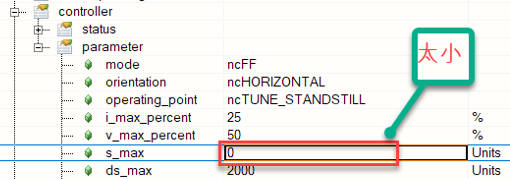  |

## 72：固件版本低于最低必要固件版本

描述：

下载到目标的固件版本低于设备所需的固件版本。

反应：

下载的固件不会被烧录到设备内存中。

原因/补救措施：

设备所需的最低固件版本大于下载的固件版本。

项目的固件版本应大于设备的最低版本.

## 73：无效的 R4 浮点格式

描述：

如果值超出 32 位浮点数的有效范围，则写入 R4 参数时出现响应错误。

32 位浮点数（单精度浮点数）的有效范围：-3.40282347E+39 (0xFF7FFFFF) 到 -1.17549435E-38 (0x80800000), -0 (0x80000000), 0 (0x0005000400x0050040080408004 3.40282347E+39 (0x7F7FFFFF)

无效的32位浮点数：+ Infinity（0x7f800000），-infinity（＃ff800000），nan（＃ff800001 ..＃fffffffff），+下溢1.40129846e-45（0x00000001）至1.17549421e-38（0x007ffffff），underflow - 1.40129846E-45 (0x80000001) 到 -1.17549421E-38 (0x807FFFFF)

反应：

不接受参数值。

原因/补救措施：

查看错误编号 [33002](#33002浮点异常).

查看错误编号 [1002](#1002参数超出有效范围).

## 74：只能通过通道1（轴1）写入参数

描述：

写入参数时响应错误。 该参数只能通过 ACOPOS 模块上的通道 1（轴 1）写入。

反应：

不接受参数值。

原因/补救措施：

用于所需功能的参数 ID 不正确。

网络传输错误。 另请参阅错误编号 [1012](#1012循环网络通信的崩溃).

## 75：所选电机类型不允许参数

描述：

写入参数时出错，因为它与当前电机类型不兼容。

反应：

不会应用参数值。

原因/补救措施：

电机参数可能不一致和/或此电机类型不支持该功能。 检查电机参数和功能.

## 1001：错误 - FIFO 溢出

描述：

ACOPOS上错误消息的FIFO已满。在此错误 FIFO 中仅输入运行时错误。响应错误直接作为对参数写入或读取的响应发送。

反应：

进一步的错误消息将丢失。

原因/补救措施：

通过网络：

\- 没有错误被读取或

\- 错误读取速度太慢。

在 ACOPOS 上：

\- 输入的错误太多或

\- 错误输入得太快。

请参阅其他输入的错误号。

## 1002：参数超出有效范围

描述：

如果值超出有效限制，则写入参数时出现响应错误。

反应：

不接受参数值。

原因/补救措施：

用于所需函数的参数 ID 不正确。

该值不是有效的常量，或者不在允许的选择列表中。

该值超过或不符合实现限制。

该值超出物理上可能的范围（例如负时间）。

此参数 ID 的数据类型或数据长度不正确。

网络传输错误。另请参见错误号 [1012](#1012循环网络通信的崩溃).

详细信息也可以在网络命令跟踪中看到。

| 应用案例                                                                                                                                                                                                                                                                                                                                                                                                                                                                                                                                             |
|------------------------------------------------------------------------------------------------------------------------------------------------------------------------------------------------------------------------------------------------------------------------------------------------------------------------------------------------------------------------------------------------------------------------------------------------------------------------------------------------------------------------------------------------------|
| 2019.11.27 Error 1002 / Error 53 / Error 1034 ACOPOS Micro (80VD100PD.C033-01)控制 8WSB 系列伺服电机  **原因 1：** 配置编码器参数表时，‘Encoder Scaling’ 参数与 ‘SSI Number of data bits’ 不匹配。  解决方案：‘Encoder Scaling’ 和 ‘SSI Number of data bits’ 两个参数取决于编码器分辨率，需要相互匹配。例如一个 17 位编码器， Scaling 为 131072，对应的 Data bits 应为 17。    **原因 2：** 编码器参数表中的波特率（Baud Rate）设置值过低。  解决方案：计算出波特率范围。（建议设置为最大值 400kBaud) |
| 2017.08.03 8BAC0125.000-1 编码器卡使用 配置编码器参数不合理，例如8BAC0125.000-1 卡，需要在合理配置完成参数后，再设置ID1228与ID 1225                                                                                                                                                                                                                                                                                                                                                                                                                  |
| 2023.07.14 **现象** 新设备，一上电就报错 **原因** 驱动器上编码器卡没插好或者插错了位置 程序里有对驱动器上的编码器卡通过ParID进行写入操作，如果对应编码器卡没有在正确的槽位上，就会报错                                                                                                                                                                                                                                                                                                                                                               |

## 1003：循环控制处于活动状态时无法写入参数

描述：

写入参数时出现响应错误，这不允许在控制器处于活动状态时更改值。

反应：

不接受参数值。

原因/补救措施：

该参数编写得太晚（在"打开控制器"命令之后）。

"关闭控制器"命令丢失或未在驱动器状态（移动活动）下执行。

缺少"控制器关闭"状态的请求（延迟步骤）。

\-\> 检查程序顺序和状态请求。

| 应用案例                                                                                                                                                               |
|------------------------------------------------------------------------------------------------------------------------------------------------------------------------|
| 2020.07.15 使用ACOPOS P3的外接编码器卡8EAC0130，写入ID 1301及ID 1572时轴必须处于Disable状态，否则会报错1003 Parameter cannot be written while loop control is active。 |

## 1004：网络生命标志监视器超时

描述：

活动网络生命标志监视期间的运行时错误，如果在指定的时间内没有循环电报到达（NETWORK_LIVE_CTRL）。

另请参阅错误号 [4005](#4005控制器无法开启驱动处于错误状态).

反应：

See error number [9000](#9000散热器温度传感器超出停止限制).

所有数字输出（AC130、AC131）均已停用（即输出电平设置为低电平，所有可切换 IO 均设置为输入）。

虚拟轴的移动将中止。

原因/补救措施：

网络生活标志监视器中的问题：

网络生命标志监视NETWORK_LIVE_CTRL定义为太短。

在发送循环电报之前，网络生命体征监控被激活得太早。

网络数据传输中的问题：

超过周期时间，计算时间负载极高或控制器CPU出现故障。

网络连接干扰或断开连接。请参阅接线指南错误号 [7030](#7030编码器增量信号幅度太大).

网络负载过高。

## 1005：当运动处于活动状态时，无法写入参数

描述：

写入参数时出现响应错误，这不允许在运动处于活动状态时更改值

反应：

不接受参数值。

原因/补救措施：

在运动开始命令之后，该参数编写得太晚。

缺少"移动完成"状态的请求（延迟步骤）。

\-\> 检查程序顺序和状态请求。

| 应用案例                                                                                                              |
|-----------------------------------------------------------------------------------------------------------------------|
| 2023.07.07 因为MC_BR_MechPosDeviationComp.Active未TRUE便触发了AbsMove命令，所以报错1005。增加补偿完成条件后问题解决。 |

## 1006：触发事件（数字输入 + 边沿）参数无效

描述：

如果值是无效的数字输入或无效的触发边沿，则写入事件参数时出现响应错误。

反应：

不接受参数值。

原因/补救措施：

查看错误码 [1002](#1002参数超出有效范围).

## 1008：网络耦合主站已停用 - 编码器错误

描述：

如果发送实际位置并且相应的编码器发送错误，则为网络耦合发送循环主数据时出现运行时错误。

附加信息 1/2/3 标识关联的主发送对象 MA1/2/3_CYCLIC_SEND。

反应：

为此耦合对象停用数据传输，以防止位置跳跃。

原因/补救措施：

请参阅其他输入的编码器错误号。

## 1009：内存分配期间出错

描述：

如果没有足够的内存用于请求的函数，则动态内存管理中的响应错误。

反应：

不执行最近请求的函数。

不会保存下载数据。

不接受参数值。

原因/补救措施：

单个内存区域太大或使用了太多内存：

凸轮数据下载，

参数序列下载，

EPROM数据下载，

创建功能块 （FUNCTION_BLOCK_CREATE），

使用内存分配（CAMCON_MAX_CAM、FIFO_MAX_LENGTH、AXLIM_T_JOLT AXLIM_T_JOLT_VAX1）写入参数时，

设置函数 （CMD_PIDENT=ncSTART）

## 1011：快速停止输入处于活动状态

描述：

如果配置的数字输入处于活动状态，则快速停止功能中的运行时错误。

另请参阅错误号 [4005](#4005控制器无法开启驱动处于错误状态).

反应：

"控制器就绪"状态为重置。

当"打开控制器"命令时：请参阅错误号 [4005](#4005控制器无法开启驱动处于错误状态).

默认设置 QUICKSTOP_DECEL_RAMP=ncA_LIMIT 且 QUICKSTOP_DECEL_RAMP=ncA_LIMIT+ncQUICKSTOP_T_JOLT：

当位置控制处于活动状态时（CONTROLLER_MODE=ncPOSITION 或 ncPOSITION+ncFF）：

随着轴限值的减速和控制器的关闭，运动停止。

对于 ncA_LIMIT+ncQUICKSTOP_T_JOLT，还会考虑参数QUICKSTOP_T_JOLT。

当速度控制处于活动状态时：

通过速度调节斜坡，轴限制和关闭控制器来停止运动。

当 U/f 控制处于活动状态时 （CONTROLLER_MODE=ncUF）：

通过速度控制的斜坡，轴限制和关闭控制器来停止运动。

当电流控制在换向（CONTROLLER_MODE=4）时处于活动状态时：

移动停止电流限制并关闭控制器。

设置QUICKSTOP_DECEL_RAMP=ncTRQ_LIMIT：

独立于控制器模式：运动在扭矩限制下中止。

设置QUICKSTOP_DECEL_RAMP=ncINDUCTION：

独立于控制器模式：运动中止，感应停止。另请参阅错误号 [9001](#9001散热器温度传感器超出关闭限制).

原因/补救措施：

查看错误号 [6021](#6021控制器使能输入低电平).

## 1012：循环网络通信的崩溃

描述：

运行时错误，如果网卡的固件检测到循环 POWERLINK 通信失败。

查看错误号 [4005](#4005控制器无法开启驱动处于错误状态).

反应：

查看错误号 [9000](#9000散热器温度传感器超出停止限制).

所有数字输出（AC130、AC131）均已停用（即输出电平设置为低电平，所有可切换 IO 均设置为输入）。

虚拟轴的移动将中止。

原因/补救措施：

网络布线中断。

电源链路站出现故障或已关闭。

连接在一起的工作站过多（最大 HUB 层数、最大网络电缆长度）。

对于配置的 POWERLINK 循环时间，工作站太多。

环境温度超出有效范围。

网络插件卡 （AC114） 有缺陷或硬件修订版错误。

发生网络干扰时：请参阅接线指南错误号 [7030](#7030编码器增量信号幅度太大)

另请参阅 PLC 的诊断数据点：FailedCycleCount、CycleTimeViolationCount 和 CycleIdleTime。

| 内容                                                                                                                                                                                                                                                                                                                                                                                                                            |
|---------------------------------------------------------------------------------------------------------------------------------------------------------------------------------------------------------------------------------------------------------------------------------------------------------------------------------------------------------------------------------------------------------------------------------|
| 2022.07.22 报警64006、32037、1012、32189：网线松动                                                                                                                                                                                                                                                                                                                                                                              |
| 2022.12.09 PLK线插拔后复位解决                                                                                                                                                                                                                                                                                                                                                                                                  |
| 2023.07.04 **现象** 机器运行之后发生了某一驱动器报错，32037 32189 1012 ，其他驱动器没有报错 **原因** POWERLINK网络通信质量问题 **解决方式** 重新拔插POWERLINK线缆后，问题解决。 需要校核POWERLINK网络质量，优化参数                                                                                                                                                                                                             |
| 2023.07.05 **现象** 多个ACOPOS Micro上电后报警1012、32280等通讯故障，无法复位 现场检查报警驱动，发现从拓扑无一致性，部分驱动位于PLK的通讯末端、部分位于PLK的网络中部。 断电后修改PLK网线的连接顺序，无效果。 Test模式下连接伺服，可强制复位报警，但其仍显示网络无法连接。  **解决方式** 考虑到该设备时间已久、可能存在硬件老化问题，修改PLK配置的Asynchronous timeout数值，由默认的25改为100。 多次断电重启，未再出现通讯报警。 |

## 1013：工作站不可用于网络通信

描述：

如果用于耦合的网络站不可用，则配置循环接收数据时出错 （CONFIG_MA1/2/3/4/5_CYCLIC_POS）。

反应：

循环数据（位置）在相应的参数 ID （MA1/2/3/4/5_CYCLIC_POS） 上不可用，并且不会更新。

原因/补救措施：

无效的站号。

配置编写得太早。

工作站尚未在网络上或出现故障。

另请参阅错误号 [1012](#1012循环网络通信的崩溃).

## 1014：网络命令接口被占用

描述：

如果最后一个命令的处理尚未完成，则配置循环接收数据时出错 (CONFIG_MA1/2/3/4/5_CYCLIC_POS).

反应：

不接受网络耦合的配置。

原因/补救措施：

此耦合对象的配置一个接一个地编写了好几次太快了。

## 1016：超出最大循环时间 - CPU 负载过高

描述：

如果 ACOPOS 上的计算时间负载过高（例如，在 400us 的位置控制器周期内不再完成设置值生成、网络处理和功能块），则在处理中等优先级操作系统功能时出现运行时错误。高优先级控制器功能通过严格的循环进一步处理。

ACOPOSmulti，ACOPOSmicro，ACOPOS P3：此错误仅在1轴（通道）上注册。

反应：

根据持续时间和超过周期时间的程度，可能会发生后续错误（例如速度跳跃和滞后错误）。

原因/补救措施：

有关诊断，请参见参数CPU_TICKS_CYCLE_PEAK （139）。

以下各项显示了一些增加处理器负载的常见示例：

提高开关频率F_SWITCH。

ICTRL_MODE Bit0 提高电流控制器动态（电流控制器周期时间减半）。

设置当前筛选器为活动ISQ_FILTER1_TYPE、ISQ_FILTER2_TYPE ISQ_FILTER3_TYPE。

许多功能会阻止活动FUNCTION_BLOCK_CREATE。在多个 EVWR FB 实例上同时发生事件或编写计算密集型命令会产生负载峰值。

循环通信，数据驱动CYCLIC_TODRV_PARID。同时写入多个参数 ID 或写入计算密集型命令会产生负载峰值。

凸轮自动，补偿齿轮AUT_COMP_MODE。

虚拟轴、基础运动或凸轮自动。

多个网络耦合功能处于活动状态，CONFIG_MA1/2/3/4/5_CYCLIC_POS。

虚拟编码器活动ENCOD0_MODE。

重复控制主动CMD_SCTRL_RC。

循环跟踪，记录多个测试数据点。

ACOPOS：插槽 3 或插槽 4 中的额外插件卡。编码器插件卡需要更多的计算时间。

ACOPOSmulti，ACOPOSmicro，ACOPOS P3：所有轴（通道）都处于活动状态。

## 1017：循环读取访问的参数 ID 无效

描述：

使用指针参数 ID 配置循环读取访问或数据连接的响应错误。

反应：

不接受参数 ID。

原因/补救措施：

参数 ID 无效，数据类型不受支持（复合数据类型或不是 4 字节值）。

不允许读取访问或参数具有计算密集型读取功能。

## 1018：循环写入访问的参数 ID 无效

描述：

使用指针参数 ID 配置循环写入访问或数据连接的响应错误。

反应：

不接受参数 ID。

原因/补救措施：

不允许写入访问权限。当控制器处于活动状态或移动处于活动状态时，不允许进行写访问。

另请参阅错误号 [1017](#1017循环读取访问的参数-id-无效).

## 1021：无法写入参数：功能块处于活动状态

描述：

写入参数时出现响应错误，当相应的功能块处于活动状态时，不允许更改值。

反应：

不接受参数值。

原因/补救措施：

功能块不支持此参数的"联机"更改。

功能块在特定工作状态下处于活动状态，这不允许"在线"更改此参数（例如，补偿运动中的MPGEN）。

激活功能块或操作状态后，该参数编写得太晚。

在写入参数之前未停用功能块，或者缺少状态请求。

## 1022：要驱动的循环数据的生命体征监控超时

描述：

在活动生命标志监视和主动控制器期间，如果指定的时间内没有要驱动器的循环数据到达（CYCLIC_TODRV_T_CTRL），则运行时错误。

反应：

默认设置 STOP_ERR_DECEL_RAMP=ncA_LIMIT：

当位置控制处于活动状态时（CONTROLLER_MODE=ncPOSITION 或 ncPOSITION+ncFF）：

移动停止，轴限制和关闭控制器。

有关不同的控制器模式，另请参见错误号 [9000](#9000散热器温度传感器超出停止限制).

有关STOP_ERR_DECEL_RAMP的不同设置，请参阅错误号 [4007](#4007超出滞后错误停止限制).

原因/补救措施：

生命体征监视器中的问题：

生命体征监测CYCLIC_TODRV_T_CTRL时间定义太短。

生命体征监控和控制器在发送循环电报之前过早激活。

数据生成和数据传输中的问题：

要驱动的循环用户数据中的计数器不会增加 （CYCLIC_TODRV_COUNT）。

超过周期时间，计算时间负载极高或控制器任务失败。

\-\> 检查循环任务类的参数：持续时间、容差和 I/O 输出延迟。

网络连接干扰或断开连接。请参阅接线指南错误号 [7030](#7030编码器增量信号幅度太大).

网络负载过高。

## 1023：不允许使用循环通信模式进行网络耦合

描述：

配置网络耦合或循环通信模式的响应错误 （CYCLIC_TOFRDRV_MODE=1）。

反应：

不接受配置。

原因/补救措施：

\-\> 停用网络耦合（MAx_CYCLIC_SEND、CONFIG_MAx_CYCLIC_POS）或循环通信模式 （CYCLIC_TOFRDRV_MODE=0）

## 1024：无法实现当前网络配置的循环通信模式

描述：

如果检测到无效的网络配置，则写入循环通信模式 （CYCLIC_TOFRDRV_MODE=1） 时出现响应错误。

反应：

不接受通信模式。

原因/补救措施：

缺少 POWERLINK 配置"PResMN 中的输出"

## 1025：不允许与保持制动器相关的参数值

描述：

写入参数时出现响应错误（如果该值不允许与保持制动器连接）。

反应：

不接受参数值。

原因/补救措施：

查看错误码 [1002](#1002参数超出有效范围).

## 1026：不允许使用与安全模块相关的参数值

描述：

写入参数时出现响应错误（如果不允许该值与 SAFETY 模块连接）。

反应：

不接受参数值。

原因/补救措施：

ACOPOS P3 SafeMOTION：命令 CMD_BRAKE = ncSWITCH_OFF只有在配置了保持制动器（MOTOR_BRAKE_CURR_RATED ！= 0）时才能发送。

查看错误号 [1002](#1002参数超出有效范围).

## 1027：此功能不适用于此硬件

描述：

如果当前 ACOPOS 硬件不支持请求的功能性，则写入参数时出现响应错误。

反应：

不接受参数值，并且不执行请求的函数。

原因/补救措施：

用于所需功能的ACOPOS硬件错误。

查看 ACP10 软件 NC Object ncAXIS: ACOPOS Hardware Information GUID:6037f269-ba5e-4234-8422-bdd629b63e73

查看错误码 [1002](#1002参数超出有效范围).

## 1028：超出最大网络耦合数

描述：

如果已注册了太多网络站或接收数据点，则配置循环接收数据的响应错误（CONFIG_MA1/2/3/4/5_CYCLIC_POS，CYCLIC_DP_DATA_OFFSET）。

反应：

不接受网络耦合的配置。

原因/补救措施：

每个设备有超过 5 个不同的网络站（ACOPOSmulti 或 ACOPOS P3）。

每个设备有超过6个不同的接收数据点（ACOPOSmulti或ACOPOS P3）。

另请参阅错误号 [1013](#1013工作站不可用于网络通信).

## 1029：无法写入参数：停止斜坡活动

描述：

写入参数时响应错误（如果移动停止处于活动状态）。

反应：

不接受参数值，并且不执行请求的函数。

原因/补救措施：

在停止命令后缺少状态请求（延迟步骤）。

移动停止是由驱动器错误触发的。

另请参阅错误号 [1002](#1002参数超出有效范围).

## 1030：ACOPOS 仿真仅在"Complete"模式下才提供功能

描述：

编写参数时的响应错误（如果模拟模式 'Standard'不支持所请求的功能性）

反应：

不接受参数值，并且不执行请求的函数。

原因/补救措施：

用于所需功能的错误模拟模式（"Standard"而不是"Complete"）。

## 1031：位置控制器周期时间已超出 - CPU 负载过高

描述：

如果级联的周期时间缩短，并且 ACOPOSmulti3 或 ACOPOS P3 上的计算时间负载过高，则处理中优先级位置控制器时的运行时错误会起作用。高优先级控制器功能通过严格的循环进一步处理。

此错误仅在 1 轴（通道）上注册。

反应：

根据持续时间和超过周期时间的程度，可能会发生后续错误（例如速度跳跃和滞后错误）。

原因/补救措施：

CTRL_CYCLE_TIME_MODE在所有轴（通道）上不等于 0。

提高开关频率F_SWITCH。

ICTRL_MODE Bit0 提高电流控制器动态（电流控制器周期时间减半）。

设置当前筛选器为活动ISQ_FILTER1_TYPE、ISQ_FILTER2_TYPE ISQ_FILTER3_TYPE。

重复控制主动CMD_SCTRL_RC。

循环跟踪，记录多个测试数据点。

## 1032：内部总线错误

描述：

内部组件之间数据传输期间（例如处理器和FPGA之间）的运行时错误。

8EAC013x：仅存在于此周期中的脉冲无法识别。

反应：

8EAC0xxx: 查看错误码 [7030](#7030编码器增量信号幅度太大).

Others: 无.

原因/补救措施：

电磁干扰。

ACOPOS有缺陷。

## 1034：不允许使用与电机编码器齿轮相关的参数值

描述：

写入参数时的响应误差，如果该值不允许与电机编码器齿轮连接。

反应：

不接受参数值。

原因/补救措施：

查看错误码 [1002](#1002参数超出有效范围).

| 应用案例                                                                                                                                                                                                                                                                                                                                                                                                                                                                                                                                   |
|--------------------------------------------------------------------------------------------------------------------------------------------------------------------------------------------------------------------------------------------------------------------------------------------------------------------------------------------------------------------------------------------------------------------------------------------------------------------------------------------------------------------------------------------|
| 2019.11.27 Error 1002 / Error 53 / Error 1034 ACOPOS Micro (80VD100PD.C033-01)控制 8WSB 系列伺服电机  原因 1：配置编码器参数表时，‘Encoder Scaling’ 参数与 ‘SSI Number of data bits’ 不匹配。  解决方案：‘Encoder Scaling’ 和 ‘SSI Number of data bits’ 两个参数取决于编码器分辨率，需要相互匹配。例如一个 17 位编码器， Scaling 为 131072，对应的 Data bits 应为 17。    原因 2：编码器参数表中的波特率（Baud Rate）设置值过低。  解决方案：计算出波特率范围。（建议设置为最大值 400kBaud) |

## 1035：编码器处于活动状态时无法写入参数。

描述：

如果至少启用了一个编码器（在LLM_CYC_CH_CTRL_BITS中设置了位 6），则写入不允许更改值的参数时出现响应错误。

反应：

将不应用参数值。

原因/补救措施：

该参数编写得太晚（在第一次调用"MC_BR_AsmPowerOn_AcpTrak"之后）。

在第一次调用"MC_BR_AsmPowerOn_AcpTrak"之前写入参数，或删除分配给该段的所有穿梭机。

## 2001 ：不允许上载跟踪数据：记录处于活动状态

描述：

如果跟踪仍处于活动状态，则在初始化数据上载（数据块读取访问）期间出现响应错误。

反应：

数据块读取访问未初始化。无法执行上载。

原因/补救措施：

由于记录时间过长或触发事件尚未发生，以前的跟踪尚未结束。

缺少"结束跟踪"的状态请求。

缺少"停止跟踪"命令。

\-\> 检查触发条件的跟踪参数。

## 2003 ：不允许跟踪启动：录制处于活动状态

描述：

如果跟踪已处于活动状态，则使用"启动跟踪"命令响应错误。

反应：

这不会中断活动跟踪。

原因/补救措施：

查看错误码 [2001](#2001-不允许上载跟踪数据记录处于活动状态).

## 2006: 不允许初始化跟踪参数：记录活动

描述：

如果跟踪处于活动状态，则写入参数时出现响应错误。无法对跟踪参数进行"在线"更改。

反应：

不接受参数值。

这不会中断活动跟踪。

原因/补救措施：

该参数编写得太晚，在"启动跟踪"命令之后。

查看错误码 [2001](#2001-不允许上载跟踪数据记录处于活动状态).

## 4005：控制器无法开启：驱动处于错误状态

描述：

如果驱动器处于错误状态，则在打开控制器时响应错误。 绿色闪烁的就绪 LED 指示“控制器未就绪”状态（V2.130 之前：红色错误 LED 持续亮起）。 此外，还会输入运行时错误，提供有关错误原因的详细信息。 （例如错误号 [1011](#1011快速停止输入处于活动状态)). 也可以使用单独的命令 (CMD_ERR_STATE_INTO_FIFO) 触发此错误条目。

反应：

功率电平未启用且控制器未开启。

原因/补救措施：

查看另外输入的错误编号.

| 应用案例                                                                                                                                                                                                                                                                                                                                                                                                                                                                                                                                                                                                                                                                                                                                                                                                                                                                                                                                                                                                       |
|----------------------------------------------------------------------------------------------------------------------------------------------------------------------------------------------------------------------------------------------------------------------------------------------------------------------------------------------------------------------------------------------------------------------------------------------------------------------------------------------------------------------------------------------------------------------------------------------------------------------------------------------------------------------------------------------------------------------------------------------------------------------------------------------------------------------------------------------------------------------------------------------------------------------------------------------------------------------------------------------------------------|
| 2022.01.10 伺服无法启动：伺服处于错误状态无法启动，具体原因需要确认该驱动器当前报警后查看后续信息。                                                                                                                                                                                                                                                                                                                                                                                                                                                                                                                                                                                                                                                                                                                                                                                                                                                                                                            |
| 2022.01.11 报警6033,4005 问题描述：伺服不能使能，RUN指示灯不亮，报警号4005,6033 解决方法：更新伺服驱动器固件到最新版本2.3.0.0，没有解决，继续更新编码器卡固件，问题得以解决。 附注：最好把伺服固件及相关固件都更新。                                                                                                                                                                                                                                                                                                                                                                                                                                                                                                                                                                                                                                                                                                                                                                                           |
| 2022.01.11 伺服报警5005. 4005复不了位，现场用的伺服是ACOPOS 1045，换成ACOPO 1090就可以复位了。 早期换伺服驱动器选1045主要替换客户原来的设备，使用中没发现什么问题，但在后来终端客户的需求中速度提高，1045略显过载，后期设备全部改为了1090的驱动器此问题解决。                                                                                                                                                                                                                                                                                                                                                                                                                                                                                                                                                                                                                                                                                                                                                  |
| 2022.06.27 问题：使用扉叶电机E09编码器，在test模式下使能，就会报4005，39003，6057，39042，39024，39006。 解决方式：参数表719写1来确认编码器。                                                                                                                                                                                                                                                                                                                                                                                                                                                                                                                                                                                                                                                                                                                                                                                                                                                                  |
| 2023.06.28 **现象** 4005: Controller cannot be switched on: Drive in error state 5005: Start of movement not possible: Position controller inactive 6048: Motor holding brake movement monitor: Position error too large 9070: Motor temperature model: Stop limit exceeded 41031: Junction temperature model: Warning limit exceeded 41070: Motor temperature model: Warning limit exceeded 29203: Drive is not ready. 29209: The drive is in error state. 29217: Invalid input parameter **原因** 零位参数不对引起过载，客户更换了模具，但是没有重新走回零的流程，导致参数错误，机械卡主了，当前顶住位置距离零位还有1mm以上 因此当伺服使能，由于不在零位位置，所以向零位运动，由于已机械顶住，所以动态偏差LagError一直有1mm以上，就一直以最大扭矩输出，造成电机温度超过70度以上，驱动器的散热片温度高达70度，IGBT温度高达133度。持续较长时间后就报警而POWER OFF，进行复位后，又进入以上死循环。 **优化方式** 使能后，走到零位，如果持续1秒超过+5Nm或小于-5Nm，则把HomePosition 进行偏移，再进行MC_HOME操作。 |
| 2023.06.28 **现象** ACOPOS P3上电，AS通过test独占模式测试电机。 在系统刚启动且轴没有Switch On的状态下报警9040，复位后无错误提示。 Switch On电机，出现报错。依次复位后，共出现以下报警： 4005 9078，Info：Temperature = 60 9096，Info：Temperature = 90 9104，Info：Temperature = 100 9098，Info：Temperature = 110  **问题排查** Trace ParID 1543和1540，发现数据明显异常，ID1543与ID1540在伺服未工作情况下应与环境温度近似。 判断ACOPOS P3损坏  **解决方式** 1. 更换ACOPOS P3 2. 如出现9040报警，则需降低生产速度                                                                                                                                                                                                                                                                                                                                                                                                                                                                                             |

## 4007：超出滞后错误停止限制

描述：

如果滞后误差 PCTRL_LAG_ERROR 超过配置的滞后误差限值 AXLIM_DS_STOP，则位置控制器处于活动状态时的运行错误。

反应：

默认设置 STOP_ERR_DECEL_RAMP=ncA_LIMIT：

通过速度调节斜坡、轴限制和关闭控制器停止运动。

设置 STOP_ERR_DECEL_RAMP=ncINDUCTION：

独立于控制器模式：运动中止，感应停止。 另请参阅错误编号 [9001](#9001散热器温度传感器超出关闭限制).

设置 STOP_ERR_DECEL_RAMP=ncCTRL_OFF：

独立于控制器模式：通过立即关闭控制器和电源部分来中止运动。 驱动器没有电气扭矩。

原因/补救措施：

滞后误差限制太小 (AXLIM_DS_STOP)。

设置值生成的错误配置：

\- 加速、减速或速度参数太大（例如 AXLIM_A1_NEG、BASIS_MOVE_V_POS、..）。

控制器配置不正确：

\- 控制器设置太弱。

\- 前馈配置不正确（例如预测时间 = 0）。

\- 不稳定的控制回路。

限流：

\- 增加电流。 查看错误编号 [9030](#9030结温模型超出停止限制).

\- EMF：运行速度太高和/或网络电压太低。检查电机是否在电压限制 sqrt(ICTRL_USD_REF\^2+ ICTRL_USQ_REF\^2) \> UDC_ACT/sqrt(3) 内运行。

\- 电流限制：检查电流 ICTRL_ISQ_REF 是否受到限制 sqrt(2)\* MOTOR_CURR_MAX 或 sqrt(2)\* ACOPOS_CURR_MAX 的限制。

\- 转矩限制：检查电流控制器 ICTRL_ISQ_REF 的设定值是否被 4 二次转矩限制器（LIM_T1_POS、LIM_T1_NEG、LIM_T2_POS、LIM_T2_NEG、LIM_T1_POS_OVR、LIM_T1_NEG_OVR、LIM_VRO_OVRT_OVRP_OVRT_LIM_T1_OVRT_OVRP_OVRT_LIM_T1_OVRT_OVRP_OVRT_OVRT_OVRT_O_G_POS_LIM_T1_OVRT_G_POS_LIM_T1_OVRT_O_G_POS_LIM_T1_O_G_POS_LIM_T1_O_RMP_LIM_T1_NEG_LIM_T1_N_O

\- ISQ 滤波器限制：检查电流控制器 ICTRL_ISQ_REF 的设定值是否受 ISQ 滤波器之一的限制。

\- 欠压限制器：检查 UDC_ACT \< UDC_NOMINAL 和 ICTRL_ISQ_REF = ISQ_MAX_UDC 和 ICTRL_ISQ_REF = ISQ_MIN_UDC。

\- 恢复功率限制器：检查 UDC_ACT \> UDC_BLEEDER_ON 和 ICTRL_ISQ_REF = ISQ_MAX_UDC 和 ICTRL_ISQ_REF = ISQ_MIN_UDC。

\- 温度限制器：当由于结点温度过高而停止运动时，电流会受到限制。查看错误编号 [9030](#9030结温模型超出停止限制).

限速：

\- 速度控制器。 检查速度 SCTRL_SPEED_REF 是否受到限制 SCTRL_LIM_V_POS、SCTRL_LIM_V_NEG 或 MOTOR_SPEED_MAX 的限制。

\- 位置控制器。 检查速度 PCTRL_V_ACT 是否受到限制 POS_CTRL_P_MAX 的限制。

编码器位置或速度包含错误：请参阅错误编号 [4014](#4014两个编码器控制超出位置差的停止限制).

电机接线错误：见错误编号 [6044](#6044相位旋转方向或位置无效).

电机接线错误：见错误编号 [6045](#6045逆变器输出无电流).

电机缺陷：参见错误编号 [6045](#6045逆变器输出无电流).

ACOPOS 缺陷：请参阅错误编号 [6045](#6045逆变器输出无电流).

| 应用案例                                                                                                                                                                                                                                                                                                                                                                                                                                                                                                                                                                                                                                        |
|-------------------------------------------------------------------------------------------------------------------------------------------------------------------------------------------------------------------------------------------------------------------------------------------------------------------------------------------------------------------------------------------------------------------------------------------------------------------------------------------------------------------------------------------------------------------------------------------------------------------------------------------------|
| 2022.01.10 常见于引入引出，被收放料拖动。请降低加速度，或调整收放料，使其响应加快。                                                                                                                                                                                                                                                                                                                                                                                                                                                                                                                                                             |
| 2022.01.11 动态跟随误差超过限值： 1、重新插拔电机侧动力电缆和编码器电缆 2、检查驱动器侧动力电缆顺序是否与端子标注一致 3、调整三环参数 4、检查机械是否有卡顿现象                                                                                                                                                                                                                                                                                                                                                                                                                                                                                 |
| 2022.01.17 UVW三相接错，特别是U和V                                                                                                                                                                                                                                                                                                                                                                                                                                                                                                                                                                                                              |
| 2019.11.27 电机内部存在减速箱的情况下，默认为 1000 的 Load units 过小，需要根据外部机械结构和误差结果适当调节上图中两个参数的比例。                                                                                                                                                                                                                                                                                                                                                                                                                                                              |
| 2022.12.09 实际位置偏差超过阈值                                                                                                                                                                                                                                                                                                                                                                                                                                                                                                                                                                                                                 |
| 2023.02.13 1.请优先检查机械是否卡死，在断开电机使能转动负载以及断开联轴器，手动转动电机轴确认机械卡死位置。并同时检查是否可能有负载过大的可能。 2.程序中通常会设置比较大的Lagerror限制值，正常状态可以不用考虑程序参数配置的问题。 3.如果在伺服上电瞬间出现，检查是否为最近新安装电机，检查 U V W接线是否牢固及接线顺序正常。 4.必要情况下，使用脱开负载，使用AS软件进行Test整定磁偏角以及接线相序问题。 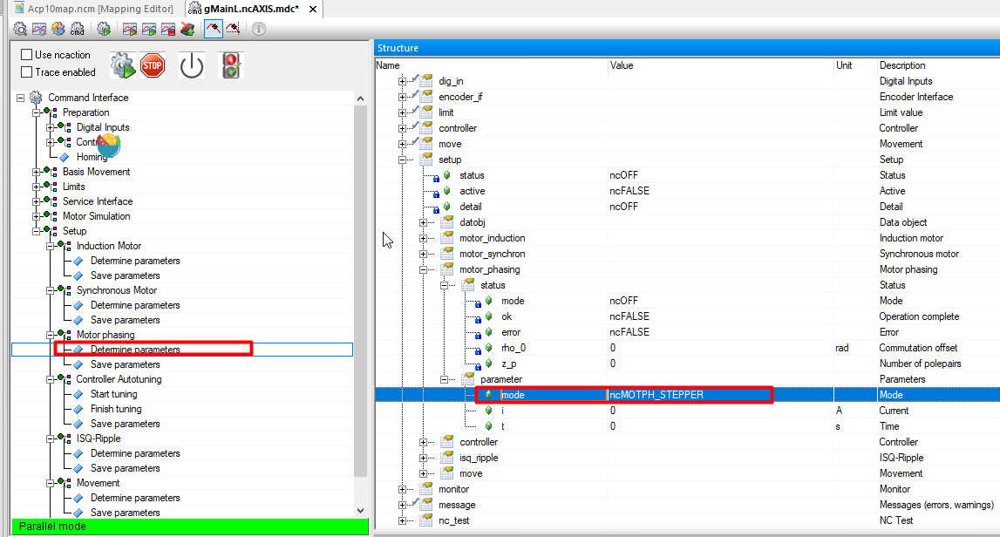 5.手动转动正常，排除机械问题后，请手动转动该负载，在电机页面，查看位置数据是否连续变化。如果发现数据变化和实际不符，请检查电机端编码器插头，编码器线，编码卡。必要时更换其中物料排除。 |
| 2023.02.14 **现象：** 运行了大概半小时报错4007（lagerror过大）和7032（增量信号振幅太小）和6057（编码器报错）和6054（电流过冲） **原因：** 经排查发现muti编码器连线摆放过于密集，产生干扰导致编码器位置数据跳动，致使lagerror过大，导致电流增大最终电流过冲。                                                                                                                                                                                                                                                                                                                                     |
| 2023.03.23 **现象** ACOPOS 1180 在整机同步状态下由100RPM加速到150RPMS时出现报错 报7211，4007，7200，9300 在实际测试过程中测量DC BUS电压，发现此驱动器的偏低 **原因** 可能为1180驱动器内部整流模块故障。 **解决方式** 更换驱动器                                                                                                                                                                                                                                                                                                                                                                                                                 |

## 4008：到达正限位开关

描述：

如果在正运动方向上到达正限位开关，则运动激活时的运行错误。

反应：

默认设置 STOP_ERR_DECEL_RAMP=ncA_LIMIT：

运动在轴限制处停止。 控制器保持开启状态。

STOP_ERR_DECEL_RAMP 的不同设置见错误号 [4007](#4007超出滞后错误停止限制).

原因/补救措施：

没有目标位置或目标位置不正确的运动命令。

SW 限制已停用或定义过大。

凸轮自动机的从动范围太大。

当缓慢“退出”时，如果主位置没有稳定增加，则带有凸轮的闭合限位开关会自动运行。

另请参阅错误编号 [4010](#4010控制器无法开启两个限位开关都关闭).

| 应用案例                                                                                                                                                                                                                                                                                                                                                   |
|------------------------------------------------------------------------------------------------------------------------------------------------------------------------------------------------------------------------------------------------------------------------------------------------------------------------------------------------------------|
| 2023.02.14 1. 该故障一般为相对运动的轴可能出现，例如排线，工作台这类。这个报警为正极限到达，当出现该报警时，无法再往正方向动电机。 2. 核实是否超过极限。如果是，请切换到设置模式，复位，使用反向点动电机方式，将极限位置移除。 3. 核实是否超过极限。如果否，则重新标定电机的零点位置，可能是电机零点的位置设置不合理，或者是正负极限传感器安装位置不合理。 |

## 4009：到达负限位开关

描述：

如果在运动的负方向上到达负限位开关，则运动激活时的运行错误。

反应：

运动在轴限制处停止。 控制器保持开启状态。

原因/补救措施：

查看错误编号 [4008](#4008到达正限位开关).

| 应用案例                                                                                                                                                                                                                                                                                                                                                   |
|------------------------------------------------------------------------------------------------------------------------------------------------------------------------------------------------------------------------------------------------------------------------------------------------------------------------------------------------------------|
| 2023.02.14 1. 该故障一般为相对运动的轴可能出现，例如排线，工作台这类。这个报警为负极限到达，当出现该报警时，无法再往负方向动电机。 2. 核实是否超过极限。如果是，请切换到设置模式，复位，使用正向点动电机方式，将极限位置移除。 3. 核实是否超过极限。如果否，则重新标定电机的零点位置，可能是电机零点的位置设置不合理，或者是正负极限传感器安装位置不合理。 |

## 4010：控制器无法开启：两个限位开关都关闭

描述：

如果正负限位开关关闭，则使用“开启控制器”命令的响应错误。

反应：

不执行命令。

原因/补救措施：

限位开关的有效输入电平被反转。

由于“外力”（机械锁定，手动关闭），限位开关错误关闭。

由于硬件错误（断线、线路端接、接线错误、电源电压）而错误关闭。

对于无限制运动范围且无终点开关的“无限轴”或“循环轴”：

也可以禁用限位开关的监控 (LIMIT_SWITCH_IGNORE) 以替代使用数字输入.

## 4011：控制器无法关闭：运动激活

描述：

如果运动处于活动状态，则使用“关闭控制器”命令响应错误。

反应：

不执行命令。

这不会中断主动运动。

原因/补救措施：

运动停止后命令写入过快。

缺少“移动完成”状态的请求（延迟步骤）。

\-\> 检查程序顺序和状态请求.

## 4012：控制器无法开启：初始化参数丢失或无效

描述：

如果至少一个 Init 参数丢失或设置为无效值，则使用“打开控制器”命令响应错误。

反应：

不执行命令。

原因/补救措施：

在配置完成之前，在初始化阶段写入命令过早。

缺少“全局初始化”状态的参数初始化或请求（延迟步骤）。

\-\> 检查程序顺序和状态请求.

## 4014：两个编码器控制：超出位置差的停止限制

描述：

两个编码器位置控制处于活动状态时的运行时错误。 位置编码器位置与电机编码器位置的差值大于 AXLIM_DS_STOP2。

反应：

查看错误编号 [4007](#4007超出滞后错误停止限制).

原因/补救措施：

电机/位置编码器配置错误。

驱动机械中的公差（主轴斜率的波动、背隙、动力传输系统中的热膨胀、动力传输系统中的高加速度和低刚度）需要更大的 AXLIM_DS_STOP2。

有缺陷的驱动机制（打滑、联轴器断裂）

编码器位置或速度包含错误：

电机和编码器之间的机械连接有缺陷。

位置编码器监视器或电机编码器监视器未检测到的编码器。

检查编码器插卡上的 UP/DOWN LED 和编码器位置 PCTRL_S_ACT。

编码器不符合插卡规格（对照用户手册和编码器数据表）。

编码器连接中断或损坏。 请参阅接线指南错误编号 [7030](#7030编码器增量信号幅度太大).

编码器电源缺陷。

编码器故障。

插卡故障。

解析器信号干扰。 查看错误编号 [7045](#7045旋转变压器信号干扰合理性检查).

解析器信号干扰。 查看错误编号 [39002](#39002解析器超出-14-位分辨率的速度限制).

## 4015：命令触发的错误

描述：

命令触发的运行时错误。 此命令用于测试应用程序的错误处理。

反应：

取决于参数值：

1：无。

2：运动停止，轴限位。 控制器保持开启状态。

3：运动在轴限制和关闭控制器的情况下停止。

4: 运动通过速度调节斜坡、轴限制和关闭控制器停止。

对于不同的控制器模式，另见错误编号 [9000](#9000散热器温度传感器超出停止限制).

原因/补救措施：

命令 CMD_ERROR（带参数值 1 到 4）或 CMD_ERROR_VAX1（带参数值 1 到 2）。

另请参阅错误编号 [36005](#36005由命令触发的警告).

## 4016：任务类循环时间无效

描述：

如果所请求的功能不允许循环时间，则写入参数时出现响应错误。

反应：

不接受参数值并且不执行请求的函数。

原因/补救措施：

检查任务类循环时间的设置.

## 4017：网络循环时间无效

描述：

如果请求的功能性不允许网络循环时间，则写入参数时出现响应错误。

反应：

不接受参数值并且不执行请求的函数。

原因/补救措施：

检查网络循环时间的设置.

## 5001：目标位置超出正 SW 限制

描述：

如果请求的目标位置大于正 SW 限制，则运动开始时的响应错误。

如果当前位置已经超出正 SW 限制，则当正向运动处于活动状态时的响应错误。

反应：

不执行请求的移动开始。

这不会中断主动运动。

原因/补救措施：

软件限制配置不正确。

目标位置不正确。

错误的移动命令。

对于无限制运动范围的“无限轴”或“循环轴”，也可以禁用 (SGEN_SW_END_IGNORE) 的软件限制监视器。

## 5002：目标位置超过负 SW 限制

描述：

如果请求的目标位置小于负 SW 限制，则运动开始时的响应错误。

如果当前位置已经超出 SW 负限制，则当负方向运动处于活动状态时会出现响应错误。

反应：

查看错误编号 [5001](#5001目标位置超出正-sw-限制).

原因/补救措施：

查看错误编号 [5001](#5001目标位置超出正-sw-限制).

## 5003：达到正 SW 限制

描述：

如果已达到正 SW 限制的制动范围且设置速度为 0，则运动激活时的运行错误。

反应：

运动被停用。 控制器保持开启状态。

原因/补救措施：

没有绝对目标位置的错误运动指令（正向运动）。

正 SW 限制配置不正确。

凸轮自动机：对于轴限制 AXLIM_A2_POS 而言，设定值生成过于动态（速度或加速度太高），因此超出了正 SW 限制上的“制动抛物线”范围。

另请参阅错误编号 [5001](#5001目标位置超出正-sw-限制).

| 应用案例                                                                                                                                                                        |
|---------------------------------------------------------------------------------------------------------------------------------------------------------------------------------|
| 2023.07.07 **现象** 使用MpAxisBasic中的Move Velocity指令，其中Position为0，速度与加速度为0.001，运动后报错29216,5003 **原因** 速度、加速度太小，0.001相当于0 加大两个参数后解决 |

## 5004：达到负 SW 限制

描述：

如果已达到负 SW 限制的制动范围且设置速度为 0，则运动激活时的运行错误。

反应：

运动被停用。 控制器保持开启状态。

原因/补救措施：

查看错误编号 [5003](#5003达到正-sw-限制).

负 SW 限制配置不正确。

凸轮自动机：对于轴限制 AXLIM_A2_NEG 而言，设定值生成过于动态（速度或加速度太高），因此超出了负 SW 限制上的“制动抛物线”范围。

另请参阅错误编号 [5001](#5001目标位置超出正-sw-限制).

## 5005：无法开始运动：位置控制器未激活

描述：

如果位置控制器未激活，则开始运动时的响应错误。

反应：

不执行请求的移动开始。

原因/补救措施：

缺少“打开控制器”命令。

缺少“控制器开启”状态的请求（延迟步骤）。

由于驱动器错误，控制器已关闭。

控制器在没有位置控制的模式下被激活，例如 速度控制。 检查 CONTROLLER_MODE。

启用输入 PCTRL_ENABLE_PARID 停用位置控制.

| 应用案例                                                                                                                                                                                                                                                                                                                                                                                                                                                                                                                                                                                                                                                                                                                                                                                                                                                                                                                                                                                                       |
|----------------------------------------------------------------------------------------------------------------------------------------------------------------------------------------------------------------------------------------------------------------------------------------------------------------------------------------------------------------------------------------------------------------------------------------------------------------------------------------------------------------------------------------------------------------------------------------------------------------------------------------------------------------------------------------------------------------------------------------------------------------------------------------------------------------------------------------------------------------------------------------------------------------------------------------------------------------------------------------------------------------|
| 2022.01.11 伺服报警5005. 4005复不了位，现场用的伺服是ACOPOS 1045，换成ACOPO 1090就可以复位了。 早期换伺服驱动器选1045主要替换客户原来的设备，使用中没发现什么问题，但在后来终端客户的需求中速度提高，1045略显过载，后期设备全部改为了1090的驱动器此问题解决。                                                                                                                                                                                                                                                                                                                                                                                                                                                                                                                                                                                                                                                                                                                                                  |
| 2023.04.03 **现象** 现场运行很多天的ACOPOS P3设备，先报5005，后面重复断电上电一直报6030，且无法复位 **原因** 机械振动导致刹车线 B+ B-存在虚接的现象  **解决方式** 把电机接线的刹车线 B+ B-重新接线，端子上拆下来线重新接。                                                                                                                                                                                                                                                                                                                                                                                                                                                                                                                                                                                                                                                                                                                                      |
| 2023.06.28 **现象** 4005: Controller cannot be switched on: Drive in error state 5005: Start of movement not possible: Position controller inactive 6048: Motor holding brake movement monitor: Position error too large 9070: Motor temperature model: Stop limit exceeded 41031: Junction temperature model: Warning limit exceeded 41070: Motor temperature model: Warning limit exceeded 29203: Drive is not ready. 29209: The drive is in error state. 29217: Invalid input parameter **原因** 零位参数不对引起过载，客户更换了模具，但是没有重新走回零的流程，导致参数错误，机械卡主了，当前顶住位置距离零位还有1mm以上 因此当伺服使能，由于不在零位位置，所以向零位运动，由于已机械顶住，所以动态偏差LagError一直有1mm以上，就一直以最大扭矩输出，造成电机温度超过70度以上，驱动器的散热片温度高达70度，IGBT温度高达133度。持续较长时间后就报警而POWER OFF，进行复位后，又进入以上死循环。 **优化方式** 使能后，走到零位，如果持续1秒超过+5Nm或小于-5Nm，则把HomePosition 进行偏移，再进行MC_HOME操作。 |

## 5006：无法开始运动：轴未参考

描述：

如果起始位置无效，则开始运动时的响应错误。

反应：

不执行请求的移动开始。

原因/补救措施：

缺少“引用”命令。

缺少“参考已完成”的状态请求（延迟步骤）。

引用过程因错误而中止。

也可以为无限制运动范围的“无限轴”或“循环轴”停用 (SGEN_SW_END_IGNORE) 的“参考”监视器.

## 5010：移入位置.不可能的方向：Pos。 限位开关关闭

描述：

开始运动时的响应错误。 正向限位开关闭合，请求的运动正向正向移动。

反应：

不执行请求的移动开始。

原因/补救措施：

运动指令或目标位置不正确。

另请参阅错误编号 [4010](#4010控制器无法开启两个限位开关都关闭).

## 5011：移入负方向不可能：负限位开关关闭

描述：

开始运动时的响应错误。 负限位开关闭合，请求的运动正在向负方向移动。

反应：

另请参阅错误编号 [5010](#5010移入位置不可能的方向pos-限位开关关闭).

原因/补救措施：

另请参阅错误编号 [5010](#5010移入位置不可能的方向pos-限位开关关闭).

## 5012：无法开始运动：停止斜坡激活

描述：

如果运动停止处于活动状态，则开始运动时的响应错误。

反应：

不执行请求的移动开始。

原因/补救措施：

停止命令后缺少状态请求（延迟步骤）。

运动停止由驱动器错误触发。

在“停止基础运动”命令之后，也可以在减速斜坡中开始运动.

| 应用案例                                                                                                                                                                                                                                                                                                                                                        |
|-----------------------------------------------------------------------------------------------------------------------------------------------------------------------------------------------------------------------------------------------------------------------------------------------------------------------------------------------------------------|
| 2022.12.09 放卷伺服报错5012。虚轴控制有问题，通过在虚轴控制的地方添加延迟，确保虚轴停下来之后再启动新的运动                                                                                                                                                                                                                                                     |
| 2023.03.23 **现象** 放卷纠偏不正常，虚轴报错5012 **原因** 放卷纠偏的虚轴是通过service通道操作的，这个里面的延迟比较大，所以在纠偏的时候考虑延迟，加了许多时间延迟。 **解决方式** 5012是说虚轴在停下来的过程中，又给了新的运动指令。由于没有单独的虚轴控制程序，这里无法对虚轴的运动状态进行监控。只能加个延迟来确定虚轴已经停下来了。这个后面还得改成单独的轴控 |

## 5015：不可能开始运动：归位程序激活

描述：

如果归位程序处于活动状态，则使用移动启动命令响应错误。

反应：

不执行请求的移动开始。

这不会中断归位过程。

原因/补救措施：

缺少“参考已完成”的状态请求（延迟步骤）。

可以通过移动停止来结束归位程序.

## 5016：无法写入参数：归位程序已激活

描述：

如果归位程序处于活动状态，则写入参数时出现响应错误。 不能对归位参数进行“在线”更改。

反应：

不接受参数值。

这不会中断主动归位过程。

原因/补救措施：

在“开始归位程序”命令之后，参数写入太晚了。

\-\> 检查程序顺序和状态请求.

## 5017：归位程序模式不可能：位置控制器未激活

描述：

使用“开始归位程序”命令响应错误。 已定义归位模式，该模式需要运动，因此仅在控制处于活动状态时才可用（例如归位模式 ncSWITCH_GATE）。

反应：

未启动归位程序。

“归位有效”状态被重置。

原因/补救措施：

不正确的归位模式。

带有参考脉冲的归位模式 ncDIRECT。

缺少“打开控制器”命令。

缺少“控制器开启”状态的请求（延迟步骤）。

由于驱动器错误，控制器已关闭.

## 5018：无法进行归位程序：运动激活

描述：

如果运动处于活动状态，则使用“开始归位程序”命令响应错误。 主动运动期间不支持“即时”归位。

反应：

查看错误编号 [5017](#5017归位程序模式不可能位置控制器未激活).

当前活动的运动不会中断。

原因/补救措施：

移动停止完成丢失。

缺少“移动完成”状态的请求（延迟步骤）.

## 5019：归位参数超出有效范围

描述：

写入归位参数或使用“开始归位程序”命令时出现响应错误。 检测到无效配置。

反应：

不接受参数值。

当“开始归位程序”命令时：请参阅错误编号 [5017](#5017归位程序模式不可能位置控制器未激活).

原因/补救措施：

根据附加信息中的参数ID.

## 5020：无法进行归位程序：两个限位开关均已关闭

描述：

使用“开始归位程序”命令响应错误。 正负限位开关闭合。

反应：

查看错误编号 [5017](#5017归位程序模式不可能位置控制器未激活).

原因/补救措施：

查看错误编号 [4010](#4010控制器无法开启两个限位开关都关闭).

| 应用案例                                                                |
|-------------------------------------------------------------------------|
| 2022.10.10 急停按钮动作：急停按钮动作触发限位报警，急停消除后自动复位。 |

## 5021：限位开关关闭：此归位模式无方向改变

描述：

定义的归位模式不允许在硬件限制下改变方向。

如果在给出“开始归位程序”命令时启动方向上的限位开关已经关闭 (ncABS_SWITCH)，则会出现响应错误。

如果出现限位开关信号（ncABS_SWITCH、ncEND_SWITCH），则在归位过程中出现运行错误。

反应：

当“开始归位程序”命令时：请参阅错误编号 [5017](#5017归位程序模式不可能位置控制器未激活).

归位程序时：参见错误编号 [5035](#5035未检测到参考标记).

原因/补救措施：

在搜索绝对参考开关的边缘时达到了硬件限制。

\-\> 参考开关的硬件错误（断线、线路端接、接线错误、电源电压）。

参考开关安装得离限位开关太近。

另请参阅错误编号 [4010](#4010控制器无法开启两个限位开关都关闭).

## 5022：接收到第二个限位开关信号：未找到参考开关

描述：

如果限位开关信号已经出现两次，则在归位过程中出现运行错误。

反应：

查看错误编号 [5035](#5035未检测到参考标记).

原因/补救措施：

在搜索参考开关边沿或参考脉冲时，覆盖了正负端开关之间的整个范围。

\-\> 参考开关或编码器的硬件错误（断线、线路端接、接线错误、电源电压）。

由于“弹跳”而在限位开关处误触发。

另请参阅错误编号 [4010](#4010控制器无法开启两个限位开关都关闭).

## 5023: 当前运动方向接收到错误的限位开关信号

描述：

如果在正方向上达到负限位开关信号或在负方向上达到正限位开关信号，则在归位过程中会出现运行错误。

反应：

查看错误编号 [5035](#5035未检测到参考标记).

原因/补救措施：

参考开关安装得离限位开关太近。

另请参阅错误编号 [4010](#4010控制器无法开启两个限位开关都关闭).

## 5025：无法设置带计数范围校正的归位偏移

描述：

使用“开始归位程序”命令响应错误。 归位模式定义为计数范围校正 (+ncCORRECTION)。 无法执行归位偏移的自动校正，因为溢出的编码器计数范围在整个运动范围内不是唯一的。

反应：

查看错误编号 [5017](#5017归位程序模式不可能位置控制器未激活).

原因/补救措施：

最大编码器计数范围小于 SW 限制之间的移动范围。

\-\> SW 限制之间的差异太大。 负载缩放（电机每转的单位）太小。 没有绝对编码器（增量编码器），编码器计数范围太小（例如只有“单圈”）。

测试限制超出了 Integer32 计数范围的一半。

\-\> SW 限制或负载缩放的值定义太大.

| 应用案例                                                                                                                                                                                                                                                                                                                                                                                                                                                                                                                                                                      |
|-------------------------------------------------------------------------------------------------------------------------------------------------------------------------------------------------------------------------------------------------------------------------------------------------------------------------------------------------------------------------------------------------------------------------------------------------------------------------------------------------------------------------------------------------------------------------------|
| 2023.01.12 迈信EP5伺服测试 SDC轴寻零使用的功能块是MC_Home，并使用mcHOME_ABSOLUTE_CORR模式： 这种模式跟mcHOME_ABSOLUTE类似，应对编码器圈数溢出情况下的位置恢复。对于SDC轴，若想使用该种寻零方式，必须要在参数表中设置ID64225，其数值可以是DINT类型的数据的最大值。 如果不对ID64225进行设置，则寻零时会报错5025。  但是在实际测试中发现：在这种模式下完成寻零后，如果在运行过程中发生绝对值编码器圈数溢出的情况，例如从65535到0或者从0到65535则SDC轴报错7033。目前这个错误还无法通过参数设置避免，所以这种模式在SDC轴中并不实用  |

## 5026：基本运动参数（覆写）超过速度限制值

描述：

开始运动或写入速度倍率时出现响应错误。 基础运动参数的速度值乘以倍率大于对应的轴限制。

反应：

不执行请求的运动开始，并且不接受速度覆盖。

这不会中断主动运动。

原因/补救措施：

速度覆写参数大于 100%.

## 5027：基本运动参数（覆写）超过加速度限制值

描述：

开始运动或写入加速度倍率时出现响应错误。 基础运动参数的加速度乘以倍率大于相应的轴限制。

反应：

不执行请求的运动开始，并且不接受加速度覆盖。

这不会中断主动运动。

原因/补救措施：

加速度参数覆写大于 100%.

## 5028：当前运动不是基础运动

描述：

如果活动运动不是基础运动，则使用“停止基础运动”命令的响应错误。

反应：

请求的命令未执行。

原因/补救措施：

例如，凸轮自动装置或“外部循环设定值external, cyclic set values”操作模式处于激活状态。

\-\> 任何移动都允许使用“停止移动”命令.

## 5029：触发器被忽略 - 剩余距离超过 SW 限制

描述：

在“触发后停止”模式下激活基础运动时出现运行时错误。 触发事件发生并且目标位置（锁定位置加上剩余距离）在 SW 限制之外。

反应：

触发事件被忽略，运动保持活动状态。

原因/补救措施：

剩余距离过大或 SW 限制定义不正确。

由于先前的归位程序，设置了错误的位置（触发传感器的参考系统）。

触发传感器太靠近移动范围的末端。

实际触发边缘（印刷标记、产品边缘）失败并在后续不希望的触发边缘触发。

另请参阅错误编号 [5001](#5001目标位置超出正-sw-限制).

## 5032：加速度太低 - 制动距离超过正 SW 限制

描述：

开始运动或写入加速度倍率时出现响应错误。 运动处于活动状态，加速度降低到制动距离无法保持到正 SW 限制的程度。

反应：

不执行请求的运动开始，并且不接受加速度覆盖。

这不会中断主动运动。

原因/补救措施：

在正 SW 限制处以绝对目标位置移动，并在目标前不久开始降低加速度参数的新移动。

另请参阅错误编号 [5001](#5001目标位置超出正-sw-限制).

## 5033：加速度太低 - 制动距离超过负 SW 限制

描述：

开始运动或写入加速度倍率时出现响应错误。 运动处于活动状态，加速度降低到制动距离无法保持到负 SW 限制的程度。

反应：

查看错误编号 [5032](#5032加速度太低---制动距离超过正-sw-限制).

原因/补救措施：

在负 SW 限制处以绝对目标位置移动，并在目标前不久开始降低加速度参数的新移动。

另请参阅错误编号 [5001](#5001目标位置超出正-sw-限制).

## 5034：无法进行归位程序：编码器错误

描述：

使用“开始归位程序”命令响应错误。 对应的编码器处于错误状态。

反应：

查看错误编号 [5017](#5017归位程序模式不可能位置控制器未激活).

原因/补救措施：

查看错误编号 [6057](#6057位置环控制器负载编码器错误).

| 应用案例                                                                                                                                                                                                                                                                                                                                                                                                                                                                                             |
|------------------------------------------------------------------------------------------------------------------------------------------------------------------------------------------------------------------------------------------------------------------------------------------------------------------------------------------------------------------------------------------------------------------------------------------------------------------------------------------------------|
| 2022.09.13 **现象** 5034、7041循环提示报警。经过检查，为外接编码器的转接线缆缺pin问题，导致外接编码器不能正常使能工作。（项目中跟随第三方编码器主轴，因此需要Home外接编码器MC_BR_HomeAcpEncoder）  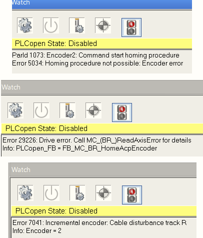  **原因** 驱动器ACOPOS使用外接编码器8AC123.60-1，使用转接线，转接线针脚缺失，导致编码器卡的PIN 14,15没有接线    **解决方式** 更换外接编码器转接线缆 |
| 2022.09.14 现象：错误号39005、39004、5034。经过检查，发现电机进水，导致了电机中编码器损坏。 解决方式：更换电机                                                                                                                                                                                                                                                                                                                                                                                       |
|                                                                                                                                                                                                                                                                                                                                                                                                                                                                                                      |

## 5035：未检测到参考标记

描述：

使用距离编码参考标记进行参考时出现运行时错误。 移动范围已经超过了一般距离，没有出现两个标记脉冲（归位模式 DCM）。

反应：

归位过程中止。

“归位有效”状态不会复位。

原因/补救措施：

查看错误编号 [7047](#7047无效的参考标记距离).

## 5036：超过加速停止限制

描述：

当 cam automat 处于活动状态或处于操作模式时的运行错误，“循环，外部设置值”。 设定位置的加速度超过定义的最大值 (LIM_A_SET_STOP)。

反应：

默认设置 STOP_ERR_DECEL_RAMP=ncA_LIMIT：

通过轴限制和关闭控制器停止运动。

STOP_ERR_DECEL_RAMP 的不同设置见错误号 [4007](#4007超出滞后错误停止限制).

原因/补救措施：

当活动凸轮自动运行时：

最大值 (LIM_A_SET_STOP) 太小。

设置值生成过于动态。 速度和加速度过高的原因是：

覆盖附加轴上的附加运动。

具有“粗”分辨率的外部编码器作为主轴。

形成曲线时不考虑主运动的动态。

具有“未知”运动动态的外部大师。

乘法因子的在线变化。

查看错误编号 [5101](#5101补偿齿轮超出限值) 用于补偿齿轮。

凸轮自动机终止于斜率不等于 0 (EVENT_ST_INDEX=255) 的曲线。

凸轮自动机从活动的基础运动中移动的主件直接启动。

由于以下原因设置位置跳跃：

参考主轴或附加轴。

在附加轴上引起跳跃的值变化。

凸轮之间和多项式内的小位置偏移。 查看错误编号 [37111](#37111凸轮数据多项式值-yxn-与从站周期之间的差异).

将主轴耦合到循环网络位置时出现网络错误。

主轴中的滞后错误停止（设定值跳转到实际值）。

在操作模式下，“循环，外部设定值”：

最大值 (LIM_A_SET_STOP) 太小。

设置值生成过于动态。 速度和加速度太高。

错误的设定值生成。

在控制器开启后或跟随驱动控制的运动（归位）后，实际/设定值设置错误。

附加偏移量 (CYC_ADD_SET_PARID) 的跳转导致值更改。

网络错误.

## 5037：无法使用归位程序模式：编码器类型错误

描述：

使用“开始归位程序”命令响应错误。 定义了归位模式 (ncRESTORE_POS)，它需要绝对编码器测量系统 - 至少在一转内。

反应：

未启动归位程序。

“归位有效”状态被重置。

原因/补救措施：

不正确的归位模式。

编码器类型不正确。

\-\> 使用绝对编码器或至少单圈编码器代替增量编码器.

## 5038：无法使用归位程序模式：恢复数据无效

描述：

使用“开始归位程序”命令响应错误。 配置的归位模式 (ncRESTORE_POS) 从永久存储区恢复单元位置。 该存储区为空或包含无效数据。

反应：

未启动归位程序。

“归位有效”状态被重置。

原因/补救措施：

永久存储区中没有数据：

\- 新的 ACOPOS-HW

\- 缺少激活 HOMING_RESTORE_MODE=1

永久存储区的数据与编码器/单元配置不匹配：

\- 编码器已更改

\- 配置不正确或已更改（ENCOD_COUNT_DIR、SCALE_LOAD_UNITS、SCALE_LOAD_MOTREV、SCALE_ENCOD_INCR）

永久存储区的数据被破坏（校验和）

\-\> 使用“正常”归位程序校准轴，这意味着除 ncRESTORE_POS 之外的归位模式

## 5039：功能不可用：编码器错误

描述：

激活需要编码器数据的功能时出现响应错误。 对应的编码器处于错误状态。

反应：

查看错误编号 [5017](#5017归位程序模式不可能位置控制器未激活).

原因/补救措施：

查看错误编号 [6057](#6057位置环控制器负载编码器错误).

## 5043：无法使用归位程序模式：补偿激活

描述：

如果补偿处于活动状态，则使用“开始归位程序”命令响应错误。

反应：

未启动归位程序。

“归位有效”状态被重置。

原因/补救措施：

补偿激活时不允许归位。

失去电机位置和补偿位置之间的唯一映射.

## 5044：无法使用归位程序模式：需要改变方向

描述：

使用“开始归位程序”命令响应错误。

定义了一种归位模式，它需要改变方向，并且设置了“不改变方向”的模式控制位。

反应：

未启动归位程序。

“归位有效”状态被重置。

原因/补救措施：

不正确的归位模式。

归位模式控制位“不改变方向”（固定方向）。

归位模式控制位“开始方向”和“触发方向”不同.

## 5101：补偿齿轮：超出限值

描述：

在计算补偿齿轮期间凸轮自动装置处于活动状态时出现运行错误。 当前参数、连接曲线和补偿路径的组合无法维持速度或加速度限制。 另一方面，“有效”主/从补偿路径取决于补偿模式、补偿路径参数、倍增因子和曲线周期。 仅在启动或重新启动后注册一次。

反应：

补偿是使用过量值计算的。

例如，最大从速度增加了进入或退出速度。

凸轮自动运动保持激活。 但是，可能会出现后续错误（例如错误编号 [4007](#4007超出滞后错误停止限制)).

原因/补救措施：

“有效”主轴补偿路径太短。 另请参阅错误编号 [37108](#37108计算出的主轴补偿距离限制为最小值).

与 AUT_COMP_SL_V_MIN 相关的“有效”主轴补偿路径太长。

“有效”从补偿路径太短或太长。 另请参阅错误编号 [37101](#37101从轴上计算的补偿距离限制为最大值) 和

错误编号 37102。

主轴AUT_MA_V_MAX 最大速度值太大。

与 AUT_COMP_SL_V_MIN 相关的主轴 AUT_MA_V_MAX 的最大速度值太小。

“旧”状态曲线的退出斜率太大。

“新”状态曲线的入口斜率太大（从轴的倍增系数）。

最大从速度值 AUT_COMP_SL_V_MAX 太小。

最小从站速度值 AUT_COMP_SL_V_MIN 太大。

第一部分补偿 AUT_COMP_SL_A1_MAX 中的最大从加速度值太小。

第二部分补偿的最大从加速度值 AUT_COMP_SL_A2_MAX 太小.

## 5102：每个周期的凸轮变化太多（主轴周期太短）

描述：

如果连续扫描周期（计算周期 400us）每次都需要更改凸轮，则凸轮自动机处于活动状态时会出现运行时错误。 一个扫描周期中最多执行一次凸轮变换。 如果这个最大的“变化频率”不再足够，那么凸轮就会失去形状，主从之间的位置关系就会丢失。

反应：

查看错误编号 [4008](#4008到达正限位开关).

原因/补救措施：

主轴或附加轴的速度太高。

主轴或附加轴中的位置跳跃。

凸轮或补偿齿轮的主周期太短。

主乘法因子太小。

具有 ncAT_ONCE 属性的状态变化事件发生得太频繁。

另请参阅错误编号 [5036](#5036超过加速停止限制).

| 应用案例                                                                                                                                                                                                                                                   |
|------------------------------------------------------------------------------------------------------------------------------------------------------------------------------------------------------------------------------------------------------------|
| 2022.08.10 问题描述：伺服上电报警5102 问题原因：MC_BR_AutControl内State[1].MasterFactor设置太小，之前设置100可以，是因为之前1u=0.1mm。现在改为1u=0.001mm，所以需要设置为10000。最小也得设置为1000。程序里的单位是工程单位mm。 解决方案：放大MasterFactor值 |
|                                                                                                                                                                                                                                                            |

## 5107：无法启动凸轮耦合：参数超出有效范围

描述：

如果检测到无效配置，则凸轮自动机 (CMD_CAM_START) 启动和重新启动时的响应错误。

反应：

不执行凸轮自动启动。

原因/补救措施：

附加信息的参数ID区分以下原因：

CAM_MA_S_START

当前主位置已超过 CAM_MA_S_START。

CAM_MA_V_MAX

从站速度超过轴限制值。这意味着主轴的最大速度或凸轮斜率太大（(CAM_MA_V_MAX \* CAM_SL_S_SYNC / CAM_MA_S_SYNC) \> AXLIM_V_POS）。

CAM_SL_S_COMP_MIN

从轴补偿路径小于最小值（CAM_SL_S_COMP \< CAM_SL_S_COMP_MIN）

CAM_SL_S_COMP_MAX

从轴补偿路径大于最大值（CAM_SL_S_COMP \> CAM_SL_S_COMP_MAX）

CAM_MA_TRIG_WINDOW

主轴触发窗口大于间隔(CAM_MA_TRIG_WINDOW \> (CAM_MA_S_SYNC + CAM_MA_S_COMP))

CAM_MA_COMP_TRIG_WINDOW

主轴补偿触发窗口大于间隔(CAM_MA_COMP_TRIG_WINDOW \> (CAM_MA_S_SYNC + CAM_MA_S_COMP))

CAM_SL_TRIG_WINDOW

从轴触发窗口大于间隔(CAM_SL_TRIG_WINDOW \> (CAM_SL_S_SYNC + CAM_SL_S_COMP))

CAM_MA_S_TRIG

主触发 FIFO 超过最大长度。这表示主轴的相对触发位置太大或间隔太小。

CAM_MA_S_COMP_TRIG

主补偿触发 FIFO 超过最大长度。这表示主轴的相对位置补偿触发过大或间隔过小。

CAM_SL_S_TRIG

从机触发 FIFO 超过最大长度。这说明从轴的相对触发位置太大或间隔太小.

## 5110：凸轮耦合中止：缺少循环设定位置

描述：

耦合到循环网络位置 (MA1/2/3_CYCLIC_POS) 时出现运行错误。 如果在主轴循环内未接收到新的设定位置，则会发生线性外推。 如果此故障连续发生多次，则会记录此错误。

反应：

查看错误编号 [4008](#4008到达正限位开关).

原因/补救措施：

在发送设定值之前过早激活耦合。

设定值发送未激活或主站故障。

主轴周期太短或网络负载太高。

网络连接中断或断开。 另请参阅错误编号 [1012](#1012循环网络通信的崩溃).

| 应用案例                                                                  |
|---------------------------------------------------------------------------|
| 2022.01.10 发送主轴位置的驱动器的节点号要在从轴的前面。调整节点号的设置。 |

## 5111：凸轮耦合中止：编码器错误

描述：

如果主轴由编码器位置组成并且编码器评估检测到错误，则凸轮自动机处于活动状态时会出现运行错误。

反应：

查看错误编号 [4008](#4008到达正限位开关).

原因/补救措施：

查看错误编号 [6057](#6057位置环控制器负载编码器错误).

| 应用案例                                                                                    |
|---------------------------------------------------------------------------------------------|
| 2023.01.12 ParID写错，收到的主轴位置应为542  |

## 5115：无法执行重新启动命令：凸轮自动机Automat未激活

描述：

如果自动机功能未激活，则在重新启动 (ncRESTART) 凸轮自动机时出现响应错误。

反应：

不执行凸轮自动重启。

原因/补救措施：

凸轮自动机Automat尚未使用 ncSTART“正常”启动。

凸轮自动机Automat之前已使用 ncSTOP 终止。

凸轮自动机Automat先前已使用结束状态 255 终止（仅适用于 CMD_AUT_START）.

## 5202：凸轮控制：开关位置不按升序排列

描述：

使用鼓音序器 (CMD_DRUMSEQ=ncSTART) 或使用凸轮控制器功能块 (CAMCON_MODE, CAMCON_CAM_S2) 的响应错误。 间隔内凸轮的起始位置大于结束位置或相邻凸轮的位置重叠。

反应：

鼓音序器 (CMD_DRUMSEQ) 未启动。

不接受参数值 (CAMCON_CAM_S2)。

原因/补救措施：

重新配置时未停用凸轮或未减少凸轮数量（保留“旧凸轮”）。

配置顺序被切换（首先是开始位置，然后是结束位置）.

## 5300：上传的数据块不可用

描述：

如果当前索引中不存在数据，则在初始化数据上传（数据块读取访问）时出现响应错误。

例如：凸轮数据或来自参数序列的数据。

反应：

数据块读访问未初始化。 无法执行上传。

原因/补救措施：

无效的数据索引。

尚未为数据索引执行下载。

数据索引的下载较早执行，但数据无效.

## 5301：无法启动凸轮Automat联动：参数超出有效范围

描述：

如果检测到无效配置，则凸轮自动机启动时的响应错误 (CMD_AUT_START)。

反应：

不执行凸轮自动启动。

原因/补救措施：

附加信息的参数ID区分以下原因：

AUT_COMP_MODE

启动状态下无效补偿档位模式.

## 5302：无法写入参数：凸轮Automat激活

描述：

写入参数时出现响应错误，当凸轮自动机处于活动状态 (CMD_AUT_START) 时，不允许在线更改。

反应：

不接受参数值。

原因/补救措施：

参数写入太晚（在凸轮自动启动之后）。

参数写入过早（在凸轮自动机运动中止之前）。

\-\> 检查程序顺序和状态请求.

## 5303：索引处的凸轮数据不可用

描述：

如果该索引处不存在凸轮数据，则写入数据索引时会出现响应错误。

反应：

不接受数据索引。

原因/补救措施：

查看错误编号 [5300](#5300上传的数据块不可用).

查看错误编号 [5304](#5304凸轮数据格式错误).

| 应用案例                                                      |
|---------------------------------------------------------------|
| 2022.07.28 PLC程序异常，需要 1.重新更新PLC程序  2.更换新的PLC |

## 5304：凸轮数据格式错误

描述：

凸轮下载 (AUT_POLY_DATA) 的最后一个数据段的响应错误。 在接受凸轮之前检查多项式数据的有效性。

反应：

不接受新凸轮。

保留具有此数据索引的先前有效凸轮。

原因/补救措施：

细节

1：多项式的个数不在1-128的范围内。

2：第一个多项式的 y 偏移系数 a1 不为 0。

3：系数的浮点值范围无效。

4：多项式主位置xi 为负或小于前一个主位置。

5：最后一个主位置xn 不对应主间隔（周期）。

6：主区间末尾的多项式函数值y(xn)与从区间不对应。 另请参阅错误编号 [37111](#37111凸轮数据多项式值-yxn-与从站周期之间的差异).

7：主周期（period）的长度太小或为负。

8：数据块中的字节数不在1-128多项式范围内。

9：'reserve' 的值不为 0。

| 应用案例                                                                                                             |
|----------------------------------------------------------------------------------------------------------------------|
| 2023.01.12 报错5304 detail 2，原因是描点生成的曲线不是从(0,0)开始的 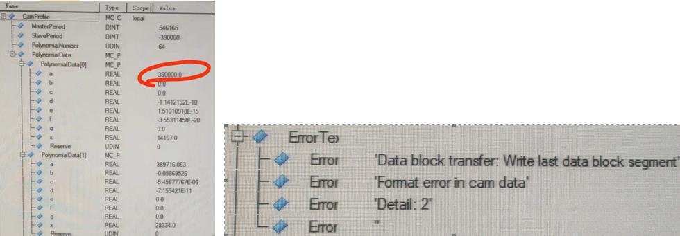  |

## 5311：凸轮自动机Automat：事件导致未初始化状态

描述：

写入 CMD_AUT_ST_CHECK 时出现响应错误。 执行自动状态的参数检查。

反应：

没有任何。

原因/补救措施：

在此状态下组态了一个事件，这会导致没有有效凸轮数据的状态。

事件配置不正确 (AUT_EVENT_ST_INDEX)。

AUT_EVENT_ST_INDEX 的状态尚未完全配置.

## 5315：下载错误：凸轮自动机或功能块正在使用凸轮数据

描述：

凸轮下载的最后一个数据段（AUT_DATA_INDEX、AUT_POLY_DATA）的响应错误。 此数据索引的下载已执行多次（凸轮的在线更改）。 这些凸轮尚未启用，现在使用相同索引的凸轮太多。

反应：

不接受新凸轮。

保留具有此数据索引的先前有效凸轮。

原因/补救措施：

下载到错误的数据索引。

一致在线参数更改 (AUT_ONL_PAR_LOCK) 的锁不会重置。

太多实例正在使用相同的凸轮。 例如，凸轮自动实轴和虚轴、CURVE 功能块。

凸轮未启用（例如，凸轮主轴不移动，因此保持在曲线中）。

CURVE 功能块连续阻塞一条曲线。

\-\> 对于在线更改和静态应用程序，不应使用公共数据索引。 如果需要相同的凸轮，可以将其传输到第二个数据索引.

## 5316：事件类型无法进入补偿齿轮

描述：

写入 CMD_AUT_ST_CHECK 时出现响应错误。 执行自动状态的参数检查。

反应：

没有任何。

原因/补救措施：

在此状态 (AUT_EVENT_TYPE=ncST_END+ncNEGATIVE) 中组态了一个用于负运动方向的事件，这会导致带有补偿齿轮的状态。 仅对正方向执行补偿计算.

## 5319：状态 0 不允许凸轮数据

描述：

写入 AUT_ST_DATA_INDEX 时出现响应错误。 在基本状态 (AUT_ST_INDEX=0) 下，不能使用凸轮。

反应：

没有任何。

原因/补救措施：

状态索引无效。

如果凸轮自动机带有凸轮，则可以使用 AUT_START_ST_INDEX（直接启动）配置相应的状态.

## 5329：没有有效的凸轮数据

描述：

写入 CMD_AUT_ST_CHECK 时出现响应错误。 执行自动状态的参数检查。

反应：

没有任何。

原因/补救措施：

该状态下没有凸轮数据。

状态尚未完全配置.

## 6000：主站采样时间不是位置控制器采样时间的倍数

描述：

写入主循环时间时出现响应错误。 主循环时间不能除以位置控制器循环时间 (400us)。

反应：

不接受主循环时间。

原因/补救措施：

查看错误编号 [1002](#1002参数超出有效范围).

使用 POWERLINK 时，另请参阅错误编号 [1012](#1012循环网络通信的崩溃).

## 6002：同步控制器：超出系统时间差的容错范围

描述：

驱动同步期间的运行错误。 主系统时间与从系统时间SYNC_SYS_TIME_DIFF的偏差太大。

反应：

“驱动同步”状态被重置。

在网络耦合期间可能发生位置跳跃。

在“外部、循环设定值”操作模式下可能会发生设定值跳跃。

原因/补救措施：

构成系统时间的主从石英频率偏差太大。

在具有低级驱动器同步的 CAN 网络中，由于网络负载高，同步报文传输延迟。

使用 POWERLINK 时，请参阅错误编号 [1012](#1012循环网络通信的崩溃).

| 应用案例                                                                                                                                                                                                                                                                                                                                                                                                                                                                                                                                                                                                                                     |
|----------------------------------------------------------------------------------------------------------------------------------------------------------------------------------------------------------------------------------------------------------------------------------------------------------------------------------------------------------------------------------------------------------------------------------------------------------------------------------------------------------------------------------------------------------------------------------------------------------------------------------------------|
| 2022.09.07 原因：POWERLINK通信受到干扰，例如线缆过滑环。 现象：多轴运动时，10个轴有2个轴报出出此错误，停止运行。 查看PLK的IO Mapping通道信息，FailedCycleCount有累加，即意味着PLK通信有一定的丢包。   解决方式一： 1. 更换PLK线缆（若怀疑PLK线缆有问题） 2. 更换滑环，滑环接PLK线缆的时候接8个根线  解决方式二： 1. 调整PLK通信参数，允许更多的丢包数量。 2. 设置PLK的主站配置参数，POWERLINK parameters - Mode - Advanced - Cycle loss limit 修改为manually，Number of lost cycles从2改为20。 需注意，此方式调整可能会影响控制精度与响应速度  |

## 6008：控制器已经激活

描述：

使用“设置控制器模式”和“打开控制器”命令响应错误。 不允许在控制器处于活动状态时切换控制器模式。

反应：

不执行命令。

原因/补救措施：

在写入命令之前必须关闭控制器.

## 6014：驱动器初始化激活

描述：

使用“打开控制器”命令时出现运行时错误。 另请参阅错误编号 [4005](#4005控制器无法开启驱动处于错误状态).

初始化访问闪存。 访问期间不得打开控制器。

反应：

查看错误编号 [4005](#4005控制器无法开启驱动处于错误状态).

原因/补救措施：

使用 AC123 插件卡时，通过将编码器类型从 ncINC 更改为 ncSSI 来启动初始化。 在此阶段发出了“打开控制器”命令。

\-\> 在命令“打开控制器”之前请求状态“控制器准备好”.

## 6017：软件：看门狗激活

描述：

处理具有中等优先级的操作系统功能期间的运行时错误。 函数调用期间发生超时。 无法再保证网络通信。

另请参阅错误编号 [4005](#4005控制器无法开启驱动处于错误状态).

反应：

查看错误编号 [1004](#1004网络生命标志监视器超时).

原因/补救措施：

ACOPOS 硬件缺陷。

操作系统故障.

## 6018：硬件：内部电源故障

描述：

使用“打开控制器”命令或控制器处于活动状态时硬件监视器中的运行时错误。 另请参阅错误编号 [4005](#4005控制器无法开启驱动处于错误状态).

内部电源电压有问题。 根据硬件，该电源用于插入式卡、风扇、电流测量、直流总线继电器等。

反应：

查看错误编号 [6021](#6021控制器使能输入低电平).

原因/补救措施：

伺服驱动器的 24VDC 电源电压出现故障或电压骤降。

伺服驱动器的主电源出现故障或电压骤降。

ACOPOS硬件缺陷.

| 应用案例                                                                                                                     |
|------------------------------------------------------------------------------------------------------------------------------|
| 2022.01.10 制动电阻温度过高：电机长时间被拖拽，请配置外部制动电阻                                                            |
| 2022.01.10 硬件：内部供电失败。--这个是380和24都没有的情况下会报出来的错误。这个错误应当是在正常上电但是突然供电都lost的情况 |
| 2022.01.11 内部供电失败： 交流380V和直流24V供电丢失                                                                          |

## 6019：ACOPOS：过流

描述：

如果逆变器中的六个晶体管中的至少一个或制动电阻器的晶体管记录过流，则出现运行错误。

使用以下 ACOPOS 模块时，此错误也会因电流互感器（U 和 V）中的过电流而记录：

\|-----------------\|------------\|

\| 8V1180.xx-2 \| 95.4 A \|

\| 8V1320.xx-2 \| 160.4 A \|

\| 8V1640.xx-x \| 400.0 A \|

\| 8V128M.xx-x \| 585.0 A \|

\|-----------------\|------------\|

反应：

同步电机：运动停止，短路制动。

异步电机：通过关闭动力部分并打开抱闸来停止运动。

如果错误连续发生两次，则通过关闭电源部分并打开抱闸来停止运动。

设置 STOP_ERR_DECEL_RAMP=ncCTRL_OFF：

通过立即关闭控制器和电源部分来中止运动。驱动器没有电气扭矩。

原因/补救措施：

电机接线错误：

\- 相和接地导体切换。 -\> 检查变频器输出端电机电缆中的接地导体 PE 是否与电机 U、V 或 W 相连接。

\- 电机电缆短路。两相之间短路，接地 PE 和相或屏蔽和相。 -\> 检查 U-V、V-W、W-U、U-PE、V-PE、W-PE、U-shield、V-shield 和 W-shield 之间的电阻。

电机缺陷：

\- 电机相绕组短路。 -\> 检查电机插头和电机端子上的三个电机阻抗（相-相）中的两个是否降低。

\- 电机两相之间的绕组短路。 -\> 检查电机插头和电机端子上的三个电机阻抗（相-相）中的一个是否降低。

\- 电机相和外壳之间的外壳短路。 -\> 使用通断测试仪或兆欧表，检查电机相位和外壳之间的绝缘电阻。

ACOPOS模块缺陷：

查看错误编号 [6052](#6052功率级高端过流).

查看错误编号 [6054](#6054功率级过流).

\- 制动电阻的合金晶体管或控制有缺陷。 -\> 检查当直流母线电压 UDC_ACT 大于制动电阻 UDC_BLEEDER_ON 的接通电压时是否记录错误。

外部制动电阻缺陷：

\- 短路 -\> 检查未连接外部制动电阻时是否也记录错误。

设置当前值跳转：见错误号 [9300](#9300电流控制器过流). 这种原因更可能发生在带有电流互感器监控的设备上.

| 应用案例                                                        |
|-----------------------------------------------------------------|
| 2022.07.28 解决方式： 1.更换电机动力线 2.更换电机               |
| 2022.08.10 6019，6052，6054这几个报警一般都是逆变单元的IGBT坏了 |
|                                                                 |

## 6020：控制电源：欠压

描述：

控制电源电压已降至最低允许限值以下（参见 ACOPOS 用户手册）。

另请参阅错误编号 [4005](#4005控制器无法开启驱动处于错误状态).

反应：

查看错误编号 [6021](#6021控制器使能输入低电平).

原因/补救措施：

通过直流总线供电的供电电压：

VAC 电源：干扰（断线、控制、电源故障、电源骤降等）

通过外部电源供电：

控制电源：超出规范的操作（参见 ACOPOS 用户手册）

控制电源：干扰（断线、控制、电源过载、电源故障等）

ACOPOS硬件缺陷.

## 6021：控制器使能输入低电平

描述：

使用“打开控制器”命令或控制器处于活动状态时硬件监视器中的运行时错误。 没有为控制器使能输入提供足够的电压。

例如下图ACOPOS P3驱动器的X7端子的Enable引脚没有提供24V电压。

反应：

当“打开控制器”命令时：请参阅错误编号 [4005](#4005控制器无法开启驱动处于错误状态).

当控制器处于活动状态时：

通过关闭 IGBT 输出级并打开抱闸来停止运动。

“控制器就绪”状态被重置。

原因/补救措施：

由外部操作或外部因素（应用程序或手动操作）触发。

由于硬件缺陷或故障（连接断开、线路终止、接线错误、控制硬件有缺陷或故障、ACOPOS 24VDC 电源电压、故障）而导致错误触发。 另请参阅接线指南错误编号 [7030](#7030编码器增量信号幅度太大).

ACOPOS硬件缺陷.

## 6023：控制器启用输入处的电压骤降

描述：

使用“打开控制器”命令或控制器处于活动状态时硬件监视器中的运行时错误。 控制器使能输入上出现电压骤降。

反应：

当“打开控制器”命令时：请参阅错误编号 [4005](#4005控制器无法开启驱动处于错误状态).

当控制器处于活动状态时：

通过关闭 IGBT 输出级并打开抱闸来停止运动。

“控制器就绪”状态被重置。

原因/补救措施：

由外部操作或外部因素（应用程序或手动操作）触发。

由于硬件缺陷或故障（连接断开、线路终止、接线错误、控制硬件有缺陷或故障、ACOPOS 24VDC 电源电压、故障）而导致错误触发。 另请参阅接线指南错误编号 [7030](#7030编码器增量信号幅度太大).

ACOPOS 模块缺陷。

| 应用案例                               |
|----------------------------------------|
| 2022.01.10 请检查驱动器24V输入是否有电 |

## 6026：抱闸：释放期间超出定子电流限制

描述：

当抱闸监控器处于活动状态时，使用“打开控制器”命令时出现运行错误。 打开（释放）抱闸 MIN(ACOPOS_CURR_MAX, MOTOR_CURR_MAX) 时流过的电流最大。

反应：

查看错误编号 [6045](#6045逆变器输出无电流).

原因/补救措施：

电流控制器不稳定。

打开（释放）暂停时间太长，控制器设置太“软”.

**设置的太软意味着三环参数设置的偏小**

## 6027：抱闸：不允许手动操作

描述：

使用命令 CMD_BRAKE 操作抱闸时出现响应错误。 当控制器处于活动状态时，不允许手动操作抱闸。

反应：

不执行命令。

原因/补救措施：

控制器激活时手动操作抱闸未通过抱闸模式开启（BRAKE_MODE 中的位 1 未设置）.

## 6029：抱闸：控制信号开启，输出状态关闭

描述：

抱闸控制监控器激活期间的运行错误。 在滤波器时间 BRAKE_CTRL_MON_FILTER 期间，当抱闸门控信号打开时，抱闸没有提供足够的电流和/或电压。

反应：

如果控制器关闭：无。

查看错误编号 [9000](#9000散热器温度传感器超出停止限制).

原因/补救措施：

查看错误编号 [6055](#6055抱闸低电压).

查看错误编号 [6056](#6056抱闸低电流).

| 应用案例                                                                                                                                                                                                                                                                                                                      |
|-------------------------------------------------------------------------------------------------------------------------------------------------------------------------------------------------------------------------------------------------------------------------------------------------------------------------------|
| 2022.01.11 报警号6029+6055 **问题**：  P3驱动器带抱闸电机，接线正确的情况下，switch on的时候会报抱闸打不开，报错号6029+6055 **问题原因:** 开关电源功率不够 **解决：** 测量一下在驱动器的24供电的电压，压降太低了  电压低于23.6就不行，很敏感。具体参数看帮助 换了个单独的电源可以了。之前23.7V电压的时候报错，24.1V就可以了。 |

## 6030：抱闸：抱闸输出激活，但没有在电机数据中输入抱闸

描述：

当抱闸监控器处于活动状态时，使用“打开控制器”命令时出现运行错误。 即使在电机配置数据中未指定抱闸，电流仍会流向抱闸输出。

反应：

查看错误编号 [6045](#6045逆变器输出无电流).

原因/补救措施：

抱闸的电机配置数据不正确。

抱闸的输出正用于其他功能，并且制动监视器尚未停用（BRAKE_MODE 中的位 2 未设置）.

| 应用案例                                                                                                                                                                                                                                                                  |
|---------------------------------------------------------------------------------------------------------------------------------------------------------------------------------------------------------------------------------------------------------------------------|
| 2023.04.03 **现象** 现场运行很多天的ACOPOS P3设备，先报5005，后面重复断电上电一直报6030，且无法复位 **原因** 机械振动导致刹车线 B+ B-存在虚接的现象  **解决方式** 把电机接线的刹车线 B+ B-重新接线，端子上拆下来线重新接。 |

## 6031：系统模块已删除

描述：

删除 NC 系统模块时的响应错误。 要删除的操作系统“acp10sys.br”或BsLoader“acp10bsl.br”不在驱动器上。

反应：

不执行“删除 NC 系统模块”命令。

原因/补救措施：

没有要删除的数控系统模块.

## 6032：接口：FPGA 配置错误

描述：

插件卡初始化期间的运行时错误。 配置 FPGA 功能块时出错。

反应：

不支持插卡

原因/补救措施：

插卡故障。

来自插件卡的 PROM 数据包含错误。

ACOPOS硬件缺陷（总线板、插头、内部SSI总线）.

## 6033：ACOPOS 固件不支持伺服放大器类型

描述：

启动驱动程序时出现运行时错误。 来自驱动器的 PROM 数据与固件不兼容。

另请参阅错误编号 [4005](#4005控制器无法开启驱动处于错误状态).

反应：

查看错误编号 [4005](#4005控制器无法开启驱动处于错误状态).

原因/补救措施：

固件不支持驱动器

ACOPOS 硬件缺陷（驱动器上的 PROM 数据不正确，内部 SSI 总线缺陷）

| 应用案例                                                                                                                                                                                                                       |
|--------------------------------------------------------------------------------------------------------------------------------------------------------------------------------------------------------------------------------|
| 2022.01.11 报警6033,4005 **问题描述：** 伺服不能使能，RUN指示灯不亮，报警号4005,6033 **解决方法：** 更新伺服驱动器固件到最新版本2.3.0.0，没有解决，继续更新编码器卡固件，问题得以解决。 附注：最好把伺服固件及相关固件都更新。 |

## 6034：循环设定值模式中止：设定速度丢失

描述：

使用循环设定值激活速度控制时出现运行错误。 至少 3 个主轴周期没有从网络接收到速度设定值。

反应：

查看错误编号 [4007](#4007超出滞后错误停止限制).

原因/补救措施：

驱动器未提供足够的速度设定值 -\> 检查应用程序。

查看错误编号 [5110](#5110凸轮耦合中止缺少循环设定位置).

## 6036：电机参数缺失或无效

描述：

使用“打开控制器”或“燃烧电机数据”命令时出现响应错误。

电机配置数据未完全初始化。

信息中列出了第一个无效参数 ID。

反应：

不执行命令。

原因/补救措施：

至少有一个电机参数未写入或写入错误（参见信息）。

MOTOR_TYPE 参数未作为电机配置数据的第一个参数写入。

在带有 EnDat 编码器的电机上，无法从 EnDat 内存中读取电机配置数据（编码器错误、第 3 方电机、编码器内存中没有电机数据）.

- 信息错误 1224 或 652
- 如果信息 1224 (MOTOR_VENDOR_ID ParID) 或 652 (MOTOR_ENCOD_ATTR ParID) 出现错误，原因可能如下： 带有 EnDat 编码器的贝加莱电机的电机升级在 Automation Studio 4.0 或更高版本中带有不完整的电机配置数据。 来自带有 EnDat 编码器的贝加莱电机的电机配置数据不需要传输到驱动器，因为数据存储在编码器中。
- 补救：
- 从项目中禁用或删除电机配置数据。
- 将 Automation Studio 升级到 V4.1.6 或更高版本或 V4.2.3 或更高版本。 这将自动禁用电机配置数据。
- 添加缺少的参数 MOTOR_VENDOR_ID = 0 和 MOTOR_ENCOD_ATTR = 0（例如使用参数表）。 这将使用项目中的电机配置数据.

| 应用案例                                                                                                                                                                                                                                                                                                                                                                                                                                                                                                                                                                                                                                                                                                                                                                       |
|--------------------------------------------------------------------------------------------------------------------------------------------------------------------------------------------------------------------------------------------------------------------------------------------------------------------------------------------------------------------------------------------------------------------------------------------------------------------------------------------------------------------------------------------------------------------------------------------------------------------------------------------------------------------------------------------------------------------------------------------------------------------------------|
| 2023.02.13 **原因** 某些第三方驱动器会修改 Endat2.1 电机芯片中的参数，尤其是磁偏角 ID63 使用我们的 8V1180.001-2 驱动器带第三方驱动器驱动过的电机 8LSA54.EB045D700-3，正常组态配置，驱动器无法上电； 在 Physical View 里面默认-3 的电机加进来，电机参数默认都是 disable 的，但是驱动器上电时会报错，电机参数丢失，无法从电机芯片中读取；  如果配置了电机参数，又会报错 6036，TEST 中会说 ID1224 和 ID652 丢失或无效  **解决方式** 在参数表中增加电机参数；电机配置参数必须在 ID652 和 ID1224 前面；  ParID 1209 值必须修改为 0，关闭温度模型。否则会报错 9090：Motor encoder temperature sensor: Temperature value not valid  手动增加 ID652 值为 0，和 ID1224 值为 1   最重要的是，需要重新整定 ID63 号磁偏角，手动写到参数表中 |

## 6038：扭矩限制高于峰值电机扭矩

描述：

写入扭矩限制（扭矩限制或扭矩限制覆盖）参数时的响应错误。 通过写入参数，有效扭矩限制将大于峰值电机扭矩。

反应：

不接受扭矩限制。

原因/补救措施：

扭矩限制和/或扭矩限制覆盖大于电机配置数据中的峰值扭矩。

另请参阅错误编号 [1002](#1002参数超出有效范围).

## 6043：PHASING_MODE 无效

描述：

如果增量编码器用作电机编码器并且选择了错误的 PHASING_MODE 来确定换向偏移 MOTOR_COMMUT_OFFSET，则在打开控制器时出现运行错误。

反应：

启动程序被取消。

原因/补救措施：

PHASING_MODE 的允许值：

0：饱和模式

2：抖动模式

4：直接II

PHASING_MODE 不允许的值：

1：步进模式会导致无效动作。

3：不支持直接模式。

查看错误编号 [1002](#1002参数超出有效范围).

## 6044：相位：旋转方向或位置无效

描述：

在步进模式 (PHASING_MODE=1) 下对 CMD_PHASING 进行定相期间出现运行时错误。

反应：

分阶段被中止。

原因/补救措施：

计算出的极对数为负数（参见信息）：

\- 电机接线错误：电机相位置换。 -\> 交换两个电机相位或设置 MOTOR_CURR_ROT_DIR = ncINVERSE。

\- 编码器位置或速度包含错误：参见错误编号 [4014](#4014两个编码器控制超出位置差的停止限制).

计算出的极对数在 -0.5..0.5 范围内（请参阅信息）：

\- 编码器缩放 SCALE_ENCODx_INCR 不正确

\- 编码器位置或速度包含错误：参见错误编号 [4014](#4014两个编码器控制超出位置差的停止限制).

\- 电机接线错误：电机相位未连接到逆变器输出。 -\> 在定相期间检查电机运动。 电机应移动 10 个极对。

\- 负载扭矩激活。 -\> 在定相期间检查电机运动。 电机应移动 10 个极对。

\- 电机抱闸未打开。 -\> 在定相期间检查电机运动。 电机应移动 10 个极对。

计算出的极对数高于 255（参见信息）：

\- 计算的极对数高于最大值.

| 应用案例                                                                                                             |
|----------------------------------------------------------------------------------------------------------------------|
| 2022.02.13 贝加莱伺服+第三方直线电机调试过程中，ncSTEPPER, phasing. 如果出现6044报警, 试着ID872=255, 将UVW相序反一下 |
| 2023.05.31 将MOTOR_CURR_ROT_DIR=ncINVERSE后启动正常。 后续电工调线时发现动力线相序确实接错了                         |

## 6045：逆变器：输出：无电流

描述：

接通电流控制器时出现运行错误。当控制器打开时，检查电流是否可以通过电压设置注入电机或再生扼流圈（逆变器输出）的各相。在此阶段测得的电流太低。

反应：

通过关闭 IGBT 输出级并打开抱闸来停止运动。

原因/补救措施：

逆变器输出接线错误：检查所有相（U、V 和 W）是否正确连接到逆变器输出。

电机接线错误：从逆变器输出中移除相位（U、V 和 W）。检查电机线（ACOPOS-侧）上U-V、V-W和W-V之间的相间电阻。三个电阻必须相同且有限。如果至少有一个电阻为无穷大，则电机或电机线路有缺陷。

电机故障：检查电机上U-V、V-W、W-V之间的相间电阻。三个电阻必须相同且有限。如果至少有一个电阻为无穷大，则必须更换电机。

电机配置不正确：MOTOR_STATOR_INDUCTANCE 太低。

电机配置不正确：MOTOR_CURR_RATED 太低。

8BVP：电源缺相：检查接触器、熔断器、变压器和电源电压。

ACOPOS 功率级缺陷：更换 ACOPOS 模块。

可以使用 MOTOR_TEST_MODE 停用连接检查.

| 应用案例                                                                                                                                                                                                                                                                                                                                                                                               |
|--------------------------------------------------------------------------------------------------------------------------------------------------------------------------------------------------------------------------------------------------------------------------------------------------------------------------------------------------------------------------------------------------------|
| 2022.01.11 报警6045和7220 **问题描述**：进线电源电压测得360V，伺服启动不起来，参数ID300已经改成300了，也启动不起来，中午休息时，进线电源380V时，伺服就能起来，运行版本：K4.26;ACP10 3.18.2 **问题原因**：进线电压低于380V，测量值为360V左右 **解决方法**：更换ACP10版本为5.11.1 注：ACP10 3.18.2 版本下，电压在360V时上电会报6045故障，而相同外部条件下，更换ACP10 为 5.11.1 版本后，不会报6045的故障  |
| 2023.07.07 **现象** 生产过程中报错6045/29207/29203 **原因** 查看驱动器UVW接线，打开电柜发现驱动器UVW接线处有一相线烧了                                                                                                                                                                                                                                                                                 |

## 6046：相位：无转子运动

描述：

在抖动模式 (PHASING_MODE=2) 下定相 (CMD_PHASING=ncSTART) 期间出现运行时错误。 在“定相”期间速度 SCTRL_SPEED_ACT 太低。

反应：

分阶段被中止。

原因/补救措施：

转子堵塞：

\- 带有抱闸的电机，由于外部负载而阻塞，电机具有非常高的转动惯量。 -\> 在“定相”期间检查速度 SCTRL_SPEED_ACT。

电机配置不正确：

\- 当相位电流 PHASING_CURR 太低时，不会产生扭矩。 -\> 在“定相”期间检查速度 SCTRL_SPEED_ACT。

编码器位置或速度包含错误：请参阅错误编号 [4014](#4014两个编码器控制超出位置差的停止限制).

电机接线错误：电机至少两相断开，端子松动。 查看错误编号 [6045](#6045逆变器输出无电流).

## 6047：抱闸：控制信号关闭，输出状态开启

描述：

抱闸控制监控器激活期间的运行错误。 在滤波器时间 BRAKE_CTRL_MON_FILTER 期间为抱闸提供电流和电压，同时抱闸门控信号关闭。

反应：

查看错误编号 [6029](#6029抱闸控制信号开启输出状态关闭).

但如果位置控制处于活动状态（CONTROLLER_MODE=1 或 33）： 运动停止，轴限制并在错误消除后关闭控制器。

原因/补救措施：

ACOPOS 故障（抱闸控制、信号电平监控、内部继电器)

## 6048：电机抱闸运动监视器：位置误差过大

描述：

抱闸运动监控期间的运行错误。 抱闸关闭时，电机编码器的实际位置已超过位置误差限值 BRAKE_TEST_POS_LIM（BRAKE_STATUS Bit2 = 0）。 抱闸磨损更快。

反应：

如果抱闸力矩的功能测试处于激活状态：测试中止。

否则：无。

原因/补救措施：

抱闸配置错误（抱闸闭合延迟时间太小）。

电机编码器配置错误。

位置误差限制太小（必须考虑抱闸和电机编码器之间的间隙和弹性变形）。

负载转矩过大。

无位置控制运动停止。

抱闸故障。

“抱闸机械闭合”状态错误。 （抱闸的信号电平监控损坏。参见错误编号 [6029](#6029抱闸控制信号开启输出状态关闭).)

此外，在对抱闸扭矩进行功能测试时：

测试扭矩或抱闸额定扭矩过大。

负载转矩确定不正确（电流测量系统、电机配置、转子换向或电机编码器测量系统）。

控制器不稳定。

如果抱闸扭矩测试未激活，则可以通过设置 BRAKE_MODE Bit3 = 1 禁用停止监控.

| 应用案例                                                                                                                                                                                                                                                                                                                                                                                                                                                                                                                                                                                                                                                                                                                                                                                                                                                                                                                                                                                                       |
|----------------------------------------------------------------------------------------------------------------------------------------------------------------------------------------------------------------------------------------------------------------------------------------------------------------------------------------------------------------------------------------------------------------------------------------------------------------------------------------------------------------------------------------------------------------------------------------------------------------------------------------------------------------------------------------------------------------------------------------------------------------------------------------------------------------------------------------------------------------------------------------------------------------------------------------------------------------------------------------------------------------|
| 2023.06.28 **现象** 4005: Controller cannot be switched on: Drive in error state 5005: Start of movement not possible: Position controller inactive 6048: Motor holding brake movement monitor: Position error too large 9070: Motor temperature model: Stop limit exceeded 41031: Junction temperature model: Warning limit exceeded 41070: Motor temperature model: Warning limit exceeded 29203: Drive is not ready. 29209: The drive is in error state. 29217: Invalid input parameter **原因** 零位参数不对引起过载，客户更换了模具，但是没有重新走回零的流程，导致参数错误，机械卡主了，当前顶住位置距离零位还有1mm以上 因此当伺服使能，由于不在零位位置，所以向零位运动，由于已机械顶住，所以动态偏差LagError一直有1mm以上，就一直以最大扭矩输出，造成电机温度超过70度以上，驱动器的散热片温度高达70度，IGBT温度高达133度。持续较长时间后就报警而POWER OFF，进行复位后，又进入以上死循环。 **优化方式** 使能后，走到零位，如果持续1秒超过+5Nm或小于-5Nm，则把HomePosition 进行偏移，再进行MC_HOME操作。 |

## 6049：逆变器：输出：电流测量故障

描述：

查看错误编号 [6045](#6045逆变器输出无电流).

反应：

查看错误编号 [6045](#6045逆变器输出无电流).

原因/补救措施：

ACOPOS 电流测量或功率级故障：更换 ACOPOS 模块。

查看错误编号 [6045](#6045逆变器输出无电流).

| 应用案例                                                                                                                                                                                                                                                                            |
|-------------------------------------------------------------------------------------------------------------------------------------------------------------------------------------------------------------------------------------------------------------------------------------|
| 2023.06.29 **现象** 9300，6049，7215，7218 **原因** 编码器固定支架断裂  **解决方式** 更换编码器，并重新固定支架，使编码器没有明显晃动                                                                                                |
| 2023.07.14 **现象** 现场使用外接增量式编码器，且驱动器型号为ACOPOS 1320。 现场生产过程中设备卡机10次会出现7次停机需要设备复位，且7次中有1次会出现9300,6049,7218报警 **原因** 终端现场没有给驱动器接地线，导致信号干扰 **解决方式** 接了地线后，设备卡机也不会导致停机需要设备复位。 |

## 6050：不允许写入参数：设置当前滤波器或陷波滤波器处于活动状态

描述：

如果已使用过滤器传递函数，则写入参数时出现响应错误。

反应：

不接受参数值。

原因/补救措施：

在写入设置的当前滤波器参数之前打开陷波滤波器。

在写入陷波滤波器参数之前打开了设置的电流滤波器.

## 6051：相位：速度到高

描述：

接通电流控制器时出现运行错误。 开启控制器时，进行测试以确定电机速度是否高于 0.05\*MOTOR_SPEED_RATED。 此阶段测得的速度太高。

反应：

查看错误编号 [6045](#6045逆变器输出无电流).

原因/补救措施：

## 6052：功率级：高端：过流

描述：

如果功率级中的三个高侧晶体管（U、V、W 相）中的至少一个记录过流，则会出现运行时错误。

反应：

查看错误编号 [6019](#6019acopos过流).

原因/补救措施：

电机接线错误：

查看错误编号 [6019](#6019acopos过流).

电机缺陷：

查看错误编号 [6019](#6019acopos过流).

ACOPOS模块缺陷：

\- 半桥中的合金晶体管或控制有缺陷。 -\> 检查在拔下电机电缆时是否也记录了错误。

设置当前值跳转：

查看错误编号 [9300](#9300电流控制器过流).

| 应用案例                                                                                                                                                                                                                                   |
|--------------------------------------------------------------------------------------------------------------------------------------------------------------------------------------------------------------------------------------------|
| 2022.01.11 6052/6053:Power stage: High-side: Overcurrent（Power stage: Low-side: Overcurrent） 伺服驱动器IGBT故障，更换硬件                                                                                                                |
| 2023.02.14 参考 [6054：功率级：过流](#6054功率级过流)                                                                                                                                                                                      |
| 2023.02.14 88A再生电抗+44A主动电源的模式配置，在上电后电源会报错6052/6053，但当做被动电源使用，电源轴报错不使能可解决                                                                                                                      |
| 2023.06.09 6052/6053/6078 上电运行都无异常，运行一段时间之后出现频繁报警停机 **原因** 电机接线盒进行检查，发现电机侧UVW线接线不稳，很松动   **解决方式** 重新拧紧后上电，未再出现报警等问题 |

## 6053：功率级：低侧：过流

描述：

如果功率级中的三个低侧晶体管（U、V、W 相）中的至少一个记录过流，则会出现运行时错误。

反应：

查看错误编号 [6019](#6019acopos过流).

原因/补救措施：

查看错误编号 [6052](#6052功率级高端过流).

| 应用案例                                                                                                                                                                                                                                   |
|--------------------------------------------------------------------------------------------------------------------------------------------------------------------------------------------------------------------------------------------|
| 2022.01.11 6052/6053:Power stage: High-side: Overcurrent（Power stage: Low-side: Overcurrent） 伺服驱动器IGBT故障，更换硬件                                                                                                                |
| 2023.02.14 参考 [6054：功率级：过流](#6054功率级过流)                                                                                                                                                                                      |
| 2023.02.14 88A再生电抗+44A主动电源的模式配置，在上电后电源会报错6052/6053，但当做被动电源使用，电源轴报错不使能可解决                                                                                                                      |
| 2022.02.14 轴控程序无法复位报警，TEST可以。 原因为直线电机故障                                                                                                                                                                             |
| 2023.06.09 6052/6053/6078 上电运行都无异常，运行一段时间之后出现频繁报警停机 **原因** 电机接线盒进行检查，发现电机侧UVW线接线不稳，很松动   **解决方式** 重新拧紧后上电，未再出现报警等问题 |

## 6054：功率级：过流

描述：

如果功率级中的至少一个电流传感器（U 相、V 相、“W”相）记录过电流，则会出现运行时错误。

反应：

查看错误编号 [6019](#6019acopos过流).

原因/补救措施：

电机接线错误：

查看错误编号 [6019](#6019acopos过流).

电机缺陷：

查看错误编号 [6019](#6019acopos过流).

ACOPOS模块缺陷：

查看错误编号 [6052](#6052功率级高端过流).

\- 电流测量问题。 -\> 检查电源部分关闭时的相电流。

设置当前值跳转：

查看错误编号 [9300](#9300电流控制器过流).

| 应用案例                                                                                                                                                                                                                                                                                                                                                                    |
|-----------------------------------------------------------------------------------------------------------------------------------------------------------------------------------------------------------------------------------------------------------------------------------------------------------------------------------------------------------------------------|
| 2022.01.11 power stage: Overcurrent （1）检查电机uvw接线或者三相对地有没有虚接的 （2）检查电机uvw三相电阻是否一样 （3）读一下电机参数ID60和ID61，定子电阻（电感）是否正常 （4）如果是8BVP电源轴，有可能是谐波引起的（有可能报错7200等），那么考虑改一下ID869=1或者3，也可以设置ID223=2（适当的值，比默认的大一点）                                                          |
| 2022.01.11 UVW至少有一项过流 1、 重新插接动力电缆 2、 检查电机侧U-V,U-W,V-W,U-PE,V-PE,W-PE阻值是否均衡 3、 检查动力电缆相线与PE、相线与屏蔽层是否导通检查逆变动力输出端子U/V/W/PE是否导通                                                                                                                                                                                   |
| 2022.08.10 6019，6052，6054这几个报警一般都是逆变单元的IGBT坏了                                                                                                                                                                                                                                                                                                             |
| 2023.02.13 如果在同步电机参数辨识过程中出现错误6054（Power stage：Overcurrent），输入较小的电压值u_n会有帮助：  然后识别将无误地进行。                                                                                                                                                                                       |
| 2023.02.14 1. 断电后，从驱动器下拔下电机的插头，分别测量U V W之间的电阻是否一致，测量U V W与 地线之间是否无穷大。 2. 断电后，检查电机U V W 地线之间接线是否牢固。 3. 读取电机参数ID60 ID61，数据是否正常。 4. 更换新的驱动器，查看故障是否消失。 5. 更换新的电机，查看故障是否消失。                                                                                        |
| 2023.02.14 **现象：** 8BVI0440驱动器驱动电机反复报警6054。 使用触摸屏程序单独轴点动及调试，伺服能POWER ON，但是执行MOVE动作时，就会报错6054 UVW没有接错，UVW电阻都一样0.2欧姆，读左右两个电机ID61 60都一样。 互换左右两边的驱动器，原来左边驱动器0220是好的，右边报警。互换后左边报警，右边正常。 **原因：** 驱动板问题，接上外壳报过流，不接外壳没事，最后更换驱动板正常。 |
| 2023.02.14 **现象：** 运行了大概半小时报错4007（lagerror过大）和7032（增量信号振幅太小）和6057（编码器报错）和6054（电流过冲） **原因：** 经排查发现muti编码器连线摆放过于密集，产生干扰导致编码器位置数据跳动，致使lagerror过大，导致电流增大最终电流过冲。                                                                 |
| 2023.07.07 驱动器报6054（超电流）错误，整定驱动器三环参数后正常。                                                                                                                                                                                                                                                                                                           |

## 6055：抱闸：低电压

描述：

监控抱闸控制器时出现运行错误。 在过滤时间 BRAKE_CTRL_MON_FILTER 期间超出了允许的最小抱闸输出电压。 可在用户手册中找到与模块相关的限值。

反应：

查看错误编号 [6029](#6029抱闸控制信号开启输出状态关闭).

原因/补救措施：

接线：辅助电源模块的24V输出和逆变模块的抱闸输出之间的电压降过大。 -\> 使用多个扩展模块，电缆截面

8B0C：辅助电源模块的直流电源小于315VDC

8B0C：辅助电源模块的 24V 输出故障 -\> 更换模块

8B0C：重载模块 -\> 使用更大的模块或附加模块

8BVI：抱闸控制器或电压监控器故障 -\> 更换模块

8DI、80V：参数MOTOR_BRAKE_VOLT_REL设置的值太大.

| 应用案例                                                                                                                                                                                                                                                                                                                      |
|-------------------------------------------------------------------------------------------------------------------------------------------------------------------------------------------------------------------------------------------------------------------------------------------------------------------------------|
| 2022.01.11 报警号6029+6055 **问题：**  P3驱动器带抱闸电机，接线正确的情况下，switch on的时候会报抱闸打不开，报错号6029+6055 **问题原因:** 开关电源功率不够 **解决：** 测量一下在驱动器的24供电的电压，压降太低了  电压低于23.6就不行，很敏感。具体参数看帮助 换了个单独的电源可以了。之前23.7V电压的时候报错，24.1V就可以了。 |
| 2022.02.14 通过调节开关电源上的电位计，将开关电源输出至25V以上后，6055报警解除。                                                                                                                                                                                                                                              |

## 6056：抱闸：低电流

描述：

查看错误编号 [6029](#6029抱闸控制信号开启输出状态关闭).

反应：

查看错误编号 [6029](#6029抱闸控制信号开启输出状态关闭).

原因/补救措施：

- 接线错误：例如：所需的跳线 S1-S2 和 S3-S4 未插入，...

\-\> 按照用户手册中的规定检查抱闸的模块相关接线。

- 接线故障：连接断开
- 抱闸或外部继电器不符合驱动器规格（输入电阻太大，..）。

\-\> 通过设置 BRAKE_MODE 中的第 2 位禁用监控。

- 外部继电器损坏或控制不当。
- 抱闸故障。
- ACOPOS 故障（抱闸控制，内部继电器)

## 6057：位置环控制器：负载编码器错误

描述：

带有激活监视器的编码器中的运行错误（激活，参见错误编号 [7030](#7030编码器增量信号幅度太大)).

反应：

查看错误编号 [7030](#7030编码器增量信号幅度太大).

原因/补救措施：

如果在该轴上生成编码器状态，则在附加条目中提供有关编码器运行时间错误的详细信息

如果该轴上未生成编码器状态（另一轴上的编码器或 X20 模块），则相应模块必须提供详细信息.

| 应用案例                                                                                                                                                                                                                                                                                                      |
|---------------------------------------------------------------------------------------------------------------------------------------------------------------------------------------------------------------------------------------------------------------------------------------------------------------|
| 2022.01.10 驱动器switch on的时候报错 6057 , 7031 , 7038 ，都是编码器的问题。最后对编码器电缆进行了加固，问题解决。                                                                                                                                                                                            |
| 2022.01.11 41070：Motor temperature model: Warning limi exceeded 6057：Position loop controller: Load encoder error (1)如果使用环境有水的话，而且报警复位不掉，或者很频繁，很有可能是电机编码器接口进水了。 (2)增加负载润滑 (3)通过ID373=0关掉，但不能保护电机                                                |
| 2022.01.11 位置环编码器异常： 1、重新插拔电机侧编码器电缆 2、重新插拔驱动器侧编码器电缆 3、与距离最近的驱动器交换编码器卡，验证报警是否跟随编码器卡变动到另一电机 4、与距离最近的电机交换安装编码器线（电机侧和驱动器侧），验证报警是否跟随编码器线变动到另一电机 5、更换编码器电缆                           |
| 2022.01.11 问题原因：编码器报警6057，线断了.也有可能是编码器卡，编码器这条之路有硬件问题                                                                                                                                                                                                                      |
| 2022.06.27 **问题**：使用扉叶电机E09编码器，在test模式下使能，就会报4005，39003，6057，39042，39024，39006。 **解决方式**：参数表719写1来确认编码器。                                                                                                                                                         |
| 2023.02.14 **现象：** 运行了大概半小时报错4007（lagerror过大）和7032（增量信号振幅太小）和6057（编码器报错）和6054（电流过冲） **原因：** 经排查发现muti编码器连线摆放过于密集，产生干扰导致编码器位置数据跳动，致使lagerror过大，导致电流增大最终电流过冲。   |
| 2022.02.14 使用BISS编码器，在机器上通常很好。但是，有时会发生打开激光源时发生干涉并显示错误 6057 的情况。当激光打开时，很明显总线存在干扰。 可见下图中的数据变化                                                                                               |
| 2022.02.14 使用第三方伺服 **现象：** 为了保持位置和相位，使用HomeRestore功能。但实际在测试过程中，伺服运行5-10分钟会发生PLCopen层面的报警7033/6057。 **结论：** 初步怀疑为与homeRestore回零方式有关，估计第三方不能使用该种回零方式。测试中去除该回零方式后，伺服能长时间运行不报错。                         |
| 2022.02.14 **现象：** 电机PowerOn时Resolver编码器报警7081、7032、6057。 **解决方案：** 排查线缆、编码器卡问题，最后确认电机编码器故障。                                                                                                                                                                       |
| 2023.07.04 **现象** ACOPOSmicro运行超过2分钟后报6057/31224/31249/31250故障 **解决方式** 到现场检测发现PPC2100的POWERLINK的其中一个网口接到了以太网通讯的路由器上，拆掉这网线后，把BC0083的最后一个模块的BT9100到ACOPOSmicro的X2X通讯线改为贝加莱原装的通讯线。                                                |

## 6058：Enable 1端口：电压骤降

描述：

使用“打开控制器”命令或控制器处于活动状态时硬件监视器中的运行时错误。 控制器使能输入上出现电压骤降。

反应：

当“打开控制器”命令时：请参阅错误编号 [4005](#4005控制器无法开启驱动处于错误状态).

当控制器处于活动状态时：

查看错误编号 [6023](#6023控制器启用输入处的电压骤降).

原因/补救措施：

查看错误编号 [6023](#6023控制器启用输入处的电压骤降).

| 应用案例                                                                                                                                                                                                                 |
|--------------------------------------------------------------------------------------------------------------------------------------------------------------------------------------------------------------------------|
| 2023.02.14 **现象：** 伺服报警6058，Enbale1电压下降，且6059没有报出，经过检查后确定为ACOPOS P3 X7接口内部针脚接触不良   **解决方式：** 锡焊加固                           |
| 2023.03.23 **现象** ACOPOSmulti逆变模块PowerOn时，报错6058，Voltage Sag，Multi逆变模块Enable端无24V电压。 **原因** 接线错误 查看接线手册和Multi接线说明。发现x1，x2端子接线接错，原本应为端口1并联端口3的线接到了端口4。 |

## 6059：Enable2端口：电压骤降

描述：

使用“打开控制器”命令或控制器处于活动状态时硬件监视器中的运行时错误。 控制器使能输入上出现电压骤降。

反应：

当“打开控制器”命令时：请参阅错误编号 [4005](#4005控制器无法开启驱动处于错误状态).

当控制器处于活动状态时：

查看错误编号 [6023](#6023控制器启用输入处的电压骤降).

原因/补救措施：

查看错误编号 [6023](#6023控制器启用输入处的电压骤降).

| 应用案例                                                                                                                                       |
|------------------------------------------------------------------------------------------------------------------------------------------------|
| 2023.03.21 **现象** 出厂的批量设备反馈报出6059错误 **原因** 检查发现为使能输入误接入强电所致。  |

## 6060：功率级：超出极限速度

描述：

如果伺服驱动器的电气输出速度（= SCTRL_SPEED_ACT \* MOTOR_POLEPAIRS）超过 600Hz 限制值持续 0.5 秒而没有中断，则运行错误。

反应：

查看错误编号 [9000](#9000散热器温度传感器超出停止限制).

原因/补救措施：

防止高速。

使用具有更高速度限制的伺服驱动器类型.

## 6061：CTRL 速度控制器：超出速度停止限制

描述：

如果速度 SCTRL_SPEED_ACT 的绝对值超过限制值（参见信息），则运行错误。

极限值根据电机最大速度 MOTOR_SPEED_MAX 和齿轮箱最大速度 MOTOR_GEAR_SPEED_MAX 计算如下：

Grenzwert = 1.1 \* MIN(MOTOR_SPEED_MAX, MOTOR_GEAR_SPEED_MAX\*MOTOR_GEAR_MOTOR_REV/MOTOR_GEAR_LOAD_REV) / 60

使用弱磁 (PMSM) 时，可以降低限值。 看 Parameter initialization/calculation Guid:e189933a-70c3-476b-be8f-c204d5d7bee1

反应：

查看错误编号 [9000](#9000散热器温度传感器超出停止限制).

原因/补救措施：

参数设置不正确

避免高速

## 6062：CTRL 速度控制器：超出速度错误停止限制

描述：

控制器处于活动状态时的运行时错误。 速度误差 SCTRL_SPEED_ERROR 的绝对值超过了极限值 AXLIM_DV_STOP。

反应：

查看错误编号 [9001](#9001散热器温度传感器超出关闭限制).

原因/补救措施：

速度误差限制太小 (AXLIM_DV_STOP)。

设置值生成的配置不正确：请参阅错误编号 [4007](#4007超出滞后错误停止限制).

控制器配置不正确：请参阅错误编号 [4007](#4007超出滞后错误停止限制).

限流：见错误编号 [4007](#4007超出滞后错误停止限制).

编码器速度包含错误：请参阅错误编号 [4014](#4014两个编码器控制超出位置差的停止限制).

电机接线错误：见错误编号 [6044](#6044相位旋转方向或位置无效).

电机接线错误：见错误编号 [6045](#6045逆变器输出无电流).

电机缺陷：参见错误编号 [6045](#6045逆变器输出无电流).

ACOPOS 缺陷：请参阅错误编号 [6045](#6045逆变器输出无电流).

## 6063：抱闸：输出端的外部电压超过 24V

描述：

关闭抱闸期间的运行错误。 抱闸关闭时抱闸输出电压超过限值 24V（BRAKE_STATUS Bit2 = 0）。

反应：

没有任何。

原因/补救措施：

在关闭条件下施加超过 24V 的外部电压。

可以通过设置 BRAKE_MODE Bit6 = 1 禁用关闭抱闸时的电压监控.

## 6064：无法写入参数：重复控制激活

描述：

写入参数时出现响应错误，在周期性干扰抑制处于活动状态时不允许更改值。

反应：

不接受参数值。

原因/补救措施：

在写入此参数之前，必须关闭周期性干扰抑制 (CMD_SCTRL_RC = ncSWITCH_OFF).

## 6065：初始化激活

描述：

写入参数时响应错误。 只有在初始化完成后才能执行此操作。

反应：

动作停止。

原因/补救措施：

等待驱动器准备就绪（设置 STATUS_CYCLIC_BITS (PARID 179) 的第 19 位）。

写FBCTRL_MODE时：等到STATUS_BITS，bit8被复位.

## 6066：矩阵初始化时索引溢出

描述：

写入参数时响应错误。 超过了矩阵条目的最大数量。

反应：

动作停止。

原因/补救措施：

应重新加载矩阵，并应考虑最大条目数.

## 6067：动态系统初始化期间出错

描述：

初始化已停止。 有关详细信息，请参阅错误代码。

反应：

初始化停止。

原因/补救措施：

参数可能不一致。

请参阅 ACOPOS 功能块 DYNSYS - General dynamical system 错误代码的解释 Guid:cdf96d03-2a30-4a37-a5cf-d13794986cdc

## 6068：当制动测试处于活动状态时无法写入参数

描述：

如果制动测试处于活动状态，则不允许写入参数 BRAKE_MODE (90)

反应：

不接受参数值。

原因/补救措施：

确保在写入参数 BRAKE_MODE (90) 时制动测试未激活.

## 6069：抱闸：过电流

描述：

查看错误编号 [6029](#6029抱闸控制信号开启输出状态关闭).

反应：

查看错误编号 [6029](#6029抱闸控制信号开启输出状态关闭).

原因/补救措施：

抱闸不符合 ACOPOS 规范（阻抗太小，电流超出测量范围，...）。 参见 ACOPOS 手册。

抱闸电源电压过高。

抱闸连接故障（接线错误、短路、..）

抱闸故障（短路）。

ACOPOS 有缺陷

## 6070：无法写入参数：相位过程激活

描述：

写入参数时出现响应错误，在相位激活时不允许更改值。

反应：

不接受参数值。

原因/补救措施：

必须在写入该参数之前完成定相.

## 6071：相位：极对数 MOTOR_POLEPAIRS 无效

描述：

如果测量的极对数（请参阅信息）不等于配置的极对数 (MOTOR_POLEPAIRS)，则在定相时出现运行时错误。

反应：

“控制器就绪”状态被重置。 查看错误编号 [4005](#4005控制器无法开启驱动处于错误状态).

原因/补救措施：

极对数（MOTOR_POLEPAIRS）必须正确配置.

## 6072：抱闸：高压

描述：

查看错误编号 [6029](#6029抱闸控制信号开启输出状态关闭).

反应：

查看错误编号 [6029](#6029抱闸控制信号开启输出状态关闭).

原因/补救措施：

抱闸电源电压过高。

ACOPOS 有缺陷

参数 MOTOR_BRAKE_VOLT_MAX 设置的值太低。 仅与具有可配置过压监控功能的 ACOPOS 模块相关.

## 6073：错误状态下的附加控制功能

描述：

伺服回路控制器中错误的初始化和/或附加控制功能的执行。

反应：

附加控制功能停止。

原因/补救措施：

附加控制功能的可能参数错误 "Pitch error and backlash compensation". Guid:20e6c171-55a3-48ff-b4f6-08fa101db54d

通过分析提供的错误状态，可以获得更详细的错误描述。.

## 6074：控制电源：过压

描述：

控制电源电压已超过最大允许限值（参见 ACOPOS 用户手册）。

反应：

没有任何

原因/补救措施：

控制电源：超出规范的操作（参见 ACOPOS 用户手册）

控制电源：干扰（浪涌脉冲等）

ACOPOS硬件缺陷.

## 6075：负载模拟初始化失败

描述：

初始化负载模拟模型时出错。

反应：

初始化停止。

原因/补救措施：

通过再次写入模拟模式重新启动负载模拟的初始化。.

## 6076：逆变器：接线：相序不正确

描述：

如果逆变器连接上的相序检测超出有效范围，则接通控制器时出现运行错误。

反应：

逆变器功率级关闭。

原因/补救措施：

检查逆变器连接和整流器连接（L1-U、L2-V、L3-W）之间再生扼流圈的接线。 参见用户手册.

## 6077：扭矩限制高于电机齿轮箱的最大输入扭矩

描述：

写入扭矩限制（扭矩限制或扭矩限制覆盖）参数时的响应错误。 通过写入参数，有效扭矩限制将高于电机齿轮箱的最大输入扭矩。

反应：

不接受扭矩限制。

原因/补救措施：

扭矩限制和/或扭矩限制覆盖大于电机配置数据中电机齿轮箱的最大输入扭矩。

另请参阅错误编号 [1002](#1002参数超出有效范围).

## 6078：逆变器：总和电流：模拟监控：过电流

描述：

如果模拟总和电流的绝对值超过模块相关的比较器值，则出现运行时错误。

反应：

查看错误编号 [7224](#7224背板连接器24v-gnd-接触监控电压过低).

原因/补救措施：

查看错误编号 [7222](#7222逆变器总和电流过电流).

| 应用案例                                                                                                                                                                                                                                   |
|--------------------------------------------------------------------------------------------------------------------------------------------------------------------------------------------------------------------------------------------|
| 2023.06.09 6052/6053/6078 上电运行都无异常，运行一段时间之后出现频繁报警停机 **原因** 电机接线盒进行检查，发现电机侧UVW线接线不稳，很松动   **解决方式** 重新拧紧后上电，未再出现报警等问题 |

## 7000：编码器：错误激活

描述：

编码器驱动程序报告带有附加信息的错误（与编码器编号不同）。

为了能够建立与编码器的分配，该错误会与编码器编号一起作为附加信息附加报告。

反应：

请参阅进一步的错误。

原因/补救措施：

查看更多错误.

## 7012：编码器：Hiperface 错误位

描述：

读取或写入参数时 HIPERFACE? 编码器中的运行时错误。 HIPERFACE?encoder与AC121插卡之间传输数据时发生错误。 结果，设置了错误位。 由于无法处理的命令（协议错误、命令参数）或由于内部编码器错误而设置此错误位。

反应：

输入了错误号 7013。

原因/补救措施：

查看另外输入的错误编号.

## 7013：编码器：状态消息

描述：

带有激活监视器的编码器中的运行错误（激活，参见错误编号 [7030](#7030编码器增量信号幅度太大)). 此状态码应提供有关错误原因的答案。

反应：

查看错误编号 [7030](#7030编码器增量信号幅度太大).

原因/补救措施：

见编码器接口说明或编码器数据表.

## 7014：编码器：参数传输过程中出现 CRC 错误

描述：

带有激活监视器的编码器中的运行错误（激活，参见错误编号 [7030](#7030编码器增量信号幅度太大)). 数据或位置传输期间发生 CDC 错误。

反应：

在编码器初始化期间重复传输。

写入参数时传输中止。

原因/补救措施：

编码器电压骤降（通过插卡供电时检查 ACOPOS 24VDC 电源）。

编码器故障。

SSI 编码器连接中断或损坏。 请参阅接线指南错误编号 [7030](#7030编码器增量信号幅度太大).

AC120 或 AC121 插卡缺陷。

| 应用案例                                                                                                                                                                                                                                                                                    |
|---------------------------------------------------------------------------------------------------------------------------------------------------------------------------------------------------------------------------------------------------------------------------------------------|
| 2022.01.11 编码器校验错误，数据异常： 1、重新插拔电机侧编码器电缆 2、重新插拔驱动器侧编码器电缆 3、与距离最近的驱动器交换编码器卡，验证报警是否跟随编码器卡变动到另一电机 4、与距离最近的电机交换安装编码器线（电机侧和驱动器侧），验证报警是否跟随编码器线变动到另一电机 5、更换编码器电缆 |
| 2023.03.21 电机编码器电缆接头处的问题，稍微震动即会报警 更换编码器电缆                                                                                                                                                                                                                      |
| 2023.03.21 **现象** 随机出现7022、7038、7014、7048 **原因** ACOPOSmulti的Endat连接器的插座上的螺丝没有拧紧                                                                                                                                   |

## 7015：编码器：数据传输期间超时错误

描述：

带有激活监视器的编码器中的运行错误（激活，参见错误编号 [7030](#7030编码器增量信号幅度太大)). 数据传输过程中发生超时错误。 编码器未发送对发送请求的答复。

反应：

在编码器初始化期间重复传输。

写入参数时传输中止。

原因/补救措施：

未连接编码器。

另请参阅错误编号 [7014](#7014编码器参数传输过程中出现-crc-错误).

| 应用案例                                                                                                                                                |
|---------------------------------------------------------------------------------------------------------------------------------------------------------|
| 2023.03.21 **现象** 现场使用 “Hengstler 空心轴编码器 AD35” 频繁出现7015报警 **原因** 由于客户在接线焊接时由于失误，将电源地和信号地接错，导致故障频发。 |

## 7017：编码器：读取编码器参数时出错

描述：

带有激活监视器的编码器中的运行错误（激活，参见错误编号 [7030](#7030编码器增量信号幅度太大)). 编码器数据包含错误或不受支持。

反应：

查看错误编号 [7030](#7030编码器增量信号幅度太大).

原因/补救措施：

EnDat 编码器：

编码器数据校验和错误。

HIPERFACE 编码器：

不支持编码器类型.

## 7022：编码器：初始化处于活动状态

描述：

带有激活监视器的编码器中的运行错误（激活，参见错误编号 [7030](#7030编码器增量信号幅度太大)). 编码器初始化未完成。

反应：

不执行写入命令电机数据、读/写 PROM 数据等。

另请参阅错误编号 [7030](#7030编码器增量信号幅度太大).

原因/补救措施：

未连接编码器。

编码器故障。

由于 AB 信号故障，编码器初始化处于活动状态。

串行通信错误（参见另外输入的错误编号）.

| 应用案例                                                                                                                                                                                                                                                                                                                                                                                                                                                                                                                                                                                                                                                                                                  |
|-----------------------------------------------------------------------------------------------------------------------------------------------------------------------------------------------------------------------------------------------------------------------------------------------------------------------------------------------------------------------------------------------------------------------------------------------------------------------------------------------------------------------------------------------------------------------------------------------------------------------------------------------------------------------------------------------------------|
| 2022.01.10 外接编码器电缆没有接地并且电机的动力电缆没有接地，导致外接编码器时不时报错 7022 和 7031 ，并且背标贴标驱动器接收不到编码器数值。 接地很重要！                                                                                                                                                                                                                                                                                                                                                                                                                                                                                                                                                  |
| 2022.01.10 这个错误与 7038 在上电的时候报出来。可以复位掉。 这个错误的原因是：在第二个参数表中使用了ID578，但是由于ID578生效的快，但是外部编码器实际硬件检查的慢，还没有检测出来，所以会有这个错误发生。这个问题的解决是把对外部编码器的使用放到第二个参数表里就好。如果是默认的参数表会有问题。                                                                                                                                                                                                                                                                                                                                                                                                          |
| 2023.03.21 **现象** 随机出现7022、7038、7014、7048 **原因** ACOPOSmulti的Endat连接器的插座上的螺丝没有拧紧                                                                                                                                                                                                                                                                                                                                                                                                                                                                                                                                                 |
| 2023.03.21 编码器初始化问题，通常是编码器线电机侧或者驱动器侧没拧紧，编码器线可能有问题，或者编码器卡有问题。 需要按照上述的问题排除。先排除拧紧，再排除编码器卡，最后更换线。                                                                                                                                                                                                                                                                                                                                                                                                                                                                                                                            |
| 2023.03.21 **现象** 电机报错7022、7048、9003、9000，其它电机报错64006。随后所有使用HomeRestore的电机相位丢失 **原因** 使用了Home Restore Position功能 偶发的Permanent变量丢失问题会导致HomeRestore异常 **解决方式** 需要重新标定零点  若重新标定零点无法接受，可以考虑以下方案: InitEndlessPosition的问题是，当你丢失了永久保持变量或者掉电保持变量，位置的数据丢失了，必须重新进行Home。 为了避免这种情况，可以将MC_ENDLESS_POSITION不断存储到一个文件中。启动后，如果永久变量为空，在执行归位恢复模式（homing restore position mode）前，可以将文件中的那些数据写入MC_ENDLESS_POSITION变量。 可以将轴的整个永久保持变量数据结构体包括校验和备份到文件或DataObj中。需要注意的是，整个内存都被完整复制。  |

## 7023：编码器：参数传输已激活

描述：

读取/写入编码器 OEM 数据时出现响应错误。 对编码器 OEM 数据的读/写访问已激活，但尚未完成。

反应：

不执行命令。

原因/补救措施：

两次读/写访问之间的间隔太短。

串行通信错误（参见另外输入的错误编号）.

## 7029：编码器：增量信号幅度太小

描述：

带有激活监视器的编码器中的运行错误（激活，参见错误编号 [7030](#7030编码器增量信号幅度太大)). 正弦 AB 信号的幅度小于可以显示的最大幅度的 17.5% (AC120) 或 20.0% (AC121)（参见 ACOPOS 用户手册）。

反应：

查看错误编号 [7030](#7030编码器增量信号幅度太大).

原因/补救措施：

无编码器电源或电源包含错误。

另请参阅错误编号 [7030](#7030编码器增量信号幅度太大).

## 7030：编码器：增量信号幅度太大

描述：

已激活监视器的编码器中的运行错误。

**监视器通过以下配置激活：**

\- 归位编码器位置（CMD_HOMING、ENCOD2_CMD_HOMING、ENCOD3_CMD_HOMING）。

\- 用于驱动器控制的编码器位置（VCTRL_S_ACT_PARID、PCTRL_S_ACT_PARID）。

\- 打开驱动控制 (CMD_CONTROLLER)。 另请参阅错误编号 [4005](#4005控制器无法开启驱动处于错误状态).

\- 用于凸轮耦合的编码器位置 (CAM_MA_AXIS)。

\- 用于凸轮自动机的编码器位置（AUT_MA_AXIS、AUT_MA_AXIS_VAX1、AUT_MA_ADD_AXIS、AUT_MA_ADD_AXIS_VAX1、AUT_SL_ADD_AXIS、AUT_SL_ADD_AXIS_VAX1）。

\- 用于鼓音序器 (DRUMSEQ_MA_AXIS) 的编码器位置。

\- 用于网络耦合的编码器位置 (MA1/2/3_CYCLIC_SEND)。

\- 用于编码器仿真输出值的编码器位置 (ENCOD2/3_OUT_PARID)。

\- 用于 Latch 的编码器位置 (LATCH1/2_VALUE_PARID)。

\- 用于循环设定值输入的编码器位置 (CYC_ABS_MOVE_PARID)。

\- 用于 FUB 指针参数 ID 的编码器位置（例如 PID_IN_PARID 等）。

AB 正弦信号的幅度大于可以显示的最大幅度的 99%（参见 ACOPOS 用户手册）。

反应：

“打开控制器”命令：查看错误编号 [4005](#4005控制器无法开启驱动处于错误状态).

“归位”命令：查看错误编号 [5034](#5034无法进行归位程序编码器错误).

其他命令：不执行命令。

**当控制器处于活动状态时：**

带同步电机的位置和电机编码器：通过短路制动和关闭控制器停止运动。

带异步电机的位置和电机编码器：通过短路制动和关闭控制器停止运动。

有源双编码器位置控制器的位置编码器：参见错误编号 [4007](#4007超出滞后错误停止限制).

设置 STOP_ERR_DECEL_RAMP=ncCTRL_OFF：通过立即关闭控制器和电源部分来中止运动。 驱动器没有电气扭矩。

**数据连接：**

网络耦合编码器：见错误编号 [1008](#1008网络耦合主站已停用---编码器错误).

凸轮自动编码器：参见错误编号 [5111](#5111凸轮耦合中止编码器错误).

**状态：**

位置或电机编码器：“控制器就绪”状态被重置。

“归位有效”状态被重置。

“换向有效”状态被复位。

原因/补救措施：

无编码器电源或电源包含错误。

Sense +5V 或Sense COM 未连接。

编码器AB信号电平不符合插卡规格（查看编码器数据表）。

AB 编码器连接中断或损坏。检查接线指南。

编码器读头未调整。

整个运动区域的编码器读取头安装公差太大。

编码器测量不再干净。

未连接编码器。

编码器故障。

AC120 或 AC121 插卡缺陷。

**接线指南：**

1\. 检查线路开路、线路端接、触点松动和接线错误

2\. 检查干扰的周期性发生。接触器或继电器等感应开关元件应配备相应的抑制元件，如压敏电阻、RC 元件或阻尼二极管。

3\. 为防止干扰影响电机线、编码器线、控制器线和数据线必须适当屏蔽。

4\. 所有电气连接都应尽可能短。

5\. 在所有插卡上，用于固定模块的所有螺钉必须拧紧，以便安装支架接地。

6\. 应使用带铜网或镀锡铜网的屏蔽电缆。不允许使用单根导线扭转或延长保护网。如果可能，未使用的电缆导体应在两侧接地。

7\. 电缆屏蔽层必须连接到屏蔽连接器上。电缆屏蔽层应连接到指定的屏蔽端子和插头外壳上。

8.1.通过 DSUB 插头连接电缆：必须使用金属或镀金属插头外壳中的指定夹子连接电缆屏蔽层。紧固螺钉必须拧紧。

8.2.通过端子连接电缆：电缆屏蔽层必须连接到屏蔽连接端子上。

8.3.通过 RJ45 插头连接电缆：将电缆屏蔽层接地也可改善 EMC 特性。两侧应在连接器附近正确接地。

9\. 在电机侧，编码器电缆屏蔽层使用编码器插头连接到电机外壳，并通过机器接地。拔下模块侧的编码器电缆。测量电缆屏蔽（DSUB 插头外壳）与接地（开关柜中的接地连接）之间的电阻。电阻不得超过 0.2 欧姆。

10\. 电机线路的电缆屏蔽层或外部制动电阻的连接电缆使用提供的接地夹通过接地板与 ACOPOS 的外壳连接。

11\. 在电机侧，电机线的电缆屏蔽层使用电机插头连接到电机外壳，并通过机器接地。外部制动电阻连接电缆上的电缆屏蔽层必须与制动电阻外壳相连.

## 7031：编码器：增量信号幅度太大（干扰）

描述：

带有激活监视器的编码器中的运行错误（激活，参见错误编号 [7030](#7030编码器增量信号幅度太大)).AB 正弦信号的幅度大于可显示最大幅度的 100%（参见 ACOPOS 用户手册）

反应：

查看错误编号 [7030](#7030编码器增量信号幅度太大).

原因/补救措施：

另请参阅错误编号 [7030](#7030编码器增量信号幅度太大).

| 应用案例                                                                                                                                             |
|------------------------------------------------------------------------------------------------------------------------------------------------------|
| 2022.01.10 外接编码器电缆没有接地并且电机的动力电缆没有接地，导致外接编码器时不时报错7022和7031，并且背标贴标驱动器接收不到编码器数值。 接地很重要！ |
| 2022.01.10 驱动器switch on的时候报错 6057 , 7031 , 7038 ，都是编码器的问题。最后对编码器电缆进行了加固，问题解决。                                   |

## 7032：编码器：增量信号幅度太小（干扰，无连接）

描述：

带有激活监视器的编码器中的运行错误（激活，参见错误编号 [7030](#7030编码器增量信号幅度太大)). AB 正弦信号的幅度小于可显示最大幅度的 10%（参见 ACOPOS 用户手册） -\> ACOPOS 伺服驱动器无法识别编码器。

反应：

内部状态“位置同步”被重置。

另请参阅错误编号 [7029](#7029编码器增量信号幅度太小).

原因/补救措施：

无编码器电源或电源包含错误。

另请参阅错误编号 [7029](#7029编码器增量信号幅度太小).

| 应用案例                                                                                                                                                                                                                                                                                                                                                                                                                                                 |
|----------------------------------------------------------------------------------------------------------------------------------------------------------------------------------------------------------------------------------------------------------------------------------------------------------------------------------------------------------------------------------------------------------------------------------------------------------|
| 2023.02.14 1. 检查电机侧编码器接头是否拧紧，针脚有松动弯曲，缺失。 2. 检查编码器电缆是否有磨损。建议使用新的编码器线缆进行排除。 3. 驱动器侧屏蔽是否良好并接上，驱动器侧编码器卡及电缆是否处于紧固状态。 4. 检查编码器卡是否完好，且型号和实际使用匹配。建议更新新的编码器卡测试。 5. 如上排除后，仍不能排除故障，建议更换电机或者更换电机编码器。 6. 建议同时查看是否有其他的编码器类型伺服报错，并依照其他伺服报错进行排除。                           |
| 2023.02.14 **现象：** 运行了大概半小时报错4007（lagerror过大）和7032（增量信号振幅太小）和6057（编码器报错）和6054（电流过冲） **原因：** 经排查发现muti编码器连线摆放过于密集，产生干扰导致编码器位置数据跳动，致使lagerror过大，导致电流增大最终电流过冲。                                                                                                                                              |
| 2022.02.14 **现象：** 电机PowerOn时Resolver编码器报警7081、7032、6057。 **解决方案：** 排查线缆、编码器卡问题，最后确认电机编码器故障。                                                                                                                                                                                                                                                                                                                  |
| 2022.03.21 resolver 电机现场报出7032 现场测量发现报错的 resolver 编码器的阻值(50 欧姆)大于正常的线的阻值(1 欧姆)，终端客户现场将ParID 1048：NCOD_TRANS_RATIO 修改成 0.4 后不再报警                                                                                                                                                                                                                                                                       |
| 2022.03.21 **现象** ACP10版本 V2.32.2与V2.52.4版本，使用resolver电机会报7032，更新ACP10版本至V3.18.2则不报。 **原因** 7032出现的原因为信号值低于A_min时报错 GUID: 7d12da53-099a-493b-9f62-7b6a22e2d6f0 **解决方式** 1. 升级ACP10版本至V3.10.0及以上 2.若无法升级ACP10版本，将ENCOD_TRANS_RATIO由默认值0.5调整到0.4 **后续版本变更** ACP10 V2.47.0，调整ENCOD_TRANS_RATIO从[0.2..0.5]到[0.2..0.55] ACP10 V3.10.0，部分编码器卡ENCOD_TRANS_RATIO不再起作用 |
| 2022.03.21 **现象** 现场设备电机偶发报出39003、7032等错误 拆开电机与减速箱的连接，发现电机轴与减速机连接的地方顶在一起（如下图），这样电机轴受到轴向的作用力，这样电机编码器（海德翰32线磁性编码器）就有可能偏心，导致报警    **解决方案** 用角磨机把连接部分磨掉3到4个毫米，确保安装后电机轴向不再受力                                                                                                   |
|                                                                                                                                                                                                                                                                                                                                                                                                                                                          |

## 7033：编码器：增量位置步长太大

描述：

带有激活监视器的编码器中的运行错误（激活，参见错误编号 [7030](#7030编码器增量信号幅度太大)).

不允许的位置跳跃。

反应：

原因/补救措施：

编码器速度太高。

编码器连接中断或损坏。

编码器配置不正确.

| 应用案例                                                                                                                                                                                                                                                                                                                                                                                                                                                                                                                                                                                                                                                                                                                                                                                                                                                                                                                                                                                                                                                                                                                                                                                                                                                                                                              |
|-----------------------------------------------------------------------------------------------------------------------------------------------------------------------------------------------------------------------------------------------------------------------------------------------------------------------------------------------------------------------------------------------------------------------------------------------------------------------------------------------------------------------------------------------------------------------------------------------------------------------------------------------------------------------------------------------------------------------------------------------------------------------------------------------------------------------------------------------------------------------------------------------------------------------------------------------------------------------------------------------------------------------------------------------------------------------------------------------------------------------------------------------------------------------------------------------------------------------------------------------------------------------------------------------------------------------|
| 2022.02.14 使用第三方伺服 **现象：** 为了保持位置和相位，使用HomeRestore功能。但实际在测试过程中，伺服运行5-10分钟会发生PLCopen层面的报警7033/6057。 **结论：** 初步怀疑为与homeRestore回零方式有关，估计第三方不能使用该种回零方式。测试中去除该回零方式后，伺服能长时间运行不报错。                                                                                                                                                                                                                                                                                                                                                                                                                                                                                                                                                                                                                                                                                                                                                                                                                                                                                                                                                                                                                                 |
| 2023.03.22 **现象** 与mappMotion有关（但也适用于ACP10），对于在PLC端（PureVAx, DS402Ax, ACP10SDC）而不是在ACOPOS HW计算的轴位置，可能会出现ACOPOS驱动错误7033："编码器：增量位置步长太大 "的报告。 在 "编码器速度过高 "的原因中，可以增加一个信息，即在两个任务类周期之间的速度高于1/2转（SCALE_ENCOD_INCR）也会导致错误。 PureVAx、DS402Ax或ACP10SDC等轴不允许以高于该速度的速度运行，因为这样就有可能在位置计算中出现错误。 **有用的Help章节** Motion control → ACP10/ARNC0 → Reference manual → ACP10 → ACOPOS Error Texts → 7033: Encoder: Incremental position step too large Motion control → mapp Motion → Programming → Libraries → Core → McDS402Ax → Technical information → Third-party servo drives → Important information Motion control → mapp Motion → Programming → Libraries → Core → McPureVAx → Technical information → General purpose axis interface → Complete hardware interface → Reading in the current position **可能的解决方法** 在机械元素--\>齿轮箱(Mechanical elements --\> Gearbox)下面的(DS402)mappMotion轴配置(axis configuration)中定义一个齿轮箱比率(gearbox ratio)。例如，使用输入=1，输出=100，并且由于100的系数，编码器设置--\>每转增量也乘以100的系数。 当这样做时，可以实现执行相同的运动，但由于在两个任务类周期之间没有高于1/2转的速度，可以避免错误的位置计算/错误7033。 |
|                                                                                                                                                                                                                                                                                                                                                                                                                                                                                                                                                                                                                                                                                                                                                                                                                                                                                                                                                                                                                                                                                                                                                                                                                                                                                                                       |
|                                                                                                                                                                                                                                                                                                                                                                                                                                                                                                                                                                                                                                                                                                                                                                                                                                                                                                                                                                                                                                                                                                                                                                                                                                                                                                                       |

## 7036：编码器：接口 ID 无效（检查插槽和接口 EEPROM 数据）

描述：

带有激活监视器的编码器中的运行错误（激活，参见错误编号 [7030](#7030编码器增量信号幅度太大)). 驱动器不支持编码器。

反应：

查看错误编号 [7030](#7030编码器增量信号幅度太大).

原因/补救措施：

插入卡未插入分配给编码器的插槽中。

不支持编码器的插入卡插入分配给编码器的插槽中。

由于硬件错误，读取了无效的插件卡 ID。 （插卡、PROM数据、SSI接口、总线板、模块插头等。)

| 应用案例                                                                                                                                                                                                                                                                                                            |
|---------------------------------------------------------------------------------------------------------------------------------------------------------------------------------------------------------------------------------------------------------------------------------------------------------------------|
| 2023.03.23 **现象** ACOPOSmulti主动电源模块无法PoweOn，报错7224，7036。 **解决方案** 通过查看Multi安装手册，对其进行拆卸重装以检测是否有连接不良的情况。结果刚一拧螺丝发现连接主动电源与底板的螺丝根本没拧紧，导致供电不足。同时Multi还有三个模块的连接螺丝未拧紧。  |

## 7038：编码器：位置值与绝对值不同步

描述：

带有激活监视器的绝对编码器中的运行错误（激活，参见错误编号 [7030](#7030编码器增量信号幅度太大)). 插卡的增量位置无法与编码器的绝对串行位置同步。

反应：

查看错误编号 [7030](#7030编码器增量信号幅度太大).

原因/补救措施：

串行通信错误（参见另外输入的错误编号）。

增量信号错误（参见额外输入的错误编号）.

| 应用案例                                                                                                                                                                                                                                                                                                                          |
|-----------------------------------------------------------------------------------------------------------------------------------------------------------------------------------------------------------------------------------------------------------------------------------------------------------------------------------|
| 2022.01.10 这个错误与 [7022](#7022编码器初始化处于活动状态) 在上电的时候报出来。可以复位掉。 这个错误的原因是：在第二个参数表中使用了ID578，但是由于ID578生效的快，但是外部编码器实际硬件检查的慢，还没有检测出来，所以会有这个错误发生。这个问题的解决是把对外部编码器的使用放到第二个参数表里就好。如果是默认的参数表会有问题。 |
| 2022.01.10 驱动器switch on的时候报错 [6057](#6057位置环控制器负载编码器错误) , [7031](#7031编码器增量信号幅度太大干扰) , [7038](#7038编码器位置值与绝对值不同步) ，都是编码器的问题。最后对编码器电缆进行了加固，问题解决。                                                                                                       |
| 2022.01.12 实际编码器类型与配置的编码器类型不一致                                                                                                                                                                                                                                                                                 |
| 2022.01.17 程序中电机类型是否与现场匹配                                                                                                                                                                                                                                                                                           |
| 2023.03.21 **现象** 随机出现7022、7038、7014、7048 **原因** ACOPOSmulti的Endat连接器的插座上的螺丝没有拧紧                                                                                                                                                                         |

## 7039：增量编码器：电缆干扰轨迹 A

描述：

带有激活监视器的增量编码器中的运行错误（激活，参见错误编号 [7030](#7030编码器增量信号幅度太大)). 信号 A 和 nA 必须相互补充。 重叠仅发生在切换边缘区域。 如果低电平或高电平长时间重叠，则记录到电缆干扰。

反应：

查看错误编号 [7030](#7030编码器增量信号幅度太大).

原因/补救措施：

未连接编码器。

无编码器电源或电源包含错误。

编码器连接中断或损坏。 请参阅接线指南错误编号 [7030](#7030编码器增量信号幅度太大).

编码器信号电平不符合插卡规格（查看编码器数据表）。

编码器故障。

AC123 插卡故障.

## 7040：增量编码器：电缆干扰轨迹 B

描述：

带有激活监视器的增量编码器中的运行错误（激活，参见错误编号 [7030](#7030编码器增量信号幅度太大)).信号 B 和 nB 不相互补充。

查看错误编号 [7039](#7039增量编码器电缆干扰轨迹-a).

反应：

查看错误编号 [7030](#7030编码器增量信号幅度太大).

原因/补救措施：

查看错误编号 [7039](#7039增量编码器电缆干扰轨迹-a).

| 应用案例                                                                                                                                                                                                                                                                                                                                                                                                                                                                                                                                                                                                                                                                                                                                                                                                                                                                                                                                                                                                                                                                                                                                                                                                           |
|--------------------------------------------------------------------------------------------------------------------------------------------------------------------------------------------------------------------------------------------------------------------------------------------------------------------------------------------------------------------------------------------------------------------------------------------------------------------------------------------------------------------------------------------------------------------------------------------------------------------------------------------------------------------------------------------------------------------------------------------------------------------------------------------------------------------------------------------------------------------------------------------------------------------------------------------------------------------------------------------------------------------------------------------------------------------------------------------------------------------------------------------------------------------------------------------------------------------|
| 2023.06.28 **故障号** 7040、7042、7050 **现象** 使用ACOPOS P3 + 8EAC151.00X-1 对接外接增量式编码器，其中使用了两根转接线，一根为官方转接线8ECG00X4.3151D-0，一根为第三方转接线，连接方式如下图: 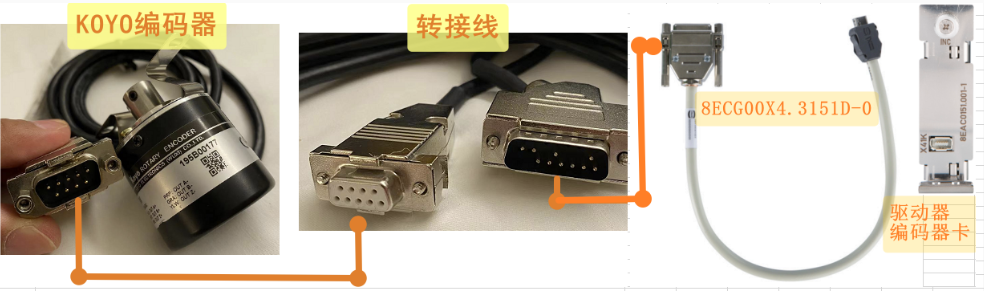 8EAC151.00X-1的参数 ENCOD2_LINE_RESISTANCE 参数已写了4 Ohm （ 注: 若此参数不写或者设置的太小，则报错几率更大 ） 8EAC151.00X-1的ABR信号检测也已关闭  驱动器能够正常获取编码器的信号，但是在运行一段时间之后，会报出7040、7042、7050等故障号。  注：在ACOPOS型号上使用对应的编码器卡，关闭对应ABR相信号检查，能够正常使用。  **原因** 1. KOYO编码器的内部的接线错误，检查编码器接线，看到678三根接到987上，导致B相信号的互补信号丢失，抗干扰能力变差。   2. 使用的转接线较长，且使用两次转接线，会导致电压降低，抗干扰能力差。  **解决方式** 对应原因1： 重新改正编码器接线后，能够在原接线方式“ KOYO编码器 — 第三方转接线 — 官方短线 — 驱动器编码器卡 ”上正常使用，且不需要设置ENCOD2_LINE_RESISTANCE。  对应原因2： 在不修正编码器接线的情况下，外接编码器9 PIN 口改为15 PIN口，不使用第三方转接线，直接通过官方转接线与编码器卡连接，长时间运行，不会再报出错误。   |
| 2023.07.05 **现象** 当下载程序时，提示报错7040、39049 **问题原因** 与干扰有关，因此报警仅在一条线路上出现，建议更换线缆                                                                                                                                                                                                                                                                                                                                                                                                                                                                                                                                                                                                                                                                                                                                                                                                                                                                                                                                                                                                                                                                                            |

## 7041：增量编码器：电缆干扰轨道 R

描述：

带有激活监视器的增量编码器中的运行错误（激活，参见错误编号 [7030](#7030编码器增量信号幅度太大)). 信号 R 和 nR 不相互补充。

查看错误编号 [7039](#7039增量编码器电缆干扰轨迹-a).

反应：

查看错误编号 [7030](#7030编码器增量信号幅度太大).

原因/补救措施：

查看错误编号 [7039](#7039增量编码器电缆干扰轨迹-a).

如果编码器不支持参考脉冲并且它们不是必需的，则可以通过设置 ENCODX_LINE_CHK_IGNORE 的位 1 来禁用参考脉冲监视器.

| 应用案例                                                                                                                                                                                                                                                                                                                                      |
|-----------------------------------------------------------------------------------------------------------------------------------------------------------------------------------------------------------------------------------------------------------------------------------------------------------------------------------------------|
| 2023.03.22 **现象** 新设备，上电就报5034报警，使用AS的Test复位后报29226，再复位报7041，依次循环 **原因** 驱动器ACOPOS使用外接编码器8AC123.60-1，使用转接线，转接线针脚缺失，导致编码器卡的PIN 14,15没有接线   **解决方式** 更换编码器转接线缆   |

## 7042：增量编码器：正交信号的边缘距离太小

描述：

带有激活监视器的增量编码器中的运行错误（激活，参见错误编号 [7030](#7030编码器增量信号幅度太大)).评估正交信号（A/B 增量编码器信号）的每个边沿。 未达到两个边缘之间的时间间隔的限制值。

反应：

查看错误编号 [7030](#7030编码器增量信号幅度太大).

原因/补救措施：

编码器速度太高。

最大限度。 计数器频率 (ENCOD_OUTPUT_FREQUENCY) 设置为低（8BAC0123.00x-1 和 80VD100PD.C144-01）。

编码器连接中断或损坏。 请参阅接线指南错误编号 [7030](#7030编码器增量信号幅度太大).

信号A和B之间的相移不等于90度

编码器振动。

编码器故障。

插卡故障.

| 应用案例                                                                                                                                                                                                                                                                                                                                                                                                                                                                                                                                                                                                                                                                                                                                                                                                                                                                                                                                                                                                                                                                                                                                                                                                           |
|--------------------------------------------------------------------------------------------------------------------------------------------------------------------------------------------------------------------------------------------------------------------------------------------------------------------------------------------------------------------------------------------------------------------------------------------------------------------------------------------------------------------------------------------------------------------------------------------------------------------------------------------------------------------------------------------------------------------------------------------------------------------------------------------------------------------------------------------------------------------------------------------------------------------------------------------------------------------------------------------------------------------------------------------------------------------------------------------------------------------------------------------------------------------------------------------------------------------|
| 2023.03.22 **现象** 用手转动电机，就报警7042.而且正转时候，编码器卡的Up Down同时亮，反转时候只有Down亮。正常应该是一个方向只有一个指示灯亮。 **解决方式** 经检查，是其中三相异步电机的A相线鼻子端子做得不好，引起接触不好。重新压制，故障解决                                                                                                                                                                                                                                                                                                                                                                                                                                                                                                                                                                                                                                                                                                                                                                                                                                                                                                                                                                      |
| 2023.06.28 **故障号** 7040、7042、7050 **现象** 使用ACOPOS P3 + 8EAC151.00X-1 对接外接增量式编码器，其中使用了两根转接线，一根为官方转接线8ECG00X4.3151D-0，一根为第三方转接线，连接方式如下图:  8EAC151.00X-1的参数 ENCOD2_LINE_RESISTANCE 参数已写了4 Ohm （ 注: 若此参数不写或者设置的太小，则报错几率更大 ） 8EAC151.00X-1的ABR信号检测也已关闭  驱动器能够正常获取编码器的信号，但是在运行一段时间之后，会报出7040、7042、7050等故障号。  注：在ACOPOS型号上使用对应的编码器卡，关闭对应ABR相信号检查，能够正常使用。  **原因** 1. KOYO编码器的内部的接线错误，检查编码器接线，看到678三根接到987上，导致B相信号的互补信号丢失，抗干扰能力变差。   2. 使用的转接线较长，且使用两次转接线，会导致电压降低，抗干扰能力差。  **解决方式** 对应原因1： 重新改正编码器接线后，能够在原接线方式“ KOYO编码器 — 第三方转接线 — 官方短线 — 驱动器编码器卡 ”上正常使用，且不需要设置ENCOD2_LINE_RESISTANCE。  对应原因2： 在不修正编码器接线的情况下，外接编码器9 PIN 口改为15 PIN口，不使用第三方转接线，直接通过官方转接线与编码器卡连接，长时间运行，不会再报出错误。   |

## 7043：编码器：电缆干扰轨道 D

描述：

带有激活监视器的 SSI 编码器中的运行时错误（激活，参见错误编号 [7030](#7030编码器增量信号幅度太大)). 信号 D 和 nD 不相互补充。

查看错误编号 [7039](#7039增量编码器电缆干扰轨迹-a).

反应：

查看错误编号 [7030](#7030编码器增量信号幅度太大).

原因/补救措施：

查看错误编号 [7039](#7039增量编码器电缆干扰轨迹-a).

## 7044：编码器：奇偶校验

描述：

带有激活监视器的编码器中的运行错误（激活，参见错误编号 [7030](#7030编码器增量信号幅度太大)). 传送的奇偶校验位与确定的奇偶校验位不匹配。 确定的奇偶校验位由读取的数据位和定义的 PARITY_MODE 之和的 LSB 得出。

反应：

查看错误编号 [7030](#7030编码器增量信号幅度太大).

原因/补救措施：

PARITY_MODE 参数的配置与编码器规格不符（检查编码器数据表）。

编码器连接中断或损坏。 请参阅接线指南错误编号 [7030](#7030编码器增量信号幅度太大).

编码器故障。

AC123 插卡故障.

## 7045：旋转变压器：信号干扰（合理性检查）

描述：

具有激活监视器的解析器中的运行时错误（激活，请参阅错误编号 [7030](#7030编码器增量信号幅度太大)).解析器位置的确定加速度大于允许的最大加速度 ENCODX_A_LIM。

反应：

查看错误编号 [7030](#7030编码器增量信号幅度太大).

原因/补救措施：

最大加速度 ENCODX_A_LIM 的配置过于严格。

解析器连接中断或有缺陷。 请参阅接线指南错误编号 [7030](#7030编码器增量信号幅度太大).

Resolver不符合AC122插卡规格。

未连接解析器。

解析器故障。

AC122 插卡故障.

## 7046：旋转变压器：电缆干扰

描述：

具有激活监视器的解析器中的运行时错误（激活，请参阅错误编号 [7030](#7030编码器增量信号幅度太大)). 在旋转变压器评估电路中的正弦/余弦信号之间进行矢量比较。 如果偏差过大，则会输出错误。 监视器的正确运行很大程度上取决于输入阻抗和旋转变压器的电压比。

反应：

查看错误编号 [7030](#7030编码器增量信号幅度太大).

原因/补救措施：

查看错误编号 [7045](#7045旋转变压器信号干扰合理性检查).

如果旋转变压器不符合 AC122 插卡的规格，可以通过设置 ENCODX_LINE_CHK_IGNORE 的位 0 来禁用电缆干扰的监控。

注意：当发生“真正的”解析器错误时，这可能会导致不受控制的运动。

8AC122.60-1 插卡不支持此错误.

## 7047：无效的参考标记距离

描述：

使用距离编码参考标记进行参考时出现运行时错误。 两个参考标记之间的距离为 0 或大于参考标记 ENCODX_REF_DCM_DISTANCE 的一般距离。

反应：

查看错误编号 [5035](#5035未检测到参考标记).

原因/补救措施：

配置的一般距离与编码器参考标记的一般距离不匹配（检查编码器数据表）。

参考信号编码器连接中断或有缺陷（参见接线指南错误编号 [7030](#7030编码器增量信号幅度太大)).

编码器不支持参考标记（检查编码器数据表）。

编码器参考信号不符合插入卡的规格（检查编码器数据表）。

编码器测量不再干净。

编码器故障。

AC120、AC123或AC130插卡缺陷.

## 7048：读取编码器存储器时出错

[描述：](#7030编码器增量信号幅度太大)

带有激活监视器的编码器中的运行错误（激活，参见错误编号[7030](#7030编码器增量信号幅度太大)).在读取编码器内存期间发生了太多数据传输错误。

反应：

编码器初始化中止。

查看错误编号 [7030](#7030编码器增量信号幅度太大).

原因/补救措施：

只有通过 SW 复位才能清除编码器错误。

另请参阅错误编号 [7015](#7015编码器数据传输期间超时错误).

| 应用案例                                                                                                                                                                                                                                                                                                                                                                                                                                                                                                                                                                                                                                                                                                  |
|-----------------------------------------------------------------------------------------------------------------------------------------------------------------------------------------------------------------------------------------------------------------------------------------------------------------------------------------------------------------------------------------------------------------------------------------------------------------------------------------------------------------------------------------------------------------------------------------------------------------------------------------------------------------------------------------------------------|
| 2023.03.21 **现象** 随机出现7022、7038、7014、7048 **原因** ACOPOSmulti的Endat连接器的插座上的螺丝没有拧紧                                                                                                                                                                                                                                                                                                                                                                                                                                                                                                                                                 |
| 2023.03.21 **现象** 电机报错7022、7048、9003、9000，其它电机报错64006。随后所有使用HomeRestore的电机相位丢失 **原因** 使用了Home Restore Position功能 偶发的Permanent变量丢失问题会导致HomeRestore异常 **解决方式** 需要重新标定零点  若重新标定零点无法接受，可以考虑以下方案: InitEndlessPosition的问题是，当你丢失了永久保持变量或者掉电保持变量，位置的数据丢失了，必须重新进行Home。 为了避免这种情况，可以将MC_ENDLESS_POSITION不断存储到一个文件中。启动后，如果永久变量为空，在执行归位恢复模式（homing restore position mode）前，可以将文件中的那些数据写入MC_ENDLESS_POSITION变量。 可以将轴的整个永久保持变量数据结构体包括校验和备份到文件或DataObj中。需要注意的是，整个内存都被完整复制。  |

## 7049：编码器电流消耗异常

描述：

编码器功耗已降至指定水平以下。

反应：

查看错误编号 [7030](#7030编码器增量信号幅度太大).

原因/补救措施：

如果编码器由外部供电，则必须关闭此监控。 见参数 PARID_ENCOD_LINE_CHK_IGNORE. Guid：ed36d853-f25d-483f-9ab1-714cd0a78dab

无编码器电源或电源包含错误。

\+5V、+24V 或 COM 未连接。

请参阅接线指南错误编号 [7030](#7030编码器增量信号幅度太大).

编码器/模块损坏。

编码器功耗 \< 150mW (5V)

编码器功耗 \< 200mW (24V))

## 7050：增量编码器：AB 信号非法改变

描述：

带有激活监视器的增量/正余弦编码器中的运行错误（激活，参见错误编号 [7030](#7030编码器增量信号幅度太大)).

正交信号（AB 增量编码器信号/SinCos 编码器信号）的非法更改。

对于具有 SinCos 类似信号的编码器，正交信号对应于单位圆的象限。

反应：

查看错误编号 [7030](#7030编码器增量信号幅度太大).

原因/补救措施：

编码器速度太高。

编码器连接中断或损坏。 请参阅接线指南错误编号 [7030](#7030编码器增量信号幅度太大).

信号A和B之间的相移不等于90度

编码器振动。

编码器/模块损坏.

| 应用案例                                                                                                                                                                                                                                                                                                                                                                                                                                                                                                                                                                                                                                                                                                                                                                                                                                                                                                                                                                                                                                                                                                                                                                                                           |
|--------------------------------------------------------------------------------------------------------------------------------------------------------------------------------------------------------------------------------------------------------------------------------------------------------------------------------------------------------------------------------------------------------------------------------------------------------------------------------------------------------------------------------------------------------------------------------------------------------------------------------------------------------------------------------------------------------------------------------------------------------------------------------------------------------------------------------------------------------------------------------------------------------------------------------------------------------------------------------------------------------------------------------------------------------------------------------------------------------------------------------------------------------------------------------------------------------------------|
| 2023.06.28 **故障号** 7040、7042、7050 **现象** 使用ACOPOS P3 + 8EAC151.00X-1 对接外接增量式编码器，其中使用了两根转接线，一根为官方转接线8ECG00X4.3151D-0，一根为第三方转接线，连接方式如下图:  8EAC151.00X-1的参数 ENCOD2_LINE_RESISTANCE 参数已写了4 Ohm （ 注: 若此参数不写或者设置的太小，则报错几率更大 ） 8EAC151.00X-1的ABR信号检测也已关闭  驱动器能够正常获取编码器的信号，但是在运行一段时间之后，会报出7040、7042、7050等故障号。  注：在ACOPOS型号上使用对应的编码器卡，关闭对应ABR相信号检查，能够正常使用。  **原因** 1. KOYO编码器的内部的接线错误，检查编码器接线，看到678三根接到987上，导致B相信号的互补信号丢失，抗干扰能力变差。   2. 使用的转接线较长，且使用两次转接线，会导致电压降低，抗干扰能力差。  **解决方式** 对应原因1： 重新改正编码器接线后，能够在原接线方式“ KOYO编码器 — 第三方转接线 — 官方短线 — 驱动器编码器卡 ”上正常使用，且不需要设置ENCOD2_LINE_RESISTANCE。  对应原因2： 在不修正编码器接线的情况下，外接编码器9 PIN 口改为15 PIN口，不使用第三方转接线，直接通过官方转接线与编码器卡连接，长时间运行，不会再报出错误。   |

## 7051：编码器：加速度太大（干扰）

描述：

带有激活监视器的编码器中的运行错误（激活，参见错误编号 [7030](#7030编码器增量信号幅度太大)).

多圈编码器上的转数计数器使用加速度监视器来监控其真实性。

如果在800μs区间内位置差大于一圈，

那么假设一个革命跳跃。

反应：

查看错误编号 [7030](#7030编码器增量信号幅度太大).

原因/补救措施：

编码器速度太高。

编码器连接中断或损坏。

编码器配置不正确。

编码器故障。.

| 应用案例                                                                                                                                                                                                                                                                                                                                                   |
|------------------------------------------------------------------------------------------------------------------------------------------------------------------------------------------------------------------------------------------------------------------------------------------------------------------------------------------------------------|
| 2023.03.22 **现象** 手动转动多圈 SSI 编码器，每次都会出现反馈数据上的跳变，因而出现7051 报警 **原因** 现场工况为驱动器断使能后电机迅速反转，电磁刹车随后投入，从而对编码器造成较大冲击,同时期间也检测到多次超过编码器最大允许速度的情况。  该问题也反映出 SSI 编码器并不太适合在此类工况上使用，相比较旋变则更为适合。 **解决方式** 编码器损坏，更换编码器 |

## 7052：编码器：编码器不支持

描述：

编码器中的运行时错误。

无法处理编码器数据。

反应：

编码器初始化中止。

原因/补救措施：

编码器不被支持.

## 7053：编码器：电源故障

描述：

编码器电源中的运行错误。

反应：

输入/输出设置为错误状态（无法再保证供电）。

原因/补救措施：

检查电源控制。

电源过载或故障。

电源故障。

电源连接缺陷（线路开路、线路终端、接线错误、保险丝）。

传感器电源短路。

插卡缺陷.

## 7054：编码器：已定义通道中的位置

描述：

写入参数时响应错误。

反应：

没有任何

原因/补救措施：

有人尝试创建类型为 ncSSI_CONT_TYP_POS 的第二个内容。

编码器配置不正确.

## 7055：编码器：无效的内容类型“帧结束”

描述：

写入参数时响应错误。

反应：

没有任何

原因/补救措施：

无效的“帧结束”内容类型。

对于类型为 ncSSI_CONT_TYP_END 的内容，尝试设置参数

ENCODx_SSI_ZERO_BITS、ENCODx_SSI_BITS 或 ENCODx_SSI_TRAIL_BITS。

编码器配置不正确.

## 7057：编码器：寄存器读/写禁止或未实现

描述：

访问编码器存储器时 BiSS 编码器的响应错误

反应：

没有任何

原因/补救措施：

不允许对所选寄存器进行读/写访问。

所选内存不可用。

请参阅编码器文档.

## 7058：编码器：设置了警报位

描述：

编码器的运行时错误。 如果测量系统的故障会导致位置值不正确，则会设置警报。

反应：

当警报处于活动状态时，不执行参考命令。

原因/补救措施：

报警位由编码器设置。

请参阅编码器文档.

| **应用案例**                                                    |
|-----------------------------------------------------------------|
| 2023.03.22 编码器线缆松动、干扰或直线电机编码器光栅读头存在干扰 |

## 7059：虚拟编码器：错误状态

描述：

ENCOD0_STATUS_PARID 的值不等于 0 时的运行时错误。

看 Encoder interface: Virtual Encoder Guid：0432809d-70c5-493e-bd9c-1b5bfdc6d3d2

反应：

查看错误编号 [7030](#7030编码器增量信号幅度太大).

原因/补救措施：

## 7060：虚拟编码器：转换错误

描述:

看 Encoder interface: Virtual Encoder Guid：0432809d-70c5-493e-bd9c-1b5bfdc6d3d2

反应:

看错误码 [7030](#7030编码器增量信号幅度太大).

原因/补救措施

## 7061：虚拟编码器：失速检测

描述：

触发失速检测时的运行时错误。.

看 Encoder interface: Virtual Encoder Guid：0432809d-70c5-493e-bd9c-1b5bfdc6d3d2

反应：

查看错误编号 [7030](#7030编码器增量信号幅度太大).

原因/补救措施：

## 7062：编码器：SafeMOTION 模块未准备好

描述：

编码器与 SafeMOTION 模块的运行错误。

反应：

没有任何

原因/补救措施：

SafeMOTION 模块未就绪。

可以从记录器中输入的详细信息中确定确切原因.

## 7063：编码器：UART 通信错误

描述：

编码器与 SafeMOTION 模块的运行错误。

反应：

没有任何

原因/补救措施：

可以从记录器中输入的详细信息中确定确切原因.

## 7064：编码器：SafeMOTION 通信错误

描述：

编码器与 SafeMOTION 模块的运行错误。

反应：

没有任何

原因/补救措施：

可以从记录器中输入的详细信息中确定确切原因.

## 7065：编码器：编码类型无效

描述：

带有激活监视器的编码器中的运行错误（激活，参见错误编号 [7030](#7030编码器增量信号幅度太大)).

反应：

没有任何

原因/补救措施：

编码器类型（参数 id ENCOD_TYPE）未设置或设置不正确.

## 7066：编码器：编码器未准备好

描述：

带有 Safe MC 和激活的监视器的编码器中的运行错误（激活，参见错误编号 [7030](#7030编码器增量信号幅度太大)).

反应：

编码器初始化中止。

另请参阅错误编号 [7030](#7030编码器增量信号幅度太大).

原因/补救措施：

已超过 SafeMOTION 初始化的超时时间。

只有通过 SW 复位才能清除编码器错误.

## 7067：编码器：SafeMOTION 模块未处于运行状态

描述：

编码器与 SafeMOTION 模块的运行错误。

反应：

没有任何

原因/补救措施：

可以从记录器中输入的详细信息中确定确切原因.

## 7068：编码器：超出最大循环时间

描述：

使用时间信息时虚拟编码器中的运行时错误。 已超过预定义的最大循环时间。

反应：

没有任何

原因/补救措施：

网络上的信息流已中断。

组态的最大循环时间太小。

配置的数据点不正确，或时间信息不符合要求的标准（参见编码器接口文档）.

## 7069：编码器：编码器错误过滤器激活

描述：

已激活错误过滤器的编码器中的运行时错误。 发生编码器错误。

反应：

错误响应会延迟编码器错误过滤时间。

原因/补救措施：

原因可以由其他错误消息确定.

## 7070：编码器：超出滞后错误停止限制

描述：

编码器/设置值跟踪器激活时的运行错误。 滞后误差 PCTRL_LAG_ERROR 的绝对值超过限制值 ENCOD0_DS_STOP。

反应：

切换到设置值跟踪器

原因/补救措施：

位置检测错误。

错误限制太小 (ENCOD0_DS_STOP)。

其他原因见错误号 [4007](#4007超出滞后错误停止限制).

## 7071：编码器：超出限制速度错误

描述：

编码器/设置值跟踪器激活时的运行错误。 速度误差 SCTRL_SPEED_ERROR 的绝对值超过了 ENCOD0_DV_STOP 限值。

反应：

切换到设置值跟踪器

原因/补救措施：

位置检测错误。

错误限制太小 (ENCOD0_DV_STOP)。

其他原因见错误号 [6062](#6062ctrl-速度控制器超出速度错误停止限制).

## 7072：编码器：超出传输时间位置

描述：

所需的传输时间太长（BiSS 或 SSI 编码器）。

反应：

没有任何

原因/补救措施：

ENCOD_BAUDRATE 的参数化不正确。

控制器级联循环时间太小.

## 7073：编码器：多圈故障

描述：

带有激活监视器的编码器中的运行错误（激活，参见错误编号 [7030](#7030编码器增量信号幅度太大)).

反应：

没有任何

原因/补救措施：

处理位置时出错.

## 7074：编码器：SafeMOTION 错误

描述：

带有激活监视器的编码器中的运行错误（激活，参见错误编号 [7030](#7030编码器增量信号幅度太大)).

不同错误的分组消息。

反应：

没有任何

原因/补救措施：

请参阅另外输入的错误消息。

可能的其他错误消息：

\- 错误编号 [7064](#7064编码器safemotion-通信错误)

\- 错误编号 [7053](#7053编码器电源故障)

\- 错误编号 [7085](#7085编码器safemotion-未初始化)

\- 错误编号 [7062](#7062编码器safemotion-模块未准备好)

\- 错误编号 [7077](#7077编码器safemotion-配置阻止了编码器评估)

\- 错误编号 [7075](#7075编码器配置编码器类型不正确)

\- 错误编号 [7095](#7095编码器safemotion-固件不支持编码器类型)

\- 错误编号 [7067](#7067编码器safemotion-模块未处于运行状态)

## 7075：编码器：配置编码器类型不正确

描述：

编码器接口的配置（“接口类型”）与 SafeDESIGNER 中的配置不匹配。

反应：

没有任何

原因/补救措施：

ParID ENCOD_TYPE 的配置不正确。

SafeDESIGNER 中编码器接口的配置不正确（“未使用编码器”/“使用编码器”）.

## 7076：编码器：数据传输激活

描述：

如果从电机到驱动器的编码器数据传输处于活动状态，则写入参数时出现响应错误。

反应：

不接受参数值。

原因/补救措施：

仅当通用状态（参数 STATUS_BITS）中的以下位等于 0 时才允许写入。

\- Bit5：编码器初始化激活

## 7077：编码器：SafeMOTION 配置阻止了编码器评估

描述：

编码器接口的配置（“接口类型”）与 SafeDESIGNER 中的配置不匹配。

反应：

没有任何

原因/补救措施：

SafeDESIGNER 中编码器接口的配置不正确（“未使用编码器”/“使用编码器”）。

另请参阅错误编号 [7064](#7064编码器safemotion-通信错误) 与错误编码 [7067](#7067编码器safemotion-模块未处于运行状态).

## 7078：编码器：段间通信失败

描述：

如果 ISC 连接在传输编码器数据时报告错误，则出现运行时错误。

信息显示错误的 ISC 连接：

1 ... X3A / ISC1

2 ... X3B / ISC2

反应：

编码器评估中止/编码器更改为错误状态。

运动中止。

班车信息被删除。

原因/补救措施：

段间通信中断：检查ISC的连接。.

## 7079：编码器：内部错误

描述：

发生内部编码器评估错误。

反应：

ACOPOStrak：

编码器评估中止/编码器更改为错误状态。

运动中止。

班车信息被删除。

原因/补救措施：

ACOPOStrak：

\- 信息 4：

在没有 ISC 的穿梭传输区域中的编码器初始化期间出错（例如移动到转向器中）。

没有 ISC 的穿梭传输区域的滞后误差必须小于 4 毫米，以确保正确放置在受影响的段上。

检查受影响区域中线段的对齐情况。

检查滞后错误和控制器设置.

## 7080：编码器：编码器通讯错误

描述：

带有激活监视器的编码器中的运行错误（激活，参见错误编号 [7030](#7030编码器增量信号幅度太大)).

数据或位置传输期间发生错误。

此错误与以下错误之一一起报告：7014、7015、7044、39048、39060、39061。

反应：

没有任何

原因/补救措施：

可以从附加传输的错误消息中读取原因.

## 7081：编码器：初始化期间超时

描述：

带有激活监视器的编码器中的运行错误（激活，参见错误编号 [7030](#7030编码器增量信号幅度太大)).

初始化期间发生超时错误。

反应：

没有任何

原因/补救措施：

查看错误编号 [7022](#7022编码器初始化处于活动状态).

| 应用案例                                                                                                                                |
|-----------------------------------------------------------------------------------------------------------------------------------------|
| 2022.02.14 **现象：** 电机PowerOn时Resolver编码器报警7081、7032、6057。 **解决方案：** 排查线缆、编码器卡问题，最后确认电机编码器故障。 |

## 7082：编码器：到编码器的链接被干扰

描述：

没有连接到编码器，或者由于传输错误导致连接错误。

反应：

查看错误编号 [7030](#7030编码器增量信号幅度太大).

原因/补救措施：

编码器连接中断或损坏。 请参阅接线指南错误编号 [7030](#7030编码器增量信号幅度太大)。

编码器/模块损坏.

## 7083：参考脉冲监控：位置、分辨率或参考脉冲错误

描述：

增量参考脉冲监视器激活时的运行错误。 两个参考脉冲之间的距离在有效范围之外。

反应：

没有任何

原因/补救措施：

将参考脉冲监视器的配置（脉冲宽度、脉冲间隔、观察窗口和模式）与编码器数据表进行比较。

另请参阅错误编号 [7047](#7047无效的参考标记距离).

## 7084：编码器：位置评估错误

描述：

带有激活监视器的增量编码器中的运行错误（激活，参见错误编号 [7030](#7030编码器增量信号幅度太大)).

在位置形成中它出现了错误。

反应：

查看错误编号 [7030](#7030编码器增量信号幅度太大).

原因/补救措施：

编码器速度或加速度太高。

编码器连接中断或损坏。 请参阅接线指南错误编号 7030。

编码器振动。

编码器故障。

插卡故障.

## 7085：编码器：SafeMOTION 未初始化

描述：

编码器与 SafeMOTION 模块的运行错误。

反应：

没有任何

原因/补救措施：

SafeMOTION 模块未初始化。

可以从记录器中输入的详细信息中确定确切原因.

## 7086：编码器仿真：电源故障

描述：

编码器仿真电源电压的运行时错误。

反应：

无法再保证输出的供应。

原因/补救措施：

插卡故障。

A - A\\, B - B\\ 和 R - R\\ 之间短路.

## 7087：编码器仿真：网络连接中断

描述：

编码器仿真的网络连接中的运行时错误。

反应：

编码器仿真的输出被禁用。

原因/补救措施：

查看错误编号 [1012](#1012循环网络通信的崩溃).

## 7089：编码器：HIPERFACE DSL：在线状态：位 2：QMLW：质量监视器。 低级

描述：

此状态由 HIPERFACE DSL?Master IP-Core 报告。 更多信息可以在编码器数据表或 HIPERFACE DSL? 规范中找到。

摘自 HIPERFACE DSL? 在线状态位 2 规范：

质量监控当前值小于14。

反应：

查看错误编号 [7030](#7030编码器增量信号幅度太大).

原因/补救措施：

请参阅编码器数据表或 HIPERFACE DSL？规范.

## 7090：编码器：HIPERFACE DSL：在线状态：位 3：FIX0：位不是“0”

描述：

此状态由 HIPERFACE DSL?Master IP-Core 报告。 更多信息可以在编码器数据表或 HIPERFACE DSL? 规范中找到。

摘自 HIPERFACE DSL? 在线状态位 3 规范：

该位总是给出“0”。 对于 SPI 接口，这用于检查 spi_miso 引脚是否存在卡在“1”故障。

反应：

查看错误编号 [7030](#7030编码器增量信号幅度太大).

原因/补救措施：

请参阅编码器数据表或 HIPERFACE DSL? 规范。.

## 7091：编码器：HIPERFACE DSL：在线状态：位 8：PRST：协议重置

描述：

此状态由 HIPERFACE DSL?Master IP-Core 报告。 更多信息可以在编码器数据表或 HIPERFACE DSL? 规范中找到。

摘自 HIPERFACE DSL? 在线状态位 8 的规范：

IP-Core 已重新启动协议。

反应：

查看错误编号 [7030](#7030编码器增量信号幅度太大).

原因/补救措施：

请参阅编码器数据表或 HIPERFACE DSL？规范.

## 7092：编码器：HIPERFACE DSL：在线状态：位 9：DTE：偏差阈值错误

描述：

此状态由 HIPERFACE DSL?Master IP-Core 报告。 更多信息可以在编码器数据表或 HIPERFACE DSL? 规范中找到。

摘自 HIPERFACE DSL? 在线状态位 9 的规范：

当前偏差值大于指定的最大值。

反应：

查看错误编号 [7030](#7030编码器增量信号幅度太大).

原因/补救措施：

请参阅编码器数据表或 HIPERFACE DSL？规范.

## 7093：编码器：HIPERFACE DSL：在线状态：位 12：FIX1：位不是“1”

描述：

此状态由 HIPERFACE DSL?Master IP-Core 报告。 更多信息可以在编码器数据表或 HIPERFACE DSL? 规范中找到。

摘自 HIPERFACE DSL? 在线状态位 12 的规范：

该位总是给出“1”。 对于 SPI 接口，这用于检查 spi_miso 引脚是否存在卡在“0”的故障。

反应：

查看错误编号 [7030](#7030编码器增量信号幅度太大).

原因/补救措施：

请参阅编码器数据表或 HIPERFACE DSL？规范.

## 7094：编码器：HIPERFACE DSL：在线状态：位 14：SUM：摘要字节编码。 地位

描述：

此状态由 HIPERFACE DSL?Master IP-Core 报告。 更多信息可以在编码器数据表或 HIPERFACE DSL? 规范中找到。

摘自 HIPERFACE DSL? 在线状态位 14 的规范：

总结的最后一个有效值不为零。 此标志的重要性取决于导致设置概要的特定错误源。

反应：

查看错误编号 [7030](#7030编码器增量信号幅度太大).

原因/补救措施：

请参阅编码器数据表或 HIPERFACE DSL？规范.

## 7095：编码器：SafeMOTION 固件不支持编码器类型

描述：

配置的 SafeMOTION 固件不支持配置的编码器类型。

反应：

没有任何

原因/补救措施：

编码器接口或 SafeMOTION 固件配置不正确。

另请参阅错误编号 [7064](#7064编码器safemotion-通信错误) 和错误号 7067。

## 7100：参数功能不支持

描述：

写入不受支持的参数时出现响应错误。

反应：

参数未设置或函数未执行。

原因/补救措施：

未配置编码器。

编码器类型、插卡或设备不支持该参数。

插卡未插入、损坏或不支持。

另请参阅错误编号 [1002](#1002参数超出有效范围).

| 应用案例                                                                                                                                                                                                                                                                                                           |
|--------------------------------------------------------------------------------------------------------------------------------------------------------------------------------------------------------------------------------------------------------------------------------------------------------------------|
| 2023.02.14 muti逆变模块编码器卡（Slot1）信号异常，报错7100。 解决方案：推测可能是编码器卡或者线的问题。将右边正常的编码器卡与左边编码器卡拆卸后互换位置和编码器线。最后发现是电柜装配时编码器卡本身没有插到最底（测试时看不出没插到最底部）导致编码器卡接触不良。   |
| 2023.03.23 **现象** 外接编码器通过8EAC0151接收外部增量编码器数值，上电后驱动器报错32144和7100。 **原因** 不只在8EAC0151的硬件配置中设置了编码器一圈的脉冲数，也在参数表中对ID289进行了设置。 **解决方式** 这个设置在ACOPOS中没有问题，但是在P3里面，只在8EAC0151的硬件配置中即可，ID289不用再设置。                |
|                                                                                                                                                                                                                                                                                                                    |

## 7103：接口不兼容

描述：

软件版本与第二个组件（软件或硬件）不兼容。

信息字节 0：接口

INFO 字节 1：附加信息 1

INFO 字节 2：附加信息 2

界面：

0x00-0x0F：插槽

0x10：ACP/SMC-Com

附加信息1：

0x00-0x0F：版本

附加信息2：

0x01-0xFF：硬件 ID

反应：

不支持组件及其功能。

原因/补救措施：

这些组件之一的软件版本不兼容。

更新软件版本或更换硬件.

## 7104：初始化中止

描述：

由于错误，初始化被中止。

反应：

硬件无法使用。

原因/补救措施：

插件模块有缺陷.

## 7200：直流母线：过压

描述：

如果 DC 总线电压 UDC_ACT 超过模块相关的限制电压，则控制器处于活动状态时的运行时错误。

\|----------------------------\|---------------------------------------------------\|

\| 8Vxxxx.00-x \|\~ 900VDC \|

\| 8Vxxxx.50-x \|\~ 450VDC \|

\| 8B \|\~ 900VDC (UDC_OVMON_CTRL_OFF_LIM) \|

\| 8C \|\~ 900VDC (UDC_OVMON_CTRL_OFF_LIM) \|

\| 8D \|\~ 900VDC (UDC_OVMON_CTRL_OFF_LIM) \|

\| 8EIxxxHxxxx.xxxx-x \|\~ 875VDC \|

\| 8EIxxxMxxxx.xxxx-x \|\~ 450VDC \|

\| 80 \|\~ 95VDC (UDC_OVMON_CTRL_OFF_LIM) \|

\|----------------------------\|---------------------------------------------------\|

反应：

8Vxxxx.00-x、8Vxxxx.50-x、8BVI、8CVI、80V、8DI：

如果直流总线电压在 AXLIM_T_STOP_END 时间内下降到模块相关的限制电压以下，则运动停止并通过短路制动停止，没有电流限制。

设置 STOP_ERR_DECEL_RAMP=ncCTRL_OFF：

通过立即关闭控制器和电源部分来中止运动。驱动器没有电气扭矩。

原因/补救措施：

看 Power unit Guid：5d7b1758-8ae0-4bef-8a82-f2b8b1017926

**制动电阻未激活：**

在发电机运行中，检查记录的直流母线电压 (UDC_ACT) 在超过制动电阻的接通电压 (UDC_ACT \> UDC_BLEEDER_ON) 时是否不平稳。

\- 制动电阻的控制有缺陷。 -\> 更换 ACOPOS 模块

\- 继电器泄放器（intern/extern）有缺陷。 -\> 更换 ACOPOS 模块

\- 外部制动电阻的保险丝损坏。 -\> 检查或切换保险丝

\- 内部或外部制动电阻器损坏或未连接。 -\> 更换 ACOPOS 模块或制动电阻器。 测量插头上的制动电阻并与数据表进行比较。 -\> 检查外部制动电阻的接线。 注意：遵守安全规定。

\- 8B0Pxxxxxxxx.xxx-x：控制器未开启

**主电源干扰：**

\- 电源电压或直流母线电压过高。 -\> 检查直流母线电压.

| 应用案例                                                                                                                                                                                                                        |
|---------------------------------------------------------------------------------------------------------------------------------------------------------------------------------------------------------------------------------|
| 2023.03.23 **现象** ACOPOS 1180 在整机同步状态下由100RPM加速到150RPMS时出现报错 报7211，4007，7200，9300 在实际测试过程中测量DC BUS电压，发现此驱动器的偏低 **原因** 可能为1180驱动器内部整流模块故障。 **解决方式** 更换驱动器 |
| 2023.03.23 **现象** 运行中报以下错误 7200: DC bus: Overvoltage (超过驱动器极限阈值） 7225: DC bus: Overvoltage (超过用户设置阈值) **解决方式** 需要接外部制动电阻                                                               |

## 7210：直流母线：预充电：电压不稳定

描述：

使用“打开控制器”命令时出现运行时错误。

主继电器打开。

无法检测到有效的标称直流总线电压 UDC_NOMINAL。

滤波后的直流母线电压UDC_FILTER的变化率大于62.5 VDC/s。

滤波后的直流母线电压UDC_FILTER的变化率小于-6.25 VDC/s。

过滤后的直流母线电压 UDC_FILTER 偶尔会下降到最小截止电压 0.9\*MAX(UDC_NOMINAL, UDC_DETECTION) 以下。

过滤后的直流母线电压 UDC_FILTER 偶尔会超过限制电压：

\|---------------------------\|-----------------------------------------\|

\| 8Vxxxx.00-x \| 746 VDC (1.1\*sqrt(2)\*480VAC) \|

\| 8Vxxxx.50-x \| 357 VDC (1.1\*sqrt(2)\*230VAC) \|

\| 8BxP \| 746 VDC (1.1\*sqrt(2)\*480VAC) \|

\| 8C \| 880 VDC \|

\| 8D \| 880 VDC \|

\| 8EIxxxHxxxx.xxxx-x \| 825 VDC \|

\| 8EIxxxMxxxx.xxxx-x \| 358 VDC \|

\| 80 \| 88 VDC \|

\|----------------------------\|-----------------------------------------\|

反应：

查看错误编号 [4005](#4005控制器无法开启驱动处于错误状态).

原因/补救措施：

看 Power unit Guid：5d7b1758-8ae0-4bef-8a82-f2b8b1017926

\-\> 在命令“打开控制器”之前请求状态“控制器准备好”。

主电源干扰：直流母线电压波动大。 -\> 检查过滤后的直流母线电压 UDC_FILTER.

| 应用案例                                                                                                                                                                                                                                                                                                                                                                          |
|-----------------------------------------------------------------------------------------------------------------------------------------------------------------------------------------------------------------------------------------------------------------------------------------------------------------------------------------------------------------------------------|
| 2023.03.23 接通主电后，若UDC_FILTER变化率\>62.5 Vdc/s，或\<-6.25 Vdc/s, 或UDC_FILTER短暂\<0.9 x Max(UDC_NOMINAL,  UDC_DETECTION), 或短暂超出上限电压，则报7210错误  上限电压（能够完成正常侦测的UDC_ACT的上限，超过则报7217） 8Vx.00-2: 746 Vdc (3x480Vac) 8Vx.50-2: 357 Vdc (3x230Vac) 8EIxHx: 825 (3x480Vac) 8EIxMx: 358 (3x230Vac) 8BxP: 746 (3x480Vac) 8C: 880 8D: 880 80: 88 |

## 7211：直流母线：电压骤降

描述：

如果直流母线电压 UDC_ACT 低于阈值电压 POWERFAIL_DETECT_RATIO \* UDC_NOMINAL，则会出现运行时错误。

8Vxxxx.xx-x：检测到电源相位故障 (STAT_UDC_MON = 16)。

反应：

查看错误编号 [9000](#9000散热器温度传感器超出停止限制).

参数 STAT_UDC_POWERFAIL 设置为值 2。

运动停止期间欠压限制器开启。

原因/补救措施：

看 Power unit Guid：5d7b1758-8ae0-4bef-8a82-f2b8b1017926

主电源干扰：

\- 短暂的电源或相位故障。 -\> 检查运行期间的相电压和直流母线电压是否有短暂的下降。

电源接线错误或电源过载：

\- 电源阻抗高，电源变压器的饱和效应。 -\> 检查直流母线电压UDC_ACT 的包络或电机运行中的相电压是否降低了10% 以上。

\- 接触不良或电源相未连接。 查看错误编号 [7215](#7215电源至少电源线的一相出现故障).

\- 电源缺相。 查看错误编号 [7215](#7215电源至少电源线的一相出现故障).

单相主电源操作：

\- 当电机负载过高时，无法充分支持直流母线电压 UDC_ACT。

\- 标称电压检测问题： -\> 将测量标称直流母线电压 UDC_NOMINAL 与直流母线电压 UDC_ACT 或万用表进行比较。

\- 标称电压初始化问题：-\> 将标称直流母线电压 UDC_NOMINAL 与直流母线电压 UDC_ACT 或万用表进行比较.

| 应用案例                                                                                                                                                                                                                                                                                                                                                                                                                                                                                                                                                                                                                                                                                                                                                                                                                                                                                                                                                                                     |
|----------------------------------------------------------------------------------------------------------------------------------------------------------------------------------------------------------------------------------------------------------------------------------------------------------------------------------------------------------------------------------------------------------------------------------------------------------------------------------------------------------------------------------------------------------------------------------------------------------------------------------------------------------------------------------------------------------------------------------------------------------------------------------------------------------------------------------------------------------------------------------------------------------------------------------------------------------------------------------------------|
| 2022.01.11 7211：DC bus: Voltage dip 电源轴可能已经损坏或者外围电压波动比较大 也有可能是电机烧坏了                                                                                                                                                                                                                                                                                                                                                                                                                                                                                                                                                                                                                                                                                                                                                                                                                                                                                           |
| 2022.01.11 检查380V供电 有时是驱动器损坏                                                                                                                                                                                                                                                                                                                                                                                                                                                                                                                                                                                                                                                                                                                                                                                                                                                                                                                                                     |
| 2022.08.02 ACOPOS案例：有可能是UDC_NOMINAL电压在充电过程中得到的DC BUS电压虚高，自动对ParID390赋值，最终导致POWERFAIL_DETECT_RATIO \* UDC_NOMINAL过高。 解决方式：将ParID 390设置成550（389 \* 1.414） 相关信息可从AS Help GUID：60f3a0eb-93c2-45db-b860-1d8175715bd1 了解 可尝试重新接线，紧固线缆。                                                                                                                                                                                                                                                                                                                                                                                                                                                                                                                                                                                                                                                                                        |
| 2023.02.14 1. 出现以上报警通常大概率会提示掉电停车状态。请务必注意，出现掉电停车后，只能重启PLC来恢复生产状态。 2. 以上报警提示母线电压低，可能与厂务进线380V不稳定，有波动有关系，观察其他机台是否出现。 3. 断电后，检查厂务进线到-\>断路器-\>电抗器-\>8BVF→8BVR→8BVP之间的电缆是否拧紧。 4. 如果出现了其中一个电源出现报警，则也会触发7211。此时重点应该关注电源轴的伺服报警问题。 5. 在“状态”→" 电机状态" 以及“虚轴状态” 查看所有电机，驱动器，电源模块的温度是否在合理范围。如果单独有模块异常，则更换该模块。                                                                                                                                                                                                                                                                                                                                                                                                                                                                           |
| 2023.03.23 **现象** ACOPOS 1180 在整机同步状态下由100RPM加速到150RPMS时出现报错 报7211，4007，7200，9300 在实际测试过程中测量DC BUS电压，发现此驱动器的偏低 **原因** 可能为1180驱动器内部整流模块故障。 **解决方式** 更换驱动器                                                                                                                                                                                                                                                                                                                                                                                                                                                                                                                                                                                                                                                                                                                                                              |
| 2023.03.23 **什么时候会报7211** 在电机运行过程中爆出7211，即意味着DC BUS的当前电压，低于了UDC_NOMINAL \* POWERFAIL_DETECT_RATIO。 POWERFAIL_DETECT_RATIO一般为固定值0.779 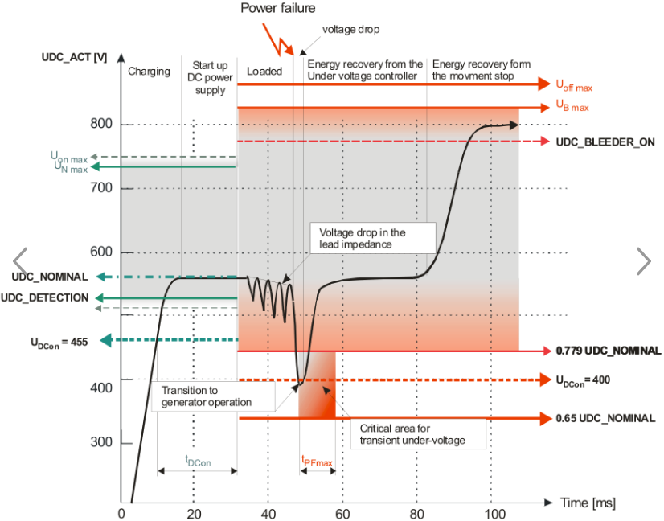  **实际现象** 通过设备高速运行过程中的Trace DC Bus电压，由于带载运动，快速加速导致DC BUS降低，减速会导致DC BUS升高。例如，可见下图现场生产的设备，可发现DC BUS在运动过程中最大值为858V 最低值为508V。 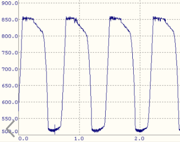 通过现场的数据采集，发现DC BUS Nominal的数值偏高，如果为654，则一旦DC BUS下降至509 （654 \* 0.779 = 509）以下，就会触发7211。 由于此情况正好为整个运动过程中高速运动时的DC BUS最小值，所以与现场的反馈情况正好一致：只有在刚开机，马上快速加速到高速时，才会报出7211错误  **解决方式** 重新接线后无法复现，可以初步判断与接线的松紧有关 可在上电后读取DC BUS nominal的数值，ParID 为 390 理论的  三相相电压。正常合理范围的数值应该在380 \* 1.414 = 537 左右  |
| 2023.03.23 **现象** 现场使用8BVP双电源模块 驱动器报错 7211，9303，41011，7232 设备本体：断路器跳闸，动力电缆温度高达70℃，设备未开机情况下，电流波动大。 单拖电缆供电则不再报警 **原因** 谐振 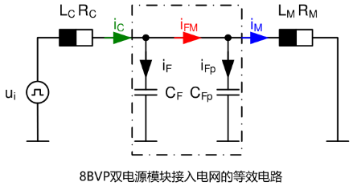  **解决方式** 临时方案：加磁环   **最终解决方案**： 加电抗器，能够有效抑制电网谐波，使得线缆发热的问题得到有效控制； 增加的电抗器出线侧直接供给贝加莱相应的滤波器驱动器等，电抗器后不要再接其他外设设备，外设设备的供电从电抗器前取电；                                                                                                                                                                                                                                                                                                                                                                                                           |
| 2023.03.23 经过持续关注，问题的原因是现场电压有波动                                                                                                                                                                                                                                                                                                                                                                                                                                                                                                                                                                                                                                                                                                                                                                                                                                                                                                                                          |
| 2023.03.23 使用ACOPOSmulti，并使用了电容模块 **现象** 目前拍急停，会将设备的所有380V全断，由于ACOPOS Multi中有电容模块，直接断380V一段时间后（10秒左右），伺服驱动器需要将电容中的电量放完后，才能重新恢复工作，这期间可见电容模块的ERR灯红灯常亮并在复位后驱动器始终显示7211错误码，并无法复位，在最多等待2分30秒后，即可重新复位成功。 **解决方式** 考虑到急停复位后需要立刻能够恢复生产，推荐的拍急停的接线方式为STO接法，通过驱动器的X1端子的ENABLE的供电切断来切换对电机的供电来达到急停效果。                                                                                                                                                                                                                                                                                                                                                                                                                                                                                          |
| 2023.03.25 **接线问题原因与排查方式** 如果客户380V的零线和地线之间存在较大的电压差(100V以上)，我们的驱动在未switch on时会有一个670V以上的虚DC bus电压，这时驱动switch on时会报7211 常用的三相五线制供电系统（TN-S）在电源变压器端，N和PE是短接在一起（然后一起再接大地）的，正常情况下在用电端两者的压差应该较小。 出现大压差，通常是PE线阻抗偏大导致，可能由于PE线径偏小，或者中间连接处接触不良导致。                                                                                                                                                                                                                                                                                                                                                                                                                                                                                                                                                                                      |

## 7212：直流母线：电压骤降大

描述：

控制器处于活动状态时的运行时错误。

直流总线电压 UDC_ACT 下降到截止电压 0.65 \* UDC_NOMINAL 以下。

反应：

主继电器打开。

逆变器功率级关闭。

斩波器功率级关闭。

抱闸已打开。

“控制器就绪”状态被重置。

原因/补救措施：

看 Power unit Guid：5d7b1758-8ae0-4bef-8a82-f2b8b1017926

恢复功率过低：断电后，直流母线网络的恢复功率低于直流母线网络的功率损耗 -\> 检查电源平衡.

## 7214：直流母线：预充电电阻热（电源线故障太多）

描述：

如果使用以下 ACOPOS 模块在 20 秒内至少两次加载直流母线，则运行错误：

\|-----------------------------------------------------------\|

\| 8V1022.00-1 \|

\| 8V1045.00-1 \|

\| 8V1090.00-1 \|

\| 8V1022.00-2 从修订版：A0 到并包括修订版：F0 \|

\| 8V1045.00-2 从修订版：A0 到并包括修订版：F0 \|

\| 8V1090.00-2 从修订版：A0 到并包括修订版：F0 \|

\|-----------------------------------------------------------\|

如果接通电源的时间间隔短于 20 秒，可能会损坏充电电阻。

反应：

查看错误编号 [7210](#7210直流母线预充电电压不稳定).

原因/补救措施：

看 Power unit Guid：5d7b1758-8ae0-4bef-8a82-f2b8b1017926

在应用中必须防止接通电源的短时间间隔 (\< 20s).

## 7215：电源：至少电源线的一相出现故障

描述：

运行时错误。 至少有一个电源相出现故障。

以下模块没有缺相监控：

\|-----------------------------------------------------------\|

\| 8V1022.00-1 \|

\| 8V1045.00-1 \|

\| 8V1090.00-1 \|

\| 8V1022.00-2 从修订版：A0 到并包括修订版：F0 \|

\| 8V1045.00-2 从修订版：A0 到并包括修订版：F0 \|

\| 8V1090.00-2 从修订版：A0 到并包括修订版：F0 \|

\| 8BVP \|

\| 8C \|

\| 8D \|

\| 8E \|

\| 80 \|

\|-----------------------------------------------------------\|

反应：

ACOPOS：查看错误编号 [7211](#7211直流母线电压骤降).

ACOPOSmulti: 无.

原因/补救措施：

看 Power unit Guid：5d7b1758-8ae0-4bef-8a82-f2b8b1017926

电源接线错误：接触不良或电源相未连接。 -\> 检查电源连接上的接线和电压。

电源缺相：检查接触器、保险丝、变压器和电源电压。

直流母线供电或单相操作：如果 ACOPOS 模块由直流母线或单相供电，则必须忽略相位监视器 (PHASE_MON_IGNORE = 1)。 注意：这些操作模式仅在有条件的情况下允许.

| 应用案例                                                                                                                                                                                 |
|------------------------------------------------------------------------------------------------------------------------------------------------------------------------------------------|
| 2023.01.12 Power On时报7215，屏蔽缺相检测(ID80 = 1)，可临时解决此问题 若驱动器均为旧驱动器，且频繁报出，为设备长期稳定运行，建议更换设备。                                               |
| 2023.03.23 **现象** 设备高速运行时，个别设备会报7215错误，发现断路器已断开 **解决方式** 断路器存在问题，更换后即解决，除此之外断路器的选型与设置存在问题，应该设置在实际需要的数值以上。 |
| 2023.03.23 **现象** 设备运行一阵，设备会报7215错误 **原因** 外接编码器损坏，导致高速运行时给出错误信号，伺服给出过高的加速指令，导致过高的电流的需求 **解决方式** 更换编码器             |
| 2023.03.23 三相供电380V断了，驱动器的24V没有断就会报出此错误，需要复位操作。                                                                                                             |
| 2023.06.29 **现象** 9300，6049，7215，7218 **原因** 编码器固定支架断裂  **解决方式** 更换编码器，并重新固定支架，使编码器没有明显晃动     |

## 7217：直流母线：标称电压检测：电压过高

描述：

使用“打开控制器”命令时出现运行时错误。

主继电器打开。

当控制器开启时，检查滤波后的直流母线电压 UDC_FILTER。

如果滤波后的直流母线电压 UDC_FILTER 高于制动电阻 UDC_BLEEDER_ON 的阈值电压或高于以下取决于模块的限制电压，则会生成错误。

\|-------------------------\|-------------------------------------\|

\| 8Vxxxx.00-x \| 746 VDC (1.1\*sqrt(2)\*480VAC) \|

\| 8Vxxxx.50-x \| 357 VDC (1.1\*sqrt(2)\*230VAC) \|

\| 8BxP \| 746 VDC (1.1\*sqrt(2)\*480VAC) \|

\| 8C \| 880 VDC \|

\| 8D \| 880 VDC \|

\| 8EIxxxHxxxx.xxxx-x \| 825 VDC \|

\| 8EIxxxMxxxx.xxxx-x \| 358 VDC \|

\| 80 \| 88 VDC \|

\|------------------------\|--------------------------------------\|

反应：

查看错误编号 [7210](#7210直流母线预充电电压不稳定).

原因/补救措施：

看 Power unit Guid：5d7b1758-8ae0-4bef-8a82-f2b8b1017926

主电源无效：电源电压或直流母线电压过高。 -\> 检查直流母线电压.

| 应用案例                                                                                                                                                                                                                                                                                                                                                                                                                                                                                                                                                                                                                                                                                                                                                                                                                                                                                                                                                                                                                           |
|------------------------------------------------------------------------------------------------------------------------------------------------------------------------------------------------------------------------------------------------------------------------------------------------------------------------------------------------------------------------------------------------------------------------------------------------------------------------------------------------------------------------------------------------------------------------------------------------------------------------------------------------------------------------------------------------------------------------------------------------------------------------------------------------------------------------------------------------------------------------------------------------------------------------------------------------------------------------------------------------------------------------------------|
| 2023.03.23 接通主电后，若UDC_ACT (=UDC_FILTER) \> UDC_BLEEDER_ON, 或超过上限电压，则报7217错误                                                                                                                                                                                                                                                                                                                                                                                                                                                                                                                                                                                                                                                                                                                                                                                                                                                                                                                                     |
| 2023.03.23 ACOPOS1640带大惯量负载减速报警直流母线过压，报警后电机自由停止 **现象** 负载减速造成驱动器直流母线电压升高，超过直流母线电压限制值，因而产生报警。负载减速时，对驱动器ID298：UDC_ACT进行trace，发现负载减速UDC_ACT数值曲线升高，超过900V，产生报警7217。观察UDC_ACT曲线，在负载减速时曲线一直上升而没有下降，由此分析原因为驱动器没有将制动产生的能量在外置制动电阻上进行释放。 1、检查制动单元内置保险丝，发现保险丝导通正常，保险丝位置如下图所示。 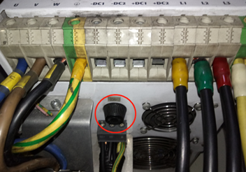 2、在已有的外接制动电阻处，并上电阻，减小外接制动电阻的阻值，增加外接制动电阻的功率，同时修改参数ID R_BLEEDER_EXT与外接制动电阻阻值一致，再次进行试验仍然报警驱动器直流母线电压过压，trace曲线UDC_ACT与未作修改前一致。 3、在负载减速时，外接制动电阻温度没有升高，因此判断外置制动电阻没有工作。 **解决方式** 修改驱动器制动电阻启用直流母线电压参数ID：UDC_BLEEDER_ON的默认值770V为660V。 修改后再次进行试验，在负载减速时trace曲线UDC_ACT，在UDC_ACT数值超过660V之后基本不再上升，也不再产生报警直流母线过压。 |

## 7218：直流母线：标称电压检测：电压过低

描述：

使用“打开控制器”命令时出现运行时错误。

主继电器打开。

UDC_FILTER \< 0.9\*UDC_DETECTION

滤波后的直流母线电压 UDC_FILTER 小于自动标称电压检测的 10% 下限电压 0.9\*UDC_DETECTION 的容许值。

无法检测到有效的标称直流总线电压 UDC_NOMINAL。

反应：

查看错误编号 [7210](#7210直流母线预充电电压不稳定).

原因/补救措施：

看 Power unit Guid：5d7b1758-8ae0-4bef-8a82-f2b8b1017926

市电无效：电源电压或直流母线电压过低。 -\> 检查直流母线电压。

标称电压检测配置不正确：UDC_DETECTION 太高.

| 应用案例                                                                                                                                                                                                                                                                            |
|-------------------------------------------------------------------------------------------------------------------------------------------------------------------------------------------------------------------------------------------------------------------------------------|
| 2022.01.10 ID300设定的是下限值， 如果DC总线的电压低于这个值，会报7218                                                                                                                                                                                                               |
| 2022.09.20 如果始终报此故障号，且无法复位，可在断电后，测试是否L1 L2 L3与DC+ DC- 之间有无二极管压降，如果没有，则基本是驱动器损坏。                                                                                                                                                 |
| 2023.03.23 接通主电后，若UDC_ACT (=UDC_FILTER) \< 0.9 x UDC_DETECTION, 则报7218错误                                                                                                                                                                                                 |
| 2023.06.29 ACOPOS P3上电报7218，读取ParID 298 DC Bus电压为0，驱动器故障。                                                                                                                                                                                                           |
| 2023.06.29 **现象** 9300，6049，7215，7218 **原因** 编码器固定支架断裂  **解决方式** 更换编码器，并重新固定支架，使编码器没有明显晃动                                                                                                |
| 2023.07.06 **解决方法** 1．开关电源电压：22.4, 伺服18芯端子插拔后，断主380VAC后电压升至23伏以上，之后不再报警。 2．开关电源出来的电源线太细，如1.5平方，换粗或并联一根线后正常。                                                                                                    |
| 2023.07.14 **现象** 现场使用外接增量式编码器，且驱动器型号为ACOPOS 1320。 现场生产过程中设备卡机10次会出现7次停机需要设备复位，且7次中有1次会出现9300,6049,7218报警 **原因** 终端现场没有给驱动器接地线，导致信号干扰 **解决方式** 接了地线后，设备卡机也不会导致停机需要设备复位。 |

## 7219：直流母线：预充电：电压过低

描述：

使用“打开控制器”命令时出现运行时错误。

主继电器打开。

UDC_FILTER \< 0.9\*UDC_NOMINAL

过滤后的直流母线电压 UDC_FILTER 小于 10% 标称电压 0.9\*UDC_NOMINAL 的容许值。

反应：

查看错误编号 [7210](#7210直流母线预充电电压不稳定).

原因/补救措施：

看 Power unit Guid：5d7b1758-8ae0-4bef-8a82-f2b8b1017926

主电源无效：电源电压或直流母线电压过低。 -\> 检查直流母线电压。

标称电压初始化配置不正确：UDC_NOMINAL 太高.

| 应用案例                                                                                                                                                              |
|-----------------------------------------------------------------------------------------------------------------------------------------------------------------------|
| 2022.01.10 请检查驱动器380V输入是否有电                                                                                                                               |
| 2023.01.11 进线电压380V，但保险丝断了                                                                                                                                 |
| 2023.03.23 DC Bus测量值虚高，但是实际内部电压检测没有达到Nominal Voltage +- 10%。 之前程序通过参数表手动设置ID390=560  |
| 2023.03.23 **现象** ACOPOSmulti逆变模块PowerOn时，母线电压不足，报错7219。 **解决方案** 读取ID298，DC BUS为580V，电源模块与逆变模块设定母线电压改为600V(被动式使用)   |

## 7220：直流母线：标称电压检测：电压不允许

描述：

使用“开启控制器”命令时出现运行时错误。

主继电器打开。

如果在带有内部直流母线电源 (8V1180.xx-x - 8V128M.xx-x) 的 ACOPOS 模块中，滤波后的直流母线电压 UDC_FILTER 在不允许的范围内 [1.1\*SQRT(2)\*240, 0.9\*SQRT(2 )\*380] 直流电压

或者

如果 (PHASE_MON_IGNORE = 1) 并且满足以下条件：

\|-----------------\|-------------------------------\|

\| 8Vxxxx.00-2 \| UDC_FILTER \< 484VDC \|

\| 8Vxxxx.50-2 \| UDC_FILTER \< 293VDC \|

\|-----------------\|-------------------------------\|

反应：

查看错误编号 [7210](#7210直流母线预充电电压不稳定).

原因/补救措施：

看 Power unit Guid：5d7b1758-8ae0-4bef-8a82-f2b8b1017926

主电源无效：市电电压或直流母线电压无效。 -\> 检查直流母线电压.

| 应用案例                                                                                                                                                                                                                                                                                                                                                                                               |
|--------------------------------------------------------------------------------------------------------------------------------------------------------------------------------------------------------------------------------------------------------------------------------------------------------------------------------------------------------------------------------------------------------|
| 2022.01.10 7220是对8V1180-8V128M的驱动器才有的报错，是DC总线的电压稳定在373V到484V 之间。这个应该也是供电出了问题。                                                                                                                                                                                                                                                                                    |
| 2022.01.11 报警6045和7220 **问题描述** 进线电源电压测得360V，伺服启动不起来，参数ID300已经改成300了，也启动不起来，中午休息时，进线电源380V时，伺服就能起来，运行版本：K4.26;ACP10 3.18.2 **问题原因** 进线电压低于380V，测量值为360V左右 **解决方法** 更换ACP10版本为5.11.1 注：ACP10 3.18.2 版本下，电压在360V时上电会报6045故障，而相同外部条件下，更换ACP10 为 5.11.1 版本后，不会报6045的故障     |
| 2023.03.23 当ACOPOS(8Vxx)接单相主电时，若禁用缺相检测（即ID80 PHASE_MON_IGNORE为1)，且UDC_ACT小于510V (UDC_DETECTION的默认值的0.9倍)，则报7220 (DC bus: Nominal voltage detection: voltage not allowed) 当带内置24V电源的ACOPOS(8V1180 - 8V128M)主电上电，且UDC_ACT稳定在 373V \~ 484V区间（对应 3x240Vac+10% \~ 3x380Vac-10%输入），则报7220 (DC bus: Nominal voltage detection: voltage not allowed) |

## 7221：电源：故障

描述：

8BVPxxxxxxxx.xxx-x：如果观察到的电源频率 (SCTRL_SPEED_ACT) 与启动时识别的电源频率（参见信息）相差超过 MAINS_FREQ_TOL %，则会出现运行时错误。

反应：

关闭电源部分

参数 STAT_UDC_POWERFAIL 设置为值 2。

“控制器就绪”状态被重置。

原因/补救措施：

主电源干扰：主电源线路的至少一相故障。

\-\> 使用万用表检查电压。

市电干扰：市电电压高度失真或不对称。

\-\> 使用功率分析仪检查电压.

## 7222：逆变器：总和电流：过电流

描述：

如果总和电流的绝对值 (= \|VCTRL_I0\| = \|VCTRL_I1 + VCTRL_I2 + VCTRL_I3\|) 超过模块相关的限制 VCTRL_I0_LIM（参见信息），则运行时错误：

反应：

查看错误编号 [7224](#7224背板连接器24v-gnd-接触监控电压过低).

原因/补救措施：

接地连接到触点 U、V 或 W 上的逆变器输出

容性负载：当使用长电机电缆 (\> 50m) 或来自第三方制造商的电缆时。

不稳定的电流控制器：请参阅错误编号 [9300](#9300电流控制器过流).

\-\> 在大电流和高电流变化率的情况下，动态电流互感器误差会导致测得的总和电流值过高.

| 应用案例                                                                                                                                                                                                                                                                                                                                                                                                                                |
|-----------------------------------------------------------------------------------------------------------------------------------------------------------------------------------------------------------------------------------------------------------------------------------------------------------------------------------------------------------------------------------------------------------------------------------------|
| 2023.02.13 1.请先排除上述的电机以及驱动器上的接地是否连接。以及接地与U V W 是否接通。 2.请检查机械是否卡死或者电机转动有异响，在断开电机使能转动负载以及断开联轴器，手动转动电机轴确认机械卡死位置。 3.如果是线轴电机8LSC84，请先考虑是否为电机已损坏，通常会带有类似以下报警代码。 4.检查动力电缆，编码器电缆是否拧紧，电机侧端子针脚是否有弯曲或折断。 5.测量电机的U V W三相之间的电阻是否平衡，测量电机U V W与地之间电阻是否无穷大。 |

## 7223：直流母线：过压 DC-GND

描述

如果 UDC+ 和 GND 或 GND 和 UDC- 之间的电压差大于 900V，则运行错误。

反应

查看错误编号 [7224](#7224背板连接器24v-gnd-接触监控电压过低).

原因/补救措施

接线错误：当电机相接地故障时：检查接线

无效电源：不得使用 IT 电源和 TN-S 电源

电源干扰：电压脉冲（例如：闪电等）：检查电源电压。

8BVxxxxxxxxx.xxx-x：硬件缺陷（例如：旁路电容故障）：更换电源模块

| 应用案例                                                                |
|-------------------------------------------------------------------------|
| 2022.01.11 7223: DC bus: Overvoltage DC-GND 电机UVW等接线可能对地短路了 |

## 7224：背板连接器：24V-GND 接触监控：电压过低

描述：

如果未在模块的所有背板连接器上 24V 和 GND 触点之间测量 24V 总线电压，则会出现运行时错误。

背板连接器的定义：

背板连接器通过拧紧模块的下部安装螺钉将电源模块与直流总线和 24V 导轨连接起来。 背板连接器包含 5 个触点：从上到下 UDC+、UDC-、PE、24V、GND。

背板连接器中的接触监控存在于以下模块上：

\- 电源模块 8BVPxxxxxxxx.xxx-x

\- 具有至少 2 个背板连接器的逆变器模块（例如：8BVx0880xxxx.xxx-x）。

反应：

当“打开控制器”命令时：

查看错误编号 [4005](#4005控制器无法开启驱动处于错误状态).

当控制器处于活动状态时：

逆变器模块：通过关闭功率元件输出级并打开抱闸来停止运动。

电源单元：关闭功率元件输出级。

“控制器就绪”状态被重置。

原因/补救措施：

如果

\- 辅助电源模块上的绿色 LED 亮起并且

\- 存在 24V 总线电压：

电源模块：背板连接器接触问题：24V 总线电压无法在至少一个背板连接器上传输。检查模块的下部安装螺钉。

电源模块：24V 接触式监视器的评估电路有缺陷。更换电源模块。

如果

\- 辅助电源模块上的绿色 LED 亮起并且

\- 24V 总线电压不存在：

辅助电源模块：24V 输出故障。更换辅助电源模块。

如果

\- 只有辅助电源模块上的红色 LED 亮起，

\- 逆变器模块上没有 LED 亮起，并且

\- 不存在 24V 总线电压：

辅助电源模块：背板连接器接触问题：辅助电源模块的背板连接器与 24V 导轨没有接触。检查模块的下部安装螺钉。

辅助供电模块：模块过载。检查当前的要求。

辅助电源模块：模块损坏。更换辅助电源模块。

24V-Bus：24V-和GND-rail之间的短路

如果

\- 辅助电源模块上没有 LED 亮起，

\- 逆变器模块上没有 LED 亮起，并且

\- 不存在 24V 总线电压：

辅助供电模块：24V输出未关闭：X1接头CR_OK信号缺失：CR_OK（Pin5/Pin6）与COM（Pin3/Pin3）X1接头上无5V电压差。检查 X1 连接器。

电源单元：CR_OK 输出故障。更换电源模块。

网络：CR_OK 输出未关闭，因为主电源不稳定。检查主电源和直流母线电压.

| 应用案例                                                                                                                                                                                                                                                                                                            |
|---------------------------------------------------------------------------------------------------------------------------------------------------------------------------------------------------------------------------------------------------------------------------------------------------------------------|
| 2023.03.21 背板螺丝没有拧紧                                                                                                                                                                                                                                                                                         |
| 2023.03.23 **现象** ACOPOSmulti主动电源模块无法PoweOn，报错7224，7036。 **解决方案** 通过查看Multi安装手册，对其进行拆卸重装以检测是否有连接不良的情况。结果刚一拧螺丝发现连接主动电源与底板的螺丝根本没拧紧，导致供电不足。同时Multi还有三个模块的连接螺丝未拧紧。  |

## 7225：直流母线：过压

描述：

如果直流母线电压 UDC_ACT 超过限制电压 UDC_OVMON_STOP_LIM（参见信息），则主动控制期间的运行时错误。

反应：

没有电流限制的短路制动停止运动。

原因/补救措施：

看 Power unit

看错误代码 [7200](#7200直流母线过压).

| 应用案例                                                                                                                                                                                                                                                                                                                                                                                                                 |
|--------------------------------------------------------------------------------------------------------------------------------------------------------------------------------------------------------------------------------------------------------------------------------------------------------------------------------------------------------------------------------------------------------------------------|
| 2023.03.23 **现象** 运行中报以下错误 7200: DC bus: Overvoltage (超过驱动器极限阈值） 7225: DC bus: Overvoltage (超过用户设置阈值) **解决方式** 需要接外部制动电阻                                                                                                                                                                                                                                                        |
| 2023.03.23 **现象** Z轴高速下降产生的回馈能量，使得 DC bus 电压超过 micro 的阈值（ID1221=95V），产生报错7225。 **解决方案** 让 micro 的电源厂家增加能量泄放单元                                                                                                                                                                                                                                                          |
| 2023.03.23 **现象** 制动电阻不起作用 **解决方式** 更换制动电阻  **检查方式** UDC_BLEEDER_ON ：ID345，制动电阻工作电压； UDC_ACT：ID298，直流母线实际电压； UDC_CHOP_CURR：ID1155，实际制动电流，仅在8B0P有效，单位A，只读；  通过监控ID298或ID1155或ID876可确定在制动过程中，制动电阻是否工作。 不工作的可能原因有以下几点： a. 接线错误； b. 保险丝未安装或烧毁（P3无保险丝） c. UDC_BLEEDER_ON设置过高 d. 8B0P必须使能 |
| 2023.07.07 41041 / 7225 / 29226由于外部制动电阻的欧姆电阻或功率不足，导致机器无法在较高的速度运行。                                                                                                                                                                                                                                                                                                                      |

## 7226：直流母线：过流

描述：

8B0Pxxxxxxxx.xxx-x：如果直流总线电流 RECT_CURR 超过限制值 sqrt(2)\*ACOPOS_CURR_MAX，则运行错误。

80Vxxxxxx.xxxx-xx：如果直流总线电流超过模块相关的极限值，则会出现运行错误。

反应：

8B0Pxxxxxxxx.xxx-x：主继电器打开。 IGBT 输出级关断。

80Vxxxxxx.xxxx-xx：输出级关闭。

原因/补救措施：

直流母线：短路

## 7227：泄放器：过流

描述：

如果测量的斩波器电流 UDC_CHOP_CURR 超过限值 1.2 \* UDC_ACT / R_BLEEDER，则运行时会出错。

外部泄放器 (BLEEDER_SELECTOR_EXT == 1)：R_BLEEDER = R_BLEEDER_EXT

内部泄放器 (BLEEDER_SELECTOR_EXT == 0)：取决于模块（参见用户手册，例如：8B0P0110xxxx.xxx-x：R_BLEEDER = 270 Ohm）

反应：

没有任何。

原因/补救措施：

制动电阻错误配置：制动电阻R_BLEEDER_EXT的阻值参数设置过高。

制动电阻损坏：制动电阻的实际阻值降低。

制动电阻损坏或连接 RB+ 和 RB-：短路

制动电阻器损坏或连接 RB-：接地故障 RB-

直流母线电压测量不良：实际直流母线电压值高于测得的直流母线电压值UDC_ACT。

斩波器电流测量缺陷：测量的斩波器电流值 UDC_CHOP_CURR 太高。

可以通过设置参数 MOTOR_TEST_MODE 中的 Bit8 (0x100) 来禁用过流检查。

注意：忽略制动电阻过流会导致 ACOPOS 模块或制动电阻损坏.

| 应用案例                                                                                                                                                                                                                                                                |
|-------------------------------------------------------------------------------------------------------------------------------------------------------------------------------------------------------------------------------------------------------------------------|
| 2023.02.14 **现象** 整机上电后，伺服报错7227 **解决方式** 降低参数表内R_BLEEDER_EXT（ID10）数值。 实际使用过程发现，8B0P0440电源的制动电阻实际阻值是13Ω，连续功率10KW。伺服在整机上电后会报错7227，复位后即不再产生此错误，修改参数表内R_BLEEDER_EXT至10Ω后，问题解决。 |

## 7228：直流母线：标称电压检测：高浪涌电流

描述：

如果在关闭主继电器时直流母线电压增加的系数大于 1.283 (= 1/(0.9\*sqrt(3)/2))，则会出现运行时错误（请参阅信息）。

反应：

没有任何。

原因/补救措施：

模块在规范之外运行：

\- 开机间隔太短

\- 直流母线电容过大

\- 环境温度太高。

直流母线短路

外部充电电路出现故障

并联电源模块出现故障

## 7229：斩波器：过流

描述：

如果斩波器记录过流，则出现运行时错误。

反应：

关闭斩波器。

原因/补救措施：

制动电阻损坏或连接 RB+ 和 RB-：短路

制动电阻器损坏或连接 RB-：接地故障 RB-

## 7230：直流母线：超出中心电压限制

描述：

当直流总线的中心电压 (UDC_MIDDLE_ACT) 超出范围时，主动控制期间的运行时错误。

反应：

执行带有配置行为的错误停止运动。

原因/补救措施：

该信息显示了平衡器状态的详细信息：

\- 0-6 ... 必要的负载情况的额外评估

\- 7 ...超出系统限制

验证梭子运动和故障段上的位置

\- 穿梭机之间的距离太小

\- 段过渡区中穿梭机的同时性

\- 速度和/或加速度和/或力太高

## 7231：电机：过压

描述：

主动控制期间的运行错误，如果直流总线电压 UDC_ACT 超过电机 MOTOR_UDC_MAX 的最大允许直流总线电压（参见信息）。

反应：

逆变器功率级关闭。

原因/补救措施：

电源电压过高。

泄放器UDC_BLEEDER_ON的开启阈值过高.

## 7232：主电源：检测到的频率超出范围 [20,200]

描述：

如果检测到的电源频率的绝对值（参见信息）超出范围 [20,200]Hz，则在打开控制器时出现运行错误。

反应：

逆变器功率级关闭。

原因/补救措施：

检查电源频率.

| 应用案例                                                                                                                                                                                                                                                                                                                                                                                                                                                                                                                                                                                |
|-----------------------------------------------------------------------------------------------------------------------------------------------------------------------------------------------------------------------------------------------------------------------------------------------------------------------------------------------------------------------------------------------------------------------------------------------------------------------------------------------------------------------------------------------------------------------------------------|
| 2022.10.13 情况：multi主动电源上电报7232，并且ParID 80已设1 原因：检查8BVR和8BVP的三相接线顺序，发现接线错误。                                                                                                                                                                                                                                                                                                                                                                                                                                                                          |
| 2023.03.23 **现象** 现场使用8BVP双电源模块 驱动器报错 7211，9303，41011，7232 设备本体：断路器跳闸，动力电缆温度高达70℃，设备未开机情况下，电流波动大。 单拖电缆供电则不再报警 **原因** 谐振   **解决方式** 临时方案：加磁环   最终解决方案：加电抗器 加电抗器，能够有效抑制电网谐波，使得线缆发热的问题得到有效控制； 增加的电抗器出线侧直接供给贝加莱相应的滤波器驱动器等，电抗器后不要再接其他外设设备，外设设备的供电从电抗器前取电；  |

## 7300：模拟/数字 IO：IO 配置无效

描述：

模拟/数字 IO 的输入/输出配置期间的响应错误。 定义了硬件/软件不支持的配置。

反应：

不接受参数值。

原因/补救措施：

使用 AC130 插卡时，前 8 个 IO 必须成对配置（1/2、3/4、5/6、7/8）作为输入或输出。

查看错误编号 [1002](#1002参数超出有效范围).

## 7303：模拟/数字 IO：24V 电源故障

描述：

模拟/数字插件卡的电源电压运行错误。

电源电压小于硬件特定的错误阈值。

反应：

输出关闭。

原因/补救措施：

检查电源控制。

电源过载或故障。

电源故障。

电源连接缺陷（线路开路、线路终端、接线错误、保险丝）。

插卡缺陷.

## 7304：模拟/数字 IO：网络连接中断

描述：

模拟/数字 IO 的网络连接中的运行时错误。

反应：

模拟/数字输出被禁用。

原因/补救措施：

查看错误编号 [1012](#1012循环网络通信的崩溃).

## 7305：数字 IO：数字输出：诊断位激活

描述:

数字输出上的运行时错误。

反应：

查看错误编号 [39302](#39302数字-io-1-4诊断位激活电流24v-电源).

原因/补救措施：

查看错误编号 [39302](#39302数字-io-1-4诊断位激活电流24v-电源).

## 7306：模拟 IO：模拟输出：诊断位激活

描述：

模拟输出上的运行时错误。

反应：

查看错误编号 [39302](#39302数字-io-1-4诊断位激活电流24v-电源).

原因/补救措施：

查看错误编号 [39302](#39302数字-io-1-4诊断位激活电流24v-电源).

## 7401：参数位置超过最大数据长度

描述：

为驱动器（CYCLIC_TORV_PARID、CYCLIC_FRDRV_PARID）的循环操作写入参数 ID 时出现响应错误。

反应：

不接受参数 ID。

原因/补救措施：

要驱动的参数超过最大数据长度。

监控块中驱动器的参数超过最大数据长度.

## 7402：参数序列的处理中止：写入错误

描述：

如果参数在当前索引处发送错误（索引从 0 开始），则参数序列初始化期间的运行时错误。

反应：

不处理参数序列中的后续参数。 状态保持在“未初始化”。 参数错误额外输入为运行时错误。

原因/补救措施：

根据参数ID和另外输入的错误号.

## 7403：参数序列的处理仍然有效

描述：

如果该序列中的参数尚未完成处理，则在下载或初始化参数序列期间出现响应错误。

反应：

不接受新的下载数据或不重新启动初始化。

原因/补救措施：

缺少“参数序列初始化”状态的请求（延迟步骤）。

\-\> 检查程序顺序和状态请求.

## 7404：参数序列在索引处不可用

描述：

如果索引处没有数据，则使用“初始化参数序列”命令响应错误。

反应：

不执行命令。

原因/补救措施：

无效的参数序列索引。

尚未为索引执行下载。

下载到索引之前因错误而中止.

## 8001: EEPROM 选择无效

描述：

写入参数 EEPROM_SELECT 时出现响应错误。

反应：

没有任何。

原因/补救措施：

参数值超出有效范围 [0...5]。

注意：用于写入 EEPROM 的内部参数。 错误使用会导致 ACOPOS 模块损坏.

## 8003: 表索引无效

描述：

写入 SEP_ULONG_WR 和 SEP_FLOAT_WR 参数或读取 SEP_ULONG_RD 和 SEP_FLOAT_RD 参数时出现响应错误。

反应：

没有任何。

原因/补救措施：

访问计数器在上述参数的每次读写过程后递增。

注意：用于写入 EEPROM 的内部参数。 错误使用会导致 ACOPOS 模块损坏.

## 8004: EEPROM 变量类型无效

描述：

从 EEPROM 读取时出现运行时错误。

反应：

没有任何。

原因/补救措施：

软件错误：ACOPOS 操作系统.

## 8005: EEPROM 类型无效

描述：

从 EEPROM 读取时出现运行时错误。

反应：

查看错误编号 [8004](#8004-eeprom-变量类型无效).

原因/补救措施：

查看错误编号 [8004](#8004-eeprom-变量类型无效).

## 8006: EEPROM 参数值为零

描述：

从 EEPROM 读取时出现运行时错误。

反应：

没有任何。

原因/补救措施：

插卡：EEPROM缺陷，更换插卡。

ACOPOS 模块：EEPROM 故障，更换 ACOPOS 模块。

必要参数的 EEPROM 值损坏或为零，更换 ACOPOS 模块.

## 8007: EEPROM 参数值无效

描述：

查看错误编号 [8006](#8006-eeprom-参数值为零).

反应：

没有任何。

原因/补救措施：

查看错误编号 [8006](#8006-eeprom-参数值为零).

## 8011：EPROM：数据无效

描述：

启动时运行时错误。 非易失性存储器中的数据无效。

反应：

查看错误编号 [4005](#4005控制器无法开启驱动处于错误状态).

原因/补救措施：

ACOPOS 模块：非易失性存储器有缺陷

## 8012：EPROM：控制器 ID 无效

描述：

启动时运行时错误。 非易失性存储器中的控制器 ID 无效。

反应：

查看错误编号 [4005](#4005控制器无法开启驱动处于错误状态).

原因/补救措施：

查看错误编号 [8011](#8011eprom数据无效).

## 8013：EPROM：CRC 错误

描述：

启动时运行时错误。 非易失性存储器中的 CRC 无效。

反应：

查看错误编号 [4005](#4005控制器无法开启驱动处于错误状态).

原因/补救措施：

查看错误编号 [8011](#8011eprom数据无效).

## 8020：无效的开关频率

描述：

从 EEPROM 读取时出现运行时错误。

反应：

“控制器就绪”状态被重置。 查看错误编号 [4005](#4005控制器无法开启驱动处于错误状态).

原因/补救措施：

ACOPOS 模块：EEPROM 缺陷 -\> 更换 ACOPOS 模块.

## 8021：用户设备配置数据：CRC 错误

描述：

启动时运行时错误。 用户设备配置数据的 CRC 值无效。

用户设备配置数据永久存储在非易失性存储器（例如 FRAM）中。

反应：

用户设备配置数据的参数不是从非易失性存储器中读取而是重置为出厂设置。

原因/补救措施：

查看错误编号 [8011](#8011eprom数据无效).

写入非易失性存储器时 24V 电源出现故障。

当用户设备配置数据的参数（例如，FAN_CTRL_MODE）通过网络写入时，重新生成CRC值.

## 8022：用户设备配置数据：参数值无效

描述：

启动时运行时错误。 用户设备配置数据中的参数值（ParID 参见 INFO）无效。

用户设备配置数据永久存储在非易失性存储器（例如 FRAM）中。

反应：

该参数不是从用户设备配置数据中读取的，而是重置为出厂默认值。

参数错误额外输入为运行时错误。

原因/补救措施：

由于固件更改或硬件更改，用户设备配置数据中的参数值不再与固件或硬件兼容。

参数（ParID 见 INFO）必须设置为有效值.

## 9000：散热器温度传感器：超出停止限制

描述：

如果散热器温度传感器 TEMP_HEATSINK 的温度超过限制（请参阅信息），则会出现运行时错误。

反应：

“控制器就绪”状态被重置。

当“打开控制器”命令时：请参阅错误编号 [4005](#4005控制器无法开启驱动处于错误状态)。

8V、8BVI、8CVI、80V、8DI：

默认设置 STOP_ERR_DECEL_RAMP=ncA_LIMIT：

当位置控制激活时（CONTROLLER_MODE=1 或 33）：

通过轴限制和关闭控制器停止运动。

当速度控制激活时：

通过速度调节斜坡、轴限制和关闭控制器停止运动。

当 V/f 控制处于活动状态时 (CONTROLLER_MODE=7)：

通过速度控制斜坡、轴限制和关闭控制器停止运动。

当电流控制通过换向激活时 (CONTROLLER_MODE=4)：

通过电流限制和关闭控制器停止运动。

设置 STOP_ERR_DECEL_RAMP=ncINDUCTION：

独立于控制器模式：运动中止，感应停止。另请参阅错误编号 [9001](#9001散热器温度传感器超出关闭限制)。

设置 STOP_ERR_DECEL_RAMP=ncCTRL_OFF：

独立于控制器模式：通过立即关闭控制器和电源部分来中止运动。驱动器没有电气扭矩。

8B0P：

斩波器输出和 CR_OK 输出关闭，主继电器打开，RDY-、RUN- 和 ERR LED 以 3 秒周期同步闪烁。

错误状态只能通过重启模块退出（例如：关闭电源和外部 24V 电源或软件重启）。

8BVP：

逆变器功率级关闭。

原因/补救措施：

无效的操作条件：

\- 运行时环境温度高于40℃。 -\> 打开进气口后立即检查冷空气温度。

\- 更换 ACOPOS 模块中的空气流量适中。 -\> 检查安装方向和进气口盖。

更换ACOPOS模块缺陷：

\- 冷却风扇缺陷。 -\> 检查控制器开启时风扇是否发出声音。当散热器温度高时，风扇发出的声音更大。

\- 散热片温度测量问题： -\> 当控制器关闭时，将环境温度与散热片温度传感器 TEMP_HEATSINK 的温度进行比较。

\- 如果 IGBT 和散热器之间的热转换电阻过高，请检查散热器和 IGBT 之间的散热情况。 -\> 更换 ACOPOS 模块。

阻塞的热传输（冷却气流）)

| 应用案例                                                                                                                                                                                                                                                                                                                                                                                                                                                                                                                                                                                                                                                                                                  |
|-----------------------------------------------------------------------------------------------------------------------------------------------------------------------------------------------------------------------------------------------------------------------------------------------------------------------------------------------------------------------------------------------------------------------------------------------------------------------------------------------------------------------------------------------------------------------------------------------------------------------------------------------------------------------------------------------------------|
| 2022.01.11 41001/9000 Heatsink temperature sensor: Warning limit exceeded: （1）ID380：伺服驱动器温度读取值变化较大 有可能驱动器硬件有问题：驱动器的问题是通过IGBT读取过来的，IGBT某引脚焊点有氧化或者进水腐蚀 （2）如果是acoposmulti电源轴，那么有可能是T+T-接线问题，或者外部动力电问题（比如动力电缆温度高）                                                                                                                                                                                                                                                                                                                                                                                           |
| 2023.03.21 **现象** 电机报错7022、7048、9003、9000，其它电机报错64006。随后所有使用HomeRestore的电机相位丢失 **原因** 使用了Home Restore Position功能 偶发的Permanent变量丢失问题会导致HomeRestore异常 **解决方式** 需要重新标定零点  若重新标定零点无法接受，可以考虑以下方案: InitEndlessPosition的问题是，当你丢失了永久保持变量或者掉电保持变量，位置的数据丢失了，必须重新进行Home。 为了避免这种情况，可以将MC_ENDLESS_POSITION不断存储到一个文件中。启动后，如果永久变量为空，在执行归位恢复模式（homing restore position mode）前，可以将文件中的那些数据写入MC_ENDLESS_POSITION变量。 可以将轴的整个永久保持变量数据结构体包括校验和备份到文件或DataObj中。需要注意的是，整个内存都被完整复制。  |
| 2023.03.23 9000、9030、41031 无法复位解决，驱动器内部可能被铁屑与油污损坏，更换驱动器                                                                                                                                                                                                                                                                                                                                                                                                                                                                                                                                                                                                                     |
| 2023.04.03 **现象** 驱动器Switch On报错9000 9003，Heatsink和Junction温度超限 **解决方式** 更换驱动器                                                                                                                                                                                                                                                                                                                                                                                                                                                                                                                                                                                                      |
| 2023.06.29 **现象** ACOPOS P3一台驱动器报9000,9030,9094，读ParID 380，数值为不合理的140。 **解决方式** 驱动器故障，更换。                                                                                                                                                                                                                                                                                                                                                                                                                                                                                                                                                                                 |

## 9001：散热器温度传感器：超出关闭限制

描述：

如果散热器温度传感器 TEMP_HEATSINK 的温度超过限制（请参阅信息），则会出现运行时错误。

反应：

同步电机：通过短路制动停止运动。如果阶段 1 和阶段 2 中的电流信号和电压信号是稳定的，逆变器功率级将关闭。

异步电机：通过涡流制动停止运动。如果阶段 1 和阶段 2 中的电流信号和电压信号是稳定的，逆变器功率级将关闭。

运动停止时电机电流被限制在电机额定电流 MOTOR_CURR_RATED 和伺服驱动器额定电流 ACOPOS_CURR_RATED。

设置 STOP_ERR_DECEL_RAMP=ncCTRL_OFF：

通过立即关闭控制器和电源部分来中止运动。驱动器没有电气扭矩。

原因/补救措施：

在运动停止期间（参见错误编号 [9000](#9000散热器温度传感器超出停止限制) ），散热器的温度升高。

如果运动已经在更深的温度下停止，则不会超过极限温度（参见信息）.

## 9003：散热器温度传感器：未连接或损坏

描述：

如果测得的散热器温度超出允许值范围，则运行错误。

反应：

请参阅错误编号 [9000](#9000散热器温度传感器超出停止限制) 。

原因/补救措施：

无效的操作条件：模块在规范之外操作。 环境温度过高或过低。

ACOPOS 模块缺陷：散热片温度测量问题。 查看错误编号 [41002](#41002散热器温度传感器未连接或损坏).

| 应用案例                                                                                                                                                                                                                                                                                                                                                                                                                                                                                                                                                                                                                                                                                                  |
|-----------------------------------------------------------------------------------------------------------------------------------------------------------------------------------------------------------------------------------------------------------------------------------------------------------------------------------------------------------------------------------------------------------------------------------------------------------------------------------------------------------------------------------------------------------------------------------------------------------------------------------------------------------------------------------------------------------|
| 2023.03.21 **现象** 电机报错7022、7048、9003、9000，其它电机报错64006。随后所有使用HomeRestore的电机相位丢失 **原因** 使用了Home Restore Position功能 偶发的Permanent变量丢失问题会导致HomeRestore异常 **解决方式** 需要重新标定零点  若重新标定零点无法接受，可以考虑以下方案: InitEndlessPosition的问题是，当你丢失了永久保持变量或者掉电保持变量，位置的数据丢失了，必须重新进行Home。 为了避免这种情况，可以将MC_ENDLESS_POSITION不断存储到一个文件中。启动后，如果永久变量为空，在执行归位恢复模式（homing restore position mode）前，可以将文件中的那些数据写入MC_ENDLESS_POSITION变量。 可以将轴的整个永久保持变量数据结构体包括校验和备份到文件或DataObj中。需要注意的是，整个内存都被完整复制。  |
| 2023.04.03 **现象** 驱动器Switch On报错9000 9003，Heatsink和Junction温度超限 **解决方式** 更换驱动器                                                                                                                                                                                                                                                                                                                                                                                                                                                                                                                                                                                                      |

## 9010：温度传感器（电机\|扼流圈\|外部）：超出停止限制

描述：

如果电机温度传感器 TEMP_MOTOR 的温度超过限制（请参阅信息），则会出现运行时错误。

反应：

请参阅错误编号 [9000](#9000散热器温度传感器超出停止限制) 。

原因/补救措施：

无效的操作条件：

\- 环境温度过高。 -\> 检查电机规格。

\- 法兰温度过高。 -\> 检查电机规格。

\- 冷却有缺陷。 -\> 检查任何必要的风冷或水冷。

超过电机持续电流：

\- 增加电流。参见错误编号 [9030](#9030结温模型超出停止限制) 。 -\> 确定电机电流的中速和有效值，并将这些值与电机的连续电流曲线（S1 操作）进行比较。

电机温度测量问题：

\- 传感器缺陷：-\> 当控制器关闭时，将环境温度与 TEMP_MOTOR 进行比较。

\- 传感器无法连接：错误报告在单轴模块的第二个轴上。

\- 干扰：连接器电缆上的电机温度传感器缺失或屏蔽不良。检查电机温度 TEMP_MOTOR 是否存在干扰脉冲。

\- 温度传感器的隔离不良

\- ACOPOS 模块缺陷

电机最高温度（=110℃）过低.

| 应用案例                                                                                                                                                                                                                                                                                                                                                                                                                                                                                                                                                                                                                                                                                                                                                                                                                                                                                                                                                                              |
|---------------------------------------------------------------------------------------------------------------------------------------------------------------------------------------------------------------------------------------------------------------------------------------------------------------------------------------------------------------------------------------------------------------------------------------------------------------------------------------------------------------------------------------------------------------------------------------------------------------------------------------------------------------------------------------------------------------------------------------------------------------------------------------------------------------------------------------------------------------------------------------------------------------------------------------------------------------------------------------|
| 2022.02.13 ACOPOS伺服达到**MOTOR_WIND_TEMP_MAX**温度限制后的行为 **TEMP_MOTOR** 此变量 （ParID） 包含由温度传感器测量的电机温度。传感器通常位于两个电机定子绕组之间。 **MOTOR_WIND_TEMP_MAX** MOTOR_WIND_TEMP_MAX参数包含引擎的阈值。如果发动机温度达到TEMP_MOTOR极限值 MOTOR_WIND_TEMP_MAX，则发动机关闭。以下错误消息：9010：温度传感器（电机\|扼流圈\|\|外部）：超出止损限制。 **达到MOTOR_WIND_TEMP_MAX阈值后的行为** 可以检查提到的错误消息 9010，但无法再次打开发动机。必须等到电机温度降至MOTOR_WIND_TEMP_MAX值的70%以下。只有这样，才能再次打开电机。这种冷却可能需要很长时间，具体取决于情况。 **解决方法** 此解决方案仅用于服务干预（因此不适用于客户应用中的正常运行）。 如果电机温度传感器电路短时间中断，或者如果相应的PLC重启，则可以立即打开电机。不再需要等待它冷却下来。 **例** 在本例中：MOTOR_WIND_TEMP_MAX = 100 °C：    **备注** 必要冷却到MOTOR_WIND_TEMP_MAX值的70%将被改变。从ACP10 3.15.0开始，此值将为 90%。 |
| 2023.04.03 ACOPOSmulti中的8BVF线路滤波器和8BVR再生电抗器有内置温度传感器。 这些温度传感器必须按照 "8BVP1650电源与2个8BVR0880和2个8BVF0880的连接 "图进行接线! 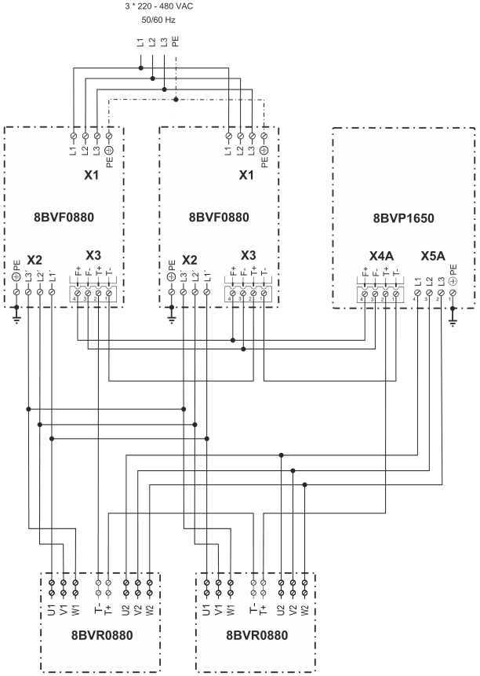 如果接线不正确，会报告错误9010或9012。检查接线!                                                                                                                                                                                                                                                                                                                                                                                                                                                                                                                                                                                                                                                                                                                          |
| 2023.04.03 **现象** 连续运行约 15 分钟后出现电机过温报警(9010) **解决方式** 发现是电机侧散热风扇未开，检查接线打开散热风扇                                                                                                                                                                                                                                                                                                                                                                                                                                                                                                                                                                                                                                                                                                                                                                                                                                                            |
| 2023.04.03 **现象** 直线电机运行时出现报警41011和9010 连续运行的时长同报警时机目前并没有发现严格的关联，有时连续运行多个小时不报警，有时0.5小时就报警。 电机温度传感器为常开型温度开关，开关状态切换的温度阈值暂定为100℃ **解决方式** 将电机参数里的MOTOR_WIND_TEMP_MAX 设置为100（Endat），则ID1172缺省值为100。                                                                                                                                                                                                                                                                                                                                                                                                                                                                                                                                                                                                                                                                     |

## 9011：温度传感器（电机\|扼流圈\|外部）：超出关闭限制

描述：

如果电机温度传感器 TEMP_MOTOR 的温度超过限制（请参阅信息），则会出现运行时错误。

反应：

请参阅错误编号 [9001](#9001散热器温度传感器超出关闭限制)

原因/补救措施：

在运动停止期间（参见错误编号 [9010](#9010温度传感器电机扼流圈外部超出停止限制) ），电机温度升高。

如果运动已经在更深的温度下停止，则不会超过极限温度（参见信息）.

## 9012：温度传感器（电机\|扼流圈\|外部）：未连接或损坏

描述：

如果超过温度传感器 MAX(MOTOR_TEMPSENS_PAR1, MOTOR_TEMPSENS_PAR2) 的电阻上限，则使用线性热敏电阻时会出现运行时错误。

如果 PTC 开关的电阻超过 \~7000 欧姆，则使用 PTC 开关时会出现运行时错误。

反应：

请参阅错误编号 [9000](#9000散热器温度传感器超出停止限制) 。

原因/补救措施：

电机温度传感器接线错误或缺陷：电机温度传感器未连接，或接触松动。 -\> 当控制器关闭时，将环境温度与 TEMP_MOTOR 进行比较。 -\> 使用万用表检查插头上电机温度传感器的电阻是否合理。

线性热敏电阻 MAX(MOTOR_TEMPSENS_PAR1, MOTOR_TEMPSENS_PAR2) 的电阻上限选择得太低。

电机温度测量问题：请参见错误编号 [9010](#9010温度传感器电机扼流圈外部超出停止限制).

| **应用案例**                                                                                                                                                                                                                                                 |
|--------------------------------------------------------------------------------------------------------------------------------------------------------------------------------------------------------------------------------------------------------------|
| 2022.07.28 更换电机线缆后解决问题                                                                                                                                                                                                                            |
| 2023.02.14 1. 检查电器柜驱动器上的接线是否松动及下面的动力线缆是否松动 2. 检查驱动器24v灯是否有，没有的话重启拧紧24v背板螺丝 3. 检查电机上的动力线缆及编码器线是否松动，重新拧紧。                                                                           |
| 2023.04.03 ACOPOSmulti中的8BVF线路滤波器和8BVR再生电抗器有内置温度传感器。 这些温度传感器必须按照 "8BVP1650电源与2个8BVR0880和2个8BVF0880的连接 "图进行接线!  如果接线不正确，会报告错误9010或9012。检查接线! |
| 2023.06.28 **现象** 现场通电后电源模块报警9012 **原因** 经检查，确认8BVP的T-未与8BVF的T-连接，客户电气图上也无该线，且8BVF的F+F-接线顺序相反。                                                                |
| 2023.06.28 **现象** 设备生产过程中突然报出9012 **原因** 电机温度传感器断线。                                                                                                                                                                                 |

## 9013：温度传感器（电机\|扼流圈\|外部）：短路

描述：

如果未达到温度传感器 MIN(MOTOR_TEMPSENS_PAR1, MOTOR_TEMPSENS_PAR2) 的电阻下限，则使用线性热敏电阻时会出现运行时错误。

如果 PTC 开关 TEMPSENS_RESISTANCE 的电阻低于参数 MOTOR_TEMPSENS_PAR2 的值，则使用 PTC 开关时会出现运行时错误。

反应：

请参阅错误编号 [9000](#9000散热器温度传感器超出停止限制) 。

原因/补救措施：

电机温度传感器接线错误或缺陷：温度传感器短路。 当控制器关闭时，将环境温度与 TEMP_MOTOR 进行比较。 -\> 使用万用表检查插头上电机温度传感器的电阻是否合理。

温度传感器 MIN(MOTOR_TEMPSENS_PAR1, MOTOR_TEMPSENS_PAR2) 的电阻下限选择过高。

电机温度测量问题：请参见错误编号 [9010](#9010温度传感器电机扼流圈外部超出停止限制).

| 应用案例                                                                                                                                                                                                                                                                               |
|----------------------------------------------------------------------------------------------------------------------------------------------------------------------------------------------------------------------------------------------------------------------------------------|
| 2023.04.21 关闭41011和9013报警，都是有关电机温度检测的，一个是超温，一个是短路 **方式一:** 参数表里，64到73号，十个参数写0 **方式二:**  **需注意，此方式为把电机温度传感器关了，有烧电机风险！**                                        |
| 2023.06.28 **现象** 电机报警9013 在排查线缆、接线顺序均无误的情况下，用万用电表测量电机的温度传感器阻值，发现其阻值仅700欧，正常情况下应为1000欧。 **解决方式** 需要更换电机 **临时解决方式** 暂时设ParID 1215为0，屏蔽该报警 **需注意，此方式为把电机温度传感器关了，有烧电机风险！** |

## 9030：结温模型：超出停止限制

描述：

如果结温模型 TEMP_JUNCTION 的温度超过模块相关限制 TEMP_JUNCTION_LIM（请参阅信息），则会出现运行时错误。

反应：

参见错误编号 [9000](#9000散热器温度传感器超出停止限制) 。结温限制器在运动停止期间开启。

原因/补救措施：

增加电流：

\- 设置值生成不正确：速度和加速度太高。请参阅错误编号 [5036](#5036超过加速停止限制) 。

\- 负载转矩过高：由于不允许的高负载转矩（摩擦、机械卡滞、老化、负载推力）而增加了电流需求。

\- 设置当前值步长：参见错误编号 [9300](#9300电流控制器过流) 。

\- 控制器配置错误：不稳定的控制器。

\- 电机配置或接线错误：MOTOR_COMMUT_OFFSET。 -\> 检查换向偏移 MOTOR_COMMUT_OFFSET。

\- 电机缺陷：电机去磁。 -\> 检查电机的转矩常数 MOTOR_TORQ_CONST 和电压常数 MOTOR_VOLT_CONST。

\- 电机尺寸错误： -\> 检查产生所需扭矩的电流需求。通常，由于磁饱和，转矩常数 MOTOR_TORQ_CONST 在高电流 (\> MOTOR_CURR_RATED) 下会降低。

\- 异步电机配置错误： -\> 检查励磁电流 SQRT(2)\*MOTOR_MAGNETIZING_CURR 是否大于 ACOPOS_CURR_RATED。

\- 异步电机配置错误： -\> 检查励磁电流 MOTOR_MAGNETIZING_CURR 是否小于 0.5\*MOTOR_CURR_RATED。

\- 8B0P：由于瞬态电源故障增加了充电电流。

电机接线错误：参见错误编号 [6044](#6044相位旋转方向或位置无效) 。

电机接线错误：参见错误编号 [6045](#6045逆变器输出无电流) 。

编码器位置或速度包含错误：参见错误编号 [4014](#4014两个编码器控制超出位置差的停止限制) 。

电源干扰或尺寸错误：电源电压或直流母线电压过高。注意取决于直流母线电压的降额（参见用户手册）。

ACOPOS 模块缺陷：直流母线电压测量问题。请参阅错误编号 [9040](#9040泄放温度模型超出停止限制) 。

最小化结温的措施：

\- 开关频率：ACOPOSmulti、ACOPOS P3：如果开关频率 F_SWITCH 降低了 2 倍，并且在参数 ICTRL_MODE 中设置了 Bit0，则电流控制性能保持不变，发热更少。

\- 直流母线电压：ACOPOSmulti - 电源单元：减少 UCTRL_UDC_REF = 750.0 和 UCTRL_TN = [0.01 - 0.02]

\- 直流母线电压：ACOPOSmulti 逆变器模块：减少 UDC_NOMINAL = 750.0

\- 电流： - 感应电机：KSCTRL_TORQUE_LIM 可用于降低直流制动电流。

\- 当前：降低加速度。增加震动时间。降低电机峰值电流和电机峰值扭矩。

\- 冷却：用于改善冷却的气候装置。

\- 冷却：ACOPOSmulti：馈通冷却：使用导热膏.

| 应用案例                                                                                                                                                                                                                                                                                                                                                                                   |
|--------------------------------------------------------------------------------------------------------------------------------------------------------------------------------------------------------------------------------------------------------------------------------------------------------------------------------------------------------------------------------------------|
| 2022.01.10 电流过大造成，请减少负载或张力                                                                                                                                                                                                                                                                                                                                                  |
| 2023.03.23 9000、9030、41031 无法复位解决，驱动器内部可能被铁屑与油污损坏，更换驱动器                                                                                                                                                                                                                                                                                                      |
| 2023.06.28 使用ACOPOSmulti 8BVI0028HW模块，在标称PWM频率（5kHz）的以上频率工作。 在高开关频率下，过载特性是不同的，在极少数情况下，在静止运行期间或使用长电机电缆（超过数据手册中规定的）时，可能会报告以下错误： 41031: 结温模型：超出警告限值 9030: 结温模型：超出停止限制 通过将开关频率F_SWITCH减半并在参数ICTRL_MODE（双边沿采样）中设置 bit0，可以避免上述误差而不会损失控制器性能。 |
| 2023.06.29 **现象** ACOPOS P3一台驱动器报9000,9030,9094，读ParID 380，数值为不合理的140。 **解决方式** 驱动器故障，更换。                                                                                                                                                                                                                                                                  |

## 9031：结温模型：超出关闭限制

描述：

如果结温模型 TEMP_JUNCTION 的温度超过限制（请参阅信息），则会出现运行时错误。

反应：

请参阅错误编号 [9001](#9001散热器温度传感器超出关闭限制)

原因/补救措施：

在运动停止期间（参见错误编号 [9030](#9030结温模型超出停止限制) ），结温升高。

如果运动已经在更深的温度下停止，则不会超过极限温度（参见信息）.

## 9040：泄放温度模型：超出停止限制

描述：

如果制动电阻温度模型 TEMP_BLEEDER 的温度超过限制（参见 INFO），则运行错误（外部 -\> TEMP_MAX_BLEEDER_EXT \| 内部 -\> 参见下表）。

内部制动电阻的限制取决于 ACOPOS 模块：

\|-----------------\|----------\|

\| 8V1010.xx-x \| 250℃ \|

\| 8V1016.xx-x \| 250℃ \|

\| 8V1022.xx-x \| 400℃ \|

\| 8V1045.xx-x \| 400℃ \|

\| 8V1090.xx-x \| 400℃ \|

\| 8V1180.xx-x \| 350℃ \|

\| 8V1320.xx-x \| 350℃ \|

\| 8V1640.xx-x \| 400℃ \|

\| 8V128M.xx-x \| 400℃ \|

\|------------------\|---------\|

反应：

请参阅错误编号 [9000](#9000散热器温度传感器超出停止限制) 。

原因/补救措施：

恢复力增加：

\-\> 检查制动电阻的尺寸（参见用户手册）。如果来自多个 ACOPOS 模块的直流母线连接在一起，则制动功率分配到控制器上。

散热器温度传感器：参见错误编号 [9000](#9000散热器温度传感器超出停止限制) 。

ACOPOS模块缺陷：

\- 直流母线电压测量问题：-\> 用万用表检查直流母线电压UDC_ACT.

| **应用案例**                                                                                                                                                                                                                                                                                                                                                                                                                                                                                                       |
|--------------------------------------------------------------------------------------------------------------------------------------------------------------------------------------------------------------------------------------------------------------------------------------------------------------------------------------------------------------------------------------------------------------------------------------------------------------------------------------------------------------------|
| 2022.01.10 制动电阻温度过高：电机长时间被拖拽，请配置外部制动电阻                                                                                                                                                                                                                                                                                                                                                                                                                                                  |
| 2022.01.10 报错9040是刹车电阻算出来的温度\>ID 843. 每个驱动器允许的限定值是限定死的，不能改。                                                                                                                                                                                                                                                                                                                                                                                                                      |
| 2023.03.23 BLEEDER_POWER_LOSS：ID876，制动功率损耗，此值与配置的电阻参数共同作用于制动电阻的温度模型，当热容或热阻等设置不正确时，可能导致制动电阻温度模型报警41041/9040/9041。                                                                                                                                                                                                                                                                                                                                    |
| 2023.06.28 **现象** ACOPOS P3上电，AS通过test独占模式测试电机。 在系统刚启动且轴没有Switch On的状态下报警9040，复位后无错误提示。 Switch On电机，出现报错。依次复位后，共出现以下报警： 4005 9078，Info：Temperature = 60 9096，Info：Temperature = 90 9104，Info：Temperature = 100 9098，Info：Temperature = 110  **问题排查** Trace ParID 1543和1540，发现数据明显异常，ID1543与ID1540在伺服未工作情况下应与环境温度近似。 判断ACOPOS P3损坏  **解决方式** 1. 更换ACOPOS P3 2. 如出现9040报警，则需降低生产速度 |

## 9041：泄放温度模型：超出关闭限制

描述：

如果制动电阻温度模型 TEMP_BLEEDER 的温度超过限制（参见信息），则运行错误。

反应：

请参阅错误编号 [9001](#9001散热器温度传感器超出关闭限制)

原因/补救措施：

在运动停止期间（参见错误编号 [9040](#9040泄放温度模型超出停止限制) ），泄放器的温度升高。

如果运动已经在更深的温度下停止，则不会超过极限温度（参见信息）.

| 应用案例                                                                                                                                                                        |
|---------------------------------------------------------------------------------------------------------------------------------------------------------------------------------|
| 2022.01.10 制动电阻温度过高：电机长时间被拖拽，请配置外部制动电阻                                                                                                               |
| 2023.03.23 BLEEDER_POWER_LOSS：ID876，制动功率损耗，此值与配置的电阻参数共同作用于制动电阻的温度模型，当热容或热阻等设置不正确时，可能导致制动电阻温度模型报警41041/9040/9041。 |

## 9050：ACOPOS 峰值电流：超出停止限制

描述：

如果 ACOPOS 峰值电流负载 LOAD_PEAK_CURR 超过限制（请参阅信息），则会出现运行时错误。

反应：

请参阅错误编号 [9000](#9000散热器温度传感器超出停止限制) 。

原因/补救措施：

电流增加：参见错误编号 [9030](#9030结温模型超出停止限制).

| **应用案例**                                                                                                                                                                                                                                                                                                                                       |
|----------------------------------------------------------------------------------------------------------------------------------------------------------------------------------------------------------------------------------------------------------------------------------------------------------------------------------------------------|
| 2023.02.13 1.通常出现这个为过载报警。请优先检查机械是否卡死，在断开电机使能转动负载以及断开联轴器，手动转动电机轴确认机械卡死位置。 2.检查是否为返修或者维修电机或者驱动器。可能由于驱动器侧或电机侧UVW接线错误导致。 3.如果是更换后的电机，可能由于新的电机磁偏角错误导致。                                                                       |
| 2023.06.28 **现象** 电机轴带负载运行过程中频繁报错9050 Trace用PCTRL_V_SET\<\>0做触发条件采集PCTRL_LAG_ERROR、PCTRL_S_ACT和ICTRL_ISQ_ACT，发现move additive命令发出后，轴实际位置几乎没有变化，电流陡增到峰值，然后报错9050：ACOPOS peak current: Stop limit exceeded **解决方式** 若此报错跟着电机出现，即意味着此电机存在硬件隐患，建议更换电机。 |

## 9051：ACOPOS 峰值电流：超出关闭限制

描述：

如果 ACOPOS 峰值电流负载 LOAD_PEAK_CURR 的负载超过限制（请参阅信息），则会出现运行时错误。

反应：

请参阅错误编号 [9001](#9001散热器温度传感器超出关闭限制)

原因/补救措施：

在运动停止期间（参见错误编号 [9050](#9050acopos-峰值电流超出停止限制) ），ACOPOS 峰值电流的负载增加。

如果运动已经在更深的负载中停止，则不会超过限制负载（参见信息）.

## 9060：ACOPOS 持续电流：超出停止限制

描述：

如果 ACOPOS 连续电流负载 LOAD_CONT_CURR 超出限制（请参阅信息），则会出现运行时错误。

反应：

请参阅错误编号 [9000](#9000散热器温度传感器超出停止限制) 。

原因/补救措施：

电流增加：见错误号 [9030](#9030结温模型超出停止限制).

| **应用案例**                                                                                                                                                                                                                                                                                                                                                                                                        |
|---------------------------------------------------------------------------------------------------------------------------------------------------------------------------------------------------------------------------------------------------------------------------------------------------------------------------------------------------------------------------------------------------------------------|
| 2022.01.11 同 [41061](#41061acopos-连续电流超出警告限值) 当ID378值大于125时报警                                                                                                                                                                                                                                                                                                                                     |
| 2023.06.28 **现象** 精校机启动送较厚板后，最前端电机频繁报警持续电流过高(9060)与驱动器过温(9030)。 **优化方式** 按照以下方式优化，能在一定程度上缓解问题，但需要注意Lag error 4007报错。 减少加速度 增加扭矩限制，设定最大扭矩 驱动器逆变开关频率降低 Jolt Time 设定为 0.4s 跟随误差检测范围加大 位置环加 0.1s 积分时间 **解决方式** 此问题是由于终端机器加载了超出设计范围的负载，因此需要增大驱动器与电机的功率。 |
| 2023.06.28 **现象** 使用ACOPOS 8V1180.001-2驱动器，驱动电机带载高速持续运行，驱动器报错 9060。电流远超额定值，减速时 DC bus 最高上升到 790V **解决方式** 根据不同的应用场景，应合理选择电机，在大惯量频繁启停的应用场景下，应选择低惯量大扭矩电机。                                                                                                                                                                 |

## 9061：ACOPOS 持续电流：超出关闭限制

描述：

如果 ACOPOS 连续电流负载 LOAD_CONT_CURR 的负载超过限制（请参阅信息），则会出现运行时错误。

反应：

请参阅错误编号 [9001](#9001散热器温度传感器超出关闭限制)

原因/补救措施：

在运动停止期间（参见错误编号 [9060](#9060acopos-持续电流超出停止限制) ），ACOPOS 连续电流的负载增加。

如果运动已经在更深的负载中停止，则不会超过限制负载（参见信息）.

| 应用案例                                                                           |
|------------------------------------------------------------------------------------|
| 2022.01.11 同 [41061](#41061acopos-连续电流超出警告限值) 当ID378值大于143.75时报警 |

## 9070：电机温度模型：超出停止限制

描述：

如果满足 TEMP_MOTOR_MODELL \> TEMP_MOTOR_MODEL_LIM 条件，则会出现运行时错误。

参见电机温度模型

反应：

请参阅错误编号 [9000](#9000散热器温度传感器超出停止限制) 。

原因/补救措施：

电流增加：参见错误编号 [9030](#9030结温模型超出停止限制) 。

电机配置不正确：

\-\> 将电机额定电流 MOTOR_CURR_RATED 与电机规格进行比较。

\-\> 将电机堵转电流 MOTOR_CURR_STALL 与电机规格进行比较。

\-\> 检查电机绕组横截面 MOTOR_WIND_CROSS_SECT.

| 应用案例                                                                                                                                                                                                                                                                                                                                                                                                                                                                                                                                                                                                                                                                                                                                                                                                                                                                                                                                                                                                       |
|----------------------------------------------------------------------------------------------------------------------------------------------------------------------------------------------------------------------------------------------------------------------------------------------------------------------------------------------------------------------------------------------------------------------------------------------------------------------------------------------------------------------------------------------------------------------------------------------------------------------------------------------------------------------------------------------------------------------------------------------------------------------------------------------------------------------------------------------------------------------------------------------------------------------------------------------------------------------------------------------------------------|
| 2023.06.28 现象 电机电流到达一定值驱动器9070报警 解决方式 Trace相关ParID 214，确认驱动器与电机实际的电流RMS值与电机的额定电流 方式一 适当调大电机额定电流设置值与电机堵转电流设置值 方式二 当前使用电机的额定电流偏小，需要更换更大额定电流的电机                                                                                                                                                                                                                                                                                                                                                                                                                                                                                                                                                                                                                                                                                                                                                              |
| 2023.06.28 **现象** 4005: Controller cannot be switched on: Drive in error state 5005: Start of movement not possible: Position controller inactive 6048: Motor holding brake movement monitor: Position error too large 9070: Motor temperature model: Stop limit exceeded 41031: Junction temperature model: Warning limit exceeded 41070: Motor temperature model: Warning limit exceeded 29203: Drive is not ready. 29209: The drive is in error state. 29217: Invalid input parameter **原因** 零位参数不对引起过载，客户更换了模具，但是没有重新走回零的流程，导致参数错误，机械卡主了，当前顶住位置距离零位还有1mm以上 因此当伺服使能，由于不在零位位置，所以向零位运动，由于已机械顶住，所以动态偏差LagError一直有1mm以上，就一直以最大扭矩输出，造成电机温度超过70度以上，驱动器的散热片温度高达70度，IGBT温度高达133度。持续较长时间后就报警而POWER OFF，进行复位后，又进入以上死循环。 **优化方式** 使能后，走到零位，如果持续1秒超过+5Nm或小于-5Nm，则把HomePosition 进行偏移，再进行MC_HOME操作。 |
| 2023.06.28 **原因** 与机械结构有关，若零点设置的不合理。 在操作侧和传动侧各有一个L型的电机-丝杆传动结构，可分别进行操作，现场的人根据肉眼分别操作两个电机，使得版辊保持水平状态，将两轴单独分别调整至水平以后，按寻参按钮，将当前位置HomeDirect作为零位，此后在进行初始、离压、合压等同步操作。 万一机械上存在不水平，对一侧电机造成不均衡负载，容易报警过载 电机温度模型超温等 **解决方式** 现场操作人员在进行寻零点操作时，提供给他们更明确的操作要求与判断条件。                                                                                                                                                                                                                                                                                                                                                                                                                                                                                                                                            |

## 9071：电机温度模型：超出关闭限制

描述：

如果满足 TEMP_MOTOR_MODELL \> MOTOR_AMB_TEMP_RATED + 1.15\*(TEMP_MOTOR_MODEL_LIM - MOTOR_AMB_TEMP_RATED) 条件，则会出现运行时错误。

反应：

请参阅错误编号 [9001](#9001散热器温度传感器超出关闭限制)

原因/补救措施：

在运动停止期间（参见错误编号 [9070](#9070电机温度模型超出停止限制) ），电机温度模型的负载增加。

如果运动已经在更深的负载中停止，则不会超过限制负载（参见信息）.

## 9075：ACOPOS 持续功率：超出停止限制

描述：

如果 ACOPOS 持续功率 LOAD_POWER 超出限制（请参阅信息），则会出现运行时错误。

反应：

请参阅错误编号 [9000](#9000散热器温度传感器超出停止限制) 。

原因/补救措施：

电流增加：见错误号 [9030](#9030结温模型超出停止限制).

| 应用案例                                                                                                                                                       |
|----------------------------------------------------------------------------------------------------------------------------------------------------------------|
| 2022.01.11 9075、41075错误：ACOPOS continuous power: Warning limit exceeded Info:  伺服输出功率高，原因可能是程序中对ID390这个参数进行限制了，而且数值比较小。 |

## 9076：ACOPOS 持续供电：超出关闭限制

描述：

如果 ACOPOS 连续电源 LOAD_POWER 的负载超过限制（请参阅信息），则会出现运行时错误。

反应：

查看错误编号 [9001](#9001散热器温度传感器超出关闭限制)

原因/补救措施：

在运动停止期间（参见错误编号 [9075](#9075acopos-持续功率超出停止限制) ），ACOPOS 连续电源的负载增加。

如果运动已经在更深的负载中停止，则不会超过限制负载（参见信息）.

## 9078：功率级：温度传感器 1：超出停止限制

描述：

如果温度传感器 1 (TEMP_AIRIN) 超过限制（请参阅信息），则会出现运行时错误。

反应：

请参阅错误编号 [9000](#9000散热器温度传感器超出停止限制)

原因/补救措施：

模块在规范之外运行：

\- 持续电流过大

\- 环境温度太高。

\- 温度传感器有缺陷。

8B：风扇有故障。

8B：进风或出风区域气流阻塞.

| 应用案例                                                                                                                                                                                                                                                                                                                                                                                                                                                                                                           |
|--------------------------------------------------------------------------------------------------------------------------------------------------------------------------------------------------------------------------------------------------------------------------------------------------------------------------------------------------------------------------------------------------------------------------------------------------------------------------------------------------------------------|
| 2023.06.28 **现象** ACOPOS P3上电，AS通过test独占模式测试电机。 在系统刚启动且轴没有Switch On的状态下报警9040，复位后无错误提示。 Switch On电机，出现报错。依次复位后，共出现以下报警： 4005 9078，Info：Temperature = 60 9096，Info：Temperature = 90 9104，Info：Temperature = 100 9098，Info：Temperature = 110  **问题排查** Trace ParID 1543和1540，发现数据明显异常，ID1543与ID1540在伺服未工作情况下应与环境温度近似。 判断ACOPOS P3损坏  **解决方式** 1. 更换ACOPOS P3 2. 如出现9040报警，则需降低生产速度 |

## 9079：功率级：温度传感器 1：超出关闭限制

描述：

请参阅错误编号 [9078](#9078功率级温度传感器-1超出停止限制)

反应：

请参阅错误编号 [9001](#9001散热器温度传感器超出关闭限制)

原因/补救措施：

请参阅错误编号 [9078](#9078功率级温度传感器-1超出停止限制)

## 9080：预充电电阻温度模型：超出停止限制

描述：

如果计算出的预充电电阻温度超过限值（请参阅信息），则会出现运行时错误。

反应：

主继电器打开，RDY-LED 和 ERR-LED 以 3 秒周期同步闪烁。

错误状态只能通过重启模块退出（例如：关闭电源和外部 24V 电源或通过命令重启）。

原因/补救措施：

模块在规范之外运行：

\- 开机间隔太短

\- 直流母线电容过大

\- 环境温度太高。

直流母线短路

外部预充电电路出现故障

并联电源模块出现故障

并联电源模块有上电延时

## 9081：功率级温度模型：超出停止限制

描述：

如果计算出的功率级 (TEMP_POWERSTAGE) 温度超出限制（请参阅信息），则会出现运行时错误。

反应：

请参阅错误编号 [9000](#9000散热器温度传感器超出停止限制)

原因/补救措施：

模块在规范之外运行：

\- 持续电流过大

\- 环境温度太高。

\- 温度传感器 1 损坏.

## 9082：功率级温度模型：超出关闭限制

描述：

请参阅错误编号 [9081](#9081功率级温度模型超出停止限制)

反应：

请参阅错误编号 [9001](#9001散热器温度传感器超出关闭限制)

原因/补救措施：

查看错误编号 [9081](#9081功率级温度模型超出停止限制)

## 9083：功率级：温度传感器 2：超出停止限制

描述：

如果温度传感器 2 (TEMP_AIROUT) 超过限制（请参阅信息），则会出现运行时错误。

反应：

请参阅错误编号 [9000](#9000散热器温度传感器超出停止限制)

原因/补救措施：

查看错误编号 [9078](#9078功率级温度传感器-1超出停止限制)

## 9084：功率级：温度传感器 2：超出关闭限制

描述：

请参阅错误编号 [9083](#9083功率级温度传感器-2超出停止限制)

反应：

请参阅错误编号 [9001](#9001散热器温度传感器超出关闭限制)

原因/补救措施：

查看错误编号 [9078](#9078功率级温度传感器-1超出停止限制)

## 9085：功率级：温度传感器 3：超出停止限制

描述：

如果温度传感器 3 (TEMP_MODUL3) 超过限制（请参阅信息），则会出现运行时错误。

反应：

请参阅错误编号 [9000](#9000散热器温度传感器超出停止限制)

原因/补救措施：

查看错误编号 [9078](#9078功率级温度传感器-1超出停止限制)

## 9086：功率级：温度传感器 3：超出关闭限制

描述：

请参阅错误编号 [9085](#9085功率级温度传感器-3超出停止限制)

反应：

请参阅错误编号 [9001](#9001散热器温度传感器超出关闭限制)

原因/补救措施：

查看错误编号 [9078](#9078功率级温度传感器-1超出停止限制)

## 9087：功率级：温度传感器 4：超出停止限制

描述：

如果温度传感器 4 (TEMP_MODUL4) 超过限制（请参阅信息），则会出现运行时错误。

反应：

请参阅错误编号 [9000](#9000散热器温度传感器超出停止限制)

原因/补救措施：

查看错误编号 [9078](#9078功率级温度传感器-1超出停止限制)

## 9088：功率级：温度传感器 4：超出关闭限制

描述：

请参阅错误编号 [9087](#9087功率级温度传感器-4超出停止限制)

反应：

请参阅错误编号 [9001](#9001散热器温度传感器超出关闭限制)

原因/补救措施：

查看错误编号 [9078](#9078功率级温度传感器-1超出停止限制)

## 9089：编码器温度传感器：超出停止限制

描述：

如果电机编码器 (ENCODxTEMP) 中的温度超过限制 (MOTOR_ENCOD_TEMP_LIM)，则运行错误。

反应：

请参阅错误编号 [9000](#9000散热器温度传感器超出停止限制)

原因/补救措施：

电机编码器在规格之外运行：

\- 电机温度过高

\- 环境温度太高。

\- 编码器中的温度传感器有缺陷.

## 9090：编码器温度传感器：温度值无效

描述：

如果电机编码器 (ENCODxTEMP) 中的温度传感器返回无效值，则会出现运行时错误。

反应：

请参阅错误编号 [9000](#9000散热器温度传感器超出停止限制)

原因/补救措施：

从编码器到驱动器的数据传输尚未激活。

电机编码器和/或插件模块不支持编码器中的温度测量，并且错误激活了温度监控 (MOTOR_ENCOD_TEMP_LIM! = 0)。

由于硬件缺陷或故障（连接断开、线路终止、接线错误、控制硬件有缺陷或故障、ACOPOS 24VDC 电源电压、故障）而导致错误触发。 另请参阅接线指南错误编号 [7030](#7030编码器增量信号幅度太大) 。

编码器中的温度传感器损坏。

可以通过将参数 MOTOR_ENCOD_TEMP_LIM 设置为 0 来禁用电机编码器温度监控.

| 应用案例                                                                                                                                                                                                                                                                                                                                                                                                                                                                                                                                                                                                                                                                                                                                                                       |
|--------------------------------------------------------------------------------------------------------------------------------------------------------------------------------------------------------------------------------------------------------------------------------------------------------------------------------------------------------------------------------------------------------------------------------------------------------------------------------------------------------------------------------------------------------------------------------------------------------------------------------------------------------------------------------------------------------------------------------------------------------------------------------|
| 2023.06.28 **原因** 某些第三方驱动器会修改 Endat2.1 电机芯片中的参数，尤其是磁偏角 ID63 使用我们的 8V1180.001-2 驱动器带第三方驱动器驱动过的电机 8LSA54.EB045D700-3，正常组态配置，驱动器无法上电； 在 Physical View 里面默认-3 的电机加进来，电机参数默认都是 disable 的，但是驱动器上电时会报错，电机参数丢失，无法从电机芯片中读取；  如果配置了电机参数，又会报错 6036，TEST 中会说 ID1224 和 ID652 丢失或无效  **解决方式** 在参数表中增加电机参数；电机配置参数必须在 ID652 和 ID1224 前面；  ParID 1209 值必须修改为 0，关闭温度模型。否则会报错 9090：Motor encoder temperature sensor: Temperature value not valid  手动增加 ID652 值为 0，和 ID1224 值为 1   最重要的是，需要重新整定 ID63 号磁偏角，手动写到参数表中 |

## 9091：24V 电源/主继电器温度传感器：超出停止限制

描述：

当主继电器或 DC-DC 转换器的温度超过限制至少 60 秒时运行时警告。

反应：

请参阅错误编号 [7226](#7226直流母线过流)

原因/补救措施：

请参阅错误编号 [9078](#9078功率级温度传感器-1超出停止限制)

\- 模块有缺陷.

## 9092：功率级：温度传感器 5：超出停止限制

描述：

如果温度传感器 5 (TEMP_MODUL5) 超过限制（请参阅信息），则会出现运行时错误。

反应：

请参阅错误编号 [9000](#9000散热器温度传感器超出停止限制)

原因/补救措施：

查看错误编号 [9078](#9078功率级温度传感器-1超出停止限制)

## 9093：功率级：温度传感器 5：超出关闭限制

描述：

请参阅错误编号 [9092](#9092功率级温度传感器-5超出停止限制)

反应：

请参阅错误编号 [9001](#9001散热器温度传感器超出关闭限制)

原因/补救措施：

查看错误编号 [9078](#9078功率级温度传感器-1超出停止限制)

## 9094：整流器温度模型：超出停止限制

描述：

如果整流器温度模型 (RECT_TEMP) 的温度超过模块相关限制（请参阅信息），则会出现运行时错误。

看 Rectifier temp model Guid：3ef43a6d-eaac-4411-adf0-9993cb63e6d8

反应：

请参阅错误编号 [9000](#9000散热器温度传感器超出停止限制)

原因/补救措施：

请参阅错误编号 [9000](#9000散热器温度传感器超出停止限制)

增加的整流器电流 (RECT_CURR)：

\- 瞬时电源故障。

\- 通过直流链路端子 (DCCON_CURR) 消耗高直流总线电流。

\- 通过逆变器 (INVR_TPOW/UDC_ACT) 消耗高直流总线电流。

减少整流器发热的措施：

\- 通过使用线路扼流圈减少整流器电流.

| 应用案例                                                                                                                  |
|---------------------------------------------------------------------------------------------------------------------------|
| 2023.06.29 **现象** ACOPOS P3一台驱动器报9000,9030,9094，读ParID 380，数值为不合理的140。 **解决方式** 驱动器故障，更换。 |

## 9095：整流器温度模型：超出关闭限制

描述：

请参阅错误编号 [9094](#9094整流器温度模型超出停止限制)

反应：

请参阅错误编号 [9001](#9001散热器温度传感器超出关闭限制)

原因/补救措施：

查看错误编号 [9094](#9094整流器温度模型超出停止限制)

## 9096：直流总线继电器温度模型：超出停止限制

描述：

如果主继电器温度模型 (DCREL_TEMP) 的温度超过模块相关限制（请参阅信息），则会出现运行时错误。

看 DC bus relay temp model Guid：baf81214-df0a-4c26-8235-60142bd617c5

反应：

请参阅错误编号 [9000](#9000散热器温度传感器超出停止限制)

原因/补救措施：

查看错误编号 [9094](#9094整流器温度模型超出停止限制)

| 应用案例                                                                                                                                                                                                                                                                                                                                                                                                                                                                                                           |
|--------------------------------------------------------------------------------------------------------------------------------------------------------------------------------------------------------------------------------------------------------------------------------------------------------------------------------------------------------------------------------------------------------------------------------------------------------------------------------------------------------------------|
| 2023.06.28 **现象** ACOPOS P3上电，AS通过test独占模式测试电机。 在系统刚启动且轴没有Switch On的状态下报警9040，复位后无错误提示。 Switch On电机，出现报错。依次复位后，共出现以下报警： 4005 9078，Info：Temperature = 60 9096，Info：Temperature = 90 9104，Info：Temperature = 100 9098，Info：Temperature = 110  **问题排查** Trace ParID 1543和1540，发现数据明显异常，ID1543与ID1540在伺服未工作情况下应与环境温度近似。 判断ACOPOS P3损坏  **解决方式** 1. 更换ACOPOS P3 2. 如出现9040报警，则需降低生产速度 |

## 9097：直流总线继电器温度模型：超出关闭限制

描述：

请参阅错误编号 [9096](#9096直流总线继电器温度模型超出停止限制)

反应：

请参阅错误编号 [9001](#9001散热器温度传感器超出关闭限制)

原因/补救措施：

查看错误编号 [9094](#9094整流器温度模型超出停止限制)

## 9098：直流母线电容器温度模型：超出停止限制

描述：

如果电容器温度模型 (DCCAP_TEMP) 的温度超过模块相关限制（请参阅信息），则会出现运行时错误。

请参阅直流母线电容器温度模型

反应：

请参阅错误编号 [9000](#9000散热器温度传感器超出停止限制)

原因/补救措施：

请参阅错误编号 [9000](#9000散热器温度传感器超出停止限制)

请参阅错误编号 [9104](#9104直流连接器温度模型超出停止限制)

通过整流器或直流母线连接提供高电流：

\- 在电源连接上使用扼流圈（线路电抗）

\- 将直流母线连接到电容器温度低的模块

\- 使用有源电源模块

通过直流总线连接的高电流消耗：

\- 断开与直流母线连接器的连接

\- 将直流母线连接到电容器温度低的模块

逆变器上的高电流：

\- 查看错误编号 [9030](#9030结温模型超出停止限制)

| 应用案例                                                                                                                                                                                                                                                                                                                                                                                                                                                                                                           |
|--------------------------------------------------------------------------------------------------------------------------------------------------------------------------------------------------------------------------------------------------------------------------------------------------------------------------------------------------------------------------------------------------------------------------------------------------------------------------------------------------------------------|
| 2023.06.28 **现象** ACOPOS P3上电，AS通过test独占模式测试电机。 在系统刚启动且轴没有Switch On的状态下报警9040，复位后无错误提示。 Switch On电机，出现报错。依次复位后，共出现以下报警： 4005 9078，Info：Temperature = 60 9096，Info：Temperature = 90 9104，Info：Temperature = 100 9098，Info：Temperature = 110  **问题排查** Trace ParID 1543和1540，发现数据明显异常，ID1543与ID1540在伺服未工作情况下应与环境温度近似。 判断ACOPOS P3损坏  **解决方式** 1. 更换ACOPOS P3 2. 如出现9040报警，则需降低生产速度 |

## 9099：直流母线电容器温度模型：超出关闭限制

描述：

请参阅错误编号 [9098](#9098直流母线电容器温度模型超出停止限制)

反应：

请参阅错误编号 [9001](#9001散热器温度传感器超出关闭限制)

原因/补救措施：

查看错误编号 [9098](#9098直流母线电容器温度模型超出停止限制)

## 9100：直流母线：连续总功率：超出停止限制

描述：

如果连续总功率负载 (INVR_TPOW_CONT_LOAD) 超过限制 100%，则出现运行时错误。

看 Continuous total power Guid：c65e9336-eb8b-4d8e-aa2b-8d176b66d62b

反应：

请参阅错误编号 [9000](#9000散热器温度传感器超出停止限制)

原因/补救措施：

增加逆变器功率 (MOTOR_TERMINAL_POWER)

低额定直流母线电压 (UDC_NOMINAL)

## 9101：直流母线：持续总功率：超出关闭限制

描述：

如果连续总功率负载 (INVR_TPOW_CONT_LOAD) 超过限制 102%，则运行时会出错。

看 Continuous total power Guid ID:c65e9336-eb8b-4d8e-aa2b-8d176b66d62b

反应：

请参阅错误编号 [9001](#9001散热器温度传感器超出关闭限制)

原因/补救措施：

查看错误编号 [9100](#9100直流母线连续总功率超出停止限制)

## 9102：直流母线：峰值总功率：超出停止限制

描述：

如果峰值总功率负载 (INVR_TPOW_PEAK_LOAD) 超过限制 100%，则会出现运行时错误。

看 Peak total power Guid:29c92b37-12e8-4090-a5e7-32a8e6ae84bd

反应：

请参阅错误编号 9000

原因/补救措施：

查看错误编号 [9100](#9100直流母线连续总功率超出停止限制)

## 9103：直流母线：峰值总功率：超出关闭限制

描述：

如果峰值总功率负载 (INVR_TPOW_PEAK_LOAD) 超过限制 115%，则会出现运行时错误。

看 Peak total power Guid:29c92b37-12e8-4090-a5e7-32a8e6ae84bd

反应：

请参阅错误编号 [9001](#9001散热器温度传感器超出关闭限制)

原因/补救措施：

查看错误编号 [9100](#9100直流母线连续总功率超出停止限制)

## 9104：直流连接器温度模型：超出停止限制

描述：

如果直流总线连接器温度模型 (DCCON_TEMP) 的温度超过模块相关限制（请参阅信息），则会出现运行时错误。

看 DC bus connector temp model Guid ID:7978aa54-2759-4920-9b59-94bd79018af6

反应：

请参阅错误编号 [9000](#9000散热器温度传感器超出停止限制)

原因/补救措施：

请参阅错误编号 [9000](#9000散热器温度传感器超出停止限制)

通过直流总线连接的高电流：

\- 断开与直流母线连接器的连接

\- 在电源连接上使用扼流圈（线路电抗）

\- 使用有源电源模块

| 应用案例                                                                                                                                                                                                                                                                                                                                                                                                                                                                                                           |
|--------------------------------------------------------------------------------------------------------------------------------------------------------------------------------------------------------------------------------------------------------------------------------------------------------------------------------------------------------------------------------------------------------------------------------------------------------------------------------------------------------------------|
| 2023.06.28 **现象** ACOPOS P3上电，AS通过test独占模式测试电机。 在系统刚启动且轴没有Switch On的状态下报警9040，复位后无错误提示。 Switch On电机，出现报错。依次复位后，共出现以下报警： 4005 9078，Info：Temperature = 60 9096，Info：Temperature = 90 9104，Info：Temperature = 100 9098，Info：Temperature = 110  **问题排查** Trace ParID 1543和1540，发现数据明显异常，ID1543与ID1540在伺服未工作情况下应与环境温度近似。 判断ACOPOS P3损坏  **解决方式** 1. 更换ACOPOS P3 2. 如出现9040报警，则需降低生产速度 |

## 9105：直流连接器温度模型：超出关闭限制

描述：

请参阅错误编号 [9104](#9104直流连接器温度模型超出停止限制)

反应：

请参阅错误编号 [9101](#9101直流母线持续总功率超出关闭限制)

原因/补救措施：

查看错误编号 [9104](#9104直流连接器温度模型超出停止限制)

## 9106：功率级：温度传感器：超出停止限制

描述：

如果功率级的传感器温度超过停止限制，则运行时会出错。

信息显示触发传感器：

\- 位 0 ... TEMP_POWERSTAGE_AIR

\- 位 1 ... TEMP_POWERSTAGE_BAL

\- 位 2 ... TEMP_POWERSTAGE_SENS3

\- 位 3 ... TEMP_POWERSTAGE_SENS4

.

.

\- 位 10 ... TEMP_POWERSTAGE_SENS11

反应：

执行带有配置行为的错误停止运动。

原因/补救措施：

查看错误编号 [9110](#9110电机温度模型超出停止限制)

## 9107：功率级：温度传感器：超出关闭限制

描述：

如果功率级的传感器温度超过允许的最大值，则运行错误。

信息显示触发传感器（参见错误编号 [9106](#9106功率级温度传感器超出停止限制) ）。

反应：

请参阅错误编号 [9111](#9111电机温度模型超出关闭限制) 。

原因/补救措施：

在运动停止期间（参见错误编号 [9106](#9106功率级温度传感器超出停止限制) ），功率级上的传感器温度升高.

## 9108：电机：温度传感器：多路复用器参考电压故障

描述：

如果功率级上温度传感器多路复用器的参考电压超出范围，则会出现运行时错误。

反应：

执行带有配置行为的错误停止运动。

控制器启用被永久删除。

原因/补救措施：

无效工作条件：功率级温度过高或过低。

段缺陷.

## 9109：电机：违反温度伸长限制

描述：

反应：

原因/补救措施:

## 9110：电机温度模型：超出停止限制

描述：

如果计算出的线圈温度 MOT_TEMPMODEL_TEMP 的最大值超过限制 MOT_TEMPMODEL_TEMP_ERR，则运行时会出错。

信息显示最热线圈的相位指数。

反应：

执行带有配置行为的错误停止运动。

原因/补救措施：

增加电流

- 设定值生成不正确：加速度和/或换向器开关频率太高。
- 负载转矩过高：由于不允许的高负载转矩（摩擦、齿槽、机械卡死、老化等）而增加了电流需求。
- 控制器配置错误：不稳定的控制器。

环境温度升高

减少散热

## 9111：电机温度模型：超出关闭限制

描述：

如果计算出的线圈温度 MOT_TEMPMODEL_TEMP 的最大值超过限制 1.15\*MOT_TEMPMODEL_TEMP_ERR，则运行时会出错。

信息显示最热线圈的相位指数。

反应：

通过立即关闭控制器和电源部分来中止运动。

原因/补救措施：

运动停止期间（参见错误编号 [9110](#9110电机温度模型超出停止限制) ），温度 MOT_TEMPMODEL_TEMP 升高.

## 9300：电流控制器：过流

描述：

如果在 U 相或 V 相中超过最大允许（可测量）相电流，则出现运行错误。

电流限制取决于 ACOPOS 模块：

\|-------------------\|--------------------------------------------\|

\| 8V1010.00-2 \| 4.0 A \|

\| 8V1010.50-2 \| 16.0 A \|

\| 8V1016.00-2 \| 9.6 \|

\| 8V1016.50-2 \| 26.7 A \|

\| 8V1022.xx-x \| 20.0 A \|

\| 8V1045.xx-x \| 40.0 A \|

\| 8V1090.xx-x \| 40.0 A \|

\| 8V1180.xx-2 \| 82.0 A \|

\| 8V1320.xx-2 \| 133.0 A \|

\| 8V1640.xx-x \| 333.0 A \|

\| 8V128M.xx-x \| 500.0 A \|

\| 8B \| 1.35\*sqrt(2)\*ACOPOS_CURR_MAX \|

\| 8C \| 1.35\*sqrt(2)\*ACOPOS_CURR_MAX \|

\| 8D \| 1.35\*sqrt(2)\*ACOPOS_CURR_MAX \|

\| 8E \| 1.35\*sqrt(2)\*ACOPOS_CURR_MAX \|

\|-------------------\|---------------------------------------------\|

反应：

请参阅错误编号 [6019](#6019acopos过流) 。

原因/补救措施：

**设置当前值跳转：**

由于以下原因，会发生正交分量 ICTRL_ISQ_REF 的设定定子电流跳跃：

\- 跳转到设定位置或设定速度：参见错误编号 [5036](#5036超过加速停止限制) 。

\- 跳入编码器位置或速度：参见错误编号 [4014](#4014两个编码器控制超出位置差的停止限制) 。

\- 跳转到速度偏移（SCTRL_ADD_SET_PARID、SCTRL_SPEED_REF、SCTRL_V_SET_UNITS）

\- 跳转到负载偏移（ICTRL_ADD_SET_PARID、ICTRL_ADD_TRQ）

\- 电机轴上的负载跳跃（卡住的机械装置、负载推力等）

由于严格设置的电流控制器和正交分量 ICTRL_ISQ_REF 的设置定子电流跃升至最大值，正交分量 ICTRL_ISQ_ACT 的实际定子电流可能会在最大值以上波动。

**不稳定的电流控制器：**

\- 由于磁饱和，大电流时电感较低。电流控制器根据电机电感 MOTOR_STATOR_INDUCTANCE 自动初始化。 -\> 检查具有最大允许电流的电流控制器。

\- 电流控制器配置不正确：电流控制器根据电机参数 MOTOR_STATOR_INDUCTANCE、MOTOR_ROTOR_INDUCTANCE 自动初始化。检查这些参数。 -\> 检查电流控制器上阶跃响应的过冲行为。

电机接线错误：参见错误编号 [6045](#6045逆变器输出无电流) 。

电机缺陷：参见错误编号 [6019](#6019acopos过流) 。

ACOPOS 模块缺陷：见错误编号 [6019](#6019acopos过流).

| **应用案例**                                                                                                                                                                                                                                                                                                                                                                          |
|---------------------------------------------------------------------------------------------------------------------------------------------------------------------------------------------------------------------------------------------------------------------------------------------------------------------------------------------------------------------------------------|
| 2022.01.10 伺服驱动器过电流报警，这个报警不是实际的电流报错而是理论计算值的电流超过了驱动器的最大允许电流值。 这个一般是在Cam中加、减速段发生，因为这个阶段电流需求很大。这个可以通过增加Cam的加速段减小电流。                                                                                                                                                                        |
| 2023.03.23 **现象** ACOPOS 1180 在整机同步状态下由100RPM加速到150RPMS时出现报错 报7211，4007，7200，9300 在实际测试过程中测量DC BUS电压，发现此驱动器的偏低 **原因** 可能为1180驱动器内部整流模块故障。 **解决方式** 更换驱动器                                                                                                                                                       |
| 2023.06.29 现场设备机器运行速度超出原设计值，导致驱动器理论电流值过高。 建议现场以设备额定速度生产。                                                                                                                                                                                                                                                                                  |
| 2023.06.29 驱动器的伺服轴跟随的是第三方外接编码器，并且线缆有一定长度。 1. 需要确认编码器反馈的信号是否平滑，可根据实际情况，适当增加编码器滤波时间（ParID 429 设置到0.13） 2. 需要确认编码器安装是否稳定，是否有晃动导致的数据跳变 3. 检查一下是否有环境辐射，线缆是否做好屏蔽。 4. 在高速运行过程中Trace采集ParID 214电流曲线，观察实际电流是否超出驱动器额定值，是否驱动器选型偏小 |
| 2023.06.29 **现象** 9300，6049，7215，7218 **原因** 编码器固定支架断裂  **解决方式** 更换编码器，并重新固定支架，使编码器没有明显晃动                                                                                                                                                                                                  |
| 2023.07.14 **现象** 现场使用外接增量式编码器，且驱动器型号为ACOPOS 1320。 现场生产过程中设备卡机10次会出现7次停机需要设备复位，且7次中有1次会出现9300,6049,7218报警 **原因** 终端现场没有给驱动器接地线，导致信号干扰 **解决方式** 接了地线后，设备卡机也不会导致停机需要设备复位。                                                                                                   |

## 9302：电流控制器：循环时间无效

描述：

如果自动配置的电流控制器循环时间高于最大允许电流控制器循环时间，则写入参数 F_SWITCH 和 ICTRL_MODE 时出现响应错误。

自动配置的电流控制器循环时间取决于参数 F_SWITCH 和 ICTRL_MODE (Bit0).

\|----------------------------------------------------------------------------------------------------------------------\|
\| \| \| 自动配置 \|
\| \| \| 电流控制器循环时间 [s] \|
\| F_SWITCH \| ICTRL_MODE:Bit0 \|-------------------------------------------------------------------------\|
\| \| \| CTRL_CYCLE_TIME_MODE \| CTRL_CYCLE_TIME_MODE \|
\| \| \| 0,1,2 \| 4 \|
\|----------------------------------------------------------------------------------------------------------------------\|
\| \>20000 \| - \| 0.00005 \| 0.000025 \|
\| 20000 \| 1 \| 0.00005 \| 0.000025 \|
\|----------------------------------------------------------------------------------------------------------------------\|
\| 20000 \| 0 \| 0.00005 \|
\| 10000 \| 1 \| 0.00005 \|
\| 10000 \| 0 \| 0.0001 \|
\| 5000 \| 1 \| 0.0001 \|
\| 5000 \| 0 \| 0.0002 \|
\| 2500 \| 1 \| 0.0002 \|
\| 2500 \| 0 \| 0.0004 \|
\|-----------------------------------------------------------------------------------------------------------------------\|

允许的最大电流控制器循环时间等于速度控制器循环时间。 速度控制器循环时间取决于参数 CTRL_CYCLE_TIME_MODE.

\|-----------------------------------------------------------------------------------------\|
\| CTRL_CYCLE_TIME_MODE \| 最大电流控制器循环时间 [s] \|
\|-----------------------------------------------------------------------------------------\|
\| 0 \| 0.0002 \|
\| 1 \| 0.0001 \|
\| 2 \| 0.00005 \|
\| 4 \| 0.000025 \|
\|------------------------------------------------------------------------------------------\|

反应：

不接受参数值。

原因/补救措施：

检查参数 CTRL_CYCLE_TIME_MODE、ICTRL_MODE 和 F_SWITCH 的一致性.

## 9303：馈电：总和电流：过电流

描述：

如果总和电流的绝对值 (= \|VCTRL_I0\| = \|VCTRL_I1 + VCTRL_I2 + VCTRL_I3\|) 超过模块相关的限制 VCTRL_I0_LIM（参见信息），则运行时错误：

反应：

请参阅错误编号 [7224](#7224背板连接器24v-gnd-接触监控电压过低) 。

原因/补救措施：

8BVPxxxxxxxx.xxx-x：接地连接到触点 L1、L2 或 L3 上的 X5 接头

\-\> 使用万用表检查电压。

8BVPxxxxxxxx.xxx-x：电机侧有接地故障的逆变器模块通过直流总线连接。

\-\> 检查8BVIxxxxxxxx.xxx-x：逆变器输出是否接地。

8BVPxxxxxxxx.xxx-x：主滤波器接线错误：连接 X1 和 X2 切换

\-\> 检查 8BVFxxxxxxxx.xxx-x:X1 接口是否连接到电源。

\-\> 检查8BVFxxxxxxxx.xxx-x:X2 连接是否连接到8BVRxxxxxxxx.xxx-x:U1,V1,W1 连接。

8BVPxxxxxxxx.xxx-x：主过滤器缺陷：更换主过滤器filter

| **应用案例**                                                                                                                                                                                                                                                                                                                                                                                                                                                                                                                                                                                                                                                                                                       |
|--------------------------------------------------------------------------------------------------------------------------------------------------------------------------------------------------------------------------------------------------------------------------------------------------------------------------------------------------------------------------------------------------------------------------------------------------------------------------------------------------------------------------------------------------------------------------------------------------------------------------------------------------------------------------------------------------------------------|
| 2022.01.11 Infeed: Summation current: Overcurrent 进线电流三相不平衡 （1）检测动力线 （2）如果是双电源，那么有可能是两个电源轴上电有时差，如果时差超过4ms就出现9303. （3）谐波干扰                                                                                                                                                                                                                                                                                                                                                                                                                                                                                                                                 |
| 2023.02.13 按照上述的解决方案，接线、接地检查，替换8BVP模块。 在双电源并联方案中，在未加整机电抗器下，可能随机出现。增加4% 400A电抗器即可消除该随机报错。                                                                                                                                                                                                                                                                                                                                                                                                                                                                                                                                                          |
| 2023.03.23 **现象** 现场使用8BVP双电源模块 驱动器报错 7211，9303，41011，7232 设备本体：断路器跳闸，动力电缆温度高达70℃，设备未开机情况下，电流波动大。 单拖电缆供电则不再报警 **原因** 谐振   **解决方式** 临时方案：加磁环   最终解决方案： 加输入电抗器，电抗器型号为4%压降 400A 73μH@400V / 50Hz。 程序增加上电逻辑及下电逻辑。当设备处于停止待机状态时，必须手动关闭整流。  加电抗器，能够有效抑制电网谐波，使得线缆发热的问题得到有效控制； 增加的电抗器出线侧直接供给贝加莱相应的滤波器驱动器等，电抗器后不要再接其他外设设备，外设设备的供电从电抗器前取电；  |

## 10000：缺少标识参数

描述：

PIDENT_CMD写入参数时出现响应错误。缺少至少一个标识所必需的参数。

反应：

身份查验程序被取消。

原因/补救措施：

必要的参数

查看 Drive identification:GUID: a9aadd11-ee47-4e88-9dfa-c355d86aa5bd

## 10001：参数标识：子模式无效

描述：

PIDENT_CMD写入参数时出现响应错误。

反应：

身份查验程序被取消。

原因/补救措施：

查看 Drive identification:GUID: a9aadd11-ee47-4e88-9dfa-c355d86aa5bd

## 10100：参数标识：未满足质量系数

描述：

当参数标识达到 0 时，PIDENT_FIT出现运行时错误。

反应：

身份查验程序被取消。

原因/补救措施：

细节：

0：没有可用的详细信息。

1：确定比例放大kv超出范围（0\<kv\< TUNE_KV_MAX）。

\- 扭矩限制器处于活动状态（选择TLIM_MODE = 0）

\- 错误的换向偏移MOTOR_COMMUT_OFFSET（重复相位）

\- 为TUNE_I_MAX_PERCENT选择更高的值

\- 用于识别频率响应函数的瞬态过程尚未消退（增加TUNE_DELAY_TIME）

\- 由于在识别过程中自动预配置速度和位置控制器，反馈太强（减少MOTOR_INERTIA）

\- 在开始识别之前，将位置控制器增益POS_CTRL_KV调整为一个小值

\- 直流母线标称电压UDC_NOMINAL无效或太小（例如：UDC_NOMINAL = 0）

2：闭合速度回路具有不合格的行为（弱阻尼）。

\- 降低速度控制器增益SCTRL_KV

3：闭合位置回路具有不合格行为（弱阻尼）。

\- 降低位置控制器增益POS_CTRL_KV

4：频率响应测量无法完全以恒定速度进行。

\- 选择更高的值以获得最大移动距离TUNE_S_MAX

5：确定质量转动惯量FFCTRL_INERTIA超出范围（\>0）。

\- 选择加速度过大和/或速度过慢

\- 选择更高的值以获得最大移动距离TUNE_S_MAX

6：确定由于重力引起的恒载转矩高于电机MOTOR_TORQ_RATED的额定转矩。

\- 选择更大的电机

7：确定加速度值过高。

\- 选择另一个最大移动距离TUNE_S_MAX

8：确定的震动时间AXLIM_T_JOLT不在允许的范围内（0...0.4）。

\- PIDENT_S不适合选择

\- AXLIM_AX_XXX选择太小

\- 控制回路不够动态

\- 前馈控制以这样一种方式进行参数化，即在滞后误差中无法识别振荡

13：总质量惯性矩的估计值太小。

\- 适应PIDENT_SIGNAL_F_START和/或PIDENT_SIGNAL_F_STOP

\- 检查MOTOR_TORQ_CONST

14：确定的谐振和反谐振频率的比率不合适。

\- 适应PIDENT_SIGNAL_F_START和/或PIDENT_SIGNAL_F_STOP

\- 检查机械装置是否能够振荡

15：标识未提供有意义的值

\- 适应PIDENT_SIGNAL_F_START和/或PIDENT_SIGNAL_F_STOP

\- 检查MOTOR_TORQ_CONST

\- 检查机械装置是否能够振荡

17：麦克斯韦摩擦参数的计算无效

\- 改编PARID_TUNE_S_MAX

\- 设置或改编PARID_TUNE_A

电机 - 识别参数集：

\- 电机线路过长或未屏蔽

应用屏蔽

\- 伺服和电机的功率组合不合适

\- 过载错误

减少PIDENT_CURR_MAX并手动分配

电机 - ISQ-纹波：

\- 设定电流信号中的噪声过大

选择合适的过滤 （SCTRL_TI_FIL）

\- PIDENT_SPEED太高

设置低速

\- 实际速度波动过大

调整控制器设置

驱动-逆变器特性曲线：

\- 电机线路过长或未屏蔽

应用屏蔽

\- 伺服和电机的功率组合不合适

\- 过载错误

减少MOTOR_CURR_MAX并手动分配

控制器参数（自动调谐）：

查看细节。

运动参数 - 识别震动时间：

查看细节。

查看 Drive identification:GUID: a9aadd11-ee47-4e88-9dfa-c355d86aa5bd

| 应用案例                                                                                                                                                                                                                                                                                                                                                                     |
|------------------------------------------------------------------------------------------------------------------------------------------------------------------------------------------------------------------------------------------------------------------------------------------------------------------------------------------------------------------------------|
| 2023.06.29 **其他参数** PIDENT_FIT = 0 **原因** 低频时有噪音的FRF  低频的频率分辨率不好 **补救措施** 增加激励幅度 增加PRBS的信号顺序 选择其他激励信号 使用TUNE_DELAY_TIME                                                                                                                                                                                                    |
| 2023.06.29 **现象** 对电机进行ncSPEED的tunning是正常的 但是在ncPOSITION上进行tunning，却反馈错误10100   **解决办法** 对电机进行相位调整，找出换向偏移。  然后在ncPOSITION上将poud设置为75%，将电压设置为75%。   然后电机就可以运行正常   从acopos表中保存了这些参数 并在init表中添加了几条命令，在每次启动后自动进行相位调整  |
| 2023.07.07 速度模式的驱动轴Test下整定报错10100，无法test启动轴 重新整定速度环和位置环后可以                                                                                                                                                                                                                                                                                  |

## 10101：没有ISQ滤波器空闲

描述：

反应：

身份查验程序被取消。

原因/补救措施：

见驱动器识别: ISQ - Ripple compensation GUID: a9aadd11-ee47-4e88-9dfa-c355d86aa5bd

## 10102：未找到ISQ滤波器的谐振频率（带阻）

描述：

检测谐振频率时的运行时误差，应由ISQ滤波器作为陷波抑制。

反应：

取消识别过程并恢复参数。

原因/补救措施：

选择其他模式。

## 10103：自动调谐：超出最大滞后误差

描述：

如果最大滞后误差超过 TUNE_DS_MAX，则在自动调优期间出现运行时错误。

反应：

自动调谐在感应停止时中止，控制器参数恢复。

原因/补救措施：

ds_max太小，外部负载扭矩要高，...

## 10104：参数识别：位置识别过程中的移动

描述：

由于识别过程中的移动而导致的运行时错误

反应：

识别程序被取消

原因/补救措施：

在识别过程中，检测到一个或多个穿梭机的运动。运动可能是由以下原因引起的

\- 在中止期间仍然储存动能，

\- 外力（例如重力）和/或

\- 磁阻力（例如分流器区域，节段过渡）。

确保所有穿梭车在通电时都处于静止状态

## 10105：参数识别：穿梭机位置的合理性检查

描述：

运行时错误，这是由于穿梭机位置的合理性检查的负面结果

反应：

识别程序被取消

原因/补救措施：

在识别过程中，所确定的穿梭位置之间存在差异

和位置传感器的响应。这可能是由于

\- 不正确的气隙，

\- 减少航天飞机之间的距离，

\- 缺陷穿梭车，

\- 段的不正确安装，

\- 在识别过程中穿梭机的移动和/或

\- 缺陷位置传感器。

可能的改进或帮助识别问题：

\- 换班车

\- 移动受影响航段的穿梭车

\- 检查气隙

\- 检查受影响网段的安装和/或

\- 更改段

## 10500：感应停止已终止

描述：

运行时错误导致感应停止终止。

反应：

动力元件已停用，保持制动器已打开。

原因/补救措施：

同步电机：

\- 由错误6019触发的感应停止：ACOPOS："过流"将被终止

如果再次发生过电流。

\- 由错误7200触发的感应停止：直流母线电压："过压"将是

如果发生温度误差或短路电流高于

最大电机电流或最大 ACOPOS 电流。

## 11000：段间通信：接线故障

描述：

如果连接了错误的连接器，则建立 ISC 连接时出错。

该信息显示了有故障的 ISC 连接器：

1 ... X3A / ISC1

2 ... X3B / ISC2

反应：

未建立 ISC 连接。

原因/补救措施：

检查 ISC1/X3A \<--\> ISC2/X3B 的接线

## 11101：编码器：信号幅度过低

描述：

具有主动监视功能的编码器的运行时错误。振幅小于最小允许振幅。

反应：

编码器评估中止/编码器更改为错误状态。

运动已中止。

快速导航栏信息将被删除。

原因/补救措施：

编码器系统有缺陷。

编码器校准数据不正确。

穿梭车不在预期的位置范围（分流器或转移点）内。

气隙太大。请参阅ACOPOStrak用户手册。

| 应用案例                                                                                                                                                                                                                                                                        |
|---------------------------------------------------------------------------------------------------------------------------------------------------------------------------------------------------------------------------------------------------------------------------------|
| 2023.06.29 如果这些错误信息在开机后的第一次运动中立即出现（该段的控制器自动switch off关闭），那么应使用功能块MC_BR_AsmDeleteShuttle_AcpTrak删除该梭子，并再次开机（Switch on）（这将重新初始化该梭子）。 因此，不正确的位置检测可以以最好的方式得到纠正，而不需要手动移动梭子。 |

## 11102：编码器：信号幅度过高

描述：

具有主动监视功能的编码器的运行时错误。振幅大于最大允许振幅。

反应：

编码器评估中止/编码器更改为错误状态。

运动已中止。

快速导航栏信息将被删除。

原因/补救措施：

编码器系统有缺陷。

编码器校准数据不正确。

## 31201： Di/Do 接口： 驱动器未就绪

描述：

使用"打开控制器"命令或在控制器处于活动状态时驱动器监视器出现运行时错误。

Di/Do 接口的 SDC PV "iDriveReady" 在"打开控制器"命令后定义的时间段内未设置，或者如果控制器处于活动状态，则不再设置为 true

反应：

查看错误码 [31249](#31249驱动器接口硬件模块不正常).

原因/补救措施：

检查 SDC Di/Do 接口 PV "iDriveReady"。

请参阅错误号的过程 [31249](#31249驱动器接口硬件模块不正常).

| 应用案例                                                                                                                                                                                                                                                     |
|--------------------------------------------------------------------------------------------------------------------------------------------------------------------------------------------------------------------------------------------------------------|
| 2023.07.03 **现象** 使用CANopen接口的第三方驱动器，在办公室环境下能够正常使能与运动，但在现场实际设备上使用，无法使能，报警31201 检查了SDC轴的配置与时间配置，没有问题 **原因** 可能CANopen受外部干扰导致此问题 **解决方式** 更换一根屏蔽更好的CANopen线缆。 |

## 31220：编码器错误：未配置编码器

描述：

编码器监视中的运行时错误。

未配置正在使用的编码器。

反应：

不能使用编码器。

原因/补救措施：

检查 SDC 轴配置 PV（变量）。

## 31221： 编码器错误： 电缆干扰或信号干扰

描述：

使用"打开控制器"、"启动归位过程"命令或在控制器处于活动状态时，编码器监视中的运行时错误。

SDC PV"iActTime"不包含有效的时间戳。时间戳超出允许的时间窗口（没有实际位置的循环采样）。

SDC 编码器状态 PV "iEncOK" 不再为 TRUE。

反应：

请参阅后续错误。

一旦编码器接口的 SDC PV 'iActTime' 和 'iEncOK' 在每个 SDC 周期中收到有效数据，操作即可恢复。

原因/补救措施：

检查编码器 PV 的 I/O 映射。

检查映射SDC编码器PV的编码器硬件模块的错误状态。

检查 SDC 轴配置 PV。

编码器未连接。

编码器电源或电源均未包含错误。

编码器连接中断或有缺陷。

检查编码器连接的接线。

编码器有缺陷。

由于硬件缺陷或干扰（连接断开、线路终止、接线错误、控制硬件有缺陷或故障）导致的操作不正常。

| 应用案例                                                                                                                                                                                                                                                                                                                                          |
|---------------------------------------------------------------------------------------------------------------------------------------------------------------------------------------------------------------------------------------------------------------------------------------------------------------------------------------------------|
| 2023.07.03 **现象** AS软件在线Transfer任意非SDC相关程序块的简单逻辑会导致SDC轴掉线，可以复位此错误，SDC I/O PVs的iLifeCnt没有中断。 Transfer时的选项为Consistent installation  **解决方式** 使用SDC轴时，尽量不要使用在线更新功能  **出错后的处理** ①复位所有轴控命令，包括PowerON； ②Acknowledge所有error后，重新PowerON，Home，轴可以正常运动。 |

## 31224：编码器接口：硬件模块不正常

描述：

使用"打开控制器"命令或控制器处于活动状态时，编码器硬件监视中的运行时错误。

编码器接口的 SDC PV "iLifeCnt" 不会随每个 SDC 周期而改变。编码器硬件模块不会在每个 SDC 周期中提供新值。

反应：

请参阅后续错误。

如果编码器接口的 SDC PV "iLifeCnt" 随每个 SDC 周期再次开始更改，则可以再次激活控制器。

原因/补救措施：

检查 SDC 编码器接口特定的 PV。

请参阅错误号的过程 [31249](#31249驱动器接口硬件模块不正常).

| 应用案例                                                                                                                                                                                                                                                       |
|----------------------------------------------------------------------------------------------------------------------------------------------------------------------------------------------------------------------------------------------------------------|
| 2023.07.04 **现象** ACOPOSmicro运行超过2分钟后报6057/31224/31249/31250故障 **解决方式** 到现场检测发现PPC2100的POWERLINK的其中一个网口接到了以太网通讯的路由器上，拆掉这网线后，把BC0083的最后一个模块的BT9100到ACOPOSmicro的X2X通讯线改为贝加莱原装的通讯线。 |

## 31240：当前硬件类型不允许使用归位（Home）过程模式

描述：

使用"开始归位过程"命令响应错误。配置了 SDC 轴不支持的归位模式（"ncDCM"或"ncDCM + ncCORRECTION"）

反应：

归位（Home）过程未启动。

未设置"归位有效"状态。

原因/补救措施：

使用"ncDCM"或"ncDCM + ncCORRECTION"以外的归位(Homing)模式。

## 31247：驱动器接口：未从硬件模块设置 DrvOK

描述：

使用"打开控制器"命令或在控制器处于活动状态时驱动器监视器出现运行时错误。

驱动器接口的 SDC PV "iDrvOK" 在"打开控制器"命令后定义的时间段内未设置，或者如果控制器处于活动状态，则不再设置为 true。

反应：

查看错误码 [31249](#31249驱动器接口硬件模块不正常).

原因/补救措施：

检查 SDC 驱动器接口 PV 'iDrvOK'。

请参阅错误号 [31249](#31249驱动器接口硬件模块不正常).

## 31248：触发接口：硬件模块不正常

描述：

使用"打开控制器"命令或在控制器处于活动状态时触发硬件监视时出现运行时错误。

触发接口的 SDC PV "iLifeCnt" 不会随每个 SDC 周期而更改。触发硬件模块不会在每个 SDC 周期内提供新值。

反应：

查看错误码 [31249](#31249驱动器接口硬件模块不正常).

原因/补救措施：

检查 SDC 触发接口特定的 PV。

请参阅错误号的过程 [31249](#31249驱动器接口硬件模块不正常).

## 31249：驱动器接口：硬件模块不正常

描述：

使用"打开控制器"命令或控制器处于活动状态时驱动器硬件监视中的运行时错误。

驱动器接口的 SDC PV "iLifeCnt" 不会随每个 SDC 周期而更改。驱动器硬件模块不会在每个 SDC 周期内提供新值。

反应：

当"打开控制器"命令时：

启动过程将被取消，控制器未打开。

当控制器处于活动状态时：

移动停止，轴限制和关闭控制器。

设置 STOP_ERR_DECEL_RAMP=ncCTRL_OFF：通过立即关闭控制器来中止移动。oDriveEnable 用于请求关闭电源部分。

原因/补救措施：

检查 SDC 驱动器接口特定的 PV。

程序：

1\. 检查 SDC 轴配置 PV

2\. 检查 PV 的 I/O 映射。

3\. 检查映射 SDC PV 的硬件模块的错误状态。

4\. 检查时间设置。

由于硬件缺陷或干扰（连接断开、线路终止、接线错误、控制硬件有缺陷或故障）导致的操作不正常。

| 应用案例                                                                                                                                                                                                                                                       |
|----------------------------------------------------------------------------------------------------------------------------------------------------------------------------------------------------------------------------------------------------------------|
| 2023.07.04 **现象** ACOPOSmicro运行超过2分钟后报6057/31224/31249/31250故障 **解决方式** 到现场检测发现PPC2100的POWERLINK的其中一个网口接到了以太网通讯的路由器上，拆掉这网线后，把BC0083的最后一个模块的BT9100到ACOPOSmicro的X2X通讯线改为贝加莱原装的通讯线。 |

## 31250： Di/Do 接口： 硬件模块不正常

描述：

使用"打开控制器"命令或控制器处于活动状态时的数字 I/O 硬件监视中的运行时错误。

SDC PV之一的"iLifeCnt..."的 Di/Do 接口不会随每个 SDC 周期而更改。其中一个数字 I/O 硬件模块不会在每个 SDC 周期内提供新值。

反应：

查看错误码 [31249](#31249驱动器接口硬件模块不正常).

原因/补救措施：

检查 SDC Di/Do 接口特定的 PV。

请参阅错误号 [31249](#31249驱动器接口硬件模块不正常).

| 应用案例                                                                                                                                                                                                                                                                                                                                                                                           |
|----------------------------------------------------------------------------------------------------------------------------------------------------------------------------------------------------------------------------------------------------------------------------------------------------------------------------------------------------------------------------------------------------|
| 2022.01.12 硬件是Micro 100D步进电机，报31250 **现象：** 现场检查报警历史为31250 断伺服24V电源报错29209，断80PS电源报错29209，断X2X报31250。 **结论：** X2X通讯问题 **排查方式：** 逐个检查伺服的X2X连线，部分伺服间的连线存在用手轻微晃动即报错的问题，并且全部一起报错。检查接线，X2X接线的两个插头接反，防呆口会导致链接不可靠。 逐个检查X2X连接线，有两个接反，并且接反的线头，用手晃动会报警。 |
| 2023.07.04 **现象** ACOPOSmicro运行超过2分钟后报6057/31224/31249/31250故障 **解决方式** 到现场检测发现PPC2100的POWERLINK的其中一个网口接到了以太网通讯的路由器上，拆掉这网线后，把BC0083的最后一个模块的BT9100到ACOPOSmicro的X2X通讯线改为贝加莱原装的通讯线。                                                                                                                                     |

## 31260：电流轴配置只能在仿真模式下进行

描述：

使用"打开控制器"命令响应错误。

所使用的SDC轴只能在仿真模式下使用。SDC 轴要么只是模拟的轴，要么没有提供 SDC 轴配置 PV。

反应：

启动过程将被取消，控制器未打开。

原因/补救措施：

检查 SDC 轴配置 PV 的名称，以防存在 SDC 轴，并且 SDC 轴应该不仅仅是一个模拟轴。

如果 SDC 轴不应只是模拟轴，请检查 NC 映射表中"其他数据"字段中的条目。

启用仿真模式。

## 31261： 不允许更改伺服驱动器调整模式

描述：

更改伺服驱动器调整模式时的响应错误。

新模式对于配置的 SDC 轴无效，或者模式已更改。

反应：

伺服驱动器调整模式未更改。

原因/补救措施：

伺服驱动调节模式只能更改一次。

使用对配置的 SDC 轴有效的伺服驱动器调整模式。

## 32001：调用 CAN_xopen()时出错

描述：

对于通过CAN网络运行ACPOS伺服驱动器，NC配置中定义的每个CAN接口调用函数CAN_xopen（），以初始化CAN驱动器所需的资源。如果此过程发生错误，则输出此错误号。

反应：

连接到此CAN接口的所有ACPOS节点的初始化都将中止。不能再操作所有相应的 NC 对象。

原因/补救措施：

NC 配置中的接口名称错误。

CAN_xopen（）的状态：请参见CAN库错误号。

## 32002：为广播命令定义写入 COB 时出错

描述：

对于通过CAN网络运行ACOPOS伺服驱动器，NC配置中指定的每个CAN接口调用函数CAN_defineCOB（），以定义具有特定CAN ID的写入COB，以便将命令广播到所有连接的ACPOS节点。如果此过程发生错误，则输出此错误号。

反应：

连接到此CAN接口的所有ACPOS节点的初始化都将中止。不能再操作所有相应的 NC 对象。

原因/补救措施：

CAN_defineCOB（） 的状态：请参见 CAN 库错误号。

## 32003：为参数读取请求定义写入 COB 时出错

描述：

对于通过CAN网络操作ACOPOS伺服驱动器，每个ACPOS都调用了函数CAN_defineCOB（），以定义一个具有特定CAN ID的写入COB，用于Channel1读取请求电报。如果此过程发生错误，则输出此错误号。

反应：

此 ACOPOS 的初始化将中止。不能再操作所有相应的 NC 对象。

原因/补救措施：

CAN_defineCOB（） 的状态：请参见 CAN 库错误号。

## 32004：为参数写入请求定义写入 COB 时出错

描述：

对于通过CAN网络操作ACOPOS伺服驱动器，每个ACOPOS调用函数CAN_defineCOB（），为Channel1写入请求电报定义具有特定CAN ID的写入COB。如果此过程发生错误，则输出此错误号。

反应：

此 ACOPOS 的初始化将中止。不能再操作所有相应的 NC 对象。

原因/补救措施：

CAN_defineCOB（） 的状态：请参见 CAN 库错误号。

## 32005：为参数读取响应定义读取 COB 时出错

描述：

对于通过CAN网络操作ACOPOS伺服驱动器，每个ACPOS都调用CAN_defineCOB（）函数来定义一个读取COB，该COB具有通道1读取响应电报的特定CAN ID。如果此过程发生错误，则输出此错误号。

反应：

此 ACOPOS 的初始化将中止。不能再操作所有相应的 NC 对象。

原因/补救措施：

CAN_defineCOB（） 的状态：请参见 CAN 库错误号。

## 32006：为参数写入响应定义读取 COB 时出错

描述：

对于通过CAN网络运行ACOPOS伺服驱动器，每个ACPOS都调用了函数CAN_defineCOB（），以定义一个具有特定CAN ID的读取COB，用于Channel1写入响应电报。如果此过程发生错误，则输出此错误号。

反应：

此 ACOPOS 的初始化将中止。不能再操作所有相应的 NC 对象。

原因/补救措施：

CAN_defineCOB（） 的状态：请参见 CAN 库错误号。

## 32007：定义从驱动器读取监视器数据的 COB 时出错

描述：

对于通过CAN网络运行ACOPOS伺服驱动器，每个ACPOS调用函数CAN_defineCOB（）来定义一个读取COB，其中包含来自驱动器的监视器数据的特定CAN ID。如果此过程发生错误，则输出此错误号。

反应：

此 ACOPOS 的初始化将中止。不能再操作所有相应的 NC 对象。

原因/补救措施：

CAN_defineCOB（） 的状态：请参见 CAN 库错误号。

## 32008：发送读取请求时出错(网络错误？)

描述：

对于通过CAN网络操作ACOPOS伺服驱动器，NC管理器首先从PLC向ACPOS发送带有CAN_sendCOB（）功能的读取请求电报，以便从ACPOS读取参数值。如果此过程发生错误，则输出此错误号。

反应：

重置相应读取通道的接口。

原因/补救措施：

过载，故障或网络连接中断或ACPOS故障。

另请参阅错误号 [1004](#1004网络生命标志监视器超时).

CAN_sendCOB（） 的状态：请参见 CAN 库错误号。

特例：

如果 1 显示为 CAN_sendCOB（） 的状态，则在 NC 管理器中将调用发送读取请求报文的功能，尽管等待读取响应电报在此读取通道上仍处于活动状态。

在这种情况下，建议保存记录器数据和网络跟踪，并联系支持人员。

| 应用案例                                                                                                                                                                                                                         |
|----------------------------------------------------------------------------------------------------------------------------------------------------------------------------------------------------------------------------------|
| 2022.01.11 **问题描述：** 设备上电后，伺服Ready和RUN指示灯不亮，报警指示灯闪烁。PP65上CAN通讯卡上TXD亮，RXD不亮，伺服8AC110.60-2指示灯不亮。 **问题原因：** CAN开上的终端电阻没有打到ON。 注：CAN通讯两端都需要接120欧终端电阻。 |

## 32009：发送写入请求时出错(网络错误？)

描述：

对于通过CAN网络操作ACOPOS伺服驱动器，NC管理器首先从PLC向ACOPOS发送带有CAN_sendCOB（）功能的写入请求电报，以便将参数值传输到ACPOS。如果此过程发生错误，则输出此错误号。

反应：

重置相应写入通道的接口。

原因/补救措施：

过载，故障或网络连接中断或ACPOS故障。

另请参阅错误号 [1004](#1004网络生命标志监视器超时).

CAN_sendCOB（） 的状态：请参见 CAN 库错误号。

特例：

如果 1 显示为 CAN_sendCOB（） 的状态，则在 NC 管理器中将调用发送写入请求报文的函数，尽管等待写响应电报在此写信道上仍处于活动状态。

在这种情况下，建议保存记录器数据和网络跟踪，并联系支持人员。

## 32010：驱动器未响应读取请求(驱动器是否在网络中？)

描述：

CAN网络：

要从 ACOPOS 读取参数值，NC 管理器首先将读取请求电报从 PLC 发送到 ACOPOS。如果在CAN总线上成功传输读取请求电报后，NC管理器在特定时间内没有收到相应的读取响应电报，则会显示此错误。

电源链路网络：

要从 ACOPOS 读取参数值，NC 管理器首先在循环 POWERLINK 帧中向 ACOPOS 输入读取请求。如果在特定时间后，在 ACOPOS 的循环 POWERLINK 帧中未输入相应的读取响应，则会显示此错误。

反应：

重置相应读取通道的接口。

原因/补救措施：

过载，故障或网络连接中断或ACPOS故障。

查看错误码 [1004](#1004网络生命标志监视器超时).

查看错误码 [1012](#1012循环网络通信的崩溃).

| 应用案例                                                                                                                                                                                                                                                                                |
|-----------------------------------------------------------------------------------------------------------------------------------------------------------------------------------------------------------------------------------------------------------------------------------------|
| 20230.07.04 **现象** 使用ACOPOS与AC141模块，报32189与32010。同一版程序在多台设备上正常运行，仅一台设备出现此问题，且更换过ACOPOS 与AC141模块 **原因** 主要问题是AC141模块与ACOPOS壳体的固定不紧，造成模块断电（也是可能导致与ACOPOS的连接故障32189的原因之一）。已紧固AC141的锁紧螺丝。 |

## 32011：驱动器未响应写入请求(驱动器是否在网络中？)

描述：

CAN网络：

要将参数值传输到 ACOPOS，NC 管理器首先将写入请求电报从 PLC 发送到 ACOPOS。如果在 CAN 总线上成功传输写入请求电报后，NC 管理器在特定时间内未收到相应的读取响应电报，则会显示此错误。

电源链路网络：

要将参数值传输到 ACOPOS，NC 管理器首先在循环 POWERLINK 帧中向 ACOPOS 输入写入请求。如果在特定时间后，在 ACOPOS 的循环 POWERLINK 帧中未输入相应的写入响应，则会显示此错误。

反应：

重置相应写入通道的接口。

原因/补救措施：

过载，故障或网络连接中断或ACPOS故障。

查看故障码 [1004](#1004网络生命标志监视器超时).

查看故障码 [1012](#1012循环网络通信的崩溃).

| 应用案例                                                                                                                                                                                        |
|-------------------------------------------------------------------------------------------------------------------------------------------------------------------------------------------------|
| 2023.07.04 **现象** 电机经常报错32011，CMD Timeout，表现为断总电上电后没有问题，但是过30分钟左右就容易出现这个报警。 此报警无法复位，只能重启该驱动器。 **解决方式** 驱动器问题，需要换驱动器。 |

## 32012：系统模块的读取模块说明时出错

描述：

在将系统模块传输到 ACOPOS 之前，NC 管理器无法读取其模块说明。

反应：

将系统模块传输到 ACOPOS 将中止。

原因/补救措施：

NC 管理器无法打开系统模块的相应数据范围进行读取。

另请参阅错误号 [32018](#32018系统模块中的参数-id-无效).

## 32013：驱动器上没有操作系统

描述：

在生产过程中，操作系统不会存储在 ACOPOS 上。在设置项目期间，必须将其传输到ACOPOS。如果 NC 管理器检测到 ACOPOS 上没有操作系统，则在 ACOPOS 启动功能期间将显示此错误。

反应：

此 ACOPOS 的 ACOPOS 启动功能已中止。

原因/补救措施：

"acp10sys"不包含所连接的ACPOS硬件模块的设备类型的操作系统。

系统模块"acp10sys"未转移到ACOPOS。

如果项目中不存在系统模块"acp10sys"，则必须将ACP10软件的实际版本再次插入到项目中。与 NC 管理器"acp10man"兼容的系统模块"acp10sys"在 NC 软件更新期间自动导入到项目中。

必须激活系统模块"acp10sys"并通过项目传输将其传输到PLC。

| 应用案例                                                                                                                                                                                                                                                                                                                                                                                                                                                                                                                                                            |
|---------------------------------------------------------------------------------------------------------------------------------------------------------------------------------------------------------------------------------------------------------------------------------------------------------------------------------------------------------------------------------------------------------------------------------------------------------------------------------------------------------------------------------------------------------------------|
| 2022.01.11 **出现场景：** ①当客户将原5.10版本（mapp及ACP 10）升级到5.15，P3无法启动； ②客户在新机器中直接下载5.15版本系统，P3无法启动。 通过Test窗口查询到报错32013，No operating system present on the drive。 在原来5.10版本情况下，功能均正常。 **解决方案：** 1.将程序相关版本升级至对应的高版本后，删除对应的ACP 10相关库（Acp 10man、Acp10par、NcGlobal、Acp10sdc、Acp10_MC） 2.点击程序中的 Project-Clean Configuration，删除所有的Temp，Binaries，Diagnose文件； 3.重新添加前述删除的五个Acp10相关库； 4.全编译下载后问题解决，操作系统正常载入，P3正常运行 |

## 32014：驱动器上的 NCSYS 版本与 NC 软件版本不兼容

描述：

如果 NC 管理器检测到 ACOPOS 上的操作系统版本与 NC 管理器的版本不兼容，则在 ACOPOS 启动功能期间将显示此错误。

注意：

驱动器上操作系统的版本可以通过查看十进制值（输出为 UINT）作为十六进制值来确定。例如，值"0x1234"将对应于版本"1.23.4"。

反应：

此 ACOPOS 的 ACOPOS 启动功能已中止。

原因/补救措施：

目标系统上不存在"acp10sysys"。

"acp10sys"不包含所连接的ACPOS硬件模块的设备类型的操作系统。

"acp10sys"和"acp10man"版本号中的前三个地方是不一样的。

另请参阅错误号 [32013](#32013驱动器上没有操作系统).

| 应用案例                                                                                                                                                                                          |
|---------------------------------------------------------------------------------------------------------------------------------------------------------------------------------------------------|
| 2023.07.04 **现象** 新版本驱动器（AC114）换到旧版本机器测试后，将新版本驱动器换回原机器程序后报错 32014: NCSYS version on the drive not compatible with NC software version **解决方式** 更新程序 |

## 32015：创建消息队列时出错

描述：

如果无法创建消息队列，则此错误将显示为信息，并将函数q_create（） 的错误状态显示为信息。

反应：

NC 软件的初始化将中止。不能操作 NC 对象。

原因/补救措施：

没有足够的可用内存。

在操作系统区域配置更多内存。

NC 软件版本的更改。

更改自动化运行时版本。

确切原因可以从函数q_create（）的错误状态中确定。

## 32016：向 NC 管理器任务发送空闲时间命令时出错

描述：

如果向 NC 管理器空闲任务发送命令时发生错误，则会显示此错误，并将函数的错误状态q_send（） 作为信息。

反应：

相应 NC 操作的处理将中止。

原因/补救措施：

保存记录器数据和网络跟踪，并联系支持人员。

更改自动化运行时版本。

NC 软件版本的更改。

确切原因可以从函数 q_send（） 的错误状态中确定。

## 32017：操作系统启动后启动状态错误

描述：

以"CMD_BOOT_STATE=24"启动操作系统后，唯一允许的启动状态是"BOOT_STATE=32"。如果读取了BOOT_STATE的另一个值，则此错误将以错误的BOOT_STATE值作为信息来指示。

反应：

此 ACOPOS 的 ACOPOS 启动功能已中止。

原因/补救措施：

过载，故障或网络连接中断或ACPOS故障。

查看错误码 [1004](#1004网络生命标志监视器超时).

查看错误码 [1012](#1012循环网络通信的崩溃).

## 32018：系统模块中的参数 ID 无效

描述：

在将系统模块传输到 ACOPOS 之前，NC 管理器会从模块描述中读取其参数 ID。必须在相应的内存位置输入以下参数 ID 之一：

\- BRMOD_BSL：ACOPOS BsLoader

\- BRMOD_NCSYS：ACOPOS操作系统

反应：

将系统模块传输到 ACOPOS 将中止。

原因/补救措施：

NC 管理器处理的软件对象"acp10bsl"或"acp10sys"不是有效的 NC 系统模块。

以下系统模块可用于ACP10-SW：

\- acp10bsl： ACOPOS BsLoader

\- acp10sys： ACOPOS 操作系统

名称"acp10bsl"和"acp10sys"是为这些系统模块保留的，因此不能在项目中用于其他软件对象。

另请参阅错误号 [32013](#32013驱动器上没有操作系统).

## 32019：不允许下载 NC 系统模块（模块位于 PLC 上）

描述：

SG3 目标系统有两个选项可用于处理 ACOPOS 操作系统"acp10sys"：

1） 将 NC 操作系统存储在 PLC 上：否（SG3 的默认设置）

软件对象"acp10sys"作为 NC 系统模块添加到项目中。从自动化工作室传输到 PLC 后，它不会存储在 PLC 上。然后，"acp10sys"中包含的ACOPOS操作系统通过NC管理器传输到ACPOS，而"acp10sys"则从Automation Studio传输到PLC。

2） 将 NC 操作系统存储在 PLC 上：是

软件对象"acp10sys"作为数据对象添加到项目中。从自动化工作室传输到PLC后，它存储在PLC上。"acp10sys"中包含的ACOPOS操作系统从数据对象"acp10sys"读取，并在下次CPU重新启动后通过NC管理器传输到ACPOS。

如果 NC 管理器检测到"acp10sys"正在作为 NC 系统模块从 Automation Studio 传输到 PLC，即使"acp10sys"数据对象已存储在 PLC 上，也会显示此错误。

反应：

将系统模块传输到 ACOPOS 将中止。

原因/补救措施：

上面提到的第一个选项目前在项目中被选中，并且"acp10sys"数据对象已存储在PLC上。

从PLC中删除数据对象"acp10sys"，或将项目中的选择更改为上述第二个选项，然后将ACP10软件重新插入到项目中。

另请参阅错误号 [32013](#32013驱动器上没有操作系统).

## 32020：无法从驱动器读取系统模块数据以进行初始化

描述：

只有在系统模块下载功能期间，系统模块才应传输到 ACOPOS，前提是 ACOPOS 上尚不存在该系统模块。为了检测到这一点，NC 管理器在 ACOPOS 启动功能期间读取存储在 ACOPOS（ACOPOS BsLoader 和 ACOPOS 操作系统）上的系统模块的版本数据。如果此过程发生错误，则输出此错误号。此外，还输出有关所发生错误的更多详细信息。

反应：

将系统模块传输到 ACOPOS 将中止。

原因/补救措施：

过载，故障或网络连接中断或ACPOS故障。

查看错误码 [1004](#1004网络生命标志监视器超时).

查看错误码 [1012](#1012循环网络通信的崩溃).

## 32021：下载后无法从驱动器读取系统模块数据

描述：

在系统模块下载功能期间，系统模块传输到ACOPOS后，将从ACOPOS读取相应的版本数据。如果此过程发生错误，则输出此错误号。此外，还输出有关所发生错误的更多详细信息。

反应：:

将系统模块传输到 ACOPOS 将中止。

原因/补救措施：

过载，故障或网络连接中断或ACPOS故障。

查看错误码 [1004](#1004网络生命标志监视器超时).

查看错误码 [1012](#1012循环网络通信的崩溃).

## 32022：下载前中止数据块访问时出错

描述：

在系统模块下载功能期间，在将系统模块传输到ACPOS之前，先前启动的数据块传输将中止。如果此过程发生错误，则输出此错误号。此外，还输出有关所发生错误的更多详细信息。

反应：

将系统模块传输到 ACOPOS 将中止。

原因/补救措施：

过载，故障或网络连接中断或ACPOS故障。

查看错误码 [1004](#1004网络生命标志监视器超时).

查看错误码 [1012](#1012循环网络通信的崩溃).

## 32023：下载前读取启动状态时出错

描述：

仅当 ACOPOS 处于特定启动状态时，才允许下载系统模块。

因此，在系统模块下载功能期间，在将系统模块传输到 ACOPOS 之前，会先从 ACOPOS 读取引导状态。如果此过程发生错误，则输出此错误号。此外，还输出有关所发生错误的更多详细信息。

反应：

将系统模块传输到 ACOPOS 将中止。

原因/补救措施：

过载，故障或网络连接中断或ACPOS故障。

查看错误码 [1004](#1004网络生命标志监视器超时).

查看错误码 [1012](#1012循环网络通信的崩溃).

## 32025：下载前软件重置后启动状态错误

描述：

仅当 ACOPOS 处于特定启动状态时，才允许下载系统模块。

如果 ACOPOS 处于其他引导状态，则在系统模块下载功能期间，系统模块将发送 SW Reset 命令以更改为此引导状态，然后再将系统模块传输到 ACOPOS。然后再次读取引导状态。如果 ACOPOS 仍未处于所需的启动状态，则输出此错误号。此外，还输出有关所发生错误的更多详细信息。

反应：

将系统模块传输到 ACOPOS 将中止。

原因/补救措施：

过载，故障或网络连接中断或ACPOS故障。

查看错误码 [1004](#1004网络生命标志监视器超时).

查看错误码 [1012](#1012循环网络通信的崩溃).

## 32026：在 INIT 期间数据块写入访问下载时出错

描述：

在系统模块下载功能期间初始化对系统模块数据的写入访问权限，然后才能将来自系统模块的实际数据传输到ACPOS。如果此过程发生错误，则输出此错误号。此外，还输出有关所发生错误的更多详细信息。

反应：

将系统模块传输到 ACOPOS 将中止。

原因/补救措施：

过载，故障或网络连接中断或ACPOS故障。

查看错误码 [1004](#1004网络生命标志监视器超时).

查看错误码 [1012](#1012循环网络通信的崩溃).

## 32027：发送数据段以供下载时出错

描述：

在系统模块下载功能期间，来自系统模块的数据将分段传输到ACPOS。如果在调用相应的 send 函数时发生错误，则输出此错误号。此外，还提供了有关所发生错误的更多详细信息。

反应：

将系统模块传输到 ACOPOS 将中止。

原因/补救措施：

过载，故障或网络连接中断或ACPOS故障。

查看错误码 [1004](#1004网络生命标志监视器超时).

查看错误码 [1012](#1012循环网络通信的崩溃).

## 32029：发送数据段以供下载后出现响应错误

描述：

在系统模块下载功能期间，来自系统模块的数据将分段传输到ACPOS。如果在调用相应的 send 函数后发生响应错误，则输出此错误号。此外，还输出有关所发生错误的更多详细信息。

反应：

将系统模块传输到 ACOPOS 将中止。

原因/补救措施：

过载，故障或网络连接中断或ACPOS故障。

查看错误码 [1004](#1004网络生命标志监视器超时).

查看错误码 [1012](#1012循环网络通信的崩溃).

| 应用案例                                                                                                                                                                                                                                                                                                                                                                                                                                                                                                                                                                                                                                                                                                                                                                                                                                                                                                                                                                 |
|--------------------------------------------------------------------------------------------------------------------------------------------------------------------------------------------------------------------------------------------------------------------------------------------------------------------------------------------------------------------------------------------------------------------------------------------------------------------------------------------------------------------------------------------------------------------------------------------------------------------------------------------------------------------------------------------------------------------------------------------------------------------------------------------------------------------------------------------------------------------------------------------------------------------------------------------------------------------------|
| **现象** 新组装的机器，有一个驱动器报错32029或32280，已更换过网线、检查过拨码。 **问题排查** 采集NCT，检查网络通信情况   发现上电后通讯建立在NETWORK_PHASE = 40之前都是正常的，在40时出现报错。 NETWORK_PHASE = 40时系统通过PLK往伺服下载ACP10版本。因此怀疑时拓扑结构过长导致的异步通讯超时。 现场检查拓扑，发现从PLC的PLK口出来后所有伺服均在一条拓扑线路上，即无Hub拓展。 现场更改接线顺序，发现拓扑线路的最后一个驱动器均会触发同样的报警。由此确认与拓扑结构有关。  **解决方式** 方式一 由于现场暂无法更改拓扑结构，于是将PLK主站的 Asynchronous timeout 参数由默认的25 μs改为100 μs。 其中Asynchronous timeout 参数的含义如下图，即POWERLINK异步段通信，主站发帧，等待从站（驱动器）响应的时间，若现场拓扑复杂，同一链路下CN数量多，则此参数需要适当增大。 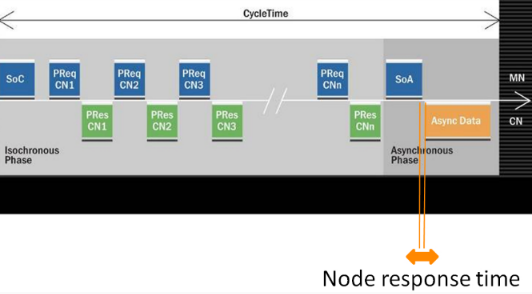 重新下载程序后所有伺服通讯正常。 方式二 有条件时应使用Hub修改POWERLINK网络的拓扑结构，改成星型拓扑结构。 |

## 32030：下载后系统模块刻录命令出错

描述：

在系统模块下载功能期间，将系统模块刻录到FPROM的命令在系统模块传输到ACOPOS后发送到ACPOS。如果此过程发生错误，则输出此错误号。此外，还输出有关所发生错误的更多详细信息。

反应：

将系统模块传输到 ACOPOS 将中止。

原因/补救措施：

过载，故障或网络连接中断或ACPOS故障。

查看错误码 [1004](#1004网络生命标志监视器超时).

查看错误码 [1012](#1012循环网络通信的崩溃).

## 32031：下载后系统模块刻录状态时出错

描述：

在系统模块下载功能期间，将系统模块刻录到FPROM的命令在系统模块传输到ACOPOS后发送到ACPOS。然后读取相应的状态。如果在读取此状态时发生错误，则输出此错误号。此外，还输出有关所发生错误的更多详细信息。

反应：

将系统模块传输到 ACOPOS 将中止。

原因/补救措施：

过载，故障或网络连接中断或ACPOS故障。

查看错误码 [1004](#1004网络生命标志监视器超时).

查看错误码 [1012](#1012循环网络通信的崩溃).

## 32032：下载后刻录系统模块时出错

描述：

在系统模块下载功能期间，将系统模块刻录到FPROM的命令在系统模块传输到ACOPOS后发送到ACPOS。然后读取相应的状态。如果在此状态下显示错误，则输出此错误号。此外，还输出有关所发生错误的更多详细信息。

反应：

将系统模块传输到 ACOPOS 将中止。

原因/补救措施：

ACOPOS 错误，更改 ACOPOS 模块。

## 32033：下载后刻录系统模块时超时

描述：

在系统模块下载功能期间，将系统模块刻录到FPROM的命令在系统模块传输到ACOPOS后发送到ACPOS。然后读取相应的状态。如果在系统模块成功刻录到 ACOPOS 之前，系统模块刻录过程达到超时，则会输出此错误号。此外，还输出有关所发生错误的更多详细信息。

反应：

将系统模块传输到 ACOPOS 将中止。

原因/补救措施：

ACOPOS 错误，更改 ACOPOS 模块。

## 32034：下载前软件重置时出错

描述：

仅当 ACOPOS 处于特定启动状态时，才允许下载系统模块。

如果 ACOPOS 处于其他引导状态，则在系统模块下载功能期间，系统模块将发送 SW Reset 命令以更改为此引导状态，然后再将系统模块传输到 ACOPOS。如果此过程发生错误，则输出此错误号。此外，还输出有关所发生错误的更多详细信息。

反应：

将系统模块传输到 ACOPOS 将中止。

原因/补救措施：

过载，故障或网络连接中断或ACPOS故障。

查看错误码 [1004](#1004网络生命标志监视器超时).

查看错误码 [1012](#1012循环网络通信的崩溃).

## 32035：下载后软件重置时出错

描述：

对于某些系统模块，在将系统模块传输到 ACOPOS 后，必须在系统模块下载功能期间发送软件复位命令。如果此过程发生错误，则输出此错误号。此外，还输出有关所发生错误的更多详细信息。

反应：

将系统模块传输到 ACOPOS 将中止。

原因/补救措施：

过载，故障或网络连接中断或ACPOS故障。

查看错误码 [1004](#1004网络生命标志监视器超时).

查看错误码 [1012](#1012循环网络通信的崩溃).

## 32036：下载后不同的系统模块数据

描述：

在系统模块下载功能期间，系统模块传输到ACOPOS后，将从ACOPOS读取相应的版本数据。如果确定与传输的系统模块的差异，则输出此错误号。此外，还输出有关所发生错误的更多详细信息。

反应：

将系统模块传输到 ACOPOS 将中止。

原因/补救措施：

ACOPOS 错误，更改 ACOPOS 模块。

## 32037：由于FIFO溢出而丢失错误消息（确认错误）

描述：

对于此 NC 对象，发生了错误消息的 FIFO 溢出。

反应：

进一步的错误消息将丢失。

原因/补救措施：

对于此 NC 对象，错误信息发生得太快。

此 NC 对象的错误消息未得到足够快的确认。

| 应用案例                                                                                                                                                                                                                                 |
|------------------------------------------------------------------------------------------------------------------------------------------------------------------------------------------------------------------------------------------|
| 2022.01.11 32037: Error message(s) lost because of FIFO overflow (acknowledge errors) For this NC object an overflow of the FIFO for error messages occured.  （1）通讯故障 （2）plc内存数据紊乱，重新下载程序 （3）众多伺服报警同时出现 |
| 2022.07.22 报警64006、32037、1012、32189：网线松动                                                                                                                                                                                       |
| 2023.07.04 **现象** 机器运行之后发生了某一驱动器报错，32037 32189 1012 ，其他驱动器没有报错 **原因** POWERLINK网络通信质量问题 **解决方式** 重新拔插POWERLINK线缆后，问题解决。 需要校核POWERLINK网络质量，优化参数                      |
| 2023.07.04 **现象** 开机伺服偶发32037报警 **解决方式** 客户当前伺服采取PLK串接方式，站点过多需要更换PLK专用HUB                                                                                                                           |

## 32040：INIT参数模块的版本与NC 管理器不兼容

描述：

如果 INIT 参数模块的版本和 acp10man 的版本在前三位数字上不相等，则会显示此错误。

反应：

INIT 参数模块的处理已中止。

原因/补救措施：

重新生成 INIT 参数模块并将其传输到目标。

## 32041：模块 acp10cfg 不存在

描述：

如果目标上不存在模块 acp10cfg，则会显示此错误。

注意：

如果发生此错误，则会在记录器中输入二进制数据中具有此错误号的以下错误：

\- 10550：读取 NC CFG 模块："二进制数据"中的 NC 管理器错误

反应：

NC 软件的初始化将中止。不能操作 NC 对象。

原因/补救措施：

创建模块 acp10cfg 并将其传输到目标。

## 32042：模块 acp10cfg 不是 NC 数据模块

描述：

如果模块 acp10cfg 不是 NC 数据模块，则会显示此错误。

注意：

如果发生此错误，则会在记录器中输入二进制数据中具有此错误号的以下错误：

\- 10550：读取 NC CFG 模块："二进制数据"中的 NC 管理器错误

反应：

NC 软件的初始化将中止。不能操作 NC 对象。

原因/补救措施：

将模块 acp10cfg 创建为 ACP10 配置，并将其传输到目标。

## 32043：模块 acp10cfg 的 NC 模块类型无效

描述：

如果模块 acp10cfg 具有错误的 NC 模块类型，则会显示此错误。

注意：

如果发生此错误，则会在记录器中输入二进制数据中具有此错误号的以下错误：

\- 10550：读取 NC CFG 模块："二进制数据"中的 NC 管理器错误

反应：

NC 软件的初始化将中止。不能操作 NC 对象

原因/补救措施：

将模块 acp10cfg 创建为 ACP10 配置，并将其传输到目标。

## 32044：无法读取模块 acp10cfg 的 NC 模块类型

描述：

如果无法读取模块 acp10cfg 的 NC 模块类型，则会显示此错误。

注意：

如果发生此错误，则会在记录器中输入二进制数据中具有此错误号的以下错误：

\- 10550：读取 NC CFG 模块："二进制数据"中的 NC 管理器错误

反应：

NC 软件的初始化将中止。不能操作 NC 对象。

原因/补救措施：

重建模块 acp10cfg 并将其传输到目标。

更改自动化运行时版本。

NC 软件版本的更改。

## 32045：无法读取模块 acp10cfg 中的数据地址

描述：

如果无法读取模块 acp10cfg 的数据地址，则会显示此错误。

注意：

如果发生此错误，则会在记录器中输入二进制数据中具有此错误号的以下错误：

\- 10550：读取 NC CFG 模块："二进制数据"中的 NC 管理器错误

反应：

NC 软件的初始化将中止。不能操作 NC 对象。

原因/补救措施：

重新编译模块 acp10cfg 并将其传输到目标。

更改自动化运行时版本。

NC 软件版本的更改。

## 32046：模块 acp10cfg 的数据部分为空

描述：

如果模块 acp10cfg 的数据部分为空，则会显示此错误。

注意：

如果发生此错误，则会在记录器中输入二进制数据中具有此错误号的以下错误：

\- 10550：读取 NC CFG 模块："二进制数据"中的 NC 管理器错误

反应：

NC 软件的初始化将中止。不能操作 NC 对象。

原因/补救措施：

重新编译模块 acp10cfg 并将其传输到目标。

更改自动化运行时版本。

NC 软件版本的更改。

## 32047：模块 acp10cfg 中的 CAN 节点号无效

描述：

对于 V3.0 之前的 Automation Studio 版本，硬件树中配置的所有 ACOPOS 模块的节点号都将输入到模块 acp10cfg 中。当CAN接口的节点号定义在有效范围（1到32）之外时，会显示此错误。

注意：

如果发生此错误，则会在记录器中输入二进制数据中具有此错误号的以下错误：

\- 10550：读取 NC CFG 模块："二进制数据"中的 NC 管理器错误

此外，在记录器中输入了以下错误，其中二进制数据中的状态值为"if_index \* 256 + node_nr"：

\- 10551：读取 NC CFG 模块："二进制数据"中 NC 管理器错误的状态

反应：

NC 软件的初始化将中止。不能操作 NC 对象。

原因/补救措施：

删除硬件树中具有无效节点号的 ACOPOS 模块。

重新编译模块 acp10cfg 并将其传输到目标。

NC 软件版本的更改。

更改Automation Studio版本。

## 32048：反复使用模块 acp10cfg 中的 CAN 节点号

描述：

对于 V3.0 之前的 Automation Studio 版本，硬件树中配置的所有 ACOPOS 模块的节点号都将输入到模块 acp10cfg 中。如果对于CAN接口，节点号定义了多次，则会显示此错误。

注意：

如果发生此错误，则会在记录器中输入二进制数据中具有此错误号的以下错误：

\- 10550：读取 NC CFG 模块："二进制数据"中的 NC 管理器错误

此外，在记录器中输入了以下错误，其中二进制数据中的状态值为"if_index \* 256 + node_nr"：

\- 10551：读取 NC CFG 模块："二进制数据"中 NC 管理器错误的状态

反应：

NC 软件的初始化将中止。不能操作 NC 对象。

原因/补救措施：

在每个CAN接口上为ACPOS模块定义每个节点号仅一次。

重建模块 acp10cfg 并将其传输到目标。

NC 软件版本的更改。

更改Automation Studio版本。

## 32049：在跟踪处于活动状态期间不允许此 NC 操作

描述：

当此 NC 对象的追踪处于活动状态时，无法处理此 NC 操作。

反应：

此 NC 操作的处理将中止。

原因/补救措施：

等待此 NC 对象的跟踪完成。

停止此 NC 对象的跟踪。

## 32050：跟踪数据上载已处于活动状态

描述：

当此 NC 对象的"追踪数据上载"处于活动状态时，无法处理此 NC 操作。

反应：

此 NC 操作的处理将中止。

原因/补救措施：

等待此 NC 对象的跟踪数据上载完成。

## 32053：为参数读取请求 2 定义写入 COB 时出错

描述：

对于通过CAN网络运行ACOPOS伺服驱动器，每个ACPOS都调用了函数CAN_defineCOB（），以定义一个具有特定CAN ID的写入COB，用于Channel2读取请求电报。如果此过程发生错误，则输出此错误号。

反应：

此 ACOPOS 的初始化将中止。不能再操作所有相应的 NC 对象。

原因/补救措施：

CAN_defineCOB（） 的状态：请参见 CAN 库错误号。

## 32054：为参数写入请求 2 定义写入 COB 时出错

描述：

对于通过CAN网络操作ACOPOS伺服驱动器，每个ACPOS都调用函数CAN_defineCOB（），以定义一个具有特定CAN ID的写入COB，用于Channel2写入请求电报。如果此过程发生错误，则输出此错误号。

反应：

此 ACOPOS 的初始化将中止。不能再操作所有相应的 NC 对象。

原因/补救措施：

CAN_defineCOB（） 的状态：请参见 CAN 库错误号。

## 32055：为参数读取响应 2 定义读取 COB 时出错

描述：

对于通过CAN网络操作ACPOS伺服驱动器，每个ACPOS调用函数CAN_defineCOB（），以定义具有通道2读取响应电报的特定CAN ID的读取COB。如果此过程发生错误，则输出此错误号。

反应：

此 ACOPOS 的初始化将中止。不能再操作所有相应的 NC 对象。

原因/补救措施：

CAN_defineCOB（） 的状态：请参见 CAN 库错误号。

## 32056：为参数写入响应 2 定义读取 COB 时出错

描述：

对于通过CAN网络操作ACOPOS伺服驱动器，每个ACPOS都调用了函数CAN_defineCOB（），以定义一个具有特定CAN ID的读取COB，用于Channel2写入响应电报。如果此过程发生错误，则输出此错误号。

反应：

此 ACOPOS 的初始化将中止。不能再操作所有相应的 NC 对象。

原因/补救措施：

CAN_defineCOB（） 的状态：请参见 CAN 库错误号。

## 32057：访问 HS 任务类表时出错

描述：

如果在访问 HS 任务类表时发生错误，则显示此错误，并将函数的错误状态SS_get_entry（） 作为信息。

反应：

NC 软件的初始化将中止。不能操作 NC 对象。

原因/补救措施：

确切原因可以通过函数 SS_get_entry（） 的错误状态和在记录器中输入的详细信息来确定。

NC 软件版本的更改。

更改Automation Runtime版本。

## 32058：访问任务类表时出错

描述：

如果在访问任务类表时发生错误，则会显示此错误，并将函数的错误状态SS_get_entry（） 作为信息。

反应：

NC 软件的初始化将中止。不能操作 NC 对象。

原因/补救措施：

确切原因可以通过函数 SS_get_entry（） 的错误状态和在记录器中输入的详细信息来确定。

更改 NC software 版本.

更改 Automation Runtime 版本.

## 32059：参数tk_no无效，无法访问任务类表

描述：

如果定义了无效的任务类编号 （tk_no），则此错误将显示为无效值作为信息。

反应：

NC 软件的初始化将中止。不能操作 NC 对象。

原因/补救措施：

将参数"NC 管理器任务的任务类"设置为有效范围（1 到 3）内的值。

重建模块 acp10cfg 并将其传输到目标。

更改NC software 版本.

更改Automation Runtime 版本.

更改Automation Studio 版本.

## 32060：驱动器中的循环数据超时 - 指示无效(网络错误？)

描述：

如果 NC 管理器在特定数量的 NC 任务周期内未从 ACOPOS 接收到任何循环数据，则 NC 管理器（在 PLC 上）和 ACOPOS 之间成功初始化网络通信后的运行时错误。

NC_TimeoutCycles，导致此错误的 NC 任务周期数取决于所使用的网络和 ACOPOS 的网络属性：

TC：循环 NC 任务的任务类

PL： POWERLINK

CAN网络：

\- TC_Timeout = 2 \* TC_CycleTime + TC_Tolerance

\- NC_TimeoutCycles = 1 + （2\*TC_Timeout） / TC_CycleTime

电源链路网络：

\- NC_TimeoutCycles = 2 + （2\*PL_CycleTime） / TC_CycleTime

具有"多路复用"属性的ACPOS的POWERLINK网络：

\- NC_TimeoutCycles = 2 + （2\*PL_MuxCycleTime） / TC_CycleTime

反应：

对于此 ACOPOS，NC 管理器将切换到"网络通信未激活"状态。这可以在以下状态指示器中看到：

\- network.init = ncFALSE

\- network.phase = 0

原因/补救措施：

CAN网络：

任务类周期时间或任务类公差对于 NC 管理器任务的任务类定义得太低。

电源链路网络：

电源链路循环时间定义得太短。

过载，故障或网络连接中断或ACPOS故障。

查看错误码 [1004](#1004网络生命标志监视器超时).

查看错误码 [1012](#1012循环网络通信的崩溃).

## 32061：发送读取请求电报时超时(网络错误？)

描述：

为了从 ACOPOS 读取参数值，NC 管理器首先从 PLC 向 ACOPOS 发送读取请求电报。如果在进行相应的CAN发送函数调用70ms后，NC管理器检测到相应的CAN电报尚未传输到CAN总线，则会显示此错误。

反应：

重置相应CAN读取通道的接口。

原因/补救措施：

连接到PLC CAN接口的CAN节点在CAN通信中没有一个处于活动状态，因此在发送CAN电报后不会发生CAN总线确认。

所有 ACOPOS 设备的网络连接中断或故障。

另请参阅错误号 [1004](#1004网络生命标志监视器超时).

## 32062：发送写入请求电报超时(网络错误？)

描述：

为了将参数值传输到 ACOPOS，NC 管理器首先从 PLC 向 ACOPOS 发送写入请求电报。如果在进行相应的CAN发送函数调用70ms后，NC管理器检测到相应的CAN电报尚未传输到CAN总线，则会显示此错误。

反应：

重置相应CAN写入通道的接口。

原因/补救措施：

连接到PLC CAN接口的CAN节点在CAN通信中没有一个处于活动状态，因此在发送CAN电报后不会发生CAN总线确认。

所有 ACOPOS 设备的网络连接中断或故障。

另请参阅错误号 [1004](#1004网络生命标志监视器超时).

## 32063：数据地址为零（通过服务接口设置/读取参数）

描述：

如果"通过服务接口设置/读取参数"的参数"network.service.data_adr"设置为零，则会显示此错误。

反应：

相应 NC 操作的处理将中止。

原因/补救措施：

不要使用零作为数据地址。

## 32064：对于此参数数据类型，无法将文本转换为二进制数据

描述：

如果参数 ID 用于文本二进制转换的函数，而对于其数据类型无法进行此转换，则会显示此错误。

反应：

相应函数的处理将中止。

原因/补救措施：

不要将此参数 ID 用于需要从文本转换为二进制数据的函数。

## 32065：对于此参数数据类型，无法将二进制数据转换为文本

描述：

如果参数 ID 用于二进制文本转换的函数，并且对于其数据类型无法进行此转换，则会显示此错误。

反应：

相应函数的处理将中止。

原因/补救措施：

不要将此参数 ID 用于需要从二进制数据转换为文本的函数。

## 32066：参数 ID 为零（通过服务接口设置/读取参数）

描述：

如果将零指定为"通过服务接口设置/读取参数"的参数 ID，则会显示此错误。

反应：

相应 NC 操作的处理将中止。

原因/补救措施：

不要使用零作为参数 ID。

## 32067：参数 ID 无效（无法将文本与二进制数据相互转换）

描述：

如果参数 ID 未包含在 NC 管理器的参数目录中，则无法在文本和二进制数据之间进行转换。如果将此类参数 ID 用于需要在文本和二进制数据之间进行转换的函数，则会显示此错误。

反应：

相应函数的处理将中止。

原因/补救措施：

不要将此参数 ID 用于需要在文本和二进制数据之间转换的函数。

## 32069：无法读取模块 acp10cfg 中 ACOPOS 参数的数据地址

描述：

由硬件配置产生的初始 ACOPOS 参数包含在模块 acp10cfg 的数据部分中。如果无法读取此数据部分的地址，则会显示此错误。

反应：

NC 软件的初始化将中止。不能操作 NC 对象。

原因/补救措施：

重新编译模块 acp10cfg 并将其传输到目标。

改变 NC software 版本.

改变 Automation Runtime 版本.

改变 Automation Studio 版本.

## 32070：未找到模块 acp10cfg 中用于 ACOPOS 参数的驱动器

描述：

由硬件配置产生的初始 ACOPOS 参数包含在模块 acp10cfg 的数据部分中。如果在参数标头中输入了 ACOPOS 模块，但在 NC 映射表中未启用，则会显示此错误。

反应：

NC 软件的初始化将中止。不能操作 NC 对象。

原因/补救措施：

删除硬件配置中的 ACOPOS 模块，然后重新创建模块 acp10cfg。

在 NC 映射表中启用 ACOPOS 模块并重新创建 NC 映射表。

从ACP10软件V2.410开始的解决方法：

通过将以下 XML 属性输入到 NC 映射表中 NC 对象类型"ncMANAGER"的数据记录中的"附加数据"列中，可以禁用 ACOPOS 参数从模块 acp10cfg 的传输：

\- AcoposPar_Acp10cfg_Disabled="1"

## 32071： ACOPOS 参数无效（需要更新 AutomationStudio）

描述：

使用 V1.4 之前的Automation Studio版本

反应：

NC 软件的初始化将中止。不能操作 NC 对象。

原因/补救措施：

使用高于1.4版本的Automation Studio软件。

## 32072：软件重置后启动状态错误

描述：

使用"CMD_SW_RESET"进行软件重置后，唯一允许的启动状态为"BOOT_STATE=16"。如果读取了BOOT_STATE的另一个值，则此错误将以错误的BOOT_STATE值作为信息来指示。

反应：

此 ACOPOS 的 ACOPOS 启动功能已中止。

原因/补救措施：

过载，故障或网络连接中断或ACPOS故障。

查看错误码 [1004](#1004网络生命标志监视器超时).

查看错误码 [1012](#1012循环网络通信的崩溃).

## 32073： NC 系统模块下载：读取 BsLoader 的 NC 硬件版本时出错

描述：

仅当在系统模块中输入的硬件版本与 ACOPOS 上 BsLoader 的硬件版本兼容时，才允许下载系统模块。

如果从 ACOPOS 读取此硬件版本时发生错误，则会输出此错误号。此外，还输出有关所发生错误的更多详细信息。

反应：

将系统模块传输到 ACOPOS 将中止。

原因/补救措施：

过载，故障或网络连接中断或ACPOS故障。

查看错误码 [1004](#1004网络生命标志监视器超时).

查看错误码 [1012](#1012循环网络通信的崩溃).

## 32074：不兼容的 NC 硬件版本：无法下载 BsLoader

描述：

仅当在系统模块中输入的硬件版本与 ACOPOS 上 BsLoader 的硬件版本兼容时，才允许下载系统模块。

如果确定（在传输 ACOPOS BsLoader 之前）要传输的系统模块与 ACOPOS 上 BsLoader 的硬件版本不兼容，则输出此错误号。此外，还输出有关所发生错误的更多详细信息。

反应：

将系统模块传输到 ACOPOS 将中止。

原因/补救措施：

连接到网络的 ACOPOS 的硬件版本与项目中配置的硬件版本不同。

## 32075：不兼容的 NC 硬件版本：无法下载操作系统

描述：

仅当在系统模块中输入的硬件版本与 ACOPOS 上 BsLoader 的硬件版本兼容时，才允许下载系统模块。

如果确定（在传输 ACOPOS 操作系统之前）要传输的系统模块与 ACOPOS 上 BsLoader 的硬件版本不兼容，则输出此错误号。此外，还输出有关所发生错误的更多详细信息。

反应：

将系统模块传输到 ACOPOS 将中止。

原因/补救措施：

连接到网络的 ACOPOS 的硬件版本与项目中配置的硬件版本不同。

## 32076：对 NC 空闲任务具有高优先级消息的 FIFO 已满

描述：

如果对于具有高优先级的消息，FIFO 中不再有数据记录，则会显示此错误。

反应：

相应 NC 操作的处理将中止。

原因/补救措施：

保存记录器Trace数据和网络跟踪NCT，并联系支持人员。

改变Automation Runtime版本.

改变NC software版本.

## 32077：模块 acp10cfg 中的 POWERLINK 节点号无效

描述：

对于 V3.0 之前的 Automation Studio 版本，硬件树中配置的所有 ACOPOS 模块的节点号都将输入到模块 acp10cfg 中。当 POWERLINK 接口的节点号定义在有效范围（1 到 253）之外时，将显示此错误。

注意：

如果发生此错误，则会在记录器中输入二进制数据中具有此错误号的以下错误：

\- 10550：读取 NC CFG 模块："二进制数据"中的 NC 管理器错误

此外，在记录器中输入了以下错误，其中二进制数据中的状态值为"if_index \* 256 + node_nr"：

\- 10551：读取 NC CFG 模块："二进制数据"中 NC 管理器错误的状态

反应：

NC 软件的初始化将中止。不能操作 NC 对象。

原因/补救措施：

删除硬件树中具有无效节点号的 ACOPOS 模块。

重新编译模块 acp10cfg 并将其传输到目标。

改变NC software版本。

改变Automation Studio版本。

## 32078：重复使用模块 acp10cfg 中的 POWERLINK 节点号

描述：

对于 V3.0 之前的 Automation Studio 版本，硬件树中配置的所有 ACOPOS 模块的节点号都将输入到模块 acp10cfg 中。如果对于 POWERLINK 接口多次定义了节点号，则会显示此错误。

注意：

如果发生此错误，则会在记录器中输入二进制数据中具有此错误号的以下错误：

\- 10550：读取 NC CFG 模块："二进制数据"中的 NC 管理器错误

此外，在记录器中输入了以下错误，其中二进制数据中的状态值为"if_index \* 256 + node_nr"：

\- 10551：读取 NC CFG 模块："二进制数据"中 NC 管理器错误的状态

反应：

NC 软件的初始化将中止。不能操作 NC 对象。

原因/补救措施：

在每个 POWERLINK 接口上为 ACOPOS 模块定义每个节点号仅一次，确保没有重复。

重新编译模块 acp10cfg 并将其传输到目标。

改变NC software版本。

改变Automation Studio版本。

## 32079：使用此变体，一个CAN接口必须位于模块acp10cfg中

描述：

使用此ACP10MAN变体（ACP10MAN代表CAN）时，CAN接口必须包含在模块acp10cfg中。如果不是这种情况，则会显示此错误。

注意：

如果发生此错误，则会在记录器中输入二进制数据中具有此错误号的以下错误：

\- 10550：读取 NC CFG 模块："二进制数据"中的 NC 管理器错误

反应：

NC 软件的初始化将中止。不能操作 NC 对象。

原因/补救措施：

在ACP10配置中插入CAN接口。

重建模块 acp10cfg 并将其传输到目标。

将另一个ACP10MAN变体（ACP10MAN用于POWERLINK）插入到项目中，并将其传输到目标。

## 32080：使用此变体时，模块 acp10cfg 中必须有一个 POWERLINK 接口

描述：

使用此ACP10MAN变体（ACP10MAN for POWERLINK）时，模块acp10cfg中必须包含POWERLINK接口。如果不是这种情况，则会显示此错误。

注意：

如果发生此错误，则会在记录器中输入二进制数据中具有此错误号的以下错误：

\- 10550：读取 NC CFG 模块："二进制数据"中的 NC 管理器错误

反应：

NC 软件的初始化将中止。不能操作 NC 对象。

原因/补救措施：

在 ACP10 配置中插入 POWERLINK 接口。

重新编译模块 acp10cfg 并将其传输到目标。

将另一个ACP10MAN变体（ACP10MAN for CAN）插入到项目中并将其传输到目标。

## 32084：NC 配置不包含任何 ACOPOS 模块

描述：

如果未配置 ACOPOS 模块，则会显示此错误。

注意：

如果发生此错误，则会在记录器中输入二进制数据中具有此错误号的以下错误：

\- 10550：读取 NC CFG 模块："二进制数据"中的 NC 管理器错误

反应：

NC 软件的初始化将中止。不能操作 NC 对象。

原因/补救措施：

在硬件配置或 NC 映射表中配置 ACOPOS 模块。

重新生成配置并将其传输到目标。

## 32085： 模块 acp10cfg 无效（需要Automation Studio V2.2 或更高版本）

描述：

使用 V2.2 之前的Automation Studio版本。

注意：

如果发生此错误，则会在记录器中输入二进制数据中具有此错误号的以下错误：

\- 10550：读取 NC CFG 模块："二进制数据"中的 NC 管理器错误

反应：

NC 软件的初始化将中止。不能操作 NC 对象。

原因/补救措施：

使用高于 V2.2 的Automation Studio版本。

## 32086：此变体不允许在模块 acp10cfg 中使用 CAN 接口

描述：

如果使用此ACP10MAN变体（ACP10MAN for POWERLINK）时，模块acp10cfg中包含CAN接口，则会显示此错误。

注意：

如果发生此错误，则会在记录器中输入二进制数据中具有此错误号的以下错误：

\- 10550：读取 NC CFG 模块："二进制数据"中的 NC 管理器错误

反应：

NC 软件的初始化将中止。不能操作 NC 对象。

原因/补救措施：

删除ACP10配置中的CAN接口。

重建模块 acp10cfg 并将其传输到目标。

将另一个ACP10MAN变体（ACP10MAN for CAN）插入到项目中并将其传输到目标。

## 32087：使用此变体，模块 acp10cfg 中不允许使用 POWERLINK 接口

描述：

如果使用此 ACP10MAN 变体（ACP10MAN 表示 POWERLINK）时，模块 acp10cfg 中包含 POWERLINK 接口，则会显示此错误。

注意：

如果发生此错误，则会在记录器中输入二进制数据中具有此错误号的以下错误：

\- 10550：读取 NC CFG 模块："二进制数据"中的 NC 管理器错误

反应：

NC 软件的初始化将中止。不能操作 NC 对象

原因/补救措施：

删除 ACP10 配置中的 POWERLINK 接口。

重建模块 acp10cfg 并将其传输到目标。

将另一个ACP10MAN变体（ACP10MAN用于POWERLINK）插入到项目中，并将其传输到目标。

## 32088：NC映射表中指定的INIT参数模块不存在

描述：

如果对于 NC 对象，在 NC 映射表中定义了 INIT 参数模块，但目标上不存在 INIT 参数模块，则会显示此错误。

反应：

尽管有此错误，但仍可操作 NC 对象。

原因/补救措施：

创建 INIT 参数模块并将其传输到目标。

## 32089：INIT 参数模块的 NC-HW-ID 与 NC 管理器不兼容

描述：

如果为 NC 对象指定的 INIT 参数模块被分配了不同的 NC-HW-ID（NC 软件）作为 NC 对象，则会显示此错误。

反应：

INIT 参数模块的处理将中止。

原因/补救措施：

指定一个 INIT 参数模块，该模块被分配了与 NC 对象相同的 NC 软件。

## 32090：INIT 参数模块的 NC 对象类型不等于 NC 对象

描述：

如果为 NC 对象指定的 INIT 参数模块包含与 NC 对象不同的 NC 对象类型，则会显示此错误。

反应：

INIT 参数模块的处理将中止。

原因/补救措施：

指定与 NC 对象类型相同的 NC 对象类型的 INIT 参数模块。

## 32091：INIT 参数模块中的块数据无效（超出数据范围）

描述：

如果 INIT 参数模块包含指向 NC 对象结构外部区域的块数据引用，则在加载 INIT 参数模块时会显示此错误。

反应：

INIT 参数模块的处理将中止。

原因/补救措施：

Automation Studio错误地创建了 INIT 参数模块。

重新生成 INIT 参数模块并将其传输到目标。

NC Software版本的更改。

Automation Studio版本的更改。

## 32092：向 NC 空闲任务发送命令时出错

描述：

如果向 NC 管理器空闲任务发送命令时发生错误，则会显示此错误，并将发送函数的错误状态 （SG3/SGC： q_send（）、SG4： RtkWriteFifo（）） 作为信息。

反应：

相应 NC 操作的处理将中止。

原因/补救措施：

保存记录器数据和网络跟踪，并联系支持人员。

更改Automation Runtime版本。

NC Software版本的更改。

确切的原因可以从发送函数的错误状态中确定。

## 32093：使用不同的值重复定义 NcManCtrl

描述：

某些 NC 管理器属性可以使用 XML 属性"NcManCtrl"在 NC 部署表（NC 映射表）中激活。如果"NcManCtrl"存在于具有不同值的多个数据记录中，则会显示此错误。

反应：

NC 软件的初始化将中止。不能操作 NC 对象。

原因/补救措施：

禁用所有带有"NcManCtrl"的数据记录，但一条除外。

在每条数据记录中使用"NcManCtrl"定义相同的值。

## 32094：为具有不同值的 ncMANAGER 重复定义网络初始化

描述：

网络初始化的某些全局属性可以通过 NC 对象类型"ncMANAGER"（使用 XML 属性"NetworkInit"）在 NC 部署表（NC 映射表）中激活。如果 NC 对象类型"ncMANAGER"的多个数据记录中存在"NetworkInit"，并且具有不同的值，则会显示此错误。

反应：

NC 软件的初始化将中止。不能操作 NC 对象。

原因/补救措施：

禁用 NC 对象类型"ncMANAGER"的所有数据记录，并禁用"NetworkInit"（一个除外）。

在 NC 对象类型"ncMANAGER"的每个数据记录中使用"NetworkInit"定义相同的值。

## 32095：CAN-CFG 模块中驱动器组的值高于最大值

描述：

如果在 CAN-CFG 模块中定义了驱动器组的值，该值大于最大值，则此错误将显示为信息的最大值。

反应：

NC 软件的初始化将中止。不能操作 NC 对象。

原因/补救措施：

将 CAN-CFG 模块中驱动器组的值设置为允许的值。

## 32098：模块 acp10cfg 的版本与 NC 管理器不兼容

描述：

如果模块 acp10cfg 的版本和 acp10man 的版本在前三位数字上不相等，则会显示此错误。

注意：

如果发生此错误，则会在记录器中输入二进制数据中具有此错误号的以下错误：

\- 10550：读取 NC CFG 模块："二进制数据"中的 NC 管理器错误

反应：

NC 软件的初始化将中止。不能操作 NC 对象。

原因/补救措施：

重新创建模块 acp10cfg 并将其传输到目标。

## 32099：模块 acp10cfg 的数据段长度太小

描述：

如果模块ACP10CFG的一部分太小而无法评估数据，则会显示此错误。

注意：

如果发生此错误，则会在记录器中输入二进制数据中具有此错误号的以下错误：

\- 10550：读取 NC CFG 模块："二进制数据"中的 NC 管理器错误

此外，在记录器中输入了以下错误，其中包含二进制数据中受影响数据部分的编号：

\- 10551：读取 NC CFG 模块："二进制数据"中 NC 管理器错误的状态

反应：

NC 软件的初始化将中止。不能操作 NC 对象。

原因/补救措施：

重新创建模块 acp10cfg 并将其传输到目标。

NC 软件版本的更改。

Automation Studio版本的更改。

## 32100：无法分配 NC 错误文本管理内存

描述：

如果无法分配 NC 错误文本管理的内存，则会显示此错误。

反应：

NC 软件的初始化将中止。不能操作 NC 对象。

原因/补救措施：

没有足够的可用内存。

在操作系统区域配置更多内存。

## 32102：错误文本模块的版本 ID 不等于 NC 管理器的版本 ID

描述：

如果错误文本模块的版本 ID 与 NC 管理器的版本 ID 不同，则为此错误文本模块输入此错误。

反应：

如果此错误文本模块用于 NC 操作"ncMESSAGE，ncTEXT"，则返回以下错误文本：

\- 错误文本初始化错误： 32102 （信息： 0）

原因/补救措施：

更改 NC 软件版本或将 NC 软件版本新插入到项目中。

重建错误文本模块并将其传输到目标。

## 32103：无法读取错误文本模块的数据部分

描述：

如果无法读取错误文本模块的数据部分，则为此错误文本模块输入此错误。

反应：

如果此错误文本模块用于 NC 操作"ncMESSAGE，ncTEXT"，则返回以下错误文本：

\- 错误文本初始化错误： 32103 （信息： x）

原因/补救措施：

更改 NC 软件版本或将 NC 软件版本新插入到项目中。

重建错误文本模块并将其传输到目标。

## 32104：错误文本模块的数据部分为空

描述：

如果错误文本模块的数据部分为空，则为此错误文本模块输入此错误。

反应：

如果此错误文本模块用于 NC 操作"ncMESSAGE，ncTEXT"，则返回以下错误文本：

\- 错误文本初始化错误： 32104 （信息： x）

原因/补救措施：

更改 NC 软件版本或将 NC 软件版本新插入到项目中。

重建错误文本模块并将其传输到目标。

## 32105：错误文本模块的数据段长度太小

描述：

如果错误文本模块的数据段长度太小，则为此错误文本模块输入此错误。

反应：

如果此错误文本模块用于 NC 操作"ncMESSAGE，ncTEXT"，则返回以下错误文本：

\- 错误文本初始化错误： 32105 （信息： x）

原因/补救措施：

更改 NC 软件版本或将 NC 软件版本新插入到项目中。

重建错误文本模块并将其传输到目标。

## 32106：错误文本模块的错误列表与 NC 管理器的错误列表不相等

描述：

如果错误文本模块的错误列表与 NC 管理器的错误列表不相等，则为此错误文本模块输入此错误。

反应：

如果此错误文本模块用于 NC 操作"ncMESSAGE，ncTEXT"，则返回以下错误文本：

\- 错误文本初始化错误： 32106 （信息： x）

原因/补救措施：

更改 NC 软件版本或将 NC 软件版本新插入到项目中。

重建错误文本模块并将其传输到目标。

## 32107：错误文本模块的参数列表与 NC 管理器的参数列表不相等

描述：

如果错误文本模块的参数列表与 NC 管理器的参数列表不相等，则为此错误文本模块输入此错误。

反应：

如果此错误文本模块用于 NC 操作"ncMESSAGE，ncTEXT"，则返回以下错误文本：

\- 错误文本初始化错误： 32107 （信息： x）

原因/补救措施：

更改 NC 软件版本或将 NC 软件版本新插入到项目中。

重建错误文本模块并将其传输到目标。

## 32108：错误文本模块的最后错误号不等于65535

描述：

如果错误文本模块的最后一个错误号不等于 65535，则为此错误文本模块输入此错误。

反应：

如果此错误文本模块用于 NC 操作"ncMESSAGE，ncTEXT"，则返回以下错误文本：

\- 错误文本初始化错误： 32108 （信息： x）

原因/补救措施：

更改 NC 软件版本或将 NC 软件版本新插入到项目中。

重建错误文本模块并将其传输到目标。

## 32109：错误文本模块的最后一个参数 ID 不等于 65535

描述：

如果错误文本模块的最后一个参数 ID 不等于 65535，则为此错误文本模块输入此错误。

反应：

如果此错误文本模块用于 NC 操作"ncMESSAGE，ncTEXT"，则返回以下错误文本：

\- 错误文本初始化错误： 32109 （信息： x）

原因/补救措施：

更改 NC 软件版本或将 NC 软件版本新插入到项目中。

重建错误文本模块并将其传输到目标。

## 32110：无法读取CAN-CFG模块的数据部分的长度

描述：

如果无法读取 CAN-CFG 模块的数据部分的长度，则会显示此错误。

反应：

NC 软件的初始化将中止。不能操作 NC 对象。

原因/补救措施：

正确创建CAN-CFG模块并将其传输到目标。

## 32111：CAN-CFG模块的数据部分长度太小

描述：

如果CAN-CFG模块的数据部分的长度太小，则此错误将显示为信息的预期长度。

反应：

NC 软件的初始化将中止。不能操作 NC 对象。

原因/补救措施：

正确创建CAN-CFG模块并将其传输到目标。

## 32112：无法读取CAN-CFG模块中的数据地址

描述：

如果无法读取CAN-CFG模块的数据地址，则会显示此错误。

反应：

NC 软件的初始化将中止。不能操作 NC 对象。

原因/补救措施：

正确创建CAN-CFG模块并将其传输到目标。

## 32113：CAN-CFG 模块中的启用代码无效

描述：

如果 CAN-CFG 模块中的启用代码无效，则会显示此错误。

反应：

NC 软件的初始化将中止。不能操作 NC 对象。

原因/补救措施：

将CAN-CFG模块中的启用代码设置为允许的值。

## 32114：CAN-CFG模块保留区域中的值不等于零

描述：

如果 CAN-CFG 模块的保留区域中包含不等于零的值，则会显示此错误。

反应：

NC 软件的初始化将中止。不能操作 NC 对象。

原因/补救措施：

将 CAN-CFG 模块保留区域中的值设置为零。

## 32115：CAN-CFG 模块中 WR/RD 通道 1 的基本 CAN ID 无效

描述：

如果在 CAN-CFG 模块中为此 CAN ID 定义了无效值，则会显示此错误。

反应：

NC 软件的初始化将中止。不能操作 NC 对象。

原因/补救措施：

在 CAN-CFG 模块中将此 CAN ID 设置为允许的值。

## 32116：CAN-CFG 模块中 WR/RD 通道 2 的基本 CAN ID 无效

描述：

如果在 CAN-CFG 模块中为此 CAN ID 定义了无效值，则会显示此错误。

反应：

NC 软件的初始化将中止。不能操作 NC 对象。

原因/补救措施：

在 CAN-CFG 模块中将此 CAN ID 设置为允许的值。

## 32117：CAN-CFG 模块中 WR/RD 通道 3 的基本 CAN ID 无效

描述：

如果在 CAN-CFG 模块中为此 CAN ID 定义了无效值，则会显示此错误。

反应：

NC 软件的初始化将中止。不能操作 NC 对象。

原因/补救措施：

在 CAN-CFG 模块中将此 CAN ID 设置为允许的值。

## 32118：CAN-CFG 模块中监视器数据的基础 CAN ID 无效

描述：

如果在 CAN-CFG 模块中为此 CAN ID 定义了无效值，则会显示此错误。

反应：

NC 软件的初始化将中止。不能操作 NC 对象。

原因/补救措施：

在 CAN-CFG 模块中将此 CAN ID 设置为允许的值。

## 32119：CAN-CFG模块中驱动器的循环数据的基础CAN ID无效

描述：

如果在 CAN-CFG 模块中为此 CAN ID 定义了无效值，则会显示此错误。

反应：

NC 软件的初始化将中止。不能操作 NC 对象。

原因/补救措施：

在 CAN-CFG 模块中将此 CAN ID 设置为允许的值。

## 32120：CAN-CFG 模块中驱动器的循环数据的基础 CAN ID 无效

描述：

如果在 CAN-CFG 模块中为此 CAN ID 定义了无效值，则会显示此错误。

反应：

NC 软件的初始化将中止。不能操作 NC 对象。

原因/补救措施：

在 CAN-CFG 模块中将此 CAN ID 设置为允许的值。

## 32121： CAN-CFG 模块中 SYNC 报文的 CAN ID 无效

描述：

如果在 CAN-CFG 模块中为此 CAN ID 定义了无效值，则会显示此错误。

反应：

NC 软件的初始化将中止。不能操作 NC 对象。

原因/补救措施：

在 CAN-CFG 模块中将此 CAN ID 设置为允许的值。

## 32122：CAN-CFG 模块中广播命令的 CAN ID 无效

描述：

如果在 CAN-CFG 模块中为此 CAN ID 定义了无效值，则会显示此错误。

反应：

NC 软件的初始化将中止。不能操作 NC 对象。

原因/补救措施：

在 CAN-CFG 模块中将此 CAN ID 设置为允许的值。

## 32123：为 WR2 请求定义读取 COB 时出错（外部设置位置模式）

描述：

对于通过CAN网络操作ACOPOS伺服驱动器，在外部设置位置模式下，每个ACOPOS调用CAN_defineCOB（）函数，为Channel2写入请求电报定义具有特定CAN ID的读取COB。如果此过程发生错误，则输出此错误号。

反应：

此 ACOPOS 的初始化将中止。不能再操作所有相应的 NC 对象。

原因/补救措施：

CAN_defineCOB（） 的状态：请参见 CAN 库错误号。

## 32124：定义 WR2 响应的读取 COB 时出错（外部设置位置模式）

描述：

对于通过CAN网络运行ACOPOS伺服驱动器，在外部设置位置模式下，每个ACOPOS调用CAN_defineCOB（）函数，为Channel2写入响应电报定义具有特定CAN ID的读取COB。如果此过程发生错误，则输出此错误号。

反应：

此 ACOPOS 的初始化将中止。不能再操作所有相应的 NC 对象。

原因/补救措施：

CAN_defineCOB（） 的状态：请参见 CAN 库错误号。

## 32125：为 RD2 请求定义读取 COB 时出错（外部设置位置模式）

描述：

对于通过CAN网络操作ACOPOS伺服驱动器，在外部设置位置模式下，每个ACOPOS调用CAN_defineCOB（）功能，为Channel2读取请求电报定义具有特定CAN ID的读取COB。如果此过程发生错误，则输出此错误号。

反应：

此 ACOPOS 的初始化将中止。不能再操作所有相应的 NC 对象。

原因/补救措施：

CAN_defineCOB（） 的状态：请参见 CAN 库错误号。

## 32126：定义 RD2 响应的读取 COB 时出错（外部设置位置模式）

描述：

对于通过CAN网络操作ACPOS伺服驱动器，在外部设置位置模式下，每个ACPOS调用CAN_defineCOB（）功能，为Channel2读取响应电报定义具有特定CAN ID的读取COB。如果此过程发生错误，则输出此错误号。

反应：

此 ACOPOS 的初始化将中止。不能再操作所有相应的 NC 对象。

原因/补救措施：

CAN_defineCOB（） 的状态：请参见 CAN 库错误号。

## 32127：删除广播命令的写入 COB 时出错（外部设置位置模式）

描述：

对于ACOPOS伺服驱动器在外部设定位置模式下通过CAN网络运行，广播命令从另一个PLC发送到所有连接的ACPOS节点。因此，必须使用CAN_deleteCOB（）函数删除在广播命令的 NC 配置中指定的每个 CAN 接口的写入 COB（默认设置），以便能够将其替换为读取 COB。如果此过程发生错误，则输出此错误号。

反应：

连接到此CAN接口的所有ACPOS节点的初始化都将中止。不能再操作所有相应的 NC 对象。

原因/补救措施：

CAN_deleteCOB（） 的状态：请参见 CAN 库错误号。

## 32128：为广播命令定义读取 COB 时出错（外部设置位置模式）

描述：

对于ACOPOS伺服驱动器在外部设定位置模式下通过CAN网络运行，广播命令从另一个PLC发送到所有连接的ACPOS节点。因此，对于广播命令的 NC 配置中指定的每个 CAN 接口，读取 COB 是使用具有特定 CAN ID 的 CAN_defineCOB（） 函数定义的。如果此过程发生错误，则输出此错误号。

反应：

连接到此CAN接口的所有ACPOS节点的初始化都将中止。不能再操作所有相应的 NC 对象。

原因/补救措施：

CAN_defineCOB（） 的状态：请参见 CAN 库错误号。

## 32129：为驱动器中的循环用户数据定义读取 COB 时出错（ext. set pos. 模式）

描述：

对于通过CAN网络运行ACOPOS伺服驱动器，在外部设置位置模式下，每个ACOPOS调用CAN_defineCOB（）功能，为驱动器中的监视器数据定义具有特定CAN ID的读取COB。如果此过程发生错误，则输出此错误号。

反应：

此 ACOPOS 的初始化将中止。不能再操作所有相应的 NC 对象。

原因/补救措施：

CAN_defineCOB（） 的状态：请参见 CAN 库错误号。

## 32130：此外部设置位置模式仅允许与一个CAN接口一起使用

描述：

如果在 NC 配置中定义了多个 CAN 接口，则不允许通过 CAN 网络操作 ACOPOS 伺服驱动器，则不允许使用此外部设置位置模式。

反应：

NC 软件的初始化将中止。不能操作 NC 对象。

原因/补救措施：

将 NC 配置中的 CAN 接口数量减少到一个或停用外部设置位置模式。

## 32131：指定的 NC 数据模块不存在

描述：

如果目标上不存在指定的 NC 数据模块，则会显示此错误。

反应：

相应 NC 操作的处理将中止。

原因/补救措施：

指定现有 NC 数据模块的名称。

将指定的 NC 数据模块传输到目标。

| 应用案例                                                                                                                                                                                                                                              |
|-------------------------------------------------------------------------------------------------------------------------------------------------------------------------------------------------------------------------------------------------------|
| 2023.07.04 **现象** 下载程序，出现机器报警32131 **原因** 画面参数设置检查，发现这台机器的电机使用的endat 电机，当选择endat电机时，对应的数据块没有找到， **解决方式** 修改程序，将选择Endat编码器的的数据块应用到项目中，下载程序后，伺服能正常运行； |

## 32132：指定的模块不是 NC 数据模块

描述：

如果指定的模块没有 NC 数据模块，则会显示此错误。

反应：

相应 NC 操作的处理将中止。

原因/补救措施：

指定 NC 数据模块的名称。

## 32133：指定 NC 数据模块的 NC 模块类型无效

描述：

如果应访问具有特定 NC 模块类型的 NC 数据模块，但指定的 NC 数据模块具有其他 NC 模块类型，则会显示此错误。

反应：

指定的 NC 数据模块的处理将中止。

原因/补救措施：

指定具有正确 NC 模块类型的 NC 数据模块。

NC 模块类型：

\- 11 NC管理器配置

\- 12 个 NC 初始化参数

\- 13 NC错误文本表

\- 16 ACOPOS参数表

\- 20 数控程序

\- 21 CNC零点工作台

\- 22 数控刀具数据表

\- 23 个数控 R 参数表

\- 24个数控凸轮（工作台）

\- 25个数控凸轮（多项式）

\- 27 个 ACOPOS 凸轮（多项式）

\- 28 NC映射表

\- 30 个 ACOPOS 网络跟踪

\- 31 ACOPOS参数跟踪

\- 32 MTC数据（运动跟踪配置）

## 32134：无法读取指定 NC 数据模块的 NC 模块类型

描述：

如果无法读取 NC 数据模块的 NC 模块类型，则会显示此错误。

反应：

相应 NC 操作的处理将中止。

原因/补救措施：

重建指定的 NC 数据模块并将其传输到目标。

更改Automation Runtime版本。

NC Software版本的更改。

## 32135：无法读取指定 NC 数据模块的数据地址

描述：

如果无法读取 NC 数据模块的数据地址，则会显示此错误。

反应：

相应 NC 操作的处理将中止。

原因/补救措施：

重建指定的 NC 数据模块并将其传输到目标。

更改Automation Runtime版本。

NC 软件版本的更改。

## 32136： 指定 NC 数据模块的数据部分为空

描述：

如果 NC 数据模块的数据部分为空，则会显示此错误。

反应：

相应 NC 操作的处理将中止。

原因/补救措施：

重建指定的 NC 数据模块并将其传输到目标。

更改Automation Runtime版本。

NC 软件版本的更改。

## 32137：数据块操作的结构的数据地址为零

描述：

对于数据块操作，必须在参数"network.service.data_adr"中指定用户数据结构的数据地址。如果此参数设置为零，则会显示此错误。

反应：

相应 NC 操作的处理将中止。

原因/补救措施：

不要使用零作为数据地址。

## 32138：数据地址零（数据块操作的数据结构）

描述：

如果在数据块操作的用户数据（类型为"ACP10DATBL_typ"的数据结构）中，参数"parameter.data_modul[0]"设置为零，则参数"parameter.data_adr"必须设置为零以外的值。如果不是这种情况，则指示此错误。

反应：

相应 NC 操作的处理将中止。

原因/补救措施：

参数"parameter.data_modul[0]"或参数"parameter.data_adr"和"parameter.data_len"必须设置为零以外的值。

## 32139：数据长度为零（数据块操作的数据结构）

描述：

如果在数据块操作的用户数据（数据类型为"ACP10DATBL_typ"的数据结构）中，参数"parameter.data_modul[0]"设置为零，则参数"parameter.data_len"必须设置为零以外的值。如果不是这种情况，则指示此错误。

反应：

相应 NC 操作的处理将中止。

原因/补救措施：

参数"parameter.data_modul[0]"或参数"parameter.data_adr"和"parameter.data_len"必须设置为零以外的值。

## 32140：数据块操作：数据模块名称或数据地址必须为零

描述：

如果在用户数据中对于参数列表操作（数据类型为"ACP10DATBL_typ"的数据结构）既没有参数parameter.data_modul[0]"，也没有将参数"parameter.data_adr"设置为零，则会显示此错误。

反应：

相应 NC 操作的处理将中止。

原因/补救措施：

不要使用零作为数据长度。

参数"parameter.data_modul[0]"或参数"parameter.data_adr"必须设置为零。

## 32141：参数序列中的数据格式无效

描述：

如果为参数"parameter.format"指定了除下面列出的常量以外的另一个值，则显示此错误：

\- ncFORMAT_ADR

\- ncFORMAT_B06

\- ncFORMAT_T10

\- ncFORMAT_T14

反应：

相应 NC 操作的处理将中止。

原因/补救措施：

指定有效的数据格式。

## 32142：参数的 ID 或类型在具有文本格式的参数序列中无效

描述：

如果参数记录包含无法进行文本-二进制转换或二进制-文本转换的 ParID，则此错误将与参数记录的索引一起显示为信息。

反应：

此 NC 操作的处理将中止。

原因/补救措施：

不要将此参数 ID 用于此 NC 操作。

## 32143：长度超过 6 字节的参数序列中参数的数据

描述：

如果在参数记录中使用 ParID（具有超过 6 个字节的参数数据），则此错误将与参数记录的索引一起显示为信息。

反应：

此 NC 操作的处理将中止。

原因/补救措施：

不要使用 ParId，因为 ParId 具有超过 6 个字节的参数数据。

## 32144： NC 映射表中指定的 ACOPOS 参数表出错

描述：

初始 ACOPOS 参数表是为 NC 映射表中的 NC 对象定义的表。在 ACOPOS 启动功能期间，某个 ACOPOS 模块的初始 ACOPOS 参数表中包含的所有参数都将传输到此 ACOPOS。

如果在处理初始 ACOPOS 参数表时发生错误，则输出此错误号。此外，此 ACOPOS 参数表的名称也会在记录器中输入。此外，还会输出一条额外的错误记录，其中包含有关所发生错误的详细信息。

反应：

将初始 ACOPOS 参数表传输到此 NC 对象时将中止。对于为此 ACOPOS 模块的其他 NC 对象定义的任何其他初始 ACOPOS 参数表，将继续处理。

原因/补救措施：

必须更正后续错误记录中描述的错误。

| 应用案例                                                                                                                                                                                                                                                                                                                                                                                                      |
|---------------------------------------------------------------------------------------------------------------------------------------------------------------------------------------------------------------------------------------------------------------------------------------------------------------------------------------------------------------------------------------------------------------|
| 2022.01.11 报警号1和32144 **问题** 参数表配置FB DIO时报警（用于AC130卡） **解决方式** FB DIO不能仿真，实际运行中不会报警。                                                                                                                                                                                                                                                                                    |
| 2023.03.23 **现象** 外接编码器通过8EAC0151接收外部增量编码器数值，上电后驱动器报错32144和7100。 **原因** 不只在8EAC0151的硬件配置中设置了编码器一圈的脉冲数，也在参数表中对ID289进行了设置。 **解决方式** 这个设置在ACOPOS中没有问题，但是在P3里面，只在8EAC0151的硬件配置中即可，ID289不用再设置。                                                                                                           |
| 2023.07.04 **现象** 使用异步电机与增量式编码器，寻找磁偏角，在自动Phasing模式下，设置为2，则驱动器报错32144 **原因** 由于使用的电机与编码器型号，寻找磁偏角只能使用STEPPER模式或DIRECT II 使用STEPPER模式，可以在Test模式下，手动给定，电机会旋转一定的角度，然而可以整定出磁偏角 在程序中调用PLCOPEN功能块MC_BR_SetupMotorPhasing也能求出磁偏角，但是电机依旧会旋转一定的角度 **解决方式** 使用DIRECT II模式 |

## 32145：ACOPOS 参数表不存在

描述：

如果目标上不存在指定的 ACOPOS 参数表，则会显示此错误。

反应：

ACOPOS 参数表的处理将中止。

原因/补救措施：

指定现有 ACOPOS 参数表的名称。

将指定的 ACOPOS 参数表传输到目标。

## 32146： ACOPOS 参数表不是 NC 数据模块

描述：

如果指定的 ACOPOS 参数表没有 NC 数据模块，则会显示此错误。

反应：

ACOPOS 参数表的处理将中止。

原因/补救措施：

指定 ACOPOS 参数表的名称。

## 32147：ACOPOS 参数表的 NC 模块类型无效

描述：

如果指定为 ACOPOS 参数表的 NC 数据模块不是 ACOPOS 参数表，则会显示此错误。

反应：

ACOPOS 参数表的处理将中止。

原因/补救措施：

指定 ACOPOS 参数表的名称。

## 32148：无法读取 ACOPOS 参数表的 NC 模块类型

描述：

如果无法读取 ACOPOS 参数表的 NC 模块类型，则会显示此错误。

反应：

ACOPOS 参数表的处理将中止。

原因/补救措施：

重建指定的 ACOPOS 参数表并将其传输到目标。

更改Automation Runtime版本。

NC 软件版本的更改。

## 32149：无法读取 ACOPOS 参数表中的数据地址

描述：

如果无法读取 ACOPOS 参数表的数据地址，则会显示此错误。

反应：

ACOPOS 参数表的处理将中止。

原因/补救措施：

重新生成指定的 ACOPOS 参数表并将其传输到目标。

更改Automation Runtime版本。

NC 软件版本的更改。

## 32150：ACOPOS 参数表的数据部分为空

描述：

如果 ACOPOS 参数表的数据部分为空，则会显示此错误。

反应：

ACOPOS 参数表的处理将中止。

原因/补救措施：

重新生成指定的 ACOPOS 参数表并将其传输到目标。

更改Automation Runtime版本。

NC 软件版本的更改。

## 32151：初始化 XML 分析器的内存缓冲区时出错

描述：

如果无法初始化 XML 分析器的内存缓冲区，则会显示此错误。

反应：

XML 数据的处理将中止。

原因/补救措施：

NC 软件版本的更改。

## 32152：ACOPOS 参数表中不存在 XML 元素

描述：

如果 ACOPOS 参数表不包含任何 XML 元素，则会显示此错误。

反应：

ACOPOS 参数表的处理将中止。

原因/补救措施：

更正此 ACOPOS 参数表中的语法错误。

## 32153：ACOPOS 参数表中的第一个 XML 元素无效

描述：

如果 ACOPOS 参数表中的第一个 XML 元素不是"AcoposParameter"或"AcoposParameterTable"，则会显示此错误。

反应：

ACOPOS 参数表的处理将中止。

原因/补救措施：

更正此 ACOPOS 参数表中的语法错误。

## 32154：ACOPOS 参数表不包含任何 ACOPOS 参数

描述：

如果对于用于保存设置参数的 NC 操作指定了不包含任何 ACOPOS 参数的 ACOPOS 参数表，则会显示此错误。

反应：

相应 NC 操作的处理将中止。

原因/补救措施：

请仅使用 ACOPOS 参数表来保存至少包含一个 ACOPOS 参数的设置参数。

## 32155：超出 ACOPOS 参数组的嵌套深度

描述：

如果 ACOPOS 参数表超出了组的嵌套深度，则会显示此错误。

注意：

INFO 从 V1.181 开始显示。

反应：

ACOPOS 参数表的处理将中止。

原因/补救措施：

在此 ACOPOS 参数表中向外移动深层嵌套组。

## 32156：ACOPOS 参数的 ID 或类型对于文本转换无效

描述：

如果在 ACOPOS 参数表中包含无法进行文本-二进制转换或二进制-文本转换的 ParID，则此错误将显示为参数 ID 作为信息。

反应：

ACOPOS 参数表的处理将中止。

原因/补救措施：

不要在 ACOPOS 参数表中使用此参数 ID。

## 32157：XML 数据中的 ACOPOS 参数的参数数据长度过大

描述：

如果在 ACOPOS 参数表中包含参数数据过大的 ParID，则此错误将显示为参数 ID 作为信息。

反应：

ACOPOS 参数表的处理将中止。

原因/补救措施：

不要在 ACOPOS 参数表中使用此参数 ID。

## 32158：ACOPOS 参数：未定义属性 （ID）

描述：

如果在 ACOPOS 参数表中包含未定义 XML 属性"ID"的数据记录，则会显示此错误。

反应：

ACOPOS 参数表的处理将中止。

原因/补救措施：

更正此 ACOPOS 参数表中的语法错误。

## 32159：ACOPOS 参数：未定义属性（值）

描述：

如果在 ACOPOS 参数表中包含未定义 XML 属性"Value"的数据记录，则会显示此错误。

反应：

ACOPOS 参数表的处理将中止。

原因/补救措施：

更正此 ACOPOS 参数表中的语法错误。

## 32161：ncNC_SYS_RESTART，不允许ncACKNOWLEDGE（network.init=ncFALSE）

描述：

仅当"network.init=ncTRUE"有效时，才允许将 NC 操作称为"ncnetwork+ncNC_SYS_RESTART，ncACKNOWLEDGE"。在"network.init=ncFALSE"时调用此 NC 操作时，将显示此错误。

反应：

将不处理 NC 操作。

原因/补救措施：

等到"network.init=ncTRUE"有效。

## 32163：使用 SwNodeSelect 无法将系统模块下载到所有驱动器

描述：

已启动系统模块下载到连接到网络的所有 ACOPOS 节点。如果 ACOPOS 节点在网络上处于活动状态，并且为其定义了"SwNodeSelect"（通过软件选择节点号），则由于技术原因（软件重置后节点号"丢失"），系统模块无法传输到此 ACOPOS。

反应：

将系统模块传输到 ACOPOS 将中止。

原因/补救措施：

网络上的ACOPOS节点处于活动状态，为此定义了"SwNodeSelect"，而"acp10sys"正在作为NC系统模块从Automation Studio传输到PLC。

此问题仅适用于 SG3 目标系统，并且仅具有以下设置：

\- 将 NC 操作系统存储到 PLC：否（SG3 的默认设置）

以下设置对于"SwNodeSelect"是绝对必要的：

\- 将 NC 操作系统存储到 PLC：是

查看错误码 [32019](#32019不允许下载-nc-系统模块模块位于-plc-上).

查看错误码 [32013](#32013驱动器上没有操作系统).

## 32164：使用网络初始化（全局）定义的文本无效

描述：

网络初始化的某些全局属性可以通过 NC 对象类型"ncMANAGER"（使用 XML 属性"NetworkInit"）在 NC 部署表（NC 映射表）中激活。如果为 NC 对象类型"ncMANAGER"定义的"NetworkInit"的文本无效，则会显示此错误。

反应：

NC 软件的初始化将中止。不能操作 NC 对象。

原因/补救措施：

使用"NetworkInit"定义有效文本。

## 32165：CAN 节点号等于 NodeNr_SwNodeSelect

描述：

"通过软件选择节点号"功能允许用户通过特定的软件协议在应用程序中设置用于ACOPOS的节点号，而不是使用ACOPOS硬件上提供的节点号开关。在要应用此功能的所有 ACOPOS 模块上，必须在节点号开关上设置相同的节点号。

对于 CAN 网络，可以使用 XML 属性"ncMANAGER"在 NC 部署表（NC 映射表）中定义此唯一节点号，方法是使用 XML 属性"NodeNr_SwNodeSelect"。

如果 ACOPOS 模块配置了此唯一节点号，则会显示此错误。

反应：

NC 软件的初始化将中止。不能操作 NC 对象。

原因/补救措施：

不要使用该节点号配置 ACOPOS 模块，该节点号是用"NodeNr_SwNodeSelect"定义的。

## 32166：活动网络初始化期间不允许网络初始化

描述：

当此 NC 对象的网络初始化（ACOPOS 启动）处于活动状态时，无法处理此 NC 操作。

反应：

此 NC 操作的处理将中止。

原因/补救措施：

等待此 NC 对象的网络初始化不再处于活动状态。这可以通过以下事实来识别，即以下状态指示器之一有效：

\- network.init = ncTRUE

\- network.phase = 0

## 32167：使用网络初始化定义的文本无效

描述：

网络初始化的某些 ACOPOS 属性可以通过 NC 对象类型"ncAXIS"（使用 XML 属性"NetworkInit"）在 NC 部署表（NC 映射表）中激活。如果为 NC 对象类型"ncAXIS"定义的"NetworkInit"的文本无效，则会显示此错误。

反应：

此 ACOPOS 的 ACOPOS 启动功能已中止。

此 ACOPOS 模块的所有 NC 对象的操作均处于禁用状态。

原因/补救措施：

使用"NetworkInit"定义有效文本。

## 32168：使用不同的值重复定义NodeNr_SwNodeSelect

描述：

"通过软件选择节点号"功能允许用户通过特定的软件协议在应用程序中设置用于ACOPOS的节点号，而不是使用ACOPOS硬件上提供的节点号开关。在要应用此功能的所有 ACOPOS 模块上，必须在节点号开关上设置相同的节点号。

对于 CAN 网络，可以使用 XML 属性"ncMANAGER"在 NC 部署表（NC 映射表）中定义此唯一节点号，方法是使用 XML 属性"NodeNr_SwNodeSelect"。

如果在具有不同值的多个数据记录中定义了"NodeNr_SwNodeSelect"，则会显示此错误。

反应：

NC 软件的初始化将中止。不能操作 NC 对象。

原因/补救措施：

禁用所有带有"NodeNr_SwNodeSelect"的数据记录，但一个除外。

在每条数据记录中使用"NodeNr_SwNodeSelect"定义相同的值。

## 32169：使用NodeNr_SwNodeSelect定义的节点号无效

描述：

"通过软件选择节点号"功能允许用户通过特定的软件协议在应用程序中设置用于ACOPOS的节点号，而不是使用ACOPOS硬件上提供的节点号开关。在要应用此功能的所有 ACOPOS 模块上，必须在节点号开关上设置相同的节点号。

对于 CAN 网络，可以使用 XML 属性"ncMANAGER"在 NC 部署表（NC 映射表）中定义此唯一节点号，方法是使用 XML 属性"NodeNr_SwNodeSelect"。

如果使用"NodeNr_SwNodeSelect"定义了小于 1 或大于 255 的值，则会显示此错误。

反应：

NC 软件的初始化将中止。不能操作 NC 对象。

原因/补救措施：

在有效范围（1 到 255）内定义一个值，并使用"NodeNr_SwNodeSelect"。

## 32170：必须为此数据块操作输入数据模块名称

描述：

对于某些数据块操作，必须指定数据模块名称。如果对于此类 NC 操作，参数"parameter.data_modul[0]"分别将参数"parameter.datobj_name[0]"设置为零，则显示此错误。

反应：

相应 NC 操作的处理将中止。

原因/补救措施：

指定数据模块名称。

## 32171：不允许索引零（数据块操作的数据结构）

描述：

对于某些数据块操作（例如凸轮下载），索引参数必须设置为零以外的值。如果不是这种情况，则会显示此错误。

反应：

相应 NC 操作的处理将中止。

原因/补救措施：

将索引参数设置为零以外的值。

## 32172：指定的数据模块名称对 BR 模块无效

描述：

如果对于用于将数据保存到 BR 模块的 NC 操作，指定了数据模块名称（该名称对 BR 模块无效），则会显示此错误。

反应：

相应 NC 操作的处理将中止。

原因/补救措施：

指定一个名称，该名称对 BR 模块有效。

## 32173：无法分配用于创建数据模块的内存

描述：

如果无法为 NC 操作分配所需的内存，以便从数据对象加载数据或将数据保存到数据对象中，则会显示此错误。

反应：

相应 NC 操作的处理将中止。

原因/补救措施：

没有足够的可用内存。

在操作系统区域配置更多内存。

## 32174：将数据模块安装到 BR 模块表中时出错

描述：

如果将数据模块安装到 BR 模块表中以进行 NC 操作以将数据保存到 NC 数据模块中时发生错误，则会显示此错误。

反应：

相应 NC 操作的处理将中止。

原因/补救措施：

确切原因可以从信息中显示的错误状态中确定。

## 32175：将数据模块安装到 BR 模块表中时出错

描述：

如果将数据模块安装到 BR 模块表中以进行 NC 操作以将数据保存到 NC 数据模块中时发生错误，则会显示此错误。

反应：

相应 NC 操作的处理将中止。

原因/补救措施：

确切原因可以从信息中显示的错误状态中确定。

## 32176：参数数据的文本对于具有文本格式的参数序列而言太大

描述：

如果在参数记录中，"data_text"中的字符串长度超过最大允许长度，则此错误将与参数记录的索引一起显示为信息。

允许的是

\- "ncFORMAT_T10"最多9个字节的字符串

\- "ncFORMAT_T14"的最大 13 个字节的字符串

反应：

相应 NC 操作的处理将中止。

原因/补救措施：

不要超过最大字符串长度

## 32177：参数数据的文本对于具有文本格式的参数列表而言太大

描述：

如果在参数记录中，"data_text"中的字符串长度超过最大允许长度，则此错误将与参数记录的索引一起显示为信息。

允许的是

\- "ncFORMAT_T10"最多9个字节的字符串

\- "ncFORMAT_T14"的最大 13 个字节的字符串

反应：

相应 NC 操作的处理将中止。

原因/补救措施：

不要超过最大字符串长度。

## 32178：此 ACOPOS 未启用此轴（通道号太高）

描述：

如果 NC 对象配置了通道号（连接的 ACOPOS 硬件无法做到这一点），则会显示此错误。

反应：

无法操作 NC 对象。

原因/补救措施：

不要在应用程序中使用 NC 对象。

使用 ACOPOS 硬件，对于该硬件，此通道号是可能的。

## 32179：参数的 ID 或类型在具有文本格式的参数列表中无效

描述：

如果参数记录包含无法进行文本-二进制转换或二进制-文本转换的 ParID，则此错误将与参数记录的索引一起显示为信息。

反应：

此 NC 操作的处理将中止。

原因/补救措施：

不要将此参数 ID 用于此 NC 操作。

## 32180：参数列表操作的结构数据地址为零

描述：

对于参数列表操作，必须在参数"network.service.data_adr"中指定用户数据结构的数据地址。如果此参数设置为零，则会显示此错误。

反应：

相应 NC 操作的处理将中止。

原因/补救措施：

不要使用零作为数据地址。

## 32181：数据地址零（参数列表操作的数据结构）

描述：

如果在用户数据中用于参数列表操作（数据类型为"ACP10DATBL_typ"的数据结构），则参数"parameter.data_adr"设置为零，则显示此错误。

反应：

相应 NC 操作的处理将中止。

原因/补救措施：

不要使用零作为数据地址。

## 32182：数据长度为零（参数列表操作的数据结构）

描述：

如果在参数列表操作（类型为"ACP10DATBL_typ"的数据结构）的用户数据中，参数"parameter.data_len"设置为零，则会显示此错误。

反应：

相应 NC 操作的处理将中止。

原因/补救措施：

不要使用零作为数据长度。

## 32183：数据长度无效（参数列表操作的数据结构）

描述：

如果在参数列表操作（数据类型为"ACP10DATBL_typ"的数据结构）的用户数据中，参数"parameter.data_len"设置为小于参数记录的字节长度的值，则会显示此错误。

反应：

相应 NC 操作的处理将中止。

原因/补救措施：

将参数记录的正确字节长度输入到"parameter.data_len"中。

## 32184：参数列表中的数据格式无效

描述：

如果为参数"parameter.format"指定了除下面列出的常量以外的另一个值，则显示此错误：

\- ncFORMAT_ADR

\- ncFORMAT_B06

\- ncFORMAT_T10

\- ncFORMAT_T14

反应：

相应 NC 操作的处理将中止。

原因/补救措施：

指定有效的数据格式。

## 32185：参数列表中长度超过 6 个字节的参数的数据

描述：

如果在参数记录中使用 ParID（具有超过 6 个字节的参数数据），则此错误将与参数记录的索引一起显示为信息。

反应：

此 NC 操作的处理将中止。

原因/补救措施：

不要使用 具有超过 6 个字节的参数数据ParId。

## 32186：为具有不同值的 ncMANAGER 重复定义 NetBasisInitNr

描述：

网络初始化的某些全局属性可以通过 NC 对象类型"ncMANAGER"（使用 XML 属性"NetBasisInitNr"）在 NC 部署表（NC 映射表）中激活。如果 NC 对象类型"ncMANAGER"的多个数据记录中存在"NetBasisInitNr"，并且具有不同的值，则会显示此错误。

反应：

NC 软件的初始化将中止。不能操作 NC 对象。

原因/补救措施：

禁用 NC 对象类型"ncMANAGER"的所有数据记录，并禁用"NetBasisInitNr"（一个除外）。

在 NC 对象类型"ncMANAGER"的每个数据记录中使用"NetBasisInitNr"定义相同的值。

## 32187：网络初始化同步出错（记录器Logger中的详细信息）

描述：

在某些情况下，ACP10 和 ARNC0 的网络初始化（ACOPOS 启动）必须同步。如果此过程发生错误，则输出此错误号。

反应：

对于相应的 NC 对象，ACOPOS 启动功能将中止。这些 NC 对象不能再操作。

原因/补救措施：

确切的原因可以从记录器Logger中输入的详细信息确定。

NC 软件版本的更改。

## 32188：此 NC 对象在硬件配置和 NC 映射表中定义

描述：

此错误只能发生在 V3.0 之前的Automation Studio版本中。

如果对于 NC 映射表中定义的 NC 对象，如果找到具有固定硬件配置的 INIT 参数模块，则会显示此错误。

反应：

尽管有此错误，但仍可操作 NC 对象。

原因/补救措施：

重新生成配置并将其传输到目标。

## 32189：驱动器中的循环数据超时 - 指示无效(网络错误？)

描述：

如果 NC 管理器在特定时间内未从 ACOPOS 接收任何循环数据，则成功初始化 NC 管理器（在 PLC 上）和 ACOPOS 之间的网络通信后出现运行时错误。

反应：

对于此 ACOPOS，NC 管理器将切换到"网络通信未激活"状态。这可以在以下状态指示器中看到：

\- network.init = ncFALSE

\- network.phase = 0

原因/补救措施：

CAN网络：

任务类周期时间或任务类公差对于 NC 管理器任务的任务类定义得太低。

POWERLINK网络：

POWERLINK循环时间定义得太短。

过载，故障或网络连接中断或ACPOS故障。

查看故障码 [1004](#1004网络生命标志监视器超时).

查看故障码 [1012](#1012循环网络通信的崩溃).

| **应用案例**                                                                                                                                                                                                                                                                                                                                                                                                                                                                                                                                                                                                                                                                                                                                                                                                                                                                                                                                                                                                                                                                                                                       |
|------------------------------------------------------------------------------------------------------------------------------------------------------------------------------------------------------------------------------------------------------------------------------------------------------------------------------------------------------------------------------------------------------------------------------------------------------------------------------------------------------------------------------------------------------------------------------------------------------------------------------------------------------------------------------------------------------------------------------------------------------------------------------------------------------------------------------------------------------------------------------------------------------------------------------------------------------------------------------------------------------------------------------------------------------------------------------------------------------------------------------------|
| 2022.01.10 请重新上电，故障是否仍然存在请更换驱动器上的AC114通讯卡                                                                                                                                                                                                                                                                                                                                                                                                                                                                                                                                                                                                                                                                                                                                                                                                                                                                                                                                                                                                                                                                 |
| 2022.01.11 问题原因：循环所在的任务周期太短。报此警也有可能是伺服断电。 解决方案：更改任务周期 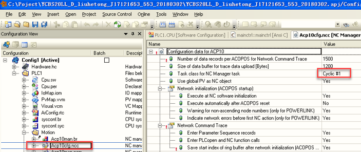                                                                                                                                                                                                                                                                                                                                                                                                                                                                                                                                                                                                                                                                                                                                                                                                                                                                                                                                      |
| 2022.07.22 报警64006、32037、1012、32189：网线松动                                                                                                                                                                                                                                                                                                                                                                                                                                                                                                                                                                                                                                                                                                                                                                                                                                                                                                                                                                                                                                                                                 |
| 2023.02.14 1.这个通常是网络超时掉线了。优先检查从控制器（触摸屏后的背包）-\>8口HUB交换机\>驱动器之间的电缆是否都是正常，无磨损及松动。 2.检查网络拓扑是否符合规范。8口HUB交换机理论上需要连接4个网口，如果不是请联系电气工程师进行改线操作指引。 3.重点检查掉线的站点，即PLK接入的站点拨码是否正确以及网口是否工作正常。 例如: 3.1 驱动器L/D1 L/D2如果都接入网络电缆后，接口网线的网口应该是正常闪烁。R/E应该绿色常亮。   3.2 IO从站模块，L/A IF1 IF2 如果接入了网络电缆后，接口网线的网口应该是正常闪烁的。S/E应该是绿色常亮 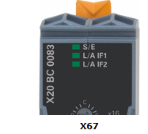 3.3如果某个站点掉线后，可以尝试更换站点的电缆的网口。如果X20BC0083上有两个网口，如果其中一个网口接入后没反应，可以插入另一个网口试试。 4.如果电缆过长或者PLK站点超过了该项目的设计值时，可能会出现该错误，排除电缆的长度以及站点数目的问题。 5.互换8口HUB交换机，互换网络电缆排除。 6.检查8口HUB交换机，网络通信电缆是否为贝加莱原装产品。如果不是，请联系电气工程师，更换为贝加莱原装产品。 7.是否进线380V电压掉电。当出现该情况时，驱动器上存储的电能用完后，每个驱动器站点将会陆续报这个错误代码。 |
| 20230.07.04 **现象** 使用ACOPOS与AC141模块，报32189与32010。同一版程序在多台设备上正常运行，仅一台设备出现此问题，且更换过ACOPOS 与AC141模块 **原因** 主要问题是AC141模块与ACOPOS壳体的固定不紧，造成模块断电（也是可能导致与ACOPOS的连接故障32189的原因之一）。已紧固AC141的锁紧螺丝。                                                                                                                                                                                                                                                                                                                                                                                                                                                                                                                                                                                                                                                                                                                                                                                                                                            |
| 2023.07.04 **现象** 机器运行之后发生了某一驱动器报错，32037 32189 1012 ，其他驱动器没有报错 **原因** POWERLINK网络通信质量问题 **解决方式** 重新拔插POWERLINK线缆后，问题解决。 需要校核POWERLINK网络质量，优化参数                                                                                                                                                                                                                                                                                                                                                                                                                                                                                                                                                                                                                                                                                                                                                                                                                                                                                                                |
| 2023.07.04 **现象** 32189故障出现比较频繁，基本上每天都会出现一次，有时候一天会出现两次。 **解决方式** 修改 AC141 上面的 IF2 CAN 通讯口的 CAN 通讯波特率为 500 CAN Properties I/O处参数Slave Timeout 为10000， No. Of Entries 为 5                                                                                                                                                                                                                                                                                                                                                                                                                                                                                                                                                                                                                                                                                                                                                                                                                                                                                                 |
| 2023.07.04 **现象** 使用ACOPOSmulti，电源轴 8BVP1650HC00.000-1经常报出32189错误。 **解决方式** 更改 PLK网线顺序，加电源轴谐波滤波参数和更改电源轴复用模式。 1. 电源轴参数表调整  2. 电源轴PLK参数调整  3. PLK进线顺序调整，先进逆变轴，把电源轴放在末端。                                                                                                                                                                                                                                                                                                                                                                                                                                                                                                                                                                                                                                                                                                                                                                            |
| 2023.07.04 **现象** 现场生产时，伺服网络断报警32189导致停机，不同驱动器都出现过该报警。 **解决方式** 现场更换主电柜HUB后没有再出现过该问题。                                                                                                                                                                                                                                                                                                                                                                                                                                                                                                                                                                                                                                                                                                                                                                                                                                                                                                                                                                                       |
| 2023.07.04 **现象** 32280为上电启动时报警，初始化失败，驱动器PLK异步段通信超时。 32189为运行过程中，驱动器PLK同步段通信超时，相比起来更为严重。  **排查方式** 在不改动接线的基础上，遵循以下检查接线，插拔并观察HUB和驱动器网口指示灯。 1.HUB级数不宜超过4 2.以太网通信的ETH线缆和伺服驱动的PLK线缆，没有任何混合（即进入同一HUB） 3.线缆插口松紧情况查看，是否轻微手动碰触会造成通讯灯不亮 4.现场PLK线缆必须使用贝加莱原装线缆，不用普通以太网线缆代替 5.各路24V电源及驱动器机身的接地情况 6.检查线缆两端插头及线体本身 7.安排一组新的线缆和HUB在此现场更换  **相关建议** 如果按上述接线检查不存在问题的话，建议以下操作： 1.增加一个HUB给PLK用，减少各个节点的HUB级数 2.增加程序里的从站节点Response Timeout(25us-\>50us)，增加程序里的主站节点Asynchronous TimeOut(25us-100us)                                                                                                                                                                                                                                                                                                                                                  |
| 2023.07.04 **现象** 厂里调试设备多次报错32189故障，监控PLK的参数值FailedCycleCount参数有变化： 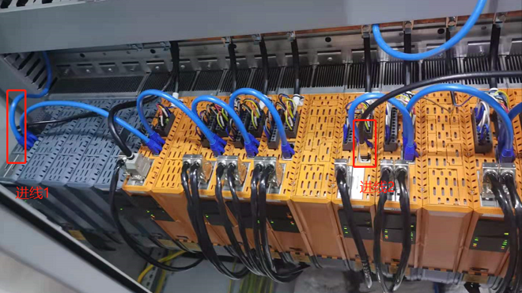 从HUB两个进线进入驱动器（如上图所示），如果把进线1改为末端逆变模块进入，32189故障没有，怀疑是电源轴的谐波干扰导致。  **解决方式** 后来把motion版本由5.10.1更新到5.14.2（该版本可以有效的过滤谐波）， 同时在电源轴参数表里配置ID1697--\>1和ID1698--\>1，过滤谐波就生效，恢复原有PLK接线，32189故障也消失                                                                                                                                                                                                                                                                                                                                                                                                                                                                                                                                                                                                                                                                             |
| 2023.07.04 **现象** 生产过程中出现报警29265、32189等故障，偶尔驱动先报警29265，重启上电后正常但运行一段时间后又会突然出现 **解决方式** 调整了PLK网络布局，更换PLK线缆，仍未解决问题 更换出问题的驱动器后解决                                                                                                                                                                                                                                                                                                                                                                                                                                                                                                                                                                                                                                                                                                                                                                                                                                                                                                                       |
| 2023.07.04 使用ACOPOSmulti双电源并联方案，由于谐波导致的32189问题。可通过使用motion 5.16及以上的版本改善谐波，不需要单独在SPT中增加谐波抑制功能。                                                                                                                                                                                                                                                                                                                                                                                                                                                                                                                                                                                                                                                                                                                                                                                                                                                                                                                                                                                  |
| 2023.07.04 用了时间较旧的0AC808.9会产生POWERLINK通讯问题 (ACOPOS 32189错误)，而且目前都已经升级为0AC808.9-1了。                                                                                                                                                                                                                                                                                                                                                                                                                                                                                                                                                                                                                                                                                                                                                                                                                                                                                                                                                                                                                    |
| 2023.07.07 检查对应的驱动器的网线是否插好，是否是网线问题。 如果网线没有问题，检查驱动器的通讯卡上指示灯状态，是否通讯卡损坏。                                                                                                                                                                                                                                                                                                                                                                                                                                                                                                                                                                                                                                                                                                                                                                                                                                                                                                                                                                                                     |

## 32190：定义通过软件选择节点号的写入 COB 时出错

描述：

"通过软件选择节点号"功能允许用户通过特定的软件协议在应用程序中设置用于ACOPOS的节点号，而不是使用ACOPOS硬件上提供的节点号开关。

对于通过CAN网络运行ACOPOS伺服驱动器，对于此功能，必须为NC配置中定义的每个CAN接口定义单独的写入COB，其功能为CAN_defineCOB（）。如果此过程发生错误，则输出此错误号。

反应：

对于使用"通过软件选择节点号"功能并连接到此CAN接口的所有ACOPOS节点，初始化都将中止。不能再操作所有相应的 NC 对象。

原因/补救措施：

CAN_defineCOB（） 的状态：请参见 CAN 库错误号

## 32191：此参数 ID 是为 PLCopen MC 库保留的

描述：

如果对于用于参数传递的 NC 操作，指定了参数 ID（该 ID 是为 PLCopen MC 库保留的），则会显示此错误。

反应：

相应 NC 操作的处理将中止。

原因/补救措施：

不要在应用程序中使用此参数 ID。

## 32192：指定的数据模块不是 INIT 参数模块

描述：

如果对于将数据保存到 INIT 参数模块中的 NC 操作，指定的数据模块不是 INIT 参数模块，则会显示此错误。

反应：

相应 NC 操作的处理将中止。

原因/补救措施：

指定 INIT 参数模块的名称。

## 32193：对于此 NC 对象类型，不存在 INIT 参数模块

描述：

为了处理 NC 对象类型的 NC 操作"ncGLOBAL，ncSAVE"或"ncSETUP+ncCONTroller，ncSAVE"，在启动期间，目标系统上必须至少存在一个 NC 对象类型的 INIT 参数模块，该模块在 NC 映射表中分配给 NC 对象。否则，当调用 NC 操作"ncGLOBAL，ncSAVE"或"ncSETUP+ncCONTROLLER，ncSAVE"时，将显示此错误。

反应：

NC 操作"ncGLOBAL，ncSAVE"的处理已中止。

原因/补救措施：

必须将此 NC 对象类型的 INIT 参数模块指定给 NC 映射表中的 NC 对象，并将其传输到目标系统。

## 32194：未为此 NC 对象类型实现此函数

描述：

如果调用了 NC 操作（该操作仅针对某些 NC 对象类型实现，而不对当前使用的 NC 对象实现），则会显示此错误。

反应：

将不处理 NC 操作。

原因/补救措施：

不要为此 NC 对象类型调用此 NC 操作。

## 32195：将BsLoader下载到ACOPOS时出错

描述：

"acp10bsl"对象中的数据由 NC 管理器作为 BsLoader 传输到 ACOPOS。如果在此过程中发生错误，则输出此错误号。有关所发生错误的附加错误记录中还会输出更多详细信息。

反应：

BsLoader到ACPOS的传输被中止。

原因/补救措施：

将BsLoader转移到ACOPOS期间出错。

确切的原因可以从其他错误记录中输入的详细信息来确定。

## 32196：将操作系统下载到 ACOPOS 时出错

描述：

"acp10sys"对象中的数据由 NC 管理器作为操作系统传输到 ACOPOS。如果在此过程中发生错误，则输出此错误号。有关所发生错误的附加错误记录中还会输出更多详细信息。

反应：

将操作系统传输到 ACOPOS 将中止。

原因/补救措施：

在将操作系统传输到 ACOPOS 期间。

确切的原因可以从其他错误记录中输入的详细信息来确定。

## 32197：将 BsLoader 下载到 ACOPOS 时出错（记录器中的其他信息）

描述：

"acp10bsl"对象中的数据由 NC 管理器作为 BsLoader 传输到 ACOPOS。如果在此过程中发生错误，则输出此错误号。记录器中还提供了有关所发生错误的更多详细信息。

反应：

ACOPOS 启动功能已中止。

原因/补救措施：

将操作系统传输到 ACOPOS 期间出错。

确切的原因可以从记录器中输入的详细信息确定。

另请参阅错误号 [32198](#32198将操作系统下载到-acopos-时出错记录器中的其他信息).

## 32198：将操作系统下载到 ACOPOS 时出错（记录器中的其他信息）

描述：

"acp10sys"对象中的数据由 NC 管理器作为操作系统传输到 ACOPOS。如果在此过程中发生错误，则输出此错误号。记录器中还提供了有关所发生错误的更多详细信息。

反应：

ACOPOS 启动功能已中止。

原因/补救措施：

将操作系统传输到 ACOPOS 期间出错。

确切的原因可以从记录器中输入的详细信息确定。

以下记录器编号的信息包含以下详细信息：

\- 10940：ACP10 软件错误号（在本文档中描述）

\- 10941：ACP10 软件错误号（在本文档中描述）

\- 10942：10941 中错误号的信息（如果未提供 10941，则为 10940）

\- 10943：发生错误的参数 ID

\- 10965：发生错误的 ACOPOS 的节点号

另请参阅错误号 [32018](#32018系统模块中的参数-id-无效).

## 32200： 调用 plAcycWrite() 时出错（读取参数）

描述：

要从 ACOPOS 读取参数值，NC 管理器首先通过调用函数 plAcycWrite（） 发送非循环读取请求帧。如果此过程发生错误，则输出此错误号。

反应：

重置相应非循环 POWERLINK 读取通道的接口。

原因/补救措施：

确切的原因可以从plAcycWrite（）的状态中确定。

过载，故障或网络连接中断或ACPOS故障。

## 32201： 调用 plAcycWrite()（写入参数） 时出错

描述：

要将参数值传输到 ACOPOS，NC 管理器首先通过调用函数 plAcycWrite（） 发送一个非循环写入请求帧。如果此过程发生错误，则输出此错误号。

反应：

重置相应非循环 POWERLINK 写入通道的接口。

原因/补救措施：

确切的原因可以从plAcycWrite（）的状态中确定。

## 32202： 调用 plAcycRead()时出错（读取参数）

描述：

为了从 ACOPOS 读取参数值，NC 管理器调用函数 plAcycRead（）以便从 ACOPOS 接收非循环写入响应帧。

反应：

重置相应非循环 POWERLINK 读取通道的接口。

原因/补救措施：

确切的原因可以从plAcycRead（）的状态中确定。

## 32203： 调用 plAcycRead() （写入参数） 时出错

描述：

将参数值传输到 ACOPOS 后，NC 管理器调用函数 plAcycRead（）以便从 ACOPOS 接收非循环写入响应帧。

反应：

重置相应非循环 POWERLINK 写入通道的接口。

原因/补救措施：

确切的原因可以从plAcycRead（）的状态中确定。

## 32204：通过非循环通道读取标准值时超时(驱动器是否在网络中？)

描述：

要从 ACOPOS 读取参数值，NC 管理器首先将非循环读取请求帧从 PLC 发送到 ACOPOS。如果在进行 POWERLINK 发送函数调用后的特定时间内，NC 管理器无法使用 POWERLINK 库从 ACOPOS 读取相应的非循环读取响应帧，则会显示此错误。

反应：

重置相应非循环 POWERLINK 读取通道的接口。

原因/补救措施：

过载，故障或网络连接中断或ACPOS故障。

另请参阅错误号 [1012](#1012循环网络通信的崩溃).

| 应用案例                                                           |
|--------------------------------------------------------------------|
| 2022.01.10 请重新上电，故障是否仍然存在请更换驱动器上的AC114通讯卡 |

## 32205：通过非循环通道写入时超时(驱动器是否在网络中？)

描述：

为了将参数值传输到 ACOPOS，NC 管理器首先将非循环写入请求帧从 PLC 发送到 ACOPOS。如果在进行 POWERLINK 发送函数调用后的特定时间内，NC 管理器无法使用 POWERLINK 库从 ACOPOS 读取相应的非循环写入响应帧，则会显示此错误。

反应：

重置相应非循环 POWERLINK 写入通道的接口。

原因/补救措施：

过载，故障或网络连接中断或ACPOS故障。

另请参阅错误号[1012](#1012循环网络通信的崩溃).

## 32206：循环通道：尽管等待响应，但仍读取请求

描述：

要从 ACOPOS 读取参数值，NC 管理器首先将循环 POWERLINK 帧中的读取请求数据输入到 ACOPOS，然后等待相应的读取响应数据。如果在 NC 管理器中调用了输入读取请求数据的函数，则显示此错误，尽管等待响应数据在此通道上仍处于活动状态。

反应：

输入读取请求数据的函数已中止

原因/补救措施：

致命的 NC 管理器错误。

保存记录器数据和网络跟踪，并联系支持人员。

## 32207：循环通道：尽管等待响应，但仍写入请求

描述：

要从 ACOPOS 传输参数值，NC 管理器首先将循环 POWERLINK 帧中的写入请求数据输入到 ACOPOS，然后等待相应的写入响应数据。如果在 NC 管理器中调用了输入写入请求数据的函数，则显示此错误，尽管等待响应数据在此通道上仍处于活动状态。

反应：

输入写入请求数据的函数已中止

原因/补救措施：

致命的 NC 管理器错误。

保存记录器数据和网络跟踪，并联系支持人员。

## 32208：使用 plAction（DEVICE_TO_BUS_NR） 时出错（记录器中的其他信息）

描述：

对于通过POWERLINK网络操作ACOPOS伺服驱动器，除其他外，调用了plAction（GET_PDO_INFO）功能。如果此过程发生错误，则输出此错误号。

反应：

对于相应的 NC 对象，ACOPOS 启动功能将中止。这些 NC 对象不能再操作。

原因/补救措施：

更正"信息"中列出的 POWERLINK 错误。

从 Automation Studio V4.0 开始，当使用真实 CPU 作为目标平台时，可以切换到基于 ARsim 的 CPU 仿真，而无需更改 ACOPOS 仿真的设置。

如果将基于 ARsim 的 CPU 仿真用于 V2.380 之前的 ACP10 版本，则对于以下所有有效的 ACOPOS 轴，将显示此错误号和 Info 20903：

\- ACOPOS模拟已打开此轴

\- 对于同一 POWERLINK 接口上的其他轴，ACOPOS 仿真已关闭

为避免此问题，必须为 NC 映射表中的所有轴显式打开 ACOPOS 仿真。

切换到ACP10版本V2.380或更高版本时不再出现此问题，因为当将ARsim与这些ACP10版本一起使用时，ACOPOS仿真会自动打开。

## 32209：使用 plAction（GET_IDENT） 时出错（记录器中的其他信息）

描述：

对于通过POWERLINK网络操作ACOPOS伺服驱动器，除其他外，调用了plAction（GET_IDENT）功能。如果此过程发生错误，则输出此错误号。

反应：

对于相应的 NC 对象，ACOPOS 启动功能将中止。这些 NC 对象不能再操作。

原因/补救措施：

有关原因的更多信息可以从 plAction（） 的状态和在记录器中输入的详细信息来确定。

更改自动化运行时版本。

## 32210：调用 plState（） 时接口标识错误（记录器中的其他信息）

描述：

如果使用 plAction（GET_IDENT） 确定的 POWERLINK 接口的 ID 在调用 plState（） 时导致错误plSTATE_WRONG_IDENT，则会显示此错误。

反应：

对于相应的 NC 对象，ACOPOS 启动功能将中止。这些 NC 对象不能再操作。

原因/补救措施：

有关原因的详细信息，请输入到记录器中。

更改Automation Runtime版本。

## 32211：调用 plState（） 时接口不可用（记录器中的其他信息)

描述：

如果使用 plAction（GET_IDENT） 确定的 POWERLINK 接口的 ID 在调用 plState（） 时导致错误plSTATE_STATION_NONEXISTANT，则会显示此错误。

反应：

对于相应的 NC 对象，ACOPOS 启动功能将中止。这些 NC 对象不能再操作。

原因/补救措施：

有关原因的详细信息，请输入到记录器中。

更改Automation Runtime版本。

## 32212：调用 plState（） 时出现致命接口错误（记录器中的其他信息）

描述：

如果 POWERLINK 接口的 ID（使用 plAction（GET_IDENT） 确定）在调用 plState（） 时导致错误plSTATE_STATION_FAILED，则会显示此错误。

反应：

对于相应的 NC 对象，ACOPOS 启动功能将中止。这些 NC 对象不能再操作。

原因/补救措施：

有关原因的详细信息，请输入到记录器中。

更改Automation Runtime版本。

更改 POWERLINK 接口卡。

## 32213：POWERLINK 接口超时（记录器中的其他信息）

描述：

如果 POWERLINK 接口的启动未在一定时间内完成，则会显示此错误。

反应：

对于相应的 NC 对象，ACOPOS 启动功能将中止。这些 NC 对象不能再操作。

原因/补救措施：

更改Automation Runtime版本。

更改 POWERLINK 接口卡。

有关原因的详细信息，请输入到记录器中。

## 32214： 调用 plAcycOpen（） 时出错（记录器中的其他信息）

描述：

对于通过POWERLINK网络操作ACOPOS伺服驱动器，必须使用plAcycOpen（）功能打开非循环通信通道。如果此过程发生错误，则输出此错误号。

反应：

对于相应的 NC 对象，ACOPOS 启动功能将中止。这些 NC 对象不能再操作。

原因/补救措施：

有关原因的更多信息可以从plAcycOpen（）的状态和记录器中输入的详细信息来确定。

重新生成配置并将其传输到目标。

更改Automation Runtime版本。

## 32215： 调用 plCECreate（） 时出错（记录器中的其他信息）

描述：

对于通过POWERLINK网络操作ACOPOS伺服驱动器，必须使用函数plCECreate（）创建循环POWERLINK副本条目。如果此过程发生错误，则输出此错误号。

反应：

对于相应的 NC 对象，ACOPOS 启动功能将中止。这些 NC 对象不能再操作。

原因/补救措施：

有关原因的更多信息可以从 plCECreate（） 的状态和记录器中输入的详细信息来确定。

重新生成配置并将其传输到目标。

更改Automation Runtime版本。

## 32216：使用 plAction（GET_IF_PAR） 时出错（记录器中的其他信息）

描述：

对于通过POWERLINK网络操作ACOPOS伺服驱动器，除其他外，调用了plAction（GET_IF_PAR）功能。如果此过程发生错误，则输出此错误号。

反应：

对于相应的 NC 对象，ACOPOS 启动功能将中止。这些 NC 对象不能再操作。

原因/补救措施：

有关原因的更多信息可以从 plAction（） 的状态和在记录器中输入的详细信息来确定。

更改Automation Runtime版本。

## 32217： 广播频道： 调用 plAcycWrite（） 时出错（读取参数）

描述：

为了通过广播通道读取参数值，NC 管理器通过调用函数 plAcycWrite（） 发送一个非循环读取请求帧。如果此过程发生错误，则输出此错误号。

反应：

重置相应非循环 POWERLINK 广播通道的接口。

原因/补救措施：

确切的原因可以从plAcycWrite（）的状态中确定。

## 32218： 广播频道： 调用 plAcycWrite（） 时出错（写入参数）

描述：

为了通过广播通道传输参数值，NC 管理器首先通过调用函数 plAcycWrite（） 发送一个非循环写入请求帧。如果此过程发生错误，则输出此错误号。

反应：

重置相应非循环 POWERLINK 广播通道的接口。

原因/补救措施：

确切的原因可以从plAcycWrite（）的状态中确定。

## 32219：使用 plAction（GET_IF_MUXPRESCALE） 时出错（记录器中的其他信息）

描述：

对于通过POWERLINK网络操作ACOPOS伺服驱动器，除其他外，调用了plAction（GET_IF_MUXPRESCALE）功能。如果此过程发生错误，则输出此错误号。

反应：

对于相应的 NC 对象，ACOPOS 启动功能将中止。这些 NC 对象不能再操作。

原因/补救措施：

有关原因的更多信息可以从 plAction（） 的状态和在记录器中输入的详细信息来确定。

更改Automation Runtime版本。

## 32220：使用 plAction（GET_IF_CYCLE_TIME） 时出错（记录器中的其他信息）

描述：

对于通过POWERLINK网络操作ACOPOS伺服驱动器，除其他外，调用了plAction（GET_IF_CYCLE_TIME）功能。如果此过程发生错误，则输出此错误号。

反应：

对于相应的 NC 对象，ACOPOS 启动功能将中止。这些 NC 对象不能再操作。

原因/补救措施：

有关原因的更多信息可以从 plAction（） 的状态和在记录器中输入的详细信息来确定。

更改Automation Runtime版本。

## 32221：使用 plAction（GET_IF_PRESCALE） 时出错（记录器中的其他信息）

描述：

对于通过POWERLINK网络操作ACOPOS伺服驱动器，除其他外，称为plAction（GET_IF_PRESCALE）功能。如果此过程发生错误，则输出此错误号。

反应：

对于相应的 NC 对象，ACOPOS 启动功能将中止。这些 NC 对象不能再操作。

原因/补救措施：

有关原因的更多信息可以从 plAction（） 的状态和在记录器中输入的详细信息来确定。

更改Automation Runtime版本。

## 32222：使用 plAction（GET_STATIONFLAG） 时出错（记录器中的其他信息）

描述：

对于通过POWERLINK网络操作ACOPOS伺服驱动器，除其他外，调用了plAction（GET_STATIONFLAG）功能。如果此过程发生错误，则输出此错误号。

反应：

对于相应的 NC 对象，ACOPOS 启动功能将中止。这些 NC 对象不能再操作。

原因/补救措施：

有关原因的更多信息可以从 plAction（） 的状态和在记录器中输入的详细信息来确定。

更改Automation Runtime版本。

## 32223： 调用 plGetNodeInfo（） 时出错（记录器中的其他信息）

描述：

对于通过POWERLINK网络操作ACOPOS伺服驱动器，除其他外，调用了plGetNodeInfo（）函数。如果此过程发生错误，则输出此错误号。

反应：

对于相应的 NC 对象，ACOPOS 启动功能将中止。这些 NC 对象不能再操作。

原因/补救措施：

有关原因的更多信息可以从 plGetNodeInfo（） 的状态和在记录器中输入的详细信息来确定。

更改Automation Runtime版本。

## 32224： 调用 plAction（GET_PROTOCOL_VERSION） 时出错（记录器中的其他信息）

描述：

对于通过POWERLINK网络操作ACOPOS伺服驱动器，除其他外，称为plAction（GET_PROTOCOL_VERSION）功能。如果此过程发生错误，则输出此错误号。

反应：

对于相应的 NC 对象，ACOPOS 启动功能将中止。这些 NC 对象不能再操作。

原因/补救措施：

有关原因的更多信息可以从 plAction（） 的状态和在记录器中输入的详细信息来确定。

更改Automation Runtime版本。

## 32225：此 ACOPOS POWERLINK 节点在 AR 配置中不存在

描述：

如果 ACOPOS 模块在 NC 配置（NC 映射表）中作为 POWERLINK 节点包含在，但在 AR 配置中未包含，则指示此错误。

反应：

此 ACOPOS 的 ACOPOS 启动功能已中止。

此 ACOPOS 模块的所有 NC 对象的操作均处于禁用状态。

原因/补救措施：

新创建 AR 配置和 NC 配置，以便它们匹配。

## 32226：模块 acp10cfg 中的 SDC 节点号无效

描述：

对于 V3.0 之前的 Automation Studio 版本，硬件树中配置的所有 ACOPOS 模块的节点号都将输入到模块 acp10cfg 中。当 SDC 接口的节点号定义在有效范围（1 到 200）之外时，将显示此错误。

注意：

如果发生此错误，则会在记录器中输入二进制数据中具有此错误号的以下错误：

\- 10550：读取 NC CFG 模块："二进制数据"中的 NC 管理器错误

此外，在记录器中输入了以下错误，其中二进制数据中的状态值为"if_index \* 256 + node_nr"：

\- 10551：读取 NC CFG 模块："二进制数据"中 NC 管理器错误的状态

反应：

NC 软件的初始化将中止。不能操作 NC 对象。

原因/补救措施：

删除硬件树中具有无效节点号的 ACOPOS 模块。

重建模块 acp10cfg 并将其传输到目标。

NC 软件版本的更改。

Automation Studio的更改。

## 32227：重复使用模块 acp10cfg 中的 SDC 节点号

描述：

对于 V3.0 之前的 Automation Studio 版本，硬件树中配置的所有 ACOPOS 模块的节点号都将输入到模块 acp10cfg 中。如果对于 SDC 接口多次定义节点号，则会显示此错误。

注意：

如果发生此错误，则会在记录器中输入二进制数据中具有此错误号的以下错误：

\- 10550：读取 NC CFG 模块："二进制数据"中的 NC 管理器错误

此外，在记录器中输入了以下错误，其中二进制数据中的状态值为"if_index \* 256 + node_nr"：

\- 10551：读取 NC CFG 模块："二进制数据"中 NC 管理器错误的状态

反应：

NC 软件的初始化将中止。不能操作 NC 对象。

原因/补救措施：

在每个 SDC 接口上为 ACOPOS 模块定义每个节点号仅一次。

重建模块 acp10cfg 并将其传输到目标。

NC 软件版本的更改。

Automation Studio的更改。

## 32228： acp10cfg 中不包含网络接口（POWERLINK 或 SDC）

描述：

当使用此ACP10MAN变体（ACP10MAN用于POWERLINK和SDC）时，具有POWERLINK或SDC类型的网络接口必须包含在模块acp10cfg中。如果不是这种情况，则会显示此错误。

注意：

如果发生此错误，则会在记录器中输入二进制数据中具有此错误号的以下错误：

\- 10550：读取 NC CFG 模块："二进制数据"中的 NC 管理器错误

反应：

NC 软件的初始化将中止。不能操作 NC 对象。

原因/补救措施：

在 ACP10 配置中插入 POWERLINK 或 SDC 类型的网络接口。

重建模块 acp10cfg 并将其传输到目标。

将另一个ACP10MAN变体（ACP10MAN for CAN）插入到项目中并将其传输到目标。

## 32229：运行 SDC 轴所需的 SDC 对象不存在

描述：

对于 SDC 轴的操作，目标系统上必须存在 acp10sdc 库。如果不是这种情况，则指示此错误。

反应：

SDC 轴的 ACOPOS 启动功能已中止。这些 NC 对象不能再操作。

原因/补救措施：

必须将库 acp10sdc 传输到目标系统。

## 32230：初始化 SDC oder SIM 对象时出错（请参见记录器）

描述：

对于具有 acp10sdc 或 acp10sim 的轴的操作，必须调用初始化函数。如果此函数不可用或在处理此函数期间发生错误，则会显示此错误。

反应：

对于相应的 NC 对象，ACOPOS 启动功能将中止。这些 NC 对象不能再操作。

原因/补救措施：

确切的原因可以从记录器中输入的详细信息确定。例如，如果在记录器中显示错误"找不到 PV"，则这可能是由该错误引起的，即已声明 PV 但未使用。

NC 软件版本的更改。

| 应用案例                                                                                                                                                                                                                                                                                                                                                                                                   |
|------------------------------------------------------------------------------------------------------------------------------------------------------------------------------------------------------------------------------------------------------------------------------------------------------------------------------------------------------------------------------------------------------------|
| 2023.07.04 **现象** 使用工控机控制SDC轴报错32230，复位后报错29265 **解决方式** SDC程序中需要  1.根据实际硬件调整PLK口站点； 2.并且需要将程序放在Cyclic 1，保证时序准确；选择“输出无抖动”。堆栈要改为32000，默认的8192会引起“Page Fault”错误。  3.任务周期不能有Torlerence，即参数为0. 4. PLC的时钟选PLK 5. 任务周期不能大于10ms，否则会造成系统不停的重启。 |

## 32231：SDC 配置时出错（请参见记录器）

描述：

如果 SDC 接口的配置不正确，则会显示此错误。

反应：

NC 软件的初始化将中止。不能操作 NC 对象。

原因/补救措施：

确切的原因可以从记录器中输入的详细信息确定。

## 32232：ACOPOS 仿真所需的 SIM 对象不存在

描述：

如果为 NC 对象激活了 ACOPOS 模拟，则 ACP10sim 库将模拟 ACOPOS 功能。如果在这种情况下，目标系统上不存在库 acp10sim，则指示此错误。

反应：

对于相应的 NC 对象，ACOPOS 启动功能将中止。这些 NC 对象不能再操作。

原因/补救措施：

必须将库 acp10sim 传输到目标系统。

## 32233：NCBSL（名称见记录器）不包含模块类型为 0x4F 的 NC 系统模块

描述：

名称为"acp10bsl"的 BR 模块必须包含模块类型为 0x4F 的 BR 模块（NC 系统模块）。如果不是这种情况，则指示此错误。

反应：

ACOPOS 启动功能已中止。NC 对象不能再操作。

原因/补救措施：

名称"acp10bsl"用于与ACOPOS BsLoader模块不同的对象。必须在目标系统上重命名或删除此对象。

## 32234：NCSYS（名称见记录器）不包含模块类型为 0x4F 的 NC 系统模块

描述：

名称为"acp10sys"的 BR 模块必须包含模块类型为 0x4F 的 BR 模块（NC 系统模块）。如果不是这种情况，则指示此错误。

反应：

ACOPOS 启动功能已中止。NC 对象不能再操作。

原因/补救措施：

名称"acp10sys"用于与ACOPOS操作系统模块不同的对象。必须在目标系统上重命名或删除此对象。

## 32235：参数序列中参数的数据地址为零

描述：

对于格式为"ncFORMAT_ADR"的参数序列，必须在参数"data_adr"的每个参数记录中指定参数数据的地址。如果此参数在参数记录中为零，则此错误将与参数记录的索引一起显示为信息。

反应：

此 NC 操作的处理将中止。

原因/补救措施：

使用正确的数据地址初始化每个参数记录中的参数"data_adr"。

## 32236：参数列表中参数的数据地址为零

描述：

对于格式为“ncFORMAT_ADR”的参数列表，必须在参数“data_adr”的每个参数记录中指定参数数据的地址。 如果该参数在参数记录中为零，则该错误将显示为参数记录的索引作为信息。

反应：

该 NC 动作的处理被中止。

原因/补救措施：

用正确的数据地址初始化每个参数记录中的参数“data_adr”。

## 32237：模块 acp10cfg 中 ACOPOS 参数的通道索引无效

描述：

由硬件配置产生的初始 ACOPOS 参数包含在模块 acp10cfg 的数据部分中。 如果在参数标题中输入了无效的频道索引，则会显示此错误。

反应：

NC 软件的初始化被中止。 不能操作任何 NC 对象。

原因/补救措施：

此 Automation Studio 版本错误地创建了模块 acp10cfg 中的 ACOPOS 参数数据。

Automation Studio 版本的更改。

删除硬件配置中的ACOPOS模块、ACOPOS插卡或电机，重新创建模块acp10cfg。

从 ACP10-Software V2.410 开始的解决方法：

通过将以下 XML 属性输入到 NC 映射表中 NC 对象类型“ncMANAGER”的数据记录的“附加数据”列中，可以禁用从模块 acp10cfg 传输 ACOPOS 参数：

\- AcoposPar_Acp10cfg_Disabled="1"

## 32238：这个功能暂时没有实现

描述：

如果调用了 NC 操作，但此时未执行（尚未执行或不再执行），则会显示此错误。

反应：

不处理 NC 动作。

原因/补救措施：

不要将此称为 NC 操作。

## 32239：无法分配 INIT 参数模块的基本内存

描述：

为了将数据保存到 INIT 参数模块中，需要在 NC 软件初始化期间分配的基本存储器。 如果此过程发生错误，则在调用用于将数据保存到 INIT 参数模块的 NC 操作时会显示此错误。

反应：

相应的 NC 动作的处理被中止。

原因/补救措施：

没有足够的可用内存。

在 OS 区域配置更多内存。

## 32240：NC 对象数据无效（变量声明中具有 INIT 值的 PV？）

描述：

NC 对象数据由 NC 管理器初始化。 如果识别出某些 NC 对象数据已被无效值覆盖，则指示此错误，否则由 NC 管理器初始化的值将被覆盖。

反应：

该 NC 对象的操作被禁用。

原因/补救措施：

如果一个 PV 用于一个 NC 对象，对于这个 PV，在变量声明中不能定义一个 INIT 值，否则由 NC 管理器初始化的 NC 对象数据将被覆盖。 对于这样的 PV，必须禁用 INIT 值。

## 32241：数据块操作：数据模块名称必须为零

描述：

对于某些数据块操作，不允许指定数据模块名称。 如果对于此类 NC 操作，参数“parameter.data_modul[0]”设置为非零值，则会显示此错误。

反应：

相应的 NC 动作的处理被中止。

原因/补救措施：

指定数据模块名称..

## 32243：使用 plAction(GET_PDO_INFO) 时出错（记录器中的附加信息）

描述：

为了通过 POWERLINK 网络操作 ACOPOS 伺服驱动器，其中调用了函数 plAction(GET_PDO_INFO)。如果此过程发生错误，则输出此错误编号。

反应：

该 ACOPOS 的 ACOPOS 启动功能被中止。

原因/补救措施：

更正信息中列出的 POWERLINK 错误。

从Automation Studio V4.0开始，当使用真实的CPU作为目标平台时，可以切换到基于ARsim的CPU模拟，而无需更改ACOPOS模拟的设置。

如果基于 ARsim 的 CPU 模拟与 V2.380 之前的 ACP10 版本一起使用，那么对于关闭 ACOPOS 模拟的所有轴，都会显示带有信息 20903 的错误编号。为避免此问题，必须为 NC 映射表中的所有轴明确打开 ACOPOS 模拟。

切换到 ACP10 版本 V2.380 或更高版本时不再出现此问题，因为在这些 ACP10 版本中使用 ARsim 时会自动打开 ACOPOS 模拟。

## 32244：此通道的循环帧中未定义 PDO：通道已禁用

描述：

如果在 POWERLINK 配置的过程数据映射中没有为 ACOPOS 模块的一个通道（一个轴）定义数据点，则会显示此错误。

反应：

该通道（该轴）的处理被禁用。

原因/补救措施：

ACOPOS 多轴模块的通道 2 被禁用，因为“单轴”被选为操作模式。 如果选择“双轴”作为操作模式（或“用户配置”并激活轴 2 的数据点），则只能使用通道 2。

ACOPOS 多轴模块的通道 3 被禁用，因为选择了“单轴”或“双轴”作为操作模式。 如果选择“三轴”作为操作模式（或“用户配置”并激活轴 3 的数据点），则只能使用通道 3。

## 32245：无法分配用于操作广播频道的内存

描述：

为了耦合不同网络上的轴，必须为耦合从站的网络接口组态广播通道。

如果无法分配用于操作广播频道的内存，则会显示此错误。

反应：

此 POWERLINK 接口的耦合从站不能耦合到另一个网络接口的耦合主站。

原因/补救措施：

没有足够的可用内存。

在 OS 区域配置更多内存。

## 32246：POWERLINK 广播频道的“方向”不是“输出”

描述：

为了耦合不同网络上的轴，必须为耦合从站的网络接口组态广播通道。 如果耦合从站配置在 POWERLINK 接口上，则必须在 POWERLINK 配置中为此接口定义名为“ACP10_MC_BROADCAST”的广播通道。

如果对于 POWERLINK 接口，定义了名称为“ACP10_MC_BROADCAST”的数据点，并为其定义了另一个“方向”作为“输出”，则会显示此错误。

反应：

此 POWERLINK 接口的耦合从站不能耦合到另一个网络接口的耦合主站。

原因/补救措施：

除了用于耦合不同网络上的轴之外，请勿出于任何目的定义名称为“ACP10_MC_BROADCAST”的数据点。

## 32247：使用 plAction(GET_TC_INFO) 时出错（记录器中的附加信息）

描述：

如果在 NC 配置中为此网络接口定义了“ACP10_MC_BROADCAST=Yes 的扩展耦合数据”，则扩展耦合数据将用于网络接口。

为了使用精确的时间戳而不是简单的计数器，有必要通过调用 plAction(GET_TC_INFO) 来确定附加信息。 如果这个函数返回一个错误，这个错误号会存储在一个错误记录中，plAction() 的返回值作为信息。

如果调用了需要 plAction (GET_TC_INFO) 信息的 NC 动作，则指示存储的错误记录。

反应：

相应的 NC 动作的处理被中止。

原因/补救措施：

确切原因可以从 plAction() 的状态和在 Logger 中输入的详细信息确定。

## 32248：模块 acp10cfg 中的 ACOPOS 参数头无效（超出部分）

描述：

由硬件配置产生的初始 ACOPOS 参数包含在模块 acp10cfg 的数据部分中。 如果包含在参数标题中的引用指向此数据部分之外的区域，则会显示此错误。

反应：

NC 软件的初始化被中止。 不能操作任何 NC 对象。

原因/补救措施：

查看错误编号 [32237](#32237模块-acp10cfg-中-acopos-参数的通道索引无效).

## 32249：模块 acp10cfg 中的 ACOPOS 参数描述符无效（超出部分）

描述：

由硬件配置产生的初始 ACOPOS 参数包含在模块 acp10cfg 的数据部分中。 如果参数描述符中包含的引用指向此数据部分之外的区域，则会显示此错误。

反应：

用于从模块 acp10cfg 传输 ACOPOS 参数的功能在此 ACOPOS 中被中止。

原因/补救措施：

查看错误编号 [32237](#32237模块-acp10cfg-中-acopos-参数的通道索引无效).

## 32250：模块 acp10cfg 中的 ACOPOS 参数：参数数据的长度太大

描述：

由硬件配置产生的初始 ACOPOS 参数包含在模块 acp10cfg 的数据部分中。 如果在参数描述符中包含的参数数据长度大于允许的最大值，则会显示此错误。

反应：

用于从模块 acp10cfg 传输 ACOPOS 参数的功能在此 ACOPOS 中被中止。

原因/补救措施：

查看错误编号 [32237](#32237模块-acp10cfg-中-acopos-参数的通道索引无效).

## 32251：NcNetCyc：响应超时

描述：

要将参数值传送到 ACOPOS，NC 管理器首先在循环 POWERLINK 帧中向 ACOPOS 输入读取或写入请求。 如果在特定时间后未收到来自 ACOPOS 的循环 POWERLINK 帧中相应的读取或写入响应数据，则会显示此错误。

反应：

复位相应读或写通道的接口。

原因/补救措施：

网络连接过载、故障或中断或 ACOPOS 故障

查看错误码 [1004](#1004网络生命标志监视器超时).

查看错误码 [1012](#1012循环网络通信的崩溃).

## 32252：NcNetCyc：意外响应（无效的计数器值）

描述：

要将参数值传送到 ACOPOS，NC 管理器首先在循环 POWERLINK 帧中向 ACOPOS 输入具有特定计数器值的读或写请求。 如果来自 ACOPOS 的循环 POWERLINK 帧中包含具有不同于预期的计数器值的读取或写入响应数据，则会显示此错误。

反应：

复位相应读或写通道的接口。

原因/补救措施：

网络连接过载、故障或中断或 ACOPOS 故障。

查看错误码 [1004](#1004网络生命标志监视器超时).

查看错误码 [1012](#1012循环网络通信的崩溃).

## 32253：POWERLINK 输出循环触发器的任务类无效

描述：

在 POWERLINK 配置中，可以选择任务类作为输出循环触发器（默认情况下，输出循环触发器由系统滴答执行）。 如果为 POWERLINK 接口选择了比 NC 管理器任务的任务类更高的任务类，则会指示此错误。

反应：

对于连接到该 POWERLINK 接口的所有 ACOPOS 模块，ACOPOS 启动功能被中止。

原因/补救措施：

在 POWERLINK 配置中选择一个有效的任务类。.

## 32254：未定义 PDO 映射（此 ACOPOS ID 需要 PDO 映射）

描述：

对于具有此 ACOPOS ID 的 ACOPOS 模块，绝对需要在 POWERLINK 配置中定义过程数据映射。 如果不是这种情况，则会指示此错误。

反应：

该 ACOPOS 的 ACOPOS 启动功能被中止。

原因/补救措施：

对于此 ACOPOS 模块，必须使用硬件配置文件，通过该文件将过程数据映射输入到 POWERLINK 配置中.

## 32255：录播处于活动状态时不允许录播开始

描述：

之前启动的录播处于活动状态时，无法开始录播。

反应：

此操作的处理被中止。

原因/补救措施：

等待之前开始的录播完成。

中止之前启动的录播.

## 32256：录播触发器：无效数据

描述：

如果录播配置中的触发记录数不为零，则如果第一个触发记录的地址为零或触发记录包含无效的模块句柄，则会显示此错误。

反应：

录播处理被中止。

原因/补救措施：

将录播配置中的触发器记录数设置为零。

为每个触发记录定义有效数据。

从录播配置中删除无效的触发器记录.

## 32257：录播触发器：此 ACOPOS 未启用此通道

描述：

指定的通道不能在相应的 ACOPOS 硬件上使用。

反应：

录播处理被中止。

原因/补救措施：

定义在相应 ACOPOS 硬件上启用的通道。

从录播配置中删除此触发器记录.

## 32258：为一个通道定义了多个跟踪触发器

描述：

如果在录播配置中为一个通道定义了多个触发器，则会显示此错误。

反应：

录播处理被中止。

原因/补救措施：

每个通道仅定义一个触发器.

## 32259：当前没有要保存的录播数据

描述：

没有为此录播配置记录跟踪数据，可以将其保存到数据对象中。

反应：

保存录播数据的功能被中止。

原因/补救措施：

使用此配置进行录播，以便记录数据.

## 32260：录播：未定义有效的测试数据点

描述：

只有定义了至少一个有效的测试数据点，才能开始跟踪。 如果不是这种情况，则会指示此错误。

反应：

录播处理被中止。

原因/补救措施：

更正录播配置，以便至少定义一个有效的测试数据点.

## 32261：录播触发器：无效数据

描述：

不允许在多轴跟踪中使用此 NC 对象。 只能使用具有以下类型的 NC 对象：

\- 实轴

\- 虚拟轴

反应：

跟踪处理被中止。

原因/补救措施：

从跟踪配置中删除无效的 NC 对象或将其替换为有效的对象.

## 32262：录播测试数据点：无效数据

描述：

不允许在多轴录播中使用此 NC 对象。 只能使用具有以下类型的 NC 对象：

\- 实轴

\- 虚拟轴

反应：

录播处理被中止。

原因/补救措施：

从录播配置中删除无效的 NC 对象或将其替换为有效的对象。.

## 32263：录播触发器：此 ACOPOS 未启用此通道

描述：

该 NC 对象不能在相应的 ACOPOS 硬件上使用。

反应：

录播处理被中止。

原因/补救措施：

从录播配置中删除此 NC 对象。.

## 32264：录播测试数据点：此 ACOPOS 未启用此通道

描述：

该 NC 对象不能在相应的 ACOPOS 硬件上使用。

反应：

录播处理被中止。

原因/补救措施：

从录播配置中删除此 NC 对象。.

## 32265：录播触发器：此 NC 对象的录播在录播开始时已处于活动状态

描述：

如果没有涉及的 NC 对象录播处于活动状态，则只能启动多轴录播。

反应：

录播处理被中止。

原因/补救措施：

等待此 NC 对象的录播完成。.

## 32266：录播测试数据点：此 NC 对象的录播在录播开始时已处于活动状态

描述：

如果没有涉及的 NC 对象录播处于活动状态，则只能启动多轴录播。

反应：

录播处理被中止。

原因/补救措施：

等待此 NC 对象的录播完成。.

## 32267：录播触发器：未为录播命令启用 NC 对象

描述：

在以下情况下，不会为录播命令启用 NC 对象：

\- 对于相应的 ACOPOS 模块，启动尚未完成

\- 对应的trace通道已经在trace中使用

反应：

录播处理被中止。

原因/补救措施：

等待 ACOPOS 启动或之前启动的录播完成。.

## 32268：录播测试数据点：未为录播命令启用 NC 对象

描述：

在以下情况下，不会为录播命令启用 NC 对象：

\- 对于相应的 ACOPOS 模块，启动尚未完成

\- 对应的trace通道已经在trace中使用

反应：

录播处理被中止。

原因/补救措施：

等待 ACOPOS 启动或之前启动的录播完成。.

## 32269：录播：为一个录播通道定义的测试数据点太多

描述：

对于一个录播通道最大。 可以定义 10 个测试数据点。

一个录播通道属于一个ACOPOS 模块上具有相同通道号的实轴和虚轴。

反应：

录播处理被中止。

原因/补救措施：

减少测试数据点.

## 32270：ACOPOS 耦合：发送数据的通道号无效

描述：

只有值 1 到 3 对发送数据的通道号有效。 如果指定了不同的通道号，则会报告此错误。

笔记：

从 V2.370 开始显示 INFO。

反应：

相应的 NC 动作的处理被中止。

原因/补救措施：

指定用于激活发送数据的有效通道号.

## 32271：ACOPOS 耦合：接收数据的通道号无效

描述：

只有值 1 到 5 对接收数据的通道号有效。 如果指定了不同的通道号，则会报告此错误。

反应：

相应的 NC 动作的处理被中止。

原因/补救措施：

为接收数据的配置指定一个有效的通道号。.

## 32272：ACOPOS 耦合：未配置使用此通道号发送数据

描述：

如果在 ACOPOS 模块的 POWERLINK 配置中启用了相应的耦合对象，则耦合数据只能由耦合主站发送。 如果在 POWERLINK 配置中禁用了具有指定通道编号的耦合对象，则会报告此错误。

反应：

相应的 NC 动作的处理被中止。

原因/补救措施：

指定用于激活发送数据的其他通道编号。

在 POWERLINK 配置中启用具有指定通道编号的耦合对象。.

## 32273：ACOPOS 耦合：发送数据的 NC 对象无效

描述：

只有属于 ACP10 软件的“ncAXIS”或“ncV_AXIS”类型的 NC 对象才允许作为发送数据的 NC 对象。

反应：

相应的 NC 动作的处理被中止。

原因/补救措施：

指定发送数据的有效 NC 对象。.

## 32274：网络耦合：未配置广播频道

描述：

为了耦合不同网络上的轴，必须为耦合从站的网络接口组态广播通道。

如果调用将一个从站耦合到不同网络接口的主站的 NC 操作，则如果没有为耦合从站的网络接口配置广播通道，则会显示此错误。

反应：

相应的 NC 动作的处理被中止。

原因/补救措施：

如果耦合从站配置在 POWERLINK 接口上，则必须在 POWERLINK 配置中为此接口定义名为“ACP10_MC_BROADCAST”的广播通道。

如果耦合从机配置在 SDC 接口上，则可以在 ACP10 配置数据中为该接口定义广播通道的大小。.

| 应用案例                                                                                                                                                                                                                                                                                                                                                                                                        |
|-----------------------------------------------------------------------------------------------------------------------------------------------------------------------------------------------------------------------------------------------------------------------------------------------------------------------------------------------------------------------------------------------------------------|
| 2023.07.04 **现象** MpAxisBasic和MpMpAxisCoupling时，再调用MC_BR_MoveCyclicPosition，主轴会报错32274。  **解决方式** 需要设置如下三处： 1) NC Manager 配置 将Extended coupling data for ACP10_MC_BROADCAST设置为Yes   2) PLK配置 添加广播通道 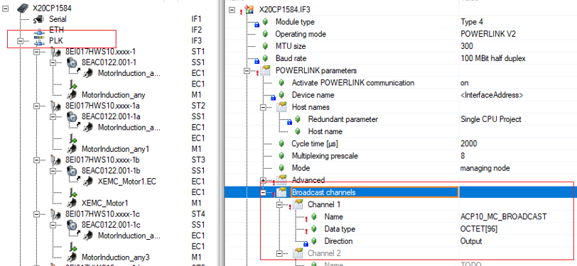 3) PLC任务周期配置  |

## 32275：网络耦合：广播频道未成功初始化

描述：

为了耦合不同网络上的轴，必须为耦合从站的网络接口组态广播通道。

如果调用将一个从站耦合到不同网络接口的主站的 NC 操作，则如果在耦合从站的网络接口的广播通道初始化期间发生错误，则会显示此错误。

反应：

相应的 NC 动作的处理被中止。

原因/补救措施：

确切原因可以从为初始化错误显示的错误编号确定。.

## 32276：网络耦合：循环时间不相等（POWERLINK，NC 任务类）

描述：

如果耦合主站和耦合从站连接到不同的网络接口，则证明以下循环时间是否相等：

\- NC 管理器任务类的循环时间

\- POWERLINK 循环时间（如果主站或从站通过 POWERLINK 网络操作）

如果不是这种情况，则会指示此错误。

反应：

相应的 NC 动作的处理被中止。

原因/补救措施：

使循环时间相等，这在上面的描述中列出。.

## 32277：网络耦合：在广播频道中没有更多的数据记录

描述：

为了耦合不同网络上的轴，必须为耦合从站的网络接口组态广播通道。

如果调用用于将一个从站耦合到不同网络接口的主站的 NC 操作，则如果广播通道中没有更多的耦合数据记录，则会显示此错误。

反应：

相应的 NC 动作的处理被中止。

原因/补救措施：

增加广播频道的大小。

如果耦合从站配置在 POWERLINK 接口上，则必须在 POWERLINK 配置中为此接口定义名为“ACP10_MC_BROADCAST”的广播通道。

如果耦合从机配置在 SDC 接口上，则可以在 ACP10 配置数据中为该接口定义广播通道的大小。.

## 32278：ACOPOS 耦合：零作为发送数据的参数 ID 是不允许的

描述：

如果在调用用于激活发送数据的 NC 动作时将发送数据的参数 ID 定义为零，则会指示此错误。

反应：

相应的 NC 动作的处理被中止。

原因/补救措施：

指定用于激活发送数据的有效参数 ID。.

## 32279：服务接口：数据地址零

描述：

如果参数“network.service.data_adr”对于 NC 操作设置为零，则必须在服务接口中为其指定用户数据结构的数据地址，则会显示此错误。

反应：

相应的 NC 动作的处理被中止。

原因/补救措施：

不要使用零作为数据地址。.

## 32280：启用非循环网络通信超时

描述：

在 POWERLINK 网络的网络初始化（ACOPOS 启动函数）期间，在第一次读取参数 BOOT_STATE 之前，对于每个 ACOPOS 模块，初始化暂停，直到 plState() 函数指示以下状态之一：

\- plSTATE_STATION_ACTIVATEING (0x0004: 该站刚刚被激活)

\- plSTATE_STATION_ACTIVE（0x0005：站在线并执行循环复制指令）

\- plSTATE_STATION_CHANGED（0x0007：站的硬件配置已更改）

\- plSTATE_STATION_CFGFAILED (0x0008: 站的配置失败)

如果达到等待此 POWERLINK 状态的超时时间，则会出现此错误。

反应：

该 ACOPOS 的 ACOPOS 启动功能被中止。

原因/补救措施：

网络连接过载、故障或中断或 ACOPOS 故障。.

查看错误码 [1004](#1004网络生命标志监视器超时).

查看错误码 [1012](#1012循环网络通信的崩溃).

| 应用案例                                                                                                                                                                                                                                                                                                                                                                                                                                                                                                                                                                                                                                                                                                                                                                                                                                                                                                                                                                                                                                                                                                |
|---------------------------------------------------------------------------------------------------------------------------------------------------------------------------------------------------------------------------------------------------------------------------------------------------------------------------------------------------------------------------------------------------------------------------------------------------------------------------------------------------------------------------------------------------------------------------------------------------------------------------------------------------------------------------------------------------------------------------------------------------------------------------------------------------------------------------------------------------------------------------------------------------------------------------------------------------------------------------------------------------------------------------------------------------------------------------------------------------------|
| **现象** 新组装的机器，有一个驱动器报错32029或32280，已更换过网线、检查过拨码。 **问题排查** 采集NCT，检查网络通信情况   发现上电后通讯建立在NETWORK_PHASE = 40之前都是正常的，在40时出现报错。 NETWORK_PHASE = 40时系统通过PLK往伺服下载ACP10版本。因此怀疑时拓扑结构过长导致的异步通讯超时。 现场检查拓扑，发现从PLC的PLK口出来后所有伺服均在一条拓扑线路上，即无Hub拓展。 现场更改接线顺序，发现拓扑线路的最后一个驱动器均会触发同样的报警。由此确认与拓扑结构有关。  **解决方式** 方式一 由于现场暂无法更改拓扑结构，于是将PLK主站的 Asynchronous timeout 参数由默认的25 μs改为100 μs。 其中Asynchronous timeout 参数的含义如下图，即POWERLINK异步段通信，主站发帧，等待从站（驱动器）响应的时间，若现场拓扑复杂，同一链路下CN数量多，则此参数需要适当增大。  重新下载程序后所有伺服通讯正常。 方式二 有条件时应使用Hub修改POWERLINK网络的拓扑结构，改成星型拓扑结构。                                                                                                                                |
| 2023.07.05 **现象** 380V电源还未接通时，驱动器和控制器的24V控制电路都已接通，有随机驱动器出现报错32280（异步通讯超时），该问题的出现没有规律性，不同驱动器均有出现过该报错，但是没有出现过一次上电后多个驱动器同时报这个错误。 该问题通过断电重新启动控制器和驱动器的控制电路，可以解决，正常生产。 网络线缆，HUB，PLK网络超时时间的设置或是湿度造成的网口松动都有可能导致此问题出现  **总结** 32280为上电启动时报警，初始化失败，驱动器PLK异步段通信超时。  **接线检查思路** 在不改动接线的基础上，遵循以下检查接线，需要插拔并观察HUB和驱动器网口指示灯。 1.HUB级数不宜超过4 2.ETH以太网和伺服驱动的PLK线缆，没有任何混合（进入同一HUB） 3.线缆插口松紧情况查看，是否轻微手动碰触会造成通讯灯不亮 4.现场PLK线缆必须使用贝加莱原装线缆，不用普通以太网线缆代替 5.各个各路24V电源及驱动器机身的接地情况 6.检查线缆两端插头及线体本身 7.安排一组新的线缆和HUB在此现场更换，正向检查  **相关建议** 如果按上述接线检查不存在问题的话，建议以下操作： 1.增加一个HUB给PLK用，减少各个节点的HUB级数 2.增加程序里的从站节点Response Timeout(25us-\>50us)，增加程序里的主站节点Asynchronous TimeOut(25us-100us) |
| 2023.07.05 **现象** 驱动器上电会报错，报错代码为32280。插拔驱动器的端子排，用以重新24V上电，可排除故障。有时候一次不行，再插拔一下。 更换了AC114卡后部分驱动器仍然会报此错误  **改善措施** 1. 加强AC114卡接地抗干扰特性 把整机所有的114卡拆下来，进行处理，如图所示，把相应位置的涂层刮掉，增强114卡和驱动器的金属接触，并用酒精擦拭金手指 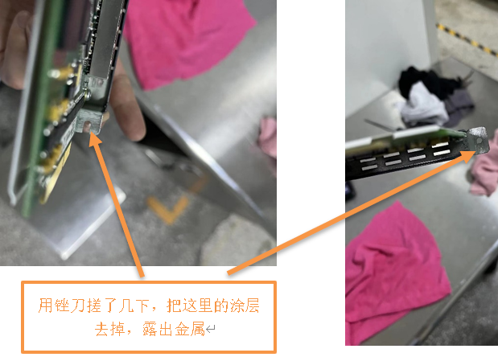  2. 清洗水晶头。 对整机所有驱动器上的网线水晶头进行清洗。使用75%的酒精和牙刷，对水晶头进行刷洗。 清洗完后，过了一段时间，再插上测试。测试过程中，每1小时上电启动一次，差不多测试了约5到6次，PLK上电都可以初始化完成。  **再出问题可以考虑更换POWERLINK线缆**  3. 检查客户线路 主线槽内强电，弱电，通讯线不分槽，并相互绞在一起，走线极其不合理 电柜线槽很窄，且强弱电不分，全在线槽中挤着。走线凌乱 一个端子孔塞两根线，建议一个端子一根线。 设备接地方式不合理  **建议客户合理走线，保证强弱电分离，驱动器充分接地**  4. 检查客户环境 车间配备加湿装置，由湿度控制器控制。现场湿度一般在80多，90多。只有一个唯一的空调吸风口。 有故障的唯一一台设备离空调吸风口最远。  **建议客户保证湿度在85及以下环境**   |
| 2023.07.05 **现象** 多个ACOPOS Micro上电后报警1012、32280等通讯故障，无法复位 现场检查报警驱动，发现从拓扑无一致性，部分驱动位于PLK的通讯末端、部分位于PLK的网络中部。 断电后修改PLK网线的连接顺序，无效果。 Test模式下连接伺服，可强制复位报警，但其仍显示网络无法连接。  **解决方式** 考虑到该设备时间已久、可能存在硬件老化问题，修改PLK配置的Asynchronous timeout数值，由默认的25改为100。 多次断电重启，未再出现通讯报警。                                                                                                                                                                                                                                                                                                                                                                                                                                                                                                                                                                                                                                                                         |
| 2023.07.05 **现象** 某一驱动器的编码器卡有烧焦的痕迹，确定是坏了，下一步确定驱动是否损坏，上电后此驱动器后面所有轴报32280，通讯问题，PLK指示灯不亮，而且有一股烧焦的味道， PLK线跳过此驱动器，后面的驱动器的轴通讯正常，说明此驱动器已经损坏。  **解决方式** 更换驱动器                                                                                                                                                                                                                                                                                                                                                                                                                                                                                                                                                                                                                                                                                                                                                                                                                                 |

## 32281：SafeMC 的版本低于最低版本（参见记录器）

描述：

如果 NC 管理器检测到 SafeMC 库的版本太低，则会显示此错误。 此外，记录器中会输入编号为 10560 和 ASCII 数据“SafeMC version \< x.xx.x”（x.xx.x：SafeMC 库的最低版本）的错误。

反应：

启动功能被中止，所有 NC 对象的操作都被禁用。

原因/补救措施：

在项目中插入 SafeMC 库，其最小版本显示在 Logger 中。 然后将库传输到目标系统并重新启动 CPU。.

## 32282：网络耦合：不兼容的循环时间（POWERLINK，NC 任务类）

描述：

如果耦合主机和耦合从机连接到不同的网络接口，则证明是否满足以下条件：

\- 从轴的网络循环时间等于 NC 管理器任务类的循环时间

\- 从轴的网络循环时间大于或等于主轴的网络循环时间

\- 从轴与主轴的网络循环次数之比为整数

如果上述条件之一不满足，则指示此错误。

反应：

相应的 NC 动作的处理被中止。

原因/补救措施：

调整上面描述中列出的循环时间，以便满足所有条件。.

## 32283：INIT 广播数据点：只允许使用 NC 任务类调用操作

描述：

用于初始化广播数据点的 NC 动作只能在该任务类中调用，该任务类在 NC 配置中被定义为 NC 管理器任务的任务类。 如果在另一个任务类中调用此 NC 操作，则会指示此错误。

反应：

相应的 NC 动作的处理被中止。

原因/补救措施：

调用 NC 操作以初始化该任务类中的广播数据点（或使用该 NC 操作的 PLCopen MC FB），该任务类被定义为 NC 管理器任务的任务类。.

## 32284：扩展 耦合数据：此 AR/NC 版本仅适用于具有同步功能的 TC1。 输出

描述：

如果在 NC 配置中为此网络接口定义了“ACP10_MC_BROADCAST=Yes 的扩展耦合数据”，则扩展耦合数据将用于网络接口。

对于 A3.09 之前的 AR 版本（分别是 A4.01 之前的）或 V2.310 之前的 ACP10 版本，这仅在以下限制下是可能的：

\- 循环 \#1 必须定义为 NC 管理器任务类

\- 对于这个任务类，输出数据必须与网络同步写入

如果在使用这些版本时未满足这些限制之一，则会指示此错误。

反应：

相应的 NC 动作的处理被中止。

原因/补救措施：

将 AR 版本更改为 A3.09 或更高版本（分别为 A4.01 或更高版本），将 ACP10 版本更改为 V2.310 或更高版本。

这些版本的扩展耦合数据可在以下条件下使用：

\- 查看错误码 [32285](#32285init-广播数据点不兼容的循环时间powerlinknc-任务类)

\- 查看错误码 [32286](#32286网络耦合不兼容的循环时间网络接口nc-任务类)

如果要进一步使用 A3.09 之前（分别为 A4.01 之前）的 AR 版本或 V2.310 之前的 ACP10 版本，则必须以符合上述限制的方式修改配置。

在 NC 配置中定义“NC Manager task=Cyclic \#1 的任务类”。

在系统配置中为任务类循环\#1选择输出数据与网络同步写入：

\- V3.0.90之前的Automation Studio：“Output without jitter”

\- 从 V3.0.90 开始的 Automation Studio：“I/O output delay=delay to end of cycle”

## 32285：INIT 广播数据点：不兼容的循环时间（POWERLINK、NC 任务类）

描述：

在何种条件下可以初始化数据点广播，取决于参数“ACP10_MC_BROADCAST 的扩展耦合数据=否/是”在 NC 配置中为相应网络接口定义的值。

ACP10_MC_BROADCAST=No 的扩展耦合数据：

只有当以下循环时间相等时，才可能初始化数据点广播：

\- NC 管理器任务类的循环时间

\- POWERLINK 循环时间

ACP10_MC_BROADCAST=Yes 的扩展耦合数据：

如果以下循环时间的比率是整数，则数据点广播的初始化才可能：

\- NC 管理器任务类的循环时间

\- POWERLINK 循环时间

如果不满足以上指定的条件，则会指示此错误。

反应：

相应的 NC 动作的处理被中止。

原因/补救措施：

调整上面描述中列出的循环时间，以便满足条件。.

## 32286：网络耦合：不兼容的循环时间（网络接口、NC 任务类）

描述：

在哪些条件下可以耦合不同网络上的轴，取决于在相应网络接口的 NC 配置中定义的参数“ACP10_MC_BROADCAST 的扩展耦合数据=否/是”的值。

ACP10_MC_BROADCAST=No 的扩展耦合数据：

只有满足以下条件，才能在不同网络上耦合轴：

\- 从轴的网络循环时间等于 NC 管理器任务类的循环时间

\- 从轴的网络循环时间大于或等于主轴的网络循环时间

\- 从轴与主轴的网络循环次数之比为整数

ACP10_MC_BROADCAST=Yes 的扩展耦合数据：

只有当以下循环时间的比率为整数时，才能耦合不同网络上的轴：

\- NC 管理器任务类的循环时间

\- 从轴的网络循环时间

\- 主轴的网络循环时间

如果上述条件之一不满足，则指示此错误。

反应：

相应的 NC 动作的处理被中止。

原因/补救措施：

调整上面描述中列出的循环时间，以便满足所有条件。.

## 32287：无法扩展耦合数据（OutTime 差异太大）

描述：

如果在 NC 配置中为此网络接口定义了“ACP10_MC_BROADCAST=Yes 的扩展耦合数据”，则扩展耦合数据将用于网络接口。

扩展耦合数据只有在保证ACOPOS在每个耦合周期都能与网络同步接收到耦合数据时才能使用。 除其他事项外（另请参阅错误编号 [32288](#32288无法扩展耦合数据任务类容差不为零)),这就要求最大传输时间（maxOutTime）和最小传输时间（minOutTime）之差小于耦合循环的循环时间。

耦合循环的循环时间是以下两个循环时间中的最大值：

\- NC 管理器任务类的循环时间

\- 相应网络接口的POWERLINK循环时间

如果 maxOutTime 和 minOutTime 之间的差值大于或等于耦合周期的周期时间，则表示此错误。

反应：

扩展耦合数据的初始化被中止。

原因/补救措施：

maxOutTime 和 minOutTime 的区别取决于 NC 管理器任务类的系统配置和相应网络接口的 POWERLINK 配置。

NC管理器任务类的系统配置：

可以通过为参数“I/O 输出延迟”选择以下设置之一来减少差异：

\- 延迟到周期中间

\- 延迟到循环结束，仅适用于任务类 Cyclic\#1

POWERLINK接口配置，I/O总线参数：

可以通过为参数“Bus cycle trigger”选择 NC 管理器任务类别来减少差异。

## 32288：无法扩展耦合数据（任务类容差不为零）

描述：

如果在 NC 配置中为此网络接口定义了“ACP10_MC_BROADCAST=Yes 的扩展耦合数据”，则扩展耦合数据将用于网络接口。

扩展耦合数据只有在保证ACOPOS在每个耦合周期都能与网络同步接收到耦合数据时才能使用。 除其他事项外（另请参阅错误编号 [32287](#32287无法扩展耦合数据outtime-差异太大)), 这要求将 NC 管理器任务类的任务类容差设置为零。

如果 NC 管理器任务类的任务类容差未设置为零，则指示此错误。

反应：

扩展耦合数据的初始化被中止。

原因/补救措施：

将 NC 管理器任务类的任务类容差设置为零。.

## 32289：网络耦合：不同任务类别中的 SDC/SIM 主从

描述：

如果耦合主站和耦合从站是 SDC 或 SIM 轴，配置在不同的网络接口中，则相应的循环功能必须在相同的任务类别中处理。 如果不是这种情况，则会显示此错误。

反应：

相应的 NC 动作的处理被中止。

原因/补救措施：

只能耦合 SDC/SIM 轴，其循环功能在同一任务类别中处理。

SDC 轴的循环功能在该任务类中处理，该任务类是为 NC 配置中的相应 SDC 接口定义的。

SIM 轴（POWERLINK 轴，激活 ACOPOS 模拟）的循环功能始终在 NC 管理器任务类中处理。.

## 32290：INIT 广播数据点：仅在 SDC 任务类中允许调用 NC 操作

描述：

用于初始化广播数据点的 NC 动作只能在该任务类中调用，其中相应的循环 SDC 功能由 NC 管理器处理。 如果在另一个任务类中调用此 NC 操作，则会指示此错误。

反应：

相应的 NC 动作的处理被中止。 信息中显示对应SDC接口的任务类号。

原因/补救措施：

调用 NC 操作以初始化该任务类中的广播数据点（或使用该 NC 操作的 PLCopen MC FB），其中相应的循环 SDC 功能由 NC 管理器处理。

SDC 轴的循环功能在该任务类中处理，该任务类是为 NC 配置中的相应 SDC 接口定义的。.

## 32291：INIT 广播数据点：“dp_data_bits”或“dp_task_class”为零

描述：

如果参数“dp_data_bits”或“dp_task_class”之一为零，则无法处理此用于初始化广播数据点的 NC 操作。 如果在调用此 NC 操作时将这些参数之一设置为零，则指示此错误。

反应：

相应的 NC 动作的处理被中止。

原因/补救措施：

为“dp_data_bits”和“dp_task_class”指定除零以外的其他值。.

## 32292：参数列表中的参数数据超过 8 个字节

描述：

如果在参数记录中使用的 ParID 具有超过 8 个字节的参数数据，则显示此错误并带有参数记录的索引作为信息。

反应：

该 NC 动作的处理被中止。

原因/补救措施：

不要使用超过 8 个字节的参数数据的 ParIds.

## 32302：无法启动设置：设置操作已处于活动状态

描述：

在先前启动的设置操作仍处于活动状态时尝试启动设置操作时，会显示此错误。

反应：

不执行设置操作的开始。

原因/补救措施：

停止之前启动的设置操作。

等待之前启动的设置操作完成。.

## 32322：数据块上传/下载：数据对象名称为零

描述：

对于数据块上传/下载的 NC 动作，必须指定数据对象名称。 如果对于此类 NC 操作，参数“parameter.datobj_name[0]”设置为零，则会显示此错误。

反应：

相应的 NC 动作的处理被中止。

原因/补救措施：

指定数据对象名称。.

## 32323：数据块上传/下载：数据块参数ID无效

描述：

对于数据块上传/下载的 NC 动作，只能将数据类型为“DATA”或“BRMOD”的参数 ID 用于参数“parameter.datblock_par_id”。 如果不是这种情况，则会显示此错误。

反应：

相应的 NC 动作的处理被中止。

原因/补救措施：

使用数据类型为“DATA”或“BRMOD”的参数 ID。.

## 32324：数据块上传/下载：数据块索引1的参数ID无效

描述：

对于数据块上传/下载的 NC 动作，只能将数据类型为“UINT”的参数 ID 用于参数“parameter.idx1_par_id”。 如果不是这种情况，则会显示此错误。

此外，如果“parameter.datblock_par_id”设置为“AUT_POLY_DATA”且“parameter.idx1_par_id”设置为“AUT_DATA_INDEX”以外的值，则会显示此错误。

反应：

相应的 NC 动作的处理被中止。

原因/补救措施：

使用数据类型为“UINT”的参数 ID。.

## 32325：数据块上传/下载：数据块索引2的参数ID无效

描述：

对于数据块上传/下载的 NC 动作，只能将数据类型为“UINT”的参数 ID 用于参数“parameter.idx2_par_id”。 如果不是这种情况，则会显示此错误。

此外，如果“parameter.datblock_par_id”设置为“AUT_POLY_DATA”且“parameter.idx2_par_id”设置为非零值，则会显示此错误。

反应：

相应的 NC 动作的处理被中止。

原因/补救措施：

使用数据类型为“UINT”的参数 ID.

## 32326：数据块上传/下载：数据缓冲区地址为零

描述：

对于数据块上传/下载的某些 NC 操作，参数“parameter.data_adr”必须设置为非零值。 如果不是这种情况，则会显示此错误。

反应：

相应的 NC 动作的处理被中止。

原因/补救措施：

指定数据对象名称。

将参数“parameter.data_adr”设置为非零值。.

## 32327：数据块上传/下载：数据缓冲区长度为零

描述：

对于数据块上传/下载的某些 NC 操作，参数“parameter.data_len”必须设置为非零值。 如果不是这种情况，则会显示此错误。

反应：

相应的 NC 动作的处理被中止。

原因/补救措施：

指定数据对象名称。

将参数“parameter.data_len”设置为非零值。.

## 32328：数据块上传：数据缓冲区长度小于数据块长度

描述：

对于将数据块上传到数据缓冲区的 NC 动作，参数“parameter.data_len”的值必须大于数据块的字节长度。 如果不是这种情况，则会显示此错误。

反应：

相应的 NC 动作的处理被中止。

原因/补救措施：

指定数据对象名称。

将参数“parameter.data_len”设置为足够大的值.

## 32329：设置：超出初始 ACOPOS 参数的最大数量

描述：

对于 NC 操作“ncSETUP, ncSTART”，从 ACOPOS 参数表中读取输入参数。 如果此 ACOPOS 参数表中包含过多的 ACOPOS 参数，则会显示此错误，其中包含初始 ACOPOS 参数的最大数量作为信息。

反应：

该 NC 动作的处理被中止。

原因/补救措施：

不要将 ACOPOS 参数表中的更多参数与 NC 操作“ncSETUP, ncSTART”的输入参数一起使用，如该错误编号的信息中所示。.

## 32330：设置：超过 6 个字节的 ACOPOS 参数数据

描述：

对于 NC 操作“ncSETUP, ncSTART”，从 ACOPOS 参数表中读取输入参数。 如果这个 ACOPOS 参数表包含一个超过 6 个字节的参数数据的参数 ID，那么这个错误会以这个参数 ID 作为信息显示。

反应：

该 NC 动作的处理被中止。

原因/补救措施：

不要在 ACOPOS 参数表中使用超过 6 字节参数数据的参数 ID 和 NC 动作“ncSETUP, ncSTART”的输入参数。.

## 32331：无法启动设置：模式参数为零

描述：

为了开始设置操作，此设置操作的参数“模式”必须设置为非零值。 如果不是这种情况，则会显示此错误。

反应：

不执行设置操作的开始。

原因/补救措施：

将参数“mode”设置为非零值。.

## 32392：网络耦合：不兼容的循环时间（POWERLINK，NC 任务类）

描述：

如果要通过 POWERLINK 接口将循环位置值传输到轴，如果从轴的 POWERLINK 循环时间和 NC 任务类（任务类 Cyclic \#1）的循环时间，则使用每个数据集 8 个字节的标准耦合数据 ) 相等。

只有满足以下条件，才能使用标准耦合数据耦合不同 POWERLINK 网络上的轴：

\- 从轴的POWERLINK循环时间大于或等于主轴的POWERLINK循环时间

\- 从轴和主轴的 POWERLINK 循环次数之比为整数

如果上述条件之一不满足，则指示此错误。

反应：

相应的 NC 动作的处理被中止。

原因/补救措施：

调整上面描述中列出的循环时间，以便满足所有条件。.

## 32393：网络耦合：不兼容的循环时间（POWERLINK，NC 任务类）

描述：

如果要通过 POWERLINK 接口将循环位置值传输到轴，如果从轴的 POWERLINK 循环时间和 NC 任务类（任务类 Cyclic \#1）的循环时间 ） 是不同的。

只有当以下循环时间的比率为整数时，才可以使用扩展的耦合数据耦合不同 POWERLINK 网络上的轴：

\- NC 任务类的循环时间

\- 从轴的 POWERLINK 循环时间

\- 主轴的 POWERLINK 循环时间（如果多路复用，乘以“多路复用预分频”系数）

如果不是这种情况，则会指示此错误。

反应：

相应的 NC 动作的处理被中止。

原因/补救措施：

调整上面描述中列出的循环时间，使所有的比率都是整数.

## 32394：INIT 广播数据点：不兼容的循环时间（POWERLINK，NC 任务类）

描述：

如果要通过 POWERLINK 接口将循环位置值传输到轴，如果 POWERLINK 和 NC 任务类（任务类 Cyclic \#1）的循环时间不同，则使用每个数据集 12 个字节的扩展耦合数据。

仅当以下循环时间的比率为整数时，才可以使用扩展耦合数据初始化广播数据点：

\- NC 任务类的循环时间

\- POWERLINK 循环时间

如果不是这种情况，则会指示此错误。

反应：

相应的 NC 动作的处理被中止。

原因/补救措施：

调整NC任务类和POWERLINK的循环次数，使之比为整数。.

## 32395：扩展 耦合数据：仅可能与同步.任务类循环 \#1 的输出

描述：

如果要通过 POWERLINK 接口将循环位置值传输到轴，如果 POWERLINK 和任务类别 Cyclic \#1 的循环时间不同，则使用每个数据集 12 个字节的扩展耦合数据。

如果任务类 Cyclic \#1 的输出数据与 POWERLINK 网络同步写入，则只能使用扩展耦合数据。

如果不是这种情况，则会指示此错误。

反应：

相应的 NC 动作的处理被中止。

原因/补救措施：

在系统配置中为任务类循环\#1选择输出数据与网络同步写入：

\- “I/O output delay=delay to end of cycle”

## 32396：不允许更改此 ACOPOS 硬件类型的循环时间

描述：

只能针对某些 ACOPOS 硬件类型更改驱动循环时间。 如果 NC 管理器检测到 ACOPOS 模块要求更改驱动循环时间，但不允许更改驱动循环时间，则在 ACOPOS 启动功能期间会显示此错误。

反应：

该 ACOPOS 的 ACOPOS 启动功能被中止。

原因/补救措施：

如果为POWERLINK接口配置了驱动循环时间变化的变化，则只有那些ACOPOS模块可以连接到该接口，对于其硬件类型，驱动循环时间的变化是允许的。.

## 32397：目标系统上的 NCSYS 版本与 NC 软件版本不兼容

描述：

如果NC管理器检测到目标系统上ACOPOS操作系统的BR模块的NCSYS版本与NCMAN版本不兼容，则在ACOPOS启动功能时会显示此错误。

笔记：

如果十六进制值与前三位数字匹配，则 NCSYS 版本与 NCMAN 版本兼容。

反应：

ACOPOS 启动功能被中止。

原因/补救措施：

必须将带有 ACOPOS 操作系统的 BR 模块传输到目标系统，其 NCSYS 版本与 NCMAN 版本兼容.

## 32398：NCSYS 不包含此 ACOPOS 硬件类型的操作系统

描述：

BR 模块“acp10sys”应该包含一个特定于设备的操作系统，适用于可以连接到网络的每种类型的 ACOPOS 硬件单元。 如果 ACOPOS 单元上尚未存在特定于设备的操作系统，则可以在 ACOPOS 启动期间将其传输到 ACOPOS 模块。

如果 NC 管理器检测到 ACOPOS 模块的设备特定操作系统不包含在 BR 模块“acp10sys”中，并且 ACOPOS 上不存在与 NC 管理器。

反应：

该 ACOPOS 的 ACOPOS 启动功能被中止。

原因/补救措施：

“acp10sys”不包含连接的 ACOPOS 硬件模块的设备类型的操作系统。

必须将包含此 ACOPOS 硬件类型的设备特定操作系统的 ACP10 软件版本添加到项目中。.

## 32399：需要在 NCSYS 下载后手动重启 ACOPOS（电源关闭/打开）

描述：

如果在 NC 配置中选择了“ACOPOS reset after NCSYS download=No”，则必须在下载操作系统后手动重启 ACOPOS (POWER-OFF/-ON)。 如果在下载操作系统后尚未执行手动 ACOPOS 重启，则此错误将显示在 ACOPOS 启动功能中。

反应：

该 ACOPOS 的 ACOPOS 启动功能被中止。

原因/补救措施：

执行手动 ACOPOS 重启或在 NC 配置中选择“ACOPOS reset after NCSYS download=Yes”。.

## 32400：无法分配内存

描述：

如果无法分配所需的内存，则会显示此错误。

反应：

相应的 NC 动作的处理被中止。

原因/补救措施：

没有足够的可用内存。

在 OS 区域配置更多内存。.

## 32401：未指定数据对象名称

描述：

如果没有为从数据对象加载数据或将数据保存到数据对象的 NC 操作指定数据对象名称，则会显示此错误。

反应：

相应的 NC 动作的处理被中止。

原因/补救措施：

指定文件名。

## 32402：无法打开指定的文件

描述：

如果无法为从数据对象加载数据的 NC 操作打开指定文件，则会显示此错误。

反应：

相应的 NC 动作的处理被中止。

原因/补救措施：

指定现有文件的名称。.

## 32403：无法创建指定的文件

描述：

如果无法为将数据保存到数据对象的 NC 操作创建指定的文件，则会显示此错误。

反应：

相应的 NC 动作的处理被中止。

原因/补救措施：

没有足够的内存来创建数据对象。

在 OS 区域配置更多内存。.

## 32404：写入文件时出错

描述：

如果将数据保存到文件中的 NC 操作发生写入错误，则会显示此错误。

反应：

相应的 NC 动作的处理被中止。

原因/补救措施：

没有足够的内存写入文件。.

## 32405：读取文件时出错

描述：

如果从文件加载数据的 NC 操作发生读取错误，则会显示此错误。

反应：

相应的 NC 动作的处理被中止。

原因/补救措施：

该文件已被删除。.

## 32406：无法创建指定的文件

描述：

如果无法为用于将数据保存到数据对象的 NC 操作创建指定的文件，则会显示此错误，并将函数 FileCreate() 的错误状态作为信息显示。

反应：

相应的 NC 动作的处理被中止。

原因/补救措施：

确切原因可以从函数 FileCreate() 的错误状态确定。.

## 32407：写入文件时出错

描述：

如果用于将数据保存到文件中的 NC 操作发生写入错误，则会显示此错误，并显示函数 FileWrite() 的错误状态作为信息。

反应：

相应的 NC 动作的处理被中止。

原因/补救措施：

确切原因可以从函数 FileWrite() 的错误状态确定。.

## 32408：关闭文件时出错

描述：

如果无法为从数据对象加载数据或将数据保存到数据对象的 NC 操作中关闭指定的文件，则会显示此错误，并将函数 FileClose() 的错误状态作为信息显示。

反应：

相应的 NC 动作的处理被中止。

原因/补救措施：

确切原因可以从函数 FileClose() 的错误状态确定。.

## 32409：无法删除指定的文件

描述：

如果无法为将数据保存到数据对象的 NC 操作删除指定的文件，则显示此错误，并带有函数 FileDelete() 的错误状态作为信息。

反应：

相应的 NC 动作的处理被中止。

原因/补救措施：

确切原因可以从函数 FileDelete() 的错误状态确定。.

## 32410：数据对象类型无效

描述：

如果为从数据对象加载数据或将数据保存到数据对象中的 NC 操作指定了该 NC 操作不允许的类型，则会显示此错误。

反应：

相应的 NC 动作的处理被中止。

原因/补救措施：

指定此 NC 操作允许的数据对象类型。.

## 32411：数据对象结构的地址为零

描述：

对于用于创建 NC 数据模块的 NC 操作，必须在参数“network.service.data_adr”中指定用户数据结构的数据地址。 如果此参数设置为零，则会显示此错误。

反应：

NC 动作的处理被中止。

原因/补救措施：

不要使用零作为数据对象结构的地址。.

## 32412：数据对象结构中的名称为零

描述：

对于用于创建 NC 数据模块的 NC 操作，必须在用户数据结构（类型为“ACP10DATMO_typ”的数据结构）的参数“parameter.name”中指定数据模块名称。 如果此参数设置为零，则会显示此错误。

反应：

NC 动作的处理被中止。

原因/补救措施：

在“parameter.name”中指定数据模块名称。.

## 32413：数据对象结构中的数据地址为零

描述：

对于用于创建 NC 数据模块的 NC 操作，必须在用户数据结构（类型为“ACP10DATMO_typ”的数据结构）的参数“parameter.data_adr”中指定数据地址。 如果此参数设置为零，则会显示此错误。

反应：

NC 动作的处理被中止。

原因/补救措施：

参数“parameter.data_adr”必须设置为非零值。.

## 32414：数据对象结构中的数据长度为零

**描述：**

对于用于创建 NC 数据模块的 NC 操作，必须在用户数据结构（类型为“ACP10DATMO_typ”的数据结构）的参数“parameter.data_len”中指定数据长度。 如果此参数设置为零，则会显示此错误。

**反应：**

NC 动作的处理被中止。

**原因/补救措施：**

参数“parameter.data_len”必须设置为非零值。.

## 32415：未指定文件设备

描述：

如果将“ncDATOBJ_FILE”指定为用于从数据对象加载数据或将数据保存到数据对象的 NC 操作的类型，则必须在参数“parameter.file_device”中指定相应的文件设备。 如果“parameter.file_device[0]”设置为零，则会显示此错误。

反应：

相应的 NC 动作的处理被中止。

原因/补救措施：

在“parameter.file_device”中指定对应的文件设备。.

## 32416：FileIO 函数不存在（库 FileIO 是否存在？）

描述：

如果将“ncDATOBJ_FILE”指定为用于从数据对象加载数据或将数据保存到数据对象的 NC 操作的类型，则目标上必须存在某些 FileIO 函数。 如果这些功能之一不可用，则会显示此错误。

反应：

相应的 NC 动作的处理被中止。

原因/补救措施：

将 FileIO 库传输到目标。.

## 32417：写入 NC 数据模块时出错

描述：

如果在将数据写入 NC 数据模块时发生错误，则会显示该错误，并将函数 ncda_wr() 的错误状态作为信息显示。

反应：

相应的 NC 动作的处理被中止。

原因/补救措施：

确切原因可以从函数 ncda_wr() 的错误状态确定。.

## 32418：MTC 数据中不存在 XML 元素

描述：

在 Automation Studio 中，通过选择“Save Configuration to File”，可以将多轴轨迹的配置以 MTC 格式（MTC：运动轨迹配置）保存到文件中。 这些 XML 数据的结构是明确定义的。 在加载跟踪配置的功能中，数据的结构得到验证。

如果这些数据根本不包含 XML 元素，则指示此错误。

反应：

加载跟踪配置的功能被中止。

原因/补救措施：

使用“将配置保存到文件Save Configuration to File”在 Automation Studio 中创建数据。.

## 32419：MTC 数据：XML 元素无效或顺序错误

描述：

在 Automation Studio 中，通过选择“Save Configuration to File”，可以将多轴轨迹的配置以 MTC 格式（MTC：运动轨迹配置）保存到文件中。 这些 XML 数据的结构是明确定义的。 在加载跟踪配置的功能中，数据的结构得到验证。

如果这些数据的结构不正确，则指示此错误。

反应：

加载跟踪配置的功能被中止。

原因/补救措施：

使用“将配置保存到文件Save Configuration to File”在 Automation Studio 中创建数据。.

## 32420：MTC 数据包含无效的配置

描述：

在 Automation Studio 中，通过选择“Save Configuration to File”，可以将多轴轨迹的配置以 MTC 格式（MTC：运动轨迹配置）保存到文件中。 这些 XML 数据的结构是明确定义的。 在加载跟踪配置的功能中，数据的结构得到验证。

数据必须只包含一次 XML 元素“Configuration”，其中 Type="PARID" 和 Active="true"。 如果包含没有“类型”或“活动”的 XML 元素“配置”，则会指示此错误。

反应：

加载跟踪配置的功能被中止。

原因/补救措施：

使用“将配置保存到文件”在 Automation Studio 中创建数据。.

## 32421：MTC 数据不包含多轴跟踪的配置

描述：

在 Automation Studio 中，通过选择“Save Configuration to File”，可以将多轴轨迹的配置以 MTC 格式（MTC：运动轨迹配置）保存到文件中。 这些 XML 数据的结构是明确定义的。 在加载跟踪配置的功能中，数据的结构得到验证。

数据必须只包含一次 XML 元素“Configuration”，其中 Type="PARID" 和 Active="true"。 如果不包含 Type="PARID" 和 Active="true" 的 XML 元素“Configuration”，则指示此错误。

反应：

加载跟踪配置的功能被中止。

原因/补救措施：

使用“将配置保存到文件”在 Automation Studio 中创建数据。.

## 32422：MTC 数据包含多轴跟踪的多个配置

描述：

在 Automation Studio 中，通过选择“Save Configuration to File”，可以将多轴轨迹的配置以 MTC 格式（MTC：运动轨迹配置）保存到文件中。 这些 XML 数据的结构是明确定义的。 在加载跟踪配置的功能中，数据的结构得到验证。

数据必须只包含一次 XML 元素“Configuration”，其中 Type="PARID" 和 Active="true"。 如果包含多个带有 Type="PARID" 和 Active="true" 的 XML 元素“Configuration”，则会指示此错误。

反应：

加载跟踪配置的功能被中止。

原因/补救措施：

使用“将配置保存到文件”在 Automation Studio 中创建数据.

## 32423：MTC 数据：Trigger.NcObject 无效

描述：

在 Automation Studio 中，通过选择“Save Configuration to File”，可以将多轴轨迹的配置以 MTC 格式（MTC：运动轨迹配置）保存到文件中。 这些 XML 数据的结构是明确定义的。 在加载跟踪配置的功能中，数据的结构得到验证。

如果 XML 元素“触发器”中的“NcObject”包含一个 NC 对象名称，但不存在关联的 NC 对象，则指示此错误。

反应：

加载跟踪配置的功能被中止。

原因/补救措施：

使用“将配置保存到文件”在 Automation Studio 中创建数据。.

## 32424：MTC 数据：Trigger.Condition 无效

描述：

在 Automation Studio 中，通过选择“Save Configuration to File”，可以将多轴轨迹的配置以 MTC 格式（MTC：运动轨迹配置）保存到文件中。 这些 XML 数据的结构是明确定义的。 在加载跟踪配置的功能中，数据的结构得到验证。

如果 XML 元素“触发器”中的“条件”包含无效字符串，则指示此错误。

反应：

加载跟踪配置的功能被中止。

原因/补救措施：

使用“将配置保存到文件”在 Automation Studio 中创建数据。.

## 32425：MTC 数据：Channel.NcObject 无效

描述：

在 Automation Studio 中，通过选择“Save Configuration to File”，可以将多轴轨迹的配置以 MTC 格式（MTC：运动轨迹配置）保存到文件中。 这些 XML 数据的结构是明确定义的。 在加载跟踪配置的功能中，数据的结构得到验证。

如果 XML 元素“Channel”中的“NcObject”包含一个 NC 对象名称，但不存在关联的 NC 对象，则指示此错误。

反应：

加载跟踪配置的功能被中止。

原因/补救措施：

使用“将配置保存到文件”在 Automation Studio 中创建数据。.

## 32426：录播触发器：事件无效

描述：

在以MTC格式保存trace配置的功能中，trace配置的数据被证明。 如果触发事件无效，则指示此错误。

反应：

保存录播配置的功能被中止。

原因/补救措施：

更正录播配置中的数据。.

## 32427：录播触发器：如果事件不等于 OFF，则不允许参数 ID 为零

描述：

在以MTC格式保存trace配置的功能中，trace配置的数据被证明。 如果在触发器中参数 ID 为零且事件未关闭，则指示此错误。

反应：

保存录播配置的功能被中止。

原因/补救措施：

更正录播配置中的数据。.

## 32428：数据对象格式无效

描述：

如果为将数据保存到数据对象的 NC 操作指定了该 NC 操作不允许的格式，则会显示此错误。

反应：

相应的 NC 动作的处理被中止。

原因/补救措施：

指定此 NC 操作允许的格式。.

## 32429：MTC 数据：超过最大测试数据点数

描述：

在以 MTC 格式加载跟踪配置的功能（MTC：运动跟踪配置）中，验证活动测试数据点的数量（（“通道”行与 Traced="True"）。如果超过最大数量，则此 错误以最大允许数量显示为信息。

反应：

加载跟踪配置的功能被中止。

原因/补救措施：

减少 mtc 数据中测试数据点的数量：

\- 删除一个或多个“频道”行

\- 将一个或多个“通道”行中的 Traced="True" 更改为 Traced="False"

## 32430：无法从 NCBSL 模块读取数据（名称见记录器）

描述：

在传输 ACOPOS BsLoader 期间，NC 管理器从 NCBSL 模块“acp10bsl”中读取各个数据段。 如果无法读取数据，则会显示此错误。

反应：

ACOPOS 启动功能被中止。 无法再操作 NC 对象。

原因/补救措施：

模块“acp10bsl”已被删除

## 32431：无法从 NCSYS 模块读取数据（名称见记录器）

描述：

在 ACOPOS 操作系统的传输过程中，NC 管理器从 NCSYS 模块“acp10sys”中读取各个数据段。 如果无法读取数据，则会显示此错误。

反应：

ACOPOS 启动功能被中止。 无法再操作 NC 对象。

原因/补救措施：

模块“acp10sys”已被删除

## 32432：无法Trace：ACOPOS 启动尚未完成

描述：

只有在trace配置中包含的所有 ACOPOS 模块的启动完成后，才能开始trace。 如果不是这种情况，则会显示此错误。

反应：

该函数的处理被中止。

原因/补救措施：

等待所有ACOPOS 模块启动完成。

## 32492：ACOPOS 仿真：循环 PLCopen 数据的 TC 不等于 NC Manager TC

描述：

对于 SG4 目标，可以定义任务类别，其中循环 PLCopen 数据将从程序复制到 POWERLINK 网络，反之亦然。

在 ACP10 配置 (acp10cfg) 中，对于每个 POWERLINK 接口，使用参数“使用 PLCopen 处理循环数据的任务类（仅适用于 SG4）”，这是可能的。 acp10cfg 中包含的值被输入到每个 POWERLINK 接口的网络跟踪中，节点编号为 0，ParID 为 TASKCL_CycDat_PLCopen。

对于每个 ACOPOS 通信通道，此任务类别可以在 NC 映射表中的“附加数据”列中的真实或虚拟轴的数据记录中使用 XML 属性 PLCopen_CyclicData_TaskClass 定义。使用 PLCopen_CyclicData_TaskClass 定义的值输入到具有 ParID TASKCL_CycDat_PLCopen 的相应 NC 对象的网络跟踪中。

如果激活了 ACOPOS 模拟，则使用 PLCopen 处理循环数据的任务等级必须等于 NC 管理器任务的任务等级（TASKCL_CycDat_PLCopen 零或与 NC 管理器任务的任务等级相同）。如果定义了另一个值，则会指示此错误。

反应：

该 ACOPOS 的 ACOPOS 启动功能被中止。

原因/补救措施：

更正 ACP10 配置或 NC 映射表中的值。

## 32494：一个通道的 AcoposSimulation=Off 尽管已为另一通道激活

描述：

如果为 ACOPOS 模拟选择了“关闭”以外的模式，则 ACP10SIM 库在 PLC 上模拟 ACOPOS 功能。 如果模拟伺服驱动器的一个通道，则还必须模拟所有其他通道。

如果伺服驱动器的一个通道为 ACOPOS 模拟选择了“关闭”，而另一个通道没有选择，则指示此错误。

反应：

相应 NC 对象的 ACOPOS 启动功能被中止。 无法再操作这些 NC 对象。

原因/补救措施：

为两个通道的 ACOPOS 模拟选择模式“关闭”，或为两个通道选择另一种模式。.

## 32495：AcoposSimulation：为实轴和虚轴定义的不同值

描述：

如果仅为 ACOPOS 通道的实轴或虚轴定义了 ACOPOS 模拟的模式，则定义的值将从一个 NC 对象转移到另一个。

如果为 ACOPOS 通道的实轴和虚轴都定义了模式，则两个 NC 对象的值必须相等，否则会显示此错误。

反应：

相应 NC 对象的 ACOPOS 启动功能被中止。 无法再操作这些 NC 对象。

原因/补救措施：

为 ACOPOS 通道的实轴和虚轴定义相同的 ACOPOS 模拟模式，或仅为这些 NC 对象之一定义模式。.

## 32496：为 PLCopen MC 创建循环任务时出错（记录器中的详细信息）

描述：

如果在为 PLCopen MC 创建循环任务时发生错误，则会指示此错误。

反应：

相应 NC 对象的 ACOPOS 启动功能被中止。 无法再操作这些 NC 对象。

原因/补救措施：

可以从记录器中输入的详细信息确定确切原因。.

## 32497：在 acp10cfg 中使用 PLCopen 处理循环数据的任务类无效

描述：

对于每个 POWERLINK 接口的 ACP10 配置 (acp10cfg) 中的 SG4 目标，参数“使用 PLCopen 处理循环数据的任务类别（仅适用于 SG4）”可以选择任务类别，在其中复制循环 PLCopen 数据 从程序到 POWERLINK 网络，反之亦然。

如果 BR 模块 acp10cfg 包含此参数的无效值，则此错误将显示为最大任务类号作为附加信息。 此外，acp10cfg 中包含的值被输入到每个 POWERLINK 接口的网络跟踪中，节点编号为 0，ParID 为 TASKCL_CycDat_PLCopen。

反应：

对于连接到该 POWERLINK 接口的所有 ACOPOS 模块，ACOPOS 启动功能被中止。

原因/补救措施：

更正 ACP10 配置中的值。.

## 32498：PLCopen_CyclicData_TaskClass 低于零或高于最大值

描述：

对于每个 ACOPOS 通信通道的 NC 映射表中的 SG4 目标，可以定义任务类，其中循环 PLCopen 数据将从程序复制到 POWERLINK 网络，反之亦然。 这可以在具有以下 XML 属性的“附加数据”列中的真实或虚拟轴的数据记录中实现：

\- PLCopen_CyclicData_TaskClass=""

如果 BR 模块 acp10cfg 包含此参数的无效值，则此错误将显示为最大任务类号作为附加信息。 此外，使用 PLCopen_CyclicData_TaskClass 定义的值被输入到具有 ParID TASKCL_CycDat_PLCopen 的相应 NC 对象的网络跟踪中。

反应：

该 ACOPOS 的 ACOPOS 启动功能被中止。

原因/补救措施：

更正 NC 映射表中用 PLCopen_CyclicData_TaskClass 定义的值。.

## 32499：PLCopen_CyclicData_TaskClass：实轴和虚轴的值不相等

描述：

对于每个 ACOPOS 通信通道的 NC 映射表中的 SG4 目标，可以定义任务类，其中循环 PLCopen 数据将从程序复制到 POWERLINK 网络，反之亦然。 这可以在具有以下 XML 属性的“附加数据”列中的真实或虚拟轴的数据记录中实现：

\- PLCopen_CyclicData_TaskClass=""

具有相同节点号和相同通道号的实轴和虚轴使用相同的ACOPOS 通信通道进行操作。 如果为来自同一通信通道的实轴和虚拟轴定义了不同的任务类别，则会输出此错误。 此外，使用 PLCopen_CyclicData_TaskClass 定义的值被输入到具有 ParID TASKCL_CycDat_PLCopen 的相应 NC 对象的网络跟踪中。

反应：

该 ACOPOS 的 ACOPOS 启动功能被中止。

原因/补救措施：

更正 NC 映射表中用 PLCopen_CyclicData_TaskClass 定义的值。.

## 32500：消息 FIFO 已存在

描述：

在 NC 管理器的 INIT 功能中，必须重新生成消息 FIFO。 如果它已经存在，则会显示此错误。

反应：

NC 软件的初始化被中止。 不能操作任何 NC 对象。

原因/补救措施：

更改 NC 软件版本。

更改Automation Runtime版本。.

## 32501：创建消息 FIFO 时出错

描述：

如果无法创建消息 FIFO，则显示此错误，并带有函数 RtkCreateFifo() 的错误状态作为信息。

反应：

NC 软件的初始化被中止。 不能操作任何 NC 对象。

原因/补救措施：

没有足够的可用内存。

在 OS 区域配置更多内存。

更改 NC 软件版本。

更改Automation Runtime版本。

确切原因可以从函数 RtkCreateFifo() 的错误状态确定。

## 32502：命令信号量的临界区已经存在

描述：

在 NC 管理器的 INIT 功能中，必须新生成命令信号量的临界区。 如果它已经存在，则会显示此错误。

反应：

NC 软件的初始化被中止。 不能操作任何 NC 对象。

原因/补救措施：

更改 NC 软件版本。

更改Automation Runtime版本。

## 32503：为命令信号量创建临界区时出错

描述：

如果无法创建命令信号量的临界区，则会显示此错误，并显示函数 RtkCreateCriticalSection() 的错误状态作为信息。

反应：

NC 软件的初始化被中止。 不能操作任何 NC 对象。

原因/补救措施：

没有足够的可用内存。

在 OS 区域配置更多内存。

更改 NC 软件版本。

更改Automation Runtime版本。

确切原因可以从函数 RtkCreateCriticalSection() 的错误状态确定。.

## 32504：NC 空闲任务已经存在

描述：

在 NC 管理器的 INIT 功能中，必须重新生成 NC Idle Task。 如果它已经存在，则会显示此错误。

反应：

NC 软件的初始化被中止。 不能操作任何 NC 对象。

原因/补救措施：

更改 NC 软件版本。

更改Automation Runtime版本。

## 32505：创建 NC 空闲任务时出错

描述：

如果无法创建 NC 空闲任务，则会显示此错误，并将函数 RtkCreateTask() 的错误状态作为信息显示。

反应：

NC 软件的初始化被中止。 不能操作任何 NC 对象。

原因/补救措施：

没有足够的可用内存。

在 OS 区域配置更多内存。

更改 NC 软件版本。

更改Automation Runtime版本。

确切原因可以从函数 RtkCreateTask() 的错误状态确定。.

## 32506：读取任务类周期时间时出错

描述：

如果在读取任务类周期时间时发生错误，则显示此错误并带有函数 GetTaskclassCycleTime() 的错误状态作为信息。

反应：

NC 软件的初始化被中止。 不能操作任何 NC 对象。

原因/补救措施：

确切原因可以从函数 GetTaskclassCycleTime() 的错误状态和在 Logger 中输入的详细信息确定。

更改 NC 软件版本。

更改Automation Runtime版本。.

## 32507：读取任务类容差时出错

描述：

如果在读取任务类容差时发生错误，则该错误将与函数 GetTaskclassMaxCycleTime() 的错误状态一起显示为信息。

反应：

NC 软件的初始化被中止。 不能操作任何 NC 对象。

原因/补救措施：

确切原因可以从函数 GetTaskclassMaxCycleTime() 的错误状态和在 Logger 中输入的详细信息确定。

更改 NC 软件版本。

更改Automation Runtime版本。.

## 32508：向 NC 空闲任务发送空闲时间命令时出错

描述：

如果在向 NC Idle Task 发送命令时发生错误，则显示该错误并带有函数 RtkWriteFifo() 的错误状态作为信息。

反应：

相应的 NC 动作的处理被中止。

原因/补救措施：

保存记录器数据和网络跟踪并联系支持人员。

更改 NC 软件版本。

更改Automation Runtime版本。

确切原因可以从函数 RtkWriteFifo() 的错误状态确定。.

## 32509：网络命令跟踪的关键部分已经存在

描述：

在 NC 管理器的 INIT 功能中，必须新生成 Network Command Trace 的临界区。 如果它已经存在，则会显示此错误。

反应：

NC 软件的初始化被中止。 不能操作任何 NC 对象。

原因/补救措施：

更改 NC 软件版本。

更改Automation Runtime版本。.

## 32510：为网络命令跟踪创建临界区时出错

描述：

如果无法创建网络命令跟踪的临界区，则会显示此错误，并将函数 RtkCreateCriticalSection() 的错误状态作为信息显示。

反应：

NC 软件的初始化被中止。 不能操作任何 NC 对象。

原因/补救措施：

没有足够的可用内存。

在 OS 区域配置更多内存。

更改 NC 软件版本。

更改Automation Runtime版本。

确切原因可以从函数 RtkCreateCriticalSection() 的错误状态确定。.

## 32511：高优先级消息的临界区已经存在

描述：

在 NC 管理器的 INIT 功能中，必须重新生成高优先级消息的临界区。 如果它已经存在，则会显示此错误。

反应：

NC 软件的初始化被中止。 不能操作任何 NC 对象。

原因/补救措施：

更改 NC 软件版本。

更改Automation Runtime版本。.

## 32512：为具有高优先级的消息创建临界区时出错

描述：

如果无法创建高优先级消息的临界区，则会显示此错误，并带有函数 RtkCreateCriticalSection() 的错误状态作为信息。

反应：

NC 软件的初始化被中止。 不能操作任何 NC 对象。

原因/补救措施：

没有足够的可用内存。

在 OS 区域配置更多内存。

更改 NC 软件版本。

更改Automation Runtime版本。

确切原因可以从函数 RtkCreateCriticalSection() 的错误状态确定。.

## 32513：全局变量的临界区已经存在

描述：

在 NC 管理器的 INIT 函数中，必须新生成全局变量的临界区。 如果它已经存在，则会显示此错误。

反应：

NC 软件的初始化被中止。 不能操作任何 NC 对象。

原因/补救措施：

更改 NC 软件版本。

更改Automation Runtime系统版本.

## 32514：为全局变量创建临界区时出错

描述：

如果无法创建全局变量的临界区，则会显示此错误，并带有函数 RtkCreateCriticalSection() 的错误状态作为信息。

反应：

NC 软件的初始化被中止。 不能操作任何 NC 对象。

原因/补救措施：

没有足够的可用内存。

在 OS 区域配置更多内存。

更改 NC 软件版本。

更改Automation Runtime版本。

确切原因可以从函数 RtkCreateCriticalSection() 的错误状态确定。.

## 32515：网络耦合的临界区已经存在

描述：

在 NC 管理器的 INIT 功能中，必须新生成网络耦合的临界区。 如果它已经存在，则会显示此错误。

反应：

NC 软件的初始化被中止。 不能操作任何 NC 对象。

原因/补救措施：

更改 NC 软件版本。

更改Automation Runtime版本.

## 32516：为网络耦合创建临界区时出错

描述：

如果无法创建网络耦合的临界区，则显示此错误，并带有函数 RtkCreateCriticalSection() 的错误状态作为信息。

反应：

NC 软件的初始化被中止。 不能操作任何 NC 对象。

原因/补救措施：

没有足够的可用内存。

在 OS 区域配置更多内存。

更改 NC 软件版本。

更改Automation Runtime版本。

确切原因可以从函数 RtkCreateCriticalSection() 的错误状态确定。.

## 32738：写入 SDM 运动 FIFO 时出错

描述：

SDM Motion 功能通过 FIFO 移交给 SDM Motion 任务。

反应：

此 SDM_Motion_Action 的处理被中止。

原因/补救措施：

数据记录无法写入 FIFO（FIFO 已满等）。

稍后再次调用 SDM Funktion。

更改Automation Runtime版本。

更改 NC 软件版本。.

## 32739：创建 SDM 运动 FIFO 时出错（请参阅记录器）

描述：

为了处理 SDM 运动功能，必须创建一个 FIFO。

反应：

SDM 运动任务的初始化被中止。 此外，在记录器中输入了有关错误的详细信息。

无法处理 SDM 运动功能。

原因/补救措施：

创建 SDM 运动 FIFO 时出错。

可以从记录器中输入的详细信息确定确切原因。.

## 32740：删除 SDM 运动 FIFO 时出错（请参阅记录器）

描述：

为了处理 SDM 运动功能，必须创建一个 FIFO。 如果此 FIFO 已存在，则将其删除并重新创建。

反应：

SDM 运动任务的初始化被中止。 此外，在记录器中输入了有关错误的详细信息。

无法处理 SDM 运动功能。

原因/补救措施：

删除 SDM 运动 FIFO 时出错。

可以从记录器中输入的详细信息确定确切原因。.

## 32741：创建 SDM 运动任务时出错（请参阅记录器）

描述：

为了处理 SDM 运动功能，必须创建一个任务。

反应：

SDM 运动任务的初始化被中止。 此外，在记录器中输入了有关错误的详细信息。

无法处理 SDM 运动功能。

原因/补救措施：

创建 SDM 运动任务时出错。

可以从记录器中输入的详细信息确定确切原因。.

## 32742：删除 SDM 运动任务时出错（请参阅记录器）

描述：

为了处理 SDM 运动功能，必须创建一个任务。 如果此任务已存在，则将其删除并重新创建。

反应：

SDM 运动任务的初始化被中止。 此外，在记录器中输入了有关错误的详细信息。

无法处理 SDM 运动功能。

原因/补救措施：

删除 SDM 运动任务时出错。

可以从记录器中输入的详细信息确定确切原因。.

## 32743：SDM_Motion_Action：ncaction() 没有返回 ncOK

描述：

为了处理这个 SDM_Motion_Action，有必要调用函数 ncaction()。

反应：

此 SDM_Motion_Action 的处理被中止。

原因/补救措施：

用于处理相应NC动作的命令接口被占用。

再次调用相应的 SDM Funktion。.

## 32744：不允许 SDM_Motion_Action（仍然没有加载跟踪配置）

描述：

为了处理此 SDM_Motion_Action，必须已调用用于加载跟踪配置的 SDM_Motion_Action。

反应：

此 SDM_Motion_Action 的处理被中止。

原因/补救措施：

使用的自动化运行时版本不会调用 SDM_Motion_Action 来加载跟踪配置。

更改Automation Runtime版本。.

## 32745：不允许 SDM_Motion_Action（应用程序已启动运动跟踪）

描述：

为了处理此 SDM_Motion_Action，运动跟踪不得处于活动状态。

反应：

此 SDM_Motion_Action 的处理被中止。

原因/补救措施：

运动跟踪已由应用程序启动。

稍后再次调用 SDM Funktion 以启动运动跟踪。

更改自动化运行系统版本（应阻止在活动跟踪期间启动运动跟踪）。.

## 32746：不允许 SDM_Motion_Action（运动跟踪已由 SDM 启动）

描述：

为了处理此 SDM_Motion_Action，运动跟踪不得处于活动状态。

反应：

此 SDM_Motion_Action 的处理被中止。

原因/补救措施：

运动跟踪已在 SDM 中启动。

稍后再次调用 SDM Funktion 以启动运动跟踪。

更改自动化运行系统版本（应阻止在活动跟踪期间启动运动跟踪）。.

## 32747：SDM_Motion_Action：DataAddress 为零或已定义

描述：

并非用于处理此 SDM_Motion_Action 的所有必需参数都包含在输入数据中。

反应：

此 SDM_Motion_Action 的处理被中止。

原因/补救措施：

使用的自动化运行时版本不会为此 SDM_Motion_Action 设置所有必需的输入参数。

更改Automation Runtime版本。.

## 32748：SDM_Motion_Action：DataLen 为零或已定义

说明：

在输入数据中没有包含处理该SDM_Motion_Action的所有强制性参数。

反应：

该SDM_Motion_Action的处理被中止。

原因/补救措施：

使用的Automation Runtime版本没有为这个SDM_Motion_Action设置所有强制性的输入参数。

改变Automation Runtime的版本。

## 32749：SDM_Motion_Action：BrModName 太长

描述：

输入数据中包含的 BR 模块名称包含超过 10 个字符。

反应：

此 SDM_Motion_Action 的处理被中止。

原因/补救措施：

使用的Automation Runtime版本允许 BR 模块名称超过 10 个字符。

如果可能，请使用 max 定义名称。 10 个字符。

更改Automation Runtime版本。.

## 32750：SDM_Motion_Action：未定义 BrModName

描述：

并非用于处理此 SDM_Motion_Action 的所有必需参数都包含在输入数据中。

反应：

此 SDM_Motion_Action 的处理被中止。

原因/补救措施：

使用的Automation Runtime版本不会为此 SDM_Motion_Action 设置所有必需的输入参数。

更改Automation Runtime版本。.

## 32751：SDM_Motion_Action：未定义文件名

描述：

并非用于处理此 SDM_Motion_Action 的所有必需参数都包含在输入数据中。

反应：

此 SDM_Motion_Action 的处理被中止。

原因/补救措施：

使用的自动化运行时版本不会为此 SDM_Motion_Action 设置所有必需的输入参数。

更改Automation Runtime版本。.

32751：SDM_Motion_Action：未定义文件名

## 32752：SDM_Motion 动作不可能：AR 功能不存在（见记录器）

描述：

为了处理 SDM_Motion_Action，某些自动化运行系统功能必须存在。

反应：

SDM_Motion_Action 的处理根本不可能。

原因/补救措施：

所用NC软件版本的软件依赖关系不完整。

更改 NC 软件版本。

解决方法：手动将所需的Automation Runtime库插入到项目中。.

## 32753：SDM_Motion_Action：必须在此操作之前调用 CREATE_NCOBJ_LIST

描述：

为了处理这个 SDM_Motion_Action，可用 NC 对象的列表必须存在。

反应：

此 SDM_Motion_Action 的处理被中止。

原因/补救措施：

使用的自动化运行时版本过早地调用此 SDM_Motion_Action。

更改Automation Runtime版本。.

## 32754：SDM_Motion_Action：NC 对象类型对于此操作无效

描述：

此 SDM_Motion_Action 仅针对某些 NC 对象类型实施。

反应：

此 SDM_Motion_Action 的处理被中止。

原因/补救措施：

所使用的自动化运行系统版本为具有wearg 类型的NC 对象调用此SDM_Motion_Action。

更改Automation Runtime版本。

## 32755：SDM_Motion_Action：内存释放错误

描述：

为了处理此 SDM_Motion_Action，必须释放先前分配的内存。

反应：

此 SDM_Motion_Action 的处理被中止。

原因/补救措施：

使用的Automation Runtime版本存在内存管理问题。

更改Automation Runtime版本。.

## 32756：SDM_Motion_Action：内存分配错误

描述：

必须为处理此 SDM_Motion_Action 分配内存。

反应：

此 SDM_Motion_Action 的处理被中止。

原因/补救措施：

没有足够的可用内存。

在 OS 区域配置更多内存。.

## 32757：SDM_Motion_Action：此操作尚未实施

描述：

此 SDM_Motion_Action 未实现。

反应：

此 SDM_Motion_Action 的处理被中止。

原因/补救措施：

使用的自动化运行系统版本为使用的 NC 软件版本调用无效的 SDM_Motion_Action。

更改Automation Runtime版本。

更改 NC 软件版本。.

## 32758：SDM_Motion_Action：NC 对象标识对于此操作无效

描述：

在可用的 NC 对象列表中找不到 NC 对象标识。

反应：

此 SDM_Motion_Action 的处理被中止。

原因/补救措施：

使用的自动化运行系统版本使用错误的 NC 对象标识调用此 SDM_Motion_Action。

更改Automation Runtime版本。.

## 32759：SDM_Motion_Action：此操作的 NC 对象标识必须为零

描述：

此 SDM_Motion_Action 仅适用于 NC 对象标识零。

反应：

此 SDM_Motion_Action 的处理被中止。

原因/补救措施：

使用的Automaiton Runtime系统版本使用错误的 NC 对象标识调用此 SDM_Motion_Action。

更改Automation Runtime版本。.

## 32760：SDM_Motion_Action：退出函数参数的指针为零或未定义

描述：

并非用于处理此 SDM_Motion_Action 的所有必需参数都包含在输入数据中。

反应：

此 SDM_Motion_Action 的处理被中止。

原因/补救措施：

使用的自动化运行时版本不会为此 SDM_Motion_Action 设置所有必需的输入参数。

更改Automation Runtime版本。.

## 32761：SDM_Motion_Action：退出函数指针为零或未定义

描述：

并非用于处理此 SDM_Motion_Action 的所有必需参数都包含在输入数据中。

反应：

此 SDM_Motion_Action 的处理被中止。

原因/补救措施：

使用的自动化运行时版本不会为此 SDM_Motion_Action 设置所有必需的输入参数。

更改Automation Runtime版本。.

## 32762：SDM_Motion_Action：输入数据中的第一个 XML 元素无效

描述：

为了处理此 SDM_Motion_Action 输入数据，需要采用 XML 格式。

反应：

此 SDM_Motion_Action 的处理被中止。

原因/补救措施：

所用自动化运行时版本的 XML 输入数据不正确。

更改Automation Runtime版本。.

## 32763：SDM_Motion_Action：输入数据中没有 XML 元素

描述：

为了处理此 SDM_Motion_Action 输入数据，需要采用 XML 格式。

反应：

此 SDM_Motion_Action 的处理被中止。

原因/补救措施：

所用自动化运行时版本的 XML 输入数据不正确。

更改Automation Runtime系统版本.

## 32764：SDM_Motion_Action：初始化 XML 解析器的内存缓冲区时出错

描述：

为了处理此 SDM_Motion_Action 输入数据，需要采用 XML 格式。

反应：

此 SDM_Motion_Action 的处理被中止。

原因/补救措施：

所用Automaiton Runtime版本的 XML 输入数据不正确。

更改Automation Runtime版本。.

## 32765：SDM_Motion_Action：XML 输入数据的长度为零

描述：

为了处理此 SDM_Motion_Action 输入数据，需要采用 XML 格式。

反应：

此 SDM_Motion_Action 的处理被中止。

原因/补救措施：

对于此 XML 输入数据，使用的自动化运行系统版本将长度设置为零，因此无法访问数据。

更改Automation Runtime版本。.

## 32766：SDM_Motion_Action：XML 输入数据的指针为零

描述：

为了处理此 SDM_Motion_Action 输入数据，需要采用 XML 格式。

反应：

此 SDM_Motion_Action 的处理被中止。

原因/补救措施：

对于此 XML 输入数据，使用的自动化运行系统版本将指针设置为零，因此无法访问数据。

更改Automation Runtime版本。.

## 32767：SDM_Motion_Action：无效的 actionID

描述：

此 SDM_Motion_Action 未实现。

反应：

此 SDM_Motion_Action 的处理被中止。

原因/补救措施：

使用的Automation Runtime系统版本为使用的 NC 软件版本调用无效的 SDM_Motion_Action。

更改Automation Runtime版本。

更改 NC 软件版本。.

## 33002：浮点异常

描述：

如果浮点单元 (FPU) 检测到异常情况，则在处理 R4 数据时会出现运行时错误。

此类异常源于使用无效浮点数的计算或当结果超出有效范围时。 此错误仅在 1. 轴（通道）上记录一次。

32位浮点数的有效范围：见错误号 [73](#73无效的-r4-浮点格式).

反应：

错误的计算因无效结果而中止。 反应取决于对该无效数据的进一步处理。

原因/补救措施：

写入参数、向驱动器发送循环数据或从网络耦合接收数据时出现无效浮点数。

可能会导致无效数字，例如 在以下情况下：

\- 使用 64 位浮点数（双浮点数）和转换（转换）为浮点数的计算。

\- 在浮点数的数据区域内使用整数（错误的映射）。

功能块输入或凸轮自动机轴上的大位置跳转 - 例如 当主/从耦合仍处于活动状态时由归位程序引起。

凸轮的极端设计与非常高的主速度相结合。.

| 应用案例                                                                                                                                                                                                                                                                                       |
|------------------------------------------------------------------------------------------------------------------------------------------------------------------------------------------------------------------------------------------------------------------------------------------------|
| 2023.07.05 **现象** 寻参时非常偶然会报33002，且报33002时，位置都是0 **临时解决方式** 其他设备之前使用acp10sys V3.16也有出现33002，后来升为常用的V3.18.2，就极少出现33002。 查看过NCT那边大致可以判断是回零的凸轮挂上的情况下，对主轴回零会有这个报警的发生，已尝试去掉所有的homing，效果较好。 |

## 33003：地址错误异常

描述：

如果处理器检测到异常情况，则在写入或读取无效地址时出现运行时错误。

此错误仅在 1. 轴（通道）上记录一次。

反应：

错误访问因无效数据而中止。 反应取决于对该无效数据的进一步处理。

原因/补救措施：

通过服务功能访问无效内存区域或奇数地址。

ACOPOS 有缺陷。.

## 33004：总线错误异常

描述:

查看错误码 [33003](#33003地址错误异常).

反应:

查看错误码 [33003](#33003地址错误异常).

原因/补救措施:

查看错误码 [33003](#33003地址错误异常).

## 33005：异常

描述:

查看错误码 [33003](#33003地址错误异常).

反应:

查看错误码 [33003](#33003地址错误异常).

原因/补救措施:

查看错误码 [33003](#33003地址错误异常).

## 33006：访问冲突异常

描述:

查看错误码 [33003](#33003地址错误异常).

反应:

查看错误码 [33003](#33003地址错误异常).

原因/补救措施:

查看错误码 [33003](#33003地址错误异常).

## 33007：违规地址

描述:

查看错误码 [33003](#33003地址错误异常).

反应:

查看错误码 [33003](#33003地址错误异常).

原因/补救措施:

查看错误码 [33003](#33003地址错误异常).

## 35000：SMC FS：内部错误，程序流程

描述：

内部运行时错误，无效开关。

反应：

模块变为故障安全状态。

原因/补救措施：

致电技术支持！

## 35001：SMC FS：内部错误，空指针访问

描述：

内部运行时错误，检测到空指针。

反应：

模块变为故障安全状态。

原因/补救措施：

请将附加信息发送至技术支持进一步分析！

如果断电/通电后错误仍然存在，则模块有缺陷，必须更换！!

## 35002：SMC FS：内部错误，SPI 传输

描述：

SPI 传输期间的内部运行时错误。

反应：

模块变为故障安全状态。

原因/补救措施：

致电技术支持！

## 35003：SMC FS：内部错误，MFW NVM 数据存储器

描述：

NVM 内存访问期间的内部运行时错误。

反应：

模块变为故障安全状态。

原因/补救措施：

致电技术支持！!

## 35004：SMC FS：内部错误，通信编码器主站

描述：

编码器主站通信期间的内部运行时错误。

附加信息 (Info1) 显示详细信息：

0x00000000 ... REGID

0x00000001 ... BUFFER_SIZE

0x00000002 ... REG_SIZE

0x00000003 ... REGID_SIZE

0x00000004 ... JOB_BUFFER_SIZE

0x00000005 ... JOB_BUFFER_AXIS

0x00000006 ... CHANNEL_ID

0x00000007 ... UNKNOWN_STARTED

0x00000008 ... UNKNOWN_CFG

安全记录器的偏移信息：

二进制数据[20..17]：Info1

反应：

模块变为故障安全状态。

原因/补救措施：

致电技术支持！!

## 35005：SMC FS：内部错误，通信 ACOPOS

描述：

ACOPOS 通信期间的内部运行时错误。

附加信息 (Info1) 显示详细信息：

0x00000000 ...对齐

0x00000001 ... CHANNEL_INVALID

0x00000002 ... WR_OEM_INDEX_INVALID

0x00000003 ... UNKNOWN_ENCODER_TYPE

0x00000004 ... WR_HDSL_INDEX_INVALID

0x00000005 ... COM_RETRY_FAILED

安全记录器的偏移信息：

二进制数据[20..17]：Info1

反应：

模块变为故障安全状态。

原因/补救措施：

致电技术支持！!

## 35006：SMC FS：内部错误，通信编码器

描述：

编码器通信期间的内部运行时错误。

反应：

模块变为故障安全状态。

原因/补救措施：

致电技术支持！!

## 35007：SMC FS：模块/补偿数据不兼容！

描述：

模块/补偿数据与固件不兼容！

附加信息 (Info1) 显示详细信息：

0xMMMMmmmm MMMM..majorant, mmmm..minorant

安全记录器的偏移信息：

二进制数据[20..17]：Info1

反应：

模块变为故障安全状态。

原因/补救措施：

致电技术支持！!

## 35008：SMC FS：模块/补偿数据的 CRC 不正确！

描述：

模块/补偿数据的 CRC 不正确！

附加信息 (Info1) 显示详细信息：

0xCCCCcccc CCCC..存储的CRC，cccc..计算的CRC

安全记录器的偏移信息：

二进制数据[20..17]：Info1

反应：

模块变为故障安全状态。

原因/补救措施：

致电技术支持！!

## 35009：SMC FS：SOS 和 STO 未连接但 RSP 需要

描述：

RSP 归位(Homing)配置错误。 不使用安全功能 SOS 和 STO。

反应：

模块变为故障安全状态。

原因/补救措施：

要使用归位（Homing）变体“剩余安全位置”，需要安全功能 SOS 和 STO。

更正 SafeDESIGNER 中的安全应用程序！

## 35010：SMC FS：内部错误，轴索引超出范围

描述：

内部运行时错误，轴索引超出范围。

反应：

模块变为故障安全状态。

原因/补救措施：

致电技术支持！

## 35011：SMC FS：内部错误，功能参数超出范围

描述：

内部错误，函数参数超出范围

反应：

模块变为故障安全状态。

原因/补救措施：

致电技术支持！

## 35012：SMC FS：连接了不安全的编码器

描述：

对于配置的安全功能，需要安全编码器位置和/或安全速度，但连接了非安全编码器。

反应：

模块变为故障安全状态。

原因/补救措施：

检查连接的编码器的安全能力！

检查 SafeDesigner 中的编码器配置！

检查 SafeDesigner 中启用的安全功能！!

## 35013：SMC FS：ACP10 版本不支持启用的安全功能

描述：

启用的安全功能需要更新的 ACP 固件版本。

附加信息 (Info1) 显示所需的最低 ACP 版本：

0x00000002 .. ACP固件版本V5.02.1

0x00000003 .. 使用 Safety Legacy 时 ACP 固件版本 V5.03.0 或使用 mapp Safety 时 V5.07.0

0x00000004 .. ACP 固件版本 V5.04.0（使用 Safety Legacy 时）或 V5.07.0（使用 mapp Safety 时）

0x00000005 .. ACP 固件版本 V5.04.1（使用 Safety Legacy 时）或 V5.07.0（使用 mapp Safety 时）

0x00000006 .. ACP固件版本V5.13.0

安全记录器的偏移信息：

二进制数据[20..17]：Info1

反应：

模块变为故障安全状态。

原因/补救措施：

执行 ACP 固件更新。

检查 SafeDesigner 中启用的安全功能！

## 35014：SMC FS：硬件不支持该功能

描述：

硬件不支持一项或多项启用的功能。

附加信息 (Info1) 显示了不支持的功能：

0x00000001 .. SLT

0x00000002 .. SBT

0x00000004 .. 单点登录

安全记录器的偏移信息：

二进制数据[20..17]：Info1

反应：

模块变为故障安全状态。

原因/补救措施：

更换 SafeMOTION 硬件。

检查 SafeDesigner 中启用的安全功能！

## 35015：SMC FS：内部错误，交叉通信周期 f5

描述：

MFW 交叉通信周期 f5 期间出现内部运行时间错误。 数据不一样。

附加信息（Info1）指示第一个不同数据的字节偏移量。

安全记录器的偏移信息：

二进制数据[20..17]：Info1

反应：

模块变为故障安全状态。

原因/补救措施：

致电技术支持！

## 35016：SMC FS：内部错误，检查点的交叉通信

描述：

MFW 交叉通信期间的内部运行时错误。 检查点不同。

反应：

模块变为故障安全状态。

原因/补救措施：

致电技术支持！!

## 35017：SMC FS：内部错误，状态字的交叉通信

描述：

MFW 交叉通信期间的内部运行时错误。 状态词不同

反应：

模块变为故障安全状态。

原因/补救措施：

致电技术支持！!

## 35018：SMC FS：内部错误，输出状态的交叉通信

描述：

MFW 交叉通信期间的内部运行时错误。 输出状态不同。

反应：

模块变为故障安全状态。

原因/补救措施：

致电技术支持！!

## 35019：SMC FS：内部错误，EnDat 位置的交叉通信

描述：

MFW 交叉通信期间的内部运行时错误。 EnDat 位置寄存器不同。

反应：

模块变为故障安全状态。

原因/补救措施：

致电技术支持！!

## 35020：SMC FS：内部错误，EnDat 错误寄存器的交叉通信

描述：

MFW 交叉通信期间的内部运行时错误。 EnDat 错误寄存器不同。

反应：

模块变为故障安全状态。

原因/补救措施：

致电技术支持！

## 35021：SMC FS：内部错误，编码器状态机的交叉通信

描述：

MFW 交叉通信期间的内部运行时错误。 Encoder 状态机的状态不同。

反应：

模块变为故障安全状态。

原因/补救措施：

致电技术支持！!

## 35022：SMC FS：内部错误，EnDat 状态机的交叉通信

描述：

MFW 交叉通信期间的内部运行时错误。 EnDat状态机1的状态不同。

反应：

模块变为故障安全状态。

原因/补救措施：

致电技术支持！!

## 35023：SMC FS：内部错误，EnDat 状态机的交叉通信

描述：

MFW 交叉通信期间的内部运行时错误。 EnDat状态机2的状态不同。

反应：

模块变为故障安全状态。

原因/补救措施：

致电技术支持！!

## 35024：SMC FS：“EUS - 每个物理参考系统计数的单位”无效

描述：

编码器单元系统配置错误。 模块参数“EUS - 物理参考系统计数”大于模块参数“EUS - 物理参考系统计数的单位”。

反应：

模块变为故障安全状态。

原因/补救措施：

检查 SafeDESIGNER 中编码器单元系统的配置！

执行断电/通电循环！!

## 35025：SMC FS：“EUS - 标准化速度范围的最大速度”无效

描述：

编码器单元系统配置错误。 模块参数“EUS - 标准化速度范围的最大速度”小于模块参数“EUS - 每个物理参考系统计数的单位”/（“EUS - 物理参考系统计数” \* 800us \* 2 \^ 16）。

反应：

模块变为故障安全状态。

原因/补救措施：

检查 SafeDESIGNER 中编码器单元系统的配置！

执行断电/通电循环！!

## 35026：SMC FS：EUS - 编码器分辨率太低

描述：

编码器单元系统配置错误。 使用的编码器的分辨率低于每米 10\^3 增量。

反应：

模块变为故障安全状态。

原因/补救措施：

检查 SafeDESIGNER 中编码器单元系统的配置！

执行断电/通电循环！!

## 35027：SMC FS：EUS - 编码器分辨率太高

描述：

编码器单元系统配置错误。 使用的编码器的分辨率高于每米 10\^12 增量。

反应：

模块变为故障安全状态。

原因/补救措施：

检查 SafeDESIGNER 中编码器单元系统的配置！

执行断电/通电循环！!

## 35028：SMC FS：EUS - 单位分辨率太高

描述：

编码器单元系统配置错误。

附加信息 (Info1) 显示详细信息：

0x00000000 ... 配置的单位系统具有比编码器增量分辨率更高的分辨率。

0x00000001 ... 配置的单位系统不允许正确的速度计算。

0x00000002 ... 配置的单位系统道琼斯指数不允许正确的内部加速度计算。

0x00000011 ... 配置的单位系统不允许正确的速度计算。

0x00000012 ... 配置的单位系统道琼斯指数不允许正确的内部加速度计算。

反应：

模块变为故障安全状态。

原因/补救措施：

检查 SafeDESIGNER 中编码器单元系统的配置！

执行断电/通电循环！!

## 35029：SMC FS：EUS - 一个单位比一纳米短

描述：

编码器单元系统配置错误。 一个配置单位短于一纳米。

反应：

模块变为故障安全状态。

原因/补救措施：

检查 SafeDESIGNER 中编码器单元系统的配置！

执行断电/通电循环！!

## 35030：SMC FS：编码器不匹配 - 配置数据多次更改

描述：

在模块状态 PreOperational 下启动编码器时出错。 检测到编码器配置数据发生变化。 编码器配置数据已多次更改。

反应：

模块变为故障安全状态。

原因/补救措施：

在电压下，不允许更换编码器。

执行断电/通电循环！!

## 35031：SMC FS：编码器不匹配 - 配置数据已更改

描述：

在模块状态 Operational 下启动编码器时出错。 检测到编码器配置数据发生变化。 运行状态改变后，编码器配置数据已改变。

反应：

模块变为故障安全状态。

原因/补救措施：

在电压下，不允许更换编码器。

执行断电/通电循环！!

## 35032：SMC FS：参数化错误

描述：

安全功能的配置错误。

附加信息 (Info1) 显示详细信息：

0x00000001 ... 模块循环时间无效！

0x00000002 ... 减速斜坡太陡！

0x00000003 ... 状态机处于“故障安全状态”

0xXXXX0004 ...请求停用功能（XXXX..控制位）

0x00000012 ... 限速短信超出范围。

0x00000112 ... 速度限制 SLS1 超出范围。

0x00000212 ... 速度限制 SLS2 超出范围。

0x00000312 ... 速度限制 SLS3 超出范围。

0x00000412 ... 速度限制 SLS4 超出范围。

0x00000512 ... 静止速度限制超出范围。

0x00000113 ... 速度限制 SLS1 不符合优先级指令！

0x00000213 ... 速度限制 SLS2 不符合优先级指令！

0x00000313 ... 限速 SLS3 不符合优先级指令！

0x00000413 ... 限速 SLS4 不符合优先级指令！

0x00000513 ... 静止速度限制不符合优先级指令！

0x00000600 ... SMP 已使用但未配置归位

0x00000601 ... SMP：位置下限大于上限

0x00000604 ... SLP 已使用但未配置归位

0x00000605 ... SLP：位置下限大于等于上限

0x00000608 ... SLP 限制超出 SMP 限制

0x00000609 ... SMP：与位置限制之间的差异相比，容差太大

0x0000060A ... SLP：与位置限制之间的差异相比，容差太大

0x0000060B ...减速斜坡超出范围

安全记录器的偏移信息：

二进制数据[20..17]：Info1

反应：

模块变为故障安全状态。

原因/补救措施：

检查 SafeDESIGNER 中的配置并执行断电/通电循环！!

## 35033：SMC FS：模块循环时间无效

描述：

模块启动期间的内部运行时错误。 模块循环时间无效。

反应：

模块变为故障安全状态。

原因/补救措施：

致电技术支持！!

## 35034：SMC FS：参数化 - 减速斜坡太陡

描述：

安全功能 SS1、SS2、SLS、SLP 和 SMP 的减速斜坡配置错误。 配置的减速斜坡太陡！

反应：

模块变为故障安全状态。

原因/补救措施：

更正 SafeDESIGNER 中的配置并执行断电/通电循环！!

## 35035：SMC FS：内部状态机处于故障安全状态

描述：

安全功能的内部运行时间错误。 内部状态机处于故障安全状态！

反应：

模块变为故障安全状态。

原因/补救措施：

致电技术支持！!

## 35036：SMC FS：请求禁用安全功能

描述：

安全功能的内部运行时间错误。 请求禁用安全功能！

反应：

模块变为故障安全状态。

原因/补救措施：

致电技术支持！!

## 35037：SMC FS：SMS - 速度限制超出范围

描述：

安全功能 SMS 的配置错误。 SMS 速度限制配置超出范围。 内部标定的速度限制已超过限制 INT16。

反应：

模块变为故障安全状态。

原因/补救措施：

更正 SafeDESIGNER 中的配置并执行断电/通电循环!

## 35038：SMC FS：SLS1 - 速度限制超出范围

描述：

安全功能 SLS1 的配置错误。 SLS1 速度限制配置超出范围。 内部标定的速度限制已超过限制 INT16。

反应：

模块变为故障安全状态。

原因/补救措施：

更正 SafeDESIGNER 中的配置并执行断电/通电循环！!

## 35039：SMC FS：SLS2 - 速度限制超出范围

描述：

安全功能 SLS2 的配置错误。 SLS2 速度限制配置超出范围。 内部标定的速度限制已超过限制 INT16。

反应：

模块变为故障安全状态。

原因/补救措施：

更正 SafeDESIGNER 中的配置并执行断电/通电循环！!

## 35040：SMC FS：SLS3 - 速度限制超出范围

描述：

安全功能 SLS3 的配置错误。 SLS3 速度限制配置超出范围。 内部标定的速度限制已超过限制 INT16。

反应：

模块变为故障安全状态。

原因/补救措施：

更正 SafeDESIGNER 中的配置并执行断电/通电循环！!

## 35041：SMC FS：SLS4 - 速度限制超出范围

描述：

安全功能 SLS4 的配置错误。 SLS4 速度限制配置超出范围。 内部标定的速度限制已超过限制 INT16。

反应：

模块变为故障安全状态。

原因/补救措施：

更正 SafeDESIGNER 中的配置并执行断电/通电循环！!

## 35042：SMC FS：静止速度限制超出范围

描述：

停机监控的组态错误。 “静止监控 - 速度公差”配置超出范围。 内部标定的速度限制已超过限制 INT16。

反应：

模块变为故障安全状态。

原因/补救措施：

更正 SafeDESIGNER 中的配置并执行断电/通电循环！!

## 35043：SMC FS：SLS1 - 速度限制违反配置指令

描述：

安全功能 SLS1 的配置错误。 SLS1 违反了以下优先规则的速度限制。

（SSO \<= SOS \<= SLS4 \<= SLS3 \<= SLS2 \<= SLS1 \<= SMS）

反应：

模块变为故障安全状态。

原因/补救措施：

更正 SafeDESIGNER 中的配置并执行断电/通电循环！!

## 35044：SMC FS：SLS2 - 速度限制违反配置指令

描述：

安全功能 SLS2 的配置错误。 SLS2 违反了以下优先规则的速度限制。

（SSO \<= SOS \<= SLS4 \<= SLS3 \<= SLS2 \<= SLS1 \<= SMS）

反应：

模块变为故障安全状态。

原因/补救措施：

更正 SafeDESIGNER 中的配置并执行断电/通电循环！!

## 35045：SMC FS：SLS3 - 速度限制违反配置指令

描述：

安全功能 SLS3 的配置错误。 SLS3 违反了以下优先规则的速度限制。

（SSO \<= SOS \<= SLS4 \<= SLS3 \<= SLS2 \<= SLS1 \<= SMS）

反应：

模块变为故障安全状态。

原因/补救措施：

更正 SafeDESIGNER 中的配置并执行断电/通电循环！!

## 35046：SMC FS：SLS4 - 速度限制违反配置指令

描述：

安全功能 SLS3 的配置错误。 SLS3 违反了以下优先规则的速度限制。

（SSO \<= SOS \<= SLS4 \<= SLS3 \<= SLS2 \<= SLS1 \<= SMS）

反应：

模块变为故障安全状态。

原因/补救措施：

更正 SafeDESIGNER 中的配置并执行断电/通电循环！！!!

## 35047：SMC FS：静止速度限制违反配置指令

描述：

停机监控的组态错误。 按照优先级规则违反了静止速度限制。

（SSO \<= SOS \<= SLS4 \<= SLS3 \<= SLS2 \<= SLS1 \<= SMS）

反应：

模块变为故障安全状态。

原因/补救措施：

更正 SafeDESIGNER 中的配置并执行断电/通电循环！!

## 35048：SMC FS：违反参数限制

描述：

已违反 SafeDESIGNER 中至少一个参数的参数限制。

附加信息 (Info1) 显示发生违规的第一个参数：

0x00000001 ... EUS - 物理参考系统的计数

0x00000002 ... EUS - 每个物理参考系统计数的单位（单位）

0x00000003 ... EUS - 计数方向

0x00000004 ... EUS - 标准化速度范围的最大速度（单位/秒）

0x00000005 ...斜坡监控 - 速度减速度限制（单位/秒\^ 2）

0x00000006 ... SMS - 速度限制（单位/秒）

0x00000007 ... SLS1 - 速度限制（单位/秒）

0x00000008 ... SLS2 - 速度限制（单位/秒）

0x00000009 ... SLS3 - 速度限制（单位/秒）

0x0000000A ... SLS4 - 速度限制（单位/秒）

0x0000000B ... 静止监测 - 速度公差（单位/秒）

0x0000000C ... 静止监测 - 位置公差（单位）

0x0000000D ... SLI - 位置限制（单位）

0x0000000E ... SS1 - 斜坡监控 - 时间 (us)

0x0000000F ... SS2 - 斜坡监控 - 时间 (us)

0x00000010 ... SLS1 - 斜坡监控 - 时间 (us)

0x00000011 ... SLS2 - 斜坡监控 - 时间 (us)

0x00000012 ... SLS3 - 斜坡监控 - 时间 (us)

0x00000013 ... SLS4 - 斜坡监控 - 时间 (us)

0x00000014 ... FFS - STO 启用延迟时间 (us)

0x00000015 ... 斜坡监控 - 启用延迟时间 (us)

0x00000016 ... SDI - 启用延迟时间 (us)

0x00000017 ... SLI - 禁用延迟时间 (us)

0x00000018 ... SBC - 启用延迟时间 (us)

0x00000019 ... 早期限制监控 - 时间 (us)

0x0000001A ... 编码器监控 - 模式

0x0000001C ... 编码器监控 - 速度误差容限（单位/秒）

0x0000001D ... 编码器监控 - 位置误差容限（单位）

0x0000001E ... FFS - 制动器接合前的延迟时间

0x0000001F ... EUS - 线性编码器的物理参考系统长度 (nm)

0x00000020 ... 归位 - 最大触发速度（单位/秒）

0x00000021 ... 归位 - 监控时间 (us)

0x00000022 ... 归位 - 模式

0x00000023 ... 归位 - 阻挡距离（% 编码器参考系统）

0x00000024 ... SLP - 启用延迟时间 (us)

0x00000025 ... EUS - 编码器加速度限制（rad/s\^2 或 mm/s\^2）

0x00000026 ... 归位 - 设置

0x00000027 ... SBT - 测试间隔（秒）

0x00000028 ... SBT - 阈值 (uA)

0x00000029 ... SBT - 外部负载 (uA)

0x0000002A ... SBT - 测试间隔（秒）

0x0000002B ... SBT - 位置公差（单位）

0x0000002C ... SBT - 启用延迟时间 (us)

0x0000002D ... EUS - 编码器类型

0x0000002E ... EUS - 信号周期数

0x0000002F ... 安全机器选项 - 启用

0x00000030 ... SLA - 正向加速度限制（单位/s\^2）

0x00000031 ... SLA - 正向减速限制（单位/s\^2）

0x00000032 ... SLA - 负方向的加速度限制（单位/s\^2）

0x00000033 ... SLA - 负方向的减速限制（单位/秒\^ 2）

0x00000034 ... SLA - 启用延迟时间 (us)

0x00000035 ... 电机 - 极对数

0x00000036 ... 电机 - 定子电阻 (mOhm)

0x00000037 ... 电机 - 定子电感 (uH)

0x00000038 ... 电机 - 扭矩常数 (uNm/A)

0x00000039 ... 电机 - 额定速度（单位/秒）

0x0000003A ... 电机 - 堵转电流 (mA)

0x0000003B ... 电机 - 额定电流 (mA)

0x0000003C ... 电机 - 峰值电流 (mA)

0x0000003D ... 电机 - 方向

0x0000003E ... 电机 - 失速扭矩 (mNm)

0x0000003F ... 电机 - 峰值扭矩 (mNm)

0x00000040 ... 电机 - 转动惯量 (ukgm\^2)

0x00000041 ... 电机 - 外部转动惯量 (ukgm\^2)

0x00000043 ... SSO - 速度公差安全速度（每磨机电机额定速度）

0x00000044 ... SSO - 逆变器开关频率 (Hz)

0x00000045 ... SSO - 逆变器调整放大系数 (10\^-3)

0x00000046 ... SSO - 逆变器调整指数 (10\^-3/A)

0x00000047 ... SLT - 扭矩限制 (mNm)

0x00000048 ... SLT - 启用延迟时间 (us)

0x00000049 ... FFS - 模式

0x0000004A ... FFS - 由编码器错误引起

0x0000004B ... BM - 模式

0x0000004C ... BM - FFS 的延迟时间

0x0000004D ... SSO - 外部负载 - 启用

0x0000004E ... 安全用户数据 1（4 字节）- 通道

0x0000004F ... 安全用户数据 1 - FFS 启用

0x00000050 ... 编码器协议类型

0x00000051 ... HDSL - 编码器

安全记录器的偏移信息：

二进制数据[20..17]：Info1

反应：

模块变为故障安全状态。

原因/补救措施：

检查安全应用程序！

检查您是否使用了正确的 HWC/HWX/OSDD 文件！!

## 35049：SMC FS：使用了 SMP，但未配置回参

描述：

安全功能 SMP 的配置错误。 使用了安全功能 SMP，但尚未配置安全回参！

反应：

模块变为故障安全状态。

原因/补救措施：

更正 SafeDESIGNER 中的配置并执行断电/通电循环！!

## 35050：SMC FS：SMP - 位置下限大于或等于上限

描述：

安全功能 SMP 的配置错误。 安全功能 SMP 的位置下限大于或等于上限。

反应：

模块变为故障安全状态。

原因/补救措施：

更正 SafeDESIGNER 中的配置并执行断电/通电循环！!

## 35051：SMC FS：使用了 SLP，但未配置回参

描述：

安全功能 SLP 的配置错误。 使用了安全功能 SLP，但尚未配置安全回参！

反应：

模块变为故障安全状态。

原因/补救措施：

更正 SafeDESIGNER 中的配置并执行断电/通电循环！!

## 35052：SMC FS：SLP - 位置下限大于或等于上限

描述：

安全功能 SLP 的配置错误。 安全功能 SLP 的位置下限大于或等于上限。

反应：

模块变为故障安全状态。

原因/补救措施：

更正 SafeDESIGNER 中的配置并执行断电/通电循环！!

## 35053：SMC FS：SLP - SMP 位置窗口外的位置窗口

描述：

安全功能 SLP 的配置错误。 安全功能 SLP 的组态位置窗口在安全功能 SMP 的组态窗口之外。

反应：

模块变为故障安全状态。

原因/补救措施：

更正 SafeDESIGNER 中的配置并执行断电/通电循环！!

## 35054：SMC FS：SMP - 容忍参数大于 SMP 位置窗口

描述：

安全功能 SMP 的配置错误。 配置的位置容忍参数大于为 SMP 配置的位置窗口。

反应：

模块变为故障安全状态。

原因/补救措施：

更正 SafeDESIGNER 中的配置并执行断电/通电循环！!

## 35055：SMC FS：SLP - 容忍参数大于 SLP 位置窗口

描述：

安全功能 SLP 的配置错误。 配置的位置容忍参数大于为 SLP 配置的位置窗口。

反应：

模块变为故障安全状态。

原因/补救措施：

更正 SafeDESIGNER 中的配置并执行断电/通电循环！!

## 35056：SMC FS：减速斜坡的值超出范围

描述：

安全功能 SS1、SS2、SLS、SLP 和 SMP 的减速斜坡配置错误。 配置的减速斜坡的值超出范围！

反应：

模块变为故障安全状态。

原因/补救措施：

更正 SafeDESIGNER 中的配置并执行断电/通电循环！!

## 35057：SMC FS：SLT 参数化 - 扭矩限制太高

描述：

安全功能 SLT 的配置错误。 参数“SLT - Limit”大于模块的当前测量范围。

附加信息 (Info1) 显示参数值。

安全记录器的偏移信息：

二进制数据[20..17]：Info1

反应：

模块变为故障安全状态。

原因/补救措施：

检查 SafeDESIGNER 中的参数“SLT - Limit”！!

## 35058：SMC FS：电机参数化 - 转矩特性无效

描述：

电机转矩特性函数配置错误。

附加信息 (Info1) 显示详细信息：

0x00000001 ...“电机 - 扭矩常数”为零

0x00000002 ...“电机 - 堵转电流”为零

0x00000003 ...“电机 - 失速扭矩”为零

0x00000004 ...“电机-峰值电流”-“电机-堵转电流”的差值小于或等于零

0x00000005 ...“电机-峰值扭矩”-“电机-失速扭矩”之差小于或等于零

0x00000006 ... 堵转和峰值之间的电机转矩常数大于 0 和堵转之间

0x00000007 ...“电机 - 失速扭矩”/“电机 - 失速电流”不在“电机 - 扭矩常数”的 85%...115% 之内

0x00000008 ...“电机 - 峰值扭矩”小于“SLT - 扭矩限制”

0x00000009 ... 转换后的监控限制超出范围

0x0000000A ...“电机 - 堵转扭矩”小于“电机 - 堵转电流”\* 堵转和峰值之间的电机扭矩常数

0x0000000B ... 失速和峰值之间的电机转矩常数大于“电机 - 转矩常数”

0x0000000C ...“电机-扭矩常数”\*“电机-峰值电流”小于“电机-峰值扭矩”

偏移信息 f黵 安全记录器：

Bin鋜daten[20..17]: Info1

反应：

模块变为故障安全状态。

原因/补救措施：

检查 SafeDESIGNER 中的电机转矩特性参数和 SLT 参数！!

## 35059：SMC FS：BM 参数化 - 配置的 SF 无效

描述：

停电模式配置错误。 参数“BM - Configured SF”包含无效位。

附加信息 (Info1) 显示配置参数的无效位。

安全记录器的偏移信息：

二进制数据[20..17]：Info1

反应：

模块变为故障安全状态。

原因/补救措施：

检查 SafeDESIGNER 中的参数“BM - Configured SF”！!

## 35060：SMC FS：SSO 容差违反配置指令

描述：

原则：

安全功能 SSO 的配置错误。 SSO 容差配置超出范围。 内部标定容差已超过限制 INT16。

反应：

模块变为故障安全状态。

原因/补救措施：

更正 SafeDESIGNER 中的配置并执行断电/通电循环！!

## 35061：SMC FS：SMS - 速度限制违反了配置指令

描述：

安全功能 SMS 的配置错误。 按照优先级规则违反限速短信。

（1% n_Rated \<= 公差安全速度 \<= SOS \<= SLS4 \<= SLS3 \<= SLS2 \<= SLS1 \<= SMS）

反应：

模块变为故障安全状态。

原因/补救措施：

更正 SafeDESIGNER 中的配置并执行断电/通电循环！!

## 35062：SMC FS：SMS - 速度滞后错误监控未激活

描述：

安全速度观察器 SSO 的配置错误。 速度滞后误差的监控未激活。

反应：

模块变为故障安全状态。

原因/补救措施：

更正 SafeDESIGNER 中的配置并执行断电/通电循环！!

## 35063：SMC FS：SMS - 位置滞后误差监控已激活

描述：

安全速度观察器 SSO 的配置错误。 位置滞后误差的监控被激活。

反应：

模块变为故障安全状态。

原因/补救措施：

更正 SafeDESIGNER 中的配置并执行断电/通电循环！!

## 35064：SMC FS：SMS - 已激活归位

描述：

安全速度观察器 SSO 的配置错误。 归位激活。

反应：

模块变为故障安全状态。

原因/补救措施：

更正 SafeDESIGNER 中的配置并执行断电/通电循环！!

## 35065：SMC FS：SMS - 激活了不允许的安全功能

描述：

安全速度观察器 SSO 的配置错误。 激活了不允许的安全功能。

附加信息 (Info1) 显示详细信息：

FB 上不允许连接以下引脚：

0x00000100 ... S_Control_SOS

0x00000200 ... S_Control_SS2

0x00000400 ... S_Control_SLA

0x00010000 ..._S_Control_SDI-POS

0x00020000 ... S_Control_SDI-NEG

0x00040000 ... S_Control_SLI

0x00080000 ... S_Control_SBT

0x08000000 ... S_Control_SLP

如果连接了多个不允许的引脚，则附加信息 (Info1) 包含单个附加信息的总和。

反应：

模块变为故障安全状态。

原因/补救措施：

更正 SafeDESIGNER 中的配置并执行断电/通电循环！!

## 35066：SMC FS：SMS - Access SwitchHomingMode 已激活

描述：

安全速度观察器 SSO 的配置错误。 SwitchHomingMode 已激活。

反应：

模块变为故障安全状态。

原因/补救措施：

更正 SafeDESIGNER 中的配置并执行断电/通电循环！!

## 35067：SMC FS：内部错误，交叉通信周期 f2

描述：

MFW 交叉通信周期 F2 期间的内部运行时间错误。 数据不一样。

附加信息（Info1）指示第一个不同数据的字节偏移量。

安全记录器的偏移信息：

二进制数据[20..17]：Info1

反应：

模块变为故障安全状态。

原因/补救措施：

致电技术支持！!

## 35068：SMC FS：“归位 - 最大触发速度”超出范围

描述：

编码器归位配置错误。 最大触发速度超出范围。

内部标定的最大触发速度已超过限制 INT16。

反应：

模块变为故障安全状态。

原因/补救措施：

检查归位参数“归位 - 最大触发速度”！

检查编码器参数“EUS - 最大速度以标准化速度范围”！

执行断电/通电循环！!

## 35069：SMC FS：归位 - 参考开关：未连接参考开关

描述：

编码器归位配置错误。 选择了归位模式“参考开关”，但没有连接到 FUB 的参考开关。

反应：

模块变为故障安全状态。

原因/补救措施：

检查归位参数“归位 - 模式”！

检查信号是否连接到 SafeMOTION 功能块输入 S_ReferenceSwitch/S_Control_RefSwitch！

执行断电/通电循环！!

## 35070：SMC FS：归位 - 归位偏移：未连接绝对编码器

描述：

编码器归位配置错误。 选择了归位模式“Home Offset”或“Home Offset with Correction”，但没有连接绝对值编码器。

反应：

模块变为故障安全状态。

原因/补救措施：

检查连接的编码器类型！

检查归位参数“归位 - 模式”！

执行断电/通电循环！!

## 35071：SMC FS：归位 - 带更正的归位偏移：未配置 SMP

描述：

编码器归位配置错误。 选择了归位模式“带校正的归位偏移”，但未配置 SMP。

反应：

模块变为故障安全状态。

原因/补救措施：

检查归位参数“归位 - 模式”！

检查通用参数“SMP - 位置下限”和“SMP - 位置上限”！

执行断电/通电循环！!

## 35072：SMC FS：归位 - SMP 窗口大于安全绝对编码器范围

描述：

编码器归位配置错误。 SMP 已配置且 SMP 位置窗口大于安全绝对编码器计数范围。

反应：

模块变为故障安全状态。

原因/补救措施：

检查所连接编码器的绝对编码器计数范围！

检查参数“SMP - 位置下限”！

检查参数“SMP - 位置上限”！

执行断电/通电循环！!

## 35073：SMC FS：归位 - SLP 窗口大于安全绝对编码器范围

描述：

编码器归位配置错误。 SLP 已配置且 SLP 位置窗口大于安全绝对编码器计数范围。

反应：

模块变为故障安全状态。

原因/补救措施：

检查所连接编码器的绝对编码器计数范围！

检查参数“SLP - 位置下限”！

检查参数“SLP - 位置上限”！

执行断电/通电循环！!

## 35074：SMC FS：归位 - 编码器不支持安全参考脉冲

描述：

编码器归位配置错误。 插入的编码器不支持安全参考脉冲。

反应：

模块变为故障安全状态。

原因/补救措施：

检查连接的编码器类型！

检查归位参数“归位 - 模式Homing - Mode”！

执行断电/通电循环！!

## 35075：SMC FS：归位 - 速度容忍参数超出范围

说明：

编码器归位的配置错误。速度公差超出了范围。

反应：

模块进入故障安全状态。

原因/补救措施：

检查归位参数 "归位 - 最大触发速度"!

检查参数 "Standstill Monitoring - Speed Tolerance"!

进行一次断电/上电循环!

## 35076：SMC FS：归位 - 参考脉冲：最大.触发速度太大

描述：

编码器归位配置错误。 最大触发速度太大，无法模拟参考脉冲。

反应：

模块变为故障安全状态。

原因/补救措施：

检查编码器单元系统参数！

检查归位参数“归位 - 最大触发速度”！

执行断电/通电循环！!

## 35077：SMC FS：归位 - 功能已请求但未配置

描述：

编码器归位配置错误。 输入 S_RequestHoming/S_Control_Homing 已设置，但未连接到 SafeMOTION 功能块。

反应：

模块变为故障安全状态。

原因/补救措施：

致电技术支持！!

## 35078：SMC FS：归位 - RefSwitch 位已设置但未配置

描述：

编码器归位配置错误。 输入 S_ReferenceSwitch/S_Control_RefSwitch 已设置，但未连接到 SafeMOTION 功能块。

反应：

模块变为故障安全状态。

原因/补救措施：

致电技术支持！!

## 35079：SMC FS：归位 - 位置在 SMP 窗口之外

描述：

编码器归位配置错误。 归位位置在 SMP 窗口之外，同时以“归位直接”模式归位。

反应：

模块变为故障安全状态。

原因/补救措施：

检查参数“SMP - 位置下限”！

检查参数“SMP - 位置上限”！

检查归位参数“Homing - Home position or home offset”！

执行断电/通电循环！!

## 35080：SMC FS：归位 - 使用参考脉冲直接：不支持

描述：

编码器归位配置错误。 选择了“Homing direct”归位模式，但不支持参考脉冲。

反应：

模块变为故障安全状态。

原因/补救措施：

检查连接的编码器类型！

检查归位参数“归位 - 模式Homing - Mode”！

检查归位参数“归位 - 启用参考脉冲Homing - Enable reference pulse”！

执行断电/通电循环！!

## 35081：SMC FS：内部错误，输出信号的交叉通信

描述：

MFW 交叉通信期间的内部运行时错误。 输出信号不同。

反应：

模块变为故障安全状态。

原因/补救措施：

致电技术支持！!

## 35082：SMC FS：内部错误，输出状态机的交叉通信

描述：

MFW 交叉通信期间的内部运行时错误。 输出状态机的状态不同！

反应：

模块变为故障安全状态。

原因/补救措施：

致电技术支持！!

## 35083：SMC FS：内部错误，交叉通信 preop f2

描述：

MFW 交叉通信 preop F2 期间的内部运行时错误。 数据不一样。

附加信息 (Info1) 表示第一个不同日期的字节偏移量。

安全记录器的偏移信息：

二进制数据[20..17]：Info1

反应：

模块变为故障安全状态。

原因/补救措施：

致电技术支持！!

## 35084：SMC FS：PreOperational 状态下的程序错误

描述：

PreOperational 状态中的内部运行时错误。 检查点的数量不正确！

反应：

模块变为故障安全状态。

原因/补救措施：

致电技术支持！!

## 35085：SMC FS：安全输出 - 检测到高位

描述：

模块状态 PreOperational 中的安全输出出错。

并非所有输出反馈都在 PreOp 中为 0。

Info1= 输出反馈状态

位 0 .. STO1 低端

BIT 1 .. STO1 高边

BIT 2 .. STO2 低端

BIT 3 .. STO2 高端

BIT 4 .. SBC 低端

BIT 5 .. SBC 高端

安全记录器的偏移信息：

二进制数据[20..17]：Info1

反应：

模块变为故障安全状态。

原因/补救措施：

检查接线！!

## 35086：SMC FS：安全输出 - 测试状态已更改

描述：

安全输出错误。

STO1、STO2 和 SBC 的输出状态显示在附加信息（info0、info1、info2）中。

附加信息（信息 4）中显示了哪个轴导致此错误。

状态介于 0x00 和 0x0F 之间：模块缺陷。

状态介于 0x21 和 0x23 之间：检测到内部错误。

安全记录器的偏移信息：

二进制数据[17]：Info0 = STO1 通道的状态

二进制数据[18]：Info1 = STO2 通道的状态

二进制数据[19]：Info2 = SBC 通道状态

反应：

模块变为故障安全状态。

原因/补救措施：

通道特定状态：

0x00 到 0x0F：模块缺陷。 更换模块！

0x21 到 0x23：检测到内部错误。 致电技术支持!

## 35087：SMC FS：编码器 - 超出速度限制

描述：

编码器输入错误。 超速了！

反应：

模块变为故障安全状态。

原因/补救措施：

降低编码器速度！

旋转编码器的最大允许速度是以下限制的最小值：

MIN（32767 rev/s，INT32_MAX/1250 增量每秒）

线性编码器的最大允许速度是以下限制的最小值：

MIN（32767 m/s，INT32_MAX/1250 增量每秒）

对于具有 pm 分辨率的线性编码器，执行人工分辨率降低

以一种方式，之后一个增量的长度至少为 1 nm。

在这种情况下，限制属于降低的分辨率。.

## 35088：SMC FS：编码器 - 超出加速限制

描述：

编码器输入错误。超出编码器加速度限制！

电机和编码器之间的连接可以通过。

附加信息 (Info1) 显示实际加速度 a [Inc/Ta\^2]。实际加速度可以转换为 [rad/s\^2] 或 [mm/s\^2] 如下：

旋转测量系统：

EnDat：a[rad/s\^2] = (2\*pi\*Ta\^2/res) \* a[Inc/Ta\^2]

正余弦：a[rad/s\^2] = (Ta\^2/lines/16384) \* a[Inc/Ta\^2]

线性测量系统：

EnDat：a[mm/s\^2] = (Ta\^2/reslength) \* a[Inc/Ta\^2]

正余弦：a[mm/s\^2] = (Ta\^2\*linelength/16384) \* a[Inc/Ta\^2]

Ta ... 采样间隔（ACOPOSmulti 和 ACOPOSmotor 0.0008s）

res ... 测量系统的分辨率 [Inc/U] bzw。 [LSB/U]（参见测量系统技术数据表）

reslength ... 测量系统的分辨率 [Inc/mm] bzw。 [LSB/mm]（参见测量系统技术数据表）

行 ... EUS - 信号周期数 [1/U]

linelength ... EUS - 线性编码器物理参考系统的长度 [nm]

反应：

模块变为故障安全状态。

原因/补救措施：

检查参数“EUS - 编码器加速度限制”！

降低编码器加速度！!

## 35091：SMC FS：检测到编码器不匹配

描述：

编码器启动期间出错。 检测到编码器配置数据发生变化。

附加信息 (Info1) 显示详细信息：

0x00000000 ... 检测到不止一个编码器不匹配

0x00000001 ... 开始运行后检测到编码器不匹配

安全记录器的偏移信息：

二进制数据[20..17]：Info1

反应：

模块变为故障安全状态。

原因/补救措施：

在电压下，不允许更换编码器。

执行断电/通电循环！!

## 35092：SMC FS：内部错误，锁定位设置

描述：

内部运行时错误。 锁定位设置。

反应：

模块变为故障安全状态。

原因/补救措施：

模块有缺陷。 换模块！!

## 35093：SMC FS：速度误差容限太大

描述：

滞后误差监控参数“编码器监控 - 速度误差容限”的配置错误。

附加信息 (Info1) 显示详细信息：

二进制数据[31]：

0 ... 模块参数大于模块参数“EUS - 标准化速度范围的最大速度”。

1 ... 相对于配置的单位制，模块参数太大。

反应：

模块变为故障安全状态。

原因/补救措施：

检查 SafeDESIGNER 中的配置！!

## 35094：SMC FS：滞后误差容限太大

描述：

延迟错误监控的配置错误。 模块参数“编码器监控 - 位置误差容限”太大！

反应：

模块变为故障安全状态。

原因/补救措施：

检查 SafeDESIGNER 中的配置！!

## 35095：SMC FS：编码器 - 配置错误

描述：

编码器单元系统配置错误。

附加信息 (Info1) 显示详细信息：

0x00000001 ... 模块参数“EUS - 物理参考系统计数”大于模块参数“EUS - 物理参考系统计数的单位”。

0x00000002 ... 模块参数“EUS - 标准化速度范围的最大速度”低于“EUS - 每个物理参考系统计数的单位”/（“EUS - 物理参考系统计数”\* 800us \* 2\^16）。

0x00000003 ... 使用的编码器的分辨率低于每米 10\^3 的增量。

0x00000004 ... 使用的编码器的分辨率高于每米 10\^12 增量。

0x00000005 ... 配置的单位系统具有比编码器增量分辨率更高的分辨率。

0x00000006 ... 一个配置的单位短于一纳米。

安全记录器的偏移信息：

二进制数据[20..17]：Info1

反应：

模块变为故障安全状态。

原因/补救措施：

检查 SafeDESIGNER 中的配置！!

## 35096：SMC FS：归位 - 配置错误

描述：

归位单元配置错误。

附加信息 (Info1) 显示详细信息：

0x00000001 ... 最大触发速度超出范围。

0x00000002 ... 选择了归位模式“参考开关”，但未连接参考开关。

0x00000003 ... 选择了“Home Offset”或“Home Offset with Correction”归位模式，但未连接绝对编码器。

0x00000004 ... 选择了归位模式“带校正的归位偏移”，但未配置 SMP。

0x00000006 ... SMP 已配置且 SMP 范围大于最大安全绝对编码器范围。

0x00000007 ... SLP 已配置且 SLP 范围大于最大安全绝对编码器范围。

0x00000008 ... 插入的编码器不支持安全参考脉冲。

0x00000009 ... 速度公差超出范围。

0x0000000A ... 最大触发速度太大，无法模拟参考脉冲。

0x0000000B ... 控制字的归位位已设置但未使用。

0x0000000C ... 控制字的 RefSwitch 位已设置但未使用。

0x0000000D ... 归位位置超出 SMP 位置窗口。

0x0000000E ... 选择了归位模式“直接使用参考脉冲”，但不受支持。

安全记录器的偏移信息：

二进制数据[20..17]：Info1

反应：

模块变为故障安全状态。

原因/补救措施：

检查 SafeDESIGNER 中的配置！

检查安全应用程序！!

## 35097：SMC FS：内部错误，电流传感器分辨率无效

描述：

内部参数错误。 与 ADC 补偿数据一起存储的当前传感器分辨率无效。

附加信息 (Info1) 显示详细信息：

0x0000 ... U 相和 V 相的电流传感器分辨率不相等。

0x0001 ... 当前传感器分辨率超出限制 (+/- 1048575)。

0x0002 ... 当前传感器分辨率为零。

安全记录器的偏移信息：

二进制数据[20..17]：Info1

反应：

模块变为故障安全状态。

原因/补救措施：

致电技术支持！!

## 35098：SMC FS：内部错误，电流传感器测量范围无效

描述：

内部参数错误。 电流传感器的补偿数据无效。

附加信息 (Info1) 显示详细信息：

0x0000 ... U、V 或 W 相电流传感器：量程无效。

0x0001 ... U 相电流传感器：范围或偏移超出限制。

0x0002 ... V 相电流传感器：范围或偏移超出限制。

0x0003 ... W 相电流传感器：范围或偏移超出限制。

0x0004 ... U 相和 V 相的电流传感器：范围不相等。

0x0005 ... W 相电流传感器：分辨率缩放无效。

反应：

模块变为故障安全状态。

原因/补救措施：

致电技术支持！!

## 35099：SMC FS：内部错误，当前值总和不合理

描述：

内部运行时错误。 测得的电流值不合理。

附加信息 (Info1) 显示详细信息：

0x0000 ... 当前总和超出 INT32 范围

0x0001 ... 相电流超出有效转换范围

反应：

模块变为故障安全状态。

原因/补救措施：

致电技术支持！!

## 35100：SMC FS：内部错误，定子电流矢量的交叉通信

描述：

MFW 交叉通信期间的内部运行时错误。 定子电流矢量长度不同。

反应：

模块变为故障安全状态。

原因/补救措施：

致电技术支持！!

## 35101：SMC FS：内部错误，电流矢量角的交叉通信

描述：

MFW 交叉通信期间的内部运行时错误。 定子电流矢量角不同。

反应：

模块变为故障安全状态。

原因/补救措施：

致电技术支持！!

## 35102：SMC FS：内部错误，状态寄存器 IPWM 的交叉通信

描述：

MFW 交叉通信期间的内部运行时错误。 FPGA 状态寄存器 IPWM 不同。

反应：

模块变为故障安全状态。

原因/补救措施：

致电技术支持！!

## 35103：SMC FS：内部错误，交叉通信 FPGACom 状态机

描述：

MFW 交叉通信期间的内部运行时错误。 FPGACom 状态机的状态是不同的。

反应：

模块变为故障安全状态。

原因/补救措施：

致电技术支持！!

## 35104：SMC FS：内部错误，FPGA 通信

描述：

FPGA 通信期间的内部运行时错误。 FPGACom 状态机的状态是不同的。

附加信息 (Info1) 显示详细信息：

0x0000 ... 请求的寄存器 ID 无效。

0x0001 ... 写入缓冲区溢出。

0x0002 ... INIT DONE 无效。

0x0003 ... 不支持请求的寄存器 ID 的长度。

0x0004 ... 来自 FPGA 的数据的 CRC 错误。

0x0005 ... 连续数不等于预期值。

0x0006 ... 检测到时钟漂移。

0x0007 ... FPGA ID 无效。

0x0008 ... FPGA 版本无效。

0x0009 ... CRAM CRC 错误。

0x000A ... 循环写入缓冲区无效。

0x0010 ... FPGA 模块寄存器：默认值无效

0x0011 ... FPGA 模块寄存器：配置寄存器的 CRC_S 无效

0x0021 ... FPGA 模块寄存器：PULPS 状态无效

0x0022 ... FPGA 模块寄存器：内核状态无效

0x0030 ... FPGA模块寄存器：最大极限时钟漂移监控功能测试失败

0x0031 ... FPGA 模块寄存器：最小极限时钟漂移监控功能测试失败

0x0040 ... FPGA 模块寄存器：SEU 检查功能测试失败（端口错误）

0x0041 ... FPGA 模块寄存器：SEU 检查功能测试失败（状态错误）

0x0042 ... FPGA 模块寄存器：SEU 检查功能测试失败（超时）\*/

0x0050 ... FPGA 模块寄存器：最小限值功能测试 SYNC 监控失败

0x0051 ... FPGA 模块寄存器：标称限值的功能测试 SYNC 监控失败

0x0052 ... FPGA 模块寄存器：最大限制功能测试 SYNC 监控失败

0x0053 ... 配置的功能无效

0x0060 ... FPGA轴寄存器：配置寄存器的CRC_S无效\*/

0x0080 ... FPGA 轴寄存器：默认值无效 \*/

0x0090 ... 插槽 1 和插槽 2 之间的采样无效

0x0091 ... Slot 2 和 Slot 3 之间的采样无效

0x0092 ... Slot 3 和 Slot 4 之间的采样无效

0x0093 ... Slot 4 和 Slot 1 之间的采样无效

安全记录器的偏移信息：

二进制数据[20..17]：Info1

反应：

模块变为故障安全状态。

原因/补救措施：

致电技术支持！!

## 35105：SMC FS：内部错误，FPGA SinCos - 参考电压通道 A

描述：

编码器启动期间出错。 通道 A 的参考电压超出容限。

反应：

模块变为故障安全状态。

原因/补救措施：

致电技术支持！!

## 35106：SMC FS：内部错误，FPGA SinCos - 参考电压通道 B

描述：

编码器启动期间出错。 通道 B 的参考电压超出容限。

反应：

模块变为故障安全状态。

原因/补救措施：

致电技术支持！!

## 35107：SMC FS：内部错误，FPGA SinCos - 配置

描述：

编码器启动期间出错。

附加信息 (Info1) 显示了不正确的配置寄存器：

0x0000 ... 增益校正 ADCA

0x0001 ... 偏移校正 ADCA

0x0002 ...增益校正ADCB

0x0003 ...偏移校正ADCB

0x0004 ... 迟滞内部比较器

0x0005 ... 矢量标称容差下限

0x0006 ... 矢量标称容差上限

0x0007 ... 自适应矢量控制容差

0x0008 ... 脉宽监控值寄存器

0x0009 ... INT200 监控下限

0x000A ... INT200 监控上限

0x000B ... 控制寄存器

0x000C ... PULPS 信号限制为大

0x000D ... PWM 信号限制为大

安全记录器的偏移信息：

二进制数据[20..17]：Info1

反应：

模块变为故障安全状态。

原因/补救措施：

致电技术支持！!

## 35108：SMC FS：内部错误，硬件测试 - 电压监控

描述：

由电压监控引起的内部运行时间错误。

附加信息 (Info1) 显示详细信息：

0x0001 ... 从 ADC 获取数据时出错

0x0002 ...电压超出范围（0xiivvvv02: ii.. index [mux = ii & 0x80, chl = ii & 0x7F], vvvv.. value）

0x0003 ... 错误的情况

0x0004 ... 未清除所有通道的转换

0x0005 ... 看门狗错误

0x0006 ... 通道配置已磨损g

0x0007 ...配置的差分通道太多

0x0008 ... AFEC DMA 传输忙

0x0009 ... 从 AFEC 银行 0 获取数据时出错

0x000A ... 从 AFEC 银行 1 获取数据时出错

0x1100 ... PreOperational 中的第一个函数调用出错

0x1200 ... PreOperational 中的第二个函数调用出错

0x1300 ... PreOperational 中的第三个函数调用出错

0x2100 ... Operational 中的第一个函数调用出错

0x2200 ... 操作中的第二个函数调用出错

0x2300 ... 操作中的第三个函数调用出错

安全记录器的偏移信息：

二进制数据[20..17]：Info1

反应：

模块变为故障安全状态。

原因/补救措施：

请将附加信息发送至技术支持进一步分析！!

## 35109：SMC FS：内部错误，ADC 补偿数据 - 闪存验证

描述：

ADC 补偿闪存数据中出现错误。

0x0001...当前ADC补偿flash数据的CRC16错误！

0x0002...ADC 补偿闪存数据的 CRC16 错误！

0x0004...ADC 补偿闪存数据的次要和/或次要不兼容！

0x0005...给定 ADC 原始值的数据类型错误！

0x0006...给定ADC验证值的数据类型错误！

0x0007...超时 - ADC 补偿/验证尚未开始！

0x0008...PG110 上的验证尚未完成！

0x0009...地址对齐错误！

0x000A...验证CRC错误！

安全记录器的偏移信息：

二进制数据[20..17]：Info1

反应：

模块变为故障安全状态。

原因/补救措施：

致电技术支持！!

## 35110：SMC FS：内部错误，FPGA 电流测量 - ADC 处理

描述：

由电流测量 ADC 监控功能引起的内部运行时间错误。

附加信息 (Info1) 显示详细信息：

0x0000 ... ADC 采样错误（看门狗）

0x0001 ... ADC 增益溢出，偏移校正

安全记录器的偏移信息：

二进制数据[20..17]：Info1

反应：

模块变为故障安全状态。

原因/补救措施：

致电技术支持！!

## 35111：SMC FS：内部错误，FPGA 电流测量 - 参考监控

描述：

内部运行时错误。 ADC 的参考电压超出容差。

附加信息 (Info1) 显示详细信息：

Bit0 ... 错误参考监控 ADC_C 通道 A1

Bit1 ... 错误参考监控 ADC_C 通道 B1

Bit2 ... 错误参考监控 ADC_D 通道 A1

Bit3 ... 错误参考监控 ADC_D 通道 B0

安全记录器的偏移信息：

二进制数据[20..17]：Info1

反应：

模块变为故障安全状态。

原因/补救措施：

致电技术支持！!

## 35112：SMC FS：内部错误，FPGA 电流测量 - 效率测试

描述：

电流测量效率测试引起的内部运行时误差。

附加信息 (Info1) 显示详细信息：

0x0000 ... ETI1（参考电压监测测试）失败

0x0001 ... ETI2（ADC 看门狗测试）失败

0x000A ...超时

0x000B ... 测试激活，无需请求

安全记录器的偏移信息：

二进制数据[20..17]：Info1

反应：

模块变为故障安全状态。

原因/补救措施：

致电技术支持！!

## 35113：SMC FS：内部错误，FPGA 电流测量 - 配置

描述：

模块启动时出错。

附加信息 (Info1) 显示了不正确的配置寄存器：

0x0000 ... 增益校正 U 相

0x0001 ... 偏移校正相位 U

0x0002 ...增益校正相位V

0x0003 ... 偏移校正相位 V

0x0004 ...增益校正W相

0x0005 ... 偏移校正相位 W

0x0006 ... 公差 ADC 参考监控

0x0007 ... 容差分压器监控

0x0008 ... 参考监控效率测试偏移

安全记录器的偏移信息：

二进制数据[20..17]：Info1

反应：

模块变为故障安全状态。

原因/补救措施：

致电技术支持！!

## 35114：SMC FS：内部错误，FPGA SinCos - 效率测试

描述：

SinCos 效率测试导致的内部运行时错误。

附加信息 (Info1) 显示详细信息：

0x0000 ... ET1（标称公差上限测试）失败

0x0001 ... ET2（标称公差下限测试）失败

0x0002 ... ET3（自适应矢量控制容差上限测试）失败

0x0003 ... ET4（自适应矢量控制容差下限测试）失败

0x0004 ... ET5（ADC 样本监控测试）失败

0x0005 ... ET6（非int200监控上限测试）失败

0x0006 ... ET7（非int200监控下限测试）失败

0x0007 ... ET8（脉宽监控测试）失败

0x0008 ... ET9（看门狗漂移上限测试）失败

0x0009 ... ET10（看门狗漂移下限测试）失败

0x000A ...超时

0x000B ... 测试激活，无需请求

安全记录器的偏移信息：

二进制数据[20..17]：Info1

反应：

模块变为故障安全状态。

原因/补救措施：

致电技术支持！!

## 35115：SMC FS：SBT 参数化 - 当前阈值太高

描述：

安全功能 SBT 的配置错误。 参数“SBT - Threshold”大于模块的当前测量范围。

附加信息 (Info1) 显示参数值。

安全记录器的偏移信息：

二进制数据[20..17]：Info1

反应：

模块变为故障安全状态。

原因/补救措施：

检查 SafeDESIGNER 中的参数“SBT - Threshold”！!

## 35116：SMC FS：SBT 参数化 - 外部负载大于阈值

描述：

安全功能 SBT 的配置错误。 参数“SBT - 外部负载”大于“SBT - 阈值”。

反应：

模块变为故障安全状态。

原因/补救措施：

检查 SafeDESIGNER 中的参数“SBT - Threshold”！

检查 SafeDESIGNER 中的参数“SBT - 外部负载”！!

## 35117：SMC FS：SBT 参数化 - 外部负载太小

描述：

安全功能 SBT 的配置错误。 参数“SBT - 外部负载”必须至少是预期的电流测量误差。

附加信息（Info1）显示了基础参数的最小值。

安全记录器的偏移信息：

二进制数据[20..17]：Info1

反应：

模块变为故障安全状态。

原因/补救措施：

检查 SafeDESIGNER 中的参数“SBT - 外部负载”！!

## 35118：SMC FS：内部错误，扩展闪存数据错误

描述：

内部错误，扩展 flashdata 错误

附加信息 (Info1) 显示更多详细信息

0 .. 报头的 CRC 错误

1 .. 有效载荷数据块 1 的 CRC 错误

2 .. MINORANT / MAJORANT 的组合是错误的

1 .. 有效载荷数据块 2 的 CRC 错误

安全记录器的偏移信息：

二进制数据[20..17]：Info1

反应：

模块变为故障安全状态。

原因/补救措施：

致电技术支持！!

## 35119：SMC FS：SBT 参数化 - 外部负载过高

描述：

参数化的外部负载过高。 该值取决于

带有 SafeMOTION 的 ACOPOSmulti 的功率等级

附加信息 (Info1) 显示参数值。

安全记录器的偏移信息：

二进制数据[20..17]：Info1

反应：

模块变为故障安全状态。

原因/补救措施：

Info1 包含基础中外部负载的最大值

## 35120：SMC FS：归位 - S_SwitchHomingMode 已设置但未连接

描述：

RSP 归位内部错误。 输入 S_SwitchHomingMode/S_Control_SwitchHomingMode 已设置，但未连接到 SafeMOTION 功能块。

反应：

模块变为故障安全状态。

原因/补救措施：

致电技术支持！!

## 35121：SMC FS：归位 - S_SwitchHomingMode 已连接但 ReqHoming 未连接

描述：

RSP 归位配置错误。输入S_SwitchHomingMode/S_Control_SwitchHomingMode 已连接，但输入S_RequestHoming/S_Control_Homing 未连接。

反应：

模块变为故障安全状态。

原因/补救措施：

为了使用 S_SwitchHomingMode/S_Control_SwitchHomingMode，还需要输入 S_RequestHoming/S_Control_Homing。

更正 SafeDESIGNER 中的安全应用程序！!

## 35122：SMC FS：归位 - S_SwitchHomingMode 连接和配置不符合

描述：

RSP 归位配置错误。 S_SwitchHomingMode/S_Control_SwitchHomingMode 连接和配置不符合。 发生以下错误之一：

\- SafeMOTION 功能块上的输入 S_SwitchHomingMode/S_Control_SwitchHomingMode 已连接，但未使用“剩余安全位置”。

\- SafeMOTION 功能块上的输入 S_SwitchHomingMode/S_Control_SwitchHomingMode 已连接，但不能使用“剩余安全位置”。

\- 使用“剩余安全位置”，但输入 S_SwitchHomingMode/S_Control_SwitchHomingMode 未连接到 SafeMOTION 功能块。

反应：

模块变为故障安全状态。

原因/补救措施：

为了使用“剩余安全位置”，必须连接输入 S_SwitchHomingMode/S_Control_SwitchHomingMode。

更正 SafeDESIGNER 中的安全应用程序！!

## 35123：SMC FS：内部错误，RSP 接收数据帧的交叉通信

描述：

RSP归位内部错误，RSP接收数据帧交叉通信错误

附加信息 (Info1) 显示了两个微处理器的数据帧 CRC。

安全记录器的偏移信息：

二进制数据[20..17]：Info1

反应：

模块变为故障安全状态。

原因/补救措施：

致电技术支持！!

## 35124：SMC FS：内部错误，RSP 发送数据帧的交叉通信

描述：

RSP 归位内部错误，RSP 发送数据帧交叉通信。

附加信息 (Info1) 显示了两个微处理器的数据帧 CRC。

安全记录器的偏移信息：

二进制数据[20..17]：Info1

反应：

模块变为故障安全状态。

原因/补救措施：

致电技术支持！!

## 35125：SMC FS：RSP - 保存操作失败

描述：

内部错误，在剩余安全位置的保存操作期间。

附加信息 (Info1) 提供了错误原因。

0x0001 ... 超时或收到数据帧。

0x0002 ... 数据帧检查不匹配。

0x0003 ... 接收缓冲区释放失败。

0x0004 ... 发送缓冲区发送失败。

0x0005 ... 接收到帧长度错误的数据帧。

0x0006 ... 无法请求发送缓冲区

安全记录器的偏移信息：

二进制数据[20..17]：Info1

反应：

模块变为故障安全状态。

原因/补救措施：

如果此错误是永久性的，请致电技术支持！!

## 35126：SMC FS：RSP - 归位，SOS 位置容忍参数太大

描述：

RSP 归位配置错误。 SOS 的静止容差大于编码器安全编码器范围的四分之一。

反应：

模块变为故障安全状态。

原因/补救措施：

检查安全应用程序！

检查参数“静止监控”。

## 35127：SMC FS：内部错误，电流传感器测量偏移无效

描述：

内部参数错误。 与 ADC 补偿数据一起存储的电流传感器测量偏移无效。

反应：

模块变为故障安全状态。

原因/补救措施：

致电技术支持！!

## 35128：SMC FS：内部错误，Sigma delta 转换不合理

描述：

内部错误。 sigma delta 转换是不合理的。

附加信息 (Info1) 提供了错误原因。

0xuuxxDDDD: uu.. U 相或 V 相，DDDD.. 差异

反应：

模块变为故障安全状态。

原因/补救措施：

致电技术支持！!

## 35129：SMC FS：内部误差、增益和偏移校正电流超出范围

描述：

内部错误。 增益和偏移校正电流值超出有效范围！

反应：

模块变为故障安全状态。

原因/补救措施：

致电技术支持！!

## 35130：SMC FS：内部错误，测试用例

描述：

内部错误。 内部测试用例处于活动状态。

反应：

模块变为故障安全状态。

原因/补救措施：

致电技术支持！!

## 35131：SMC FS：内部错误

描述：

内部错误。

附加信息 (Info1) 显示详细信息：

0x0001...实习生计算的额定速度无效

0x0002...定子磁通参考的计算值无效

0x0003...转子磁通观测器偏移的计算值无效

0x0004...定子磁通推导的计算值无效

0x0005...定子磁通计算值无效

0x0006...转子磁通的计算值无效

0x0007...计算的最大加速度无效

0x0009...当前向量长度的计算平均值无效

反应：

模块变为故障安全状态。

原因/补救措施：

检查安全应用程序中的参数！!

## 35132：SMC FS：BM - 到 FFS 的延迟时间更大 0.8 \* 节点保护超时

描述：

停电模式配置错误。

不允许 SafeMOTION 模块参数“BM - 到 FFS 的延迟时间”大于 SafeLOGIC 参数“节点保护超时”的 80%。

反应：

模块变为故障安全状态。

原因/补救措施：

在 SafeDESIGNER 中减少 SafeMOTION 模块参数“BM - Delay time to FFS”或增加 SafeLOGIC 参数“Node Guarding Timeout”！!

## 35133：SMC FS：SMS - 不允许将安全最大速度 (SMS) 与 SSO 结合使用

描述：

安全速度观察器 SSO 的配置错误。 安全最大速度 (SMS) 已激活。

附加信息 (Info1) 提供了错误原因。

0x0...“SMS - 已启用”设置为“已启用”，同时“EUS - 编码器类型”设置为“安全速度观察器 - 旋转”或“安全速度观察器 - 线性”是不允许的。

0x1...当设置“SSO - 外部负载 - 启用”时，“SMS - 启用”设置为“启用”，并结合“EUS - 编码器类型”设置为“安全速度观察器 - 旋转”或“安全速度观察器 - 线性” 不允许“启用”。

反应：

模块变为故障安全状态。

原因/补救措施：

更正 SafeDESIGNER 中的配置并执行断电/通电循环！!

## 35134：SMC FS：SMS - 不允许带斜坡监控的安全停止 1 (SS1)

描述：

安全速度观察器 SSO 的配置错误。 如果使用外部负载，斜坡监控

不允许与安全功能安全停止 1 (SS1) 结合使用。

反应：

模块变为故障安全状态。

原因/补救措施：

更正 SafeDESIGNER 中的配置并执行断电/通电循环！!

## 35135：SMC FS：SMS - 不允许带早期限位监控的安全停止 1 (SS1)

描述：

安全速度观察器 SSO 的配置错误。 如果使用外部负载，提前限制

不允许结合安全功能安全停止 1 (SS1) 进行监控。

反应：

模块变为故障安全状态。

原因/补救措施：

更正 SafeDESIGNER 中的配置并执行断电/通电循环！!

## 35136：SMC FS：安全编码器安装错误

描述：

检查编码器安装时出错。安全编码器安装设置为“来自电机数据记录”，但未检测到编码器安装是否安全。

需要安全编码器安装或附加监控的安全功能。

附加信息 (Info1) 提供了错误原因。

信息 1: 0xXXXXXXba

A：

0x1...要求绝对安全位置的安全功能。

0x2...要求增加安全位置或安全速度的安全功能，但未激活编码器监控。

乙：

0x0 ... 不支持从电机数据记录中读取。

0x1 ... 支持编码器上的电机数据记录，但编码器安装不安全。

0x2 ... 编码器上的电机数据记录不可用或不支持

反应：

模块变为故障安全状态。

原因/补救措施：

检查编码器安装是否安全（编码器安装有疲劳强度证明）。

激活轴断裂监控（仅适用于 Info1 a:0x2 允许）。

如果提供了编码器的疲劳强度证明，则可以检查编码器是否安全安装

通过将参数“安全编码器安装Safe Encoder mounting”设置为“用户批准Approved by user”来禁用。.

## 35137：SMC FS：SafeUserData - 功能 SafeUserData 中的配置错误

描述：

功能 SafeUserData 中的配置错误！

附加信息 (Info1) 显示详细信息：

0x00000001 ...“安全用户数据 1（4 字节）- 通道”已配置，但 ControlSwitchUserData 未连接。

0x00000002 ...“安全用户数据 1（4 字节）- 通道”设置为“禁用”，但 ControlSwitchUserData 已连接。

安全记录器的偏移信息：

二进制数据[20..17]：Info1

反应：

模块变为故障安全状态。

原因/补救措施：

检查安全用户数据。

检查安全应用程序中的参数。.

## 35138：SMC FS：HDSL - HIPERFACE DSL 配置错误

描述：

HIPERFACE DSL 配置错误。

附加信息 (Info1) 显示详细信息：

0x00000001 ... 尽管“编码器接口”设置为“HIPERFACE DSL”并且编码器用于安全目的，但未定义“HDSL - 编码器”。

0x00000002 ...“HDSL - 编码器”索引超出范围

安全记录器的偏移信息：

二进制数据[20..17]：Info1

反应：

模块变为故障安全状态。

原因/补救措施：

如果参数“编码器接口”设置为“HIPERFACE DSL”，则必须定义参数“HDSL 编码器”

编码器以与安全相关的方式使用，即“EUS - 编码器类型”设置为“使用的编码器”。

检查 SafeDESIGNER 中的参数或 SafeCommissioning 参数！!

## 35139：SMC FS：HDSL - 编码器协议类型配置错误

描述：

配置的参数“Safe Encoder Interace”和“Encoder protocol type”彼此不兼容。

安全记录器的偏移信息：

Bin鋜daten[20..17]: Info1

反应：

模块变为故障安全状态。

原因/补救措施：

参数“安全编码器接口”和“编码器协议类型”必须匹配。

检查 SafeDESIGNER 或 SafeCommissioning 参数中的参数“编码器协议类型”！

检查逆变器模块编码器配置中的参数“安全编码器接口”！!

## 35140：SMC FS：HDSL - 内部通信错误

描述：

内部通讯错误。

附加信息 (Info1) 显示详细信息：

0x0001 ... 在 IP 核访问期间检测到错误。

0x0002 ... 在块评估期间检测到错误。

反应：

模块变为故障安全状态。

原因/补救措施：

致电技术支持！!

## 35150：SMC FS：附加安全参数：禁用。 功能启用位已设置

描述：

设置安全机器选项结构的禁用功能的启用位。

附加信息 (Info1) 包含该启用位的索引。

安全记录器的偏移信息：

二进制数据[20..17]：Info1

反应：

模块变为故障安全状态。

原因/补救措施：

检查功能应用程序！!

## 35151：SMC FS：附加安全参数：设置占位符启用位

描述：

设置安全机器选项结构的占位符的启用位。

附加信息 (Info1) 包含此占位符变量的索引

安全记录器的偏移信息：

二进制数据[20..17]：Info1

反应：

模块变为故障安全状态。

原因/补救措施：

检查功能应用程序！!

## 35152：SMC FS：附加安全参数：有效载荷大小无效

描述：

安全机器选项的接收数据大小与预期数据大小不匹配

附加信息 (Info1) 显示详细信息：

信息 1：0xaaaabbbb

aaaa ... 接收数据的大小

bbbb ... 接收数据的预期大小

安全记录器的偏移信息：

二进制数据[20..17]：Info1

反应：

模块变为故障安全状态。

原因/补救措施：

检查功能应用程序！!

## 35153：SMC：内部错误，CUnit 测试

描述：

由 CUnit 测试引起的内部运行时错误。

反应：

模块变为故障安全状态。

原因/补救措施：

致电技术支持！!

## 35154：SMC FS：附加安全参数：结构尺寸无效

描述：

功能中安全机器选项的指定大小

应用程序与集合结构版本的预期大小不匹配。

附加信息 (Info1) 显示详细信息：

信息 1：0xaaaabbbb

aaaa ...数据结构中安全机器选项的指定大小（StructInfoSize）

bbbb ... 安全机器选项结构的最大可接受大小

安全记录器的偏移信息：

二进制数据[20..17]：Info1

反应：

模块变为故障安全状态。

原因/补救措施：

检查功能应用程序！!

## 35155：SMC FS：接收的额外安全参数的数据太大

描述：

安全机器选项的接收数据大小超过

最大可接受尺寸。

附加信息 (Info1) 包含接收数据的大小。

安全记录器的偏移信息：

二进制数据[20..17]：Info1

反应：

模块变为故障安全状态。

原因/补救措施：

如果使用了正确的结构版本，请检查功能应用程序！!

## 35156：SMC FS：附加安全参数的 CRC 校验失败

描述：

计算的附加安全参数的 CRC32 和 CRC32 值

在 openSAFETY 标头中不相等。

附加信息 (Info1) 包含计算的 CRC32

安全记录器的偏移信息：

二进制数据[20..17]：Info1

反应：

模块变为故障安全状态。

原因/补救措施：

致电技术支持！!

## 35161：SMC FS：不兼容的参数结构

描述：

内部参数错误。 参数结构与固件版本不兼容。

附加信息 (Info1) 显示详细信息：

0x00000000...参数版本不兼容

0x00000001...参数大小不兼容

0xvvssss02...参数大小与使用的版本不兼容

vv.. 版本，ssss..size

安全记录器的偏移信息：

二进制数据[20..17]：Info1

反应：

模块变为故障安全状态。

原因/补救措施：

检查 FW 和 HWC/HWX/OSDD 文件之间的依赖关系

## 35162：SMC FS：轴类型不兼容

描述：

内部参数错误。 固件和轴类型不兼容。

附加信息 (Info1) 显示详细信息：

0x00000000...主要版本不兼容

0x00000001...次要版本不兼容

安全记录器的偏移信息：

二进制数据[20..17]：Info1

反应：

模块变为故障安全状态。

原因/补救措施：

版本冲突。 致电技术支持！!

## 35163：SMC FS：PreOperational 功能中的错误

描述：

模块状态 PreOperational 中的内部运行时错误。

反应：

模块变为故障安全状态。

原因/补救措施：

致电技术支持！!

## 35164：SMC FS：FPGA 启动阶段的交叉通信正余弦状态

描述：

FPGA 启动阶段正余弦状态交叉通信中的内部错误。

附加信息 (Info1) 显示两个微处理器的正余弦状态。

安全记录器的偏移信息：

二进制数据[20..17]：Info1

反应：

模块变为故障安全状态。

原因/补救措施：

致电技术支持！!

## 35165：SMC FS：编码器未配置但安全功能需要

描述：

配置错误。 参数“EUS - 编码器类型”设置为“未使用编码器”，但安全功能需要编码器。

反应：

模块变为故障安全状态。

原因/补救措施：

检查 SafeDesigner 中的安全应用程序和配置！

检查参数“EUS - 编码器类型”！!

## 35166：SMC FS：平方向量长度太大

描述：

内部运行时错误。 平方向量长度超出 INT32 范围。

反应：

模块变为故障安全状态。

原因/补救措施：

检查编码器和编码器电缆。.

## 35167：SMC FS：交叉通信矢量控制触发计数器

描述：

MFW 交叉通信期间的内部运行时错误。 矢量控制触发计数器不同。

反应：

模块变为故障安全状态。

原因/补救措施：

致电技术支持！!

## 35170：SMC FS：SBT 电流阈值太小

描述：

阈值必须大于当前的总和容差

附加信息 (Info1) 显示参数值。

安全记录器的偏移信息：

二进制数据[20..17]：Info1

反应：

模块变为故障安全状态。

原因/补救措施：

将当前阈值设置为高于当前总和容差的值

## 35171：SMC FS：处理附加参数时出现内部错误

描述：

处理安全机器选项时发生错误。

附加信息 (Info1) 显示详细信息：

0x00000000 ... 安全机器选项结构的指定大小无效。

0xssss0001 ... 预期的数据是 OpenSAFETY 标头，但接收到的数据的大小不是

匹配 OpenSAFETY 标头的大小。 “ssss”包含接收数据的实际大小

0x00000002 ... 计算收到的安全机器选项的 CRC32 时出错。

0x00000003 ... 从 SCM 接收数据时请求代码无效。

0x00000004 ... 从 SCM 请求数据时请求代码无效。

0xaaaa0005 ... 更改为“操作”状态时下载过程的状态无效。

“aaaa”是导致错误的状态编号

0xiiii0006 ... 为安全机器选项解析接收到的数据时出错。

“iiii”是导致错误的参数的索引

0x00000007 ... 将模块重新设置为“预操作”状态时出错。

0xiiii0008 ... 收到参数索引无效的安全机器选项。

“iiii”是接收到的参数的参数索引

0xvvvv0009 ... 收到带有无效 OpenSAFETY 标头版本的安全机器选项。

“vvvv”包含收到的 openSAFETY 标头的版本。

0xssss000A ... 初始化期间状态无效。 “ssss”代表状态的索引。

0x0000000B ... 传递给映射函数的位偏移无效

安全记录器的偏移信息：

二进制数据[20..17]：Info1

反应：

模块变为故障安全状态。

原因/补救措施：

如果使用了正确的结构版本，请检查功能应用程序！

如果使用的结构正确，请致电技术支持！!

## 35172：SMC FS：归位 - RefSwitch 已连接但 ReqHoming 未连接

描述：

在 SafeMOTION 功能块中，输入 S_ReferenceSwitch/S_Control_RefSwitch 已连接，

尽管未使用安全归位（“S_RequestHoming/S_Control_Homing”未连接）！

反应：

模块变为故障安全状态。

原因/补救措施：

更正 SafeDESIGNER 中的安全应用程序！!

## 35173：SMC FS：附加安全参数：轴类型 ID 无效

描述：

安全机器选项结构中指定的轴类型 ID 无效。

附加数据 (Info1) 包含更多信息：

信息 1：0xssssaaaa

ssss .. 指定的轴类型 ID

aaaa .. 接受的轴类型 ID

安全记录器的偏移信息：

二进制数据[20..17]：Info1

反应：

模块变为故障安全状态。

原因/补救措施：

如果使用了正确的结构版本，请检查功能应用程序！!

## 35174：SMC FS：附加安全参数：结构版本无效

描述：

指定的安全机器选项结构的结构版本无效

附加数据 (Info1) 包含更多信息：

信息 1：0xssssaaaa

ssss .. 指定结构版本

aaaa .. 接受的结构版本

安全记录器的偏移信息：

二进制数据[20..17]：Info1

反应：

模块变为故障安全状态。

原因/补救措施：

如果使用了正确的结构版本，请检查功能应用程序！!

## 35175：SMC：安全限制加速 - 违反加速监控

描述：

激活安全功能 SLA 期间出错 - 违反了加速度限制！

附加数据 (Info1) 显示违规时的加速度。

安全记录器的偏移信息：

二进制数据[20..17]：Info1

反应：

模块变为功能故障安全状态。

原因/补救措施：

检查应用程序！!

## 35176：SMC：安全制动测试 - SBT：超时

描述：

安全制动测试未在配置的时间内完成。

反应：

已创建警告。

安全刹车测试无效

原因/补救措施：

确保 SBT 可以在配置的时间内完成。.

## 35177：SMC：安全制动测试 - SBT：SBC 处于活动状态

描述：

如果配置了外部负载，则不得请求安全制动控制

反应：

已创建警告。

安全刹车测试无效

原因/补救措施：

确保在 SBT 期间没有请求 SBT

## 35178：SMC：安全制动测试 - 非法扇区更改

描述：

在安全制动试验中，定子磁通角必须旋转超过 360癳l。 为了遵守这个程序

一场革命分为32个部门。 当前磁通角必须在每个扇区中保持指定的持续时间。

如果磁通角在错误的方向改变或超过一个扇区，则安全制动测试无效

附加信息 Info1 包含此错误的原因：

0x01 .. 扇区改变方向错误。

0x02 .. 一个或多个扇区被过度跳转。

安全记录器的偏移信息：

二进制数据[20..17]：Info1

反应：

已创建警告。

安全刹车测试无效

原因/补救措施：

磁通角旋转太快改变旋转方向

## 35179：SMC：附加参数 - 下载过程中出错

描述：

如果激活了安全机器选项，但 SafeLOGIC 没有为该 SafeMOTION 保存适当的安全机器选项，则会发生此错误。

模块或数据传输不成功。 SafeMOTION 模块再次尝试从 SafeLOGIC 请求数据。

模块不会更改为“操作”状态。 重复此过程，直到 SafeLOGIC 上有适当的数据可用。

反应：

模块不会更改为“操作”状态

原因/补救措施：

检查 SCM 是否包含安全机器选项。 禁用安全机器选项或将安全机器选项传输到 SafeLOGIC。.

## 35180：SMC FFS：RSP - 归位，存储位置无效

描述：

RSP 归位错误。 存储位置无效。

附加信息 (Info1) 显示可能的附加错误，这些错误已设置并导致 RSP 归位错误：

Bit1 (0x00000002) ... 配置已更改（请参阅错误编号 [35507](#35507smc-ffsrsp---归位配置已更改))

Bit1 (0x00000004) ... 接收剩余安全位置时的 CRC 错误（参见错误编号 [35509](#35509smc-ffsrsp---在接收剩余安全位置时归位crc-错误))

Bit3 (0x00000008) ... 存储位置无效（参见错误编号 [35180](#35180smc-ffsrsp---归位存储位置无效))

Bit4 (0x00000010) ... 断电时位置变化过大（见错误编号 [35506](#35506smc-ffsrsp---归位断电期间的位置变化太大))

Bit6 (0x00000040) ... SafePosition 的 INT32 溢出（请参阅错误编号 [35504](#35504smc-ffsrsp---归位s_safeposition-的-int32-溢出))

Bit7 (0x00000080) ... 在没有 RSP 的情况下已经完成归位（参见错误编号 [35510](#35510smc-ffsrsp---归位在没有-rsp-的情况下已经完成归位))

Bit8 (0x00000100) ... 已安装固件更新，该固件更新更改了重新安装的位置数据的版本。

安全记录器的偏移信息：

二进制数据[20..17]：Info1

反应：

未设置输出 S_SafePositionValid/S_Status_Homing。

模块变为功能故障安全状态。

原因/补救措施：

模块已关闭或更改为 PreOp，而未设置状态 S_RSPValid/S_Status_RSPValid。

在此状态下无法进行 RSP 归位。

RSP 归位指南：

\- 在没有输入 S_SwitchHomingMode/S_Control_SwitchHomingMode 的情况下执行安全归位以接收安全有效位置！

\- 如果要使用 RSP 归位，请确保在关闭模块时设置状态 S_RSPValid/S_Status_RSPValid。

\- 当安全功能 SOS 和 STO 处于活动状态并且 S_SafePositionValid/S_Status_Homing 被设置时，状态 S_RSPValid/S_Status_RSPValid 被设置。

## 35181：SMC：安全制动测试 - Rho 过早离开实际区域

描述：

在安全制动试验中，定子磁通角必须旋转超过 360° 为了遵守这个程序

一圈分为32个区域。 当前磁通角必须在每个扇区中保持指定的持续时间。

如果旋转太快，角度会过早离开该扇区，测试失败。

反应：

已创建警告。

安全制动测试失败

原因/补救措施：

检查安全制动测试持续时间的参数

## 35182：SMC：安全制动测试 - 测量的和参数化的外部负载不同

描述：

如果配置了参数“SBT - 外部负载”（不等于零），则在安全制动测试开始时锁定轴的实际负载。

该值超出了“SBT - 外部负载”+/-6.25% 的容差。

测量值不等于配置的外部负载。

附加数据 (Info1) 显示平方测量值。

安全记录器的偏移信息：

二进制数据[20..17]：Info1

反应：

已创建警告。

安全制动测试状态被清除。

原因/补救措施：

外部（例如悬挂）负载已更改。

检查参数“SBT - 外部负载”！

检查功能制动测试序列！!

## 35183：SMC：安全制动测试 - 电流低于参数化测试电流阈值

描述：

在安全制动测试期间，测得的定子电流低于测试电流阈值“SBT - 阈值”。

附加数据 (Info1) 显示平方测量值。

安全记录器的偏移信息：

二进制数据[20..17]：Info1

反应：

已创建警告。

安全制动测试状态被清除。

原因/补救措施：

检查刹车！

检查参数“SBT - 阈值”！

检查功能制动测试参数！

检查功能制动测试序列！!

## 35184：SMC FFS：uP1 和 uP2 之间的原始位置漂移到大

描述：

通道 A 和 B 之间计算的原始位置差异大于 1/4 信号周期

Info1= 通道 A 和 B 之间原始位置的差异

安全记录器的偏移信息：

二进制数据[20..17]：Info1

反应：

模块变为功能故障安全状态。

原因/补救措施：

致电技术支持！!

## 35185：SMC FFS：内部错误

描述：

内部错误

反应：

Das Modul 保持功能故障安全状态。

原因/补救措施:

## 35186：SMC FFS：编码器未就绪

描述：

编码器未准备好。

附加信息 (Info1) 显示详细信息：

0x00000000 ... 编码器在更改为操作状态后 10 秒内未准备好。

安全记录器的偏移信息：

二进制数据[20..17]：Info1

反应：

模块变为功能故障安全状态。

原因/补救措施：

检查编码器和编码器电缆。

检查功能配置的编码器及其状态！!

## 35189：SMC：安全制动测试 - 违反位置容忍参数

描述：

在安全制动测试期间，实际位置超出了参数化的位置容忍范围。

反应：

已创建警告。

安全制动测试状态被清除。

原因/补救措施：

检查刹车！

检查参数“SBT - 位置容忍范围”！

检查功能制动测试参数！!

## 35190：SMC FFS：编码器错误正余弦处理

描述：

编码器模拟正余弦信号的信号处理出错。

附加信息 (Info1) 显示详细信息：

Bit0 0x00000001 ... 超出标称容差下限

Bit1 0x00000002 ... 超出标称容差上限

Bit2 0x00000004 ... 超出自适应矢量控制的下限

Bit3 0x00000008 ... 超出自适应矢量控制的上限

Bit4 0x00000010 ... 违反模拟增量监控

Bit5 0x00000020 ... 违反数字增量监控

Bit6 0x00000040 ... 违反脉宽监控

Bit7 0x00000080 ... ADC 溢出

Bit8 0x00000200 ... 没有发生中断 200

Bit9 0x00000400 ... 违反 ADC 采样监控

Bit10 0x00008000 ... ADC 模式（内部状态，无错误）

Bit11 0x00010000 ... 矢量长度小于标称容差下限

Bit12 0x00020000 ... 违反数字和模拟增量计数器检查

Bit13 0x00040000 ... 矢量长度不正确

Bit14 0x00080000 ... 复位后矢量长度小于 0.75Vpp。

安全记录器的偏移信息：

二进制数据[20..17]：Info1

反应：

已创建警告。

原因/补救措施：

检查编码器和编码器电缆。.

## 35191：SMC：安全制动测试 - 测试间隔已过，需要测试

描述：

“安全制动测试间隔”已过。 需要进行新的测试。

反应：

已创建警告。

安全制动测试状态被清除。

原因/补救措施：

执行安全制动测试！

安全制动测试成功后，测试间隔计时器重新启动。.

## 35192：SMC：电流总和超出容差范围

描述：

在电流测量期间，实际电流总和 (Iu + Iv + Iw) 过高。

电流总和被监控以检查电流测量的正确功能。

附加信息 (Info1) 显示了实际的当前总和（第一个记录器条目）。 基础中的当前总和限制（第二个记录器条目）。

安全记录器的偏移信息：

二进制数据[20..17]：Info1

反应：

已创建警告。

对于 SSO 编码器，状态 S_NotErrENC / S_Status_EncStatus 设置为 FALSE。

状态 S_SafetyStatusSBT/S_Status_SBT 设置为 FALSE

状态 S_Status_SLT 设置为 FALSE

原因/补救措施：

电机相和接地导体已切换。 -\> 检查接线！

电机相和外壳之间的外壳短路。 -\> 检查电机！

电流测量有缺陷。 -\> 致电技术支持！!

## 35193：SMC：电流传感器范围超出 U 相

描述：

在安全制动测试期间，U 相的实际电流超出了电流传感器的测量范围。

附加信息（Info1）显示了基础中U相的实际电流。

安全记录器的偏移信息：

二进制数据[20..17]：Info1

反应：

已创建警告。

安全制动测试状态被清除。

原因/补救措施：

设置当前值跳转。 -\> 检查功能制动测试序列！

电机故障。 -\> 检查电机！

电流测量缺陷。 -\> 致电技术支持！!

## 35194：SMC：电流传感器范围超出V相

描述：

在安全制动测试期间，V 相的实际电流超出了电流传感器的测量范围。

附加信息 (Info1) 显示了基础中 V 相的实际电流。

安全记录器的偏移信息：

二进制数据[20..17]：Info1

反应：

已创建警告。

安全制动测试状态被清除。

原因/补救措施：

设置当前值跳转。 -\> 检查功能制动测试序列！

电机故障。 -\> 检查电机！

电流测量缺陷。 -\> 致电技术支持！!

## 35195：SMC：电流传感器范围超出W相

描述：

在安全制动测试期间，W 相的实际电流超出了电流传感器的测量范围。

附加信息 (Info1) 显示了基础中 W 相的实际电流。

安全记录器的偏移信息：

二进制数据[20..17]：Info1

反应：

已创建警告。

安全制动测试状态被清除。

原因/补救措施：

设置当前值跳转。 -\> 检查功能制动测试序列！

电机故障。 -\> 检查电机！

电流测量缺陷。 -\> 致电技术支持！!

## 35196：SMC：补偿数据不完整

描述：

用于测量电流和/或编码器输入的 ADC 补偿没有完全完成。

附加信息 (Info1) 显示详细信息。

0x0001...FLASH 中没有存储补偿数据！

0x0003...模块在未完全验证 ADC 补偿的情况下发送到运行状态！

0x0004...ADC 补偿不完整！

0x0005...ADC 补偿的验证尚未完成，模块停留在 preop！

安全记录器的偏移信息：

二进制数据[20..17]：Info1

反应：

已创建警告！

原因/补救措施：

致电技术支持！!

## 35197：SMC FFS：SS2、SOS 违反静止位置容忍值

描述：

激活静止监控（SS2 或 SOS）期间出错 - 违反了静止位置公差！

反应：

模块变为功能故障安全状态。

原因/补救措施：

检查应用程序！!

## 35198：SMC FFS：检测到编码器错误

描述：

激活安全功能时出错，需要安全位置或安全速度（SS2、SLS、SLP、..）。 检测到编码器错误！

反应：

模块变为功能故障安全状态。

原因/补救措施：

检查编码器和编码器电缆。.

## 35199：SMC FFS：SDI - 违反安全方向

描述：

激活安全功能 SDI 时出错 - 违反了安全方向。

反应：

模块变为功能故障安全状态。

原因/补救措施：

检查应用程序！!

## 35200：SMC FFS：SDI - 违反正方向

描述：

激活安全功能 SDIpos 期间出错 - 违反了安全方向。

反应：

模块变为功能故障安全状态。

原因/补救措施：

检查应用程序！!

## 35201：SMC FFS：SDI - 违反负方向

描述：

激活安全功能 SDIneg 期间出错 - 违反了安全方向。

反应：

模块变为功能故障安全状态。

原因/补救措施：

检查应用程序！!

## 35202：SMC FFS：SLI - 违反静止速度限制

描述：

激活安全功能 SLI 时出错 - 违反了静止速度限制！

反应：

模块变为功能故障安全状态。

原因/补救措施：

检查应用程序！!

## 35203：SMC FFS：SLI - 违反位置窗口（增量）

描述：

激活安全功能 SLI 期间出错 - 已违反安全增量。

反应：

模块变为功能故障安全状态。

原因/补救措施：

检查应用程序！!

## 35204：SMC FFS：违反实际速度限制

描述：

激活安全功能时出错，需要安全位置或安全速度（SS2、SLS、SLP、..） - 安全速度超出了允许范围！

反应：

模块变为功能故障安全状态。

原因/补救措施：

检查应用程序！!

## 35205：SMC FFS：违反减速斜坡

描述：

激活安全功能 SLS、SS1 或 SS2 期间出错，在监控减速斜坡期间 - 已违反当前减速斜坡的实际速度限制！

反应：

模块变为功能故障安全状态。

原因/补救措施：

检查应用程序！!

## 35206：SMC FFS：SMS - 违反速度限制

描述：

激活安全功能 SMS 时出错 - 违反了 SMS 速度限制！

反应：

模块变为功能故障安全状态。

原因/补救措施：

检查应用程序！!

## 35207：SMC FFS：SOS - 违反速度限制

描述：

激活安全功能 SOS 时出错 - 违反了静止速度容忍值！ 检测到轴运动！

反应：

模块变为功能故障安全状态。

原因/补救措施：

检查应用程序！!

## 35208：SMC FFS：SS2 - 违反速度限制

描述：

激活安全功能 SS2 时出错 - 违反了静止速度公差！ 检测到轴运动！

反应：

模块变为功能故障安全状态。

原因/补救措施：

检查应用程序！!

| 应用案例                                                                                                                                                                                                                                                                                                                                                                                                                                                                                                                                                                                                                                                                                      |
|-----------------------------------------------------------------------------------------------------------------------------------------------------------------------------------------------------------------------------------------------------------------------------------------------------------------------------------------------------------------------------------------------------------------------------------------------------------------------------------------------------------------------------------------------------------------------------------------------------------------------------------------------------------------------------------------------|
| 2023.07.05 **现象** 安全编码器的电机。在电机更换完成后，伺服可以正常启动但是只要电机一动，伺服就报错35208。 维护人员对驱动器，电机，编码器电缆进行了更换，问题仍然存在。 所有的安全伺服都可以正常Power ON，无论哪个伺服只要一动就会报错35208.  **问题排查** 发现有问题的设备中安全输入的状态不正常   有问题设备的第二个输入模块，X20SI4100的第三和第四个点没有信号。经过中德的杨工排查，接线没有问题，但是该模块端子排没有插到底，导致外部信号没有进入输入模块。  **解决方式** 经过对该模块端子排的重新安装，输入信号恢复正常。然后伺服驱动就可以正常动作了。  **原因梳理** 安全输入点没有信号，触发了安全逻辑，进而触发了安全伺服的安全报警。 |

## 35209：SMC FFS：SLS1 - 违反速度限制

描述：

激活安全功能 SLS1 时出错 - 违反了 SLS1 速度限制！

反应：

模块变为功能故障安全状态。

原因/补救措施：

检查应用程序！!

## 35210：SMC FFS：SLS2 - 违反速度限制

描述：

激活安全功能 SLS2 时出错 - 违反了 SLS2 速度限制！

反应：

模块变为功能故障安全状态。

原因/补救措施：

检查应用程序！!

## 35211：SMC FFS：SLS3 - 违反速度限制

描述：

激活安全功能 SLS3 时出错 - 违反了 SLS3 速度限制！

反应：

模块变为功能故障安全状态。

原因/补救措施：

检查应用程序！!

## 35212：SMC FFS：SLS4 - 违反速度限制

描述：

激活安全功能 SLS4 时出错 - 违反了 SLS4 速度限制！

反应：

模块变为功能故障安全状态。

原因/补救措施：

检查应用程序！!

## 35213：SMC FFS：未执行设置位置的实时测试

描述：

激活 Alive-Test 期间出错 - 设置位置的合理性检查（alive test）尚未完成。

反应：

模块变为功能故障安全状态。

原因/补救措施：

检查应用程序！

成功检查设定点的合理性后，24 小时超时开始。

每当位置设定值变化超过位置滞后误差的两倍时，就会设置 SPA 位并重置超时容忍值。

请注意用户手册中位置滞后误差容限的配置规则。.

## 35214：SMC FFS：未确认输出警告

描述：

安全输出错误。 未确认输出中的警告！

反应：

模块变为功能故障安全状态。

原因/补救措施：

检查应用程序！!

## 35215：SMC FFS：实时测试 - 监控超时

描述：

激活的实时测试期间出错。 上电后15分钟内未进行设定位置的真实性检查（活体测试）！

反应：

模块变为功能故障安全状态。

原因/补救措施：

检查应用程序！

成功检查设定点的合理性后，24 小时超时开始。

The SPA bit is set and timeout is reset any time the position setpoint changes by more than twice the position lag error tolerance.

当位置设定点的变化超过两倍的位置滞后误差容限时，SPA位被设置，超时被重置。

请注意用户手册中位置滞后误差容限的配置规则。.

## 35216：SMC FFS：SMP - 超过归位超时

描述：

激活安全功能 SMP 期间出错。 通电后 15 分钟内未执行安全归位！

反应：

模块变为功能故障安全状态。

原因/补救措施：

检查应用程序并执行安全归位！!

## 35217：SMC FFS：SMP - 违反减速斜坡

描述：

激活安全功能 SMP 时出错 - 违反了位置相关的速度限制！

反应：

模块变为功能故障安全状态。

原因/补救措施：

检查应用程序！!

## 35218：SMC FFS：SLP - 违反减速斜坡

描述：

激活安全功能 SLP 时出错 - 违反了位置相关的速度限制！

反应：

模块变为功能故障安全状态。

原因/补救措施：

检查应用程序！!

## 35219：SMC FFS：SMP - 违反 SMP 下限

描述：

激活安全功能 SMP 时出错 - 已违反位置下限！

反应：

模块变为功能故障安全状态。

原因/补救措施：

检查应用程序！!

## 35220：SMC FFS：SMP - 违反 SMP 上限

描述：

激活安全功能 SMP 时出错 - 超出了位置上限！

反应：

模块变为功能故障安全状态。

原因/补救措施：

检查应用程序！!

## 35221：SMC FFS：SLP - 违反 SLP 下限

描述：

激活安全功能 SLP 时出错 - 已违反位置下限！

反应：

模块变为功能故障安全状态。

原因/补救措施：

检查应用程序！!

## 35222：SMC FFS：SLP - 违反 SLP 上限

描述：

激活安全功能 SLP 时出错 - 超出了位置上限！

反应：

模块变为功能故障安全状态。

原因/补救措施：

检查应用程序！!

## 35223：SMC FFS：SMP - 运动在否定。 超出 SMP 限制的方向

描述：

激活安全功能 SMP 期间出错 - 实际位置超出 SMP 下限。

只允许在 SMP 位置窗口的方向上移动！

反应：

模块变为功能故障安全状态。

原因/补救措施：

检查应用程序！

向正方向移动轴！!

## 35224：SMC FFS：SMP - 位置移动。 超出 SMP 限制的方向

描述：

激活安全功能 SMP 期间出错 - 实际位置超出 SMP 上限。

只允许在 SMP 位置窗口的方向上移动！

反应：

模块变为功能故障安全状态。

原因/补救措施：

检查应用程序！

向负方向移动轴！!

## 35225：SMC FFS：请求 SLP，轴尚未归位

描述：

激活安全功能 SMP 期间出错 - 未参考绝对位置。

反应：

模块变为功能故障安全状态。

原因/补救措施：

检查应用程序！

在请求 SLP 之前执行安全归位！!

## 35226：SMC FFS：SMP、SLP - 内部错误

描述：

内部错误！

反应：

模块变为功能故障安全状态。

原因/补救措施：

致电技术支持！!

## 35227：SMC FFS：SMP、SLP - S_SafePosition 的 INT32 溢出

描述：

激活安全功能 SMP 或 SLP 期间出错 - 安全绝对位置 SafePosition 已超出 INT32 范围。

反应：

模块变为功能故障安全状态。

原因/补救措施：

检查安全应用程序和 SafeDESIGNER 中的配置！

检查归位参数“SMP 限制”和“SLP 限制”！!

## 35228：SMC FFS：归位 - 超时

描述：

编码器归位期间出错 - 参数化的监控时间已过。

反应：

模块变为功能故障安全状态。

原因/补救措施：

检查安全应用程序和 SafeDESIGNER 中的配置！

检查归位参数“归位 - 监控时间Homing - Monitoring time”！

检查归位程序！!

## 35229：SMC FFS：归位 - 违反了静止速度容差

描述：

使用“Homing direct”模式进行编码器归位期间出错 - 已超出静止速度限制。

反应：

模块变为功能故障安全状态。

原因/补救措施：

检查安全应用程序和 SafeDESIGNER 中的配置！

检查归位参数“静止监控 - 速度公差”！

检查归位程序！!

## 35230：SMC FFS：归位参考脉冲 - 最大值 超过触发速度

描述：

使用“参考脉冲归位”模式进行编码器归位期间出错 - 在等待参考脉冲期间已超出最大触发速度。

反应：

模块变为功能故障安全状态。

原因/补救措施：

检查安全应用程序和 SafeDESIGNER 中的配置！

检查归位参数“归位 - 最大触发速度Homing - Maximum trigger speed”！

检查归位程序！!

## 35231：SMC FFS：归位 - 运动无效

描述：

使用“Homing direct”模式进行编码器归位期间出错。 发生了不可接受的大运动。

反应：

模块变为功能故障安全状态。

原因/补救措施：

检查安全应用程序和 SafeDESIGNER 中的配置！

检查编码器单元系统！

检查归位程序！!

## 35232：SMC FFS：归位偏移 - 位置超出 INT32 范围

描述：

使用“Homing offset”模式进行编码器归位期间出错 - 参数化的“Homing offset”导致位置超出 INT32 范围。

反应：

模块变为功能故障安全状态。

原因/补救措施：

检查安全应用程序和 SafeDESIGNER 中的配置！

检查归位参数“Homing - Home position or home offset”！

检查归位程序！!

## 35233：SMC FFS：归位偏移 - 违反安全编码器范围

描述：

使用“带校正的归位偏移”模式进行编码器归位期间出错 - 参数化的“归位偏移”导致安全位置超出绝对编码器计数范围。

反应：

模块变为功能故障安全状态。

原因/补救措施：

检查安全应用程序和 SafeDESIGNER 中的配置！

检查归位参数“Homing - Home position or home offset”！

检查编码器单元系统！

检查编码器的绝对范围！!

## 35234：SMC：编码器不匹配 - 编码器配置数据的长度已更改

描述：

编码器启动期间出错 - 编码器配置数据长度已更改。

反应：

模块变为功能故障安全状态。

原因/补救措施：

致电技术支持！!

## 35235：SMC：编码器不匹配 - 编码器的序列号已更改

描述：

编码器启动期间出错。 编码器的序列号已更改。

反应：

模块状态未变为可操作状态。

原因/补救措施：

编码器已更改。 确认 SafeLogic 上的编码器更换！!

## 35236：SMC：编码器不匹配 - 版本已更改或未存储编码器数据

描述：

编码器启动期间出错。 编码器配置数据的版本已更改或没有可用的配置数据。

反应：

模块状态未变为可操作状态。

原因/补救措施：

执行了固件更新，更改了编码器配置数据的版本。

存储在模块上的编码器配置数据无效。

确认 SafeLogic 上的编码器更换！

编码器配置数据已从模块中删除。

确认 SafeLogic 上的编码器更换！!

## 35237：SMC：编码器不匹配 - EnDat 主数据或编码器数据已更改

描述：

编码器启动期间出错。

EnDat 主配置寄存器或编码器反馈数据已更改。

附加信息 (Info1) 显示详细信息：

1 - 10 ... EnDat 主配置寄存器编号

20 ... 编码器反馈数据（编码器制造商 EnDat 2.1 的参数）

21 ... 编码器反馈数据（编码器制造商 EnDat 2.2 的参数）

安全记录器的偏移信息：

二进制数据[20..17]：Info1

反应：

模块状态未变为可操作状态。

原因/补救措施：

致电技术支持！!

## 35238：SMC：编码器 - EnDat 主状态错误寄存器已设置

描述：

编码器输入错误。 在 EnDat 主站状态寄存器中设置了错误

附加信息 (Info1) 显示详细信息：

安全记录器的偏移信息：

二进制数据[20..17]：Info1

反应：

状态 S_SafePositionValid/S_Status_Homing 设置为 FALSE。

状态 S_NotErrENC/S_Status_EncStatus 设置为 FALSE。

如果使用需要编码器的安全功能，则模块会更改为功能故障安全状态。

原因/补救措施：

编码器和模块之间的传输受到干扰。 检查编码器和模块之间的接线！

编码器有缺陷。 换编码器！

模块有缺陷。 换模块！

致电技术支持！!

## 35239：SMC FFS：归位失败

描述：

编码器归位期间出错。

附加信息 (Info1) 显示详细信息：

0x00000001 ... 归位超时已过。

0x00000002 ... 在等待参考脉冲期间移动方向改变。

0x00000003 ... 在等待参考脉冲期间超出了最大触发速度。

0x00000004 ... 归位期间发生巨大运动。

0x00000005 ... 给定的归位偏移导致位置超出 INT32 范围。

0x00000006 ... 给定的归位偏移导致位置超出安全绝对编码器范围。

安全记录器的偏移信息：

二进制数据[20..17]：Info1

反应：

模块变为功能故障安全状态。

原因/补救措施：

检查安全应用程序！

检查参考开关！

检查 ACOPOS 上的归位程序！!

## 35240：SMC FFS：违反安全功能

描述：

主动安全功能期间出错。

附加信息 (Info1) 显示详细信息：

0x00000000 ... 状态机处于功能故障安全状态

0x00000010 ... 在激活 SS2 或 SOS 期间违反停止位置

0x00000020 ...检测到编码器错误（编码器是必需的）

0x00000030 ... 违反方向，两个方向（正和负）都会受到监控。

0x00000031 ... 在活动 SDI 期间违反正方向。

0x00000032 ... 在活动 SDI 期间违反负方向。

0x00000041 ... SLI 请求期间违反静止速度限制。

0x00000042 ... 在活动 SLI 期间违反增量

0xSSSS0050 ... 违反实际限速，没有有效限速！ （SSSS..违规速度）

0xSSSS0051 ... 违反实际速度限制，斜坡监控处于活动状态（SSSS.. 速度违反）

0xSSSS0052 ... 违反实际速度限制，SMS 处于活动状态（SSSS.. 速度违反）

0xSSSS0053 ...违反实际速度限制，SOS处于活动状态（SSSS..速度违反）

0xSSSS0054 ... 违反实际速度限制，SS2 处于活动状态（SSSS.. 速度违反）

0xSSSS0055 ... 违反实际速度限制，SLS1 处于活动状态（SSSS.. 速度违反）

0xSSSS0056 ... 违反实际速度限制，SLS2 处于活动状态（SSSS.. 速度违反）

0xSSSS0057 ... 违反实际速度限制，SLS3 处于活动状态（SSSS.. 速度违反）

0xSSSS0058 ... 违反实际速度限制，SLS4 处于活动状态（SSSS.. 速度违反）

0x00000059 ... 缺少请求的安全功能的设置位置的实时测试

0x00000060 ... 未确认输出警告

0x00000061 ... 设置位置的活动测试超时

0x00000062 ... 超出安全功能 SMP 的归位超时

0x00000063 ... 违反 SMP 的减速斜坡

0x00000064 ... 违反 SLP 的减速斜坡

0x00000065 ... 在负方向上违反 SMP 位置窗口

0x00000066 ... 沿正方向违反 SMP 位置窗口

0x00000067 ... 在负方向违反 SLP 位置窗口

0x00000068 ... 沿正方向违反 SLP 位置窗口

0x00000069 ... 运动否定。违反方向和 SMP 下限

0x0000006A ... 位置移动。违反方向和 SMP 上限

0x0000006B ... SLP 请求但轴未归位

0x0000006C ...关于SMP/SLP的一般错误

0x000000F7 ... 编码器绝对位置超出 INT32 范围

安全记录器的偏移信息：

二进制数据[20..17]：Info1

反应：

模块变为功能故障安全状态。

原因/补救措施：

检查应用程序和/或编码器！!

## 35241：SMC FFS：功能块切换回空闲状态

描述：

活动功能块期间的错误或信息。 功能块已经回落到空闲状态：

反应：

模块变为功能故障安全状态。

原因/补救措施：

“激活”位设置为 FALSE，或者存在通信错误。

检查应用程序或致电技术支持！!

## 35243：SMC FFS：安全输出 - 测试状态已更改

描述：

安全输出错误。

STO1、STO2 和 SBC 的输出状态显示在附加信息（info0、info1、info2）中。

附加信息（信息 4）中显示了哪个轴导致此错误。

下表显示了有关输出状态和错误原因的详细信息。

\|------------------------------------------------- -------------------------------------------------- ---\|

\| 状态 \| S1 \| S2 \| FB1 \| FB2 \| SBC 输出备注 \| SBC 输出备注 (P3) \|

\|------------------------------------------------- -------------------------------------------------- ---\|

\| 输出关闭 \|

\|------------------------------------------------- -------------------------------------------------- ---\|

\| 0x10 \| 0 \| 0 \| 0 \| 0 \|好的 \|好的 \|

\| 0x11 \| 0 \| 0 \| 0 \| 1 \|卡在高位 (M1) \|内部错误 (M2) \|

\| 0x12 \| 0 \| 0 \| 1 \| 0 \|内部错误 (M2) \|内部错误 (M2) \|

\| 0x13 \| 0 \| 0 \| 1 \| 1 \|卡在高位 (M1) \|内部错误 (M2) \|

\|------------------------------------------------- -------------------------------------------------- ---\|

\|测试脉冲开关S2 \|

\|------------------------------------------------- -------------------------------------------------- ---\|

\| 0x14 \| 0 \| 1 \| 0 \| 0 \|好的 \| OK（电阻负载）或短路 B-/B+ \|

\| 0x15 \| 0 \| 1 \| 0 \| 1 \|卡在高位 (M1) \|好的 \|

\| 0x16 \| 0 \| 1 \| 1 \| 0 \|内部错误 (M2) \|内部错误 (M2) \|

\| 0x17 \| 0 \| 1 \| 1 \| 1 \|卡在高位 (M1) \|内部错误 (M2) \|

\|------------------------------------------------- -------------------------------------------------- ---\|

\|测试脉冲开关S2 \|

\|------------------------------------------------- -------------------------------------------------- ---\|

\| 0x18 \| 1 \| 0 \| 0 \| 0 \|内部错误 (M2) \|好的 \|

\| 0x19 \| 1 \| 0 \| 0 \| 1 \|卡在高位 (M1) \|内部错误 (M2) \|

\| 0x1A \| 1 \| 0 \| 1 \| 0 \|好的 \| B- 卡在低位 (M1) \|

\| 0x1B \| 1 \| 0 \| 1 \| 1 \|卡在高位 (M1) \|内部错误 (M2) \|

\|------------------------------------------------- -------------------------------------------------- ---\|

\|输出打开 \|

\|------------------------------------------------- -------------------------------------------------- ---\|

\| 0x1C \| 1 \| 1 \| 0 \| 0 \|卡在低位 (M1) \|未连接制动器或内部错误 (M1) \|

\| 0x1D \| 1 \| 1 \| 0 \| 1 \|内部错误 (M2) \| B- 或 B+ 卡在高位或内部错误 (M1) \|

\| 0x1E \| 1 \| 1 \| 1 \| 0 \|卡在低位 (M1) \| B- 或 B+ 卡在低位 (M1) \|

\| 0x1F \| 1 \| 1 \| 1 \| 1 \|好的 \|好的 \|

\|------------------------------------------------- -------------------------------------------------- ---\|

\| 0x20 \| 0-\>1 \|最大限度。超出开关频率（一个级别的最小保持时间为 10ms）(M3) \|

\|------------------------------------------------- -------------------------------------------------- ---\|

S1...开关1，S2...开关2，FB1...反馈开关1，FB2...反馈开关2

安全记录器的偏移信息：

二进制数据[17]：Info0= STO1 通道的状态

二进制数据[18]：Info1= STO2 通道的状态

二进制数据[19]：Info2= SBC 通道的状态

反应：

模块变为功能故障安全状态。

原因/补救措施：

M1...检查接线和屏蔽！

M2……换模块！

M3...降低输出的开关频率!

## 35244：SMC：编码器 - 接收到的位置无效

描述：

编码器输入错误。在读取位置的过程中，发生了错误。

附加信息 (Info1) 显示详细信息：

Bit0 (0x00000001) ... 编码器传输时序错误。

Bit1 (0x00000002) ... 轴地址值无效。

Bit2 (0x00000004) ... 接收寄存器 1S 的 CRC 错误。

Bit3 (0x00000008) ... 接收寄存器 4 的 CRC 错误。

Bit4 (0x00000010) ... 错误寄存器的 CRC 错误。

Bit5 (0x00000020) ... 安全循环尚未完成。

Bit6 (0x00000040) ... 数据存储寄存器4的连续编号错误。

Bit7 (0x00000080) ... 数据存储寄存器2的连续编号错误。

Bit8 (0x00000100) ... 数据存储寄存器3的连续编号错误。

Bit9 (0x00000200) ... 设置了错误寄存器中的错误位。

Bit10 (0x00000400) ... EnDat 主站的强制动态测试有问题。

Bit11 (0x00000800) ... 编码器的强制动态测试有问题。

Bit12 (0x00001000) ... 位置比较 (Pos1/Pos2) 有问题。

Bit13 (0x00002000) ... 错误编码器掩码错误。

Bit14 (0x00004000) ... 编码器参数读取错误。

安全记录器的偏移信息：

二进制数据[20..17]：Info1

反应：

状态 S_SafePositionValid/S_Status_Homing 设置为 FALSE。

状态 S_NotErrENC/S_Status_EncStatus 设置为 FALSE。

如果使用需要编码器的安全功能，则模块会更改为功能故障安全状态。

原因/补救措施：

编码器和模块之间的数据传输受到干扰。检查编码器和模块之间的接线！

编码器有缺陷。换编码器！

模块有缺陷。换模块！!

## 35245：SMC：检测到编码器不匹配

描述：

编码器启动期间出错。检测到编码器配置数据发生变化。

附加信息 (Info1) 显示详细信息：

0x01 ... 配置数据的长度已更改。

0x02 ... 编码器序列号已更改。

0x03 ... 配置数据版本已更改或没有配置数据。

0x10 ... EnDat 主配置寄存器 1 已更改。

0x11 ... EnDat 主配置寄存器 5 已更改。

0x12 ... EnDat 主配置寄存器 6 已更改。

0x13 ... EnDat 主配置寄存器 7 已更改。

0x14 ... EnDat 主配置寄存器 8 已更改。

0x15 ... EnDat 主配置寄存器 9 已更改。

0x16 ... EnDat 主配置寄存器 10 已更改。

安全记录器的偏移信息：

二进制数据[20..17]：Info1

反应：

模块状态未变为可操作状态。

原因/补救措施：

0x02,0x03：

确认 SafeLogic 上的编码器更换！

检查应用程序和/或编码器。

0x01,0x10-0x16：

联系技术支持!

## 35246：SMC：编码器 - 初始化错误

描述：

编码器启动期间出错。编码器初始化过程中出现错误。

附加信息 (Info1) 显示详细信息：

0xXXXX0001 ...无法删除 EnDat 主 LKM 位。

0xXXXX0002 ... 测量设备制造商第 2.1 节中的编码器内存校验和错误。

0xXXXX0003 ... 编码器警报处于活动状态。

0xXXXX0004 ... 编码器警告处于活动状态。

0xXXXX0005 ... 编码器不支持 EnDat2.2 命令集。

0xXXXX0006 ... 在安全 EnDat 主站配置参数中写入错误。

0xXXXX0007 ... EnDat 参数“传输位置值的周期数”无效。

0xXXXX0008 ... 测量设备制造商第 2.2 节中的编码器存储器校验和错误。

0xXXXX0009 ... 编码器不支持“可调恢复时间”功能。

0xXXXX000A ... EnDat 编码器：不支持分辨率 1。

0xXXXX000B ... EnDat 编码器：不支持分辨率 2。

0xXXXX000C ... EnDat 编码器：不支持分辨率 3.

0xXXXX000D ... EnDat 编码器：不支持分辨率 4.

0xXXXX000E ... 固件 (2) 不支持 EnDat 参数“单圈位数”。

0xXXXX000F ... EnDat 编码器：非安全相关细分位置 1 无效

0xXXXX0010 ... EnDat 编码器：安全位置范围或 NPV 太大

0xXXXX0013 ... 初始化期间编码器位置变化过大。

0xXXXX0014 ... EnDat 安全配置参数不正确。

0xXXXX0015 ... EnDat 主寄存器的默认值无效。

0xXXXX0016 ... LKM 位未设置。

0xXXXX0017 ... EnDat 参数“函数初始化”无效。

0xXXXX0018 ... EnDat 参数“内存分配”无效。

0xXXXX0019 ... 固件 (5) 不支持 EnDat 参数“串行数据传输的测量步骤”。

0xXXXX001A ... EnDat 参数“具有比例因子的可区分转数”太大

0xXXXX001B ... 不支持 EnDat 参数“具有缩放系数的可区分转数”

0xXXXX00FC ... 发生 EnDat 传输错误。

0xXXXX00FD ... 发生了与 EnDat MRS 代码相关的错误。

0xXXXX00FF ... EnDat 传输超时。

0xXXXX0101 ... HIPERFACE DSL 长消息请求超时。

0xXXXX0102 ... 发生了长消息响应的 HIPERFACE DSL 超时。

0xXXXX0103 ... 发生长消息响应的 HIPERFACE DSL 错误。

0xXXXX0104 ... HIPERFACE DSL IP-Core Version1 无效。

0xXXXX0105 ... HIPERFACE DSL IP-Core Version2 无效。

0xXXXX0106 ... HIPERFACE DSL 编码器：访问级别太高。

0xXXXX0107 ... HIPERFACE DSL 参数“分辨率”与配置的“HDSL - 编码器”不匹配。

0xXXXX0108 ... HIPERFACE DSL 参数“测量范围”与配置的“HDSL - 编码器”不匹配。

0xXXXX0109 ... HIPERFACE DSL 参数“编码器类型”与配置的“HDSL - 编码器”不匹配。

0xXXXX010A ... HIPERFACE DSL 参数“Lifetime”“剩余任务生命周期”为零。

0xXXXX010B ... HIPERFACE DSL 参数“类型名称”与配置的“HDSL - 编码器”不匹配。

0xXXXX010C ... HIPERFACE DSL 参数“Safe Channel 2 Resolution”与配置的“HDSL - Encoder”不匹配。

0xXXXX010D ... OnlineStatus1/2 中的 HIPERFACE DSL 固定位无效。

0xXXXX010E ... HIPERFACE DSL 参数“电缆延迟”无效。

0xXXXX010F ... HIPERFACE DSL 参数“ENC2_ID”无效。

0xXXXX0110 ... HIPERFACE DSL 同步和 CRC 校验失败。

0xXXXX0111 ... 未检测到 HIPERFACE DSL SSUM2 位。

0xXXXX0112 ... 未检测到上电后 HIPERFACE DSL 所需的“ENC_STx”位。

0xXXXX0113 ... HIPERFACE DSL 上电失败后“ENC_STx”位的初始确认。

0xXXXX0114 ... HIPERFACE DSL 对 Event_S 的初始确认失败。

0xXXXX0115 ... 上电失败后，HIPERFACE DSL 检查已确认的“ENC_STx”位。

0xXXXX0116 ... HIPERFACE DSL 参数“EDGES”无效。

0xXXXX0117 ... HIPERFACE DSL 数据同步检查失败。

0xXXXX0118 ... HIPERFACE DSL“设置访问级别”为 3 失败。

0xXXXX0119 ... HIPERFACE DSL 参数“用户定义的编码器索引”设置失败。

0xXXXX011A ... HIPERFACE DSL 参数“用户定义的编码器索引”无效。

0xXXXX011B ... HIPERFACE DSL 功能编码器超时。

XXXX .. 内部信息

安全记录器的偏移信息：

二进制数据[20..17]：Info1

反应：

状态 S_SafePositionValid/S_Status_Homing 设置为 FALSE。

状态 S_NotErrENC/S_Status_EncStatus 设置为 FALSE。

如果使用需要编码器的安全功能，则模块会更改为功能故障安全状态。

原因/补救措施：

编码器和模块之间的数据传输受到干扰。检查编码器和模块之间的接线！

不支持编码器。检查编码器类型！

编码器有缺陷。换编码器！

模块有缺陷。换模块！!

## 35247：SMC：调试信息

描述：

内部调试信息！

反应：

无

原因/补救措施：

无

## 35248：SMC：内部警告，锁定位设置

描述：

内部运行时错误。 锁定位设置。

反应：

没有任何

原因/补救措施：

致电技术支持！!

## 35249：SMC：编码器 - SafeSpeed 超出 INT16 范围

描述：

编码器输入错误。 安全速度已超出数据类型范围。

反应：

状态 S_NotErrENC/S_Status_EncStatus 设置为 FALSE。

如果使用需要编码器的安全功能，则模块会更改为功能故障安全状态。

原因/补救措施：

检查编码器单元系统！

降低编码器速度！!

## 35250：SMC：编码器 - EnDat 主编码器错误寄存器已设置

描述：

编码器输入错误。在 EnDat 主站错误寄存器中设置了一个错误。

附加信息 (Info1) 显示详细信息：

Bit0 (0x00000001) ... 编码器报警 F1

Bit1 (0x00000002) ... 编码器报警/F2

Bit3 (0x00000008) ... Pos1/Pos2 比较

Bit4 (0x00000010) ... 位置 2 的连续编号

Bit5 (0x00000020) ...看门狗

Bit6 (0x00000040) ... Position1 CRC5

Bit7 (0x00000080) ... Position2 CRC5

Bit10 (0x00000400) ... Mono 触发器时间

Bit11 (0x00000800) ... Pos1/Pos2 比较

Bit12 (0x00001000) ... 位置 2 的连续编号

Bit13 (0x00002000) ...看门狗

Bit14 (0x00004000) ... Position1 CRC5

Bit15 (0x00008000) ... Position2 CRC5

Bit24 (0x01000000) ... 错误类型 1

Bit25 (0x02000000) ... 错误类型 2

Bit26 (0x04000000) ... 错误类型 3

Bit27-29 ... Pos1/Pos2 比较错误的数量

Bit30 (0x40000000) ... EnDat Strobe 错误

Bit31 (0x80000000) ... EnDat 传输完成

安全记录器的偏移信息：

二进制数据[20..17]：Info1

反应：

状态 S_SafePositionValid/S_Status_Homing 设置为 FALSE。

状态 S_NotErrENC/S_Status_EncStatus 设置为 FALSE。

如果使用需要编码器的安全功能，则模块会更改为功能故障安全状态。

原因/补救措施：

编码器和模块之间的数据传输受到干扰。检查编码器和模块之间的接线！

编码器有缺陷。换编码器！

模块有缺陷。换模块！

致电技术支持！!

## 35251：SMC：超出速度错误限制

描述：

滞后错误监控期间的错误。 已违反速度错误限制。

附加信息 (Info1) 显示实际速度误差 [rev/s\*2\^16]。

安全记录器的偏移信息：

二进制数据[20..17]：Info1

反应：

状态 S_SafePositionValid/S_Status_Homing 设置为 FALSE。

状态 S_NotErrENC/S_Status_EncStatus 设置为 FALSE。

如果使用需要编码器的安全功能，则模块会更改为功能故障安全状态。

原因/补救措施：

检查参数“编码器监控 - 速度误差容限”！

电机和编码器之间的连接漏掉了。 检查编码器和电机之间的机械连接。.

## 35252：SMC：超出位置滞后误差限制

描述：

滞后错误监控期间的错误。 已违反位置滞后误差限制。

反应：

状态 S_SafePositionValid/S_Status_Homing 设置为 FALSE。

状态 S_NotErrENC/S_Status_EncStatus 设置为 FALSE。

如果使用需要编码器的安全功能，则模块会更改为功能故障安全状态。

原因/补救措施：

检查参数“编码器监控 - 位置误差容限”！

电机和编码器之间的连接漏掉了。 检查编码器和电机之间的机械连接。.

## 35253：SMC：编码器 - 由于参数化导致的舍入错误

描述：

编码器启动期间出错。 “EUS-线性编码器物理参考系长度”中配置的长度不能表示为编码器增量的整数倍。

在附加信息 (Info1) 中显示增量的长度。

编码器的分辨率单位显示在 Info0 中。 此信息仅在安全记录器中可用。

0 ... 纳米

1 ...皮米

安全记录器的偏移信息：

二进制数据[16..15]：Info0

二进制数据[20..17]：Info1

反应：

状态 S_SafePositionValid/S_Status_Homing 设置为 FALSE。

状态 S_NotErrENC/S_Status_EncStatus 设置为 FALSE。

如果使用需要编码器的安全功能，则模块会更改为功能故障安全状态。

原因/补救措施：

检查 SafeDesigner 中的参数“EUS - 线性编码器的物理参考系统长度”或使用其他编码器！!

## 35254：SMC：编码器 - 物理参考系统的长度太大

描述：

编码器启动期间出错。

对于连接的编码器，已超出“EUS - 线性编码器物理参考系统的长度”的最大值。

最大允许值显示在附加信息（信息 1）中。

安全记录器的偏移信息：

二进制数据[20..17]：Info1

反应：

状态 S_SafePositionValid/S_Status_Homing 设置为 FALSE。

状态 S_NotErrENC/S_Status_EncStatus 设置为 FALSE。

如果使用需要编码器的安全功能，则模块会更改为功能故障安全状态。

原因/补救措施：

检查 SafeDesigner 中的参数“EUS - 线性编码器的物理参考系统长度”或使用分辨率较低的编码器。.

## 35255：SMC FS：编码器 - 超出加速限制

描述：

编码器输入错误。 超出“EUS-编码器加速限制”！

反应：

状态 S_SafePositionValid/S_Status_Homing 设置为 FALSE。

状态 S_NotErrENC/S_Status_EncStatus 设置为 FALSE。

如果使用需要编码器的安全功能，则模块会更改为功能故障安全状态。

原因/补救措施：

电机和编码器之间的连接可以通过。

检查参数“EUS - 编码器加速度限制”！

降低编码器加速度！

检查编码器和电机之间的机械连接！!

## 35256：SMC：在编码器错误状态寄存器中读出的信息。

描述：

在编码器错误状态寄存器中读出的信息。

附加信息 (Info1) 显示有关编码器错误状态寄存器的信息。

0x000000XX：读取编码器错误状态信息

0x0000XX00：编码器错误状态寄存器地址（0x40 - 0x47）

0x00XX0000：寄存器EVENT_S的实际值

0xXX000000：汇总寄存器的实际状态（SAFE_SUM）

反应：

如果发生安全严重错误，模块将更改为功能故障安全状态。

如果发生非安全严重错误，模块将保持运行状态。

原因/补救措施：

检查编码器。.

## 35257：SMC：质量监控低值警告。

描述：

质量监控低值警告。

附加信息 (Info1) 显示有关事件的信息。

0x000000XX：确认事件后的实际 event_s 寄存器。

反应：

模块保持在操作状态。

原因/补救措施：

无.

## 35258：SMC：HIPERFACE DSL 通信中的超时错误。

描述：

HIPERFACE DSL 通信中的超时错误。

附加信息 (Info1) 显示详细信息：

0xXXXX0001 ... 短消息传输过程中发生超时。

反应：

状态 S_NotErrENC/S_Status_EncStatus 设置为 FALSE 或保持 FALSE。

原因/补救措施：

检查编码器和编码器电缆。.

## 35259：SMC：编码器 - 编码器循环操作期间出错。

描述：

编码器循环运行期间出现错误。

附加信息 (Info1) 显示详细信息：

0xXXXX0001 ... HIPERFACE DSL 由于读取编码器错误状态寄存器而出现超时错误。

0xXXXX0002 ... HIPERFACE DSL 由于确认编码器错误状态寄存器而出现超时错误。

0xXXXX0003 ... HIPERFACE DSL 由于确认 Event_S 寄存器中的事件而出现超时错误。

0xXXXX0004 ... 由于读取 ping 寄存器导致 HIPERFACE DSL 超时错误。

0xXXXX0005 ... HIPERFACE DSL 在 SSum 寄存器中检测到错误。

0xXXXX0006 ... HIPERFACE DSL 根据技术手册，在 SSum 寄存器中设置了一个位，该位不得存在。

0xXXXX0007 ... HIPERFACE DSL 根据技术手册，在编码器错误状态寄存器中设置了一个位，该位不得存在。

0xXXXX0008 ... HIPERFACE DSL 在在线状态 1/2（零位模式）中检测到错误。

0xXXXX0009 ... HIPERFACE DSL 在在线状态 1/2（一位模式）中检测到错误。

0xXXXX000A ... HIPERFACE DSL 在安全通道 2 中检测到错误。

0xXXXX000B ... HIPERFACE DSL 在在线状态 1 中检测到错误。

0xXXXX000C ... HIPERFACE DSL 在在线状态 2 中检测到错误。

0xXXXX000D ... HIPERFACE DSL 在 Event_S 寄存器中检测到错误。

0xXXXX000E ... HIPERFACE DSL 通过安全通道 2 传输无效位置。

0xXXXX000F ... HIPERFACE DSL 传输质量监控检测到错误。

0xXXXX0010 ... HIPERFACE DSL 循环 BR 状态无效。

0xXXXX0011 ... HIPERFACE DSL 在同步验证中检测到错误。

0xXXXX0012 ... HIPERFACE DSL 在 CRC 验证中检测到错误。

0xXXXX0013 ... HIPERFACE DSL 在 TOG2 验证中检测到错误。

0xXXXX0014 ... HIPERFACE DSL 在 ENC_ID 寄存器中检测到错误。

0xXXXX0015 ... HIPERFACE DSL 在通信配置寄存器中检测到错误。

XXXX .. 内部信息

安全记录器的偏移信息：

二进制数据[20..17]：Info1

反应：

模块变为功能故障安全状态。

原因/补救措施：

检查编码器。

致电技术支持！!

## 35260：SMC：编码器 - 编码器错误处理期间出错。

描述：

已超出显示错误消息的最大数量或显示错误消息的最长时间。

可能出现更多错误，但不会显示。

附加信息 (Info1) 显示详细信息：

0xXXXX0001 ... HIPERFACE DSL 已超出显示错误消息的最大数量。

0xXXXX0002 ... HIPERFACE DSL 超出显示错误消息的最长时间。

XXXX .. 内部信息

偏移信息 f黵 安全记录器：

Bin鋜daten[20..17]: Info1

反应：

模块保持在功能故障安全状态。

原因/补救措施：

致电技术支持！!

## 35484：SMC：编码器未就绪

描述：

编码器尚未准备好，但根据 SafeDESIGNER 中的配置，它也不需要。

附加信息 (Info1) 显示详细信息：

0x00000001 ... 未激活未安全安装的编码器所需的监控功能。

0x00000002 ... 评估来自 SL 的 SOD 数据后 60 秒内编码器未就绪，因为功能配置的编码器未就绪或配置了错误的功能编码器。

安全记录器的偏移信息：

二进制数据[20..17]：Info1

反应：

S_NotErrENC/S_Status_EncStatus 状态仍为 FALSE。

位置/速度未更新

原因/补救措施：

无，如果不需要编码器。将“EUS - 编码器类型”配置为“未使用编码器”。

如果在 SafeDESIGNER 中评估安全位置/速度，请检查编码器、编码器配置（安装）和编码器电缆！

如果在 SafeDESIGNER 中评估安全位置/速度，请检查功能配置的编码器及其状态！!

## 35485：SMC FFS：SafeUserData - 请求函数 SafeUserData 期间出错

描述：

请求函数 SafeUserData 时出错！

附加信息 (Info1) 显示详细信息：

0x00000001 ... 配置和请求的 SafeUserData 有错误。

安全记录器的偏移信息：

二进制数据[20..17]：Info1

反应：

模块变为功能故障安全状态。

原因/补救措施：

检查安全应用程序！

检查安全应用程序中的参数。.

## 35486：SMC：安全扭矩无效

描述：

计算安全扭矩时出错。

附加信息 (Info1) 显示详细信息：

0x00000001 ... 计算出的安全扭矩大于配置的“电机 - 峰值扭矩”。

0x00000002 ... 检测到电流测量错误。

0x00000004 ... 当前测量值超出有效值范围。

0x00000008 ... 计算出的安全扭矩超出了数据类型范围。

安全记录器的偏移信息：

二进制数据[20..17]：Info1

反应：

已创建警告。

原因/补救措施：

检查电机和电机电缆。

检查安全应用程序！

检查安全应用程序中的电机和 SafeUserData 参数。.

## 35487：SMC：功能相位状态已重置

描述：

功能相位状态被重置。

反应：

如果使用需要安全速度的安全功能，则模块会变为功能故障安全状态。

原因/补救措施：

功能编码器错误。 检查功能编码器。

使用有效的换向偏移重新定相。

重新定相时不得要求需要安全速度的安全功能.

## 35488：SMC：请求 SS1 - 位置/速度评估未准备好

描述：

已请求安全功能 SS1，但位置/速度评估尚未准备就绪。

反应：

模块变为功能故障安全状态。

原因/补救措施：

检查安全应用程序中的参数。

SSO：在第一次开启（包括电机定相）控制器之前，不得请求安全功能！

SSO：如果使用外部负载且控制器已关闭，则不得请求此安全功能！!

## 35489：SMC：请求 SLS1 - 位置/速度评估未准备好

描述：

已请求安全功能 SLS1，但位置/速度评估尚未准备就绪。

反应：

模块变为功能故障安全状态。

原因/补救措施：

检查安全应用程序中的参数。

SSO：在第一次开启（包括电机定相）控制器之前，不得请求安全功能！

SSO：如果使用外部负载且控制器已关闭，则不得请求此安全功能！!

## 35490：SMC：请求 SLS2 - 位置/速度评估未准备好

描述：

已请求安全功能 SLS2，但位置/速度评估尚未准备就绪。

反应：

模块变为功能故障安全状态。

原因/补救措施：

检查安全应用程序中的参数。

SSO：在第一次开启（包括电机定相）控制器之前，不得请求安全功能！

SSO：如果使用外部负载且控制器已关闭，则不得请求此安全功能！!

## 35491：SMC：请求 SLS3 - 位置/速度评估未准备好

描述：

已请求安全功能 SLS3，但位置/速度评估尚未准备就绪。

反应：

模块变为功能故障安全状态。

原因/补救措施：

检查安全应用程序中的参数。

SSO：在第一次开启（包括电机定相）控制器之前，不得请求安全功能！

SSO：如果使用外部负载且控制器已关闭，则不得请求此安全功能！!

## 35492：SMC：请求 SLS4 - 位置/速度评估未准备好

描述：

已请求安全功能 SLS4，但位置/速度评估尚未准备就绪。

反应：

模块变为功能故障安全状态。

原因/补救措施：

检查安全应用程序中的参数。

SSO：在第一次开启（包括电机定相）控制器之前，不得请求安全功能！

SSO：如果使用外部负载且控制器已关闭，则不得请求此安全功能！!

## 35493：SMC：功能编码器更改为错误状态

描述：

功能编码器已更改为错误状态。

反应：

状态 S_NotErrENC/S_Status_EncStatus 设置为 FALSE。

模块变为功能故障安全状态。

原因/补救措施：

检查功能编码器。.

## 35494：SMC：检测到控制器开启，但功能编码器状态无效。

描述：

如果安全观察器被激活，则检测到控制器开启，但功能编码器的状态无效。

反应：

状态 S_NotErrENC/S_Status_EncStatus 设置为 FALSE。

模块变为功能故障安全状态。

原因/补救措施：

检查功能编码器。.

## 35495：SMC：SSO 配置错误。 编码方式无效。

描述：

SSO - 安全速度观察器配置错误。 编码方式无效。

反应：

状态 S_NotErrENC/S_Status_EncStatus 设置为 FALSE。

模块变为功能故障安全状态。

原因/补救措施：

检查功能应用程序中的参数 P_CTRL_S_ACT 和 V_CTRL_S_ACT。.

## 35496：SMC：电流测量无效

描述：

相电流测量误差。

附加信息 (Info1) 显示详细信息：

0xSSxxxxEE：SS..槽EE..错误

0xxxxxxx01 .. 当前测量状态无效

0xxxxxxx02 .. BR 状态无效

0xxxxxxx03 .. Sigma delta 电流测量 U 相不合理。

0xxxxxxx04 .. Sigma delta 电流测量 U 相不合理。

反应：

模块变为功能故障安全状态。

原因/补救措施：

致电技术支持！!

## 35497：SMC：BM - 延迟时间已过

描述：

停电模式 - 延迟时间已过

Powerlink 网络断开连接，FFS 延迟到期。

附加信息 (Info1) 显示详细信息：

Info1 ... 延迟时间在祍

反应：

模块变为功能故障安全状态。

原因/补救措施：

检查模块和安全逻辑Safe Logic的 powerlink 网络连接c

## 35498：SMC：SSO - 不可能限制观察到的加速度

描述：

不可能限制观察到的加速度。

计算出的电机最大加速度大于安全速度观测器的最大可观察加速度。

附加信息 (Info1) 显示详细信息：

Info1 ... 计算出的最大加速度（最大可观察加速度 = 0xFFFF 增量/样本\^2）

反应：

没有任何

原因/补救措施：

检查安全应用程序中的参数

## 35499：SMC FFS：检测到电流测量错误

描述：

激活安全功能期间出错，这需要安全电流或安全扭矩（SLT、SBT、SSO...）。

检测到当前错误！

反应：

模块变为功能故障安全状态。

原因/补救措施：

检查电机和电机电缆。.

## 35500：SMC：SSO - 安全速度观察器速度错误

描述：

SSO - 安全速度观察器速度错误。 已违反速度错误限制。

观察到的转子磁通速度与电压观察器的速度之间的偏差大于允许的速度误差限制。

附加信息 (Info1) 显示实际绝对速度滞后误差 [m/s \* 2\^16]。

反应：

状态 S_NotErrENC/S_Status_EncStatus 设置为 FALSE。

如果使用需要 SSO 的安全功能，则模块会更改为功能故障安全状态。

原因/补救措施：

检查安全应用程序中的参数。

检查编码器和电机之间的机械连接。.

## 35501：SMC：SSO - 安全速度观察器速度错误

描述：

SSO - 安全速度观察器速度错误。 已违反速度错误限制（“SSO - 速度容限安全速度”）。

观察到的转子磁通速度与测得的转子磁通速度之间的偏差大于允许的速度误差限制（“SSO - 速度容限安全速度”）。

附加信息 (Info1) 显示实际绝对速度滞后误差 [m/s \* 2\^16]。

反应：

状态 S_NotErrENC/S_Status_EncStatus 设置为 FALSE。

如果使用需要 SSO 的安全功能，则模块会更改为功能故障安全状态。

原因/补救措施：

检查安全应用程序中的参数。

检查编码器和电机之间的机械连接。.

## 35502：SMC：UTILS - 测试接口，虚拟日志条目

描述：

Testinterface 虚拟日志条目。

反应：

无

原因/补救措施：

无

## 35503：SMC FFS：ADC 转换中的内部错误

描述：

由 ADC 转换引起的内部运行时错误。

附加信息 (Info1) 显示详细信息：

0x0001 ... 从 ADC 获取数据时出错（bank 0）

0x0002 ... 从 ADC（组 1）获取数据时出错

安全记录器的偏移信息：

二进制数据[20..17]：Info1

反应：

模块变为功能故障安全状态。

原因/补救措施：

致电技术支持！!

## 35504：SMC FFS：RSP - 归位，S_SafePosition 的 INT32 溢出

描述：

RSP 归位错误。 剩余安全位置无法恢复，因为安全绝对位置 SafePosition 已超出 INT32 范围。

附加信息 (Info1) 显示可能的附加错误，这些错误已设置并导致 RSP 归位错误：

查看错误编号 [35180](#35180smc-ffsrsp---归位存储位置无效)

安全记录器的偏移信息：

二进制数据[20..17]：Info1

反应：

输出 S_SafePositionValid/S_Status_Homing 未设置。

模块变为功能故障安全状态。

原因/补救措施：

在使用设置输入 S_SwitchHomingMode/S_Control_SwitchHomingMode 进行归位之前，检测到 SafePosition 的 INT32 溢出。

在此状态下无法进行 RSP 归位。

在使用设置的输入 S_SwitchHomingMode/S_Control_SwitchHomingMode 归位之前，不要超过 SafePosition 的 INT32 范围。

有关 RSP 归位指南，请参阅错误编号 [35180](#35180smc-ffsrsp---归位存储位置无效)

## 35505：SMC FFS：SLT - 违反扭矩限制

描述：

主动安全功能 SLT 期间出错 - 违反了 SLT 扭矩限制！

反应：

模块变为功能故障安全状态。

原因/补救措施：

检查应用程序！!

## 35506：SMC FFS：RSP - 归位，断电期间的位置变化太大

描述：

RSP 归位错误。 断电时位置变化过大。 当前位置不在允许的续流公差范围内。

附加信息 (Info1) 显示可能的附加错误，这些错误已设置并导致 RSP 归位错误：

查看错误编号 [35180](#35180smc-ffsrsp---归位存储位置无效)

[安全记录器的偏移信息：](#35180smc-ffsrsp---归位存储位置无效)

二进制数据[20..17]：Info1

反应：

输出 S_SafePositionValid/S_Status_Homing 未设置。

模块变为功能故障安全状态。

原因/补救措施：

检测到超出允许的续流公差。 在此状态下无法进行 RSP 归位。

对于剩余安全位置的使用，该位置仅允许在断电期间允许的超速自由运行范围内。

有关 RSP 归位指南，请参阅错误编号[35180](#35180smc-ffsrsp---归位存储位置无效)

## 35507：SMC FFS：RSP - 归位，配置已更改

描述：

RSP 归位错误。 配置已更改。

附加信息 (Info1) 显示可能的附加错误，这些错误已设置并导致 RSP 归位错误：

查看错误编号 [35180](#35180smc-ffsrsp---归位存储位置无效)

安全记录器的偏移信息：

二进制数据[20..17]：Info1

反应：

输出 S_SafePositionValid/S_Status_Homing 未设置。

模块变为功能故障安全状态。

原因/补救措施：

检测到模块配置发生变化。

由于配置的变化，编码器系统会发生变化，因此可能会发生 S_SafePosition/S_SafePosition_4Byte 的变化。

在此状态下无法进行 RSP 归位。

不允许在同时使用剩余安全位置的情况下更改配置。

有关 RSP 归位指南，请参阅错误编号 [35180](#35180smc-ffsrsp---归位存储位置无效)

## 35508：SMC FFS：内部错误，FPGA 通信

描述：

FPGA 通信期间的内部运行时错误。

附加信息 (Info1) 显示详细信息：

0x0000 ... CRAM CRC 错误。

0x0020 ... FPGA 模块寄存器：CRC_D 值无效

0x0023 ... FPGA 模块寄存器：DSCNT 值无效

0x0061 ... FPGA 轴寄存器：CRC_D 值无效

0x0062 ... FPGA 轴寄存器：DSCNT 值无效

0x0063 ... FPGA 轴寄存器：Fast CRC_D 值无效

0x0064 ... FPGA 轴寄存器：快速 DSCNT 值无效

0x0070 ... FPGA 轴寄存器：PWM 上电状态无效

0x0071 ... FPGA 轴寄存器：PWM 互锁状态无效

0x0072 ... FPGA 轴寄存器：上电时超出 PWM 互锁时间限制

0x0073 ... FPGA 轴寄存器：超出 PWM 捷径

0x0074 ... FPGA 轴寄存器：超出 PWM 互锁数量

安全记录器的偏移信息：

二进制数据[20..17]：Info1

反应：

模块变为功能故障安全状态。

原因/补救措施：

执行断电/通电循环！!

## 35509：SMC FFS：RSP - 在接收剩余安全位置时归位、CRC 错误

描述：

RSP 归位错误。 在检查剩余安全位置时，发生了 crc 错误。

附加信息 (Info1) 显示可能的附加错误，这些错误已设置并导致 RSP 归位错误：

查看错误编号 [35180](#35180smc-ffsrsp---归位存储位置无效)

安全记录器的偏移信息：

二进制数据[20..17]：Info1

反应：

输出 S_SafePositionValid/S_Status_Homing 未设置。

模块变为功能故障安全状态。

原因/补救措施：

在存储或转移剩余安全位置期间发生错误。

在此状态下无法进行 RSP 归位。

有关 RSP 归位指南，请参阅错误编号 [35180](#35180smc-ffsrsp---归位存储位置无效)

如果此问题持续存在，请致电技术支持！

## 35510：SMC FFS：RSP - 归位，在没有 RSP 的情况下已经完成归位

描述：

RSP 归位错误。 无需 RSP 即可完成归位。

附加信息 (Info1) 显示可能的附加错误，这些错误已设置并导致 RSP 归位错误：

查看错误编号 [35180](#35180smc-ffsrsp---归位存储位置无效)

安全记录器的偏移信息：

二进制数据[20..17]：Info1

反应：

输出 S_SafePositionValid/S_Status_Homing 未设置。

模块变为功能故障安全状态。

原因/补救措施：

没有输入 S_SwitchHomingMode/S_Control_SwitchHomingMode 的归位发生了。 在此状态下无法进行 RSP 归位。

如果在初始化或重新初始化后应使用 RSP 归位，则必须设置输入 S_SwitchHomingMode/S_Control_SwitchHomingMode。

如果要使用 RSP 归位，请确保在关闭模块时设置状态 S_RSPValid/S_Status_RSPValid。

当安全功能 SOS 和 STO 处于活动状态并且 S_SafePositionValid/S_Status_Homing 被设置时，状态 S_RSPValid/S_Status_RSPValid 被设置。

## 35511：SMC：RSP - 安全操作期间状态 RSP 有效更改

描述：

在安全操作期间，指示实际位置是否正确存储并且可以在重启后使用的状态正在改变。

该状态取决于功能 STO 和 SOS。

反应：

已创建警告。

原因/补救措施：

降低 STO 和/或 SOS 的开关频率。.

## 36001：参数限制在有效范围内

描述：

如果值超出有效限制，则写入参数时响应错误。

反应：

参数限制为有效值并被接受。

原因/补救措施：

查看错误编号 [1002](#1002参数超出有效范围).

## 36002：位置环控制器的总时间限制为预测时间

描述：

如果该值小于预测时间，则写入位置控制器的总延迟时间时响应错误。

反应：

位置控制器的总延迟时间设置为预测时间。

原因/补救措施：

位置控制器的总延迟时间太短。

配置顺序效率不高。

\-\> 应首先减少预测时间。

另请参阅错误编号 [1002](#1002参数超出有效范围).

## 36003：制动距离超过正 SW 限制 - 减速参数增加

描述：

使用 CMD_MOVE_STOP_A2 停止运动时的响应错误。 使用减速参数时，制动距离不能保持在正 SW 限制以内。

反应：

随着减速度值的增加，运动停止。

原因/补救措施：

减速参数太低。

命令 CMD_MOVE_STOP_A2 在软件限制之前写入太短。

另请参阅错误编号 [5001](#5001目标位置超出正-sw-限制).

## 36004：制动距离超过负 SW 限制 - 减速参数增加

描述：

使用 CMD_MOVE_STOP_A2 停止运动时的响应错误。 使用减速参数时，制动距离无法保持在 SW 负限值以内。

反应：

随着减速度值的增加，运动停止。

原因/补救措施：

减速参数太低。

命令 CMD_MOVE_STOP_A2 在软件限制之前写入太短。

另请参阅错误编号 [5001](#5001目标位置超出正-sw-限制).

## 36005：由命令触发的警告

描述：

查看错误编号 [4015](#4015命令触发的错误).

反应：

没有任何。

原因/补救措施：

命令 CMD_ERROR 或 CMD_ERROR_VAX1 参数值为零.

## 37101：从轴上计算的补偿距离限制为最大值

描述：

在计算补偿齿轮期间凸轮自动装置处于活动状态时出现运行错误。 “有效”从站补偿路径超过最大值（AUT_COMP_SL_S_MAX 或 CAM_SL_S_COMP_MAX）。 另请参阅错误编号 [5101](#5101补偿齿轮超出限值). 仅在启动或重启后注册一次。

反应：

补偿是用极限值计算的。

结果，从属间隔被移位。

原因/补救措施：

具有 ncAT_ONCE 属性的事件错误发生。

从站补偿路径太长。

从机曲线周期太小。

从机倍增因子太小。

| 应用案例                                                                                                                                                                                                                                                                                                                                                                                                                                          |
|---------------------------------------------------------------------------------------------------------------------------------------------------------------------------------------------------------------------------------------------------------------------------------------------------------------------------------------------------------------------------------------------------------------------------------------------------|
| 2023.07.05 MC_AUTDATA_STATE_TYP data type 有限制从轴补偿段最小速度的接口，但是尝试后发现37101的报警，说曲线周期太短，研究后发现MinSlaveCompVelocity，MaxSlaveAccelComp1,MaxSlaveAccelComp2,相当于是一个比例值，增加从轴最小补偿速度后，从轴的速度便不会为0，即不会报37101。 例如: ExtendedCompLimits = ncON; MinslaveCompVelocity = 0.2; MaxslaveCompVelocity = 1; MaxslaveAccelComp1 = 1; MaxSlaveAccelComp2 = 1; MaxSlaveCompDistance = 285575; |

## 37102：从轴上计算的补偿距离限制为最小值

描述：

在计算补偿齿轮期间凸轮自动装置处于活动状态时出现运行错误。 “有效”从站补偿低于最小值（AUT_COMP_SL_S_MIN 或 CAM_SL_S_COMP_MIN）。 另请参阅错误编号 [5101](#5101补偿齿轮超出限值). 仅在启动或重启后注册一次。

反应：

补偿是用极限值计算的。

结果，从属间隔被移位。

原因/补救措施：

从站补偿路径太短。

Slave曲线周期过大。

Slave倍增因子太大。

另请参阅错误编号 [37101](#37101从轴上计算的补偿距离限制为最大值).

## 37108：计算出的主轴补偿距离限制为最小值

描述：

在计算补偿齿轮期间凸轮自动装置处于活动状态时出现运行错误。 “有效”主站补偿低于最小值 (AUT_COMP_MA_S_MIN)。 另请参阅错误编号 [5101](#5101补偿齿轮超出限值). 仅在启动或重启后注册一次。

反应：

补偿是用极限值计算的。

结果，主间隔被移动。

原因/补救措施：

具有 ncAT_ONCE 属性的事件错误发生。

Master补偿路径太短。

Master曲线周期过大。

Master乘法因子太大。

| 应用案例                                                                                                                                                                           |
|------------------------------------------------------------------------------------------------------------------------------------------------------------------------------------|
| 2023.07.05 **现象** 连续过瓶套标时出现停分瓶1虚轴报警37108： **解决方式** 主要是ST7的主轴补偿值太小，将ST7的补偿模式关闭后，正常； 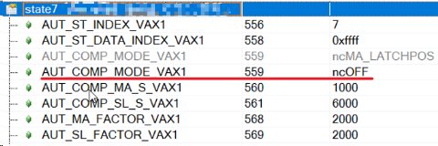 |

## 37111：凸轮数据：多项式值 y(xn) 与从站周期之间的差异

描述：

凸轮下载 (AUT_POLY_DATA) 的最后一个数据段的响应错误。 检查多项式函数值 y(xn) 以查看它是否对应于主区间结束时的从区间。 函数值计算为浮点数。 间隔（周期）作为整数放置在凸轮数据中。 如果偏差大于 0.1 且小于 1.0，则会生成此警告。 另请参阅错误编号 [5304](#5304凸轮数据格式错误).

反应：

凸轮被接受，但在主动凸轮耦合期间，偏差可能导致位置跳跃。

原因/补救措施：

计算凸轮多项式时出现数值错误。

计算算法没有考虑到只允许整数间隔的事实。

| 应用案例                                                                                                                                                                                                                                                                                                                                                                                                                                                                                                                                                                                                                                                                                                  |
|-----------------------------------------------------------------------------------------------------------------------------------------------------------------------------------------------------------------------------------------------------------------------------------------------------------------------------------------------------------------------------------------------------------------------------------------------------------------------------------------------------------------------------------------------------------------------------------------------------------------------------------------------------------------------------------------------------------|
| 2022.12.19 现象 绝大多数时候没问题，但会偶发  原因 整数是必需保证的，但是曲线参数是浮点数，精度有限，每一段曲线是从起点按照多项式参数计算的，最后一段计算到终点的时候误差比较大了   第三段曲线，起点是(x2,y2)，是很准确的，后面直到(x3，y3)都是多项式系数算出来的，计算出来的 y3 跟sl_period差值超过0.1了  注意事项 第一个点要是0，最后一个点要是整数 这代码说其实曲线是接受了，提示有突变而已  可尝试的解决方式 优化曲线的点 看能否加多一小段主轴，而从轴是静止的。 从轴在曲线结束是停止的话，就提前停下，比如359.9度就走完，剩下0.1，也是静止。来避免这代码，或者程序发现这代码就自动确认即可。 不超过128个点可以考虑使用此功能块MC_BR_CalcCamFromPoints |
| 2023.07.05 **现象** 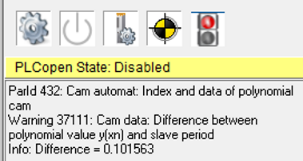 **原因** 画面中设置的刀长度是315.000mm会报错37111，需注意五阶多项式最后一项不能为小数                                                                                                                                                                                                                                                                                                                                                                                                                                                                                                                                                 |
| 2023.07.05 **现象** 轴报错偶发37111 **原因** 由上位下发的CAM数据点由相机生成，而头尾的位置点是固定不变的。 对于短片，凸轮最后第二个点和最后一个点之间位置离太远，系统无法拟合成贴合6阶多项式曲线，因此报错。                                                                                                                                                                                                                                                                                                                                                                                                                                                                                              |

## 37112：凸轮数据中的多项式超过限值

描述：

写入 AUT_POLY_CHECK 时出现响应错误。 检查凸轮多项式是否违反限制。

反应：

没有任何。

原因/补救措施：

凸轮尺寸不正确。

AUT_MA_V_MAX 参数或轴限制不正确。

细节

1：Y-shift（位置跳转）向左连接多项式

2：Y-shift（位置跳转）向右连接多项式

3：正向最大加速度（AXLIM_A1_POS）

4：正向最大减速度（AXLIM_A2_POS）

5：负方向最大加速度（AXLIM_A1_NEG）

6：负方向最大减速度（AXLIM_A2_NEG）

7：正向最大速度（AXLIM_V_POS）

8：负方向最大速度（AXLIM_V_NEG）

## 37113：补偿齿轮：超出限值

描述：

查看错误编号 [5101](#5101补偿齿轮超出限值).

反应：

查看错误编号 [5101](#5101补偿齿轮超出限值).

原因/补救措施：

查看错误编号 [5101](#5101补偿齿轮超出限值).

| 应用案例                                                                                                                                                                                                                                                                                                                                                                                                                                                                                                                                                                                                                                                                                               |
|--------------------------------------------------------------------------------------------------------------------------------------------------------------------------------------------------------------------------------------------------------------------------------------------------------------------------------------------------------------------------------------------------------------------------------------------------------------------------------------------------------------------------------------------------------------------------------------------------------------------------------------------------------------------------------------------------------|
| 2022.01.11 问题：MC_GearInPos指令静止时投入正常，主轴运动中投入时，报警37113. 解决：设置MasterParIDMaxVelocity参数，如果不设置，从轴的补偿速度太大，超过限制。                                                                                                                                                                                                                                                                                                                                                                                                                                                                                                                                         |
| 2022.01.17 原因：将MC_BR_InitAutPar功能块的MaxMasterVelocity数值设小，例如设为1.                                                                                                                                                                                                                                                                                                                                                                                                                                                                                                                                                                                                                       |
| 2023.07.05 **现象** 使用MC_GearInPos功能块 当MasterParID=0时，MasterParIDMaxVelocity会直接影响到报警37113的产生和限制补偿段从轴加速度。分三种情况： a. MasterParIDMaxVelocity=1时，不产生报警，从轴加速度为三角波（不受限制）。触发Execute时主轴是否运动不影响结论。 b. MasterParIDMaxVelocity=0时,如果触发从轴同步时主轴在运动，则报警且从轴加速度受限制。如果先触发从轴同步，再让主轴运动，则不会报警且从轴加速度不受限制 c. MasterParIDMaxVelocity=Others时，一定会产生报警，但是从轴加速度波形不一定受限制，表现为MasterParIDMaxVelocity为较小的正值时从轴加速度仍为三角波。  **结论** 建议Velocity=1，Acceleration=1，MasterParIDMaxVelocity=1，可以避免报错37113，且可以保证从轴加速度不受限制。 |

## 38000：电流控制器：启动时电机转速过高

描述：

接通电流控制器时出现运行错误。 电流偏移补偿期间转子速度（次级元件）过高。 由于感应同步产生的电压，无法补偿电流偏移。

反应：

当前偏移设置为 0。

原因/补救措施：

等到电机静止

## 38001：扭矩限制器：限制值高于最大值

描述：

写入扭矩限制（扭矩限制或扭矩限制覆盖）参数时的响应错误。 驱动器无法产生所需的电流或电机不允许所需的电流。

反应：

转矩限制受驱动器的最大电流 ACOPOS_CURR_MAX 和电机的最大电流 MOTOR_CURR_MAX 的限制。

原因/补救措施：

ACOPOS 无法提供必要的电流。

电机无法提供必要的电流。

配置错误：扭矩限制被错误地设置得太高。

电机配置错误：如果 MOTOR_TORQ_MAX / MOTOR_CURR_MAX 的配置高于 MOTOR_TORQ_CONST 并且扭矩限制设置为高于 MOTOR_TORQ_CONST \* MOTOR_CURR_MAX，则报告此警告。.

## 38003：电机抱闸：测试扭矩受限

描述：

抱闸扭矩测试期间的运行错误。 无法达到测试扭矩。 测量误差大于 5%。

反应：

无。

原因/补救措施：

测试扭矩太大，分别激活扭矩限制（检查 ACOPOS 峰值电流、电机峰值电流、温度）。

控制器不稳定。.

## 38004：电机抱闸：测试扭矩小于负载扭矩

描述：

抱闸扭矩测试期间的运行错误。 测试扭矩小于实际负载扭矩。

反应：

无。

原因/补救措施：

实际负载转矩对于抱闸来说太大。

测试扭矩太小。

负载转矩确定不正确（电流测量系统、电机配置、转子换向或电机编码器测量系统）。

控制器不稳定。.

## 38005：电机测试：开启期间速度太高

描述：

接通电流控制器时出现运行错误。 接通控制器时，进行测试以确定电机速度 SCTRL_SPEED_ACT 是否高于 0.05\*MOTOR_SPEED_RATED/60。 测得的速度太高。

反应：

没有任何

原因/补救措施：

通过设置 MOTOR_TEST_MODE 中的 Bit4 和 Bit5 可以禁用移动电机时偏移电流的警告和有问题的自动调整.

| 应用案例                                                                                                                                                    |
|-------------------------------------------------------------------------------------------------------------------------------------------------------------|
| 2022.06.10 伺服switch_on时, 需要确保测得实际速度(RPS)\<0.05\*MOTOR_SPEED_RATED/60。 switch_on瞬间, 给的力有角度要求, 所以最好电机静止时做, 速度够低也可以。 |

## 38006：电流控制器：超出允许的电流偏移值

描述：

接通电流控制器时出现运行错误。 在此阶段校准电流测量的偏移值。 功率部分已打开，电机的电压为零。 测得的电流对于偏移校准来说太大了。

反应：

当前偏移设置为零。

原因/补救措施：

电流测量校准期间的转子运动：

当控制器开启时，转子（次级元件）在运动。 因此，在电流偏移校准期间，会感应电压并在直流总线中提供电流。 测得的电流被解释为偏移电流。

ACOPOS 硬件缺陷（电流测量、IGBT 模块、IGBT 控制器）。

通过设置参数 MOTOR_TEST_MODE 中的 Bit5，可以禁用有功功率级期间的电流偏移校准。.

## 38008：泄放器：无电流

描述：

打开控制器时的运行时警告。

8Vxxxx.00-x：

在控制器启动时，会进行测试以查看在制动电阻斩波器短暂激活时（20 毫秒）直流总线电压 UDC_ACT 下降是否超过 2%。测试过程中的直流母线压降小于 2%。

8B0Pxxxxxxxx.xxx-x：

在控制器启动时，会进行测试以查看在制动电阻斩波器短暂激活（20 毫秒）时斩波器电流 UDC_CHOP_CURR 是否超过限值 0.8 \* UDC_ACT / R_BLEEDER_EXT。斩波电流不超过限制。

反应：

无

原因/补救措施：

ACOPOS：

保险丝损坏：更换保险丝。

斩波器故障：更换 ACOPOS 模块。

外接制动电阻：

接线错误：检查所有制动电阻线是否正确固定在RB+和RB-连接处。

接线错误：从连接 RB+ 和 RB- 上拆下制动电阻器线路。检查 ACOPOS 侧制动电阻线路上 RB+ 和 RB- 之间的电阻。电阻必须是有限的并且对应于制动电阻数据。如果阻值为无穷大，则制动电阻或线路有故障。

制动电阻损坏：检查制动电阻上 RB+ 和 RB- 之间的电阻。如果阻值为无穷大，则制动电阻有故障。

8B0Pxxxxxxxx.xxx-x：

制动电阻错误配置：制动电阻R_BLEEDER_EXT的阻值参数设置过低。

斩波器电流测量故障：更换 ACOPOS 模块

直流母线电压测量不良：实际直流母线电压值低于测得的直流母线电压值 UDC_ACT：更换ACOPOS模块

可以通过在 MOTOR_TEST_MODE 中设置 Bit6 (0x40) 来禁用警告。.

| 应用案例                                                                                                                                                                                                                                                                                                                                                                                                                                                                                                                                                                                                                                                                                                                                                                                                                                                                                                                                                                                                                                                                                                |
|---------------------------------------------------------------------------------------------------------------------------------------------------------------------------------------------------------------------------------------------------------------------------------------------------------------------------------------------------------------------------------------------------------------------------------------------------------------------------------------------------------------------------------------------------------------------------------------------------------------------------------------------------------------------------------------------------------------------------------------------------------------------------------------------------------------------------------------------------------------------------------------------------------------------------------------------------------------------------------------------------------------------------------------------------------------------------------------------------------|
| 2023.06.29 此问题一般为制动电阻处出现问题。 需要排查的问题点： **1.保险丝损坏：更换保险丝。** ACOPOS 1320，可取下保险丝进行检查。   **2.斩波器故障：更换 ACOPOS 驱动器。** 可通过将ParID 398设置为0，切换为不使用外部制动电阻的方式，若驱动器Switch On，如果不报错则驱动器没有问题。 **3.外接制动电阻故障** 接线错误：检查所有制动电阻线是否正确固定在RB+和RB-连接处。 制动电阻正常：RB+与RB-之间的阻值一般在30Ω左右（即制动电阻铭牌上的标称阻值），如果为无穷大，则制动电阻或线路有问题。 **4.驱动器的24V供电偏低（例如23.2V)** 若24V供电是多设备串接，请检查驱动器的24V供电。 **5.现场三相供电偏低（例如370V)** **6.多个驱动器，共直流母线** **7.所选制动电阻的制动功率偏小** 偶尔出现检测时DC BUS 压降不满足检测条件                                                                                                                                                                                                                                                                                                                                  |
| 2023.06.26 **现象** 在现场生产几年的ACOPOS 1320驱动器，上电后报38008错误，可复位，但一旦运行仍报错。 **解决方式** 驱动器损坏，维修后解决。                                                                                                                                                                                                                                                                                                                                                                                                                                                                                                                                                                                                                                                                                                                                                                                                                                                                                                                                                              |
| 2023.06.26 **38008报错产生的原因** 驱动器Switch 时的DC BUS压降不满足检测条件（测试过程中的直流母线压降小于 2%）前提条件：使用外接制动电阻。  若使用内置，不使用即使降低2%以内也不会触发报错机制，因为内置制动电阻默认关闭了这个检测。  使用外部制动电阻时，可通过Trace驱动器Switch On过程中的ParID 298的数值变化来判断  **如何屏蔽此检测机制** ParID 866写为64                                                                                                                                                                                                                                                                                                                                                                                                                                                                                                                                                                                                                                                                                           |
| 2023.06.26 **现象** 同样的设备与程序，使用ACOPOS P3 8.8A 单轴，在某一个现场上电后偶发38008，在运行过程中不会报出38008。 使用的外接制动电阻参数为75Ω，1kW **原因** 此现场的供电电压较低为370V，其他现场的供电电压均为400V。 而DC BUS的压降自检与供电有直接关系，过低的电压会导致自检不通过。 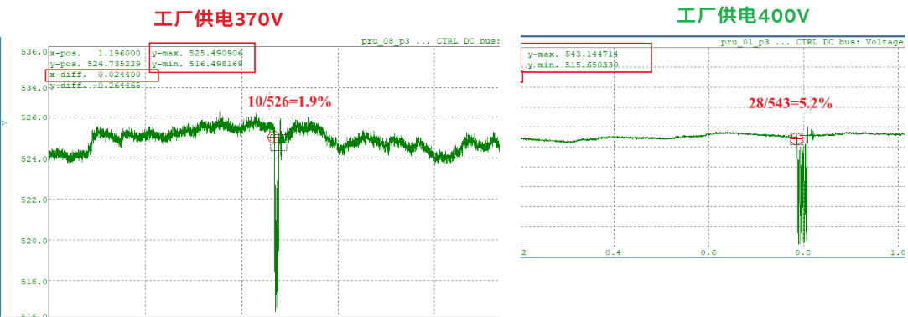 **解决方式** 由于现场的工厂供电电压低问题无法解决，故通过ParID写64屏幕，并在HMI上留相关的接口，可实现此屏蔽功能可调整。                                                                                                                                                                                                                                                                                                                                                                                                                                                                                                                                                                                                                                     |
| 2023.06.26 基本上，当驱动器被Switch On时，斩波器以100%的占空比被打开20ms。 在电源周期的六分之一（20ms/6 @ fn = 50Hz），直流母线电压以制动电阻的最大制动功率降低。 0 ) 若选用的制动电阻制动功率较低，而供电电压也偏低，则在驱动器Switch on时，直流母线电压可能会偶发下降不到2%，从而出发此38008报警。  1 ) 如果直流母线电压至少降低了2%，那么就意味着已经连接了一个制动电阻。 这个条件通常对没有与其他P3驱动器的直流母线连接的单个模块来说是足够的。 当与其他驱动器进行直流母线连接时，直流母线的容量增加、这就降低了降低的幅度，导致直流母线电压下降没有超过2%，从而报警。 此时可以通过屏蔽此自检解决  2 ) 在一个ACOPOS P3 Switch on期间，它通过直流总线连接到其他ACOPOS P3驱动器、再生能量在同一时刻由另一个轴返回到直流总线。在关于警告38008的内部测试中，这也会影响到直流母线电压的降低和测试的结果。这也会影响到直流母线电压的降低。如果是这种情况，也可以停用该警告。  建议首先验证所用机器的硬件结构是什么样子的，以及几个驱动器之间是否有直流总线连接。 如果是这种情况，下一步就是验证是否存在上述的某一点。在这种情况下，可以解释该警告，并且可以通过MOTOR_TEST_MODE中的第6位（0x40）来停用它。 |

## 38009：逆变器：输出：电流测试中止

描述：

接通电流控制器时的运行警告。 当控制器打开时，检查电流是否可以通过电压设置注入电机或再生扼流圈（逆变器输出）的各相。 测试前，电流测量信号的量程大于sqrt(2)\*MIN(MOTOR_CURR_RATED,ACOPOS_CURR_RATED)。 这意味着无法执行电流测试。

反应：

无

原因/补救措施：

查看错误编号 [6045](#6045逆变器输出无电流).

电机接线不正确。 检查电机接线和屏蔽。

电机与变频器不匹配。 电机额定电流 MOTOR_CURR_RATED 远低于变频器额定电流 ACOPOS_CURR_RATED。

## 39000：编码器：警告激活

描述：

编码器驱动程序会报告带有附加信息的警告（与编码器编号不同）。

为了能够建立与编码器的分配，该警告还与编码器编号一起作为附加信息报告。

反应：

请参阅进一步的警告。

原因/补救措施：

请参阅进一步的警告。.

## 39001：编码器：位置校正激活

描述：

SinCos/RS485 编码器 (EnDat, HIPERFACE? SSI,..) 中的运行时错误并激活监视器 [7030](#7030编码器增量信号幅度太大)). 几次比较循环后，插入卡的增量位置与编码器的串行绝对位置的位置差异过大。

此错误仅输入一次。

反应：

增量位置根据串行绝对位置重新调整。

原因/补救措施：

AB 编码器连接中断或损坏。 请参阅接线指南错误编号 [7030](#7030编码器增量信号幅度太大).

串行绝对位置的问题。 查看错误编号 [39006](#39006endat-编码器报警位---位置值包含错误).

编码器故障。

AC120 或 AC121 插卡缺陷

| 应用案例                                                                                                                                                                                                                                                                                                                                                                                                                                                                                                                                                                                                                                                                                                                                                                                                                                                           |
|--------------------------------------------------------------------------------------------------------------------------------------------------------------------------------------------------------------------------------------------------------------------------------------------------------------------------------------------------------------------------------------------------------------------------------------------------------------------------------------------------------------------------------------------------------------------------------------------------------------------------------------------------------------------------------------------------------------------------------------------------------------------------------------------------------------------------------------------------------------------|
| 2022.01.10 Endat2.2的编码器报错39001一类的错误是无法用普通的复位去复位的，需要通过设置ID719才能复位。一旦报错通常的轴控程序是跳转到报错里面去了，无法执行write ID的指令，所以需要单独写一个action，判断有39001后去执行这个action，这样才会有效复位。                                                                                                                                                                                                                                                                                                                                                                                                                                                                                                                                                                                                               |
| 2017.08.03 8BAC0125.000-1 编码器卡搭配施耐博格 AMSABS 绝对值磁栅尺 **现象** 驱动器上电初始没有错误，但在大范围手推滑动磁轨时会有 WARNING 39001， 而且滑动方向和 ID91 数值的增减对应关系并不固定，经过此次验证发现这种配置和实际不符。关于 SSI+SinCos 配置中位置获取的解释——上电初始时，先从数字信号读取当前绝对位置，为了满 足高精度的需求，后续就会结合模拟增量信号来计算更精确的绝对位置，并且编码器卡会循环获取数字绝对位 置和当前结合模拟增量信号计算出来的位置值进行对比，如果检测到误差，就会自动更正绝对位置 （Warning39001）。数字绝对位置和模拟增量位置就是通过 ID1228（ENCOD_SSI_LINE_RES）建立关联的， 而 ID1225（ENCOD_SSI_LINE_OFF）又决定了数字绝对位置和模拟增量信号的相位偏移关系，只有确定了 ID1225，才能确定绝对信号周期数。 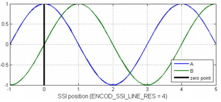 **解决方式** 设置调整编码器卡参数，并设置正确的ID（1228,1225）参数  |
| 2023.07.05 **原因** 由于改变编码器的位置，使得伺服得到的位置值发生跳变，会生成报警信息，如39001。 **解决方式** 可通过轴报警复位程序或者在Test中手动复位。                                                                                                                                                                                                                                                                                                                                                                                                                                                                                                                                                                                                                                                                                                          |

## 39002：解析器：超出 14 位分辨率的速度限制

描述：

解析器中的运行时错误。 以每转 2\^14 增量的分辨率超出了允许的速度（每个旋转变压器极对 4000 转/分钟）。

反应：

没有任何

原因/补救措施：

分辨率或设置速度定义过高（降低分辨率或设置速度）。

解析器故障。

解析器连接中断或有缺陷。 请参阅接线指南错误编号 [7030](#7030编码器增量信号幅度太大).

AC122 插件卡故障。

| 应用案例                                                                                                                                                                                                                                                  |
|-----------------------------------------------------------------------------------------------------------------------------------------------------------------------------------------------------------------------------------------------------------|
| 2023.07.05 **现象** 偶尔出现41011和39002的错误，从而导致停机或者界面上的实际速度不能够显示。 **原因** 初步推断为电机温度过高和电机转速过高，编码器卡分辨率出现问题 **解决方式** 更改系统的ParID 74和ParID 289参数，调大电机的限制温度，降低编码器卡分辨率 |
| 2023.07.05 使用旋转编码器设置  转速小于4000转每分的设备应该将ID109设置成16384，以提高控制精度及响应速度。转速大于4000rpm的时候只能设置成4096。否则会产生报警39002。                                        |

## 39003：EnDat 编码器：设置了警报位

描述：

正在使用的活动 EnDat 编码器中的运行时错误。报警输入到编码器的操作状态寄存器中。

如果测量系统中的故障会导致位置值不正确，则会设置警报。

反应：

对于正在使用的编码器，根据读取的报警存储器输入附加警告。

当存在活动警报时，不会执行归位命令并且不再更新位置。

对于 Endat 2.2 编码器，还会读取“模式错误”寄存器中的条目并输入警告。

原因/补救措施：

原因可以从以下警告中读出：

39004、39005、39006、39007、39008、39009 和 39010。

对于 Endat 2.2 编码器，还有：

39024、39025、39026、39032、39034、39035、39036、39037、39038、39039、39040、39041、39042、39044、39043

对于 Endat 2.2 编码器，一旦原因得到纠正，警报位可以通过 ENCOD_CMD = 1 清除。

重要提示：对于电池缓冲编码器，必须验证多圈位置。

（参见错误 39024）)

| 应用案例                                                                                                                                                                                                                                                                                                                             |
|--------------------------------------------------------------------------------------------------------------------------------------------------------------------------------------------------------------------------------------------------------------------------------------------------------------------------------------|
| 2022.01.10 电机编码器损坏：请重新上电，故障是否仍然存在。如故障仍然存在，需要更换编码器。                                                                                                                                                                                                                                            |
| 2022.06.27 问题：使用扉叶电机E09编码器，在test模式下使能，就会报4005，39003，6057，39042，39024，39006。 解决方式：参数表719写1来确认编码器。                                                                                                                                                                                        |
| 2023.02.14 1. 检查电机侧编码器接头是否拧紧，针脚有松动弯曲，缺失。 2. 检查编码器电缆是否有磨损。建议使用新的编码器线缆进行排除。 3. 驱动器侧屏蔽是否良好并接上。 4. 检查编码器卡是否完好，且型号和实际使用匹配。建议更新新的编码器卡测试。 5. 如上排除后，仍不能排除故障，建议更换电机。                                             |
| 2022.03.21 **现象** 现场设备电机偶发报出39003、7032等错误 拆开电机与减速箱的连接，发现电机轴与减速机连接的地方顶在一起（如下图），这样电机轴受到轴向的作用力，这样电机编码器（海德翰32线磁性编码器）就有可能偏心，导致报警                                                            |
| 2023.07.05 在ACOPOSmicro上这个错误的原因是在打开ACOPOSmicro的电源时，电缆已经断开了。而由于这个伺服机里有一个寄存器，即使关闭了它，它也不会忘记这个编码器错误。  这就是为什么我们需要写到ParID 719: Encoder1: Encoder command = 1。                                                                                                  |
| 2023.07.05 **现象** 生产时报警39003，之后界面上显示位置变为一个很大的值，错误无法复位，断电重启后可以正常运行 现场电机查下后，发现端盖上有很多锈渍，锈渍为润滑油与铁锈混合，铁锈不是来自电机轴头，怀疑是减速机内部流出来的。 **解决方式** 为保证现场稳定生产，更换一台电机后解决此问题                                               |
| 2023.07.05 电机上电后报错 39042 39024 39006 39003 ，提示编码器电压过低，将719写1可以暂时屏蔽错误测试                                                                                                                                                                                                                                 |
| 2023.07.05 **现象** 电机39003 39006报错 **解决思路** 编码器类型的故障，建议拧紧编码器卡，编码器线，更换编码器卡，更换编码器线逐步排除问题  **解决方式** 紧固编码器卡，编码器线后问题暂时解决                                                                                                                                         |
| 2023.07.05 **现象** 轴报警39003、39005，而且错误无法消除 **排查方式** 通过交换编码器卡和电缆的方式很快确认到问题出现在电机编码器上，根据之前的经验，大概率是因为电机轴受力导致编码器轴心偏离，于是协调现场把电机和减速机拆分开，然后上电测试，这个时候编码器信号正常，单电机运行正常。 **问题原因** 减速箱安装的时候电机轴头受力导致 |
| 2023.07.05 垂直于转动轴圆心方向(电机轴向方向），两个圆垂直中心不共线，并且报错。39003 39005 39033                                                                                                                                                                                                                                    |

## 39004：EnDat 编码器：警报位 - 照明故障

描述：

正在使用的活动 EnDat 编码器中的运行时错误。 光学编码器中的照明故障。

反应：

没有任何

原因/补救措施：

编码器故障。

| 应用案例                                                                                                       |
|----------------------------------------------------------------------------------------------------------------|
| 2022.09.14 现象：错误号39005、39004、5034。经过检查，发现电机进水，导致了电机中编码器损坏。 解决方式：更换电机 |

## 39005：EnDat 编码器：警报位 - 信号幅度太小

描述：

正在使用的活动 EnDat 编码器中的运行时错误。 正弦增量信号的幅度太小。

反应：

无

原因/补救措施：

编码器不再干净。

编码器调整不正确（检查物理安装）。

编码器故障。

| 应用案例                                                                                                                                                                                                                                                                                                                             |
|--------------------------------------------------------------------------------------------------------------------------------------------------------------------------------------------------------------------------------------------------------------------------------------------------------------------------------------|
| 2022.01.11 39005/39006/39033/39034/39042/39044 endat编码器一类的报错 （1）Encoder卡或者线缆 （2）电机问题                                                                                                                                                                                                                            |
| 2022.09.14 现象：错误号39005、39004、5034。经过检查，发现电机进水，导致了电机中编码器损坏。 解决方式：更换电机                                                                                                                                                                                                                       |
| 2023.07.05 **现象** 轴报警39003、39005，而且错误无法消除 **排查方式** 通过交换编码器卡和电缆的方式很快确认到问题出现在电机编码器上，根据之前的经验，大概率是因为电机轴受力导致编码器轴心偏离，于是协调现场把电机和减速机拆分开，然后上电测试，这个时候编码器信号正常，单电机运行正常。 **问题原因** 减速箱安装的时候电机轴头受力导致 |
| 2023.07.05 垂直于转动轴圆心方向(电机轴向方向），两个圆垂直中心不共线，并且报错。39003 39005 39033                                                                                                                                                                                                                                    |
| 2023.07.05 **现象** 一台电机在运调试过程中报编码器错误（39005）发现两台电机都报电机温度异常，远程监控看了一下电机反馈的电机温度，达到了1000000度，判断热敏电阻的阻值存在问题。 **解决方式** 电机维修/更换                                                                                                                            |

## 39006：EnDat 编码器：报警位 - 位置值包含错误

描述：

带有激活监视器的 EnDat 编码器中的运行时错误（激活，请参见错误编号 [7030](#7030编码器增量信号幅度太大)). 编码器内部的位置监视器检测到错误。

反应：

没有任何

原因/补救措施：

另请参阅错误编号 [39005](#39005endat-编码器警报位---信号幅度太小).

编码器速度或移动速度太高。

编码器振动（机械振动）。

使用电池缓冲编码器：请参阅错误编号 [39010](#39010endat-编码器警报位---需要更换电池)

| 应用案例                                                                                                                                                                                                                                                                                                                  |
|---------------------------------------------------------------------------------------------------------------------------------------------------------------------------------------------------------------------------------------------------------------------------------------------------------------------------|
| 2022.01.10 电机编码器损坏：请重新上电，故障是否仍然存在。如故障仍然存在，需要更换编码器。                                                                                                                                                                                                                                 |
| 2022.01.11 39005/39006/39033/39034/39042/39044 endat编码器一类的报错 （1）Encoder卡或者线缆 （2）电机问题                                                                                                                                                                                                                 |
| 2022.06.27 问题：使用扉叶电机E09编码器，在test模式下使能，就会报4005，39003，6057，39042，39024，39006。 解决方式：参数表719写1来确认编码器。                                                                                                                                                                             |
| 2023.07.05 **现象** 电机39003 39006报错 **解决思路** 编码器类型的故障，建议拧紧编码器卡，编码器线，更换编码器卡，更换编码器线逐步排除问题  **解决方式** 紧固编码器卡，编码器线后问题暂时解决                                                                                                                              |
| 2023.07.05 **现象** 驱动器为ACOPOSmulti, 使用EnDat2.2编码器 轴上电时报错 39006,39042,39024, 复位后报错6057,39003,39042,39024,39006 查看帮助确认为编码器电池原因导致的报错，在39010的报错中提示，EnDat2.2编码器报多圈位置错误后，需要给PARID_ENCOD_CMD（719）写1才能清除。 **解决方式** Test中给719写1后，驱动器可以上电。 |

## 39007：EnDat 编码器：警报位 - 过压

描述：

带有激活监视器的 EnDat 编码器中的运行时错误（激活，请参见错误编号 [7030](#7030编码器增量信号幅度太大)). 电源电压过高。

反应：

没有任何

原因/补救措施：

编码器电源电压问题（检查电压波动或干扰）。

编码器故障。

## 39008：EnDat 编码器：报警位 - 欠压

描述：

带有激活监视器的 EnDat 编码器中的运行时错误（激活，请参见错误编号 [7030](#7030编码器增量信号幅度太大)). 电源电压过低。

反应：

无

原因/补救措施：

查看错误编号 [39007](#39007endat-编码器警报位---过压).

## 39009：EnDat 编码器：报警位 - 过流

描述：

带有激活监视器的 EnDat 编码器中的运行时错误（激活，请参见错误编号 [7030](#7030编码器增量信号幅度太大)). 在编码器中测量到过电流。

反应：

没有任何

原因/补救措施：

编码器故障（内部短路）。.

## 39010：EnDat 编码器：警报位 - 需要更换电池

描述：

带有激活监视器的 EnDat 编码器中的运行时错误（激活，请参见错误编号 [7030](#7030编码器增量信号幅度太大)). 必须更换电池。

使用电池缓冲编码器时，电池电压下降到一定限度以下。

如果编码器未通电，则不会记录多圈位置的变化。 因此，多圈位置无效。

反应：

没有任何

原因/补救措施：

更换编码器电池。

更换编码器电池。

无编码器电源或电源包含错误。

请参阅接线指南错误编号 [7030](#7030编码器增量信号幅度太大).

只能通过设置 PARID_ENCOD_CMD = 1 来确认错误。

然后必须测量多圈位置。.

| 应用案例                                                                                                                                                                                                                                                                                                                  |
|---------------------------------------------------------------------------------------------------------------------------------------------------------------------------------------------------------------------------------------------------------------------------------------------------------------------------|
| 2023.07.05 **现象** 驱动器为ACOPOSmulti, 使用EnDat2.2编码器 轴上电时报错 39006,39042,39024, 复位后报错6057,39003,39042,39024,39006 查看帮助确认为编码器电池原因导致的报错，在39010的报错中提示，EnDat2.2编码器报多圈位置错误后，需要给PARID_ENCOD_CMD（719）写1才能清除。 **解决方式** Test中给719写1后，驱动器可以上电。 |

## 39011：EnDat 编码器：警告位 - 频率太高

描述：

带有激活监视器的 EnDat 编码器中的运行时错误（激活，请参见错误编号 [7030](#7030编码器增量信号幅度太大)). 增量信号的计数频率太高。

反应：

无

原因/补救措施：

速度或移动速度太高。

编码器振动（机械振动）。

编码器故障。.

## 39012：EnDat 编码器：警告位 - 温度过高

描述：

带有激活监视器的 EnDat 编码器中的运行时错误（激活，请参见错误编号 [7030](#7030编码器增量信号幅度太大)). 编码器温度过高。 温度进一步升高会导致位置故障。

反应：

没有任何

原因/补救措施：

检查电机和环境温度。

编码器故障。

## 39013：EnDat 编码器：警告位 - 达到照明储备

描述：

带有激活监视器的 EnDat 编码器中的运行时错误（激活，请参见错误编号 [7030](#7030编码器增量信号幅度太大)). 已达到内部照明亮度控制器的最大调节变量。 亮度的进一步衰减会导致定位失败。

反应：

没有任何

原因/补救措施：

编码器照明老化。

编码器故障。.

## 39014：EnDat 编码器：警告位 - 电池电量过低

描述：

带有激活监视器的 EnDat 编码器中的运行时错误（激活，请参见错误编号 [7030](#7030编码器增量信号幅度太大)). 电池电量过低。

反应：

没有任何

原因/补救措施：

更换编码器电池。

编码器故障。.

| 应用案例                                                                                                                                                                    |
|-----------------------------------------------------------------------------------------------------------------------------------------------------------------------------|
| 2023.06.28 **现象** 电机编码器没有备用电池供电报错39014。 **解决方式** 有些编码器需要备用电池以支持多圈功能，可以考虑改造Endat2.2 编码器线缆，外接3.6V 电池盒给编码器供电。 |

## 39015：EnDat 编码器：警告位 - 未达到参考点

描述：

EnDat 编码器中的运行时错误。 未到达参考点

反应：

无

原因/补救措施：

编码器故障.

## 39016：增量编码器仿真：频率太高

描述：

执行增量编码器仿真时出现运行时错误。 输出位置 ENCODx_OUT_PARID 的速度太高。 允许的最大频率为每秒 65,000 个信号周期。

反应：

输出频率根据允许的最大频率进行限制。 仿真编码器位置跟踪输出位置以防止增量丢失。

原因/补救措施：

增量编码器仿真的编码器分辨率太大。

输出位置的速度太高。

由于归位导致输出位置跳跃（归位期间关闭编码器仿真）。

| 应用案例                                                                                                                                                                                                                                                                                                                                       |
|------------------------------------------------------------------------------------------------------------------------------------------------------------------------------------------------------------------------------------------------------------------------------------------------------------------------------------------------|
| 2022.12.09 使用ACOPOS P3的外接编码器8EAC0130， Emulation开启期间，如果位置信号来源（ID712）有 home的动作，会触发报错 39016。为此在位置信号来源执行 home之前应当先关闭 Emulation，待 home完成后再重新开启。 建议使用方式如下： 1.SwitchOFF轴。 2.ID712写入 0。 3. 依次写入 ID420、ID1572、ID712、ID1301。 4. 恢复轴原先状态                     |
| 2023.07.05 8AC130.60-1限制 输出的脉冲被限制在65kHz（相当于260,000 incr./s） 8BAC0130.00x-1 输出的脉冲被限制在65kHz（相当于260,000 incr./s） 8BAC0133.000-1 输出的脉冲被限制在1MHz（相当于4,000,000 incr./s）  如果超过了这些限制、 警告39016被输出。仿真位置与实际位置相比，会出现临时的位置偏移。与实际位置相比，模拟位置会发生暂时性的偏移。 |

## 39017：编码器：读取位置时出现 CRC 错误

描述：

读取编码器的串行绝对位置时出现运行时错误。 数据传输期间发生 CRC 或校验和错误。

反应：

再次读取串行绝对位置。

原因/补救措施：

查看错误编号 [7014](#7014编码器参数传输过程中出现-crc-错误).

## 39018：参考脉冲监控：位置、分辨率或参考脉冲错误

描述：

增量参考脉冲监视器激活时的运行错误。 两个参考脉冲之间的距离在有效范围之外。

反应：

无

原因/补救措施：

将参考脉冲监视器的配置（脉冲宽度、脉冲间隔、观察窗口和模式）与编码器数据表进行比较。

另请参阅错误编号 [7047](#7047无效的参考标记距离).

## 39019：串行编码器接口：停止位错误

描述：

操作编码器的串行接口时出现运行时错误。 接收数据时发生停止位错误。

反应：

编码器初始化：重复数据传输。

绝对位置读数：忽略数据。

通过数据块传输操作：无。

原因/补救措施：

查看错误编号 [7014](#7014编码器参数传输过程中出现-crc-错误).

## 39020：串行编码器接口：接收数据溢出

描述：

操作编码器的串行接口时出现运行时错误。 接收数据时接收缓冲区溢出。

反应：

编码器初始化：重复数据传输。

绝对位置读数：忽略数据。

通过数据块传输操作：无。

原因/补救措施：

查看错误编号 [7014](#7014编码器参数传输过程中出现-crc-错误).

## 39021：串行编码器接口：发送数据错误

描述：

操作编码器的串行接口时出现运行时错误。 发送数据时发生数据传输错误。

反应：

编码器初始化：重复数据传输。

绝对位置读数：忽略数据。

通过数据块传输操作：无。

原因/补救措施：

查看错误编号 [7014](#7014编码器参数传输过程中出现-crc-错误).

## 39022：EnDat 编码器：设置了警告位

描述：

EnDat 2.2 编码器的运行时错误。

编码器设置警告位，这是多种原因的总和位。

反应：

无

原因/补救措施：

警告位通常会输出多个描述原因的错误消息：

可能的其他错误消息：

\- 错误编号 [39011](#39011endat-编码器警告位---频率太高)

\- 错误编号 [39012](#39012endat-编码器警告位---温度过高)

\- 错误编号 [39013](#39013endat-编码器警告位---达到照明储备)

\- 错误编号 [39014](#39014endat-编码器警告位---电池电量过低)

\- 错误编号 [39015](#39015endat-编码器警告位---未达到参考点)

\- 错误编号 [39092](#39092endat-编码器警告位---循环操作)

\- 错误编号 [39093](#39093endat-编码器警告位---未到达边界层)

\- 错误编号 [39094](#39094endat-编码器警告位---未准备好)

\- 错误编号 [39095](#39095endat-编码器警告位---低于诊断阈值)

一旦错误的原因得到纠正，您可以尝试使用 ENCOD_CMD = 6 清除警告位。

重要提示：此命令还会清除任何设置的警报位！!

| 应用案例                                                                                                                                                   |
|------------------------------------------------------------------------------------------------------------------------------------------------------------|
| 2023.07.05 **现象** 轴偶发报错39022 重新上电后错误清除，但是无法用TEST复现错误，只是在跑动作流程时偶发 **结论** 可能是电磁干扰引起，进行布线优化和干扰检查 |

## 39023：EnDat 编码器：读取 EnDat2.2 附加信息时出现 CRC 错误

描述：

操作 EnDat2.2 编码器的串行接口时出现运行时错误。 发送 EnDat2.2 附加信息时发生数据传输错误。

反应：

接收到的数据将被忽略并重复数据传输。

原因/补救措施：

另请参阅错误编号 [7014](#7014编码器参数传输过程中出现-crc-错误).

## 39024：EnDat 编码器：操作状态错误来源：M ALL 掉电

[描述：](#7030编码器增量信号幅度太大)

带有激活监视器的编码器中的运行错误（激活，参见错误编号[7030](#7030编码器增量信号幅度太大)). 电池电量过低。

使用电池缓冲编码器和驱动器关闭驱动器时，电池电压下降到特定限制以下。

如果编码器未通电，则不会记录多圈位置的变化。 因此，多圈位置无效。

反应：

查看错误编号 [7030](#7030编码器增量信号幅度太大).

原因/补救措施：

更换编码器电池。

无编码器电源或电源包含错误。

请参阅接线指南错误编号 [7030](#7030编码器增量信号幅度太大).

只能通过设置 ENCOD_CMD = 1 来确认错误。

然后必须测量多圈位置.

| 应用案例                                                                                                                                                                                                                                                                                                                  |
|---------------------------------------------------------------------------------------------------------------------------------------------------------------------------------------------------------------------------------------------------------------------------------------------------------------------------|
| 2022.06.27 问题：使用扉叶电机E09编码器，在test模式下使能，就会报4005，39003，6057，39042，39024，39006。 解决方式：参数表719写1来确认编码器。                                                                                                                                                                             |
| 2023.07.05 **现象** 驱动器为ACOPOSmulti, 使用EnDat2.2编码器 轴上电时报错 39006,39042,39024, 复位后报错6057,39003,39042,39024,39006 查看帮助确认为编码器电池原因导致的报错，在39010的报错中提示，EnDat2.2编码器报多圈位置错误后，需要给PARID_ENCOD_CMD（719）写1才能清除。 **解决方式** Test中给719写1后，驱动器可以上电。 |

## 39025：EnDat 编码器：操作状态错误来源：M 上溢/下溢

描述：

带有激活监视器的编码器中的运行错误（激活，参见错误编号 [7030](#7030编码器增量信号幅度太大)).

多圈溢流

反应：

原因/补救措施：

将编码器返回到允许的多圈范围并通过写入确认错误

或者，可以通过将值 4 写入 ENCOD_CMD 将多圈位置重置为当前位置。

这会导致编码器失去其绝对参考，因此需要对其进行校准.

## 39026：EnDat 编码器：读取 EnDat2.2 附加信息时出现类型 3 错误

描述：

操作 EnDat2.2 编码器的串行接口时出现运行时错误。 发送 EnDat2.2 附加信息时发生数据传输错误。

反应：

接收到的数据将被忽略并重复数据传输。

原因/补救措施：

另请参阅错误编号 [7014](#7014编码器参数传输过程中出现-crc-错误).

## 39027：编码器仿真：电源故障

描述：

编码器电源中的运行错误。

反应：

没有任何

原因/补救措施：

检查电源控制。

电源过载或故障。

电源故障。

电源连接缺陷（线路开路、线路终端、接线错误、保险丝）。

传感器电源短路。

插卡缺陷。.

## 39028：编码器：多圈故障

描述：

带有激活监视器的编码器中的运行错误（激活，参见错误编号 [7030](#7030编码器增量信号幅度太大)).

反应：

无

原因/补救措施：

增量确定的位置偏离串行传输的位置。

超出测量范围（线性编码器）。

另请参阅错误编号 [7030](#7030编码器增量信号幅度太大).

多圈范围错误。

如果多圈范围的一部分被错误地映射，绝对位置可能是错误的，

当例如 在该字段中会发生重新启动。

通过在重启后测量绝对位置来验证编码器。 然后

通过移动整个多转弯区域进行检查。

## 39029：编码器：电池电量过低

描述：

编码器中的运行时错误。 必须更换电池。

使用电池缓冲编码器时，电池电压下降到一定限度以下。

反应：

没有任何

原因/补救措施：

更换编码器电池。

无编码器电源或电源包含错误。

请参阅接线指南错误编号 [7030](#7030编码器增量信号幅度太大).

## 39030：编码器：设置了警告位

描述：

启用了警告位评估的编码器的运行时信息。

反应：

无

原因/补救措施：

发生了导致编码器设置警告位的事件。

产生警告位的原因可以在编码器制造商提供的文档中找到。

编码器配置不正确。

编码器连接中断或损坏。 请参阅接线指南错误编号 [7030](#7030编码器增量信号幅度太大).

## 39032：EnDat 编码器：操作状态错误来源：照明

描述：

编码器中的运行时错误。

反应：

无

原因/补救措施：

无

## 39033：EnDat 编码器：运行状态错误源：信号幅度

描述：

编码器中的运行时错误。

反应：

无

原因/补救措施：

无

| 应用案例                                                                                                  |
|-----------------------------------------------------------------------------------------------------------|
| 2022.01.11 39005/39006/39033/39034/39042/39044 endat编码器一类的报错 （1）Encoder卡或者线缆 （2）电机问题 |
| 2023.07.05 垂直于转动轴圆心方向(电机轴向方向），两个圆垂直中心不共线，并且报错。39003 39005 39033         |

## 39034：EnDat 编码器：运行状态错误源：S Pos 1

描述：

编码器中的运行时错误。

反应：

没有任何

原因/补救措施：

形成单圈位置时编码器错误。

编码器故障.

| 应用案例                                                                                                  |
|-----------------------------------------------------------------------------------------------------------|
| 2022.01.11 39005/39006/39033/39034/39042/39044 endat编码器一类的报错 （1）Encoder卡或者线缆 （2）电机问题 |

## 39035：EnDat 编码器：运行状态错误源：过压

描述：

编码器中的运行时错误。

反应：

没有任何

原因/补救措施：

没有任何

## 39036：EnDat 编码器：运行状态错误源：欠压

描述：

编码器中的运行时错误。

反应：

无

原因/补救措施：

无

## 39037：EnDat 编码器：运行状态错误源：过电流

描述：

编码器中的运行时错误。

反应：

无

原因/补救措施：

无

## 39038：EnDat 编码器：运行状态错误源：超出温度

描述：

编码器中的运行时错误。

反应：

无

原因/补救措施：

无

## 39039：EnDat 编码器：运行状态错误源：S Pos

描述：

编码器中的运行时错误。

反应：

没有任何

原因/补救措施：

形成单圈位置时编码器错误。

编码器故障。.

## 39040：EnDat 编码器：运行状态错误来源：S 系统

描述：

编码器中的运行时错误。

反应：

没有任何

原因/补救措施：

形成单圈位置时编码器错误。

编码器故障。.

## 39041：EnDat 编码器：操作状态错误来源：S ALL 掉电

描述：

编码器中的运行时错误。

反应：

没有任何

原因/补救措施：

形成单圈位置时编码器错误。

编码器故障。.

## 39042：EnDat 编码器：运行状态错误源：M Pos 1

描述：

编码器中的运行时错误。

反应：

没有任何

原因/补救措施：

形成多圈位置时编码器错误。

对于电池缓冲编码器，也会出现电源电压故障 - 参见错误 39029 和 39024

编码器故障.

| 应用案例                                                                                                                                                                                                                                                                                                                  |
|---------------------------------------------------------------------------------------------------------------------------------------------------------------------------------------------------------------------------------------------------------------------------------------------------------------------------|
| 2022.01.11 39005/39006/39033/39034/39042/39044 endat编码器一类的报错 （1）Encoder卡或者线缆 （2）电机问题                                                                                                                                                                                                                 |
| 2022.06.27 问题：使用扉叶电机E09编码器，在test模式下使能，就会报4005，39003，6057，39042，39024，39006。 解决方式：参数表719写1来确认编码器。                                                                                                                                                                             |
| 2023.07.05 **现象** 驱动器为ACOPOSmulti, 使用EnDat2.2编码器 轴上电时报错 39006,39042,39024, 复位后报错6057,39003,39042,39024,39006 查看帮助确认为编码器电池原因导致的报错，在39010的报错中提示，EnDat2.2编码器报多圈位置错误后，需要给PARID_ENCOD_CMD（719）写1才能清除。 **解决方式** Test中给719写1后，驱动器可以上电。 |

## 39043：EnDat 编码器：运行状态错误源：M Pos 2

描述：

编码器中的运行时错误。

反应：

没有任何

原因/补救措施：

形成多圈位置时编码器错误。

对于电池缓冲编码器，也会出现电源电压故障 - 参见错误 39029 和 39024

编码器故障.

## 39044：EnDat 编码器：运行状态错误来源：M 系统

描述：

编码器中的运行时错误。

反应：

没有任何

原因/补救措施：

形成多圈位置时编码器错误。

对于电池缓冲编码器，也会出现电源电压故障 - 参见错误 39029 和 39024

编码器故障.

| 应用案例                                                                                                  |
|-----------------------------------------------------------------------------------------------------------|
| 2022.01.11 39005/39006/39033/39034/39042/39044 endat编码器一类的报错 （1）Encoder卡或者线缆 （2）电机问题 |

## 39045：EnDat 编码器：运行状态错误来源：M 电池

描述：

编码器中的运行时错误。

反应：

没有任何

原因/补救措施：

形成多圈位置时编码器错误。

对于电池缓冲编码器，也会出现电源电压故障 - 参见错误 39029 和 39024

编码器故障.

## 39046：编码器：不正确的编码器地址确认

描述：

响应中包含的编码器地址与请求的编码器地址不匹配。

反应：

无

原因/补救措施：

无

## 39047：编码器：位置值与绝对值不同步

描述：

带有激活监视器的绝对编码器中的运行错误（激活，参见错误编号 [7030](#7030编码器增量信号幅度太大)). 插卡的增量位置无法与编码器的绝对串行位置同步。

反应：

查看错误编号 [7030](#7030编码器增量信号幅度太大).

原因/补救措施：

串行通信错误（参见另外输入的错误编号）.

| 应用案例                                                                                                                                                                                                                                                                                                                                                                                                                                                                                                                                                                                                                                                                                                                                                   |
|------------------------------------------------------------------------------------------------------------------------------------------------------------------------------------------------------------------------------------------------------------------------------------------------------------------------------------------------------------------------------------------------------------------------------------------------------------------------------------------------------------------------------------------------------------------------------------------------------------------------------------------------------------------------------------------------------------------------------------------------------------|
| 2023.07.05 **现象** 移机后频繁出现的39047与29209错误 设备开一个小时左右报一次，复位能够正常生产，使用ACOPOS驱动器，外接SICK 编码器，接口为HIPERFACE  **排查方式** 1.不会是驱动器或者编码卡坏了，因为如果坏了，是无法复位成功继续工作生产的。 2.大概率是干扰带来的问题，可能线缆的屏蔽没有接，通讯卡件有松动，或者接地排有问题有电压导致了问题。  **建议检查方向** 1.动力线的线缆屏蔽层确保已经接地 2.确认伺服控制器的外壳是否正确接地 3.编码器卡附近的接地是正确的，并确认螺丝已经插好。 4.检查接地排在出现问题的时候，是否有电压。 5.出现问题的频率不固定，需要收集一下信息，是否附近其他机器在开的时候，出现问题的频率就增高，可通过这个定位问题点。  **解决方式** 打了接地的地桩，但还是有报警 把线重新整理并拔插驱动器线缆，并清理了灰尘，问题不再出现 |

## 39048：编码器：不正确的命令代码确认

描述：

请求的命令代码与收到的命令代码不匹配。

反应：

没有任何

原因/补救措施：

没有任何ne

## 39049：编码器：参数传输期间超时

描述：

带有激活监视器的编码器中的运行错误（激活，参见错误编号 [7030](#7030编码器增量信号幅度太大)). 数据传输过程中发生超时错误。 编码器未发送对发送请求的答复。

反应：

在编码器初始化期间重复传输。

写入参数时传输中止。

原因/补救措施：

未连接编码器。

另请参阅错误编号 [7014](#7014编码器参数传输过程中出现-crc-错误).

| 应用案例                                                                                                                |
|-------------------------------------------------------------------------------------------------------------------------|
| 2023.07.05 **现象** 当下载程序时，提示报错7040、39049 **问题原因** 与干扰有关，因此报警仅在一条线路上出现，建议更换线缆 |

## 39050：编码器：奇偶校验

描述：

带有激活监视器的编码器中的运行错误（激活，参见错误编号 [7030](#7030编码器增量信号幅度太大)). 传送的奇偶校验位与确定的奇偶校验位不匹配。 确定的奇偶校验位由读取的数据位和定义的 PARITY_MODE 之和的 LSB 得出。

反应：

查看错误编号 [7030](#7030编码器增量信号幅度太大).

原因/补救措施：

PARITY_MODE 参数的配置与编码器规格不符（检查编码器数据表）。

编码器连接中断或损坏。 请参阅接线指南错误编号 [7030](#7030编码器增量信号幅度太大).

编码器故障。

AC123 插件卡故障。.

## 39051：编码器：Hiperface 错误位

描述：

读取或写入参数时 HIPERFACE? 编码器中的运行时错误。 HIPERFACE?encoder与AC121插卡之间传输数据时发生错误。 结果，设置了错误位。 由于无法处理的命令（协议错误、命令参数）或由于内部编码器错误而设置此错误位。

反应：

输入了错误号 7013 或特定的状态消息。

原因/补救措施：

请参阅另外输入的错误编号。.

## 39052：编码器：超出测量范围

描述：

使用线性编码器 linear encoder时的运行时错误。 已离开允许的测量范围。

反应：

无

原因/补救措施：

编码器配置不正确。.

## 39053：编码器：编码器接口的内部检查失败

描述：

编码器中的运行时错误。 传输线校准失败。

反应：

没有任何

原因/补救措施：

编码器故障.

## 39054：编码器：电源电压无效

描述：

编码器中的运行时错误。 所选的编码器电源电压不允许

反应：

无

原因/补救措施：

选择了无效的编码器电源电压。

硬件不支持所选的编码器电源电压。

所选接口类型不支持所选编码器电源电压.

## 39055：编码器：增量信号幅度太小

描述：

带有激活监视器的编码器中的运行错误（激活，参见错误编号 [7030](#7030编码器增量信号幅度太大)).

正弦 AB 信号的幅度低于警告限值。

限制值在编码器接口的文档中指定。

反应：

没有任何

原因/补救措施：

编码器连接中断或损坏。 请参阅接线指南错误编号 [7030](#7030编码器增量信号幅度太大).

编码器故障。.

## 39056：编码器：增量信号幅度太大

描述：

带有激活监视器的编码器中的运行错误（激活，参见错误编号 [7030](#7030编码器增量信号幅度太大)).

正弦 AB 信号的幅度已超过警告限值。

限制值在编码器接口的文档中指定。

反应：

没有任何

原因/补救措施：

编码器连接中断或损坏。 请参阅接线指南错误编号 [7030](#7030编码器增量信号幅度太大).

编码器故障。.

## 39059：编码器：状态消息

描述：

编码器中的运行时错误。 此状态码应提供有关错误原因的答案。

反应：

没有任何

原因/补救措施：

见编码器接口说明或编码器数据表.

## 39060：编码器：同步位错误

描述：

带有激活监视器的编码器中的运行错误（激活，参见错误编号 [7030](#7030编码器增量信号幅度太大)).

数据或位置传输期间发生错误。

此错误与错误 7080 一起报告。

反应：

没有任何

原因/补救措施：

编码器连接中断或损坏。 请参阅接线指南错误编号 [7030](#7030编码器增量信号幅度太大).

编码器配置不正确。

编码器故障。.

## 39061：编码器：UART 传输错误

描述：

带有激活监视器的编码器中的运行错误（激活，参见错误编号 [7030](#7030编码器增量信号幅度太大)).

数据或位置传输期间发生错误。

此错误与错误 7080 一起报告。

反应：

没有任何

原因/补救措施：

编码器连接中断或损坏。 请参阅接线指南错误编号 [7030](#7030编码器增量信号幅度太大).

编码器配置不正确。

编码器故障。.

## 39086：编码器：寄存器地址

描述：

HIPERFACE DSL

提供寄存器地址，后跟错误编号 [39087](#39087编码器寄存器数据).

可能的地址：0x40-0x47 和 0x60-0x67（状态 0-7 或位 0-63）

寄存器 0x60-0x67 对应于寄存器 0x40-0x47。

请参阅编码器数据表或 HIPERFACE DSL接口说明

反应：

无

原因/补救措施：

请参阅编码器数据表或 HIPERFACE DSL接口说明

## 39087：编码器：寄存器数据

描述：

HIPERFACE DSL

提供了寄存器的数据。 寄存器地址见错误号 [39086](#39086编码器寄存器地址).

有关数据的含义，请参阅编码器数据表或 HIPERFACE DSL?接口说明。

反应：

无

原因/补救措施：

请参阅编码器数据表或 HIPERFACE DSL？接口说明

## 39088：编码器：HIPERFACE DSL：在线状态：位 4：ANS：检测到错误答案

描述：

此状态由 HIPERFACE DSL?Master IP-Core 报告。 更多信息可以在编码器数据表或 HIPERFACE DSL? 规范中找到。

摘自 HIPERFACE DSL 在线状态位 4 规范：

对长消息的最后一个答复已损坏。

反应：

查看错误编号 [7030](#7030编码器增量信号幅度太大).

原因/补救措施：

请参阅编码器数据表或 HIPERFACE DSL规范.

## 39089：编码器：HIPERFACE DSL：在线状态：位 10：VPOS：安全位置无效

描述：

此状态由 HIPERFACE DSL?Master IP-Core 报告。 更多信息可以在编码器数据表或 HIPERFACE DSL? 规范中找到。

摘自 HIPERFACE DSL? 在线状态位 10 的规范：

识别出安全位置的错误。 预计编码器传输的安全位置无效。

反应：

查看错误编号 [7030](#7030编码器增量信号幅度太大).

原因/补救措施：

请参阅编码器数据表或 HIPERFACE DSL规范。.

## 39090：编码器：HIPERFACE DSL：在线状态：位 11：POS：估计器已打开

描述：

此状态由 HIPERFACE DSL?Master IP-Core 报告。 更多信息可以在编码器数据表或 HIPERFACE DSL? 规范中找到。

摘自 HIPERFACE DSL? 在线状态位 11 的规范：

识别出快速位置中的错误来源或当前正在执行对齐程序。

很可能最后一个快速位置是无效的。

请注意，通过驱动器接口读取的快速位置是由估计器提供的。

反应：

查看错误编号 [7030](#7030编码器增量信号幅度太大).

原因/补救措施：

请参阅编码器数据表或 HIPERFACE DSL? 规范。.

## 39091：编码器：HIPERFACE DSL：在线状态：位 13：SCE：CRC 错误安全通道

描述：

此状态由 HIPERFACE DSL Master IP-Core 报告。 更多信息可以在编码器数据表或 HIPERFACE DSL? 规范中找到。

摘自 HIPERFACE DSL? 在线状态位 13 的规范：

最后收到的安全通道 CRC 是错误的。 预计传输的最后一个安全位置是无效的。

反应：

查看错误编号 [7030](#7030编码器增量信号幅度太大).

原因/补救措施：

请参阅编码器数据表或 HIPERFACE DSL规范。.

## 39092：EnDat 编码器：警告位 - 循环操作

描述：

来自 EnDat 编码器的错误消息。

该错误与错误 39022 一起报告。

反应：

无

原因/补救措施：

无

## 39093：EnDat 编码器：警告位 - 未到达边界层

描述：

来自 EnDat 编码器的错误消息。

该错误与错误 39022 一起报告。

反应：

无

原因/补救措施：

无

## 39094：EnDat 编码器：警告位 - 未准备好

描述：

来自 EnDat 编码器的错误消息。

该错误与错误 39022 一起报告。

反应：

无

原因/补救措施：

无

## 39095：EnDat 编码器：警告位 - 低于诊断阈值

描述：

来自 EnDat 编码器的错误消息。

该错误与错误 39022 一起报告。

反应：

无

原因/补救措施：

无

## 39301：模拟/数字 IO：24V 电源故障

描述：

模拟/数字插件卡的电源电压运行错误。

电源电压小于硬件特定的警告阈值。

反应：

无法再保证输出的供应。

原因/补救措施：

检查电源控制。

电源过载或故障。

电源故障。

电源连接缺陷（线路开路、线路终端、接线错误、保险丝）。

插卡缺陷.

## 39302：数字 IO 1-4：诊断位激活（电流，24V 电源）

描述：

AC130 插件卡的数字输出 1 到 4 上的运行时错误。

由于以下错误之一而设置了诊断位：

\- 输出晶体管的有源电流限制

\- 晶体管的结温过高

\- 电源电压过低

反应：

电流过载、电源电压错误或热过载会导致输出关闭。

原因/补救措施：

超出连续输出负载（见插卡技术数据）。

输出短路。

另请参阅错误编号 [39301](#39301模拟数字-io24v-电源故障).

| 应用案例                                                                                                          |
|-------------------------------------------------------------------------------------------------------------------|
| 2022.01.11 问题：AC130卡，报警39302 解决办法： 应该是AC130上24V电源接线虚接的问题 把AC130卡重新插拔了下后问题解决 |

## 39303：数字 IO 5-8：诊断位激活（电流，24V 电源）

描述：

AC130 插件卡的数字输出 5 到 8 上的运行时错误。

另请参阅错误编号 [39302](#39302数字-io-1-4诊断位激活电流24v-电源).

反应：

查看错误编号 [39302](#39302数字-io-1-4诊断位激活电流24v-电源).

原因/补救措施：

查看错误编号 [39302](#39302数字-io-1-4诊断位激活电流24v-电源).

## 39305：数字 IO 10：诊断位激活（电流、温度）

描述：

AC130 插件卡的数字输出 10 上的运行时错误。 诊断是由于电流过载或热过载而设置的。

反应：

电流过载或热过载导致输出关闭。

原因/补救措施：

查看错误编号 [39302](#39302数字-io-1-4诊断位激活电流24v-电源).

## 39306：数字 IO 9：诊断位激活（电流、温度）

描述：

AC130 插件卡的数字输出 9 上的运行时错误。

另请参阅错误编号 [39305](#39305数字-io-10诊断位激活电流温度).

反应：

查看错误编号 [39305](#39305数字-io-10诊断位激活电流温度).

原因/补救措施：

查看错误编号 [39302](#39302数字-io-1-4诊断位激活电流24v-电源).

## 39307：数字 IO：网络错误后输出掩码停用

描述：

网络错误后 8BAC0130.00x-1 的数字量输出出现运行时错误

反应：

输出被输出掩码禁用

原因/补救措施：

输出可以通过输出掩码 DIO_OUT_MASK 重新激活

## 39308：模拟/数字 IO：诊断位激活

描述：

模拟/数字 IO 上的运行时错误。

详细信息请参见附加错误编号。

反应：

请参阅其他错误编号。

原因/补救措施：

查看其他错误编号.

## 39309：数字 IO：数字输出：诊断位激活

描述：

数字 IO 上的运行时错误。

反应：

查看错误编号 [39302](#39302数字-io-1-4诊断位激活电流24v-电源).

原因/补救措施：

查看错误编号 [39302](#39302数字-io-1-4诊断位激活电流24v-电源).

## 39310：模拟 IO：模拟输出：诊断位激活

描述：

模拟输出上的运行时错误。

反应：

查看错误编号 [39302](#39302数字-io-1-4诊断位激活电流24v-电源).

原因/补救措施：

查看错误编号 [39302](#39302数字-io-1-4诊断位激活电流24v-电源).

## 39311：模拟 IO：模拟输入：输入受到干扰

描述：

模拟输入上的运行时错误。

反应：

没有任何

原因/补救措施：

连接中断或出现故障。 请参阅接线指南错误编号 [7030](#7030编码器增量信号幅度太大).

插件卡中断或有缺陷。

## 39312：模拟 IO：模拟输入：模拟值小于最小值

描述：

模拟输入上的运行时错误。

模拟值低于转换限制。

反应：

模拟值被限制为最小值。

原因/补救措施：

施加的电压低于可表示的测量范围。

连接中断。 请参阅接线指南错误编号 [7030](#7030编码器增量信号幅度太大).

## 39313：模拟 IO：模拟输入：模拟值大于最大值

描述：

模拟输入上的运行时错误。

模拟值已超出转换限制。

反应：

模拟值被限制为最大值。

原因/补救措施：

施加的电压高于可表示的测量范围。

连接中断。 请参阅接线指南错误编号 [7030](#7030编码器增量信号幅度太大).

## 39314：模拟 IO：模拟输入：模拟值低于测量范围

描述：

模拟输入上的运行时错误。

模拟值低于测量范围。

反应：

模拟值被限制为最小值。

原因/补救措施：

模拟输入负上的断线。

施加的电压低于测量范围。

连接中断或出现故障。 请参阅接线指南错误编号 [7030](#7030编码器增量信号幅度太大).

插卡故障。

## 39315：模拟 IO：模拟输入：模拟值高于测量范围

描述：

模拟输入上的运行时错误。

模拟值高于测量范围。

反应：

模拟值被限制为最大值。

原因/补救措施：

模拟输入 plus 断线。

施加的电压高于测量范围。

连接中断或出现故障。 请参阅接线指南错误编号 [7030](#7030编码器增量信号幅度太大).

插卡故障。.

## 39316：模拟 IO：模拟输入：模拟值损坏

描述：

模拟输入上的运行时错误。

由于在过滤时间内超出了测量范围，模拟值已损坏。

反应：

没有任何

原因/补救措施：

连接中断或出现故障。 请参阅接线指南错误编号 [7030](#7030编码器增量信号幅度太大).

施加的电压超出测量范围。.

## 39317：模拟 IO：模拟输出：输入值超出有效范围

描述：

模拟输入上的运行时错误。

设置模拟电压或模拟电流的输入值超出有效范围。

反应：

要设置的电压或要设置的电流被限制在限制值内。

原因/补救措施：

错误设计的输入值.

## 39500：编码器：HIPERFACE：状态：对齐数据不正确 (01h)

描述：

该状态由 HIPERFACE? 编码器报告。 更多信息可以在数据表或 HIPERFACE?编码器规范中找到。

摘自 HIPERFACE? 规范：

“不正确的对齐数据”表示存储在非易失性存储器中的以下值之一已损坏：

\- 单圈分辨率和多圈范围设置

\- 传感器校准

该指示将与“内部校验和错误”一起存储在错误堆栈中（请参阅错误编号 [39516](#39516编码器hiperface状态内部校验和错误06h)).

如果检测到此故障，则锁定位置输出。 “读取位置”或“设置位置”命令将始终收到带有此故障代码的从站错误响应。

反应：

无

原因/补救措施：

请参阅编码器数据表或 HIPERFACE 规范。.

## 39501：编码器：HIPERFACE：状态：传感器未调整或处于调整模式（20 小时）

描述：

该状态由 HIPERFACE? 编码器报告。 更多信息可以在数据表或 HIPERFACE编码器规范中找到。

摘自 HIPERFACE? 规范：

“传感器未调整或处于调整模式”用于线性编码器，表示 HIPERFACE 的从站检测到对编码器读取头的测量实施例的无效调整。

反应：

没有任何

原因/补救措施：

请参阅编码器数据表或 HIPERFACE规格.

## 39502：编码器：HIPERFACE：状态：距离测量值/传感器太高（21 小时）

描述：

该状态由 HIPERFACE 编码器报告。 更多信息可以在数据表或 HIPERFACE? 编码器规范中找到。

摘自 HIPERFACE 规范：

“距离测量/传感器太高”用于线性编码器，表示 HIPERFACE 的从站检测到测量实施例到编码器读取头的无效距离。

反应：

没有任何

原因/补救措施：

请参阅编码器数据表或 HIPERFACE？规格.

## 39504：编码器：HIPERFACE：状态：线性位置故障（23 小时）

描述：

该状态由 HIPERFACE? 编码器报告。 更多信息可以在数据表或 HIPERFACE 编码器规范中找到。

摘自 HIPERFACE 规范：

“线性位置故障”用于线性编码器，表示 HIPERFACE 的从站检测到测量实施例到编码器读头的无效距离。

反应：

无

原因/补救措施：

请参阅编码器数据表或 HIPERFACE规格.

## 39510：编码器：HIPERFACE：状态：编码器未检测到任何故障 (00h)

描述：

请参阅编码器数据表或 HIPERFACE规范。.

反应：

无

原因/补救措施：

请参阅编码器数据表或 HIPERFACE规范。.

## 39511：编码器：HIPERFACE：状态：模拟信号超出规范 (01h)

描述：

该状态由 HIPERFACE? 编码器报告。 更多信息可以在数据表或 HIPERFACE? 编码器规范中找到。

摘自 HIPERFACE? 规范：

运行期间，“模拟信号超出规范”表示检测到以下信号故障之一：

\- 电源电压超出有效范围

反应：

无

原因/补救措施：

请参阅编码器数据表或 HIPERFACE规范。.

## 39512：编码器：HIPERFACE：状态：内部角度偏移不正确 (02h)

描述：

该状态由 HIPERFACE? 编码器报告。 更多信息可以在数据表或 HIPERFACE? 编码器规范中找到。

摘自 HIPERFACE? 规范：

启动时，“Incorrect internal angular offset”表示非易失性存储器中存储的以下值之一已损坏：

\- 位置偏移

\- 传感器同步

该指示将与“内部校验和错误”一起存储在错误堆栈中（请参阅错误编号 [39516](#39516编码器hiperface状态内部校验和错误06h)).

如果检测到此故障，则锁定位置输出。 “读取位置”或“设置位置”命令将始终收到带有此故障代码的从站错误响应。.

反应：

无

原因/补救措施：

请参阅编码器数据表或 HIPERFACE规范。.

## 39513：编码器：HIPERFACE：状态：数据字段分区表已损坏 (03h)

描述：

该状态由 HIPERFACE? 编码器报告。 更多信息可以在数据表或 HIPERFACE? 编码器规范中找到。

摘自 HIPERFACE? 规范：

启动时，“数据字段分区表已损坏”表示非易失性存储器中存储的以下值之一已损坏：

\- UART 设置

\- 用户内存大小

\- 访问代码

该指示将与“内部校验和错误”一起存储在错误堆栈中（请参阅错误编号 [39516](#39516编码器hiperface状态内部校验和错误06h)).

如果检测到此故障，则写入非易失性存储器数据将被锁定。 相关命令请求将始终收到带有此故障代码的从站错误响应。

在操作过程中，“数据域分区表被破坏”表示在数据域操作（“读取数据”、“存储数据”、“数据域状态”和“创建数据域”）期间用户数据域中的数据损坏。.

反应：

无

原因/补救措施：

请参阅编码器数据表或 HIPERFACE规范。.

## 39514：编码器：HIPERFACE：状态：模拟限值不可用 (04h)

描述：

该状态由 HIPERFACE? 编码器报告。 更多信息可以在数据表或 HIPERFACE? 编码器规范中找到。

摘自 HIPERFACE? 规范：

启动时，“模拟限制值不可用”表示非易失性存储器中存储的以下值之一已损坏：

\- 温度警告范围

\- LED电流警告范围

\- 同步检查警告范围

\- 其他诊断范围

该指示将与“内部校验和错误”一起存储在错误堆栈中（请参阅错误编号 [39516](#39516编码器hiperface状态内部校验和错误06h)).

如果检测到此故障，则锁定位置输出。 “读取位置”或“设置位置”命令将始终收到带有此故障代码的从站错误响应.

反应：

无

原因/补救措施：

请参阅编码器数据表或 HIPERFACE规范。.

## 39515：编码器：HIPERFACE：状态：内部总线不运行（05h）

描述：

该状态由 HIPERFACE编码器报告。 更多信息可以在数据表或 HIPERFACE编码器规范中找到。

摘自 HIPERFACE规范：

“Internal I辅助总线不工作”表示HIPERFACE slave无法与其非易失性存储器建立通信或检测到与其非易失性存储器的通信协议中的故障。

此外，如果存储在非易失性存储器中的以下值之一已损坏，则在启动时使用“内部 I 眷总线不运行”：

\- 编码器类型代码

此外，如果在启动时检测到“内部校验和错误”并且用户尝试使用使用 HIPERFACE?slave 的非易失性存储器的命令（参见错误编号 [39516](#39516编码器hiperface状态内部校验和错误06h)).

反应：

无

原因/补救措施：

请参阅编码器数据表或 HIPERFACE规范。.

## 39516：编码器：HIPERFACE：状态：内部校验和错误（06h）

描述：

该状态由 HIPERFACE? 编码器报告。 更多信息可以在数据表或 HIPERFACE? 编码器规范中找到。

摘自 HIPERFACE? 规范：

“内部校验和错误”表示 HIPERFACE?slave 在其内部配置中检测到数据损坏。

注意：其他错误代码通常也与“内部校验和错误”一起设置，以缩小受影响的数据。

这被记录为：

错误号 [39500](#39500编码器hiperface状态对齐数据不正确-01h),

错误号 [39512](#39512编码器hiperface状态内部角度偏移不正确-02h),

错误号 [39513](#39513编码器hiperface状态数据字段分区表已损坏-03h),

错误号 [39518](#39518编码器hiperface状态计数器溢出08h),

错误号 [39528](#39528编码器hiperface状态数据字段编号错误12-小时),

错误号 [39543](#39543编码器hiperface状态多圈幅度故障21-h).

如果在启动时检测到“内部校验和错误”，则不会执行读取关键数据或将任何数据写入非易失性存储器的命令

（“读取计数器”、“增量计数器”、“重置计数器”、“存储数据”、“创建数据字段”、“设置访问代码”、“设置编码器地址”、“设置串行接口”）。

如果用户访问这些功能，将提示“内部我眷巴士不运行”（见错误编号 [39515](#39515编码器hiperface状态内部总线不运行05h)).

反应：

无

原因/补救措施：

请参阅编码器数据表或 HIPERFACE规范。.

## 39517：编码器：HIPERFACE：状态：程序看门狗故障 (07h)

描述：

该状态由 HIPERFACE 编码器报告。 更多信息可以在数据表或 HIPERFACE? 编码器规范中找到。

摘自 HIPERFACE 规范：

如果 HIPERFACE slave 由于看门狗违规而复位，则指示“程序看门狗故障”。 这可以指示应用程序中的 EMC 问题。

故障指示不会在操作过程中产生进一步的后果.

反应：

无

原因/补救措施：

请参阅编码器数据表或 HIPERFACE规范。.

## 39518：编码器：HIPERFACE：状态：计数器溢出（08h）

描述：

该状态由 HIPERFACE? 编码器报告。 更多信息可以在数据表或 HIPERFACE? 编码器规范中找到。

摘自 HIPERFACE? 规范：

启动时，“Counter overflow”表示非易失性存储器中HIPERFACE?slave的计数器值已损坏。

该指示将与“内部校验和错误”一起存储在错误堆栈中（请参阅错误编号 [39516](#39516编码器hiperface状态内部校验和错误06h)).

操作过程中，“Counter overflow”表示HIPERFACE?slave的计数器达到最大值（FF FF FFh），用户尝试递增（参见错误编号） [39514](#39514编码器hiperface状态模拟限值不可用-04h)).

计数器将保持在最大值直到被重置（参见错误编号 [39515](#39515编码器hiperface状态内部总线不运行05h)).

反应：

无

原因/补救措施：

请参阅编码器数据表或 HIPERFACE规范。.

## 39519：编码器：HIPERFACE：状态：奇偶校验错误 (09h)

描述：

该状态由 HIPERFACE? 编码器报告。 更多信息可以在数据表或 HIPERFACE? 编码器规范中找到。

摘自 HIPERFACE? 规范：

在操作过程中，“Parity error”表示 HIPERFACE?slave 在主机请求消息中检测到 UART 故障。

这些故障通常包括 UART 外设的奇偶校验故障、帧错误、噪声错误和/或溢出错误。

在这种情况下不会进一步解析消息.

反应：

无

原因/补救措施：

请参阅编码器数据表或 HIPERFACE规范。.

## 39520：编码器：HIPERFACE：状态：校验和错误（0Ah）

描述：

该状态由 HIPERFACE 编码器报告。 更多信息可以在数据表或 HIPERFACE 编码器规范中找到。

摘自 HIPERFACE? 规范：

在操作过程中，“Checksum error”表示 HIPERFACE slave 在主请求消息中检测到校验和错误。

这可能是由于线路上的电气干扰、断线或主站发送的错误请求造成的。

在这种情况下不会进一步解析消息.

反应：

无

原因/补救措施：

请参阅编码器数据表或 HIPERFACE规范。.

## 39521：编码器：HIPERFACE：状态：未知命令 (0Bh)

描述：

该状态由 HIPERFACE? 编码器报告。 更多信息可以在数据表或 HIPERFACE? 编码器规范中找到。

摘自 HIPERFACE? 规范：

在操作过程中，“Unknown command”表示 HIPERFACE?slave 收到了一个带有未知命令值的 master 请求消息。

这可能是由于线路上的电气干扰或主站发送的错误请求造成的。

在这种情况下不会进一步解析消息.

反应：

无

原因/补救措施：

请参阅编码器数据表或 HIPERFACE规范。.

## 39522：编码器：HIPERFACE：状态：命令长度错误（0Ch）

描述：

该状态由 HIPERFACE 编码器报告。 更多信息可以在数据表或 HIPERFACE 编码器规范中找到。

摘自 HIPERFACE规范：

在操作过程中，“Wrong command length”表示 HIPERFACE?slave 收到了一个带有无效消息字节数的 master 请求消息。

这可能是由于线路上的电气干扰或主站发送的错误请求造成的。

在这种情况下不会进一步解析消息.

反应：

无

原因/补救措施：

请参阅编码器数据表或 HIPERFACE规范。.

## 39523：编码器：HIPERFACE：状态：错误的命令参数 (0Dh)

描述：

该状态由 HIPERFACE? 编码器报告。 更多信息可以在数据表或 HIPERFACE? 编码器规范中找到。

摘自 HIPERFACE? 规范：

在操作过程中，“错误的命令参数”表示 HIPERFACE?slave 已收到主请求消息，其命令参数字节之一具有无效值。

这可能是由于线路上的电气干扰或主站发送的错误请求造成的。

在这种情况下不会进一步解析消息.

反应：

无

原因/补救措施：

请参阅编码器数据表或 HIPERFACE规范。.

## 39524：编码器：HIPERFACE：状态：只读数据字段 (0Eh)

描述：

该状态由 HIPERFACE编码器报告。 更多信息可以在数据表或 HIPERFACE 编码器规范中找到。

摘自 HIPERFACE 规范：

在操作过程中，“只读数据字段”表示 HIPERFACE?slave 已收到“存储数据”请求，该请求以具有“只读”设置或“扩展类型标签”的数据字段为目标。

在这种情况下不会进一步解析消息.

反应：

无

原因/补救措施：

请参阅编码器数据表或 HIPERFACE规范。.

## 39525：编码器：HIPERFACE：状态：访问代码不正确（0Fh）

描述：

该状态由 HIPERFACE 编码器报告。 更多信息可以在数据表或 HIPERFACE编码器规范中找到。

摘自 HIPERFACE? 规范：

在操作过程中，“Incorrect access code”表示HIPERFACE slave 收到了一个需要访问代码（Code0、Code1、Code2 或Code3）之一的主消息请求，并且传输的访问代码字节是错误的。

在这种情况下不会进一步解析消息.

反应：

无

原因/补救措施：

请参阅编码器数据表或 HIPERFACE规范。.

## 39526：编码器：HIPERFACE：状态：内存不足故障 (10h)

描述：

该状态由 HIPERFACE? 编码器报告。 更多信息可以在数据表或 HIPERFACE? 编码器规范中找到。

摘自 HIPERFACE? 规范：

在操作过程中，“内存不足故障”表示以下故障条件之一：

\- HIPERFACE?slave 收到“创建数据字段”请求，以创建一个新的数据字段，其数据字段大小不适合剩余的用户内存。

\- HIPERFACE?slave 收到“创建数据字段”请求，以更改现有数据字段的大小，其数据字段大小不适合剩余的用户内存。

\- HIPERFACE?slave 收到了一个针对扩展类型标签的“创建数据字段”请求

在这种情况下，不会进一步解析消息。

注意：如果用户尝试修改除上次创建的数据字段之外的数据字段的大小，则会使用“错误的数据字段编号”指示.

反应：

无

原因/补救措施：

请参阅编码器数据表或 HIPERFACE规范。.

## 39527：编码器：HIPERFACE：状态：数据字段偏移错误（11h）

描述：

该状态由 HIPERFACE? 编码器报告。 更多信息可以在数据表或 HIPERFACE? 编码器规范中找到。

摘自 HIPERFACE? 规范：

在操作过程中，“Wrong data field offset”表示HIPERFACE?slave 收到了一个master 请求消息，以读取或写入具有超出数据字段大小的偏移量的数据字段。

如果对扩展类型标签的读取访问使用超出类型标签大小（64 字节）的偏移量，则也使用该指示。

在这种情况下不会进一步解析消息.

反应：

无

原因/补救措施：

请参阅编码器数据表或 HIPERFACE规范。.

## 39528：编码器：HIPERFACE：状态：数据字段编号错误（12 小时）

描述：

该状态由 HIPERFACE 编码器报告。 更多信息可以在数据表或 HIPERFACE 编码器规范中找到。

摘自 HIPERFACE 规范：

启动时，“数据字段编号错误”表示非易失性存储器中存储的以下值之一已损坏：

\- 扩展类型标签

该指示将与“内部校验和错误”一起存储在错误堆栈中（请参阅错误编号 [39516](#39516编码器hiperface状态内部校验和错误06h)).

如果检测到此故障，则锁定位置输出。 “读取位置”或“设置位置”命令将始终收到带有此故障代码的从站错误响应。

在操作过程中，“错误的数据字段编号”表示以下故障条件之一：

\- HIPERFACE slave 收到一个数据字段操作请求，其数据字段编号无效。

\- HIPERFACE slave 已收到“创建数据字段”请求以创建带有“删除”位设置的新数据字段。

\- HIPERFACE slave 已收到“创建数据字段”请求以修改不是最后一个的数据字段的数据字段大小。

在这种情况下不会进一步解析消息.

反应：

无

原因/补救措施：

请参阅编码器数据表或 HIPERFACE规范。.

## 39538：编码器：HIPERFACE：状态：值监控模拟信号 (1Ch)

描述：

该状态由 HIPERFACE 编码器报告。 更多信息可以在数据表或 HIPERFACE 编码器规范中找到。

摘自 HIPERFACE 规范：

“数值监控模拟信号”表明 HIPERFACE slave 在模拟正弦/余弦信号中检测到明显的信号故障。

此故障的典型瞬态原因是从站上的机械应力过大（例如冲击）。

如果检测到这种情况，则不会锁定位置输出。

注意：此诊断通常也在电机控制器内部完成.

反应：

无

原因/补救措施：

请参阅编码器数据表或 HIPERFACE规范。.

## 39539：编码器：HIPERFACE：状态：发射器电流严重（1Dh）

描述：

该状态由 HIPERFACE 编码器报告。 更多信息可以在数据表或 HIPERFACE? 编码器规范中找到。

摘自 HIPERFACE 规范：

“发射器电流严重”表示 HIPERFACE slave 检测到传感器 LED 的错误情况。

该故障的潜在原因包括LED使用寿命结束、光拾取系统中的各种硬件故障或码盘缺陷。

对于光学编码器，将在每个从站响应消息之前检查此条件。

如果检测到这种情况，则不会锁定位置输出。

注意：一些传统的 HIPERFACE?slaves 使用警告位传输这种情况.

反应：

无

原因/补救措施：

请参阅编码器数据表或 HIPERFACE规范。.

## 39540：编码器：HIPERFACE：状态：编码器温度临界 (1Eh)

描述：

该状态由 HIPERFACE 编码器报告。 更多信息可以在数据表或 HIPERFACE 编码器规范中找到。

摘自 HIPERFACE 规范：

“编码器温度临界”表示 HIPERFACE slave 检测到无效的环境温度。

此条件将在每个从站响应消息之前进行检查。

如果检测到这种情况，则不会锁定位置输出.

反应：

无

原因/补救措施：

请参阅编码器数据表或 HIPERFACE规范。.

## 39541：编码器：HIPERFACE：状态：速度太高 (1Fh)

描述：

该状态由 HIPERFACE? 编码器报告。 更多信息可以在数据表或 HIPERFACE? 编码器规范中找到。

摘自 HIPERFACE? 规范：

“速度太高”表示以下情况之一：

\- HIPERFACE?slave 在“读取位置”请求期间检测到无效的轴速度。 将输出错误指示。

\- HIPERFACE?slave 在“设置位置”请求期间检测到轴运动。 将输出错误指示并且不会处理该命令。

注意：一些传统的 HIPERFACE?slaves 使用警告位传输这种情况.

反应：

无

原因/补救措施：

请参阅编码器数据表或 HIPERFACE规范。.

## 39542：编码器：HIPERFACE：状态：单圈位置不可靠（20 h）

描述：

该状态由 HIPERFACE 编码器报告。 更多信息可以在数据表或 HIPERFACE 编码器规范中找到。

摘自 HIPERFACE? 规范：

“单圈位置不可靠”用于旋转编码器，表示 HIPERFACE 的从站检测到无效的单圈传感器信号。 将输出错误指示。

该故障的潜在原因包括LED使用寿命结束、光拾取系统中的各种硬件故障或码盘缺陷。

注意：一些传统的 HIPERFACE slaves 使用警告位传输这种情况.

反应：

无

原因/补救措施：

请参阅编码器数据表或 HIPERFACE规范。.

## 39543：编码器：HIPERFACE：状态：多圈幅度故障（21 h）

描述：

该状态由 HIPERFACE 编码器报告。 更多信息可以在数据表或 HIPERFACE 编码器规范中找到。

摘自 HIPERFACE 规范：

“多圈幅度故障”用于旋转编码器，表示 HIPERFACE 的从站检测到无效的多圈传感器信号幅度。 将输出错误指示。

此故障的潜在原因包括磁干扰、多匝传感器缺陷或多匝磁铁丢失。

在新的和未来的 HIPERFACE™ 从站中，此故障还用于指示存储在非易失性存储器中的多匝参数中的故障。

在这种情况下，错误将与“内部校验和错误”一起存储在错误堆栈中（请参阅错误编号 [39516](#39516编码器hiperface状态内部校验和错误06h)).

注意：一些传统的 HIPERFACE 的从设备通过警告位传输这种情况。.

反应：

无

原因/补救措施：

请参阅编码器数据表或 HIPERFACE规范。.

## 39544：编码器：HIPERFACE：状态：多圈同步故障（22 h）

描述：

该状态由 HIPERFACE 编码器报告。 更多信息可以在数据表或 HIPERFACE 编码器规范中找到。

摘自 HIPERFACE 规范：

“多圈同步故障”用于旋转编码器，表示 HIPERFACE 的从站检测到无效的多圈传感器同步。

将输出错误指示。 此故障的典型原因是多圈齿轮使用寿命结束。

注意：一些传统的 HIPERFACE 的从设备通过警告位传输这种情况。

注意：多圈同步诊断无法在较长时间内可靠地检测齿轮同步故障。

在首次发现此故障后，齿轮同步可能会磨损得更多，并导致无法检测到错误位置输出。.

反应：

无

原因/补救措施：

请参阅编码器数据表或 HIPERFACE规范。.

## 39545：编码器：HIPERFACE：状态：多圈矢量长度故障(23h)

描述：

该状态由 HIPERFACE 编码器报告。 更多信息可以在数据表或 HIPERFACE 编码器规范中找到。

摘自 HIPERFACE 规范：

“多圈矢量长度故障”用于旋转编码器，表示HIPERFACE从站检测到无效的多圈传感器信号矢量长度。

将输出错误指示。 此故障的典型瞬态原因是从站上的机械应力过大（例如冲击）。

注意：一些传统的 HIPERFACE slaves 使用警告位传输这种情况.

反应：

无

原因/补救措施：

请参阅编码器数据表或 HIPERFACE规范。.

## 39546：编码器：HIPERFACE：状态：多圈计数器故障 (24h)

描述：

该状态由 HIPERFACE 编码器报告。 更多信息可以在数据表或 HIPERFACE 编码器规范中找到。

摘自 HIPERFACE 规范：

“多圈计数器故障”用于旋转编码器，表示 HIPERFACE 的从站在计数多圈模块中检测到无效的多圈信号。 将输出错误指示.

反应：

无

原因/补救措施：

请参阅编码器数据表或 HIPERFACE规范。.

## 39594：编码器：HIPERFACE DSL：编码器状态：合理性错误 (ST0:4)

描述：

此状态由 HIPERFACE DSL? 编码器报告。 更多信息可以在编码器数据表或 HIPERFACE DSL? 规范中找到。

编码器状态 0 (ENC_ST0, Adresse 40h) 位 4 的 HIPERFACE DSL 规范摘录：

潜在原因：影响传感器、模拟输入链、激励信号的故障。

也可能：由于电击或机械冲击导致传感器信号失真。

传感器信号行为不符合预期：合理性结果大于允许的阈值。

将导致 VPOS 错误。

反应：

查看错误编号 [7030](#7030编码器增量信号幅度太大).

原因/补救措施：

请参阅编码器数据表或 HIPERFACE DSL? 规范。

摘自 HIPERFACE DSL? 规范：

驱动系统必须处于安全状态。

措施：编码器的软件复位.

## 39596：编码器：HIPERFACE DSL：编码器状态：不正确的配置错误 (ST0:6)

描述：

此状态由 HIPERFACE DSL 编码器报告。 更多信息可以在编码器数据表或 HIPERFACE DSL? 规范中找到。

编码器状态 0 (ENC_ST0, Adresse 40h) 位 6 的 HIPERFACE DSL 规范摘录：

编码器检测到无效配置。

可能原因：编码器与电机轴配置不对中或编码器硬件一般问题。

操作期间发生的情况会导致永久性错误。

反应：

查看错误编号 [7030](#7030编码器增量信号幅度太大).

原因/补救措施：

请参阅编码器数据表或 HIPERFACE DSL 规范。

摘自 HIPERFACE DSL? 规范：

该位将在启动后设置，因此需要清除。

措施：编码器的软件复位

## 39597：编码器：HIPERFACE DSL：编码器状态：交叉检查错误 (ST0:7)

描述：

此状态由 HIPERFACE DSL 编码器报告。 更多信息可以在编码器数据表或 HIPERFACE DSL? 规范中找到。

编码器状态 0 (ENC_ST0, Adresse 40h) 位 7 的 HIPERFACE DSL 规范摘录：

两个安全通道的交叉检查失败。

反应：

查看错误编号 [7030](#7030编码器增量信号幅度太大).

原因/补救措施：

请参阅编码器数据表或 HIPERFACE DSL? 规范。

摘自 HIPERFACE DSL 规范：

驱动系统必须处于安全状态。

措施：编码器的软件复位.

## 39600：编码器：HIPERFACE DSL：编码器状态：协议重置指示 (ST0:0)

描述：

此状态由 HIPERFACE DSL 编码器报告。 更多信息可以在编码器数据表或 HIPERFACE DSL? 规范中找到。

编码器状态 0 (ENC_ST0, Adresse 40h) 位 0 的 HIPERFACE DSL 规范摘录：

表示 DSL 协议已重置并已建立新连接。

为通信开始提供基本指示（如 LINK）。 如果在编码器复位后未设置，则不能依赖任何状态寄存器！

反应：

查看错误编号 [7030](#7030编码器增量信号幅度太大).

原因/补救措施：

请参阅编码器数据表或 HIPERFACE DSL 规范。

摘自 HIPERFACE DSL 规范：

操作：需要成功清除。

如果此指示持续存在（位已设置），则编码器可能已再次重置。 检查编码器的连接或电源。

在成功清除该指示之前，不能依赖其他 ENC_ST 信息!

## 39601：编码器：HIPERFACE DSL：编码器状态：加速溢出错误 (ST0:1)

描述：

此状态由 HIPERFACE DSL? 编码器报告。 更多信息可以在编码器数据表或 HIPERFACE DSL? 规范中找到。

编码器状态 0 (ENC_ST0, Adresse 40h) 位 1 的 HIPERFACE DSL 规范摘录：

两个随后的快速位置值对于有效的 DSL 传输来说相距太远； 轴加速度太高或在链接未激活时转动了轴。

反应：

查看错误编号 [7030](#7030编码器增量信号幅度太大).

原因/补救措施：

请参阅编码器数据表或 HIPERFACE DSL 规范。

摘自 HIPERFACE DSL 规范：

无需任何操作。

故障不是永久性的，编码器会自动恢复。

这个错误很可能会导致其他错误。

可能的原因：机械冲击或硬件故障。

如果错误仍然存在，则可能存在一般硬件或机械故障。

通知客服.

## 39602：编码器：HIPERFACE DSL：编码器状态：测试运行 (ST0:2)

描述：

此状态由 HIPERFACE DSL? 编码器报告。 更多信息可以在编码器数据表或 HIPERFACE DSL? 规范中找到。

编码器状态 0 (ENC_ST0, Adresse 40h) 位 2 的 HIPERFACE DSL 规范摘录：

仅适用于安全编码器。

表示应用程序已请求诊断测试。

反应：

查看错误编号 [7030](#7030编码器增量信号幅度太大).

原因/补救措施：

请参阅编码器数据表或 HIPERFACE DSL 规范。

摘自 HIPERFACE DSL 规范：

安全实施手册中详述的要求采取的行动.

## 39603：编码器：HIPERFACE DSL：编码器状态：漂移补偿错误 (ST0:3)

描述：

此状态由 HIPERFACE DSL 编码器报告。 更多信息可以在编码器数据表或 HIPERFACE DSL 规范中找到。

编码器状态 0 (ENC_ST0, Adresse 40h) 位 3 的 HIPERFACE DSL 规范摘录：

位置漂移没有得到适当补偿。

将导致 VPOS 错误。

反应：

查看错误编号 [7030](#7030编码器增量信号幅度太大).

原因/补救措施：

请参阅编码器数据表或 HIPERFACE DSL 规范。

摘自 HIPERFACE DSL 规范：

驱动系统必须处于安全状态。

措施：编码器的软件复位.

## 39604：编码器：HIPERFACE DSL：编码器状态：位置跟踪滤波器错误 (ST0:4)

描述：

此状态由 HIPERFACE DSL 编码器报告。 更多信息可以在编码器数据表或 HIPERFACE DSL 规范中找到。

编码器状态 0 (ENC_ST0, Adresse 40h) 位 4 的 HIPERFACE DSL 规范摘录：

潜在原因：影响传感器、模拟输入链、激励信号的故障。

也可能：由于电击或机械冲击导致传感器信号失真。

传感器信号行为不符合预期：合理性结果大于允许的阈值。

将导致 VPOS 错误。

反应：

查看错误编号 [7030](#7030编码器增量信号幅度太大).

原因/补救措施：

请参阅编码器数据表或 HIPERFACE DSL 规范。

摘自 HIPERFACE DSL? 规范：

驱动系统必须处于安全状态。

措施：编码器的软件复位.

## 39605：编码器：HIPERFACE DSL：编码器状态：位置向量长度错误 (ST0:5)

描述：

此状态由 HIPERFACE DSL 编码器报告。 更多信息可以在编码器数据表或 HIPERFACE DSL 规范中找到。

编码器状态 0 (ENC_ST0, Adresse 40h) 位 5 的 HIPERFACE DSL 规范摘录：

采样和测量的 Sin-Cos 信号的矢量长度已超出其边界。

可能的原因：硬件或电源故障、机械冲击。

反应：

查看错误编号 [7030](#7030编码器增量信号幅度太大).

原因/补救措施：

请参阅编码器数据表或 HIPERFACE DSL 规范。

摘自 HIPERFACE DSL 规范：

发生此错误时，IP 内核通过打开其估算器 (estimator_on = 1) 以线性方式推进快速位置，直到再次出现有效值。

根据应用，可以容忍一个或多个连续的向量长度错误。

可以通过计算每个出现的错误的最大偏差来确定可容忍的错误数。

建议：监视（计数）此错误的发生。

如果超过最大可容忍错误数，则驱动系统必须处于安全状态，这意味着严重性。

如有必要，安全位置可用作位置测量的替代，如果快速位置出现此错误。

在这种情况下，必须考虑明显较慢的安全位置刷新周期。

如果错误仍然存​​在，则可能存在一般硬件或机械故障。通知客服.

## 39606：编码器：HIPERFACE DSL：编码器状态：计数器错误 (ST0:6)

描述：

此状态由 HIPERFACE DSL 编码器报告。 更多信息可以在编码器数据表或 HIPERFACE DSL 规范中找到。

编码器状态 0 (ENC_ST0, Adresse 40h) 位 6 的 HIPERFACE DSL 规范摘录：

位置象限计数器检测到无效的信号序列。

操作期间发生的情况会导致永久性错误。

反应：

查看错误编号 [7030](#7030编码器增量信号幅度太大).

原因/补救措施：

请参阅编码器数据表或 HIPERFACE DSL 规范。

摘自 HIPERFACE DSL 规范：

驱动系统必须处于安全状态。

措施：编码器的软件复位.

## 39607：编码器：HIPERFACE DSL：编码器状态：位置同步错误 (ST0:7)

描述：

此状态由 HIPERFACE DSL? 编码器报告。 更多信息可以在编码器数据表或 HIPERFACE DSL? 规范中找到。

编码器状态 0 (ENC_ST0, Adresse 40h) 位 7 的 HIPERFACE DSL 规范摘录：

由于冲击、硬件故障或加电期间速度过高，位置传感器子系统无法匹配其信号。

计数位置和新绝对位置的同步是不可能的。

反应：

查看错误编号 [7030](#7030编码器增量信号幅度太大).

原因/补救措施：

请参阅编码器数据表或 HIPERFACE DSL? 规范。

摘自 HIPERFACE DSL? 规范：

注意！

如果此错误伴随以下（位置同步相关）严重错误，则必须将系统置于安全状态：

\- 计数器错误 (ENC_ST0)

\- 位置交叉检查错误 (ENC_ST1)

意思是，它变成了严重的严重性错误。

在任何其他情况下，它可以作为轻微的严重错误处理，无需采取任何措施.

## 39610：编码器：HIPERFACE DSL：编码器状态：单圈错误 (ST1:0)

描述：

此状态由 HIPERFACE DSL? 编码器报告。 更多信息可以在编码器数据表或 HIPERFACE DSL? 规范中找到。

编码器状态 1（ENC_ST1，地址 41h）位 0 的 HIPERFACE DSL 规范摘录：

单圈传感器初始化错误，或编码器无法测量绝对单圈位置。

这会导致整体无效的编码器位置。

潜在原因：硬件故障或外部冲击。

反应：

查看错误编号 [7030](#7030编码器增量信号幅度太大).

原因/补救措施：

请参阅编码器数据表或 HIPERFACE DSL? 规范。

摘自 HIPERFACE DSL? 规范：

驱动系统必须处于安全状态。

操作：编码器的 SW 复位

## 39611：编码器：HIPERFACE DSL：编码器状态：多圈幅度误差 (ST1:1)

描述：

此状态由 HIPERFACE DSL? 编码器报告。 更多信息可以在编码器数据表或 HIPERFACE DSL? 规范中找到。

编码器状态 1（ENC_ST1，地址 41h）位 1 的 HIPERFACE DSL 规范摘录：

无效的多圈传感器信号幅度。

潜在原因：磁干扰、多匝传感器缺陷、多匝磁铁丢失或多匝参数错误。

反应：

查看错误编号 [7030](#7030编码器增量信号幅度太大).

原因/补救措施：

请参阅编码器数据表或 HIPERFACE DSL? 规范。

摘自 HIPERFACE DSL? 规范：

驱动系统必须处于安全状态。

措施：立即更换编码器

## 39612：编码器：HIPERFACE DSL：编码器状态：多圈同步错误 (ST1:2)

描述：

此状态由 HIPERFACE DSL? 编码器报告。 更多信息可以在编码器数据表或 HIPERFACE DSL? 规范中找到。

编码器状态 1 (ENC_ST1, Adresse 41h) 位 2 的 HIPERFACE DSL 规范摘录：

多圈传感器同步错误。

潜在原因：编码器已达到使用寿命、硬件故障、磁铁（夹子）故障或齿轮磨损。

注意：多圈同步诊断无法在较长时间内可靠地检测齿轮同步故障。

在此故障的第一次指示之后，齿轮同步会磨损得更多并导致未检测到的错误位置输出。

反应：

查看错误编号 [7030](#7030编码器增量信号幅度太大).

原因/补救措施：

请参阅编码器数据表或 HIPERFACE DSL? 规范。

摘自 HIPERFACE DSL? 规范：

驱动系统必须处于安全状态。

措施：立即更换编码器

## 39613：编码器：HIPERFACE DSL：编码器状态：多圈矢量长度错误 (ST1:3)

描述：

此状态由 HIPERFACE DSL? 编码器报告。 更多信息可以在编码器数据表或 HIPERFACE DSL? 规范中找到。

编码器状态 1 (ENC_ST1, Adresse 41h) 位 3 的 HIPERFACE DSL 规范摘录：

编码器检测到无效的多圈传感器信号矢量长度。

潜在原因：机械应力过大

反应：

查看错误编号 [7030](#7030编码器增量信号幅度太大).

原因/补救措施：

请参阅编码器数据表或 HIPERFACE DSL? 规范。

摘自 HIPERFACE DSL? 规范：

驱动系统必须处于安全状态。

操作：编码器的 SW 复位

## 39614：编码器：HIPERFACE DSL：编码器状态：位置交叉检查错误 (ST1:4)

描述：

此状态由 HIPERFACE DSL? 编码器报告。 更多信息可以在编码器数据表或 HIPERFACE DSL? 规范中找到。

编码器状态 1 (ENC_ST1, Adresse 41h) 位 4 的 HIPERFACE DSL 规范摘录：

仅适用于安全编码器和 HF2DSL 耦合器。

安全绝对位置的内部交叉检查失败。

对于非安全编码器，该位始终为“0”。

潜在原因：硬件故障； 对于线性编码器：对齐错误读取头/测量。

反应：

查看错误编号 [7030](#7030编码器增量信号幅度太大).

原因/补救措施：

请参阅编码器数据表或 HIPERFACE DSL? 规范。

摘自 HIPERFACE DSL? 规范：

驱动系统必须处于安全状态。

操作：编码器的 SW 复位.

## 39620：编码器：HIPERFACE DSL：编码器状态：进行开机自检 (ST2:0)

描述：

此状态由 HIPERFACE DSL? 编码器报告。 更多信息可以在编码器数据表或 HIPERFACE DSL? 规范中找到。

编码器状态 2（ENC_ST2，地址 42h）位 0 的 HIPERFACE DSL 规范摘录：

仅用于安全编码器。

对于所有安全编码器，在启动时必须读取该位。

反应：

查看错误编号 [7030](#7030编码器增量信号幅度太大).

原因/补救措施：

请参阅编码器数据表或 HIPERFACE DSL? 规范。

摘自 HIPERFACE DSL? 规范：

操作：需要成功清除。

如果此指示持续存在（位已设置），则编码器可能已再次重置。 检查编码器的连接或电源。

在成功清除该指示之前，不能依赖其他 ENC_ST 信息!

## 39621：编码器：HIPERFACE DSL：编码器状态：安全参数警告 (ST2:1)

描述：

此状态由 HIPERFACE DSL? 编码器报告。 更多信息可以在编码器数据表或 HIPERFACE DSL? 规范中找到。

编码器状态 2（ENC_ST2，地址 42h）位 1 的 HIPERFACE DSL 规范摘录：

发现安全参数有错误，已修复。

反应：

查看错误编号 [7030](#7030编码器增量信号幅度太大).

原因/补救措施：

请参阅编码器数据表或 HIPERFACE DSL? 规范。

摘自 HIPERFACE DSL? 规范：

无需任何操作.

## 39622：编码器：HIPERFACE DSL：编码器状态：安全参数错误 (ST2:2)

描述：

此状态由 HIPERFACE DSL? 编码器报告。 更多信息可以在编码器数据表或 HIPERFACE DSL? 规范中找到。

编码器状态 2 (ENC_ST2, Adresse 42h) 位 2 的 HIPERFACE DSL 规范摘录：

在启动期间或之后，内部编码器 EEPROM 参数或诊断中存在无法纠正的错误。

反应：

查看错误编号 [7030](#7030编码器增量信号幅度太大).

原因/补救措施：

请参阅编码器数据表或 HIPERFACE DSL? 规范。

摘自 HIPERFACE DSL? 规范：

驱动系统必须处于安全状态。

操作：编码器的 SW 复位

如果错误仍然存在，则可能存在 EEPROM 硬件故障。 需要更换编码器!

## 39623：编码器：HIPERFACE DSL：编码器状态：标准参数错误 (ST2:3)

描述：

此状态由 HIPERFACE DSL? 编码器报告。 更多信息可以在编码器数据表或 HIPERFACE DSL? 规范中找到。

编码器状态 2 (ENC_ST2, Adresse 42h) 位 3 的 HIPERFACE DSL 规范摘录：

在启动期间或之后，内部编码器 EEPROM 参数或诊断中存在无法纠正的错误。

反应：

查看错误编号 [7030](#7030编码器增量信号幅度太大).

原因/补救措施：

请参阅编码器数据表或 HIPERFACE DSL? 规范。

摘自 HIPERFACE DSL? 规范：

驱动系统必须处于安全状态。

操作：编码器的 SW 复位

## 39624：编码器：HIPERFACE DSL：编码器状态：内部通信错误 1 (ST2:4)

描述：

此状态由 HIPERFACE DSL? 编码器报告。 更多信息可以在编码器数据表或 HIPERFACE DSL? 规范中找到。

编码器状态 2 (ENC_ST2, Adresse 42h) 位 4 的 HIPERFACE DSL 规范摘录：

在启动期间或之后发生了内部通信错误 (SPI)。

反应：

查看错误编号 [7030](#7030编码器增量信号幅度太大).

原因/补救措施：

请参阅编码器数据表或 HIPERFACE DSL? 规范。

摘自 HIPERFACE DSL? 规范：

无需任何操作。

编码器自动恢复。

如果错误仍然存在，则存在潜在的硬件故障.

## 39625：编码器：HIPERFACE DSL：编码器状态：内部通信错误 2 (ST2:5)

描述：

此状态由 HIPERFACE DSL? 编码器报告。 更多信息可以在编码器数据表或 HIPERFACE DSL? 规范中找到。

编码器状态 2 (ENC_ST2, Adresse 42h) 位 5 的 HIPERFACE DSL 规范摘录：

启动过程中出现内部通讯错误（I眷）。

反应：

查看错误编号 [7030](#7030编码器增量信号幅度太大).

原因/补救措施：

请参阅编码器数据表或 HIPERFACE DSL? 规范。

摘自 HIPERFACE DSL? 规范：

无需任何操作。

如果错误仍然存在，则存在潜在的 EEPROM 硬件故障.

## 39626：编码器：HIPERFACE DSL：编码器状态：内部系统错误 (ST2:6)

描述：

此状态由 HIPERFACE DSL? 编码器报告。 更多信息可以在编码器数据表或 HIPERFACE DSL? 规范中找到。

编码器状态 2 (ENC_ST2, Adresse 42h) 位 6 的 HIPERFACE DSL 规范摘录：

在启动期间或之后，发现内部电子错误。

（编码器初始化超时；固件 CRC 错误；安全相关参数的内部传输故障 (SPI)）。

潜在原因：uC 故障、硬件故障； EMC 噪声注入

反应：

查看错误编号 [7030](#7030编码器增量信号幅度太大).

原因/补救措施：

请参阅编码器数据表或 HIPERFACE DSL? 规范。

摘自 HIPERFACE DSL? 规范：

驱动系统必须处于安全状态。

操作：编码器的 SW 复位

## 39630：编码器：HIPERFACE DSL：编码器状态：临界温度 (ST3:0)

描述：

此状态由 HIPERFACE DSL? 编码器报告。 更多信息可以在编码器数据表或 HIPERFACE DSL? 规范中找到。

编码器状态 3（ENC_ST3，地址 43h）位 0 的 HIPERFACE DSL 规范摘录：

编码器温度超出规格

反应：

查看错误编号 [7030](#7030编码器增量信号幅度太大).

原因/补救措施：

请参阅编码器数据表或 HIPERFACE DSL? 规范。

摘自 HIPERFACE DSL? 规范：

无需任何操作；

检查应用程序是否有潜在的电机/编码器冷却

## 39631：编码器：HIPERFACE DSL：编码器状态：临界 LED 电流 (ST3:1)

描述：

此状态由 HIPERFACE DSL? 编码器报告。 更多信息可以在编码器数据表或 HIPERFACE DSL? 规范中找到。

编码器状态 3（ENC_ST3，地址 43h）位 1 的 HIPERFACE DSL 规范摘录：

监控的传感器行为或代码盘位置超出规范。

潜在原因：编码器传感器接近使用寿命，传感器被污染，编码器的使用超出其规格。

反应：

查看错误编号 [7030](#7030编码器增量信号幅度太大).

原因/补救措施：

请参阅编码器数据表或 HIPERFACE DSL? 规范。

摘自 HIPERFACE DSL? 规范：

操作：编码器的 SW 复位。

检查应用是否存在潜在污染（灰尘/刹车灰尘）。

如果在正确设置转子位置后错误仍然存在，则需要更换编码器.

## 39632：编码器：HIPERFACE DSL：编码器状态：临界电源电压 (ST3:2)

描述：

此状态由 HIPERFACE DSL? 编码器报告。 更多信息可以在编码器数据表或 HIPERFACE DSL? 规范中找到。

编码器状态 3 (ENC_ST3, Adresse 43h) 位 2 的 HIPERFACE DSL 规范摘录：

电源电压超出规格。

反应：

查看错误编号 [7030](#7030编码器增量信号幅度太大).

原因/补救措施：

请参阅编码器数据表或 HIPERFACE DSL? 规范。

摘自 HIPERFACE DSL? 规范：

无需任何操作。

检查编码器电源状况。

如果在确保输入电源后错误仍然存在，则存在潜在的硬件故障，需要立即更换编码器.

## 39633：编码器：HIPERFACE DSL：编码器状态：临界转速 (ST3:3)

描述：

此状态由 HIPERFACE DSL? 编码器报告。 更多信息可以在编码器数据表或 HIPERFACE DSL? 规范中找到。

编码器状态 3 (ENC_ST3, Adresse 43h) 位 3 的 HIPERFACE DSL 规范摘录：

转速超出规格。

反应：

查看错误编号 [7030](#7030编码器增量信号幅度太大).

原因/补救措施：

请参阅编码器数据表或 HIPERFACE DSL? 规范。

摘自 HIPERFACE DSL? 规范：

无需任何操作。

检查应用是否有比规定更高的速度。

可能会降低速度.

## 39634：编码器：HIPERFACE DSL：编码器状态：临界加速 (ST3:4)

描述：

此状态由 HIPERFACE DSL? 编码器报告。 更多信息可以在编码器数据表或 HIPERFACE DSL? 规范中找到。

编码器状态 3 (ENC_ST3, Adresse 43h) 位 4 的 HIPERFACE DSL 规范摘录：

加速度超出规格。

反应：

查看错误编号 [7030](#7030编码器增量信号幅度太大).

原因/补救措施：

请参阅编码器数据表或 HIPERFACE DSL? 规范。

摘自 HIPERFACE DSL? 规范：

无需任何操作； 检查应用，降低加速度或检查冲击.

## 39635：编码器：HIPERFACE DSL：编码器状态：计数器溢出 (ST3:5)

描述：

此状态由 HIPERFACE DSL? 编码器报告。 更多信息可以在编码器数据表或 HIPERFACE DSL? 规范中找到。

编码器状态 3 (ENC_ST3, Adresse 43h) 位 5 的 HIPERFACE DSL 规范摘录：

内部监控计数器溢出（总轴转数、寿命或直方图）或用户计数器溢出。

反应：

查看错误编号 [7030](#7030编码器增量信号幅度太大).

原因/补救措施：

请参阅编码器数据表或 HIPERFACE DSL? 规范。

摘自 HIPERFACE DSL? 规范：

内部监控计数器无需操作； 取决于用户计数器用例.

## 39636：编码器：HIPERFACE DSL：编码器状态：内部监控错误 (ST3:6)

描述：

此状态由 HIPERFACE DSL? 编码器报告。 更多信息可以在编码器数据表或 HIPERFACE DSL? 规范中找到。

编码器状态 3 (ENC_ST3, Adresse 43h) 位 6 的 HIPERFACE DSL 规范摘录：

在监控内部电子设备的过程中，发现了一个错误。

反应：

查看错误编号 [7030](#7030编码器增量信号幅度太大).

原因/补救措施：

请参阅编码器数据表或 HIPERFACE DSL? 规范。

摘自 HIPERFACE DSL? 规范：

无需任何操作。

编码器可能会自动恢复。

如果清除后错误仍然存在，则可能存在硬件故障，需要立即更换编码器!

## 39638：编码器：HIPERFACE DSL：编码器状态：转子临界位置 (ST3:1)

描述：

此状态由 HIPERFACE DSL? 编码器报告。 更多信息可以在编码器数据表或 HIPERFACE DSL? 规范中找到。

编码器状态 3（ENC_ST3，地址 43h）位 1 的 HIPERFACE DSL 规范摘录：

仅适用于电容式编码器：

转子位置超出规定公差。

注意力！ 必须确保正确正确地安装编码器，否则无法保证正确的功能！

潜在原因：机械冲击、编码器安装不当

反应：

查看错误编号 [7030](#7030编码器增量信号幅度太大).

原因/补救措施：

请参阅编码器数据表或 HIPERFACE DSL? 规范。

摘自 HIPERFACE DSL? 规范：

驱动系统必须处于安全状态，因为信号失真时无法保证正常功能

措施：编码器的软件复位。

复位后，将再次检查转子位置。

如果设置了错误位，请检查应用和编码器安装。

如果即使正确设置了转子位置，错误仍然存在，则需要更换编码器!

## 39640：编码器：HIPERFACE DSL：编码器状态：无效访问 (ST4:0)

描述：

此状态由 HIPERFACE DSL? 编码器报告。 更多信息可以在编码器数据表或 HIPERFACE DSL? 规范中找到。

编码器状态 4（ENC_ST4，地址 44h）位 0 的 HIPERFACE DSL 规范摘录：

资源访问的无效参数/命令。

潜在原因：驱动器固件故障或内部信号传输故障（由于 EMC）或仅仅是访问参数不正确。

反应：

查看错误编号 [7030](#7030编码器增量信号幅度太大).

原因/补救措施：

请参阅编码器数据表或 HIPERFACE DSL? 规范。

摘自 HIPERFACE DSL? 规范：

检查并重试命令； 检查驱动器固件.

## 39641：编码器：HIPERFACE DSL：编码器状态：拒绝访问 (ST4:1)

描述：

此状态由 HIPERFACE DSL? 编码器报告。 更多信息可以在编码器数据表或 HIPERFACE DSL? 规范中找到。

编码器状态 4（ENC_ST4，地址 44h）位 1 的 HIPERFACE DSL 规范摘录：

对资源的访问被拒绝。

反应：

查看错误编号 [7030](#7030编码器增量信号幅度太大).

原因/补救措施：

请参阅编码器数据表或 HIPERFACE DSL? 规范。

摘自 HIPERFACE DSL? 规范：

检查并重试命令； 检查用户访问级别.

## 39642：编码器：HIPERFACE DSL：编码器状态：资源访问错误 (ST4:2)

描述：

此状态由 HIPERFACE DSL? 编码器报告。 更多信息可以在编码器数据表或 HIPERFACE DSL? 规范中找到。

编码器状态 4 (ENC_ST4, Adresse 44h) 位 2 的 HIPERFACE DSL 规范摘录：

访问内部资源时出错。

潜在原因：可能表示 EMC 问题、过多的 EEPROM 写入周期或电源周期与 EEPROM 写入访问的时间错误，或者只是访问参数不正确。

反应：

查看错误编号 [7030](#7030编码器增量信号幅度太大).

原因/补救措施：

请参阅编码器数据表或 HIPERFACE DSL? 规范。

摘自 HIPERFACE DSL? 规范：

检查并重试命令； 检查资源访问顺序.

## 39643：编码器：HIPERFACE DSL：编码器状态：文件访问错误 (ST4:3)

描述：

此状态由 HIPERFACE DSL? 编码器报告。 更多信息可以在编码器数据表或 HIPERFACE DSL? 规范中找到。

编码器状态 4（ENC_ST4，地址 44h）第 3 位的 HIPERFACE DSL 规范摘录：

访问 EEPROM 中的文件时出错。

潜在原因：可能表示 EMC 问题或由于先前在写访问期间断电或只是访问参数不正确而导致的文件系统损坏。

反应：

查看错误编号 [7030](#7030编码器增量信号幅度太大).

原因/补救措施：

请参阅编码器数据表或 HIPERFACE DSL? 规范。

摘自 HIPERFACE DSL? 规范：

检查并重试命令.

## 39670：编码器：HIPERFACE DSL：编码器状态：用户定义警告 (ST7:0)

描述：

此状态由 HIPERFACE DSL? 编码器报告。 更多信息可以在编码器数据表或 HIPERFACE DSL? 规范中找到。

编码器状态 7（ENC_ST7，地址 47h）位 0 的 HIPERFACE DSL 规范摘录：

视用户定制而定。

反应：

查看错误编号 [7030](#7030编码器增量信号幅度太大).

原因/补救措施：

请参阅编码器数据表或 HIPERFACE DSL? 规范。

摘自 HIPERFACE DSL? 规范：

取决于配置.

## 39671：编码器：HIPERFACE DSL：编码器状态：用户定义警告 (ST7:1)

描述：

此状态由 HIPERFACE DSL? 编码器报告。 更多信息可以在编码器数据表或 HIPERFACE DSL? 规范中找到。

编码器状态 7（ENC_ST7，地址 47h）位 1 的 HIPERFACE DSL 规范摘录：

视用户定制而定。

反应：

查看错误编号 [7030](#7030编码器增量信号幅度太大).

原因/补救措施：

请参阅编码器数据表或 HIPERFACE DSL? 规范。

摘自 HIPERFACE DSL? 规范：

取决于配置.

## 39672：编码器：HIPERFACE DSL：编码器状态：用户定义警告 (ST7:2)

描述：

此状态由 HIPERFACE DSL? 编码器报告。 更多信息可以在编码器数据表或 HIPERFACE DSL? 规范中找到。

编码器状态 7 (ENC_ST7, Adresse 47h) 位 2 的 HIPERFACE DSL 规范摘录：

视用户定制而定。

反应：

查看错误编号 [7030](#7030编码器增量信号幅度太大).

原因/补救措施：

请参阅编码器数据表或 HIPERFACE DSL? 规范。

摘自 HIPERFACE DSL? 规范：

取决于配置.

## 39673：编码器：HIPERFACE DSL：编码器状态：用户定义警告 (ST7:3)

描述：

此状态由 HIPERFACE DSL? 编码器报告。 更多信息可以在编码器数据表或 HIPERFACE DSL? 规范中找到。

编码器状态 7 (ENC_ST7, Adresse 47h) 位 3 的 HIPERFACE DSL 规范摘录：

视用户定制而定。

反应：

查看错误编号 [7030](#7030编码器增量信号幅度太大).

原因/补救措施：

请参阅编码器数据表或 HIPERFACE DSL? 规范。

摘自 HIPERFACE DSL? 规范：

取决于配置.

## 39674：编码器：HIPERFACE DSL：编码器状态：用户定义警告 (ST7:4)

描述：

此状态由 HIPERFACE DSL? 编码器报告。 更多信息可以在编码器数据表或 HIPERFACE DSL? 规范中找到。

编码器状态 7 (ENC_ST7, Adresse 47h) 位 4 的 HIPERFACE DSL 规范摘录：

视用户定制而定。

反应：

查看错误编号 [7030](#7030编码器增量信号幅度太大).

原因/补救措施：

请参阅编码器数据表或 HIPERFACE DSL? 规范。

摘自 HIPERFACE DSL? 规范：

取决于配置.

## 39675：编码器：HIPERFACE DSL：编码器状态：用户定义警告 (ST7:5)

描述：

此状态由 HIPERFACE DSL? 编码器报告。 更多信息可以在编码器数据表或 HIPERFACE DSL? 规范中找到。

编码器状态 7 (ENC_ST7, Adresse 47h) 位 5 的 HIPERFACE DSL 规范摘录：

视用户定制而定。

反应：

查看错误编号 [7030](#7030编码器增量信号幅度太大).

原因/补救措施：

请参阅编码器数据表或 HIPERFACE DSL? 规范。

摘自 HIPERFACE DSL? 规范：

取决于配置.

## 39676：编码器：HIPERFACE DSL：编码器状态：用户定义警告 (ST7:6)

[描述：](#7030编码器增量信号幅度太大)

此状态由 HIPERFACE DSL? 编码器报告。 更多信息可以在编码器数据表或 HIPERFACE DSL? 规范中找到。

编码器状态 7 (ENC_ST7, Adresse 47h) 位 6 的 HIPERFACE DSL 规范摘录：

视用户定制而定。

反应：

查看错误编号[7030](#7030编码器增量信号幅度太大).

原因/补救措施：

请参阅编码器数据表或 HIPERFACE DSL? 规范。

摘自 HIPERFACE DSL? 规范：

取决于配置.

## 39677：编码器：HIPERFACE DSL：编码器状态：用户定义警告 (ST7:7)

描述：

此状态由 HIPERFACE DSL? 编码器报告。 更多信息可以在编码器数据表或 HIPERFACE DSL? 规范中找到。

编码器状态 7 (ENC_ST7, Adresse 47h) 位 7 的 HIPERFACE DSL 规范摘录：

视用户定制而定。

反应：

查看错误编号 [7030](#7030编码器增量信号幅度太大).

原因/补救措施：

请参阅编码器数据表或 HIPERFACE DSL? 规范。

摘自 HIPERFACE DSL? 规范：

取决于配置.

## 41001：散热器温度传感器：超出警告限制

描述：

如果散热片温度传感器 TEMP_HEATSINK 的温度超过警告限值 0.95\*103℃，则运行时发出警告。

反应：

无

原因/补救措施：

查看错误编号 [9000](#9000散热器温度传感器超出停止限制).

| 应用案例                                                                                                                                                                                                                                                                                                        |
|-----------------------------------------------------------------------------------------------------------------------------------------------------------------------------------------------------------------------------------------------------------------------------------------------------------------|
| 2022.01.11 41001/9000 Heatsink temperature sensor: Warning limit exceeded: （1）ID380：伺服驱动器温度读取值变化较大 有可能驱动器硬件有问题：驱动器的问题是通过IGBT读取过来的，IGBT某引脚焊点有氧化或者进水腐蚀 （2）如果是acoposmulti电源轴，那么有可能是T+T-接线问题，或者外部动力电问题（比如动力电缆温度高） |

## 41002：散热器温度传感器：未连接或损坏

描述：

如果测得的散热器温度低于模块相关的下限值 (\~ -30℃)，则会发出运行警告。

反应：

没有任何。

原因/补救措施：

无效的操作条件：

\- 运行期间的环境温度低于模块相关的下限值 (\~ -30℃)。 -\> 检查进气口正前方的散热器温度。

ACOPOS模块缺陷：

\- 散热器温度测量有缺陷。 如果继续运行，逆变器也可能会损坏。.

## 41011：温度传感器（电机\|扼流圈\|外部）：超出警告限值

描述：

如果电机温度传感器 TEMP_MOTOR 的温度超过以下警告限值，则运行时发出警告。

如果 MOTOR_COMPATIBILITY = 513，则警告极限 = 0.95\*110℃

如果 MOTOR_COMPATIBILITY \> 513，则警告限制 = 0.95\*MOTOR_WIND_TEMP_MAX

反应：

没有任何

原因/补救措施：

查看错误编号 [9010](#9010温度传感器电机扼流圈外部超出停止限制).

| **应用案例**                                                                                                                                                                                                                                                                                                                                                                                                                                                                                                                                                                    |
|---------------------------------------------------------------------------------------------------------------------------------------------------------------------------------------------------------------------------------------------------------------------------------------------------------------------------------------------------------------------------------------------------------------------------------------------------------------------------------------------------------------------------------------------------------------------------------|
| 2022.01.10 电机超温：电机允许温度90℃，如果达到该温度请减轻负载或加强散热。                                                                                                                                                                                                                                                                                                                                                                                                                                                                                                      |
| 2022.01.11 Temperature sensor (Motor\|Choke\|External): Warning limit exceeded （1）ID381：电机温度读取值变化较大 电机温度是通过电机电缆通讯传递到伺服上，电机内部的热敏电阻有问题。 （2）如果是acoposmulti电源轴，那么有可能是T+T-接线问题，或者外部动力电问题（比如动力电缆温度高）                                                                                                                                                                                                                                                                                           |
| 2023.03.23 **现象** 放卷伺服在速度高于2万/小时时会很快报错41011 **原因** 由于这个伺服也采用的是跟随外部编码器的方式 **解决方式** 据此对外部编码器进行了滤波，然后跟随滤波后的结果。实际生产表明这个更改是成功的。                                                                                                                                                                                                                                                                                                                                                               |
| 2023.03.23 **现象** 现场使用8BVP双电源模块 驱动器报错 7211，9303，41011，7232 设备本体：断路器跳闸，动力电缆温度高达70℃，设备未开机情况下，电流波动大。 单拖电缆供电则不再报警 **原因** 谐振   **解决方式** 临时方案：加磁环   最终解决方案： 加电抗器，能够有效抑制电网谐波，使得线缆发热的问题得到有效控制； 增加的电抗器出线侧直接供给贝加莱相应的滤波器驱动器等，电抗器后不要再接其他外设设备，外设设备的供电从电抗器前取电；  |
| 2023.04.03 **现象** 直线电机运行时出现报警41011和9010 连续运行的时长同报警时机目前并没有发现严格的关联，有时连续运行多个小时不报警，有时0.5小时就报警。 电机温度传感器为常开型温度开关，开关状态切换的温度阈值暂定为100℃ **解决方式** 将电机参数里的MOTOR_WIND_TEMP_MAX 设置为100（Endat），则ID1172缺省值为100。                                                                                                                                                                                                                                                               |
| 2023.04.21 关闭41011和9013报警，都是有关电机温度检测的，一个是超温，一个是短路 **方式一:** 参数表里，64到73号，十个参数写0 **方式二:**  **需注意，此方式为把电机温度传感器关了，有烧电机风险！**                                                                                                                                                                                                                                                                                                                                 |
| 2023.07.05 **现象** 偶尔出现41011和39002的错误，从而导致停机或者界面上的实际速度不能够显示。 **原因** 初步推断为电机温度过高和电机转速过高，编码器卡分辨率出现问题 **解决方式** 更改系统的ParID 74和ParID 289参数，调大电机的限制温度，降低编码器卡分辨率                                                                                                                                                                                                                                                                                                                       |
| 2023.07.06 **现象** 测试过程中，出现过报警41011温度传感器温度超报警限制报警导致停机。读取上来的温度传感器的温度为100000℃（此温度与温度传感器断路的情况下读取到的数值一致），而在复位电机后重新读取温度时为38.4℃，且两台伺服电机同时出现相同的报警。在检测过接线后，判定不应该是电机（8LSA66.EA030D000-1）或者接线松动的问题。在多次测试后发现，只要客户开启了加热风机后，就会导致驱动器出现此故障。 **原因** 其他控制系统和贝加莱驱动器的24V之间存在互相干扰，通过调整后解决                                                                                                    |

## 41031：结温模型：超出警告限制

描述：

如果结温模型 TEMP_JUNCTION 的温度超过允许的最大结温的 95%，则运行时警告（请参阅错误编号 [9030](#9030结温模型超出停止限制)).

反应：

没有任何

原因/补救措施：

查看错误编号 [9030](#9030结温模型超出停止限制).

| **应用案例**                                                                                                                                                                                                                                                                                                                                                                                                                                                                                                                                                                                                                                                                                                                                                                                                                                                                                                                                                                                                   |
|----------------------------------------------------------------------------------------------------------------------------------------------------------------------------------------------------------------------------------------------------------------------------------------------------------------------------------------------------------------------------------------------------------------------------------------------------------------------------------------------------------------------------------------------------------------------------------------------------------------------------------------------------------------------------------------------------------------------------------------------------------------------------------------------------------------------------------------------------------------------------------------------------------------------------------------------------------------------------------------------------------------|
| 2022.01.09 ACOPOS 1020硬件在现场运行一年多，驱动器内部进铁屑，导致此问题。同时爆出的报警有：[9000](#9000散热器温度传感器超出停止限制), [9030](#9030结温模型超出停止限制) 之后通过更换驱动器硬件解决。                                                                                                                                                                                                                                                                                                                                                                                                                                                                                                                                                                                                                                                                                                                                                                                                          |
| 2022.01.10 驱动器坏了；multi背板风扇是否工作正常；外部负载有阻碍电机运行的地方                                                                                                                                                                                                                                                                                                                                                                                                                                                                                                                                                                                                                                                                                                                                                                                                                                                                                                                                 |
| 2022.01.11 41031错误：Junction temperature model: Warning limit exceeded **错误解释：** 根据温度和电流计算的模型保护报警，在一定电流的情况下，检测到温升异常，就会报错！跟负载大有关系，跟IGBT里面的温度传感器有关系。跟动力电压高有关系。跟编码器干扰有关系. 伺服模型温度（ID382）高！ 此时伺服驱动器温度或许本身并不高，但驱动器电流很大，已经超过驱动器额定电流，且持续超过100秒。  根据温度和电流计算的模型保护报警，在一定电流的情况下，检测到温升异常，就会报错  跟IGBT里面的温度传感器有关系。  驱动器过载 **解决办法：**  增加扭矩限制  降低母线电压（UDC_NOMINAL）:有一定的效果  改变PWM的开关频率（ID347）:5K--\>2.5K 效果较好  检查负载  复位不了，伺服驱动器已损坏                                                                                                                                                                                                                                                                                                                                 |
| 2022.01.11 驱动器节点温度模型超过限值: 1. 驱动器背板灰尘清理（干燥空气、断电操作） 2. 驱动器底部风扇拆卸，灰尘清理（干燥空气、断电操作） 3. 检查驱动器底部风扇是否损坏 4. 检查动力电缆接线检查电机侧U-V,U-W,V-W阻值是否均衡且合适                                                                                                                                                                                                                                                                                                                                                                                                                                                                                                                                                                                                                                                                                                                                                                              |
| 2022.01.27 1. 客户反映P3伺服报错41031，初步怀疑是选型选小了，采集了电流扭矩等曲线后，发现选型没有问题。 2. 客户经过多次观察，发现是上电后phasing结果出错，导致P3报错。 3. 该机器配置为P3+直线电机，编码器是增量型编码器，所以每次上次都需要执行phasing。 4. 据客户说，执行phasing的结果大部分是对的，但是也有几次会出错。 5. 询问了客户负载情况，负载大概有80kg，直线电机直接驱动负载。电机额定电流为9.6A。 6. 使用默认参数phasing，电流和时间都比较小，模式为stepper。帮助上建议大负载可以增加phasing的电流和时间，因此建议客户增大phasing的电流和时间再试试。 7. 后来询问客户得知，增大了phasing的时间到0.1s，暂未出现phasing出错情况。                                                                                                                                                                                                                                                                                                                                                                      |
| 2023.03.23 驱动器为了保护驱动器超温，根据温度模型自动算的，用以提前避免驱动器超温。 可能原因为编码器反馈的位置不准确，需要检查一下外接编码器的工装，转动是否平稳，如果经常发生，建议更换外接编码器。                                                                                                                                                                                                                                                                                                                                                                                                                                                                                                                                                                                                                                                                                                                                                                                                           |
| 2023.06.28 使用ACOPOSmulti 8BVI0028HW模块，在标称PWM频率（5kHz）的以上频率工作。 在高开关频率下，过载特性是不同的，在极少数情况下，在静止运行期间或使用长电机电缆（超过数据手册中规定的）时，可能会报告以下错误： 41031: 结温模型：超出警告限值 9030: 结温模型：超出停止限制 通过将开关频率F_SWITCH减半并在参数ICTRL_MODE（双边沿采样）中设置 bit0，可以避免上述误差而不会损失控制器性能。                                                                                                                                                                                                                                                                                                                                                                                                                                                                                                                                                                                                                     |
| 2023.06.28 **现象** 4005: Controller cannot be switched on: Drive in error state 5005: Start of movement not possible: Position controller inactive 6048: Motor holding brake movement monitor: Position error too large 9070: Motor temperature model: Stop limit exceeded 41031: Junction temperature model: Warning limit exceeded 41070: Motor temperature model: Warning limit exceeded 29203: Drive is not ready. 29209: The drive is in error state. 29217: Invalid input parameter **原因** 零位参数不对引起过载，客户更换了模具，但是没有重新走回零的流程，导致参数错误，机械卡主了，当前顶住位置距离零位还有1mm以上 因此当伺服使能，由于不在零位位置，所以向零位运动，由于已机械顶住，所以动态偏差LagError一直有1mm以上，就一直以最大扭矩输出，造成电机温度超过70度以上，驱动器的散热片温度高达70度，IGBT温度高达133度。持续较长时间后就报警而POWER OFF，进行复位后，又进入以上死循环。 **优化方式** 使能后，走到零位，如果持续1秒超过+5Nm或小于-5Nm，则把HomePosition 进行偏移，再进行MC_HOME操作。 |
| 2023.07.07 **现象** 电机电流过大，驱动器报警41031 **解决方式** 修改CITRL_MODE（ParID 869）为1，调小Inverter: Switch frequency(ParID 347)，重新调整点击三环参数，并没有明显降电流效果。 通过机械上调整部分机械结构的松紧与压力，电流较之前明显降低。                                                                                                                                                                                                                                                                                                                                                                                                                                                                                                                                                                                                                                                                                                                                                            |
| 2023.07.07 **现象** 电机轴是直线电机（第三方电机），轴 Test 时，可使能，但运行时报报警9030 与 41031。 监控 Trace 曲线，电流达到三十多安培，结合伺服报警信息判断是电流过大导致 IGBT 温度过高而报警 **解决方式** 磁偏角重新整定后解决                                                                                                                                                                                                                                                                                                                                                                                                                                                                                                                                                                                                                                                                                                                                                                            |
| 2023.07.07 **现象** 电机在生产过程中扭矩使用率接近100%，长时间运行会触发41031、41051等报警。 **解决方式** 更换扭矩更大的电机，额定扭矩从110.5Nm增加至142.6Nm。 从现场数据分析，目前电机及驱动器使用率均低于80%，可满足负载需求                                                                                                                                                                                                                                                                                                                                                                                                                                                                                                                                                                                                                                                                                                                                                                                 |
| 2023.07.07 **解决方法** 两个开关电源共COM， 电缆屏蔽层夹，要连接可靠。                                                                                                                                                                                                                                                                                                                                                                                                                                                                                                                                                                                                                                                                                                                                                                                                                                                                                                                                         |
| 2023.07.07 **现象** 点动与单独定位动作时出现41031问题，Trace电流后发现原先加速度设定过大，电机启动时瞬时最大电流超过ACOPOS 1090最大电流24A **解决方式** 减小加速度后问题解决。                                                                                                                                                                                                                                                                                                                                                                                                                                                                                                                                                                                                                                                                                                                                                                                                                                 |
| 2023.07.07 **现象** 电机开机2小时后，会发生41031报警。 **问题处理** Multi背板问题导致风扇模块接触不良，发生风扇不转的情况。时间长了之后发生报警。                                                                                                                                                                                                                                                                                                                                                                                                                                                                                                                                                                                                                                                                                                                                                                                                                                                              |
| 2023.07.07 **现象** 所有电机都是抱闸电机，由于调试前疏忽没有检查接线，导致电机运转扭矩大，即使是空转也如此，并且报错41031（Junction temperature model: Warning limit exceeded），而且电机poweron后，也没有抱闸线圈的声音 **原因** 检查发现抱闸B+、B-接反了。                                                                                                                                                                                                                                                                                                                                                                                                                                                                                                                                                                                                                                                                                                                                                   |
| 2023.07.07 脱开负载，看是否报警，若不报警则负载可能存在机械问题 脱开减速箱，看是否报警，若不报警则减速箱可能存在问题 电机空转，若仍然报警，则电机可能有问题                                                                                                                                                                                                                                                                                                                                                                                                                                                                                                                                                                                                                                                                                                                                                                                                                                                    |

## 41041：泄放温度模型：超出警告限制

描述：

如果制动电阻温度模型 TEMP_BLEEDER 的温度超过允许的最大制动电阻温度的 95%（参见错误编号），则运行时警告 [9040](#9040泄放温度模型超出停止限制)).

反应：

没有任何

原因/补救措施：

查看错误编号 [9040](#9040泄放温度模型超出停止限制).

| **应用案例**                                                                                                                                                                                                                                                                                                                                                                                                                                  |
|-----------------------------------------------------------------------------------------------------------------------------------------------------------------------------------------------------------------------------------------------------------------------------------------------------------------------------------------------------------------------------------------------------------------------------------------------|
| 2022.01.10 制动电阻温度过高：电机长时间被拖拽，请配置外部制动电阻                                                                                                                                                                                                                                                                                                                                                                             |
| 2022.01.10 刹车电阻报警。这个是ID383的值大于0.95倍的ID11的值，或者ID843的值。                                                                                                                                                                                                                                                                                                                                                                 |
| 2023.03.23 BLEEDER_POWER_LOSS：ID876，制动功率损耗，此值与配置的电阻参数共同作用于制动电阻的温度模型，当热容或热阻等设置不正确时，可能导致制动电阻温度模型报警41041/9040/9041。                                                                                                                                                                                                                                                               |
| 2023.07.07 41041 / 7225 / 29226由于外部制动电阻的欧姆电阻或功率不足，导致机器无法在较高的速度运行。                                                                                                                                                                                                                                                                                                                                           |
| 2023.07.07 **现象** 前牵引有时会有41041制动电阻温度模型报警。现场采集ID383、298发现，当印刷材料为卡纸、放卷的储纸库气压为0.4MPa或以下时，前牵引DC_Bus最高可升至800V，且制动电阻温度模型温度一直升高直至报警。当使用铜版纸时、放卷的储纸库气压为0.4MPa或以下时，制动电阻温度模型数值不会超过250℃。后经现场多次调节发现，如放卷的储纸库气压设为0.7MPa，则使用任意材料，前牵引均不会报警。 **原因** 与工艺与外部参数设置有关，需找到合适的参数。 |
| 2023.07.07 **现象** 正常按启停键停止伺服报错41041，驱动器共直流母线并不能减少故障报错 **解决方式** 外接制动电阻                                                                                                                                                                                                                                                                                                                               |

## 41051：ACOPOS 峰值电流：超出警告限值

描述：

如果 ACOPOS 峰值电流负载 LOAD_PEAK_CURR 超过 95%，则运行时发出警告。

查看错误编号 [9050](#9050acopos-峰值电流超出停止限制).

反应：

无

原因/补救措施：

查看错误编号 [9050](#9050acopos-峰值电流超出停止限制).

| 应用案例                                                                                                                                                                                                                                                                         |
|----------------------------------------------------------------------------------------------------------------------------------------------------------------------------------------------------------------------------------------------------------------------------------|
| 2023.02.13 1.通常出现这个为过载前的报警。请优先检查机械是否卡死，在断开电机使能转动负载以及断开联轴器，手动转动电机轴确认机械卡死位置。 2.检查是否为返修或者维修电机或者驱动器。可能由于驱动器侧或电机侧UVW接线错误导致。 3.如果是更换后的电机，可能由于新的电机磁偏角错误导致。 |
| 2023.07.07 **现象** 电机在生产过程中扭矩使用率接近100%，长时间运行会触发41031、41051等报警。 **解决方式** 更换扭矩更大的电机，额定扭矩从110.5Nm增加至142.6Nm。 从现场数据分析，目前电机及驱动器使用率均低于80%，可满足负载需求                                                   |
| 2023.07.07 电机运动时报警41051，检查时发现机械干涉                                                                                                                                                                                                                               |

## 41061：ACOPOS 连续电流：超出警告限值

描述：

如果 ACOPOS 持续电流负载 LOAD_CONT_CURR 超过 95%，则运行时发出警告。

查看错误编号 [9060](#9060acopos-持续电流超出停止限制).

反应：

没有任何

原因/补救措施：

查看错误编号 [9060](#9060acopos-持续电流超出停止限制).

| 应用案例                                                                                                                                                                                                                                                                                                                                                                                                                                                                                                                                                   |
|------------------------------------------------------------------------------------------------------------------------------------------------------------------------------------------------------------------------------------------------------------------------------------------------------------------------------------------------------------------------------------------------------------------------------------------------------------------------------------------------------------------------------------------------------------|
| 2022.01.11 驱动器连续输出电流超过限值： 外部负载电流长时间超过驱动器能输出的额定电流，当ID378值大于118.75时报警 1、降低三环参数（特别是位置环比例系数） 2、更换更大型号的驱动器和电机 3、程序内部强制ID378数值小于118.75  注意事项 Q:如果把378长期限制在110，对伺服有什么影响吗（实际电流确实比较大，长期超额定运行）？ A:高负载率会导致更高的伺服内部温度，缩短内部元件的寿命，提高伺服硬件故障率                                                                                                                                                         |
| 2023.07.07 **现象** 生产很长时间报41061，电机热  **尝试方式** 1. 检查驱动器散热、机械润滑。 2. 查看伺服手动页面的扭矩、电流大小，扭矩比较大。 3. Trace电流、扭矩等。 4. ParID 378设置为115  后不再出现此报错                                                                                                                                                                                                                                                                                                                                               |
| 2023.07.07 **现象** 客户更改了机械结构，导致机组伺服电流很大，频繁报警41061。  **原因** 41061报警的原因是ID377（实际电流与伺服驱动器额定电流百分比）超过118.75%，由于设备安装时缺少0440驱动器，使用0330驱动器替换，所以最直接有效的办法是将0330驱动器更换为0440驱动器。  **解决方式** ParID377是可读可写参数，所以从以下三个方面着手： 1. 更换驱动器； 2. 程序内增加当ID377数值大于110%时，写ID377等于100%； 3. 降低三环参数； 通过运行验证以上2,3方法有效，未再报过41061报警，但是机组伺服lag error增大至±300，需后续确认影响范围，是否有必要更换驱动器。 |
| 2023.07.07 **现象** 电机在半小时内两次报警41061（连续电流超出限值） **原因** 经测试原因为：当以90%的印刷吸风量印刷较大的纸板时，纸板与大皮带紧密贴合并堵住大部分风眼，使得大皮带负载增加所致。适当减小印刷吸风量可以有效解决过流问题。                                                                                                                                                                                                                                                                                                                     |

## 41070：电机温度模型：超出警告限值

描述：

如果满足 TEMP_MOTOR_MODELL \> MOTOR_AMB_TEMP_RATED + 0.95\*(TEMP_MOTOR_MODEL_LIM - MOTOR_AMB_TEMP_RATED) 条件，则运行时警告。

查看错误编号 [9070](#9070电机温度模型超出停止限制).

反应：

没有任何

原因/补救措施：

查看错误编号 [9070](#9070电机温度模型超出停止限制).

| 应用案例                                                                                                                                                                                                                                                                                                                                                                                                                                                                                                                                                                                                                                                                                                                                                                                                                                                                                                                                                                                                       |
|----------------------------------------------------------------------------------------------------------------------------------------------------------------------------------------------------------------------------------------------------------------------------------------------------------------------------------------------------------------------------------------------------------------------------------------------------------------------------------------------------------------------------------------------------------------------------------------------------------------------------------------------------------------------------------------------------------------------------------------------------------------------------------------------------------------------------------------------------------------------------------------------------------------------------------------------------------------------------------------------------------------|
| 2022.01.11 41070：Motor temperature model: Warning limi exceeded 6057：Position loop controller: Load encoder error (1)如果使用环境有水的话，而且报警复位不掉，或者很频繁，很有可能是电机编码器接口进水了。 (2)增加负载润滑 (3)通过ID373=0关掉，但不能保护电机                                                                                                                                                                                                                                                                                                                                                                                                                                                                                                                                                                                                                                                                                                                                                 |
| 2022.01.11 问题情况：伺服电机报警41070（电机超温），修改程序关闭温度检测功能，依然报警 解决方式：伺服曲线优化                                                                                                                                                                                                                                                                                                                                                                                                                                                                                                                                                                                                                                                                                                                                                                                                                                                                                                  |
| 2023.06.28 **现象** 4005: Controller cannot be switched on: Drive in error state 5005: Start of movement not possible: Position controller inactive 6048: Motor holding brake movement monitor: Position error too large 9070: Motor temperature model: Stop limit exceeded 41031: Junction temperature model: Warning limit exceeded 41070: Motor temperature model: Warning limit exceeded 29203: Drive is not ready. 29209: The drive is in error state. 29217: Invalid input parameter **原因** 零位参数不对引起过载，客户更换了模具，但是没有重新走回零的流程，导致参数错误，机械卡主了，当前顶住位置距离零位还有1mm以上 因此当伺服使能，由于不在零位位置，所以向零位运动，由于已机械顶住，所以动态偏差LagError一直有1mm以上，就一直以最大扭矩输出，造成电机温度超过70度以上，驱动器的散热片温度高达70度，IGBT温度高达133度。持续较长时间后就报警而POWER OFF，进行复位后，又进入以上死循环。 **优化方式** 使能后，走到零位，如果持续1秒超过+5Nm或小于-5Nm，则把HomePosition 进行偏移，再进行MC_HOME操作。 |
| 2023.07.07 **现象** 高温天长时间生产时发现轴频繁报41070，电机温度模型超温警告 TRACE发现电机实际电流峰值ParaID214 持续维持在-60 A左右，表现形式为尖峰数值大，且持续时间较久，电流值已经接近或超过伺服驱动器的最大输出电流 42.5\*1.414=60.095 A。长时间运行时导致电机超温，进而报错41070  **解决方式** 减速距离增大，补偿距离增大，可以有效将峰值电流从60A降低到40A  **补充说明** 在这种情况下，优化三环参数的效果有限 最有效的方式还是降低生产速度，优化曲线 通过将ACOPOS P3的ParID 145设为1开启Power模式，将三环运算加快（400μs —\> 100μs)，并不能将电机负载降低，反而引起电机啸叫。                                                                                                                                                                                                                                                                                                                                                                                                                           |
| 2023.07.07 **现象** 其中一台电机报警41070 摸电机表面确实温度比较高，该报警是由于真实的电机温度过高引起。 程序控制的三环参数，所有的电机都是共用一套参数。其他电机的表面温度比较合理，并不觉得烫。  **原因** 与安装电机的机械传动机构有关系，可能存在憋死情况。  **解决方式** 与客户沟通，查清楚机械结构。                                                                                                                                                                                                                                                                                                                                                                                                                                                                                                                                                                                                                                                                                                      |
| 2023.07.07 **现象** 伺服电机报警，报警号41070  **原因分析** 伺服电机加减速机安装，散热性能不够，导致减速机和伺服电机运行中温升升的快，而太高的温升造成了减速机的润滑油的润滑功能减弱甚至失效，从造成了机械磨损严重以及机械负载极大增加，电机出力因此增加，驱动器电流加大。这样的情况下，驱动功能率大部分转化成了热能，发热厉害，温度迅速飙升。由此贝加莱智能伺服驱动器通过温度检测元件以及内部的模型智能算法检测外部异常，报警温度超限异常  **现场排查** 电机和机械减速机安装完成后，我们还需要注意减速机和伺服电机的机械适配情况。在现场，工程师发现，减速机和电机正常安装的情况下，伺服电机不能转动，存在机械卡死的问题，然而把法兰螺丝松开一些后，伺服电机能正常转动。我们判定电机和减速机存在安装适配问题。  **解决方式** 去掉减速机，修改驱动减速比参数，设备正常运转。                                                                                                                                                                                                                                   |
| 2023.07.07 **现象** 出现报警41070，监控数据，伺服运行都正常，但就是切刀回不到原位。 **原因** 经多次查找，发现是切刀的1扩展轴的齿轮齿数与设计的不符合（设计41齿，实际是40齿）导致伸出切刀时位置不正确，从而与挡位销干涉，使得伺服报警；                                                                                                                                                                                                                                                                                                                                                                                                                                                                                                                                                                                                                                                                                                                                                                         |

## 41075：ACOPOS 持续功率：超出警告限制

描述：

如果 ACOPOS 持续功率 LOAD_POWER 超过 95%，则运行时发出警告。

反应：

没有任何

原因/补救措施：

查看错误编号 [9075](#9075acopos-持续功率超出停止限制).

| 应用案例                                                                                                                                                       |
|----------------------------------------------------------------------------------------------------------------------------------------------------------------|
| 2022.01.11 9075、41075错误：ACOPOS continuous power: Warning limit exceeded Info:  伺服输出功率高，原因可能是程序中对ID390这个参数进行限制了，而且数值比较小。 |

## 41078：功率级：温度传感器 1：超出警告限值

描述：

如果温度传感器 1 (TEMP_AIRIN) 超出限制，则运行时发出警告（请参阅信息）。

反应：

没有任何

原因/补救措施：

查看错误编号 [9078](#9078功率级温度传感器-1超出停止限制).

| **应用案例**                                                                                                                                                     |
|------------------------------------------------------------------------------------------------------------------------------------------------------------------|
| 2023.03.23 **现象** 现场用的是P3伺服，经常报41078 **原因** 环境温度太高了，电柜散热不好 车间环境确实高，电气柜和P3伺服摸着都烫手，P3会有下面的散热风扇坏掉的情况 |

## 41080：预充电电阻温度模型：超出警告限值

描述：

如果计算出的预充电电阻温度超过限值，则运行时发出警告（请参阅信息）。

反应：

没有任何

原因/补救措施：

查看错误编号 [9080](#9080预充电电阻温度模型超出停止限制).

## 41081：功率级温度模型：超出警告限制

描述：

如果计算出的功率级 (TEMP_POWERSTAGE) 温度超出限制（请参阅信息），则运行时会发出警告。

反应：

没有任何

原因/补救措施：

查看错误编号 [9081](#9081功率级温度模型超出停止限制).

## 41083：功率级：温度传感器 2：超出警告限值

描述：

如果温度传感器 2 (TEMP_AIROUT) 超出限制，则运行时发出警告（请参阅信息）。

反应：

没有任何

原因/补救措施：

查看错误编号 [9083](#9083功率级温度传感器-2超出停止限制).

## 41085：功率级：温度传感器 3：超出警告限值

描述：

如果温度传感器 3 (TEMP_MODUL3) 超出限制，则运行时发出警告（请参阅信息）。

反应：

没有任何

原因/补救措施：

查看错误编号 [9085](#9085功率级温度传感器-3超出停止限制).

## 41087：功率级：温度传感器 4：超出警告限值

描述：

如果温度传感器 4 (TEMP_MODUL4) 超出限制，则运行时发出警告（请参阅信息）。

反应：

没有任何

原因/补救措施：

查看错误编号 [9087](#9087功率级温度传感器-4超出停止限制).

## 41089：编码器温度传感器：超出警告限值

描述：

如果电机编码器 (ENCODxTEMP) 中的温度超过限制 (0.98\*MOTOR_ENCOD_TEMP_LIM)，则运行时发出警告。

反应：

没有任何

原因/补救措施：

查看错误编号 [9089](#9089编码器温度传感器超出停止限制).

## 41090：24V 电源/主继电器温度传感器：超出警告限值

描述：

主继电器或DC-DC转换器的温度超过限值时的运行警告。

反应：

没有任何

原因/补救措施：

查看错误编号 [9091](#909124v-电源主继电器温度传感器超出停止限制).

## 41091：功率级：温度传感器 5：超出警告限值

描述：

如果温度传感器 5 (TEMP_MODUL5) 超出限制，则运行时发出警告（请参阅信息）。

反应：

没有任何

原因/补救措施：

查看错误编号 [9092](#9092功率级温度传感器-5超出停止限制).

## 41092：整流器温度模型：超出警告限值

描述：

如果整流器温度模型 (RECT_TEMP) 的温度超过模块相关限制（请参阅信息），则运行时发出警告。

看 Rectifier temp model Guid：3ef43a6d-eaac-4411-adf0-9993cb63e6d8

反应：

没有任何

原因/补救措施：

查看错误编号[9094](#9094整流器温度模型超出停止限制).

## 41093：直流总线继电器温度模型：超出警告限值

描述：

如果主继电器温度模型 (DCREL_TEMP) 的温度超过模块相关限制（请参阅信息），则运行时发出警告。

看 DC bus relay temp model Guid：baf81214-df0a-4c26-8235-60142bd617c5

反应：

没有任何

原因/补救措施：

查看错误编号 [9096](#9096直流总线继电器温度模型超出停止限制).

## 41094：直流母线电容器温度模型：超出警告限值

描述：

如果电容器温度模型 (DCCAP_TEMP) 的温度超过模块相关限制（请参阅信息），则运行时发出警告。

看 DC bus capacitor temp model Guid：02057d37-8caf-4bae-bc3d-cc52daaffbcb

反应：

没有任何

原因/补救措施：

查看错误编号 [9098](#9098直流母线电容器温度模型超出停止限制)

## 41095：直流母线：连续总功率：超出警告限制

描述：

如果连续总功率负载 (INVR_TPOW_CONT_LOAD) 超过限制 98%，则运行时发出警告。

看 Continuous total power Guid：c65e9336-eb8b-4d8e-aa2b-8d176b66d62b

反应：

没有任何

原因/补救措施：

查看错误编号 [9100](#9100直流母线连续总功率超出停止限制)

## 41096：直流母线：峰值总功率：超出警告限制

描述：

如果峰值总功率负载 (INVR_TPOW_PEAK_LOAD) 超过限制 95%，则运行时发出警告。

看 Peak total power Guid：29c92b37-12e8-4090-a5e7-32a8e6ae84bd

反应：

没有任何

原因/补救措施：

查看错误编号 [9102](#9102直流母线峰值总功率超出停止限制)

## 41097：直流连接器温度模型：超出警告限制

描述：

查看错误编号 [9104](#9104直流连接器温度模型超出停止限制)

反应：

没有任何

原因/补救措施：

查看错误编号 [9104](#9104直流连接器温度模型超出停止限制)

## 41098：功率级：温度传感器：超出警告限值

描述：

如果功率级的传感器温度超过警告限值，则运行时会出错。

信息显示触发传感器（请参阅错误编号 [9106](#9106功率级温度传感器超出停止限制)).

反应：

没有任何

原因/补救措施：

查看错误编号 [9110](#9110电机温度模型超出停止限制).

## 41099：电机温度模型：超出警告限值

描述：

如果计算出的线圈温度 MOT_TEMPMODEL_TEMP 的最大值超过限制 MOT_TEMPMODEL_TEMP_WRN，则运行时会出错。

信息显示最热线圈的相位指数。

查看错误编号 [9110](#9110电机温度模型超出停止限制).

反应：

没有任何

原因/补救措施：

查看错误编号 [9110](#9110电机温度模型超出停止限制).

## 41100：电机：温度传感器：温差高

描述：

如果定子中相邻温度传感器的温差超过允许限值，则运行错误。

信息显示温度传感器的索引。

反应：

定子中的最高温度值用作计算所有线圈温度的参考温度。

原因/补救措施：

局部温升：

\- 小段区域的高负载

\- 局部环境温度升高

段缺陷.

## 41101：功率级：温度传感器 1：温度过低：超出警告限值

描述：

温度传感器 1 (TEMP_AIRIN) 低于限值时的运行时错误（请参阅信息）。

反应：

没有任何

原因/补救措施：

模块在规范之外运行：

\- 环境温度太低。

温度传感器坏了.

## 64002：软件复位前的延迟（具有升序节点编号的网络？）

描述：

在某些情况下，在基础初始化（用于启动连接到网络的所有 ACOPOS 模块的功能）期间，参数 CMD_SW_RESET 被传输到连接到一个 POWERLINK 网络的多个 ACOPOS 模块。

如果 ACOPOS 模块使用插入式模块 AC112 作为 POWERLINK 网卡，则在此 ACOPOS 模块上接收 CMD_SW_RESET 会中断与通过 AC112 插入式模块的 2x 集线器连接在线性拓扑网络中的所有 POWERLINK 站的通信 这个 ACOPOS。

如果在基础初始化期间识别到，在 CMD_SW_RESET 传输之前，通信中断了一段时间，则假定 ACOPOS 模块按行连接，而不是按升序节点编号连接。

反应：

显示了此警告。

原因/补救措施：

使用线型拓扑网络时，使用升序节点编号将 ACOPOS 模块与 AC112 连接.

## 64003：NC 系统启动前的延迟（具有升序节点编号的网络？）

描述：

在基础初始化（用于启动所有连接到网络的 ACOPOS 模块的功能）期间，在某些情况下，用于启动 NC 操作系统的参数 CMD_BOOT_STATE 被传输到连接到一个 POWERLINK 网络的多个 ACOPOS 模块。

如果一个 ACOPOS 模块使用插件模块 AC112 作为 POWERLINK 网卡，那么在这个 ACOPOS 模块上接收到 CMD_BOOT_STATE 会中断与通过 AC112 插件模块的 2x 集线器连接在一个线型拓扑网络中的所有 POWERLINK 站的通信 这个 ACOPOS。

如果在基础初始化期间识别到，在 CMD_BOOT_STATE 传输之前，通信中断了一段时间，则假定 ACOPOS 模块是按行连接的，而不是按升序节点编号连接的。

反应：

显示了此警告。

原因/补救措施：

使用线型拓扑网络时，使用升序节点编号将 ACOPOS 模块与 AC112 连接.

## 64004：可能会在此处延迟输入以下引导错误

描述：

一些错误发生在基础初始化（用于启动所有连接到网络的 ACOPOS 模块的功能）期间，不会立即进入网络跟踪，而是仅在基础初始化之后。 在输出此类错误之前，还会在网络跟踪中输入此警告。

反应：

此警告在实际错误之前输入到网络跟踪中。

原因/补救措施：

在网络跟踪中分析此警告之后的实际错误.

## 64005：操作系统启动后参数启用超时

描述：

在网络初始化（函数ACOPOS启动）期间，等待每个ACOPOS模块的操作系统启动后，直到通用状态（参数STATUS_BITS）中的以下位被删除：

\- Bit4：网络错误

\- Bit5：读取编码器数据激活

如果达到等待此状态的超时时间，则会出现此警告。

反应：

显示了此警告。

原因/补救措施：

编码器连接中断或损坏。 请参阅接线指南错误编号 [7030](#7030编码器增量信号幅度太大).

网络连接过载、故障或中断或 ACOPOS 故障。

另请参阅错误编号 [1004](#1004网络生命标志监视器超时).

另请参阅错误编号 [1012](#1012循环网络通信的崩溃).

## 64006：驱动器未与网络主站同步

描述：

在 POWERLINK 网络的网络初始化（ACOPOS 启动函数）结束时，等待每个 ACOPOS 模块的操作系统启动后，直到循环状态中的以下位（参数 STATUS_CYCLIC_BITS）被设置：

\- Bit20：驱动同步

如果达到等待此状态的超时时间，则会出现此警告。

反应：

显示了此警告。

原因/补救措施：

网络连接过载、故障或中断或 ACOPOS 故障。

另请参阅错误编号 [1004](#1004网络生命标志监视器超时).

另请参阅错误编号 [1012](#1012循环网络通信的崩溃).

| 应用案例                                           |
|----------------------------------------------------|
| 2022.07.22 报警64006、32037、1012、32189：网线松动 |

## 64007：启用非循环网络通信超时

描述：

在POWERLINK网络的网络初始化（ACOPOS启动函数）期间，在读取每个ACOPOS模块的参数BOOT_STATE之前，等待，直到plState()函数指示以下状态之一：

\- plSTATE_STATION_ACTIVATEING (0x0004: 该站刚刚被激活)

\- plSTATE_STATION_ACTIVE（0x0005：站在线并执行循环复制指令）

\- plSTATE_STATION_CHANGED（0x0007：站的硬件配置已更改）

\- plSTATE_STATION_CFGFAILED (0x0008: 站的配置失败)

如果达到等待此 POWERLINK 状态的超时时间，则会出现此警告。

反应：

显示了此警告。

原因/补救措施：

网络连接过载、故障或中断或 ACOPOS 故障。

另请参阅错误编号 [1004](#1004网络生命标志监视器超时).

另请参阅错误编号 [1012](#1012循环网络通信的崩溃).

## 64008：启用循环网络通信超时

描述：

在 POWERLINK 网络的网络初始化（ACOPOS 启动函数）期间，在通过循环 POWERLINK 帧为每个 ACOPOS 模块传输参数之前，等待，直到以下 POWERLINK 状态由 plState() 函数指示：

\- plSTATE_STATION_ACTIVE（0x0005：站在线并执行循环复制指令）

如果达到等待此 POWERLINK 状态的超时时间，则会出现此警告。

反应：

显示了此警告。

原因/补救措施：

网络连接过载、故障或中断或 ACOPOS 故障。

另请参阅错误编号 [1004](#1004网络生命标志监视器超时).

另请参阅错误编号 [1012](#1012循环网络通信的崩溃).

## 64009：Acp10cfg 包含一个 POWERLINK 接口，没有定义轴

描述：

如果 POWERLINK 接口包含在 Acp10cfg 中，并且没有通过硬件树或 NC 映射表配置驱动节点，则会显示此警告。 此外，Logger 中还注册了以下信息：

\- Acp10cfg 中的 POWERLINK 接口

\- 接口名称

\- 未定义驱动节点

反应：

显示了此警告。

原因/补救措施：

从 Acp10cfg 中删除这个 POWERLINK 接口.

## 64010：NC软件测试版（Logger中的有效期）

描述：

对于 NC 软件测试版本，在每种情况下都会在网络跟踪中输入此警告。 此外，在 Logger 中注册适当的信息，并以“有效期自”开头和“有效期至”结尾：

\- NC软件测试版

\- 从 YYYY-MM-DD HH:MM:SS 开始有效

\- 对 YYYY-MM-DD HH:MM:SS 有效

反应：

在启动期间，NC 管理器将 PLC 的日期/时间值与有效期值进行比较。 如果 PLC 的值不低于“Valid from”显示的值，也不超过“Valid from”显示的值，则测试版本的功能与标准版本完全相同（除了上述警告）。 否则，此警告将显示在每个 NC 对象的 NC 结构中。

原因/补救措施：

使用相应的NC软件标准版代替测试版.

## 64011：编码器初始化完成超时

描述：

初始 ACOPOS 参数是为硬件配置中的 ACOPOS 模块或 NC 映射表中该 ACOPOS 模块的 NC 对象定义的参数。 这些 ACOPOS 参数会在 ACOPOS 启动功能中自动传输到 ACOPOS。

如果在传输初始 ACOPOS 参数后开始编码器初始化，则在编码器初始化完成之前不得使用相应的编码器位置。 因此，在传输初始 ACOPOS 参数表之前，它会等待，直到编码器初始化完成。 这通过以下事实表明，一般状态（参数 STATUS_BITS）中的以下位被删除：

\- Bit5：读取编码器数据激活

如果达到等待此状态的超时时间，则会出现此警告。

反应：

显示了此警告。

原因/补救措施：

编码器连接中断或损坏。 请参阅接线指南错误编号 [7030](#7030编码器增量信号幅度太大).

## 64012：NCSYS 不包含此 ACOPOS 硬件类型的操作系统

描述：

BR 模块“acp10sys”应该包含一个特定于设备的操作系统，适用于可以连接到网络的每种类型的 ACOPOS 硬件单元。 如果 ACOPOS 单元上尚未存在特定于设备的操作系统，则可以在 ACOPOS 启动期间将其传输到 ACOPOS 模块。

如果 NC 管理器检测到，一方面 ACOPOS 模块的设备特定操作系统不包含在 BR 模块“acp10sys”中，但另一方面操作系统是 存在于与 NC 管理器兼容的 ACOPOS 上。

反应：

输出此警告，但 ACOPOS 启动功能继续。

原因/补救措施：

“acp10sys”不包含连接的 ACOPOS 硬件模块的设备类型的操作系统。

应将包含此 ACOPOS 硬件类型的设备特定操作系统的 ACP10 软件版本添加到项目中.

## 64013：基础初始化因错误而中止

描述：

如果 ACOPOS 模块的基础初始化（用于启动连接到网络的所有 ACOPOS 模块的功能）被中止，则该警告在基础初始化完成后作为附加信息输入到网络跟踪中。

反应：

完成基础初始化后，此警告将输入到网络跟踪中。

原因/补救措施：

分析之前导致此 ACOPOS 模块的基础初始化中止的错误.

## 64014：NetCyc 和 POWERLINK 之间没有积分周期时间比

描述：

根据配置，可选的 NetCyc 功能执行以下子功能：

\- 参数列表的加速传输

\- 凸轮数据的并行传输

如果 NetCyc 功能和 POWERLINK 之间的周期时间比不是整数，则该警告以 NetCyc 周期时间作为信息输出。 此外，在记录器中输入了更多详细信息。

反应：

对于连接到该 POWERLINK 接口的所有 ACOPOS 模块，NetCyc 功能被禁用。

原因/补救措施：

将 POWERINK 接口和 NcNetCyc 任务类的循环时间更改为使循环时间比率为整数的值.

## 64015：NetCyc 和 POWERLINK “多路复用”之间没有积分周期时间比

描述：

根据配置，可选的 NetCyc 功能执行以下子功能：

\- 参数列表的加速传输

\- 凸轮数据的并行传输

如果 NetCyc 功能和 POWERLINK “多路复用”之间的循环时间比（POWERLINK 循环时间乘以因子“多路复用预分频”）不是整数，则该警告以 NetCyc 循环时间作为信息输出。 此外，在记录器中输入了更多详细信息。

反应：

该 ACOPOS 模块的 NetCyc 功能被禁用。

原因/补救措施：

将 POWERLINK 配置中的因子“Multiplexing prescale”更改为一个值，使循环时间比率成为整数.

## 64016：SDC 轴配置 PV 名称太长（PV 未使用）

描述：

SDC 轴配置 PV 的名称可以通过在 NC 映射表的“附加数据”列中为 NC 对象输入 SDC_AX_HwPv="..." 来明确定义。 如果未为 NC 对象定义 SDC_AX_HwPv="..."，则通过将“_HW”添加到 NC 对象名称来自动定义 PV 名称。

如果定义的 PV 名称超过允许的最大字符数，则输出此警告。

反应：

名称过长的 PV 不被使用。

原因/补救措施：

定义一个 SDC 轴配置 PV，最多包含允许的字符数.

## 65535：响应错误

描述：

如果驱动器无法执行读取请求或写入请求所请求的作业，它将使用参数 ID 65535 和参数数据中的错误记录进行响应，并使用响应错误报文。 主站可以识别导致错误的参数，因为驱动器发送的响应错误报文是对主站发出的请求的直接响应。

反应：

复位相应读或写通道的接口。

原因/补救措施：

可以从错误记录中输入的详细信息确定确切原因.
