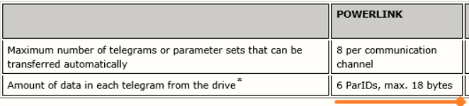
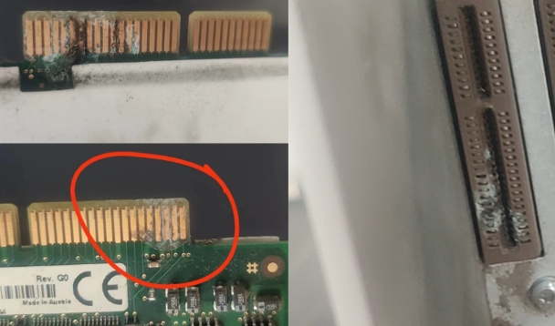

- 基于版本：
    - AS4.7
    - Mapp ACP 10 ARNC 0 (Motion) ：5.16

# 29200：轴对象无效

- **说明**
    - 如果一个无效的轴参考被连接到功能块的 "轴"、"主 "或 "从 "输入，则报告该错误。参见轴参考。Guid: aaf22c34-92e5-4ab0-9380-f7289ad83987
- **反应**
    - 该功能块的进一步执行被中止。
    - 除了 "Error "和 "ErrorID "之外，该功能块的输出被重置。
    - 该功能块一直处于错误状态，直到再次调用该功能块时错误不再存在（通过设置 "Execute"/"Enable "输入）。
- **原因/解决方案**
    - 驱动器必须被打开，并且轴参考必须有一个非 "0 "的值。 有关如何确定的信息，请参见 轴参考 。
- **可以返回此错误的功能块**
    - ACP10_MC功能块至少有以下一个输入可以报告这个错误。
        - "Axis"
        - "Master"
        - "Slave"
    - 接收一个结构或包含 "轴"、"主 "或 "从 "元素的结构地址的功能块。

# 29203：驱动器没有准备好

- **说明**
    - 如果驱动器还没有准备好，控制器不能被打开，就会发生这个错误。
- **反应**
    - 该功能块的进一步执行被中止。
    - 除了 "Error "和 "ErrorID "之外，该功能块的输出被重置。
    - 该功能块一直处于错误状态，直到再次调用该功能块时错误不再存在（通过设置 "Execute"/"Enable "输入）。
- **原因/解决方案**
    - 控制器没有准备好。
    **- 可能的原因**
    - 直流母线电压太低
    - 24V 电源没有打开
    - 网络连接不正常
    - 硬件限位开关关闭
    - 驱动器的 "启用 "输入端没有电源
    - ...
- **可以返回此错误的功能块**
    - MC_Power

## 应用案例

### 2023.06.28

- **现象** 4005: Controller cannot be switched on: Drive in error state 5005: Start of movement not possible: Position controller inactive 6048: Motor holding brake movement monitor: Position error too large 9070: Motor temperature model: Stop limit exceeded 41031: Junction temperature model: Warning limit exceeded 41070: Motor temperature model: Warning limit exceeded 29203: Drive is not ready. 29209: The drive is in error state. 29217: Invalid input parameter
- **原因** 零位参数不对引起过载，客户更换了模具，但是没有重新走回零的流程，导致参数错误，机械卡主了，当前顶住位置距离零位还有1mm 以上因此当伺服使能，由于不在零位位置，所以向零位运动，由于已机械顶住，所以动态偏差 LagError 一直有1mm 以上，就一直以最大扭矩输出，造成电机温度超过70度以上，驱动器的散热片温度高达70度，IGBT 温度高达133度。持续较长时间后就报警而 POWER OFF，进行复位后，又进入以上死循环。
- **优化方式** 使能后，走到零位，如果持续1秒超过+5Nm 或小于-5Nm，则把 HomePosition 进行偏移，再进行 MC_HOME 操作

### 2023.07.07

- **现象** 生产过程中报错6045/29207/29203
- **原因** 查看驱动器 UVW 接线，打开电柜发现驱动器 UVW 接线处有一相线烧了

### 2023.10.18

- **现象**
    - 持续生产多年的 ACOPOS 驱动器（接了外接制动电阻），突然上电无法正常工作。
    - ACOPOS 报警为可以复位，但过一会又报出故障，报警情况如下
    - 一般是先显示29209报警
    - 复位了后，可能会显示39047或29203
    - 再次复位后报警号变为6019
    - 再次复位后，报警清除，过一会报警再次变为29209
        - 
- **结论**
    - 据现场观察，制动电阻有冒烟
    - 更换制动电阻为新的后解决此问题。

# 29204: 参数编号无效

- **说明**
    - 如果试图读取或写入一个无效的 PLCopen 参数编号，就会发生这个错误。
- **反应**
    - 该功能块的进一步执行被中止。
    - 除了 "Error "和 "ErrorID "之外，该功能块的输出被重置。
    - 该功能块一直处于错误状态，直到再次调用该功能块时错误不再存在（通过设置 "执行"/"启用 "输入）。
- **原因/解决方案**

| 功能块                | 原因                                                          |
|-----------------------|---------------------------------------------------------------|
| MC_ReadBoolParameter  | 试图读取一个无效的PLCopen参数号                               |
| MC_WriteBoolParameter | 这个功能块总是报告这个错误，因为布尔型PLCopen参数不能被写入。 |
| MC_ReadParameter      | 试图读取一个无效的PLCopen参数编号                             |
| MC_WriteParameter     | 试图写入一个无效的PLCopen参数号。                             |

- **可以返回此错误的功能块**
    - MC_ReadBoolParameter
    - MC_WriteBoolParameter
    - MC_ReadParameter
    - MC_WriteParameter

# 29205:轴没有归位

- **说明**
    - 如果在轴被引用之前试图开始运动，就会发生这个错误。
- **反应**
    - 该功能块的进一步执行被中止。
    - 运动不被启动。
    - 除了 "Error "和 "ErrorID "之外，该功能块的输出被重置。
    - 该功能块一直处于错误状态，直到再次调用该功能块时（通过设置 "执行"/"启用 "输入）错误不再存在。
- **原因/解决方案**
    - 见描述。
    - 可以通过 "Mode "禁用 MC_TorqueControl 功能块的检查功能。
- **可以返回此错误的功能块**
    - MC_BR_MoveVelocityTriggStop
    - MC_BR_MoveAdditiveTriggStop
    - MC_BR_MoveAbsoluteTriggStop
    - MC_MoveVelocity
    - MC_MoveAdditive
    - MC_MoveAbsolute
    - MC_GearOut
    - MC_CamOut
    - MC_Halt
    - MC_BR_AutControl
    - MC_CamIn
    - MC_GearIn
    - MC_GearInPos
    - MC_BR_RegMarkCapture001
    - MC_BR_CamDwell
    - MC_BR_AutoCamDwell
    - MC_BR_EventMoveAbsolute
    - MC_BR_EventMoveAdditive
    - MC_BR_EventMoveVelocity
    - MC_BR_VelocityControl
    - MC_BR_CamTransition
    - MC_TorqueControl
    - MC_BR_TorqueControl
    - MC_BR_CrossCutterControl
    - MC_BR_JogVelocity
    - MC_BR_JogLimitPosition
    - MC_BR_JogTargetPosition

# 29206:控制器已关闭

- **说明**
    - 如果控制器被关闭，但功能块要求控制器被打开才能操作，就会发生这个错误。
- **反应**
    - 该功能块的进一步执行被中止。
    - 运动没有开始。
    - 除了 "Error "和 "ErrorID"，功能块的输出被重置。
    - 该功能块一直处于错误状态，直到再次调用该功能块时（通过设置 "Execute"/"Enable "输入）错误不再存在。
- **原因/解决方案**
    - 见描述
    - 可以返回此错误的功能块。
        - MC_BR_MoveVelocityTriggStop
        - MC_BR_MoveAdditiveTriggStop
        - MC_BR_MoveAbsoluteTriggStop
        - MC_MoveVelocity
        - MC_MoveAdditive
        - MC_MoveAbsolute
        - MC_GearOut
        - MC_CamOut
        - MC_Halt
        - MC_BR_AutControl
        - MC_CamIn
        - MC_GearIn
        - MC_GearInPos
        - MC_BR_RegMarkCapture001
        - MC_BR_CamDwell
        - MC_BR_AutoCamDwell
        - MC_BR_EventMoveAbsolute
        - MC_BR_EventMoveAdditive
        - MC_BR_EventMoveVelocity
        - MC_BR_CamTransition
        - MC_TorqueControl
        - MC_BR_TorqueControl
        - MC_BR_CrossCutterControl
        - MC_BR_JogVelocity
        - MC_BR_JogLimitPosition
        - MC_BR_JogTargetPosition

## 应用案例

### 2022.01.11

- 驱动器断使能，但是功能块请求驱动器使能: 非关键报警，一般由轴错误导致

### 2023.07.07

- **现象** PLC 出现29206报警且无法复位，检查程序，原来报警复位程序逻辑存在问题，轴报警后持续发送同步指令
- **解决方式** 检查逻辑时序并优化程序。

# 29207：这种运动类型目前不允许。

- 说明
    - 如果 PLCopen 轴的状态不允许启动所要求的运动，就会发生这个错误。可以通过 [MC_ReadStatus](../../../../libraries/acp10_mc/alphabetische_ubersicht/mc_readstatus/mc_readstatus.html) 功能块来读取 PLCopen轴的状态。
- 反应
    - 该功能块的进一步执行被中止。
    - 除了 "Error "和 "ErrorID "之外，该功能块的输出被重置。
- 该功能块一直处于错误状态，直到再次调用该功能块时错误不再存在（通过设置 "执行"/"启用 "输入）。

|  功能块                                                                                                                                            | 反应                         |
|----------------------------------------------------------------------------------------------------------------------------------------------------|------------------------------|
| [MC_BR_MoveVelocityTriggStop](../../../../libraries/acp10_mc/alphabetische_ubersicht/mc_br_movevelocitytriggstop/mc_br_movevelocitytriggstop.html) | The movement is not started. |
| [MC_BR_MoveAdditiveTriggStop](../../../../libraries/acp10_mc/alphabetische_ubersicht/mc_br_moveadditivetriggstop/mc_br_moveadditivetriggstop.html) |                              |
| [MC_BR_MoveAbsoluteTriggStop](../../../../libraries/acp10_mc/alphabetische_ubersicht/mc_br_moveabsolutetriggstop/mc_br_moveabsolutetriggstop.html) |                              |
| [MC_MoveVelocity](../../../../libraries/acp10_mc/alphabetische_ubersicht/mc_movevelocity/mc_movevelocity.html)                                     |                              |
| [MC_MoveAdditive](../../../../libraries/acp10_mc/alphabetische_ubersicht/mc_moveadditive/mc_moveadditive.html)                                     |                              |
| [MC_MoveAbsolute](../../../../libraries/acp10_mc/alphabetische_ubersicht/mc_moveabsolute/mc_moveabsolute.html)                                     |                              |
| [MC_GearOut](../../../../libraries/acp10_mc/alphabetische_ubersicht/mc_gearout/mc_gearout.html)                                                    |                              |
| [MC_CamOut](../../../../libraries/acp10_mc/alphabetische_ubersicht/mc_camout/mc_camout.html)                                                       |                              |
| [MC_Halt](../../../../libraries/acp10_mc/alphabetische_ubersicht/mc_halt/mc_halt.html)                                                             |                              |
| [MC_BR_AutControl](../../../../libraries/acp10_mc/alphabetische_ubersicht/mc_br_autcontrol/mc_br_autcontrol.html)                                  |                              |
| [MC_CamIn](../../../../libraries/acp10_mc/alphabetische_ubersicht/mc_camin/mc_camin.html)                                                          |                              |
| [MC_GearIn](../../../../libraries/acp10_mc/alphabetische_ubersicht/mc_gearin/mc_gearin.html)                                                       |                              |
| [MC_GearInPos](../../../../libraries/acp10_mc/alphabetische_ubersicht/mc_gearinpos/mc_gearinpos.html)                                              |                              |
| [MC_Phasing](../../../../libraries/acp10_mc/alphabetische_ubersicht/mc_phasing/mc_phasing.html)                                                    |                              |
| [MC_BR_MoveCyclicPosition](../../../../libraries/acp10_mc/alphabetische_ubersicht/mc_br_movecyclicposition/mc_br_movecyclicposition.html)          |                              |
| [MC_BR_MoveCyclicPositionExt](../../../../libraries/acp10_mc/alphabetische_ubersicht/mc_br_movecyclicpositionext/mc_br_movecyclicpositionext.html) |                              |
| [MC_BR_MoveCyclicVelocity](../../../../libraries/acp10_mc/alphabetische_ubersicht/mc_br_movecyclicvelocity/mc_br_movecyclicvelocity.html)          |                              |
| [MC_BR_MoveCyclicVelocityExt](../../../../libraries/acp10_mc/alphabetische_ubersicht/mc_br_movecyclicvelocityext/mc_br_movecyclicvelocityext.html) |                              |
| [MC_BR_CamDwell](../../../../libraries/acp10_mc/alphabetische_ubersicht/mc_br_camdwell/mc_br_camdwell.html)                                        |                              |
| [MC_BR_AutoCamDwell](../../../../libraries/acp10_mc/alphabetische_ubersicht/mc_br_autocamdwell/mc_br_autocamdwell.html)                            |                              |
| [MC_BR_CamTransition](../../../../libraries/acp10_mc/alphabetische_ubersicht/mc_br_camtransition/mc_br_camtransition.html)                         |                              |
| [MC_BR_EventMoveAbsolute](../../../../libraries/acp10_mc/alphabetische_ubersicht/mc_br_eventmoveabsolute/mc_br_eventmoveabsolute.html)             |                              |
| [MC_BR_EventMoveAdditive](../../../../libraries/acp10_mc/alphabetische_ubersicht/mc_br_eventmoveadditive/mc_br_eventmoveadditive.html)             |                              |
| [MC_BR_EventMoveVelocity](../../../../libraries/acp10_mc/alphabetische_ubersicht/mc_br_eventmovevelocity/mc_br_eventmovevelocity.html)             |                              |
| [MC_BR_JogVelocity](../../../../libraries/acp10_mc/alphabetische_ubersicht/mc_br_jogvelocity/mc_br_jogvelocity.html)                               |                              |
| [MC_BR_JogLimitPosition](../../../../libraries/acp10_mc/alphabetische_ubersicht/mc_br_joglimitposition/mc_br_joglimitposition.html)                |                              |
| [MC_BR_JogTargetPosition](../../../../libraries/acp10_mc/alphabetische_ubersicht/mc_br_jogtargetposition/mc_br_jogtargetposition.html)             |                              |
| [MC_Home](../../../../libraries/acp10_mc/alphabetische_ubersicht/mc_home/mc_home.html)                                                             | 归位未启动。                 |
| [MC_Stop](../../../../libraries/acp10_mc/alphabetische_ubersicht/mc_stop/mc_stop.html)                                                             | 停止运动未启动。             |

- **原因/解决方案**

| 功能块                                                                                                                                             | 原因                                                                                                                                                                                                                                                                                                                                                                                                                                                                                                                                                       |
|----------------------------------------------------------------------------------------------------------------------------------------------------|------------------------------------------------------------------------------------------------------------------------------------------------------------------------------------------------------------------------------------------------------------------------------------------------------------------------------------------------------------------------------------------------------------------------------------------------------------------------------------------------------------------------------------------------------------|
| [MC_BR_MoveCyclicPosition](../../../../libraries/acp10_mc/alphabetische_ubersicht/mc_br_movecyclicposition/mc_br_movecyclicposition.html)          | PLCopen状态，除此之外。 [静止状态](../../../../libraries/acp10_mc/konzept/zustandsdiagramm.html) [离散运动](../../../../libraries/acp10_mc/konzept/zustandsdiagramm.html) [连续运动](../../../../libraries/acp10_mc/konzept/zustandsdiagramm.html)                                                                                                                                                                                                                                                                                                         |
| [MC_BR_MoveCyclicPositionExt](../../../../libraries/acp10_mc/alphabetische_ubersicht/mc_br_movecyclicpositionext/mc_br_movecyclicpositionext.html) |                                                                                                                                                                                                                                                                                                                                                                                                                                                                                                                                                            |
| [MC_BR_MoveCyclicVelocity](../../../../libraries/acp10_mc/alphabetische_ubersicht/mc_br_movecyclicvelocity/mc_br_movecyclicvelocity.html)          |                                                                                                                                                                                                                                                                                                                                                                                                                                                                                                                                                            |
| [MC_BR_MoveCyclicVelocityExt](../../../../libraries/acp10_mc/alphabetische_ubersicht/mc_br_movecyclicvelocityext/mc_br_movecyclicvelocityext.html) |                                                                                                                                                                                                                                                                                                                                                                                                                                                                                                                                                            |
| [MC_BR_MoveVelocityTriggStop](../../../../libraries/acp10_mc/alphabetische_ubersicht/mc_br_movevelocitytriggstop/mc_br_movevelocitytriggstop.html) | PLC打开状态，除此之外。 [静止状态](../../../../libraries/acp10_mc/konzept/zustandsdiagramm.html) [离散运动](../../../../libraries/acp10_mc/konzept/zustandsdiagramm.html) [连续运动](../../../../libraries/acp10_mc/konzept/zustandsdiagramm.html) [同步运动](../../../../libraries/acp10_mc/konzept/zustandsdiagramm.html) (V2.151及以上版本)                                                                                                                                                                                                             |
| [MC_BR_MoveAdditiveTriggStop](../../../../libraries/acp10_mc/alphabetische_ubersicht/mc_br_moveadditivetriggstop/mc_br_moveadditivetriggstop.html) |                                                                                                                                                                                                                                                                                                                                                                                                                                                                                                                                                            |
| [MC_BR_MoveAbsoluteTriggStop](../../../../libraries/acp10_mc/alphabetische_ubersicht/mc_br_moveabsolutetriggstop/mc_br_moveabsolutetriggstop.html) |                                                                                                                                                                                                                                                                                                                                                                                                                                                                                                                                                            |
| [MC_MoveVelocity](../../../../libraries/acp10_mc/alphabetische_ubersicht/mc_movevelocity/mc_movevelocity.html)                                     |                                                                                                                                                                                                                                                                                                                                                                                                                                                                                                                                                            |
| [MC_MoveAdditive](../../../../libraries/acp10_mc/alphabetische_ubersicht/mc_moveadditive/mc_moveadditive.html)                                     |                                                                                                                                                                                                                                                                                                                                                                                                                                                                                                                                                            |
| [MC_MoveAbsolute](../../../../libraries/acp10_mc/alphabetische_ubersicht/mc_moveabsolute/mc_moveabsolute.html)                                     |                                                                                                                                                                                                                                                                                                                                                                                                                                                                                                                                                            |
| [MC_BR_EventMoveAbsolute](../../../../libraries/acp10_mc/alphabetische_ubersicht/mc_br_eventmoveabsolute/mc_br_eventmoveabsolute.html)             |                                                                                                                                                                                                                                                                                                                                                                                                                                                                                                                                                            |
| [MC_BR_EventMoveAdditive](../../../../libraries/acp10_mc/alphabetische_ubersicht/mc_br_eventmoveadditive/mc_br_eventmoveadditive.html)             |                                                                                                                                                                                                                                                                                                                                                                                                                                                                                                                                                            |
| [MC_BR_EventMoveVelocity](../../../../libraries/acp10_mc/alphabetische_ubersicht/mc_br_eventmovevelocity/mc_br_eventmovevelocity.html)             |                                                                                                                                                                                                                                                                                                                                                                                                                                                                                                                                                            |
| [MC_BR_JogVelocity](../../../../libraries/acp10_mc/alphabetische_ubersicht/mc_br_jogvelocity/mc_br_jogvelocity.html)                               |                                                                                                                                                                                                                                                                                                                                                                                                                                                                                                                                                            |
| [MC_BR_JogLimitPosition](../../../../libraries/acp10_mc/alphabetische_ubersicht/mc_br_joglimitposition/mc_br_joglimitposition.html)                |                                                                                                                                                                                                                                                                                                                                                                                                                                                                                                                                                            |
| [MC_BR_JogTargetPosition](../../../../libraries/acp10_mc/alphabetische_ubersicht/mc_br_jogtargetposition/mc_br_jogtargetposition.html)             |                                                                                                                                                                                                                                                                                                                                                                                                                                                                                                                                                            |
| [MC_BR_CamDwell](../../../../libraries/acp10_mc/alphabetische_ubersicht/mc_br_camdwell/mc_br_camdwell.html)                                        | PLCopen状态，除此之外。 [静止状态](../../../../libraries/acp10_mc/konzept/zustandsdiagramm.html)                                                                                                                                                                                                                                                                                                                                                                                                                                                           |
| [MC_BR_AutoCamDwell](../../../../libraries/acp10_mc/alphabetische_ubersicht/mc_br_autocamdwell/mc_br_autocamdwell.html)                            |                                                                                                                                                                                                                                                                                                                                                                                                                                                                                                                                                            |
| [MC_BR_CamTransition](../../../../libraries/acp10_mc/alphabetische_ubersicht/mc_br_camtransition/mc_br_camtransition.html)                         |                                                                                                                                                                                                                                                                                                                                                                                                                                                                                                                                                            |
| [MC_GearInPos](../../../../libraries/acp10_mc/alphabetische_ubersicht/mc_gearinpos/mc_gearinpos.html)                                              |                                                                                                                                                                                                                                                                                                                                                                                                                                                                                                                                                            |
| [MC_GearOut](../../../../libraries/acp10_mc/alphabetische_ubersicht/mc_gearout/mc_gearout.html)                                                    | PLCopen状态，除此之外。 [同步运动](../../../../libraries/acp10_mc/konzept/zustandsdiagramm.html) (由 [MC_GearIn](../../../../libraries/acp10_mc/alphabetische_ubersicht/mc_gearin/mc_gearin.html) 引起 )                                                                                                                                                                                                                                                                                                                                                   |
| [MC_CamOut](../../../../libraries/acp10_mc/alphabetische_ubersicht/mc_camout/mc_camout.html)                                                       |                                                                                                                                                                                                                                                                                                                                                                                                                                                                                                                                                            |
| [MC_Halt](../../../../libraries/acp10_mc/alphabetische_ubersicht/mc_halt/mc_halt.html)                                                             | PLCopen状态，除此之外。 [离散运动](../../../../libraries/acp10_mc/konzept/zustandsdiagramm.html) [连续运动](../../../../libraries/acp10_mc/konzept/zustandsdiagramm.html) [同步运动](../../../../libraries/acp10_mc/konzept/zustandsdiagramm.html) (由 [MC_GearIn](../../../../libraries/acp10_mc/alphabetische_ubersicht/mc_gearin/mc_gearin.html), [MC_GearInPos](../../../../libraries/acp10_mc/alphabetische_ubersicht/mc_gearinpos/mc_gearinpos.html), [MC_CamIn](../../../../libraries/acp10_mc/alphabetische_ubersicht/mc_camin/mc_camin.html)引起) |
| [MC_BR_AutControl](../../../../libraries/acp10_mc/alphabetische_ubersicht/mc_br_autcontrol/mc_br_autcontrol.html)                                  | PLC打开状态，除此之外。 [静止状态](../../../../libraries/acp10_mc/konzept/zustandsdiagramm.html) [离散运动](../../../../libraries/acp10_mc/konzept/zustandsdiagramm.html) [连续运动](../../../../libraries/acp10_mc/konzept/zustandsdiagramm.html) [同步运动](../../../../libraries/acp10_mc/konzept/zustandsdiagramm.html) （由 [MC_BR_AutControl](../../../../libraries/acp10_mc/alphabetische_ubersicht/mc_br_autcontrol/mc_br_autcontrol.html) 引起 ）。   如果 一个虚拟轴的"重启 "被设置为 "true"，那么                                               |
| [MC_CamIn](../../../../libraries/acp10_mc/alphabetische_ubersicht/mc_camin/mc_camin.html)                                                          | PLCopen状态，而不是。 [静止](../../../../libraries/acp10_mc/konzept/zustandsdiagramm.html) [离散运动](../../../../libraries/acp10_mc/konzept/zustandsdiagramm.html) [连续运动](../../../../libraries/acp10_mc/konzept/zustandsdiagramm.html) [同步运动](../../../../libraries/acp10_mc/konzept/zustandsdiagramm.html) (由 [MC_CamIn](../../../../libraries/acp10_mc/alphabetische_ubersicht/mc_camin/mc_camin.html) 引起 )                                                                                                                                 |
| [MC_GearIn](../../../../libraries/acp10_mc/alphabetische_ubersicht/mc_gearin/mc_gearin.html)                                                       | PLC打开状态，除此之外。 [静止状态](../../../../libraries/acp10_mc/konzept/zustandsdiagramm.html) [同步运动](../../../../libraries/acp10_mc/konzept/zustandsdiagramm.html) (由 [MC_GearIn](../../../../libraries/acp10_mc/alphabetische_ubersicht/mc_gearin/mc_gearin.html)引起)                                                                                                                                                                                                                                                                            |
| [MC_Home](../../../../libraries/acp10_mc/alphabetische_ubersicht/mc_home/mc_home.html)                                                             | PLC开放状态，除此之外。 [禁用](../../../../libraries/acp10_mc/konzept/zustandsdiagramm.html) [静止状态](../../../../libraries/acp10_mc/konzept/zustandsdiagramm.html)                                                                                                                                                                                                                                                                                                                                                                                      |
| [MC_Phasing](../../../../libraries/acp10_mc/alphabetische_ubersicht/mc_phasing/mc_phasing.html)                                                    | PLC打开状态，而不是。 [同步运动](../../../../libraries/acp10_mc/konzept/zustandsdiagramm.html) (由 [MC_GearIn](../../../../libraries/acp10_mc/alphabetische_ubersicht/mc_gearin/mc_gearin.html), [MC_GearInPos](../../../../libraries/acp10_mc/alphabetische_ubersicht/mc_gearinpos/mc_gearinpos.html) 或 [MC_CamIn](../../../../libraries/acp10_mc/alphabetische_ubersicht/mc_camin/mc_camin.html)引起 )   如果没有SPT功能块可以让 [MC_Phasing](../../../../libraries/acp10_mc/alphabetische_ubersicht/mc_phasing/mc_phasing.html) 发挥作用               |
| [MC_Stop](../../../../libraries/acp10_mc/alphabetische_ubersicht/mc_stop/mc_stop.html)                                                             | 如果 [MC_Stop](../../../../libraries/acp10_mc/alphabetische_ubersicht/mc_stop/mc_stop.html) 试图中止另一个 [MC_Stop](../../../../libraries/acp10_mc/alphabetische_ubersicht/mc_stop/mc_stop.html)。 如果轴的状态处于 [Disabled](../../../../libraries/acp10_mc/konzept/zustandsdiagramm.html) 状态。                                                                                                                                                                                                                                                       |

- 可以返回这个错误的功能块
    - [MC_BR_MoveVelocityTriggStop](../../../../libraries/acp10_mc/alphabetische_ubersicht/mc_br_movevelocitytriggstop/mc_br_movevelocitytriggstop.html)
    - [MC_BR_MoveAdditiveTriggStop](../../../../libraries/acp10_mc/alphabetische_ubersicht/mc_br_moveadditivetriggstop/mc_br_moveadditivetriggstop.html)
    - [MC_BR_MoveAbsoluteTriggStop](../../../../libraries/acp10_mc/alphabetische_ubersicht/mc_br_moveabsolutetriggstop/mc_br_moveabsolutetriggstop.html)
    - [MC_MoveVelocity](../../../../libraries/acp10_mc/alphabetische_ubersicht/mc_movevelocity/mc_movevelocity.html)
    - [MC_MoveAdditive](../../../../libraries/acp10_mc/alphabetische_ubersicht/mc_moveadditive/mc_moveadditive.html)
    - [MC_MoveAbsolute](../../../../libraries/acp10_mc/alphabetische_ubersicht/mc_moveabsolute/mc_moveabsolute.html)
    - [MC_GearOut](../../../../libraries/acp10_mc/alphabetische_ubersicht/mc_gearout/mc_gearout.html)
    - [MC_CamOut](../../../../libraries/acp10_mc/alphabetische_ubersicht/mc_camout/mc_camout.html)
    - [MC_Halt](../../../../libraries/acp10_mc/alphabetische_ubersicht/mc_halt/mc_halt.html)
    - [MC_BR_AutControl](../../../../libraries/acp10_mc/alphabetische_ubersicht/mc_br_autcontrol/mc_br_autcontrol.html)
    - [MC_CamIn](../../../../libraries/acp10_mc/alphabetische_ubersicht/mc_camin/mc_camin.html)
    - [MC_GearIn](../../../../libraries/acp10_mc/alphabetische_ubersicht/mc_gearin/mc_gearin.html)
    - [MC_GearInPos](../../../../libraries/acp10_mc/alphabetische_ubersicht/mc_gearinpos/mc_gearinpos.html)
    - [MC_Home](../../../../libraries/acp10_mc/alphabetische_ubersicht/mc_home/mc_home.html)
    - [MC_Phasing](../../../../libraries/acp10_mc/alphabetische_ubersicht/mc_phasing/mc_phasing.html)
    - [MC_Stop](../../../../libraries/acp10_mc/alphabetische_ubersicht/mc_stop/mc_stop.html)
    - [MC_BR_MoveCyclicPosition](../../../../libraries/acp10_mc/alphabetische_ubersicht/mc_br_movecyclicposition/mc_br_movecyclicposition.html)
    - [MC_BR_MoveCyclicVelocity](../../../../libraries/acp10_mc/alphabetische_ubersicht/mc_br_movecyclicvelocity/mc_br_movecyclicvelocity.html)
    - [MC_BR_MoveCyclicPositionExt](../../../../libraries/acp10_mc/alphabetische_ubersicht/mc_br_movecyclicpositionext/mc_br_movecyclicpositionext.html)
    - [MC_BR_MoveCyclicVelocityExt](../../../../libraries/acp10_mc/alphabetische_ubersicht/mc_br_movecyclicvelocityext/mc_br_movecyclicvelocityext.html)
    - [MC_BR_CamDwell](../../../../libraries/acp10_mc/alphabetische_ubersicht/mc_br_camdwell/mc_br_camdwell.html)
    - [MC_BR_AutoCamDwell](../../../../libraries/acp10_mc/alphabetische_ubersicht/mc_br_autocamdwell/mc_br_autocamdwell.html)
    - [MC_BR_EventMoveAbsolute](../../../../libraries/acp10_mc/alphabetische_ubersicht/mc_br_eventmoveabsolute/mc_br_eventmoveabsolute.html)
    - [MC_BR_EventMoveAdditive](../../../../libraries/acp10_mc/alphabetische_ubersicht/mc_br_eventmoveadditive/mc_br_eventmoveadditive.html)
    - [MC_BR_EventMoveVelocity](../../../../libraries/acp10_mc/alphabetische_ubersicht/mc_br_eventmovevelocity/mc_br_eventmovevelocity.html)
    - [MC_BR_CamTransition](../../../../libraries/acp10_mc/alphabetische_ubersicht/mc_br_camtransition/mc_br_camtransition.html)
    - [MC_BR_JogVelocity](../../../../libraries/acp10_mc/alphabetische_ubersicht/mc_br_jogvelocity/mc_br_jogvelocity.html)
    - [MC_BR_JogLimitPosition](../../../../libraries/acp10_mc/alphabetische_ubersicht/mc_br_joglimitposition/mc_br_joglimitposition.html)
    - [MC_BR_JogTargetPosition](../../../../libraries/acp10_mc/alphabetische_ubersicht/mc_br_jogtargetposition/mc_br_jogtargetposition.html)

## 应用案例

### 2023.07.07

- **现象** 生产过程中报错6045/29207/29203
- **原因** 查看驱动器 UVW 接线，打开电柜发现驱动器 UVW 接线处有一相线烧了

### 2023.07.07

- **现象**
    - 停止时报 29207：This movement type is currently not allowed.
- **原因**
    - 因为关闭通过 AxisFun.Axis[Index].Command.Stop 置1，轴控程序中将 VelocityCtrl 已经 disable 了，然后又执行了 MC_Stop

### 2023.07.07

- 不增加延时的情况下刚上电启动虚轴会报错29207

# 29208:自上次调用FB后，轴对象被改变。

- **说明**
    - 如果一个功能块的 "轴"、"Master "或 "Slave "输入自从上次调用功能块后发生了变化，就会发生这个错误。
- **反应**
    - 终止该功能块的进一步执行。
    - 除了 "Error "和 "ErrorID "之外，该功能块的输出被重置。
    - 该功能块一直处于错误状态，直到再次调用该功能块时错误不再存在（通过设置 "Execute"/"Enable "输入）。
- **原因/解决方案**
    - 一个功能块实例只能与一个轴参考一起使用。例如，如果有两个驱动器，那么驱动器1应该使用MC_MoveVelocity_1功能块实例，驱动器2使用MC_MoveVelocity_2实例。
- **可以返回此错误的功能块**
    - ACP10_MC功能块至少有以下一个输入可以报告这个错误。
        - "轴"
        - "Master"
        - "Slave"。
    - 接收含有 "Axis"、"Master "或 "Slave "元素的结构或结构地址的功能块。

# 29209:该驱动器处于错误状态

- **说明**
    - 当控制器不能为驱动器上的一个事件返回相应的状态时，就会报告该错误。
- **反应**
    - 该功能块的进一步执行被中止。
    - 除了 "Error "和 "ErrorID "之外，该功能块的输出被重置。
    - 该功能块一直处于错误状态，直到再次调用该功能块时错误不再存在（通过设置 "执行"/"启用 "输入）。
- **原因/解决方案**
    - 由于驱动器错误，控制器不能被打开或关闭。
    - 由于驱动装置的错误，控制器被关闭。
    - 在使用ACP10PAR_PCTRL_ENABLE_PARID禁用位置控制器时，启用了[MC_Stop](../../../../libraries/acp10_mc/alphabetische_ubersicht/mc_stop/mc_stop.html) 功能块。结果，运动被中止，控制器被关闭。
- **可以返回此错误的功能块**
    - [MC_Power](../../../../libraries/acp10_mc/alphabetische_ubersicht/mc_power/mc_power.html)

## 应用案例

### 2023.02.14

- 该错误不能代表更实质的含义，请继续翻找其他的报警代码，或者轻点一次复位，会弹出更多的错误信息

### 2023.06.28

- **现象** 4005: Controller cannot be switched on: Drive in error state 5005: Start of movement not possible: Position controller inactive 6048: Motor holding brake movement monitor: Position error too large 9070: Motor temperature model: Stop limit exceeded 41031: Junction temperature model: Warning limit exceeded 41070: Motor temperature model: Warning limit exceeded 29203: Drive is not ready. 29209: The drive is in error state. 29217: Invalid input parameter
- **原因** 零位参数不对引起过载，客户更换了模具，但是没有重新走回零的流程，导致参数错误，机械卡主了，当前顶住位置距离零位还有1mm 以上因此当伺服使能，由于不在零位位置，所以向零位运动，由于已机械顶住，所以动态偏差 LagError 一直有 1 mm 以上，就一直以最大扭矩输出，造成电机温度超过 70 度以上，驱动器的散热片温度高达 70 度，IGBT 温度高达 133 度。持续较长时间后就报警而 POWER OFF，进行复位后，又进入以上死循环。
- **优化方式** 使能后，走到零位，如果持续1秒超过+5Nm 或小于-5Nm，则把 HomePosition 进行偏移，再进行 MC_HOME 操作。

### 2023.07.05

- **现象** 移机后频繁出现的39047与29209错误设备开一个小时左右报一次，复位能够正常生产，使用 ACOPOS 驱动器，外接 SICK 编码器，接口为 HIPERFACE
- **排查方式**
    - 1.不会是驱动器或者编码卡坏了，因为如果坏了，是无法复位成功继续工作生产的。
    - 2.大概率是干扰带来的问题，可能线缆的屏蔽没有接，通讯卡件有松动，或者接地排有问题有电压导致了问题。
- **建议检查方向**
    - 1.动力线的线缆屏蔽层确保已经接地
    - 2.确认伺服控制器的外壳是否正确接地
    - 3.编码器卡附近的接地是正确的，并确认螺丝已经插好。
    - 4.检查接地排在出现问题的时候，是否有电压。
    - 5. 出现问题的频率不固定，需要收集一下信息，是否附近其他机器在开的时候，出现问题的频率就增高，可通过这个定位问题点。
- **解决方式** 打了接地的地桩，但还是有报警 把线重新整理并拔插驱动器线缆，并清理了灰尘，问题不再出现

### 2023.10.18

- **现象**
    - 持续生产多年的 ACOPOS 驱动器（接了外接制动电阻），突然上电无法正常工作。
    - ACOPOS 报警为可以复位，但过一会又报出故障，报警情况如下
    - 一般是先显示29209报警
    - 复位了后，可能会显示39047或29203
    - 再次复位后报警号变为6019
    - 再次复位后，报警清除，过一会报警再次变为29209
        - 
- **结论**
    - 据现场观察，制动电阻有冒烟
    - 更换制动电阻为新的后解决此问题。

# 29210：参数初始化（Global-init）失败。

- **说明**
    - 如果在执行功能块时发生驱动错误，就会发生这个错误。
- **反应**
    - 终止该功能块的进一步执行。
    - 除了 "Error "和 "ErrorID "之外，该功能块的输出被重置。
    - 该功能块一直处于错误状态，直到再次调用该功能块时错误不再存在（通过设置 "Execute"/"Enable "输入）。
- **原因/解决方案**
    - 功能块初始化的轴结构中的无效值
    - 可以返回此错误的功能块。
    - [MC_BR_InitAxisPar](../../../../libraries/acp10_mc/alphabetische_ubersicht/mc_br_initaxispar/mc_br_initaxispar.html)

# 29211：不能切换保持制动。控制器已打开。

- **说明**
    - 当控制器打开时，如果试图切换电机保持制动，就会发生这个错误。
- **反应**
    - 该功能块的进一步执行被中止。
    - 电机保持制动没有被切换。
    - 除了 "Error "和 "ErrorID "之外，该功能块的输出被重置。
    - 该功能块一直处于错误状态，直到再次调用该功能块时错误不再存在（通过设置 "Execute"/"Enable "输入）
- **原因/解决方案**
    - 在使用 [MC_BR_BrakeOperation](../../../../libraries/acp10_mc/alphabetische_ubersicht/mc_br_brakeoperation/mc_br_brakeoperation.html) 功能块启动抱闸之前，轴必须处于 [Disable](../../../../libraries/acp10_mc/konzept/zustandsdiagramm.html) 的 PLCopen 轴状态。
- **可以返回此错误的功能块**
    - [MC_BR_BrakeOperation](../../../../libraries/acp10_mc/alphabetische_ubersicht/mc_br_brakeoperation/mc_br_brakeoperation.html)

# 29214：无法归位。

- **说明**
    - 如果一个驱动错误停止了归位程序，就会报告这个错误。
- **反应**
    - 该功能块的进一步执行被中止。
    - 轴不被引用。
    - 除了 "Error "和 "ErrorID "之外，该功能块的输出被重置。
    - 该功能块一直处于错误状态，直到再次调用该功能块时错误不再存在（通过设置 "执行"/"启用 "输入）。
- **原因/解决方案**
    - 检查归位参数。
- **可以返回这个错误的功能块**
    - [MC_Home](../../../../libraries/acp10_mc/alphabetische_ubersicht/mc_home/mc_home.html)

# 29215:不可能实现离散运动。

- **说明**
    - 如果一个离散的运动被一个轴的错误所阻止，这个错误就会发生。
- **反应**
    - 该功能块的进一步执行被中止。
    - 除了 "Error "和 "ErrorID "之外，该功能块的输出被重置。
    - 该功能块一直处于错误状态，直到再次调用该功能块时错误不再存在（通过设置 "执行"/"启用 "输入）。
- **原因/解决方案**
    - 见描述。
- **可以返回此错误的功能块**
    - [MC_BR_MoveAdditiveTriggStop](../../../../libraries/acp10_mc/alphabetische_ubersicht/mc_br_moveadditivetriggstop/mc_br_moveadditivetriggstop.html)
    - [MC_BR_MoveAbsoluteTriggStop](../../../../libraries/acp10_mc/alphabetische_ubersicht/mc_br_moveabsolutetriggstop/mc_br_moveabsolutetriggstop.html)
    - [MC_MoveAdditive](../../../../libraries/acp10_mc/alphabetische_ubersicht/mc_moveadditive/mc_moveadditive.html)
    - [MC_MoveAbsolute](../../../../libraries/acp10_mc/alphabetische_ubersicht/mc_moveabsolute/mc_moveabsolute.html)
    - [MC_Halt](../../../../libraries/acp10_mc/alphabetische_ubersicht/mc_halt/mc_halt.html)
    - [MC_BR_EventMoveAbsolute](../../../../libraries/acp10_mc/alphabetische_ubersicht/mc_br_eventmoveabsolute/mc_br_eventmoveabsolute.html)
    - [MC_BR_EventMoveAdditive](../../../../libraries/acp10_mc/alphabetische_ubersicht/mc_br_eventmoveadditive/mc_br_eventmoveadditive.html)
    - [MC_BR_JogLimitPosition](../../../../libraries/acp10_mc/alphabetische_ubersicht/mc_br_joglimitposition/mc_br_joglimitposition.html)
    - [MC_BR_JogTargetPosition](../../../../libraries/acp10_mc/alphabetische_ubersicht/mc_br_jogtargetposition/mc_br_jogtargetposition.html)

# 29216:不可能连续运动

- **说明**
    - 如果一个连续的运动被一个轴的错误所阻止，这个错误就会发生。
- **反应**
    - 该功能块的进一步执行被中止。
    - 除了 "Error "和 "ErrorID "之外，该功能块的输出被重置。
    - 该功能块一直处于错误状态，直到再次调用该功能块时错误不再存在（通过设置 "执行"/"启用 "输入）。
- **原因/解决方案**
    - 见描述。
- **可以返回此错误的功能块**
    - [MC_BR_MoveVelocityTriggStop](../../../../libraries/acp10_mc/alphabetische_ubersicht/mc_br_movevelocitytriggstop/mc_br_movevelocitytriggstop.html)
    - [MC_MoveVelocity](../../../../libraries/acp10_mc/alphabetische_ubersicht/mc_movevelocity/mc_movevelocity.html)
    - [MC_GearOut](../../../../libraries/acp10_mc/alphabetische_ubersicht/mc_gearout/mc_gearout.html)
    - [MC_CamOut](../../../../libraries/acp10_mc/alphabetische_ubersicht/mc_camout/mc_camout.html)
    - [MC_BR_MoveCyclicPosition](../../../../libraries/acp10_mc/alphabetische_ubersicht/mc_br_movecyclicposition/mc_br_movecyclicposition.html)
    - [MC_BR_MoveCyclicVelocity](../../../../libraries/acp10_mc/alphabetische_ubersicht/mc_br_movecyclicvelocity/mc_br_movecyclicvelocity.html)
    - [MC_BR_MoveCyclicPositionExt](../../../../libraries/acp10_mc/alphabetische_ubersicht/mc_br_movecyclicpositionext/mc_br_movecyclicpositionext.html)
    - [MC_BR_MoveCyclicVelocityExt](../../../../libraries/acp10_mc/alphabetische_ubersicht/mc_br_movecyclicvelocityext/mc_br_movecyclicvelocityext.html)
    - [MC_BR_EventMoveAbsolute](../../../../libraries/acp10_mc/alphabetische_ubersicht/mc_br_eventmoveabsolute/mc_br_eventmoveabsolute.html)
    - [MC_BR_EventMoveAdditive](../../../../libraries/acp10_mc/alphabetische_ubersicht/mc_br_eventmoveadditive/mc_br_eventmoveadditive.html)
    - [MC_BR_EventMoveVelocity](../../../../libraries/acp10_mc/alphabetische_ubersicht/mc_br_eventmovevelocity/mc_br_eventmovevelocity.html)
    - [MC_TorqueControl](../../../../libraries/acp10_mc/alphabetische_ubersicht/mc_torquecontrol/mc_torquecontrol.html)
    - [MC_BR_TorqueControl](../../../../libraries/acp10_mc/alphabetische_ubersicht/mc_br_torquecontrol/mc_br_torquecontrol.html)
    - [MC_BR_JogVelocity](../../../../libraries/acp10_mc/alphabetische_ubersicht/mc_br_jogvelocity/mc_br_jogvelocity.html)

## 应用案例

### 2022.01.11

- 当前轴状态不允许连续运动： 非关键报警，一般由轴错误导致

### 2023.07.07

- **现象** 使用 MpAxisBasic 中的 Move Velocity 指令，其中 Position 为0，速度与加速度为0.001，运动后报错29216,5003
- **原因** 速度、加速度太小，0.001相当于0 加大两个参数后解决

# 29217:无效的输入参数

**说明**

- 如果来自功能块的输入参数包含一个无效的值，则报告该错误。
- 对于 模式为 "[mcV_LIMIT_CALC](../../../../libraries/acp10_mc/konstanten.html)"的[MC_BR_TorqueControl](../../../../libraries/acp10_mc/alphabetische_ubersicht/mc_br_torquecontrol/mc_br_torquecontrol.html)，在计算后可能出现错误。

**反应**

- 该功能块的进一步执行被中止。
- 除 "Error "和 "ErrorID "外，该功能块的输出被重置。
- 该功能块一直处于错误状态，直到再次调用该功能块时（通过设置 "Execute"/"Enable "输入）错误不再出现。

**原因/解决方案**

- 至少有一个输入参数的值是无效的。
- 检查输入参数。
- 对于运动功能块的 "速度"、"加速度 "或 "减速度 "输入，只允许使用大于或等于 "0 "的值。
- 对于 模式为 "[mcV_LIMIT_CALC](../../../../libraries/acp10_mc/konstanten.html)"的[MC_BR_TorqueControl](../../../../libraries/acp10_mc/alphabetische_ubersicht/mc_br_torquecontrol/mc_br_torquecontrol.html)，极限速度（"NegMaxVelocity "和 "PosMaxVelocity"）可能过于接近。一个有效的结果是不可能的。增加数值之间的距离或停止使用该模式。
- 为 [MC_BR_ReadParList](../../../../libraries/acp10_mc/alphabetische_ubersicht/mc_br_readparlist/mc_br_initparlist.html)指定的ParID 不能被读取或不存在。
- **可以返回此错误的功能块**
  - MCBRAutControl
  - MCBRBrakeControl
  - MCBRBrakeOperation
  - MCCamIn
  - MCBRCommandError
  - MCBRCamIn
  - MCCamOut
  - MCDigitalCamSwitch
  - MCBRCrossCutterControl
  - MCBRDownloadParSequ
  - MCBRJogVelocity
  - MCBREventMoveAbsolute
  - MCBREventMoveAdditive
  - MCBREventMoveVelocity
  - MCGearIn
  - MCGearInPos
  - MCGearOut
  - MCBRGetCamMasterPosition
  - MCBRGetCamSlavePosition
  - MCHalt
  - MCHome
  - MCBRInitAutData
  - MCBRInitAutEvent
  - MCBRInitAutPar
  - MCBRInitAutState
  - MCBRInitCyclicWrite
  - MCBRInitEndlessPosAcpEnc
  - MCBRInitReceiveNetworkData
  - MCBRInitReceiveNetworkEnc
  - MCBRJogLimitPosition
  - MCBRJogTargetPosition
  - MCMoveAbsolute
  - MCMoveAdditive
  - MCMoveVelocity
  - MCBRMoveCyclicVelocity
  - MCBRMoveAbsoluteTriggStop
  - MCBRMoveAdditiveTriggStop
  - MCBRMoveVelocityTriggStop
  - MCBRNetTrace
  - MCBRNetworkInit
  - MCBRParTrace
  - MCPhasing
  - MCBRPhasing
  - MCBROffset
  - MCBROffsetVelocity
  - MCBROffsetZone
  - MCBRPowerMeter
  - MCReadAxisError
  - MCReadDigitalInput
  - MCReadDigitalOutput
  - MCBRReadNetTraceStatus
  - MCBRReadParTraceStatus
  - MCBRResetAutPar
  - MCSetOverride
  - MCBRSetupController
  - MCBRSetupFromParTabObj
  - MCBRSetupInductionMotor
  - MCBRSetupMotorPhasing
  - MCBRSetupSynchronMotor
  - MCBRSimulation
  - MCTorqueControl
  - MCBRTorqueControl
  - MCTouchProbe
  - MCBRTouchProbe
  - MCBRVelocityControl
  - MCWriteDigitalOutput
  - MCBRRegMarkCapture001
  - MCBRRegMarkCalc001
  - MCBRCamDwell
  - MCBRAutoCamDwell
  - MCBRCamTransition
  - MCBRAutCommand
  - MCBRSetupIsqRipple
  - MCBRParTraceConfig
  - MCBRCheckAutCompensation
  - MCBRReadAxisError
  - MCBRGetParIDInfo
  - MCBRDigitalCamSwitch
  - MCBRInitSendParID
  - MCBRInitReceiveParID
  - MCBRReceiveParIDOnPLC
  - MCBRSaveCamProfileObj
  - MCBRMoveCyclicPositionExt
  - MCBRMoveCyclicVelocityExt
  - MCLimitLoad
  - MCBRLimitLoad
  - MCBRLimitLoadCam
  - MCBRMechPosDeviationComp
  - MCBRReadParList

## 应用案例

### 2023.06.28

- **现象** 4005: Controller cannot be switched on: Drive in error state 5005: Start of movement not possible: Position controller inactive 6048: Motor holding brake movement monitor: Position error too large 9070: Motor temperature model: Stop limit exceeded 41031: Junction temperature model: Warning limit exceeded 41070: Motor temperature model: Warning limit exceeded 29203: Drive is not ready. 29209: The drive is in error state. 29217: Invalid input parameter
- **原因** 零位参数不对引起过载，客户更换了模具，但是没有重新走回零的流程，导致参数错误，机械卡主了，当前顶住位置距离零位还有1mm 以上因此当伺服使能，由于不在零位位置，所以向零位运动，由于已机械顶住，所以动态偏差 LagError 一直有1mm 以上，就一直以最大扭矩输出，造成电机温度超过70度以上，驱动器的散热片温度高达70度，IGBT 温度高达133度。持续较长时间后就报警而 POWER OFF，进行复位后，又进入以上死循环。
- **优化方式** 使能后，走到零位，如果持续1秒超过+5Nm 或小于-5Nm，则把 HomePosition 进行偏移，再进行 MC_HOME 操作。

### 2023.07.05

- **现象** 使用功能块 MC_GearInPos，当 Velocity=0，Acceleration=0，MasterParIDMaxVelocity=0，触发 Execute=1时报错29217
- **原因** 原因是 Velocity 和 Acceleration 必须大于0。

### 2023.07.07

- 使用MC_BR_TorqueControl库，模式选择mcV_LIMIT_CAL,就是会把速度限制在一定的范围内，不会超过最大正反最大速度，但是这两个速度也不是随便设置的，如果极限值靠得太近，则由于计算参数重叠而不能使用将报出错误29217:将报告无效的输入参数。

# 29218:PLCopen轴状态不明

- **说明**
    - 如果轴处于一个未知的PLCopen 轴状态，就会发生这个错误。
- **反应**
    - 该功能块的进一步执行被中止。
    - 除了 "Error "和 "ErrorID "之外，该功能块的输出被重置。
    - 该功能块一直处于错误状态，直到再次调用该功能块时错误不再存在（通过设置 "执行"/"启用 "输入）。
- **原因/解决方案**
    - 打开 NC 测试可以影响 PLCopen 轴的状态。根据激活的功能块，也可能导致 PLCopen 轴的未知状态。
- **可能返回此错误的功能块**
    - MC_ReadStatus

# 29219:PLCopen参数的无效值

- **说明**
    - 如果试图将一个无效的值写入 PLCopen 参数，就会发生这个错误。
- **反应**
    - 该功能块的进一步执行被中止。
    - 除了 "Error "和 "ErrorID "之外，该功能块的输出被重置。
    - 该功能块一直处于错误状态，直到再次调用该功能块时错误不再存在（通过设置 "执行"/"启用 "输入）。
- **原因/解决方案**
    - MaxJerk (16) = 0.0
    - 在传输了一个无效的值后，发生了驱动错误。
- **可以返回此错误的功能块**
    - MC_WriteParameter

# 29221:没有凸轮名称

- **说明**
    - 如果没有为 "CamTable "或 "DataObjectName"（取决于功能块）指定一个名称，就会发生这个错误。
- **反应**
    - 该功能块的进一步执行被中止。
    - 除了 "Error "和 "ErrorID"，功能块的输出被重置。
    - 该功能块一直处于错误状态，直到再次调用该功能块时错误不再存在（通过设置 "执行"/"启用 "输入）。
- **原因/解决方案**
    - 见描述。
- **可以返回此错误的功能块**
    - MCCamTableSelect
    - MCBRDownloadCamProfileObj
    - MCBRGetCamSlavePosition
    - MCBRGetCamMasterPosition
    - MCBRCalcSectionsFromCam
    - MCBR_CalcPointsFromCam

# 29222:凸轮下载时出错。

- **说明**
    - 如果在传输前、传输中或传输后有错误报告，就会发生这个错误。
- **反应**
    - 该功能块的进一步执行被中止。
    - 凸轮不能在驱动器上使用。
    - 除了 "Error "和 "ErrorID"，功能块的输出被重置。
    - 该功能块一直处于错误状态，直到再次调用该功能块时错误不再存在（通过设置 "执行"/"启用 "输入）。
- **原因/解决方案**

| 功能块                                                                                                                                                | 原因                                                                |
|-------------------------------------------------------------------------------------------------------------------------------------------------------|---------------------------------------------------------------------|
| MCCamTableSelect                                  | 太多的凸轮被传送到驱动器（最多14个）。 在传输凸轮的过程中或之后出错 |
| MCBRDownloadCamProfileObj    | 在传输凸轮的过程中或之后出错                                        |
| MCBRDownloadCamProfileData |                                                                     |
| MCBR_MechPosDeviationComp      |                                                                     |

- **可以返回此错误的功能块**
    - MCCamTableSelect
    - MCBRDownloadCamProfileObj
    - MCBRDownloadCamProfileData
    - MCBR_MechPosDeviationComp

# 29225:目标位置在轴周期之外。

- **说明**
    - 如果 "Position "的输入值小于 "0 "或 大于等于轴周期，就会发生这个错误 。轴周期可以在映射表内或使用 MCBRInitModPos 功能块进行初始化 。
    - 对于 MCMoveAbsolute 和 MCBRMoveAbsoluteTriggStop，如果 为 "方向 "选择了mcEXCEEDPERIOD，"位置 "的值可以选择大于或等于轴周期 。
- **反应**
    - 该功能块的进一步执行被中止。
    - 除了 "Error "和 "ErrorID "之外，该功能块的输出被重置。
    - 该功能块一直处于错误状态，直到再次调用该功能块时错误不再存在（通过设置 "Execute"/"Enable "输入）。

|  功能块                                                                                                                                                       | 反应           |
|---------------------------------------------------------------------------------------------------------------------------------------------------------------|----------------|
| [MC_MoveAbsolute](../../../../libraries/acp10_mc/alphabetische_ubersicht/mc_moveabsolute/mc_moveabsolute.html)                                                | 运动没有开始。 |
| [MC_BR_MoveAbsoluteTriggStop 触发停止。](../../../../libraries/acp10_mc/alphabetische_ubersicht/mc_br_moveabsolutetriggstop/mc_br_moveabsolutetriggstop.html) |                |
| [MC_BR_EventMoveAbsolute](../../../../libraries/acp10_mc/alphabetische_ubersicht/mc_br_eventmoveabsolute/mc_br_eventmoveabsolute.html)                        |                |
| [MC_Home](../../../../libraries/acp10_mc/alphabetische_ubersicht/mc_home/mc_home.html)                                                                        | 归位没有开始。 |

- **原因/解决方案**

| 功能块                                                                                                                                             | 原因是                                                                                                                        |
|----------------------------------------------------------------------------------------------------------------------------------------------------|-------------------------------------------------------------------------------------------------------------------------------|
| [MC_MoveAbsolute](../../../../libraries/acp10_mc/alphabetische_ubersicht/mc_moveabsolute/mc_moveabsolute.html)                                     | [mcEXCEED_PERIOD](../../../../libraries/acp10_mc/konstanten.html) 没有为 "方向 "设置，而 "位置 "的值仍然大于轴的周期或小于0。 |
| [MC_BR_MoveAbsoluteTriggStop](../../../../libraries/acp10_mc/alphabetische_ubersicht/mc_br_moveabsolutetriggstop/mc_br_moveabsolutetriggstop.html) |                                                                                                                               |
| [MC_BR_EventMoveAbsolute](../../../../libraries/acp10_mc/alphabetische_ubersicht/mc_br_eventmoveabsolute/mc_br_eventmoveabsolute.html)             |                                                                                                                               |
| [MC_Home](../../../../libraries/acp10_mc/alphabetische_ubersicht/mc_home/mc_home.html)| 如果 "位置 "的值大于轴的周期                                                                                                  |

- **可以返回这个错误的功能块**
    - MCMoveAbsolute
    - MCBRMoveAbsoluteTriggStop
    - MCHome
    - MCBRMoveCyclicPosition
    - MCBREventMoveAbsolute
    - MCBRJogTargetPosition

# 29226:驱动器错误。调用MC_(BR_)ReadAxisError了解详情

- **说明**
    - 如果一个轴的错误被激活或没有被确认，并且所列出的一个功能块被调用，就会发生这个错误。
- **反应**
    - 终止该功能块的进一步执行。
    - 除了 "错误 "和 "ErrorID "之外，该功能块的输出被重置。
    - 该功能块一直处于错误状态，直到再次调用该功能块时错误不再存在（通过设置 "执行"/"启用 "输入）。
- **原因/解决方案**
    - 纠正错误的原因，并在调用功能块前确认。根据错误情况，系统可能要重新启动。
- **可以返回此错误的功能块**
    - MCBRMoveVelocityTriggStop
    - MCBRMoveAdditiveTriggStop
    - MCBRMoveAbsoluteTriggStop
    - MCMoveVelocity
    - MCMoveAdditive
    - MCMoveAbsolute
    - MCGearOut
    - MCCamOut
    - MCHalt
    - MCBRAutControl
    - MCBRAutCommand
    - MCBRInitAutPar
    - MCBRInitAutState
    - MCCamIn
    - MCBRCamIn
    - MCGearIn
    - MCGearInPos
    - MCHome
    - MCPhasing
    - MCPower
    - MCBRReadParID
    - MCBRWriteParID
    - MCBRRegMarkCapture001
    - MCBRCamDwell
    - MCBRAutoCamDwell
    - MCBREventMoveAbsolute
    - MCBREventMoveAdditive
    - MCBREventMoveVelocity
    - MCBRVelocityControl
    - MCBRCamTransition
    - MCBRCheckAutCompensation
    - MCBRJogVelocity
    - MCBRJogLimitPosition
    - MCBRJogTargetPosition
    - MCBRMoveCyclicPositionExt
    - MCBRMoveCyclicVelocityExt
    - MCBRGearIn
    - MCBRNetworkInit
    - MCBRMechPosDeviationComp

## 应用案例

### 2022.01.11

- 发生或未清除轴错误： 非关键报警，一般由轴错误导致

### 2023.07.07

- 41041 / 7225 / 29226由于外部制动电阻的欧姆电阻或功率不足，导致机器无法在较高的速度运行。

# 29227:不能再从该驱动器的网络上发送主控位置

- **说明**
    - 如果一个驱动器不能通过网络传输任何更多的主控位置，就会发生这个错误。
- **反应**
    - 该功能块的进一步执行被中止。
    - 除了 "Error "和 "ErrorID "之外，该功能块的输出被重置。
    - 该功能块一直处于错误状态，直到再次调用该功能块时错误不再存在（通过设置 "Execute"/"Enable "输入）。
- **原因/解决方案**
    - POWRLINK。每个驱动器最多可以传输三个位置。
    - CAN：每个CAN 总线最多可以传输三个位置。
- **可以返回此错误的功能块**
    - MCBRAutControl
    - MCBRInitAutPar
    - MCBRInitMasterParIDTransfer
    - MCCamIn
    - MCDigitalCamSwitch
    - MCGearIn
    - MCGearInPos
    - MCBRInitAutData
    - MCBRReadCyclicPosition
    - MCBRCamDwell
    - MCBRAutoCamDwell
    - MCBRCamTransition
    - MCBRGearIn

# 29228:该驱动器不能再从网络中读取主控位置。

- **描述**
    - 如果一个驱动器不能从网络上读取任何更多的主控位置，就会发生这个错误。
- **反应**
    - 该功能块的进一步执行被中止。
    - 除了 "Error "和 "ErrorID "之外，该功能块的输出被重置。
    - 该功能块一直处于错误状态，直到再次调用该功能块时错误不再存在（通过设置 "Execute"/"Enable "输入）。
- **原因/解决方案**
    - CAN：每个驱动器最多可以通过网络接收3个位置。
    - POWERLINK。每个驱动器最多可以通过网络接收5个位置。
- **可以返回这个错误的功能块**
    - MC_BRAutControl
    - MCBRAutCommand
    - MCBRInitAutPar
    - MCBRInitMasterParIDTransfer
    - MCCamIn
    - MCDigitalCamSwitch
    - MCGearIn
    - MCGearInPos
    - MCBRMoveCyclicPosition
    - MCBRMoveCyclicVelocity
    - MCBRMoveCyclicPositionExt
    - MCBRMoveCyclicVelocityExt
    - MCBRCamDwell
    - MCBRAutoCamDwell
    - MCBRCamTransition
    - MCBRInitReceiveParID
    - MCBRInitReceiveNetworkData
    - MCBRGearIn
    - MCBR_InitReceiveNetworkEnc

# 29229：无法实现同步运动

- **说明**
    - 如果联动运动因轴错误而停止，就会发生这个错误。
- **反应**
    - 该功能块的进一步执行被中止。
    - 除了 "Error "和 "ErrorID "之外，该功能块的输出被重置。
    - 该功能块一直处于错误状态，直到再次调用该功能块时错误不再存在（通过设置 "执行"/"启用 "输入）。
- **原因/解决方案**
    - 见描述。
- **可以返回此错误的功能块**
    - MCCamIn
    - MCGearIn
    - MCGearInPos
    - MCBRCamDwell
    - MCBRAutoCamDwell
    - MCBRCamTransition
    - MCBRCrossCutterControl
    - MCBRGearIn
    - MCBR_CamIn

# 29230:内部错误。传输参数列表时出错

- **说明**
    - 如果一个由功能块内部生成的参数列表在传输过程中导致错误，则报告该错误。
- **反应**
    - 终止该功能块的进一步执行。
    - 除了 "Error "和 "ErrorID "之外，该功能块的输出被重置。
    - 该功能块一直处于错误状态，直到再次调用该功能块时错误不再存在（通过设置 "Execute"/"Enable "输入）。
- **原因/解决方案**
    - 见描述。
- **可以返回此错误的功能块**
    - MCBRAutControl
    - MCBRBrakeOperation
    - MCBRInitAutPar
    - MCBRInitMasterParIDTransfer
    - MCBRInitModPos
    - MCCamIn
    - MCDigitalCamSwitch
    - MCGearIn
    - MCGearInPos
    - MCReadActualTorque
    - MCTouchProbe
    - MCBRTouchProbe
    - MCBRPhasing
    - MCBROffset
    - MCBRMoveCyclicPosition
    - MCBRReadCyclicPosition
    - MCBRMoveCyclicVelocity
    - MCBRCamDwell
    - MCBRAutoCamDwell
    - MCBRCamTransition
    - MCTorqueControl
    - MCBRTorqueControl
    - MCBRBrakeControl
    - MCBRCrossCutterControl
    - MCBRMoveCyclicPositionExt
    - MCBRMoveCyclicVelocityExt
    - MCLimitLoad
    - MCBRLimitLoad
    - MCBRLimitLoadCam
    - MCBRMechPosDeviationComp
    - MCBRConfigPowerStageCheck
    - MCBRWriteLoadSimPosition

## 应用案例

### 2023.07.07

- **现象** MC_BR_MoveCyclicVelocity 报错 29230 MC_BR_MoveCyclicVelocity 是基于 PLK 网络的广播通道实现的，使用外部的 PLK 从站数量较多（例如超过21个 PLK 从站，且均通过 Chained Station 设置为 True），则报此错误，若使用 PLK 从站数少（例如少于21个从站），则能够正常使用。
- **解决方式** 不使用此功能块，换用其他方式实现。

# 29231:主速度是无效的，为0或负值。

- **说明**
    - 如果在启动齿轮耦合之前，主轴的速度是负的或太高，就会发生这个错误。
- **反应**
    - 该功能块的进一步执行被中止。
    - 运动没有开始。
    - 除了 "Error "和 "ErrorID "之外，该功能块的输出被重置。
    - 该功能块一直处于错误状态，直到再次调用该功能块时错误不再存在（通过设置 "执行"/"启用 "输入）。
- **原因/解决方案**
    - 如果外部编码器的位置受到干扰而失真，也会报告这个错误。
    - 如果主轴的控制器被禁用，并且电机没有保持制动，在 "速度=0 "范围内的波动会导致这个错误。
- **可以返回该错误的功能块**
    - MCGearIn
    - MCGearInPos

# 29232:内部错误。无效的SPT资源类型

- **说明**
    - 如果使用了无效的 SPT 资源类型，则报告此错误。
- **反应**
    - 该功能块的进一步执行被中止。
    - 除了 "Error "和 "ErrorID "之外，该功能块的输出被重置。
    - 该功能块一直处于错误状态，直到再次调用该功能块时错误不再存在（通过设置 "执行"/"启用 "输入）。
- **原因/解决方案**
    - 见描述。
- **可以返回此错误的功能块**
    - MCCamIn
    - MCDigitalCamSwitch
    - MCGearIn
    - MCGearInPos
    - MCPhasing
    - MCTouchProbe
    - MCBRCamDwell
    - MCBRAutoCamDwell
    - MCBRCamTransition

# 29233: 所需类型的SPT资源不可用

- **说明**
    - 所有必要的 SPT 资源的可能实例都已经被使用了。
- **反应**
    - 终止该功能块的进一步执行。
    - 除了 "Error "和 "ErrorID "之外，该功能块的输出被重置。
    - 该功能块一直处于错误状态，直到再次调用该功能块时错误不再存在（通过设置 "执行"/"启用 "输入）。
- **原因/解决方案**
    - 以下列表中的功能块的8个以上的实例不能同时激活。
- **可以返回此错误的功能块**
    - MCBRAutCommand
    - MCCamIn
    - MCDigitalCamSwitch
    - MCGearIn
    - MCGearInPos
    - MCTouchProbe
    - MCBRTouchProbe
    - MCBRPhasing
    - MCBROffset
    - MCBROffsetVelocity
    - MCBROffsetZone
    - MCBRRegMarkCapture001
    - MCBRCamDwell
    - MCBRAutoCamDwell
    - MCBREventMoveAbsolute
    - MCBREventMoveAdditive
    - MCBREventMoveVelocity
    - MCBRCamTransition
    - MCBRDigitalCamSwitch
    - MCBR_MechPosDeviationComp

# 29234:内部错误。请求的SPT资源数量不可用

- **描述**
- **反应**
    - 终止该功能块的进一步执行。
    - 除了 "Error "和 "ErrorID "之外，该功能块的输出被重置。
    - 该功能块一直处于错误状态，直到再次调用该功能块时错误不再存在（通过设置 "Execute"/"Enable "输入）。
- **原因/解决方案**
- **可以返回此错误的功能块**

# 29235:该功能对当前轴类型不可用。

- **说明**
    - 如果为一个虚拟轴、SDC 轴或 ACOPOSmulti 电源模块调用一个功能块，则报告该错误。
    - 该功能块不能与该轴类型或模块一起使用。
    - 对于 MCBRPowerMeter，如果为 ACOPOS 或 SDC 轴调用功能块，则报告此错误。
    - 对于 MCBRReadLoadSimInputData / MCBRWriteLoadSimTorque / MCBRReadLoadSimTorque / MCBRWriteLoadSimPosition，如果没有使用 ACP10SIM 轴，则报告此错误。
    - 对于 MCTorqueControl / MCBRTorqueControl / MCBR_VelocityControl，如果没有对 ACP10SIM 轴使用仿真模式 "完全"，则报告此错误。
- **反应**
    - 该功能块的进一步执行被中止。
    - 除了 "Error "和 "ErrorID "之外，功能块的输出被重置。
    - 该功能块一直处于错误状态，直到再次调用该功能块时错误不再存在（通过设置 "执行"/"启用 "输入）。

| 功能块                                                                                                                                                                                                                                                                                                                                       | 无效的轴类型                                             | 反应                                             |
|----------------------------------------------------------------------------------------------------------------------------------------------------------------------------------------------------------------------------------------------------------------------------------------------------------------------------------------------|----------------------------------------------------------|--------------------------------------------------|
| [MC_BR_MoveVelocityTriggStop（移动速度触发停止）。](../../../../libraries/acp10_mc/alphabetische_ubersicht/mc_br_movevelocitytriggstop/mc_br_movevelocitytriggstop.html)                                                                                                                                                                     | 虚拟轴                                                   | 运动没有开始。                                   |
| [MC_BR_MoveAdditiveTriggStop（加法触发）。](../../../../libraries/acp10_mc/alphabetische_ubersicht/mc_br_moveadditivetriggstop/mc_br_moveadditivetriggstop.html)                                                                                                                                                                             |                                                          |                                                  |
| [MC_BR_MoveAbsoluteTriggStop（移动绝对触发）。](../../../../libraries/acp10_mc/alphabetische_ubersicht/mc_br_moveabsolutetriggstop/mc_br_moveabsolutetriggstop.html)                                                                                                                                                                         |                                                          |                                                  |
| [MC_TorqueControl](../../../../libraries/acp10_mc/alphabetische_ubersicht/mc_torquecontrol/mc_torquecontrol.html)                                                                                                                                                                                                                            | ACP10SIM轴的模拟模式为 "标准"。 虚拟轴                   |                                                  |
| [MC_BR_TorqueControl（扭矩控制](../../../../libraries/acp10_mc/alphabetische_ubersicht/mc_br_torquecontrol/mc_br_torquecontrol.html)                                                                                                                                                                                                         |                                                          |                                                  |
| [MC_BR_VelocityControl（速度控制](../../../../libraries/acp10_mc/alphabetische_ubersicht/mc_br_velocitycontrol/mc_br_velocitycontrol.html)                                                                                                                                                                                                   | ACP10SIM轴的模拟模式为 "标准" 虚拟轴 ACOPOSmulti电源模块 |                                                  |
| [MC_ReadActualTorque](../../../../libraries/acp10_mc/alphabetische_ubersicht/mc_readactualtorque/mc_readactualtorque.html)                                                                                                                                                                                                                   | 虚拟轴                                                   | 该值不被驱动装置读取。                           |
| [MC_BR_Simulation](../../../../libraries/acp10_mc/alphabetische_ubersicht/mc_br_simulation/mc_br_simulation.html)                                                                                                                                                                                                                            | 虚拟轴                                                   | 没有命令被传送到驱动器。                         |
| [MC_BR_NetworkInit](../../../../libraries/acp10_mc/alphabetische_ubersicht/mc_br_networkinit/mc_br_networkinit.html)                                                                                                                                                                                                                         |                                                          |                                                  |
| [MC_BR_BrakeControl](../../../../libraries/acp10_mc/alphabetische_ubersicht/mc_br_brakecontrol/mc_br_brakecontrol.html)                                                                                                                                                                                                                      | 虚拟轴 simACOPOS ACOPOS多电源模块                        |                                                  |
| [MC_BR_PowerMeter](../../../../libraries/acp10_mc/alphabetische_ubersicht/mc_br_powermeter/mc_br_powermeter.html)                                                                                                                                                                                                                            | SDC轴 ACOPOS轴 ACOPOSmulti轴                             | 不计算功率。                                     |
| [MC_BR_HomeAcpEncoder](../../../../libraries/acp10_mc/alphabetische_ubersicht/mc_br_homeacpencoder/mc_br_homeacpencoder.html)                                                                                                                                                                                                                | 虚拟轴                                                   | 未启动归位。                                     |
| [MC_BR_SetHardwareInputs（设置硬件输入）。](../../../../libraries/acp10_mc/alphabetische_ubersicht/mc_br_sethardwareinputs/mc_br_sethardwareinputs.html)                                                                                                                                                                                     | 虚拟轴                                                   | 硬件输入没有被设置。                             |
| [MC_LimitLoad](../../../../libraries/acp10_mc/alphabetische_ubersicht/mc_limitload/mc_limitload.html) [MC_BR_LimitLoad](../../../../libraries/acp10_mc/alphabetische_ubersicht/mc_br_limitload/mc_br_limitload.html) [MC_BR_LimitLoadCam](../../../../libraries/acp10_mc/alphabetische_ubersicht/mc_br_limitloadcam/mc_br_limitloadcam.html) | 虚拟轴 SDC轴 ACOPOSmulti电源模块                         | 没有传输参数。                                   |
| [MC_BR_ConfigPowerStageCheck](../../../../libraries/acp10_mc/alphabetische_ubersicht/mc_br_configpowerstagecheck/mc_br_configpowerstagecheck.html)                                                                                                                                                                                           | 虚拟轴 SDC轴                                             | 没有进行配置。                                   |
| [MC_BR_InitEndlessPosAcpEnc](../../../../libraries/acp10_mc/alphabetische_ubersicht/mc_br_initendlessposacpenc/mc_br_initendlessposaspenc.html)                                                                                                                                                                                              | 虚拟轴 SDC轴 ACOPOSmulti轴                               | 地址的初始化没有发生。                           |
| [MC_BR_ReadLoadSimInputData](../../../mc_simif/funktionsbausteine/fb_mc_br_readloadsiminputdata/fehler.html)                                                                                                                                                                                                                                 | SDC轴 ACOPOS轴 ACOPOSmulti轴 ACOPOSmulti电源模块         | 这些值不是由轴来读取的。                         |
| [MC_BR_WriteLoadSimTorque](../../../mc_simif/funktionsbausteine/fb_mc_br_writeloadsimtorque/fehler.html)                                                                                                                                                                                                                                     | SDC轴 ACOPOS轴 ACOPOSmulti轴 ACOPOSmulti电源模块         | 这些值不会被发送到轴上。                         |
| [MC_BR_ReadLoadSimTorque](../../../mc_simif/funktionsbausteine/fb_mc_br_readloadsimtorque/fehler.html)                                                                                                                                                                                                                                       | SDC轴 ACOPOS轴 ACOPOSmulti轴 ACOPOSmulti电源模块         | 该值不被轴读取。                                 |
| [MC_BR_WriteLoadSimPosition](../../../mc_simif/funktionsbausteine/fb_mc_br_writeloadsimposition/fehler.html)                                                                                                                                                                                                                                 | SDC轴 ACOPOS轴 ACOPOSmulti轴 ACOPOSmulti电源模块         | 这些数值不会被发送到轴上。                       |
| [MC_BR_InitReceiveNetworkEnc](../../../../libraries/acp10_mc/alphabetische_ubersicht/mc_br_initreceivenetworkenc/mc_br_initreceivenetworkenc_.html)                                                                                                                                                                                          | SDC轴 ACOPOS轴 ACOPOSsim                                 | 编码器参数未被初始化。                           |
| [MC_BR_MechPosDeviationComp](../../../../libraries/acp10_mc/alphabetische_ubersicht/mc_br_mechposdeviationcomp/mc_br_mechposdeviationcomp_.html)                                                                                                                                                                                             | 虚拟轴                                                   | 未进行计算。 没有向驱动器传输数据。 未启用补偿。 |

- **原因/解决方案**
    - 报告该错误的功能块不支持虚拟轴、SDC 轴或 ACOPOSmulti 电源模块。
- **可能返回此错误的功能块**
    - MCBRMoveVelocityTriggStop
    - MCBRMoveAdditiveTriggStop
    - MCBRMoveAbsoluteTriggStop
    - MCReadActualTorque
    - MCBRHomeAcpEncoder
    - MCBRSimulation
    - MCBRVelocityControl
    - MCBRPowerMeter
    - MCBRSetHardwareInputs
    - MCTorqueControl
    - MCBRTorqueControl
    - MCBRBrakeControl
    - MCLimitLoad
    - MCBRLimitLoad
    - MCBRLimitLoadCam
    - MCBRConfigPowerStageCheck
    - MCBRNetworkInit
    - MCBRInitEndlessPosAcpEnc
    - MCBRReadLoadSimInputData
    - MCBRWriteLoadSimTorque
    - MCBRReadLoadSimTorque
    - MCBRWriteLoadSimPosition
    - MCBR_InitReceiveNetworkEnc

# 29237:在TriggerInput参数中出错

- **说明**
    - 如果 "TriggerInput "结构中的一个值是无效的，就会报告这个错误。
- **反应**
    - 该功能块的进一步执行被中止。
    - 除了 "Error "和 "ErrorID "之外，该功能块的输出被重置。
    - 该功能块一直处于错误状态，直到再次调用该功能块时错误不再存在（通过设置 "Execute"/"Enable "输入）。

| 功能块                                                                                                                                                                   | 反应                                                                                                                        |
|--------------------------------------------------------------------------------------------------------------------------------------------------------------------------|-----------------------------------------------------------------------------------------------------------------------------|
| MCAbortTrigger                                                           | MCTouchProbe 功能块没有被中止。 |
| MC_TouchProbe                                                    | 该功能块没有启动所需的功能。                                                                                                |
| MCBRTouchProbe                                                        |                                                                                                                             |
| MCBRRegMarkCapture001                                   |                                                                                                                             |
| MCBRMoveVelocityTriggStop（移动速度触发停止）。 | 运动没有开始。                                                                                                              |
| MCBRMoveAdditiveTriggStop（移动加力触发）。     |                                                                                                                             |
| MCBRMoveAbsoluteTriggStop（绝对触发）。         |                                                                                                   |

- **原因/解决方案**
    - TriggerInput.TouchProbeID = 0
    - TriggerInput.TouchProbeID \> 8
    - TriggerInput.TriggerSource 不等于 ncTRIGGER1 或 ncTRIGGER2
    - TriggerInput.Edge不等于 mcPEDGE、 mcNEDGE 或 mcMIDDLE
    - TriggerInput.PosSource不等于 ncSACT 或 ncSSET
    - TriggerInput.MinWidth \> TriggerInput.MaxWidth
    - TriggerInput.IntervalSourceParID等于0或TriggerInput.IntervalCompareMode等于 mcOFF ，如果 配置了 模式+mcINTERVALEVENT 。
- **可以返回此错误的功能块**
    - MCAbortTrigger
    - MCTouchProbe
    - MCBRTouchProbe
    - MCBRMoveVelocityTriggStop
    - MCBRMoveAdditiveTriggStop
    - MCBRMoveAbsoluteTriggStop
    - MCBR_RegMarkCapture001

# 29238:在当前PLCopen状态下无法使用功能块。

- **说明**
    - 如果在轴处于不允许调用该功能块的 PLCopen 轴状态时调用该功能块，则报告该错误。当前 PLCopen 轴的状态可以通过 MC_ReadStatus 功能块来读取。
- **反应**
    - 该功能块的进一步执行被中止。
    - 除了 "Error "和 "ErrorID "之外，该功能块的输出被重置。
    - 该功能块一直处于错误状态，直到再次调用该功能块时错误不再存在（通过设置 "Execute"/"Enable "输入）。
- **原因/解决方案**

| 功能块                                                                                                                                                                                                                                                                                                                                       | 原因                                                                                                                                                                                                                                                                                                                                                                                                                                                                                         |
|----------------------------------------------------------------------------------------------------------------------------------------------------------------------------------------------------------------------------------------------------------------------------------------------------------------------------------------------|----------------------------------------------------------------------------------------------------------------------------------------------------------------------------------------------------------------------------------------------------------------------------------------------------------------------------------------------------------------------------------------------------------------------------------------------------------------------------------------------|
| [MC_BR_AutControl](../../../../libraries/acp10_mc/alphabetische_ubersicht/mc_br_autcontrol/mc_br_autcontrol.html)                                                                                                                                                                                                                            | PLCopen轴的状态是 [同步运动](../../../../libraries/acp10_mc/konzept/zustandsdiagramm.html) （由 [MC_GearIn](../../../../libraries/acp10_mc/alphabetische_ubersicht/mc_gearin/mc_gearin.html)、 [MC_GearInPos](../../../../libraries/acp10_mc/alphabetische_ubersicht/mc_gearinpos/mc_gearinpos.html) 或 [MC_CamIn](../../../../libraries/acp10_mc/alphabetische_ubersicht/mc_camin/mc_camin.html) 触发 ），并且输入 "ParLock""Signal1"、"Signal2"、"Signal3 "或 "Signal4 "之一已经被设置）。 |
| [MC_BR_AutCommand](../../../../libraries/acp10_mc/alphabetische_ubersicht/mc_br_autcommand/mc_br_autcommand.html)                                                                                                                                                                                                                            |                                                                                                                                                                                                                                                                                                                                                                                                                                                                                              |
| [MC_BR_CamIn](../../../../libraries/acp10_mc/alphabetische_ubersicht/mc_br_camin/mc_br_camin_.html)                                                                                                                                                                                                                                          | PLCopen轴的状态是同步运动（由 [MC_BR_CamIn](../../../../libraries/acp10_mc/alphabetische_ubersicht/mc_br_camin/mc_br_camin_.html)以外的功能块触发 ），并且输入EnterCam、ExitCam或Restart已被设置。                                                                                                                                                                                                                                                                                           |
| [MC_BR_BrakeOperation](../../../../libraries/acp10_mc/alphabetische_ubersicht/mc_br_brakeoperation/mc_br_brakeoperation.html)                                                                                                                                                                                                                | PLCopen轴的状态必须是 [禁用的](../../../../libraries/acp10_mc/konzept/zustandsdiagramm.html)。                                                                                                                                                                                                                                                                                                                                                                                               |
| [MC_BR_InitAxisPar](../../../../libraries/acp10_mc/alphabetische_ubersicht/mc_br_initaxispar/mc_br_initaxispar.html)                                                                                                                                                                                                                         |                                                                                                                                                                                                                                                                                                                                                                                                                                                                                              |
| [MC_BR_Simulation](../../../../libraries/acp10_mc/alphabetische_ubersicht/mc_br_simulation/mc_br_simulation.html)                                                                                                                                                                                                                            |                                                                                                                                                                                                                                                                                                                                                                                                                                                                                              |
| [MC_BR_SetupController](../../../../libraries/acp10_mc/alphabetische_ubersicht/mc_br_setupcontroller/mc_br_setupcontroller.html)                                                                                                                                                                                                             |                                                                                                                                                                                                                                                                                                                                                                                                                                                                                              |
| [MC_BR_SetupInductionMotor（设置感应电机](../../../../libraries/acp10_mc/alphabetische_ubersicht/mc_br_setupinductionmotor/mc_br_setupinductionmotor.html)                                                                                                                                                                                   |                                                                                                                                                                                                                                                                                                                                                                                                                                                                                              |
| [MC_BR_SetupMotorPhasing(设置电机相位)](../../../../libraries/acp10_mc/alphabetische_ubersicht/mc_br_setupmotorphasing/mc_br_setupmotorphasing.html)                                                                                                                                                                                         |                                                                                                                                                                                                                                                                                                                                                                                                                                                                                              |
| [MC_BR_SetupIsqRipple](../../../../libraries/acp10_mc/alphabetische_ubersicht/mc_br_setupisqripple/mc_br_setupisqripple.html)                                                                                                                                                                                                                |                                                                                                                                                                                                                                                                                                                                                                                                                                                                                              |
| [MC_BR_SetupFromParTabObj](../../../../libraries/acp10_mc/alphabetische_ubersicht/mc_br_setupfrompartabobj/mc_br_br_setupfrompartabobj_.html)                                                                                                                                                                                                |                                                                                                                                                                                                                                                                                                                                                                                                                                                                                              |
| [MC_BR_ConfigPowerStageCheck](../../../../libraries/acp10_mc/alphabetische_ubersicht/mc_br_configpowerstagecheck/mc_br_configpowerstagecheck.html)                                                                                                                                                                                           |                                                                                                                                                                                                                                                                                                                                                                                                                                                                                              |
| [MC_BR_InitAxisSubjectPar](../../../../libraries/acp10_mc/alphabetische_ubersicht/mc_br_initaxissubjectpar/mc_br_initaxissubjectpar.html)                                                                                                                                                                                                    | 使用中的主体的PLCopen轴状态错误([详情](../../../../libraries/acp10_mc/alphabetische_ubersicht/mc_br_initaxissubjectpar/mc_br_initaxissubjectpar.html))                                                                                                                                                                                                                                                                                                                                       |
| [MC_BR_InitEndlessPosition](../../../../libraries/acp10_mc/alphabetische_ubersicht/mc_br_initendlessposition/mc_br_initendlessposition.html)                                                                                                                                                                                                 | PLCopen轴的状态必须是 [Disabled](../../../../libraries/acp10_mc/konzept/zustandsdiagramm.html) 或 [StandStill](../../../../libraries/acp10_mc/konzept/zustandsdiagramm.html)。                                                                                                                                                                                                                                                                                                               |
| [MC_BR_InitModPos](../../../../libraries/acp10_mc/alphabetische_ubersicht/mc_br_initmodpos/mc_br_initmodpos.html)                                                                                                                                                                                                                            |                                                                                                                                                                                                                                                                                                                                                                                                                                                                                              |
| [MC_Power](../../../../libraries/acp10_mc/alphabetische_ubersicht/mc_power/mc_power.html)                                                                                                                                                                                                                                                    | PLCopen轴 的状态必须是[Disabled](../../../../libraries/acp10_mc/konzept/zustandsdiagramm.html) （实际轴）。 PLCopen 轴的状态必须是[StandStill](../../../../libraries/acp10_mc/konzept/zustandsdiagramm.html) （虚拟轴）。                                                                                                                                                                                                                                                                    |
| [MC_Reset](../../../../libraries/acp10_mc/alphabetische_ubersicht/mc_reset/mc_reset.html)                                                                                                                                                                                                                                                    | PLCopen 轴的状态必须是[ErrorStop](../../../../libraries/acp10_mc/konzept/zustandsdiagramm.html)。                                                                                                                                                                                                                                                                                                                                                                                            |
| [MC_BR_PowerMeter](../../../../libraries/acp10_mc/alphabetische_ubersicht/mc_br_powermeter/mc_br_powermeter.html)                                                                                                                                                                                                                            | PLCopen轴的状态不能是 [Disabled](../../../../libraries/acp10_mc/konzept/zustandsdiagramm.html)。                                                                                                                                                                                                                                                                                                                                                                                             |
| [MC_BR_VelocityControl](../../../../libraries/acp10_mc/alphabetische_ubersicht/mc_br_velocitycontrol/mc_br_velocitycontrol.html)                                                                                                                                                                                                             | PLCopen 轴的状态必须是[StandStill](../../../../libraries/acp10_mc/konzept/zustandsdiagramm.html)。                                                                                                                                                                                                                                                                                                                                                                                           |
| [MC_BR_CrossCutterControl](../../../../libraries/acp10_mc/alphabetische_ubersicht/mc_br_crosscuttercontrol/mc_br_crosscuttercontrol.html)                                                                                                                                                                                                    |                                                                                                                                                                                                                                                                                                                                                                                                                                                                                              |
| [MC_TorqueControl](../../../../libraries/acp10_mc/alphabetische_ubersicht/mc_torquecontrol/mc_torquecontrol.html)                                                                                                                                                                                                                            | PLCopen轴的状态不能 是[Disabled](../../../../libraries/acp10_mc/konzept/zustandsdiagramm.html), [Homing](../../../../libraries/acp10_mc/konzept/zustandsdiagramm.html), 或 [ErrorStop](../../../../libraries/acp10_mc/konzept/zustandsdiagramm.html)。                                                                                                                                                                                                                                       |
| [MC_BR_TorqueControl（扭矩控制](../../../../libraries/acp10_mc/alphabetische_ubersicht/mc_br_torquecontrol/mc_br_torquecontrol.html)                                                                                                                                                                                                         |                                                                                                                                                                                                                                                                                                                                                                                                                                                                                              |
| [MC_BR_RegMarkCapture002](../../../../libraries/acp10_mc/alphabetische_ubersicht/mc_br_regmarkcapture002/mc_br_regmarkcapure002.html)                                                                                                                                                                                                        | PLCopen轴的状态必须是 [状态图](../../../../libraries/acp10_mc/konzept/zustandsdiagramm.html) （例如，[MC_BR_CrossCutterControl](../../../../libraries/acp10_mc/alphabetische_ubersicht/mc_br_crosscuttercontrol/mc_br_crosscuttercontrol.html) 调用丢失）。                                                                                                                                                                                                                                  |
| [MC_LimitLoad](../../../../libraries/acp10_mc/alphabetische_ubersicht/mc_limitload/mc_limitload.html) [MC_BR_LimitLoad](../../../../libraries/acp10_mc/alphabetische_ubersicht/mc_br_limitload/mc_br_limitload.html) [MC_BR_LimitLoadCam](../../../../libraries/acp10_mc/alphabetische_ubersicht/mc_br_limitloadcam/mc_br_limitloadcam.html) | 如果 [连续运动](../../../../libraries/acp10_mc/konzept/zustandsdiagramm.html) 是由 [MC_BR_VelocityControl](../../../../libraries/acp10_mc/alphabetische_ubersicht/mc_br_velocitycontrol/mc_br_velocitycontrol.html) 触发 的。                                                                                                                                                                                                                                                                |
| [MC_BR_ResetAutPar](../../../../libraries/acp10_mc/alphabetische_ubersicht/mc_br_resetautpar/mc_br_resetautpar.html)                                                                                                                                                                                                                         | PLCopen轴的状态不能是 [同步运动](../../../../libraries/acp10_mc/konzept/zustandsdiagramm.html)。                                                                                                                                                                                                                                                                                                                                                                                             |

- 可以返回此错误的功能块
  - MCBRAutControl
  - MCBRBrakeOperation
  - MCBRInitAxisPar
  - MCBRInitAxisSubjectPar
  - MCBRInitEndlessPosition
  - MCBRInitModPos
  - MCPower
  - MCReset
  - MCBRSimulation
  - MCBRSetupController
  - MCBRSetupInductionMotor
  - MCBRPowerMeter
  - MCBRSetupMotorPhasing
  - MCBRVelocityControl
  - MCBRAutCommand
  - MCBRSetupIsqRipple
  - MCTorqueControl
  - MCBRTorqueControl
  - MCBRCrossCutterControl
  - MCBRSetupSynchronMotor
  - MCBRRegMarkCapture002
  - MCLimitLoad
  - MCBRLimitLoad
  - MCBRLimitLoadCam
  - MCBRResetAutPar
  - MCBRConfigPowerStageCheck
  - MCBRSetupFromParTabObj

# 29239:此功能对该网络不适用。

- **说明**
    - 如果在一个不支持该功能块功能的网络上，用 ACOPOS 设备的轴参考来调用功能块，就会发生这个错误。
- **反应**
    - 该功能块的进一步执行被中止。
    - 除了 "Error "和 "ErrorID "之外，该功能块的输出被重置。
- **原因/解决方案**
    - 该功能块只能与在支持该功能块功能的网络上运行的 ACOPOS 设备一起使用。
- **可以返回此错误的功能块**

| 功能块                                                                                                                                                | 网络                                                                          |
|-------------------------------------------------------------------------------------------------------------------------------------------------------|-------------------------------------------------------------------------------|
| MCBRMoveCyclicPosition             | CAN                                                                           |
| MCBRReadCyclicPosition             | CAN                                                                           |
| MCBRMoveCyclicVelocity             | CAN                                                                           |
| MCBRVelocityControl                      | CAN                                                                           |
| MCBRRegMarkCapture001                | CAN                                                                           |
| MCBRCyclicRead                                     | CAN (mode = mcEVERYRECORD) |
| MCBRInitCyclicRead                         | CAN (mode = mcEVERYRECORD) |
| MCBRGetHardwareInfo                      | CAN                                                                           |
| MCBRReceiveParIDOnPLC                | CAN                                                                           |
| MCBRInitReceiveNetworkData | CAN, SDC                                                                      |
| MCBRCrossCutterControl             | CAN                                                                           |
| MCBRMoveCyclicPositionExt    | CAN                                                                           |
| MCBRMoveCyclicVelocityExt    | CAN                                                                           |
| MCBRInitReceiveNetworkEnc   | CAN, SDC                                                                      |

# 29240：由于数据类型的大小，不能使用指定的ParID。

- **说明**
    - 如果试图循环读取或写入一个 ParID，并且其数据类型大小不是1、2或4字节，就会发生这个错误。
- **反应**
    - 终止该功能块的进一步执行。
    - 除了 "Error "和 "ErrorID "之外，该功能块的输出被重置。
    - 该功能块一直处于错误状态，直到再次调用该功能块时错误不再存在（通过设置 "执行"/"启用 "输入）
- **原因/解决方案**
    - 见描述。
- **可以返回此错误的功能块**
    - MCBRCyclicRead
    - MCBRInitCyclicRead
    - MCBRCyclicWrite
    - MCBRInitCyclicWrite

# 29241: 指定的ParID的数据类型不正确

- **说明**
    - 如果为应读或写的 ParID 指定了错误的数据类型，则报告此错误。
- **反应**
    - 该功能块的进一步执行被中止。
    - ParID不被写入。
    - 除了 "Error "和 "ErrorID "之外，功能块的输出被重置。
    - 该功能块一直处于错误状态，直到再次调用该功能块时（通过设置 "执行"/"启用 "输入），错误不再存在。
- **原因/解决方案**
    - 检查 ParID 所要求的数据类型。
- **可以返回此错误的功能块**
    - MCBRInitCyclicRead
    - MCBRInitCyclicWrite
    - MCBRReadParID
    - MCBRWriteParID

# 29242:循环读取数据已满

- **说明**
    - 如果一个 ParID 被配置为从驱动器循环读取，但电报中不再有足够的空间，则报告此错误。
- **反应**
    - 该功能块的进一步执行被中止。
    - 除了 "Error "和 "ErrorID "之外，功能块的输出被重置。
    - 该功能块一直处于错误状态，直到再次调用该功能块时错误不再存在（通过设置 "Execute"/"Enable "输入）。
- **原因/解决方案**
    - 见描述。
- **可以返回此错误的功能块:**
    - MCBRAutControl
    - MCBRInitCyclicRead
    - MCCamIn
    - MCDigitalCamSwitch
    - MCGearIn
    - MCGearInPos
    - MCPhasing
    - MCReadActualTorque
    - MCReadDigitalInput
    - MCReadDigitalOutput
    - MCTouchProbe
    - MCBRTouchProbe
    - MCBRPhasing
    - MCBROffset
    - MCBROffsetVelocity
    - MCBROffsetZone
    - MCBRCamDwell
    - MCBRAutoCamDwell
    - MCBRCamTransition
    - MCBRCyclicRead
    - MCBRAutCommand
    - MCBRDigitalCamSwitch
    - MCBRHomeAcpEncoder
    - MCTorqueControl
    - MCBRTorqueControl
    - MCBREventMoveAbsolute
    - MCBREventMoveAdditive
    - MCBREventMoveVelocity
    - MCBRCrossCutterControl
    - MCBRRegMarkCapture001
    - MCBRGearIn
    - MCBRMechPosDeviationComp

## 应用案例

### 2023.07.07

- **现象** 使用 ACOPOS 1320驱动器，在使用 MC_BR_CyclicRead 功能块，在同一时刻调用数量过多，因此报错。
- 
- 通过帮助可知，限制在一个周期下，只能有6个 ParID 读写，且总字节长度最大为18字节。
- **解决方式** 调整时序，不必要高频读的 ParID 调整为几个周期读写一次。

# 29244:配置循环数据时发生内部错误

- **说明**
    - 该错误表明，在对驱动器的循环数据配置进行内部处理时，发生了错误。
- **反应**
    - 该功能块的进一步执行被中止。
    - 除了 "Error "和 "ErrorID "之外，该功能块的输出被重置。
    - 该功能块一直处于错误状态，直到再次调用该功能块时错误不再存在（通过设置 "执行"/"启用 "输入）。
- **原因/解决方案**
    - 见描述。
- **可以返回此错误的功能块**
    - MCBRAutCommand
    - MCBRAutControl
    - MCCamIn
    - MCDigitalCamSwitch
    - MCGearIn
    - MCGearInPos
    - MCPhasing
    - MCBRPhasing
    - MCBROffset
    - MCBRHomeAcpEncoder
    - MCBRCyclicRead
    - MCBRCyclicWrite
    - MCReadActualTorque
    - MCReadDigitalInput
    - MCReadDigitalOutput
    - MCTouchProbe
    - MCBRTouchProbe
    - MCBRRegMarkCapture001
    - MCBRCamDwell
    - MCBRAutoCamDwell
    - MCBREventMoveAbsolute
    - MCBREventMoveAdditive
    - MCBREventMoveVelocity
    - MCBRVelocityControl
    - MCBRCamTransition
    - MCBRCrossCutterControl
    - MCBRGearIn
    - MCBR_MechPosDeviationComp

# 29246:无效的TouchProbe窗口

- **说明**
    - 如果触发窗口的值无效，则报告此错误。
- **反应**
    - 该功能块的进一步执行被中止。
    - 除了 "Error "和 "ErrorID "之外，该功能块的输出被重置。
    - 该功能块一直处于错误状态，直到再次调用该功能块时错误不再存在（通过设置 "Execute"/"Enable "输入）。
- **原因/解决方案**
    - 在下列情况下会发生这个错误。
        - 设置了 "WindowOnly "输入。
        - 正在使用一个周期性轴。
        - "FirstPosition" ≥ 轴的周期
        - "FirstPosition" <0
        - "最后位置" ≥ 轴周期
        - "LastPosition" <0
- **可以返回此错误的功能块**
    - MC_TouchProbe

# 29247：无法达到主同步位置。

- **说明**
    - 如果不能达到主同步位置，则报告此错误。
- **反应**
    - 该功能块的进一步执行被中止。
    - 除了 "Error "和 "ErrorID "之外，该功能块的输出被重置。
    - 该功能块一直处于错误状态，直到再次调用该功能块时错误不再存在（通过设置 "Execute"/"Enable "输入）。
- **原因/解决方案**
    - 在下列情况下会出现这种错误。
        - MasterSyncPosition - MasterStartDistance \< 主轴的实际位置
- **可以返回此错误的功能块**
    - MC_GearInPos

## 应用案例

### 2023.07.07

- 非周期主轴，当 MC_GearInPos 输入参数满足 Sslave = (Vin+Vout) * 0.5 * Smaster 时，补偿段从轴加速度曲线为三角波，从轴速度曲线平滑。
- 其中 Sslave=SlaveSyncPosition - SlaveCurrentPos；Smaster=MasterStartDistance。
- 如果 MasterSyncPosition- MasterStartDistance < MasterCurrentPos，FB 报错29247，因为 InSync=1之前主轴只允许正转。如果是周期主轴，不会报错，主轴运动到下个周期开始补偿。

# 29250: 无效的CamTableID

- **说明**
    - 如果 "CamTableID "的输入值无效，则报告此错误。
- **反应**
    - 该功能块的进一步执行被中止。
    - 除了 "Error "和 "ErrorID "之外，该功能块的输出被重置。
    - 该功能块一直处于错误状态，直到再次调用该功能块时错误不再存在（通过设置 "Execute"/"Enable "输入）。
- **原因/解决方案**
    - CamTableID < 1
    - CamTableID > 14
- **可以返回此错误的功能块**
    - MCCamIn
    - MCBRCamIn
    - MCBRCamDwell
    - MCBRAutoCamDwell
    - MCBR_CamTransition

# 29251：下载ACOPOS参数表时出错

- **描述**
    - 如果在传输 ACOPOS 参数表时发生错误，则报告该错误。
- **反应**
    - 该功能块的进一步执行被中止。
    - 除了 "Error "和 "ErrorID "之外，该功能块的输出被重置。
    - 该功能块一直处于错误状态，直到再次调用该功能块时错误不再存在（通过设置 "Execute"/"Enable "输入）。
- **原因/解决方案**
    - 这个错误是由无效的 ParIDs 或 ParIDs 的无效值引起的。
- **可以返回这个错误的功能块**
    - MCBRInitParTabObj

# 29252:初始化参数列表时出错

- **说明**
    - 如果在传输参数列表时发生错误，则报告此错误。
- **反应**
    - 该功能块的进一步执行被中止。
    - 除了 "Error "和 "ErrorID "之外，该功能块的输出被重置。
    - 该功能块一直处于错误状态，直到再次调用该功能块时错误不再出现（通过设置 "Execute"/"Enable "输入）。
- **原因/解决方案**
    - 这个错误是由无效的 ParIDs 或 ParIDs 的无效值引起的。
- **可以返回这个错误的功能块**
    - MCBRInitParList

# 29253:下载参数序列时出错

- **说明**
    - 如果在传输一个参数序列后发生错误，则报告此错误。
- **反应**
    - 该功能块的进一步执行被中止。
    - 除了 "Error "和 "ErrorID "之外，该功能块的输出被重置。
    - 该功能块一直处于错误状态，直到再次调用该功能块时错误不再出现（通过设置 "Execute"/"Enable "输入）。
- **原因/解决方案**
    - 见描述。
- **可以返回此错误的功能块**
    - MCBRDownloadParSequ

# 29254：初始化参数序列错误

- **说明**
    - 如果在初始化参数序列时发生错误，则报告此错误。
- **反应**
    - 该功能块的进一步执行被中止。
    - 除了 "Error "和 "ErrorID "之外，该功能块的输出被重置。
    - 该功能块一直处于错误状态，直到再次调用该功能块时（通过设置 "Execute"/"Enable "输入）错误不再出现。
- **原因/解决方案**
    - 这个错误是由无效的 ParIDs 或 ParIDs 的无效值引起的。
- **可以返回这个错误的功能块**
    - MCBRInitParSequ

# 29255: 初始化不可能，轴耦合有效

- **说明**
    - 如果在轴联接活动时试图传输参数（由 MCGearIn、 MCGearInPos、 MCCamIn 或 MCBRAutControl 引起 ），则报告此错误。
    - 如果自动装置由 MCBR\InitAutData 或 MCBRAutControl 以外的功能块初始化 ，并且自动装置处于活动状态，MCBR_InitAutData 功能块也会返回这个错误 。 在这种情况下，自动装置不能被重置，这将导致变化检测的数据不一致。
- **反应**
    - 该功能块的进一步执行被中止。
    - 参数没有被传送。
    - 除了 "Error "和 "ErrorID "之外，功能块的输出被重置。
    - 该功能块一直处于错误状态，直到再次调用该功能块时错误不再存在（通过设置 "Execute"/"Enable "输入）。
- **原因/解决方案**
    - 见 描述。
- **可以返回此错误的功能块**
    - MCBRInitAutEvent
    - MCBRInitAutPar
    - MCBRInitAutState
    - MCBRInitAutData

# 29256：不可能有多个同时的命令

- **说明**
    - 如果一个功能块的多个冲突命令同时发出，就会报告这个错误。
- **反应**
    - 该功能块的进一步执行被中止。
    - 参数不被传送。
    - 如果由该功能块启动的运动仍在进行，它将被停止。
    - 除了 "Error "和 "ErrorID"，功能块的输出被重置。
    - 该功能块一直处于错误状态，直到再次调用该功能块时错误不再存在（通过设置 "执行"/"启用 "输入）
- **原因/解决方案**
    - 两个或多个冲突的命令不能同时执行。确保不能同时执行的命令被连续执行
- **可以返回此错误的功能块**
    - MCBRAutControl
    - MCBRAutCommand
    - MCBRDigitalCamSwitch
    - MCBRCamIn

# 29257:指定的数据地址是无效的。

- **说明**
    - 如果数据地址的值为0，就会发生这个错误。
- **反应**
    - 该功能块的进一步执行被中止。
    - 除了 "Error "和 "ErrorID "之外，该功能块的输出被重置。
    - 该功能块一直处于错误状态，直到再次调用该功能块时（通过设置 "Execute"/"Enable "输入）错误不再存在。
- **原因/解决方案**

| 功能块                                                                                                                                                | 原因                                                                                                                                                                                                          |
|-------------------------------------------------------------------------------------------------------------------------------------------------------|---------------------------------------------------------------------------------------------------------------------------------------------------------------------------------------------------------------|
| MCBRAutControl                                     | 如果 "AdrAutData "是0                                                                                                                                                                                         |
| MCBRInitAutData                                  |                                                                                                                                                                                                               |
| MCBRDownloadParSequ                      | 如果 "DataAddress "是0                                                                                                                                                                                        |
| MCBRInitCyclicRead                         |                                                                                                                                                                                                               |
| MCBRCyclicWrite                                  |                                                                                                                                                                                                               |
| MCBRInitParSequ                                  |                                                                                                                                                                                                               |
| MCBRDownloadCamProfileData |                                                                                                                                                                                                               |
| MCBRInitParList                                  |                                                                                                                                                                                                               |
| MCBRReadParID                                        |                                                                                                                                                                                                               |
| MCBRWriteParID                                     |                                                                                                                                                                                                               |
| MCBRCyclicRead                                     |                                                                                                                                                                                                               |
| MCBRCyclicWrite                                  |                                                                                                                                                                                                               |
| MCBRCalcSectionsFromCam          |                                                                                                                                                                                                               |
| MCBRCalcPointsFromCam                |                                                                                                                                                                                                               |
| MCReadAxisError                                     | 如果 "DataAddress "是0，但 "DataObjectName "不是未定义的                                                                                                                                                      |
| MCBRGetCamSlavePosition          | 如果 "DataAddress "是0并且 "DataObjectName "不是未定义的。                                                                                                                                                    |
| MCBRGetCamMasterPosition       |                                                                                                                                                                                                               |
| MCBRReadDriveStatus                      | 如果 "AdrDriveStatus "是0                                                                                                                                                                                     |
| MCBRGetErrorText                               | 如果 "Configuration.DataAddress "是0                                                                                                                                                                          |
| MCBRReadAxisError                            |                                                                                                                                                                                                               |
| MCBRCalcCamFromPoints                | 如果 "SlavePointsAddress "或 "CamProfileAddress "为0                                                                                                                                                          |
| MCBRCalcCamFromSections          | 如果 "DataAddress "或 "CamProfileAddress "为0                                                                                                                                                                 |
| MCBRParTraceConfig                         | 如果 "AdrTraceConfig "是0                                                                                                                                                                                     |
| MCBRMechPosDeviationComp      | 如果 "CompData(Pos).AdrPositions "或 "CompData(Pos).AdrDeviations "为0并且没有指定".DataObjectNamePos"。 如果 "CompDataNeg.AdrPositions "或 "CompDataNeg.AdrDeviations "为0并且没有指定".DataObjectNameNeg"。 |

- **可以返回这个错误的功能块**
    - MCBRAutControl
    - MCBRDownloadParSequ
    - MCBRInitCyclicRead
    - MCBRInitCyclicWrite
    - MCBRInitParSequ
    - MCBRDownloadCamProfileData
    - MCBRInitParList
    - MCReadAxisError
    - MCBRReadParID
    - MCBRWriteParID
    - MCBRReadDriveStatus
    - MCBRInitAutData
    - MCBRGetErrorText
    - MCBRGetCamSlavePosition
    - MCBRGetCamMasterPosition
    - MCBRCalcCamFromPoints
    - MCBRCalcCamFromSections
    - MCBRCyclicRead
    - MCBRCyclicWrite
    - MCBRParTraceConfig
    - MCBRReadAxisError
    - MCBRSaveCamProfileObj
    - MCBRCalcSectionsFromCam
    - MCBRCalcPointsFromCam
    - MCBRMechPosDeviationComp

# 29260:没有指定数据对象名称

- **说明**
    - 如果 "DataObjectName "输入未定义，则报告此错误。
- **反应**
    - 该功能块的进一步执行被中止。
    - 除了 "Error "和 "ErrorID "之外，该功能块的输出被重置。
    - 该功能块一直处于错误状态，直到再次调用该功能块时错误不再存在（通过设置 "Execute"/"Enable "输入）。
- **原因/解决方案**
    - 见描述。
- **可以返回此错误的功能块**
    - MCBRInitParTabObj
    - MCReadAxisError
    - MCBRLoadAxisPar
    - MCBRSaveAxisPar
    - MCBR_GetErrorText

# 29261:无效的数据对象索引

- **说明**
    - 如果为数据对象索引指定了一个无效的值，将报告这个错误。
- **反应**
    - 终止该功能块的进一步执行。
    - 除了 "Error "和 "ErrorID "之外，该功能块的输出被重置。
    - 该功能块一直处于错误状态，直到再次调用该功能块时错误不再存在（通过设置 "执行"/"启用 "输入）。
- **原因/解决方案**

| 功能块                                                                                                                                                | 原因是                                 |
|-------------------------------------------------------------------------------------------------------------------------------------------------------|----------------------------------------|
| MCBRDownloadParSequ                      | Datablock.parameter.index \10 |
| MCBRInitParSequ                                  |                                        |
| MCBRDownloadCamProfileData | 索引 \20                      |
| MCBRDownloadCamProfileObj    |                                        |
| MCBRLimitLoadCam                               | CamProfileIndexPos/Neg > 20            |

- **可以返回此错误的功能块**
    - MCBRDownloadParSequ
    - MCBRInitParSequ
    - MCBRDownloadCamProfileData
    - MCBRDownloadCamProfileObj
    - MCBRLimitLoadCam

## 应用案例

### 2023.07.07

- **现象**：初次上电，伺服报错29261。
- **原因**：凸轮曲线没有数据，改 MC_BR_DownloadCamProfileObj 为 MC_BR_DownloadCamProfileData，问题解决。

# 29262：发送通道已在使用中。

- **说明**
    - 如果轴已经通过指定的 "SendChannel "传输了一个值，则报告该错误。
- **反应**
    - 该功能块的进一步执行被中止。
    - 除了 "Error "和 "ErrorID "之外，该功能块的输出被重置。
    - 该功能块一直处于错误状态，直到再次调用该功能块时错误不再存在（通过设置 "Execute"/"Enable "输入）。
- **原因/解决方案**
    - 为 "SendChannel "使用一个不同的值。
- **可以返回这个错误的功能块**
    - MCBRInitSendParID

# 29263：从属通道已在使用中

- **说明**
    - 如果从属轴已经通过指定的 "SlaveChannel "接收到一个主位置，则报告此错误。
- **反应**
    - 该功能块的进一步执行被中止。
    - 除了 "Error "和 "ErrorID "之外，该功能块的输出被重置。
    - 该功能块一直处于错误状态，直到再次调用该功能块时错误不再存在（通过设置 "Execute"/"Enable "输入）。
- **原因/解决方案**
    - 为 "SlaveChannel "使用一个不同的值
- **可以返回这个错误的功能块**
    - MCBRInitMasterParIDTransfer
    - MCBRInitReceiveParID
    - MCBRInitReceiveNetworkData

# 29264:循环写数据已满

- **说明**
    - 如果一个ParID 被配置为循环写入，但电报中没有更多的空间，就会发生这个错误。
- **反应**
    - 该功能块的进一步执行被中止。
    - 除了 "Error "和 "ErrorID "之外，功能块的输出被重置。
    - 该功能块一直处于错误状态，直到再次调用该功能块时错误不再存在（通过设置 "Execute"/"Enable "输入）。
- **原因/解决方案**
    - 见描述。
- **可以返回此错误的功能块**
    - MCBRInitCyclicWrite
    - MCBRCyclicWrite
    - MCBRVelocityControl
    - MCBROffsetVelocity
    - MCBRCrossCutterControl

# 29265:与驱动器的通信丢失

- **说明**
    - 如果通过 CAN 总线或 POWERLINK 与驱动器的通信中断，则报告此错误（在故障前必须至少有一次激活）。
- **反应**
    - 该功能块的进一步执行被中止。
    - 轴过渡到 [ErrorStop](../../../../libraries/acp10_mc/konzept/zustandsdiagramm.html) PLCopen轴状态。
    - 除了 "Error "和 "ErrorID "之外，该功能块的输出被重置。
    - 该功能块一直处于错误状态，直到再次调用该功能块时错误不再存在（通过设置 "执行"/"启用 "输入）。
- **原因/解决方案**
    - 网络电缆中断
    - POWERLINK站失败或关闭
    - 连续连接了太多的站（超过了最大级别的集线器数量，超过了最大电缆长度）
    - 在配置的POWERLINK循环时间内有太多的站出现
    - 环境温度超出有效范围
    - ACOPOS通讯插卡有缺陷或硬件版本错误
        - 在有干扰的情况下，请参考ACP10错误编号7030下的接线指南描述。
        - 在ACOPOS复位后或POWERLINK站再次开机后，可以按以下方法开始网络初始化。
    - 使用功能块MC_BR_NetworkInit，命令 mcSTART （推荐）。
    - 将配置文件acp10cfg.ncc中 "网络初始化（ACOPOS启动）"下的 "ACOPOS复位后自动执行 "设置从 "否 "改为 "是"
- **可以返回此错误的功能块**
    - 所有ACP10_MC功能块都可以报告这个错误。

## 应用案例

### 2023.03.23

- 1.重新插拔贝加莱控制器与驱动器之间连接的 POWERLINK 线缆
- 2.更换 POWERLINK 线缆 3.检查 POWERLINK 线缆是否插对位置

### 2023.07.04

- **现象** 生产过程中出现报警29265、32189等故障，偶尔驱动先报警29265，重启上电后正常但运行一段时间后又会突然出现
- **解决方式** 调整了 PLK 网络布局，更换 PLK 线缆，仍未解决问题更换出问题的驱动器后解决

### 2023.07.14

- **现象** 原因运行正常的 ACOPOS 驱动器，突然无法连接，报出29265，无法复位，LED 情况如下所示
    - 
    - 通过 SDM 连接，发现此驱动器无法连接上，AC114卡的灯闪烁如上图所示
- **原因** 由于设备意外进水，驱动器损坏
    -  |

# 29266：MasterParID在上次调用FB后发生了变化。

- **说明**
    - 为 "MasterParID "输入指定的 ParID 自上次调用功能块后发生了变化。
- **反应**
    - 该功能块的进一步执行被中止。
    - ParID没有被转移到硬盘上。
    - 除 "Error "和 "ErrorID "外，功能块的输出被重置。
    - 该功能块一直处于错误状态，直到再次调用该功能块时错误不再存在（通过设置 "Execute"/"Enable "输入）。
- **原因/解决方案**
    - 见描述。
- **可以返回此错误的功能块**
    - MCBRInitAutPar
    - MCBRInitAutState
    - MCBRInitMasterParIDTransfer
    - MCCamIn
    - MCGearIn
    - MCGearInPos
    - MCPhasing
    - MCBRRegMarkCapture001
    - MCBRCamDwell
    - MCBRAutoCamDwell
    - MCBRCamTransition
    - MCBRGearIn

# 29267：凸轮多项式的数量无效

- **说明**
    - 如果凸轮数据中定义的多项式少于 1 个或多于 64 个，则报告此错误。
- **反应**
    - 终止该功能块的进一步执行。
    - 除了 "Error "和 "ErrorID "之外，该功能块的输出被重置。
    - 该功能块一直处于错误状态，直到再次调用该功能块时（通过设置 "Execute"/"Enable "输入）错误不再存在。
- **原因/解决方案**
    - 见描述。
- **可以返回此错误的功能块**
    - MCBRDownloadCamProfileData

# 29268: 功能块被另一个功能块中止了

- **说明**
    - 如果一个没有 "CommandAborted "输出的功能块被另一个功能块中止，就会发生这个错误。
- **反应**
    - 该功能块的进一步执行被中止。
    - 除了 "Error "和 "ErrorID "之外，该功能块的输出被重置。
    - 该功能块一直处于错误状态，直到再次调用该功能块时错误不再存在（通过设置 "Execute"/"Enable "输入）。
- **原因/解决方案**

| 功能块                                                                                                            | 反应                                                                                                                                                  |
|-------------------------------------------------------------------------------------------------------------------|-------------------------------------------------------------------------------------------------------------------------------------------------------|
| MCBRAutControl | 如果参数的传输被 MCStop中止 ，或者 "MCPower.Enable "被设置为 FALSE。 |
| MCCamOut                      | 在报告 "Done "之前，功能块被中止。                                                                                                                    |
| MCGearOut                   |                                                                                                                                                       |
| MCPower                         | 如果控制器 被MCStop关闭 。                                            |

- **可以返回此错误的功能块**
    - MCBRAutControl
    - MCCamOut
    - MCGearOut
    - MC_Power

# 29269:保存NC初始参数模块错误

- **说明**
    - 如果在保存 NC 初始参数模块时发生错误，则报告该错误。
- **反应**
    - 功能块的进一步执行被中止。
    - 除了 "Error "和 "ErrorID "之外，功能块的输出被重置。
    - 该功能块一直处于错误状态，直到再次调用该功能块时（通过设置 "执行"/"启用 "输入）错误不再存在。
- **原因/解决方案**
    - 控制器上不存在具有指定名称的 NC 初始参数模块。
- **可能返回此错误的功能块**
    - MCBRSaveAxisPar
    - MCBRSetupController

# 29270：加载NC初始参数模块时出错

- **说明**
    - 如果在加载 NC 初始参数模块时发生错误，则报告该错误。
- **反应**
    - 功能块的进一步执行被中止。
    - 除 "Error "和 "ErrorID "外，功能块的输出被重置。
    - 该功能块一直处于错误状态，直到再次调用该功能块时（通过设置 "执行"/"启用 "输入）错误不再存在。
- **原因/解决方案**
    - 控制器上不存在具有指定名称的 NC 初始参数模块。
- **可能返回此错误的功能块**
    - MCBRLoadAxisPar

# 29271:选定的MC_TouchProbe功能块没有激活。

- **说明**
    - 在 "TriggerInput.TouchProbeID "下指定的功能块实例在驱动器上未被激活。
- **反应**
    - 终止该功能块的进一步执行。
    - 除了 "Error "和 "ErrorID "之外，功能块的输出被重置。
    - 该功能块一直处于错误状态，直到再次调用该功能块时错误不再存在（通过设置 "Execute"/"Enable "输入）。

| 功能块                                                                                                         | 反应                                                                                                                        |
|----------------------------------------------------------------------------------------------------------------|-----------------------------------------------------------------------------------------------------------------------------|
| MCAbortTrigger | MCTouchProbe 功能块没有被终止。 |

- **原因/解决方案**
    - "TriggerInput. TouchProbeID "不正确
- **可以返回这个错误的功能块**
    - MCTouchProbe
    - MCAbortTrigger

# 29272:Cam Profile Automat数据未被初始化

- **说明**
    - 如果以下功能块改变了 Cam Profile Automat 的参数，在 "MC_BR_AutControl. Start", "MC_BR_AutControl. Restart", "MC_BR_AutCommand. Start", "MC_BR_AutCommand. Restart", "MC_BR_CamIn. EnterCam" 或 "MCBRCamIn.Restart" 的上升沿出现错误。
    - MCCamIn
    - MCGearIn
    - MCGearInPos
    - MCBRCamDwell
    - MCBRAutoCamDwell
    - MCBRCamTransition
    - MCBRGearIn
    - MCBRCamIn
- **反应**
    - 该功能块的进一步执行被中止。
    - Cam Profile Automat不被启动。
    - 除了 "Error "和 "ErrorID"，功能块的输出被重置。
    - 该功能块一直处于错误状态，直到再次调用该功能块时错误不再存在（通过设置 "Execute"/"Enable "输入）。
- **原因/解决方案**
    - 在调用一个改变Cam Profile Automat参数的功能块后，必须设置 "Enable "或 "InitData "输入，以执行初始化。
- **可能返回此错误的功能块**
    - MCBRAutControl
    - MCBRAutCommand
    - MCBRCamIn （即使 MCBR_InitAutData 改变了参数）。

# 29273:指定的 "主题 "无效

- **说明**
    - 主题 "的值是无效的。
- **反应**
    - 终止该功能块的进一步执行。
    - 除了 "Error "和 "ErrorID "之外，该功能块的输出被重置。
    - 该功能块一直处于错误状态，直到再次调用该功能块时错误不再存在（通过设置 "执行"/"启用 "输入）。
- **原因/解决方案**
    - 见描述。
- **可以返回此错误的功能块**
    - MCBRInitAxisSubjectPar

# 29274:初始化数据时出错。调用MC_(BR_)ReadAxisError了解详情。

- **说明**
    - 在初始化所选参数时发生错误。
- **反应**
    - 终止该功能块的进一步执行。
    - 除了 "Error "和 "ErrorID "之外，该功能块的输出被重置。
    - 该功能块一直处于错误状态，直到再次调用该功能块时错误不再出现（通过设置 "Execute"/"Enable "输入）。
- **原因/解决方案**
    - 轴结构中的值是无效的。
    - 可以返回此错误的功能块
    - MCBRInitAxisSubjectPar

# 29275:当 "Enable = TRUE "时，至少有一个输入值发生变化

- **说明**
    - 如果在功能块被启用（"Enable = TRUE"）的情况下改变了以下输入的值，就会报告这个错误 。
    - 当 "Enable = TRUE"时不能改变的输入 。
        - "ApplicationMode"
        - "ShiftMode"
        - "AdvancedParameters.ShiftParID"
        - "TriggerInput.EventSourceParID"
        - "TriggerInput.PosSource"
        - "Mode"
- **反应**
    - 该功能块的进一步执行被中止。
    - 除了 "Error "和 "ErrorID "之外，该功能块的输出被重置。
    - 该功能块一直处于错误状态，直到再次调用该功能块时错误不再存在（通过设置 "Execute"/"Enable "输入）。
    - 如果任何相位或偏移正在进行中，它们将被中止。
- **原因/解决方案**
    - 上面列出的至少一个输入的值已经被改变。
- **可以返回此错误的功能块**
    - MCBRPhasing
    - MCBROffset
    - MCBROffsetVelocity
    - MCBRRegMarkCapture001
    - MCBRVelocityControl

# 29276:已经在进行相位转换。

- **说明**
    - 如果下面的一个功能块被启用，而另一个功能块启动的相位转移目前处于活动状态，就会发生这个错误。
    - 例子。
    - 当前启用了 MCPhasing。 "MCBRPhasing.Enable "被设置为 "TRUE "→MCBRPhasing 返回错误。
- **反应**
    - 该功能块的进一步执行被中止。
    - 除了 "Error "和 "ErrorID"，功能块的输出被重置。
    - 该功能块一直处于错误状态，直到再次调用该功能块时错误不再出现（通过设置 "Execute"/"Enable "输入）。
- **原因/解决方案**
    - 不允许同时使用 MCBRPhasing 功能块的多个实例 。
    - 不允许同时使用MCPhasing 和 MCBRPhasing 功能块的多个实例 。
    - 只要 "MCBRPhasing.Enable = TRUE"， MCPhasing 功能块就不能被执行。
    - 只要 "MCPhasing.Busy = TRUE"或者 "MCPhasing.Execute = TRUE"和 "MCPhasing.Done = TRUE"， MCBRPhasing功能块就 不能被启用。
- **可以返回此错误的功能块**
    - MCPhasing
    - MCBR_Phasing

# 29277:已经在进行偏移。

- **说明**
    - 如果功能块被启用，而另一个功能块实例启动的相位转移目前处于活动状态，就会发生这个错误。
- **反应**
    - 终止该功能块的进一步执行。
    - 除了 "Error "和 "ErrorID "之外，该功能块的输出被重置。
    - 该功能块一直处于错误状态，直到再次调用该功能块时错误不再存在（通过设置 "Execute"/"Enable "输入）。
- **原因/解决方案**
    - 不允许同时使用 MCBROffset 功能块的多个实例。
- **可以返回此错误的功能块**
    - MCBROffset
    - MCBROffsetVelocity
    - MCBROffsetZone

# 29278: 没有为轴、主、从或功能块输入定义周期

- **说明**
    - 对于 MCBRTouchProbe，如果 输入 "Mode "的变量不等于 mcWITHOUTPERIOD （+ncHOLDOFFDISTANCE），但输入 "Period "的值为0，则在输入 "Enable "的上升沿报告错误 。
    - 对于 MCBRCrossCutterControl，如果没有为从属轴设置周期，则报告该错误。
- **反应**
    - 功能块的进一步执行被中止。
    - 除了 "Error "和 "ErrorID "之外，功能块的输出被重置。
    - 该功能块一直处于错误状态，直到再次调用该功能块时（通过设置 "执行"/"启用 "输入），错误不再存在。
- **原因/解决方案**
    - 检查 MCBRTouchProbe的"模式 "和 "周期 "功能块的输入 。
    - 对于 MCBRCrossCutterControl，如果没有为从属轴设置周期，则报告此错误。
- **可以返回此错误的功能块**
    - MCBRTouchProbe
    - MCBRCrossCutterControl
    - MCBRJogTargetPosition

# 29279:无法计算输出的值

- **说明**
    - 如果无法计算 "RecordedPosition "的输出值，就会发生这个错误。
- **反应**
    - 该功能块的进一步执行被中止。
    - 除了 "Error "和 "ErrorID"，功能块的输出被重置。
    - 该功能块一直处于错误状态，直到再次调用该功能块时（通过设置 "执行"/"启用 "输入），错误不再存在。
- **原因/解决方案**
    - 在最后一次测量 ParID 的值和当前测量之间，该值的变化超过 231 。在这种情况下，功能块不能为 "RecordedPosition "输出计算一个正确的值。
- **可以返回这个错误的功能块**
    - MCBRTouchProbe

## 应用案例

### 2023.07.07

- 故障引起的原因是对应 ParID 的最后一次的锁存值和当前锁存值的差值超过 231。
- 因此功能块不能计算正确的输出值"RecordedPosition"。

# 29280:没有定义有效的主轴

- **说明**
    - 只有当 "ApplicationMode "等于 mcMASTERPOSITIONBASED 或 mcMASTERDISTANCEBASED 时，如果在没有定义有效主轴的情况下开始移位，才会发生错误 （也请参见相关的多轴功能块）。
    - MCBRRegMarkCapture002 用于报告错误，如果指定了比现有联轴器更多的主轴。 (例如与MCBRCrossCutterControl 相同 ）。
- **反应**
    - 该功能块的进一步执行被中止。
    - 当前活动的移位将被停止。
    - 除了 "Error "和 "ErrorID "之外，功能块的输出被重置。
    - 该功能块一直处于错误状态，直到再次调用该功能块时错误不再存在（通过设置 "执行"/"启用 "输入）。
- **原因/解决方案**
    - 见 描述。
    - 对于 MCBRRegMarkCapture002， 必须从活动联接中指定相同的主轴（例如与 MCBRCrossCutterControl一样 ），或者将输入设置为 "0"（自动分配主轴）。
- **可以返回此错误的功能块**
    - MCBRPhasing
    - MCBROffset
    - MCBRRegMarkCapture002

# 29281:该功能对ACOPOSmulti驱动器不可用。

- **说明**
    - 如果在 "AcpEncoder.Axis "下使用 ACOPOSmulti 驱动器的轴参考，会发生这个错误。
- **反应**
    - 该功能块的进一步执行被中止。
    - 除了 "Error "和 "ErrorID "之外，功能块的输出被重置。
    - 该功能块一直处于错误状态，直到再次调用该功能块时错误不再存在（通过设置 "Execute"/"Enable "输入）。
- **原因/解决方案**
    - 见描述。
- **可以返回此错误的功能块**
    - MCBRHomeAcpEncoder

# 29282:命令目前不能被执行。

- **说明**
    - 如果请求的命令目前不能执行，因为同一命令或类似的命令已经在执行，例如，这个错误会发生。
- **反应**
    - 该功能块的进一步执行被中止。
    - 除了 "Error "和 "ErrorID"，功能块的输出被重置。
    - 功能块一直处于错误状态，直到再次调用功能块时错误不再存在（通过设置 "Execute"/"Enable "输入）。
    - 活动的命令不受影响，继续执行。
- **原因/解决方案**
    - 在执行中的命令完成或被中止后再请求所需的命令。
- **可以返回此错误的功能块**
    - MCBRParTrace
    - MCBRParTraceConfig
    - MCBRNetworkInit

# 29283:第一个凸轮点的主站或从站位置不等于0

- **说明**
    - 为第一个凸轮点的主站或从站的位置指定一个非0的值。
- **反应**
    - 该功能块的进一步执行被中止。
    - 凸轮多项式不被计算。
    - 除了 "Error "和 "ErrorID "之外，功能块的输出被重置。
    - 该功能块一直处于错误状态，直到再次调用该功能块时（通过设置 "Execute"/"Enable "输入）错误不再存在。
- **原因/解决方案**
    - 凸轮必须从主、从动位置0开始。
    - 指定第一个凸轮点的主、从位置为0。
- **可以返回此错误的功能块**
    - MCBRCalcCamFromSections
    - MCBRCalcCamFromPoints

# 29284: 曲线点太少

- **说明**
    - 为凸轮指定的曲线点少于两个。
- **反应**
    - 终止该功能块的进一步执行。
    - 凸轮多项式不被计算。
    - 除了 "Error "和 "ErrorID "之外，功能块的输出被重置。
    - 该功能块一直处于错误状态，直到再次调用该功能块时（通过设置 "Execute"/"Enable "输入）错误不再存在。
- **原因/解决方案**
    - 所有的凸轮至少由一个多项式组成，这就要求至少有2个曲线点要被计算。
    - 在计算数据中至少要指定2个曲线点。
- **可以返回此错误的功能块**
    - MCBRCalcCamFromSections
    - MCBRCalcCamFromPoints
    - MCBRMechPosDeviationComp

## 应用案例

### 2023.07.07

- 激活 MC_BR_MechPosDeviationComp 时，参数 Parameters. CompDataPos.NumberOfPoints=0导致报错，未随着补偿数据的更新而更新。

# 29285: 凸轮部分的类型无效

- **说明**
    - 如果为凸轮部分指定了一个无效的类型，则报告此错误。
- **反应**
    - 功能块的进一步执行被中止。
    - 凸轮多项式的计算被中止。
    - 受影响的凸轮部分的索引被输出到 "ErrorInSection "输出。
    - 除了 "Error "和 "ErrorID"，功能块的输出被重置。
    - 该功能块一直处于错误状态，直到再次调用该功能块时错误不再存在（通过设置 "执行"/"启用 "输入）。
- **原因/解决方案**
    - 检查凸轮部分的输入数据。
    - 受影响的凸轮部分的索引将在 "ErrorInSection "输出中输出。
- **可以返回此错误的功能块**
    - MCBRCalcCamFromSections

# 29286：最后一个凸轮点的模式无效

- **说明**
    - 最后一个凸轮点的模式不是 mcABSOLUTE。
- **反应**
    - 功能块的进一步执行被中止。
    - 凸轮多项式的计算被中止。
    - 除 "Error "和 "ErrorID "外，功能块的输出被重置。
    - 该功能块一直处于错误状态，直到再次调用该功能块时（通过设置 "Execute"/"Enable "输入）错误不再存在。
- **原因/解决方案**
    - 必须用绝对值指定最后一个凸轮点的主从位置，以防止循环凸轮的位置偏差累积。
    - 将最后一个凸轮点的模式设置为 mcABSOLUTE ，并指定绝对的主、从位置。
- **可以返回此错误的功能块**
    - MCBRCalcCamFromSections

# 29287:最后一个凸轮点的主站或从站位置无效

- **说明**
    - 如果为最后一个凸轮点的主站或从站的位置指定了一个非整数的值，则报告此错误。
- **反应**
    - 功能块的进一步执行被中止。
    - 凸轮多项式的计算被中止。
    - 除了 "Error "和 "ErrorID "之外，功能块的输出被重置。
    - 该功能块一直处于错误状态，直到再次调用该功能块时（通过设置 "Execute"/"Enable "输入）错误不再存在。
- **原因/解决方案**
    - ACOPOS固件只接受最后一个凸轮点的主站和从站位置的整数值。
    - 用整数值指定最后一个凸轮点的主站和从站位置。
- **可能返回此错误的功能块**
    - MCBRCalcCamFromSections
    - MCBRCalcCamFromPoints

# 29288：主力位置不是严格的单调增长

- **说明**
    - 如果连续的凸轮部分的主位置不是严格的单调递增，则报告此错误。
- **反应**
    - 功能块的进一步执行被中止。
    - 凸轮多项式的计算被中止。
    - 受影响的凸轮部分的索引被输出到 "ErrorInSection "输出。
    - 除了 "Error "和 "ErrorID"，功能块的输出被重置。
    - 该功能块一直处于错误状态，直到再次调用该功能块时错误不再存在（通过设置 "执行"/"启用 "输入）。
- **原因/解决方案**
    - 连续的凸轮部分的主位置必须是严格的单调增加。
    - 受影响的凸轮部分的索引被输出到 "ErrorInSection "输出端。
- **可以返回此错误的功能块**
    - MCBRCalcCamFromSections
    - MCBRCalcCamFromPoints
    - MCBRCalcPointsFromCam
    - MCBRMechPosDeviationComp

# 29289:无效的边界参数

- **说明**
    - 如果为凸轮部分类型指定了无效的边界参数，则报告此错误。
    - 对于开始和结束参数有一定的限制，这取决于为凸轮部分指定的类型（在帮助系统中列出）。
- **反应**
    - 该功能块的进一步执行被中止。
    - 凸轮多项式的计算被中止。
    - 受影响的凸轮部分的索引被输出到 "ErrorInSection "输出。
    - 除了 "Error "和 "ErrorID"，功能块的输出被重置。
    - 该功能块一直处于错误状态，直到再次调用该功能块时错误不再存在（通过设置 "执行"/"启用 "输入）。
- **原因/解决方案**
    - 检查凸轮部分类型的边界参数。
    - 受影响的凸轮部分的索引将在 "ErrorInSection "输出中输出。
- **可以返回此错误的功能块**
    - MCBRCalcCamFromSections
    - MCBRCalcPointsFromCam

# 29290：太多的凸轮多项式

- **说明**
    - 如果计算产生超过64个多项式，则报告此错误。
- **反应**
    - 功能块的进一步执行被中止。
    - 凸轮多项式的计算被终止。
    - 除了 "Error "和 "ErrorID"，功能块的输出被重置。
    - 该功能块一直处于错误状态，直到再次调用该功能块时（通过设置 "Execute"/"Enable "输入）错误不再存在。
- **原因/解决方案**
    - ACOPOS固件限制每个凸轮的最大多项式数量为64。
    - 将所需的运动路径分给几个凸轮。每种类型的凸轮部分所需的多项式数量在Automation Studio帮助系统中解释。
- **可以返回此错误的功能块**
    - MCBRCalcCamFromSections
    - MCBRCalcCamFromPoints

# 29291: 凸轮部分外的转折点

- **说明**
    - 如果转折点的位置值小于凸轮部分的左主边界位置或大于右主边界位置，则报告该错误。
- **反应**
    - 该功能块的进一步执行被中止。
    - 凸轮多项式的计算被中止。
    - 受影响的凸轮部分的索引被输出到 "ErrorInSection "输出。
    - 除了 "Error "和 "ErrorID"，功能块的输出被重置。
    - 该功能块一直处于错误状态，直到再次调用该功能块时错误不再存在（通过设置 "执行"/"启用 "输入）。
- **原因/解决方案**
    - 检查转折点的位置。
    - 受影响的凸轮部分的索引将在 "ErrorInSection "输出上输出。
- **可以返回此错误的功能块**
    - MCBRCalcCamFromSections
    - MCBRCalcPointsFromCam

# 29292：不允许有相同的Slave位置

- **说明**
    - 如果为一个凸轮部分的从属边界位置指定了相同的值，则报告此错误。对于这个凸轮部分指定的类型，这是不允许的。
- **反应**
    - 该功能块的进一步执行被中止。
    - 凸轮多项式的计算被中止。
    - 受影响的凸轮部分的索引被输出到 "ErrorInSection "输出。
    - 除了 "Error "和 "ErrorID"，功能块的输出被重置。
    - 该功能块一直处于错误状态，直到再次调用该功能块时错误不再存在（通过设置 "执行"/"启用 "输入）。
- **原因/解决方案**
    - 检查从属边界位置和凸轮部分的类型。
    - 受影响的凸轮部分的索引将在 "ErrorInSection "输出中输出。
- **可以返回此错误的功能块**
    - MCBRCalcCamFromSections

# 29293：指定的数据长度太低或0

- **说明**
    - 如果 "DataLength "的值为0，或者长度（例如错误文本字符串）小于必要值，则报告此错误。
- **反应**
    - 该功能块的进一步执行被中止。
    - 除了 "Error "和 "ErrorID"，功能块的输出被重置。
    - 该功能块一直处于错误状态，直到再次调用该功能块时（通过设置 "执行"/"启用 "输入）错误不再存在。
- **原因/解决方案**
    - 见描述。
- **可以返回此错误的功能块**
    - MCBRGetErrorText
    - MCBRReadAxisError

# 29294:无法确定错误文本。请参阅错误文本字符串以了解详情。

- **说明**
    - 如果不能确定错误文本，则报告此错误。
- **反应**
    - 终止该功能块的进一步执行。
    - 除了 "Error "和 "ErrorID "之外，该功能块的输出被重置。
    - 该功能块一直处于错误状态，直到再次调用该功能块时错误不再出现（通过设置 "Execute"/"Enable "输入）。
- **原因/解决方案**
    - 错误的原因通过错误文本字符串以文本形式输出。
- **可以返回此错误的功能块**
    - MCBRReadAxisError
    - MCBRGetErrorText

## 应用案例

### 2023.08.21

- **现象**：当速度设定值超过 limit 时，sdc 轴就会挂掉，故障无法清除。手动清除时会反复出现32037，29294。用 MC_Reset 功能块能清掉，但是 test 反而不行，只是 Error 清掉但 ErrorText 内容不不消失。Status.ErrorText[0]的信息为 The Error Text table does not exist!
- **原因**：轴控报错文本名在初始化表，MC_ReadAxisError_0，CPU 的配置里面不一致。
- 
- 一系列问题都是 ErrorText 文本名字不一致导致。新版 acp 版本的 `acp10etxen名称` 和旧的 simple 例程默认不一致。

# 29295:发生了一个错误。详见 "ErrorRecord "输出。

- **说明**
    - 如果在保存跟踪数据或凸轮时发生错误，则报告此错误。
- **反应**
    - 该功能块的进一步执行被中止。
    - 除了 "Error "和 "ErrorID "之外，该功能块的输出被重置。
    - 该功能块一直处于错误状态，直到再次调用该功能块时（通过设置 "Execute"/"Enable "输入）错误不再存在。
- **原因/解决方案**
    - 确切的原因可以在 "ErrorRecord "输出中通过轴的错误编号找到。
- **可以返回此错误的功能块**
    - MCBRParTrace
    - MCBRNetTrace
    - MCBRParTraceConfig
    - MCBRSaveCamProfileObj

# 29296:广播频道没有足够的空间

- **说明**
    - 如果名称为 "ACP 10_MC_BROADCAST"（POWERLINK 配置）的广播通道没有足够的空间容纳功能块试图传输的数据，就会报告这个错误。
- **反应**
    - 该功能块的进一步执行被中止。
    - 除了 "Error "和 "ErrorID"，功能块的输出被重置。
    - 该功能块一直处于错误状态，直到再次调用该功能块时错误不再存在（通过设置 "执行"/"启用 "输入）。
- **原因/解决方案**
    - 增加广播通道的数据长度。
- **可以返回此错误的功能块**
    - MCBRMoveCyclicPosition
    - MCBRMoveCyclicVelocity

# 29297:永久内存中的变量问题

- **说明**
    - 如果没有为永久变量初始化地址（ 没有调用 MCBRInitEndlessPosition ）或者永久变量中的数据无效，则报告此错误。
- **反应**
    - 轴的位置不能被恢复。
    - 该功能块的进一步执行被中止。
    - 除了 "Error "和 "ErrorID "之外，功能块的输出被重置。
    - 该功能块一直处于错误状态，直到再次调用该功能块时（通过设置 "执行"/"启用 "输入）错误不再存在。
- **原因/解决方案**
    - 检查永久变量的地址是否用 MCBRInitEndlessPosition 功能块进行了初始化 。
    - 检查是否 进行了初始校准（使用 mcHOMERESTOREPOS以外的归位模式 ）。
    - 检查应用程序是否已写入永久变量。
- **可以返回此错误的功能块**
    - MCHome
    - MCBR_HomeAcpEncoder

# 29298:网络配置错误

- **描述**
    - 在下列情况下报告此错误。
        - 轴没有通过POWERLINK V2或SDC接口运行。
        - 轴通过POWERLINK V2接口运行，但没有定义名为 "ACP10_MC_BROADCAST "的广播通道。
        - 正在使用V3.00之前的自动化运行时间版本
- **反应**
    - 该功能块的进一步执行被中止。
    - 除了 "Error "和 "ErrorID "之外，该功能块的输出被重置。
    - 该功能块一直处于错误状态，直到再次调用该功能块时错误不再存在（通过设置 "Execute"/"Enable "输入）。
- **原因/解决方案**
- **可以返回此错误的功能块**
    - MCBRMoveCyclicPosition
    - MCBRMoveCyclicVelocity

# 29299：在设置操作中发生错误。

- **说明**
    - 如果在下列操作中发生错误，将报告该错误。
        - 设置
        - 保存参数
        - 停止设置
- **反应**
    - 该功能块的进一步执行被中止。
    - 除了 "Error "和 "ErrorID "之外，该功能块的输出被重置。
    - 该功能块一直处于错误状态，直到再次调用该功能块时错误不再存在（通过设置 "Execute"/"Enable "输入）。
- **原因/解决方案**
    - 见 描述。
- **可以返回此错误的功能块**
    - MCBRSetupController
    - MCBRSetupInductionMotor
    - MCBRSetupMotorPhasing
    - MCBRSetupIsqRipple
    - MCBRSetupSynchronMotor
    - MCBRSetupFromParTabObj

# 29300: 凸轮中的多项式数目无效

- **说明**
    - 如果凸轮的多项式数量为0或\>64，则报告此错误。
- **反应**
    - 终止该功能块的进一步执行。
    - 除了 "Error "和 "ErrorID "之外，该功能块的输出被重置。
    - 该功能块一直处于错误状态，直到再次调用该功能块时（通过设置 "Execute"/"Enable "输入）错误不再存在。
- **原因/解决方案**
- **可以返回此错误的功能块**
    - MCBRGetCamSlavePosition
    MCBRGetCamMasterPosition
    - MCBRCalcSectionsFromCam
    - MCBRCalcPointsFromCam

# 29301: 无法计算凸轮值

- **说明**
    - 如果不可能计算出一个凸轮值，就会报告这个错误。
- **反应**
    - 该功能块的进一步执行被中止。
    - 除了 "Error "和 "ErrorID "之外，该功能块的输出被重置。
    - 该功能块一直处于错误状态，直到再次调用该功能块时错误不再存在（通过设置 "Execute"/"Enable "输入）。
- **原因/解决方案**
- **可以返回此错误的功能块**
    - MCBRGetCamMasterPosition

# 29302:该功能块的一个实例在该轴上已经激活。

- **说明**
    - 如果该功能块的一个实例或使用相同资源的功能块已经在轴上活动，则报告该错误。
- **反应**
    - 终止该功能块的进一步执行。
    - 除了 "Error "和 "ErrorID "之外，该功能块的输出被重置。
    - 该功能块一直处于错误状态，直到再次调用该功能块时错误不再存在（通过设置 "执行"/"启用 "输入）。
- **原因/解决方案**
    - 见描述。
- **可以返回此错误的功能块**
    - MCBRPowerMeter
    - MCBRVelocityControl
    - MCLimitLoad
    - MCBRLimitLoad
    - MCBRLimitLoadCam
    - MCBRMechPosDeviationComp
    - MCBRReadLoadSimInputData
    - MCBRWriteLoadSimTorque
    - MCBRReadLoadSimTorque
    - MCBR_WriteLoadSimPosition

# 29303：指定的IntervalTime太小。

- **说明**
    - 如果在 "IntervalTime "输入中指定的时间短于将功率计记录的数据从驱动器传输到控制器所需的时间，则报告此错误。
- **反应**
    - 该功能块的进一步执行被中止。
    - 除了 "Error "和 "ErrorID "之外，该功能块的输出被重置。
    - 该功能块一直处于错误状态，直到再次调用该功能块时错误不再存在（通过设置 "Execute"/"Enable "输入）。
- **原因/解决方案**
    - 见描述。
- **可以返回此错误的功能块**
    - MCBRPowerMeter

# 29304: 这个功能对ACOPOS不适用。

- **说明**
    - 如果使用 ACOPOS 设备的轴参考，会报告这个错误。
- **反应**
    - 该功能块的进一步执行被中止。
    - 除了 "Error "和 "ErrorID "之外，该功能块的输出被重置。
    - 该功能块一直处于错误状态，直到再次调用该功能块时错误不再存在（通过设置 "执行"/"启用 "输入）。
- **原因/解决方案**
    - 见描述。
- **可以返回此错误的功能块**

# 29305: 无法用指定模式读取ParID

- **说明**
    - 如果 "ParID "还没有被另一个功能块的实例用 mcONERECORD 模式读取，则可以用 mcEVERY\RECORD 模式调用该功能块。
- **反应**
    - 该功能块的进一步执行被中止。
    - 除了 "Error "和 "ErrorID"，功能块的输出被重置。
    - 该功能块一直处于错误状态，直到再次调用该功能块时错误不再存在（通过设置 "Execute"/"Enable "输入）。
- **原因/解决方案**
    - 见描述。
- **可以返回此错误的功能块**
    - MCBRCyclicRead

# 29306：无效的插值模式

- **说明**
    - 如果选择了一个无效的插值模式，就会报告这个错误。
- **反应**
    - 该功能块的进一步执行被中止。
    - 凸轮多项式的计算被中止。
    - 除了 "Error "和 "ErrorID "之外，功能块的输出被重置。
    - 该功能块一直处于错误状态，直到再次调用该功能块时（通过设置 "Execute"/"Enable "输入）错误不再存在。
- **原因/解决方案**
    - 请参考文件，选择合适的插值模式。
- **可以返回此错误的功能块**
    - MCBRCalcCamFromPoints

# 29307：主周期0

- **说明**
    - 如果主周期为0，则报告此错误。
- **反应**
    - 该功能块的进一步执行被中止。
    - 凸轮多项式的计算被中止。
    - 除了 "Error "和 "ErrorID "之外，功能块的输出被重置。
    - 该功能块一直处于错误状态，直到再次调用该功能块时（通过设置 "Execute"/"Enable "输入）错误不再存在。
- **原因/解决方案**
    - 如果在 "MasterPointsAddress "输入中没有提供主位置的矢量，那么主周期 "Configuration.MasterPeriod "必须是>0。
- **可以返回此错误的功能块**
    - MCBRCalcCamFromPoints

# 29308：内部计算错误

- **说明**
    - 在计算多项式系数时发生了一个错误。
- **反应**
    - 功能块的进一步执行被中止。
    - 凸轮多项式的计算被中止。
    - 除了 "Error "和 "ErrorID "之外，功能块的输出被重置。
    - 该功能块一直处于错误状态，直到再次调用该功能块时（通过设置 "Execute"/"Enable "输入）错误不再存在。
- **原因/解决方案**
    - 用于计算多项式系数的方程组不能被解决。
    - 选择一个不同的插值模式。
    - 选择不同数量的多项式。
- **可能返回此错误的功能块**
    - MCBRCalcCamFromPoints

# 29309：一般内部故障

- **说明**
    - 发生了一个一般的内部错误。
    - 对于 MCBRTorqueControl，感应电机与模式 mcVLIMITCALC 一起使用，不支持。
- **反应**
    - 该功能块的进一步执行被中止。
    - 凸轮多项式的计算被中止。
    - 除了 "Error "和 "ErrorID"，功能块的输出被重置。
    - 该功能块一直处于错误状态，直到再次调用该功能块时（通过设置 "Execute"/"Enable "输入）错误不再存在。
- **原因/解决方案**
- **可以返回此错误的功能块**
    - MCBRCalcCamFromPoints
    - MCBRTorqueControl

# 29310:计算出的补偿超过了极限值。

- **说明**
    - 如果根据输入数据计算出的补偿超过了轴的极限值，就会发生这个错误。
- **反应**
    - 终止该功能块的进一步执行。
    - 除了 "Error "和 "ErrorID "之外，功能块的输出被重置。
    - 该功能块一直处于错误状态，直到再次调用该功能块时（通过设置 "执行"/"启用 "输入）错误不再存在。
- **原因/解决方案**
    - 见描述。
- **可以返回此错误的功能块**
    - MCBRCheckAutCompensation

# 29311:最大时间过期。

- **说明**
    - 如果 MCBRTorqueControl 被配置为模式+mcTIMELIMIT ，并且超过了输入 "TimeLimit "的最大时间，则报告该错误。
- **反应**
    - 该功能块的进一步执行被中止。
    - 运动被停止。
    - 除了 "Error "和 "ErrorID"，功能块的输出被重置。
    - 该功能块一直处于错误状态，直到再次调用该功能块时错误不再存在（通过设置 "Execute"/"Enable "输入）。
- **原因/解决方案**
    - 必须重新启动该功能块（重置 "启用"）。
- **可以返回此错误的功能块**
    - MC_BR_TorqueControl

# 29312：在保持制动测试期间发生错误。

- **说明**
    - 如果在保持制动测试中检测到问题，或者超过了位置误差限制，就会发生这个错误。
- **反应**
    - 该功能块的进一步执行被中止。
    - 除了 "Error "和 "ErrorID "之外，该功能块的输出被重置。
    - 该功能块一直处于错误状态，直到再次调用该功能块时（通过设置 "Execute"/"Enable "输入）错误不再存在。
- **原因/解决方案**
    - 见描述。
- **可以返回此错误的功能块**
    - MC_BR_BrakeControl

# 29313: FIFO - 超过了最大的可用元素数

- **说明**
    - 如果 "Configuration.DistanceToSensor"/"Configuration.ProductLength "大于256，会产生这个错误。在这种情况下，内部 FIFO 缓冲器不能存储必要数量的保存位置。
- **反应**
    - 该功能块的进一步执行被中止。
    - 除了 "Error "和 "ErrorID"，功能块的输出被重置。
    - 该功能块一直处于错误状态，直到再次调用该功能块时（通过设置 "执行"/"启用 "输入），错误不再存在。
- **原因/解决方案**
    - 缩短传感器和切割位置之间的距离，将新的距离转移到功能块（"Configuration.DistanceToSensor"）并重新启动功能块。
- **可能返回此错误的功能块**
    - MC_BR_RegMarkCapture002

# 29314:在错误的任务类中调用功能块

- **说明**
    - 如果函数块在一个无效的任务类中被调用，则报告此错误。
- **反应**
    - 终止该功能块的进一步执行。
    - 除了 "Error "和 "ErrorID "之外，该功能块的输出被重置。
    - 该功能块一直处于错误状态，直到再次调用该功能块时错误不再存在（通过设置 "Execute"/"Enable "输入）。
- **原因/解决方案**
    - 报告错误的功能块是在一个与NC管理器不同的任务类别中调用的。请使用相同的任务类!
- **可能返回此错误的功能块**
    - MC_BR_ReadLoadSimInputData
    - MC_BR_WriteLoadSimTorque
    - MC_BR_ReadLoadSimTorque
    - MC_BR_WriteLoadSimPosition

# 29315:由于轴的错误，位置的循环转移被中止了

- **说明**
    - 当主轴上发生错误，导致位置转移被中止时，将报告该错误。
- **反应**
    - 该功能块的进一步执行被中止。
    - 运动被停止。
    - 除了 "Error "和 "ErrorID "之外，该功能块的输出被重置。
    - 该功能块一直处于错误状态，直到再次调用该功能块时（通过设置 "执行"/"启用 "输入），错误不再存在。
- **原因/解决方案**
    - 必须重新启动该功能块（重置 "启用 "或 "执行"）。
- **可以返回此错误的功能块**
    - MCBRAutControl
    - MCBRAutoCamDwell
    - MCBRCamDwell
    - MCBRCamTransition
    - MCBRCrossCutterControl
    - MCBRGearIn
    - MCCamIn
    - MCGearIn
    - MCGearInPos
    - MCDigitalCamSwitch
    - MCBRDigitalCamSwitch

# 29316:未启用双编码器控制

- **说明**
    - 如果该功能块对一个没有双编码器控制的轴启用，则报告该错误（ParIDs ACP10PAR_PCTRL_S_ACT_PARID和
    - ACP10PAR_VCTRL_S_ACT_PARID相同）。
- **反应**
    - 该功能块的进一步执行被中止。
    - 除了 "Error "和 "ErrorID "之外，该功能块的输出被重置。
    - 该功能块一直处于错误状态，直到再次调用该功能块时错误不再存在（通过设置 "Execute"/"Enable "输入）。
- **原因/解决方案**
    - 在启用该功能块之前，使用ParIDs ACP10PAR_PCTRL_S_ACT_PARID和ACP10PAR_VCTRL_S_ACT_PARID在轴上配置双编码器控制。
- **可能返回此错误的功能块**
    - MC_BR_WriteLoadSimTwoEncPos

# 29489：轴结构的内部值是无效的。

- **说明**
    - 如果轴结构中的内部数据被覆盖或无效，则报告此错误。
- **反应**
    - 必须重新启动控制器。
- **原因/解决方案**
    - 轴结构的内部元素被改写。
    - 当使用全局轴 PV 时，会使用一个初始值。不允许给这种类型的 PV 分配 in 值，因为这个 PV 正在被 NC 管理器初始化。
- **可返回此错误的功能块**
    - 在初始化失败后被调用的 ACP10_MC 功能块可以报告此错误。

## 应用案例

### 2023.07.07

- **现象**：轴 1 的 NC structure 数据为空，报 29489
- **原因**：结果是轴名称搞错了

# 29490：内部初始化错误（全局启动）。

- **说明**
    - 如果在轴的全局初始化过程中出现问题，将报告这个错误。
- **反应**
    - 该功能块的进一步执行被中止。
    - 除了 "Error "和 "ErrorID "之外，该功能块的输出被重置。
    - 该功能块一直处于错误状态，直到再次调用该功能块时错误不再出现（通过设置 "执行"/"启用 "输入）。
- **原因/解决方案**
    - 在映射表中指定的NC初始参数模块必须被正确映射，而且名称必须匹配。
    - 在初始化阶段报告一个轴错误。
- **可返回此错误的功能块**
    - 在初始化失败后被调用的 ACP 10_MC 功能块可以报告此错误。

## 应用案例

### 2023.07.07

- 伺服报29490的问题，原因是PLK周期时间不是400倍数。

# 29491：内部初始化错误（软件极限开关）。

- **说明**
    - 如果在库的初始化阶段（在软件限制开关被设置之后）出现问题，就会报告这个错误。
- **反应**
    - 该功能块的进一步执行被中止。
    - 除了 "Error "和 "ErrorID "之外，该功能块的输出被重置。
    - 该功能块一直处于错误状态，直到再次调用该功能块时（通过设置 "Execute"/"Enable "输入）错误不再存在。
- **原因/解决方案**
- **可以返回此错误的功能块**
    - 在初始化失败后被调用的 ACP10_MC 功能块可以报告这个错误。

# 29492：内部初始化错误（归位一个虚拟轴）。

- **说明**
    - 如果在库的初始化阶段（在一个虚拟轴被引用之后）发生问题，将报告这个错误。
- **反应**
    - 该功能块的进一步执行被中止。
    - 除了 "Error "和 "ErrorID "之外，该功能块的输出被重置。
    - 该功能块一直处于错误状态，直到再次调用该功能块时（通过设置 "执行"/"启用 "输入）错误不再存在。
- **原因/解决方案**
- **可以返回此错误的功能块**
    - 在初始化失败后被调用的 ACP10_MC 功能块可以报告这个错误。

# 29498:ACP10_MC库。初始化失败

- **说明**
    - 如果一个致命的错误导致 ACP10_MC 库的初始化被中止，则报告此错误。
- **反应**
    - ACP 10_MC 功能块不能被使用。
    - 该错误被输入到记录器中。
- **原因/解决方案**
    - 参见错误 29499。ACP 10_MC 库。在 "ASCII 数据 "中出现了错误的细节。
- **可以返回此错误的功能块**
    - (这个错误指的是库本身。)
    - 这个错误在ACP10_MC库的初始化过程中被报告。

## 应用案例

### 2023.07.07

- **现象**：程序监控时无轴状态，且报错 29498
- **原因**：经排查发现是 Mapping 的 ncm 表里的轴命名被更改，但程序中的轴变量名字没有更改，导致轴报错

# 29499:ACP10_MC库。在 "ASCII数据 "中的细节出现错误

- **说明**
    - ACP 10_MC 库的错误信息，在 "ASCII 数据 "中有详细介绍。
- **反应**
    - 不能使用 ACP10_MC 功能块。
    - 错误被输入到记录器中。
- **原因/解决方案**
    - 参见记录仪中 "ASCII数据 "的说明。
    - 可能返回此错误的功能块
    - (这个错误指的是库本身。)
    - 在 ACP10_MC 库的初始化过程中会报告这个错误。
