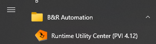
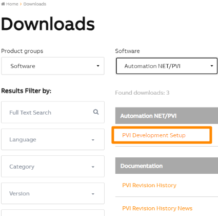
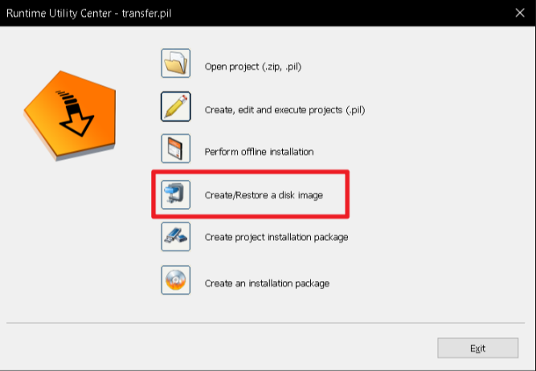
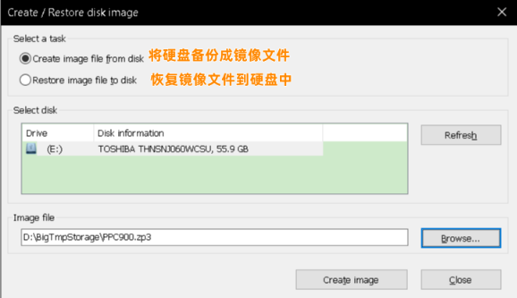
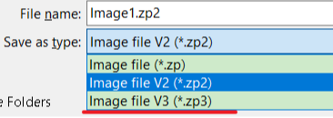

> #硬盘 #备份 #CF卡 #CFast卡 #RUC

- [C07.002-硬盘备份与恢复_使用RUC软件](#_c07002-%E7%A1%AC%E7%9B%98%E5%A4%87%E4%BB%BD%E4%B8%8E%E6%81%A2%E5%A4%8D_%E4%BD%BF%E7%94%A8ruc%E8%BD%AF%E4%BB%B6)
- [1 软件获取](#_1-%E8%BD%AF%E4%BB%B6%E8%8E%B7%E5%8F%96)
- [2 操作使用](#_2-%E6%93%8D%E4%BD%9C%E4%BD%BF%E7%94%A8)
- [3 更新日志](#_3-%E6%9B%B4%E6%96%B0%E6%97%A5%E5%BF%97)

# C07.002-硬盘备份与恢复_使用RUC软件

# 1 软件获取

- 打开Runtime Utility Center软件（电脑上安装Automation Studio时，此软件会被附带安装上），若没有安装此软件，可前往贝加莱官网， www.br-automation.com ，进行下载。
    - 
- [PVI Development Setup | B&R Industrial Automation (br-automation.com)](https://www.br-automation.com/en/downloads/software/automation-netpvi/pvi-development-setup/)
    - 

# 2 操作使用

- 1___ 点击Runtime Utility Center软件，点点击Create/Restore a disk image项。
    - 
- 2___在弹出框中可看到有多个选项，其中Select a task即选择从硬盘中创建镜像，还是使用硬件恢复硬盘数据。Select a disk的作用为刷新中你需要操作的设备。Image file即为镜像名以及相应的路径。
    - 
- 3___在Image file的配置中，可以下拉菜单看到文件存储的类型，有Image file V2与Image file V3，其中若使用V2，则硬盘有多大，就自动会生成一个同大小的硬盘，若使用V3，则会自动压缩，一般为实际硬盘的占用数据，但使用V3的方案耗时会较长，一块60GB的硬盘，可能需要半个小时以上。
    - 
- 4___生成Image file V3的方案，大约耗时40分钟才完成。可看到一块55.9GB的内存，通过ZP3的方式生成，生成出的镜像不到7GB大小。
    - 
    - 

# 3 更新日志

| 日期         | 修改人 | 修改内容 |
| :--------- | :-- | :--- |
| 2023-12-06 | YZY | 初次创建 |
