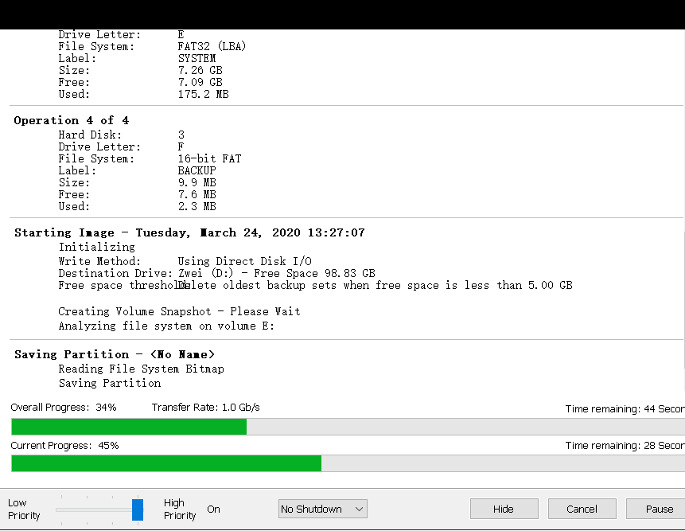

> 003硬盘备份与恢复_使用MacriumReflect软件

> #CFast卡 #Hypervisor #硬盘 #备份

- [1 软件简介](#1%20%E8%BD%AF%E4%BB%B6%E7%AE%80%E4%BB%8B)
- [2 使用软件_备份](#2%20%E4%BD%BF%E7%94%A8%E8%BD%AF%E4%BB%B6_%E5%A4%87%E4%BB%BD)
- [3 使用软件_恢复镜像](#3%20%E4%BD%BF%E7%94%A8%E8%BD%AF%E4%BB%B6_%E6%81%A2%E5%A4%8D%E9%95%9C%E5%83%8F)
- [4 使用U盘_制作U盘启动盘](#4%20%E4%BD%BF%E7%94%A8U%E7%9B%98_%E5%88%B6%E4%BD%9CU%E7%9B%98%E5%90%AF%E5%8A%A8%E7%9B%98)
- [5 使用U盘_恢复镜像](#5%20%E4%BD%BF%E7%94%A8U%E7%9B%98_%E6%81%A2%E5%A4%8D%E9%95%9C%E5%83%8F)
- [6 使用U盘_备份镜像](#6%20%E4%BD%BF%E7%94%A8U%E7%9B%98_%E5%A4%87%E4%BB%BD%E9%95%9C%E5%83%8F)
- [7 常见疑难解答](#7%20%E5%B8%B8%E8%A7%81%E7%96%91%E9%9A%BE%E8%A7%A3%E7%AD%94)
	- [7.1 Custer Run Error. Cluster run short - Error code = 21](#7.1%20Custer%20Run%20Error.%20Cluster%20run%20short%20-%20Error%20code%20=%2021)
	- [7.2 Backup aborted! - Failed To Create Volume Snapshot](#7.2%20Backup%20aborted!%20-%20Failed%20To%20Create%20Volume%20Snapshot)
- [8 更新日志](#8%20%E6%9B%B4%E6%96%B0%E6%97%A5%E5%BF%97)

# 1 软件简介

- 关联对比说明
    - [001硬盘备份与恢复_总览](001硬盘备份与恢复_总览.md)
- Macrium Reflect软件为贝加莱官方推荐使用的一种**固态硬盘**以及**CFast卡**的备份方式。
    - 🔴CF卡与机械硬盘此软件不支持
- 软件下载可前往官网进行下载免费版本Macrium Reflect Free Edition software。
    - [It's our business to protect your data (macrium.com)](https://www.macrium.com/)
- 👍优点
    - 使用Macrium Reflect软件，可通过软件直接对硬盘进行备份与恢复，也可以制作成系统**镜像恢复U盘**，使用U盘直接对设备系统进行备份与恢复。
    - MariumReflect软件支持安装**Hypervisor**方案系统的备份与恢复，支持**Windows**，**Linux**，**ARemb**系统的镜像恢复。
- 目前 2023-12-06 Macrium Reflect软件已更新至V8版本，不过由于网络下载问题，下载不方便，为使用方便，现提供 Macrium Reflect 7 版本的绿色版本，可直接双击使用，无需安装。
    - 下载链接
        - [文件下载链接](https://wwye.lanzouj.com/i2w1D1h1as3g)
        - 密码：5ayf
    - 

# 2 使用软件_备份

- 1. 打开软件，找到备份的选项页
    - 
- 2. 选择需要备份的硬盘，此软件可直接识别出硬盘中的系统，建议全选。点击Image this disk。
    - 
- 3. 在提示框中，输入需要存储的目标存储路径。
    - 
- 4. 按照以下提示框进行点击
    - 
    - 
- 5. 等待一段时间，硬盘备份即会完成。
    - 
- 6. 完成后会提出如下提示。
    - 
- 可发现完整备份耗时1分17秒，同样的设备备份，使用RUC软件需要近40分钟。
- 且存储的数据进行了压缩，使用RUC的zp3格式，55GB的硬盘设备，会生成出6.76GB的镜像文件，而使用Macrium Reflect生成只有3.82GB镜像。
    - 

# 3 使用软件_恢复镜像

- 常见做法有两种
    - A. 在工作笔记上，使用读卡器加载需要备份恢复的硬盘，将镜像文件恢复至硬盘中
    - B. 在需要被镜像恢复的工控机上（Windows系统），运行此软件，加载镜像，恢复至此工控机上
        - ⭐ 很多时候此方式更方便
- 1. 打开软件，选择Restore，选择对应的镜像文件
    - 
- 2. 点击Restore Image后，在弹出框中选择需要镜像恢复的硬件
    - 
- 3. 选择选择目标硬件，进行操作即可

# 4 使用U盘_制作U盘启动盘

- 需求
    - 如果需要多台设备进行镜像恢复，且恢复备份的设备系统为Linux操作系统，推荐制作U盘启动盘
    - 如果设备中的硬盘拿出麻烦，可以考虑使用U盘启动盘的方式直接读取做硬盘备份
- 效果与优势
    - 可对硬盘恢复来自可移动U盘的硬件备份文件。
    - 只需要几个GB的USB3.0的U盘即可，对U盘做完准备后，无需再通过笔记本使用软件进行额外操作。
    - 此过程对CFast中安装的任何操作系统（Windows，Linux或Automation Runtime）均有效。实际上，这可能是还原使用CFast和Automation Runtime的控制器的最简单过程。
    - 无论安装了多少分区，它都有效，因此可以恢复B&R Hypervisor安装。
    - 仅对CFast和SSD存储器有效，但对Compact Flash无效，因为Macrium Reflect无法将Compact Flash或USB记忆棒识别为要克隆的物理介质。
    - 不仅如此，如果我们的计算机上装有两种不同的存储介质，例如两张CFast卡，或者一个SSD硬盘驱动器和一张CFas，这种组合方式都可以进行备份恢复。
- 1. 准备好Macrium Reflect软件。
- 2. 在我们的电脑中插入一个USB存储器，建议使用USB3.0的U盘，除了至少1 GB的可用空间外它必须包含镜像文件的大小，建议U盘大小在8GB以上。
- 3. 格式化USB记忆棒。在Windows资源管理器中执行此操作，右键单击并选择格式化…选择**NTFS**作为文件系统。按开始
    - 
- 4. 在Macrium Reflect中，单击按钮。在图像中以橙色表示
    - 
- 5. 向导打开。选择USB存储器作为目的地，然后按Build按钮。
    - 
- 6. 将会出现一个新窗口要求格式化USB存储器。我们接受等待过程结束，这将持续一分钟。
    - 
- 7. 在不移除USB存储器的情况下，右键单击Windows 10图标并选择磁盘管理。右侧的窗口将打开，我们将在其中将NTFS格式的新分区添加到USB记忆棒中。为此，请右键单击标记为未分配的空间，然后按新建简单卷…。
    - 
- 8. 向导打开。我们在菜单中前进而不更改任何值或选项，直到我们到达右侧所示的菜单。在其中，我们将文件系统更改为**NTFS**，如果需要，我们将名称更改为Volume Label中的分区。完成分区按下一步创建过程。
    - 
- 9. 创建分区后，你只需要打开Windows资源管理器，和手动复制镜像文件到我们刚刚在USB存储器中创建的新分区中。
    - 
- 10. 这时，可恢复操作系统的U盘已准备完成。

# 5 使用U盘_恢复镜像

- 当我们已经准备好了一个USB镜像恢复启动设备，并在盘内放了可恢复的镜像文件，我们按照下面的步骤恢复镜像
- 1. 移除设备的电源
- 2. 确保CFast卡已经被插入到设备中
- 3. 插入USB鼠标与键盘，并插入USB
    - 
- 4. 开机，在启动过程中按以下按钮进入启动项
    - PC900 -> F11
    - PC2100 -> F5
    - PC2200 -> ESC or F2, 选择 Boot Manager option
    - PC3100 -> ESC or F2, 选择 Boot Manager option
- 5. 会看到以下屏幕内容，选择USB的名字。
    - 
- 6. 等待一段时间我们会看到Windows启动画面，并且弹出Macrium Reflect窗口，这提示我们已经正常启动了。
    - 
- 7. 在左侧菜单中，我们选择“Browse for an image or backup file to restore”选项，我们将在具有可移动存储的设备中选择驱动器（D :)。
    - 
- 8. 我们将在USB上看到此处可用的所有分区。选择我们之前创建好的空间，点击进入，在新弹出的窗口中我们选择对应的镜像文件。
    - 
- 9. 从这里开始，源磁盘的分区和出现目标磁盘。右侧是“还原映像”按钮。点击即可。
    - 
- 10. 在下面的弹出窗口中选择对应的选项即可
    - 
- 11. 耗时大约三分钟，硬盘镜像恢复完成。
    - 

# 6 使用U盘_备份镜像

- 1. 如**使用U盘_恢复镜像**章节的操作，将准备好的U盘插入设备中，设备上电后进入启动项选择进入U盘内的操作系统。
- 2. 选择Backup，右侧页面上会自动显示可以备份镜像的设备信息，选择完成后，点击Image this disk…
    - 
- 3. 在弹出框中，选择之前创建好的U盘中的指定路径。
    - 
- 4. 进行需备份镜像文件的命名，点击Finish。
    - 
- 5. 等待一段时间后，即镜像制作完成。等待时间可能较长，此次15GB有效数据的备份与压缩，花了大约20分钟时间。
    - 
- 6. 创建完成后，可浏览已生成的镜像大小，55GB的SSD固态硬件，内有15GB有效数据，能够压缩成5GB数据至U盘中。
    - 

# 7 常见疑难解答

- 使用Macrium Reflect软件进行系统备份，由于会使用到压缩算法，因此会存在一些特殊情况需要解决，以下大致列出可能出现的问题，以及解决思路。

## 7.1 Custer Run Error. Cluster run short - Error code = 21

- **现象**
    - Windows操作系统下，在长时间运行后，可能会出现磁盘上的错误。如果有类似错误，则在备份时会有如下提示：
    - 
- **解决方式**
    - 针对此问题，可在Windows系统下cmd，输入 `chkdsk F :/r` 来解决。（F代指需要磁盘修复的盘符，如果有多个盘符，需要多次输入执行）
    - 在Linux操作系统上也可能出现类似问题，则对应使用 `fsck` 命令。
        - fsck命令被用于检查并且试图修复文件系统中的错误。当文件系统发生错误，可用fsck指令尝试加以修复。

## 7.2 Backup aborted! - Failed To Create Volume Snapshot

- **现象**
    - 在进行镜像时提示如下错误，显示为无法创建虚拟镜像
    - 
    - 此类问题的原因为，当Macrium Reflect操作系统的I/O操作很高并且停顿操作无法将所有数据刷新到磁盘时，会在创建更多I/O时发生此问题。如果尝试在没有可用空间的虚拟机上创建静态快照，也会发生此问题。比如虚拟机上的可用空间为0字节。
- **解决方式**
    - 检查空间情况，是否硬盘已全部占满。
    - 重新再使用软件再备份一次。
    - 如果多次尝试无效，建议换用RUC方案进行尝试。

# 8 更新日志

| 日期     | 修改人     | 修改内容     |
|:-----|:-----|:-----|
| 2023-12-06     | YuanZhiyi     | 初次创建     |
