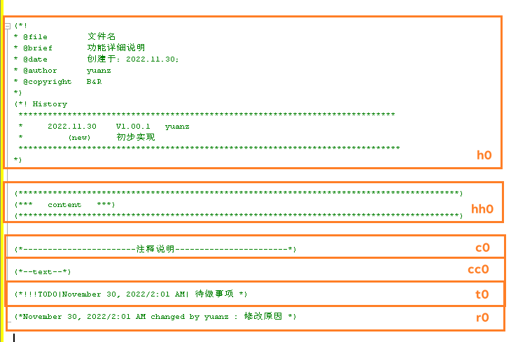
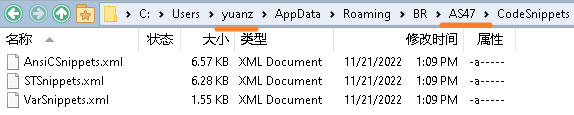
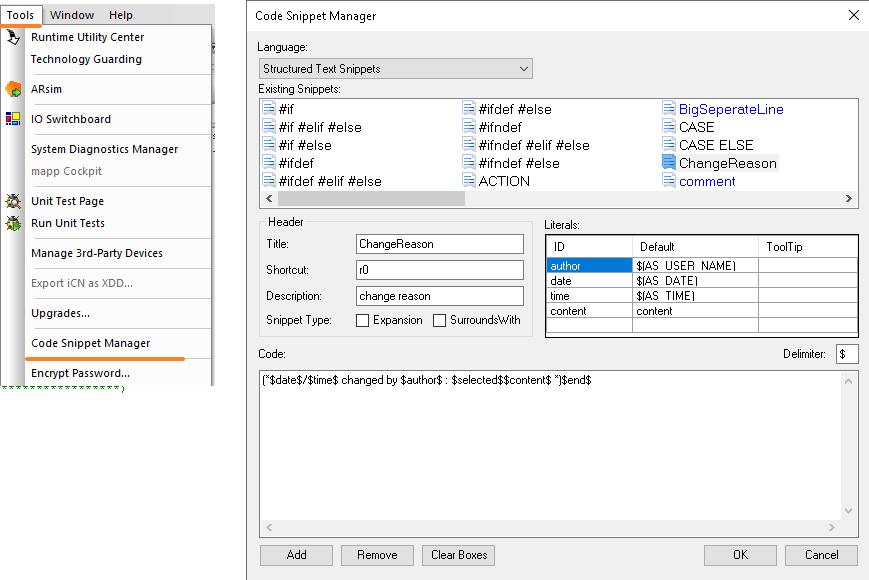

> AS Snippet工具

> Tags: #工具 #AS

- [1 实现效果](#1%20%E5%AE%9E%E7%8E%B0%E6%95%88%E6%9E%9C)
- [2 使用方式举例](#2%20%E4%BD%BF%E7%94%A8%E6%96%B9%E5%BC%8F%E4%B8%BE%E4%BE%8B)
- [3 效果演示](#3%20%E6%95%88%E6%9E%9C%E6%BC%94%E7%A4%BA)
- [4 获取](#4%20%E8%8E%B7%E5%8F%96)
- [5 配置方式](#5%20%E9%85%8D%E7%BD%AE%E6%96%B9%E5%BC%8F)
	- [5.1 在AS中创建与调整自己的Snippet，选择对应的语言，进行创建与修改](#5.1%20%E5%9C%A8AS%E4%B8%AD%E5%88%9B%E5%BB%BA%E4%B8%8E%E8%B0%83%E6%95%B4%E8%87%AA%E5%B7%B1%E7%9A%84Snippet%EF%BC%8C%E9%80%89%E6%8B%A9%E5%AF%B9%E5%BA%94%E7%9A%84%E8%AF%AD%E8%A8%80%EF%BC%8C%E8%BF%9B%E8%A1%8C%E5%88%9B%E5%BB%BA%E4%B8%8E%E4%BF%AE%E6%94%B9)

# 1 实现效果

- 使用Snippet功能，能提升代码开发速度，提升代码整洁度，使得代码有更好的可读性。

# 2 使用方式举例

> 输入缩写信息，按下TAB键
- 

# 3 效果演示

- 

# 4 获取

- [📂CodeSnippets文件，点击下载](/C07_工具/FILES/004AS_Snippet工具/CodeSnippets-2022-11-30.zip ':ignore')

# 5 配置方式

- 配置文件存储路径，通过对文件的复制操作，实现Snippet配置文件的不同电脑，不同AS版本的迁移配置
> `C:\Users\<UserID> \AppData\Roaming\BR\<ASVersion> \CodeSnippets\`

- 

## 5.1 在AS中创建与调整自己的Snippet，选择对应的语言，进行创建与修改

- 
