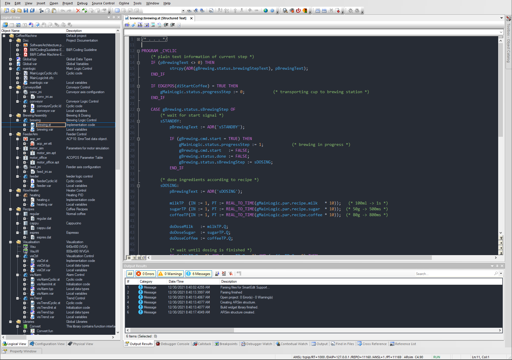
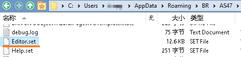

> 005Automation_Studio暗色主题

> Tags: #工具 #AS

> 来源：Github链接 https://github.com/staber/Automation-Studio-One-Dark

- [1 实现效果](#1%20%E5%AE%9E%E7%8E%B0%E6%95%88%E6%9E%9C)
- [2 如何设置](#2%20%E5%A6%82%E4%BD%95%E8%AE%BE%E7%BD%AE)
- [3 下载地址](#3%20%E4%B8%8B%E8%BD%BD%E5%9C%B0%E5%9D%80)

# 1 实现效果

- 通过替换AS项目下.set文件，实现Automation Studio主题色改变。
- 

# 2 如何设置

- 替换位于 `C:\Users\[user]\AppData\Roaming\BR\AS[版本]` 的 `Editor.set` 文件并重新启动Automation Studio。
    - 
- 此文件在AS各版本通用，直接替换即可。为方便切换，可考虑将原始文件改为 Editor.set.bak

# 3 下载地址

- [📁深色主题的配置文件Editor.set，点击下载](/C07_工具/FILES/005Automation_Studio暗色主题/Download/Editor.set ':ignore')
- [📁原始主题的配置文件Editor.set，点击下载](/C07_工具/FILES/005Automation_Studio暗色主题/Download/backup/Editor.set ':ignore')
