> 006BR_AutomationTools_使用VSCode开发编译BR代码

> Tags: #工具 #AS #VSCode

- [1 关联链接](#1%20%E5%85%B3%E8%81%94%E9%93%BE%E6%8E%A5)
- [2 特点说明](#2%20%E7%89%B9%E7%82%B9%E8%AF%B4%E6%98%8E)
- [3 作用范围](#3%20%E4%BD%9C%E7%94%A8%E8%8C%83%E5%9B%B4)
- [4 如何运行扩展插件](#4%20%E5%A6%82%E4%BD%95%E8%BF%90%E8%A1%8C%E6%89%A9%E5%B1%95%E6%8F%92%E4%BB%B6)
	- [4.1 从 VS 代码市场](#4.1%20%E4%BB%8E%20VS%20%E4%BB%A3%E7%A0%81%E5%B8%82%E5%9C%BA)
	- [4.2 从 VSIX 安装程序](#4.2%20%E4%BB%8E%20VSIX%20%E5%AE%89%E8%A3%85%E7%A8%8B%E5%BA%8F)
- [5 功能特点](#5%20%E5%8A%9F%E8%83%BD%E7%89%B9%E7%82%B9)
	- [5.1 C/C++ 程序和库的自动补全](#5.1%20C/C++%20%E7%A8%8B%E5%BA%8F%E5%92%8C%E5%BA%93%E7%9A%84%E8%87%AA%E5%8A%A8%E8%A1%A5%E5%85%A8)
	- [5.2 检测工作区文件夹中的Automation Studio项目](#5.2%20%E6%A3%80%E6%B5%8B%E5%B7%A5%E4%BD%9C%E5%8C%BA%E6%96%87%E4%BB%B6%E5%A4%B9%E4%B8%AD%E7%9A%84Automation%20Studio%E9%A1%B9%E7%9B%AE)
	- [5.3 检测激活的配置](#5.3%20%E6%A3%80%E6%B5%8B%E6%BF%80%E6%B4%BB%E7%9A%84%E9%85%8D%E7%BD%AE)
	- [5.4 编译Automation Studio项目](#5.4%20%E7%BC%96%E8%AF%91Automation%20Studio%E9%A1%B9%E7%9B%AE)
	- [5.5 在源代码中显示Automation Studio编译的错误和警告](#5.5%20%E5%9C%A8%E6%BA%90%E4%BB%A3%E7%A0%81%E4%B8%AD%E6%98%BE%E7%A4%BAAutomation%20Studio%E7%BC%96%E8%AF%91%E7%9A%84%E9%94%99%E8%AF%AF%E5%92%8C%E8%AD%A6%E5%91%8A)
	- [5.6 检测已安装的Automation Studio版本](#5.6%20%E6%A3%80%E6%B5%8B%E5%B7%B2%E5%AE%89%E8%A3%85%E7%9A%84Automation%20Studio%E7%89%88%E6%9C%AC)
	- [5.7 将项目传输至 PLC 或 ArSim](#5.7%20%E5%B0%86%E9%A1%B9%E7%9B%AE%E4%BC%A0%E8%BE%93%E8%87%B3%20PLC%20%E6%88%96%20ArSim)
	- [5.8 检测已安装的贝加莱PVI版本](#5.8%20%E6%A3%80%E6%B5%8B%E5%B7%B2%E5%AE%89%E8%A3%85%E7%9A%84%E8%B4%9D%E5%8A%A0%E8%8E%B1PVI%E7%89%88%E6%9C%AC)
	- [5.9 日志](#5.9%20%E6%97%A5%E5%BF%97)
	- [5.10 用户界面元素](#5.10%20%E7%94%A8%E6%88%B7%E7%95%8C%E9%9D%A2%E5%85%83%E7%B4%A0)
	- [5.11 状态栏](#5.11%20%E7%8A%B6%E6%80%81%E6%A0%8F)
		- [5.11.1 忙指示器](#5.11.1%20%E5%BF%99%E6%8C%87%E7%A4%BA%E5%99%A8)
- [6 要求](#6%20%E8%A6%81%E6%B1%82)
- [7 已知问题](#7%20%E5%B7%B2%E7%9F%A5%E9%97%AE%E9%A2%98)
	- [7.1 不支持 IEC 语言](#7.1%20%E4%B8%8D%E6%94%AF%E6%8C%81%20IEC%20%E8%AF%AD%E8%A8%80)

# 1 关联链接

- VS Code插件市场介绍链接
    - [B&R Automation Tools - Visual Studio Marketplace](https://marketplace.visualstudio.com/items?itemName=radeonmann.vscode-brautomationtools&ssr=false#overview)
- Github上开源链接
    - [br-automation-com/vscode-brautomationtools: Visual Studio Code extension for B&R Automation Studio projects (github.com)](https://github.com/br-automation-com/vscode-brautomationtools)

# 2 特点说明

- 在VS Code软件下开发与编译B&R Automation Studio 项目工具包
- B&R Automation Tools是 [ Visual Studio Code ](https://code.visualstudio.com/) 的扩展，用于编程和构建贝加莱Automation Studio项目。
- B&R Automation Tools扩展不是 [ 贝加莱工业自动化有限公司 ](https://www.br-automation.com/) 的产品，它是一个私人编写的非官方项目。因此，贝加莱工业自动化有限公司不为此扩展提供任何支持。
- 对于任何错误或功能请求，请打开 [ Github问题 ](https://github.com/br-automation-com/vscode-brautomationtools/issues)。

# 3 作用范围

- 此扩展并不打算取代Automation Studio作为贝加莱PLC项目的主要IDE。主要目标是在VS Code中为贝加莱项目提供良好的代码编辑体验。当前的开发重点是 C/C++ 程序和库。
- 贝加莱资源，如可执行的二进制文件等，不在此扩展中提供。仅当系统上安装了相关资源时才可用。

# 4 如何运行扩展插件

## 4.1 从 VS 代码市场

- 可以在 [VS Code 市场中](https://marketplace.visualstudio.com/items?itemName=radeonmann.vscode-brautomationtools)下载扩展。

## 4.2 从 VSIX 安装程序

1. 从其中一个[版本](https://github.com/br-automation-com/vscode-brAutomationTools/releases)下载 VSIX
2. [从 VSIX 文件安装扩展](https://code.visualstudio.com/docs/editor/extension-gallery#_install-from-a-vsix)

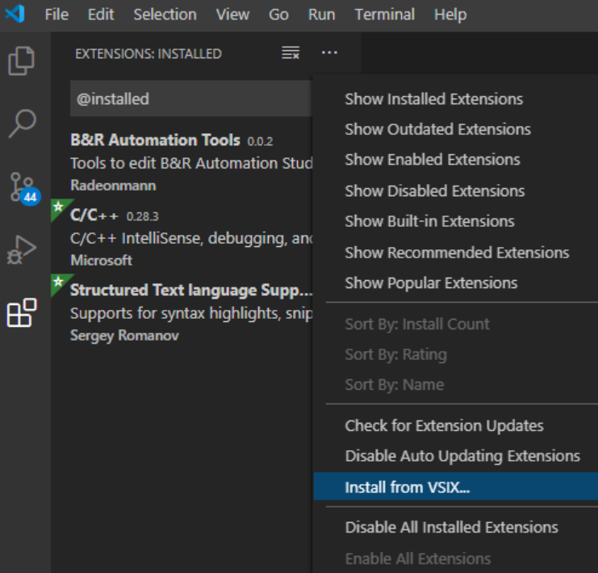

> 不要双击 VSIX 文件，因为它将尝试将扩展安装到完整的 Visual Studio IDE。

如果不想在生产 VS Code 环境中测试扩展，请考虑使用单独的[便携式 VS Code ](https://code.visualstudio.com/docs/editor/portable)。

# 5 功能特点

## 5.1 C/C++ 程序和库的自动补全

- 贝加莱自动化工具扩展为特定于Automation Studio项目的 [ C/C++扩展 ](https://marketplace.visualstudio.com/items?itemName=ms-vscode.cpptools) 提供信息。
- 这使得可以在 C/C++ 程序和Automation Studio项目的库中使用 IntelliSense。还为IEC文件中的变量，类型，函数和功能块（`*.var`，`*.typ`，`*.fun`）提供了IntelliSense。在Automation Studio项目中配置的其他包含和编译器定义也包含在智能感知信息中。
- 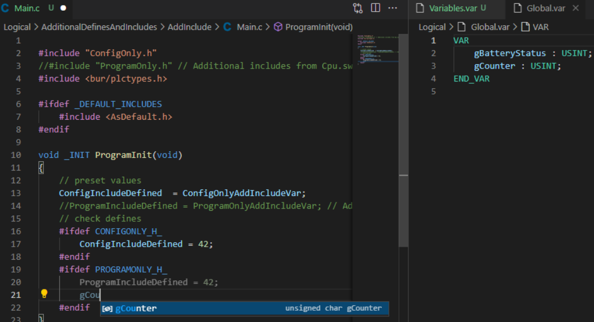
- 目前，扩展使用在Automation Studio项目编译期间创建的头文件来提供此信息。因此，在调整任何 IEC 文件后，您需要编译项目以获得正确的智能感知。交叉引用的生成足以创建头文件。有关更多信息，请参阅[编译Automation Studio项目](https://marketplace.visualstudio.com/items?itemName=radeonmann.vscode-brautomationtools&ssr=false#build-br-automation-studio-projects)。

## 5.2 检测工作区文件夹中的Automation Studio项目

- 所有打开的工作空间文件夹中的所有Automation Studio项目都由B&R Automation Tools扩展程序检测。此信息用于提供其他功能的信息，例如构建、代码完成...
- 在工作区中添加或删除文件夹时，扩展会自动更新信息。

## 5.3 检测激活的配置

- 某些设置（例如附加包含）是特定于配置的。激活的配置是从 AS 项目根目录中的 LastUser.set 文件评估的。 如果在项目根目录中找不到 LastUser.set 文件，则选择第一个配置作为激活的配置。
- 当前没有直接选项将另一个配置设置为活动。但是您可以手动编辑 LastUser.set，扩展程序将检测到更改。
- 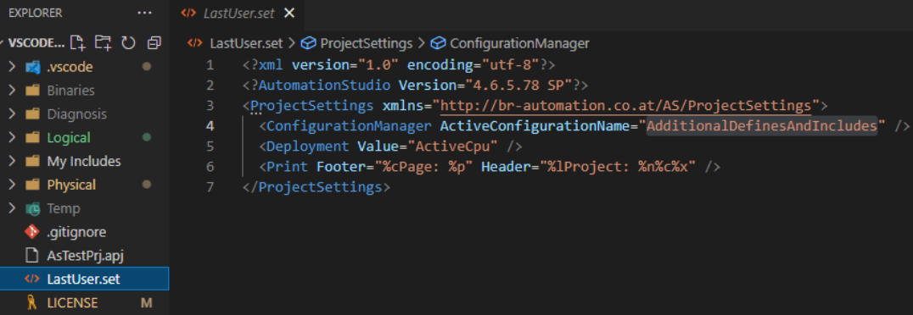

## 5.4 编译Automation Studio项目

> 仅当B&R Automation Tools扩展检测到版本与项目版本匹配的Automation Studio安装时，编译功能才可用。请参阅[检测已安装的Automation Studio版本](https://marketplace.visualstudio.com/items?itemName=radeonmann.vscode-brautomationtools&ssr=false#detecting-installed-br-automation-studio-versions)。

- B&R Automation Tools扩展提供了执行 BR.AS 的任务。生成.exe。这样就可以直接在 VS Code 中生成项目。可以将这些任务配置为正常编译、仿真目标编译、创建 RUC 包、清理配置和构建交叉引用。
- 您可以通过执行菜单中的命令来启动任务。如果要将任务配置为标准生成任务，还可以选择 。`Run Task...``Terminal``Run Build Task...`
    - 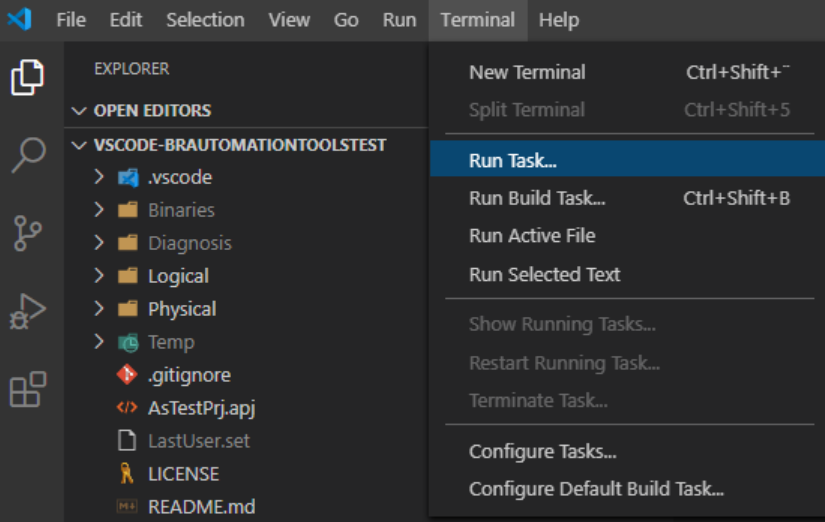
- 然后，VS Code 将显示一个列表，其中包含所有可能的任务提供程序。选择以获取 BR.AS 的所有标准任务的列表。编译.exe。`BrAsBuild`
    - 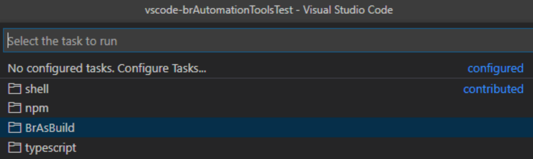
- 然后，B&R Automation Tools扩展将提供所有标准任务的列表。选择一个直接执行它，或单击右侧的齿轮图标在您的工作区中进行配置。
    - 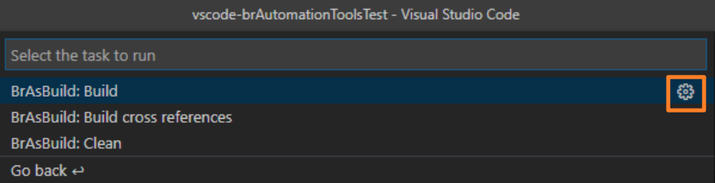
- 配置的任务将添加到工作区根目录下的  **.vscode**文件夹中的 **tasks.json** 中。在那里，您可以为您的任务配置更多选项，例如使用的构建模式。VS Code 将为所有可用选项提供自动完成和说明。

## 5.5 在源代码中显示Automation Studio编译的错误和警告

- B&R Automation Tools扩展显示构建任务的错误和警告输出。错误和警告将显示在“PROBLEMS”窗口、工作区浏览器以及检测到问题的文件的编辑器中。
    - 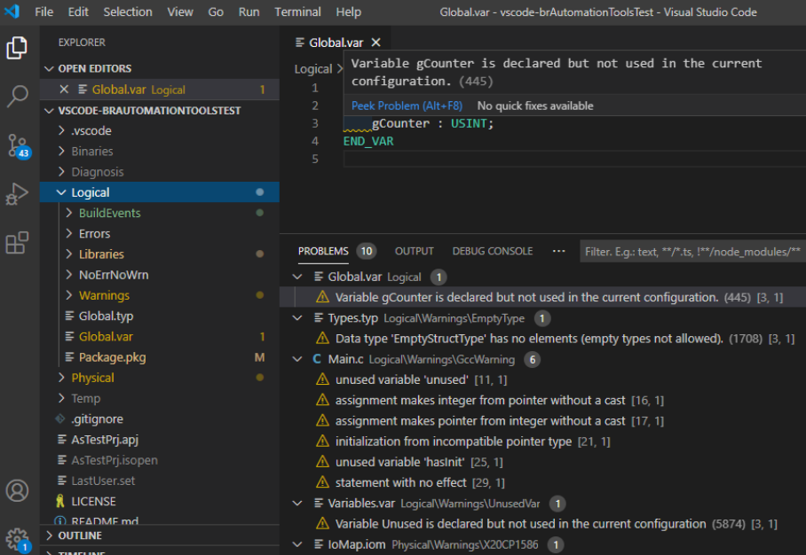

## 5.6 检测已安装的Automation Studio版本

- B&R Automation Tools查找安装在开发人员PC上的Automation Studio版本。已安装的Automation Studio版本的信息用于提供其他功能的信息，例如生成、代码完成...
- 搜索Automation Studio版本的目录必须配置设置 。默认值为 `vscode-brautomationtools.environment.automationStudioInstallPaths``["C:\BrAutomation"]`
- 该设置的值必须与Automation Studio安装期间选择的安装路径的值相同。不执行递归搜索。
- 更改安装路径设置后，可以通过命令面板中的_贝加莱工具：刷新已安装的AS版本信息命令或通过刷新VS Code来刷新已安装的版本。`vscode-brautomationtools.updateAvailableAutomationStudioVersions`

## 5.7 将项目传输至 PLC 或 ArSim

> 传输功能仅在B&R Automation Tools扩展检测到版本与项目版本匹配的PVI安装时才可用。请参阅[检测已安装的贝加莱PVI版本](https://marketplace.visualstudio.com/items?itemName=radeonmann.vscode-brautomationtools&ssr=false#detecting-installed-br-pvi-versions)。

- B&R Automation Tools扩展提供了执行PVITransfer.exe的任务。这使得直接从VS Code将项目转移到PLC或ArSim成为可能。可以使用各种传输设置来配置任务，这些设置通常在Runtime Utility Center或Automation Studio中可用。
- 您可以通过执行菜单中的命令来启动任务。`Run Task...``Terminal`
    - 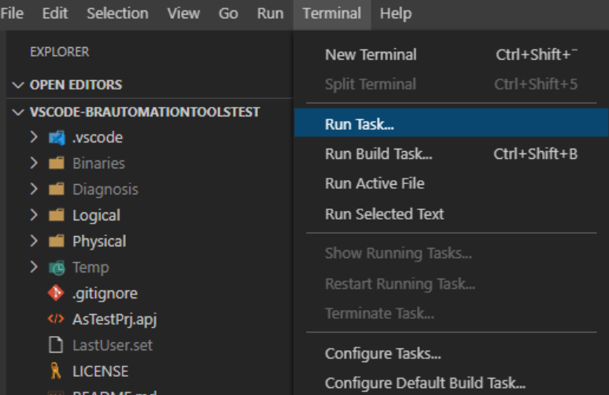
- 然后，VS Code 将显示一个列表，其中包含所有可能的任务提供程序。选择以获取 PVITransfer.exe 的所有标准任务的列表。`BrAsTransfer`
    - 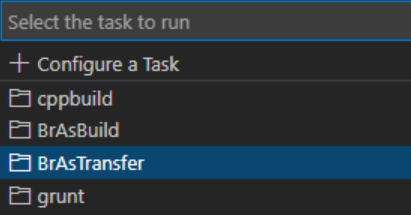
- 然后，B&R Automation Tools扩展将提供所有标准任务的列表。选择一个直接执行它，或单击右侧的齿轮图标在您的工作区中进行配置。
    - 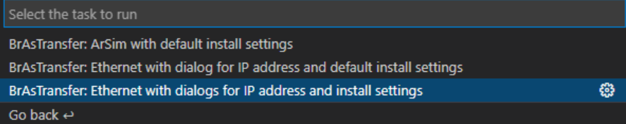
- 配置的任务将添加到工作区根目录下的 **.vscode** 文件夹中的 **tasks.json** 中。在那里，您可以为您的任务配置更多选项，例如使用的传输模式。VS Code 将为所有可用选项提供自动完成和说明。

> 请务必注意，传输任务不会自动触发项目生成。传输任务将使用由相同配置的先前版本生成的 RUC 包。因此，在每次传输之前都需要执行带有该选项的构建。VS Code 提供了一个任务依赖项选项，可用于在传输之前自动执行生成。如果使用对话框选择用于生成和传输的配置，则此对话框将显示两次。`"buildRUCPackage": true`

## 5.8 检测已安装的贝加莱PVI版本

- B&R Automation Tools查找安装在开发人员PC上的PVI版本。已安装的PVI版本的信息用于提供其他功能的信息，例如将项目传输到PLC或ArSim。
- 搜索 PVI 版本的目录必须配置设置，默认值为： `vscode-brautomationtools.environment.pviInstallPaths``["C:\BrAutomation\PVI"]`
- 更改设置后，需要重新加载 VS Code 窗口

## 5.9 日志

- 该扩展记录输出窗口中发生的信息、警告和错误。这可以帮助您作为用户查看某些内容 出错了，也是我们开发人员查找错误的重要信息。
- 选择通道时，您可以在输出窗口中看到所有消息。`vscode-brautomationtools`
    - 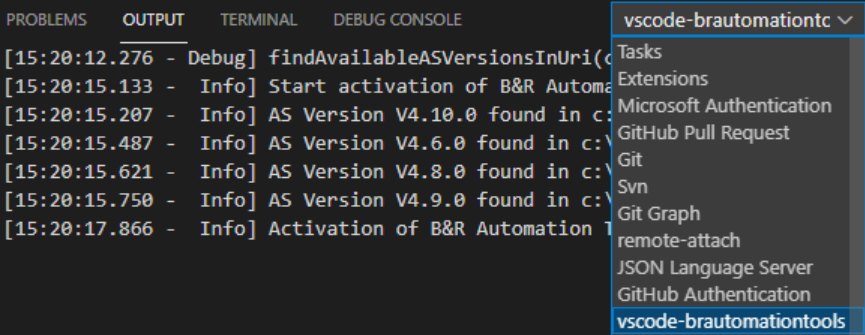
- 某些日志条目包含 JSON 格式的其他数据。使用默认设置时，此数据将打印在同一行的末尾。 这些数据可以很好地打印出来，这使得通过设置为 .但是，这将 使输出更详细，因为多行将用于其他数据。`logging.prettyPrintAdditionalData``true`

## 5.10 用户界面元素

## 5.11 状态栏

### 5.11.1 忙指示器

- 每当扩展忙于运行时间较长的任务（例如分析工作区中的Automation Studio项目）时，都会显示状态栏中的忙碌指示器。使用鼠标指针悬停指示器时，工具提示会显示当前正在执行的任务。
    - 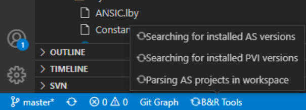

# 6 要求

- 贝加莱自动化工具扩展需要[C/C++扩展](https://marketplace.visualstudio.com/items?itemName=ms-vscode.cpptools)才能自动完成。它将在安装B&R Automation Tools扩展期间自动安装。

# 7 已知问题

## 7.1 不支持 IEC 语言

- B&R Automation Tools扩展目前不支持IEC语言文件的自动完成或语法突出显示。IEC 语言的一些扩展已经存在，您可以将它们与此扩展结合使用。
- 一个例子是Sergey Romanov的 [ 结构化文本语言支持 ](https://marketplace.visualstudio.com/items?itemName=Serhioromano.vscode-st) 扩展。它为 IEC 结构化文本语法提供语法突出显示、代码折叠和片段。
- 要在贝加莱IEC文件（.var，.typ，.fun等）中使用此语法突出显示，您可以将文件扩展名添加到本地或全局设置中的设置中。`files.associations`
    - 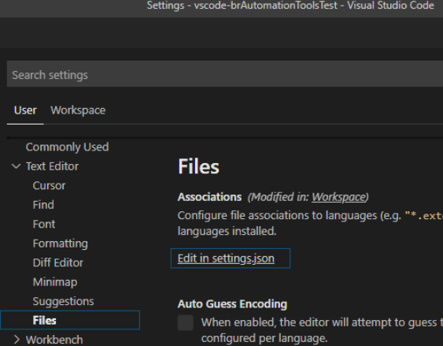
- 中配置的设置可能如下所示：`settings.json`

```json
"files.associations": {
        "*.fun": "st",
        "*.var": "st",
        "*.typ": "st",
        "*.iom": "st",
        "*.vvm": "st",
        "*.per": "st"
    }
```
