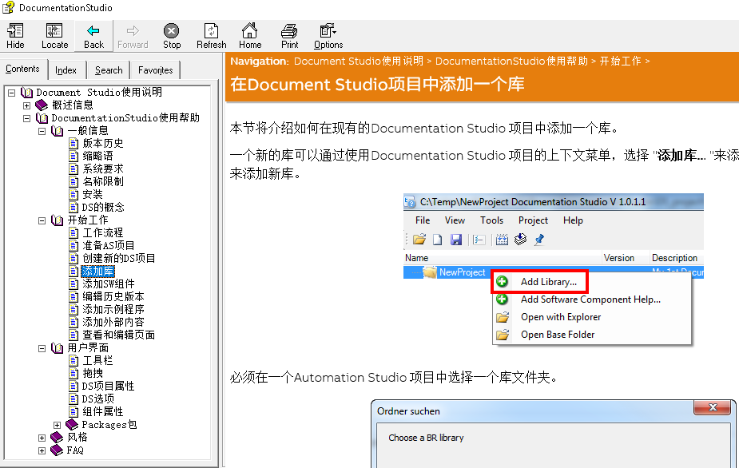

> Tags: #工具 #AS #文档

- [1 C07.007.贝加莱文档自动生成工具Documentation_Studio](#_1-c07007%E8%B4%9D%E5%8A%A0%E8%8E%B1%E6%96%87%E6%A1%A3%E8%87%AA%E5%8A%A8%E7%94%9F%E6%88%90%E5%B7%A5%E5%85%B7documentation_studio)
- [2 介绍](#_2-%E4%BB%8B%E7%BB%8D)
- [3 为什么使用Documentation Studio？](#_3-%E4%B8%BA%E4%BB%80%E4%B9%88%E4%BD%BF%E7%94%A8documentation-studio%EF%BC%9F)
- [4 Documentation Studio 概念](#_4-documentation-studio-%E6%A6%82%E5%BF%B5)
- [5 软件配置](#_5-%E8%BD%AF%E4%BB%B6%E9%85%8D%E7%BD%AE)
- [6 三步创建一个CHM文件](#_6-%E4%B8%89%E6%AD%A5%E5%88%9B%E5%BB%BA%E4%B8%80%E4%B8%AAchm%E6%96%87%E4%BB%B6)
	- [6.1 步骤 1：创建Documentation Studio项目](#_61-%E6%AD%A5%E9%AA%A4-1%EF%BC%9A%E5%88%9B%E5%BB%BAdocumentation-studio%E9%A1%B9%E7%9B%AE)
	- [6.2 步骤 2：从Automation Studio拖拽库至Documentation Studio中](#_62-%E6%AD%A5%E9%AA%A4-2%EF%BC%9A%E4%BB%8Eautomation-studio%E6%8B%96%E6%8B%BD%E5%BA%93%E8%87%B3documentation-studio%E4%B8%AD)
	- [6.3 步骤 3：编译获得CHM文件](#_63-%E6%AD%A5%E9%AA%A4-3%EF%BC%9A%E7%BC%96%E8%AF%91%E8%8E%B7%E5%BE%97chm%E6%96%87%E4%BB%B6)
- [7 自定义帮助文档](#_7-%E8%87%AA%E5%AE%9A%E4%B9%89%E5%B8%AE%E5%8A%A9%E6%96%87%E6%A1%A3)
	- [7.1 包含示例Demo代码](#_71-%E5%8C%85%E5%90%AB%E7%A4%BA%E4%BE%8Bdemo%E4%BB%A3%E7%A0%81)
	- [7.2 修改或添加HTML内容](#_72-%E4%BF%AE%E6%94%B9%E6%88%96%E6%B7%BB%E5%8A%A0html%E5%86%85%E5%AE%B9)
	- [7.3 更改功能块图的颜色与效果](#_73-%E6%9B%B4%E6%94%B9%E5%8A%9F%E8%83%BD%E5%9D%97%E5%9B%BE%E7%9A%84%E9%A2%9C%E8%89%B2%E4%B8%8E%E6%95%88%E6%9E%9C)
		- [7.3.1 效果演示](#_731-%E6%95%88%E6%9E%9C%E6%BC%94%E7%A4%BA)
	- [7.4 风格调整与切换](#_74-%E9%A3%8E%E6%A0%BC%E8%B0%83%E6%95%B4%E4%B8%8E%E5%88%87%E6%8D%A2)
	- [7.5 添加图片](#_75-%E6%B7%BB%E5%8A%A0%E5%9B%BE%E7%89%87)
- [8 Documentation Studio编译的 MpEnergy 库示例](#_8-documentation-studio%E7%BC%96%E8%AF%91%E7%9A%84-mpenergy-%E5%BA%93%E7%A4%BA%E4%BE%8B)
- [9 帮助文件中文版下载](#_9-%E5%B8%AE%E5%8A%A9%E6%96%87%E4%BB%B6%E4%B8%AD%E6%96%87%E7%89%88%E4%B8%8B%E8%BD%BD)
- [10 软件下载链接](#_10-%E8%BD%AF%E4%BB%B6%E4%B8%8B%E8%BD%BD%E9%93%BE%E6%8E%A5)

# 1 C07.007.贝加莱文档自动生成工具Documentation_Studio

# 2 介绍

- Documentation Studio是由 B&R Switzerland 开发的独立工具。它不是 Automation Studio 的一部分，而是一个独立软件，可以让您轻松地为在 Automation Studio 中创建的库编译并自动生成帮助文档。
- Documentation Studio 为您的帮助文档提供专业的外观，其设计主题与我们自己的 Automation Studio 帮助中的设计主题完全相同。
- 它通过从您在 Automation Studio 中创建的库中获取本已存在的描述、变量列表和类型列表来自动编译帮助。它还提供版本历史记录，允许您手动跟踪库文档的不同版本。
- 它自动创建功能/功能框图，其中不同的输入和输出按各自的颜色参数分组，并创建变量和类型表及其描述。
- 

# 3 为什么使用Documentation Studio？

- 通过使用 Documentation Studio，您可以简化项目文档的流程，同时进行软件项目开发（即编写描述与注释）。简而言之，您不再浪费时间尝试手动将项目的所有变量列表、类型列表和描述编译到单独的文档中，因为它会自动将项目中的注释和描述提取并编译的。
- 无需浪费时间尝试创建专业的功能框图，因为它是自动完成的，并且是标准化的，并符合贝加莱美学。
- 在为帮助文档编写特定页面时，会利用模块化的概念。这使您和您的同事在编译最终文档时可以轻松协作，因为只需将它们拖放到位即可。
- 在项目维护后，使帮助文档保持最新从未如此简单，因为帮助文档将直接链接到 Automation Studio 项目。对自定义的库按一下`F1`，自动打开帮助文件。

# 4 Documentation Studio 概念

Microsoft **编译的**HTML 帮助是 Microsoft 专有的在线帮助格式，由 HTML 页面、索引和其他导航工具的集合组成。这些文件以二进制格式压缩和部署，扩展名为 *.chm。

Documentation Studio 支持 **.chm** 文件格式，这在 Windows 系统上的软件文档中很常见。

1. Automation Studio用户帮助将添加到Documentation Studio中。
2. 在Documentation Studio中，其他对象被添加到帮助中，如历史记录，HTML文件等。
3. 用户编译帮助信息。
4. Documentation Studio生成一个XML文件，其中包含库的所有信息。
5. Documentation Studio生成包含当前帮助配置和 XSLT 文件的 HTML 文件。
6. Documentation Studio 使用 Microsoft HTML Help Workshop 生成一个 CHM 文件。**[在此处](https://brtechs.huashengyun.online/index.php?mod=bjl&do=file&gid=19#group&do=file&gid=19&fid=2852)下载**Microsoft HTML Help Workshop
> 为便于跳转，请在下载前先登录[贝加莱知识库 ](https://brtech.huashengyun.online/)
- 
- 

# 5 软件配置

- 

# 6 三步创建一个CHM文件

## 6.1 步骤 1：创建Documentation Studio项目

**确保文件路径与包含库的Automation Studio项目位于同一文件夹中。**

> 建议创建项目的路径即库的文件夹下，便于Documentation Studio项目跟随库传递。
- 

## 6.2 步骤 2：从Automation Studio拖拽库至Documentation Studio中

- 也可以通过文件路径搜索手动添加。
- 

## 6.3 步骤 3：编译获得CHM文件

- 

# 7 自定义帮助文档

## 7.1 包含示例Demo代码

只需将程序从Automation Studio拖放到Documentation Studio即可**包含示例代码**

- 

## 7.2 修改或添加HTML内容

Documentation Studio允许您向帮助文档添加除标准功能/功能块图、变量和类型表以及说明之外的更多内容。

您可以在**帮助文档的任何部分**添加包含通过 HTML 文件编写的文本的**单个页面**。

> 使用markdown编辑器（例如Yank Note）后再转成HTML，会使编辑更加方便。
> 可以考虑使用Base64编码的图片
- 

## 7.3 更改功能块图的颜色与效果

更改功能/功能块图中**输入和输出（**橙色、灰色和白色）的颜色分组。请参阅下面的图片了解如何操作。

> 对于Function/Function Block的引脚输入输出显示，请务必在Description[3] 对应添加相对应参数

- 
- 

### 7.3.1 效果演示

- 

## 7.4 风格调整与切换

- 转到Tool→Options→Default Settings→Library→Select Theme
- 例如：要生成功能/功能块图，您需要选择“**标准库扩展”**作为主题。
- 

## 7.5 添加图片

> 如果想在page中参加图片，可按照如下流程：

- 配置Base文件夹：点击HelpRoot（自己命名的根目录文件夹名称），右侧可以选择使用相对路径还是绝对路径，在‘Base Folder’中配置存放资源的文件夹，默认是：../HelpRoot（自己命名的根目录文件夹名称）/Logical / _ Base。
    - 
- 将需要添加的图片，放置在‘../HelpRoot（自己命名的根目录文件夹名称）/Logical / _ Base'文件夹下，图片文件不要有中文名。
    - 
- 选择需要插入图片的页面，点击“Edit”。
    - 
- 在相关位置，输入< img src="imgName.png"/> 即可，无需要路径，因为已经默认配置了_Base作为查询路径。
    - 

# 8 Documentation Studio编译的 MpEnergy 库示例

- 
- 
- 

# 9 帮助文件中文版下载

- 请点击[此处](https://brtechs.huashengyun.online/index.php?mod=bjl&do=file&gid=19#group&do=file&gid=19&fid=2852)下载
- 

# 10 软件下载链接

- 请点击[此处](https://brtechs.huashengyun.online/index.php?mod=bjl&do=file&gid=19#group&do=file&gid=19&fid=2852)下载
- 
