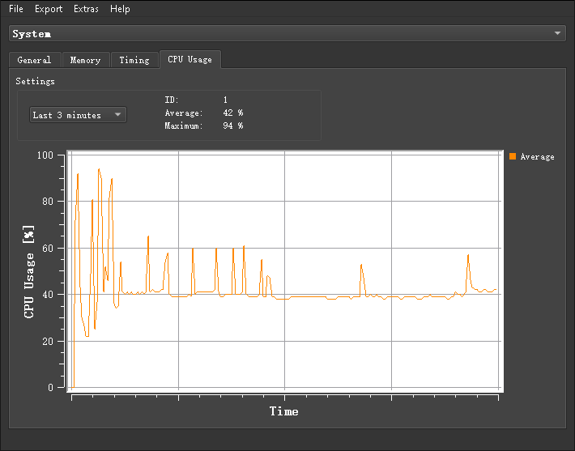

> Tags: #工具 #AS #诊断分析 #SDM

> Github 开源项目： https://github.com/bee-eater/SystemDumpViewer

- [1 使用目的](#1%20%E4%BD%BF%E7%94%A8%E7%9B%AE%E7%9A%84)
- [2 下载链接](#2%20%E4%B8%8B%E8%BD%BD%E9%93%BE%E6%8E%A5)
- [3 现场问题收集方式](#3%20%E7%8E%B0%E5%9C%BA%E9%97%AE%E9%A2%98%E6%94%B6%E9%9B%86%E6%96%B9%E5%BC%8F)
- [4 导出SystemDump分析文件](#4%20%E5%AF%BC%E5%87%BASystemDump%E5%88%86%E6%9E%90%E6%96%87%E4%BB%B6)
	- [4.1 SDM可正常启动](#4.1%20SDM%E5%8F%AF%E6%AD%A3%E5%B8%B8%E5%90%AF%E5%8A%A8)
		- [4.1.1 无法访问SDM的情况下](#4.1.1%20%E6%97%A0%E6%B3%95%E8%AE%BF%E9%97%AESDM%E7%9A%84%E6%83%85%E5%86%B5%E4%B8%8B)
	- [4.2 SystemDump内含文件介绍](#4.2%20SystemDump%E5%86%85%E5%90%AB%E6%96%87%E4%BB%B6%E4%BB%8B%E7%BB%8D)
- [5 SystemDump Viewer使用说明](#5%20SystemDump%20Viewer%E4%BD%BF%E7%94%A8%E8%AF%B4%E6%98%8E)
	- [5.1 SystemDump说明](#5.1%20SystemDump%E8%AF%B4%E6%98%8E)
	- [5.2 读取已下载SystemDump文件](#5.2%20%E8%AF%BB%E5%8F%96%E5%B7%B2%E4%B8%8B%E8%BD%BDSystemDump%E6%96%87%E4%BB%B6)
	- [5.3 直连PLC读取系统信息](#5.3%20%E7%9B%B4%E8%BF%9EPLC%E8%AF%BB%E5%8F%96%E7%B3%BB%E7%BB%9F%E4%BF%A1%E6%81%AF)
- [6 模块信息分析](#6%20%E6%A8%A1%E5%9D%97%E4%BF%A1%E6%81%AF%E5%88%86%E6%9E%90)
	- [6.1 通过SystemDump获取模块序列号及Revision Number](#6.1%20%E9%80%9A%E8%BF%87SystemDump%E8%8E%B7%E5%8F%96%E6%A8%A1%E5%9D%97%E5%BA%8F%E5%88%97%E5%8F%B7%E5%8F%8ARevision%20Number)

# 008SDM数据本地诊断工具
# 1 使用目的

> 相关链接 [003如何收集现场PLC的故障信息](../C04_现场维运/003如何收集现场PLC的故障信息.md)

- 当现场设备反馈有异常，可以通过浏览器 `输入 10.86.13.123/sdm` 了解贝加莱系统的基本信息，便于诊断，可直接导出离线的Sysdump文件以便支持工程师分析。
    - 提升现场问题Debug效率
    - 对设备运行情况进行远程查看与数据备份
- 通过此工具，可以直接加载Sysdump文件，查看设备的拓扑结构、CPU负载、故障信息、硬件信息等等
    - 
    - 
    - 
    - 
    - 

# 2 下载链接

- 2.5.0
    - [贝加莱知识库 (huashengyun.online)](https://brtechs.huashengyun.online/index.php?mod=bjl&do=file&gid=19#group&do=file&gid=19&fid=2851)
- 2.4.4
    - [贝加莱知识库 (huashengyun.online)](https://brtechs.huashengyun.online/index.php?mod=bjl&do=file&gid=19#group&do=file&gid=19&fid=2851)
    - 
    - 点击安装即可
- 2.4.1
    - https://wws.lanzouy.com/i8c8zr8bn3c
    - 密码:dvxz

# 3 现场问题收集方式

- 如果贝加莱控制设备在现场遇到问题，需要收集什么信息，需要反馈什么信息给工程师来定位问题？
    - 现场HMI组态画面中提示的报警信息
    - 硬件模块的状态灯闪烁信息记录（照片/视频）
    - 贝加莱模块的接线情况梳理与记录
    - 贝加莱控制器中的Logger文件
    - 出现问题之前的调整与变化信息记录
    - 出现问题的初步规律
    - 导出贝加莱自带的系统诊断日志（**System Dump**）
- 收集足够的信息并反馈，便能够快速定位问题点，有助于问题尽快解决。
- 其中，贝加莱操作系统自带的SystemDump导出功能是分析问题的关键。后面的章节将围绕System Dump的获取与分析进行介绍。
- 

# 4 导出SystemDump分析文件

## 4.1 SDM可正常启动

- 网页中输入 `PLC IP/sdm` 如 `192.168.100.2/sdm`
- 点击System Dump
    - 
- 点击Parameters-Data-File,点击OK
    - 
    - 
- 点击Upload from target(注意：存储SystemDump文件时，CPU负载很高，建议停机时使用
- 点击完成后，浏览器会自动下载一个.gz压缩包
    - 
- 需要收集信息全在压缩包中，将压缩包反馈给问题处理人员（压缩包中包含Logger，Profile，系统信息）
    - 

### 4.1.1 无法访问SDM的情况下

- 说明：此方案使用前提为系统分区方式为Normal ，如果为Safe模式，则无法访问得到RPSHD文件。
    - 
- FTP访问PLC
- 拷贝 **RPSHD文件夹**
- 将 **RPSHD文件夹** 反馈给技术问题处理人员。
- 反馈信息给项目编写人员，让他们确认操作系统的SDM已正常开启。
    - 
    - 

## 4.2 SystemDump内含文件介绍

- 对tar.gz文件进行解压，获得.tar打包文件，再次解压，获得存储核心文件的文件夹
    - 
- 以下的文件存储了故障分析大量信息，Data Files文件夹则存储了logger，profiler等原始文件，可通过Automation Studio软件直接打开分析
    - 

# 5 SystemDump Viewer使用说明

## 5.1 SystemDump说明

- Sytemdump Viewer用于查看和分析Systemdump.xml文件。systemdump.xml文件是由SDM（System Diagnoistic Manager）生成，记录了SG4控制器的系统、软件、硬件、运动控制的各种信息，以及故障记录本、Profiler等诊断文件。使用Systemdump Viewer工具能够快速获取控制器的systemdump文件并可打包保存，便于故障归档和后续的故障分析。
- 关于SDM的更多信息可参考Automation Help以下章节：
    - 
- 使用要求：
    - Automation Runtime≥V3.08的controller支持SDM。
    - 控制器的SDM功能需打开（AS项目中默认为SDM打开）

## 5.2 读取已下载SystemDump文件

- 打开Systemdump Viewer软件
    - 
    - 
- 找到需要读取的SystemDump文件，直接选中即可。（支持中文路径下的文件）
    - 
- 即可见完整的现场故障信息
    - 
- 点击Dump Info 查看需要信息
    - 
- 可直接看到整个软件的运行情况，以及各种版本版本，PLC的拨码，温度，时间等信息。
    - 
- 可看到CPU的在一段时间范围内的CPU使用率。
    - 
- 可查看PLC控制器实际连接并控制的模块信息与各个模块的IO通道信息
    - 
- 可直接查看Logger信息，并在打开Automation Help的情况下，选择条目，按F1，自动跳转到对应解释条目。
    - 

## 5.3 直连PLC读取系统信息

- 
- 输入可连接的PLC的IP地址
    - 
- 存储读取的System Dump文件
    - 

# 6 模块信息分析

## 6.1 通过SystemDump获取模块序列号及Revision Number

- 点击Dump Info-Hardware或直接点击Hardware进入硬件信息界面
   - 
- 点选对应模块查看序列号及Revision Number
    - 
- 获取模块批次号以及相关信息
   - 拷贝前述模块序列号，至贝加莱官网（<https://www.br-automation.com>）打开搜索栏，并输入该序列号进行搜索。
    - 
    - 
