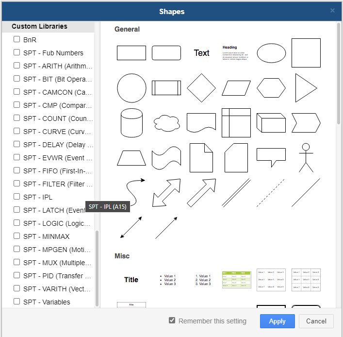

> 轴控SPT绘制模板

> Tags: #工具 #运动控制 #SPT

- [1 Visio模板文件获取](#1%20Visio%E6%A8%A1%E6%9D%BF%E6%96%87%E4%BB%B6%E8%8E%B7%E5%8F%96)
- [2 为什么选择Draw.io](#2%20%E4%B8%BA%E4%BB%80%E4%B9%88%E9%80%89%E6%8B%A9Draw.io)
	- [2.1 Draw.io软件说明](#2.1%20Draw.io%E8%BD%AF%E4%BB%B6%E8%AF%B4%E6%98%8E)
	- [2.2 软件下载地址](#2.2%20%E8%BD%AF%E4%BB%B6%E4%B8%8B%E8%BD%BD%E5%9C%B0%E5%9D%80)
	- [2.3 软件使用方式](#2.3%20%E8%BD%AF%E4%BB%B6%E4%BD%BF%E7%94%A8%E6%96%B9%E5%BC%8F)
	- [2.4 下载链接](#2.4%20%E4%B8%8B%E8%BD%BD%E9%93%BE%E6%8E%A5)
- [3 借助 Draw.IO 生成SPT案例](#3%20%E5%80%9F%E5%8A%A9%20Draw.IO%20%E7%94%9F%E6%88%90SPT%E6%A1%88%E4%BE%8B)

# 1 Visio模板文件获取

- SPT绘制模板的Visio访问链接：[Downloads | B&R Industrial Automation (br-automation.com)](https://www.br-automation.com/en/downloads/#categories=Library+Base-1344987434981/General+Downloads-1581258867315=undefined)
- 需在贝加莱官网上登录后才能从Downloads / Library Base / General Downloads 中下载获取
 - 
- PC知识库下载地址：
    - 文件名：`ACOPOS_V3_00_Visio_Shape.zip`
    - https://brtechs.huashengyun.online/index.php?mod=bjl&do=file&gid=19#group&do=file&gid=19&fid=3108

> Visio为付费软件，因此提供Draw.io版本的文件

# 2 为什么选择Draw.io

- 由于Microsoft Visio是授权版本，不包含在MS Office 365中。
- 所以有必要寻找一种工具来替代Visio，并复制类似的功能。
- 作为替代和寻找免费版本与MS Visio或多或少类似的功能，Draw IO在这种情况下非常适合离线和在线版本。

## 2.1 Draw.io软件说明

与DrawIO相比，MS Visio提供了更多的特性和功能。

- Visio支持宏，用户可以创建可编程的模板和形状。画画。
- DrawIO支持绘图和不同类型的图形等功能，可以以各种格式导出文件，如XML、SVG、PNG格式的图片。DrawIO是开放源代码并提供免费软件版本，目前功能有限;然而，不可否认的是，功能可以随着时间的推移而演变，并将得到改进。

## 2.2 软件下载地址

- 离线版（桌面版）
    - https://github.com/jgraph/drawio-desktop/releases/
- 本地提供下载版本
    - `draw.io-20.3.0-windows-installer.exe`
    - https://brtechs.huashengyun.online/index.php?mod=bjl&do=file&gid=19#group&do=file&gid=19&fid=3108

## 2.3 软件使用方式

由于 Draw.IO 是免费的开源代码，它的源代码可以在 github 上找到。作为个人喜好，我建议选择 windows-no-installer 版本。软件无需安装即可启动，因此也可以称为便携版。与在线版本相比，离线版本提供了更多的功能，作为汇合中的宏；但是，差异是微不足道的，可以忽略不计。

用户可以通过简单的拖放软件一次一个或一个地导入导出的库。

用户可以单击（+ 更多形状...）以添加由贝加莱同事创建的现有库，这些库在自定义库部分下可用。用户可以选择所需的库并单击应用以使其在 Draw.IO 中可用，如下图所示。

## 2.4 下载链接

- 下面链接附加的 zip 文件 `SPT - Offline.zip` 是离线版本的 ACOPOS 反应技术功能块的库。用户可以在解压缩后简单地拖放离线版本。
- https://brtechs.huashengyun.online/index.php?mod=bjl&do=file&gid=19#group&do=file&gid=19&fid=3108

# 3 借助 Draw.IO 生成SPT案例

